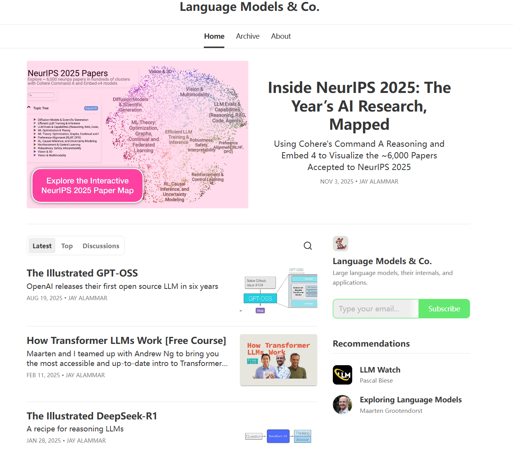

# introduction

记录一些优秀的英文资料，论文另说，暂时主要以博客为主。

# materials

- [Archive | Lil'Log](https://lilianweng.github.io/archives/)

    前 OpenAI 安全系统团队负责人、研究副总裁（安全）

    

- [Jay Alammar – Visualizing machine learning one concept at a time.](https://jalammar.github.io/)

    现在转到如下网站：[Language Models & Co. | Jay Alammar | Substack](https://newsletter.languagemodels.co/)

    主要是有挺多的可视化学习。

    

- [DeepLearning.AI: Start or Advance Your Career in AI](https://www.deeplearning.ai/)

    

    

- [GeekTime](https://time.geekbang.org/)

# GAN

- **基础奠基**：
    - **[GAN by Ian Goodfellow (NIPS 2016 Tutorial)](https://arxiv.org/abs/1701.00160)** - 创造者本人的权威讲解
    - **[The GAN Zoo](https://github.com/hindupuravinash/the-gan-zoo)** - 收集了几乎所有GAN变种的GitHub仓库
- **直观理解**：
    - **[Blog: How do GANs intuitively work?](https://medium.com/@awjuliani/how-do-gans-intuitively-work-2dda07f247a1)** - 可视化理解GAN工作原理
    - **[Blog: GANs from Scratch](https://blog.paperspace.com/implementing-gans-in-tensorflow/)** - 从零实现GAN
- **深度实践**：
    - **[PyTorch GAN Tutorials](https://pytorch.org/tutorials/beginner/dcgan_faces_tutorial.html)** - PyTorch官方DCGAN教程
    - **[TensorFlow GAN Guide](https://www.tensorflow.org/tutorials/generative/dcgan)** - TensorFlow官方实现
- **学术进阶**：
    - **[Review Paper: Generative Adversarial Networks](https://arxiv.org/abs/1406.2661)** - Goodfellow的原始论文
    - **[Blog: NIPS 2016 GAN Tutorial Slides](https://sites.google.com/site/nips2016adversarial/)** - 完整幻灯片材料

额外发现的网站：[Internet’s Essential Technology Categories via HackerNoon](https://hackernoon.com/c)

