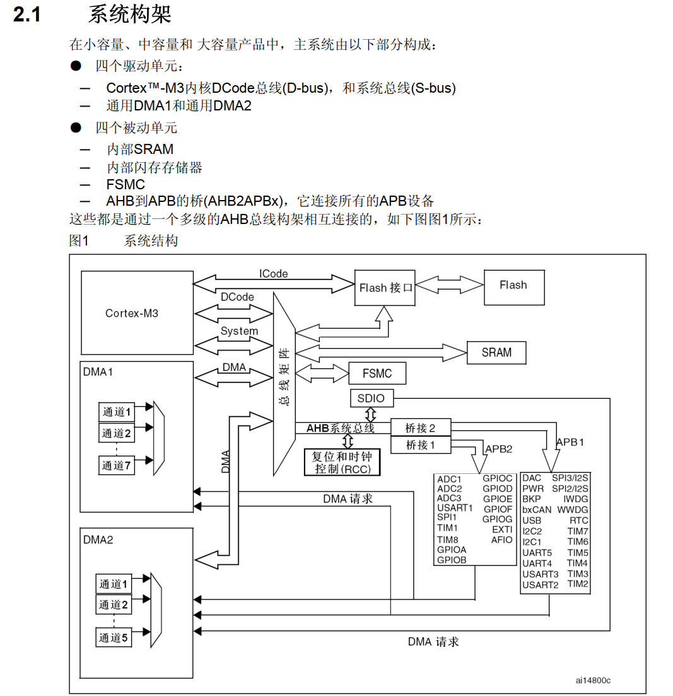
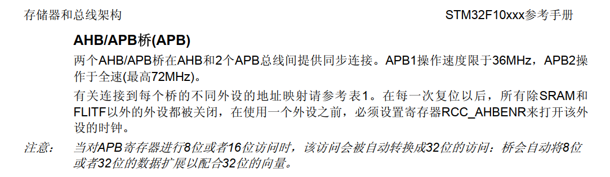

# 关于STM32的时钟配置问题

> 在玩STC15的时候,它在使用的时候并不需要什么时钟配置呀，都是直接IO输出, 这是因为51的外部时钟已经配置好了吗？还是使用的外部时钟呢？现在学习STM32,都要先开启STM32外设模块时钟,再对相关外设进行初始化配置.之后才能像之前一样玩各种外设. 配置这些不同得时钟频率有什么用吗?

- **手册和资料**

> 各类型的芯片由不同的系统架构组成, 但大差不差, 都是由主控总线(驱动单元)+被控总线组成, 这里用STM32f1系列举例
>
> 逆过来思考, 
>
> 要使用各种外设, 就要经过各种总线(APB1, APB2等),
>
> 那又要操作主控总线。
>
> 所以有了大体思路, 之后正向推导.
>
> 通过操作总线矩阵，**可以实现主控总线到被控总线的访问**，再操纵AHB和APB来使用外设.
>
> 之后再查看手册可知  ==使用外设之前,必须要开RCC_AHBENR，也就是要开时钟==
>
> 

> 所以,到此为止也大概清楚了. 就是外设工作的寄存器需要时钟来调控哦,但是为什么寄存器又需要时钟呢?(存疑数电)
>
> 那之后再看看有什么不同的时钟频率用处呢

- **用处**

    - 降低功耗

        > 各个模块的都有独立的外设时钟,不是每一个外设都需要这么高频率的, 都用高速时钟很浪费

    - 兼容不同设备的速度

        > 有些设备高速,有些低速

- **总结: 与51区别**

    说到底,还是为了功耗的问题,需要哪个外设, 就打开哪个时钟, 不用的关闭. 

    不像51, 常固定为12MHz的外部晶振,使用方便确实方便,但是能耗更大, 还是不利于做产品
    
    ==对于时钟, 我理解为它是寄存器的**开关**, 用到哪个寄存器就打开那个开关==

- **补充: 为什么寄存器需要时钟 ,详见：D触发器, 《数电》《MIT 6.004》**

​																																					2023. 07. 27

# 关于RCC时钟的配置顺序问题（存疑？）

    //正确：
    RCC_APB2PeriphClockCmd(RCC_APB2Periph_ADC1, ENABLE);
    RCC_APB2PeriphClockCmd(RCC_APB2Periph_GPIOA, ENABLE);
    
    //错误：
    RCC_APB2PeriphClockCmd(RCC_APB2Periph_GPIOA,ENABLE);
    RCC_APB2PeriphClockCmd(RCC_APB2Periph_ADC1, ENABLE);

> 难道不应该是先配置相关GPIO吗?

先打开了ADC,  即在GPIOA打开总线时钟之前就限制了 GPIO 的某些引脚供应电源. 导致芯片进入硬件失效状态。这是由于在未开启 GPIO 模式的情况下，IO 引脚将处于**==高阻抗状态，输出电平不确定==**，从而可能影响芯片的正常工作

