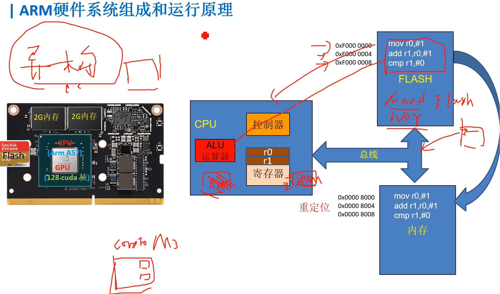
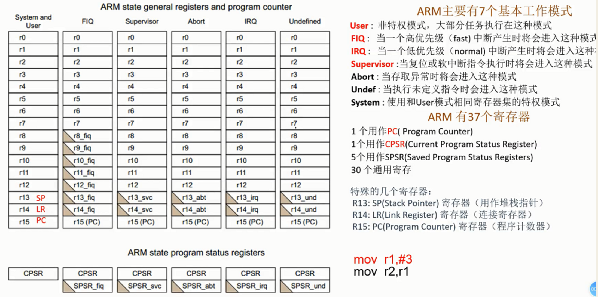
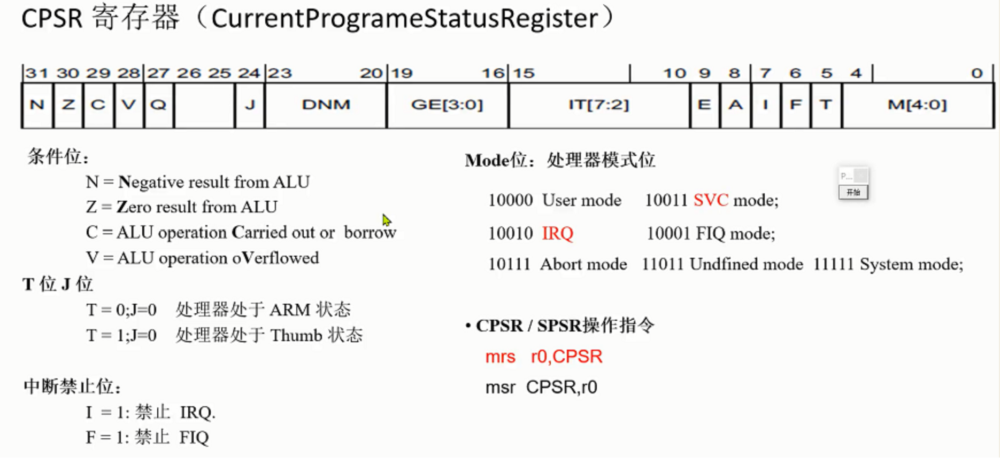
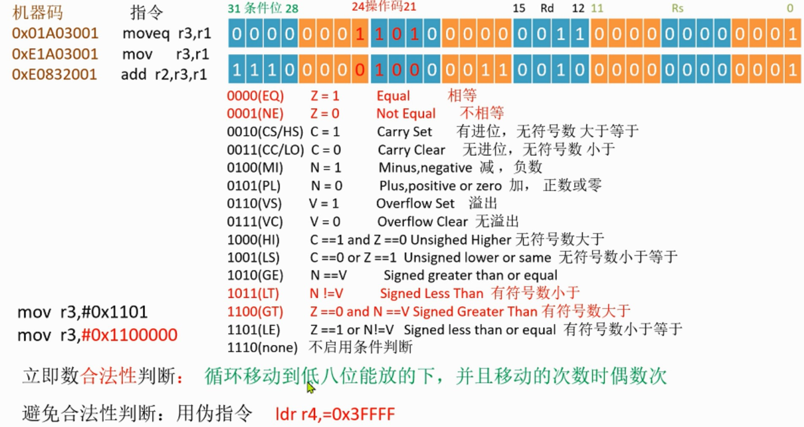
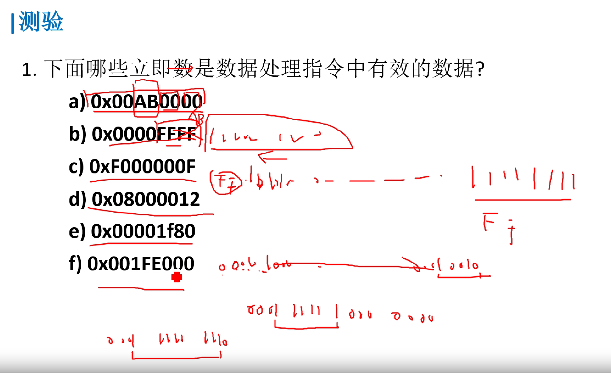
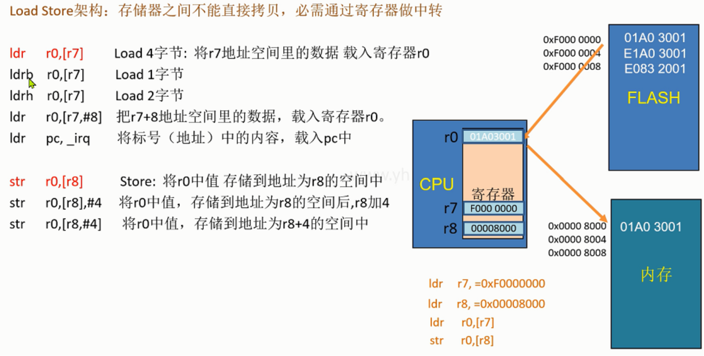
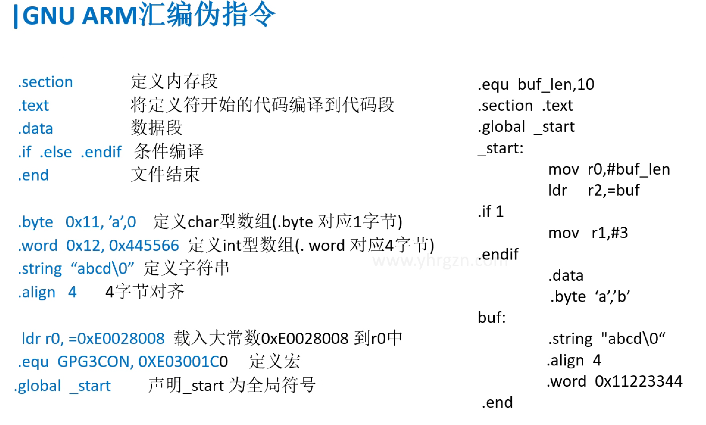
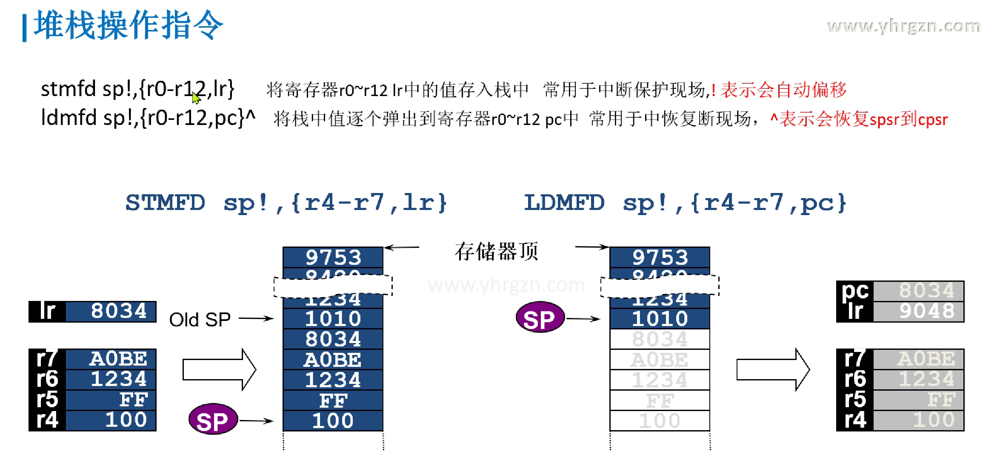
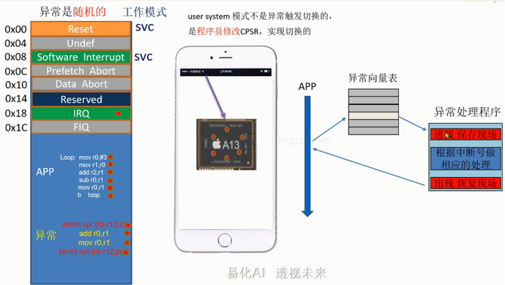

## ARM硬件系统组成和运行原理

> 详见计算机组成原理



> **大概对内存/flash的位置有个大概印象, 知道指令取自哪里, 谁执行...**
>
> **异构计算: 对于这些部件( flash 内存... )放在哪里? 现代的芯片架构为了提高性能做了哪些架构的提升?**


## 工作模式及寄存器框图

#### 框图



小三角: 表示该模式下独有的寄存器

其余的寄存器都是共享的, 共享的值...


#### CPSR寄存器

> 目前程序状态寄存器: 表示处理器的各个状态/模式



**重点知识点**


1. 7种模式。重点掌握 User模式、FIQ、IRQ、supervisor（SVC）模式

2. 37个寄存器

3. 程序计数器（PC） LR（连接寄存器：返回地址）

4. 堆栈指针

5. User模式最少，其他的异常模式都多了一个SPSR_xx寄存器，用作保存各种状态

6. ARM指令集是一种32位的指令集，每条指令都是32位长，可以实现高性能计算和处理。ARM指令集的特点是指令集丰富，操作灵活，适合处理复杂的计算任务。

    （**比较少用**）Thumb指令集是ARM处理器的一种压缩指令集，每条指令只有16位长，可以减小程序的存储空间和提高程序的执行速度。Thumb指令集的特点是指令集简单，执行速度快，适合处理简单的计算任务。
    
7. 0到4位


## 汇编指令初级

#### 转移指令


#### 指令的存储和解析


#### 指令机器码



- 立即数合法性

    ```assembly
    mov r3, #0x1101  
    // (报错) 源操作数只有12位 为了表示更大的数怎么办
    mov r3, #0x1100000
    // (不报错) 
    ```

    0000 0001 0001

    前4位表示移位值

    > **学习这个立即数合法性的目的**: 理解即可, 编程的话还是用伪指令
    >
    > 知道存储在flash中汇编指令是二进制的, 而这些指令也是像数据一样是二进制的. 
    >
    > 汇编指令中的各种模式/立即数/源寄存器/目的寄存器使用几位几位的二进制数来表示, 
    >
    > 又因为ARM的32位的指令表示的范围有限, 所以对于源寄存器只分配到了12位的空间, 那怎么用十二位的空间表示32位数呢? 就是像上面的操作了, 3个字节 前1一个字节表示移位值(0-15的偶数值),后两个字节表示 实际数字 (当然表示的数字也是有局限的,但也是扩大了可表示的范围)
    >
    > **另外**: 北大《计算机组成》中的MIPS指令集的I型指令为了表示32位立即数的办法：如下图MIPS中扩展成32位数: 
    >
    > 课程原话: 
    >
    > 从条件分支指令的格式可以看出，目标地址只能使用16位的位移量，这是一个很大的局限，但是我们还得考虑如何充分发挥这16位的作用。
    >
    > 如果以当前的PC寄存器为基准，在MIPS中，指向下一条指令地址的寄存器称为PC，类似于X86中的IP寄存器。
    >
    > PC这个寄存器，是指向32位地址的，如果以它为基准，16位位移量可以表示出当前指令前后2的15次方字节这么一个范围。
    >
    > 但是我们要注意一点，**MIPS的指令长度固定位32个比特，因此每条指令的位置，一定会在四个字节对齐的地方，这样地址最低两位肯定为0。**所以我们实际上可以用十六位的位移量去指示每四个字节为一个单位的地址，这样就可以把目标地址的范围扩大四倍，可以达到前后128KB。

- 使用伪指令: 表示很大的数避免合法性判断**: ldr r3,=0x3ffff**



```
a√  b×  c√  d  e√  f×   
```


 

#### 跳转指令

```assembly
b    main      跳转到标号为main地代码处 (只能短跳转32M) 

bl   func      跳转函数func,并保存下一条要执行的指令的位置到 lr寄存器,
               当跳转代码结束后,用mor pc,lr指令跳回来

beq  addr     相等时，跳转到地址addr处
                          相等（指CPSR寄存器中的Z条件码置位时)

bne  addr     不等时，跳转到地址addr
```

- 用 汇编 实现C语言功能

```C
void main(void)
{
    int ret=0;
    ret=func1(2);   
    while(1){}	
}	
int  func1(int a)
{
    if(a==2)
        return func2(a);
    else
        return func3(a);  
}
int  func2(int a) 
{    
    return a+3;
} 
int func3(int a)
{    
    return a-1;
} 
```

```assembly
 @示例代码
 .text
 b   main  @eset 
 nop
 NOP
 nop
 nop
 nop
 nop
 nop
main: 
  mov r2,#0  @r2 ~ ret
  mov  r0,#2
  bl   func1
main_end:
  b   main_end
		
		
func1:		
  mov  r12,lr  @注意函数嵌套调用 会覆盖LR寄存器
  cmp  r0,#2
  bleq func2
  blne func3
func1_end:
  mov  pc,r12 
	
func2:
  add  r0,#3
func2_end:
  mov  pc,lr 

func3:
  sub  r0,#1
func3_end:
  mov  pc,lr

  .end
```


#### 逻辑指令

```assembly
and    r0,r1,r2       
and    r0,r1,#0xFF    与

orr    r0,r1,r2
orr    r0,r1,#0xFF    或

bic    r0,r0,#0x0B    清除r0中的位 0、1、和 3  
tst    r0,#0x20       测试第6位是否为0 ，为0则Z标志置1 
cmp    r1,r0          将寄存器R1的值与寄存器R0的值相减，
                      并根据结果设置CPSR的标志位
```

> 测试: 1.判断当前工作状态是否是ARM状态，是则切换到user 工作模式？ 2.使能中断和快速中断？	

```assembly
@ 示例代码
.text
 b   main  @eset 
 nop
 NOP
 nop
 nop
 nop
 nop
 nop
main: 
 /* mov  r1,#0x03  @ 0000 0011
  mov  r2,#0x0e  @ 0000 1110
  orr  r0,r1,r2
  
  mov  r1,#0x42
  and  r1,#0xf0  
  
  mov  r0,#0xff  @1111 0100 
  bic  r0,#0x0b  @0000 1011
  mov  r0,#0x56  @0101 0110
  tst  r0,#0x20  @0010 0000
  
  mov r0,#4
  cmp r0,#4
  */
  /*
  mrs r0,cpsr
  tst r0,#0x20
  bic r0,#0x1f
  orr r0,#0x10  @switch user
  msreq cpsr,r0
  */
  mrs r0,cpsr
  bic r0,#0xc0
  msr cpsr,r0
  
  
main_end:
  b   main_end
  .end	
```


#### 算术指令

```assembly
add     r0,r1,r2       默认是不影响CPSR的标志位的
add     r0,#1

sub     r0,r1,#3      类似  r0= r1 - 3
sub     r0,#1

sub     r0,r1,r2,LSL#1     
```


- **延时1s**

```assembly
delay1s:	
    ldr	 r4,=0x3FFFF
loop_delay1s:
    sub     r4,r4,#1
    cmp     r4,#0          
    bne     loop_delay1s
    mov    pc,lr
```

```assembly
 @示例代码
 .text
 b   main  @eset 
 nop
 NOP
 nop
 nop
 nop
 nop
 nop
main: 
  /*mov r1,#1
  mov r2,#2
  add r0,r1,r2
  
  add r0,#1
  
  mov r1,#3
  mov r2,#1
  sub r0,r1,r2,lsl#1
  */
  mov r0,#1
  bl  delay_1s
  mov r1,#2 
main_end:
  b   main_end
  
  
delay_1s:
  @mov  r4,#0xfffff
  ldr  r4,=0x1fffff
delay_loop:  
  cmp  r4,#0
  beq  delay_1s_end
  subne r4,#1
  b   delay_loop
delay_1s_end:
  mov pc,lr
  
  
  .end	
```


- **最大公约数**

```C
int GCD(int a,int b)
{	 	  
	while(1)
	{
		if(a==b)
			break; 	
		if(a>b){
			a=a-b;
		}else{
		  b=b-a;  	
		}	
	} 		
	return a;	 	   
} 	
```

```assembly
 .text
 b   main  @eset 
 nop
 NOP
 nop
 nop
 nop
 nop
 nop
main: 
  mov r0,#9
  mov r1,#15
  bl  gcd
main_end:
  b   main_end
  
gcd:
gcd_loop:
  cmp  r0,r1
  beq  gcd_end
  subgt  r0,r1
  sublt  r1,r0
  b   gcd_loop

gcd_end:
  mov pc,lr
  
  .end	
```


## 汇编指令高级

#### Load/Store架构



- **前索引/后索引**

    **有点类似i++和++i**

    前索引: 地址先加, 再赋值(++i), **但是不改变原来的r8里面的内容**

    ```assembly
    str r0,[r8,#8]     
    ```

    后索引: 地址先赋值, 再加, **赋值之后, 将r8加8 **     (常用于循环拷贝)

    ```assembly
    str r0,[r8],#8   @i++
    ```


- **汇编实现数据拷贝**

    ```C
    //用汇编实现C内容
    main()
    {
        int i=0;
        const  char buf[]={1,2,3};
        char destBuf[8];
        for(i=0,i<3,i++)
        {
            destBuf[i] = buf[i];
        }
    }
    ```

    ```assembly
        .text
        b   main  
        nop
        nop
        nop
        nop
        nop
        nop
        nop
    main: 
             mov r4,#0
        ldr r7,=buf
        ldr r8,=destBuf
    loop:
            cmp  r4,#3
        beq  main_end
    
        ldrb  r0,[r7],#1
        strb  r0,[r8],#1
    
        add r4,#1
        b  loop
    
    main_end:
        b  main_end
    
    buf:
        .byte 1,2,3
    
        .data
    
    destBuf:
        .space 8
    
        .end
    ```


#### GNU汇编伪指令

> 让编译器去解释的 



```assembly
.section               //定义内存段
.text                  //将定义符开始的代码编译到代码段
.data                  //数据段
.if  .else  .endif     //条件编译
.end                   //文件结束
                   
.byte   0x11, ’a’,0    //定义char型数组(.byte 对应1字节)
.word  0x12, 0x445566  //定义int型数组(. word 对应4字节)
.quad  0x3FA0          //分配8字节的空间(.quad 对应8字节)
.string  “abcd\0”      //定义字符串
.align   4             //2^4 =16 字节对齐

 ldr r0, =0xE0028008   //载入大常数0xE0028008 到r0中
.equ  GPG3CON, 0XE03001C0     //定义宏
.global  _start         //声明_start 为全局符号
```


#### 批量操作指令


```assembly
   ldr 	  r12,=srcBuf
   ldr 	  r13,=dstBuf
   ldmia  r12!,{r0 - r11}
   stmia  r13!,{r0 - r11}

  .data
srcBuf:
  .string "abcdefghijkomnopqrstubwxyz\0"
dstBuf:
   .space  12*4

```


#### 堆栈操作指令




#### 异常处理（重要理解）

- **异常和中断**

    > 中断和异常是有关联的，它们都是计算机系统中处理外部事件和异常情况的机制。可以说中断和异常是包含关系，因为异常是中断的一种特殊情况。在处理器的设计中，通常会使用一个统一的中断/异常处理机制来处理中断和异常。因此，中断和异常可以说是并列存在的。
    
    **中断是由外部设备或其他处理器触发的，而异常是由程序执行中的错误或不正常情况引起的。通过一些代码例子和实际情况来说明这些概念。**

    1. 中断的例子：
    假设有一个外部设备，比如一个**定时器**，当定时器计时结束时，它可以向处理器发送中断请求，以通知处理器进行相应的处理。下面是一个简单的伪代码例子：
    
    ```c
    // 外部设备中断处理程序
    void externalInterruptHandler() {
        // 处理外部设备中断
    }
    
    // 主程序
    int main() {
        // 初始化外部设备中断
        initExternalInterrupt(externalInterruptHandler);
        
        while (1) {
            // 执行主程序
        }
    }
    ```
    
    在这个例子中，当外部设备的中断请求被触发时，处理器会跳转到外部设备中断处理程序进行处理。

    2. 异常的例子：
    **异常通常是由程序执行中的错误或不正常情况引起的**，比如除零错误、内存访问越界等。下面是一个简单的伪代码例子：
    
    ```c
    // 可能引发异常的代码
    int divide(int a, int b) {
        if (b == 0) {
            // 除零错误，触发异常
            raiseException(DIVIDE_BY_ZERO_EXCEPTION);
        }
        return a / b;
    }
    
    // 主程序
    int main() {
        int result;
        try {
            result = divide(10, 0);
        } catch (Exception e) {
            // 处理异常
        }
        // 继续执行其他代码
    }
    ```
    
    在这个例子中，当除零错误发生时，会触发异常，并且处理器会跳转到异常处理程序进行处理。

    


- **异常向量表**

> 中断向量表是一个存储中断处理程序入口地址的表



为什么需要异常向量表呢？让我们回顾一下整个分析流程

1. 因为异常是随机产生，在程序运行的时候，我们不知道在什么时候会有异常，再加上有各种各样的异常，故我们编写汇编代码的时候，无法知道在哪里直接写一条b指令跳转到对应的异常服务函数。
2. 针对这个问题，我们分成硬件和软件两部分解决。
3. 首先，判断是什么异常的操作，由硬件电路来实现，这里不展开说。其次，知道了是什么异常，那我们要执行什么操作应对异常呢？也就是异常服务函数在哪里的问题。
4. 那我们就需要一个地方来存放异常服务函数的地址，以便异常来的时候，能知道去哪里执行对应的服务函数。
5. 通过硬件判断出属于哪种异常之后，知道异常号（索引），在异常向量表里面找到对应的异常服务函数地址。之后载入PC，执行服务函数，返回被打断的函数


- **软中断最简**

    > **作为最基本的框架分析其他的异常/中断**

    ```assembly
    	.text
    	@---------vector table
    	b   main  	@0x00 reset
    	nop       	@0x04 undef         
    	b sirq_hander	@0x08 soft irq
    	nop       	@0x0c prefecth abort
    	nop	      	@0x10 data abort
    	nop		@0x14 reserved
    	nop		@0x18 irq
    	nop		@0x1C fiq
    	
    	@ handler vector table
    sirq_hander:                
            stmfd sp!,{r0-r12,lr}    @保存现场
            add  r2,#1
    sirq_hander_end:
    	ldmfd sp!,{r0-r12,pc}        @LR返回地址的值要给PC,不然无法返回地址
    	
            @----------app----
    main: 
        ldr sp,=stack_buf            @定义栈空间,使堆栈指针指向栈底,为了函数要 
    	mov r1,#1
    	mov r2,#2
    	swi 0x1   
    	cmp r2,#2
    	moveq r4,#4
    	movne r4,#6
    main_end:
    	b  main_end
         
    	.data
    
            .space 15*4
    stack_buf:              @标号写在下面,因为ARM的栈是向下生长的,
     
    	.end
    ```
    
    


- 软中断完整

```assembly
	.text
	@---------vector table
	b   main  	@0x00 reset
	nop       	@0x04 undef         
	ldr pc,_sirq_hander	@0x08 soft irq  @这一步操作的目的,为了扩大跳转地址为32M,可						能就是异常服务函数放在内存中很远的地方
	nop       	@0x0c prefecth abort
	nop	      	@0x10 data abort
	nop		 @0x14 reserved
	nop		 @0x18 irq
	nop		 @0x1C fiq
	
_sirq_hander:
	.word  sirq_hander
	
	@ handler vector table
sirq_hander:
    stmfd sp!,{r0-r12,lr}
	ldr r0,[lr,#-4]          @获取LR的内容,(LR存着返回地址,LR-4就获得了对应swi指令								的地址,再由[]取出地址的内容,就是swi指令,由下图swi指令							 的机器码可知,软中断号就在机器码中,这样就可以完整地处理多							   个软中断了)
	bic r0,#0xff000000       @清除最高两位,由指令的机器码可知,立即数最多就前6个字节
	cmp r0,#1                @1号软中断
	addeq  r2,#1
	cmp r0,#2                @2号软中断
	subeq  r2,#1  

sirq_hander_end:
	ldmfd sp!,{r0-r12,pc}
    @----------app----
main: 
    ldr sp,=stack_buf
    mov r1,#1
    mov r2,#2                @LR-4
    swi 0x1                  @LR
    cmp r2,#2
    moveq r4,#4
    movne r4,#6
    swi 0x2
    mov r0,#3	
main_end:
    b  main_end
     

	.data

    .space 15*4
stack_buf:

	.end
```

> 大致内容同 "软中断最简"


> **补充上面的ARMv7系列 Cortex-A5\A7\A8\A9的u-boot的具体格式: **
>
> 


## ARM汇编的源头

> 上面简单介绍 
>
> 更多深入的、别的指令...详见ARM官方文档
>
> ```C
> ARM Cortex-A 系列 ARMv7-A 程序员指南 
> // https://developer.arm.com/documentation/den0013/d	
> Armv7 和更早的 Arm 架构参考指南的指令集汇编指南 //https://developer.arm.com/documentation/100076/0200/a32-t32-instruction-set-reference/a32-and-t32-instructions	
> 基本汇编语言程序设计 
> //https://developer.arm.com/documentation/dui0040/d/Basic-Assembly-Language-Programming	 
> ```

**目的: 构建知识地图 知道哪里能找各种资料** 

1. 官网

2. B站/YouTube

    ......


