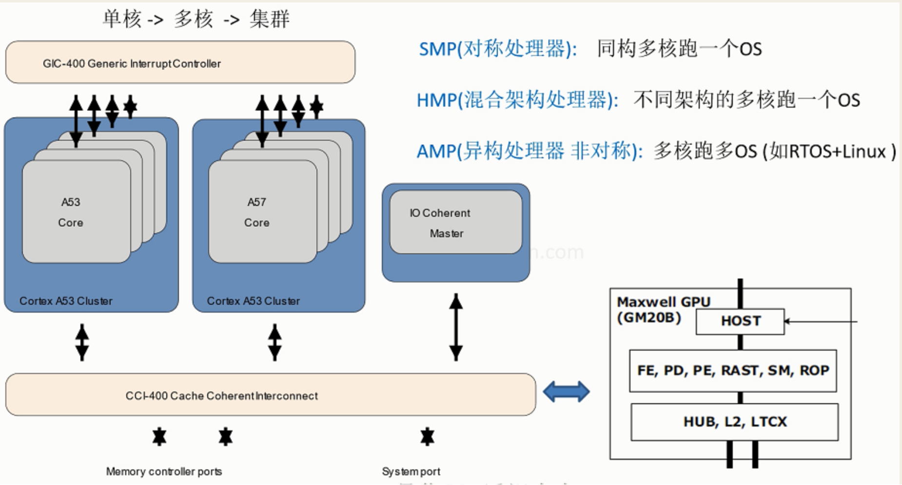
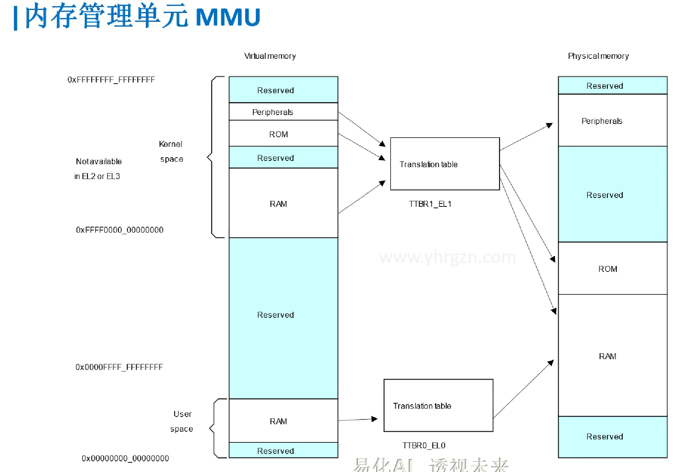
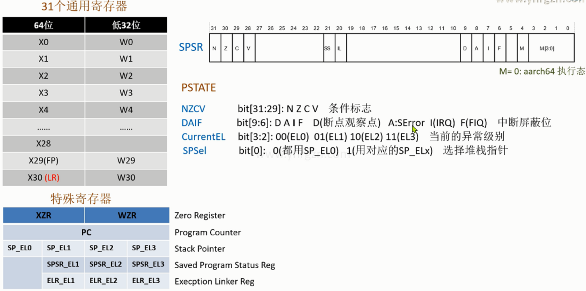
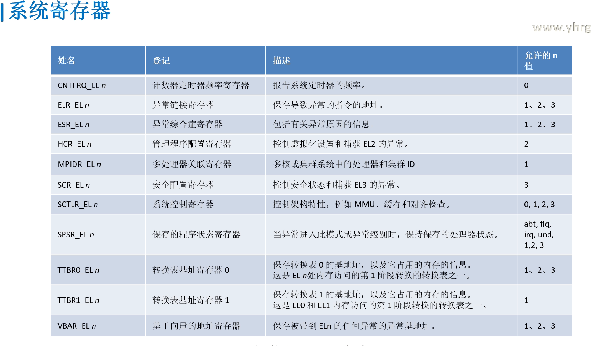
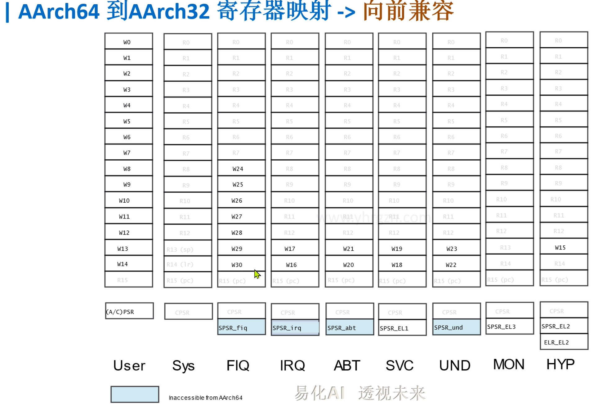

## 前言

> 为什么要推出64位汇编?

#### 三大原因

1. **应对大内存** 

    > 大内存(Large Memory): 突破32位机的4G空间限制  -> 硬件越来越强，软件越来越复杂 

2. **虚拟化**

    > 虚拟化(Virtualization): 隔离 高效  -> 虚拟机  

3. **安全**

    > 安全(Security):  物理隔离/硬件隔离  -> 交易支付，隐私数据安全

#### ARM64位的创新

1. **执行状态**

    > - AArch64 和 AArch32 两种可切换
    >     - AArch64: 新增A64(ARM 64bit)指令集 -> 大内存(突破4G限制)
    >     - AArch32: 可用以前A32(ARM 32bit)指令集和 T32(Thumb 32bit)指令集 -> 向前兼容

2. **异常级别**

    > EL0(应用) < EL1(OS) < EL2(虚拟化) < EL3(安全固件) -> **替代啰嗦的工作模式**(User、SVC...)

3. **安全模式**

    > 分为正常世界 和 安全世界  -> 真正的安全(物理隔离,如支付场景)  

 


## 多核处理器




通用的CPU+特定领域的芯片（GPU/NPU/TPU/DSP...）

如何协调多核的通信....


## 内存管理单元MMU




## ARMv8 寄存器框图




- 通用寄存器

    ```C
    X/W  //X是64位  W是低32位
    
    ARMv7 中使用Bank来减少异常的延迟 //然而使用的寄存器都不到一半
    AArch64 执行状态具有 31 × 64 位通用寄存器 //可在所有时间和所有异常级别访问	
    ```
    
- 特殊寄存器

    ```C
    XZR     //零寄存器: 用作源寄存器时读为零，用作目标寄存器时丢弃结果	
    SP      //堆栈指针 (每个异常级别，独有一个副本SP_ELn)
    PC      //程序计数器
    SPSR    //发生异常时，存储处理器状态(类似于 ARMv7 中的 CPSR)
    ELR_EL  //异常链接寄存器	保存导致异常的指令的地址	
    
    PSTATE   //可独立访问的处理器状态的寄存器组 (取代 CPSR的状态字段,将里面的位独立出来,像操作寄存器一样,操作那些状态位,不用与或非等位操作了,避免误操作其他位)
    NZCV  //条件标志
          //bit[31:29]: N Z C V  
          //源头：搜索NZCV 在https://developer.arm.com/documentation/ddi0595/2021-09/AArch64-Registers
          //独立访问: mrs X0, NZCV      
    DAIF  //中断屏蔽位(为1时屏蔽)
          //bit[9:6]: D A I F  D(断点观察点)   A:SError  I(IRQ)  F(FIQ)
    CurrentEL //当前的异常级别  
              //bit[3:2]: 00(EL0)  01(EL1) 10(EL2) 11(EL3)      
              //独立访问: mrs x1, CurrentEL        
    SPSel //选择堆栈指针的异常级别 
          //bit[0]:   0(都用SP_EL0)   1(用对应的SP_ELx) 
    ```

- 系统寄存器

    

    ```C
    寄存器手册 // https://developer.arm.com/documentation/ddi0595/2021-09?lang=en
    SCTLR  //系统控制机器： 如MMU、缓存和对齐检查	
    TTBR0_EL1 //转换表基址寄存器0  -> 物理空间 映射 应用空间 
    TTBR1_EL1 //转换表基址寄存器1  -> 物理空间 映射 内核空间
    MPIDR        //多处理器关联寄存器
    ICC_SRE_EL3  //中断控制寄存器
    ESR_EL      //异常综合症寄存器: 包括有关异常原因的信息
    HCR_EL      //管理程序配置寄存器： 控制虚拟化设置和捕获 EL2 的异常       
    ```

- 向前兼容(ARMv7以前)

    

    

- 异常级别

    

    > 将以前的**7-9个工作模式**转化成下面**四个异常级别** 同时还分**安全模式和正常模式**: 
    >
    > EL0:  用户/应用层
    >
    > EL1:  操作系统内核级别
    >
    > EL2:  虚拟化别的平台, Nvdia上跑别的芯片
    >
    > EL3:  安全模式/工厂可信任固件
    >
    > 通过**系统寄存器**操作  SPSR    //发生异常时，存储处理器状态(类似于 ARMv7 中的 CPSR)


## 实验环境搭建

>  用qemu+ gdb + vscode ---> 实现特权寄存器的访问


## ARMv8 汇编指令

```assembly
b.ne    label    //不等时跳转
cbz	w10, 1f	 //w10值等于0的适合，跳转导1f	
ret              //子程序返回指令，返回地址默认保存在LR（X30），代替了mov pc,lr

ldr 	x0,=__main　 //大范围的地址读取：把标号__main（地址）读入x0
adr     x0,vector    //小范围的地址读取：把标号vector（地址）读入x0,标号距当前指令PC的偏移小于1M
stp	x29, x30, [sp, #-16]!   
    //入栈：把x29, x30 存储到sp-16指向的空间后,sp自减16 (因寄存器是8字节，栈是向下生长故是 -16）                              
    //类似前索引： *(sp-16) = x29,x30   sp=sp-16 （!使得sp能自更新）  把 x29,x30看成整体              
    //stp只支持2个寄存器，代替了复杂的stmfd  (64位汇编，取消了批量操作指令)     
ldp 	x29, x30, [sp],#16   //出栈: 把sp指向的空间内容载入到x29, x30后，sp加16
                             //类似后索引: x29,x30=*sp  sp=sp+16   

mrs	x0, sctlr_el1   //读sctlr_el1内容到x0  (注：系统寄存器，都通过mrs msr来操作)
msr  	sctlr_el1, x0   //写x0内容到 sctlr_el1
svc     #2	    //系统调用指令(触发一个同步异常,cpu则会陷入EL1)

.global  _start     //声明_start 为全局符号(让链接脚本能看到)
.quad  0x3FA0       //在存储器中分配8个字节，初值设为0x3FA0
.align  4           //2^4 =16 字节对齐
.macro  myAdd, x,y  //宏函数， 类似 myAdd(x, y) 
    add \x,\x,\y
.endm    
myAdd  x0,x2
```

> 指令集手册 ISA_A64_xml_v88A-2021-09.pdf   **注:指令操作码仍然是 32 位长** 
>
> 网页版**https://developer.arm.com/documentation/ddi0596/2021-09/Base-Instructions**


#### 函数

```assembly
b.ne 	lable	 //不等时跳转到标号
cbz	w10, 1f	 //w10值等于0的适合，跳转导1f	
ret              //子程序返回指令，返回地址默认保存在LR（X30），代替了mov pc,lr	
```

- 例子：延时函数

    ```assembly
    .globl	_start
    _start:
        mov x0,#3
        bl  delay
    
    reset_end:
        b reset_end
    
    delay:	
        ldr	 x4,=0x03
    loop_delay:
        sub     x4,x4,#1
        cmp     x4,#0
        cbz     x4,delay_end        
        b.ne    loop_delay
    delay_end:      
        ret   
    ```

    


#### 宏函数

```assembly
.macro  myAdd, x,y      //宏函数， 类似 myAdd(x, y) 
        add 	\x,\x,\y
.endm    
myAdd  x0,x2	
```

- 例: 宏函数跳转标号:

    ```assembly
    .macro  switch_el, xreg, el1_label
            mrs 	\xreg, CurrentEL
            cmp 	\xreg, 0x4
            b.eq    \el1_label
    .endm    
    
    .globl	_start
    _start:
        mov 	x0, #0x4
        switch_el x0, 1f
        mov  	x2,#2
    reset_end:
        b  reset_end	
        
    1:
        mov x2,#0x30
        b   reset_end   
    ```


## ARMv8 异常处理


## UBOOT启动源码分析：动静结合

