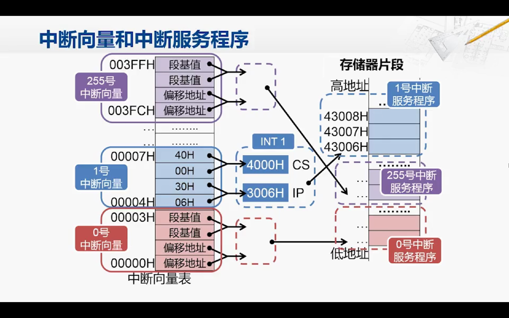

## 简单概述

1. **基本组成部分**：CPU的基本组成部分包括算术逻辑单元（ALU）、控制单元、寄存器和时钟。ALU执行算术和逻辑运算，控制单元管理指令的执行，寄存器用于暂存数据和指令，时钟控制CPU的工作时序。

2. **指令集架构**：CPU执行的指令由指令集架构（ISA）定义。ISA决定了CPU所能执行的指令集合，包括算术运算、逻辑运算、数据传输、控制流等操作。

3. **寄存器**：CPU内部包含多个寄存器，包括通用寄存器、程序计数器（PC）、指令寄存器（IR）等。寄存器用于存储临时数据、指令地址和指令等。

4. **时钟和时序**：CPU的工作受时钟信号的控制，时钟信号决定了CPU内部各个部件的工作时序，包括指令的获取、译码、执行和写回等操作。

5. **流水线**：现代CPU通常采用流水线技术，将指令执行过程分为多个阶段，使得多条指令可以同时在不同阶段执行，提高了CPU的效率。

6. **缓存**：CPU包含多级缓存，包括L1、L2、L3缓存等，用于暂存频繁使用的数据和指令，以提高内存访问速度。

7. **指令执行**：CPU执行指令的基本步骤包括指令获取、指令译码、执行、写回等阶段，不同的指令需要经过不同的处理流程。

## 处理器设计步骤

#### 分析指令系统。

- 指令系统

    > 指令系统是在处理器设计之前，就由软件和硬件的设计人员共同协商决定的。通过分析指令系统，我们可以得出指令所要操作的数据，需要通过怎样的一个电路的结构，这就是数据通路

#### 选择组件 建立通路

> 在我们得到这样的需求之后，我们就可以为数据通路选择合适的集成电路组件。比如说加法器、减法器、寄存器等等；
>
> 选好了合适的组件之后，我们就按照最开始分析出的需求，把这些组件连接起来，就构成了完整的数据通路；

#### 建立控制器

> 但是仅有数据通路是不够的，我们还需要控制这个数据通路应该如何工作。因此，第4步是要分析每条指令的实现，以确定控制数据通路工作的控制信号；最后，是把这些控制信号汇总起来，**形成完整的控制逻辑，也可以称之为控制器。**

## 超标量和流水线

**流水线 ：提高并行性**

**超标量：并行指令执行**

**本质都是空间上的利用**

#### 早期处理器

- **CPU Core：之前设计的数据通路**

    > 这里数据通路包含广一点
    >
    > 1. **寄存器：**用于暂存指令、数据和地址等信息。
    > 2. **算术逻辑单元（ALU）：**用于执行算术和逻辑运算，比如加法、减法、乘法、逻辑与、逻辑或等。
    > 3. **控制单元**：用于控制数据通路中各个部件的工作，根据指令的要求来控制数据通路的操作。
    > 4. 数据选择器/多路复用器：用于选择需要传输的数据或信号。
    > 5. 数据存储器（内存）：用于存储数据和指令。
    > 6. 输入/输出接口：用于与外部设备进行数据交换。
    > 7. 时钟：用于同步各个部件的工作。

- **32KB I-Cache：之前设计的指令存储器**

- **32KB D-Cache：之前设计的数据存储器**

- **256KB L2 Cache**

- **十六级流水线：**

- **四发射：超标量** 

**这些部件关系紧密，将上述部分称之为超标量处理器核**。

**早期的单核时代：一个处理器核造成一个CPU**

> （四发射-十六级流水线)
>
> - 四发射：一次性完成了四条指令，取值译码...执行写回
> - 十六级流水线：以**5级流水线**为基础，将指令执行的5个阶段划分为16个部分

#### 现代处理器

**多个处理器核 + 共享部件（8MB L3 Cache...）+ ... 构成一个CPU**

> - 当涉及多核和多CPU系统时，从处理器的组织方式以及操作系统如何管理并利用这些资源来理解。
>
> - **多CPU系统**
>
>     > - **多CPU系统**指计算机系统中有多个独立的中央处理器（CPU）。
>     >
>     > - **每个CPU都可以独立地执行指令，这意味着系统可以同时处理多个任务，从而提高整体性能。**
>     >
>     > - 多CPU系统可以通过两种方式来工作：
>     >     - 对称多处理器（SMP）：每个CPU都连接到共享的内存和I/O总线。操作系统可以将任务分配给不同的CPU来并行执行，从而提高系统的整体处理能力。
>     >     - 非对称多处理器（ASMP）：每个CPU连接到自己的内存和I/O总线。这种配置通常用于大型系统，其中每个CPU专门用于执行特定类型的任务。
>
> - **多核系统**
>
>     > - **多核系统**是指单个CPU集成了多个处理核心。
>     >
>     > - 每个核心可以独立地执行指令，因此多核系统可以同时处理多个任务。
>     >
>     > - 多核系统可以通过**超线程技术**来模拟多个逻辑处理器，从而提高系统的并行处理能力。
>
> - 进程
>
>     > - **进程**是程序执行时的一个实例，每个进程都有独立的内存空间和系统资源。
>     >
>     > - **在操作系统中，进程是资源分配的基本单位，每个进程都有独立的地址空间和上下文。**
>     >
>     > - 多CPU和多核系统可以同时运行多个进程，从而提高系统的处理能力。
>
> - **线程**
>
>     > - **线程**是进程内的一个执行单元，同一进程内的多个线程共享进程的内存空间和系统资源。
>     >
>     > - **线程可以看作是轻量级的进程，它们可以并发执行，共享进程的资源。**
>     >
>     > - 多CPU和多核系统可以同时运行多个线程，从而提高系统的并行处理能力。
>
> - **任务**
>
>     > - **任务通常是一个更高层次的概念，它可以是一个进程或者线程。**
>     >
>     > - 在某些系统中，任务可能是指操作系统分配的一项工作，可以是一个进程或者线程的执行实例。在这种情况下，任务类似于线程，是操作系统调度和管理的基本单位。

## 架构/处理器概念

> 以最为常使用的ARM架构为例

- ARM架构: ARM指令集架构 

    > 常说的xxx架构: ARM架构、MIPS架构、x86架构、POWER架构等, **说的就是基于哪种系列的不同指令集,就被称为xxx架构**
    >
    > > 当然ARM和x86指令集里面都包含了很多指令集（针对各种场景、计算开发的指令集）。

- ARM结构处理器: 采用了ARM架构的处理器

- ARM处理器芯片: 

    > 这个概念由于时代的变更变得稍微有点难理解, 所以想搞清楚处理器的概念, 那就得从以前的处理器/CPU说起(参考前面早期处理器和现代处理器)
    >
    > - 早期处理器: 一个处理器核(CPU) + 一些简单缓存 ——>处理器
    > - 发展中的处理器: 一个CPU里多个处理器核/多个CPU + 缓存 +共享部件 ——>处理器(Soc)
    > - Soc 如下: 处理器核 + 各种IO设备(系统外设) + 图形处理器(GPU) + 通信模块 + 内存控制器+ (NPU/TPU/...)

这里或许会对各种内存/存储相关概念感到迷惑, 统一再下一章总结一下

- 手机电脑上常说的内存/存储: 8GB + 256GB
- 处理器里面又有主存储器(取决于芯片的性能: 从几十K到几十M)
- 处理器核里面又有各种几级缓存cache(L1 L2...)

## 存储

#### 存储层次结构和基本认识

> 对于前面的问题:
>
> - 手机电脑上常说的内存/存储: 8GB + 256GB
> - 处理器里面又有主存储器(取决于芯片的性能: 从几十K到几十M)
> - 处理器核里面又有各种几级缓存cache(L1 L2...)
> - ...

借助上图, 了解存储相关知识可以解释

从下往上: 

1. 手机的存储/PC硬盘: 使用磁盘/硬盘(Disk)/flash等ROM  (256GB 512GB往上)

2. 手机的内存/PC的内存: 由主存(DRAM)构成 (目前8GB左右)

3. 高速缓存: 这里面概念过多, 分了很多层, 位置也有些不同, 上一章图中的主存储器指的就是缓存

    > 处理器内部有多级缓存，包括一级缓存（L1 Cache）、二级缓存（L2 Cache）和三级缓存（L3 Cache）。这些缓存用于临时存储处理器**需要频繁访问的数据和指令**，以提高数据访问速度和整体性能。
    >
    > L1缓存通常是**集成在处理器核心内部，速度最快但容量较小。L2和L3缓存通常更大，但速度相对较慢**，同时也更接近主存储器。这些缓存层级的设计是为了更好地平衡速度和容量之间的权衡，以提供更高效的数据访问。

4. 通用寄存器: 就建在处理器核里, 不多解释

#### SRAM和DARM结构和差别

#### 缓存

#### 内存

评价内存的两个重要指标

- 访存延迟
- 访存带宽
- tRCD CL tRP

> 带宽 理解为直接一次性读取多少个数据，像SDR:经过访存延迟后一次取出一个Byte数据
>
> 之后DDR2 3 4不断改进，访存延迟后一次读两个/四个Byte。
>
> 这样子做提高了访存带宽，但是也加大了访存延迟(一次取多个数据，tRCD 和CL时间也会增加

#### 存储容量的计算

计算机当中大多数的单位前缀都还是采用十进制的形式，并且符合国际单位制的要求。

只有在**计算内部存储器容量**时，采用了二进制的形式

> 对现状，IEEE的标准将会使用大家公认的国际单位制前缀的定义。那么mega，也就是我们说的兆，也就是指100万，不再有2的20次方这样另一个定义。当然这里也说了，如果能够明确指出是以2为底的，也可以作为个例单独处理，直到有一种新的标准专门用于二进制的单位前缀。

#### 

#### 不同单位的使用示例

- **使用二进制: 2^10^**

    1. RAM和ROM的存储大小，**属于计算机内部存储**

        > 20K的SRAM/DARM: 20 * 2^10^ Byte

    2. 文件大小 

        > 4MB的File: 4 * (2^10^)^2^ Byte

- **使用二进制: 10^3^**

    1.  **网络传输速率:**

        > 比如: 以太网、Wi-Fi...
        >
        > 100Mbps: 100 * 10^6^ bits

    2. **网络带宽**

        > 居民网络带宽
        > 50Mbps :同上

    3. **外部存储**

        > **==特别注意==**: 硬盘容量**历史上使用二进制单位**进行标记和市场销售，但随着硬盘存储技术的不断发展，成本和容量的发展极度不一致，导致容量越来越大，大到GB以上，这就导致了和现实的国际物理单位有冲突，故**近年来转向使用十进制单位**。评估硬盘容量时，必须注意所使用的测量系统。
        >
        > hard drive容量 512GB: 512 * 10^9^ Byte 
        > Q: 为什么买回来的1T硬盘, 在计算机上实际显示的大小不足1TB？
        >
        > A: 原因就在于**计算机内部和外部使用了不同的计数单位**。

## 中断和异常

> 内容要点：中断与异常的异同，中断处理的过程

#### 概念问题

> 有些定义不同

中断和异常在处理器的工作中都是用来处理外部事件的机制

中断（Interrupt）是处理器接收到来自外部设备（如键盘、鼠标、网络接口等）的信号，通知处理器需要进行处理。

中断可以是**内部中断（如时钟中断）或外部中断（如I/O设备中断）**。处理器在接收到中断信号后，会暂停当前任务，保存当前状态并执行相应的中断处理程序，然后再返回到原来的任务。

异常（Exception）是处理器在执行指令时遇到的一些意外情况，**比如除零错误、非法指令、内存访问错误等。**异常会导致当前指令的执行被中断，处理器会跳转到异常处理程序进行相应的处理。又叫异常中断

下面是一个表格，总结了中断和异常的区别以及企业项目开发例子：

| 区别     | 中断                                   | 异常                                       |
| -------- | -------------------------------------- | ------------------------------------------ |
| 触发原因 | 外部事件触发，来自外部设备的信号       | 指令执行时遇到的意外情况                   |
| 处理方式 | 暂停当前任务，执行中断处理程序         | 跳转到异常处理程序进行相应的处理           |
| 例子     | 高性能网络数据处理系统中的网络接口中断 | 操作系统/虚拟化平台中的访存异常:空指针引用 |

当涉及到高性能网络数据处理系统时，网络接口中断是一个非常重要的概念。在这样的系统中，网络接口中断通常是由网络设备（如网卡）发出的信号，表示有数据包到达或其他网络事件发生。处理这些中断信号对于高性能网络处理系统来说至关重要，因为它们需要及时地处理传入的数据包以确保网络的稳定性和性能。

举例来说，在一个高性能的网络数据处理系统中，当网络接口收到一个数据包时，它会产生一个中断信号，通知处理器需要处理这个数据包。中断处理程序可能会涉及到数据包的解析、验证、路由选择等操作，然后将数据包传递给应用程序进行进一步处理。这个过程需要在非常短的时间内完成，以确保网络数据能够及时地被处理，从而保证了整个网络系统的稳定性和可靠性。

在另一方面，操作系统或虚拟化平台中的访存异常是另一个常见的情况。在这样的系统中，访存异常通常是由应用程序尝试访问无效的内存地址、空指针引用或越界访问内存等情况引起的。处理这些访存异常对于操作系统或虚拟化平台来说也是至关重要的，因为它们需要确保系统能够及时地检测到这些异常情况，并采取相应的措施来保护系统的稳定性和安全性。

因此，在企业级的高性能网络数据处理系统和操作系统/虚拟化平台中，中断和访存异常都是非常重要的概念。它们确保了系统能够及时地响应外部事件和处理意外情况，从而保证了系统的可靠性和稳定性。

#### x86实模式下的中断向量表

CS:IP  相当于PC寄存器

**中断向量表里面存着中断服务函数（触发异常或者中断需要执行的修复操作）的入口地址**

- 具体流程

    现在比较流行的个人计算机的内部结构。它如果运行在实模式下，就可以认为它是一个非常快的8086。因此，当CPU复位之后，也会去1兆地址空间的最高的16个Byte的位置去取第一条指令，**这个地址会被南北桥芯片组引导到BIOS芯片。CPU执行BIOS芯片当中的指令，对主板上的各个设备进行基本的配置。其中一项工作，就是在主存地址0的地方构建出中断向量表，所谓构建中断向量表，也就向主存中最低的那1K的字节填写那些中断向量。**构建好了中断向量表，又准备好了中断服务程序之后，CPU再遇到中断，就可以访问主存中的中断向量表，并调用对应的中断服务程序了。

#### ( 拓展 ) x86保护模式下的寻址方式

> 我们知道，现在的CPU其实主要不是运行在实模式下，内存也并不是仅仅只有一兆了。所以，CPU对存储器的访问方式也发生了变化。

我们以指令的寻址为例，在实模式下是用代码段寄存器CS和指令指针计存器IP进行组合。这两个寄存器都是16位的，它们的组合用段加偏移的方式产生一个20位的地址。

但是从386开始，指令指针计存器就从16位扩展到了32位，也就是EIP计存器。那么它的寻址能力就有了2的32次方也就是4G个字节单元。而从386开始，32位的CPU对外也就是32位的地址线，能够寻址的范围也是2的32次方。在这时候，指令指针寄存器（EIP）的宽度和实际需要寻址的范围已经是一一对应的了。 

所以，在保护模式下，虽然逻辑地址还是写成CS寄存器和EIP寄存器的形式，但物理地址的产生方式已经和实模式完全不同了。(采用描述符)

在保护模式下，**段基址并不是存放在CS寄存器当中，而是存放在内存中的。**

在内存当中的某个地方，存放着一张表，称为描述符表。这张表一共有8192（2^13^）个表项，每个表项由8（2323）个字节构成，就被称为一个描述符。这个描述符当中，**第2，3，4个字节和第7个字节这一共4个字节是基地址，这个地址就对应了实模式下保存在CS寄存器当中的内容。**

描述符当中，除了基地址之外，还有一些别的内容。如段界限，它指明了这个段究竟有多长；还有权限这里面有若干个比特，指明了这个段的内容是否可读，是否可写等等。

这些描述符是存放在内存中的，CPU又是如何能访问到呢？所以，在 CPU当中实际上是**修改了CS寄存器的使用方式**。我们可以想一想为什么总共有8192个描述符? 这和CS计存器的宽度是有关系的，CS计存器是16位宽的。所以，它一共可以寻址2的16次方个内存单元，这就是64K。而因为每个描述符是8个字节，所以8192个描述符刚好是64K（8192 * 8=2^13^ * 2^3^=2^16^=64K）。**用16位的CS寄存器就正好可以查找这么多个描述符。**

这个描述符表的地址并不像实模式下的中断向量表那样直接存放在0地址, 所以想要找到对应的描述符, **CPU就得知道这个描述符表的起始地址**. (相当于计算机管家在内存中的某个位置, 我需要在在CPU内部用一个寄存器来存放这个管家的位置)

所以CPU中新了设置一个的寄存器，叫**GDTR，用于保存这张描述符表的起始地址。**

> 那么又得问了？这个GDTR的内容是从哪里来的呢？实际是因为x86的CPU在启动的时候都会先进入实模式。在实模式下，会在内存的某一个地方，先把这张描述符表都填好，然后将这张表的起始地址填到GDTR计存器当中去。这（GDTR）也是CPU内部的一个计存器，只不过它不像EX，EDX这些寄存器可以用作数据的运算，它是一个特殊的寄存器，但也是可以用特定的指令进行访问的。

- 最后总结一下, 在保护模式下CPU访问内存的流程:

    **GDTR: 描述符表   CS: 段选择子(符表的偏移地址) + 段信息**

1. CPU每次要访问存储区, 都得用到CS和GDTR寄存器.
2. **段选择子**：CPU使用段选择子（存放在CS寄存器中）来获取对应的段描述符的索引值。(用于找到8192个段中的哪个段)
3. **GDT表访问**：CPU使用段描述符的索引值在全局描述符表（GDT）中找到对应的描述符。(最终确定段描述符的位置)
4. **线性地址计算**：从段描述符中获取基地址, 再从EIP获得偏移地址，使用这些信息计算出线性地址。
5. **内存访问**：CPU使用线性地址来访问内存，获取想要的指令编码或数据。

#### x86保护模式下的中断描述符表

在保护模式下，每一次存储器的访问都必须要经历上述过程，那访问中断向量表也就不例外。而且不但如此，中断向量表的位置也发生了变化。

结合上图, 在保护模式下, CPU处理中断的流程如下：

1. **中断描述符表初始化**：系统初始化（BIOS）软件会在建立好中断描述符表后，将中断描述符表的起始地址和长度填入IDTR寄存器。

2. **中断类型号查找**：当CPU发生中断时，根据中断类型号乘以8再加上IDTR寄存器中的内容，得到对应中断描述符的地址。

3. **中断描述符处理**：CPU从中断描述符中获取段选择符和偏移地址（EIP）。

4. **段基值计算**：CPU使用段选择符和GDT（全局描述符表）中对应的段描述符，找出对应的段基值。

5. **内存地址计算**：CPU将段基值与偏移地址（EIP）相加，得到中断服务程序的入口地址。

6. **中断处理**：CPU从中断服务程序的入口地址取回指令，开始中断的处理。

总结：在保护模式下，处理中断的流程包括中断描述符表的初始化、中断类型号的查找、中断描述符的处理、段基值的计算、内存地址的计算以及最终的中断处理。整体上，这些步骤清晰地描绘了CPU在保护模式下处理中断的流程。

## IO

