## 	计算机系统流程

在断断续续看完了《计算机是怎么样跑起来的》、《程序是怎样跑起来的》,了解了一些别的知识后, 

知道现在计算机和以前的计算机差别还是很大的.

为了方便自己理解古老的计算机系统, 写一个大概流程巩固用, 应该有很多细节不太对, 但只是建立一个大概的框架. 

计算机组成 -> 计算机上电启动 -> 程序让计算机跑起来


### 计算机组成

#### 1. 数据输入

计算机接收外部设备（键盘、鼠标、传感器等）或存储设备（如硬盘、内存等）传输的数据。

#### 2. 数据传输

数据通过总线系统（数据总线、地址总线、控制总线）传输到CPU。

#### 3. CPU

**计算机核心部件，负责执行指令和处理数据。**

- 指令解码：CPU解析指令，确定需要执行的操作和操作数。

- 寄存器：寄存器是CPU内部的高速存储器，用于存储指令和数据。
- 算术逻辑单元（ALU）：ALU执行算术和逻辑运算，如加法、减法、乘法、逻辑与、逻辑或等。控制单元：控制单元协调和控制计算机各个部件的工作，包括指令的执行顺序和时序控制。
- 存储器：存储器用于存储数据和指令。主存储器包括随机存取存储器（RAM）和只读存储器（ROM）。

#### 4. 数据处理

CPU根据指令和数据在寄存器和内存、存储器之间进行读取、写入和运算。

#### 5. 数据输出

处理后的数据通过总线传输到输出设备（如显示器、打印机等）或存储设备进行保存。


## 指针数组和数组指针


## CPU中有内存吗?

#### 日常概念

在电脑和手机的存储容量中，通常会提到两个数字，分别表示内存（RAM）和存储（ROM或硬盘）的容量。

- 内存（RAM）：内存是计算机用于临时存储数据和程序的地方，它对于计算机的运行速度和多任务处理起着重要作用。内存容量通常以GB（Gigabytes）为单位来表示，比如16GB表示16千兆字节的内存容量。
- 存储（ROM或硬盘）：存储是用于长期存储数据和文件的地方，包括ROM（只读存储器）和硬盘（机械硬盘或固态硬盘）。存储容量通常以GB或TB（Terabytes）为单位来表示，比如512GB表示512千兆字节的存储容量。

在手机中，类似地，8+256表示手机的内存和存储容量。其中8表示手机的内存容量，通常以GB为单位，而256表示手机的存储容量，也通常以GB为单位。这意味着手机有8GB的内存和256GB的存储空间。

需要注意的是，内存和存储是不同的概念。

内存用于临时存储运行中的数据和程序；存储用于长期存储文件和数据。

**内存**容量较小，但速度较快；

**存储**容量较大，但速度相对较慢。


## 为什么要有堆和栈

1. 为什么要进行内存的管理？
2. 为什么要有栈？栈是必须的吗？没有他可以吗？（非常本质的东西）
3. 函数为什么是理所应当的？模块 ？汇编层面的都没有函数，只是跳转？
4. 函数调用的时候，后进先出--->那就是栈这个东西，想用函数模块化的实现功能，那就得用栈来管理函数调用过程中产生的东西？
5. 如果说我们的这个函数就是很重要的，那栈这个东西就是必须的了，那总不能我们每次都自己实现一个栈？自己管理程序运行过程中产生的各种变量等等，所以操作系统帮我们实现好了栈这种操作方式？？还是编译器干的？
6. 除此之外，函数递归这种思想，函数自己调用自己，怎么搞？比如计算斐波那契数列的一个函数，每次调用都要算出一个值，那不就得


1. 为什么要有堆？
2. 栈多舒服，栈自动帮我们管理了内存，自动创建，退出的时候自己销毁
3. 有个问题，那一推出信息就没了，那要是我想在不同的函数之间使用一下函数运行过程中产生的一些东西，怎么办？
4. 堆就一直不会消失，堆就是用来管理这种大的数据，跨栈的
5. 将堆想象成云盘，比如浏览器关了，但是我之间的一些数据还是在的。
6. 但是堆的问题，只要我不告诉堆，堆内存就一直在那里，他自己不知道什么时候删除，就需要我们自己手动管理，所以，容易出现内存泄漏（free忘了，free了两次）

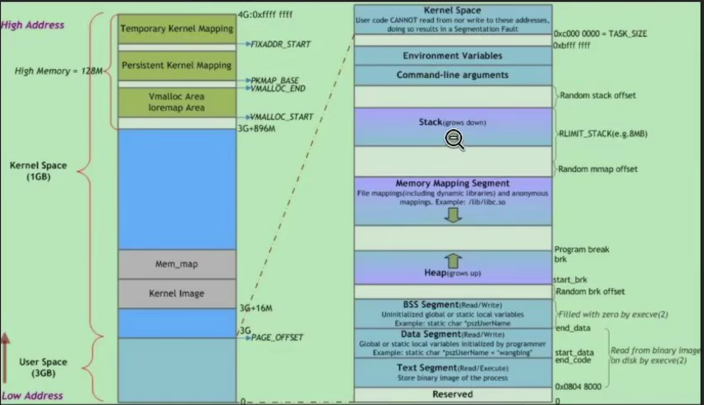

> 那一段memory mapping segment 中放的就是.so 库，ilbc.so

一个程序运行开始的时候，首先内存空的，之后操作系统将elf文件加载到内存中，这个时候PC指针是在 kernel 手上的，之后，kernel 将PC指到或者交给 text 段那里的 main 函数那里，由时钟控制节拍，PC下一步做什么之后做什么（如果复杂一点：1.还有一些各种程序之间的调度（这一步就又需要虚拟内存了帮忙调控，不然几个程序直接操作物理内存，有冲突），一个时间片做这个，来个中断又做别的去了。2. 又或者，你需要一些文件操作，需要用到sys call 的，那PC指针可能就要回kernel， 让kernel帮我干这个活），完成之后，将控制权交回给/跳转到 kernel 空间，内核将你产生的内存中的垃圾搞定。

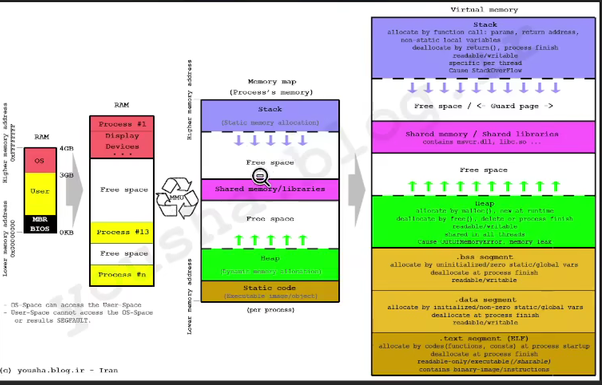

让每一个程序有一种所有的资源为我所用的感觉，那它们就会尽自己最大的力工作。

实际单核CPU，怎么切换的？PC指针。

当一个进程的时间到了，PC指针要转去第二个进程的地址了，那上一个的进程的东西怎么办 ----> 

上下文切换，保存数据/寄存器，内存(映射表)（为什么要保存内存相关的？不然到第二个进程的时候，操作的虚拟内存还是第一个进程的，所以还要保存内存映射表）。不断来回切换 ---> 进程调度的知识


## 栈的理解（Stack）

> 在数据结构中的栈和内存中的栈讲的不是一个东西，不过数据结构中的栈同样类似于一个杯子，特点就是先进后出，因为先进去的数据被压到杯底不好取出来嘛。而数据结构的堆则和内存中的堆就完全不同了，数据结构中的堆是个树形结构。这块不能混淆。


#### 前言

在看《汇编语言》、《程序是怎样跑起来的》、《大话数据结构》的时候，

觉得栈就是从下到上放入元素的一种结构。

但是在看了下面的图后，发现顺序又有点不对，对栈的顺序迷迷糊糊，

用C语言数组实现栈，有时候出现++，有时候又出现--，给我搞晕了


#### 核心观念

[“栈”顶到底是上面还是下面？高地址还是低地址？ - 知乎 (zhihu.com)](https://zhuanlan.zhihu.com/p/447224382)

看了一些博客后，有了一些理解。

> 先明确并且记住以下几点：
>
> - **数据结构中的栈和内存中的栈不是同一个东西**
> - 不同 ISA 下，栈的增长方向不太一样。比如目前主流的架构，RISC-V 、ARM、x86 都是向下增长的。


#### 数据结构和内存中的栈

- 数据结构中

    栈和堆是两种常见的**数据结构**。栈是一种后进先出（LIFO）的数据结构，**只允许在栈的顶部进行插入和删除操作**。堆是一种动态分配内存的数据结构，用于存储动态分配的对象。数据结构中的堆是个树形结构。

- 内存中

    栈是指计算机**内存中的一个区域**。

    栈是一种连续的内存区域，用于存储函数调用的上下文信息、局部变量和函数参数等。**栈的大小在程序编译时就确定了，它的分配和释放是由编译器自动完成的**。栈的特点是高效的分配和释放，但是容量有限。
    
    数据结构的堆则和内存中的堆就完全不同了，这块不能混淆。


#### 栈顶/栈底

我们目前就默认为栈的增长方向：高地址->低地址

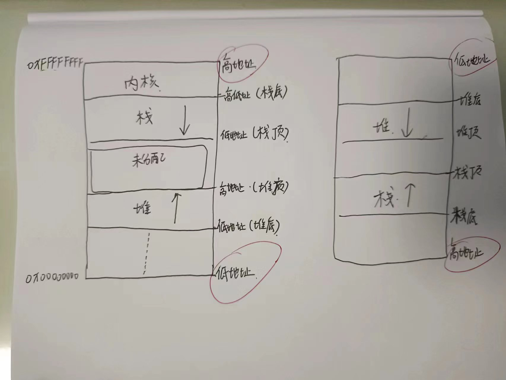

我个人觉得：**这些内存是用来放东西的，不要一直在纠结栈堆往哪个方向长，想想怎么放数据（LIFO）**

我们选择栈区放东西，先从栈的底部开始放到栈的顶部，也就是从高地址放到低地址的空间。

有些教材往往采用右边的方式进行讲授栈，可能是为了更加符合人的直观逻辑

但是我们也要清楚 **==无论哪种顺序都是栈底到栈顶（高地址到低地址）==**

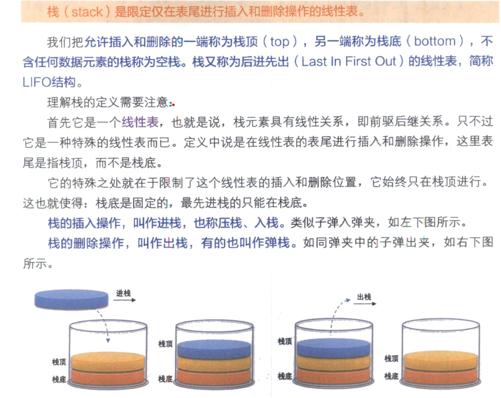

再看上图的相关解释，能插入的一端是栈顶，但是到最后还是放到了栈底。


#### 数组实现栈

```C
Status Push(SqStack *S, SElemType e)
{
	if(S->top == MAXSIZE - 1)
	{
		return ERROR;
	}
	S->top++;
	S->data[S->top] = e;
	return OK;
}
```

> 看这个用数组实现的入栈操作又觉得有问题，不是说从高地址向低地址增长吗？
>
> 怎么又**S->top++**呢

注意: C语言中的数组看作是一段连续的内存空间，通过下标来访问数组元素。

```C
int a[100];
```

> 1. 数组申请了一片空间，空间大小为100x4 Byte（int类型）。内存中从高地址到低地址分配400个内存单元。
>
> 2.  用C语言数组来写。其下标的增长从0到99，(放入栈中的第一个元素标号为1，之后第2个...这里的下标让人感觉好像是从低地址增长到高地址，实际上并不是，只是这种抽象方便理解)
>
>     实际上内存的栈还是由高地址向低地址增长的。
>
> 3. 比如说，我想入栈第一个元素，入栈了之后，这个元素应该存储在栈底，也就是高地址那部分呀，它的地址应该是0x00000187 - 0x00000190(a[0]).之后再入栈第二个，就应该是0x00000183 - 0x00000186(a[1]) 以此类推


#### FreeRTOS 中的栈

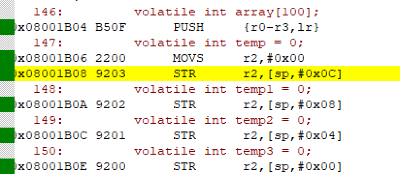

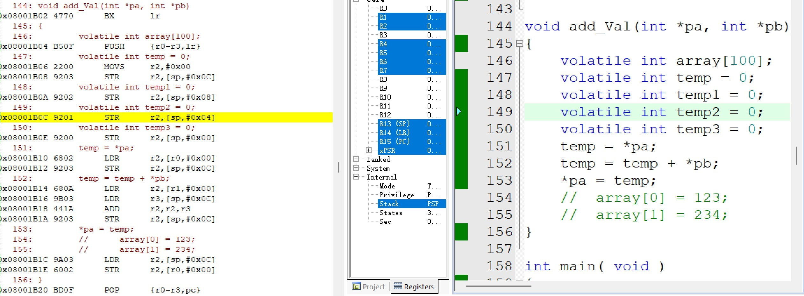

```C
volatile int array[100];
volatile int temp = 0;
volatile int temp1 = 0;
volatile int temp2 = 0;
volatile int temp3 = 0;
```

> 确实是向下增长的


## Efficiency of different integer sizes on a 64-bit CPU

[(https://stackoverflow.com/questions/12447381/efficiency-of-different-integer-sizes-on-a-64-bit-cpu)


## 为什么要将指令和数据分开？

> - 架构
> - 程序编译

#### 架构

> 哈佛架构和冯诺依曼架构


#### 程序编译的角度

> .text/.code 段和 .data和.bss段

1. 安全

    ELF被装载到内存后，数据和指令被映射到两个不同的区域，指令段和数据段/

    指令段只读，数据段可读可写可执行？（是否还有别的权限？）

    防止程序的指令被恶意更改？

2. 缓存

    因为现代的CPU体系中，缓存非常的重要（跟上寄存器的速度），所以需要尽可能地**提高缓存的命中率**，也就是cache hit。

    将指令和数据分离，增强提高了程序的空间局部性。所以这也是为什么有一些缓存分为了`icache、dcache`？

3. 多个相同的程序运行，节省内存

    当一个系统中运行了多个该程序的副本，他们的指令都是一样的，在内存中只需要保存一份该程序的指令部分。

    另外，因为指令的只读属性，那只读数据应该也是可以的？

    > 图标、图片、文本、？。。。

    **共享指令？** 

程序员的自我修养，链接装载与库的3.2


## 学习思想

别管他叫什么，看他用来做什么

所以这种技术名词最终还是应该从他们出现的原因去理解，而不应该简单的从一些形态、架构去解释。更不应该机械的搞一些没有什么意义的“定义”，还让学生在考试的时候去回答。

这里以 jyy 老师的思想，关于学习任何一个知识点：


另外我个人的习惯：从历史发展的角度来看这个东西出现的过程，出现是为了解决什么问题的。


记得上面的思想。还有jyy老师和夏虞斌老师的思想


关于培养一个工程师和技术员

[给参加Arm杯的同学提个醒 - 知乎 (zhihu.com)](https://zhuanlan.zhihu.com/p/627209929)

[“有技无工”——目前大学工科教育的一些问题兼论如何学习SoC设计 - 知乎 (zhihu.com)](https://zhuanlan.zhihu.com/p/598683182)

如何系统地思考：对于一个项目，如何分解？

控制功能 + 执行功能


## MCU 程序和数据存储空间 

- MCU

    代码(text)放在 flash，数据（.data, .bss, heap, stack, register）放在RAM

    > 这里有个问题，CPU 不是只能和 RAM 交流嘛？那是不是还得把 flash 中的内容搬到 RAM 中？还是说 CPU 也能和 flash 相互操作？
    >
    > 并不是，PC指针指向要执行的指令，从 flash 中取出要执行的指令，传给 decoder 对 指令进行解码，将解码出来的行为传给 CPU，执行具体的动作。
    
- MPU

    MPU 因为内部没有集成内存比较少，要加载的程序大小比较大，所以需要外挂 flash。

- Soc

    集合上述优点。

实际上，还有另外一点，就是 MCU 和 MPU 的架构稍微不同，MPU 或者说 CPU ，是基于冯诺依曼架构的，指令和数据存储在一起；而MCU 大多基于哈佛架构，指令和数据分开存储。


参考资料：

[嵌入式MCU 程序和数据存储空间分配理解-知识点_程序空间和数据空间在读写操作的关系-CSDN博客](https://blog.csdn.net/dongzengwu/article/details/83642281)

[浅谈嵌入式MCU开发中的三个常见误区 (qq.com)](https://mp.weixin.qq.com/s?__biz=MzI0MDk0ODcxMw==&mid=2247484113&idx=1&sn=7f8ec483c2014f28d35a393c890d5e1d&chksm=e9124657de65cf419aaae0dd1ffb99f8ba4fb4dfddeefdd09bb08b6d77154f3e407759067067&scene=21##)


## MCU~MPU的启动流程大致总结

> 我的代码（这里是机器码，先不管编译流程先）是怎么下载到 MCU 上的？为什么需要一个下载器这样的东西？
> 我在电脑上编写的代码怎么才能进入到物理设备中？（这是不是需要我自己写一个loader，因为运行程序，需要 `loader` 把机器码装载到特定的内存位置，这是下载器的功能？）
>
> 另外，装载之后，从到 MCU 硬件上电启动到  `main`  函数的执行，这个过程究竟发生了什么？

这个讲得还行：[STM32启动过程浅析课堂总结](https://www.bilibili.com/video/BV1K84y1u7X3?p=4&spm_id_from=pageDriver&vd_source=ecc99d78ae961113010161a48a475a35)


梳理流程：

1. 软件程序在 PC 机上编译好生成可执行文件。

    [C语言-C语言和硬件的邂逅 - Iriczhao - 博客园 (cnblogs.com)](https://www.cnblogs.com/iriczhao/p/11589189.html)

2. 通过烧录器从 PC 机上下载到 MCU 上的 flash 上。

    这里有些问题：

    - 烧录器、下载器的原理

        

    - 这个可执行文件装载一定是烧录到 flash 上的吗？能不能烧录到 RAM 上？
        - 通常，编译好的软件程序是烧录到MCU的非易失性存储器（如Flash）上的，因为这些存储器能够在断电后保持数据不丢失，适合存储固件和应用程序代码。
        - 烧录到RAM上是不常见的，因为RAM是易失性存储器，一旦断电，其中的数据就会丢失。但在某些特殊情况下，**如使用RAM执行某些特定的测试或调试任务时**，可能会将程序烧录到RAM中。
    - 具体是烧录到 flash 内存地址的哪一部分？自己能否控制装载到哪一个部分的地址？
        - **烧录到Flash的具体内存地址通常由链接脚本或启动代码决定**。开发者可以通过修改链接脚本来控制程序烧录到Flash的哪一部分地址。

3. MCU 上电启动，完成硬件初始化，检测电源、时钟、复位等等电路配置。

    - MCU上电启动时，会从**预设的启动地址（通常是 Flash 的起始地址）开始执行指令**。这个地址被称为复位向量或启动向量。
    - 不同的处理器架构可能有不同的启动机制，但大多数MCU在上电或复位后会自动从预定的启动地址开始执行。

    > 像 MCU 这种单片机，直接跑裸机的，是不是就不需要 `bootROM` 这种一级引导程序来引导系统启动了？直接就通过烧写器烧写到 flash，然后从flash的第一条指令开始时指令。
    >
    > 但是像哪种 MPU 比较复杂的、相对高性能的内容，需要跑大型的操作系统的，是不是就需要 `bootROM` 和 `bootloader` 这些一二级引导程序来引导 操作系统的加载？

    - 对于裸机运行的MCU，通常不需要`bootROM`这种一级引导程序。程序直接烧录到Flash中，上电后从Flash的第一条指令开始执行。
    - 对于需要运行大型操作系统的高性能 MPU，`bootROM`和`bootloader`是常见的。`bootROM`通常包含在MCU内部，用于初始化硬件并加载`bootloader`。`bootloader`可能存储在非易失性存储器中，负责更复杂的启动过程，如加载和初始化操作系统。

    > 这里简单讲一下关于这类芯片启动流程：
    >
    > Boot ROM 位于芯片内部的起始地址0x00000000处，大小为96KB。这个区域包含了启动引导程序，它负责从指定的启动设备（如 SD 卡、eMMC、NAND Flash 等）加载操作系统或应用程序的镜像，并将其复制到 RAM(外部的 DDR) 中，然后跳转到镜像的入口点开始执行。
    >
    > > 上面这个过程涉及到读取存储设备上的 IVT（Image Vector Table）、Boot Data 和 DCD（Device Configuration Data）等信息，这些信息告诉 Boot ROM 如何加载和验证镜像文件。
    >
    > 这里也有个问题，从指定的启动设备加载镜像，怎么加载？CPU 怎么读取这部分程序做到的？这部分bootROM程序究竟写了什么？搬运指令？
    >
    > ***==own version, not official version.==***

    > 这个问题其实也合理的，这里留坑，总结成另一篇文章。 
    >
    > ###### **==DOTO==**
    >
    > MPU 的 bootROM 放的是系统启动时所需的初始化代码，当系统上电或者复位的时候，MPU 从 bootROM 开始执行，执行一些基本的初始化：设置时钟、初始化内存控制器等等；然后它负责将从指定的启动设备加载镜像，并复制到 DDR 中。
    >
    > 这里又有一个问题了，那 MCU-STM32 那便是怎么启动的呢？他有没有像 MPU 那样的带有 bootROM 的呢？实际上是有的，这就不得不说到STM32的启动模式了，如下文：
    >
    > [【ARM Cortex-M开发实战指南(基础篇)】第3章 Cortex-M启动流程详解(GCC版) - BruceOu的博客](https://blog.bruceou.cn/2022/11/3-detailed-explanation-of-cortex-m-startup-process-gcc-version/1889/)
    >
    > [深入理解MCU启动原理 - 知乎 (zhihu.com)](https://zhuanlan.zhihu.com/p/652795256)

4. **启动代码（`start.s`）**：

    - `start.s`是一段汇编语言编写的启动代码，位于程序的最开始部分。它负责设置初步的堆栈指针、数据段和BSS段（Block Started by Symbol，BSS段用于初始化为零的全局变量），并配置中断向量表。
    - `start.s`还会进行硬件的进一步初始化，如内存控制器、时钟系统，或者特定硬件外设的初始化： GPIO、DMA等，并最终调用C语言编写的`main`函数。

5. 执行应用程序 / 运行 OS 


1. 计算机组成（冯诺依曼和哈佛架构）

2. MCU 的存储结构

    贴 `keil` 编译后生成的代码大小图

2. MCU 启动流程 `start.s`

   

4. bootloader

    引入 `bootloader` 唯一的目的就是更新系统，实现 OTA 升级，否则直接通过编程器或者烧录器（通过 JTAG、SWD）与MCU通信，将编译后的 .hex 或者 .bin 烧录到 flash 中。

    > bin，hex，ELF 
    >
    > 1. **文件格式和内容**：
    >    - `.ELF` 文件是一种二进制文件格式，用于Unix和类Unix系统的可执行文件和可链接对象文件。它不仅包含程序的机器码，还包含程序的元数据，如符号表、调试信息、重定位表等。
    >    - `.hex` 文件是一种文本文件格式，以十六进制形式表示二进制数据，并包含地址信息，用于指定数据在内存中的存放位置。
    >    - `.bin` 文件是一个原始的二进制文件，通常不包含地址信息，仅包含可执行代码或数据。
    >
    > 2. **用途**：
    >    - `.ELF` 文件用于调试和开发过程中的链接。它们允许开发者使用调试器进行源代码级的调试，因为调试器可以利用 `.ELF` 文件中的符号信息来映射程序执行中的地址到源代码。
    >    - `.hex` 文件主要用于嵌入式系统的编程和烧录，它提供了必要的地址信息，方便烧录器将程序的各个部分烧录到目标硬件的正确地址。
    >    - `.bin` 文件通常用于最终产品的分发和烧录，因为它们不包含调试信息，文件大小更小，加载速度更快。
    >
    > 3. **调试信息**：
    >    - `.ELF` 文件包含完整的调试信息，这对于开发过程中的错误检测和性能分析至关重要。
    >    - `.hex` 和 `.bin` 文件通常不包含调试信息。`.hex` 文件主要关注于数据的十六进制表示和内存地址映射，而 `.bin` 文件仅关注于数据本身。
    >
    > 4. **链接过程**：
    >    - `.ELF` 文件在链接过程中非常重要，链接器使用 `.ELF` 文件来合并多个模块或库，生成最终的可执行文件。
    >    - `.hex` 和 `.bin` 文件通常不直接参与链接过程，它们是链接后生成的最终产物或用于烧录的中间产物。
    >
    > 5. **兼容性**：
    >    - `.ELF` 文件与特定的开发环境和工具链紧密相关，不同的编译器和链接器可能支持不同的 `.ELF` 文件格式变体。
    >    - `.hex` 文件具有较广泛的兼容性，许多烧录器和编程器都能够识别和处理 `.hex` 格式的文件。
    >
    > 总结来说，`.ELF` 文件是开发和调试过程中的关键文件**，提供了丰富的元数据和调试信息**；
    >
    > 而 `.hex` 和 `.bin` 文件则更多地用于**产品的分发和烧录**，其中 `.hex` 文件因其地址信息而在烧录过程中更为常用。
    >
    > > 在嵌入式系统开发中，`.hex` 文件相较于 `.bin` 文件更受欢迎，主要有以下几个原因：
    > >
    > > 1. **地址信息**：`.hex` 文件包含了程序数据及其在目标设备中的存储地址信息，这使得烧录过程更加自动化和准确。开发者不需要手动指定烧录地址，因为 `.hex` 文件已经指明了数据应该存放到目标设备的哪个位置。
    > > 2. **可读性**：`.hex` 文件是文本文件，可以用文本编辑器打开和查看，便于开发者理解和修改。这种可读性对于调试和分析程序非常有用。
    > > 3. **烧录便捷性**：由于 `.hex` 文件包含了地址信息，烧录器可以直接使用这些信息进行烧录，无需额外的配置步骤。这简化了烧录过程，尤其是在批量烧录或自动化生产环境中。
    > > 4. **错误检测**：`.hex` 文件中的每条记录都有校验和，可以用来检测文件在传输或存储过程中是否出现错误。这种错误检测机制有助于确保烧录到设备中的程序的完整性和可靠性。
    > > 5. **兼容性**：`.hex` 文件格式被广泛应用于嵌入式系统的编程器和烧录器，具有很好的兼容性。这使得使用 `.hex` 文件的程序更容易在不同的设备和平台上运行。
    > >     1. **附加信息**：`.hex` 文件可以包含除程序数据和地址信息之外的附加信息，如起始地址记录等。这些附加信息可以提供更多关于程序如何加载和执行的上下文信息。
    > > 6. **文件大小**：虽然 `.hex` 文件的文件大小可能会比 `.bin` 文件大，因为它包含了额外的信息，但这种大小差异通常不会成为选择文件格式的决定性因素，尤其是在存储空间相对充足的现代嵌入式系统中。
    > >
    > > 总的来说，`.hex` 文件因其包含地址信息、易于阅读和烧录、具有错误检测机制以及良好的兼容性等特点，在嵌入式系统开发中比 `.bin` 文件更受欢迎。
    >
    > [嵌入式--Hex文件总结：Hex文件格式，Hex文件转bin文件_iar提出的的hex转bin工具](https://blog.csdn.net/qq_28877125/article/details/114941796)
    >
    > [Hex文件解析研究(含源码) (wuxinyou.github.io)](https://wuxinyou.github.io/2019/01/04/embededDev-MCU-HexFileParse/)


思考题：

- 为什么我们能从串口下载程序。


## 关于移植这个概念

怎么移植！移植到什么上去？看b站上的那个国外的视频。


## How to understand bootloader and uboot and BIOS and UEFI

看知乎上的回答：

DDR本质上是 double data rate synchronous dynamic random access memory。

即 DDM SDRAM

这里很多人又对这个DRAM、SRAM、DDR又搞混了

这里我们先明确一点，CPU 只能与 RAM 中的指令和数据进行交互。（DMA那种高级的东西先不管）。


首先，软件是怎么存到硬件里面的，存好了之后，要是掉电导致里面的程序丢失怎么办？显然要启动硬件的代码必须要是非易失的存储：ROM了。

看看这里：

[Overview | Bootloading Basics | Adafruit Learning System](https://learn.adafruit.com/bootloader-basics/overview)

> 这个系列看完，就差不多了。又一次感觉到国内外资料的差距，国内相对讲得好的资料都是给那些已经对这个概念有了一点认知的人看的，这样他们就能差不多勉强懂。但是国外这个资料给一个小白来看，都能明白这是干什么的。

[Bootloader - Wikipedia](https://en.wikipedia.org/wiki/Bootloader)


**==留坑==** 


这里讲的比较好的是：

[【蛋饼嵌入式】我提着鞋带拎自己？嵌入式芯片启动过程全解析，彻底理解bootloader](https://www.bilibili.com/video/BV1AN411R7Be/?spm_id_from=333.880.my_history.page.click&vd_source=ecc99d78ae961113010161a48a475a35)

[bootloader存在的意义是什么？)](https://www.zhihu.com/question/584101772) -- 木头龙的回答。


## What are Board Support Packages(BSPs), and Software Development Kit(SDK)? 

### BSPs

[Board Support Package (BSP) Development - INTechHouse Guide - InTechHouse](https://intechhouse.com/blog/bsp-in-embedded-systems/)

[What’s the Difference Between a BSP and SDK? | Electronic Design](https://www.electronicdesign.com/technologies/embedded/software/article/21800851/whats-the-difference-between-a-bsp-and-sdk)

Board support packages (BSPs) 是一种 软件组件(software component), 为 **操作系统** 和 **特定的计算机开发板硬件** 之间提供一种接口, 常用于嵌入式系统中. BSP 包括很多 software elements, 它们相互协同工作, 使得操作系统能够与特定的硬件进行交互. 通常情况下 BSP 包括如下内容:

- **Boot loader:** 

    Boot loader 是一段体积比较小的程序, 通常用于: 

    - CPU board 硬件启动后装载 OS kernel 以及各种 软件组件. 
    - 确保整个安全的 boot 过程. 
    - 另外, boot loader 还能通过网络或者其他接口来更新硬件上的原有的 software image. (重新 load)

- **Device drivers:** 

    设备驱动 允许操作系统访问各种硬件组件，例如 CPU、内存和外围设备。

- **Board-specific initialization routines:**

    这些例程负责配置板子的硬件，例如设置内存或初始化外设，确保硬件的配置使操作系统能够正常运行。


看起来都是讲个大概, 没有讲出为什么会有这个东西? 还引出了一堆问题. 

1. 为什么 `uboot` 的启动过程已经初始化了某些硬件, 但是为什么到 kernel 层还是会再初始化一遍? 进一步, 驱动和初始化的区别在哪?  

    之前我也思考过这个问题, 当时想的就是 `uboot` 要加载 kernel 需要做一些基本的硬件准备, 但是这种准备是能用就行, 能启动就行的, 比如 USB 简单初始化, 工作在低速模式下, 但是在 load kernel 之后如果我们不对相关设备初始化, 那要用USB 的工作速度就一直那么慢了, 这显然是让人的体验非常不愉快, 所以, 在 kernel 内部自然就有相关硬件的设备驱动程序了.

    当时的理解如此, 直到打算开始学习驱动时, 发现对上面的理解还是有些迷糊的地方, 我对驱动的理解好像就是初始化一样(就像 `xxx_init()` 这就是驱动了, MCU 基础不太扎实...). 再看到 知乎的一些回答 [uboot启动过程既然已经初始化了部分硬件，为什么Linux内核中还是有这些硬件的驱动程序？)](https://www.zhihu.com/question/534378582) 后, 有了更新的理解.

    一位答主说的好:

    > 驱动，不仅仅是初始化，还实现了一组接口（读、写、打开、关闭），给应用程序调用。
    >
    > 光初始化有啥用，就像你开车一样，发动机发动了，前灯亮了，如此而已。驱动不会自己执行，驱动都是被动被程序调用。就像车不会自己跑一样，需要司机（应用程序）通过车（驱动）提供的接口，去行驶、倒车、关窗、关闭打开车灯。

    


还有，[嵌入式开发岗招聘老是在说的精通uboot和内核裁剪，到底是裁剪了什么? ](https://www.zhihu.com/question/566011783/answer/2863914034)


[(99+ 封私信 / 83 条消息) 如何学好嵌入式Linux？ - 知乎 (zhihu.com)](https://www.zhihu.com/question/607213315/answer/3093152155)

闪光吧Linux 的回答可以看看。


## 关于uboot移植

```text
int main(int argc, char *argv[])
{
	sighandler_t no_more_time;

	signal(SIGALRM, no_more_time);
	alarm(PROJECT_DEADLINE - toSec (3 * WEEK));

	if (available_money > available_manpower) {
		Pay consultant to port U-Boot;
		return 0;
	}

	Download latest U-Boot source;

	Subscribe to u-boot mailing list;

	if (clueless)
		email("Hi, I am new to U-Boot, how do I get started?");

	while (learning) {
		Read the README file in the top level directory;
		Read https://www.denx.de/wiki/bin/view/DULG/Manual;
		Read applicable doc/README.*;
		Read the source, Luke;
		/* find . -name "*.[chS]" | xargs grep -i <keyword> */
	}

	if (available_money > toLocalCurrency ($2500))
		Buy a BDI3000;
	else
		Add a lot of aggravation and time;

	if (a similar board exists) {	/* hopefully... */
		cp -a board/<similar> board/<myboard>
		cp include/configs/<similar>.h include/configs/<myboard>.h
	} else {
		Create your own board support subdirectory;
		Create your own board include/configs/<myboard>.h file;
	}
	Edit new board/<myboard> files
	Edit new include/configs/<myboard>.h

	while (!accepted) {
		while (!running) {
			do {
				Add / modify source code;
			} until (compiles);
			Debug;
			if (clueless)
				email("Hi, I am having problems...");
		}
		Send patch file to the U-Boot email list;
		if (reasonable critiques)
			Incorporate improvements from email list code review;
		else
			Defend code as written;
	}

	return 0;
}

void no_more_time (int sig)
{
      hire_a_guru();
}
```

> [Based on messages by Jerry Van Baren in the U-Boot-Users mailing list, October 2002]


## Why DDR need training?


## UART、TTY、serial 区别？

[(99+ 封私信 / 83 条消息) printf是怎么输出到控制台的呢？ - 知乎 (zhihu.com)](https://www.zhihu.com/question/456916638/answer/3099313413)

这个回答，结合jyy老师最小hello world 和pa中输出字符串的那部分内容。


## 存储器编址~存储器映射

### Introduction

在学习底软的过程中, 一直对一些存储器地址映射的概念比较好奇, 而且在学习各领域都遇到了这部分的知识:

- 处理器是要和存储器和外设一起协同工作的，但是处理器访问的内存地址怎么知道他访问的是哪个存储器或者外设(`DDR`, `eMMc`, 以及各种外设的映射的寄存器, MMIO... )?
- 访问地址 `int *p = (int *)0x20000000;` 然后 `*p = ?; ? = *p;`. 这个地址是从哪里来的? 谁定义的? 怎么定义的? 我写的代码是怎么一步步从软件程序到实际硬件上的? 通过了哪些硬件设备? 经历了一个怎样的流程? 

- 学习 hardware boot 的时候, 总是会看到程序通过在一些地址间跳来跳去, 为什那么要跳到那里去? 
- ....

每当遇到类似问题的时候, 我的第一想法总是跳过去, 告诉自己这又不影响写代码不看也没啥事, 但每当想深入了解程序对应的硬件的时候, 我总是逃不开它, 而且我心里总是憋着一口气, 认为自己不知道这个内部细节让我很不爽(真觉得这习惯不太好...), 因此查阅各种资料, 总结自己学习到的相关内容. 


### Reference

[Introduction to Memory Mapping - NerdyElectronics](https://nerdyelectronics.com/introduction-to-memory-mapping/)

实际上看完这一篇的内容, 再实际结合某一款芯片的手册(配合一些程序示例以及 Keil 生成的 map文件)就能理解关于 memory mapping 的内容了. 我下面的内容实际上也只是对这些写出自己的笔记.


### Concept of memory mapping 

#### Address space

在存储器厂商制造好存储器后, 这块存储器最终是要和 CPU 进行通信的, 但是要怎么访问不同类型存储器就成了一个问题, 地址空间编码就是一个挺好的解决办法. 地址空间通常由处理器的地址总线宽度决定. 例如, 32位处理器通常有一个 4GB 的地址空间(2^32^ Byte).

 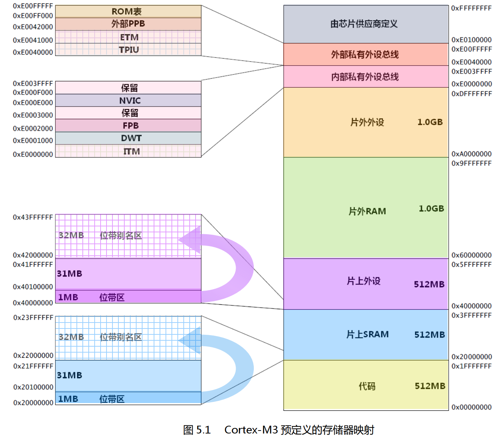

这个地址空间编码就很像一个巨大的一维数组 `uint8_t a[4GB];`, 每个数组元素容纳一个 byte, 如上图.

> It’s akin to a large array of slots, each with a unique address, where each slot can hold a byte of data.

进一步, 地址空间编码后之后会再把地址空间进行分区, 用于不同的存储器和功能, 比如系统内存, I/O 空间, 外设控制寄存器和外部存储器接口.

进一步, 为各种设备进行地址分配. 通常分配由处理器的架构定义, 由芯片厂商设计. 一般查阅技术手册即可知道.

> 一些常见的分配方式:
>
> - 固定映射与动态映射：
>
>     在许多微控制器中，内存映射是固定的，由硬件设计决定。但某些系统还允许动态映射，其中软件可以修改内存映射的某些部分。
>
> - 内存和外设分配：
>
>     例如，较低的地址可能保留给系统引导 ROM，然后是 RAM，然后是用于控制外设的特殊功能寄存器。高地址可以保留给外部存储器接口。
>
> - 地址分配示例：
>
>     让我们考虑一个具有 32 位地址空间的假设微控制器。从 0x00000000 到 0x1FFFFFFF 的地址可以用于内部 RAM，0x20000000 到 0x3FFFFFFF 的地址用于系统外设，0x40000000 到 0x5FFFFFFF 的地址用于外部存储器接口。


### answer

由此, 我可以简单回答一下最开始的一些问题了: 通过映射访问内存.

- 当 CPU 执行涉及内存访问的指令时，它引用内存映射。这个映射就像一个目录，告诉 CPU 每个地址指向哪里。
- 内存控制器或专用硬件单元(总线)根据内存映射对地址进行解码。它确定地址是指向内部 RAM 位置、外设 register 还是外部器件。
- 如果地址指向内部存储器，则数据传输非常简单。对于外部设备，该过程涉及 SPI、I2C 等通信协议或 NXP 微控制器中的 FlexSPI 等专用接口。
- 内存访问不仅仅是发送和接收数据。它还涉及将这些传输与系统的 clock 同步，并管理读/写操作的控制信号。


处理器访问存储器或外设时使用的内存地址映射，是一种通过特定的编码规则将物理存储器分配地址的行为。这个映射通常由硬件设计决定，例如在微控制器（MCU）中，内存映射是固定的，由硬件设计决定，但某些系统还允许动态映射，其中软件可以修改内存映射的某些部分。

当你在代码中写 `int *p = (int *)0x20000000;` 时，这个地址 `0x20000000` 是在处理器的地址空间中预先定义好的，它对应于某个特定的存储器区域或外设。这个地址是由硬件设计者定义的，并且在处理器的文档中会有说明。例如，它可能指向一块特定的RAM区域，或者是一个外设如UART的寄存器映射地址。

当你执行 `*p = ?; ? = *p;` 这样的操作时，处理器通过地址总线发送地址 `0x20000000`，然后通过数据总线写入或读取数据。这个过程涉及到的硬件设备包括处理器的内存管理单元（MMU）、存储器接口，以及可能的总线接口（如AMBA AXI、AHB、APB等）。

> **所以访问关键在于总线部分, 学习 ysyx 的 总线部分.**
>
> 先问 AI:
>
> AHB（Advanced High-performance Bus，先进高性能总线）、APB（Advanced Peripheral Bus，先进外围总线）和AMBA是ARM公司提出的一系列总线架构标准，主要用于片上系统（SoC）中不同模块间的通信。
>
> **AHB** 总线是一种高性能的总线，支持高时钟频率和高带宽的数据传输。它能够连接高性能模块，如CPU、高速RAM、NAND FLASH、DMA等。AHB总线具有以下特点：
> - 支持突发（Burst）传输。
> - 支持流水线操作。
> - 支持多个主设备。
> - 可配置的数据总线宽度（32位到128位）。
> - 支持字节、半字和字的传输。
>
> **APB** 总线是一种低带宽的总线，主要用于连接低速外围设备，如UART、I2C等。APB总线的特点包括：
> - 每个传输至少需要两个时钟周期。
> - 简单的非流水线结构。
> - 单主设备多从设备，主设备通常是APB桥。
>
> **AMBA**（Advanced Microcontroller Bus Architecture）是一个总的框架，包含了AHB和APB等不同的总线协议。AMBA定义了三种总线：
> 1. **AHB**：提供高吞吐量的数据传输。
> 2. **APB**：为低速外围设备设计。
> 3. **AXI**（Advanced eXtensible Interface）：提供更高的灵活性和可扩展性，支持点对点连接。
>
> 在关系上，AHB和APB可以看作是AMBA总线架构中的两个层次，AHB作为主总线，而APB则作为AHB的扩展，通过桥接器连接到AHB上，用于连接低速外设。这样的分层设计使得SoC可以有效地管理不同性能要求的模块间的通信。
>
> 具体到代码实现，AHB和APB的接口和操作方式会有所不同，以适应它们各自的性能特点和使用场景。例如，AHB可能会涉及到复杂的握手信号和突发传输控制，而APB则可能更简单，只涉及到基本的读写操作。
>
> 以上信息综合了多个搜索结果，包括对AHB和APB的介绍和对比         。

在学习硬件启动（boot）时，程序会在不同的地址间跳转，这是因为启动代码可能位于不同的存储区域，如ROM、RAM或外部存储器。这些地址通常有特定的功能和用途，例如，某些地址可能用于引导加载程序，而其他的可能用于存储操作系统内核。

在SoC设计中，多个MCU或处理器核心可能需要共享资源，如内存、外设或存储器。SoC设计通常采用共享总线架构、交叉开关、内存映射等机制来实现资源共享。

MMU是实现虚拟地址到物理地址转换的关键硬件，它包含TLB（Translation Lookaside Buffer）和TWU（Table Walk Unit）两个子模块。TLB是一个高速缓存，用于缓存页表转换的结果，而TWU是页表遍历模块，负责查询页表以完成虚拟地址到物理地址的转换。

总的来说，从软件程序到实际硬件的流程大致如下：
1. 编写代码时，程序员使用逻辑地址进行操作。
2. 编译器将逻辑地址编译成处理器可以理解的机器语言。
3. 在程序运行时，操作系统和处理器的MMU将逻辑地址映射到虚拟地址。
4. MMU通过页表将虚拟地址转换为物理地址。
5. 物理地址通过地址总线发送到存储器或外设。
6. 数据通过数据总线返回到处理器。

这个过程中，MMU起到了至关重要的作用，它不仅负责地址转换，还负责内存保护、缓存管理等任务。


- [Cortex-M3 I-Code,D-Code,系统总线及其他总线接口_m3 编译区分 如何d总线,s总线-CSDN博客](https://blog.csdn.net/weixin_42672920/article/details/117848341)

    STM32中，I-Code Bus与D-Code Bus默认映射到0x00000000 ~ 0x1FFFFFFF内存地址段；AHB系统总线默认映射到0x20000000 ~ 0xDFFFFFFF和0xE0100000 ~ 0xFFFFFFFF两个内存地址段；APB外设总线默认映射到0xE0040000 ~ 0xE00FFFFF内存地址段，但由于TPIU、ETM以及ROM表占用部分空间，实际可用地址区间为0xE0042000~0xE00FF000

    配合上文理解.

- [【嵌入式系统】存储器映射与寄存器映射原理 - 皮皮祥 - 博客园 (cnblogs.com)](https://www.cnblogs.com/amxiang/p/16902730.html)

    操作硬件的本质就是在操作寄存器.

    在存储器映射的基础之上(划分了地址空间用于不同的存储器和设备), 通过给分配好的地址的特有功能的内存单元取别名的过程即为寄存器映射.

    - 具体例子1: 结合 PA 中各个设备 MMIO来理解. 

        - MMIO 作为第一层: 上面的存储器映射, 直接通过访问内存地址的方式访问硬件设备.

        - 具体例子2: GPIO 外设

            以GPIO寄存器CRL为例，先给出CRL定义:

            ```C
            typedef struct
            {
              __IO uint32_t CRL;
              __IO uint32_t CRH;
              __IO uint32_t IDR;
              __IO uint32_t ODR;
              __IO uint32_t BSRR;
              __IO uint32_t BRR;
              __IO uint32_t LCKR;
            } GPIO_TypeDef;
            ```

            使用: GPIOA->CRL=0x0000 0000这种写法, 表示将16进制数0赋值给GPIOA的CRL寄存器所在的存储单元. 而GPIOA->CRL就构造了一个寄存器映射. 具体过程如下：

            ```C
            #define PERIPH_BASE      ((uint32_t)0x40000000) 
            ```

            存储器级别的映射，将外设基地址映射到0x40000000. 为第一层

            ```C
            #define APB2PERIPH_BASE       (PERIPH_BASE + 0x10000)
            ```

            这里对外设基地址进行偏移量为0x10000的地址偏移，偏移到APB2总线对应外设区。

            ```C
            #define GPIOA_BASE            (APB2PERIPH_BASE + 0x0800)
            ```

            这里对APB2外设基地址进行偏移量为0x0800的地址偏移，偏移到GPIOA对应区域。

            ```c
            #define GPIOA               ((GPIO_TypeDef *) GPIOA_BASE)
            ```

            > 这里将GPIOA宏定义为GPIOA基地址经过强制类型转换为`GPIO_TypeDef`的指针，这样的作用是使GPIOA结构体内对应的成员按顺序填充内存区域，**因此GPIOA的CRL寄存器就是作为GPIOA基地址后的第一个内存块，GPIOA->CRL的本质就是这个内存块的地址**，或者说是用GPIOA->CRL给这个地址取了个形象的别名，即寄存器映射。

            


## 不同 ISA 下有关栈的知识

### 基础知识

- 栈顶、栈底的判断
- 栈帧的概念 ---> 进一步补充状态机的


### x86架构
- **相关寄存器**：`rsp` （register stack pointer 栈顶寄存器（栈指针），指向栈顶元素），`rbp` register base pointer（栈帧指针），指向当前栈帧的栈底地址
- **入栈指令**：`push`
- **出栈指令**：`pop`
- **栈的增长方向**：向下增长（即地址减小）
- **栈帧**：每个函数调用会在栈上创建一个新的栈帧。栈帧通常包括返回地址、参数、局部变量和保存的寄存器值。

### ARM架构
- **相关寄存器**：`sp`（栈指针，指向即将入栈的元素的位置），`lr`（链接寄存器，存储返回地址）
- **入栈指令**：`stmfd`（Store Multiple Full Descending）、`stmdb`（Store Multiple Full Descending with Base register write-back）
- **出栈指令**：`ldmfd`（Load Multiple Full Descending）、`ldmdb`（Load Multiple Full Descending with Base register write-back）
- **栈的增长方向**：向下增长
- **栈帧**：ARM架构中，栈帧的建立和销毁通常通过`stmdb`和`ldmfd`指令来完成，这些指令可以同时完成多个寄存器的入栈和出栈操作，并且可以更新栈指针`sp`。

### RISC-V架构
- **相关寄存器**：`sp`（栈指针，指向栈顶）、`fp`（栈帧指针，如果启用，那就是栈底）
- **入栈指令**：`sw`（Store Word），`sd`（Store Double）
- **出栈指令**：`lw`（Load Word），`ld`（Load Double）
- **栈的增长方向**：向下增长
- **栈帧**：RISC-V中，函数调用时，如果需要保存多个寄存器，会使用`addi`指令调整`sp`，然后使用`sw`指令保存寄存器值。恢复时使用`lw`指令。

### 模拟栈操作的汇编程序
在不同的ISA平台上，可以使用以下简单的汇编程序来模拟栈操作：

**x86汇编**：
```asm
section .bss
stack resb 16          ; 预留16字节的栈空间

section .text
global _start

_start:
    mov eax, 0x1234     ; 将值0x1234放入eax寄存器
    push eax            ; 将eax的值压入栈中
    mov eax, 0x5678     ; 将值0x5678放入eax寄存器
    push eax            ; 将eax的值压入栈中
    pop ebx             ; 将栈顶值弹出到ebx寄存器
    pop ecx             ; 将栈顶值弹出到ecx寄存器
    ; 此时ebx = 0x5678, ecx = 0x1234
    ; 接下来是退出程序的代码...
```

**ARM汇编**：
```assembly
.text
.global _start
_start:
    ldr r0, =0x1234    ; 将值0x1234加载到r0寄存器
    push {r0}          ; 将r0的值压入栈中
    ldr r0, =0x5678    ; 将值0x5678加载到r0寄存器
    push {r0}          ; 将r0的值压入栈中
    pop {r1}           ; 将栈顶值弹出到r1寄存器
    pop {r2}           ; 将栈顶值弹出到r2寄存器
    ; 此时r1 = 0x5678, r2 = 0x1234
    ; 接下来是退出程序的代码...
```

**RISC-V汇编**：

```assembly
.section .text
.globl _start

_start:
    li a0, 0x1234      ; 将值0x1234加载到a0寄存器
    sd a0, -16(sp)      ; 将a0的值压入栈中，sp减去8（因为sd是双字，64位）
    li a0, 0x5678      ; 将值0x5678加载到a0寄存器
    sd a0, -16(sp)      ; 将a0的值压入栈中
    lw a1, 16(sp)       ; 将栈顶值加载到a1寄存器
    lw a2, 8(sp)        ; 将下一个栈顶值加载到a2寄存器
    ; 此时a1 = 0x5678, a2 = 0x1234
    ; 接下来是退出程序的代码...
```


# other

## 关于芯片字长和地址 ---> 地址映射

- 一个16位字长的芯片，CPU发一个地址给内存过去后，内存会返回2个字节的数据。这是因为在16位系统中，每个地址单元可以存储2个字节的数据。CPU在读取内存时，会根据地址线发送的地址来获取对应地址单元中的数据，每次读取一个地址单元的数据，即2个字节。
- 在CPU层面上，一个字节通常作为一个存储单元，即最小的可寻址内存单元。当CPU发出一个地址时，内存条会返回该地址单元中的数据，包括1个字节或多个字节，取决于系统的字长和数据存储方式。

当CPU连续发出多个地址时，每次发出的地址对应的数据是不同的。例如，当CPU先发出地址0x0获取数据后，再发出地址0x1获取数据时，这两次获取的数据是不同的，因为不同的地址对应不同的数据。系统会根据地址线发送的地址来获取相应的数据，确保数据的一致性和正确性。

为了解决这种情况下的数据冲突，系统会在内存中维护一个地址-数据的映射关系，并根据CPU发出的地址来获取对应的数据。CPU和内存之间会通过总线进行通信，并在总线协议中规定如何正确处理地址和数据的读写操作，以确保数据的准确性和一致性。


在芯片通信中，CPU发出的地址线和内存条芯片的地址线通常不会直接相连。通常会通过总线（如数据总线、地址总线、控制总线）来进行通信。CPU通过地址线发送地址信息，内存条芯片根据接收到的地址信息返回相应的数据。

> 反例如上！


关于字节和芯片字节的关系

这里还可以看看关于潘永雄老师的数电教材。在组合逻辑电路的存储那一节？

[你对C语言类型的使用，够地道吗？_哔哩哔哩_bilibili](https://www.bilibili.com/video/BV1YA4m1w747/?spm_id_from=333.788&vd_source=ecc99d78ae961113010161a48a475a35)


## 为什么需要内存对齐这个东西？——借助内存和 CPU 的发展过程

先明白一些观点，这里讨论的是关于编程语言层面的内存对齐规则。

那也就是说为什么会设计出这个规则，具体得了解 CPU 和内存之间交互的硬件设计才知道。所以，下面 b 站 up 主简单介绍了：

以 32 位 OS 为例，不同的硬件关于内存对齐有差异。

编程语言层面：

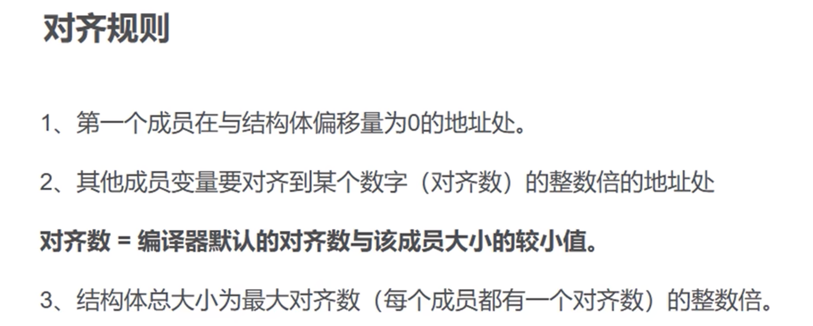

如果内存不对齐，那 CPU 的访问 内存/缓存 就需要两次访问拼接。

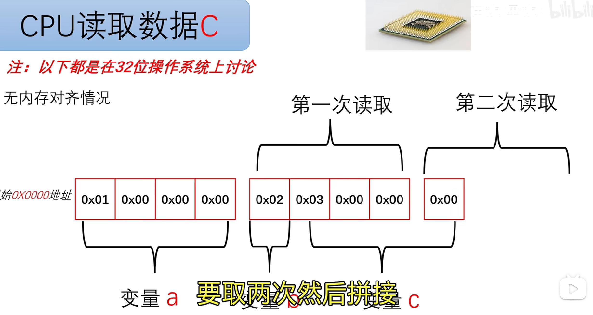

具体硬件设计：

因为内存条的设计，所以设计了内存对齐规则。（硬件设计与软件相配合）

首先看看简单的内存条的结构：

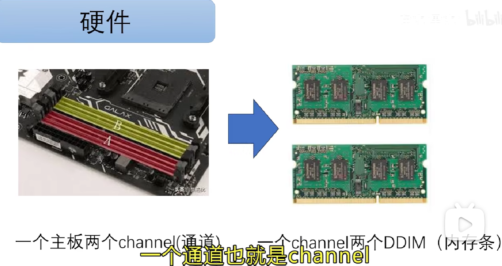

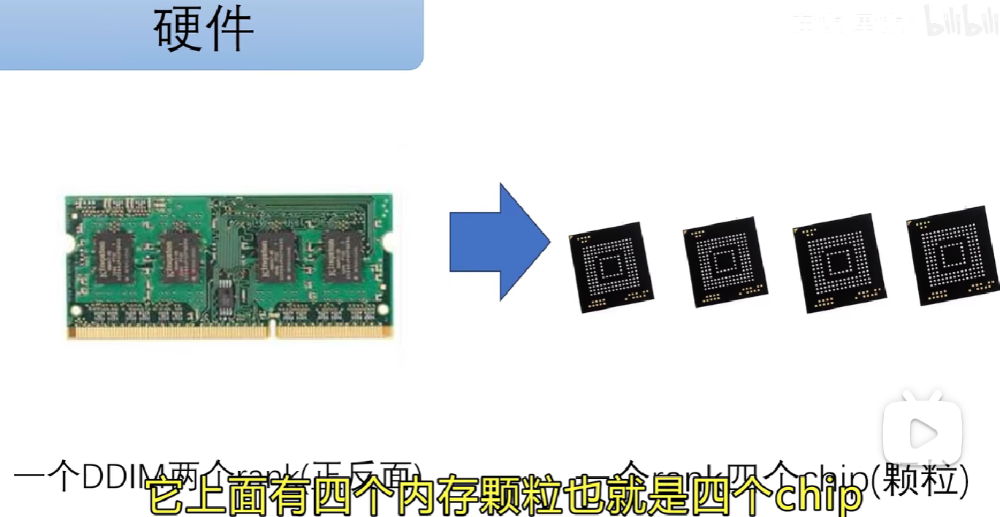

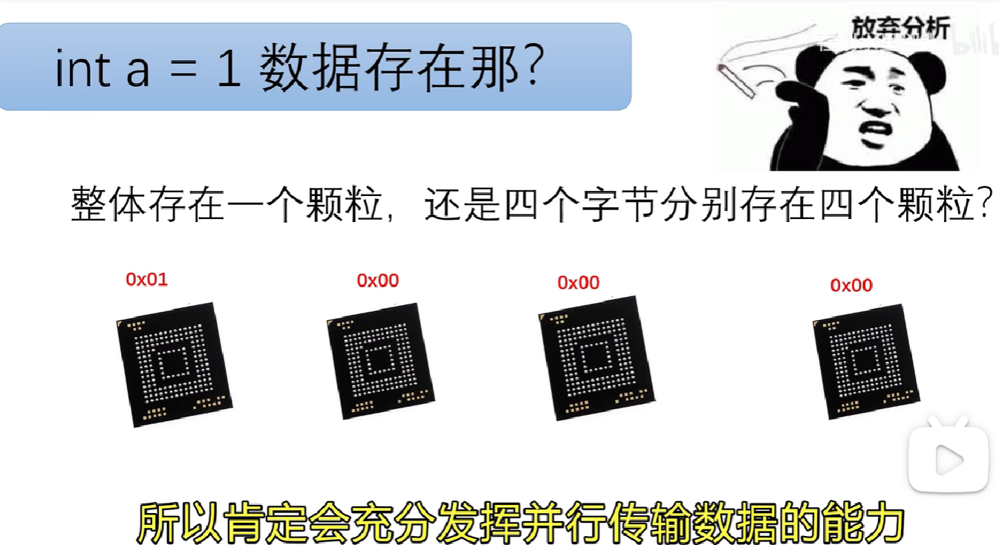

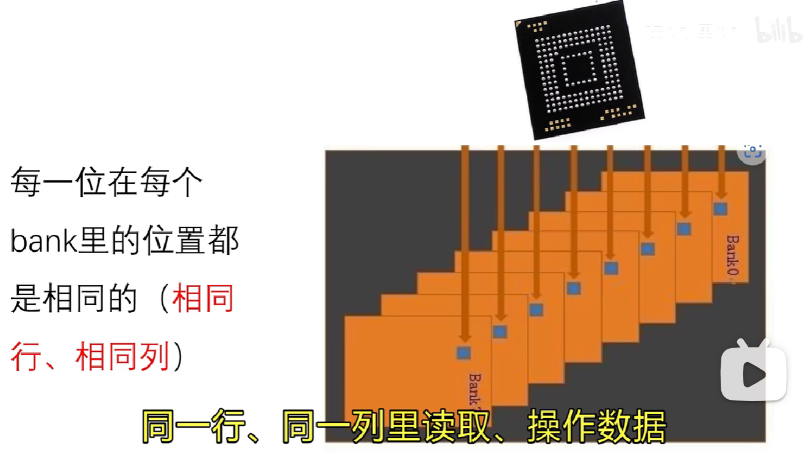

一个 chip，8 个 bank/array。每次都从array里读取一个bit出来，算出来就是一个byte了。再加上有四个 chip  ，那就是 4byte

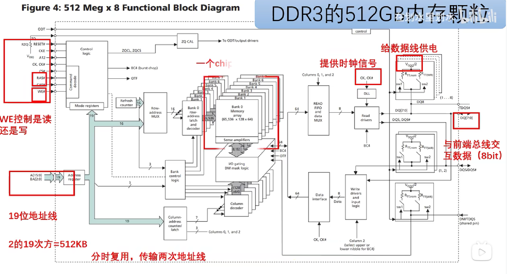

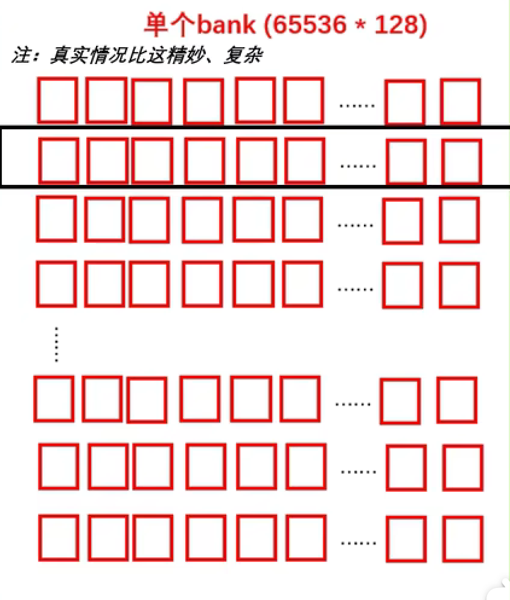

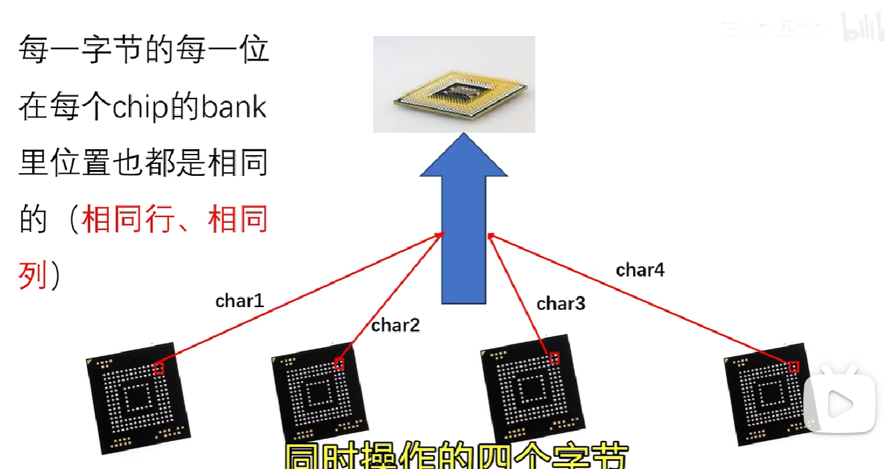


> 地址总线位数不够多（性能与数量的平衡）-> 
>
> 只能同时访问 32 个“相对地址”相同的数据位 ->
>
> 只能从被 4 整除的地址开始访问接下来的四个字节 ->
>
> 尽量让数据一次就能读取完成（速度快好啊）->
>
> 设置了内存对齐的规则

总结：内存对齐的直接原因：为了更高的访问效率、更好的缓存优化。

根本原因：对当前因地址总线限制导致的内存寻址“不自由”的一种妥协。

就是为了配合硬件，硬件设计变简单，效率也高；或者说是为了更好的利用并行的优势。


- 额外补充：

    缓存不对齐的时候，CPU 内部也是要进行拼接操作的（因为就是从DDR中搬的）。

    CPU (寄存器) 是和缓存打交道。

    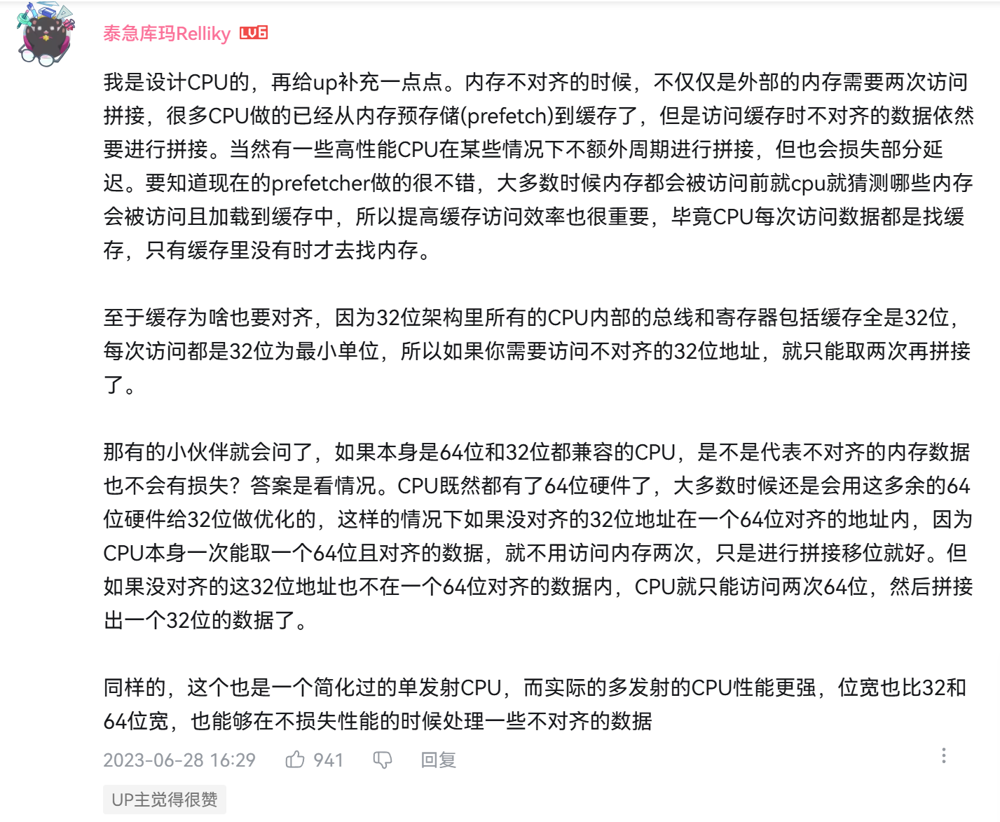

经过上面 b 站 up 主的讲解，个人总结。

首先从开始设计


> 计算机中每个模块并非独立工作, 不同的模块之间需要进行数据交换: CPU和内存控制器之间, 内存控制器和内存颗粒之间, 取指单元和译码单元之间等等,都需要通过一套约定的协议进行通信. 软件同样如此, 在我们使用的 DiffTest 中, NEMU需要与Spike通信, NPC也需要与NEMU通信才能实现相应的功能.

**==留坑==**：这里在完成了 ysyx 的总线部分再回来设计看看。


## cache 和 寄存器之间还有一层store buffer


## [如何理解：程序、进程、线程、协程？]

> 一个简单的回答：
>
> 程序是静态的，没有被运行，而进程是动态的，是被加载到内存中正在执行的程序，它具有一些程序不具有的动态的特点，譬如当前的堆栈状态、打开的文件等等。
>
> 为什么要有线程？因为进程被设计成具有独立的内存地址空间（内核的本质作用之一就是isolation），所以每创建一个新的进程就要分配新的[地址空间](https://www.zhihu.com/search?q=地址空间&search_source=Entity&hybrid_search_source=Entity&hybrid_search_extra={"sourceType"%3A"answer"%2C"sourceId"%3A1270041049})，而在实际中我们常常需要多个并发的执行实体共享一些[数据并行](https://www.zhihu.com/search?q=数据并行&search_source=Entity&hybrid_search_source=Entity&hybrid_search_extra={"sourceType"%3A"answer"%2C"sourceId"%3A1270041049})实现协作，所以就有了一种更轻量的实现方式：线程，线程之间是[共享内存](https://www.zhihu.com/search?q=共享内存&search_source=Entity&hybrid_search_source=Entity&hybrid_search_extra={"sourceType"%3A"answer"%2C"sourceId"%3A1270041049})（和page table）的，这样可以方便他们在各自独立工作的时候通过共享内存来协作。
>
> 并发（concurrency）和并行（parallelism）主要区别在于使用的上下文和名词的[connotation](https://www.zhihu.com/search?q=connotation&search_source=Entity&hybrid_search_source=Entity&hybrid_search_extra={"sourceType"%3A"answer"%2C"sourceId"%3A1270041049})不太一样。Concurrency一般强调的是线程之间的交互（同时做多个不同的事情），譬如如何同步不同的执行单元，concurrency往往和一致性、[protocol](https://www.zhihu.com/search?q=protocol&search_source=Entity&hybrid_search_source=Entity&hybrid_search_extra={"sourceType"%3A"answer"%2C"sourceId"%3A1270041049})有关。Parallelism常常被动词化（Parallelize），使用的上下文一般是：如何parallelize一个算法、一个循环（将一个任务[并行化](https://www.zhihu.com/search?q=并行化&search_source=Entity&hybrid_search_source=Entity&hybrid_search_extra={"sourceType"%3A"answer"%2C"sourceId"%3A1270041049})从而最快速地完成它）等等，往往和dependence graph有关，分析依赖关系，从而并行化。
>
> [高并发](https://www.zhihu.com/search?q=高并发&search_source=Entity&hybrid_search_source=Entity&hybrid_search_extra={"sourceType"%3A"answer"%2C"sourceId"%3A1270041049})往往意味着需要的线程特别特别多，远多于CPU的核心数，往往和协程或者[用户态线程](https://www.zhihu.com/search?q=用户态线程&search_source=Entity&hybrid_search_source=Entity&hybrid_search_extra={"sourceType"%3A"answer"%2C"sourceId"%3A1270041049})有关。为什么？因为在高并发的时候线程的创建、切换的开销就会格外明显，所以需要一些优化来降低这种开销。


想想进程是怎么提出来的，其实是依托于多道程序、虚拟地址相关的内容。

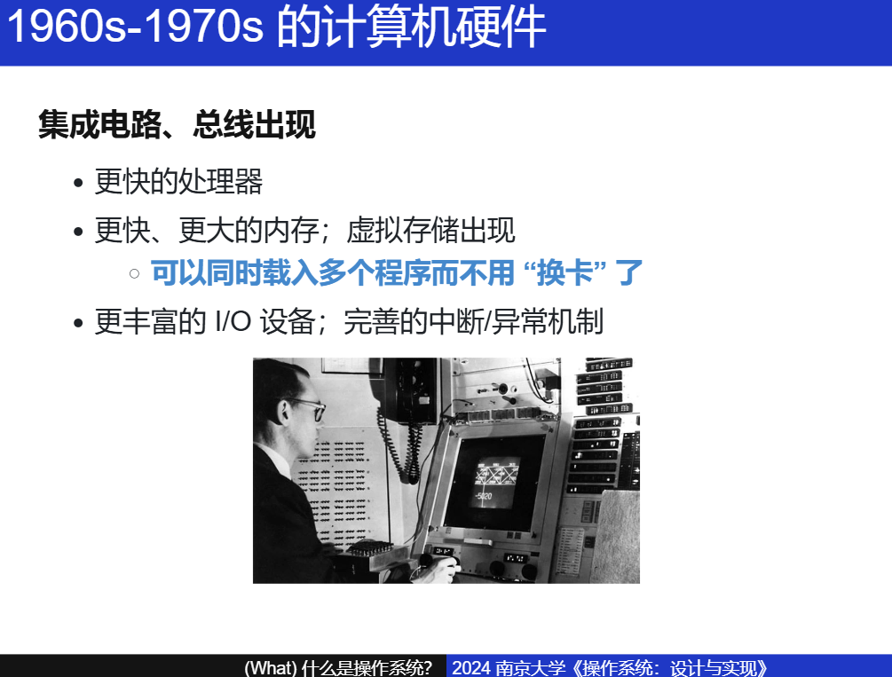

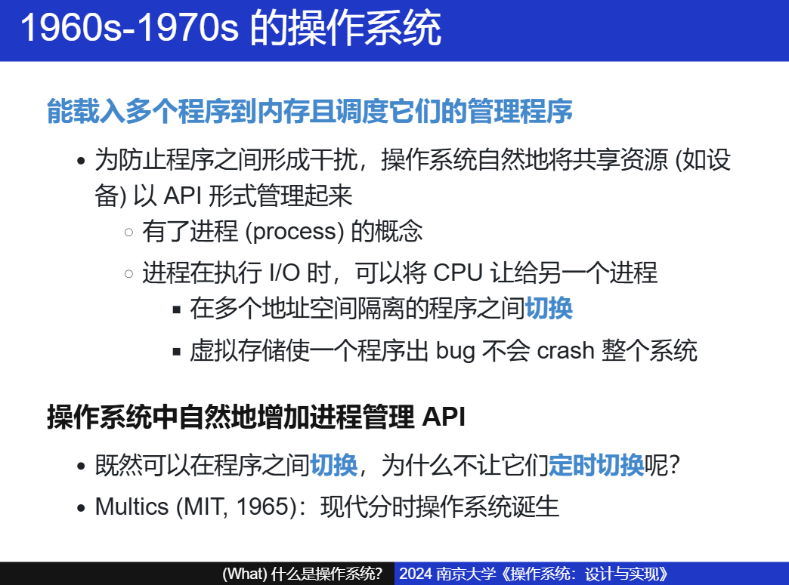


很好的一个问题，但是不是那种直接背八股的。

关于这一点，先明确一个认知，很多时候在讲解概念的时候，其实是在介绍一种实现，但也只是一种是实现。

[夏虞斌一种自然导出的OS教学方法-进程与线程篇](https://www.bilibili.com/video/BV1P34y1i7cG/?spm_id_from=333.999.0.0&vd_source=ecc99d78ae961113010161a48a475a35)

现代应用级的需求（或者别说现代了，自从2005年前后intel推出多核处理器就有了）：要使用多个CPU核、共享资源（内存、打开的文件、网络...），因为内存空间和CPU状态是不同的东西，可以解耦  --> 提出线程


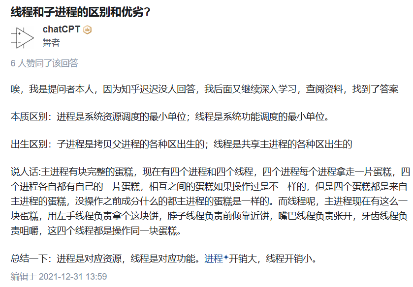


## 并发、并行、高并发

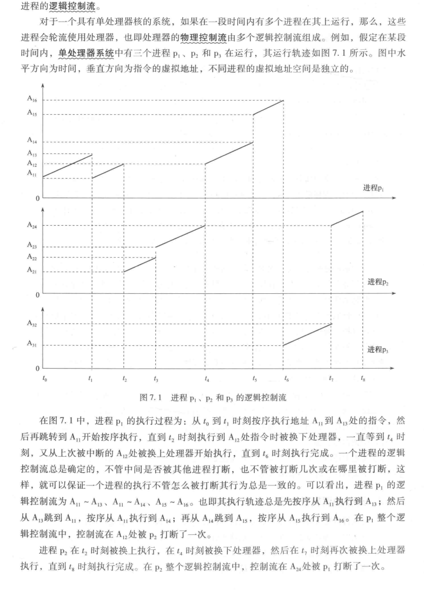

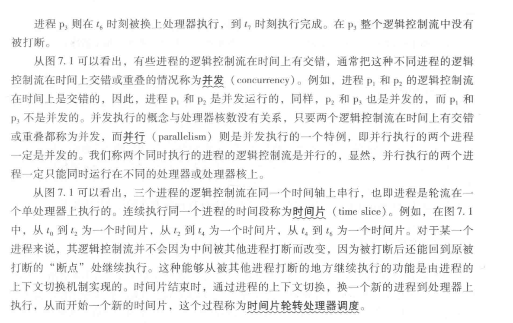


## 为什么学习操作系统？链表和顺序表 的按值查找插入操作谁更快一点

之后的按照计算机系统（操作系统、底层硬件、上层、编译原理、内存/cache等等）的视角思考之后，由系统的各个因素来影响这个问题，不单单从一个方面就能回答出比较满意的答案。


## 为什么很多时候读文件直接读4096个字符？

在C/C++编程中，经常会选择一次性读取4096个字符（或者其他固定大小的字节数）的原因有几点：

1. **性能考虑**：一次性读取较大的数据块可以减少I/O操作的次数，从而提高读取文件的效率。相比于每次读取一个字符或者一个字节，一次性读取更多的字符可以减少系统调用的开销，提高读取速度。

2. **减少系统调用**：文件I/O通常是比较慢的操作，涉及到系统调用和磁盘访问。一次性读取较大的数据块可以减少系统调用的次数，减少了系统调用的开销，提高了程序的性能。

3. **缓冲区大小**：一次性读取4096个字符通常是因为操作系统的缓冲区大小是4096字节（即4KB），这是一个比较常见的缓冲区大小。通过一次性读取整个缓冲区的数据，可以最大限度地利用操作系统提供的缓冲机制，减少读取数据的次数。

4. **简化代码逻辑**：一次性读取固定大小的数据块可以简化代码逻辑，减少错误的可能性。通过固定大小的读取操作，可以更容易地管理读取的数据，处理边界情况等。

需要注意的是，选择一次性读取多少数据取决于具体的应用场景和需求。有时候可能需要根据文件的大小、磁盘性能、内存限制等因素来确定合适的读取大小。


## 怎么理解缓冲区和缓存 buffer 和 cache

缓冲区和缓存在某种程度上有一些相似之处，但它们的作用和使用方式略有不同。

1. **缓冲区（Buffer）**：
   - **定义**：缓冲区是一种临时存储数据的区域，通常用于临时存放数据，以便在数据传输过程中进行处理或传输。在编程中，缓冲区通常是用来暂时存储数据，以便程序能够有效地处理或传输这些数据。
   - **作用**：缓冲区的主要作用是用来平衡数据的生产和消费速度，减少数据传输中可能出现的延迟或阻塞。通过使用缓冲区，可以提高数据传输的效率。

2. **缓存（Cache）**：
   - **定义**：缓存是一种高速临时存储，用于存放经常访问的数据或指令，以提高数据访问速度。在计算机系统中，缓存通常用于存储CPU频繁访问的数据，减少对主存的访问次数，从而提高程序的执行效率。
   - **作用**：缓存的主要作用是提高数据访问速度，通过存储热点数据，减少对慢速存储介质（如主存）的访问，从而加快数据访问速度。

虽然缓冲区和缓存都是用于临时存储数据，但它们的作用和使用场景有所不同。缓冲区通常用于数据传输过程中的临时存储，而缓存主要用于提高数据访问速度。在理解缓冲区时，可以将其视为一个临时存储数据的区域，用于在数据传输或处理过程中临时存放数据。


## 引用和定义的区别？

一个是编译（定义）要用到到，一个是链接（引用）要用到的。


## 关于描述CPU的速度的指标

[29 | CISC和RISC：为什么手机芯片都是ARM？-深入浅出计算机组成原理-极客时间 (geekbang.org)](https://time.geekbang.org/column/article/104259?screen=full)

[03 | 通过你的CPU主频，我们来谈谈“性能”究竟是什么？-深入浅出计算机组成原理-极客时间 (geekbang.org)](https://time.geekbang.org/column/article/92215)

[04 | 穿越功耗墙，我们该从哪些方面提升“性能”？-深入浅出计算机组成原理-极客时间 (geekbang.org)](https://time.geekbang.org/column/article/93246)


## 为什么CTRL+C这种操作能暂停程序的运行？这是什么？

[NEMU/NPC 的 Ctrl+C 退出 - 张承译 - 一生一芯双周分享会_哔哩哔哩_bilibili](https://www.bilibili.com/video/BV1XM4m1Z7K4/?spm_id_from=333.999.0.0&vd_source=ecc99d78ae961113010161a48a475a35)

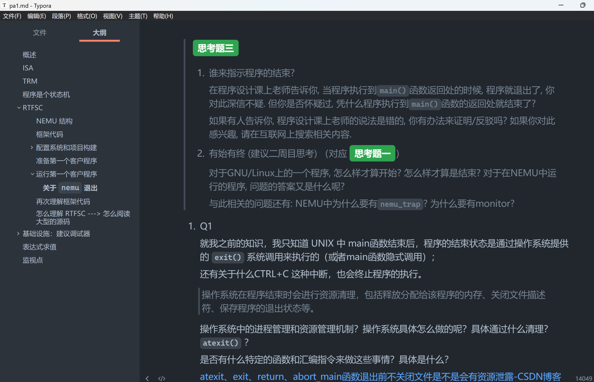


## 从远程服务器获取和应用更新, 怎么做到? 其内部的物理原理是什么? 

OTA（Over-The-Air）升级技术允许设备通过无线网络远程更新固件或软件，而无需物理连接。这项技术在物联网（IoT）设备、智能手机、汽车、嵌入式系统等领域得到了广泛应用。

**安全地从远程服务器获取和应用更新**的过程通常涉及以下几个方面：

1. **数据加密**：使用强加密算法（如 AES、RSA）对传输的固件数据进行加密，以防止数据在传输过程中被截获和篡改。

2. **身份验证**：通过数字证书或用户名和密码等方式验证设备和服务器的身份，确保数据只能由授权的设备和服务器交换。

3. **固件签名**：固件在上传到服务器之前被签名，设备在下载固件后会验证签名，以确保固件的完整性和来源的真实性。

4. **传输安全协议**：使用安全传输协议（如 HTTPS、TLS/SSL）来保护数据传输过程中的安全性。

5. **完整性校验**：通过哈希函数（如 SHA-256）计算固件的哈希值，并在下载后进行匹配，以确保固件在传输过程中未被篡改。

6. **错误检测和重试机制**：在下载过程中进行错误检测，如果发现错误则重新下载，以确保固件文件的完整性。

7. **断点续传**：如果下载过程中断，可以从中断的地方继续下载，而不是重新开始。

8. **回滚机制**：如果更新失败，系统可以回滚到之前的稳定版本，以保证设备的可用性。

**物理原理**方面，OTA更新主要利用了无线通信技术，通过电磁波来传输数据。电磁波是由电场和磁场交替变化而产生的波动现象，它们以光速在空间中传播。无线通信设备（如 Wi-Fi、蓝牙、移动数据网络）通过调制和解调技术，将数字信号转换为电磁波并进行传输。这些电磁波被接收设备捕获，并转换回数字信号以供处理。

在实施OTA更新时，通常会涉及到无线通信的安全保障措施，包括使用加密协议、物理层安全措施、网络安全措施以及设备安全措施。这些措施共同确保了无线通信的安全性，从而使得OTA更新可以安全地进行。


