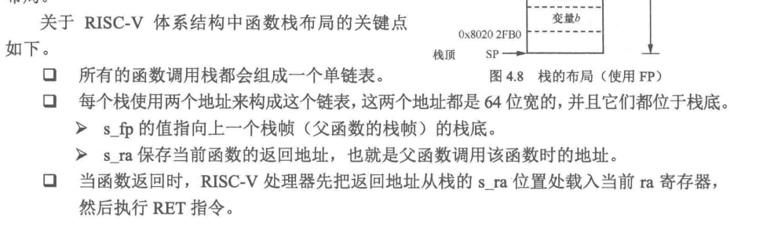

## 交叉编译工具链

### Toolchain

我们常说的工具链是编译所需的编译器、基本工具和库这一集合，当然还能包括构建工具、常用的开发人员库等等。

[Toolchains: A horror story. Real world examples of how a seemingly… | by Ruvinda Dhambarage | Medium](https://ruvi-d.medium.com/toolchains-a-horror-story-bef1ef522292)


### what is cross compiling

[Toolchains: A horror story. Real world examples of how a seemingly… | by Ruvinda Dhambarage | Medium](https://ruvi-d.medium.com/toolchains-a-horror-story-bef1ef522292)


### **Target triple**

[A master guide to Linux cross compiling](https://ruvi-d.medium.com/a-master-guide-to-linux-cross-compiling-b894bf909386)

使用目标三元组来描述 Unix 系统的运行时环境：

`ISA-Vendor-OperatingSystem`

`[arch]-[vendor]-[os]-[libc/abi])` 

ISA常见的那几个，x86_64、arm、riscv64...

供应商Vendor通常被标记为 `unknown`、`none`、或者直接省略。

而 `OperatingSystem` 往往是比较复杂的，它描述了系统的运行时环境细节：通常包括 `kernel type`、C 库和 ABI（C库和 ABI 通常结合在一起）。综合起来为： `kernel-ClibABI`。

如下例子：

```TXT
|           Target Triple            |    CPU/ISA     | Vendor | Kernel  | C lib |   ABI   |
|------------------------------------|----------------|--------|---------|-------|---------|
| x86_64-linux-gnu                   | x86_64         | -      | Linux   | GNU   | -       |
| arm-cortex_a8-poky-linux-gnueabihf | Cortex A8      | Yocto  | Linux   | GNU   | EABI-HF |
| armeb-unknown-linux-musleabi       | ARM Big Endian | -      | Linux   | musl  | EABI    |
| x86_64-freebsd                     | x86_64         | -      | FreeBSD | -     | -       |
```

在三元组后面跟着各种编译工具：`triple-gcc`、`triple-objdump`...

自己遇到的例子：

> - ARM:
>     - **arm-linux-gcc**：这是一个较老的命名方式，用于编译运行在ARM架构上的Linux系统应用程序。它通常链接到glibc库。
>     - **arm-linux-gnueabi-gcc**：这个编译器用于编译运行在ARM架构上的Linux系统应用程序，适用于任何CPU型号，链接到GNU EABI库。
>     - **arm-linux-gnueabihf-gcc**：与`arm-linux-gnueabi-gcc`类似，但默认使用hard浮点ABI，适用于有FPU的ARM架构。
>     - **arm-none-eabi-gcc**：用于编译不依赖操作系统的ARM架构应用程序，通常用于裸机环境，链接 newlib 等。
>     - **arm-none-linux-gnueabi-gcc**：用于编译运行在ARM架构上的Linux系统应用程序，适用于任何CPU型号，链接到GNU EABI库。
> - RISC-V
>     - **riscv64-unknown-linux-gnu-gcc**：这是一个64位的RISC-V交叉编译工具链，用于编译运行在Linux系统上的应用程序，链接到glibc库。
>     - **riscv64-unknown-elf-gcc**：这是一个64位的RISC-V交叉编译工具链，用于编译不依赖操作系统的裸机应用程序，链接到newlib库。
>     - **riscv-none-embed-gcc**：这是为裸机（bare-metal）嵌入式系统而生成的交叉编译工具链，使用newlib或newlib-nano库，能够为嵌入式系统生成更加优化的代码体积。

> 一些启发：
>
> arm-none-eabi-gcc 一般适用用于 Arm Cortex-M/Cortex-R 平台，它使用的是 newlib 库。
>
> arm-linux-gnueabi-gcc 和 aarch64-linux-gnu-gcc 适用于 Arm Cortex-A 系列芯片，前者针对 32 位芯片，后者针对 64 位芯片，它使用的是 glibc 库。可以用来编译 u-boot、linux kernel 以及应用程序。
>
> 另外需要补充一点的是，32 位的 Arm 和 64 位的 Arm，它们的指令集是不同的，所以需要使用不同的工具链。当然，Arm64 为了保证前向兼容，提供了一个 32 位的兼容模式，所以我们用 arm-linux-gnueabi-gcc 编译的应用程序也是可以直接在Arm64 的系统上运行的，但是 Linux Kernel 和 U-Boot 就不行，除非你提前把 CPU 切换到 32 位模式。曾经有个项目使用了一颗四核的 Arm64 芯片，但是内存只有64M，为了节省空间，在 CPU 运行到 U-Boot 之前，我们就把它切到了 32 位模式，后面的 U-Boot、Linux Kernel，应用全部都用 32 位编译，加上 Thumb 指令集，节省了不少空间。[一次搞定 Arm Linux 交叉编译](https://segmentfault.com/a/1190000020955640)

但是 C lib 和 ABI 究竟是啥？


### ABI & C lib

#### ABI（application binary interface）

来自 Wikipedia：

In [computer software](https://en.wikipedia.org/wiki/Computer_software), an **application binary interface** (**ABI**) is an [interface](https://en.wikipedia.org/wiki/Interface_(computing)) between two binary program modules. Often, one of these modules is a [library](https://en.wikipedia.org/wiki/Library_(computing)) or [operating system](https://en.wikipedia.org/wiki/Operating_system) facility, and the other is a program that is being run by a user.

即涉及到机器码层面，两份二进制文件怎么进行交互，而这怎么访问对方的数据内容。

具体内容：

- ISA：寄存器文件的结构、栈如何组织、内存访问的类型
- 处理器可以直接访问的基本数据类型的大小、布局和对齐
- 调用约定：如何传递参数、返回值：（做完 PA 应该很熟悉，就是描述父子函数如何编译链接的）
    - 函数参数用栈传递还是用栈
    - 哪些寄存器用于存放函数参数
    - Whether the first function parameter passed on the stack is pushed first or last（有点迷糊）
    - 调用者还是被调用者清除栈
    - 栈的布局
- 应用程序如何使用系统调用
- 在完整的操作系统ABI的情况下，目标文件、库等的二进制格式


具体例子来说：System V generic ABI + RISC-V


来源：《RISCV体系结构编程》

- **栈组织**：RISC-V使用标准的Callee-saved和Caller-saved寄存器约定，以及特定的栈帧布局。

    - RISC-V没有提供特点的入栈、出栈指令。

    - 两种栈组织

        - 不使用 FP

            

        - 使用 FP

            

- **基本数据类型**：例如，RISC-V可能会规定 `int` 类型为32位或64位，具体取决于具体的实现。

- **二进制格式**：RISC-V通常会使用ELF格式，ABI会定义特定的ELF头部和节（section）的要求。

- **异常处理**

    在RISC-V 体系结构中，异常处理和中断处理都属于异常。具体看手册


- EABI

    这里再补充 EABI
    嵌入式应用二进制接口指定了文件格式、数据类型、寄存器使用、堆积组织优化和在一个嵌入式软件中的参数的标准约定。
    开发者使用自己的汇编语言也可以使用EABI作为与兼容的编译器生成的汇编语言的接口。
    支持EABI的编译器创建的目标文件可以和使用类似编译器产生的代码兼容，这样允许开发者链接一个由不同编译器产生的库。
    EABI与关于通用计算机的ABI的主要区别是应用程序代码中允许使用特权指令，不需要动态链接（有时是禁止的），和更紧凑的堆栈帧组织用来节省内存。广泛使用EABI的有Power PC和ARM.


#### C library

C库（也称为C语言运行时库）是一组预先编写好的代码，它们实现了C语言标准中定义的函数和设施。这些库为C语言程序员提供了一套通用的、可重用的代码来执行常见的任务，比如输入输出、字符串处理、数学计算、内存管理、数据处理等.

> 1. **标准库函数**：这些是ISO C标准中定义的函数，包括但不限于：
>     - 输入输出函数（如`printf`、`scanf`、`fgets`、`fputs`）
>     - 字符串处理函数（如`strcpy`、`strlen`、`strcmp`、`strcat`）
>     - 数学计算函数（如`sin`、`cos`、`pow`、`sqrt`）
>     - 动态内存管理函数（如`malloc`、`calloc`、`realloc`、`free`）
>     - 其他实用函数（如`rand`、`srand`、`abs`、`atoi`）
> 2. **系统级支持函数**：这些函数提供了与操作系统交互的能力，例如文件操作、进程控制、信号处理等。
> 3. **启动和终止代码**：C运行时库通常包含了程序启动时（如`main`函数之前）和终止时（如`main`函数之后）执行的代码。这包括了初始化全局变量、分配内存、关闭文件描述符、释放资源等。
> 4. **浮点数学支持**：提供了浮点数的格式化输入输出、浮点异常处理等功能。
> 5. **本地化和国际化支持**：提供了多语言支持，包括字符集转换、本地化字符串处理等。
> 6. **调试支持**：提供了调试工具和函数，帮助开发者诊断程序中的问题。

在 计算机系统基础中，如果是有 OS 的环境，我们知道实际的 `printf` 依赖于 OS 向 lib 提供的系统调用 `write, brk` 等系统调用，而系统调用是 OS 、app/user 之间的接口，为的就是user能够操作一些硬件设备，具体到 `printf` 就是我们的终端。但我们也弄过嵌入式，那个时候也用到了`printf`，但是我们做的是串口重定向的操作。

所以，并不是在有 OS 的环境下才能用 C 库，在 bare-meatal 下我们依旧能够使用，只不过是说我们需要自己做一部分的操作来直接控制硬件，就像 `printf` 和串口重定向；更有甚者，使用直接操作硬件的方式实现I/O操作，而不依赖于标准库中的文件流操作函数，当然工作量稍大，应该没人这么做？所以，在裸机环境下，同样也是有他人实现好的 C 运行库：Newlib。它旨在为没有操作系统支持的 bare-metal 环境提供基本的 C 库功能，库中的函数对运行时环境的要求极低，不依赖于操作系统运行，我们不必为了配合 C 库而在 bare-metal 上实现额外的功能。Newlib 提供了一组“stub”函数，这些函数模拟了系统调用，使得 Newlib 可以在没有操作系统的环境中工作。而 glibc 和 uClibc 都需要依赖于操作系统的底层支持。


所以，关于 ABI 和 C 库的关系自己大概可以总结一部分：

- **C库可以是ABI的一部分**：在某些情况下，C库的接口和行为可能被包含在ABI的定义中，特别是当C库函数作为系统级接口时。
- **C库的实现依赖于ABI**：C库的函数需要遵循特定的ABI来实现，以确保它们能够被不同编译器生成的代码正确调用。例如，C库中的`printf`函数的实现需要遵循平台的ABI中的调用约定和寄存器使用规则，不过这应该是编译器工作需要做的。
- **ABI不仅限于C库**：ABI涵盖了所有二进制接口，包括但不限于C库。它还定义了其他语言运行时库、系统调用、以及操作系统和应用程序之间的交互。


还是配合ABI例子：

> `kimi`：
>
> 1. **函数调用约定**：
>     - 在RISC-V Linux平台上，ABI定义了函数参数的传递方式。例如，RISC-V的调用约定可能规定前几个整数或指针参数通过寄存器`a0`, `a1`, `a2`, `a3`等传递，超出的参数通过栈传递。
>     - `printf`函数的实现需要遵循这一规则，以确保正确地从寄存器或栈中读取参数。
> 2. **寄存器使用**：
>     - ABI可能规定了哪些寄存器用于传递函数参数，哪些寄存器用于返回值。例如，`a0`可能被用于传递`printf`的第一个参数（格式字符串的指针），而返回值（例如，打印的字符数）可能被存储在`a7`寄存器中。
> 3. **栈布局**：
>     - ABI定义了栈的布局和对齐要求。在RISC-V Linux平台上，栈通常是向右增长的（即向低地址方向增长），并且可能要求特定的对齐方式，如16字节对齐。
> 4. **系统调用**：
>     - 在Linux系统中，系统调用是通过特定的指令和寄存器进行的。ABI定义了如何使用这些寄存器传递系统调用号和参数。例如，`a7`寄存器可能被用于传递系统调用号，而其他寄存器用于传递系统调用的参数。
> 5. **浮点支持**：
>     - 如果RISC-V处理器支持浮点操作，ABI将定义如何传递浮点参数。例如，浮点参数可能通过浮点寄存器`fa0`, `fa1`等传递。
> 6. **C库函数的特定行为**：
>     - ABI可能规定了C库中某些函数的特定行为。例如，`strlen`函数的实现需要遵循ABI中关于内存访问的规则，以确保正确地计算字符串的长度。
> 7. **二进制格式**：
>     - 在Linux系统中，可执行文件和库文件通常使用ELF（Executable and Linkable Format）格式。ABI定义了ELF文件的布局，包括如何存储符号表、重定位信息和其他元数据。
> 8. **C库作为系统级接口**：
>     - 在某些情况下，C库函数可能被用作系统级接口。例如，`malloc`和`free`函数可能被操作系统调用以管理动态内存分配。在这种情况下，ABI可能定义了这些函数的接口和行为。

一些文档：[C Library - OSDev Wiki](https://wiki.osdev.org/C_Library)


### Toolchain example

不管是裸机交叉编译工具链**arm-none-eabi**，还是Linux交叉编译工具链**arm-linux-gnueabi**，其实没有本质的区别，工具链都能编译成相应架构的指令、链接生成可执行代码。只不过

> arm-none-eabi默认使用的是**非Linux接口的C库**，适合于裸机开发，无法开发基于Linux的应用程序。
>
> arm-linux-gnueabi默认使用的是**Linux接口的C库**，适合于Linux应用程序开发。

通常情况下，我们如果用C语言开发，**如果重新实现C库往往不现实**，需要交叉编译工具链支持标准C库。

对于arm交叉编译工具链，一般会支持三个最基本的库(静态库为例)：libgcc.a、 libc.a、 libm.a。

> SofTool.CN Notes:
> **libgcc.a** ： 在编译gcc时产生，提供平台相关的底层运行库，大多数用于目标处理器的算术运算。如对于arm9，不支持硬件除法，硬件浮点，代码中任何除法、浮点相关操作都应该去链接libgcc.a，由libgcc.a提供除法、浮点操作的软件模拟实现。但对于支持硬件除法、硬件浮点的cortex-a架构cpu，无需libgcc.a提供软实现，编译器直接生成除法或浮点指令，处理速度是软实现远远不及的。
> **libc.a** ： C语言标准函数库
> **libm.a** ： 数学处理库

**用于裸机开发以及用于Linux应用开发的Arm交叉编译工具链实质是一样的，只不过采用库的策略差异。**理论上只要用裸机开发的交叉编译工具链编译一个**基于某个Linux内核头的C库(如: glibc)**，那么就可以实现Linux应用程序的编程。同样，Linux应用开发的交叉编译工具链只要再编译一个**基于裸机开发的C库(如: newlib)**，即可实现标准的裸机编程，与windows下mdk、iar等裸机开发无异。


### 交叉编译工具链的原理

https://crosstool-ng.github.io/Adocs/toolchain-construction/

加拿大编译。

The key to cross compiling is understanding what these terms means in relation to the different types of things that you will be building.

**Build machine**: where the code is built
**Host machine**: where the built code runs
**Target machine** (only relevant for compiler tools): where the binaries spit out by the built code runs

Again, target triples will be used to describe these systems.

e.g. Lets say I am using a Linux PC (x86_64-linux-gnu) to cross compile a CMake application called “Awesome” to run on a BeagleBone Black SBC (armv7-linux-gnueabihf) using a GCC cross compiler. In this example:

```
| Component |    Type     | Build  |  Host  | Target |
|-----------|-------------|--------|--------|--------|
| GCC       | Compiler    | x86_64 | x86_64 | armv7  |
| CMake     | Build tool  | x86_64 | x86_64 | N/A    |
| Awesome   | Application | x86_64 | armv7  | N/A    |
```

Your key take away here should be that the build/host/target label changes depending on what you are building. A common n00b mistake is to use the same host/target triple values used to build GCC when building applications that run on your embedded device, like for example Busybox. In this example the host for GCC is x86 but the host for Busybox is ARM. Understanding this fundamental is half the battle of cross compiling!


## Project example


[交叉编译学习笔记（二）——交叉编译器的命名规则-腾讯云开发者社区-腾讯云 (tencent.com)](https://cloud.tencent.com/developer/article/1010138)

交叉编译工具链包括哪些？

[Arm Compiler Software Development Guide](https://developer.arm.com/documentation/dui0773/l/Introducing-the-Toolchain/Toolchain-overview)

1. C库包括哪些？

    newlibc？glibc？musl？

    [How a toolchain is constructed (crosstool-ng.github.io)](https://crosstool-ng.github.io/docs/toolchain-construction/)

2. C标准库和交叉编译工具链的关系

    编译工具链包括了C标准库？

3. abi是什么？能不能举一些具体例子？eabi呢

    C库和ABI之间的关系？

4. 怎么在裸机上移植标准库？C语言？

    [02_构建标准C库newlib - Linux 嵌入式开发 (softool.cn)](https://softool.cn/read/embedded_linux/20072402.html)

    [如何把 C 语言移植到 RISC-V 裸机上 (risehere.net)](https://risehere.net/posts/running-c-program-on-bare-machine/)

    [基于RISC-V rv32i的裸机C语言代码执行_riscv32-unknown-elf-objcopy-CSDN博客](https://blog.csdn.net/qq_42357476/article/details/128273790)

    为裸机编写 C 语言程序，不能引用标准库中的函数？如 printf

    > 在裸机环境下编写C语言程序时，通常不能直接使用标准库中的函数，如`printf`，原因如下：
    >
    > 1. **没有操作系统支持**：裸机环境意味着没有操作系统的支持。标准库中的许多函数，如`printf`，依赖于操作系统提供的服务，例如输出流重定向和设备管理，这些在裸机环境中是不可用的。
    >
    > 2. **缺乏库实现**：在裸机环境中，没有操作系统提供的库实现，因此即使代码中调用了`printf`，编译器也无法找到其实现，导致链接错误。
    >
    > 3. **资源限制**：裸机环境通常资源有限，而标准库函数可能会占用较多的内存和处理能力。在资源受限的嵌入式系统中，这可能是不可接受的。
    >
    > 4. **硬件依赖性**：裸机程序直接与硬件交互。例如，`printf`函数通常需要输出到控制台，但在裸机环境中，可能没有控制台设备，而是需要直接操作硬件（如UART或LCD控制器）来实现输出。
    >
    > 5. **初始化过程**：许多标准库函数在第一次调用前需要初始化。在裸机环境中，这种初始化通常需要程序员手动完成，或者完全避免使用这些函数。
    >
    > 6. **可预测性**：在实时系统中，程序的行为需要高度可预测。标准库函数可能会引入非确定性行为，如动态内存分配和系统调用，这在实时系统中是不可取的。
    >
    > 尽管如此，你仍然可以在裸机程序中使用一些标准库函数，但通常需要进行特定的配置和修改，例如：
    >
    > - **使用裸机库版本**：一些编译器提供了专为裸机环境设计的库版本，如newlib的nano版本或mingw-libgcc。
    > - **自己实现函数**：你可以自己实现所需的库函数，例如，实现一个简单的`printf`函数，直接向UART或其他硬件接口发送数据。
    > - **静态内存分配**：避免使用动态内存分配函数，如`malloc`和`free`，改用静态或全局变量。
    > - **简化的I/O操作**：使用直接操作硬件的方式实现I/O操作，而不是依赖于标准库中的文件流操作函数。
    >
    > 总之，在裸机编程中，程序员需要对程序的行为有更精细的控制，并且通常需要避免使用标准库中那些依赖于操作系统的函数。


## Ways to cross compile

Now that we have covered the fundamentals, lets jump to the actual how-to

### 1. With a standalone toolchain

This is the manual, traditional way to cross build.

**Step one:** Get a toolchain. You can get a precompiled toolchain from your silicon vendor (e.g. [for BeagleBone black](https://software-dl.ti.com/processor-sdk-linux/esd/docs/latest/linux/Overview/GCC_ToolChain.html)) or from a project like [Linaro](https://developer.arm.com/downloads/-/arm-gnu-toolchain-downloads). Alternatively you can build one yourself with something like [crosstool-ng](https://github.com/crosstool-ng/crosstool-ng).

**Step two:** Install any host tools that will be required (e.g. CMake)

**Step three:** Cross build and install any libraries that will be required (e.g. OpenSSL, SQLite, etc..). You will need to install the compile time dependencies (i.e. headers and static libs) to the toolchain’s [sysroot](https://www.baeldung.com/linux/sysroot) and install any runtime dependencies (i.e. shared libs) on the target device. Note that you can and should avoid the runtime dependencies by preferring to statically link your dependencies.

**Pro tips:**

- Use a Docker image for the cross building. It helps to isolate the various host tools and libraries needed so that you don’t accidentally brick your work laptop by installing an ARM build of OpenSSL on your PC. *Definitely not a personal experience* 😛
- Modern languages like Rust and GO lang have “in-built” support for cross compiling and is generally very easy to setup.
- If you are actively developing a C++/CMake applications, try using [Conan](https://conan.io/). It helps a lot to abstract the cross building process, making the build process less error prone and repeatable. It has the added advantage making onboarding easier.

### 2. With an Embedded build system: Yocto or Buildroot

I will admit that this is akin to using a bazooka to kill a fly. But then, if you already have a bazooka lying around, it’s not the worst idea in the world.

An embedded build system’s primary job is to build a custom distro or root filesystem for an embedded device. This involves cross compiling numerous applications. So you can leverage the same build infrastructure to do your standalone cross builds as well.

The chances are high that someone has already added support for what you are trying to build in Yocto or buildroot. Which means that the build configuration and dependencies are already available. This can be a life saver for packages with complex dependencies or for packages that need a lot of configuration updates to support cross builds. The obvious con here is that it is a lot harder to setup; especially if you have no prior experience with these build systems.

### 3. Build on QEMU

Here is a neat trick! You can cheat with an ARM QEMU virtual machine on your developer machine to do “native” builds that will produce binaries that will run on your target embedded device. Take care to configure the QEMU hardware and the native toolchain that you will be using to match with your target device. Also, be aware that the build speed won’ t be great due to the ARM to x86 translation. But otherwise this is a totally viable option, especially for esoteric packages/build systems that has no support for cross compiling.


[DevOps for Embedded C/C++. How to spot and fix the red flags in… | by Ruvinda Dhambarage | Medium](https://ruvi-d.medium.com/devops-for-embedded-c-c-29cd8e14bc81)


