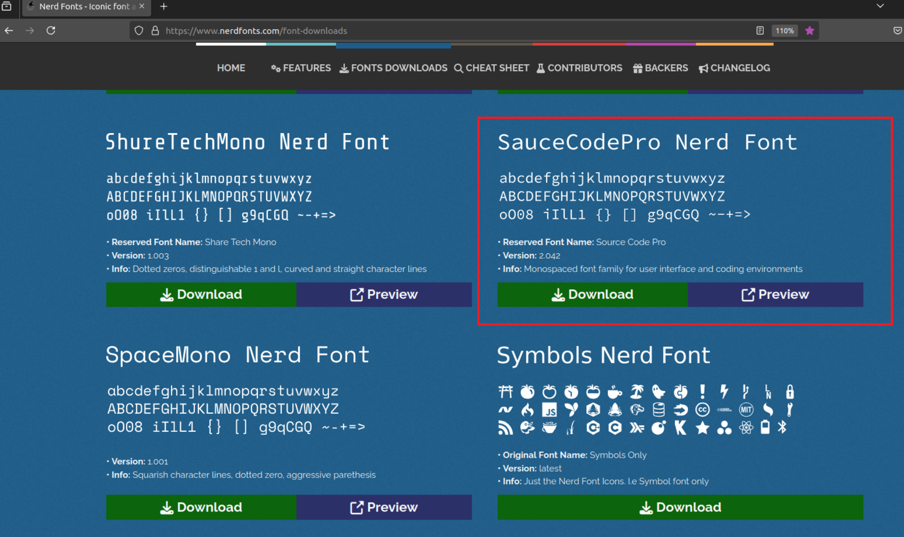

## Introduction

> 开发环境：
>
> - Ubuntu22.04
> - VIM 8.2 及以上

主要记录个人的相关配置，以便之后更换电脑后能快速配置成个人熟悉的。

另外，本人并不爱折腾这些工具配置，仅仅只是为了让自己有一个舒适的开发环境。

本人对于这些工具的配置以默认为主，仅仅适合自己。


## Terminal config

### Colors theme

这里使用 Dracula 的颜色主题，不过多解释，官网有步骤，跟着一步步做即可。

[Gnome Terminal • Dracula Theme](https://draculatheme.com/gnome-terminal)

唯一需要注意的是，我是另外开了一个 profile 来保存配置（我自己的叫 `dracula`），而且最后安装的时候，直接用默认的配置。


相关命令：

```shell
sh install.sh -s Dracula -p dracula --skip-dircolors
```


### Font

配置主要参考：https://itsfoss.com/install-fonts-ubuntu/#step-2-install-the-new-fonts

对于终端的字体，我使用的是 `SauceCodePro Nerd Font Mono`，在 https://www.nerdfonts.com/font-downloads 下载




## Vim Config

### Colors/Theme

颜色依旧采用 Dracula

官网依旧有指导：[Vim • Dracula Theme](https://draculatheme.com/vim)


### `.vimrc`

通过 `.vimrc` 和 `.vim-plugin-config` 的配置。

```bash
"" vim: ft=vim :
" =============> plugin install <============= "
call plug#begin('~/.vim/plugged')

Plug 'vim-airline/vim-airline'
Plug 'neoclide/coc.nvim', {'branch': 'release'}

Plug 'git://github.com/junegunn/fzf', { 'do': { -> fzf#install() } }
Plug 'git://github.com/junegunn/fzf.vim'

Plug 'git://github.com/Shougo/defx.nvim.git'
Plug 'git://github.com/roxma/nvim-yarp.git'
Plug 'git://github.com/roxma/vim-hug-neovim-rpc.git'
Plug 'git://github.com/kristijanhusak/defx-icons.git'
Plug 'git://github.com/esukram/vim-taglist'

Plug 'vhda/verilog_systemverilog.vim'
Plug 'rust-lang/rust.vim'

call plug#end()


" =============> theme config <============= "
packadd! dracula
syntax enable
colorscheme dracula

"" The "syntax on" command have to be before the "highlight ..." commands to make highlight working.
"" For more information, see :highlight and :syntax
syntax on

highlight Error NONE
highlight Comment cterm=italic guifg=#808080
"highlight Statement cterm=bold
"highlight String cterm=underline


" =============> File type-specific config <============= "
"" TODO: cinoptions
au FileType c,cpp       setlocal expandtab shiftwidth=4 softtabstop=4 tabstop=4 cinoptions=:0,g0,(0,w1
au FileType json        setlocal expandtab shiftwidth=2 softtabstop=2
au FileType vim         setlocal expandtab shiftwidth=2 softtabstop=2


" =============> Shortcut mappings <============= "
nnoremap <space>b :buffers<cr>:b<space>
nnoremap <space>B :buffers<cr>:b<space>
nnoremap <space>e :b#<cr>
nnoremap <space>E :b#<cr>
nnoremap <space>w :w<cr>
nnoremap <space>W :w<cr>
nnoremap <space>q :qa<cr>
nnoremap <space>Q :qa<cr>
nnoremap ZZ zz
inoremap jf <esc>
inoremap JF <esc>


" =============> basic config <============= "
set nocompatible
set encoding=utf-8
set nosmartindent autoindent cindent
set shiftwidth=4 softtabstop=4 tabstop=4
set laststatus=2 ruler title showmode cmdheight=1
set belloff=all noerrorbells novisualbell
set modeline modelines=6
set number
set nowrap
set incsearch hlsearch
set cursorline
setlocal noswapfile
set bufhidden=hide
set magic

" more complex plugin config
source ~/.vim-plugin-config


" =============> TODO <============= "
" 分屏跳转 ctrl + w + ... --> alt + w + ...

"" "jumpoptions=stack" is not supported in old Vim. (older than Vim 9.0.1921)
"set jumpoptions=stack

```

```bash
" .vim-plugin-config
"" vim: ft=vim :

"autocmd BufRead,BufNewFile *.xrl,*.yrl setlocal filetype=erlang
"autocmd FileType c,cpp setlocal cinoptions=(s,:0,l1,g0,t0,N-s,E-s

" =============> plugin config <============= "
filetype plugin on


" ===========> defx config <=========== "
" the defx
" Define mappings
"cnoreabbrev sf Defx -listed -new
"      \ -columns=indent:mark:icon:icons:filename:git:size
"      \ -buffer-name=tab`tabpagenr()`<CR>
nnoremap <silent>sf :<C-u>Defx -listed -resume
      \ -columns=indent:mark:icon:icons:filename:git:size
      \ -buffer-name=tab`tabpagenr()`
      \ `expand('%:p:h')` -search=`expand('%:p')`<CR>
nnoremap <silent>fi :<C-u>Defx -new `expand('%:p:h')` -search=`expand('%:p')`<CR>

autocmd FileType defx call s:defx_my_settings()
	function! s:defx_my_settings() abort
	  " Define mappings
	  nnoremap <silent><buffer><expr> <CR>
	  \ defx#do_action('open')
	  nnoremap <silent><buffer><expr> yy
	  \ defx#do_action('copy')
	  nnoremap <silent><buffer><expr> dd
	  \ defx#do_action('move')
	  nnoremap <silent><buffer><expr> pp
	  \ defx#do_action('paste')
	  nnoremap <silent><buffer><expr> l
	  \ defx#do_action('open')
	  nnoremap <silent><buffer><expr> <Right>
	  \ defx#do_action('open')
	  nnoremap <silent><buffer><expr> E
	  \ defx#do_action('open', 'vsplit')
	  nnoremap <silent><buffer><expr> n
	  \ defx#do_action('open', 'pedit')
	  nnoremap <silent><buffer><expr> i
	  \ defx#do_action('open', 'choose')
	  nnoremap <silent><buffer><expr> o
	  \ defx#do_action('open_or_close_tree')
	  nnoremap <silent><buffer><expr> K
	  \ defx#do_action('new_directory')
	  nnoremap <silent><buffer><expr> N
	  \ defx#do_action('new_file')
	  nnoremap <silent><buffer><expr> M
	  \ defx#do_action('new_multiple_files')
	  nnoremap <silent><buffer><expr> C
	  \ defx#do_action('toggle_columns',
	  \                'mark:indent:icon:filename:type:size:time')
	  nnoremap <silent><buffer><expr> S
	  \ defx#do_action('toggle_sort', 'time')
	  nnoremap <silent><buffer><expr> dD
	  \ defx#do_action('remove')
	  nnoremap <silent><buffer><expr> a
	  \ defx#do_action('rename')
	  nnoremap <silent><buffer><expr> !
	  \ defx#do_action('execute_command')
	  nnoremap <silent><buffer><expr> x
	  \ defx#do_action('execute_system')
	  nnoremap <silent><buffer><expr> YY
	  \ defx#do_action('yank_path')
	  nnoremap <silent><buffer><expr> .
	  \ defx#do_action('toggle_ignored_files')
	  nnoremap <silent><buffer><expr> ;
	  \ defx#do_action('repeat')
	  nnoremap <silent><buffer><expr> h
	  \ defx#do_action('cd', ['..'])
	  nnoremap <silent><buffer><expr> <Left>
	  \ defx#do_action('cd', ['..'])
	  nnoremap <silent><buffer><expr> ~
	  \ defx#do_action('cd')
	  nnoremap <silent><buffer><expr> q
	  \ defx#do_action('quit')
	  nnoremap <silent><buffer><expr> <Space>
	  \ defx#do_action('toggle_select') . 'j'
	  nnoremap <silent><buffer><expr> m
	  \ defx#do_action('toggle_select') . 'j'
	  nnoremap <silent><buffer><expr> vv
	  \ defx#do_action('toggle_select_all')
	  nnoremap <silent><buffer><expr> *
	  \ defx#do_action('toggle_select_all')
	  nnoremap <silent><buffer><expr> j
	  \ line('.') == line('$') ? 'gg' : 'j'
	  nnoremap <silent><buffer><expr> k
	  \ line('.') == 1 ? 'G' : 'k'
	  nnoremap <silent><buffer><expr> <C-l>
	  \ defx#do_action('redraw')
	  nnoremap <silent><buffer><expr> <C-g>
	  \ defx#do_action('print')
	  nnoremap <silent><buffer><expr> cd
	  \ defx#do_action('change_vim_cwd')
	endfunction

call defx#custom#column('icon', {
      \ 'directory_icon': '▸',
      \ 'opened_icon': '▾',
      \ 'root_icon': ' ',
      \ })
call defx#custom#column('git', 'indicators', {
  \ 'Modified'  : 'M',
  \ 'Staged'    : '✚',
  \ 'Untracked' : '✭',
  \ 'Renamed'   : '➜',
  \ 'Unmerged'  : '═',
  \ 'Ignored'   : '☒',
  \ 'Deleted'   : '✖',
  \ 'Unknown'   : '?'
  \ })


" ===========> coc.nvim config <=========== "
inoremap <expr> <cr> coc#pum#visible() ? coc#pum#confirm() : "\<cr>" 
nmap <space>d <Plug>(coc-definition)
nmap <space>r <Plug>(coc-references)
nmap <space>t <Plug>(coc-type-definition)
nmap <space>i <Plug>(coc-implementation)
nmap <space>2 <Plug>(coc-rename)
nmap <space>h <Plug>(coc-diagnostic-prev)
nmap <space>l <Plug>(coc-diagnostic-next)
nmap <space>p <Plug>(coc-format)


" ===========> Universal Ctags config <=========== "
let g:tagbar_ctags_bin = '/path/to/ctags'
nnoremap <Space>] <C-]>
nnoremap <Space>[ <C-t>


" ===========> taglist config <=========== "
" let Tlist_Auto_Open = 1


"============> verilog.vim config <=========== "
" 启用文件类型检测，插件载入
filetype plugin on

" 设置 Omni 补全
set omnifunc=v:omnifunc


" ===========> FZF config <=========== "
nnoremap <space>f :FZF<cr>


```


## Common software


