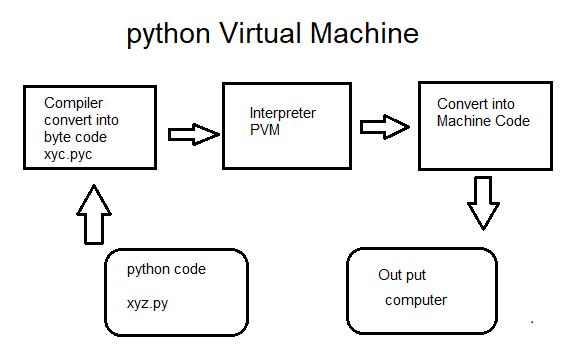

关于python 虚拟机的实现，其内容/概念：

> CPython可以理解为是C语言实现的python runtime环境吗（或者说CPython也可以理解为一种python虚拟机？）？CPthon中的编译器将py源文件编译成字节码（.pyc文件），然后CPython中的解释器再将字节码执行？

1. **CPython 作为 Python Runtime 环境**：
   - CPython 是用 C 语言编写的，它是 Python 语言的官方实现。它提供了 Python 语言的运行时环境，包括内存管理、垃圾回收、对象模型等核心功能。在这个环境中，Python 代码得以执行。

2. **CPython 作为 Python 虚拟机**：
   - 可以将 CPython 视为一种 Python 虚拟机，**因为它提供了执行 Python 代码所需的所有基础设施**。这个虚拟机负责管理 Python 程序的执行流程，包括字节码的执行、内存分配、垃圾回收等。

3. **CPython 中的编译过程**：
   - 在 CPython 中，内置了一个编译器，它负责将 `.py` 文件中的源代码转换成字节码。这个编译过程是自动进行的，当您运行一个 Python 脚本时，CPython 会自动将源代码编译成字节码。

4. **CPython 中的解释执行过程**：
   - 编译生成的字节码随后由 CPython 的解释器执行。这个解释器逐行解释并执行字节码，将其转换成机器码并运行。这个过程是动态的，即在程序运行时进行。

因此，CPython 既包含了编译器的功能（将源代码编译成字节码），也包含了解释器的功能（执行字节码）。这种设计使得 CPython 能够提供跨平台执行的能力，同时保持了 Python 语言的动态特性和灵活性。

总结来说，CPython 是用 C 语言实现的 Python 运行时环境，也可以被视为一种 Python 虚拟机。它负责编译源代码和执行字节码，提供了 Python 程序运行所需的全部功能。

> 那这种方式又和传统的C/C++编译体系的区别？对于C/C++，预处理器、词法分析、文法分析、语义分析、平台有关/无关优化、指令选择、调度和寄存器分配（好像还有C程序执行流程：预处理器、编译、汇编、连接、装载。这个和上面关系/区别？）
> 而python又是什么样的编译体系呢？和上面的C/C++编译体系的异同？前端应该类似？

确实，Python 和传统的 C/C++ 编译体系在编译和执行流程上有一些显著的不同。让我们先回顾一下 C/C++ 的编译流程，然后对比 Python 的编译体系。

### C/C++ 编译流程：

1. **预处理器（Preprocessor）**：
   - 处理源代码中的预处理指令，如宏定义的展开、条件编译指令、文件包含等。

2. **编译器前端（Front End）**：
   - 包括词法分析（Lexical Analysis）：将源代码转换成一系列的标记（Tokens）。
   - 语法分析（Syntax Analysis）：根据语法规则将标记组织成抽象语法树（AST）。
   - 语义分析（Semantic Analysis）：检查类型、作用域等语义规则，生成中间表示（IR）。

3. **编译器后端（Back End）**：
   - 包括优化（Optimization）：对中间表示进行优化。
   - 指令选择（Instruction Selection）：将优化后的 IR 转换成特定平台的机器码。
   - 代码生成（Code Generation）：包括调度和寄存器分配等。

4. **汇编（Assembly）**：
   - 将编译器生成的汇编代码转换成机器码。

5. **链接（Linking）**：
   - 将多个目标文件和库文件链接成可执行文件。

6. **装载（Loading）**：
   - 在程序运行时，操作系统将可执行文件加载到内存中。

### Python 编译体系：

1. **编译器前端（Front End）**：
   - 类似于 C/C++，Python 也有词法分析和语法分析阶段，将源代码转换成 AST。

2. **编译器后端（Back End）**：
   - Python 将 AST 转换成字节码，这是一种中间状态的代码，而不是直接转换成机器码。

3. **字节码优化**：
   - Python 可以对字节码进行优化，例如使用 `peephole` 优化。

4. **字节码执行**：
   - 字节码由 Python 解释器执行，解释器逐行解释并执行字节码，将其转换成机器码并运行。

5. **动态编译**：
   - Python 可以在运行时动态编译源代码，这意味着在程序执行过程中，新的或修改过的代码可以被编译和执行。

### 异同点：

- **编译目标**：C/C++ 直接编译成机器码，而 Python 编译成字节码，这是一种平台无关的中间代码。
- **执行时机**：C/C++ 的编译过程在程序运行前完成，而 Python 的字节码可以在运行时动态执行。
- **优化**：C/C++ 的优化通常在编译时完成，而 Python 的优化可以在运行时进行，例如通过即时编译（JIT）技术。
- **动态性**：Python 的运行时环境更加动态，支持动态类型检查和代码修改，而 C/C++ 在编译时大部分类型和结构已经确定。
- **跨平台**：Python 的字节码可以在任何支持 Python 解释器的平台上运行，而 C/C++ 的机器码是与平台相关的。

总的来说，Python 的编译体系更加灵活和动态，而 C/C++ 的编译体系则更注重性能和静态类型检查。Python 的字节码和虚拟机模型提供了跨平台执行的能力，而 C/C++ 的直接编译到机器码则提供了更好的性能优化。

> 动态编译是如何实现的？

