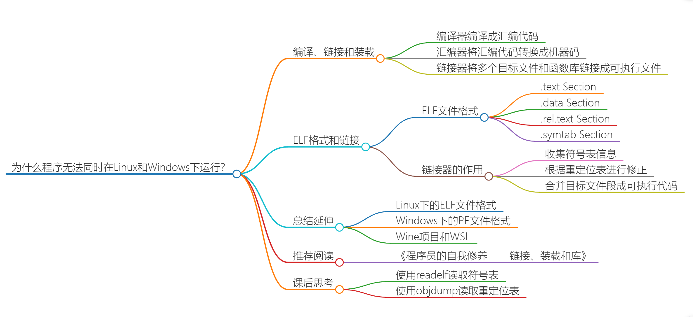
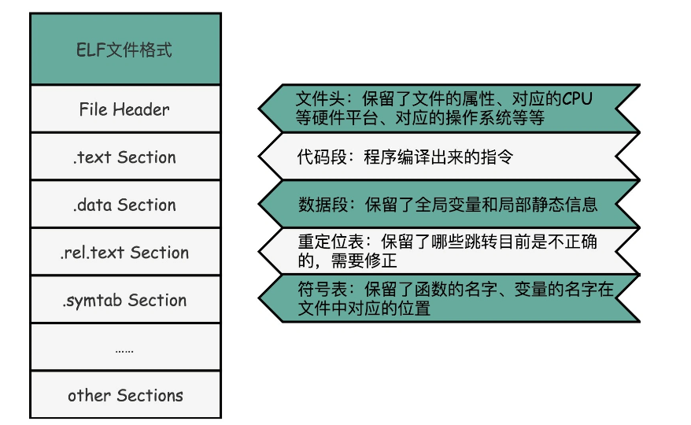
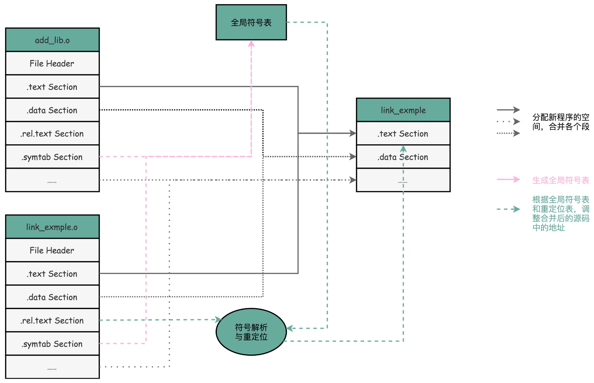
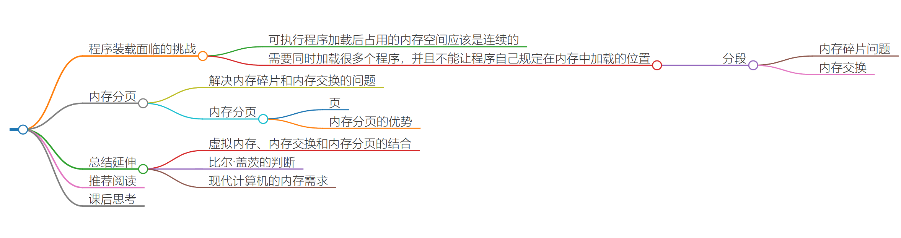
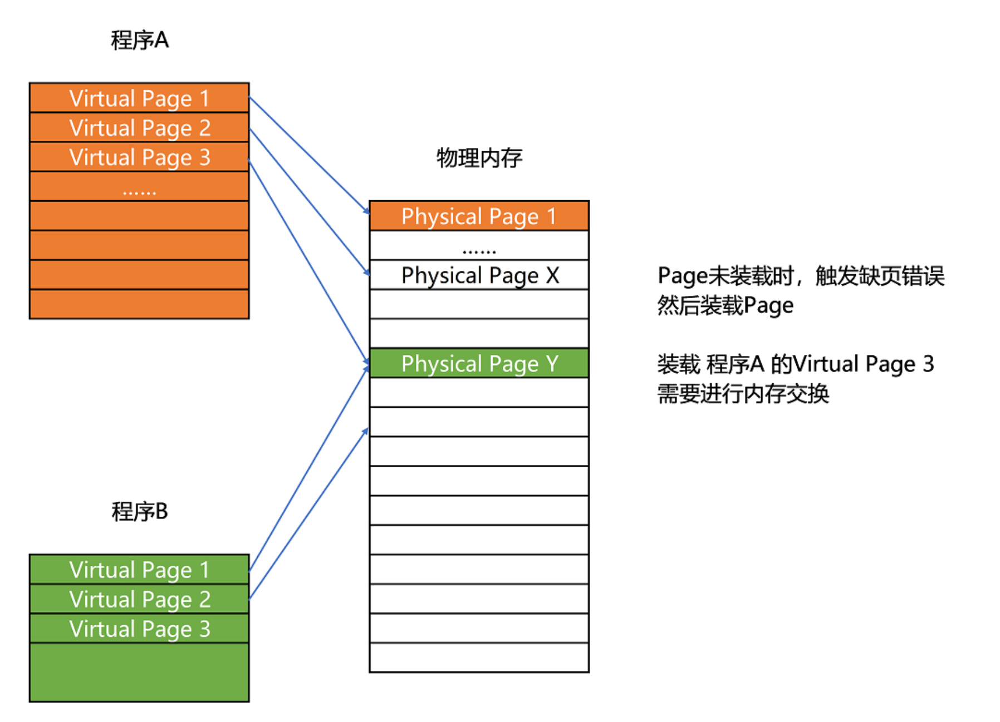
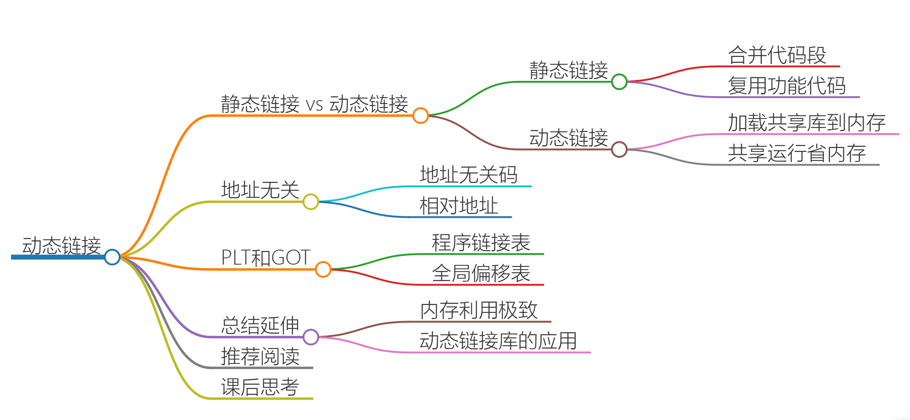
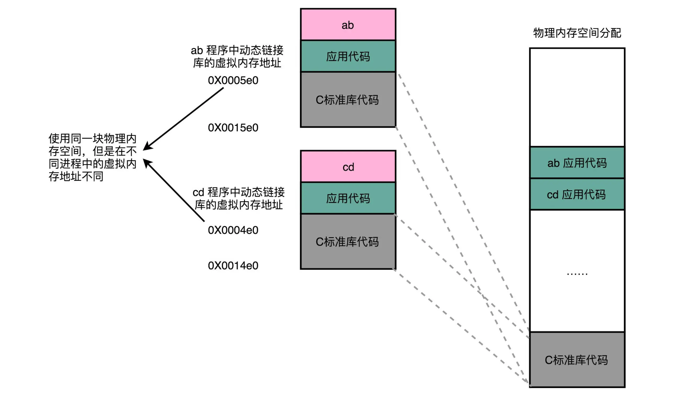
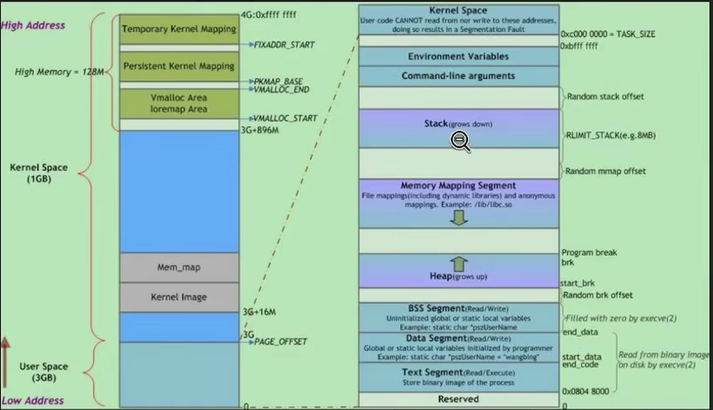

## 05 | 计算机指令：让我们试试用纸带编程

## 06 | 指令跳转：原来if...else就是goto


## 07 | 函数调用：为什么会发生stack overflow？


#### 引入

函数调用，把后面要跳回来执行的指令地址给记录下来，像讲 PC 寄存器一样，专门设立一个“程序调用寄存器”，来存储接下来要跳转回来执行的指令地址。等到函数调用结束，从这个寄存器里取出地址，再跳转到这个记录的地址，继续执行。

但是寄存器是不够用的，所以科学家的解决办法：在内存里面开辟一段空间，用栈这个后进先出（LIFO，Last In First Out）的数据结构。

栈就像一个乒乓球桶，每次程序调用函数之前，都把调用返回后的地址写在一个乒乓球上，然后塞进这个球桶。这个操作其实就是我们常说的压栈。如果函数执行完了，我们就从球桶里取出最上面的那个乒乓球，很显然，这就是出栈。

> **相当于加入了一个“记忆”的功能，能在跳转去运行新的指令之后，再回到跳出去的位置，能够实现更加丰富和灵活的指令执行流程**


#### **区分栈底和栈顶的问题**

详见**自己笔记 《计算机底层》——栈的理解**


#### stack overflow

- 如果函数调用层数太多，我们往栈里压入它存不下的内容，程序在执行的过程中就会遇到栈溢出的错误，这就是大名鼎鼎的“stack  overflow”。
- 递归层数过多


#### **函数内联优化**

> **简单理解近似为将函数当成宏展开，但还是有差异**

- **操作**

    - **编译器 -O优化**

        ```shell
        $ gcc -g -c -O function_example_inline.c
        $ objdump -d -M intel -S function_example_inline.o
        ```

    - inline关键字

- **后果**

    - **减少函数调用的开销，提高性能**，CPU需要执行的指令变少，无需根据地址跳转的过程了，减少压栈/出栈过程，

        > Tips：为什么减少压栈/出栈操作能提升性能？
        >
        > 栈作为一种抽象数据结构最终还是在内存上体现出来的，而相对于CPU的内部操作，与内存的操作是比较慢的，如果无法加载到高速缓存中，反复操作主内存是很慢的。

    - 可以复用的程序指令在调用它的地方完全展开后，如果一个内联函数在很多地方都被调用了，那么就会展开很多次，整个程序占用的空间就会变大。（自行权衡，或者交给编译器做的更好）

- 叶子函数/过程

    不会调用其他函数的函数，只能被调用。

- 深入学习

    [【C++】 内联函数详解（搞清内联的本质及用法）_c++内联函数-CSDN博客](https://blog.csdn.net/qq_35902025/article/details/127912415)


#### 课后思考

在程序栈里面，除了我们跳转前的指令地址外，还需要保留哪些信息，才能在我们在函数调用完成之后，跳转回到指令地址的时候，继续执行完函数调用之后的指令呢？

1. 函数调用前的程序状态，包括寄存器的值、局部变量的值等。
2. 函数调用时需要用到的参数值。
3. 函数调用后需要返回的值。
4. 函数调用时的返回地址，即函数调用完成后需要跳转回的指令地址。


## 08 | ELF和静态链接：为什么程序无法同时在Linux和Windows下运行？





#### 程序执行过程

1. 预处理：

   - ```c
       gcc -E  //进行预处理，生成.i文件
       ```

   - 接受：.c文件

   - 产生：.i文件

   - 描述：在预处理阶段，C预处理器会处理源代码，包括展开宏定义、包含头文件、删除注释等，并生成一个经过预处理的中间文件。

2. 编译：
   - ```c
       gcc -S  //进行预处理，生成.s文件
       ```

   - 接受：.i文件
   
   - 产生：.s文件
   
   - 描述：编译器将预处理后的文件转换为汇编代码，进行词法分析、语法分析、语义分析等操作，然后生成一个汇编代码文件。
   
3. 汇编：
   
      - ```c
          gcc -c //进行汇编，生成.o文件（Linux下为ELF文件）
          gcc -o //指定输出文件名
          ```
      
   - 接受：.s文件
   
   - 产生：.o文件（Linux下为ELF文件）
   
   - 描述：汇编器将汇编代码转换为机器语言指令，并生成一个目标文件。
   
4. 链接：
   
      - ```c
          gcc -l<library>  //链接库文件 如-lm链接数学库
          ```
      
   - 接受：.o文件、库文件
   
   - 产生：可执行文件（Linux下为ELF文件）
   
   - 描述：链接器将目标文件与库文件进行链接，解析符号引用，生成可执行文件。这个过程可能包括对库函数的链接，符号解析，重定位等操作。
   
5. 装载：
   - 描述：在Linux系统中，装载是操作系统的职责，通过装载器，它会将可执行文件加载到内存中，变成指令和数据，并开始执行。

预处理器 --> 编译器 --> 汇编器 -->链接器 --> (操作系统)装载器


#### ELF文件与链接

- **ELF（Execuatable and Linkable File Format）可执行与可链接文件格式**
  
    1. File Header：表示这个文件的基本属性，比如是否是可执行文件，对应的 CPU、操作系统等等。
    2. .text Section：代码段或者指令段（Code Section），用来保存程序的代码和指令。
    3. .rel.text Section：重定位表（Relocation Table），重定位表里，**保留当前的文件里面哪些跳转地址是我们不知道的**。比如在 main 函数里面调用了 scanf 和 printf 这两个函数，但在链接发生之前，我们并不知道该跳转到哪里，这些信息就会存储在重定位表里。
    4. .symtab Section：符号表（Symbol Table），符号表保留了**当前文件里面定义的函数名称和对应地址的地址簿**。
    
    
    
    > **补充**：ELF是一种文件格式的标准，
    >
    > ELF文件有三类:
    >
    > **可重定向文件、可执行文件、共享目标文件**。
    >
    > 代码经过预处理、编译、汇编后形成可重定向文件，
    >
    > 可重定向文件经过链接后生成可执行文件。


- **链接**



1. **构建全局符号表**：链接器会扫描所有输入的目标文件，然后把所有符号表里的信息收集起来，构成一个全局的符号表。
2. **修正**：然后再根据重定位表，把所有不确定要跳转地址的代码，根据符号表里面存储的地址，进行一次修正。
3. **合并目标文件(ELF)**：把所有的目标文件的对应段进行一次合并，变成了最终的可执行代码。这也是为什么，可执行文件里面的函数调用的地址都是正确的。


#### 总结

**为什么程序无法同时在Linux和Windows下运行？**

其中一个重要的原因在于两个操作系统的的可执行文件格式不一样。

Windows 的可执行文件格式是一种叫作 PE（Portable Executable Format）（.exe）的文件格式。Linux 下的装载器只能解析 ELF 格式而不能解析 PE 格式。


#### 课后思考

1. 对于单片机这种裸机编程、RTOS，直接运行在硬件上的其可执行程序应该不是ELF、PE这种文件格式，应该是二进制文件/十六进制文件（.bin/.hex），也就是**直达硬件**（程序装载那一步的程度），不需要操作系统来帮你调控。
2. 再对于同一系列的CPU，其指令集一样，但是运行的OS不同，也就是管家不同，不同的管家会有不同的方式（ELF/PE）直接和硬件交流。
3. 结论：**ELF/PE这种可执行程序是与操作系统高度绑定的。**

对于最开始的CPU上电时，先从BIOS那里读取相关内容，读取的也是二进制程序，之后交给bootloader，启动操作系统。


## 09 | 程序装载：“640K内存”真的不够用么？



#### 程序装载-->内存分段-->内存交换

装载器需要满足的要求

1. 可执行程序加载后占用的内存空间应该是连续的。
2. 需要同时加载很多个程序，并且不能让程序自己规定在内存中加载的位置


出现了一系列问题并逐步发展出解决方案：

- **装载**

    在内存里面，找到一段连续的内存空间，然后分配给装载的程序，然后把这段连续的内存空间地址（物理内存地址），和整个程序指令里指定的内存地址（虚拟内存地址）做一个映射。

- **虚拟内存地址和物理内存地址**

    程序执行需要知道内存地址，所以有了虚拟地址和物理地址的差别。

- **映射表**

    程序里有指令和各种内存地址，只需要关心虚拟内存地址。对于任何一个程序来说，它看到的都是同样的内存地址。

    关键在于维护一个虚拟内存到物理内存的映射表，这样实际程序指令执行的时候，会通过虚拟内存地址，找到对应的物理内存地址，然后执行。

    因为是虚拟内存地址不变且连续，所以只需要维护映射关系的起始地址和对应的空间大小就可以了。

    > “虚拟地址连续，物理地址不一定是连续的。 malloc出来的空间，只是在虚拟内存中是连续的。而从实际的物理空间到虚拟内存空间还有一个映射的关系。这个映射是由操作系统来控制的，一般情况下，从虚拟地址无法反查到物理地址。
    >
    > 对于连续的虚拟地址空间，也就无法得知是否物理连续。但由于映射的不确定性，当申请一段内存空间，尤其是比较大的内存长度情况下，物理地址不连续的可能性还是相当大的。 事实上，大多数的编程不需要关注物理空间是否连续。”

- **内存分段**

    为了解决装载器在加载程序时需要连续内存空间的问题，引入了分段技术。分段技术将程序的逻辑地址空间分为多个段，每个段可以具有不同的长度和权限。

    

- **内存碎片问题的出现**

    内存分段技术又带来了内存碎片的问题，影响了内存的利用效率。


- **内存交换**

    **为了解决内存碎片问题，引入了内存交换技术。**

    **内存交换技术将不常用的内存（段/页）暂时写入磁盘，以释放物理内存空间。**

    > 把 Python 程序占用的那 256MB 内存写到硬盘上，然后再从硬盘上读回来到内存里面。
    >
    > 读回来的时候，不再把它加载到原来的位置，而是紧紧跟在那已经被占用的 512MB 内存后面。
    >
    > 这样就有了连续的 256MB 内存空间，就可以去加载一个新的 200MB 的程序。

    > 如果你自己安装过 Linux 操作系统，你应该遇到过分配一个 swap 硬盘分区的问题。这块分出来的磁盘空间，其实就是专门给 Linux 操作系统进行内存交换用的。
    
    


- **内存交换的问题**

    硬盘的访问速度要比内存慢很多，而每一次内存交换，我们都需要把一大段连续的内存数据写到硬盘上。所以，如果内存交换的时候，交换的是一个很占内存空间的程序，这样整个机器都会显得卡顿。


#### **内存分页**

为了解决内存碎片和内存交换的空间过大的问题，又提出**了内存分页技术**，即当需要进行内存交换的时候，让需要交换写入或者从磁盘装载的数据更少一点，减少一些内存碎片。

> 内存分页：将**物理内存与虚拟内存**都分割为固定大小的片段，称之为页。（**Linux下通常设置为4KB**）

有了内存分页技术之后，就不像之前那样，再拿整段连续内存的物理地址和虚拟内存来进行内存交换了，而是采用更加小的页的形式。

又因为物理内存空间早已划分好（8GB物理内存的页的个数为： 8G/4KB =8 * 1024M/4KB =8 * 1024 * 1024KB/4KB =2097152 页），也就没有不能使用的碎片了，只有被释放出来的4KB的页了。即使内存空间不够，需要让正在运行的程序通过**内存交换**让出一些内存的页的时候，一次性写入磁盘的也就只有几个页了，不会花太多的时间导致机器被内存交换的过程卡住。

> 注意：内存分页，在虚拟内存上，对程序来说是连续的很多页；而在物理内存中，就不需要像虚拟内存那样连着放了，而是可以
>
> 

更进一步地，分页的方式使得我们在加载程序的时候，不再需要一次性都把程序加载到物理内存中。

我们完全可以在进行虚拟内存和物理内存的页之间的映射之后，并不真的把页加载到物理内存里，而是只在程序运行中，需要用到对应虚拟内存页里面的指令和数据时，再加载到物理内存里面去。

> 操作系统中：
>
> 当要读取特定的页，却发现数据并没有加载到物理内存里的时候，就会触发一个来自于 CPU 的缺页错误（Page Fault）。我们的操作系统会捕捉到这个错误，然后将对应的页，**从存放在硬盘上的虚拟内存里读取出来**，加载到物理内存里。这种方式，使得我们可以运行那些远大于我们实际物理内存的程序。同时，这样一来，任何程序都不需要一次性加载完所有指令和数据，只需要加载当前需要用到就行了。（**Linus自传里的分页到磁盘，这样子就可以运行比内存空间还要大的程序了**）


- **补充**

    > 不存在内存碎片指的是不存在外部内存碎片，内部内存碎片还是有的，有的页空间并未完全占满。所以内存分页其实也就是内存分段分的更加小了，更加合理了。


**”内存分页使得映射的基本单元从段变成了规范的，容易处理的页“**


#### 总结

- 虚拟内存向上：

    为程序提供了一个固定的地址空间，从此程序不需要考虑不同环境下不同地址的问题，因为在任何环境下，程序的地址都是从0开始的。 

- 虚拟内存向下：可以和物理地址进行更加复杂的约定，为了减少交换次数，可以集中管理内存交换。东西只要能够集中管理，就有机会提高效率了。 

- 分层设计的思路再一次拯救了程序员。通过虚拟内存、内存交换和内存分页这三个技术的综合应用，使得程序不需要考虑实际的物理内存地址、大小和当前分配空间的问题，从而解决了程序加载时遇到的连续内存空间和多程序加载位置的问题。

综合以上发展过程，最终总结出一个合理的解决方案：通过虚拟内存、内存交换和内存分页的组合应用，解决了程序加载时遇到的内存不足、内存碎片和连续内存空间的问题，使得程序能够运行在远大于实际物理内存的程序。


#### 课后思考

在 Java 这样使用虚拟机的编程语言里面，我们写的程序是怎么装载到内存里面来的呢？它也和我们讲的一样，是通过内存分页和内存交换的方式加载到内存里面来的么？

jvm已经是上层应用，无需考虑物理分页，一般更直接是考虑对象本身的空间大小，物理硬件管理统一由承载jvm的操纵系统去解决吧


## 10 | 动态链接：程序内部的“共享单车”



#### 来由

上一节为了解决内存不够用的问题，来了各种花招。

如果我们能够让同样功能的代码，在不同的程序里面，不需要各占一份内存空间，这样子也能节省一定空间。

这个思路就引入一种新的链接方法，叫作**动态链接（Dynamic Link）**。相应的，之前说的合并代码段的方法，就是**静态链接（Static Link）**。

在动态链接的过程中，我们想要“链接”的，**不是存储在硬盘上的目标文件代码，而是加载到内存中的共享库（Shared Libraries）**。

顾名思义，这里的共享库重在“**共享**“这两个字。

这个加载到内存中的共享库会被很多个程序的指令调用到。在 Windows 下，这些共享库文件就是.dll 文件，也就是 Dynamic-Link Library（DLL，动态链接库）。在 Linux 下，这些共享库文件就是.so 文件，也就是 Shared Object（一般我们也称之为动态链接库）

这两大操作系统下的文件名后缀，一个用了“动态链接”的意思，另一个用了“共享”的意思，正好覆盖了两方面的含义。


#### 地址

- **地址无关/地址相关**

    **要在程序运行的时候共享代码，有一定的要求，就是这些机器码必须是“地址无关”的，共享库中如果出现地址相关的代码，那么运行时跳转的地址是绝对指令，就无法复用了**。

    也就是说我们编译出来的共享库文件的指令代码，是**地址无关码（Position-Independent Code）**。（-fPIC）

    换句话说就是，这段代码，无论加载在哪个内存地址，都能够正常执行。如果不是这样的代码，就是**地址相关的代码**
    
    - 大部分函数库其实都可以做到地址无关，因为它们都接受特定的输入，进行确定的操作，然后给出返回结果就好了。无论是实现一个向量加法，还是实现一个打印的函数，这些代码逻辑和输入的数据在内存里面的位置并不重要。
    - 关于绝对地址：之前讲过的重定位表。在程序链接的时候，就已经把函数调用后要跳转访问的地址确定下来了，这意味着，如果这个函数加载到一个不同的内存地址，跳转就会失败。


#### 实现动态链接

- **对于所有动态链接共享库的程序，共享库用的都是同一段物理内存地址，但在不同的应用程序里，它所在的虚拟内存地址是不同的。**

    > 我们没办法、也不应该要求，动态链接共享库的不同程序，必须把这个共享库所使用的虚拟内存地址变成一致。如果这样的话，我们写的程序就必须明确地知道内部的内存地址分配。



> 那一段memory mapping segment 中放的就是.so 库，ilbc.so


- **怎么样才能做到，动态共享库编译出来的代码指令，都是地址无关码呢？**

    > - 动态代码库的内部变量和函数
    >
    > - (外部)链接动态库

    

    - **动态代码库的内部变量和函数：==使用相对地址（Relative Address）==**
    
        - 各种指令中使用到的内存地址，给出是一个相对于当前指令偏移量的内存地址。

        - 因为整个共享库是放在一段连续的虚拟内存地址中的（这里最后放到底物理内存的位置还是一样的），无论装载到哪一段地址，不同指令之间的相对地址都是不变的。

            > 在动态链接库中，相对地址指的是地址数据相对于某个基准地址的偏移量。当程序加载动态链接库时，动态链接器会根据基准地址和相对地址计算出实际的内存地址，从而实现对库函数或模块的调用。
            >
            > 相对地址的使用可以使得动态链接库更加灵活，它们不依赖于固定的绝对地址，而是根据基准地址进行计算，这样可以使得库函数或模块可以在不同的内存地址上加载而不需要修改其内部的地址数据。
    
        
    
    - **(外部)链接动态库**：==**使用PLT 和 GOT解决**==

        - **PLT：程序链接表（Procedure Link Table）**

            ```assembly
            ;调用show_me_the meney函数，里面有printf()
            call   400550 <show_me_the_money@plt>
            ;表示我们需要从plt里面找相关信息，plt对应的地址是400550
            ```
    
            **关键：记录指令在当前程序的虚拟内存地址**
    
            
    
        - **GOT：全局偏移表（Global Offset Table）**
        
             ```assembly
             ;400550 这个地址，里面又进行了一次跳转，跳转指定的跳转地址为GLOBAL_OFFSET_TABLE+0x18，
             400550:       ff 25 12 05 20 00       jmp    QWORD PTR [rip+0x200512]       
             # 600a68 <_GLOBAL_OFFSET_TABLE_+0x18>
             ```
        
             虽然共享库的代码部分的物理内存是共享、相同的，但是数据部分对于每一个应用程序来说都是不同的，所以动态链接的时候需要区分开。
        
             也就是说，每个应用程序动态链接到的动态库，都会在data section加载一份自己的GOT，在不同地方调用共享库的指令，都会去查询GOT，来找到当前运行程序的虚拟内存里的对应的位置。
        
              GOT 表里的数据，则是在不同程序加载一个个共享库的时候写进去的。
        
             **不同的进程，调用同样的 lib.so，各自 GOT 里面指向最终加载的动态链接库里面的虚拟内存地址是不同的。**
        
             
        
             这样，虽然不同的程序调用的同样的动态库，各自的内存地址是独立的，调用的又都是同一个动态库，但是不需要去修改动态库里面的代码所使用的地址，而是各个程序各自维护好自己的 GOT，能够找到对应的动态库就好了。
        
             **关键：记录偏移量**
        
             
        
        - **具体过程**      
        
            - PLT记录了一条指令在当前程序虚拟内存空间的地址
        
            - GOT记录了该指令在整个程序中的偏移量，是运行时确定的而不是编译时。为什么要记录偏移量？（想想地址无关）
            - 因为一个程序加载到内存中的时候是连续地址的，所以偏移量这个相对地址可以很好的记录指令的地址。
        
        
        
        **这是一个典型的、不修改代码，而是通过修改“地址数据”来进行关联的办法。它有点 C 语言里面用函数指针来调用对应的函数，并不是通过预先已经确定好的函数名称来调用，而是利用当时它在内存里面的动态地址来调用。**


#### 总结

**在静态链接和程序装载之后，利用动态链接把内存利用到了极致。**

**同样功能的代码生成的共享库，我们只要在内存里面保留一份就好了。**

**这样，我们不仅能够做到代码在开发阶段的复用，也能做到代码在运行阶段的复用。**

> 实际上，在进行 Linux 下的程序开发的时候，我们一直会用到各种各样的动态链接库。C 语言的标准库就在 1MB 以上。
>
> 我们撰写任何一个程序可能都需要用到这个库，常见的 Linux 服务器里，/usr/bin 下面就有上千个可执行文件。如果每一个都把标准库静态链接进来的，几 GB 乃至几十 GB 的磁盘空间一下子就用出去了。如果我们服务端的多进程应用要开上千个进程，几 GB 的内存空间也会一下子就用出去了。
>
> 这个问题在过去计算机的内存较少的时候更加显著。通过动态链接这个方式，可以说彻底解决了这个问题。就像共享单车一样，如果仔细经营，是一个很有社会价值的事情，但是如果粗暴地把它变成无限制地复制生产，给每个人造一辆，只会在系统内制造大量无用的垃圾。


#### 课后思考

- **像动态链接这样通过修改“地址数据”来进行间接跳转，去调用一开始不能确定位置代码的思路，在哪里还见过？**

     Nested vectored interrupt controller，即嵌套向量中断控制器（NVIC）。[STM32中的NVIC详解-CSDN博客](https://blog.csdn.net/liuqi3256797/article/details/89891621)

​    

- **调用一个动态链接库的函数的具体过程**
  
    1. 当调用show函数，首先找到show函数自己的PLT（虚拟地址），知道指令的地址，
    2. 然后找到该条指令后再去共享库的GOT中找到这个指令，找到这个指令在so中的偏移量，
    3. 根据虚拟地址和偏移量确定最终的共享库代码的虚拟内存地址（xxxx+xxxx），
    4. (可不看) 根据虚拟地址和物理地址的映射关系找到代码实际存放的位置，然后运行。 
    
    
    
- **在编译、汇编、链接、装载这几个阶段，怎么与库相关呢**

    1. 编译阶段：在编译阶段，编译器会将源代码转换为汇编代码。如果源代码中引用了库文件中的函数或变量，编译器会在此阶段检查函数的声明和变量的定义是否匹配，并生成相应的调用或访问代码。如果库文件的头文件被包含在源代码中，编译器会使用头文件中的声明信息。
    2. 汇编阶段：在汇编阶段，汇编器将汇编代码转换为目标文件。如果汇编代码中引用了库文件中的函数或变量，汇编器会生成相应的引用指令，并在链接阶段解析这些引用。
    3. 链接阶段：在链接阶段，链接器将目标文件和库文件中的函数和变量符号解析并进行符号解析。如果程序引用了库文件中的函数或变量，链接器会将这些引用与库文件中的定义进行关联，并生成最终的可执行文件。
    4. 装载阶段：在装载阶段，操作系统将可执行文件加载到内存中运行。**如果程序依赖于动态链接库（.dll/.so），则在运行时会根据需要加载相应的动态链接库。**


- **用自己的话描述动态链接和静态链接**

    静态链接和动态链接是用于将程序与库文件连接在一起的两种不同方式。

    **静态链接是指在编译时将程序所需的库文件的代码和数据复制到最终的可执行文件中**。这意味着可执行文件包含了所有所需的库文件的代码和数据，因此**它可以独立运行**，不依赖于外部的库文件。静态链接的优点是程序的移植性更好，因为不需要依赖外部的库文件；但缺点是可执行文件的体积较大，且如果库文件更新或修复，需要重新编译整个程序。

    **动态链接是指在程序运行时才将程序所需的库文件加载到内存中**。可执行文件只包含程序的代码和数据，而库文件存储在独立的文件中，**程序在运行时动态加载这些库文件**。动态链接的优点是可执行文件的体积较小，且库文件的更新和修复不需要重新编译整个程序；但缺点是程序在运行时需要依赖外部的库文件，可能会受到库文件版本兼容性等问题的影响。


## 11 | 二进制编码：“手持两把锟斤拷，口中疾呼烫烫烫”？


#### 字符集和字符编码


#### 乱码 

**同样的文本，采用不同的编码存储下来。如果另外一个程序，用一种不同的编码方式来进行解码和展示，就会出现乱码**

首先，“锟斤拷”的来源是这样的。如果我们想要用 Unicode 编码记录一些文本，特别是一些遗留的老字符集内的文本，但是这些字符在 Unicode 中可能并不存在。于是，Unicode 会统一把这些字符记录为 U+FFFD 这个编码。如果用 UTF-8 的格式存储下来，就是\xef\xbf\xbd。如果连续两个这样的字符放在一起，\xef\xbf\xbd\xef\xbf\xbd，这个时候，如果程序把这个字符，用 GB2312 的方式进行 decode，就会变成“锟斤拷”。这就好比我们用 GB2312 这本密码本，去解密别人用 UTF-8 加密的信息，自然没办法读出有用的信息。

而“烫烫烫”，则是因为如果你用了 Visual Studio 的调试器，默认使用 MBCS 字符集。“烫”在里面是由 0xCCCC 来表示的，而 0xCC 又恰好是未初始化的内存的赋值。于是，在读到没有赋值的内存地址或者变量的时候，电脑就开始大叫“烫烫烫”了。


#### 课后思考

- 原码 反码 补码


## 12 | 理解电路：从电报机到门电路，我们如何做到“千里传信”？

通信原理？

继电器？（电驿）--->WiFi

比如说，你在家里用 WiFi，如果你的屋子比较大，可能某些房间的信号就不好。你可以选用支持“中继”的 WiFi 路由器，在信号衰减的地方，增加一个 WiFi 设备，接收原来的 WiFi 信号，再重新从当前节点传输出去。这种中继对应的英文名词和继电器是一样的，也叫 Relay。


  

## 13 | 加法器：如何像搭乐高一样搭电路（上）？

基本电路 --> 门电路 --> 全加器 --> 加法器，

## 14 | 乘法器：如何像搭乐高一样搭电路（下）？

#### 课后思考

- 为什么晶体管的数量增加可以优化计算机的计算性能？

    

    从最简单的顺序执行的加法器/乘法器来看，顺序执行符合人脑的思维，但是速度很慢，每一次计算都要忍受前一次的门延迟，所以想进一步优化。

    **由于电路天然的并行性，各种运算能同时进行，速度就能提升。**
    
    为了达到上图效果（上图的门电路展开），充分利用电路并行性，让每次运算的每一步都有一个加法模块可以用，不需要等着前面的运算算完了才轮到自己（这一步的计算），所以半加器就要多造几个，晶体管数量上去了，但是性能更上去了。


#### 总结

通过 ALU 和门电路，搭建出来了乘法器。如果愿意的话，我们可以把很多在生活中不得不顺序执行的事情，通过简单地连结一下线路，就变成**并行执行**了。这是因为，硬件电路有一个很大的特点，那就是信号都是实时传输的。

我们也看到了两种设计电路的思路

- 用更少更简单精巧的电路设计，但是需要更长的门延迟和时钟周期；
- 用更复杂的电路，但是更短的门延迟和时钟周期来计算一个复杂的指令，
- **其实就是计算机体系结构中 RISC 和 CISC 的经典历史路线之争。**


## 15 | 浮点数和定点数（上）：怎么用有限的Bit表示尽可能多的信息？


- 课后思考

    为什么计算机中0.3+0.6= 0.89999999....

    因为浮点数是一个近似计算，0-1.0中，只有0.5能被精确表示

- 


## 16 | 浮点数和定点数（下）：深入理解浮点数到底有什么用？


