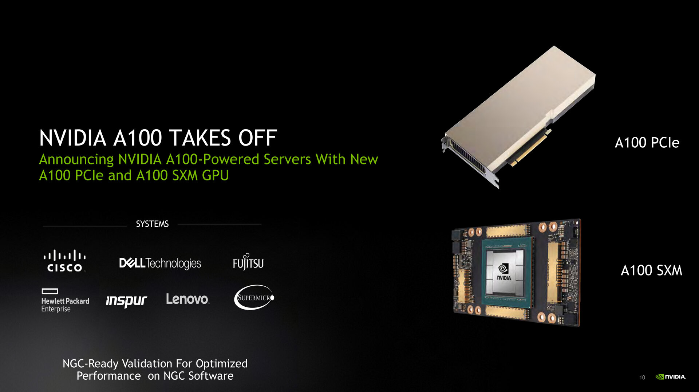

## 17 | 建立数据通路（上）：指令+运算=CPU

## 18 | 建立数据通路（中）：指令+运算=CPU

## 19 | 建立数据通路（下）：指令+运算=CPU

## 20 | 面向流水线的指令设计（上）：一心多用的现代CPU

## 21 | 面向流水线的指令设计（下）：奔腾4是怎么失败的？

### 课后思考

- 为什么提升流水线级数能提升主频

- 为什么不能使劲在一个CPU上堆多几个核心？

## 22 | 冒险和预测（一）：hazard是“危”也是“机”

## 23 | 冒险和预测（二）：流水线里的接力赛

## 24 | 冒险和预测（三）：CPU里的“线程池”

## 25 | 冒险和预测（四）：今天下雨了，明天还会下雨么？

## 26 | Superscalar和VLIW：如何让CPU的吞吐率超过1？

## 27 | SIMD：如何加速矩阵乘法？

## 28 | 异常和中断：程序出错了怎么办？

## 29 | CISC和RISC：为什么手机芯片都是ARM？

## 30 | GPU（上）：为什么玩游戏需要使用GPU？

## 31 | GPU（下）：为什么深度学习需要使用GPU？

## 32 | FPGA和ASIC：计算机体系结构的黄金时代

> 计算机体系结构的黄金时代

### FPGA：现场可编程门阵列（Field-Programmable Gate Array）

> 设计更简单一点儿的专用于特定功能的芯片，少不了要几个月。而设计一个 CPU，往往要以“年”来计。
>
> 在这个过程中，硬件工程师们要设计、验证各种各样的技术方案，可能会遇到各种各样的 Bug。如果我们每次验证一个方案，都要单独设计生产一块芯片，那这个代价也太高了。
>
> 我们能不能 不用**单独制造一块专门的芯片**来验证硬件设计呢？
>
> 能不能设计一个硬件，通过不同的程序代码，来操作这个硬件之前的电路连线，通过“编程”让这个硬件变成我们设计的电路连线的芯片呢？

- P 代表 Programmable，即这是一个可以通过编程来控制的硬件。
- G 代表 Gate 也很容易理解，它就代表芯片里面的门电路。我们能够去进行编程组合的就是这样一个一个门电路。
- A 代表的 Array，叫作阵列，说的是在一块 FPGA 上，密密麻麻列了大量 Gate 这样的门电路。
- F 表示现场，它其实是说，一块 FPGA 这样的板子，可以在“现场”多次进行编程。它不像 PAL（Programmable Array Logic，可编程阵列逻辑）这样更古老的硬件设备，只能“编程”一次，把预先写好的程序一次性烧录到硬件里面，之后就不能再修改了。

> 这么看来，其实“FPGA”这样的组合，基本上解决了我们前面说的想要设计硬件的问题。我们可以像软件一样对硬件编程，可以反复烧录，还有海量的门电路，可以组合实现复杂的芯片功能。

软件改变世界：FPGA这个例子

#### 具体编程

1. ==存储功能换组合逻辑==

    在实现 CPU 的功能的时候，我们需要完成各种各样的电路逻辑。

    在 FPGA 里，这些基本的电路逻辑，不是采用布线连接的方式进行的，而**是预先根据我们在软件里面设计的逻辑电路，算出对应的真值表，然后直接存到一个叫作 LUT（Look-Up Table，查找表）的电路里面。**

    这个 LUT 呢，其实就是一块存储空间，里面存储了“特定的输入信号下，对应输出 0 还是 1”。

    > 可以想象成这是一张99 x 99乘法表，输入两个数相乘，根据查表得到结果，不用你算了。（已经在设计逻辑电路的时候算好了）

2. ==对于需要实现的时序逻辑电路，在 FPGA 里面直接放上 D 触发器，作为寄存器。==

    这个和 CPU 里的触发器没有什么本质不同。

    不过，我们会把很多个 LUT 的电路和寄存器组合在一起，变成一个叫作逻辑簇（Logic Cluster）的东西。（组合逻辑 + 时序逻辑）

    在 FPGA 里，这样组合了多个 LUT 和寄存器的设备，也被叫做 CLB（Configurable Logic Block，可配置逻辑块）。

    通过配置 CLB 实现的功能有点儿像之前讲过的全加器。

    它已经在最基础的门电路上做了组合，能够提供更复杂一点的功能。更复杂的芯片功能，我们不用再从门电路搭起，可以通过 CLB 组合搭建出来。（==搭积木==）

    

3. ==FPGA 通过可编程逻辑布线，来连接各个不同的 CLB，最终实现想要实现的芯片功能。==

    

    这个可编程逻辑布线，可以把它当成我们的铁路网。

    整个铁路系统已经铺好了，但是整个铁路网里面，设计了很多个道岔。我们可以通过控制道岔，来确定不同的列车线路。

    故，==我们实际 “编程” 在做的，就是拨动像道岔一样的各个电路开关，最终实现不同 CLB 之间的连接，完成我们想要的芯片功能。==

> 通过 LUT 和寄存器，我们能够组合出很多 CLB，而通过连接不同的 CLB，最终有了我们想要的芯片功能。
>
> 最关键的是，这个组合过程是可以“编程”控制的。而且这个编程出来的软件，还可以后续改写，重新写入到硬件里。
>
> 让同一个硬件实现不同的芯片功能。从这个角度来说，FPGA 也是“软件吞噬世界”的一个很好的例子。

### ASIC：专用集成电路（Application-Specific Integrated Circuit）

> 为各种场景专门设计的芯片。
>
> 因为 ASIC 是针对专门用途设计的，所以它的电路更精简，单片的制造成本也比 CPU 更低。
>
> 而且，因为电路精简，所以通常能耗要比用来做通用计算的 CPU 更低。而我们上一讲所说的早期的图形加速卡GPU，其实就可以看作是一种 ASIC。

> 因为 ASIC 的生产制造成本，以及能耗上的优势，过去几年里，有不少公司设计和开发 ASIC 用来“挖矿”。
>
> 这个“挖矿”，说的其实就是设计专门的数值计算芯片，用来“挖”比特币、ETH 这样的数字货币。

### FPGA 和 ASIC 的差异

能不能用 FPGA 来做 ASIC 的事情呢？可以的，我们对 FPGA 进行“编程”，其实就是把 FPGA 的电路变成了一个 ASIC。

这样的芯片，往往在成本和功耗上优于需要做通用计算的 CPU 和 GPU。

那为什么我们干脆不要用 ASIC 了，全都用 FPGA 不就好了么？其实 FPGA 一样有缺点，那就是它的硬件上有点儿“浪费”。

#### FPGA 的优劣

- 缺点

    每一个 LUT 电路，其实都是一个小小的“浪费”。一个 LUT 电路设计出来之后，既可以实现与门，又可以实现或门，自然用到的晶体管数量，比单纯连死的与门或者或门的要多得多。

    同时，因为用的晶体管多，它的能耗也比单纯连死的电路要大，单片 FPGA 的生产制造的成本也比 ASIC 要高不少。

- 优点

    FPGA没有硬件研发成本。

    ASIC 的电路设计，需要仿真、验证，还需要经过流片（Tape out），变成一个印刷的电路版，最终变成芯片。这整个从研发到上市的过程，最低花费也要几万美元，高的话，会在几千万乃至数亿美元。更何况，整个设计还有失败的可能。

**所以，如果我们设计的专用芯片，只是要制造几千片，那买几千片现成的 FPGA，可能远比花上几百万美元，来设计、制造 ASIC 要经济得多。**

#### 具体使用

到底使用 ASIC 这样的专用芯片，还是采用 FPGA 这样可编程的通用硬件，核心的决策因素还是成本。

不过这个成本，不只是单个芯片的生产制造成本，还要**考虑总体拥有成本（Total Cost of Ownership）**。

即，除了生产成本之外，我们要把研发成本也算进去。

如果我们只制造了一片芯片，那么成本为：

​									**“这枚芯片的成本 + 为了这枚芯片建的生产线的成本 + 芯片的研发成本”**

而不只是：

​									**“芯片的原材料沙子的成本 + 生产的电费”。**

### 总结类比

我们日常软件开发过程中，也需要做同样的决策。

很多我们需要的功能，可能在市面上已经有开源的软件可以实现。我们可以在开源的软件之上做配置或者开发插件，也可以选择自己从头开始写代码。

- 在开源软件或者是买来的商业软件上启动，往往能很快让产品上线。

- 如果从头开始写代码，往往会有一笔不地的 NRE 成本，也就是研发成本。但是通常我们自己写的代码，能够 100% 贴近我们的业务需求，后续随着业务需求的改造成本会更低。如果要大规模部署很多服务器的话，服务器的成本会更低。

    **学会从 TCO 和 NRE 的成本去衡量做决策**

### 推荐阅读

[A New Golden Age for Computer Architecture | February 2019 | Communications of the ACM](https://cacm.acm.org/magazines/2019/2/234352-a-new-golden-age-for-computer-architecture/abstract)

[A New Golden Age for Computer Architecture - EECS at Berkeley](https://eecs.berkeley.edu/book/turing-colloquium/schedule-3/patterson/)

### 课后思考

除了 FPGA、ASIC 之外，你最近关注到什么新的、有意思的硬件呢？

- 边缘计算设备
- 量子计算设备
- 

## 33 | 解读TPU：设计和拆解一块ASIC芯片

## 34 | 理解虚拟机：你在云上拿到的计算机是什么样的？

​	
