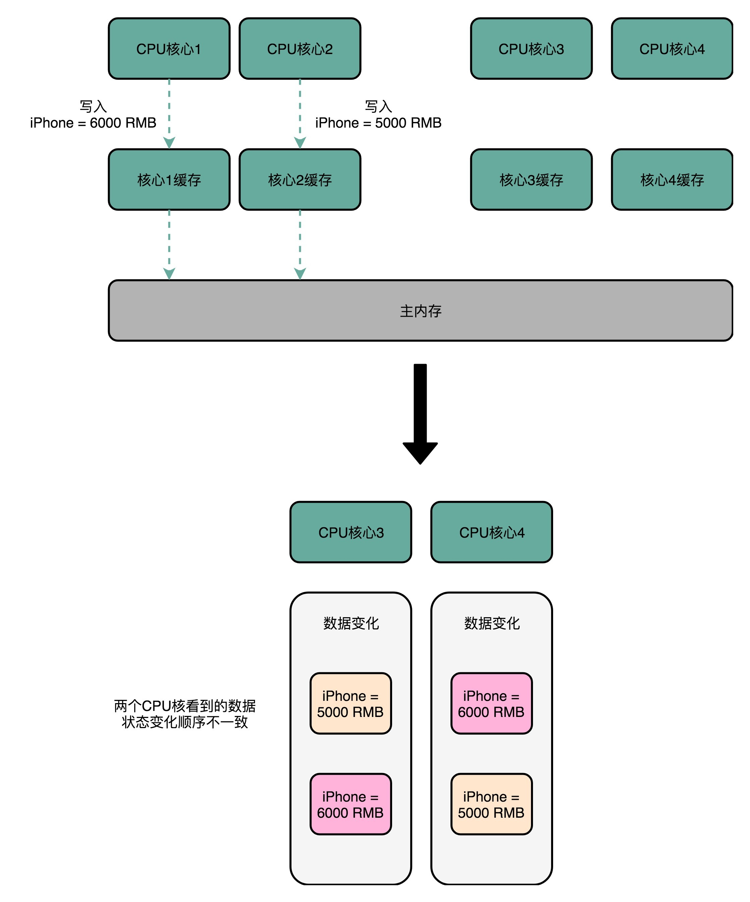
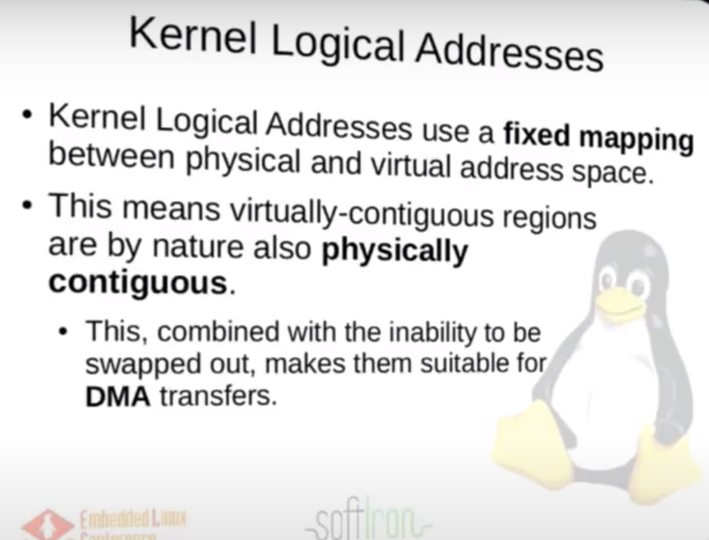

## 35 | 存储器层次结构全景：数据存储的大金字塔长什么样？

### 总结

- Storage hierarchy 存储层次结构


寄存器-->CPU cache(SRAM)-->内存(DRAM)-->硬盘(SSD(基于NAND...)、HDD)

- CPU 比喻成高速运转的大脑，那么和大脑同步的寄存器（Register），就存放着我们当下正在思考和处理的数据。
-  L1-L3 的 CPU Cache，好比存放在我们大脑中的短期到长期的记忆。我们需要小小花费一点时间，就能调取并进行处理。
- 自己的书桌书架就好比计算机的内存，能放下更多的书也就是数据，但是找起来和看起来就要慢上不少。
- 图书馆更像硬盘这个外存，能够放下更多的数据，找起来也更费时间。
- 从寄存器、CPU Cache，到内存、硬盘，这样一层层下来的存储器，速度越来越慢，空间越来越大，价格也越来越便宜。


### 推荐文章：

- Peter Novig 的 [Teach Yourself Programming in Ten Years (norvig.com)](https://norvig.com/21-days.html#answers)

    在了解一些有关存储的数据之后读一读这篇文章。这些数字随着摩尔定律的发展在不断缩小，但是在数量级上仍然有着很强的参考价值。

- Jeff Dean 的[Slide 1 (googleusercontent.com)](https://static.googleusercontent.com/media/research.google.com/zh-CN//people/jeff/Stanford-DL-Nov-2010.pdf)

    这份 PPT 中不仅总结了这些数字，还有大量的硬件故障、高可用和系统架构的血泪经验。尽管这是一份 10 年前的 PPT，但也非常值得阅读。


## 36 | 局部性原理：数据库性能跟不上，加个缓存就好了？

### 总结


遇到性能瓶颈、结构冒险/数据冒险：**加个缓存！！**

- 局部性原理
    - 时间局部性：如果一个数据被访问了，那么它在短时间内还会被再次访问。
    - 空间局部性：如果一个数据被访问了，那么和它相邻的数据也很快会被访问。


### 如何花最少的钱装下亚马逊所有的商品

将被访问的多的商品放在内存/缓存，冷门的或者内存中长时间没被访问的商品放硬盘。

（LRU算法：least recently used）

**估算时间**


## 37 | 高速缓存（上）：“4毫秒”究竟值多少钱？


- 由存储层次结构

    缓存：上一级的存储设备是这一级的缓存

- 为什么需要缓存

    内存速度跟不上CPU发展了，但是内存有很重要，需要弥补性能差异

- 例子：

    ```java
    int[] arr = new int[64 * 1024 * 1024];
    
    
    // 循环1
    for (int i = 0; i < arr.length; i++) arr[i] *= 3;  //耗时：50ms
    
    
    // 循环2
    for (int i = 0; i < arr.length; i += 16) arr[i] *= 3 //耗时：46ms

> 运行程序的时间主要花在了将对应的数据从内存中读取出来，加载到 CPU Cache 里。
>
> CPU 从内存中读取数据到 CPU Cache 的过程中，**是一小块一小块来读取数据的，而不是按照单个数组元素来读取数据的。**（空间局部性，根据CPU设计来规定cache line 的大小）
>
> **这样一小块一小块的数据，在 CPU Cache 里面，我们把它叫作 Cache Line（缓存块）。**

> 现代 CPU 进行数据读取的时候，==**无论数据是否已经存储在 Cache 中，CPU 始终会首先访问 Cache。**==
>
> 只有当 CPU 在 Cache 中找不到数据的时候，才会去访问内存，并将读取到的数据写入 Cache 之中。（其中cache命中率在95%以上）


### 直接映射cache的数据结构

> CPU 如何知道要访问的内存数据，存储在 Cache 的哪个位置呢

> 直接映射cache：确保任何一个内存块的地址，始终映射到一个固定的 CPU Cache 地址（Cache Line）。（ 通过取模运算获得）

比如说，我们的主内存被分成 0～31 号这样 32 个块。我们一共有 8 个缓存块。用户想要访问第 21 号内存块。如果 21 号内存块内容在缓存块中的话，它一定在 5 号缓存块（21 mod 8 = 5）中。


进一步技巧：

把缓存块的数量设置成 2 的 N 次方。这样在计算取模的时候，可以直接取地址的低 N 位，也就是二进制里面的后几位。（下图101）


但是除了 21 号内存块外，13 号、5 号等很多内存块的数据，都对应着 5 号缓存块中。怎么知道5号缓存块中对应到21号内存块呢？

-->在缓存块中，用一个组标记（tag）记录是哪一个内存块。由于缓存块已经记录了内存块的低三位地址，则tag只需要记录低二位就可以

除了组标记，缓存块中还有两个数据。一个自然是从主内存中加载来的实际存放的数据，另一个是有效位（valid bit）

- 有效位，用来标记对应的缓存块中的数据是否是有效的，确保不是机器刚刚启动时候的空数据。如果有效位是 0，无论其中的组标记和 Cache Line 里的数据内容是什么，CPU 都不会管这些数据，而要直接访问内存，重新加载数据。
- CPU 在读取数据的时候，并不是要读取一整个 Block，而是读取一个他需要的数据片段。这样的数据，我们叫作 CPU 里的一个字（Word）。具体是哪个字，就用这个字在整个 Block 里面的位置来决定。这个位置，我们叫作偏移量（Offset）。


- **总结：**

    一个内存的访问地址，最终包括

    高位代表的组标记、

    低位代表的索引，

    在对应的 Data Block 中定位对应字的位置偏移量。

    


### 直接映射cache的读取数据过程

1. 根据内存地址的低位，计算在 Cache 中的索引；
2. 判断有效位，确认 Cache 中的数据是有效的；
3. 对比内存访问地址的高位，和 Cache 中的组标记，确认 Cache 中的数据就是我们要访问的内存数据，从 Cache Line 中读取到对应的数据块（Data Block）；
4. 根据内存地址的 Offset 位，从 Data Block 中，读取希望读取到的字。

> 如果在 2、3 这两个步骤中，CPU 发现，Cache 中的数据并不是要访问的内存地址的数据，那 CPU 就会访问内存，并把对应的 Block Data 更新到 Cache Line 中，同时更新对应的有效位和组标记的数据。


> **补充：还有全相联cache（用在TLB）**
>
> **现代的CPU很少使用直接映射cache，大多用组相联cache**


### 推荐阅读

CPU和内存的访问性能：

[What Every Programmer Should Know About Memory (freebsd.org)](https://people.freebsd.org/~lstewart/articles/cpumemory.pdf)


### 课后思考

- 对于二维数组的访问，按行迭代和按列迭代的访问性能是一样的吗？你可以写一个程序测试一下，并思考一下原因。

    以C语言为例：

    ```C
    //array1.c
    #include <stdio.h>
    
    int array[10240][10240];
    
    int main(int argc, char *argv[])
    {
        int x,y;
        for(x = 0; x < 10240; x ++)
        {
            for(y = 0; y < 10240; y ++)
            {
                array[x][y] = 1234;
            }
        }
        return 0;
    }
    
    //array2.c
    #include <stdio.h> 
    int array[10240][10240]; 
    int main(int argc, char *argv[])
    {
        int x,y;
        for(x = 0; x < 10240; x ++)
        {
            for(y = 0; y < 10240; y ++)
            {
                array[y][x] = 1234;
            }
        }
        return 0;
    }
    
    /* 初步实验 */
    jai@JAI:~/performance/ex1$ time ./array1
    
    real	0m0.523s
    user	0m0.069s
    sys	0m0.447s
    
    jai@JAI:~/performance/ex1$ time ./array2
    
    real	0m3.106s
    user	0m2.583s
    sys	0m0.501s
    ```

    > 使用perf工具查看L1 dcache的命中率

    

    **首先，C语言数组是存放在地址连续的内存中的，此外，C语言的多维数组是按行运行存储的。**

    还有cache line读取的问题，C语言是从内存中一行一行地读取数据到高速缓存中，也就是行迭代，使得array1.c进行赋值的时候直接从高速缓存中取得数据就行，这就使得array1.c运行时间更慢，性能更好点。
    
    > 计算机内存中，**数据通常以连续的块进行存储。当程序访问内存时，会根据内存的分块结构将数据加载到高速缓存中。这样做是为了利用局部性原理，其中程序倾向于重复访问相邻的内存位置。**
    >
    > 在array1.c中，按照array[x] [y]的顺序访问数组元素，这符合了内存连续存储的方式，因此在内存访问时可以更好地利用缓存，从而提高了程序的性能。
    >
    > 而在array2.c中，按照array[y] [x]的顺序访问数组元素，这样的访问方式导致了对内存的不连续访问，这可能会导致缓存未命中的情况，从而增加了程序的运行时间。
    
    
    
    > ==补充==
    >
    > **不同编程语言在处理多维数组时，可以选择不同的存储方式**，这涉及到了数组的存储顺序，通常称为数组的存储布局。
    >
    > 在C/C++中，多维数组通常是按行主序（row-major order）存储的，也就是说数组的第一个索引变化时，内存地址连续变化；而在Fortran和MATLAB等语言中，多维数组通常是按列主序（column-major order）存储的，也就是说数组的第二个索引变化时，内存地址连续变化。
    >
    > 这种差异是由于历史原因和语言设计的不同而产生的。在C语言中，数组的存储顺序与内存的线性结构相匹配，这使得按行主序存储的方式更加高效。而在Fortran中，按列主序存储的方式更容易与数学和科学计算的习惯相契合。
    >
    > 这种差异可能会导致在不同语言中处理多维数组时的性能差异，特别是在涉及大规模数据的科学计算和数据处理时。因此，在跨语言开发或者数据交换的情况下，需要注意多维数组的存储顺序，以避免性能损失或者错误的结果。


- 除此之外，关于上面cache line读取和MMU的关系，也就是在进行从内存读到cache里，依照的是物理地址是吗？和虚拟内存地址没关系？

    > ==MMU==
    >
    > MMU内存管理单元负责将虚拟地址映射到物理地址。
    >
    > **虚拟地址是程序使用的地址，而物理地址则是实际的内存地址。**
    >
    > 当程序**访问内存**的时候，MMU将虚拟地址转换为物理地址，然后进行内存访问。
    >
    > ==cache line==
    >
    > 当数据从内存读取到缓存中时，通常是**按照物理地址**来进行数据块的存储和访问的。
    >
    > 因为缓存的目的是提高内存访问速度，而物理地址是内存中数据的实际位置。
    >
    > ==总结==
    >
    > 虚拟内存是一种通过MMU将程序中的虚拟地址映射到物理地址的机制，它可以提供更大的地址空间和更好的内存管理。
    >
    > 在虚拟内存系统中，程序使用的地址是虚拟地址，而缓存和内存操作是针对物理地址进行的。
    >
    > 因此，当数据从内存读取到缓存中时，涉及到的是物理地址，而与虚拟内存地址并没有直接的关系。
    >
    > 虚拟内存地址的转换是在内存访问之前进行的，而缓存的工作是基于物理地址进行的。
    >
    > **（更进一步查看 41 节的课后题和“[补充]”）**

    

- 关于cache 和五级流水线的指令预取的性能提升


- Q：为什么在写多重for循环的时候，循环次数多的大循环要写里面，小循环写外面？ 

    A：我猜你遇到的问题是多维数组存储结构带来的Cache Line的性能差异问题？如果是这种情况是因为cache line，CPU从内存加载数据会一个一个Cache Line加载到高速缓存里面。如果是这个问题，我会在后面的高速缓存部分专门讲解这个问题。

    Q：谢谢老师的回复，我忘了贴代码了，需要优化的代码如下.网上说把大的for循环写里面是为了提高CPU流水线的分支预测的准确率，但是我对这个不是很清楚。

    ```c
    for（i=0;i<1000;i++）{
            for（j=0;j<100;j++）{
                    for（k=0;k<10;k++）{
                           printf(“%d”,i+j+k);
                    }
            }
    }
    ```

    A：的确是，一个是每100次猜错一次，一个是10次猜错一次，性能上会有差别，你可以自己写个程序统计一下时间试试
    
    > 在编写多重循环时，将循环次数多的大循环放在内层，而循环次数少的小循环放在外层，是为了利用CPU流水线的特性以及提高分支预测的准确性，从而优化程序性能。
    >
    > CPU流水线是一种指令执行技术，将指令执行过程拆分成多个阶段，使得多条指令可以同时在不同阶段执行，从而提高CPU的效率。当循环次数多的大循环放在内层时，CPU可以更好地利用流水线并行执行多个指令，因为内层循环的迭代次数多，可以提供更多的指令供CPU执行，减少流水线的停顿。
    >
    > 另外，现代CPU在执行循环时会进行分支预测，即预测下一次循环的条件判断结果，以便提前加载需要执行的指令。如果内层循环的迭代次数较大，分支预测的准确率会更高，因为循环次数少的小循环在外层循环中，更容易被正确预测。
    >
    > 因此，将循环次数多的大循环放在内层，循环次数少的小循环放在外层，可以更好地利用CPU流水线并行性和提高分支预测的准确性，从而优化程序性能。


## 38 | 高速缓存（下）：你确定你的数据更新了么？

> 

### volatile关键字（以JAVA内存模型为例，分析缓存同步）

> volatile会确保我们对于这个变量的读取和写入，都一定会同步到主内存里，而不是从 Cache 里面读取。（忽略缓存的存在）

```java
//例子
public class VolatileTest {
    private static volatile int COUNTER = 0;

    public static void main(String[] args) {
        new ChangeListener().start();
        new ChangeMaker().start();
    }

    static class ChangeListener extends Thread {
        @Override
        public void run() {
            int threadValue = COUNTER;
            while ( threadValue < 5){
                if( threadValue!= COUNTER){
                    System.out.println("Got Change for COUNTER : " + COUNTER + "");
                    threadValue= COUNTER;
                }
            }
        }
    }

    static class ChangeMaker extends Thread{
        @Override
        public void run() {
            int threadValue = COUNTER;
            while (COUNTER <5){
                System.out.println("Incrementing COUNTER to : " + (threadValue+1) + "");
                COUNTER = ++threadValue;
                try {
                    Thread.sleep(500);
                } catch (InterruptedException e) { e.printStackTrace(); }
            }
        }
    }
}

//结果
Incrementing COUNTER to : 1
Got Change for COUNTER : 1
Incrementing COUNTER to : 2
Got Change for COUNTER : 2
Incrementing COUNTER to : 3
Got Change for COUNTER : 3
Incrementing COUNTER to : 4
Got Change for COUNTER : 4
Incrementing COUNTER to : 5
Got Change for COUNTER : 5
    
//但是去掉private static volatile int COUNTER = 0里的 volatile：
Incrementing COUNTER to : 1
Incrementing COUNTER to : 2
Incrementing COUNTER to : 3
Incrementing COUNTER to : 4
Incrementing COUNTER to : 5
    
//修改，加上休眠5ms 让ChangeListener不再忙等待
static class ChangeListener extends Thread {
    @Override
    public void run() {
        int threadValue = COUNTER;
        while ( threadValue < 5){
            if( threadValue!= COUNTER){
                System.out.println("Sleep 5ms, Got Change for COUNTER : " + COUNTER + "");
                threadValue= COUNTER;
            }
            try {
                Thread.sleep(5);
            } catch (InterruptedException e) { e.printStackTrace(); }
        }
    }
}
```

> **使用volatile关键字，确保数据的读写都来自内存**

> ==分析==
>
> 1. ==无volatile：==
>
>     首先，在最开始的一个应用程序代码进程创建了一个的变量(假设没有volatile)，存放在内存中。
>
>     然后创建了两个线程，此时会将两个变量的值拷贝到两个线程中的各自存储区域，或者说自己的”缓存“中。
>
>     在两个线程中对这个变量不同的操作，操作的实际上都是这个变量的副本。
>
>     如果线程一直都处于这个忙等待的循环中，那CPU也没有机会将这个变量的副本同步到内存中(这里是不是查看cache有效位是否为1？)，这样就导致了监听的那个线程一直在用的counter变量都是副本，一直无法变化。
>
>     因此也就导致了打印无法输出。
>
> 2. ==加上volatile：==
>
>     但是，如果加上volatile，操作的就是进程下两个线程共享的内存中的counter变量，这样就可以使得监听线程的监听有效，可以正确输出。
>
> 3. ==或者不加volatile，让监听线程sleep5ms==
>
>     这个时候就监听线程就会让出CPU资源去将两个线程中的变量同步到共享的进程内存中，一样可以达到监听效果。

> 补充：
>
> 对于线程来说，它的缓存指的是线程的工作内存。每**个线程在运行时都会有自己的工作内存，这个工作内存包含了线程执行所需的数据，包括线程栈、程序计数器和本地变量等。这个工作内存是线程独享的，不同线程之间的工作内存是相互独立的。**
>
> 进程和线程之间没有一层内存空间。在多线程的情况下，不同线程共享同一个进程的地址空间，也就是说它们可以访问相同的内存空间。这意味着在同一个进程内的不同线程可以共享全局变量、静态变量等数据。但是，每个线程都有自己的工作内存，这些工作内存中的数据可能会被缓存在各自的CPU核心的缓存中，所以需要考虑线程间的数据一致性和可见性的问题。

也就是说，如果我们的数据，在不同的线程或者 CPU 核里面去更新，因为不同的线程或 CPU 核有着自己各自的缓存，很有可能在 A 线程的更新，到 B 线程里面是看不见的。


### 高速缓存的写入


> 这个层级结构，就好像我们在 Java 内存模型里面，每一个线程都有属于自己的线程栈。线程在读取 COUNTER 的数据的时候，其实是从本地的线程栈的 Cache 副本里面读取数据，而不是从主内存里面读取数据。如果我们对于数据仅仅只是读，问题还不大。（上一讲）
>
> 但是，对于数据，不光要读，还要去写入修改。这个时候，有两个问题来了。
>
> 1. 写入 Cache 的性能也比写入主内存要快，那我们写入的数据，到底应该写到 Cache 里还是主内存呢？如果我们直接写入到主内存里，Cache 里的数据是否会失效呢？
> 2. 要是写入数据直接写进cache，那主内存里存的原来的数据是否会失效？多线程/多核心缓存一致性（下一讲）

> 解决第一种的两种策略：写直达、写回


#### 写直达

在这个策略里，每一次数据都要写入到主内存里面。在写直达的策略里面，写入前，我们会先去判断数据是否已经在 Cache 里面了。如果数据已经在 Cache 里面了，我们先把数据写入更新到 Cache 里面，再写入到主内存里面；如果数据不在 Cache 里，我们就只更新主内存。

简单直接，但是速度慢


#### 写回

不再是每次都把数据写入到主内存，而是只写到 CPU Cache 里。只有当 CPU Cache 里面的数据要被“替换”的时候，我们才把数据写入到主内存里面去。


- 具体过程

    1. 如果要写入的数据，就在 CPU Cache 里面，那么我们就只是更新 CPU Cache 里面的数据。同时，标记 CPU Cache 里的这个 Block 是脏（Dirty）的。

        > 所谓脏的，就是指这个时候，我们的 CPU Cache 里面的这个 Block 的数据，和主内存是不一致的。

    2. 如果要写入的数据所对应的 Cache Block 里，放的是别的内存地址的数据，那就要看 Cache Block 里面的数据有没有被标记成脏的。
        1. 如果是脏的话，我们要先把这个 Cache Block 里面的数据，写入到主内存里面。然后，再把当前要写入的数据，写入到 Cache 里，同时把 Cache Block 标记成脏的。
        2. 如果 Block 里面的数据没有被标记成脏的，那么我们直接把数据写入到 Cache 里面，然后再把 Cache Block 标记成脏的就好了。


### 课后思考

- volatile这个关键字有什么作用？在不同语言中？从内存角度和编译器角度来分析？

    1. 内存角度

        volatile会确保对于这个变量的读取和写入，都一定会同步到主内存里，而不是从 Cache 里面读取。（忽略缓存的存在）

    2. 编译器优化

        告诉编译器和运行环境不要对这个变量进行优化

    

- 既然 volatile 关键字，会让所有的数据写入都要到主内存。你可以试着写一个小的程序，看看使用 volatile 关键字和不使用 volatile 关键字，在数据写入的性能上会不会有差异，以及这个差异到底会有多大。

- 


## 39 | MESI协议：如何让多核CPU的高速缓存保持一致？

> CPU Cache 解决的是内存访问速度和 CPU 的速度差距太大的问题。
>
> 多核 CPU 提供的是，主频难以提升时，通过增加 CPU 核心来提升 CPU 的吞吐率的办法。
>
> 把多核和 CPU Cache 两者一结合，带来了就一个新的挑战。
>
> 因为 CPU 的每个核各有各的缓存，互相之间的操作又是各自独立的，就会带来缓存一致性（Cache Coherence）的问题。
>
> 解决：MESI——维护缓存一致性的协议。这个协议不仅可以用在 CPU Cache 之间，也可以广泛用于各种需要使用缓存，同时缓存之间需要同步的场景下。

### 解释


> 比方说，iPhone 降价了，我们要把 iPhone 最新的价格更新到内存里。
>
> 为了性能问题，它采用了写回策略，先把数据写入到 L2 Cache 里面，然后把 Cache Block 标记成脏的。这个时候，数据其实并没有被同步到 L3 Cache 或者主内存里。1 号核心希望在这个 Cache Block 要被交换出去的时候，数据才写入到主内存里。如果我们的 CPU 只有 1 号核心这一个 CPU 核，那这其实是没有问题的。不过，我们旁边还有一个 2 号核心呢！这个时候，2 号核心尝试从内存里面去读取 iPhone 的价格，结果读到的是一个错误的价格。这是因为，iPhone 的价格刚刚被 1 号核心更新过。但是这个更新的信息，只出现在 1 号核心的 L2 Cache 里，而没有出现在 2 号核心的 L2 Cache 或者主内存里面。
>
> 这个问题，就是所谓的缓存一致性问题，**1 号核心和 2 号核心的缓存，在这个时候是不一致的。**


#### 解决方案机制

满足以下两点：

- 写传播（Write Propagation）。在一个 CPU 核心里，我们的 Cache 数据更新，必须能够传播到其他的对应节点的 Cache Line 里。

- 事务的串行化（Transaction Serialization）。我们在一个 CPU 核心里面的读取和写入，在其他的节点看起来，顺序是一样的。（有两点要求）

    > 理解：
    >
    > 有四个核心，1、2号核心按顺序改变iphone价格，1号：变为6000；2号：变为5000；
    >
    > 但是3、4号核心接收到改变顺序不同，3号先接收到2号的变化变为5000，再变为6000，而4号则相反。没有做到串行化。
    >
    > 

    - CPU 核心对于数据的操作，需要同步通信给到其他 CPU 核心。
    - 如果两个 CPU 核心里有同一个数据的 Cache，那么对于这个 Cache 数据的更新，需要有一个“锁”的概念。只有拿到了对应 Cache Block 的“锁”之后，才能进行对应的数据更新。


### 总线嗅探机制和MESI协议

> **总线嗅探**这个策略，本质上是把所有的读写请求都通过总线（Bus）广播给所有的 CPU 核心，然后让各个核心去“嗅探”这些请求，再根据本地的情况进行响应。
>
> 基于总线嗅探机制，其实还可以分成很多种不同的缓存一致性协议。不过其中最常用的是MESI 协议。和很多现代的 CPU 技术一样，MESI 协议也是在 Pentium 时代，被引入到 Intel CPU 中的。
>
> - 两种协议
>
>     1. MESI 协议，是一种叫作**写失效（Write Invalidate）**的协议。在写失效协议里，只有一个 CPU 核心负责写入数据，其他的核心，只是同步读取到这个写入。在这个 CPU 核心写入 Cache 之后，它会去广播一个“失效”请求告诉所有其他的 CPU 核心。其他的 CPU 核心，只是去判断自己是否也有一个“失效”版本的 Cache Block，然后把这个也标记成失效的就好了。相对于写失效协议，
>
>     2. 还有一种叫作**写广播（Write Broadcast）**的协议。在那个协议里，一个写入请求广播到所有的 CPU 核心，同时更新各个核心里的 Cache。
>
>         
>
>     3. 相比之下，写广播在实现上很简单，但是写广播需要占用更多的总线带宽（可能有些核心不需要这个更新的数据）。
>
>         写失效只需要告诉其他的 CPU 核心，哪一个内存地址的缓存失效了，但是写广播还需要把对应的数据传输给其他 CPU 核心。


#### MESI具体内容

>分别表示cache line的四种标记
>
>- M：代表已修改（Modified）
>
>- E：代表独占（Exclusive）
>
>- S：代表共享（Shared）
>
>- I：代表已失效（Invalidated）

1. 已修改和已失效

    1. 已修改，就是之前讲过的：“脏”的 Cache Block。Cache Block 里面的内容我们已经更新过了，但是还没有写回到主内存里面。
    2. 已失效，自然是这个 Cache Block 里面的数据已经失效了，缓存块里的内容还没来得及更新，不可以相信这个 Cache Block 里面的数据。

2. **独占和共享（重点精华）**

    无论是独占状态还是共享状态，缓存里面的数据都是“干净”的。这个“干净”，自然对应的是前面所说的“脏”的，即，**此时Cache Block 里面的数据和主内存里面的数据是一致的。**

    ==具体区别：==

    1. 在独占状态下，对应的 Cache Line 只加载到了当前 CPU 核所拥有的 Cache 里。其他的 CPU 核，并没有加载对应的数据到自己的 Cache 里。

        如果此时要向独占的 Cache Block 写数据，可以自由地写入，无需告知其他 CPU 核。

    2. 在独占状态下的Cache line里的数据，如果收到了一个**来自于总线的读取对应缓存的请求**（因为另外一个 CPU 核心，也把对应的 Cache Block，从内存里面加载到了自己的 Cache 里来。），它会首先将自己的数据写回到内存，然后其他CPU核心根据需要从内存中读取数据，将数据加载到它们的缓存中，这时数据会被标记为共享状态。

        在共享状态下，因为同样的数据在多个 CPU 核心的 Cache 里都有。所以，当我们想要更新 Cache 里面的数据的时候，不能直接修改，而是要先向所有的其他 CPU 核心广播一个请求，要求先把其他 CPU 核心里面的 Cache，都变成无效的状态，然后再更新当前 Cache 里面的数据。这个广播操作，一般叫作 RFO（Request For Ownership），也就是获取当前对应 Cache Block 数据的所有权。

    3. 这个操作有点儿像我们在多线程里面用到的读写锁。

        在共享状态下，大家都可以并行去读对应的数据。但是如果要写，我们就需要通过一个锁，获取当前写入位置的所有权。

3. 关于MESI的有限状态机表示

    > 注意: 对于不同状态触发的事件操作，可能来自于当前 CPU 核心，也可能来自总线里其他 CPU 核心广播出来的信号。

    


### 推荐阅读

《大话计算机》6.9章

[【技术杂谈】缓存一致性_哔哩哔哩_bilibili](https://www.bilibili.com/video/BV1iA4m137Xr/?spm_id_from=333.999.0.0&vd_source=ecc99d78ae961113010161a48a475a35)


### 课后思考

- MESI 缓存一致性协议，其实是对于 MSI 缓存一致性协议的一个优化。通过搜索引擎研究一下，什么是 MSI 协议，以及 MESI 相对于 MSI 协议，究竟做了哪些优化？

    > MSI (Modified, Shared, Invalid) 缓存一致性协议是一种用于多处理器系统中维护缓存一致性的协议。在MSI协议中，每个缓存行有三种状态：Modified（修改状态）、Shared（共享状态）和Invalid（无效状态）。
    >
    > 在MSI协议中，当一个处理器修改了一个缓存行的数据时，它会将该缓存行的状态设置为Modified，并且通知其他处理器该缓存行的状态已经变为Invalid。当一个处理器需要读取一个共享的缓存行时，它会将该缓存行的状态设置为Shared，并且通知其他处理器它已经拥有了该缓存行的副本。当一个处理器不再需要一个缓存行时，它会将该缓存行的状态设置为Invalid，并且通知其他处理器该缓存行已经无效。
    >
    > MESI（Modified, Exclusive, Shared, Invalid）协议是对MSI协议的优化。相对于MSI协议，MESI协议引入了“Exclusive”状态。在MESI协议中，当一个缓存行处于Exclusive状态时，表示该缓存行只存在于当前的缓存中，其他缓存中没有该缓存行的副本。这个状态的引入可以减少在读取操作时的一些总线通信开销。当一个处理器需要读取一个缓存行时，如果该缓存行处于Exclusive状态，它可以直接从缓存中读取数据，而不需要向其他处理器发送任何通知。这样可以提高读取操作的效率。
    >
    > 总的来说，MESI相对于MSI协议的优化主要体现在引入了Exclusive状态，减少了读取操作时的一些总线通信开销，提高了缓存一致性协议的效率。


## 40 | 理解内存（上）：虚拟内存和内存保护是什么？


> 虚拟内存地址究竟是怎么转换成物理内存地址？	
>
> 直接想法：建立一张物理地址和虚拟地址之间的映射表，**实现虚拟地址里的页到物理地址的页的一一映射**。这个映射表即为页表


### 简单页表

页表：将一个内存地址分为 页号 和 偏移量。（以32位地址为例）

前面的高位，为虚拟内存地址的页号。

后面的低位，就是物理内存地址中页表里面的偏移量。

做地址转换的页表，只需保留虚拟内存地址的页号和物理内存地址的页号之间的映射关系即可。

同一个页里面的内存，在物理层面是连续的。以一个页的大小是 4K 字节（4KB）为例，我们需要 20 位的高位，12 位的低位。

> 页号是20位，另外12位是偏移地址。 每页大小是4KB，4K=2^12^bit，所以要在4KB的页面里面进行寻址，偏移量是12位。 要表示4GB的内存，4GB = 2^32^ = 2^20^ * 2^12，所以需要 2^20^页，所以页号是20位。


**==内存地址转换==**

1. 把虚拟内存地址，切分成页号和偏移量的组合；
2. 从页表里面，查询出虚拟页号，对应的物理页号；
3. 所以：物理页号+偏移量，就得到了物理内存地址。

但是这个方法虽然简单，但是==占空间大：==

- 64位地址：需要2^52^个页的地址，哪怕是32位，也需要2^20^个页的地址
- 每一个进程都有自己的虚拟地址空间，即每一个进程都需要一个页表

---> **改进使用多级页表**：只存储用到的页之间的映射关系即可（那为什么不用哈希表）


### 多级页表

> 进程的内存地址空间是怎么分配的。在整个进程的内存地址空间，通常是“两头实、中间空”。
>
> 在程序运行的时候，内存地址从顶部往下，不断分配占用的栈的空间。而堆的空间，内存地址则是从底部往上，是不断分配占用的。
>
> 所以，在一个实际的程序进程里面，**虚拟内存占用的地址空间，通常是两段连续的空间**。而不是完全散落的随机的内存地址。
>
> > ==补充==
> >
> > 虚拟内存的连续性是指在虚拟地址空间中，栈和堆各自的地址空间是连续的，而不是随机分布的。
> >
> > 假设一个进程的虚拟地址空间大小为4GB，其中栈和堆各自占用1GB。这意味着栈的虚拟地址范围可能是0x00000000到0x3FFFFFFF，而堆的虚拟地址范围可能是0xC0000000到0xFFFFFFFF。
> >
> > 不连续的虚拟内存：已经分配好的内存块之间存在着一些随机分布的未分配空间。（这种情况可能发生在动态内存分配时，由于内存的分配和释放导致了内存空间的碎片化。）
> >
> > 即：连续，指的是内部的连续或者内存块的连续。 不连续就是指出现内存碎片
> >
> > 保证虚拟内存的连续性：
> >
> > 1. 内存池：使用内存池技术可以预先分配一定大小的内存块，并在需要时从内存池中分配，这样可以减少内存碎片化，从而提高连续性。
> > 2. 内存压缩：一些操作系统提供内存压缩技术，可以在内存碎片化严重时对内存进行压缩，从而使得碎片化的内存块能够重新整理成连续的空间。
> > 3. 智能内存分配算法：设计智能的内存分配算法，能够更好地管理内存空间，减少碎片化，从而提高连续性。
> > 4. 大页内存：使用大页内存可以减少页表的数量，从而减少了内存碎片化的可能性。
> > 5. 避免频繁地进行动态内存分配
>
> 多级页表特别适合管理连续的的内存地址分布。
>
> [段、页、页框、页表、页表项_页表、页框号-CSDN博客](https://blog.csdn.net/biggerbugger/article/details/105932823)


> ==分析==
>
> 页号被拆成四个部分，剩下那个偏移量不变
>
> 一个进程会有一个 4 级页表。
>
> 1. 先通过 4 级页表索引，找到 4 级页表里面对应的条目（Entry）。这个条目里存放的是一张 3 级页表的地址。（4 级页面里面的每一个条目，都对应着一张 3 级页表，所以我们可能有多张 3 级页表。）
> 2. 找到对应这张 3 级页表之后，再用 3 级索引去找到对应的 3 级索引的条目。3 级索引的条目再会指向一个 2 级页表。
> 3. 同样的，2 级页表里我们可以用 2 级索引指向一个 1 级页表。而最后一层的 1 级页表里面的条目，对应的数据内容就是物理页号了。
> 4. 在拿到了物理页号之后，可以用“页号 + 偏移量”的方式，来获取最终的物理内存地址。
> 5. 我们可能有很多张 1 级页表、2 级页表，乃至 3 级页表。但是，因为实际的虚拟内存空间通常是连续的，我们很可能只需要很少的 2 级页表，甚至只需要 1 张 3 级页表就够了。
>
> > ==补充1==
> >
> > 在多级页表中，
> >
> > 索引值用来在当前级的页表中找到对应的条目，
> >
> > 而每个条目中存储着下一级页表的地址。
> >
> > 即，索引值用来定位当前级页表中的条目，而每个条目中存储着下一级页表的地址。
> >
> > 最后一级的条目中存储着物理页的地址。
> >
> > 所以，多级页表为逐级索引，最终将虚拟地址映射到物理地址。
>
> 多级页表类似于多叉树，又叫为页表树	


### 课后思考

- 在实际的虚拟内存地址到物理内存地址的地址转换的过程里，并没有采用哈希表，而是采用了多级页表的解决方案。那使用多级页表，对于哈希表有哪些优点，又有哪些缺点。

    


## 41 | 理解内存（下）：解析TLB和内存保护

> ==机器指令里面的内存地址都是虚拟内存地址==。
>
> 程序里面的每一个进程，都有一个属于自己的虚拟内存地址空间。我们可以通过地址转换来获得最终的实际物理地址。
>
> 我们每一个指令都存放在内存里面，每一条数据都存放在内存里面。因此，“地址转换”是一个非常高频的动作。
>
> **应对地址转换带来的问题**


### 性能问题

既然虚拟转换成物理需要访问多次内存，那能不能加个缓存？缓存要充分利用 ”时间局部性“ 和 ”空间局部性“才行。好像关于这些转换都是要涉及到都是要涉及到CPU层面的指令的，那指令又是顺序执行的，所以应该是可以用缓存的，还真行：用了TLB

> 程序所需要使用的指令，都顺序存放在虚拟内存里面。我们执行的指令，也是一条条顺序执行下去的。也就是说，我们对于指令地址的访问，存在前面几讲所说的“空间局部性”和“时间局部性”，而需要访问的数据也是一样的。我们连续执行了 5 条指令。因为内存地址都是连续的，所以这 5 条指令通常都在同一个“虚拟页”里。

#### TLB：地址变换高速缓冲（Translation-Lookaside Buffer）

> ==TLB 和前面的 CPU 的高速缓存类似==
>
> - 可以分成指令的 TLB 和数据的 TLB，也就是 ITLB 和 DTLB。
> - 也可以根据大小对它进行分级，变成 L1、L2 这样多层的 TLB。
> - 除此之外，还有一点和 CPU 里的高速缓存也是一样的，我们需要用脏标记这样的标记位，来实现“写回”这样缓存管理策略。
>
> 注意：**这个缓存时存转换好的物理地址**

为了性能，**整个内存转换过程也要由硬件来执行**。

在 CPU 芯片里面装了内存管理单元（MMU，Memory Management Unit）芯片，用来完成地址转换。

和 TLB 的访问和交互，都是由这个 MMU 控制的。


(通常TLB是MMU的一部分，作为MMU的高速缓存)


### 内存保护和安全问题

> 无论是 CPU 这样的硬件，还是操作系统这样的软件，都太复杂了，难免还是会被黑客们找到各种各样的漏洞。就像我们在软件开发过程中，常常会有一个“兜底”的错误处理方案一样，在对于内存的管理里面，计算机也有一些最底层的安全保护机制。
>
> 这些机制统称为内存保护（Memory Protection）。


#### 可执行空间保护（Executable Space Protection）

在计算机的内存中，有一块区域存放着程序的指令（代码区），另一块区域存放着程序的数据。

正常情况下，CPU只应该执行代码区域中的指令。可执行空间保护的目的就是限制CPU只能执行被标记为“可执行”的内存区域，而对于其他区域，比如数据区域，不给予“可执行”的权限。

黑客可能尝试通过一些手段，比如在程序的数据区域中插入一些特制的二进制数据，试图欺骗CPU将其当作指令执行。这被称为代码注入或代码执行攻击。

为了防范这类攻击，可执行空间保护确保只有被明确标记为“可执行”的区域才能被CPU执行。

因此，通过控制进程内存空间的执行权限，可执行空间保护机制阻止了对数据区域进行非法执行的尝试。即便黑客在数据区域中插入了特制的数据，由于没有“可执行”的权限，CPU将拒绝执行这些数据作为指令。

> 注意：这里说的数据区域的内容 “不可执行”，CPU是可以进行读取和写入操作的，但是这些数据不会被当做指令来执行。
>
> 也就是说，CPU可以访问数据区域的内容，进行数据的读取和写入操作，但不会将这些数据作为指令来执行。这样的设计可以确保程序的安全性，防止恶意代码注入或执行攻击。

- 举例：


#### 地址空间布局随机化

> 其他人、进程、程序，会去修改掉特定进程的指令、数据，然后，让当前进程去执行这些指令和数据，造成破坏。
>
> 要想修改这些指令和数据，我们需要知道这些指令和数据所在的位置才行。

原先我们一个进程的内存布局空间是固定的，所以任何第三方很容易就能知道指令在哪里，程序栈在哪里，数据在哪里，堆又在哪里。这个其实为想要搞破坏的人创造了很大的便利。

而地址空间布局随机化这个机制，就是让这些区域的位置不再固定，在内存空间随机去分配这些进程里不同部分所在的内存空间地址。

让破坏者猜不出来。猜不出来呢，自然就没法找到想要修改的内容的位置。

如果只是随便做点修改，程序只会 crash 掉，而不会去执行计划之外的代码。


- 举例 “随机化”：

    1. 密码存储

        ```sql
        $password = "goodmorning12345";
        // 我们的密码是明文存储的
        
        $hashed_password = hash('sha256', password);
        // 对应的hash值是 054df97ac847f831f81b439415b2bad05694d16822635999880d7561ee1b77ac
        // 但是这个hash值里可以用彩虹表直接“猜出来”原始的密码就是goodmorning12345
        
        
        $salt = "#21Pb$Hs&Xi923^)?";
        $salt_password = $salt.$password;
        $hashed_salt_password = hash('sha256', salt_password);
        // 这个hash后的slat因为有部分随机的字符串，不会在彩虹表里面出现。
        // 261e42d94063b884701149e46eeb42c489c6a6b3d95312e25eee0d008706035f
        ```

        在数据库里，给每一个用户名生成一个随机的、使用了各种特殊字符的盐值（Salt）。这样，我们的哈希值就不再是仅仅使用密码来生成的了，而是密码和盐值放在一起生成的对应的哈希值。哈希值的生成中，包括了一些类似于“乱码”的随机字符串，所以通过彩虹表碰撞来猜出密码的办法就用不了了。 


### 推荐阅读

- 对于内存保护的相关知识，你可以通过[Memory protection - Wikipedia](https://en.wikipedia.org/wiki/Memory_protection#Capability-based_addressing)里面的相关条目来进一步了解相关的信息。
- 另外，2017 年暴露出来的[幽灵漏洞 - 维基百科，自由的百科全书 (wikipedia.org)](https://zh.wikipedia.org/wiki/幽灵漏洞)和 Meltdown 漏洞的相关原理，你也可以在 Wikipedia 里面找到相关的信息，来了解一下。


### 课后思考

- 指令和数据，在CPU执行指令的时候，不也是需要用到数据区域里的数据吗？

    为什么说正常情况下，CPU只应该执行代码区域中的指令呢？

    还是说在指令运行中，也会去使用数据区域，并不是说完全只执行指令？ 
    
    答：并不是说不用，这里说的数据区域的内容 “不可执行”，CPU是可以进行读取和写入操作的，但是这些数据不会被当做指令来执行。


- 属于虚拟地址调控和物理地址调控的有哪些：

    1. 自己的回答：
    
        - 虚拟地址调控：
    
            ==Addresses as used by the software==
    
            - Load/Store instruction （RISC）
            - Any instruction accessing memory
    
        - 物理地址调控：
    
            ==Addresses as used by the hardware==
    
            - DMA、peripherals
    
    2. GPT：
    
        - 虚拟地址调控：
    
            1. 到可执行文件装载到内存中的相关操作，之前都是和虚拟地址相关。
            1. 进程的地址空间：每个运行中的进程都有自己的虚拟地址空间，包括代码段、数据段、堆、栈等。操作系统通过虚拟内存管理来为每个进程提供独立的虚拟地址空间，使得每个进程都认为自己独占整个内存空间。
            2. 虚拟内存：虚拟内存是一种操作系统提供的机制，它允许程序访问比物理内存更大的地址空间。通过虚拟内存，程序可以将部分数据从物理内存交换到磁盘上，从而释放物理内存空间。MMU负责将虚拟内存地址映射到物理内存或磁盘上的存储空间。
            
        - 物理地址调控
        
            1. 主存储器：主存储器是计算机中用于存储程序和数据的物理内存，它由一系列的存储单元组成。MMU负责将进程的虚拟地址映射到主存储器的物理地址，以便实际的读写操作。
            2. 缓存：现代计算机系统通常包含多级缓存，包括L1、L2、L3缓存等。MMU负责将虚拟地址映射到缓存的物理地址，以加速对内存的访问。
        
        - 总结
        
            **程序中的指令通常使用虚拟地址**，当程序被加载到内存中的时候，内存会将程序的虚拟地址映射到物理地址去，之后和硬件进行交互了，都是使用的物理地址了。
    


- ==cache和MMU的顺序 先MMU转换地址 然后去cache看时候命中？还是反过来？==

    （仔细看性能问题那一节的图）

    **MMU 先转换地址，然后 CPU 缓存进行命中检查**

    1. 当 CPU 需要访问内存中的某个地址时，它首先将地址发送到 MMU 进行地址转换。
    2. MMU 会将虚拟地址转换为物理地址(如果启用了MMU的话)，然后将物理地址返回给 CPU。
    3. 一旦 CPU 获得了物理地址，它会将该地址发送到 CPU 缓存进行命中检查。
        1. 如果缓存中已经有了这个物理地址对应的数据，那么就发生了缓存命中，CPU 可以直接从缓存中获取数据，而不需要访问主存。
        2. 如果缓存中没有命中，那么 CPU 就需要从主存中获取数据，同时也会将这些数据加载到缓存中以备将来的访问。
    
     具体看：==[补充] MMU实际工作==
    
    


- 除了的可执行空间保护和地址空间布局随机化之外，你还知道其他内存保护策略吗？你想到的这些内存保护策略，和你日常的开发工作中，是否也有类似思路的应用呢？


## [补充] CPU核、cache、TLB(MMU)协同工作

### 资料

1. 教材
2. [MMU和cache详解（TLB机制）_mmu cache tlb-CSDN博客](https://blog.csdn.net/hi	t_shaoqi/article/details/75633512)
3. [一文搞懂MMU工作原理 - 知乎 (zhihu.com)](https://zhuanlan.zhihu.com/p/596039345)
4. [Cache与MMU的爱恨纠缠_有cache一定要有mmu吗-CSDN博客](https://blog.csdn.net/Setul/article/details/128243607)
5. [处理器访问内存时，CPU核、cache、MMU如何协同工作_x86 cpu core 与 mmu 如何通信-CSDN博客](https://blog.csdn.net/nerohero/article/details/106425498)


#### MMU和内存控制器

[(89 封私信 / 80 条消息) 内存控制器和cpu的问题？ - 知乎 (zhihu.com)](https://www.zhihu.com/question/57119180)

[小笔记——内存控制器-CSDN博客](https://blog.csdn.net/spade_l/article/details/115866686)


#### Linux内存管理


> 1. **Meaning of Paging or Swapping**:
> - **Paging**: Paging is a memory management scheme used by operating systems to store and retrieve data from secondary storage (usually disk) when it is not currently in RAM. The system divides physical memory into fixed-size blocks called pages and maintains a mapping between logical addresses used by processes and physical addresses in memory. When a process accesses data that is not in RAM, a page fault occurs, and the operating system swaps the required page from disk to RAM.
> - **Swapping**: Swapping is the process of moving an entire process or parts of a process from main memory (RAM) to secondary storage (disk) and vice versa. When the system is low on physical memory, it may swap out less frequently accessed pages or entire processes to disk to free up space for more active processes. Swapping helps prevent memory exhaustion and allows the system to continue running multiple processes efficiently.
>
> 2. **"分页" in Chinese**:
> Yes, "分页" is the Chinese term for "paging" in the context of memory management. It refers to the process of dividing memory into fixed-size pages to facilitate efficient memory allocation and management. In the context of virtual memory systems, "分页" plays a crucial role in mapping logical addresses to physical memory locations and enabling the system to handle memory requests from processes effectively.


 


direct one-to-one mapping

> 也是为什么 Kernel Logic Address  使得从 PA 到 VA 更加容易，不需要什么页表复杂的东西，直接一对一，fix mapping


内核进程也有自己的栈，并且和用户空间的区别开了，存在于内核内存区（高位的）

>Logical memory, also known as virtual memory, can never be swapped out because it represents the entire address space that a process can use, including both the physical memory (RAM) and the swap space on disk. 
>
>**Swapping out logical memory would essentially mean removing a portion of the address space that a process expects to be available for its execution(even in kernel), leading to inconsistencies and potential crashes in the system.**
>
>Regarding the statement "Note that ... system", it is correct that not all physical addresses need to correspond to a kernel logical address. This means that the kernel may not be actively using every byte of memory on the system at all times. The kernel manages memory allocation and deallocation efficiently, ensuring that only necessary memory regions are mapped to logical addresses for processes to use.



> DMA: contiguous buffers while was being transfering 


`vmalloc` for High memory

> on a 64-bit system, all memory is low memory. 


User:


> In the context of operating systems and computer architecture, a context switch refers to the process of saving the current state of a process or thread and loading the state of another process or thread so that the CPU can switch between executing different tasks. During a context switch, the operating system saves the current execution context of the process being preempted and restores the execution context of the process being resumed.
>
> Here's a simplified explanation of what is saved and restored during a context switch using a real operating system like Linux:
>
> 1. **Registers**: Registers are small, fast storage locations within the CPU that hold data temporarily during program execution. During a context switch, the operating system saves and restores the contents of the CPU registers to ensure that the state of the process is preserved. This includes general-purpose registers, program counter (instruction pointer), stack pointer, and other special-purpose registers.
>
> 2. **Program Counter (PC)**: The program counter holds the memory address of the next instruction to be executed. Saving and restoring the program counter is crucial during a context switch to resume execution of the process from the correct point.
>
> 3. **Stack Pointer (SP)**: The stack pointer points to the top of the stack, which is used for function calls, local variables, and other data storage. Saving and restoring the stack pointer ensures that the process can continue using the correct stack space.
>
> 4. **Process Control Block (PCB)**: The PCB is a data structure maintained by the operating system for each process, containing information about the process's state, memory allocation, open files, and other relevant details. During a context switch, the operating system updates the PCB of the current process and loads the PCB of the next process to be executed.
>
> 5. **Memory Management Unit (MMU)**: The MMU is responsible for translating virtual addresses used by processes into physical addresses in memory. The operating system updates the MMU configuration to reflect the memory mappings of the new process being switched in.
>
> By saving and restoring these components during a context switch, the operating system ensures that processes can share the CPU efficiently and maintain isolation from each other. This mechanism allows multitasking and multiprocessing systems to run multiple processes concurrently while providing each process with its own execution environment.


MMU


### 协同工作

==来自博客==

> 
>
> 1. 首先CPU核心（ARM）发出VA，传给TLB（至于为什么传给TLB，实际上是传给MMU，到但是TLB可以看成是MMU的高速缓存[ 介于CPU核心和物理内存间 ]，作为MMU的一部分）。TLB中缓存着最近查找过的VA对应的页表项（页表中的一项，类似数组中的元素），如果缓存了当前VA的物理映射，那就无需做translation table walk了，直接从缓存中拿；如果没有，那就得直接去物理内存中读出页表项，获取物理内存。
> 2. 页表项中不仅保存着物理页面的基地址，还保存着**权限**和**是否允许cache的标志**。
>     1. MMU首先检查权限位，如果没有访问权限，就引发一个异常（abort）给CPU内核。
>     2. 然后检查是否允许cache，
>         1. 如果不允许cache，那直接发出PA从物理内存中读取数据到CPU内核。
>         2. 如果允许cache就启动cache和CPU内核互操作。
>         3. 如果允许cache，则以VA为索引到cache中查找是否缓存了要读取的数据，如果cache中已经缓存了该数据(称为cache hit)则直接返回给CPU内核，如果cache中没有缓存该数据(称为cache miss)，则发出PA从物理内存中读取数据并缓存到cache中，同时返回给CPU内核。但是cache并不是只去CPU内核所需要的数据，而是把相邻的数据都去上来缓存，这称为一个cache line。ARM920T的cache line是32个字节，例如CPU内核要读取地址0x30000134 ~ 0x3000137的4个字节数据，cache会把地址0x30000120 ~ 0x3000137(对齐到32字节地址边界)的32字节都取上来缓存。（图中的4）


==自己理解==

>- 明确知识：
>
>   1. 首先TLB是用于加速虚拟内存地址转换为物理内存地址的高速缓存，保存了最近几次VA到PA的映射（也就是页表项），当CPU发出VA内存访问的时候，TLB首先会被查询，如果TLB中存储了用到的VA到PA的映射，那就可以直接提供物理地址，无需访问内存，加快速度。
>
>   2. cache是加速对内存数据的访问的高速缓存，他保存了最近访问过的内存数据。
>
>       当CPU发出内存访问的时候，cache会被查询，如果需要到的数据在cache中被找到了，就可以直接提供给CPU核，提高了内存的访问速度。
>
>   > 注意到CPU发出内存访问的时候，cache和TLB都会被查询？是的，有顺序。
>   >
>   > 下面总结CPU访问内存顺序，
>
>- 使用MMU的话
>   1. 首先当CPU核发出内存地址访问请求。首先，向TLB查询
>       1. 如果TLB中找到了VA和PA的映射关系，就可以直接转换成物理地址。接着，用这个物理地址，进入到cache中查找要用到的数据和指令（如果不在缓存中，要去内存取数据和指令）给CPU核心
>       2. 如果TLB未命中，那么需要先进行内存地址转换，这个时候需要用到页表了（页表由于空间相对大，通常存储再内存中），所以这个时候去内存进行找到页表项。转换得到物理地址，获取要用到的数据和指令。（留坑：那这个数据在内存中还是cache中？要是都在，用哪个？缓存一致性？）
>   
>   > （上面这部分是关于MMU内部硬件的问题，之后要就是看Linux内核中内存管理那部分中的代码了，malloc具体是怎么分配的，看里面的各种结构体）
>   >
>   > ==task_struct --> mm_struct --> vm_area_struct==


- 总结

TLB和Cache可以协同工作，提高整个系统的性能


### 辅助图解


## 42 | 总线：计算机内部的高速公路

好了，你现在明白计算机里的总线、各种不同的总线到底是什么意思了吧？希望这一讲能够帮你厘清计算机总线的知识点。现在我们一起来总结梳理一下这节的内容。这一讲，我为你讲解了计算机里各个不同的组件之间用来通信的渠道，也就是总线。总线的设计思路，核心是为了减少多个模块之间交互的复杂性和耦合度。实际上，总线这个设计思路在我们的软件开发过程中也经常会被用到。事件总线就是我们常见的一个设计模式，通常事件总线也会和订阅者发布者模式结合起来，成为大型系统的各个松耦合的模块之间交互的一种主要模式。在实际的硬件层面，总线其实就是一组连接电路的线路。因为不同设备之间的速度有差异，所以一台计算机里面往往会有多个总线。常见的就有在 CPU 内部和高速缓存通信的本地总线，以及和外部 I/O 设备以及内存通信的前端总线。前端总线通常也被叫作系统总线。它可以通过一个 I/O 桥接器，拆分成两个总线，分别来和 I/O 设备以及内存通信。自然，这样拆开的两个总线，就叫作 I/O 总线和内存总线。总线本身的电路功能，又可以拆分成用来传输数据的数据线、用来传输地址的地址线，以及用来传输控制信号的控制线。总线是一个各个接入的设备公用的线路，所以自然会在各个设备之间争夺总线所有权的情况。于是，我们需要一个机制来决定让谁来使用总线，这个决策机制就是总线裁决。

### 来由

让计算机里面的各个硬件设备（CPU、内存、各种IO设备）进行通信：

- 各个设备都互相通信，很复杂：复杂度为 O(N^2^)

- 改进，设计一个公用的线路：bus（公交车这个意思很形象）：

    - CPU 想要和什么设备通信，通信的指令是什么，对应的数据是什么，都发送到这个线路上；设备要向 CPU 发送的信息也发送到这个线路上。

        

- 对应的设计思路：

    - 我们在做大型系统开发的过程中，经常会用到一种叫作**事件总线（Event Bus）**的设计模式。

        > 在事件总线这个设计模式里，各个模块触发对应的事件，并把事件对象发送到总线上。
        >
        > 也就是说，每个模块都是一个发布者（Publisher）。而各个模块也会把自己注册到总线上，去监听总线上的事件，并根据事件的对象类型或者是对象内容，来决定自己是否要进行特定的处理或者响应。
        >
        > **这样子总线上的各个模块就是松耦合的。模块互相之间并没有依赖关系。无论代码的维护，还是未来的扩展，都会很方便。**


### 三种线路和多总线架构

#### 多总线架构

现代CPU里有多条总线，首先CPU和内存和高速缓存之间：双独立总线：

- 本地总线（Local Bus）：速度快

    ==用于CPU和前面讲的高速缓存通信==

- 前端总线（Front-side Bus）：速度相对慢

    ==用来和主内存以及输入输出设备通信==，故前端总线也有很多别名：处理器总线（Processor Bus）、内存总线（Mmeory Bus）

    

由于现代CPU一些总线名词混乱，这里进一步总结CPU的总线：

- 前端总线：实际为系统总线
    - CPU里的内存接口，内存控制器（memory controller）和系统总线相连；
    - 然后系统总线再接 I/O 桥接器；
    - I/O 桥接器一边接入通过内存总线和内存相连，另一边接入 I/O总线，连接 I/O设备。


实际更复杂：还有 PCI 总线、ISA 总线...

> PCI（Peripheral Component Interconnect）总线是一种用于连接计算机内部各种设备的标准总线，它提供了高带宽和灵活性，支持热插拔和即插即用功能。PCI 总线通常用于连接显卡、网卡、声卡等外部设备，以及一些内部设备如硬盘控制器、USB 控制器等。


#### 三种线路

在物理层面，其实我们完全可以把总线看作一组“电线”。不过呢，这些电线之间也是有分工的，我们通常有三类线路。

- **数据总线（Data Bus）**，用来传输实际的数据信息，也就是实际上了公交车的“人”。
- **地址总线（Address Bus）**，用来确定到底把数据传输到哪里去，是内存的某个位置，还是某一个 I/O 设备。这个其实就相当于拿了个纸条，写下了上面的人要下车的站点。
- **控制总线（Control Bus）**，用来控制对于总线的访问。虽然我们把总线比喻成了一辆公交车。那么有人想要做公交车的时候，需要告诉公交车司机，这个就是我们的控制信号。


### 总线裁决（Bus Arbitraction）

尽管总线减少了设备之间的耦合，也降低了系统设计的复杂度，

但同时也带来了一个新问题，那就是 ==总线不能同时给多个设备提供通信功能==。

我们的总线是很多个设备公用的，那多个设备都想要用总线，我们就需要有一个机制，去决定这种情况下，到底把总线给哪一个设备用。这个机制，就叫作总线裁决（Bus Arbitraction）。[总线裁决的不同机制实现：裁决器Arbiter (electronics) - Wikipedia](https://en.wikipedia.org/wiki/Arbiter_(electronics))


### 推荐阅读

- 总线是一个抽象的设计模式，它不仅在我们计算机的硬件设计里出现。在日常的软件开发中，也是一个常见的设计模式，你可以去读一读 Google 开源的 Java 的一个常用的工具库 [EventBusExplained · google/guava Wiki · GitHub](https://github.com/google/guava/wiki/EventBusExplained)的相关资料和代码，进一步理解事件总线的设计模式，看看在软件层面怎么实现它。


- 对于计算机硬件层面的总线，很多教科书里讲得都比较少，你可以去读一读 Wiki 里面

    [总线和系统总线-System bus - Wikipedia](https://en.wikipedia.org/wiki/System_bus)的相关条目。


### 课后思考

- 2008 年之后，我们的 Intel CPU 其实已经没有前端总线了。

    Intel 发明了[快速通道互联-Intel QuickPath Interconnect - Wikipedia](https://en.wikipedia.org/wiki/Intel_QuickPath_Interconnect)（Intel Quick Path Interconnect，简称为 QPI）技术，替代了传统的前端总线。这个 QPI 技术，你可以搜索和翻阅一下相关资料，了解一下它引入了什么新的设计理念。

    > Intel QuickPath Interconnect (QPI)技术是英特尔在2008年开始使用的一种点对点处理器互连技术，用来替代传统的前端总线。QPI引入了一些新的设计理念，其中一些关键的方面包括：
    >
    > 1. 数据传输方式：传统的前端总线是一种共享总线结构，多个组件需要通过同一条总线进行数据传输。这可能导致数据拥堵和性能瓶颈。举例来说，如果多个组件同时试图通过前端总线进行数据传输，就会导致竞争和延迟。**而QPI采用了点对点连接，处理器之间可以直接通信，避免了共享总线的瓶颈，提高了数据传输效率。**
    > 2. 可扩展性：传统的前端总线在多处理器系统中可能会遇到扩展性受限的问题，因为所有处理器都要通过同一条总线进行通信。举例来说，如果系统需要增加更多的处理器，前端总线可能无法满足更多处理器之间的通信需求。而QPI提供了更高的可扩展性，能够支持更多处理器之间的通信和协作，使得多处理器系统能够更有效地扩展和工作。
    > 3. 带宽和性能：传统的前端总线的带宽受限，因为所有组件都要通过同一条总线进行数据传输。举例来说，即使总线的带宽很高，但是当多个组件同时进行数据传输时，仍然可能导致性能瓶颈。而QPI提供了更高的数据传输带宽，处理器之间能够更快地交换数据，从而提高了系统整体的性能。
    >
    > 现代CPU的内部大多使用基于QPI或类似技术的点对点互连技术，这种技术可以更好地满足多核处理器的高速数据传输需求。传统的前端总线已经逐渐被淘汰，因为它无法满足现代CPU对于更高带宽、更好可扩展性和更高性能的需求。
    >
    > 进一步询问：
    >
    > 1. 点对点连接具体例子：
    >
    >     举例来说明QPI的点对点连接：想象一下传统的前端总线就像是一条狭窄的单行道，所有的车辆都必须共用这条道路，容易造成交通拥堵。而QPI的点对点连接就像是城市中的多条宽敞的高速公路，每辆车都可以直接到达目的地，避免了交通拥堵，提高了交通效率。
    >
    > 2. 系统需要增加更多的处理器，前端总线可能无法满足更多处理器之间的通信需求指的是多核CPU吗
    >
    >     是的，当系统需要增加更多的处理器时，就会涉及到多个CPU核心。在传统的前端总线结构中，随着处理器数量的增加，所有处理器都必须通过同一条总线进行通信，这可能会导致通信瓶颈和性能下降。而采用QPI等点对点连接技术，可以更好地支持多个处理器之间的直接通信，提高了系统的可扩展性。
    >
    > 3. 为什么QPI能提供更高的数据传输带宽？
    >
    >     QPI能提供更高的数据传输带宽，主要是因为它采用了**高速的串行连接技术**。传统的前端总线通常采用并行数据传输，随着总线宽度的增加，成本和复杂度也随之增加。而QPI采用了串行连接，可以更轻松地实现高速数据传输，同时也更容易扩展到更高的带宽，从而提高了数据传输效率和系统整体性能。
    >
    >     （这也反映了一个问题，同等条件下，实际应用中，串行通信要比并行通信要快）


## 43 | 输入输出设备：我们并不是只能用灯泡显示“0”和“1”


### 接口和设备

输入输出设备并不是一个设备，大部分的 I/O 设备由两个组成部分：

- 接口（interface）
- 实际的 I/O 设备 （Actual I/O Device）

==**硬件设备实际上并不是直接接入到总线上和CPU进行通信的，而是通过接口，用接口连接到总线上，再通过总线和CPU通信**==

> 
>
> SATA 硬盘，整个绿色电路板和黄色的齿状部分就是接口电路，黄色齿状的就是和主板对接的接口，绿色的电路板就是控制电路。
>
> 平时听说的并行接口（Parallel Interface）、串行接口（Serial Interface）、USB 接口，**都是==计算机主板==上内置的各个接口**。
>
> 我们的实际硬件设备，比如，使用并口的打印机、使用串口的老式鼠标或者使用 USB 接口的 U 盘，都要插入到这些接口上，才能和 CPU 工作以及通信的。

接口本身就是一块电路板。CPU 其实不是和实际的硬件设备打交道，而是和这个接口电路板打交道。

我们平时说的，==设备里面的三类寄存器，其实都在这个设备的接口电路上，而不在实际的设备上。==：

- 状态寄存器（Status Register）
- 命令寄存器（Command Register）
- 数据寄存器（Data Register）

> 上世纪 90 年代的时候，大家用的硬盘都叫作 IDE 硬盘。
>
> 这个 IDE 不是像 IntelliJ 或者 WebStorm 这样的软件开发集成环境（Integrated Development Environment）的 IDE，而是代表着集成设备电路（Integrated Device Electronics）。
>
> 也就是说，**设备的接口电路直接在设备上，而不在主板上。我们需要通过一个线缆，把集成了接口的设备连接到主板上去。**
>
> 把接口和实际设备分离，这个做法实际上来自于计算机走向开放架构（Open Architecture）的时代。
>
> 当我们要对计算机升级，我们不会扔掉旧的计算机，直接买一台全新的计算机，而是可以单独升级硬盘这样的设备，即买新的硬盘替换掉就得就行。
>
> 各种输入输出设备的制造商，也可以根据接口的控制协议，来设计和制造硬盘、鼠标、键盘、打印机乃至其他种种外设。正是这样的分工协作，带来了 PC 时代的繁荣。

其实，在软件的设计模式里也有这样的思路。面向对象里的面向接口编程的接口，就是 Interface。

如果你做 iOS 的开发，Objective-C 里面的 Protocol 其实也是这个意思。

而 Adaptor 设计模式，更是一个常见的、用来解决不同外部应用和系统“适配”问题的方案。

可以看到，计算机的软件和硬件，在逻辑抽象上，其实是相通的。如果你用的是 Windows 操作系统，你可以打开设备管理器，里面有各种各种的 Devices（设备）、Controllers（控制器）、Adaptors（适配器）。

这些其实都是对于输入输出设备不同角度的描述。

- 叫 Devices，看重的是实际的 I/O 设备本身。

- 叫 Controllers，看重的是输入输出设备接口里面的控制电路。

- 叫 Adaptors，则是看重接口作为一个适配器后面可以插上不同的实际设备。

==这些说的都是输入输出设备的接口部分==


### CPU 如何控制 I/O 设备

无论是内置在主板上的接口，还是集成在设备上的接口：除了有三类寄存器之外，还有对应的控制电路。

正是通过这个控制电路，CPU 才能通过向这个接口电路板传输信号，来控制实际的硬件。


具体配合寄存器作用（以打印机为例）：

1. 首先数据寄存器（Data Register）。CPU 向 I/O 设备写入需要传输的数据，比如要打印的内容是“GeekTime”，我们就要先发送一个“G”给到对应的 I/O 设备。

2. 然后是命令寄存器（Command Register）。CPU 发送一个命令，告诉打印机，要进行打印工作。这个时候，打印机里面的控制电路会做两个动作。第一个，是去设置我们的状态寄存器里面的状态，把状态设置成 not-ready。第二个，就是实际操作打印机进行打印。

3. 而状态寄存器（Status Register），就是告诉了我们的 CPU，现在设备已经在工作了，所以这个时候，CPU 你再发送数据或者命令过来，都是没有用的。直到前面的动作已经完成，状态寄存器重新变成了 ready 状态，我们的 CPU 才能发送下一个字符和命令。

    当然，在实际情况中，打印机里通常不只有数据寄存器，还会有数据缓冲区。我们的 CPU 也不是真的一个字符一个字符这样交给打印机去打印的，而是一次性把整个文档传输到打印机的内存或者数据缓冲区里面一起打印的。


### 信号与地址：接口和CPU的通信方式

> CPU 需要往总线上发送一个什么信号才能和 I/O 接口上的设备通信？
>
> 当然是 CPU 支持的机器指令。
>
> 但是MIPS、RISC-V、ARM好像没有这种，x86好像有（in、out指令？）
>
> 那RISC架构的用什么和 I/O 接口上的设备通信呢？ --使用 "内存地址" MMIO...

#### MMIO和PMIO

- 内存映射IO（Memory-Mapped I/O，简称 MMIO）

    为了让已经足够复杂的 CPU 尽可能简单，计算机会把 I/O 设备的各个寄存器，以及 I/O 设备内部的内存地址，都映射到主内存地址空间。

    主内存的地址空间里，会给不同的 I/O 设备预留一段一段的内存地址。

> CPU 想要和 I/O 设备通信的时候呢，就往 I/O 设备映射的地址发送数据。
>
> 这些地址信息，就是通过上一讲的地址线来发送的，而对应的数据信息自然通过数据线来发送的了。（前端总线/快速通道互联）
>
> 而 I/O 设备，就会监控地址线，并且在 CPU 往自己地址发送数据的时候，把对应的数据线里面传输过来的数据，接入到对应的设备里面的寄存器和内存里面来。

CPU 无论是向 I/O 设备发送命令、查询状态还是传输数据，


- 端口映射 I/O（Port-Mapped I/O，简称 PMIO）

    虽然 intel CPU 也支持MMIO，但是它还可以通过特定的指令（in、out），来支持端口映射 I/O 或者也可以叫独立输入输出（Isolated I/O）。

    > 其实 PMIO 的通信方式和 MMIO 差不多，核心的区别在于：
    >
    > ==PMIO 里面访问的设备地址，不再是在内存地址空间里面，而是一个专门的端口（Port）==。
    >
    > 这个端口并不是指一个硬件上的插口，而是和 CPU 通信的一个抽象概念。


- 总结

    无论是 PMIO 还是 MMIO，CPU 都会传送一条二进制的数据，给到 I/O 设备的对应地址。

    设备自己本身的接口电路，再去解码这个数据。解码之后的数据呢，就会变成设备支持的一条指令，再去通过控制电路去操作实际的硬件设备。

    对于 CPU 来说，它并不需要关心设备本身能够支持哪些操作。它要做的，只是在总线上传输一条条数据就好了。

    > 
    >
    > 设备管理器里面的资源（Resource）信息。
    >
    > - Memory Range，这个就是设备对应映射到的内存地址，也就是MMIO 的访问方式。
    > - 还有 I/O Range，这个就是我们上面所说的 PMIO，也就是通过端口来访问 I/O 设备的地址。
    > - 最后 IRQ，也就是会来自于这个设备的中断信号了。
    > - 在实际工作中，通常会根据设备的特性和系统的设计来确定使用哪种通信方式。不同的设备可能会采用不同的通信方式，而且在某些情况下，可能会同时使用 MMIO、PMIO 和中断来与设备进行通信。因此，并不是只有一个方式会起作用，而是根据实际情况选择合适的通信方式。


### 推荐阅读

北京大学在 Coursera [计算机组成 Computer Organization - 第九讲 输入输出设备 - 第 10 周 | Coursera](https://www.coursera.org/learn/jisuanji-zucheng/home/week/10)


### 课后思考

- CPU 的指令、总线和 I/O 设备之间的关系是什么样的呢？具体描述一下

    首先 CPU 和各种 I/O 设备通信时，我们分析两边：CPU 和 I/O设备。

    - I/O 设备

        我们将 I/O 设备拆分成：CPU 通信的接口电路和实际的 I/O 设备本身。

        接口电路里面有对应的状态寄存器、命令寄存器、数据寄存器、数据缓冲区和设备内存等等。

        接口电路通过总线和 CPU 通信，接收来自 CPU 的指令和数据。

        而接口电路中的控制电路，再解码接收到的指令，实际去操作对应的硬件设备。

    - CPU

        RISC架构并没有扩展指令集来和 I/O设备通信，而是使用 MMIO/PMIO

        对 CPU 来说，它看到的并不是一个个特定的设备，而是一个个内存地址或者端口地址。

        CPU 只是向这些地址传输数据或者读取数据。

        ==所需要的指令和操作内存地址的指令其实没有什么本质差别。== （ld 、store....）

        通过软件层面对于传输的命令数据的定义，而不是提供特殊的新的指令，来实际操作对应的 I/O 硬件。


- 我们还是回到，这节开始的时候同学留言的问题。如果你买的是一个带无线接收器的蓝牙鼠标，你需要把蓝牙接收器插在电脑的 USB 接口上，然后你的鼠标会和这个蓝牙接收器进行通信。那么，你能想一下，我们的 CPU 和蓝牙鼠标这个输入设备之间的通信是怎样的吗？

    - 无线通信是通过无线电波来传输数据的一种通信方式。在蓝牙技术中，蓝牙设备之间的通信是通过无线电波来实现的。蓝牙鼠标通过蓝牙协议栈与蓝牙接收器建立连接，然后通过蓝牙协议栈使用无线电波将数据传输到计算机系统中。在无线通信中，数据被转换成无线电波，并通过空气中的无线信道传输到接收端。

        无线通信的特点包括：

        1. 无线传输介质：数据通过无线电波在空气中传输，而不是通过电缆或导线。
        2. 信道管理：无线通信需要进行信道管理，以避免干扰和冲突，确保数据能够可靠地传输。
        3. 安全性：由于无线信号可以被窃听和干扰，因此无线通信需要采取加密和认证等措施来保障通信安全。

    - 蓝牙、WiFi 无线网卡等设备都属于输入输出设备，它们通过无线通信与计算机进行数据交换。

    - CPU 和蓝牙鼠标通信：

        1. 通信建立

            将蓝牙接收器插入到计算机的 USB 接口上时，接收器会与计算机系统进行通信；（要有蓝牙驱动程序）

            CPU一端，将这个蓝牙鼠标的各个寄存器、数据缓冲区 以及 蓝牙鼠标内部的内存地址都映射到主内存地址上。 

            然后蓝牙鼠标通过蓝牙协议栈与蓝牙接收器建立连接，建立通信链路。

        2. 数据传输

            蓝牙鼠标通过**无线电波**将数据传输到蓝牙接收器（通信接口），蓝牙接收器将数据传输到计算机系统中。

        3. 数据处理

            计算机系统的操作系统和蓝牙驱动程序负责处理从蓝牙鼠标接收的数据，转换成机器指令，并将其传递给应用程序进行处理。


- 关于设备驱动开发，如何于这一讲的MMIO和PMIO联系起来呢？

    > cpu给定低16位（64kb内的）可做为端口，物理设备开发商可以通过端口方式直接与cpu沟通（可绕过操作系统，不需要操作系统分配地址，但估计会引发中断方式来被操作系统知悉？）也可以通过设备软件加载在内存上通过进程/线程，来与cpu沟通（需要操作系统分配地址） 
    >
    > 就是MMIO PMIO

    在Linux设备驱动开发中，MMIO和PMIO是非常重要的概念，因为它们定义了设备如何与CPU进行通信。设备驱动程序需要了解并正确处理设备的I/O访问方式，以确保设备可以正确地与系统进行通信。

    1. MMIO（内存映射I/O）： 在Linux设备驱动开发中，如果设备使用MMIO方式与CPU通信，设备的寄存器将会映射到系统的物理内存地址空间中。设备驱动程序需要通过内存映射机制将设备寄存器映射到内核空间中，以便可以直接访问这些寄存器。设备驱动程序可以使用内核提供的函数（如ioremap）来建立内存映射，然后通过读写内存地址的方式与设备进行通信。
    2. PMIO（端口映射I/O）： 如果设备使用PMIO方式与CPU通信，设备的寄存器将会映射到CPU的端口地址空间中。在Linux设备驱动开发中，设备驱动程序需要通过特殊的端口访问指令（inb、outb等）来读写设备寄存器。设备驱动程序需要确保在内核空间中正确管理对设备端口的访问，以避免潜在的安全问题。

    总的来说，Linux设备驱动开发需要根据设备的I/O访问方式（MMIO或PMIO）来编写相应的访问代码，以确保设备可以正确地与CPU进行通信。设备驱动程序需要了解设备的寄存器映射方式，并使用适当的方法来访问这些寄存器，以实现对设备的控制和通信。MMIO和PMIO是Linux设备驱动开发中重要的概念，开发人员需要深入理解并正确处理这些概念，以确保设备驱动程序的正确性和可靠性。


- 为什么对于操作系统开发者来说，了解设备地址是必要的。而且为什么设备地址应该遵循某种标准，避免与物理地址冲突？

    设备地址通常指的是各种IO设备经过MMIO（内存映射IO）或者PMIO（端口映射IO）映射得到的设备内存地址。这些地址属于虚拟地址，因为它们是由操作系统管理的，并不直接对应物理内存的地址。

    如果设备地址标准不统一，CPU可能会按照设备地址寻址优先原则，允许覆盖。因此，为了避免可能的地址冲突，操作系统需要了解设备地址的规范，并进行适当的管理。

    操作系统内核通常位于内存地址的高位，这里指的是虚拟地址。将操作系统内核放置在高位可以确保它不会受到设备地址的影响，从而避免地址冲突问题。

    > **设备地址寻址有限原则**是指当CPU访问设备寄存器时，可能会按照设备地址的优先级规则来确定访问哪一个设备的寄存器。如果多个设备的地址范围存在重叠，CPU可能会按照某种优先级规则来选择访问哪一个设备的寄存器，从而可能导致某些设备的寄存器被覆盖或访问冲突的情况。
    >
    > 举例来说，假设系统中有两个设备A和设备B，它们的地址范围存在重叠，即设备A的地址范围是0x1000-0x2000，设备B的地址范围是0x1500-0x2500。当CPU访问地址0x1800时，根据设备地址寻址有限原则，CPU可能会按照优先级规则选择访问设备A的寄存器，因为设备A的地址范围更早被定义。这样就可能导致设备B的寄存器被覆盖或访问冲突的情况发生。
    >
    > 在实际的系统设计中，为了避免设备地址寻址有限原则可能导致的问题，通常会要求设备的地址范围是独立且不重叠的，以确保CPU可以正确地访问设备的寄存器而不会出现冲突。此外，在设备地址分配时，也可以通过硬件设计或软件编程的方式来确保设备地址的唯一性和独立性，以避免可能的地址冲突问题。

    某种标准指的是设备地址应该遵循一定的规范，以确保不会与物理内存地址发生冲突。这样的标准可以包括设备地址的范围、分配方式、访问权限等内容。遵循标准可以帮助操作系统开发者更好地管理设备地址，确保系统的稳定性和安全性。

    > 当涉及设备地址标准时，以下是一些实际例子，以及操作系统如何管理这些设备地址以确保系统的稳定性和安全性：
    >
    > 1. ==**PCI设备**==：PCI设备通常具有唯一的设备地址范围，操作系统通过PCI配置空间来识别和分配设备地址。操作系统会根据PCI规范来管理设备地址的分配，避免与物理内存地址冲突。例如，Windows操作系统会使用PCI配置空间来分配设备地址，并确保每个PCI设备都有独立的地址空间。
    > 2. ==**USB设备**==：USB设备有自己的地址空间，操作系统需要了解USB规范来管理USB设备地址。USB设备地址通常是由USB主控制器分配的，操作系统负责协调和管理这些地址，以确保与其他内存地址不发生冲突。例如，Linux操作系统会根据USB规范来管理USB设备地址，以确保系统的稳定性和安全性。
    > 3. ==**网络设备**==：网络设备也有自己的地址空间，例如网卡的MAC地址。操作系统需要了解网络设备的地址范围和分配方式，以确保正确地与网络设备通信并避免地址冲突。例如，操作系统会使用ARP（地址解析协议）来管理网络设备的地址分配，以确保每个设备都有唯一的地址。


- 讲PPT的时候，按下空格让幻灯片放映下一章，这其中涉及到的计算机过程有哪些


## 44 | 理解IO_WAIT：I/O性能到底是怎么回事儿？

> 大部分程序员开发的都是应用系统。
>
> 在开发应用系统的时候，我们遇到的**性能瓶颈大部分都在 I/O 上。**
>
> 通过内存、缓存能解决一定的性能问题，并不是所有问题都能靠利用内存或者 CPU Cache 做一层缓存来解决。
>
> 特别是在这个“大数据”的时代。我们在硬盘上存储了越来越多的数据，一个 MySQL 数据库的单表有个几千万条记录，早已经不算是什么罕见现象了。这也就意味着，用内存当缓存，存储空间是不够用的。大部分时间，我们的请求还是要打到硬盘上。


### IO 性能、顺序访问和随机访问

如果去看硬盘厂商的性能报告，通常你会看到两个指标：

- 响应时间（Response Time），类似CPU的响应时间。
- 数据传输率（Data Transfer Rate）。类似CPU的吞吐率。

#### 数据传输率 和 响应时间

- **数据传输率**

    现在常用的硬盘有两种。

    一种是 HDD 硬盘，也就是我们常说的机械硬盘。

    另一种是 SSD 硬盘，一般也被叫作固态硬盘。

    > 现在的 HDD 硬盘，用的是 SATA 3.0 的接口。
    >
    > 而 SSD 硬盘呢，通常会用两种接口，一部分用的也是 SATA 3.0 的接口；另一部分呢，用的是 PCI Express 的接口。

    现在我们常用的 SATA 3.0 的接口，带宽是 6Gb/s。这里的“b”是比特。这个带宽相当于每秒可以传输 768MB 的数据。而我们日常用的 HDD 硬盘的数据传输率，差不多在 200MB/s 左右。

    > HDD硬盘：
    >
    > 
    >
    > 作者电脑上，运行 AS SSD 测算 SATA 接口 SSD 硬盘性能的结果，第一行的 Seq 就是顺序读写硬盘得到的数据传输率的实际结果。

    当我们换成 SSD 的硬盘，性能自然会好上不少。比如，一块 Crucial MX500 的 SSD 硬盘。它的数据传输速率能到差不多 500MB/s（不同电脑上），比 HDD 的硬盘快了一倍不止。不过 SATA 接口的硬盘，差不多到这个速度，性能也就到顶了。因为 SATA 接口的速度也就这么快。

    > SSD：PCIE接口的
    >
    > 
    >
    > 不过，实际 SSD 硬盘能够更快，所以我们可以换用 PCI Express 的接口。作者电脑的系统盘就是一块使用了 PCI Express 的三星 SSD 硬盘。**它的数据传输率，在读取的时候就能做到 2GB/s 左右，差不多是 HDD 硬盘的 10 倍，而在写入的时候也能有 1.2GB/s。**


- **响应时间**

    另一个我们关心的指标响应时间，其实也可以在 AS SSD 的测试结果里面看到，就是上图的 Acc.Time 指标。

    > Acc Time
    >
    > This is Access Time. How long it took the drive to be ready with the request. Read would be the drive ready to start sending the data and write would be the drive starting to take the data from the PC.
    >
    > 访问时间：**其实就是硬盘驱动器可以真正传输数据前，花费的一系列准备时间。**（有点类似于数电里的 t^cd^ (污染延迟时间)）


### 顺序访问和随机访问

> 光看响应时间和吞吐率这两个指标，似乎我们的硬盘性能很不错。
>
> 即使是廉价的 HDD 硬盘，接收一个来自 CPU 的请求，也能够在几毫秒时间返回。一秒钟能够传输的数据，也有 200MB 左右。
>
> 你想一想，我们平时往数据库里写入一条记录，也就是 1KB 左右的大小。我们拿 200MB 去除以 1KB，那差不多每秒钟可以插入 20 万条数据呢。但是这个计算出来的数字，似乎和我们日常的经验不符合啊？这又是为什么呢？
>
> 实际上：==在顺序读写和随机读写的情况下，硬盘的性能是完全不同的。==

我们回头看一下上面的 AS SSD 的性能指标，里面有一个“4K”的指标。

**这个指标就是程序去==随机读取磁盘==上某一个 4KB 大小的数据，一秒之内可以读取到多少数据，数据传输率则是顺序的。**

在这个指标上，我们使用 SATA 3.0 接口的硬盘和 PCI Express 接口的硬盘，性能差异变得很小。

这是因为，在这个时候，**接口本身的速度已经不是我们硬盘访问速度的瓶颈了**。

更重要的是，你会发现，即使我们用 PCI Express 的接口，在随机读写的时候，数据传输率也只能到 40MB/s 左右，是顺序读写情况下的几十分之一。

> ​																		40MB / 4KB = 10,000。
>
> 也就是说，一秒之内，这块 SSD 硬盘可以随机读取 1 万次的 4KB 的数据。如果是写入的话呢，会更多一些，90MB /4KB 差不多是 2 万多次。


#### IOPS

每秒读写的次数，我们称之为IOPS，也就是每秒输入输出操作的次数。

> **比起响应时间，我们更关注 IOPS 这个性能指标。IOPS、DTR（Data Transfer Rate，数据传输率）才是输入输出性能的核心指标。** 
>
> 因为，我们在实际的应用开发当中，对于数据的访问，更多的是随机读写，而不是顺序读写。
>
> 我们平时所说的服务器承受的“并发”，其实是在说，会有很多个不同的进程和请求来访问服务器。
>
> 自然，它们在硬盘上访问的数据，是很难顺序放在一起的。这种情况下，随机读写的 IOPS 才是服务器性能的核心指标。


### 如何定位 IO_WAIT

> 我们看到，即使是用上了 PCI Express 接口的 SSD 硬盘，IOPS 也就是在 2 万左右。而我们的 CPU 的主频通常在 2GHz 以上，也就是每秒可以做 20 亿次操作。即使 CPU 向硬盘发起一条读写指令，需要很多个时钟周期，一秒钟 CPU 能够执行的指令数，和我们硬盘能够进行的操作数，也有好几个数量级的差异。
>
> 这也是为什么，我们在应用开发的时候往往会说“性能瓶颈在 I/O 上”。因为很多时候，CPU 指令发出去之后，不得不去“等”我们的 I/O 操作完成，才能进行下一步的操作。

在实际遇到服务端程序的性能问题的时候，我们怎么知道这个问题是不是来自于 CPU 等 I/O 来完成操作呢？

通过 top、iostat、iotop、stress这些命令，一起来看看 CPU 到底有没有在等待 io 操作。


#### 分析

- top 命令

    > 查看服务负载
    >
    > 
    >
    > 有一行是以 %CPU 开头的。这一行里，有一个叫作 wa 的指标，这个指标就代表着 iowait，也**就是 CPU 等待 IO 完成操作花费的时间占 CPU 的百分比。**下一次，当你自己的服务器遇到性能瓶颈，load 很大的时候，你就可以通过 top 看一看这个指标。


- iostat 命令

    > 看实际的硬盘读写情况。
    >
    > 
    >
    > 你会看到，这个命令里，不仅有 iowait 这个 CPU 等待时间的百分比，还有一些更加具体的指标，并且它还是按照你机器上安装的多块不同的硬盘划分的。
    >
    > 这里的 tps 指标，其实就对应着我们上面所说的硬盘的 IOPS 性能。
    >
    > 而 kB_read/s 和 kB_wrtn/s 指标，就对应着我们的数据传输率的指标。
    >
    > 知道实际硬盘读写的 tps、kB_read/s 和 kb_wrtn/s 的指标，我们基本上可以判断出，机器的性能是不是卡在 I/O 上了。
    >
    > > 比如：
    > >
    > > 对于SSD，如果每秒读写数据量远低于硬盘的标称性能（例如，如果一个SSD标称读写速度为500MB/s，但实际只达到几十MB/s），则可能存在I/O限制。
    > > 对于HDD，由于它们的IOPS通常在100左右，如果每秒的读写请求次数接近或超过这个值，且响应时间（await）显著增加，也可能表明I/O受限。


- iotop 命令

    > 那么，接下来，我们就是要找出到底是哪一个进程是这些 I/O 读写的来源了。使用“iotop”这个命令。
    >
    > 图片：
    >
    > **通过 iotop 这个命令，你可以看到具体是哪一个进程实际占用了大量 I/O，那么你就可以有的放矢，去优化对应的程序了。**


#### 模拟系统

- stress命令

    > $ stress -i 2
    >
    > $ top
    >
    > > $ stress -i 2用来运行一个名为stress的工具，并设置其工作模式为每2秒执行一次迭代。
    > >
    > > 这个工具可以用来模拟系统的压力，包括CPU、内存、I/O等方面的压力。-i 2表示模拟I/O方面的压力。
    >
    > 图片
    
    


### 总结：判断性能是否受到I/O限制

1. **查看CPU等待I/O的情况：**
    - 使用 `top` 命令查看CPU的使用情况，如果发现CPU的 `iowait` / ` wa` （或 `IO-wait`）百分比很高，这通常意味着CPU在等待I/O操作完成。
2. **使用 `iostat` 命令分析I/O性能**：
    - `iostat` 可以提供关于I/O操作的详细统计信息，包括 IOPS 每秒的读写请求次数（tps）、每秒读取的数据量（kB_read/s）和每秒写入的数据量（kb_wrtn/s）。
    - 如果发现 `iostat` 输出的 `%system `  /  ` %iowait` （设备利用率）接近或达到100%，或者 `await`（平均等待时间）很高，这通常表明I/O子系统正在成为性能瓶颈。
3. **具体的I/O性能指标**：
    - **kB_read/s 和 kb_wrtn/s**：这些指标的具体数值取决于应用场景和硬盘类型（HDD或SSD）。一般来说，对于SSD，这些值可以非常高，而对于HDD，则相对较低。
    - 对于SSD，如果每秒读写数据量远低于硬盘的标称性能（例如，如果一个SSD标称读写速度为500MB/s，但实际只达到几十MB/s），则可能存在I/O限制。
    - 对于HDD，由于它们的IOPS通常在100左右，如果每秒的读写请求次数接近或超过这个值，且响应时间（await）显著增加，也可能表明I/O受限。
4. **IOPS与CPU性能对比**：
    - 如果IOPS远低于CPU的性能（例如，CPU每秒能执行数亿次操作，而IOPS只有几千或几万），那么I/O可能会成为瓶颈。
5. **定位具体进程**：
    - 使用 `iotop` 命令可以查看是哪个进程在进行大量的I/O操作。
6. 补充
    - 如果需要具体的数值作为参考，以下是一些通用的指导原则：
        - 对于SSD：
            - kB_read/s 和 kb_wrtn/s 应该接近或达到硬盘的标称性能。
            - IOPS通常应该高于几千，对于高性能SSD，可能高达数万。
        - 对于HDD：
            - kB_read/s 和 kb_wrtn/s 应该考虑到HDD的转速和缓存大小。
            - IOPS通常在100左右，但具体取决于硬盘的类型和配置。


### 推荐阅读

[Understanding IOPS, latency and storage performance (louwrentius.com)](https://louwrentius.com/understanding-iops-latency-and-storage-performance.html)


### 课后思考

[AS SSD Benchmark Download Free - 2.0.7316 | TechSpot](https://www.techspot.com/downloads/6014-as-ssd-benchmark.html)

- 在上面的性能指标上，讲解了 Seq，4K 以及 Acc.Time 这三个指标，4K-Thrd 这个指标又是什么意思呢？测试这个指标对应的应用场景又是怎么样的呢？

    4k-thrd：随机64队列深度测试，随机生层64个16M的文件，也就是1G文件，以4K为单位，对64个文件进行读取和写入的测试，最后取平均数为结果


- 怎么控制磁盘的顺序读写和随机读写，由操作系统提供的API？在不同的操作系统下是不是有所不同，比如Windows和Linux。

    - 在Linux系统下，可以使用`ioprio_set()`函数来设置磁盘I/O操作的优先级，从而控制磁盘的顺序读写和随机读写。该函数可以在`sys/resource.h`头文件中找到。通过设置优先级，可以影响磁盘I/O操作的调度顺序，从而实现控制磁盘的读写模式。

    - 在Windows系统下，可以使用`SetFilePointer()`函数和`ReadFile()`、`WriteFile()`函数来实现顺序读写和随机读写。通过设置文件指针的位置和读写操作的方式，可以控制磁盘I/O的顺序和随机性。

    - 不同操作系统的文件系统和I/O调度机制可能不同，所以在不同的操作系统下可能会有一些差异。因此，在编写跨平台的程序时，需要根据具体的操作系统来选择合适的API来控制磁盘的读写行为。


## 45 | 机械硬盘：Google早期用过的“黑科技”

## 46 | SSD硬盘（上）：如何完成性能优化的KPI？

## 47 | SSD硬盘（下）：如何完成性能优化的KPI？


## 48 | DMA：为什么Kafka这么快？


## 49 | 数据完整性（上）：硬件坏了怎么办？


## 49 | 数据完整性（上）：硬件坏了怎么办？


## 51 | 分布式计算：如果所有人的大脑都联网会怎样？


## 高速缓存

