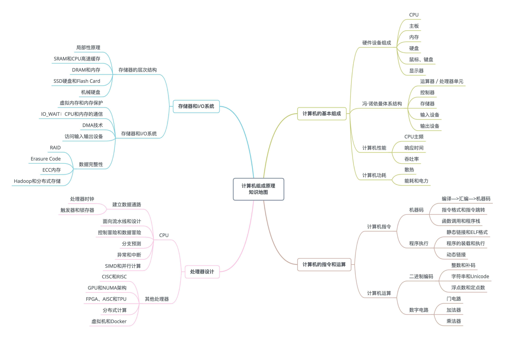

关于计算机组成原理的内容，我将其理解为计算机科学中众多科目的“纲要”，这门课中的任何一个知识点深入挖掘下去，都可以变成计算机科学里的一门核心课程。

如：

1. 从高级语言变成计算机指令：

    《编译原理》、《操作系统》...

2. 计算背后的硬件实现：

    《数字逻辑》 ---> 《处理器设计》

    > 我个人将数字逻辑和数字电路区分开来。
    >
    > 二者虽说都是数电，但还是有个人觉得还是有一定的差异。
    >
    > 比如，数字逻辑重计算机内部器件的连接和实现，会学习Verilog等HDL，我们需要自行实现加法器、寄存器（触发器）、流水线处理器等等。
    >
    > 而数字电路，则更多的是使用相关逻辑芯片来帮助我实现更多硬件上的功能，主要是和嵌入式或者硬件有比较大的相关性，比如说使用某些逻辑芯片来帮助我们实现一些功能：74HC595。
    >
    > > **74HC595**：是一种8位移位寄存器，它可以将串行数据转换为并行输出，常用于控制LED点阵屏等需要多个控制信号的应用。74HC595具有串行数据输入、时钟输入、数据锁存和并行数据输出等功能，并且可以通过级联多个芯片来扩展输出位数。
    > >
    > > [【物联网】超详细的74HC595应用指南（以stm32控制点阵屏为例子）_74hc595芯片使用_74hc195连接-CSDN博客](https://blog.csdn.net/u010508150/article/details/137414045)
    
3. 深入CPU和存储器的优化

    《计算机体系结构》

4. 计算和数学和基础

    《数据结构和算法》重要。建议好好学。

    至于说好好学到什么程度，我先想想，毕竟现在不是说完全让你手写一些数据结构，而是让你有这个分析思路。

    > 1. **离散数学**：离散数学是计算机科学的基石之一，它包括了如集合论、图论、逻辑、数论和代数结构等主题。这些概念在算法设计、数据结构、网络设计、密码学和软件工程中有广泛应用。
    >
    > 2. **算法理论**：算法是计算机科学的核心，而算法理论提供了分析算法性能（如时间复杂度和空间复杂度）的数学工具。它与计算复杂性理论密切相关，后者研究解决特定问题的最有效算法的极限。
    >
    > 3. **信息论**：由克劳德·香农创立的信息论涉及数据的编码、存储和传输。它对计算机科学的许多领域都有影响，包括数据压缩、加密、通信系统和信号处理。
    >
    > 4. **数值分析**：数值分析提供了用于解决工程和科学问题的数学模型的数值解法，这些方法在计算机模拟、数值优化和科学计算中非常重要。
    >
    > 5. **概率论和统计学**：在计算机科学中，概率论和统计学用于数据分析、机器学习算法、随机过程建模和统计推断。
    >
    > 6. **线性代数**：线性代数对于计算机图形学、机器学习、数据分析和量子计算等领域至关重要，它提供了向量空间、线性变换和矩阵理论等工具。
    >
    > 7. **微积分**：微积分在计算机辅助设计（CAD）、动画、模拟和优化问题中有应用，特别是对于涉及函数连续性和极限概念的问题。
    >
    > 8. **集合论**：它为计算机科学提供了一个形式化的框架，用于讨论对象的集合以及这些集合之间的关系。
    >
    > 9. **代数**：抽象代数中的群、环、域等概念在计算机科学的编码理论、代数几何和对称性破缺中有所应用。
    >
    > 10. **拓扑学**：在计算机科学中，拓扑学可以用来研究网络的结构，以及在计算机图形学和数据分析中的空间关系。
    >
    > 11. **逻辑学**：逻辑学是计算机科学的基础，特别是在人工智能、形式化验证和算法的推理方面。
    >
    > 12. **数论**：数论在算法设计、密码学和计算机安全中扮演着重要角色，特别是素数和模算术的概念。
    >

    上面这些数学方面我个人觉得有学习一些最基本的即可，比如微积分、线性代数、概率论、离散数学等等，不了解暂时也可以，毕竟不是完全做相关的算法和非常非常深入计算的本质，有相关数学基础即可，能看懂一些即可。

    > 这里说的学习一些的程度究竟是多少，我也不清楚，但是我也在了解。

#### 学习方法

这里待更新，但是我想的是要参考 Linus 的 STFW, RTFM, RTFSC 和 `ysyx` 的相关内容？

1. 学会提问自己来串联知识点。

    学完一个知识点之后，你可以从下面两个方面，问一下自己。我写的程序，是怎样从输入的代码，变成运行的程序，并得到最终结果的？整个过程中，计算器层面到底经历了哪些步骤，有哪些地方是可以优化的？无论是程序的编译、链接、装载和执行，以及计算时需要用到的逻辑电路、ALU，乃至 CPU 自发为你做的流水线、指令级并行和分支预测，还有对应访问到的硬盘、内存，以及加载到高速缓存中的数据，这些都对应着我们学习中的一个个知识点。建议你自己脑子里过一遍，最好是口头表述一遍或者写下来，这样对你彻底掌握这些知识点都会非常有帮助。

2. 其次，写一些示例程序来验证知识点。计算机科学是一门实践的学科。计算机组成中的大量原理和设计，都对应着“性能”这个词。因此，通过把对应的知识点，变成一个个性能对比的示例代码程序记录下来，是把这些知识点融汇贯通的好方法。因为，相比于强记硬背知识点，一个有着明确性能对比的示例程序，会在你脑海里留下更深刻的印象。当你想要回顾这些知识点的时候，一个程序也更容易提示你把它从脑海深处里面找出来。

3. 最后，通过和计算机硬件发展的历史做对照。计算机的发展并不是一蹴而就的。从第一台电子计算机 ENIAC（Electronic Numerical Integrator And Computer，电子数值积分计算机）的发明到现在，已经有 70 多年了。现代计算机用的各个技术，都是跟随实际应用中遇到的挑战，一个个发明、打磨，最后保留下来的。这当中不仅仅有学术层面的碰撞，更有大量商业层面的交锋。通过了解充满戏剧性和故事性的计算机硬件发展史，让你更容易理解计算机组成中各种原理的由来。

## 关于学习资料的问题

视频还是书籍？

要对初学者友好，然后还能比较快的过渡进阶？

- Linux

- C

- C++

- Hardware

- Data structure

- OS

- Computer organization

- Computer architecture

