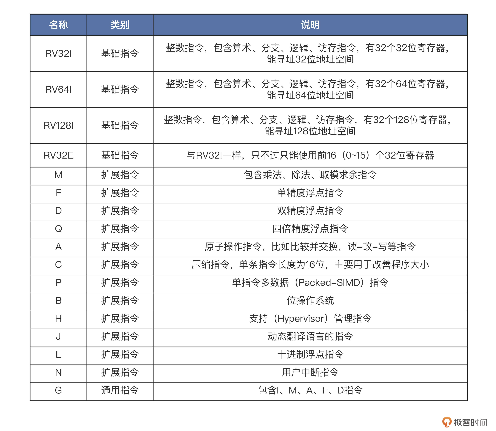
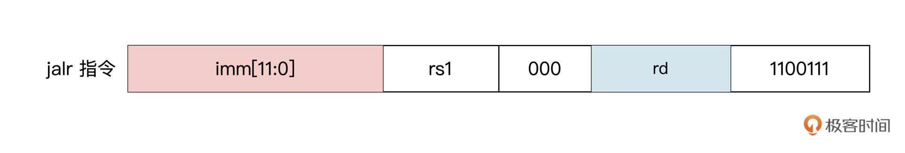
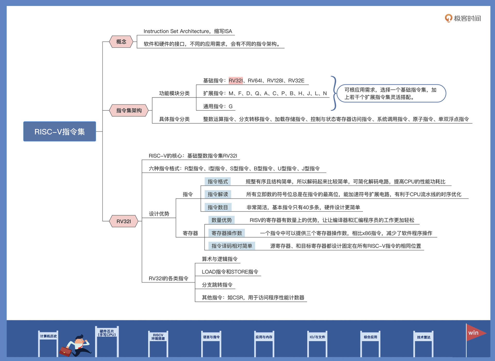
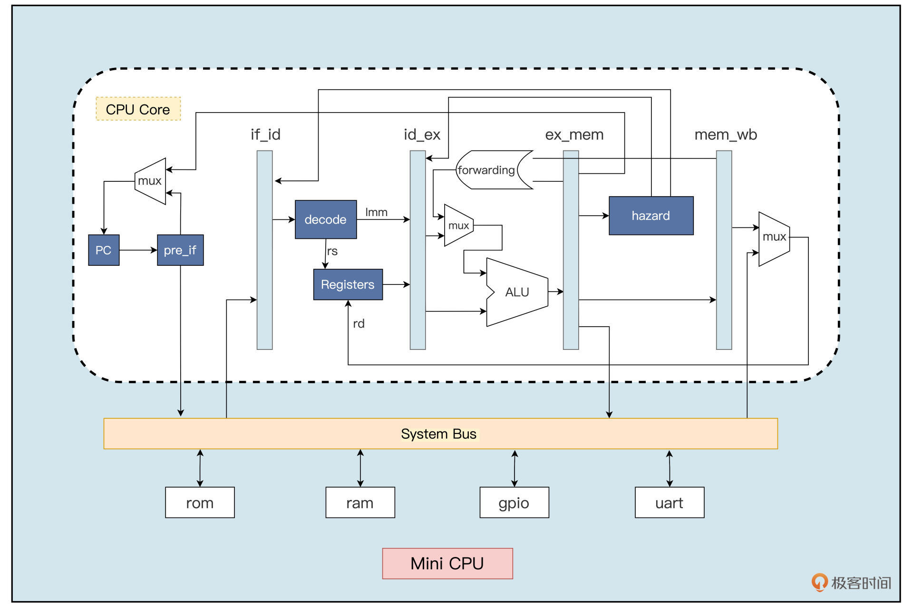
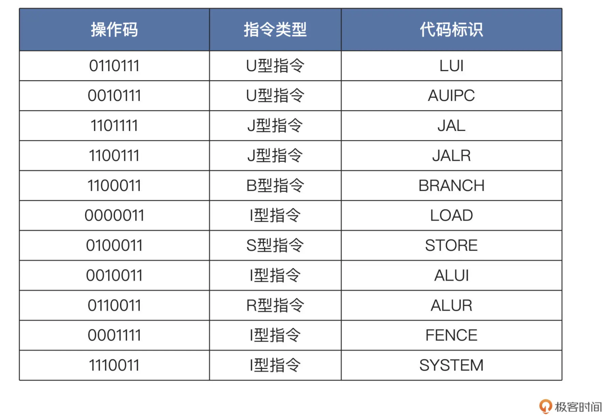

## 前言

- **使用 Verilog 硬件描述语言**
- **基于 RV32I 指令集**，**设计一个 32 位五级流水线的处理器核**。( **取值 --> 译码 --> 执行 --> 访存 --> 写回** )
- 该处理器核包括**指令提取单元**、**指令译码单元**、**整型执行单元**、**访问存储器**和**写回结果**等单元模块，**支持运行大多数 RV32I 的基础指令**。
- 最后，编写简单的汇编代码，放在设计出来的处理器上运行。


## Verilog

**区别于高级编程语言**

#### 设计思想：

- **模块化**

    > - 对整个芯片系统做好规划
    >
    > - 在写具体的 Verilog 代码之前，把系统划分成几个大的基本的功能模块。
    >
    > - 每个功能模块再按一定的规则，划分出下一个层次的基本单元。
    >
    > **Verilog 语言的 module 模块化：上一层模块对下一层子模块进行例化, 自顶向下,像编程语言的函数调用一样**。根据包含的子功能模块一直例化下去，最终形成 hierarchy 结构。


- **代码对应电路**

    > 用 Verilog 的时候，**必须理解每条语句实质上对应着什么电路，并且要从电路的角度来思考它为何要这样设计**，
    >
    > 如：
    >
    > - 声明变量的时候，如果指定是一个 reg，那么这个变量就有寄存数值的功能，可以综合出来一个实际的寄存器；
    > - 如果指定是一段 wire，那么它就只能传递数据，只是表示一条线。
    > - 在 Verilog 里写一个判断语句，可能就对应了一个 MUX（数据选择器），写一个 for 可能就是把一段电路重复好几遍。
    > - always 块，它可以指定某一个信号在某个值或某个跳变的时候，执行块里的代码（类似中断/异常）
    >
    > ==所以你是在设计电路，不是在编程==

- **并行性和并发性**

    > **电路中的多个元件可以同时工作**
    >
    > - 在 Verilog 中，可以使用并行赋值语句来表示多个信号的并行操作，从而实现硬件的并行计算和处理。
    >
    >     

- **时序和状态机**

    > **时序是指电路中的信号传输和触发的顺序和时间关系**
    >
    > **状态机则是描述了电路在不同状态下的行为和转移条件**
    >
    > - 在 Verilog 中，可以使用时钟信号和触发器来实现**时序控制**，使用状态机模块来描述电路的状态和状态转移


#### 设计流程


相关单词：

（Architecture Specification）架构规范

（Design & RTL）Register Transfer Level 寄存器级设计

（Pre-Silicon Simulation）流片前仿真（仿真）

（Logic Synthesis/Netlist）逻辑综合/门级网表

（placement & routing）布线

（post-Silicon Verification）流片后验证


#### 语法快速入门


要想熟悉硬件语言，最关键的就是做好思路转换。

硬件语言跟高级编程语言本质的不同就是，使用 Verilog 的时候，**必须理解每条语句实质上对应的什么电路，并且要从电路的角度来思考它为何要这样设计，**而高级编程语言通常只要实现功能就行。

```verilog
module counter(
  //端口定义
  input                   reset_n,  //复位端，低有效
  input                   clk,       //输入时钟
  output [3:0]            cnt,      //计数输出
  output                  cout     //溢出位
);  
  
reg [3:0]               cnt_r ;      //计数器寄存器
  
always@(posedge clk or negedge reset_n) begin
  if(!reset_n) begin                  //复位时，计时归0
      cnt_r        <= 4'b0000 ;
    end
    else if (cnt_r==4'd9) begin      //计时10个cycle时，计时归0
      cnt_r        <=4'b0000;
    end
  else begin                      
      cnt_r        <= cnt_r + 1'b1 ; //计时加1
  end
end
  
  assign  cout = (cnt_r==4'd9) ;       //输出周期位
  assign  cnt  = cnt_r ;               //输出实时计时器
  
endmodule
```

- **模块结构**

    ```verilog
    module counter(
      //端口定义
      input                   reset_n,  //复位端，低有效
      input                   clk,       //输入时钟
      output [3:0]            cnt,      //计数输出
      output                  cout     //溢出位
    );  
    
    ...
    endmodule
    ```

- **数据类型**

    ```verilog
    parameter SIZE  =  2’b01;
    reg [3:0]               cnt_r;
    wire [1:0] cout_w;
    ```

    - 位宽为 4 bit 的寄存器 reg 类型信号，信号名称为 cnt_r。

        > 寄存器 reg 类型表示抽象数据存储单元，它对应的是一种寄存器电路。
        >
        > reg 默认初始值为 X（不确定值），换句话说就是，reg 电路在上电之后，输出高电平还是低电平是不确定的，一般是在系统复位信号有效时，给它赋一个确定值。比如例子中的 cnt_r，在复位信号 reset_n 等于低电平时，就会给 cnt_r 赋“0”值。
        >
        > reg 类型只能在 always 和 inital 语句中被赋值
        >
        > ==注意：reg仅仅是语法定义，不等于电路中寄存器；==
        >
        > ==只有时序电路中reg变量才会被逻辑综合工具认为是寄存器== **如下：**
        >
        > > - 如果描述语句是时序逻辑，即 always 语句中带有时钟信号，寄存器变量对应为触发器电路。
        > >
        > >     > 比如上述定义的 cnt_r，就是在带 clk 时钟信号的 always 块中被赋值，所以它对应的是触发器电路；
        > >     >
        > >     
        > > - 如果描述语句是组合逻辑，即 always 语句不带有时钟信号，寄存器变量对应为锁存器电路。

    - wire 类型表示结构实体（例如各种逻辑门）之间的物理连线。

        > wire 类型不能存储数值，它的值是由驱动它的元件所决定的。
        >
        > 驱动线网类型变量的有逻辑门、连续赋值语句、assign 等。
        >
        > 如果没有驱动元件连接到线网上，线网就默认为高阻态“Z”。
        >

        ==凡是在always initial 语句中复制到变量，一定是reg型==

        ==凡是在assign 语句中复制的变量，一定是wire型==

        总结：

        wire型：表示电路模块重点连线，仿真波形不可见

        reg型：占用仿真环境的物理内存，会显示在仿	真波形中

        

    - 常量参数 parameter声明一个标识符，符号常量

        > 这个常量，就是电路中一串由高低电平排列组成的一个固定数值。


- **数据表达**

  ```verilog
   cnt_r        <= 4'b0000 ;
  ```

  > 给寄存器 cnt_r 赋 4’b0000 的值。其中的逻辑“0”低电平，对应电路接地（GND）。同样的，逻辑“1”则表示高电平，对应电路接电源 VCC。
  >
  > 除此之外，还有特殊的“X”和“Z”值。逻辑“X”表示电平未知，输入端存在多种输入情况，可能是高电平，也可能是低电平；逻辑“Z”表示高阻态，外部没有激励信号，是一个悬空状态。当然，为了代码的简洁明了，Verilog 可以用不同的格式，表示同样的数值。比如要表示 4 位宽的数值“10”，二进制写法为 4’b1010，十进制写法为 4’d10，十六进制写法为 4’ha。
  >
  > 但是数据在实际存储时还是用二进制，位宽表示储存时二进制占用宽度。

  

- **运算符**

    > 基本C语言

    

- **条件、分支、循环**

    > 语法基本同C语言，小区别不管，直接上手看代码用起来即可。
    >
    > 这里重点来对比不同之处，也就是用 Verilog 对于条件、分支语句有什么  不同。
    >
    > 用 if 设计的语句所对应电路**是有优先级的**，也就是多级串联的 MUX 电路。
    >
    > 而 case 语句对应的电路是**没有优先级**的，是一个多输入的 MUX 电路。（多路选择器）
    >
    > 设计时，只要我们合理使用这两个语句，就可以优化电路时序或者节省硬件电路资源。
    >
    > 循环语句，一共有4 种类型，分别是 while，for，repeat 和 forever 循环。注意，循环语句只能在 always 块或 initial 块中使用。

    

- **过程结构**

    - **always**

        always可以简单的看作while（event），即当事件发生的时候，就执行always语句。

        ==根据事件event中是否包含时序事件，always分为两种逻辑：**时序逻辑和组合逻辑**==。

        1. **时序逻辑**表示always只会在**对应的信号出现边沿事件时**，才会执行对应的代码。

            如果有多个信号以or连接，这些对应的事件被称为敏感事件列表，如下：

            ```verilog
            always @ (edge eventA or edge eventB) begin
                [multiple statements]
            end
            ```

            **其中edge可以是negedge（下降沿）和posedge（上升沿）。**

        2. **组合逻辑**通常用来**监听信号水平事件的发生**。当敏感信号出现电平的变化时就会执行always语句。

            **例如always @(a or b or c)，a、b、c均为变量，当其中一个发生变化时都会执行后续代码。**例如：

            ```verilog
            always@(a,b) begin
                out = a&b;
            end
            ```

            上述代码中always的敏感事件列表为a b发生电平变化，即当ab其中任何一个发生变化，都会赋予out新值。

            有的时候敏感事件变量较多，一个一个写比较麻烦，还有一种特殊的用法，always @（*），此时的敏感列表是module中所有具有形参的信号，其中任何信号发生变化都会触发always语句。上述代码就可以写成：

            ```verilog
            always @(*) begin
                out = a&b;
            end
            ```

        
        
    - tips

        always 块内不能使用 wire、

    

    

    - **initial**

        **initial语句只执行一次，常用于产生仿真测试信号，或对某些变量赋初值。**

        **如果module中有多个initial语句，这些语句之间是相互独立的，都是从0时刻开始并行执行，并没有顺序之分。**

    

    

    - **阻塞/非阻塞赋值**
    
        如果现在跳回去看之前的代码，会看到这样的注释：
    
        ```verilog
        ……                   
          cnt_r        <= cnt_r + 1'b1 ;       //计数加1 // 非阻塞赋值
        ……  
          assign  cout = (cnt_r==4'd9) ;       //输出周期位 // 阻塞赋值
          assign  cnt  = cnt_r ;               //输出实时计时器 // 阻塞赋值
        ……
        ```

        可以发现对变量进行赋值时有两种方法：=（阻塞赋值）和<=（非阻塞赋值）。
    
        两者的区别就在于
    
        1. 阻塞赋值会立即计算右手语句值（RHS）并立即赋值给左手语句（LHS）， **而且这行代码之后的语句会被阻塞，只有它执行完毕之后才能够继续进行。**
        2. 非阻塞赋值将赋值分为两个步骤：计算右边RHS，更新左边（LHS），并且其他语句不会被其所阻塞。**非阻塞赋值只能用于对寄存器信号进行赋值。**
    
        需要注意的是，阻塞赋值可能会造成数据竞争，例如实现在上升沿时交换两个寄存器的值：
    
        ```verilog
        always @(posedge clk) begin
            a = b ;
        end
        
        always @(posedge clk) begin
            b = a;
        end
        ```
    
        如果采用上述阻塞赋值，最后a b的值都会相等，而不是我们想要的交换。但是如果使用非阻塞赋值就没有这个顾虑：
    
        ```verilog
        always @(posedge clk) begin
            a <= b ;
        end
        
        always @(posedge clk) begin
            b <= a;
        end
        ```


- **assign**

    在Verilog中，**`assign`语句用于给一个线网（wire）或寄存器（reg）赋值。**

    它主要用于连接逻辑门、模块实例或信号，从而实现**组合逻辑**或连线功能。（主要用于描述**组合逻辑电路**）
    
    **`assign`语句在Verilog中是一种连续赋值语句，它在每个时钟周期都会重新计算并更新赋值结果。**
    
    `assign`语句通常用于以下情况：
    
    1. 连接输入输出端口：将模块的输入输出端口与其他信号或寄存器连接起来。
    2. 连接逻辑门：将逻辑门的输出与其他信号连接起来。
    3. 连接多个模块实例：将多个模块实例的输出连接到某个信号上。
    4. 连接内部信号：将内部信号连接到其他信号或寄存器上。
    
    示例：
    ```verilog
    module Adder (
        input [3:0] A, B,
        output [4:0] Sum
    );
    
    assign Sum = A + B;
    
    endmodule
    ```
    
    在上面的示例中，`assign Sum = A + B;`语句将输入端口A和B的值相加，并将结果赋值给输出端口Sum。这样，在每个时钟周期，Sum的值都会根据A和B的值重新计算并更新。
    
    
    
    
    


[verilog中assign和always@(*)的区别和易忽略的点_verilog alway信号 信号为x的时候-CSDN博客](https://blog.csdn.net/qq_28238141/article/details/114766153?spm=1001.2101.3001.6650.1&utm_medium=distribute.pc_relevant.none-task-blog-2~default~CTRLIST~Rate-1-114766153-blog-89031964.235^v43^pc_blog_bottom_relevance_base4&depth_1-utm_source=distribute.pc_relevant.none-task-blog-2~default~CTRLIST~Rate-1-114766153-blog-89031964.235^v43^pc_blog_bottom_relevance_base4&utm_relevant_index=2)

assign语句和always@(*)的差别（组合逻辑常用的两种描述）：

1. 被assign赋值的信号定义为wire型，被always@(*)结构块下的信号定义为reg型，值得注意的是，这里的reg并不是一个真正的触发器，只有敏感列表为上升沿触发的写法才会综合为触发器，在仿真时才具有触发器的特性。

2. 细微差别：

    ```verilog
    wire a;
    reg b;
    
    assign a = 1'b0;
    always@(*)
        b = 1'b0;
    ```

    在这种情况下，使用vcs仿真时a将会正常驱动为0， 但是b却是不定态。这是为什么？

    `verilog`规定，always@( * )中的 `*`是指该always块内的所有输入信号的变化为敏感列表，也就是仿真时只有**当always@(* )块内的输入信号产生变化，该块内描述的信号才会产生变化，**
    
    而像`always@(*) b = 1'b0;` 这种写法由于1'b0一直没有变化，所以b的信号状态一直没有改变，由于b是组合逻辑输出，所以复位时没有明确的值（不定态），而又因为always@(*)块内没有敏感信号变化，因此b的信号状态一直保持为不定态。
    
    事实上该语句的综合结果有可能跟assign一样（本人没有去尝试），但是在功能仿真时就差之千里了。

在 always @(*) ，组合逻辑块中，左边的变量赋值使用reg类型的，而 assign 的左边变量使用 wire 类型的。

> For combinational always blocks, always use a sensitivity list of `(*)`. Explicitly listing out the signals is error-prone (if you miss one), and is ignored for hardware synthesis. If you explicitly specify the sensitivity list and miss a signal, the synthesized hardware will still behave as though `(*)` was specified, but the simulation will not and not match the hardware's behaviour. (In SystemVerilog, use `always_comb`.)
>
> A note on wire vs. reg: The left-hand-side of an assign statement must be a *net* type (e.g., `wire`), while the left-hand-side of a procedural assignment (in an always block) must be a *variable* type (e.g., `reg`). These types (wire vs. reg) have nothing to do with what hardware is synthesized, and is just syntax left over from Verilog's use as a hardware *simulation* language.
>
> 


- 函数

    ```verilog
    	function [31:0] reverse;
    		input	[31:0]	in;
    		integer i;
    		
    		for(i = 0; i < 32; i++) begin
    			reverse[i] = in[31 - i];
    		end
    	endfunction
    ```

    在Verilog中，`function`关键字用于定义一个函数，这与C语言中的函数类似，但是有一些区别。函数`reverse`是一个例子，它接受一个32位的输入`in`，并通过循环将其位反转。

    Verilog中的函数不能包含`always`或`assign`语句，它们通常用于执行简单的计算或逻辑操作，并且可以被`always`或`initial`块调用。在这个例子中，`reverse`函数将输入的每一位从最高位到最低位进行反转。


==特别注意==

在可综合描述里，只使用一下四个关键字

`always` `if-else` `assign` `case`

如果用到了别的，那一定是你自己的问题


#### 电路接描述方法（重要）

##### 多路选择器：MUX（Multiplexing Hardware）


> 如果有多路，多个if//或者case

==电路 < == > Verilog代码==

==> 变形


> 注意上述两种电路的区别，先选后加 / 先加后选
>
> 用先选后加可以少一个加法器，设计出来的电路的面积更小，


##### 触发器和锁存器


> Latch 可以直接理解成组合逻辑的电路，就是输出跟随输入（只是会有延迟）
>
> 在设计时序的时候，不要写latch


> 落后的多少个时钟周期由你自己设计
>
> 写的时序是什么样的，就应该是什么样的


##### 组合逻辑


> 关于什么时候用 = 和 <=
>
> 直接记住：
>
> ==组合逻辑用 =（阻塞赋值）==
>
> ==时序逻辑用 <= （非阻塞赋值）==


##### 时序逻辑

> 组合逻辑 + 触发器


​    


##### 存储器


> 理解成二维数组


#### 流水线设计


#### 参数化


#### 模块实例化


#### 代码规范

[Verilog代码规范 - 数字逻辑设计（2023秋季）  哈工大（深圳） (gitee.io)](https://hitsz-cslab.gitee.io/diglogic/codingstyle/codingstyle/)


#### HDL 刷题


- 条件运算符

    同 C 语言。

- 缩减运算符

    是的，您这样写是可以的。在Verilog中，`^` 用作按位异或（XOR）操作符。当应用于一个向量时，它将对向量中的每一位执行按位异或操作，并产生一个向量作为结果。然而，当您使用 `^` 操作符对一个向量进行操作时，结果向量的长度将与输入向量的长度相同。

    在您的例子中，`in` 是一个8位宽的输入向量，如果您直接使用 `^in`，结果 `parity` 将是一个8位宽的向量，而不是1位。但是，您可以通过缩减操作符 `^` 来对整个向量执行缩减异或操作，这样可以得到一个单比特的输出，表示整个向量的异或结果。**缩减异或操作的结果是1位宽的，表示输入向量中1的奇偶性：**

    - 如果输入向量中有奇数个1，则结果为1（奇数个1产生偶数个0）。
    - 如果输入向量中有偶数个1，则结果为0（偶数个1产生偶数个0）。

    这是缩减异或操作符的用法，它将产生一个单比特的奇偶校验位：

    ```verilog
    input [7:0] in,
    output parity;
    
    assign parity = ^in; // 使用缩减异或操作符来计算8位输入的奇偶性
    ```

    这样，`parity` 将是一个1位宽的输出，表示输入向量的奇偶性。这是计算奇偶校验位的常见方法，特别是在需要检测数据中是否出现错误的情况下。

- 反转每一位

- 1的计数器

    ````Verilog
    module top_module( 
        input [254:0] in,
        output [7:0] out );
        
        int i;
        
        always @(*) begin
            out = 8'd0;
            for (i = 0; i < 255; i++) begin 
                out += (in[i] == 1'b1);
            end
        end
        
    
    endmodule
    
    ````

    虽然过了，可能有问题。

- 实例化 100个加法器

    Create a 100-bit binary ripple-carry adder by instantiating 100 [full adders](https://hdlbits.01xz.net/wiki/Fadd). The adder adds two 100-bit numbers and a carry-in to produce a 100-bit sum and carry out. To encourage you to actually instantiate full adders, also output the carry-out from *each* full adder in the ripple-carry adder. cout[99] is the final carry-out from the last full adder, and is the carry-out you usually see.

    ```verilog
    module top_module( 
        input [99:0] a, b,
        input cin,
        output [99:0] cout,
        output [99:0] sum );
    
        genvar i;
        generate 
            for (i = 0; i < 100; i++) begin: full_adder
                if (i == 0) begin 
                    assign {cout[0], sum[0]} = a[0] + b[0] + cin; 
                end else begin 
                    assign {cout[i], sum[i]} = a[i] + b[i] + cout[i -1];
                end
            end
        endgenerate
        
    endmodule
    
    ```

    用用chisel？

- 实例化 100个 BCD 加法器

    在Verilog中，`generate` 和 `endgenerate` 是用于创建循环结构或条件实例化的语法。这种结构允许你重复相同的硬件模块多次，或者根据不同的条件来实例化不同的模块。这在创建大型数组或根据不同条件生成不同模块时非常有用。

    ```verilog
    module top_module( 
        input [399:0] a, b,
        input cin,
        output cout,
        output [399:0] sum );
    
        wire [99:0] cin_cout;
        genvar i;
        generate 
            for (i = 0; i < 100; i++) begin: full_adder
                if (i == 0) begin 
                    bcd_fadd adder1(
                        .a(a[3:0]),
                        .b(b[3:0]),
                        .cin(cin),
                        .cout(cin_cout[0]),
                        .sum(sum[3:0])
                    );
                end else begin 
                    bcd_fadd adder2(
                        .a(a[4 * i + 3:i * 4]),
                        .b(b[4 * i + 3:i * 4]),
                        .cin(cin_cout[i - 1]),
                        .cout(cin_cout[i]),
                        .sum(sum[4 * i + 3:i * 4])
                    );
                end
            end
            assign cout = cin_cout[99];
        endgenerate
    
    endmodule
    
    ```

- 差位比较

    You are given a four-bit input vector in[3:0]. We want to know some relationships between each bit and its neighbour:

    - **out_both**: Each bit of this output vector should indicate whether *both* the corresponding input bit and its neighbour to the **left** (higher index) are '1'. For example, `out_both[2]` should indicate if `in[2]` and `in[3]` are both 1. Since `in[3]` has no neighbour to the left, the answer is obvious so we don't need to know `out_both[3]`.
    - **out_any**: Each bit of this output vector should indicate whether *any* of the corresponding input bit and its neighbour to the **right** are '1'. For example, `out_any[2]` should indicate if either `in[2]` or `in[1]` are 1. Since `in[0]` has no neighbour to the right, the answer is obvious so we don't need to know `out_any[0]`.
    - **out_different**: Each bit of this output vector should indicate whether the corresponding input bit is different from its neighbour to the **left**. For example, `out_different[2]` should indicate if `in[2]` is different from `in[3]`. For this part, treat the vector as wrapping around, so `in[3]`'s neighbour to the left is `in[0]`.

    ```verilog
    module top_module( 
        input [3:0] in,
        output [2:0] out_both,
        output [3:1] out_any,
        output [3:0] out_different );
        
    
        assign out_both = in[3:1] & in[2:0];
        assign out_any = in[3:1] | in[2:0];
        assign out_different = {in[0], in[3:1]} ^ in;
    
    
    endmodule
    
    ```

    后面的100位也是一样的，这就是Verilog 的能力吗？不同于C，Verilog 对bit的操作（切片操作）更加灵活，想知道chisel有什么别的好玩的。


- 选择器

    ```verilog
    module top_module (
    	input [15:0] a,
    	input [15:0] b,
    	input [15:0] c,
    	input [15:0] d,
    	input [15:0] e,
    	input [15:0] f,
    	input [15:0] g,
    	input [15:0] h,
    	input [15:0] i,
    	input [3:0] sel,
    	output logic [15:0] out
    );
    
    	// Case statements can only be used inside procedural blocks (always block)
    	// This is a combinational circuit, so use a combinational always @(*) block.
    	always @(*) begin
    		out = '1;		// '1 is a special literal syntax for a number with all bits set to 1.
    						// '0, 'x, and 'z are also valid.
    						// I prefer to assign a default value to 'out' instead of using a
    						// default case.
    		case (sel)
    			4'h0: out = a;
    			4'h1: out = b;
    			4'h2: out = c;
    			4'h3: out = d;
    			4'h4: out = e;
    			4'h5: out = f;
    			4'h6: out = g;
    			4'h7: out = h;
    			4'h8: out = i;
    		endcase
    	end
    	
    endmodule
    
    ```


- 256 bit -> 1bit

    Create a 1-bit wide, 256-to-1 multiplexer. The 256 inputs are all packed into a single 256-bit input vector. sel=0 should select `in[0]`, sel=1 selects bits `in[1]`, sel=2 selects bits `in[2]`, etc.

    

    ***Expected solution length:** Around 1 line.*

    ```verilog
    module top_module( 
        input [255:0] in,
        input [7:0] sel,
        output out );
        
        assign out = in[sel];
    
    endmodule
    
    ```

- 256 bit -> 4bit

    Create a 4-bit wide, 256-to-1 multiplexer. The 256 4-bit inputs are all packed into a single 1024-bit input vector. sel=0 should select bits `in[3:0]`, sel=1 selects bits `in[7:4]`, sel=2 selects bits `in[11:8]`, etc.

    

    ***Expected solution length:** Around 1–5 lines.*

    ```verilog
    module top_module( 
        input [1023:0] in,
        input [7:0] sel,
        output [3:0] out );
        
        
        // new syntax
        //assign out = in[sel * 4 +: 4];
        
        //second way
        assign out = {in[sel * 4 + 3], in[sel * 4 + 2], in[sel * 4 + 1], in[sel * 4]};
    
    endmodule
    
    ```

    这种写法是verilog 2001标准中新增加的，是**向量部分选择**的意思，**如果sel等于0，in[sel * 4 +: 4]代表从0开始向上数4位，即in[3:0**]，建议大家学习使用这种方法，在sel位宽较大是可以有效减小工作量。


- 3-bits full adder

    Now that you know how to build a [full adder](https://hdlbits.01xz.net/wiki/Fadd), make 3 instances of it to create a 3-bit binary ripple-carry adder. The adder adds two 3-bit numbers and a carry-in to produce a 3-bit sum and carry out. To encourage you to actually instantiate full adders, also output the carry-out from *each* full adder in the ripple-carry adder. cout[2] is the final carry-out from the last full adder, and is the carry-out you usually see.

    ```verilog
    module top_module( 
        input [2:0] a, b,
        input cin,
        output [2:0] cout,
        output [2:0] sum );
    
        full_adder adder_1(
            .a(a[0]),
            .b(b[0]),
            .cin(cin),
            .cout(cout[0]),
            .sum(sum[0])
        );
        
        full_adder adder_2(
            .a(a[1]),
            .b(b[1]),
            .cin(cout[0]),
            .cout(cout[1]),
            .sum(sum[1])
        );    
    
        full_adder adder_3(
            .a(a[2]),
            .b(b[2]),
            .cin(cout[1]),
            .cout(cout[2]),
            .sum(sum[2])
        );        
        
    endmodule
    
    
    module full_adder(
    	input a,
        input b,
        input cin,
        output cout,
        output sum
    );
        assign cout = ((a ^ b) & cin) | (a & b);
        assign sum = a ^ b ^ cin;
    endmodule
    
    ```

- overflow

    为了检测8位2的补数表示的有符号数相加时是否溢出，我们可以使用以下方法之一：

    1. **通过符号比较**：检查 `a` 和 `b` 的符号是否相同，以及结果 `s` 的符号是否不同。如果是这样，就发生了溢出。
    2. **使用进位位**：在8位加法中，如果最高位的进位（来自位7到位8的进位）与次高地位（位7）的进位不同，那么就会溢出。

    ```verilog
    module top_module (
        input [7:0] a,
        input [7:0] b,
        output [7:0] s,
        output overflow
    ); //
     
        assign s = a + b;
        
        assign overflow = (a[7] == b[7]) && (a[7] != s[7]);
        
        //assign overflow = (a[7] & b[7] & ~s[7]) | (~a[7] & ~b[7] & s[7]);
    
    endmodule
    
    ```

- 100 bits fuller-adder

    ```verilog
    module top_module( 
        input [99:0] a, b,
        input cin,
        output cout,
        output [99:0] sum );
        
        wire [98:0] tmp_cout;
        genvar i;
        generate 
            for (i = 0; i < 100; i++) begin : adder
                if (i == 0) begin 
                    full_adder adder_0(
                        .a(a[0]),
                        .b(b[0]),
                        .cin(cin),
                        .cout(tmp_cout[0]),
                        .sum(sum[0])
                    );
                end else if (i == 99) begin
                    full_adder adder_1(
                        .a(a[99]),
                        .b(b[99]),
                        .cin(tmp_cout[98]),
                        .cout(cout),
                        .sum(sum[99])
                    );
                end else begin
                    full_adder adder_2(
                        .a(a[i]),
                        .b(b[i]),
                        .cin(tmp_cout[i - 1]),
                        .cout(tmp_cout[i]),
                        .sum(sum[i])
                    );
                end
            end
            
        endgenerate
        
    endmodule
    
    
    module full_adder(
    	input a,
        input b,
        input cin,
        output cout,
        output sum
    );
        assign cout = ((a ^ b) & cin) | (a & b);
        assign sum = a ^ b ^ cin;
    endmodule
    
    
    ```

- BCD adder

    ```verilog
    module bcd_fadd(
        input [3:0] a,
        input [3:0] b,
        input     cin,
        output   cout,
        output [3:0] sum
    );
    
        // 定义中间变量
        wire [3:0] temp_sum;
        wire [2:0] temp_cout;
    
        // 实现4个1位全加器
        genvar i;
        generate
            for (i = 0; i < 4; i++) begin : bcd_adder
                full_adder fa(
                    .a(a[i]),
                    .b(b[i]),
                    .cin((i == 0) ? cin : temp_cout[i-1]),
                    .cout(temp_cout[i]),
                    .sum(temp_sum[i])
                );
            end
        endgenerate
    
        // 检查是否有进位需要传递到下一个高位
        assign cout = (temp_cout[3] | cin) & !(temp_sum[3] & temp_sum[2] & temp_sum[1] & temp_sum[0]);
    
        // 修正sum以确保它是BCD格式
        assign sum = temp_sum + 4'b1000 * (!(temp_sum < 4'b1001) & (temp_cout[3] | cin));
    
    endmodule
    
    module full_adder(
        input a, b, cin,
        output sum, cout
    );
        assign {cout, sum} = a + b + cin;
    endmodule
    ```

- 上升沿检测电路

    ```verilog
    module top_module (
        input clk,
        input [7:0] in,
        output [7:0] pedge
    );
        reg [7:0] in_last;
        
        always @(posedge clk) begin
           	in_last <= in;
        end
        
       	always@(posedge clk)begin
            // 检测到正跳变
            pedge <= in & ~in_last;
        end
    
        
    
    endmodule
    
    ```

    - `in_last` 是一个寄存器数组，用于存储上一个时钟周期的 `in` 信号的值。
    - 在每个时钟上升沿，`in_last` 被更新为当前的 `in` 值。
    - 然后，通过比较当前的 `in` 值和 `in_last`，检测每一位是否发生了正跳变。
    - 如果检测到正跳变（即当前位是1，而上一个周期是0），则将 `pedge` 对应的位设置为1。 `in & ~in_last;`
    - `pedge` 在每个时钟周期开始时被重置，以确保只反映最近一次的跳变。

    > 同理，下降沿检测： `~in & in_last`

- 双边沿检测

    ```verilog
    module top_module (
        input clk,
        input [7:0] in,
        output [7:0] anyedge
    );
        
        reg [7:0] in_last;
        always@(posedge clk)begin
            in_last <= in;
        end
        
        always@(posedge clk)begin
            anyedge = in ^ in_last;
        end
    
    endmodule
    
    ```

    计算 `in` 和 `in_last` 的按位异或（XOR）。

    异或操作的结果是一个位向量，其中每一位表示输入在相应位上是否发生了变化：

    - 如果输入位没有变化（保持0或1），则该位结果为0。
    - 如果输入位发生了变化（从0变为1或从1变为0），则该位结果为1。

- 边沿捕获寄存器

    For each bit in a 32-bit vector, capture when the input signal changes from 1 in one clock cycle to 0 the next. "Capture" means that the output will remain 1 until the register is reset (synchronous reset).

    Each output bit behaves like a SR flip-flop: The output bit should be set (to 1) the cycle after a 1 to 0 transition occurs. The output bit should be reset (to 0) at the positive clock edge when reset is high. If both of the above events occur at the same time, reset has precedence. In the last 4 cycles of the example waveform below, the 'reset' event occurs one cycle earlier than the 'set' event, so there is no conflict here.

    In the example waveform below, reset, in[1] and out[1] are shown again separately for clarity.

    

    题目要求的不只是下降沿检测，即输出不只是脉冲信号，而是检测到一次下降沿就一直将输出保持为高电平。

    ```verilog
    module top_module (
        input clk,
        input reset,
        input [31:0] in,
        output [31:0] out
    );
        reg [31:0] in_last;
        always @(posedge clk) begin
           	 in_last <= in;
        end
    
        always @(posedge clk) begin
            if (reset) begin
               	out <= 32'b0; 
            end else begin
                // 使用 | 或赋值操作符来更新 out，这样如果 out 中的某位已经是1，它将保持为1。
                out <= out | (~in & in_last);
            end
        end
        
    endmodule
    
    ```

    - 存储上一个周期的输入值：in_last
    - 如果 `reset` 信号在任何时钟周期为高，则 `out` 应立即被清零。这应该在检查输入信号变化之前完成。
    - 保持输出状态，使用 `|=` （或赋值）操作符来更新 `out`，这样如果 `out` 中的某位已经是1，它将保持为1。知道复位事件发生。
    - 在复位条件之外，使用 `(~in) & in_last` 来检测1到0的转换。
    - 确保复位优先，并在检测到1到0的转换后保持输出状态，直到复位事件发生。

- 模拟双边沿触发：`Dualedge`

    代码分析：不同就用 异或。

    - 第一个 `always` 块在 `clk` 的上升沿触发，更新 `q_neg` 的值。它使用 `q_pos` 和当前的输入 `d` 进行异或操作，将结果存储在 `q_neg` 中。
    - 第二个 `always` 块在 `clk` 的下降沿触发，更新 `q_pos` 的值。它使用 `q_neg` 和当前的输入 `d` 进行异或操作，将结果存储在 `q_pos` 中。
    - `assign` 语句将 `q` 的值设置为 `q_pos` 和 `q_neg` 的异或结果。

    这种方法能够实现双沿触发的效果，因为**每个触发器在时钟信号的相反边缘触发**，并且它们的状态在每个时钟周期内相互更新。这样，无论时钟信号是上升还是下降，输入 `d` 的变化都能被捕捉并反映到输出 `q`。

    ```verilog
    module top_module (
        input clk,
        input d,
        output q
    );
    
        reg q_pos;
        reg q_neg;
        always @(posedge clk) begin
        	q_neg <= q_pos ^ d; 
        end
        
        always @(negedge clk) begin
        	q_pos <= q_neg ^ d; 
        end 
        
        assign q = q_pos ^ q_neg;
        
        
    endmodule
    
    
    others:
        /*
        //second way
        always@(posedge clk)begin
            q_d1 <= d;
        end
        
        always@(negedge clk)begin
            q_d2 <= d;
        end
        
        assign q = clk ? q_d1 : q_d2;
        */
    ```

    请注意，最后一个 `always` 块用于确保 `q` 始终是 `q_pos` 和 `q_neg` 的最新异或结果。这个 `always` 块对 `q_pos` 或 `q_neg` 的任何变化都敏感，但它不会在时钟边沿触发，因此不会违反FPGA的时钟约束。

    这种方法的一个关键点是确保 `q_pos` 和 `q_neg` 在不同的时钟边缘更新，这样它们就不会同时改变，从而避免了竞争条件。这种设计允许 `q` 在每个时钟周期的上升沿和下降沿都反映出 `d` 的最新状态。

    这里注意：

    - 对于双沿检测，一定不能使用 `always@(posedge clk or negedge clk) `这种方式，这种方式是不可综合的。

    - 另外：others 的方法会在 `modelsim` 和 `vivado` 中仿真会产生毛刺，不建议用。


- 4位二进制计数器

    ```verilog
       always@(posedge clk)begin
            if(reset)begin
                q <= 4'd0;
            end
            else begin
                q <= q + 1'b1;
            end
        end
    
    ```

    计到15清零，懒得清了。

- 十进制计数

    ```Verilog
    module top_module(
    	input clk,
    	input reset,
    	output reg [3:0] q);
    	
    	always @(posedge clk)
    		if (reset || q == 9)	// Count to 10 requires rolling over 9->0 instead of the more natural 15->0
    			q <= 0;
    		else
    			q <= q+1;
    	
    endmodule
    ```

- 1计到10

    ```verilog
    module top_module (
        input clk,
        input reset,
        output [3:0] q);
    
        always @(posedge clk) begin
            if (reset || q == 4'd10) begin
               	q <= 4'b1; 
            end else begin
            	q <= q + 1'b1;
            end
        end
        
        
    endmodule
    
    
    ```

- pause counter

    ```verilog
    module top_module (
        input clk,
        input slowena,
        input reset,
        output [3:0] q);
        
    	always @(posedge clk)
            if (reset) begin 
    			q <= 0;
            end else if (slowena) begin
                if (q == 4'd9) begin
                	q <= 1'b0;
                end else begin
                	q <= q + 1'b1;
                end
            end
    
    endmodule
    
    ```

- 1-12计数器

    Design a 1-12 counter with the following inputs and outputs:

    - **Reset** Synchronous active-high reset that forces the counter to 1
    - **Enable** Set high for the counter to run
    - **Clk** Positive edge-triggered clock input
    - **Q[3:0]** The output of the counter
    - **c_enable, c_load, c_d[3:0]** Control signals going to the provided 4-bit counter, so correct operation can be verified.

    You have the following components available:

    - the 4-bit binary counter (**count4**) below, which has Enable and synchronous parallel-load inputs (load has higher priority than enable). The **count4** module is provided to you. Instantiate it in your circuit.
    - logic gates

    ```
    module count4(
    	input clk,
    	input enable,
    	input load,
    	input [3:0] d,
    	output reg [3:0] Q
    );
    ```

    The **c_enable**, **c_load**, and **c_d** outputs are the signals that go to the internal counter's **enable**, **load**, and **d** inputs, respectively. Their purpose is to allow these signals to be checked for correctness.

    ```verilog
    module top_module (
        input clk,
        input reset,
        input enable,
        output [3:0] Q,
        output c_enable,
        output c_load,
        output [3:0] c_d
    ); //
        
        assign c_enable = enable;
        assign c_load = reset | ((Q == 4'd12) && enable == 1'b1);
        assign c_d = c_load ? 4'd1 : 4'd0;
     
        count4 u_counter (clk, c_enable, c_load, c_d, Q);
     
    endmodule
    ```

- 1000计数器

    From a 1000 Hz clock, derive a 1 Hz signal, called **OneHertz**, that could be used to drive an Enable signal for a set of hour/minute/second counters to create a digital wall clock. Since we want the clock to count once per second, the **OneHertz** signal must be asserted for exactly one cycle each second. Build the frequency divider using modulo-10 (BCD) counters and as few other gates as possible. Also output the enable signals from each of the BCD counters you use (c_enable[0] for the fastest counter, c_enable[2] for the slowest).

    The following BCD counter is provided for you. **Enable** must be high for the counter to run. **Reset** is synchronous and set high to force the counter to zero. All counters in your circuit must directly use the same 1000 Hz signal.

    ```
    module bcdcount (
    	input clk,
    	input reset,
    	input enable,
    	output reg [3:0] Q
    );
    ```

    ```
    module top_module (
        input clk,
        input reset,
        output OneHertz,
        output [2:0] c_enable
    ); //
        
        wire [3:0] one, ten, hundred;
    
        bcdcount counter0 (clk, reset, c_enable[0], one/*, ... */);
        bcdcount counter1 (clk, reset, c_enable[1], ten/*, ... */);
        bcdcount counter2 (clk, reset, c_enable[2], hundred/*, ... */);    
        
        assign c_enable = {one == 4'd9 && ten == 4'd9, one == 4'd9, 1'b1};
        assign OneHertz = (one == 4'd9 && ten == 4'd9 && hundred == 4'd9);
    
    endmodule
    
    ```

    


#### 学习资料

[从电路设计的角度入门VerilogHDL_bilibili](https://www.bilibili.com/video/BV1PS4y1s7XW?p=1&vd_source=ecc99d78ae961113010161a48a475a35)

[1.1 Verilog 教程 | 菜鸟教程 (runoob.com)](https://www.runoob.com/w3cnote/verilog-tutorial.html)

[Verilog语法 | 教程 (ustc.edu.cn)](https://vlab.ustc.edu.cn/guide/doc_verilog.html)

《Verilog HDL高级数字设计》

[HDLBits (01xz.net)](https://hdlbits.01xz.net/wiki/Main_Page)


## RISC-V指令集

#### **基础指令集和扩展指令集**




要满足现代操作系统和应用程序的基本运行，RV32G 指令集或者 RV64G 指令集就够了（G 是通用的意思 ，而 I 只是整数指令集，G 包含 I），注意 RV32G 指令集或者 RV64G 指令集，只有寄存器位宽和寻址空间大小不同，这些指令按照功能可以分为如下几类。

1. 整数运算指令：实现算术、逻辑、比较等运算操作。
2. 分支转移指令：实现条件转移、无条件转移等操作。
3. 加载存储指令：实现字节、半字、字、双字（RV64I）的加载、存储操作，采用的都是寄存器相对寻址方式。
4. 控制与状态寄存器访问指令：实现对系统控制与系统状态寄存器的原子读 - 写、原子读 - 修改、原子读 - 清零等操作。
5. 系统调用指令：实现系统调用功能。
6. 原子指令：用于现在你能看到的各种同步锁。
7. 单双浮点指令：用于实现浮点运算操作。


- 指令集命名模式

    ```bash
    RV[###][abc……xyz]
    ```

    

    


#### RISC-V 特权级


一个 RISC-V 硬件线程（hart），相当于一个 CPU 内的独立的可执行核心，在任一时刻，只能运行在某一个特权级上，这个特权级由 CSR（控制和状态寄存器）指定和配置。具体分级如下：

1. 机器特权级（M）：RISC-V 中 hart 可以执行的最高权限模式。在 M 模式下运行的 hart，对内存、I/O 和一些必要的底层功能（启动和系统配置）有着完全的控制权。因此，它是唯一一个所有标准 RISC-V CPU 都必须实现的权限级。实际上，普通的 RISC-V 微控制器仅支持机器特权级。
2. 虚拟机监视特权级（H）：为了支持虚拟机监视器而定义的特权级。
3. 管理员特权级（S）：主要用于支持现代操作系统，如 Linux、FreeBSD 和 Windows。
4. 用户应用特权级（U）：用于运行应用程序，同样也适用于嵌入式系统。

好了，关于 RISC-V 的特权级，你了解这些，在现阶段已经足够了。需要把握的重点是，特权级起到了怎样的作用。有了特权级的存在，就给指令加上了权力，从而去控制用指令编写的程序。应用程序只能干应用程序该干的事情，不能越权操作。操作系统则拥有更高的权力，能对系统的资源进行管理。


#### RV32I

RV32I 包含的指令是固定的，永远不会改变。这为编译器设计人员，操作系统开发人员和汇编语言程序员提供了稳定的基础知识框架。


> 命名规则
>
> 从图中我们可以看到，有些字母带有下划线。我们把带有下划线的字母从左到右连接起来，就可以组成一个 RV32I 的指令。
>
> 对于每一个指令名称，集合标志{}内列举了指令的所有变体，变体用加下划线的字母或下划线字符 _ 表示。如果大括号内只有下划线字符 _，则表示对于此指令变体不需用字母表示。
>
> 我们再结合例子加深一下理解：
>
> 


- RV32I的指令格式

    

不要小看这些指令，我们来分析一下它们到底有哪些优势。

这些指令格式规整有序，结构简单。因为指令只有六种格式，并且所有的指令都是 32 位长度的，所以这些指令解码起来就比较简单，可以简化解码电路，提高 CPU 的性能功耗比。上图中的 `opcode` 代表指令操作码，`imm` 代表立即数，`funct3` 和 `funct7` 代表指令对应的功能，`rs1`、`rs2` 和 `rd` 则分别代表源寄存器 1、源寄存器 2 以及目标寄存器。

RISC-V 的一个指令中可以提供三个寄存器操作数，而不是像 x86 一样，让源操作数和目的操作数共享一个字段，因此相比 x86 指令，RISC-V 减少了软件的程序操作。


- **RV32I的32个通用寄存器**

    


#### RV32I的各类指令

- **算术与逻辑指令**

    在 RV32I 的指令中，包括

    - 算术指令（`add`, `sub`）
    - 数值比较指令（`slt`）
    - 逻辑指令（`and`, `or`, `xor`）
    - 移位指令 （`sll`, `srl`, `sra`）

    

    立即数版本：

    

    寄存器操作版本：

    


- `Load` 和 `Store`

    在 RISC-V 指令集中，对内存的读写只能通过 LOAD 指令和 STORE 指令实现。而其他的指令，都只能以寄存器为操作对象。

    

    

- 分支跳转指令

    - 有条件分支跳转

        RV32I 中的条件跳转指令是通过比较两个寄存器的值，并根据比较结果进行分支跳转。

        比较可以是：相等（`beq`），不相等 （`bne`），大于等于（`bge`），或小于（`blt`）。

        如下图所示，

        - 大于等于（`bge`），和小于（`blt`）则跳转指令为有符号数比较，
        - RV32I 也提供了相应的无符号数的比较指令，分别为 `bgeu` 和 `bltu`。
        - 剩下的两个比较关系（大于和小于等于），可以通过简单地交换两个操作数位置，来完成相同的比较。例如， x < y 可以表示为 y > x ，同样的， x ≤ y 也表示为 y ≥ x。

        

    - 无条件跳转

        除了有条件分支跳转，RV32I 还提供了无条件跳转指令，无条件跳转指令还可以细分为直接跳转和间接跳转这两种指令。

        - JAL

            直接跳转指令 JAL 如下图所示。RISC-V 为 JAL 指令专门定义了 J-TYPE 格式。

            JAL 指令的执行过程是这样的。首先，它会把 20 位立即数做符号位扩展，并左移一位，产生一个 32 位的符号数。然后，将该 32 位符号数和 PC 相加来产生目标地址（这样，JAL 可以作为短跳转指令，跳转至 PC±1 MB 的地址范围内）。

            同时，JAL 也会把紧随其后的那条指令的地址，存入目标寄存器中。这样，如果目标寄存器是零，则 JAL 就等同于 GOTO 指令；如果目标寄存器不为零，JAL 可以实现函数调用的功能。

        - JALR

            

            间接跳转指令 JALR 如上图所示。JALR 指令会把 12 位立即数和源寄存器相加，并把相加的结果末位清零，作为新的跳转地址。同时，和 JAL 指令一样，JALR 也会把紧随其后的那条指令的地址，存入到目标寄存器中。

            

- **其他指令**

    除了内存地址空间和通用寄存器地址空间外，RISC-V 中还定义了一个独立的控制与状态寄存器（Control Status Register，CSR）地址空间。每个处理器实现的 CSR 会因设计目标不同而有差异，但这些 CSR 的访问方式却是一致的，访问这些 CSR 的指令定义在了用户指令集中（Zicsr 指令集扩展）。

    

    有了上图这些 CSR 指令，能够让我们轻松访问一些程序性能计数器。这些计数器包括系统时间、时间周期以及执行的指令数目。

在 RISC-V 指令集中，还有其他的一些指令，例如用于系统调用的 `ecall` 指令，在调试时用于将控制转移到调试环境的 `ebreak` 指令等。对于这些扩展的指令，这里就不展开讲了。


#### **总结**




## 手写CPU（一）：CPU架构设计与取指令实现

#### **架构**



1. 取指阶段（Instruction Fetch）：

    取指阶段是指将指令从存储器中读取出来的过程。程序指针寄存器用来指定当前指令在存储器中的位置。读取一条指令后，程序指针寄存器会根据指令的长度自动递增，或者改写成指定的地址。

    相关代码模块：

    - `pre_if.v`(指令预读取模块)
    - `if_id.v`(取值数据通路模块)

2. 译码阶段（Instruction Decode）：

    指令译码是指将存储器中取出的指令进行翻译的过程。指令译码器对指令进行拆分和解释，识别出指令类别以及所需的各种操作数。

    相关代码模块：

    - `decode.v`(译码模块)
    - `id_ex_ctrl.v(`译码控制模块)
    - `id_ex`(译码数据通路模块)

3. 执行阶段（Instruction Execute）：

    指令执行是指对指令进行真正运算的过程。例如指令是一条加法运算指令，则对操作数进行相加操作；如果是一条乘法运算指令，则进行乘法运算。在“执行”阶段最关键的模块为算术逻辑单元（Arithmetic Logical Unit，ALU），它是实施具体运算的硬件功能单元。

    相关代码模块：

    - `ALUCtrl.v`(执行控制模块)
    - `gen_regs.v`(通用寄存器模块)
    - `alu.v`(执行模块)

4. 访存阶段（Memory Access）：

    访存是指存储器访问指令将数据从存储器中读出，或写入存储器的过程。

    相关代码模块：

    - `forwarding.v`(数据前递模块)
    - `ex_mem_ctrl.v`(访存控制模块)
    - `ex_mem.v`(访存数据通路模块)

5. 写回阶段（Write-Back）：

    写回是指将指令执行的结果写回通用寄存器的过程。如果是普通运算指令，该结果值来自于“执行”阶段计算的结果；如果是存储器读指令，该结果来自于“访存”阶段从存储器中读取出来的数据。

    相关代码模块：

    - `hazard.v`(控制冒险模块)
    - `mem_wb_ctrl.v`(写回控制模块)
    - `mem_wb.v`(写回数据模块)

6. [补充] 系统总线、ROM、RAM、UART
   
   相关代码模块：
   
   - `sys_bus`(系统总线)
   - `imem`(ROM)
   - `dmem.v`(RAM)
   - `uart_tx.v`、`uart_rx.v`(UART)


#### 指令预读取模块设计

```verilog
module pre_if(
	input [31:0] instr,
	input [31:0] pc,

	output [31:0] pre_pc,
)

	wire is_bxx = (instr[6:0] == `OPCODE_BRANCH);
	wire is_jal = (instr[6:0] == `OPCODE_JAL);

	// B型指令的立即数拼接
	wire [31:0] bimm  = {{20{instr[31]}}, instr[7], instr[30:25], instr[11:8], 1'b0};
	// J型指令的立即数拼接
	wire [31:0] jimm  = {{12{instr[31]}}, instr[19:12], instr[20], instr[30:21], 1'b0};

	// 指令地址的偏移量
	wire [31:0] addr = is_jal ? jimm : (is_bxx && bimm[31]) ? bimm : 4;
	
	assign pre_pc = pc + addr;

endmodule

```

8、9行：根据指令的低 7 位操作码，判断是否是条件跳转指令或是无条件跳转指令。


从这张表格我们可以发现，条件跳转指令的操作码，也就是指令中的低 7 位数都是 7’b1100011。根据这一特点，我们就可以在指令解码之前，判断出接下来可能会发生跳转。

我们结合代码来看看。下面的 Verilog 语句就是跳转指令的判断，其中的`OPCODE_BRANCH 已经通过宏定义为 7’b1100011。

条件跳转指令执行时是否发生跳转，要根据相关的数据来判断，这就需要指令执行之后才能知道是否需要跳转（具体如何判断，我们后面写回模块那节课再展开）。


但是，我们的 CPU 是多级流水线架构，一条指令执行需要多个时钟周期。如果要等到跳转指令执行完成之后再去取下一条指令，就会降低我们的指令执行效率。而指令预读取模块刚好可以解决这个问题。

不管指令是否跳转，都提前把跳转之后的下一条指令从存储器中读取出来，以备流水线的下一阶段使用，这就提高了 CPU 的执行效率。


以下代码就是根据条件跳转指令的格式，对指令中的立即数进行拼接，为指令跳转时的 PC 提供偏移量。

```verilog
	// B型指令的立即数拼接
	wire [31:0] bimm  = {{20{instr[31]}}, instr[7], instr[30:25], instr[11:8], 1'b0};
	// J型指令的立即数拼接
	wire [31:0] jimm  = {{12{instr[31]}}, instr[19:12], instr[20], instr[30:21], 1'b0};

```


> 这两句代码使用了Verilog中的concatenation操作符{{}}, 用于拼接多个信号或位。让我详细解释一下：
>
> 1. **{{20{instr[31]}}, instr[7], instr[30:25], instr[11:8], 1'b0}**：
>    - {{20{instr[31]}}}：这部分表示将instr[31]重复20次，即将instr[31]扩展成20位，形成一个20位的向量。
>    - instr[7]：表示取instr的第7位。
>    - instr[30:25]：表示取instr的第30位到第25位（共6位）。
>    - instr[11:8]：表示取instr的第11位到第8位（共4位）。
>    - 1'b0：表示一个单独的0位。
>    综合起来，这条语句的作用是将上述几部分按顺序拼接在一起，形成一个32位的立即数bimm。
>
> 2. **{{12{instr[31]}}, instr[19:12], instr[20], instr[30:21], 1'b0}**：
>    - {{12{instr[31]}}}：这部分表示将instr[31]重复12次，即将instr[31]扩展成12位，形成一个12位的向量。
>    - instr[19:12]：表示取instr的第19位到第12位（共8位）。
>    - instr[20]：表示取instr的第20位。
>    - instr[30:21]：表示取instr的第30位到第21位（共10位）。
>    - 1'b0：表示一个单独的0位。
>    综合起来，这条语句的作用是将上述几部分按顺序拼接在一起，形成一个32位的立即数jimm。
>
> 这样的拼接操作是为了从指令中提取出特定的位，并按照特定的顺序组合成新的信号，以便后续的计算和处理。


#### 取指数据通路模块

由上述的指令预读取模块把指令从存储器中读取之后，需要把它发送给译码模块进行翻译。但是，预读取模块读出的指令，并不是全部都能发送后续模块去执行。

例如上面的条件分支指令，在指令完成之前就把后续的指令预读取出来了。如果指令执行之后发现跳转的条件不成立，这时预读取的指令就是无效的，需要对流水线进行冲刷（flush），把无效的指令都清除掉。

取指通路模块 if_id 主要产生 3 个信号。首先是给后面解码模块提供的指令信号 reg_instr。如果流水线没有发生冲突，也就是没有发出清除信号 flush，则把预读取的指令保存，否则把指令清“0”。

```verilog
  //指令通路
  always @(posedge clock) begin
    if (reset) begin 
      reg_instr <= 32'h0; 
    end else if (flush) begin 
      reg_instr <= 32'h0; 
    end else if (valid) begin 
      reg_instr <= in_instr; 
    end
  end
```

第二个是更新 PC 值，如果指令清除信号 flush=“0”，则把当前指令对应的 PC 值保存为 reg_pc，否则就把 reg_pc 清“0”。

```verilog
  //PC值通路
  always @(posedge clock) begin""
    if (reset) begin 
      reg_pc <= 32'h0; 
    end else if (flush) begin 
      reg_pc <= 32'h0; 
    end else if (valid) begin 
      reg_pc <= in_pc; 
    end
  end
```

最后一个是流水线冲刷的标志信号 reg_noflush。当需要进行流水线冲刷时，reg_noflush=“0”，否则 reg_noflush=“1”。

```verilog
  //流水线冲刷标志位
  always @(posedge clock) begin  
    if (reset) begin 
      reg_noflush <= 1'h0; 
    end else if (flush) begin 
      reg_noflush <= 1'h0; 
    end else if (valid) begin 
      reg_noflush <= in_noflush; 
    end
  end
```


搞定。

- 总结

    取值阶段就是把存储器里面的指令读出，并传递给后面的译码模块进行处理。


#### **相关代码**

- `pre_if.v`(指令预读取模块)
- `if_id.v`(取值数据通路模块)


## 手写CPU（二）：指令译码模块

> **指令译码电路翻译出指令中携带的执行信息**
>
> **由译码数据通路负责把译码后的指令信息发送给对应的指令单元**

#### 译码模块设计

指令格式不同，指令译码模块翻译指令的工作机制却是统一的。首先译码电路会翻译出指令中携带的寄存器索引、立即数大小等执行信息。

> 虽然工作机制一致，得到的寄存器索引、立即数都是那些，但是之后按照什么样的既定顺序划分指令的类型呢？什么样的顺序便于我们解码的CPU设计？
>
> ```verilog
>     `OPCODE_LUI    :   dec_array <= DEC_LUI;   
>     `OPCODE_AUIPC  :   dec_array <= DEC_AUIPC; 
>     `OPCODE_JAL    :   dec_array <= DEC_JAL; 
>     `OPCODE_JALR   :   dec_array <= DEC_JALR;   
>     `OPCODE_BRANCH :   dec_array <= DEC_BRANCH; 
>     `OPCODE_LOAD   :   dec_array <= DEC_LOAD;   
>     `OPCODE_STORE  :   dec_array <= DEC_STORE;  
>     `OPCODE_ALUI   :   dec_array <= DEC_ALUI;  
>     `OPCODE_ALUR   :   dec_array <= DEC_ALUR;  
> ```
>
> 像这样，划分成这些指令？还是划分成R、I、S、B、U、J？还是按照什么算数、逻辑、跳转等等？还是按照寄存器、立即数，再分出一些指令？
>
> 哪一种方便我们设计CPU或者说实际生产中，哪一种更合适呢？实际开发的人员它们是怎么划分的？

接着，在解决数据可能存在的数据冒险（这个概念后面第九节课会讲）之后，由译码数据通路负责把译码后的指令信息，发送给对应的执行单元去执行。


```verilog
module decode (
  input  [31:0] instr,      //指令源码

  output  [4:0] rs1_addr,    //源寄存器rs1索引
  output  [4:0] rs2_addr,    //源寄存器rs2索引
  output  [4:0] rd_addr,    //目标寄存器rd索引
  output  [2:0] funct3,      //功能码funct3
  output  [6:0] funct7,      //功能码funct7
  output        branch,
  output [1:0]  jump,
  output        mem_read,
  output        mem_write,
  output        reg_write,
  output        to_reg,
  output [1:0]  result_sel,
  output        alu_src,
  output        pc_add,
  output [6:0]  types,
  output [1:0]  alu_ctrlop,
  output        valid_inst,
  output [31:0] imm
);

localparam DEC_INVALID = 21'b0;

reg [20:0] dec_array;

//---------- decode rs1、rs2 -----------------
assign rs1_addr = instr[19:15]; 
assign rs2_addr = instr[24:20];

//---------- decode rd -----------------------
assign rd_addr = instr[11:7]; 

//---------- decode funct3、funct7 -----------
assign funct7 = instr[31:25]; 
assign funct3 = instr[14:12]; 

    
// ----------------------------- decode signals ---------------------------------
//                        20     19-18  17       16        15        14     13-12      11      10     9--------3  2---1      0
//                        branch jump   memRead  memWrite  regWrite  toReg  resultSel  aluSrc  pcAdd     RISBUJZ  aluctrlop  validInst
localparam DEC_LUI     = {1'b0,  2'b00, 1'b0,    1'b0,     1'b1,     1'b0,  2'b01,     1'b0,   1'b0,  7'b0000100, 2'b00,     1'b1};
localparam DEC_AUIPC   = {1'b0,  2'b00, 1'b0,    1'b0,     1'b1,     1'b0,  2'b00,     1'b1,   1'b1,  7'b0000100, 2'b00,     1'b1};
localparam DEC_JAL     = {1'b0,  2'b00, 1'b0,    1'b0,     1'b1,     1'b0,  2'b10,     1'b0,   1'b0,  7'b0000010, 2'b00,     1'b1};
localparam DEC_JALR    = {1'b0,  2'b11, 1'b0,    1'b0,     1'b1,     1'b0,  2'b10,     1'b1,   1'b0,  7'b0100000, 2'b00,     1'b1};
localparam DEC_BRANCH  = {1'b1,  2'b00, 1'b0,    1'b0,     1'b0,     1'b0,  2'b00,     1'b0,   1'b0,  7'b0001000, 2'b10,     1'b1};
localparam DEC_LOAD    = {1'b0,  2'b00, 1'b1,    1'b0,     1'b1,     1'b1,  2'b00,     1'b1,   1'b0,  7'b0100000, 2'b00,     1'b1};
localparam DEC_STORE   = {1'b0,  2'b00, 1'b0,    1'b1,     1'b0,     1'b0,  2'b00,     1'b1,   1'b0,  7'b0010000, 2'b00,     1'b1};
localparam DEC_ALUI    = {1'b0,  2'b00, 1'b0,    1'b0,     1'b1,     1'b0,  2'b00,     1'b1,   1'b0,  7'b0100000, 2'b01,     1'b1};
localparam DEC_ALUR    = {1'b0,  2'b00, 1'b0,    1'b0,     1'b1,     1'b0,  2'b00,     1'b0,   1'b0,  7'b1000000, 2'b01,     1'b1};

assign  {branch, jump, mem_read, mem_write, reg_write, to_reg, result_sel, alu_src, pc_add, types, alu_ctrlop, valid_inst} = dec_array;

always @(*) begin    //参数太多用@(*)表示
    case(instr[6:0])	//看上一级pre_if模块传过来的指令 识别指令的类型
    `OPCODE_LUI    :   dec_array <= DEC_LUI;   
    `OPCODE_AUIPC  :   dec_array <= DEC_AUIPC; 
    `OPCODE_JAL    :   dec_array <= DEC_JAL; 
    `OPCODE_JALR   :   dec_array <= DEC_JALR;   
    `OPCODE_BRANCH :   dec_array <= DEC_BRANCH; 
    `OPCODE_LOAD   :   dec_array <= DEC_LOAD;   
    `OPCODE_STORE  :   dec_array <= DEC_STORE;  
    `OPCODE_ALUI   :   dec_array <= DEC_ALUI;  
    `OPCODE_ALUR   :   dec_array <= DEC_ALUR;  
    default        :  begin
                 dec_array <= DEC_INVALID;
    end
  endcase
end

// -------------------- IMM -------------------------
//提取立即数
wire [31:0] Iimm = {{21{instr[31]}}, instr[30:20]};
wire [31:0] Simm = {{21{instr[31]}}, instr[30:25], instr[11:7]};
wire [31:0] Bimm = {{20{instr[31]}}, instr[7], instr[30:25], instr[11:8], 1'b0};
wire [31:0] Uimm = {instr[31:12], 12'b0};
wire [31:0] Jimm = {{12{instr[31]}}, instr[19:12], instr[20], instr[30:21], 1'b0};   

assign imm = {32{types[5]}} & Iimm
           | {32{types[4]}} & Simm
           | {32{types[3]}} & Bimm
           | {32{types[2]}} & Uimm
           | {32{types[1]}} & Jimm;

endmodule
```

- **第 28 行到 37 行负责完成指令的源寄存器、目标寄存器、3 位操作码和 7 位操作码的译码**

    如上代码

    

    各种指令类型的上面这些内容的位置比较固定。因此我们就可以根据这些位置特点，直接从指令中截取，从而得到它们相应的信息。

- **第 40 行至 73 行负责完成指令格式类型的识别（指令控制信号）** 

    ```verilog
    output [6:0]  types,
    ```

    译码的过程就是先识别**指令的低 7 位操作码 instr[6:0]**，

    根据操作码对应的代码标识，产生分支信号 branch、跳转信号 jump、读存储器信号 mem_read……这些译码之后的指令控制信息。

    然后，把译码得到的信息交到 CPU 流水线的下一级去执行。

- **第 75 行至 87 行负责完成立即数译码（指令数据信息）**

    和 `pre_if.v` 类似
    
    > 这段Verilog代码是用来提取RISC-V指令中的立即数（immediate value）部分的。让我解释一下这些代码的含义：
    >
    > `wire [31:0] Iimm = {{21{instr[31]}}, instr[30:20]};`
    > 这行代码中的`Iimm`是一个32位的wire类型变量，它的值由`instr`中的特定位组成。`{{21{instr[31]}}, instr[30:20]}`这部分的意思是，将`instr[31]`重复21次，然后再加上`instr[30:20]`的值。所以`Iimm`的值由`instr[31]`重复21次和`instr[30:20]`的值组成。
    >
    > `wire [31:0] Simm = {{21{instr[31]}}, instr[30:25], instr[11:7]};`
    > 同样地，`Simm`也是一个32位的wire类型变量，它的值由`instr`中的特定位组成。`{{21{instr[31]}}, instr[30:25], instr[11:7]}`表示`instr[31]`重复21次，加上`instr[30:25]`的值，再加上`instr[11:7]`的值。
    >
    > 类似地，`Bimm`、`Uimm`和`Jimm`的赋值也是根据`instr`中的特定位组成的。这些操作主要是根据RISC-V指令的格式和立即数的位置来提取立即数的值。
    >
    > 至于为什么要重复某个位多次，这可能是因为在RISC-V指令集中，**立即数的位数可能不足32位，需要进行扩展以匹配32位的寄存器**。这种操作可以确保提取的立即数在使用时具有正确的位数和格式。


#### 译码控制模块设计

前面的译码模块得到的指令信号，可以分为两大类。

- 一类是由指令的操作码经过译码后产生的指令执行控制信号，如跳转操作 jump 信号、存储器读取 mem_read 信号等；
- 另一类是从指令源码中提取出来的数据信息，如立即数、寄存器索引、功能码等。

为了能对流水线更好地实施控制，这里我们需要==**把译码后的数据和控制信号分开处理**==。首先来看译码控制模块的实现：

```verilog
module id_ex_ctrl(
  input        clk,
  input        reset,
  input        in_ex_ctrl_itype,
  input  [1:0] in_ex_ctrl_alu_ctrlop,
  input  [1:0] in_ex_ctrl_result_sel,
  input        in_ex_ctrl_alu_src,
  input        in_ex_ctrl_pc_add,
  input        in_ex_ctrl_branch,
  input  [1:0] in_ex_ctrl_jump,
  input        in_mem_ctrl_mem_read,
  input        in_mem_ctrl_mem_write,
  input  [1:0] in_mem_ctrl_mask_mode,
  input        in_mem_ctrl_sext,
  input        in_wb_ctrl_to_reg,
  input        in_wb_ctrl_reg_write,
  input        in_noflush,
  input        flush,
  input        valid,
  output       out_ex_ctrl_itype,
  output [1:0] out_ex_ctrl_alu_ctrlop,
  output [1:0] out_ex_ctrl_result_sel,
  output       out_ex_ctrl_alu_src,
  output       out_ex_ctrl_pc_add,
  output       out_ex_ctrl_branch,
  output [1:0] out_ex_ctrl_jump,
  output       out_mem_ctrl_mem_read,
  output       out_mem_ctrl_mem_write,
  output [1:0] out_mem_ctrl_mask_mode,
  output       out_mem_ctrl_sext,
  output       out_wb_ctrl_to_reg,
  output       out_wb_ctrl_reg_write,
  output       out_noflush
);

  reg  reg_ex_ctrl_itype; 
  reg [1:0] reg_ex_ctrl_alu_ctrlop; 
  reg [1:0] reg_ex_ctrl_result_sel; 
  reg  reg_ex_ctrl_alu_src; 
  reg  reg_ex_ctrl_pc_add; 
  reg  reg_ex_ctrl_branch; 
  reg [1:0] reg_ex_ctrl_jump; 
  reg  reg_mem_ctrl_mem_read; 
  reg  reg_mem_ctrl_mem_write; 
  reg [1:0] reg_mem_ctrl_mask_mode; 
  reg  reg_mem_ctrl_sext; 
  reg  reg_wb_ctrl_to_reg; 
  reg  reg_wb_ctrl_reg_write; 
  reg  reg_noflush; 

  ………………    //由于这里的代码较长，结构相似，这里省略了一部分
  
  always @(posedge clk or posedge reset) begin
    if (reset) begin 
      reg_noflush <= 1'h0; 
    end else if (flush) begin 
      reg_noflush <= 1'h0; 
    end else if (valid) begin 
      reg_noflush <= in_noflush; 
    end
  end
endmodule
```

上一节课学习取指模块的时候我们说过，并不是所有从存储器中读取出来的指令，都能够给到执行单元去执行的。

比如，当指令发生冲突时，需要对流水线进行冲刷，这时就需要清除流水线中的指令。同样的，译码阶段的指令信号也需要清除。译码控制模块就是为了实现这一功能，当指令清除信号 flush 有效时，把译码模块产生的 jump、branch、mem_read、mem_write、reg_write……这些控制信号全部清“0”。否则，就把这些控制信号发送给流水线的下一级进行处理。


#### 译码数据通路模块设计

和译码模块类似，译码数据通路模块会根据 CPU 相关控制模块产生的流水线冲刷控制信号，决定要不要把这些数据发送给后续模块。

其中，译码得到的数据信息包括立即数 `imm`、源寄存器索引 `rs1` 和 `rs2`、目标寄存器索引 `rd` 以及功能码 `funct3` 和 `funct7`。具体的设计代码如下所示：

```verilog
module id_ex(
  input         clk,
  input         reset,
  input  [4:0]  in_rd_addr,
  input  [6:0]  in_funct7,
  input  [2:0]  in_funct3,
  input  [31:0] in_imm,
  input  [31:0] in_rs2_data,
  input  [31:0] in_rs1_data,
  input  [31:0] in_pc,
  input  [4:0]  in_rs1_addr,
  input  [4:0]  in_rs2_addr,
  input         flush,
  input         valid,
  output [4:0]  out_rd_addr,
  output [6:0]  out_funct7,
  output [2:0]  out_funct3,
  output [31:0] out_imm,
  output [31:0] out_rs2_data,
  output [31:0] out_rs1_data,
  output [31:0] out_pc,
  output [4:0]  out_rs1_addr,
  output [4:0]  out_rs2_addr
);
  reg [4:0] reg_rd_addr; 
  reg [6:0] reg_funct7; 
  reg [2:0] reg_funct3; 
  reg [31:0] reg_imm; 
  reg [31:0] reg_rs2_data; 
  reg [31:0] reg_rs1_data; 
  reg [31:0] reg_pc; 
  reg [4:0] reg_rs1_addr; 
  reg [4:0] reg_rs2_addr; 

  …………  //由于代码较长，结构相似，这里省略了一部分，完整代码你可以从Gitee上获取

  always @(posedge clk or posedge reset) begin
    if (reset) begin 
      reg_rs2_addr <= 5'h0; 
    end else if (flush) begin 
      reg_rs2_addr <= 5'h0; 
    end else if (valid) begin 
      reg_rs2_addr <= in_rs2_addr; 
    end
  end

endmodule
```

我们以目标寄存器的索引地址 reg_rd_addr 信号为例，分析一下它是怎么流通的。

当流水线冲刷信号 flush 有效时，目标寄存器的索引地址 reg_rd_addr 直接清“0”，否则当信号有效标志 valid 为“1”时，把目标寄存器的索引地址传递给流水线的下一级。

```verilog
  always @(posedge clk or posedge reset) begin
    if (reset) begin 
      reg_rd_addr <= 5'h0; 
    end else if (flush) begin 
      reg_rd_addr <= 5'h0; 
    end else if (valid) begin 
      reg_rd_addr <= in_rd_addr; 
    end
  end
```


#### 总结


#### 相关代码

- `decode.v`(译码模块)
- `id_ex_ctrl.v(`译码控制模块)
- `id_ex`(译码数据通路模块)


## 手写CPU（三）：指令执行模块

**重点与ALU相关**


上图就是 ALU 模块的设计框图。在 ALU 模块中，指令可以分成三类来处理：

1. 第一类是普通的 ALU 指令，包括逻辑运算、移位操作等指令；
2. 第二类指令负责完成存储器访问指令 Load 和 Store 的地址生成工作；
3. 第三类是负责分支跳转指令的结果解析和执行。这就是流水线执行阶段的核心模块 ALU 的设计思路。

#### **执行控制模块**

由译码阶段传入的`aluCtrlOp[2 : 1]`


根据 2 位执行类型字段 `aluCrtlOp`，以及指令译码得到的操作码 funct7 和 funct3，就可以设计我们的执行控制模块了。结合前面的表格，我们来看看执行控制模块如何根据 `aluCrtlOp` 信号做判断：

如果 `aluCrtlOp` 等于（00），对应的指令类型就是 Load 和 Store 指令，也就是通过加法运算来计算访存地址；

如果 `aluCrtlOp` 等于（01），相应的指令类型就是 ALUI/ALUR，同样也是根据输入的 funct7 和 funct3 字段决定执行哪些算术运算，比如加减运算、移位操作等；

如果类型字段等于（10），就对应着分支跳转指令，流水线就会相应去完成条件分支的解析工作。

最后一列：表示扩展指令再用

```verilog
module ALUCtrl (
    input [2:0]  funct3,
    input [6:0]  funct7,
    input [1:0]  aluCtrlOp,
    input        itype,
    output reg [3:0] aluOp  //给后面ALU模块，选择对alun1和alun2进行哪种逻辑运算
);
    always @(*) begin
      case(aluCtrlOp)
        2'b00:  aluOp <= `ALU_OP_ADD;           // Load/Store
        2'b01:  begin
          if(itype & funct3[1:0] != 2'b01)
            aluOp <= {1'b0, funct3};
          else
            aluOp <= {funct7[5], funct3};   // normal ALUI/ALUR
        end
        2'b10:  begin
          case(funct3)                    // bxx
            `BEQ_FUNCT3:  aluOp <= `ALU_OP_EQ;
            `BNE_FUNCT3:  aluOp <= `ALU_OP_NEQ;
            `BLT_FUNCT3:  aluOp <= `ALU_OP_SLT;
            `BGE_FUNCT3:  aluOp <= `ALU_OP_GE;
            `BLTU_FUNCT3: aluOp <= `ALU_OP_SLTU;
            `BGEU_FUNCT3: aluOp <= `ALU_OP_GEU;
            default:      aluOp <= `ALU_OP_XXX;
          endcase
          end
        default: aluOp <= `ALU_OP_XXX;
      endcase
    end
endmodule
```

这里要注意的是，当 `aluCtrlOp` 等于（01）时，需要根据 funct3 和 funct7 产生 ALU 的操作码。

在前面的译码模块中，已经为我们提供了 **I 型指令类型的判断信号 `itype`**。

如果是 `itype` 信号等于“1”，操作码直接由 funct3 和高位补“0”组成；如果不是 I 型指令，ALU 操作码则要由 funct3 和 funct7 的第五位组成。


**根据上述的三类指令，就会产生一个 4 位的 ALU 操作信号 aluOp，为后面的 ALU 模块做相关逻辑运行提供操作码。**


#### **通用寄存器**

指令大多与寄存器相关，先实现一个通用寄存器模块（类似于MIPS里面的寄存器堆？）

> R形指令add, rd, rs1, rs2  
>
> 对应到每条指令，则需要从通用寄存器模块中读取其中两个寄存器中的数据，之后还要把运算结果写入另一个通用寄存器。
>
> **每读取一个寄存器，就需要输入一个寄存器索引（寄存器的地址），并输出一个通用寄存器中的值。**
>
> 两个操作数对应的寄存器需要同时读取，所以通用寄存器模块需要两个读地址接口和两个读数据输出接口。
>
> 此外，处于流水线上的指令是**并发执行**的，**在读取通用寄存器的同时，可能还需要写入数据到通用寄存器**，所以需要一套写地址和写数据接口。因此，通用寄存器模块的设计框图如下：
>
> 
>
> 
>
> > 个人理解：
> >
> > RISC-V中的通用寄存器模块实际上是**一个寄存器文件（寄存器堆）**，用于存储和管理通用寄存器的数据。它通常包括多个寄存器，每个寄存器都有一个唯一的地址用于读取和写入数据。
> >
> > - 对于输入
> >     - read address1和read address2用于选择要读取的寄存器地址（为什么读两个，**有些指令两个源操作数需要两个寄存器**）
> >     - write address用于选择要写入的寄存器地址
> >     - write data用于写入数据到选定的寄存器。
> >
> > - 对于输出
> >
> >     - read data1和read data2用于输出从选定的寄存器读取的数据。
> >
> > - 分析一条指令
> >
> >     如果现在读取一个寄存器，那么首先需要指定要读取寄存器堆里的哪两个寄存器（通过read address），然后输出（通过read data）。可能这个时候由于指令流水线，又会对这个寄存器进行写入，那就需要write data和write address。这就让这个寄存器模块同时有了四个输入 两个输出。

```verilog
module gen_regs (
    input  clk,
    input  reset,
    input  wen,
    input  [4:0] regRAddr1, regRAddr2, regWAddr,
    input  [31:0] regWData,
    output [31:0] regRData1,
    output [31:0] regRData2
);
    integer ii;
    reg [31:0] regs[31:0];

    // write registers
    always @(posedge clk or posedge reset) begin
        if(reset) begin
            for(ii=0; ii<32; ii=ii+1)
                regs[ii] <= 32'b0;
        end
        else if(wen & (|regWAddr)) 
                regs[regWAddr] <= regWData;
    end

    // read registers
    assign regRData1 = wen & (regWAddr == regRAddr1) ? regWData
                    : ((regRAddr1 != 5'b0) ? regs[regRAddr1] : 32'b0);
    assign regRData2 = wen & (regWAddr == regRAddr2) ? regWData
                    : ((regRAddr2 != 5'b0) ? regs[regRAddr2] : 32'b0);
endmodule
```

> 这里添加了一个**写控制使能信号 wen。（write enable）**
>
> 因为写寄存器是边沿触发的，在一个时钟周期内写入的寄存器数据，需要在下一个时钟周期才能把写入的数据读取出来。
>
> 为了提高读写效率，在对同一个寄存器进行读写时，如果写使能 wen 有效，就直接把写入寄存器的数据送给读数据接口，这样就可以在一个时钟周期内，读出当前要写入的寄存器数据了。（直接越过，有点像大话计算机的流水线那一章的开头部分）
>
> 注：
>
> ​	2^5^=32 个**通用寄存器**
>
> ​	其中，还有一个寄存器比较特殊，从代码中也可以看到它的特殊处理，即读地址 regRAddr1 = 5’b0 时的寄存器。我们把第一个寄存器叫做 0 值寄存器，因为在 RISC-V 指令架构中就规定好了，第一个通用寄存器必须编码为 0，也就是把写入该寄存器的数据忽略，而在读取时永远输出为 0。


#### **ALU模块设计**


```verilog
module alu (
  input  [31:0] alu_data1_i,
  input  [31:0] alu_data2_i,
  input  [ 3:0] alu_op_i,
  output [31:0] alu_result_o
);

  reg  [31:0] result;
  
  wire [31:0] sum    = alu_data1_i + ((alu_op_i[3] | alu_op_i[1]) ? -alu_data2_i : alu_data2_i);
  wire        neq    = |sum;
  wire        cmp    = (alu_data1_i[31] == alu_data2_i[31]) ? sum[31]
                     : alu_op_i[0] ? alu_data2_i[31] : alu_data1_i[31];
  wire [ 4:0] shamt  = alu_data2_i[4:0];
  wire [31:0] shin   = alu_op_i[2] ? alu_data1_i : reverse(alu_data1_i);
  wire [32:0] shift  = {alu_op_i[3] & shin[31], shin};
  wire [32:0] shiftt = ($signed(shift) >>> shamt);
  wire [31:0] shiftr = shiftt[31:0];
  wire [31:0] shiftl = reverse(shiftr);

  always @(*) begin
    case(alu_op_i)
      `ALU_OP_ADD:    result <= sum;
      `ALU_OP_SUB:    result <= sum;
      `ALU_OP_SLL:    result <= shiftl;
      `ALU_OP_SLT:    result <= cmp;
      `ALU_OP_SLTU:   result <= cmp;
      `ALU_OP_XOR:    result <= (alu_data1_i ^ alu_data2_i);
      `ALU_OP_SRL:    result <= shiftr;
      `ALU_OP_SRA:    result <= shiftr;
      `ALU_OP_OR:     result <= (alu_data1_i | alu_data2_i);
      `ALU_OP_AND:    result <= (alu_data1_i & alu_data2_i);

      `ALU_OP_EQ:     result <= {31'b0, ~neq};
      `ALU_OP_NEQ:    result <= {31'b0, neq};
      `ALU_OP_GE:     result <= {31'b0, ~cmp};
      `ALU_OP_GEU:    result <= {31'b0, ~cmp};
      default:        begin 
                      result <= 32'b0; 
        end
    endcase
  end

  function [31:0] reverse;
    input [31:0] in;
    integer i;
    for(i=0; i<32; i=i+1) begin
      reverse[i] = in[31-i];
    end
  endfunction  

  assign alu_result_o = result;

endmodule
```

> ALU 模块的总体代码比较简单，但里面这段代码（第 10 行～第 19 行）不好理解，别担心，我这里专门拿出来给你讲一下。 
>
> ```verilog
> wire [31:0] sum    = aluIn1 + ((aluOp[3] | aluOp[1]) ? -aluIn2 : aluIn2);
> wire        neq    = |sum;
> wire        cmp    = (aluIn1[31] == aluIn2[31]) ? sum[31]
>                     : aluOp[0] ? aluIn2[31] : aluIn1[31];
> ```
>
> 1. sum 信号是两个源操作数的和，不过当运算码 aluOp 的第 3 位和第 1 位为“1”时做的是相减运算，这是为减法指令或者后面的比较大小而准备的运算。你可以对照上面的 ALU 运算表格来理解。
>
> 2. neq 信号表示的是比较两个操作数是否相等，这就是根据前面的两个操作相减的结果判断，如果它们的差不为“0”，也就是 sum 信号按位与之后不为“0”，则表示两个操作数不相等。
>
> 3. cmp 信号表示两个操作数的大小比较，如果它们的最高位（也就是符号位）相等，则根据两个操作数相减的差值的符号位（也是数值的最高位）判断。如果是正数，表示源操作数 1 大于源操作数 2，否则表示源操作数 1 小于源操作数 2。如果它们的最高位不相等，则根据 ALU 运算控制码 aluOp 的最低位判断。如果 aluOp 最低位为“1”，表示是无符号数比较，直接取操作数 2 的最高位作为比较结果。如果 aluOp 最低位为“0”，表示是有符号数比较，直接取操作数 1 的最高位作为比较结果。
>
> 
>
> 移位操作相关的代码，
>
> ```verilog
>   wire [ 4:0] shamt  = aluIn2[4:0];
>   wire [31:0] shin   = aluOp[2] ? aluIn1 : reverse(aluIn1);
>   wire [32:0] shift  = {aluOp[3] & shin[31], shin};
>   wire [32:0] shiftt = ($signed(shift) >>> shamt);
>   wire [31:0] shiftr = shiftt[31:0];
>   wire [31:0] shiftl = reverse(shiftr);
> ```
>
> 1. shamt 信号是取自源操作数 2 的低五位，表示源操作数 1 需要移多少位（2^5^=32）。
>
> 2. shin 信号是取出要移位的数值，根据 aluOp 判断是左移还是右移，如果是右移就直接等于源操作数 1，如果是左移就先对源操作数的各位数做镜像处理。
>
> 3. shift 信号是根据 aluOp 判断是算术右移还是逻辑右移，如果是算术右移，则在最高位补一个符号位。
>
> 4. shiftt 信号是右移之后的结果，这里用到了$signed() 函数对移位前的数据 shift 进行了修饰，$signed() 的作用是决定如何对操作数扩位这个问题。
>
> 5. 左移的结果 shiftl，是由右移后的结果进行位置取反得到的。因为对于需要左移的操作数，在前面已经做了位置取反，所以移位操作时也是进行右移处理，最后把结果再一次做位置取反就可以了。
>
>     **(由此可见RISC-V的哲学，能用已经实现的电路，就不再创造新的电路)**


#### **总结**


#### 相关代码

- `ALUCtrl.v`(执行控制模块)
- `gen_regs.v`(通用寄存器模块)
- `alu.v`(执行模块)


## 手写CPU（四）：CPU流水线的访存阶段

#### **流水线数据冒险**

指令在流水线中重叠执行时，后面的指令需要用到前面的指令的执行结果，而前面的指令结果尚未写回，由此导致的冲突就叫数据冒险。

```assembly
add  x2,x0,x1
sub x6,x2,x3
```

**解决：**

1. **数据前递**
2. **nop空泡**
3. **指令重排**


#### **数据前递模块设计**

把流水线中后面阶段产生的数据向前传递的过程


流水线根据当前指令的译码信号，选择读取通用寄存器的数据作为执行模块的操作数，或者选择来自前递模块的数据作为执行模块的操作数。

```verilog
- module forwarding (
      input [4:0] rs1,
      input [4:0] rs2,		  //指令译码后得到的两个通用寄存器索引
      input [4:0] exMemRd,    //来自访存模块的对通用寄存器的访问地址
      input       exMemRw,    //访存阶段对通用寄存器的写使能控制信号
      input [4:0] memWBRd,    //写回模块对通用寄存器的访问地址
      input       memWBRw,    //写回模块对通用寄存器的写使能控制信号信号  
    						  //这四个可以用于判断是否发生数据冒险
      input        mem_wb_ctrl_data_toReg,
      input [31:0] mem_wb_readData,
      input [31:0] mem_wb_data_result,
      input [31:0] id_ex_data_regRData1,    
    input [31:0] id_ex_data_regRData2,   //流水线不发生数据冒险，用指令译码之后读出的两个通用寄存器的数据
      input [31:0] ex_mem_data_result,      //指令执行后访存阶段需要写到通用寄存器的数据

      output [31:0] forward_rs1_data,
      output [31:0] forward_rs2_data
    );
      //检查是否发生数据冒险
      //如：上图的当前指令，sub的两个源操作数x2 x3，选择哪两个寄存器为rs1 rs2
      //exMemRd和memWBRd，为上一条指令add的执行结果x2通用寄存器的访问地址
      wire [1:0] forward_rs1_sel = (exMemRw & (rs1 == exMemRd) & (exMemRd != 5'b0)) ? 2'b01
                                  :(memWBRw & (rs1 == memWBRd) & (memWBRd != 5'b0)) ? 2'b10
                                  : 2'b00;
                      
      wire [1:0] forward_rs2_sel = (exMemRw & (rs2 == exMemRd) & (exMemRd != 5'b0)) ? 2'b01
                                  :(memWBRw & (rs2 == memWBRd) & (memWBRd != 5'b0)) ? 2'b10
                                  : 2'b00;

      //回写阶段，需要更新到通用寄存器的数据
      wire [31:0] regWData = mem_wb_ctrl_data_toReg ? mem_wb_readData : mem_wb_data_result; 

      //根据数据冒险的类型选择前递的数据
      assign forward_rs1_data = (forward_rs1_sel == 2'b00) ? id_ex_data_regRData1 :
                                (forward_rs1_sel == 2'b01) ? ex_mem_data_result   :
                                (forward_rs1_sel == 2'b10) ? regWData : 32'h0; 

      assign forward_rs2_data = (forward_rs2_sel == 2'b00) ? id_ex_data_regRData2 :
                                (forward_rs2_sel == 2'b01) ? ex_mem_data_result   :
                                (forward_rs2_sel == 2'b10) ? regWData : 32'h0; 

endmodule


```

这个模块通过比较当前指令需要读取的寄存器地址与执行阶段和内存访问阶段将要写入的地址，来判断是否需要进行数据前递。

- 如果需要，它会选择合适的数据源进行前递，以避免由于数据冒险导致的性能损失。
- 如果不需要前递，它会直接使用译码阶段读取的寄存器数据。

此外，该模块还考虑了写回阶段的数据，如果内存访问阶段有写操作，并且目标地址与当前指令读取的地址相同，那么它会使用写回阶段的数据。


#### **访存控制模块设计**

```verilog
module ex_mem_ctrl(
  input        clk,
  input        reset,
  input        in_mem_ctrl_memRead,   //memory读控制信号
  input        in_mem_ctrl_memWrite,  //memory写控制信号
  input  [1:0] in_mem_ctrl_maskMode,  //mask模式选择
  input        in_mem_ctrl_sext,      //符号扩展
  input        in_wb_ctrl_toReg,      //写回寄存器的数据选择，“1”时为mem读取的数据
  input        in_wb_ctrl_regWrite,   //寄存器写控制信号
  input        flush,                 //流水线数据冲刷信号
  output       out_mem_ctrl_memRead,
  output       out_mem_ctrl_memWrite,
  output [1:0] out_mem_ctrl_maskMode,
  output       out_mem_ctrl_sext,
  output       out_wb_ctrl_toReg,
  output       out_wb_ctrl_regWrite
);

  reg  reg_mem_ctrl_memRead; 
  reg  reg_mem_ctrl_memWrite; 
  reg [1:0] reg_mem_ctrl_maskMode; 
  reg  reg_mem_ctrl_sext; 
  reg  reg_wb_ctrl_toReg; 
  reg  reg_wb_ctrl_regWrite; 

  assign out_mem_ctrl_memRead = reg_mem_ctrl_memRead; 
  assign out_mem_ctrl_memWrite = reg_mem_ctrl_memWrite; 
  assign out_mem_ctrl_maskMode = reg_mem_ctrl_maskMode; 
  assign out_mem_ctrl_sext = reg_mem_ctrl_sext; 
  assign out_wb_ctrl_toReg = reg_wb_ctrl_toReg; 
  assign out_wb_ctrl_regWrite = reg_wb_ctrl_regWrite; 
  
  always @(posedge clk or posedge reset) begin
    if (reset) begin 
      reg_mem_ctrl_memRead <= 1'h0; 
    end else if (flush) begin 
      reg_mem_ctrl_memRead <= 1'h0; 
    end else begin 
      reg_mem_ctrl_memRead <= in_mem_ctrl_memRead; 
    end
  end

  always @(posedge clk or posedge reset) begin
    if (reset) begin 
      reg_mem_ctrl_memWrite <= 1'h0; 
    end else if (flush) begin 
      reg_mem_ctrl_memWrite <= 1'h0; 
    end else begin 
      reg_mem_ctrl_memWrite <= in_mem_ctrl_memWrite; 
    end
  end

  always @(posedge clk or posedge reset) begin
    if (reset) begin 
      reg_mem_ctrl_maskMode <= 2'h0; 
    end else if (flush) begin 
      reg_mem_ctrl_maskMode <= 2'h0; 
    end else begin 
      reg_mem_ctrl_maskMode <= in_mem_ctrl_maskMode; 
    end
  end

  always @(posedge clk or posedge reset) begin
    if (reset) begin 
      reg_mem_ctrl_sext <= 1'h0; 
    end else if (flush) begin 
      reg_mem_ctrl_sext <= 1'h0; 
    end else begin 
      reg_mem_ctrl_sext <= in_mem_ctrl_sext; 
    end
  end

  always @(posedge clk or posedge reset) begin
    if (reset) begin 
      reg_wb_ctrl_toReg <= 1'h0; 
    end else if (flush) begin 
      reg_wb_ctrl_toReg <= 1'h0; 
    end else begin 
      reg_wb_ctrl_toReg <= in_wb_ctrl_toReg; 
    end
  end

  always @(posedge clk or posedge reset) begin
    if (reset) begin 
      reg_wb_ctrl_regWrite <= 1'h0; 
    end else if (flush) begin 
      reg_wb_ctrl_regWrite <= 1'h0; 
    end else begin 
      reg_wb_ctrl_regWrite <= in_wb_ctrl_regWrite; 
    end
  end

endmodule
```

1. reg_mem_ctrl_memRead: 这个时序逻辑块用于更新内存控制模块中的memRead寄存器。

    - 当复位信号为1时，将memRead寄存器的值置为0；
    - 当流水线的冲刷控制flush信号为1时，也将 `memRead` 寄存器的值置为0；
    - 否则，就把上一阶段送过来的控制信号（比如存储器读控制信号 `memRead`、存储器写控制信号 `memWrite`……等），通过寄存器保存下来，然后发送给存储器读写控制模块（`dmem_rw.v`）或者流水线的下一级使用。

2. `reg_mem_ctrl_memWrite; 
    reg_mem_ctrl_maskMode;
    reg_mem_ctrl_sext; 
    reg_wb_ctrl_toReg; 
    reg_wb_ctrl_regWrite; `

    **同1的时序逻辑**


#### **访存数据通路模块**

**把访存阶段读取到的存储器数据，或者是指令执行产生的结果发送流水线的下一级处理。**

**由于下一级也就是流水线的最后一级——写回，所以访存的数据通路主要包括要写回的通用寄存器地址 regWAddr、访问存储器读取的数据 regRData2、指令运算的结果 result 等。**

```verilog
module ex_mem(
  input         clk,
  input         reset,
  input  [4:0]  in_regWAddr,    //写回寄存器的地址
  input  [31:0] in_regRData2,   //读存储器的数据
  input  [1:0]  ex_result_sel,  //执行结果选择
  input  [31:0] id_ex_data_imm, //指令立即数
  input  [31:0] alu_result,     //ALU运算结果
  input  [31:0] in_pc,          //当前PC值
  input         flush,          //流水线数据冲刷控制信号
  output [4:0]  data_regWAddr,
  output [31:0] data_regRData2,
  output [31:0] data_result,
  output [31:0] data_pc
);
  reg [4:0] reg_regWAddr; 
  reg [31:0] reg_regRData2; 
  reg [31:0] reg_result; 
  reg [31:0] reg_pc; 

  wire [31:0] resulet_w = (ex_result_sel == 2'h0) ? alu_result :
                          (ex_result_sel == 2'h1) ? id_ex_data_imm :
                          (ex_result_sel == 2'h2) ? (in_pc +32'h4) : 32'h0;
  assign data_regWAddr = reg_regWAddr; 
  assign data_regRData2 = reg_regRData2; 
  assign data_result = reg_result; 
  assign data_pc = reg_pc; 

  always @(posedge clk or posedge reset) begin
    if (reset) begin 
      reg_regWAddr <= 5'h0; 
    end else if (flush) begin 
      reg_regWAddr <= 5'h0; 
    end else begin 
      reg_regWAddr <= in_regWAddr; 
    end
  end

  always @(posedge clk or posedge reset) begin
    if (reset) begin 
      reg_regRData2 <= 32'h0; 
    end else if (flush) begin 
      reg_regRData2 <= 32'h0; 
    end else begin 
      reg_regRData2 <= in_regRData2; 
    end
  end

  always @(posedge clk or posedge reset) begin
    if (reset) begin 
      reg_result <= 32'h0; 
    end else if (flush) begin 
      reg_result <= 32'h0; 
    end else begin 
      reg_result <= resulet_w; 
    end
  end
  
  always @(posedge clk or posedge reset) begin
    if (reset) begin 
      reg_pc <= 32'h0; 
    end else if (flush) begin 
      reg_pc <= 32'h0; 
    end else begin 
      reg_pc <= in_pc; 
    end
  end
endmodule
```

> 21-23行
>
> ex_result_sel 就是对流水线执行阶段的结果进行选择。
>
> 当（ex_result_sel == 2’h0）时，就选择 ALU 的运算结果；
>
> 当（ex_result_sel == 2’h1）时，就会选择指令解码得到的立即数（其实就是对应 LUI 指令）；
>
> 当（ex_result_sel == 2’h2）时，选择 PC 加 4 的值，也就是下一个 PC 的值。

> 后面29行到最后，和上面的访存控制模块类似的逻辑


- **补充**

    > 锁、内存屏障等概念其实说到底就是基于访存阶段进行的特性化操作


#### 总结


#### 相关代码

- `forwarding.v`(数据前递模块)
- `ex_mem_ctrl.v`(访存控制模块)
- `ex_mem.v`(访存数据通路模块)


## 手写CPU（五）：CPU流水线写回模块

#### **流水线控制冒险**

beq bne

> 假如在流水线取出分支指令后，紧跟着在下一个时钟周期就会取下一条指令。但是，流水线并不知道下一条指令应该从哪里取，因为它刚从存储器中取出分支指令，还不能确定上一条分支指令是否会发生跳转。
>
> 上面这种流水线需要根据上一条指令的执行结果决定下一步行为的情况，就是流水线中的控制冒险

- **解决：控制冒险？**

    1. 流水线停顿（无法根除，又影响流水线性能）

    2. 只能优化 --> 分支预测

        > 具体思路是这样的，当每次**遇到条件分支指令**时，预测分支会发生跳转，直接在分支指令的下一条取跳转后相应地址的指令。如果分支发生跳转的概率是 50%，那么这种优化方式就可以减少一半由控制冒险带来的性能损失。
        >
        > **第一课中的if_pre.v就是这个功能**
        >
        > ```verilog
        >  wire is_bxx = (instr[6:0] == `OPCODE_BRANCH);   //条件挑转指令的操作码
        >  wire is_jal = (instr[6:0] == `OPCODE_JAL) ;     //无条件跳转指令的操作码
        > 
        >  //B型指令的立即数拼接
        >  wire [31:0] bimm  = {{20{instr[31]}}, instr[7], instr[30:25], instr[11:8], 1'b0};
        >  //J型指令的立即数拼接
        >  wire [31:0] jimm  = {{12{instr[31]}}, instr[19:12], instr[20], instr[30:21], 1'b0};
        > 
        >  //指令地址的偏移量
        >  wire [31:0] adder = is_jal ? jimm : (is_bxx & bimm[31]) ? bimm : 4;
        > 
        >  assign pre_pc = pc + adder;
        > ```
        >
        > 若不跳转，直接将流水线中处于取指、译码和执行阶段的指令清除。
        
        > 有没有更加优化的功能？
        >
        > > 为了改进分支预测的代码，我们可以考虑实现一个简单的局部分支预测器（Local Branch Predictor）。局部分支预测器通常基于当前指令的局部历史来预测分支的走向。下面是一个简化的局部分支预测器的实现示例：
        > >
        > > ```verilog
        > > module hazard_unit #(
        > >     parameter BRANCH_HISTORY_BITS = 2 // 分支历史位数，可以根据需要调整
        > > ) (
        > >     input  [31:0] pc,                  // 当前程序计数器
        > >     input  [4:0]  rs1,                 // 源寄存器1
        > >     input  [4:0]  rs2,                 // 源寄存器2
        > >     input          alu_result,          // ALU结果，用于比较
        > >     input          id_ex_branch,        // 分支指令标志
        > >     input          id_ex_jump,          // 跳转指令标志
        > >     input  [1:0]  id_ex_imm,            // 立即数，用于比较
        > >     input          id_ex_memRead,       // 内存读取标志
        > >     input          id_ex_memWrite,      // 内存写入标志
        > >     input  [4:0]  id_ex_rd,             // 目标寄存器
        > >     output reg [1:0] branch_history,    // 分支历史寄存器
        > >     output reg       pcFromTaken,        // 分支预测结果
        > >     output reg       stalling          // 是否需要暂停流水线
        > > );
        > > 
        > > // 局部分支预测器的状态寄存器
        > > reg [BRANCH_HISTORY_BITS-1:0] local_history;
        > > 
        > > // 更新分支历史
        > > always @(posedge clk or posedge reset) begin
        > >     if (reset) begin
        > >         local_history <= 0;
        > >     end else begin
        > >         // 如果是分支或跳转指令，更新历史
        > >         if (id_ex_branch || id_ex_jump) begin
        > >             local_history <= local_history >> 1; // 右移一位，为新的历史信息腾出空间
        > >             if (alu_result != id_ex_imm) begin
        > >                 local_history[0] <= 1'b1; // 如果ALU结果与立即数不相等，预测分支将被执行
        > >             end
        > >         end
        > >     end
        > > end
        > > 
        > > // 根据局部分支历史预测分支的走向
        > > assign branch_history = local_history;
        > > assign pcFromTaken = (local_history != 0) ? 1'b1 : 1'b0; // 如果历史非零，预测分支将被执行
        > > assign stalling = (id_ex_branch || id_ex_jump) && (local_history == 0); // 如果历史为零，且是分支或跳转指令，需要暂停流水线
        > > 
        > > endmodule
        > > ```
        > >
        > > 在这个示例中，我们定义了一个名为`hazard_unit`的模块，它实现了一个简单的局部分支预测器。该预测器使用一个局部历史寄存器`local_history`来记录最近的分支行为。每次分支或跳转指令执行时，我们都会更新这个历史寄存器。如果ALU的结果与立即数不相等，我们预测分支将被执行，否则预测分支不会执行。
        > >
        > > 请注意，这是一个非常简化的分支预测器，它不考虑很多可能影响预测准确性的因素，如分支目标地址、程序的循环结构等。在实际的处理器设计中，可能需要更复杂的分支预测策略，如全局分支预测器、双向分支预测器、基于机器学习的预测器等。
        > >
        > > 此外，为了提高分支预测的准确性，还可以考虑以下策略：
        > >
        > > - 使用更大的分支历史表（BHT）来记录更长的分支历史。
        > > - 实现分支目标缓冲区（BTB）来快速获取分支目标地址。
        > > - 结合多种分支预测技术，如局部分支预测和全局分支预测。
        > > - 使用饱和计数器来避免分支预测器被频繁的分支行为所误导。
        > >
        > > 请根据你的具体需求和设计目标来选择合适的分支预测策略，并在实际应用中进行调整和优化。


#### **控制冒险模块**

这段代码定义了一个名为 `hazard` 的模块，它是处理器流水线中用于检测和处理数据冒险（Data Hazards）和控制冒险（Control Hazards）的单元。该模块通过分析当前指令的状态和其他信号来决定是否需要插入气泡（Stall）、清零（Flush）流水线或者更新程序计数器（PC）。

```verilog
module hazard (
  input  [4:0]  rs1,
  input  [4:0]  rs2,
  input         alu_result_0,
  input  [1:0]  id_ex_jump,
  input         id_ex_branch,
  input         id_ex_imm_31,
  input         id_ex_memRead,
  input         id_ex_memWrite,
  input  [4:0]  id_ex_rd,
  input  [1:0]  ex_mem_maskMode,
  input         ex_mem_memWrite,

  output reg    pcFromTaken,    //分支指令执行结果，判断是否与预测方向一样
  output reg    pcStall,        //程序计数器停止信号,流水线不读取新的指令
  output reg    IF_ID_stall,    //流水线IF_ID段停止信号
  output reg    ID_EX_stall,    //流水线ID_EX段停止信号
  output reg    ID_EX_flush,    //流水线ID_EX段清零信号
  output reg    EX_MEM_flush,   //流水线EX_MEM段清零信号
  output reg    IF_ID_flush     //流水线IF_ID段清零信号
);

    // 条件分支指令的条件比较结果
  wire branch_do = ((alu_result_0 & ~id_ex_imm_31) | (~alu_result_0 & id_ex_imm_31));
    // 确认分支指令跳转的信号
  wire ex_mem_taken = id_ex_jump[0] | (id_ex_branch & branch_do);

  wire id_ex_memAccess = id_ex_memRead | id_ex_memWrite; 

  wire ex_mem_need_stall = ex_mem_memWrite & (ex_mem_maskMode == 2'h0 | ex_mem_maskMode == 2'h1); 

  always @(*) begin
    if(id_ex_memAccess && ex_mem_need_stall) begin
      pcFromTaken  <= 0;
      pcStall      <= 1;
      IF_ID_stall  <= 1;
      IF_ID_flush  <= 0;
      ID_EX_stall  <= 1;
      ID_EX_flush  <= 0;
      EX_MEM_flush <= 1;
    end
    else if(ex_mem_taken) begin 
      pcFromTaken  <= 1;
      pcStall      <= 0; 
      IF_ID_flush  <= 1;
      ID_EX_flush  <= 1;
      EX_MEM_flush <= 0;
    end
    else if(id_ex_memRead & (id_ex_rd == rs1 || id_ex_rd == rs2)) begin
      pcFromTaken <= 0;
      pcStall     <= 1;
      IF_ID_stall <= 1;
      ID_EX_flush <= 1;
    end
    else begin
      pcFromTaken    <= 0;  
      pcStall        <= 0; 
      IF_ID_stall    <= 0;
      ID_EX_stall    <= 0;
      ID_EX_flush    <= 0;
      EX_MEM_flush   <= 0;  
      IF_ID_flush    <= 0;
    end
  end
endmodule
```

- 什么时候产生上面的控制信号？三种情况

    1. 数据相关性问题

        数据相关指的是指令之间存在的依赖关系。当两条指令之间存在相关关系时，它们就不能在流水线中重叠执行。例如，前一条指令是访存指令 Store，后一条也是 Load 或者 Store 指令，因为我们采用的是同步 RAM，需要先读出再写入，占用两个时钟周期，所以这时要把之后的指令停一个时钟周期。

        ```verilog
            if(ID_EX_memAccess && EX_MEM_need_stall) begin
              pcFromTaken  <= 0;
              pcStall      <= 1;
              IF_ID_stall  <= 1;
              IF_ID_flush  <= 0;
              ID_EX_stall  <= 1;
              ID_EX_flush  <= 0;
              EX_MEM_flush <= 1;
            end
        ```

    2. 分支预测失败

        当分支指令执行之后，如果发现分支跳转的方向与预测方向不一致。这时就需要冲刷流水线，清除处于取指、译码阶段的指令数据，更新 PC 值。

        ```verilog
         // 分支预测失败，需要冲刷流水线，更新pc值
            else if(EX_MEM_taken) begin 
              pcFromTaken  <= 1; 
              pcStall      <= 0; 
              IF_ID_flush  <= 1;
              ID_EX_flush  <= 1;
              EX_MEM_flush <= 0; 
            end
        ```

    3. 数据冒险问题

        当前一条指令是 Load，后一条指令的源寄存器 rs1 和 rs2 依赖于前一条从存储器中读出来的值，需要把 Load 指令之后的指令停顿一个时钟周期，而且还要冲刷 ID _EX 阶段的指令数据。

        ```verilog
            else if(ID_EX_memRead & (ID_EX_rd == rs1 || ID_EX_rd == rs2)) begin
              pcFromTaken <= 0;
              pcStall     <= 1;
              IF_ID_stall <= 1;
              ID_EX_flush <= 1;
            end
        ```

> 在处理器的流水线设计中，掩码模式（Mask Mode）通常与内存访问操作中的字（Word）、半字（Halfword）或字节（Byte）级别的读写有关。
>
> 掩码模式用于指定内存操作的大小（宽度），以及如何正确地处理地址未对齐的情况。
>
> 在RISC-V等处理器架构中，内存访问指令可以指定不同的掩码模式，这些模式决定了如何处理内存中的字节、半字或字。例如：
>
> - **字（Word）**：通常是32位宽。在进行字级别的内存访问时，如果地址是对齐的（即地址的最低两位是0），则可以直接访问该地址。
> - **半字（Halfword）**：通常是16位宽。在进行半字级别的内存访问时，如果地址的最低位是0（但不一定是偶数），则可以访问该地址。
> - **字节（Byte）**：通常是8位宽。在进行字节级别的内存访问时，任何地址都可以访问，但可能需要处理符号扩展或其他转换。
>
> 掩码模式通常由指令中的特定位来指定，它告诉处理器在执行内存操作时应该使用哪种访问大小。在流水线设计中，掩码模式对于确保数据正确性和处理潜在的数据冒险非常重要。
>
> 在您提供的代码段中，`ex_mem_maskMode`是一个两位的输入信号，它指示当前执行的内存操作使用的掩码模式。如果掩码模式指示正在进行字或半字级别的内存访问，并且同时存在内存写操作，那么可能需要插入气泡来等待写操作完成，以确保后续的读取操作不会读取到未更新的数据。这种情况下，流水线的不同阶段会被暂停（通过设置`stall`信号），并且可能需要清零某些阶段（通过设置`flush`信号），以避免数据冒险和确保数据的一致性。
>
> > 就有点像x86汇编的WORD PTR 关键字了是吧


#### **写回**控制模块

**选择存储器读取回来的数据作为写回的结果，或者选择流水线执行运算之后产生的数据作为写回结果**

```verilog
module mem_wb_ctrl(
  input   clk,
  input   reset,
  input   in_wb_ctrl_toReg,
  input   in_wb_ctrl_regWrite,
  
  output  data_wb_ctrl_toReg,
  output  data_wb_ctrl_regWrite
);

  reg  reg_wb_ctrl_toReg; 
  reg  reg_wb_ctrl_regWrite; 

  assign data_wb_ctrl_toReg = reg_wb_ctrl_toReg; 
  assign data_wb_ctrl_regWrite = reg_wb_ctrl_regWrite; 

  always @(posedge clk or posedge reset) begin
    if (reset) begin 
      reg_wb_ctrl_toReg <= 1'h0; 
    end else begin 
      reg_wb_ctrl_toReg <= in_wb_ctrl_toReg; 
    end
  end

  always @(posedge clk or posedge reset) begin
    if (reset) begin 
      reg_wb_ctrl_regWrite <= 1'h0; 
    end else begin 
      reg_wb_ctrl_regWrite <= in_wb_ctrl_regWrite; 
    end
  end

endmodule
```

- 两个关键信号
    1. **写回寄存器的数据选择信号 wb_ctrl_toReg**
        1. 当这个信号为“1”时，选择从存储器读取的数值作为写回数据，
        2. 为“0”把流水线的运算结果作为写回数据。
    2. 寄存器的写控制信号 wb_ctrl_regWrite，
        1. 当这个信号为“1”时，开始往目标寄存器写回指令执行的结果。

这个模块的主要功能是在每个时钟周期更新其内部寄存器的值，以存储来自EX-MEM阶段的控制信号。这些控制信号指示是否应该将数据写回寄存器，以及是否应该执行寄存器的写操作。

通过这种方式，`mem_wb_ctrl`模块确保了在写回阶段，数据能够根据之前的执行结果和控制信号正确地写入到目标寄存器中。如果发生复位，所有的控制信号都会被清零，以确保流水线能够从已知的初始状态重新开始执行。


#### 写回数据通路模块

写回数据通路模块产生的信号主要包括

- 写回目标寄存器的地址 reg_WAddr

- 流水线执行运算后的结果数据 result

- 从存储器读取的数据 readData

```verilog
module mem_wb(
  input         clk,
  input         reset,
  input  [4:0]  in_regWAddr,
  input  [31:0] in_result,
  input  [31:0] in_readData,
  input  [31:0] in_pc,

  output [4:0]  data_regWAddr,
  output [31:0] data_result,
  output [31:0] data_readData,
  output [31:0] data_pc
);

  reg [4:0]  reg_regWAddr; 
  reg [31:0] reg_result; 
  reg [31:0] reg_readData; 
  reg [31:0] reg_pc; 

  always @(posedge clk or posedge reset) begin
    if (reset) begin 
      reg_regWAddr <= 5'h0; 
    end else  begin 
      reg_regWAddr <= in_regWAddr; 
    end
  end

  always @(posedge clk or posedge reset) begin
    if (reset) begin 
      reg_result <= 32'h0; 
    end else begin 
      reg_result <= in_result; 
    end
  end

  always @(posedge clk or posedge reset) begin
    if (reset) begin 
      reg_readData <= 32'h0; 
    end else begin 
      reg_readData <= in_readData; 
    end
  end

  always @(posedge clk or posedge reset) begin    
    if (reset) begin 
      reg_pc <= 32'h0; 
    end else  begin 
      reg_pc <= in_pc; 
    end
  end

  assign data_regWAddr = reg_regWAddr; 
  assign data_result = reg_result; 
  assign data_readData = reg_readData; 
  assign data_pc = reg_pc; 
  
endmodule
```

> 注意：
>
> 写回阶段的模块没有了流水线的停止控制信号 stall 和流水线的冲刷控制信号 flush。
>
> 这是因为写回阶段的数据经过了数据冒险和控制冒险模块的处理，已经可以确保流水线产生的结果无误了，所以写回阶段的数据不受停止信号 stall 和清零信号 flush 的控制。


#### **总结**


#### 相关代码

- `hazard.v`(控制冒险模块)
- `mem_wb_ctrl.v`(写回控制模块)
- `mem_wb.v`(写回数据模块)


## 手写CPU（六）：让CPU跑起来

#### **系统总线设计**

总线是连接多个部件的信息传输线，它是各部件共享的传输介质。

**在某一时刻，只允许有一个部件向总线发送信息，而多个部件可以同时从总线上接收相同的信息。**

**MiniCPU 的系统总线用来连接 CPU 内核与外设，完成信息传输的功能。**

系统总线在整个 MiniCPU 中是一个很关键的模块。你可以这样理解，**总线就是 CPU 内核跟其他外设部件的“联络员”**。

举几个例子，总线可以从 ROM 中读取指令，再交给 CPU 去执行；

CPU 运行程序时的变量，也会交由总线保存到 RAM 中；

用来实现芯片与外部通信的 UART 模块，也需要通过总线跟 CPU 进行信息交换……

```verilog
module sys_bus (
    // cpu -> imem
    input  [31:0] cpu_imem_addr,
    output [31:0] cpu_imem_data,
    output [31:0] imem_addr,              
    input  [31:0] imem_data, 
  
    // cpu -> bus
    input  [31:0] cpu_dmem_addr,        
    input  [31:0] cpu_dmem_data_in,     
    input         cpu_dmem_wen,        
    output reg [31:0] cpu_dmem_data_out,
  
    // bus -> ram 
    input  [31:0] dmem_read_data,     
    output [31:0] dmem_write_data,    
    output [31:0] dmem_addr,           
    output reg    dmem_wen,
  
    // bus -> rom 
    input  [31:0] dmem_rom_read_data,
    output [31:0] dmem_rom_addr, 
  
    // bus -> uart
    input  [31:0] uart_read_data,   
    output [31:0] uart_write_data,   
    output [31:0] uart_addr,         
    output reg    uart_wen
);
    assign imem_addr = cpu_imem_addr;
    assign cpu_imem_data = imem_data;
    assign dmem_addr = cpu_dmem_addr;
    assign dmem_write_data = cpu_dmem_data_in;
    assign dmem_rom_addr = cpu_dmem_addr;
    assign uart_addr = cpu_dmem_addr;
    assign uart_write_data = cpu_dmem_data_in;

    always @(*) begin
        case (cpu_dmem_addr[31:28])
            4'h0: begin                //ROM
                cpu_dmem_data_out <= dmem_rom_read_data;
                dmem_wen <= 0;
                uart_wen <= 0;
            end
            4'h1: begin               // RAM
                dmem_wen <= cpu_dmem_wen;
                cpu_dmem_data_out <= dmem_read_data;
                uart_wen <= 0;
            end
            4'h2: begin               // uart io
                uart_wen <= cpu_dmem_wen;
                cpu_dmem_data_out <= uart_read_data;
                dmem_wen <= 0;
            end
            default:   begin
                dmem_wen <= 0;
                uart_wen <= 0;
                cpu_dmem_data_out <= 0;
            end
        endcase
    end
endmodule
```


CPU 内核具有系统总线的控制权，它可以通过系统总线，发起对外设的访问，而外设只能响应从 CPU 内核发来的各种总线命令。

**因此，每个外设都需要有一个固定的地址，作为 CPU 访问特定外设的标识。**

以下就是给从设备分配的地址空间：

> // 设备地址空间
>
> // 0x0000_0000 -ROM (word to byte )
>
> // 0x1000_0000 -RAM (word to byte )
>
> // 0x2000_0000 -uart (word to byte )
>
> // 0x3000_0000 -other(word to byte )


#### **ROM的实现**

```verilog
module imem (
    input  [11:0] addr1,
    output [31:0] imem_o1,
    input  [11:0] addr2,
    output [31:0] imem_o2
);
    reg [31:0] imem_reg[0:4096];

    assign imem_o1 = imem_reg[addr1];
    assign imem_o2 = imem_reg[addr2];

endmodule
```

为了方便学习和仿真，我们使用了寄存器（reg）临时定义了一个指令存储器 imem，并在仿真的顶层（tb_top.v）使用了$readmemh（）函数，把编译好的二进制指令读入到 imem 中，以便 CPU 内部读取并执行这些指令。

这里我们设置的存储器在功能上是只读的。以下就是仿真的顶层（tb_top.v）调用 $ readmemh（）函数的语句。

```shell
$readmemh(`HEXFILE, MiniCPU.u_imem.imem_reg);
```

函数里面有两个参数，一个是存放二进制指令的文件（HEXFILE），另一个就是实现 ROM 功能的寄存器（imem_reg）。

这条语句可以在我们启动 CPU 仿真时，把二进制的指令一次性读入到 imem 中，这样 CPU 运行的过程中就可以取 imem 中的指令去执行了。


#### **随机访问存储器RAM**

和 ROM 一样，为了方便对设计的 MiniCPU 进行仿真验证，我们还是用寄存器（reg）临时构建了一个数据存储器 dmem，作为 MiniCPU 中的 RAM 使用。虽然临时构建的存储器和实际的 RAM 有点差别，但我们还在初期学习阶段，这已经足够了。

```VERILOG
module dmem(
    input [11:0] addr,
    input we,
    input [31:0] din,
    input clk,

    output reg [31:0] dout
);
    reg [31:0] dmem_reg[0:4095];
    
    always @(posedge clk) begin
        if(we) begin
            dmem_reg[addr] <= din;
        end
            dout <= dmem_reg[addr];
    end
endmodule
```


#### **外设UART设计**

- UART 的全称叫通用异步收发传输器（Universal Asynchronous Receiver/Transmitter），它是一种串行、异步、全双工的通信协议，是电子设备间进行异步通信的常用模块。

    UART 负责对系统总线的并行数据和串行口上的串行数据进行转换，通信双方采用相同的波特率。

    在不使用时钟信号线的情况下，**仅用一根数据发送信号线和一根数据接收信号线（Rx 和 Tx）**就可以完成两个设备间的通信，因此我们也把 UART 称为异步串行通信。


- 串行通信是指，利用一条传输线将数据**按顺序一位位**传送的过程。

    UART 的发送模块会把来自 CPU 总线的并行数据转换为串行数据，

    再以串行方式将其发送到另一个设备的 UART 接收端。

    然后由 UART 的接收模块把串行数据转换为并行数据，以便接收设备存储和使用这些数据。

UART 传输数据包括**起始位**、**数据位**、**奇偶校验位**、**停止位和空闲位**。UART 数据传输线通常**在不传输数据时保持在高电平**。

- **起始位**是在数据线上先发出一个逻辑低电平“0”信号，表示数据传输的开始。
- **数据位**是由 5~8 位逻辑高低电平表示的“1”或“0”信号。
- **校验位**在传输的数据位的后面加 1bit，表示“1”的位数应为偶数（偶校验）或奇数（奇校验）。
- **停止位**是一个数据位宽的 1 倍、1.5 倍、或者 2 倍的高电平信号，它是一次数据传输的结束标志。
- **空闲位**是数据传输线处于逻辑高电平状态，表示当前线路上处于空闲状态，没有数据传送。

**具体实现**

```verilog
module uart_tx(
input           clk         , // Top level system clock input.
input           resetn      , // Asynchronous active low reset.
output          uart_txd    , // UART transmit pin.
output          uart_tx_busy, // Module busy sending previous item.
input           uart_tx_en  , // Send the data on uart_tx_data
input   [7:0]   uart_tx_data  // The data to be sent
);
    ......//具体看源码
```

```verilog
module uart_rx(
input         clk          , // Top level system clock input.
input         resetn       , // Asynchronous active low reset.
input         uart_rxd     , // UART Recieve pin.
input         uart_rx_en   , // Recieve enable
output        uart_rx_break, // Did we get a BREAK message?
output        uart_rx_valid, // Valid data recieved and available.
output reg  [7:0] uart_rx_data   // The recieved data.
);
    ......//具体看源码
```


