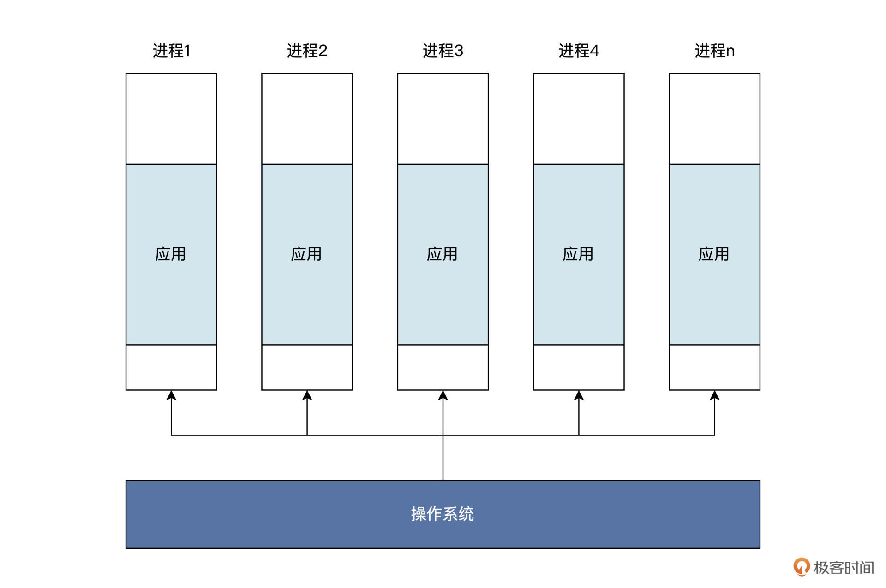
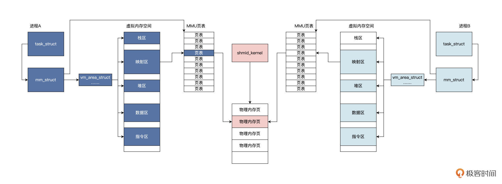

## 0 | 概述

此笔记为自己学习`GeekTime`时，粗略的概括内容，只用作基础入门，未深入学习某一个专题。

除此之外，此笔记尽量少涉及代码，只做理论补充。

每写完一章知识点，尽量配合Linux系统编程的代码写写代码，理解代码实现。

或，快速过完每一点，有个大概，再开始敲代码，再回头边看边写。


## 1｜内存地址空间：程序中地址的三种产生方式


#### CPU怎么访问内存

==CPU通过内存地址来访问内存==

**CPU 通过地址访问内存，地址的本质是整数数据，而整数数据的本质是电子信号的组合。**


#### 内存地址从哪里来

1. **链接器（主要看这个）**
2. **直接定义**
3. **动态分配内存。**


**C语言main函数调用汇编代码`sw_ins`，对 word 变量做修改，把它从 0xffffffff 修改为 0。**

```assembly
; ls.S文件
.text
.globl sw_ins
#a0内存地址
#a1储存的值
sw_ins:
    sw a1, 0(a0)       #储存a1到a0+0地址处
    jr ra              #返回
    
; main.c文件
unsigned int word = 0xffffffff;
int main()
{
    sw_ins((unsigned int)&word, 0);
    return 0;
}
```

**研究代码的编译后的链接过程**

```less
// 输出格式
OUTPUT_FORMAT(elf32-littleriscv)
// 配置内存空间，起始地址为0x10000，长度为0x50000
MEMORY
{
  RAM (xrw) : ORIGIN = 0x10000 , LENGTH = 0x50000
}
// 定义输出节
SECTIONS
{
    // 定义text节包含链接文件的所有以.text开头的节
  .text :
  {
    *(.text) *(.text.*)
  } > RAM
    // 定义data节包含链接文件的所有以.data、.sdata、.sdata2、.rodata开头的节
  .data :
  {
      *(.data .data.*) *(.sdata .sdata.*) *(.sdata2.*) *(.rodata) *(.rodata*)
  } > RAM
    // 定义bss节包含链接文件的所有以.bss、.sbss、.common开头的节
  .bss :
    {
        *(.sbss*) *(.bss*) *(COMMON*)
  } > RAM
}
```

> 链接脚本中：
>
> 1. Id.lds 文件首先配置了一个内存空间，这个空间从 0x10000 地址开始，一共有 0x50000 个字节。
>
> 2. 然后，链接器把所有参与链接文件里，以.text、.data、.sdata、.bss、.sbss、.COMMON 开头的节，按照上述链接脚本的顺序，合并成可执行程序文件，这个文件的地址从 0x10000 地址开始，到 0x60000 结束。
>
> 3. 这个合并过程中，需要对符号进行绑定和地址重定位，如下图展示过程。
>
>     

- 总结

    1. 链接器所做的工作就是根据 lds 文件中的定义，完成“合并同类项”的整理工作，

        即，把相同的节合并成一个更大的节。

        比如 ls.o 的.text 节与 main.o 的.text 节合并成 main.elf 的.text 节，而.data、.bss 节也是类似的合并过程，合并之后进行程序重定位。

    2. 程序重定位也叫分配内存地址。

        如 main.elf 程序要从内存地址 0x10000 开始，并且这个地址开始存放的是.text 节，即指令部分，.data 节放在.text 节之后。链接器根据.text 节的大小，就能算出.data 节的开始地址。

        比如在上面的例子里，就是 0x10030。.data 节中有一个变量 word 是一个字大小，所以 word 变量地址会从 0x10030 开始存放，占用 4 字节，下一个变量地址将从 0x10034 开始。

        既然 word 变量存放内存地址是 0x10030，那么链接器就需要修改指令，具体就是修改指令中表示 word 变量地址的数据，让地址数据变成 0x10030，或者通过一种计算方式得到 0x10030，这样程序中的相关指令才能最终访问到 word 变量。
    
        这也是在 main.o 中的 main 函数里，一些指令数据与 main.elf 中的 main 函数指令数据不一样的原因。
    
    3. 还有一个关键的地方，main 函数中调用了 sw_ins 函数，链接器也要进行处理，确保 jalr 指令能跳转到 sw_ins 函数的地址上，即 0x10000 地址。
    
        ​									**==链接器链接多个程序模块，且分配程序在中运行过程中的地址==**


- 另外两种

    ```c
    int main()
    {
        // 把整数0x20000强制转换为int类型的指针
        int *p = (int*)0x20000;
        *p = 0;
        // 动态分配一个int类型大小的内存空间，其首地址返回给addr指针
        void* addr = malloc(sizeof(int));
        return 0;
    }
    ```

    > 这段代码就是让 p 直接指向 0x20000 地址，然后向这个地址上写入 0。不过这个操作极其危险，除非你确切地知道自己在干什么，因为 0x20000 可能是其它重要数据，也可能不是真正的内存单元，而是设备寄存器，更可能什么也没有，即这个地址没有连接任何有效设备。
    >
    > 动态分配内存地址相对可靠，但也有问题，需要自己释放和内存碎片

    

    

    

    #### 总结

    


## 2｜虚实结合：虚拟内存和物理内存

#### 相关概念

自己看书

#### 虚实结合1：代码分析

> 简单了解malloc的内容

```c
#include "stdio.h"
#include "stdlib.h"
void func_b()
{
    //分配内存，返回其地址
    int* p = (int*)malloc(sizeof(int));
    if(p)
    {
        printf("内存地址:%p\n", p);
        //向该地址写入数据
        *p = 0xABABBABA;
        printf("内存地址:%p处的值:%x\n", p, *p);
    }
    return;    
}
int main()
{
    func_b();
    return 0;
}
```

malloc 函数在内部最终会调用 Linux 内核的 API 函数，在该进程的虚拟地址空间中分配一小块虚拟内存，返回其首地址。这个过程我用一幅图来为你展示，如下所示：


由于代码优化的原因，malloc 函数并不是每次调用，都会导致 Linux 内核建立一个 vm_area_struct 数据结构。

我们假定 malloc 函数导致 Linux 内核建立了一个 vm_area_struct 数据结构，该结构中有描述虚拟内存的开始地址、大小、属性等相关字段，表示已经分配的虚拟内存空间。

许多个这样的结构可以一起表示进程的虚拟地址空间分配情况。

但是，从 vm_area_struct 数据结构中返回的地址，仍然是虚拟的、是假的，是不能索引到内存单元的，直到访问该地址时，会发生另一个故事，如下图所示：


上图中 CPU 拿着一个虚拟地址访问内存，首先会经过 MMU，对于调用 malloc 函数的情况是该虚拟地址没有映射到物理内存，所以会通知 CPU 该地址禁止访问。（详见 《深入理解计算机组成原理》的笔记）

上图中 1 到 4 个步骤为硬件自动完成的，（这一步实际上看TLB中是否存储了这个对应的虚拟内存地址到物理地址的映射了，也就是MMU中的TLB这个硬件了）

然后 CPU 中断到 Linux 内核地址错误处理程序，软件开始工作，

也就是说 Linux 内核会对照着当前进程的虚拟地址空间，

去查找对应的 vm_area_struct 数据结构，找不到就证明虚拟地址未分配，直接结束，进程会发出段错误；

若是找到了，则证明虚拟地址已经分配，接着会分配物理内存，建立虚拟地址到物理地址的映射关系，接着程序就可以继续运行了。

> 实际情况比图中的复杂，这里只理清楚 malloc 函数的逻辑，并且明确 malloc 是返回的虚拟内存地址就可以了。!


假如我们直接使用物理内存，那再看看上面的内容和下面的代码，那就会导致一个程序的内存改变了另一个程序的内存！

所以需要虚拟内存来隔离保护。

```c
void mymemset(void* start, char val, int size)
{
    char* buf = (char*)start;
    for(int i = 0; i < size; i++)
    {
        buf[i] = val;
    }
    return;
}
```


> 每个应用，都认为自己拥有整个内存，这一点可以从所有的应用程序使用相同的链接脚本进行链接得到佐证。各个应用程序调用 malloc 函数，可能得到相同地址，是另一个佐证。


#### 虚实结合2：硬件实现

使用页表

MMU

TLB

进一步查看（详见 《深入理解计算机组成原理》的笔记，那里写的更好，不赘述了）


- 参考图片

    

    

    


## 3｜堆&栈：堆与栈的区别和应用


## 4｜延迟分配：提高内存利用率的三种机制


## 5｜应用内存管理：Linux的应用与内存管理


## 6｜进程调度：应用为什么能并行执行？

#### shell

操作系统中的一个程序。

[【技术杂谈】shell和terminal_哔哩哔哩_bilibili](https://www.bilibili.com/video/BV16A411675V/?spm_id_from=333.999.0.0)


#### 进程

> 进行中的程序，因为程序是静态的、死的，要想让他跑起来，那就得依靠计算机来调度了，跑起来的程序就叫做进程。
>
> 下面具体从三个角度来理解：应用程序角度、资源管理角度、代码实现角度

- 应用程序角度

    进程可以比作操作系统制作的一个盒子。

    这个盒子能装下一个应用程序的指令和数据，而应用程序只能在这个盒子里做一些简单的工作。盒子之外的工作就要请示操作系统介入，并代替应用去完成相应的工。

    > 这种盒子操作系统可以制作很多，不同应用各自使用自己的盒子，也可以让操作系统内部使用多个盒子装入同一个应用。其逻辑结构如下图所示：
    >
    > 注意：一个应用可能占了多个进程

    理论上能制作无限个进程，但是计算机资源有限，所以再从资源管理角度来看看。


- 资源管理角度

    > 在计算机中，CPU、内存、网络、各种输入、输出设备甚至文件数据都可以看成是资源，操作系统就是这些资源的管理者。应用程序要想使用这些“资本”，就要向操作系统申请。
    >
    > 比方说，应用程序占用了多少内存，使用了多少网络链接和通信端口，打开多少文件等，这些使用的资源通通要记录在案。记录在哪里比较合适呢？
    >
    > 当然是==**代表一个应用程序的活动实体**==——进程之中最为稳妥。

    由此，我们推导出一个运行中的应用程序应该包含了要用到的资源，即它分配到的内存，通常包括虚拟内存的一个区域。

    我们梳理一下这个区域里存放了哪些内容：

    - 可运行代码；保存该应用程序运行时中途产生的数据，比如输入、输出、调用栈、堆；

    - 分配给该应用程序的文件描述表、数据源和数据终端；

    - 安全特性，即操作系统允许该应用程序进行的操作，比如应用程序拥有者、应用程序的权限集合。

    - 处理寄存器、MMU 页表内容；

    - ……

        

    总结：==**可以看作操作系统用来管理应用程序资源的容器，通过进程就能控制和保护应用程序。**==

    一个进程记录了一个应用运行过程中需要用到的所有资源，那操作系统到底是通过什么样的机制来实现这一点呢？下面从代码实现的角度来看看。


- 代码实现角度

    > 物理世界资源 --> 
    >
    > 计算机程序的资源（进程 id、进程状态、地址空间、堆栈、CPU上下文...） -->
    >
    > 数据结构和算法  --> （具体应用）

    **Linux中的具体实现**

    ```c
    struct task_struct {
        struct thread_info thread_info;//处理器特有数据，CPU上下文 
        volatile long   state;       //进程状态 
        void            *stack;      //进程内核栈地址 
        refcount_t      usage;       //进程使用计数
        int             on_rq;       //进程是否在运行队列上
        int             prio;        //动态优先级
        int             static_prio; //静态优先级
        int             normal_prio; //取决于静态优先级和调度策略
        unsigned int    rt_priority; //实时优先级
        const struct sched_class    *sched_class;//指向其所在的调度类
        struct sched_entity         se;//普通进程的调度实体
        struct sched_rt_entity      rt;//实时进程的调度实体
        struct sched_dl_entity      dl;//采用EDF算法调度实时进程的调度实体
        struct sched_info       sched_info;//用于调度器统计进程的运行信息 
        struct list_head        tasks;//所有进程的链表
        struct mm_struct        *mm;  //指向进程内存结构
        struct mm_struct        *active_mm;
        pid_t               pid;            //进程id
        struct task_struct __rcu    *parent;//指向其父进程
        struct list_head        children; //链表中的所有元素都是它的子进程
        struct list_head        sibling;  //用于把当前进程插入到兄弟链表中
        struct task_struct      *group_leader;//指向其所在进程组的领头进程
        u64             utime;   //用于记录进程在用户态下所经过的节拍数
        u64             stime;   //用于记录进程在内核态下所经过的节拍数
        u64             gtime;   //用于记录作为虚拟机进程所经过的节拍数
        unsigned long           min_flt;//缺页统计 
        unsigned long           maj_flt;
        struct fs_struct        *fs;    //进程相关的文件系统信息
        struct files_struct     *files;//进程打开的所有文件
        struct vm_struct        *stack_vm_area;//内核栈的内存区
      };
    
    struct mm_struct {
            struct vm_area_struct *mmap; //虚拟地址区间链表VMAs
            struct rb_root mm_rb;   //组织vm_area_struct结构的红黑树的根
            unsigned long task_size;    //进程虚拟地址空间大小
            pgd_t * pgd;        //指向MMU页表
            atomic_t mm_users; //多个进程共享这个mm_struct
            atomic_t mm_count; //mm_struct结构本身计数 
            atomic_long_t pgtables_bytes;//页表占用了多个页
            int map_count;      //多少个VMA
            spinlock_t page_table_lock; //保护页表的自旋锁
            struct list_head mmlist; //挂入mm_struct结构的链表
            //进程应用程序代码开始、结束地址，应用程序数据的开始、结束地址 
            unsigned long start_code, end_code, start_data, end_data;
            //进程应用程序堆区的开始、当前地址、栈开始地址 
            unsigned long start_brk, brk, start_stack;
            //进程应用程序参数区开始、结束地址
            unsigned long arg_start, arg_end, env_start, env_end;
    };
    ```


#### 多进程

> 实际生活中肯定是多个任务一起来的，计算机也是。
>
> 比如键盘、显示器、鼠标..... 
>
> 还有，CPU core 应该每一刻只能执行一件事呢？
>
> 具体怎么安排这么多个应用（进程）、每一刻呢？调度算法

每个进程都有自己的 CPU 上下文，来保护进程的执行状态和轨迹。我们选择一个进程，对其 CPU 上下文保存和加载，这样就实现了进程的调度。

> 有多种进程调度的算法，这里不讨论，理解思路为主。


进程调度涉及到给进程设置相应的状态，我们看看通常进程有哪些状态。人有生老病死，进程也是一样。一个进程从建立到运行，还可能因为资源问题不得不暂停运行，最后进程还要退出系统。这些过程，我们称为进程的生命周期。


#### 多核多进程 -->对称多处理器系统

> 单个 CPU 性能终究有限，再怎么提升也难搞，所以多核一起来？（有点像那个服务器几种部署方式）
>
> 所以 --> SMP: 对称多处理器系统

SMP 是一种应用十分广泛的并行技术，它在一个计算机上汇集了一组处理器（多 CPU），各 CPU 之间共享内存以及总线结构。


一个芯片上封装了四个 CPU 内核，每个 CPU 内核都有具有相同功能的执行单元；

在一个执行单元上实现了两个硬件线程，这里硬件线程就是一套独立的寄存器，由执行单元调度，就像是操作系统调度进程。（超线程技术）

只是这里由硬件完成，软件开发人员不知道，操作系统开发者只感觉到这是一颗逻辑 CPU，可以用来执行程序。

但是，又带来了一个问题，怎么调度？更难了吧？


#### 多核心调度

有哪些问题？怎么解决

- **数据竞争问题**：对系统中的全局数据的读写，同一时间下有多个 CPU 能执行进程。（多进程也有）

    - 解决
        - 原子变量
        - 自旋锁
        - 信号量
        - RCU
        - ...

- **进程调度**：让 CPU 忙起来

    - 解决：（以全局进程队列为例）

        - 单核 CPU 一般使用全局进程队列，系统所有进程都挂载到这个队列上，进程调度器每次从该队列中获取进程让 CPU 执行。
        - 多核下如果使用全局队列需要同步，会导致性能下降，所以多核下一般是每个 CPU 核心一个队列

        

        > 补充：关于调度
        >
        > 1. **Multi-level Feedback Queue**: This scheduling algorithm uses multiple queues with different priorities. Processes move between these queues based on their behavior and resource requirements. It allows for both time-sharing and real-time processing.
        > 2. **Round Robin Scheduling**: In this method, each process is assigned a fixed time slice, and the scheduler rotates between processes in a circular queue. It ensures fairness in CPU allocation.
        > 3. **Priority Scheduling**: Processes are assigned priorities, and the scheduler selects the process with the highest priority for execution. Preemptive priority scheduling allows higher priority tasks to interrupt lower priority tasks.
        > 4. **Shortest Job Next (SJN) Scheduling**: Also known as Shortest Job First (SJF) scheduling, this algorithm selects the process with the shortest burst time next for execution. It minimizes the average waiting time for processes.
        > 5. **Multi-Processor Scheduling**: In systems with multiple processors, the scheduler must efficiently distribute processes among the available CPUs to maximize throughput and resource utilization.
        > 6. **Deadline-Based Scheduling**: Real-time operating systems often use this method to ensure that tasks meet their deadlines. Tasks are scheduled based on their deadlines to meet timing constraints.
        > 7. **Fair Share Scheduling**: This method ensures that each user or group gets a fair share of system resources. It is commonly used in multi-user systems to prevent any single user from monopolizing resources.


#### 总结

进程是操作系统用于刻画应用程序的运行动态，是操作系统用于管理和分配资源的单元，是操作系统的调度实体。

进程具备四大特性。

- **动态特性**。进程的本质是程序在操作系统中的一次执行过程，进程是动态建立、动态消亡的，有自己的状态和生命周期。
- **并行特性**。任何进程都可以同其他进程一起在操作系统中并行执行，尽管在单 CPU 上是伪并行。
- **独立特性**。进程是操作系统分配和管理资源的独立单元，同时进程也是一个被操作系统独立调度和执行的基本实体。
- **异步特性**。由于进程需要操作系统的资源而被制约，使进程具有执行的间断性，即进程之间按各自独立的、不可预知的速度向前推进执行。


#### 课后思考

多个不同的进程可以包含相同的程序吗，为什么？

不同的进程可以包含相同程序的片段，但能不能包含相同程序需要操作系统的支持！ 比如有的安卓手机可以同开两个微信，但ios只能一个！ 在理论上，不同的进程可以包含相同的程序，但在现实中需要软硬件的支持！（包括设备间的切换利用）


## 7｜应用间通信（一）：详解Linux进程IPC

> 我们了解进程之间是独立的、隔离的，这种安排，使得应用程序之间绝对不可以互相“侵犯”各自的领地。
>
> 但是，应用程序之间有时需要互相通信，互相协作，才能完成相关的功能。
>
> 这就不得不由操作系统介入，实现一种通信机制。在这种通信机制的监管之下，让应用程序之间实现通信。
>
> Linux 实现了诸如管道、信号、消息队列、共享内存， 即Linux IPC （套接字暂时不讲）


#### 管道

> 你的输出是别人的输入，通过一条管子相连。双向的？
>
> Linux 中管道作为最古老的通信方式，它能把一个进程产生的数据输送到另一个进程。

这里直接上代码：

```c
int main()
{
  pid_t pid;
  int rets;
  int fd[2];
  char r_buf[1024] = {0};
  char w_buf[1024] = {0};
  // 把字符串格式化写入w_buf数组中
  sprintf(w_buf, "这是父进程 id = %d\n", getpid());
  // 建立管道
  if(pipe(fd) < 0)
  {
    perror("建立管道失败\n");
  }
  // 建立子进程
  pid = fork();
  if(pid > 0)
  {
    // 写入管道
    write(fd[1], w_buf, strlen(w_buf));
    // 等待子进程退出 
    wait(&rets);
  }
  else if(pid == 0)
  {  
    // 新进程
    printf("这是子进程 id = %d\n", getpid());
    // 读取管道
        read(fd[0], r_buf, strlen(w_buf));
        printf("管道输出:%s\n", r_buf);
  }
  return 0;
}
```

> 上图，子进程通过管道获取了父进程写入的信息。
>
> 通过 pipe 和 fork 可以很轻松地在父子进程之间建立管道。Why？
>
> 把管道想象成一个只存在于内存中的、共享的特殊文件，就很好理解了。不过你要注意，该文件有两个文件描述符，一个是专用于读，一个专用于写。我再给你画一幅图帮你梳理逻辑，如下所示：

- 分析

    上图中 pipe 函数会使 Linux 在父进程中建立一个文件和两个 file 结构，分别用于读取和写入。

    调用 fork 之后，由于复制了父进程的数据结构，所以子进程也具备了这两个 file 结构，并且都指向同一个 inode 结构。

    inode 结构在 Linux 中代表一个文件，这个 inode 会分配一些内存页面来缓存数据。

    但对于管道文件来说，这些页面中的数据不会写入到磁盘。这也是为什么在应用程序中管道是用文件句柄索引，并使用文件读写函数来读写管道，因为管道本质上就是一个内存中的文件。

- 管道读写

    和读写文件一样，读写管道也有相应的规则：

    - 当管道中没有数据可读时，进程调用 read 时会阻塞，即进程暂停执行，一直等到管道有数据写入为止。（类比之前学过的 `FreeRTOS` 的队列）
    - 当管道中的数据被写满的时候，进程调用 write 时阻塞，直到有其它进程从管道中读走数据。

    如果所有管道写入端对应的文件句柄被关闭，则进程调用 read 时将返回 0；如果所有管道的读取端对应的文件句柄被关闭，则会调用 write，从而产生 SIGPIPE 信号，这可能导致调用 write 进程退出。

    > 上述规则由 Linux 内核维护，应用开发人员不用操心。如果要写入的数据量小于管道内部缓冲时，Linux 内核将保证这次写入操作的原子性。但是当要写入的数据量大于管道内部缓冲时，Linux 内核将不再保证此次写入操作的原子性，可能会分批次写入。
    >
    > 这些读写规则，都是基于管道读写端是阻塞状态下的情况，你可以调用 `fcntl` 调用，把管道的读写端设置非阻塞状态。这样调用 write 和 read 不满足条件时，将直接返回相应的错误码，而不是阻塞进程。

管道是一种非常简单的通信机制，由于数据在其中像水一样，从水管的一端流动到另一端，故而得名管道。

注意，**管道只能从一端流向另一端，不能同时对流**。（单向性）

之所以说管道简单，正是因为它是一种**基于两个进程间的共享内存文件实现**的，可以继承文件操作的 api 接口，这也符合 Linux 系统一切皆文件的设计思想。


#### 信号

> Linux 信号，也是种古老的进程间通信方式，不过，这里的信号我们不能按照字面意思来理解。Linux 信号是一种异步事件通知机制，类似于计算机底层的硬件中断。
>
> 生活例子理解：闹钟，闹钟会在既定的时间提醒你“该起床啦”。闹钟发出声音，类似于产生信号，你因为闹钟声音被叫醒，然后关掉闹钟并起床，开始一天的美好生活，这就类似于处理信号。

简单来说，信号是 Linux 操作系统为进程设计的一种软件中断机制，用来通知进程发生了**异步事件**。

事件来源可以是另一个进程，这使得进程与进程之间可以互相发送信号；也可以是 Linux 内核本身，因为某些内部事件而给进程发送信号，通知进程发生了某个事件。

从进程执行的行为来说，信号能打断进程当前正在运行的代码，转而执行另一段代码。信号来临的时间和信号会不会来临，对于进程而言是不可预知的，这说明了信号的异步特性。

简单实验：用定时器在既定的时间点产生信号，发送给当前运行的进程，使进程结束运行。

```c
void handle_timer(int signum, siginfo_t *info, void *ucontext)
{
  printf("handle_timer 信号码:%d\n", signum);
  printf("进程:%d 退出!\n", getpid());
  // 正常退出进程 
  exit(0);
  return; 
}
int main()
{
  struct sigaction sig;
  // 设置信号处理回调函数
  sig.sa_sigaction = handle_timer;
  sig.sa_flags = SA_SIGINFO;
  // 安装定时器信号
  sigaction(SIGALRM, &sig, NULL);
  // 设置4秒后产生信号SIGALRM信号
  alarm(4);
  while(1)
  {
    ;// 死循环防止进程退出
  }
  return 0;
}
```

> 1. **设置相关信号**：首先main 函数中通过 `sigaction` 结构设置相关信号，例如信号处理回调函数和一个信号标志。
> 2. **安装信号**：通过 `sigaction` 函数把信号信息传递给 Linux 内核，Linux 内核会在这个进程上，根据信号信息安装好信号。
> 3. **产生信号**：`alarm` 函数会让 Linux 内核设置一个定时器，到了特定的时间点后，内核发现时间过期了就会给进程发出一个 SIGALRM 信号，由 Linux 内核查看该进程是否安装了信号处理函数，以及是否屏蔽了该信号。确定之后，Linux 内核会保存进程当前上下文，然后构建一个执行信号处理函数的栈帧，让进程返回到信号处理函数运行。
>
> 内核产生 SIGALRM 信号，然后开始执行 handle_timer 函数（由内核异步调用）。
>
> 4. 在 handle_timer 函数中输出了信号码，然后就调用 exit 退出进程了。
>
>     - 信号种类
>
>         
>
>         
>
>         上面都是 Linux 的标准信号，它们大多数来源于键盘输入、硬件故障、系统调用、应用程序自身的非法运算。一旦信号产生了，进程就会有三种选择：忽略、捕捉、执行默认操作。其实大多数应用开发者都采用忽略信号或者执行信号默认动作，这是一种“信号来了，我不管”的姿态。
>
>         一般信号的默认动作就是忽略，有一些信号的默认动作可能是终止进程、终止进程并保存内存信息、停止进程、恢复进程，你可以自己对照上表，看看具体是哪些信号。还有一些信号，比如 SIGKILL、SIGSTOP，它是不能由应用自己捕捉处理的，也不能被忽略，只能执行操作系统的默认操作。为什么要这么规定呢？
>
>         我们想一想，如果 SIGKILL、SIGSTOP 信号能被捕捉和忽略，那么超级用户和系统自己就没有可靠的手段使进程终止或停止了。

那具体怎么给其他进程发送信号？如何在信号中传送信息 -->

```c
static pid_t subid;

void handle_sigusr1(int signum, siginfo_t *info, void *ucontext)
{
  printf("handle_sigusr1 信号码:%d\n", signum);
  //判断是否有数据
  if (ucontext != NULL)
  {
    //保存发送过来的信息
    printf("传递过来的子进程ID:%d\n", info->si_int);
    printf("发送信号的父进程ID:%d\n", info->si_pid);
    // 接收数据
    printf("对比传递过来的子进程ID:%d == Getpid:%d\n", info->si_value.sival_int, getpid());
  }
  // 退出进程
  exit(0);
  return;
}

int subprocmain()
{
  struct sigaction sig;
  // 设置信号处理函数
  sig.sa_sigaction = handle_sigusr1;
  sig.sa_flags = SA_SIGINFO;
  // 安装信号
  sigaction(SIGUSR1, &sig, NULL);
  // 防止子进程退出
  while (1)
  {
    pause(); // 进程输入睡眠，等待任一信号到来并唤醒进程
  }
  return 0;
}

void handle_timer(int signum, siginfo_t *info, void *ucontext)
{
  printf("handle_timer 信号码:%d\n", signum);
  union sigval value;
  // 发送数据，也可以发送指针
  value.sival_int = subid; // 子进程的id
  // 调用sigqueue，向子进程发出SIGUSR1信号
  sigqueue(value.sival_int, SIGUSR1, value);
  return; 
}

int main()
{
  pid_t pid;
  // 建立子进程
  pid = fork();
  if (pid > 0)
  {
    // 记录新建子进程的id
    subid = pid;
    struct sigaction sig;
    // 设置信号处理函数
    sig.sa_sigaction = handle_timer;
    sig.sa_flags = SA_SIGINFO;
    // 安装信号
    sigaction(SIGALRM, &sig, NULL);
    alarm(4);// 4秒后发出SIGALRM信号
    while (1)
    {
      pause(); // 进程输入睡眠，等待任一信号到来并唤醒进程
    }
  }
  else if (pid == 0)
  {
    // 新进程
    subprocmain();
  }
  return 0;
}
```

> 首先我们在主进程中调用 fork 建立一个子进程。接着子进程开始执行 `subprocmain` 函数，并在其中安装了 SIGUSR1 信号处理函数，让子进程进入睡眠。
>
> 4 秒钟后主进程产生了 SIGALRM 信号，并执行了其处理函数 handle_timer，在该函数中调用 `sigqueue` 函数，向子进程发出 SIGUSR1 信号，同时传递了相关信息。
>
> 最后，子进程执行 handle_sigusr1 函数处理了 SIGUSR1 信号，打印相应信息后退出。
>
> 第一个 SIGALRM 信号是 Linux 内核中的定时器产生；而第二个 SIGUSR1 信号是我们调用 `sigqueue ` 函数手动产生的。
>
> `sigqueue` 的函数原型如下所示：
>
> ```c
> typedef union sigval {
>   int sival_int;
>   void *sival_ptr;
> } sigval_t;
> 
> // pid 发送信号给哪个进程，就是哪个进程id
> // sig 发送信号的信号码
> // 附加value值（整数或指针）
> // 函数成功返回0，失败返回-1
> int sigqueue(pid_t pid, int sig, const union sigval value);
> ```


- 总结

    信号是 Linux 内核基于一些特定的事件，并且这些事件要让进程感知到，从而实现的一种内核与进程之间、进程与进程之间的异步通信机制。

    理解：

    无论是硬件事件还是系统调用触发信号，都会演变成设置进程数据结构 task_struct 中 pending 对应的位。

    这其中每个位对应一个信号，设置了 pending 中的位还不够，我们还要看一看，blocked 中对应的位是不是也被设置了：

    - 如果 blocked 中对应的位也被设置了，就不能触发信号（这是给信号提供一种阻塞策略，对于有些信号没有用，如 SIGKILL、SIGSTOP 等）；
    - 否则就会触发该位对应的 action，根据其中的标志位查看是否捕获信号，进而调用其中 sa_handler 对应的函数。

    那怎么判断信号最终是不是抵达了呢？其表现为异步调用了进程某个函数。


#### 总结

进程之间要协作，就要有进程间通信机制，Linux 实现了多种通信机制，重点研究管道和信号

管道能连接两个进程，一个进程的数据从管道的一端流向管道另一端的进程。如果管道空了则读进程休眠，管道满了则写进程休眠。这些同步手段由操作系统来完成，对用户是透明的。shell 中常使用“|”在两个进程之间建立管道，让一个进程的输出数据，成为另一个进程的输入数据。除了管道，信号也是 Linux 下经典的通信方式。

信号比较特殊，它总是异步地打断进程，使得正在运行的进程转而去处理信号。信号来源硬件、系统，和其它进程。发送信号时，也能携带一些数据。


#### 课后思考

请概述一下管道和信号这两种通信机制的不同。

> 管道：原理上是通过共享文件来实现的，优点是能够传输任意信息，缺点是只能单向传输。
>
> 信号：原理上是通过中断来实现的，优点是异步通信并且某些信号可以自定义函数，缺点是只能传递固定的信号

> 


## 8 ｜应用间通信（二）：详解Linux进程IPC

> 在大型商业系统中，通常会把功能拆分成几大模块，模块以应用形式存在，就需要消息队列和内存共享来使模块之间进行通信和协作，这就是利用通信机制将应用解耦。


#### 消息队列

> 消息队列是 Linux 提供的一种进程间通信方法，它能让进程之间互相发送消息。
>
> 这些消息的形式由进程自己决定，可以是文本，也可以是二进制的，格式可以随意，只要另一个进程认识就行。

- **概念：**

    你可以把消息想象成一个数据记录，并且这个记录具有特定的格式以及特定的顺序。

    消息队列实质就是一个“收纳”消息的链表，消息会依次挂入这个叫做队列的链表中，一个链表节点就对应着一个消息。

    > 接下来的问题就是，谁有权操作这个消息队列？
    >
    > 答案是：对消息队列有**写权限**的进程可以向其中插入新的消息、对消息队列有读权限的进程，则可以从其中读出消息。

    

    Linux 采用消息队列来实现消息传递，新的消息总是放在队列的末尾，但接收的时候通常是从队列头开始，也可以从中间抽取。（类FIFO）（想象成传送带）

    另外，消息队列发送消息的方式可以是同步的，也可以是异步的：

    - 在同步方式的情况下，发送方在消息队列为满时，要进入等待状态。接收方在消息队列为空时，也要进入等待状态。
    - 而异步方式中，发送方和接收方都不必等待，而是直接返回。


- **消息队列使用步骤：**

    1. 建立消息队列
    2. 发送消息
    3. 接收消息。

    对应三个接口函数

    ```c
    //获取已经存在的消息队列，或者建立一个新的消息队列
    // __key是一个整数，可以自己定义
    // __msgflg是建立消息队列的标志和权限
    //返回-1 表示失败，其他正整数为消息队列标识，像文件句柄一样
    int msgget (key_t __key, int __msgflg);
    
    //向__msqid表示的消息队列，发送一个新的消息
    // __msqid表示消息队列
    // __msgp表示消息结构
    // __msgsz表示消息大小
    // __msgflg同步、异步等标志
    //返回-1 表示失败，其他表示发送成功
    int msgsnd (int __msqid, const void *__msgp, size_t __msgsz, int __msgflg);
    
    //在__msqid表示的消息队列，接收消息
    // __msqid表示消息队列
    // __msgp表示消息结构，用于接收消息内容
    // __msgsz表示接收消息大小
    // __msgtyp表示接收消息类型
    // __msgflg同步、异步等标志
    //返回-1 表示失败，其他表示成功接收消息的大小
    ssize_t msgrcv (int __msqid, void *__msgp, size_t __msgsz, long int __msgtyp, int __msgflg);
    
    ```

    Linux 内核运行过程中缓存了所有的消息队列，这也是为什么 `msgget` 函数能打开一个已经存在的消息队列。

    只有在 Linux 内核重启或者显示删除一个消息队列时，这个消息队列才会真正被删除。

    记录消息队列的数据结构（`struct ipc_ids`）位于 Linux 内核中，Linux 系统中的所有消息队列都能在该结构中访问。在最新版本（2.6 以上的版本）的 Linux 中，`pc_ids` 包含在 `ipc_namespace` 结构体中，而且 Linux 又定义了一个 `ipc_namespace `结构的全局变量 `init_ipc_ns`，用来保存 `ipc_namespace` 结构的实例。这里我就不再往下展开了，你有兴趣可以自行研究。


- 实战练习

    > 用 Linux 消息队列机制，建立一个“自说自话”的聊天软件。
    >
    > 1. 首先在主进程中建立一个消息队列；
    > 2. 然后建立一个子进程，在子进程中等待主进程发过来的消息，并显示出来；
    > 3. 最后，主进程等待用户输入消息，并将消息发送给消息队列。

    1. 首先建立消息队列。具体就是调用 `msgget` 函数，还要提供一个消息队列的键，这个键用于表示该消息队列的唯一名字。当这个键对应的消息队列存在的时候，`msgget` 函数将返回该消息队列的标识；如果这个队列不存在，就创建一个消息队列，然后返回这个消息队列的标识。

        ```C
        //消息类型
        #define MSG_TYPE (041375)
        //消息队列键
        #define MSG_KEY (752364)
        //消息大小
        #define MSG_SIZE (256)
        int main()
        {
          pid_t pid;
          msgid = msgget(MSG_KEY, IPC_CREAT | 0666);
          if (msgid < 0)
          {
            perror("建立消息队列出错\n");
          }
          // 建立子进程
          pid = fork();
          if (pid > 0)
          {
              // 记录新建子进程的ID
              subid = pid;
              send_main(msgid);
          }
          else if (pid == 0)
          {
              // 新的子进程
              receive_main(msgid);
          }
          return 0;
        }
        ```
        
        > 结合代码我们可以看到，`msgget` 函数的 `__mflg` 参数是 `IPC_CREAT | 0666`，其中的 IPC_CREAT 表示没有 MSG_KEY 对应的消息队列就新建一个，0666 则表示该消息队列对应的权限，即所有用户可读写。
        
        
    
    2. 成功建立消息队列后，开始调用 fork 函数建立子进程。
    
        子进程的任务：
    
        ```c
        //消息体
        typedef struct Msg
        {
          long type;
          char body[MSG_SIZE];
        } msg_t;
        //子进程运行的函数 用于接收消息
        int receive_main(int mid)
        {
          msg_t msg;
          while (1)
          {
            ssize_t sz = msgrcv(mid, &msg, MSG_SIZE, MSG_TYPE, MSG_NOERROR);
            if (sz < 0)
            {
              perror("获取消息失败");
            }
            printf("新消息:%s\n", msg.body);
              
            //判断是exit就退出
            if (strncmp("exit", msg.body, 4) == 0)
            {
              printf("结束聊天\n");
              exit(0);
            }
          }
          return 0;
        }
        ```
    
        > 子进程中，在一个循环里调用了 `msgrcv` 函数，接收 mid 标识的消息队列中的消息，存放在 msg 结构体中，消息的大小和类型都与发送消息一样，MSG_NOERROR 表示消息太大也不会出错。随后打印出消息内容，如果是 exit 的消息内容，则结束子进程。
    
    
    
    3. 有了接收消息的代码，还得有发送代码的程序：
    
        ```c
        int send_main(int mid)
        {
          msg_t msg;
          while (1)
          {
                // 设置消息类型
            msg.type = MSG_TYPE;
                // 获取用户输入并放在消息体中
            scanf("%[^\n]%*c", msg.body);
                // 发送消息
            msgsnd(mid, &msg, MSG_SIZE, 0);
            //判断是exit就退出
            if (strncmp("exit", msg.body, 4) == 0)
            {
              return 0;
            }
          }
          return 0;
        }
        ```
    
        > 对照代码可以看到，发送代码的就是 send_main 函数，这个函数由主进程调用，它会在一个循环中设置消息类型后，获取用户输入的消息内容并放入 msg 消息结构体中。然后，调用 `msgsnd`函数向 mid 标识的消息队列发送消息，消息来自于 msg 结构体变量，指定 MSG_SIZE 为消息大小，并且以同步方式发送消息。


#### 共享内存

- 概念

    > 进程间通信实则是进程间传输数据，为了实现更高效率的通信，Linux 实现了共享内存这一机制。
    >
    > **共享内存是把同一块物理内存映射到不同进程的虚拟地址空间当中，不同进程直接通过修改各自虚拟地址空间当中的内容，即可通信。**
    >
    > 共享内存几乎不需要进行内存数据拷贝就能实现，即数据从进程 A 的虚拟内存空间中写入数据，立即就能被进程 B 感知。
    >
    > 其它的进程间通信机制，需要经过 Linux 内核这种中转站进行多次的数据拷贝操作才可以。
    >
    > 因此，使用共享内存通信比较高效。

    Linux 内核提供了两种共享内存的实现，一种是基于物理内存映射，另一种是基于 `mmap` 文件映射。

    这里，我们仅仅讨论基于物理内存映射的实现，它与消息队列很像。

    Linux 内核会建立一个 `shmid_kernel` 结构，通过 `ipc_namespace` 结构的全局变量 `init_ipc_ns` 结构，就能找到系统中所有的 `shmid_kernel` 结构。该 `shmid_kernel` 结构会关联到一组物理内存页面，最后这组物理内存页面，会映射到各自进程虚拟内存空间中的相关区域。

    


- **使用：**

    具体步骤：建立共享内存区 ---> 绑定进程内存区  （接口函数）

    ```c
    //获取已经存在的共享内存，或者建立一个新的共享内存
    // __key是一个整数可以自己定义
    // __size是建立共享内存的大小
    // __shmflg是建立共享内存的标志和权限
    //返回-1 表示失败，其他正整数为共享内存标识，像文件句柄一样
    int shmget (key_t __key, size_t __size, int __shmflg);
    // 绑定进程内存地址到__shmid的共享内存
    // __shmid表示建立的共享内存
    // __shmaddr绑定的地址，传NULL则系统自动分配
    // __shmflg是绑定地址区间的读写权限
    // 返回-1,表示失败，其它是成功绑定的地址
    void *shmat (int __shmid, const void *__shmaddr, int __shmflg);
    // 解除绑定内存地址
    // __shmaddr为之前绑定的地址
    // 返回-1,表示失败
    int shmdt (const void *__shmaddr);
    ```

    进一步：

    

    1. 主进程中建立共享内存、创建父子进程：

        ```c
        #define SHM_KEY (752364)
        #define SHM_BODY_SIZE (4096-8)
        #define SHM_STATUS (SHM_BODY_SIZE)
        typedef struct SHM
        {
          long status;
          char body[SHM_BODY_SIZE];
        } shm_t;
        int main()
        {
          pid_t pid;
            // 建立共享内存
          shmid = shmget(SHM_KEY, sizeof(shm_t), IPC_CREAT | 0666);
          if (shmid < 0)
          {
            perror("建立共享内存出错\n");
          }
          // 建立子进程
          pid = fork();
          if (pid > 0)
          {
            // 主进程
            send_main(shmid);
          }
          else if (pid == 0)
          {
            // 新的子进程
            receive_main(shmid);
          }
          return 0;
        }
        ```

        > 上述代码中调用了 `shmget` 函数传入了 IPC_CREAT，表示没有 SHM_KEY 对应的共享内存，就建立一块共享内存，大小为 `shm` 结构体的大小。

    

    2. 父进程开始执行 send_main 函数，子进程运行 receive_main 函数
    
        ```c
        int receive_main(int mid)
        {
          // 绑定共享内存
          int ok = 0;
          shm_t* addr = shmat(mid, NULL, 0);
          if ((long)addr < 0)
          {
            perror("绑定共享内存失败\n");
          }
          printf("子进程访问共享内存的地址:%p\n", addr);
          while (1)
          {
            if(addr->status == SHM_STATUS)
            {
              for (int i = 0; i < SHM_BODY_SIZE; i++)
              {
                if (addr->body[i] != (char)0xff)
                {
                  printf("检查共享数据失败:%x\n", addr->body[i]);
                }
                else
                {
                  ok++;
                }
              }
              printf("检查共享数据成功:%d\n", ok);
              return 0;
            }
            sleep(2);
          }
          return 0;
        }
        
        int send_main(int mid)
        {
          // 绑定共享内存
          shm_t* addr = shmat(mid, NULL, 0);
          if ((long)addr < 0)
          {
            perror("绑定共享内存失败\n");
          }
          printf("主进程访问共享内存的地址:%p\n", addr);
          memset(addr, 0xff, sizeof(shm_t));
          // 相当于同步通知子进程数据已经写入
          addr->status = SHM_STATUS;
          // 等待子进程退出
          wait(NULL);
          return 0;
        }
        ```
    
        > 对照代码可以看到，两个函数都是调用 `shmat` 函数，它们为各自进程绑定了一个虚拟内存地址，并基于该地址访问共享内存。在 `send_main` 函数中，先把共享的内存写入 0xff。最后，设置 `status` 字段用来同步，因为 Linux 对共享不提供任何同步机制，所以需要我们自己处理。`receive_main` 函数中会循环检查 `status` 字段，如果是 ` SHM_STATUS `，就对 `addr->body `中的数据进行一个个检查，并且记录检查结果。


- 总结：

    共享内存：通过把物理内存页面映射到多个进程的虚拟内存中，使其访问相同的物理内存，数据不需要在各进程之间复制，这是一种性能非常高的进程间通信机制。


#### 课后思考

进程间通信哪些是同步的，哪些是异步的？

1. **管道（Pipe）**：
    - **同步**：管道是一种同步通信方式，发送方发送数据后会一直等待接收方读取数据。
2. **消息队列（Message Queue）**：
    - **同步或异步**：消息队列可以是同步或异步的，取决于发送消息时的操作。在同步模式下，发送方发送消息后会等待接收方确认；在异步模式下，发送方发送消息后不会等待接收方确认。
3. **共享内存（Shared Memory）**：
    - **同步**：共享内存是一种同步通信方式，因为读写共享内存需要使用同步机制（如信号量）来确保数据的一致性。
4. **信号量（Semaphore）**：
    - **同步**：信号量用于控制对共享资源的访问，需要使用同步机制来确保多个进程之间的互斥和同步。
5. **套接字（Socket）**：
    - **同步或异步**：套接字通信可以是同步或异步的，取决于套接字的设置和操作。在阻塞模式下，套接字通信是同步的；在非阻塞模式下，套接字通信是异步的。


