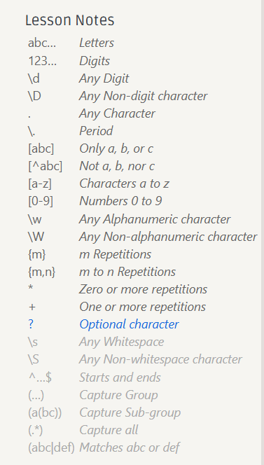

## regular expression

[RegexOne - Learn Regular Expressions - Lesson 1: An Introduction, and the ABCs](https://regexone.com/)

直接上手用。



`[abc]` 匹配 `abc` 三个字符中的一个，要匹配多的，`[abc]+`


## sed

> 以为 `ssh` 的 `log` 文件 为例子，具体看视频

### sed introduction 

`sed` 是一个基于文本编辑器 `ed` 构建的 “流编辑器” 。在 `sed` 中，您基本上是利用一些简短的命令来修改文件，而不是直接操作文件的内容（尽管您也可以选择这样做）。相关的命令行非常多，但是最常用的是 `s`，即 *替换* 命令，例如我们可以这样写：

```bash
ssh myserver journalctl
 | grep sshd
 | grep "Disconnected from"
 | sed 's/.*Disconnected from //'
```

上面这段命令中，我们使用了一段简单的 *正则表达式*。正则表达式是一种非常强大的工具，可以让我们基于某种模式来对字符串进行匹配。`s` 命令的语法如下：`s/REGEX/SUBSTITUTION/flag`, 其中 `REGEX` 部分是我们需要使用的正则表达式，而 `SUBSTITUTION` 是用于替换匹配结果的文本。

- `.*`：表示任意数量的任意字符，`.` 表示任意字符，`*` 表示前面的字符可以出现任意次数（包括零次）。
- `/.*Disconnected from /`：表示正则表达式，匹配从行开始到 "Disconnected from "（包括空格）的所有字符。点号 `.` 表示任意字符，星号 `*` 表示前面的字符可以出现任意次数（包括零次），所以 `.*` 会匹配尽可能多的字符。
- 第二个 `/` 后面没有内容，表示用空字符串替换匹配到的文本。
- 最后一个 `/` 后面没有标志，所以没有特殊的替换行为。

又：`echo 'aba' | sed 's/[ab]//'` or `echo 'abc' | sed 's/[ab]//g'`


### sed and regex

正则表达式非常常见也非常有用，值得您花些时间去理解它。让我们从这一句正则表达式开始学习： `/.*Disconnected from /`。正则表达式通常以（尽管并不总是） `/` 开始和结束。大多数的 ASCII 字符都表示它们本来的含义，但是有一些字符确实具有表示匹配行为的“特殊”含义。不同字符所表示的含义，根据正则表达式的实现方式不同，也会有所变化，这一点确实令人沮丧。常见的模式有：

- `.` 除换行符之外的 “任意单个字符”
- `*` 匹配前面字符零次或多次 （配合使用 `.*` 任意数量的任意字符）
- `+` 匹配前面字符一次或多次
- `[abc]` 匹配 `a`, `b` 和 `c` 中的任意一个
- `(RX1|RX2)` 任何能够匹配 `RX1` 或 `RX2` 的结果
- `^` 行首
- `$` 行尾 （配合使用 's/^ ..... $//' 匹配整一行）

**`sed` 的正则表达式有些时候是比较奇怪的，它需要你在这些模式前添加 `\` 才能使其具有特殊含义。或者，您也可以添加 `-E` 选项来支持这些匹配。**

一个有问题的例子：

```bash
echo 'an 17 03:13:00 thesquareplanet.com sshd[2631]: Disconnected from invalid user Disconnected from 46.97.239.16 port 55920 [preauth]' | sed 's/.*Disconnected from //'

output:
46.97.239.16 port 55920 [preauth]
```

`*` 和 `+` 在默认情况下是贪婪模式，也就是说，它们会尽可能多的匹配文本。

这可不是我们想要的结果。对于某些正则表达式的实现来说，您可以给 `*` 或 `+` 增加一个 `?` 后缀使其变成非贪婪模式，但是很可惜 `sed` 并不支持该后缀。不过，我们可以切换到 perl 的命令行模式，该模式支持编写这样的正则表达式：

```perl
perl -pe 's/.*?Disconnected from //'
```

回到 `sed`，完整的操作

```bash
sed -E 's/.*Disconnected from (invalid |authenticating )?user .* [^ ]+ port [0-9]+( \[preauth\])?$//'
```

具体配合视频和 [regex101: build, test, and debug regex](https://regex101.com/) 解析。

> 好好利用 regex 和 GPT

，需要用到 `(.*)` capture group 捕获组。

```BASH
sed -E 's/.*Disconnected from (invalid |authenticating )?user (.*) [^ ]+ port [0-9]+( \[preauth\])?$//' | less
```

但是上面的处理还有问题，日志的内容全部被替换成了空字符串，整个日志的内容因此都被删除了。但是我们实际希望 user 后面的 name 保留下来，对此，我们可以使用“捕获组（capture groups）”来完成。**被圆括号内的正则表达式匹配到的文本，都会被存入一系列以编号区分的捕获组中。**捕获组的内容可以在替换字符串时使用（有些正则表达式的引擎甚至支持替换表达式本身），例如 `\1`、 `\2`、`\3` 等等，我们匹配第二个捕获组 `(.*)` 因此可以使用如下命令

```bash
sed -E 's/.*Disconnected from (invalid |authenticating )?user (.*) [^ ]+ port [0-9]+( \[preauth\])?$/\2/' | less
```

但是依然有问题，要是用户再搞怪，它的用户名为整条 log 文件怎么办？非贪婪模式。具体看视频。

```bash
sed -E 's/.*?Disconnected from (invalid |authenticating )?user (.*) [^ ]+ port [0-9]+( \[preauth\])?$//' | less
```

> 在正则表达式中，贪婪模式和非贪婪模式是指匹配时的两种不同行为：
>
> 1. **贪婪模式**：正则表达式在匹配时会尽可能多地匹配字符。也就是说，它会尝试找到最长的匹配字符串。
> 2. **非贪婪模式**：与贪婪模式相反，非贪婪模式会尽可能少地匹配字符。也就是说，它会尝试找到最短的匹配字符串。

`sed` 还可以做很多各种各样有趣的事情，例如文本注入：(使用 `i` 命令)，打印特定的行 (使用 `p` 命令)，基于索引选择特定行等等。详情请见 `man sed`!

> 


### more

但是 `sed` 并不是完美的工具，它在**搜索和替换方面**确实很有用，但我们不能只用 `sed`。

现在，我们已经得到了一个包含用户名的列表，列表中的用户都曾经尝试过登录我们的系统。但这还不够，让我们过滤出那些最常出现的用户：

```bash
ssh myserver journalctl
 | grep sshd
 | grep "Disconnected from"
 | sed -E 's/.*Disconnected from (invalid |authenticating )?user (.*) [^ ]+ port [0-9]+( \[preauth\])?$/\2/'
 | sort | uniq -c
```

`sort` 会对其输入数据进行排序。`uniq -c` 会把**连续出现的行**折叠为一行并使用出现次数作为前缀。我们希望按照出现次数排序，过滤出最常出现的用户名：

```bash
ssh myserver journalctl
 | grep sshd
 | grep "Disconnected from"
 | sed -E 's/.*Disconnected from (invalid |authenticating )?user (.*) [^ ]+ port [0-9]+( \[preauth\])?$/\2/'
 | sort | uniq -c
 | sort -nk1,1 | tail -n10
```

> 补充
>
> `uniq` 命令在 Unix 和类 Unix 系统中用于报告或省略重复的行。`-c` 参数是 `uniq` 命令的一个选项，用于显示每行的出现次数。
>
> 具体来说，`uniq -c` 会为输入中的每行（在相邻的重复行中）显示该行及其出现的次数。这通常用于统计某个模式或文本行在文件中出现的次数。
>
> 使用方法如下：
>
> ```bash
> uniq -c [input_file]
> ```
>
> 其中 `input_file` 是你想要检查重复行的文件。
>
> 例如，如果你有一个文件 `example.txt`，内容如下：
>
> ```
> apple
> banana
> apple
> orange
> banana
> apple
> ```
>
> 运行 `uniq -c example.txt` 将会得到：
>
> ```
>       3 apple
>       2 banana
>       1 orange
> ```
>
> 这里的数字表示每行文本在文件中出现的次数。**注意，`uniq` 只能识别连续的重复行**，所以如果文件内容如下：
>
> ```
> apple
> banana
> apple
> orange
> banana
> ```
>
> `uniq` 将不会将第一行的 `apple` 与第三行的 `apple` 视为重复，因此 `-c` 选项不会计数非连续的重复行。
>
> 如果你想要忽略连续性的限制，可以使用 `-f` 参数指定忽略前几个字段（或在这种情况下，忽略前一行）：
>
> ```bash
> uniq -c -f 1 example.txt
> ```
>
> 这将统计文件中所有重复行的出现次数，无论它们是否相邻。
>
> 但是这样做还是比较麻烦，比较推荐到做法是先对文件进行排序后，再使用 `uniq -c`：
>
> ```bash
> sort example.txt | uniq -c | less
> ```

另外，`sort -n` 会按照数字顺序对输入进行排序（默认情况下是按照字典序排序 `-k1,1` 则表示“仅基于以空格分割的第一列进行排序”。`,n` 部分表示“仅排序到第 n 个部分”，默认情况是到行尾。就本例来说，针对整个行进行排序也没有任何问题，我们这里主要是为了学习这一用法！

如果我们希望得到登录次数最少的用户，我们可以使用 `head` 来代替 `tail`。或者使用 `sort -r` 来进行倒序排序。

相当不错。但我们只想获取用户名，而且不要一行一个地显示。

```BASH
ssh myserver journalctl
 | grep sshd
 | grep "Disconnected from"
 | sed -E 's/.*Disconnected from (invalid |authenticating )?user (.*) [^ ]+ port [0-9]+( \[preauth\])?$/\2/'
 | sort | uniq -c
 | sort -nk1,1 | tail -n10
 | awk '{print $2}' | paste -sd,
```

我们可以利用 `paste` 命令来合并行(`-s`)，并指定一个分隔符进行分割 (`-d`)，（-s -d, 拼起来）

那 `awk` 的作用又是什么呢？

## awk

**`sed` 是一种基于行的 stream editor ，正则表达式也是逐行匹配的，自然也有基于列的 stream editor：`awk`**

`awk` 其实是一种编程语言，只不过它碰巧非常善于处理文本。关于 `awk` 可以介绍的内容太多了，限于篇幅，这里我们仅介绍一些基础知识。

首先， `{print $2}` 的作用是什么？ `awk` 程序接受一个模式串（可选），以及一个代码块，指定当模式匹配时应该做何种操作。默认当模式串即匹配所有行（上面命令中当用法）。

在代码块中，`$0` 表示整行的内容，`$1` 到 `$n` 为一行中的 n 个区域，区域的分割基于 `awk` 的域分隔符（**默认是空格，可以通过 `-F` 来修**改）。在上面的例子中，我们的代码意思是：对于每一行文本，打印其第二个部分，也就是用户名。

```bash
 111 abc
 100 edd
 98 djao
 82 dapk
 ....
 // match abc, edd...
```

让我们康康，还有什么炫酷的操作可以做。让我们统计一下所有以 `c` 开头，以 `e` 结尾，并且仅尝试过一次登录的用户。

```bash
 | awk '$1 == 1 && $2 ~ /^c[^ ]*e$/ { print $2 }' | wc -l
```

让我们好好分析一下。首先，注意这次我们为 `awk` 指定了一个匹配模式串（也就是 `{...}` 前面的那部分内容）。该匹配要求文本的第一部分需要等于 1（这部分刚好是 `uniq -c` 得到的计数值），然后其第二部分必须满足给定的一个正则表达式。代码块中的内容则表示打印用户名。然后我们使用 `wc -l` 统计输出结果的行数。

不过，既然 `awk` 是一种编程语言，那么则可以这样：

```
BEGIN { rows = 0 }
$1 == 1 && $2 ~ /^c[^ ]*e$/ { rows += $1 }
END { print rows }
```

`BEGIN` 也是一种模式，它会匹配输入的开头（ `END` 则匹配结尾）。然后，对每一行第一个部分进行累加，最后将结果输出。事实上，我们完全可以抛弃 `grep` 和 `sed` ，因为 `awk` 就可以 [解决所有问题](https://backreference.org/2010/02/10/idiomatic-awk)。至于怎么做，就留给读者们做课后练习吧。


## 分析数据


