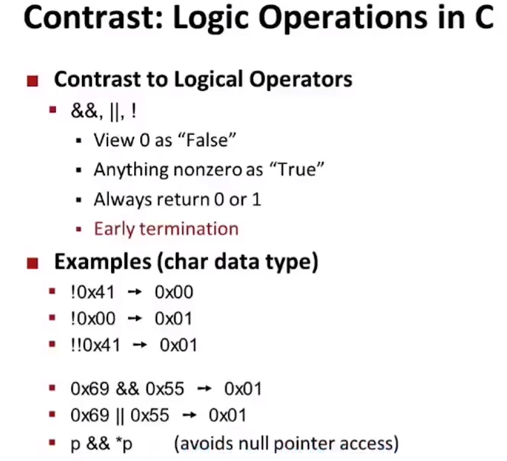

&：bit 操作

&&：逻辑操作，直接操作整个数

还有这个：`p && *p` 也很常用


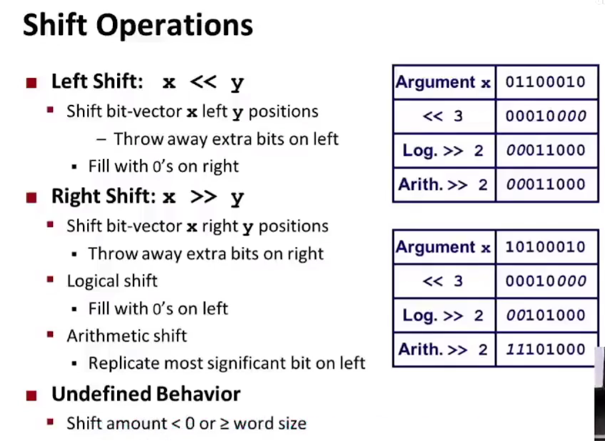


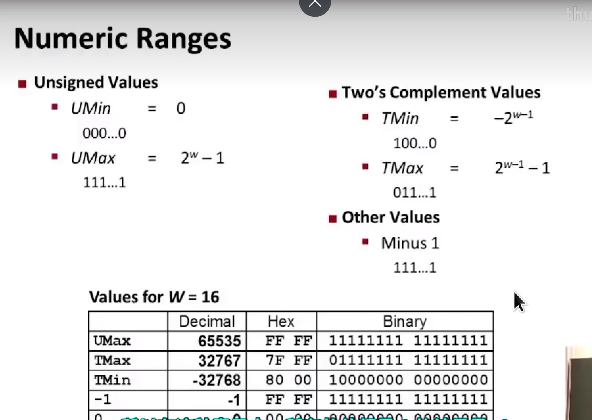

有点新的理解，最高位为符号位，不能简单理解为一个负号，有一个负权重的概念

权重为 -2^w-1^。

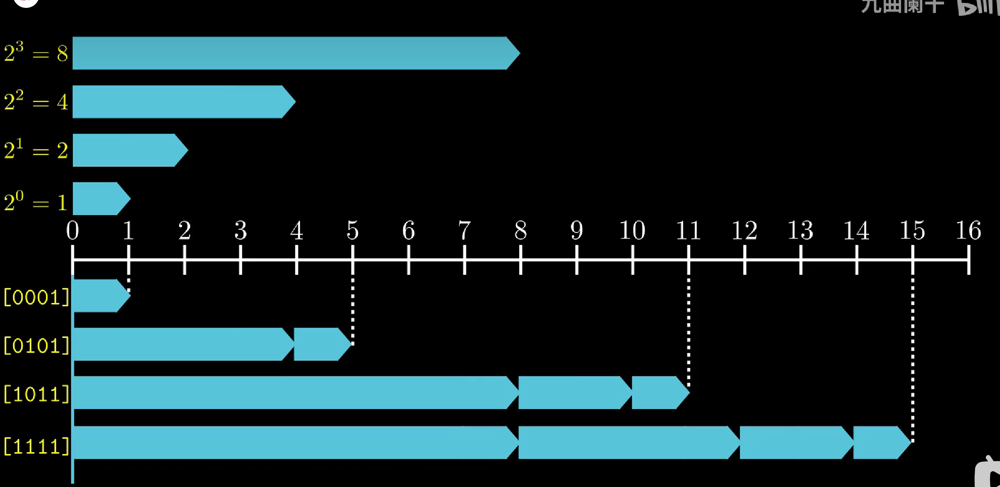


可视化：


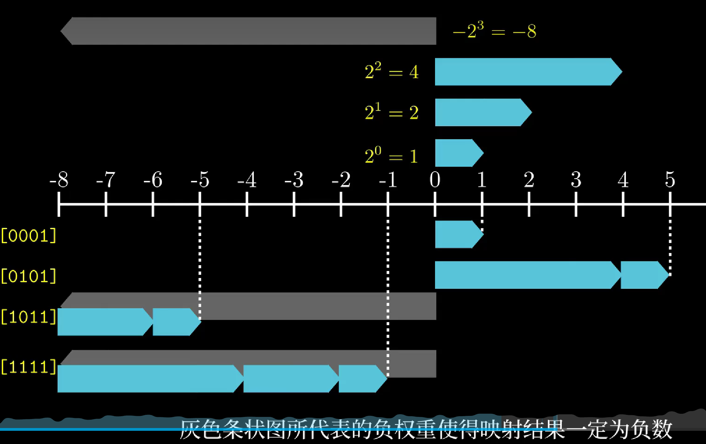


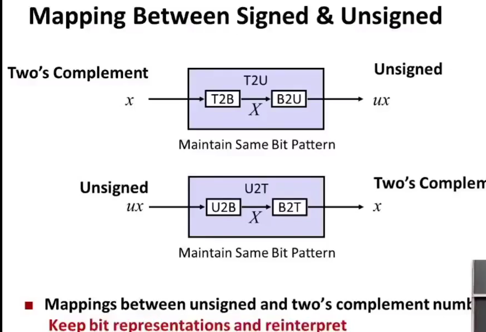

物理上这些bit模式都是不变的，只是重新用不同的方式解析它，使它有不同的意义

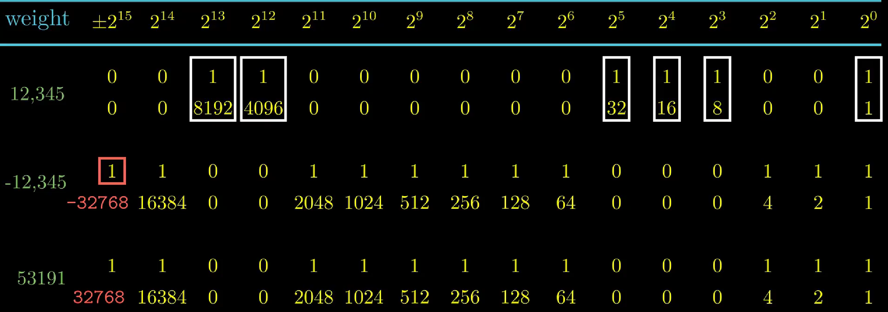


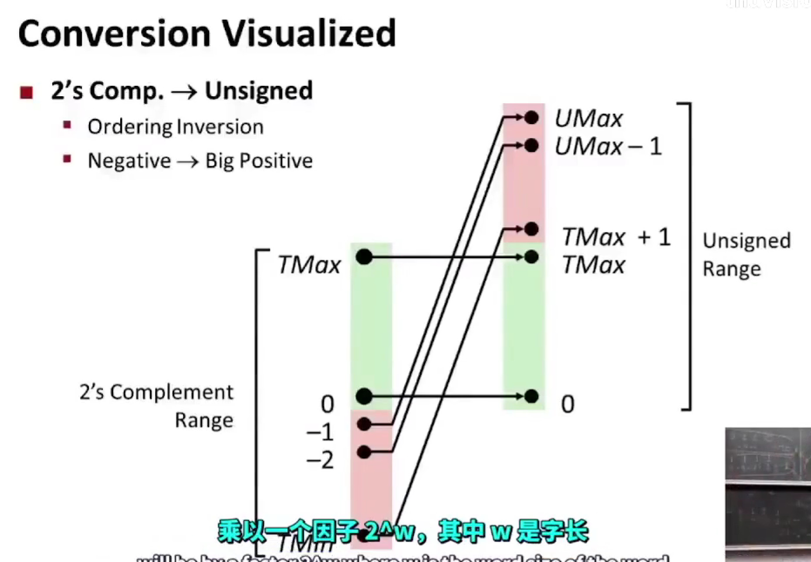


关于隐式转换

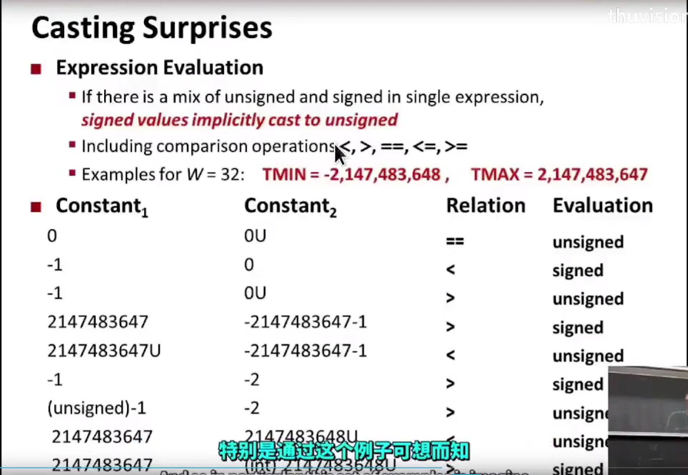

> 可以回答一下 NEMU PA1 里面的思考题

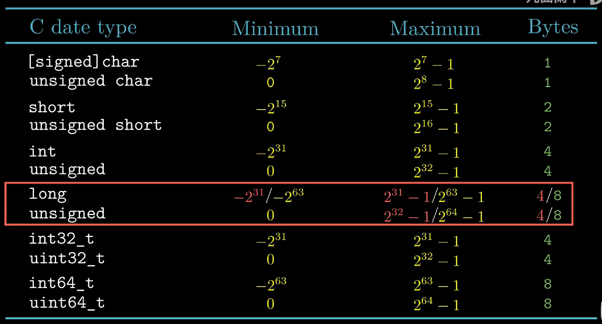

> 另外：
>
> 在进行指针转换某个数为地址的时候应该使用unsigned long 
>
> ```c
> 1.
> int *pt = NULL;
> pt = (unsigned long *)0x400208000;
> *pt = 0x3456;
> 
> 2.
> *((unsigned long *)0x400208000) = 0x3456;
> 
> 3.
> #define ADDR (*(volatile unsigned long *)0x400208000)
> ADDR = 0x3456
> ```

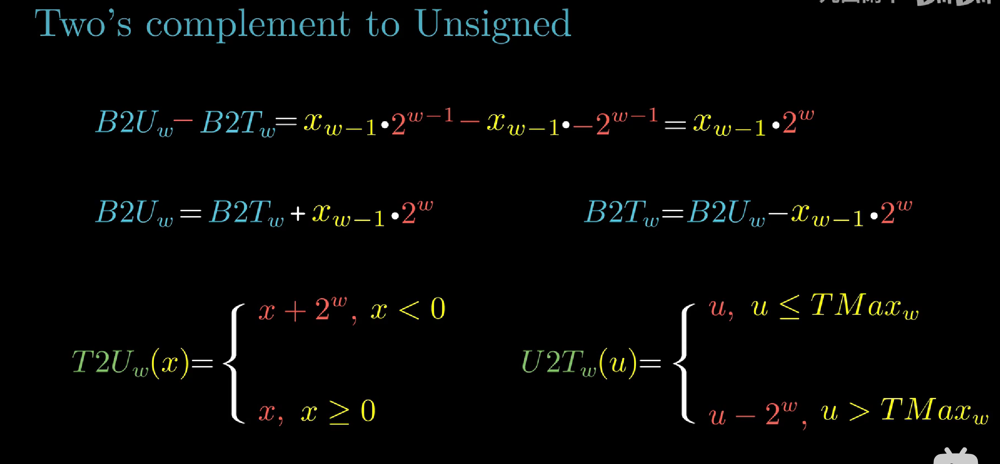


