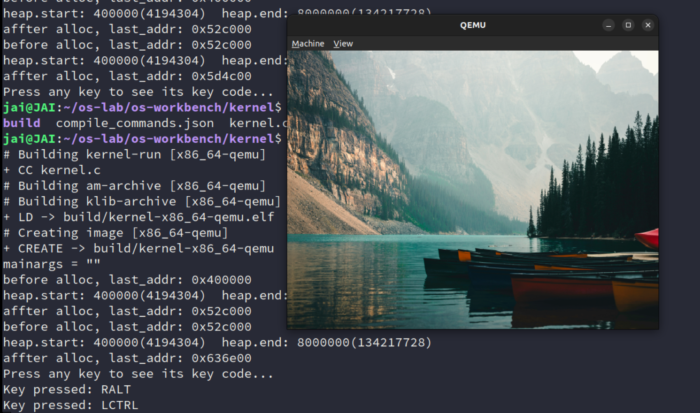
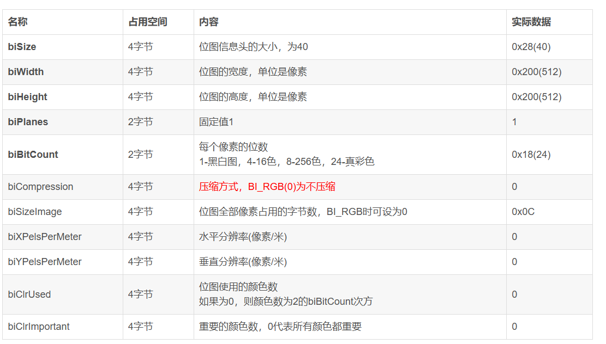
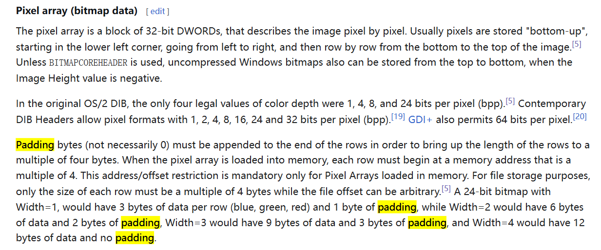
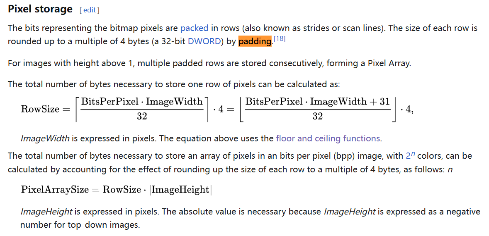

> **实验要求：显示一张图片**
>
> 你需要编写一个直接运行在 AbstractMachine 上 (仅仅启用 IOE 扩展，不使用其他硬件机制如中断/异常/虚拟存储/多处理器) 的程序，显示一张图片；满足：
>
> 1. 显示一张任何图片，但能适配不同的屏幕大小。确保你的图片在 320×200、320×200、640×480、640×480、800×600、800×600 等分辨率下均可以正常显示；
> 2. 图片中包含不少于 10 种颜色。
> 3. 程序使用的内存 (代码、静态数据总和不超过 4 MiB、堆区 `heap` 使用不超过 4 MiB)；
> 4. 按 ESC 键后调用 `halt()` 退出；除此之外，按任何键程序都不应退出。


## -freestanding

[C Library - OSDev Wiki](https://wiki.osdev.org/C_Library)

> The `__STDC_HOSTED__` macro expands to `1` on hosted implementations, or 0 on freestanding ones. The freestanding headers are: `float.h`, `iso646.h`, `limits.h`, `stdalign.h`, `stdarg.h`, `stdbool.h`, `stddef.h`, `stdint.h`, and `stdnoreturn.h`. You should be familiar with these headers as they contain useful declarations you shouldn't do yourself. GCC also comes with additional freestanding headers for CPUID, SSE and such.
>
> 这些头文件中包含了 freestanding 程序也可使用的声明。有兴趣的同学可以发现，可变参数经过预编译后生成了类似 `__builtin_va_arg` 的 builtin 调用，由编译器翻译成了特定的汇编代码。

"ffreestanding" 是一个编译器选项，通常与 C 或 C++ 语言的编译器（如 GCC）一起使用。这个选项用于指定编译目标是一个独立环境（freestanding environment），在这种环境中，标准库可能不存在，程序的入口函数不一定是 `main`。这与“托管环境”（hosted environment）相对，后者假定存在一个完整的标准库，并且程序通常从 `main` 函数开始执行。

**在独立环境中，编译器不会假设标准库的存在，这意味着某些依赖于标准库的功能可能无法使用。这种环境通常用于嵌入式系统、操作系统内核或其他需要最小化资源使用的场景。例如，操作系统内核开发时，内核代码通常在没有操作系统支持的情况下运行，因此需要使用 `-ffreestanding` 选项来编译。**

使用 `-ffreestanding` 选项时，编译器会定义宏 `__STDC_HOSTED__` 为 `0`，而在托管环境中则定义为 `1`。这允许开发者在代码中根据宏的值来决定是否使用某些依赖于标准库的特性。

此外，独立实现的编译环境对多线程执行和数据竞争的行为、`main` 函数的要求以及可用的标准库头文件都有特定的规定。例如，在独立实现中，程序是否需要定义 `main` 函数、程序启动和终止的过程、以及多线程的支持都是由具体的实现定义的。


## 分解问题

> 1. 实现 klib
>
>     PA 实现。
>
> 2. 访问 I/O 设备
>
>     有什么 I/O 设备？怎么访问？
>
> 3. 绘制图片
>
>     有过玩 OLED 绘制 图片的应该都了解。再看看讲义也都明白。
>
>     > 要将JPEG图片转换为C语言数组，你可以使用一些专门的工具来帮助你完成这个任务。根据搜索结果，这里有几个方法你可以尝试：
>     >
>     > 1. **使用`xxd`工具**：
>     >    `xxd`是一个简单的命令行工具，它可以将二进制文件转换为十六进制的文本表示。对于JPEG图片，你可以使用以下命令：
>     >    ```bash
>     >    xxd -i image.jpg image_data.h
>     >    ```
>     >    这将生成一个C语言头文件，其中包含了图片数据的十六进制表示，可以作为一个数组嵌入到你的C程序中。
>     >
>     > 2. **使用`image_to_c`工具**：
>     >    `image_to_c`是一个开源工具，它可以将二进制图像文件（如PNG、JPEG等）转换成C语言源代码形式的`uint8_t`数组。使用这个工具，你可以轻松地在程序中集成图片资源，而不需要外部文件。安装和使用步骤如下：
>     >    
>     >    - 克隆仓库并编译：
>     >      ```
>     >      git clone https://github.com/bitbank2/image_to_c.git
>     >      cd image_to_c
>     >      make
>     >      ```
>     >    - 运行工具转换图片：
>     >      ```
>     >      ./image2c image.jpg > image_data.h
>     >      ```
>     >      这将生成一个名为`image_data.h`的头文件，其中包含了图片数据的C数组表示。
>     >    
>     > 3. **使用LVGL图片转换工具**：
>     >    如果你正在使用LVGL（Light and Versatile Graphics Library）进行嵌入式开发，LVGL提供了一个图片转换工具，可以将JPEG等图片格式转换为C语言数组。这个工具的下载地址是：https://gitcode.com/open-source-toolkit/06dbc
>     >
>     > 4. **手动转换**：
>     >    如果你想要更深入地了解这个过程，你也可以手动编写代码来读取JPEG文件，将其解析为RGB值，并将这些值写入C语言数组。这通常涉及到使用JPEG解析库，如libjpeg，来读取和处理JPEG文件。
>     >
>     > 选择哪种方法取决于你的具体需求，比如你是否需要一个图形界面，或者你是否已经在使用LVGL等。对于大多数情况，使用现成的工具如`xxd`或`image_to_c`会是最简单快捷的方式。

主要在于阅读 `abstract-machine/am/src/x86/qemu/ioe.c`


### 效果

测试了不同的图片，其中之一（分辨率为640 x 472），最终效果：



 


### 重新认识标准库


### 分解 BMP 时遇到的一些问题

1. BMP 相关格式

    

2. 关于颜色的顺序

    BMP 图片中，像素的排布是 BGR。

    所以需要进行颜色通道的转换。

    但是要获取BMP的像素，遇到了一些问题，padding

3. padding？

    为什么要进行 padding？怎么计算 padding 大小？不同的计算方法？

    

    [c - Padding in 24-bits rgb bitmap - Stack Overflow](https://stackoverflow.com/questions/2601365/padding-in-24-bits-rgb-bitmap)

    关于对齐，首先想到的就是 让计算机能一次性访问 4 byte，而不用多次访问（拆开来访问会有错误？），提升速度。

    另一方面是来自 bmp pixel array 的要求规定。

    

    进一步计算：

    

    [C bmp file padding : r/learnprogramming](https://www.reddit.com/r/learnprogramming/comments/end37y/c_bmp_file_padding/)

    [c++ - non dword aligned pixel to dword aligned bitmap - Stack Overflow](https://stackoverflow.com/questions/14686694/non-dword-aligned-pixel-to-dword-aligned-bitmap)

    > I think your question is either, how do you determine in C that 2103 isn't a multiple of 4, or how do you find how much different it is from a multiple of 4? Maybe both questions.

    找到方法：

    ```C
     // int line_padding = ((src_width * 3 + 31) & ~31) - (src_width * 3);
     // int line_padding = (4 - (src_width * 3) % 4) % 4;
     int line_padding = ((src_width & 32) + 31) & ~31;
    ```

    

4. 计算 `src_index`

    1. 计算每行的总字节数，包括填充：`src_width * 4 + line_padding`。
    2. 计算给定行`y`的起始字节位置：`y * (src_width * 4 + line_padding)`。
    3. 计算给定像素`x`在行中的字节位置：`x * 4`。
    4. 将行起始位置和像素位置相加，得到`src_index`。

    `int src_index = (y * (src_width * 4 + line_padding)) + (x * 4);`


参考：

[Bitmap - Wikipedia](https://en.wikipedia.org/wiki/Bitmap)

[BMP file format - Wikipedia](https://en.wikipedia.org/wiki/BMP_file_format#Pixel_format)


[位图(bmp)文件格式分析_bitmap 文件格式-CSDN博客](https://blog.csdn.net/qingchuwudi/article/details/25785307)

[RGB数据写bmp图片文件遇到的这些坑_rgb转为bmp文件时颜色反了](https://blog.csdn.net/sweibd/article/details/52516123)

[为什么在BMP图片中，像素的排布为BGR_bmp 是bgr rgb-CSDN博客](https://blog.csdn.net/humadivinity/article/details/78612601)

[测试通过的C代码：平台无关的RGB保存为BMP格式的图片](https://blog.csdn.net/quantum7/article/details/82114750?ops_request_misc=%7B%22request%5Fid%22%3A%2246E3A254-07DD-45B4-9F40-177203316FB3%22%2C%22scm%22%3A%2220140713.130102334.pc%5Fblog.%22%7D&request_id=46E3A254-07DD-45B4-9F40-177203316FB3&biz_id=0&utm_medium=distribute.pc_search_result.none-task-blog-2~blog~first_rank_ecpm_v1~rank_v31_ecpm-2-82114750-null-null.nonecase&utm_term=BMP&spm=1018.2226.3001.4450)

[手把手 bmp 格式编解码（二）—— 徒手拆解 bmp 图像_bmp解码-CSDN博客](https://blog.csdn.net/Louistark/article/details/132157286)

[Understanding int Padding in C for BMP Images](https://devcodef1.com/news/1019083/int-padding-in-bmp-images)


