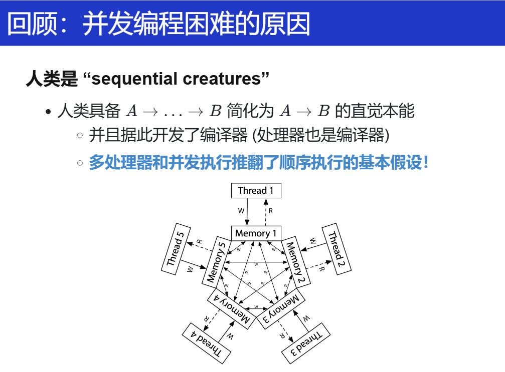

## 多处理器编程

- 证明共享内存

    > **==DEMO==**
    >
    > **并发线程模型**：**并发线程能够读写共享的 heap 堆区**。除此之外，每个线程持有局部变量的副本。Mosaic 不会自动在每条语句之后进行线程调度：我们需要手工插入 `sys_sched`。

## 并发控制：互斥（1）

怎么应对？

### 阻止并发（并行）的发生

什么叫互斥？什么叫并发？

> **Concurrent** means happening at the same time

”要求整个世界有小段时间只属于自己，任何人都不能打断“ ”人想象成线程，多线程想象成物理世界“

- **互斥** (互相排斥)：阻止并发

单核实现互斥：

### 使用 load/store 实现互斥（）

主要是**Peterson 算法**。直接看看讲义和视频讲解吧。

### 在多处理器上实现互斥

需要意识到：**因为人类是“sequential creatures”，导致过去的很多设计是没有考虑并发的（多处理器、共享内存），而我们在共享内存上实现互斥的失败和成功尝试后，我们意识到软件需要和硬件协同工作，并在硬件原子指令基础上实现了基础版本的自旋锁。**

关键在于硬件实现，在 OS 课上可不用深究，不属于本门课的范围。

> 更多内容：
>
> [x86 - How are atomic operations implemented at a hardware level? - Stack Overflow](https://stackoverflow.com/questions/14758088/how-are-atomic-operations-implemented-at-a-hardware-level)
>
> [computer architecture - How does an atomic operation guarantee consistency from a hardware perspective? - Super User](https://superuser.com/questions/400786/how-does-an-atomic-operation-guarantee-consistency-from-a-hardware-perspective)
>
> [计算机原子（atomic）操作的实现原理解析 - 知乎](https://zhuanlan.zhihu.com/p/649646816)
>
> 这里可以总结为：
>
> Extra transistors in the chip to implement **special cache** and memory coherency and **bus synchronization procotols**. The long answer is way too long.
>
> 再进一步总结相关实现手段：
>
> 总线锁定 --> 缓存锁定 相关缓存一致性协议 / LL/SC

## 并发控制：互斥（2）

## 调试理论与实践

## 并发控制：同步（1）

## 并发控制：同步（2）

## 真实世界的并发编程

## 并发bugs

## 应对并发bugs

