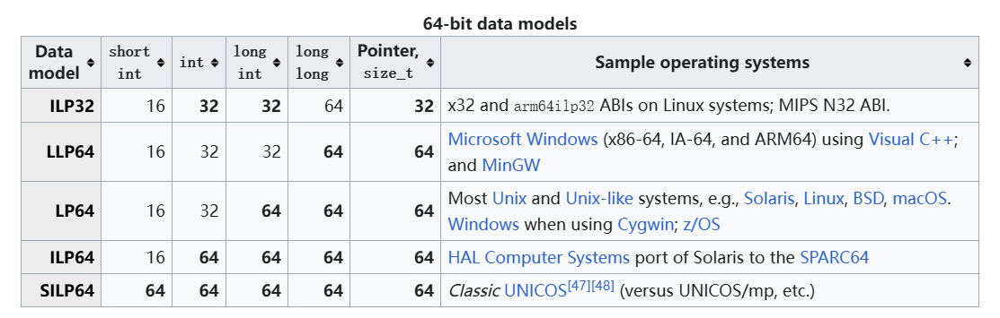
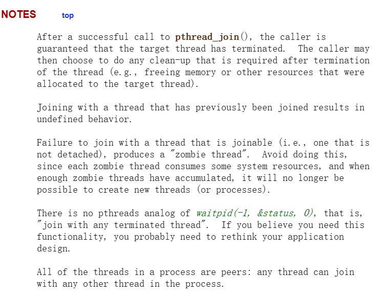

## Introduction

由于没有系统上过计算机系统基础课，这里再简单补充一些 x86/x64 汇编及 Unix 系统使用的 calling convention: System V ABI 及相关内容。

更多详细内容看 manual

- [sysv-abi](https://jyywiki.cn/pages/OS/manuals/sysv-abi.pdf)
- [abi386-4.pdf](https://www.sco.com/developers/devspecs/abi386-4.pdf)
- [System V ABI - OSDev Wiki](https://wiki.osdev.org/System_V_ABI)
- [LSB Specifications](https://refspecs.linuxfoundation.org/lsb.shtml)


### System V ABI

> ABI 是什么？来自 Wikipedia：
>
> > In [computer software](https://en.wikipedia.org/wiki/Computer_software), an **application binary interface** (**ABI**) is an [interface](https://en.wikipedia.org/wiki/Interface_(computing)) between two binary program modules. Often, one of these modules is a [library](https://en.wikipedia.org/wiki/Library_(computing)) or [operating system](https://en.wikipedia.org/wiki/Operating_system) facility, and the other is a program that is being run by a user.
>
> 即：涉及到机器码层面，两份二进制文件怎么进行交互，而这怎么访问对方的数据内容。

> OSDEV Wiki System V ABI
>
> System V Application Binary Interface (System V ABI) 是一套规范，用于定义符合 X/Open Common Application Environment Specification 和 System V Interface Definition 的系统中的各种技术细节。

> 推荐阅读：[JonathanWakely-What Is An ABI And Why Is It So Complicated.pdf](https://accu.org/conf-docs/PDFs_2015/JonathanWakely-What Is An ABI And Why Is It So Complicated.pdf)

相关定义也不是第一次见了，而各网站说了一堆又十分抽象，做个总结。自己理解的ABI包括最少包括以下内容：

- **Function calling conventions and symbol naming**
- **Representation of data types (size, alignment, floating point format)** 
- **Object file format e.g. ELF, PE/COFF, Mach-O**
- **How programs are loaded, dynamic linking, symbol relocations, thread-local storage**
- **Other: system call、exception**

具体来说我将 ABI 分为三个（配合 System V ABI 举例子）：

- **generic ABI （非arch相关，也理解为 OS 相关）**

    操作系统作为运行在最底层的软件，向上层提供了各类的基础设施，由于不同操作系统提供的基础设施功能不一样，故需要做出一些规范，提升移植性。具体例子来说（暂且不考虑编程语言）：

    - **数据模型/数据表示**：不同操作系统之间或许使用的 data model不同

        比如：**在32位下，Linux和Windows都采用ILP32**，但在**64位下，Linux采用的是LP64，而Windows采用的是LLP64**。

        

        [64-bit computing - Wikipedia](https://en.wikipedia.org/wiki/64-bit_computing#64-bit_data_models)

        [数据模型（LP32 ILP32 LP64 LLP64 ILP64 ](https://www.cnblogs.com/lsgxeva/p/7614856.html)

        [1997_opengroup_64bitprogrammingmodels.pdf](https://wiki.math.ntnu.no/_media/tma4280/2017v/1997_opengroup_64bitprogrammingmodels.pdf)

    - **系统调用不一致**

        不同操作系统对系统调用的编码和接口定义不同，导致程序在不同系统上需要重新编写系统调用相关的代码。

    - **动态链接库不兼容**

        不同操作系统上的动态链接库格式和加载机制各异，程序无法直接使用其他系统上的库。

    - **可执行文件格式差异**：

        不同操作系统使用不同的可执行文件格式，如Windows使用PE格式，而Unix-like系统使用ELF格式，导致程序无法跨系统运行。

- **Processor-Specific ABI（arch相关）**

    操作系统运行在不同体系结构的处理器上，不同体系结构有不同的寄存器及各自的特性。可以理解为 System V generic ABI 作为基类，而不同 ISA 和 arch 有自己的特性，那就由此扩展出更多类。具体配合例子

    - **calling convention**

        不同架构的处理器都定义了统一的函数调用约定，如参数传递方式、返回值存储位置等。以传递参数为例。

        - **amd64/x64：System V ABI AMD64...**

            前六个整型函数参数通过寄存器传递（`RCX`、`RDX`、`R8`、`R9`、`R10`、`R11`），对于浮点参数，编译器将会使用另外的 xmm0 到 xmm7，共 8 个寄存器进行存储。对于更宽的值，也可能会使用 ymm 与 zmm 寄存器来替代 xmm 寄存器。

        - **x86：System V ABI AMD64 Intel386...**

            使用栈传递参数。

        - **arm：AAPCS(64)（ARM Architecture Procedure Call Standard）**

            AI总结: arm的calling convention

            [Calling conventions](https://developer.arm.com/documentation/109246/0100/Toolchains-and-model-support/Calling-conventions)

            [Overview of ARM64 ABI conventions | Microsoft Learn](https://learn.microsoft.com/en-us/cpp/build/arm64-windows-abi-conventions?view=msvc-170)

            这些手册都挺精简，价值很高的，没事都可以翻着看看。

        - RISC-V：

            

    - **数据模型/数据表示**

        - RISC-V

            灵活可扩展。`-mabi=xxx`

            - **ILP32**：`int`、`long`和指针都是32位。
            - **LP64**：`int`是32位，`long`和指针是64位。
            - **ILP32F/D**：支持浮点运算的扩展模型。
            - **LP64F/D/Q**：支持浮点运算的64位模型。

        - x86/x64

            x86：ILP32。x64：LP64/LLP64...

        - arm

            ILP32/LP64

- **programming language ABI**


**TODO：改图**

配合下图（比较常见的层次结构）简单理解即可，ABI 可谓是在各方面都有，但是对于非 low-level programming 的我觉得不用太了解，使用别人提供好的 API 即可。


## implement

### 基本理解

对于测试1的代码，再配合协程代码讲解。

> 1. 初始化协程
>
>     **创建协程**：
>
>     - `co_start("thread-1", work, "X")` 和 `co_start("thread-2", work, "Y")` 分别创建了两个协程 `thd1` 和 `thd2`。
>     - 每个协程的 `func` 成员被设置为 `work` 函数，`arg` 成员被设置为对应的字符串 `"X"` 和 `"Y"`。
>     - 协程的状态被初始化为 `CO_NEW`，表示新创建但还未执行过。
>
> 2. 启动协程
>
>     **`co_wait` 函数**：
>
>     - `co_wait(thd1)` 和 `co_wait(thd2)` 调用 `co_yield` 来启动协程的执行。
>     - 在 `co_yield` 中，`setjmp(current->context)` 被调用。如果这是第一次调用，`setjmp` 返回 0，表示可以开始执行协程。
>
> 3. 协程执行
>
>     **`work` 函数**：
>
>     - `work` 函数调用 `work_loop`，并传递 `arg` 作为参数。
>     - 在 `work_loop` 中，协程执行一个循环，每次循环中打印当前的计数，并调用 `add_count` 增加计数。
>     - 每次循环结束后，调用 `co_yield()` 进行协程切换。
>
> 4. 协程切换
>
>     **`co_yield` 函数**：
>
>     - `setjmp(current->context)` 被调用。如果这是第一次调用，`setjmp` 返回 0，表示可以继续执行协程。
>     - `switch_to_co()` 函数随机选择一个状态为 `CO_NEW` 或 `CO_RUNNING` 的协程作为下一个要执行的协程。
>     - 如果下一个协程的状态是 `CO_NEW`：
>         - 将其状态设置为 `CO_RUNNING`。
>         - 调用 `stack_switch_call` 切换到新的栈，并调用协程的入口函数 `func`。
>         - 当协程执行完毕后，将其状态设置为 `CO_DEAD`。
>         - 如果当前协程有等待者（`waiter`），则切换到等待者协程并继续执行。
>     - 如果下一个协程的状态是 `CO_RUNNING`，则直接通过 `longjmp` 跳转到之前保存的上下文继续执行。
>
> 5. `setjmp` 和 `longjmp` 的配合
>     - **`setjmp`**：保存当前协程的上下文（包括寄存器状态和程序计数器等），返回 0 表示这是第一次调用。
>     - **`longjmp`**：恢复之前保存的上下文，使得程序从上次 `setjmp` 的位置继续执行。返回值为传递给 `longjmp` 的第二个参数（在这个例子中是 1）。
>
> 6. 总结
>
>     通过 `setjmp` 和 `longjmp`，协程能够在执行过程中保存和恢复上下文，实现从一个协程切换到另一个协程的功能。`co_yield` 函数负责触发协程的切换，`switch_to_co` 函数选择下一个要执行的协程，`stack_switch_call` 函数负责切换栈并调用协程的入口函数。

每个协程的循环的最后都进行 `co_yield` 切换，不然别的协程得不到执行机会了！（也是协作式 OS 的一种特点吧）

进入 `co_yield` 的 `setjmp/longjmp` 后 ，在 `test1` 中的 `co_yield` 完成后，继续当前的循环。再配合上面的解析，可以用状态机的视角来分析整个程序，以人脑比较舒服的顺序的逻辑和 gdb 分析每一条指令/状态，这样就很清楚了。

创建 co_start -> co_wait -> co_yield -> setjmp.....(choose thd1) stack_switch -> work_loop -> printf(xxx) -> co_yield -> setjmp....(choose thd2) -> work_Loop -> printf(yyy) -> co_yield ->....(循环)...-> co_yield -> setjmp val==1 -> work_loop的循环 -> ......

其实关键的理解就是：函数作为 C 里面重要的一个基本执行单元，其关键的部分就是在栈帧，每一次函数调用就创建一个栈帧，由栈帧构成了程序的整个栈。

再用状态机的视角来理解， `co_yield` 的执行 (call 指令，包括函数的执行)，应该看作一个状态迁移，把当前代码执行的状态机切换到另一段代码，也就是当前执行栈帧切换到另一个栈帧中。（想起之前 PA4 的内容）

```ASM
push   %rbp
push   %rbx
lea    <stdout>, %rbp       
xor    %ebx, %ebx
sub    $0x8, %rsp
mov    %ebx, %esi
mov    %rbp, %rdi
xor    %eax, %eax
callq  <printf@plt>
inc    %ebx
xor    %eax, %eax
callq  <co_yield>  // <- 执行 call 之前，有一个 “状态”
cmp    $0x3e8, %ebx
jne    669 <foo+0xf>
pop    %rax
pop    %rbx
pop    %rbp
retq    
```

那么，调用 `co_yield` 瞬间的协程 “状态” 是什么呢？是当前协程栈中的所有数据，外加处理器上所有的寄存器——有它们，我们就可以解释执行任意函数了。

即：把寄存器 (包括 Stack Pointer) 都保存下来，然后恢复另一个协程保存的寄存器 (和 Stack Pointer)，就实现了随意切换执行流：上下文切换。


### setjmp & longjmp

AI 给的例子。基本了解。

非局部跳转。

> 1. **背景和问题**
>
>     在 C 语言中，函数调用和返回是通过栈来管理的。每次函数调用时，当前函数的上下文（包括寄存器状态和栈指针）会被保存到栈上，然后跳转到被调用函数的代码。当被调用函数返回时，会从栈上恢复之前的上下文，继续执行之前的函数。
>
>     然而，这种机制在某些情况下显得不够灵活。例如：
>
>     - **异常处理**：在发生错误或异常时，需要从深层嵌套的函数中直接跳回到错误处理代码。
>     - **协程切换**：在实现协程时，需要在不同协程之间切换上下文，而不仅仅是简单的函数调用和返回。
>
> 2. **`setjmp` 和 `longjmp` 的发明**
>
>     `setjmp` 和 `longjmp` 是为了解决上述问题而设计的。它们提供了一种机制，允许程序在任意点保存当前的上下文，并在稍后的时间点恢复这个上下文，从而实现非局部跳转。
>
> 3. **`setjmp` 的作用**
>
>     `setjmp` 用于保存当前的上下文（包括寄存器状态和栈指针）到一个 `jmp_buf` 结构中。具体来说：
>
>     - **函数原型**：
>
>         ```c
>         int setjmp(jmp_buf env);
>         ```
>
>     - **功能**：
>
>         - 第一次调用 `setjmp` 时，它会保存当前的上下文到 `env`，并返回 `0`。
>         - 当通过 `longjmp` 跳转回这个 `setjmp` 调用点时，`setjmp` 会返回非零值（通常是 `longjmp` 的第二个参数）。
>
> 4. **`longjmp` 的作用**
>
>     `longjmp` 用于从任意点恢复之前保存的上下文。具体来说：
>
>     - **函数原型**：
>
>         ```c
>         void longjmp(jmp_buf env, int val);
>         ```
>
>     - **功能**：
>
>         - `longjmp` 会从 `env` 中恢复之前保存的上下文，包括寄存器状态和栈指针。
>         - 恢复上下文后，程序会继续执行 `setjmp` 调用点之后的代码，`setjmp` 会返回 `val`（但 `val` 不能为 `0`）。
>
> 5. #### **示例**
>
>     ```C
>     #include <stdio.h>
>     #include <setjmp.h>
>     
>     jmp_buf env;
>     
>     void inner_function() {
>         printf("Inner function\n");
>         longjmp(env, 1); // 跳转回 setjmp 调用点
>     }
>     
>     void outer_function() {
>         if (setjmp(env) == 0) {
>             printf("Outer function: setjmp returned 0\n");
>             inner_function();
>         } else {
>             printf("Outer function: setjmp returned non-zero\n");
>         }
>     }
>     
>     int main() {
>         outer_function();
>         return 0;
>     }
>     ```
>
>     ```C
>     Outer function: setjmp returned 0
>     Inner function
>     Outer function: setjmp returned non-zero
>     ```
>
>     - **`setjmp(env)`**：第一次调用时返回 `0`，保存当前上下文到 `env`。
>     - **`longjmp(env, 1)`**：从 `inner_function` 跳转回 `setjmp` 调用点，`setjmp` 返回 `1`。
>     - **`setjmp(env)`**：第二次调用时返回 `1`，恢复之前保存的上下文，继续执行 `outer_function` 中的代码。
>
> 6. **应用场景**
>
>     - **异常处理**：在发生错误时，从深层嵌套的函数中直接跳回到错误处理代码。
>     - **协程切换**：在实现协程时，保存和恢复协程的上下文，实现协程之间的切换。

再详细点，看看 C 库怎么实现的 [musl: x86_64 - setjmp](http://git.musl-libc.org/cgit/musl/tree/src/setjmp/x86_64/setjmp.s) [musl: x86_64 - longjmp](http://git.musl-libc.org/cgit/musl/tree/src/setjmp/x86_64/longjmp.s)：

```assembly
setjmp:
	mov %rbx,(%rdi)         /* rdi is jmp_buf, move registers onto it */
	mov %rbp,8(%rdi)
	mov %r12,16(%rdi)
	mov %r13,24(%rdi)
	mov %r14,32(%rdi)
	mov %r15,40(%rdi)
	lea 8(%rsp),%rdx        /* this is our rsp WITHOUT current ret addr */
	mov %rdx,48(%rdi)
	mov (%rsp),%rdx         /* save return addr ptr for new rip */
	mov %rdx,56(%rdi)
	xor %eax,%eax           /* always return 0 */
	ret
```

> 将多个寄存器的值（如`rbx`、`rbp`、`r12`、`r13`、`r14`和`r15`）存储到`jmp_buf`中，同时还保存栈指针和返回地址。最后，函数通过返回0来结束执行。

```asm
longjmp:
	xor %eax,%eax
	cmp $1,%esi             /* CF = val ? 0 : 1 */
	adc %esi,%eax           /* eax = val + !val */
	mov (%rdi),%rbx         /* rdi is the jmp_buf, restore regs from it */
	mov 8(%rdi),%rbp
	mov 16(%rdi),%r12
	mov 24(%rdi),%r13
	mov 32(%rdi),%r14
	mov 40(%rdi),%r15
	mov 48(%rdi),%rsp
	jmp *56(%rdi)           /* goto saved address without altering rsp */

```

> 首先，它通过逻辑操作和条件比较来处理状态值。接着，从给定的`jmp_buf`结构中恢复多个寄存器的状态，包括`rbx、rbp、r12、r13、r14、r15`和栈指针`rsp`。最后，代码通过无条件跳转指令`jmp`将控制流转移到保存在`jmp_buf`中的地址，实现程序的非局部控制流转移。

这里 `setjmp` 保存的是 `callee saved/non-volatile registers/call preserved `。老师的讲义那里好像写得有点问题。


- **推荐阅读**

    [How setjmp and longjmp work (2016)](https://offlinemark.com/lets-understand-setjmp-longjmp/)

    [Practical usage of setjmp and longjmp in C - Stack Overflow](https://stackoverflow.com/questions/14685406/practical-usage-of-setjmp-and-longjmp-in-c)


- **拓展**

    `setjmp/longjmp` 的 “寄存器快照” 机制还被用来做很多有趣的 hacking。

    例如 [实现事务内存](http://www.doc.ic.ac.uk/~phjk/GROW09/papers/03-Transactions-Schwindewolf.pdf)、[在并发 bug 发生以后的线程本地轻量级 recovery](https://doi.acm.org/10.1145/2451116.2451129) 等等。


#### ABI Summary

总结一些用到的 ABI 的内容（以 amd64 为主，i386类似）： 


1. **AMD64调用约定核心规则**：

    - 前6个整型参数通过 RDI/RSI/RDX/RCX/R8/R9 传递
    - 前8个浮点参数通过 XMM0-XMM7 传递
    - RAX/RDI/RSI/RDX/RCX/R8/R9/R10/R11 是**调用者保存寄存器**
    - RBX/RBP/RSP/R12-R15 是**被调用者保存寄存器**

2. **参数传递**

    SysV 调用约定的第一个规则是：在调用函数时，对于整型和指针类型的实参，分别使用寄存器 **rdi、rsi、rdx、rcx、r8、r9**，按函数定义时参数**从左到右的顺序**进行传值。而若一个函数的接收参数超过 6 个，则余下参数将通过栈内存进行传送。此时，多出来的参数将按照从右往左（RTL）的顺序被逐个压入栈中。（通过上图右侧第 30 到 40 行红框内的汇编代码得到验证）

    > 除此之外，对于浮点参数，编译器将会使用另外的 xmm0 到 xmm7，共 8 个寄存器进行存储。对于更宽的值，也可能会使用 ymm 与 zmm 寄存器来替代 xmm 寄存器。而上面提到的 xmm、ymm、zmm 寄存器，都是由 x86 指令集架构中名为 AVX（Advanced Vector Extensions）的扩展指令集使用的。这些指令集一般专门用于浮点数计算以及 SIMD 相关的处理过程。

3. 返回值传递

    对于函数调用产生的返回值，SysV 调用约定有相应的规则：当函数调用产生整数类型的返回值，且小于等于 64 位时，通过寄存器 rax 进行传递；当大于 64 位，小于等于 128 位时，则使用寄存器 rax 与 rdx 分别存储返回值的低 64 位与高 64 位。

    > 需要注意的是，对于复合类型（比如结构体）的返回值，编译器可能会直接使用栈内存进行“中转”。

    对于浮点数类型的返回值，同参数传递类似，编译器会默认使用 xmm0 与 xmm1 寄存器进行存储。而当返回值过大时，则会选择性使用 ymm 与 zmm 来替代 xmm 寄存器。

    

    还有一个 Red Zone：

    - **定义**：红区是指从 `%rsp` 指向的位置开始，向栈顶（即低地址）方向延伸的 128 字节区域.
    - **用途**：这个区域被保留，不会被信号或中断处理程序修改。因此，函数可以使用这个区域来存储临时数据，这些数据不需要在函数调用之间保持.
    - **优化**：特别是对于叶子函数（leaf function，即不调用其他函数的函数），可以利用红区来存储整个栈帧，而不需要在函数的序言和尾言中调整栈指针。这种优化可以减少函数调用的开销.

4. cdecl

    为什么有 cdecl，如果用寄存器传递参数，那也不会用到这个。

    以前32位的x86，是用栈传递参数的，所以，自然就需要考虑谁来清理栈（调用者、被调用者）？C 函数参数怎么传递参数（从左到右，还是从右到左）？

    

> 对于应用/非嵌入式开发人员，上面内容可能都不太会了解，很多时候编译器或者libc库已经帮我们做好了底层的脏活累活了。


来自 GeekTIime 某课程的图，伴随上面理解。


偶然看到的：[什么是应用程序二进制接口ABI ](https://zhuanlan.zhihu.com/p/386106883)


### 栈切换

刚开始第一版的时候，64位的勉强能跑，还是会有问题：switch/if 的选择竟然都会有问题。

32位运行测试到一半 segmentation fault，实在是无语了。

这部分我依旧是很迷糊，总是会在奇怪的地方 `segmentation fault`，要么加一条 `printf` 少一条 `printf` 就报错，快烦死我了。

gdb 调半天也迷糊。自己太菜了。

**再更新：**

用了jyy老师 `canary_check` 后，再加上自己静下心来慢慢调试，确实是把 `amd64` 和 `i386` 的栈结构搞明白了。

真的是学了挺多东西的！如下图：

```bash
/* x86_64 (amd64) Stack Layout (downward growing) */
High Address
+-------------------------+  co->stack[STACK_SIZE]
|   Canary Guard (0x10)   |  
|  [MAGIC][MAGIC][MAGIC]  |      
+-------------------------+	<─── co->stack[STACK_SIZE - 0x10]
|      Original RDI       |   │ 
+-------------------------+ <─── co->stack[STACK_SIZE - 0x18]
|      Original RSP       |   │ 
+-------------------------+ <─── co->stack[STACK_SIZE - 0x20]
|   Alignment Padding     |   ▲
| (to meet 16-byte align) |   │
+-------------------------+   │ co_wrapper
|                         |   │ Switch Stack Frame
|  Return Address (CALL)  |   │ (arg in RDI) 
+-------------------------+   ▼
|   previous %rbp value   |
+-------------------------+  
|   ..................... |
+-------------------------+ RSP during function execution
Low Address
```

```asm
"movq %%rdi, -0x18(%0)\n"   // save original rdi
                            // Because rdi is used to pass the first argument
"movq %%rsp, -0x20(%0)\n"   // save current rsp
"leaq -0x20(%0), %%rsp\n"   // switch to new stack
"andq $-16, %%rsp\n"        // Ensure stack is 16-byte aligned
"movq %2, %%rdi\n"          // set function parameter
"call *%1\n"                // call function(entry)
"movq -0x20(%0), %%rsp\n"   // restore the original rsp
"movq -0x18(%0), %%rdi\n"   // restore rdi
```

 i386 Stack Layout 也是类似的，只是用栈传递参数。

再熟悉一下 x86 和 amd64 的汇编，就很容易构建上面的栈结构了。


这里还额外看ABI 手册，记得哪个 red zone，以为要留出 stack bottom 的128 byte，实际上是指的是 rsp 往下的 128-byte

[Stack frame layout on x86-64 - Eli Bendersky's website](https://eli.thegreenplace.net/2011/09/06/stack-frame-layout-on-x86-64)


### 资源回收

起初在第一次看讲义的时候并没有看懂，所以对于资源的释放，都是直接留空，或者随心写的（要求实现功能之后再回来看）。

之后再看这里：

> 管理内存说起来轻巧——一次分配对应一次回收即可，但协程库中的资源管理有些微妙 (但并不复杂)，因为 `co_wait` 执行的时候，有两种不同的可能性：
>
> 1. 此时协程已经结束 (`func` 返回)，这是完全可能的。此时，`co_wait` 应该直接回收资源。
> 2. 此时协程尚未结束，因此 `co_wait` 不能继续执行，必须调用 `co_yield` 切换到其他协程执行，直到协程结束后唤醒。

在我没有使用 `co_wrapper` 之前，还是比较快地就实现了 `co_free` 相关的内容。也就是在 `co_wait` 看有无协程等待，然后直接 `co_free` 就行。

在之后引入 `co_wrapper` 后，想着是在 `co_wrapper` 里执行完 `co->func` 之后就自动回收，还是依旧到后面的 `co_wait` 再 `co_free`。

这里讲义的后面讲的，看不太懂，所以让 `deepseek` 配合推理。

> 希望大家仔细考虑好每一种可能的情况，保证你的程序不会在任何一种情况下 crash 或造成资源泄漏。
>
> 然后你会发现，**假设每个协程都会被 `co_wait` 一次，且在 `co_wait` 返回时释放内存是一个几乎不可避免的设计**：
>
> 如果允许在任意时刻、任意多次等待任意协程，那么协程创建时分配的资源就无法做到自动回收了——即便一个协程结束，我们也无法预知未来是否还会执行对它的 `co_wait`，而对已经回收的 (非法) 指针的 `co_wait` 将导致 undefined behavior。C 语言中另一种常见 style 是让用户管理资源的分配和释放，显式地提供 `co_free` 函数，在用户确认今后不会使用时释放资源。
>
> > 资源管理一直是计算机系统世界的难题，至今很多系统还受到资源泄漏、use-after-free 的困扰。例如，顺着刚才资源释放的例子，你可能会感觉 `pthread` 线程库似乎有点麻烦：`pthread_create()` 会修改一个 `pthread_t` 的值，线程返回以后资源似乎应该会被释放。那么：
> >
> > - 如果 `pthread_join` 发生在结束后不久，资源还未被回收，函数会立即返回。
> > - 如果 `pthread_join` 发生在结束以后一段时间，可能会得到 `ESRCH` (no such thread) 错误。
> > - 如果 `pthread_join` 发生在之后很久很久很久很久，资源被释放又被再次复用 (`pthread_t` 是一个的确可能被复用的整数)，我不就 join 了另一个线程了吗？这恐怕要出大问题。
> >
> > 实际上，pthread 线程默认是 “joinable” 的。joinable 的线程只要没有 join 过，资源就一直不会释放。特别地，文档里写明：
> >
> > > Failure to join with a thread that is joinable (i.e., one that is not detached), produces a "zombie thread". Avoid doing this, since each zombie thread consumes some system resources, and when enough zombie threads have accumulated, it will no longer be possible to create new threads (or processes).

> 1. **多次 co_wait 的风险**：
>     - 若允许多次调用 `co_wait` 等待同一协程，且协程结束后资源被立即释放，后续的 `co_wait` 将访问已释放的内存，导致未定义行为（UB）。
>     - 用户当前的代码在协程结束后立即释放资源，若存在多个等待者，可能引发双重释放（Double Free）。
> 2. **引用计数的作用**：
>     - 引用计数应跟踪协程的活跃引用（如等待者数量），确保资源在所有引用失效后才被释放。
>     - 用户代码中的引用计数逻辑未正确处理多等待者场景，导致可能在仍有引用时提前释放。

给了我提醒，使用个引用计数（就是加个变量 `ref_count` ）

思考顺序：

如果每个协程都恰好只被 `co_wait` 一次，那直接...简直不可能。

> 还有一种想法：如果这个协程不被 `wait`，那直接在它结束的时候 free 掉就行（`co_wrapper` 里）。那也就是不一定需要 `co_wait` 来释放资源？值得想想，这里之后再讨论。

在任意时刻、任意多次等待协程 `co_wait` 应该才符合正常应用开发的需求，但就带来个问题：

当协程结束后，调用 `co_free` 可能会立即释放资源，但此时可能有多个 `co_wait` 在等待。例如，如果有多个协程调用` co_wait` 同一个协程，那么当第一个 `co_wait` 执行时，协程结束，释放资源，其他 `co_wait` 在后续执行时就会访问已释放的内存，导致 UB，也可能导致double free。 

怎么解决？？这里 deepseek 给了提示，通过引用计数精确控制资源生命周期：

引用计数应跟踪协程的活跃引用（如等待者数量），确保资源在所有引用失效后才被释放，初步实现为：

- 每个协程维护 `ref_count` 计数器

    **初始值 `ref_count = 1`**：协程被创建时，默认被 `co_list` 持有（视为第一个持有者）。

- **`ref_count++`**：当有新的代码逻辑需要访问该协程时（例如 `co_wait` 等待该协程）。

- **`ref_count--`**：当某个持有者不再需要该协程时（例如 `co_wait` 退出等待）。

- `co_free()`：当 `ref_count == 0` 时，释放资源。

**其中引用计数的核心是严格配对增减**。实现如下

```C
void co_free(struct co *co) {
    if (!co) return;

    assert(co->ref_count > 0);
    //printf("2/3  co->ref_count: %d co->name: %s\n", co->ref_count, co->name);

    co->ref_count--;
    if (co->ref_count == 0 && co->status == CO_DEAD) {
        int id = 0;
        for (id = 0; id < co_num; ++id) {
            if (co_list[id] == co) {
              break;
            }
        }
        while (id < co_num - 1) {
            co_list[id] = co_list[id+1];
            ++id;
        }
        --co_num;
        co_list[co_num] = NULL;

        canary_check(co);
        free(co);
        co = NULL;
    }
}

void co_wait(struct co *co) {
    if (!co) return;

    // 增加引用计数
    co->ref_count++;

    // 若协程已结束，减少引用计数并检查释放
    if (co->status == CO_DEAD) {
        co->ref_count--;
        if (co->ref_count == 1) {
            co_free(co);
        }
        return;
    }

    // 等待协程结束
    co->waiter = current;
    current->status = CO_WAITING;

    while (co->status != CO_DEAD) {
        co_yield();
    }

    // 减少引用计数，若无人引用则释放
    co->ref_count--;
    if (co->ref_count == 1) {
        co_free(co);
    }
}

static void co_wrapper(void *arg) {
    struct co *co = arg;
    co->func(co->arg);
    co->status = CO_DEAD;

    // Automatically recycled without threaded waiting
    if (co->waiter == NULL) {
        co_free(co);
    }
}

```

初步运行起来没什么问题，两个测试都过了，也没有出现内存泄露的情况（`valgrind --leak-check=full  --track-origins=yes ./libco-test-64`）

> 其实这个时候已经够实现了。

但是再次询问 deepseek 之后，又提到了 DETACHED / ZOMBIE 的内容和参考 pthread 的设计。

> `pthread` 的线程资源管理采用以下策略：
>
> 1. **默认需显式回收**：线程结束后，必须调用 `pthread_join` 回收资源，否则资源泄漏（僵尸线程）。
> 2. **可选自动回收**：调用 `pthread_detach` 后，线程结束时自动释放资源，但不能再调用 `pthread_join`。

这个时候发现自己理解的自动回收已经出现了点偏差了，因为没有系统性地学习高级语言（带 GC 的），我以为的自动回收就是在资源用不到的时候或者协程结束的时候语言或者运行时环境自动帮我回收了。

> 来自deepseek：
>
> 在协程库设计中，是否可以不提供显式的 `co_wait`/`co_detach` 而实现自动回收？理论上可行，但要满足以下关键条件：
>
> ---
>
> 1. **==完全自动回收的核心挑战==**
>
>     1. 所有权模糊问题
>
>         - **隐式所有权**：若所有协程都自动回收，相当于将资源所有权完全交给运行时系统
>         - **竞态风险**：协程结束瞬间可能仍有指针被其他协程持有（如全局变量）
>         - **异步危险**：类似多线程中访问已释放内存的风险
>
>     2. 生命周期管理难点
>
>         ```C
>         // 危险示例：
>         void producer() {
>             struct co* c = co_start("consumer", consumer, NULL);
>             // 若 consumer 在此处已结束并被自动回收
>             // 后续任何对 c 的操作都会导致 use-after-free
>         }
>         ```
>
>     3. 性能损耗
>
>         - 需要引入复杂的引用跟踪机制（如 GC）
>         - 与协程轻量级的特性相违背
>
> ---
>
> 2. **==可行的轻量级自动回收方案==**
>
>     可通过 **所有权标记 + 引用计数** 实现半自动回收，无需显式调用分离函数：
>
>     1. 协程属性设计
>
>         ```c
>         struct co {
>             // ...
>             atomic_int ref_count;  // 引用计数器
>             unsigned is_owner : 1; // 创建者是否放弃所有权
>         };
>         ```
>
>     2. 创建接口
>
>         ```C
>         // 默认返回可等待的协程
>         struct co* co_start(const char* name, void (*func)(void*), void* arg) {
>             struct co* co = /* 初始化 */;
>             co->ref_count = 1;  // 创建者持有初始引用
>             return co;
>         }
>
>         // 创建即放弃所有权
>         void co_run_detached(const char* name, void (*func)(void*), void* arg) {
>             struct co* co = co_start(name, func, arg);
>             co->is_owner = 0;
>             co->ref_count--;  // 立即释放创建者引用
>         }
>         ```
>
>     3. 自动回收逻辑
>
>         ```c
>         static void co_wrapper(void* arg) {
>             struct co* co = arg;
>             co->func(co->arg);
>
>             // 自动回收路径
>             if (co->is_owner == 0) {
>                 co->ref_count--;
>                 if (co->ref_count == 0) {
>                     co_free(co);
>                 }
>             } else {
>                 co->status = CO_ZOMBIE;  // 等待手动回收
>             }
>         }
>         ```
>
>     4. 隐式引用管理
>
>         ```C
>         void co_yield() {
>             // yield 时自动管理引用
>             struct co* prev = current;
>             prev->ref_count++;  // 防止在切换时被回收
>         
>             /* 切换上下文 */
>         
>             prev->ref_count--;
>             if (prev->ref_count == 0 && prev->is_owner == 0) {
>                 co_free(prev);
>             }
>         }
>         ```
>
>     ---
>
>  3. **==方案对比分析==**
> 	
> 	| 特性     | 显式等待/分离    | 完全自动回收                | 本方案             |
> 	| -------- | ---------------- | --------------------------- | ------------------ |
> 	| 内存安全 | 高（明确所有权） | 低（易出现 use-after-free） | 中（需编译器配合） |
> 	| 性能     | 最优             | 差（需 GC）                 | 接近显式方案       |
> 	| 易用性   | 需手动管理       | 最简单                      | 较简单             |
> 	| 确定性   | 完全确定         | 不确定                      | 基本确定           |
> 	| 适合场景 | 系统编程         | 脚本语言                    | 应用层开发         |
>
> ---
>
> 4. **==实现建议==**
>
>     4. **防御性措施**：
>
>         ```c
>         void co_free(struct co* co) {
>             assert(co->ref_count == 0);
>             assert(co->status == CO_ZOMBIE);
>             // 清零内存防止残留指针
>             memset(co, 0xAA, sizeof(struct co)); 
>             free(co);
>         }
>         ```
>
>     5. **编译器辅助**：
>
>         ```c
>         // 通过 __attribute__((cleanup)) 实现自动释放
>         void auto_co_wait(struct co** c) {
>             if (*c) co_wait(*c);
>         }
>         
>         #define CO_AUTO __attribute__((cleanup(auto_co_wait)))
>         
>         void demo() {
>             CO_AUTO struct co* c = co_start(...);
>             // 函数返回时自动等待
>         }
>         ```
>
>     6. **所有权可视化**：
>
>         ```c
>         // 类型系统区分所有权
>         typedef struct co* CoRef;    // 可等待的强引用
>         typedef const struct co* CoView; // 只读弱引用
>         ```
>
>     ---
>
> 5. **==结论==**
>
>     **可以实现无显式分离的自动回收**，但需要：
>
>     1. 严格的引用计数规则
>     2. 清晰的创建时所有权声明（通过 `co_run_detached`）
>     3. 配合编译器的静态检查（如 clang 的线程安全分析）
>
>     建议方案：
>
>     - 默认创建可等待协程（JOINABLE）
>     - 提供 `co_run_detached` 创建即自动回收的协程
>     - 在文档中强调："如果不需要等待协程结果，必须使用 `co_run_detached`"

属于是有点超出lab的范围，还有不太符合 C-style了，所以，不管了！

“`co_wait` 返回时释放内存是一个几乎不可避免的设计”。这句话确实是有道理的。

由此对自己的设计总结：

- 目前必须使用 `co_wait` 作为资源释放。（zombie/detached 目前未加入，可能协程状态会有一些混淆，但不管了）


> **某次询问 deepseek 的一些总结**
>
> | 特性              | 原实现 | 改进版 | pthread 对比       |
> | ----------------- | ------ | ------ | ------------------ |
> | 多次 co_wait      | ❌      | ✅      | ❌ (只能 join 一次) |
> | 延迟 co_wait      | ❌      | ✅      | ✅ (有限时间窗口)   |
> | 显式资源释放      | ❌      | ✅      | ✅ (pthread_detach) |
> | 结束协程自动释放  | ✅      | ❌      | ❌                  |
>    | 防 use-after-free | ❌      | ✅      | ⚠️ (可能 ID 复用)   |
>    | 协程 ID 复用防护  | ❌      | ✅      | ❌                  |
>    
>    ```bash
>    # 使用 Valgrind 检查
>    valgrind --leak-check=full \
>             --track-origins=yes \
>             --error-exitcode=1 \
>             ./your_program
> ```
> 
> **需要特别注意**：
> 
>    1. **协程所有权**：
>       - 推荐每个协程有且只有一个所有者负责 `co_free()`
>    - 其他使用者只增加引用计数
> 3. **线程安全**：
>    - 当前实现为单线程协程
>    - 如需多线程支持需添加锁机制
>    
>    这种设计可以：
>    1. 支持任意次数的 co_wait 调用
>    2. 通过引用计数精确控制资源生命周期
>    3. 防止 use-after-free
>    4. 提供类似 pthread 的错误处理
>    5. 兼容原有测试用例
>    


more：




具体代码：[M2](https://github.com/JAILuo/os-lab/tree/M2)


## misc

### LIBRARY_PATH vs LD_LIBRARY_PATH

[LIBRARY_PATH vs LD_LIBRARY_PATH](https://www.baeldung.com/linux/library_path-vs-ld_library_path)

[LD_LIBRARY_PATH – or: How to get yourself into trouble!](https://www.hpc.dtu.dk/?page_id=1180)


