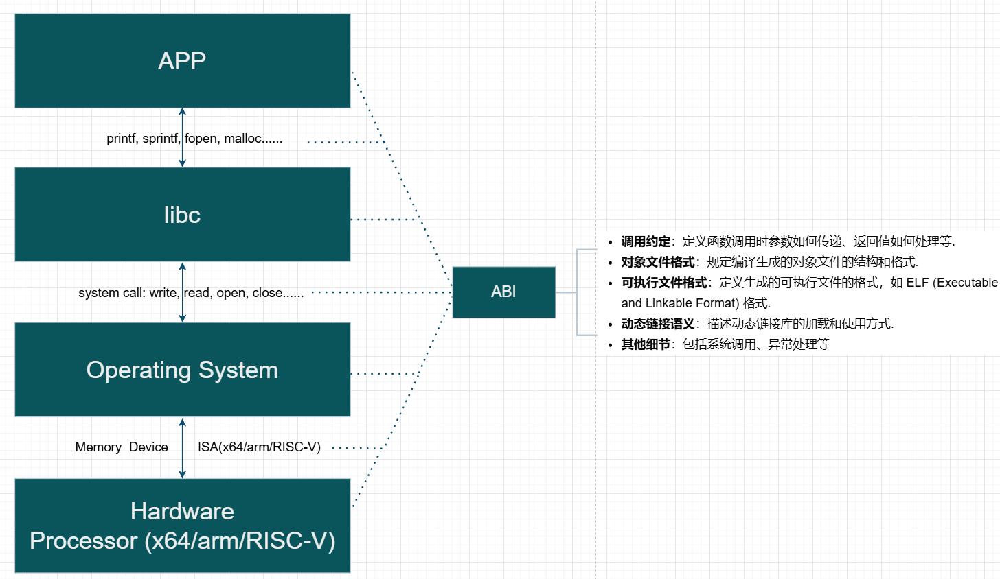
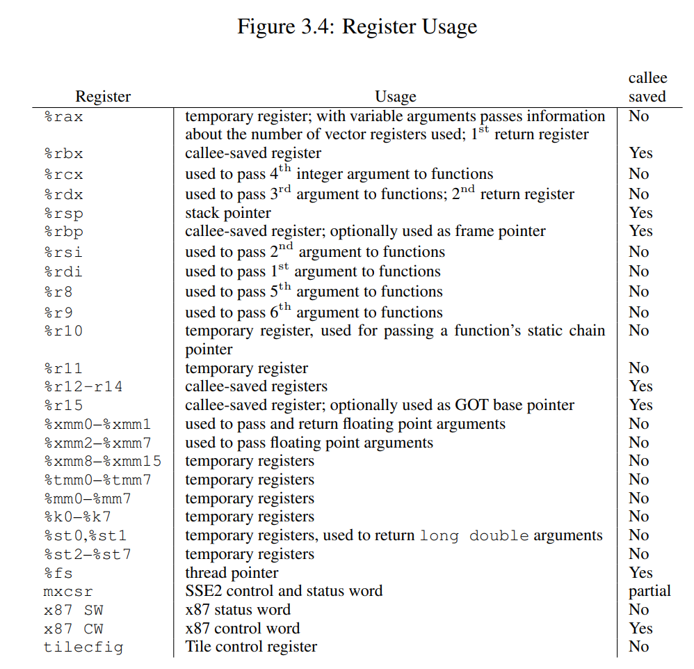
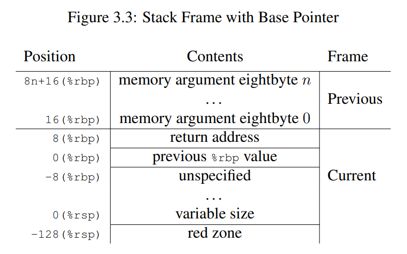

## Introduction

由于没有系统上过计算机系统基础课，这里再简单补充一些 x86/x64 汇编及 Unix 系统使用的 calling convention: System V ABI 及相关内容。

更多详细内容还是查看 manual

- [sysv-abi](https://jyywiki.cn/pages/OS/manuals/sysv-abi.pdf)
- [abi386-4.pdf](https://www.sco.com/developers/devspecs/abi386-4.pdf)
- [System V ABI - OSDev Wiki](https://wiki.osdev.org/System_V_ABI)

### System V ABI

> 来自 Wikipedia：
>
> > In [computer software](https://en.wikipedia.org/wiki/Computer_software), an **application binary interface** (**ABI**) is an [interface](https://en.wikipedia.org/wiki/Interface_(computing)) between two binary program modules. Often, one of these modules is a [library](https://en.wikipedia.org/wiki/Library_(computing)) or [operating system](https://en.wikipedia.org/wiki/Operating_system) facility, and the other is a program that is being run by a user.
>
> 即涉及到机器码层面，两份二进制文件怎么进行交互，而这怎么访问对方的数据内容。

> 来自 OSDEV Wiki + 翻译：
>
> System V Application Binary Interface (System V ABI) 是一套规范，用于定义符合 X/Open Common Application Environment Specification 和 System V Interface Definition 的系统中的各种技术细节。它主要包括以下几个方面：
>
> - **调用约定**：定义函数调用时参数如何传递、返回值如何处理等.
> - **对象文件格式**：规定编译生成的对象文件的结构和格式.
> - **可执行文件格式**：定义生成的可执行文件的格式，如 ELF (Executable and Linkable Format) 格式.
> - **动态链接语义**：描述动态链接库的加载和使用方式.
> - **其他细节**：包括系统调用、异常处理等.
>
> System V ABI 是一个可扩展的标准，由一个通用的基础文档和针对不同平台的具体补充文档组成。随着 Unix 系统的发展和新平台的出现，这个标准不断演变，许多非官方的补充规范也被发布出来。虽然没有一个中央机构来统一管理，但它已经成为大多数 Unix 操作系统（如 Linux 和 BSD 系统）的标准 ABI.
>
> System V ABI 的一些高级特性（如动态链接）是可选的，而加载简单的静态链接 ELF 程序则相对直接。早期版本的标准试图标准化软件包安装格式和 X11 细节，但这些内容已经过时且不再被关注。现代操作系统开发工具（如 Binutils 和 GCC）对 System V ABI 有良好的支持，工具链（如 i686-elf-gcc）会根据这个 ABI 生成代码和可执行文件.

配合下图（比较常见的层次结构）简单理解即可，ABI 可谓是在各方面都有，但是对于非 low-level programming 的我觉得不用太了解，使用别人提供好的 API 即可。

### x86-64/amd64 

下面具体总结 x86-64/amd64的一些内容，以下图为例配合之后的例子。之后 IA-32也是类似的。

#### 寄存器使用

SysV 调用约定对寄存器的使用也作出了规定：对于寄存器 rbx、rbp、rsp，以及 r12 到 r15，若被调用函数需要使用它们，则需要该函数在使用之前将这些寄存器中的值进行暂存，并在函数退出之前恢复它们的值（callee-saved）。

而对于其他寄存器，则根据调用方的需要，自行保存和恢复它们的值（caller-saved）。

> 对于应用/非嵌入式开发人员来说，上面这些内容可能很多都不太会了解到，因为很多时候编译器或者libc库已经帮我们做好了底层的脏活累活了。

#### 参数传递

SysV 调用约定的第一个规则是：在调用函数时，对于整型和指针类型的实参，分别使用寄存器 **rdi、rsi、rdx、rcx、r8、r9**，按函数定义时参数**从左到右的顺序**进行传值。而若一个函数的接收参数超过 6 个，则余下参数将通过栈内存进行传送。此时，多出来的参数将按照从右往左（RTL）的顺序被逐个压入栈中。（通过上图右侧第 30 到 40 行红框内的汇编代码得到验证）

函数 foo 在调用前，分别用寄存器 edi、esi 存放局部变量 x 与 y 的值，并用寄存器 edx、ecx、r8d、r9d 存放字面量值 3、4、5、6。而多出来的另外两个字面量值参数 7 和 8 ，则直接通过 push 指令被放在了栈内存中（注意参数顺序）。你需要注意这里指令操作它们的先后顺序，因为要保证这些参数以从右向左的顺序被放入栈中。另外，由于 x、y 为局部变量，因此最开始它们会被存储在栈内存中。

> 除此之外，对于浮点参数，编译器将会使用另外的 xmm0 到 xmm7，共 8 个寄存器进行存储。对于更宽的值，也可能会使用 ymm 与 zmm 寄存器来替代 xmm 寄存器。而上面提到的 xmm、ymm、zmm 寄存器，都是由 x86 指令集架构中名为 AVX（Advanced Vector Extensions）的扩展指令集使用的。这些指令集一般专门用于浮点数计算以及 SIMD 相关的处理过程。
>
> 这里更多

#### 返回值传递

对于函数调用产生的返回值，SysV 调用约定有相应的规则：当函数调用产生整数类型的返回值，且小于等于 64 位时，通过寄存器 rax 进行传递；当大于 64 位，小于等于 128 位时，则使用寄存器 rax 与 rdx 分别存储返回值的低 64 位与高 64 位。

参考图 A 右侧第 4、21、47 行蓝框内的代码，来验证这个规则。这三行代码分别处理了函数 bar、foo，以及 main 的返回值。

> 需要注意的是，对于复合类型（比如结构体）的返回值，编译器可能会直接使用栈内存进行“中转”。

对于浮点数类型的返回值，同参数传递类似，编译器会默认使用 xmm0 与 xmm1 寄存器进行存储。而当返回值过大时，则会选择性使用 ymm 与 zmm 来替代 xmm 寄存器。

#### 栈帧

- **栈帧**：每个函数在运行时栈上都有一个帧（frame），用于存储局部变量、保存寄存器状态等。（一个框）

- **栈生长方向**：在 x86-64 架构中，**栈是从高地址向低地址生长的。**

- **rbp 和 rsp**：

    - **%rbp 和 %rsp**：通常情况下，%rbp 用作栈帧指针，而 %rsp 是栈指针。使用 %rsp 来索引栈帧可以避免使用 %rbp，从而节省序言和尾言中的两条指令.
    - **优势**：这种技术不仅减少了指令数量，还使得 %rbp 寄存器可用于其他用途，增加了可用的通用寄存器数量.

- **栈对齐**：在调用函数之前，栈顶需要对齐到 16 字节（如果传递的是 __ m256 或  __m512 类型的参数，则需要对齐到 32 字节或 64 字节）边界。**这意味着在执行 `call` 指令之前，栈顶指针 `%rsp` 应该指向一个 16 字节对齐的地址。**

    比如 **返回地址**：当控制权转移到函数入口点时，即在返回地址被压入栈后，栈指针 `%rsp` 指向返回地址。此时，`(%rsp + 8)` 的值是 16 字节（或 32 字节、64 字节）的倍数，因为返回地址本身占用 8 字节.（见下图）

还是之前的那些问题，栈顶、栈底、rsp、rbp...究竟哪个是哪个？配合下图和之前汉诺塔的学习 [应用视角下的操作系统: C语言和汇编: 递归和非递归](https://jailuo.github.io/notes/Course/University Course/jyy OS2024/cousre note/1. introduction/introduction.html) 和很久之前的数据结构栈的学习 ==TODO==

还有一个 红区（Red Zone）：

- **定义**：红区是指从 `%rsp` 指向的位置开始，向栈顶（即低地址）方向延伸的 128 字节区域.
- **用途**：这个区域被保留，不会被信号或中断处理程序修改。因此，函数可以使用这个区域来存储临时数据，这些数据不需要在函数调用之间保持.
- **优化**：特别是对于叶子函数（leaf function，即不调用其他函数的函数），可以利用红区来存储整个栈帧，而不需要在函数的序言和尾言中调整栈指针。这种优化可以减少函数调用的开销.

### IA-32 

## implement

### 基本理解

对于测试1的代码，再配合协程代码讲解。

> 1. 初始化协程
>
>     **创建协程**：
>
>     - `co_start("thread-1", work, "X")` 和 `co_start("thread-2", work, "Y")` 分别创建了两个协程 `thd1` 和 `thd2`。
>     - 每个协程的 `func` 成员被设置为 `work` 函数，`arg` 成员被设置为对应的字符串 `"X"` 和 `"Y"`。
>     - 协程的状态被初始化为 `CO_NEW`，表示新创建但还未执行过。
>
> 2. 启动协程
>
>     **`co_wait` 函数**：
>
>     - `co_wait(thd1)` 和 `co_wait(thd2)` 调用 `co_yield` 来启动协程的执行。
>     - 在 `co_yield` 中，`setjmp(current->context)` 被调用。如果这是第一次调用，`setjmp` 返回 0，表示可以开始执行协程。
>
> 3. 协程执行
>
>     **`work` 函数**：
>
>     - `work` 函数调用 `work_loop`，并传递 `arg` 作为参数。
>     - 在 `work_loop` 中，协程执行一个循环，每次循环中打印当前的计数，并调用 `add_count` 增加计数。
>     - 每次循环结束后，调用 `co_yield()` 进行协程切换。
>
> 4. 协程切换
>
>     **`co_yield` 函数**：
>
>     - `setjmp(current->context)` 被调用。如果这是第一次调用，`setjmp` 返回 0，表示可以继续执行协程。
>     - `switch_to_co()` 函数随机选择一个状态为 `CO_NEW` 或 `CO_RUNNING` 的协程作为下一个要执行的协程。
>     - 如果下一个协程的状态是 `CO_NEW`：
>         - 将其状态设置为 `CO_RUNNING`。
>         - 调用 `stack_switch_call` 切换到新的栈，并调用协程的入口函数 `func`。
>         - 当协程执行完毕后，将其状态设置为 `CO_DEAD`。
>         - 如果当前协程有等待者（`waiter`），则切换到等待者协程并继续执行。
>     - 如果下一个协程的状态是 `CO_RUNNING`，则直接通过 `longjmp` 跳转到之前保存的上下文继续执行。
>
> 5. `setjmp` 和 `longjmp` 的配合
>     - **`setjmp`**：保存当前协程的上下文（包括寄存器状态和程序计数器等），返回 0 表示这是第一次调用。
>     - **`longjmp`**：恢复之前保存的上下文，使得程序从上次 `setjmp` 的位置继续执行。返回值为传递给 `longjmp` 的第二个参数（在这个例子中是 1）。
>
> 6. 总结
>
>     通过 `setjmp` 和 `longjmp`，协程能够在执行过程中保存和恢复上下文，实现从一个协程切换到另一个协程的功能。`co_yield` 函数负责触发协程的切换，`switch_to_co` 函数选择下一个要执行的协程，`stack_switch_call` 函数负责切换栈并调用协程的入口函数。

可能有些地方没转过来，再创建了两个协程后，每个协程的循环的最后都进行 `co_yield` 切换。

进入 `co_yield` 的 `setjmp/longjmp` 后 ，在 `test1` 中的 `co_yield` 完成后，继续当前的循环。再配合上面的解析，可以用状态机的视角来分析整个程序，以人脑比较舒服的顺序的逻辑和 gdb 分析每一条指令/状态，这样就很清楚了。

创建两个 co -> co_wait -> co_yield -> setjmp.....(choose thd1) stack_switch -> work_loop -> printf(xxx) -> co_yield -> setjmp....(choose thd2) -> work_Loop -> printf(yyy) -> co_yield ->....(循环)...-> co_yield -> setjmp val==1 -> work_loop的循环 -> ......

### 栈切换（TODO）

64位的勉强能跑，还是会有问题：switch/if 的选择竟然都会有问题。。。

32位运行测试到一半 segmentation fault，实在是无语了。

这部分我依旧是很迷糊，总是会在奇怪的地方 `segmentation fault`，要么加一条 `printf` 少一条 `printf` 就报错，快烦死我了。

gdb 调半天也迷糊。

具体代码

