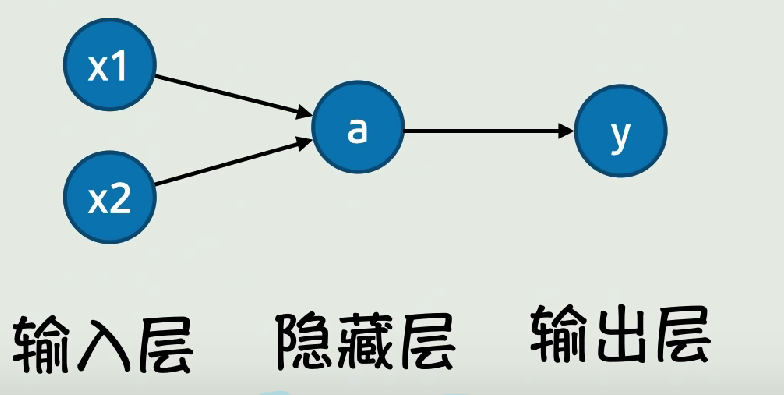
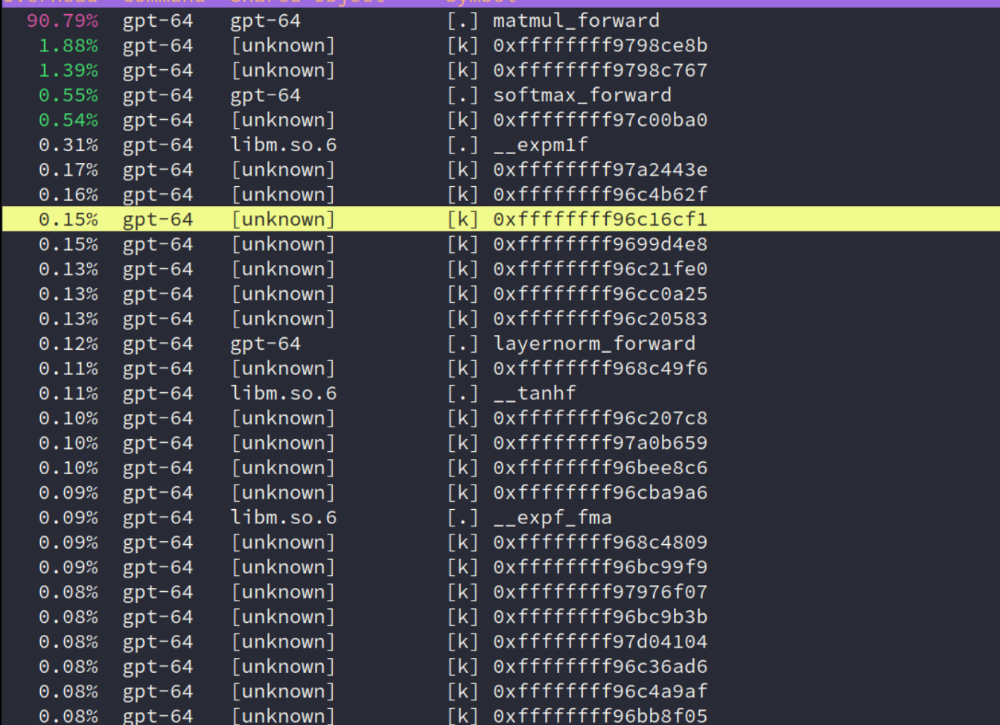

## Introduction

由于开始的时间比较晚，在老师的 wiki 上无法下载 `gpt.c` 的 model 文件，所以网上找。


## Basic knowledge of AI

由于自己不像南大的学生可能在上 OS 课前就有 AI 相关的基础，所以这部分我根据老师推荐的学习资料和 LLM 来一步步学习相关概念，当然只是大概过一遍内容。

> 首先，`gpt.c` 的源代码就是最好的老师！它实现了对神经网络的 “真正数学严格” 的描述——如果我们看 PyTorch 的代码，其中会涉及许多内置的算子，你对其中的实现其实并不 100% 理解——但对于 C 代码这种语义 “扁平” 的语言来说，你真的可以完全理解它！此外，我们给一个[外链](https://jalammar.github.io/illustrated-gpt2/)，也还推荐 [Understanding Deep Learning](https://udlbook.github.io/udlbook/)。
>
> 当然，老师上面给出的一些学习资料也很不错！

加上之前偶然刷到的视频：[从函数到神经网络【白话DeepSeek01】](https://www.bilibili.com/video/BV1uGA3eLEeu) 和 [Neural network (machine learning)](https://en.wikipedia.org/wiki/Neural_network_(machine_learning))，应该能简单了解。最后再看看神经网络中的相关概念是怎么对应 C 代码实现。


### overview

####  一、神经元

神经元是神经网络的基本组成单元，它模拟了生物神经元的行为。一个简单的神经元模型由以下部分组成：

  * **输入连接** ：接收来自其他神经元或输入数据的信号。
  * **权重** ：每个输入连接都有一个权重，表示该输入对神经元输出的重要性。
  * **偏置** ：一个常数，用于调整神经元的激活阈值。
  * **激活函数** ：对神经元的加权输入进行非线性变换，以决定神经元是否被激活。

神经元的输出 y 的数学表达式：
$$
y = \sigma\left( \sum_{i=1}^{n} w_i x_i + b \right) \\

x_i 是输入，w_i 是权重，b 是偏置，\sigma 是激活函数
$$


#### 二、激活函数

激活函数是神经元中用于引入非线性的关键组件，它使得神经网络能够学习复杂的模式和特征。常见的激活函数有：

- **Sigmoid 函数**

  * **数学表达式** ：
    $$
    \sigma(x) = \frac{1}{1 + e^{-x}}
    $$
  
  * **特点** ：输出范围在 (0,1) 之间，可以将任意实数值映射到 0 和 1 之间，常用于二分类问题。然而，Sigmoid 函数在输入较大或较小时会出现梯度饱和问题，导致训练速度变慢。
  
  * **应用场景** ：适用于二分类任务的输出层，也可用于某些需要将输出限制在 0 到 1 之间的中间层。


- **`ReLU` 函数（Rectified Linear Unit）**

  * **数学表达式** ：
    $$
    \text{ReLU}(x) = \max(0, x)
    $$
  
  * **特点** ：当输入大于 0 时，输出等于输入；当输入小于等于 0 时，输出为 0。计算简单，能有效缓解梯度消失问题，但在输入小于 0 时梯度为 0，可能导致部分神经元 “死亡”。
  
  * **应用场景** ：广泛应用于卷积神经网络（CNN）和多层感知机（MLP）等的隐藏层。


- **tanh 函数**

  * **数学表达式** ：
    $$
    \tanh(x) = \frac{e^{x} - e^{-x}}{e^{x} + e^{-x}}
    $$
  
  * **特点** ：输出范围在 (-1,1) 之间，是非线性函数，能够将输入数据归一化到 -1 到 1 的区间。相比 Sigmoid 函数，tanh 函数的输出均值更接近 0，有助于加快收敛速度，但也存在梯度饱和问题。
  
  * **应用场景** ：常用于循环神经网络（RNN）和某些需要将输出限制在 -1 到 1 之间的场景。


- **GELU 函数（Gaussian Error Linear Unit）**

  * **数学表达式** ：
    $$
    \text{GELU}(x) = x \cdot \Phi(x)，\\
    \Phi(x) 是标准正态分布的累积分布函数。
    $$
  
  * **特点** ：结合了 `ReLU` 和线性函数的优点，具有更好的非线性拟合能力，在 Transformer 模型中被广泛使用。
  
  * **应用场景** ：适用于 Transformer 架构的神经网络，特别是在自然语言处理任务中。


- `Softmax` 函数

  * **数学表达式** ：
  
    对于输入向量：
    $$
    z = [z_1, z_2, ..., z_n]
    $$
    `Softmax` 函数的输出为：
    $$
    \text{Softmax}(z_i) = \frac{e^{z_i}}{\sum_{j=1}^{n} e^{z_j}} \\
    (i = 1, 2, ..., n)
    $$
  
  * **特点** ：将一组实数值转换为概率分布，使得所有输出值的和为 1，常用于多分类问题的输出层。
  
  * **应用场景** ：主要用于多分类任务的输出层，将神经网络的输出转换为各类别的概率。


- **`Leaky ReLU` 函数**

  * **数学表达式** ：
    $$
    \text{Leaky ReLU}(x) = \begin{cases} x, & x > 0 \\ \alpha x, & x \leq 0 \end{cases} \\
    \alpha 是一个较小的正数，如 0.01
    $$
  
  * **特点** ：在输入小于 0 时，输出为 αx ，避免了 `ReLU` 函数中部分神经元 “死亡” 的问题，同时保留了 `ReLU` 函数在输入大于 0 时的线性特性。
  
  * **应用场景** ：适用于需要解决 `ReLU` 函数 “死亡” 问题的神经网络隐藏层。


- **ELU 函数（Exponential Linear Unit）**

  * **数学表达式**：
    $$
    \text{ELU}(x) = \begin{cases} x, & x > 0 \\ \alpha (e^{x} - 1), & x \leq 0 \end{cases} \\
    \alpha 是一个正数
    $$
  
  * **特点** ：在输入小于 0 时，输出为 \(\alpha (e^{x} - 1)\)，能够平滑地过渡到负值，有助于缓解梯度消失问题，同时避免了神经元 “死亡” 现象。
  
  * **应用场景** ：适用于需要更好收敛性能和避免神经元 “死亡” 的神经网络隐藏层。


####  三、神经网络的结构

一个典型的神经网络由以下几层组成：

1. 输入层

    负责接收输入数据，其神经元数量通常与输入特征的维度一致。

2. 隐藏层

    位于输入层和输出层之间的层，可以有多个隐藏层，每个隐藏层包含一定数量的神经元。隐藏层通过非线性激活函数对输入数据进行特征提取和变换。

3. 输出层

    产生神经网络的最终输出结果，其神经元数量取决于任务的类型，例如在分类任务中，输出层神经元数量通常与类别数一致。

直接配图，当然实际情况更加复杂！




#### 四、矩阵运算在神经网络中的应用

在神经网络中，矩阵运算是高效实现神经元计算的关键。

例如，对于一个包含多个神经元的层，我们可以将输入数据、权重和偏置表示为矩阵和向量，然后通过矩阵乘法和加法运算快速计算出该层所有神经元的输出。

假设输入数据为一个 \(m \times n\) 的矩阵 \(X\)（表示有 \(m\) 个样本，每个样本有 \(n\) 个特征），权重矩阵为一个 \(n \times p\) 的矩阵 \(W\)（表示从输入层到隐藏层的连接权重，隐藏层有 \(p\) 个神经元），偏置向量为一个 \(1 \times p\) 的向量 \(b\)，则隐藏层的输出矩阵 \(H\) 可以通过以下矩阵运算得到：

$$
H = \sigma(X \cdot W + b) \\
\sigma 表示逐元素应用激活函数。
$$


#### 五、层归一化（Layer Normalization）

层归一化是一种对神经网络中间层的输出进行归一化的技术，旨在稳定网络的训练过程和提高收敛速度。它通过对每个样本在每个神经元上的输出进行归一化，使得这些输出具有零均值和单位方差，然后通过学习的参数进行缩放和平移操作。

对于输入数据 \(x\)，层归一化的输出 y 数学表达计算如下：
$$
y = \gamma \cdot \frac{x - \mu}{\sqrt{\sigma^2 + \epsilon}} + \beta \\
\mu 和\sigma^2 分别是输入数据在该层神经元上的均值和方差 \\
\gamma 和 \beta 是学习的缩放和平移参数 \\
\epsilon 是为了避免除零的微小常数。
$$


#### 六、注意力机制（Attention）

注意力机制是现代神经网络，特别是 Transformer 模型中的核心组件之一。它允许模型在处理序列数据时，能够动态地关注序列中的不同位置，从而更好地捕捉序列中的长期依赖关系。

- 自注意力（Self-Attention）

自注意力机制通过计算序列中每个位置的查询向量（Query）、键向量（Key）和值向量（Value）之间的相似度，来确定每个位置应该关注的其他位置的程度。具体步骤如下：

  1. **生成 Q、K、V 向量** ：对输入序列中的每个元素，通过线性变换生成查询向量 \(Q\)、键向量 \(K\) 和值向量 \(V\)。
  2. **计算注意力分数** ：通过 \(Q\) 和 \(K\) 的点积计算注意力分数，表示每个位置之间的相关性。
  3. **缩放和 `softmax` 操作** ：将注意力分数除以键向量维度的平方根进行缩放，然后应用 `softmax` 函数得到注意力权重，这些权重表示每个位置应该分配多少关注给其他位置。
  4. **加权求和** ：将注意力权重与对应的值向量进行加权求和，得到最终的输出。


#### 七、软件最大值函数（`Softmax`）

`Softmax` 函数常用于神经网络的输出层，特别是在多分类问题中。它将一组实数值转换为概率分布，使得所有输出值的和为 1。

对于输入向量
$$
z = [z_1, z_2, ..., z_n]
$$
`Softmax` 函数的输出为：
$$
\text{Softmax}(z_i) = \frac{e^{z_i}}{\sum_{j=1}^{n} e^{z_j}}\\

(i = 1, 2, ..., n)
$$


#### 八、残差连接（Residual Connection）

残差连接是一种网络结构设计，它通过将输入直接加到输出上，形成一个残差块。这种设计有助于缓解深度神经网络中的梯度消失问题，使得网络能够更容易地训练更深的层次。

残差块的输出 \(y\) 的数学表达：

$$
y = F(x) + x\\
x 是输入，F(x) 是残差块中的主路径网络结构的输出。
$$


#### 九、Transformer 模型概述

Transformer 模型是一种基于自注意力机制的神经网络架构，广泛应用于自然语言处理任务中，如机器翻译、文本生成等。它主要由以下组件构成：

  * **编码器（Encoder）** ：对输入序列进行编码，提取特征表示。
  * **解码器（Decoder）** ：根据编码器的输出和之前的解码结果生成输出序列。
  * **自注意力层（Self-Attention Layer）** ：在编码器和解码器中都使用，用于捕捉序列中的依赖关系。
  * **前馈神经网络（Feed-Forward Neural Network）** ：对每个位置的特征进行非线性变换。


#### 十、GPT-2 模型简介

GPT-2 是一种基于 Transformer 架构的预训练语言模型，它通过在大规模文本数据上进行无监督预训练，学习到了丰富的语言知识和语义信息。GPT-2 主要由多个 Transformer 解码器层堆叠而成，每个解码器层包含自注意力机制和前馈神经网络。在实际应用中，可以通过微调 GPT-2 模型来适应特定的自然语言处理任务，如文本生成、问答系统等。


## Usage of Tools

主要是 `perf`。先借助 LLM 给出使用总结：

> 以下是perf的基本使用方法总结：
>
> ### 基础用法
> - **安装perf**：大多数Linux发行版都自带perf工具，通常作为`perf`包提供。如果没有安装，可以通过包管理器安装，例如在Ubuntu上可以使用`sudo apt-get install linux-tools-generic`命令。
> - **启动perf记录**：使用`perf record`命令来记录程序的性能数据。例如，`perf record ./your_program`会记录`your_program`运行时的性能事件。
> - **停止perf记录**：在记录过程中，可以按`Ctrl+C`组合键来停止记录。
> - **查看perf报告**：使用`perf report`命令来查看记录的性能数据报告。
>
> ### 常见使用场景
> - **性能分析**：使用`perf top`命令可以实时查看系统中各个进程的性能事件统计，类似于`top`命令。
> - **事件监测**：perf可以监测多种性能事件，如CPU周期、缓存引用、分支指令等。可以通过`perf stat`命令来获取这些事件的统计信息。
> - **系统资源监控**：使用`perf record -e sched:sched_switch -a`可以记录系统中进程调度切换的事件，帮助分析系统资源的使用情况。
>
> ### 示例
> - **记录并分析程序性能**：
>     ```
>     perf record ./your_program
>     perf report
>     ```
> - **实时查看性能事件统计**：
>     ```
>     perf top
>     ```
> - **监测特定性能事件**：
>     ```
>     perf stat -e cycles,instructions ./your_program
>     ```
>

由此得出我的性能瓶颈：




## lab

好的！既然你希望从零开始理解神经网络的基础知识，并通过分析 `gpt.c` 的源码来学习，我会用 **分层递进** 的方式，结合代码实例和核心概念，帮助你建立完整的知识框架。以下是学习路径：

---

### **第一阶段：神经网络基础概念**
#### **1. 神经元与激活函数**
- **神经元**：模拟生物神经元，接收输入信号，加权求和后通过激活函数输出。
- **激活函数**：决定神经元是否被激活（如 `ReLU`, `Sigmoid`, `GELU`）。
  - **代码示例**：`gpt.c` 中的 `gelu_forward` 函数：
    ```c
    void gelu_forward(float* out, float* inp, int N) {
        for (int i = 0; i < N; i++) {
            float x = inp[i];
            float cube = 0.044715f * x * x * x;
            out[i] = 0.5f * x * (1.0f + tanhf(GELU_SCALING_FACTOR * (x + cube)));
        }
    }
    ```
    - **作用**：对输入 `inp` 的每个元素应用 GELU 激活函数，结果存入 `out`。

#### **2. 矩阵运算（Matrix Operations）**
- **权重矩阵**：神经网络的参数，用于线性变换。
- **矩阵乘法**：神经网络的核心计算（如全连接层）。
  - **代码示例**：`matmul_forward` 函数：
    ```c
    // 输入 inp (B,T,C), 权重 weight (OC,C), 输出 out (B,T,OC)
    for (int o = 0; o < OC; o++) {
        float val = bias[o]; 
        for (int i = 0; i < C; i++) {
            val += inp_bt[i] * weight[o*C + i];  // 点积运算
        }
        out_bt[o] = val;
    }
    ```
    - **作用**：将输入向量与权重矩阵相乘，得到输出。

#### **3. 前向传播（Forward Propagation）**
- **过程**：输入数据从输入层逐层计算到输出层。
- **代码体现**：`gpt2_forward` 函数中的逐层调用（如 `encoder_forward`, `layernorm_forward`）。

---

### **第二阶段：理解 `gpt.c` 的代码结构**
#### **1. 模型参数（ParameterTensors）**
- **存储权重**：如 `wte`（词嵌入矩阵）、`wpe`（位置编码矩阵）。
- **代码结构**：
  ```c
  typedef struct {
      float* wte;  // (V, C)
      float* wpe;  // (maxT, C)
      float* ln1w; // LayerNorm 的权重
      // ... 其他参数
  } ParameterTensors;
  ```

#### **2. 激活与中间结果（ActivationTensors）**
- **存储中间值**：如 `encoded`（编码后的输入）、`att`（注意力分数）。
  ```c
  typedef struct {
      float* encoded; // (B, T, C)
      float* ln1;     // LayerNorm 后的结果
      // ... 其他激活
  } ActivationTensors;
  ```

#### **3. 核心函数解析**
- **编码层**：`encoder_forward`
  - **输入**：Token ID → 查表得到词嵌入（`wte`）和位置编码（`wpe`）。
  - **代码逻辑**：
    ```c
    // 将 token 和位置编码相加
    for (int i = 0; i < C; i++) {
        out_bt[i] = wte_ix[i] + wpe_t[i];
    }
    ```

- **注意力机制**：`attention_forward`
  - **步骤**：计算 Query、Key、Value → 计算注意力分数 → Softmax → 加权求和。
  - **代码关键点**：
    ```c
    // 计算 Query 和 Key 的点积
    for (int i = 0; i < hs; i++) {
        val += query_t[i] * key_t2[i];
    }
    ```

---

### **第三阶段：从代码看神经网络细节**
#### **1. 层归一化（LayerNorm）**
- **作用**：对每个样本的特征进行归一化，加速训练。
- **代码实现**：`layernorm_forward` 函数：
  ```c
  // 计算均值和方差
  for (int i = 0; i < C; i++) {
      m += x[i];
  }
  m = m / C;
  // 归一化并缩放
  for (int i = 0; i < C; i++) {
      float n = (s * (x[i] - m));
      out_bt[i] = n * weight[i] + bias[i];
  }
  ```

#### **2. 残差连接（Residual Connection）**
- **作用**：缓解梯度消失，允许深层网络训练。
- **代码体现**：`residual_forward` 函数：
  ```c
  for (int i = 0; i < N; i++) {
      out[i] = inp1[i] + inp2[i];  // 输入 + 输出
  }
  ```

---

### **第四阶段：并行化思路分析**
#### **1. 找到计算热点**
- **时间分析**：使用 Profiler（如 `perf`）发现 `matmul_forward` 和 `attention_forward` 是性能瓶颈。

#### **2. 矩阵乘法的并行化**
- **策略**：将输出通道（`OC`）分块，每个线程处理一部分。
- **代码修改**：
  ```c
  // 原始代码（串行）
  for (int o = 0; o < OC; o++) {
      // 计算每个输出通道
  }
  
  // 并行化：每个线程处理 OC/NUM_THREADS 个通道
  void matmul_worker(int o_start, int o_end) {
      for (int o = o_start; o < o_end; o++) {
          // 计算部分通道
      }
  }
  ```

#### **3. 注意力机制的并行化**
- **策略**：将注意力头（`NH`）分给不同线程。
- **代码修改**：
  ```c
  // 原始代码（串行处理每个头）
  for (int h = 0; h < NH; h++) {
      // 计算单个头的注意力
  }
  
  // 并行化：每个线程处理 NH/NUM_THREADS 个头
  void attention_worker(int h_start, int h_end) {
      for (int h = h_start; h < h_end; h++) {
          // 计算部分头
      }
  }
  ```

---

### **第五阶段：学习建议**
#### **1. 动手实践**
- **修改代码**：尝试在 `matmul_forward` 中添加 `printf` 打印中间结果，观察数据流。
- **简化模型**：将 `gpt.c` 的层数减少到 1 层（修改 `L`），逐步调试。

#### **2. 扩展学习**
- **推荐资源**：
  - **书籍**：《深度学习入门：基于 Python 的理论与实现》
  - **课程**：吴恩达《深度学习专项课程》（Coursera）
  - **工具**：PyTorch 官方教程（对比 C 代码理解框架实现）

#### **3. 关键问题自测**
- **问题 1**：为什么 `layernorm_forward` 需要计算均值和方差？
- **问题 2**：`attention_forward` 中的 `scale` 是什么作用？
- **问题 3**：如果去掉残差连接（`residual_forward`），模型会怎样？

---

### **总结**
通过从基础概念到代码实现的逐步学习，你可以：
1. **理解神经网络的核心组件**（激活函数、矩阵运算、注意力机制）。
2. **掌握 `gpt.c` 的代码逻辑**（参数存储、层间计算、前向传播）。
3. **实现并行化优化**（分析热点、拆分任务、线程同步）。

如果你对某个具体函数或概念有疑问，可以随时提出，我会用更详细的代码示例和类比帮你理解！


