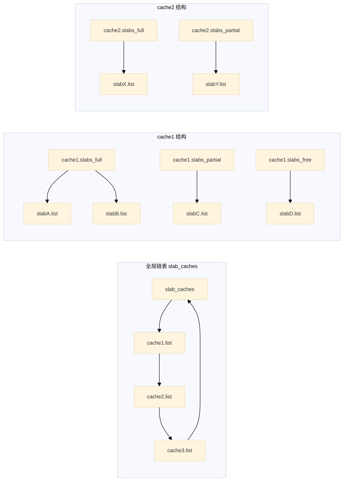
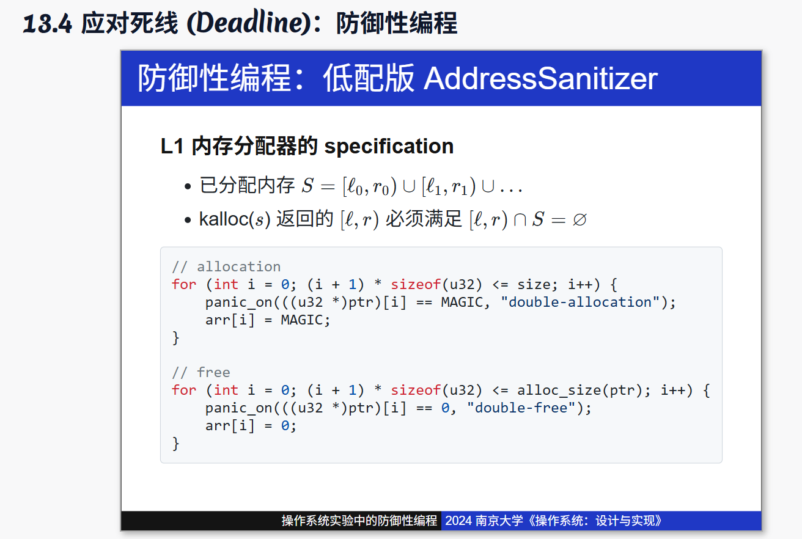

## Implement


### pmm Version1

块分配：

- 请求size <= 阈值（如4KB - sizeof(header_t)）。
- 计算总需要的大小：total = sizeof(header_t) + align_size（对齐后的用户大小）。
- 在空闲链表中寻找足够大的块。
- 分割块，分配后，写入header_t，设置is_page为false，size为align_size。
- 返回header之后的内存地址。

页分配：

- 请求size > 阈值。
- 计算需要的页数：pages = (size + sizeof(header_t) + PAGE_SIZE - 1) / PAGE_SIZE.
- 从页分配器中分配连续的pages页。
- 在页的起始地址写入header_t，设置is_page为true，size为pages。
- 返回header之后的内存地址。

这样，释放时：

- 用户调用kfree(ptr)。
- ptr减去sizeof(header_t)得到header地址。
- 读取header中的is_page和size。
- 如果是页分配，则释放pages页。
- 如果是块分配，则将整个块（header + size）加入块空闲链表。


### 页表元数据初始化

还是指针的问题

靠！！！

原来是动态分配的！！！

一直定义成静态分配的全局数组！！！我在开发os呀！


又一个问题：

> head_pfn: 0x500  head_page: 0x307800 head_page->compound_head: 0x307800 free_lists[10].head: 0x0 ====now order: 10  start_pfn: 0xbd  end_pfn: 0x7cff(31999)  remaining_pages: 0x443  block_size: 0x400(1024)==== head_pfn: 0x100  head_page: 0x301800 head_page->compound_head: 0x301800 free_lists[10].head: 0x0 ====now order: 10  start_pfn: 0xbd  end_pfn: 0x7cff(31999)  remaining_pages: 0x43  block_size: 0x400(1024)==== head_pfn: 0xc0  head_page: 0x301200 head_page->compound_head: 0x301200 free_lists[6].head: 0x3bb860 ====now order: 6  start_pfn: 0xbd  end_pfn: 0x7cff(31999)  remaining_pages: 0x3  block_size: 0x40(64)==== head_pfn: 0xbe  head_page: 0x3011d0 head_page->compound_head: 0x3011d0 free_lists[1].head: 0x3bb820 ====now order: 1  start_pfn: 0xbd  end_pfn: 0x7cff(31999)  remaining_pages: 0x1  block_size: 0x2(2)==== head_pfn: 0xbd  head_page: 0x3011b8 head_page->compound_head: 0x3011b8 free_lists[0].head: 0x3bb800 ====now order: 0  start_pfn: 0xbd  end_pfn: 0x7cff(31999)  remaining_pages: 0x0  block_size: 0x1(1)====  
>
> 奇怪，为什么低阶的空闲块链表都接上了啊，但那时高阶的还是NULL？不可能啊？我还是从高阶到低阶插入的！

这么解决就可以了？？

虽然虚拟机还是神秘重启，但是好歹输出的上面内容对了。


1. **`struct page` 的 `buddy_list` 初始化问题**：

    - 你的 `struct page` 定义中，`buddy_list` 是一个 `struct list_head *` 类型的指针，而不是一个 `struct list_head` 类型的结构体。

    - 你应该将其定义为：

        c复制

        ```c
        struct list_head buddy_list;
        ```

    - 这样可以避免使用指针，直接初始化和使用链表。


发现 `nr_free` 破坏：


调试发现，在刚进 `init_free_block` 的时候，就出现nr_free被破坏了的情况了。

发现在这个 fa0xx 刚好就是存 free_lists 的地址。基本就是自己的free_lists初始化覆盖了一些。


### 空闲链表初始化

> 在 Linux 伙伴系统中，`free_area` 的 `head` 节点确实被设计为一个哨兵节点，其主要作用是避免空指针问题，并简化链表操作。根据搜索结果中的源码分析，以下是关于哨兵节点和链表操作的详细说明：
>
> ### 1. 哨兵节点的作用
>
> - **哨兵节点不存储实际数据**：在 Linux 伙伴系统中，`free_area` 的 `head` 节点是一个哨兵节点，它本身不存储任何页块数据，而是作为链表的起始点。哨兵节点的存在主要是为了简化链表操作，避免空指针的处理问题。
>
> - **链表头节点的初始化**：在初始化 `free_area` 时，每个 `free_area` 的 `head` 节点都会被初始化为一个空的哨兵节点。例如：
>
>     c复制
>
>     ```c
>     INIT_LIST_HEAD(free_area->free_list[migratetype]);
>     ```
>
>     这确保了链表在初始化时是一个空链表。
>
> ### 2. 链表操作的安全性
>
> - **链表操作的正确性**：在 Linux 伙伴系统中，链表操作（如 `list_add`、`list_del`）都是基于哨兵节点进行的。哨兵节点的存在确保了链表操作的安全性，避免了空指针的处理问题。
>
> - **链表头节点的使用**：哨兵节点作为链表的头节点，所有链表操作都以哨兵节点为起点。例如，在分配内存时，从链表中移除一个页块：
>
>     c复制
>
>     ```c
>     page = get_page_from_free_area(area, migratetype);
>     del_page_from_free_list(page, zone, order);
>     ```
>
>     这里的 `get_page_from_free_area` 和 `del_page_from_free_list` 都是基于哨兵节点进行操作的。
>
> ### 3. 实际源码分析
>
> - **哨兵节点的初始化**：在 `free_area` 的初始化过程中，每个 `free_list` 都会被初始化为一个空的哨兵节点：
>
>     ```c
>struct free_area {
>         struct list_head free_list[MIGRATE_TYPES];
>         unsigned long nr_free;
>     };
>     INIT_LIST_HEAD(free_area->free_list[migratetype]);
>     ```
>     
>     这确保了链表在初始化时是一个空链表。
>
> - **链表操作的示例**：在内存分配过程中，从链表中移除一个页块并将其添加到另一个链表中：
>
>     c复制
>
>     ```c
>    page = get_page_from_free_area(area, migratetype);
>     del_page_from_free_list(page, zone, order);
>     add_to_free_list(page, zone, order, migratetype);
>    ```
> 
>     这里的 `get_page_from_free_area`、`del_page_from_free_list` 和 `add_to_free_list` 都是基于哨兵节点进行操作的。
>
> ### 4. 结论
>
> 在 Linux 伙伴系统中，`free_area` 的 `head` 节点确实是一个哨兵节点，其主要作用是避免空指针问题，并简化链表操作。哨兵节点本身不存储任何页块数据，而是作为链表的起始点。链表操作（如 `list_add`、`list_del`）都是基于哨兵节点进行的，确保了链表操作的安全性和正确性。
>
> 如果你的代码中将 `free_area` 的 `head` 节点用作存储实际数据的节点，这与 Linux 伙伴系统的实现方式不一致。建议你将 `head` 节点初始化为一个空的哨兵节点，并确保所有链表操作都基于哨兵节点进行。

无论链表是否为空，都直接将新的页块节点添加到哨兵节点之后。这样，链表的操作就变得一致了。所以，这个地方的条件判断其实可以去掉，直接使用 `list_add_tail` 或 `list_add` 将页块节点添加到哨兵节点的链表中。


### 问题1


block_page传进来是0，导致`block_pfn`、`buddy_pfn`、`buddy_page` 计算错误


### 进一步学习使用哨兵节点

```BASH
inssssssssssssssssssssssssss nr_free: 0
head: 0x3fa030
&head: 0x3fa030
head->prev: 0x3fa030
head->next: 0x3fa030
page->next to page, and order is 0x0
page->next to page, and buddy_list is 0x3fa030
current_order: 3

```

> 刚开始的做法：
>
> **2. 结构体定义的修正**
>
> 原代码中 `struct free_area` 的 `head` 是 `struct list_head*` 类型（指针），这需要手动分配内存给哨兵节点，容易导致错误。
> **修正后的结构体应为：**
>
> ```
> struct free_area {
>     struct list_head head;  // 直接作为哨兵节点（结构体实例，非指针）
>     unsigned long nr_free;
> };
> ```
>
> - 这样，每个 `free_area` 的 `head` 自身就是一个独立的哨兵节点，无需额外分配内存。

实际上还是对内存分配理解的并不深刻。

里面定义一个指针？还要分配内存给他？为什么？这和直接用一个变量的区别在哪？

继续复习理解。

> 来自deepseek：
>
> ### **逐步解释：指针成员 vs 结构体实例成员**
>
> #### **1. 指针成员需要手动分配内存**
> **定义示例：**
> ```c
> struct free_area {
>  struct list_head *head;  // 指针成员
>  unsigned long nr_free;
> };
> ```
> **问题**：  
> 指针 `head` 本身只是一个地址（4/8 字节），它指向的内存区域需要**手动分配**。如果未分配内存直接使用，会导致访问非法内存（野指针）。
>
> **操作示例：**
> ```c
> // 错误用法：未分配内存
> struct free_area area;
> INIT_LIST_HEAD(area.head);  // area.head 是野指针，崩溃！
> 
> // 正确用法：手动分配内存
> struct free_area area;
> area.head = (struct list_head *)kmalloc(sizeof(struct list_head));  // 分配内存
> INIT_LIST_HEAD(area.head);  // 初始化链表头
> ```
>
> ---
>
> #### **2. 结构体实例成员无需额外分配内存**
> **定义示例：**
> ```c
> struct free_area {
>  struct list_head head;  // 结构体实例成员
>  unsigned long nr_free;
> };
> ```
> **优势**：  
> 结构体 `head` 的内存会随着 `free_area` 的分配自动分配，无需手动管理。例如：
>
> ```c
> struct free_area area;  // head 的内存已随 area 分配
> INIT_LIST_HEAD(&area.head);  // 直接使用地址，无需额外分配
> ```
>
> ---
>
> ### **操作系统内核中的内存分配**
>
> #### **1. 内核中的内存分配责任**
> 在操作系统内核中，**所有动态内存分配必须由开发者显式管理**，包括：
> - **静态分配**：全局变量或栈变量（如 `struct free_area free_lists[MAX_ORDER]`）。
> - **动态分配**：通过内核内存分配器（如 `kmalloc`）手动申请。
>
> #### **2. 用户代码的问题分析**
> 原代码中 `free_lists` 的 `head` 定义为指针：
> ```c
> struct free_area {
>     struct list_head *head;  // 指针成员
>     unsigned long nr_free;
> };
> ```
> 在 `init_free_lists` 中未给 `head` 分配内存，直接调用：
> ```c
> INIT_LIST_HEAD(free_lists[i].head);  // 野指针操作！
> ```
> 这会导致内核崩溃，因为 `head` 指向无效地址。
>
> ---
>
> ### **修正后的代码示例**
> #### **1. 结构体定义修正**
> ```c
> struct free_area {
>     struct list_head head;  // 直接作为结构体实例
>     unsigned long nr_free;
> };
> ```
>
> #### **2. 初始化链表头**
> ```c
> static void init_free_lists(...) {
>     for (int i = 0; i < MAX_ORDER; i++) {
>         INIT_LIST_HEAD(&free_lists[i].head);  // 直接操作结构体实例的地址
>         free_lists[i].nr_free = 0;
>     }
> }
> ```
>
> #### **3. 链表操作**
> ```c
> // 添加头页到 free_lists[order] 的链表
> list_add(&head_page->buddy_list, &free_lists[order].head);
> free_lists[order].nr_free++;
> ```
>
> ---
>
> ### **关键总结**
> - **指针成员**：需要手动分配内存（如 `kmalloc`），否则是野指针。
> - **结构体实例成员**：内存随父结构体自动分配，无需额外操作。
> - **内核开发准则**：优先使用结构体实例成员，避免手动内存管理错误。
>
> 通过这种方式，哨兵节点（`free_lists[order].head`）的内存会随 `free_lists` 数组的分配自动存在，无需单独处理，既安全又高效。


> 来自kimi：**为什么结构体中定义指针需要分配内存？**
>
> 在 C 语言中，**指针本身只是一个变量**，它存储的是某个内存地址。如果在结构体中定义了一个指针（例如 `struct list_head *head`），这意味着该指针指向某个内存位置，但**它自身并不包含实际的数据结构**。
>
> 为了使指针能够正确引用一个 `struct list_head` 实例，必须在运行时为其分配内存。例如：
>
> c复制
>
> ```c
> struct free_area my_area;
> my_area.head = malloc(sizeof(struct list_head));  // 动态分配内存
> if (!my_area.head) {
>     // 处理内存分配失败的情况
> }
> INIT_LIST_HEAD(my_area.head); // 初始化链表头
> ```
>
> ### **直接定义结构体实例的优势**
>
> 如果将 `struct list_head` 直接定义为结构体实例（即非指针类型），例如 `struct list_head head;`，则该结构体在内存中已经有了一个分配的区域。无需额外分配内存，初始化也更简单：
>
> c复制
>
> ```c
> struct free_area my_area;
> INIT_LIST_HEAD(&my_area.head);  // 初始化链表头
> ```
>
> ### **应用例子代码**
>
> 以下是一个简单的例子，演示不同定义方式的区别：
>
> #### **1. 使用指针作为链表头**
>
> c复制
>
> ```c
> #include <stdio.h>
> #include <stdlib.h>
> #include <string.h>
> 
> // 定义链表节点
> struct list_head {
>     struct list_head *next, *prev;
> };
> 
> // 定义一个使用指针作为链表头的结构体
> struct free_area_ptr {
>     struct list_head *head;
> };
> 
> // 初始化链表头
> void init_list_head(struct list_head *head) {
>     head->next = head;
>     head->prev = head;
> }
> 
> int main() {
>     struct free_area_ptr area_ptr;
> 
>     // 为链表头分配内存
>     area_ptr.head = (struct list_head *)malloc(sizeof(struct list_head));
>     if (!area_ptr.head) {
>         fprintf(stderr, "Memory allocation failed\n");
>         return 1;
>     }
> 
>     // 初始化链表头
>     init_list_head(area_ptr.head);
> 
>     // 使用链表...
>     // ...
> 
>     // 释放分配的内存
>     free(area_ptr.head);
> 
>     return 0;
> }
> ```
>
> #### **2. 使用结构体实例作为链表头**
>
> c复制
>
> ```c
> #include <stdio.h>
> #include <stdlib.h>
> #include <string.h>
> 
> // 定义链表节点
> struct list_head {
>     struct list_head *next, *prev;
> };
> 
> // 定义一个使用结构体实例作为链表头的结构体
> struct free_area_instance {
>     struct list_head head;
> };
> 
> // 初始化链表头
> void init_list_head(struct list_head *head) {
>     head->next = head;
>     head->prev = head;
> }
> 
> int main() {
>     struct free_area_instance area_instance;
> 
>     // 初始化链表头
>     init_list_head(&area_instance.head);
> 
>     // 使用链表...
>     // ...
> 
>     return 0;
> }
> ```
>
> ### **为什么操作系统内核场景下推荐直接定义结构体实例？**
>
> 在操作系统内核中，内存管理非常关键，因为任何内存分配错误都可能导致整个系统崩溃。使用静态分配的结构体实例（而非指针）有以下优势：
>
> 1. **无需手动分配内存**：
>
>     - 结构体实例的内存由内核静态分配，无需额外调用 `malloc` 或其他内存分配函数。
>
>     - 例如，在内核中，`struct free_area` 可以直接作为全局数组或嵌入到其他结构体中：
>
>         c复制
>
>         ```c
>         struct free_area free_lists[MAX_ORDER] __initdata;  // 静态全局数组
>         ```
>
> 2. **简化内存管理**：
>
>     - 避免因内存分配失败导致的系统崩溃。
>     - 无需担心内核中复杂的内存回收机制。
>
> 3. **减少代码复杂度**：
>
>     - 初始化更简单，无需显式分配和释放内存。例如：
>
>         c复制
>
>         ```c
>         static struct free_area free_lists[MAX_ORDER];
>         for (int i = 0; i < MAX_ORDER; i++) {
>             INIT_LIST_HEAD(&free_lists[i].head);
>         }
>         ```
>
> ### **结论**
>
> 在你的代码中，将 `struct free_area` 的 `head` 定义为 `struct list_head` 而非指针，不仅可以简化内存管理，还可避免因指针使用不当导致的错误。以下是修正后的 `struct free_area` 定义：
>
> c复制
>
> ```c
> struct free_area {
>     struct list_head head;  // 直接定义为结构体实例
>     unsigned long nr_free;
> };
> ```
>
> 这样，在初始化时只需调用 `INIT_LIST_HEAD` 即可：
>
> c复制
>
> ```c
> INIT_LIST_HEAD(&free_lists[i].head);
> ```
>
> 建议按照上述方式修改代码，以避免潜在的内存管理和链表操作错误。


### 一些参考

我们在讲解 “并发数据结构” 时讲解了 kalloc/free 的算法和实现。你应该阅读：

- 教科书第 29 章 (并发数据结构)，学习如何对数据结构进行并发控制；
- 教科书第 17 章 (空闲空间管理)，学习如何管理物理内存；
- 互联网上的其他资料。如果你希望了解现代 malloc 实现，你可以参考来自两个代码巨头的设计：Google 的 [tcmalloc](https://google.github.io/tcmalloc/) 和 Microsoft 的 [mimalloc](https://microsoft.github.io/mimalloc)。


```bash
4340 nowxxxxxxxxxxxxfree_lists[7].nr_free: 0
4341 head: 0x3fa0a8
4342 &head: 0x3fa0a8
4343 head->prev: 0x3fa0a8                                                                                                       
4344 head->next: 0x3fa0a8
4345 page->next to page, and order is 3145728
4346 page->next to page, and buddy_list is 0x3fa0a8
4347 free_lists[10].nr_free: 30
4348 free_lists[9].nr_free: 1
4349 free_lists[8].nr_free: 1
4350 free_lists[7].nr_free: 0
4351 free_lists[6].nr_free: 0
4352 free_lists[5].nr_free: 0
4353 free_lists[4].nr_free: 0
4354 free_lists[3].nr_free: 0
4355 free_lists[2].nr_free: 0
4356 free_lists[1].nr_free: 0
4357 free_lists[0].nr_free: 0
4358 
4359 nowxxxxxxxxxxxxfree_lists[8].nr_free: 1
4360 head: 0x300000
4361 &head: 0x3fa0c0
4362 head->prev: 0x300000
4363 head->next: 0x300000
4364 page->next to page, and order is 8
4365 page->next to page, and buddy_list is 0x3fa0c0
4366 AM Panic: addr should not less than start_used @ /home/jai/os-workbench/kernel/src/buddy.c:53  

```

直接改用实际的物理内存块地址来计算了，之后再慢慢调页的版本。


### spinlock

#### implement

这里直接使用老师在课上讲的 xv6 实现 [互斥 (2) (内核中的自旋锁、Read-Copy-Update、互斥锁和 futex)](https://www.bilibili.com/video/BV1d2421A7uh?spm_id_from=333.788.videopod.sections&vd_source=ecc99d78ae961113010161a48a475a35)


Xv6中实现了自旋锁(Spinlock)用于内核临界区访问的同步和互斥。自旋锁最大的特征是当进程拿不到锁时会进入无限循环，直到拿到锁退出循环。Xv6使用100ms一次的时钟中断和Round-Robin调度算法来避免陷入自旋锁的进程一直无限循环下去。显然，自旋锁看上去效率很低，我们很容易想到更加高效的基于等待队列的方法，让等待进程陷入阻塞而不是无限循环。然而，Xv6允许同时运行多个CPU核，多核CPU上的等待队列实现相当复杂，因此使用自旋锁是相对比较简单且能正确执行的实现方案。


进行测试：

> - `os->init()` 完成操作系统所有部分的初始化。`os->init()` 运行在系统启动后的第一个处理器上，中断处于关闭状态；此时系统中的其他处理器尚未被启动。因此在 `os->init` 的实现中，你完全不必考虑数据竞争等多处理器上的问题。
> - `os->run()` 是所有处理器的入口，在初始化完成后，框架代码调用 `_mpe_init(os->run)` 启动所有处理器执行。框架代码中，`os->run` 只是打印 Hello World 之后就开始死循环；你之后可以在 `os->run` 中添加各种测试代码。
>
> 所以就想象成是你的 `os->run()` 就是 `threads.h` 里创建的一个线程，仅此而已！


#### 实际使用

实际使用：

- 实际系统中比较常见的做法，而不是直接用 `LOCK_INIT`：将锁绑定到对象（对象初始化的时候就初始化这把锁），因为在真实的系统中绝大数内容都是动态分配的。

    ```C
    lock_t lk1 = LOCK_INIT();
    lock_t lk2 = LOCK_INIT();
    lock_t lk3 = LOCK_INIT();
    
    struct some_object {
        lock_t lock;
        int data;
    };
    
    void object_init(struct some_object *obj) {
        obj->lock = LOCK_INIT();
        obj->data = 100;
    }
    
    void create_object() {
        struct some_object *obj = malloc(sizeof(struct some_object));
        assert(obj);
        object_init(obj);
    
        lock(&obj->lock);
        unlock(&obj->lock);
    
        free(obj);
    }
    
    ```


#### 锁层级优化

首先考虑这个 `spin_lock` 的是被验证过的，是正确的，其次就是如何使用。

首先使用一把大锁保平安，先考虑正确性，这个还是比较容易验证的，在基本测试框架下还是能过。

但是无论如何这样的做法都是不太够的，所以考虑为每一阶的空闲链表维护单独的锁，但是这个时候就要仔细考虑加锁的位置和 lock ordering。

1. **先从全局锁开始**：  
    - 确保内存分配和释放的逻辑正确。
    - 使用全局锁可以快速实现互斥，但性能较差。
2. **过渡到基于 `free_area` 的锁**：
    - 一旦全局锁逻辑正确，可以逐步细化锁的粒度。
    - 基于 `free_area` 的锁可以减少并发冲突，提升性能。

> 额外，printf也会导致并发的问题，同样也是把spin_lock的实现复制一份到klib上。


> 顺便一说，在实际做的的时候，真的是确实体会到 RCU 真的是一个天才的想法，我自己写的时候，对于 free_lists 等共享变量真的是读多写少。


### 额外并发拓展

Linux中：

```c
#define local_irq_save(flags)				\
	do {						\
		raw_local_irq_save(flags);		\
		if (!raw_irqs_disabled_flags(flags))	\
			trace_hardirqs_off();		\
	} while (0)

#define local_irq_restore(flags)			\
	do {						\
		if (!raw_irqs_disabled_flags(flags))	\
			trace_hardirqs_on();		\
		raw_local_irq_restore(flags);		\
	} while (0)
```


**线程本地怎么理解？**


### slab实现

几个核心关键的点：`cache`、`object`、`slab`。

> ### Slab 分配器核心机制与 API 流程解析
>
> ---
>
> #### **核心概念与层级关系**
>
> **==TODO==**
>
>
> 1. **Cache（缓存池）**  
>
>     - **作用**：管理特定大小的内存对象（如 32B、64B）  
>
>     - **关键结构**：`struct kmem_cache`  
>
>         ```c
>         struct kmem_cache {
>             char *name;                // 缓存名称（如 "size-32"）
>             size_t obj_size;           // 对象大小（对齐后）
>             struct list_head slabs_full;    // 已满的 Slab
>             struct list_head slabs_partial; // 部分使用的 Slab
>             struct list_head slabs_free;     // 完全空闲的 Slab
>             struct list_head list;      // 全局缓存链表节点
>         };
>         ```
>
> 2. **Slab（内存板）**  
>
>     - **作用**：单页（PAGESIZE）内存块，分割为多个相同大小的对象  
>
>     - **关键结构**：`struct slab`  
>
>         ```c
>         struct slab {
>             struct kmem_cache *cache;   // 所属缓存池
>             int nr_used;               // 已使用对象数
>             int nr_total;              // 总对象数
>             void *free_list;            // 空闲对象链表头
>             struct list_head list;      // 链表节点（关联到 Cache 的 slabs_xxx）
>         };
>         ```
>
> 3. **Object（内存对象）**  
>
>     - **作用**：用户实际分配的最小内存单元  
>     - **内存布局**：每个 Slab 页首存放 `struct slab` 元数据，后续空间分割为对象  
>
>     ```c
>     // Slab 内存布局示例：
>     +------------------+
>     | struct slab      | // 元数据（占用 32 字节）
>     +------------------+
>     | Object 0         | // 对齐后的对象
>     +------------------+
>     | Object 1         |
>     +------------------+
>     | ...              |
>     ```
>
> ---
>
> #### **API 交互流程**
>
> ##### **1. 缓存创建与销毁**
>
> ```mermaid
> sequenceDiagram
>     participant User
>     participant Slab
>     User->>Slab: kmem_cache_create("size-32",32,8)
>     Slab->>Slab: __kmem_cache_create() // 创建 kmem_cache 结构
>     Slab->>Slab: init_cache_slab() // 分配第一个 Slab 页
>     Slab->>User: 返回 kmem_cache 指针
>     User->>Slab: kmem_cache_destroy(cache)
>     Slab->>Slab: 释放所有关联 Slab 页
>     Slab->>Slab: 从全局链表移除缓存
> ```
>
> - **核心函数**：  
>     - `kmem_cache_create()`：创建缓存池，初始化第一个 Slab  
>     - `kmem_cache_destroy()`：销毁缓存池，释放所有 Slab 页  
>
> ##### **2. 对象分配**
>
> ```mermaid
> sequenceDiagram
>     participant User
>     participant Slab
>     User->>Slab: kmem_cache_alloc(cache)
>     Slab->>Slab: 检查 slabs_partial → 有空闲则分配
>     Slab->>Slab: 若无空闲，检查 slabs_free → 分配新 Slab
>     Slab->>Slab: 更新 Slab 状态（partial/full）
>     Slab->>User: 返回 Object 地址
> ```
>
> - **分配策略**：  
>     1. 优先从 `slabs_partial` 分配（部分使用的 Slab）  
>     2. 若无可用，从 `slabs_free` 分配新 Slab  
>     3. 若内存不足，返回 `NULL`  
>
> ##### **3. 对象释放**
>
> ```mermaid
> sequenceDiagram
>     participant User
>     participant Slab
>     User->>Slab: kmem_cache_free(cache, obj)
>     Slab->>Slab: 根据 Object 地址找到所属 Slab
>     Slab->>Slab: 将 Object 加入 Slab 的 free_list
>     Slab->>Slab: 更新 Slab 状态（free/partial/full）
> ```
>
> - **状态迁移**：  
>     - Slab 从 `full` → `partial`：当释放一个对象时  
>     - Slab 从 `partial` → `free`：当所有对象释放时  
>
> ---
>
> #### **启动阶段（Boot）的特殊处理**
>
> ```c
> static struct kmem_cache boot_kmem_cache = { ... }; // 静态预分配的初始缓存
> static char boot_store[...]; // 静态内存区域存放初始 kmem_cache 结构
> 
> // 启动时创建管理缓存的缓存
> create_boot_cache(&kmem_cache, "kmem_cache", sizeof(struct kmem_cache), ...);
> ```
>
> - **核心挑战**：  
>     1. **自举（Bootstrapping）**：在内存分配器完全初始化前，需要静态预分配初始缓存结构  
>     2. **内存来源**：使用 `boot_store` 静态数组代替动态分配  
>     3. **状态管理**：`slab_state` 标记初始化阶段（DOWN → PARTIAL → UP）  
>
> - **流程**：  
>     1. 使用静态内存创建 `boot_kmem_cache`  
>     2. 通过 `create_boot_cache()` 创建管理其他缓存的专用缓存  
>     3. 初始化常用大小缓存池（如 8B、16B）  
>
> ---
>
> #### **面试潜在问题与拓展方向**
>
> ##### **1. 并发安全**
>
> - **问题**：多核环境下如何保证 Slab 操作的原子性？  
> - **参考思路**：  
>     - 使用自旋锁保护 `kmem_cache` 结构  
>     - Per-CPU Slab 缓存减少锁竞争（类似 Linux 的 CPU 本地缓存）  
>
> ##### **2. 碎片优化**
>
> - **问题**：如何减少内存碎片？  
> - **参考思路**：  
>     - 合并相邻空闲 Slab 页（需记录伙伴系统信息）  
>     - 动态调整缓存大小策略（类似 SLUB 的队列设计）  
>
> ##### **3. 性能调优**
>
> - **问题**：如何快速分配高频小对象？  
> - **参考思路**：  
>     - 预分配热门大小的缓存池  
>     - 使用硬件加速（如 TLB 优化 Slab 查找）  
>
> ##### **4. 调试支持**
>
> - **问题**：如何检测内存泄漏或越界访问？  
> - **参考思路**：  
>     - 在 Object 前后添加 Red Zone（保护区域）  
>     - 记录分配栈信息（需扩展 `kmem_cache` 结构）  
>
> ---
>
> ### **总结**
>
> - **核心关系**：`Cache → Slab → Object` 三级结构，通过预分配和状态管理实现高效内存分配  
> - **设计亮点**：启动阶段自举、Slab 状态迁移、空闲链表快速分配  
> - **优化方向**：并发控制、碎片管理、调试工具增强





### 关于 `Fastpath` 和 `Slowpath`

具体怎么区分出来的。


### 测试

了解一些实现好的一些框架。自己了解到 CUnit 和 CHECK。

> 1. **CUnit 和 CHECK 测试框架的区别和优势**
>
>     CUnit 和 CHECK 是两种常用的 C 语言单元测试框架，它们都旨在帮助开发者编写和执行单元测试，但它们在功能、设计和使用场景上有一些区别。以下是它们的主要区别和各自的优势：
>
> 2. **CUnit**
>
>     - **特点**
>         - **轻量级**：CUnit 是一个轻量级的单元测试框架，不依赖于复杂的库，适合小型项目和嵌入式系统。
>         - **易集成**：可以轻松集成到任何 C 项目中，不需要修改太多项目配置。
>         - **跨平台**：支持多种操作系统，包括 Windows、Linux 和 macOS。
>         - **丰富的断言接口**：提供多种断言宏，用于验证测试结果。
>         - **测试组织结构**：支持测试套件和测试用例的组织管理，允许开发者按逻辑分组测试。
>         - **测试结果报告**：支持多种报告格式，包括 XML，方便与持续集成工具集成。
>     - **优势**
>         - **简单易用**：CUnit 的 API 设计简洁直观，易于学习和使用，适合初学者和小型项目。
>         - **轻量级**：不依赖于复杂的库，适合资源受限的嵌入式系统。
>         - **跨平台支持**：可以在多种操作系统上运行，具有良好的可移植性。
>         - **丰富的断言机制**：提供多种断言宏，方便验证测试结果。
>         - **易于集成**：可以轻松集成到构建系统（如 Makefile、CMake）中，支持自动化测试和持续集成。
>
> 3. **CHECK**
>
>     - **特点**
>         - **支持复杂测试**：CHECK 提供了更复杂的测试组织结构，支持多线程测试和测试隔离。
>         - **灵活的测试组织**：支持测试套件和测试用例的灵活组织，适合复杂的测试场景。
>         - **多线程支持**：CHECK 支持多线程测试，可以用于测试并发操作的代码。
>         - **内存泄漏检测**：CHECK 提供了内存泄漏检测功能，帮助开发者发现和修复内存问题。
>     - **优势**
>         - **功能丰富**：CHECK 提供了更丰富的功能，如多线程测试、内存泄漏检测等，适合复杂的测试场景。
>         - **灵活的测试组织**：支持更灵活的测试组织方式，适合需要复杂测试结构的项目。
>         - **多线程支持**：支持多线程测试，可以用于测试并发操作的代码。
>         - **内存泄漏检测**：提供内存泄漏检测功能，帮助开发者发现和修复内存问题。
>
> 4. **CUnit 和 CHECK 的主要区别**
>
>     | 特点             | CUnit                            | CHECK                      |
>     | ---------------- | -------------------------------- | -------------------------- |
>     | **功能复杂度**   | 功能较为基础，适合简单的测试需求 | 功能丰富，支持复杂测试场景 |
>     | **多线程支持**   | 不支持多线程测试                 | 支持多线程测试             |
>     | **内存泄漏检测** | 不提供内存泄漏检测功能           | 提供内存泄漏检测功能       |
>     | **测试组织**     | 支持基本的测试套件和测试用例组织 | 支持更灵活的测试组织方式   |
>     | **适用场景**     | 适合小型项目和嵌入式系统         | 适合需要复杂测试的项目     |
>
> 5. **选择建议**
>
>     - **CUnit**：
>         - 适合小型项目和嵌入式系统。
>         - 适合初学者和需要简单易用的测试框架的开发者。
>         - 适合资源受限的环境。
>     - **CHECK**：
>         - 适合需要复杂测试的项目。
>         - 适合需要多线程测试和内存泄漏检测的场景。
>         - 适合需要灵活测试组织的项目。
>
> 6. **总结**
>
>     CUnit 和 CHECK 都是优秀的 C 语言单元测试框架，选择哪个框架取决于项目的具体需求和测试场景。CUnit 更适合小型项目和嵌入式系统，而 CHECK 更适合需要复杂测试的项目。

但是，鉴于还得熟悉相关 API 和 想尝试自己写个简单的试试，所以，这时候考虑自己做。

直接自己做了一部分，还是有bug的。

```C
cat ../include/test/test-framework.h 
#ifndef __TEST_FRAMEWORK_H
#define __TEST_FRAMEWORK_H

#include <utils.h>

#define TEST(test_name) static void test_name()

#define CHECK(cond, ...) do { \
    if (!(cond)) { \
        printf(ANSI_FG_RED "Test FAIL!" ANSI_NONE \
               "@ %s:%d | %s | ", __FILE__, __LINE__, #cond); \
        printf(__VA_ARGS__); \
        printf("\n"); \
        panic(0); \
    } } while (0)

#define RUN_TEST(test_fn) do { \
    printf(ANSI_FG_CYAN "[ RUN      ]" ANSI_NONE " %s\n", #test_fn); \
    test_fn(); \
    printf(ANSI_FG_GREEN "[   PASSED ]" ANSI_NONE " %s\n", #test_fn); \
} while(0)

// 测试套件分类宏
#define TEST_SUITE(name, color, ...) do { \
    printf("\n%s[==========]" ANSI_NONE " %s\n", color, name); \
    void (*tests[])(void) = { __VA_ARGS__ }; \
    for (unsigned i = 0; i < sizeof(tests)/sizeof(tests[0]); i++) { \
        RUN_TEST(tests[i]); \
    } \
    printf("%s[==========]" ANSI_NONE " %s Completed\n", color, name); \
} while(0)

// 具体分类的快捷宏
#define UNIT_TEST_SUITE(...)    TEST_SUITE("Unit Tests",   ANSI_FG_CYAN, ##__VA_ARGS__)
#define INTEG_TEST_SUITE(...)   TEST_SUITE("Integration",  ANSI_FG_CYAN, ##__VA_ARGS__)
#define STRESS_TEST_SUITE(...)  TEST_SUITE("Stress Tests", ANSI_FG_CYAN, ##__VA_ARGS__)
#define PERF_TEST_SUITE(...)    TEST_SUITE("Performance",  ANSI_FG_CYAN, ##__VA_ARGS__)
#define RAND_TEST_SUITE(...)    TEST_SUITE("Random Ops",   ANSI_FG_CYAN, ##__VA_ARGS__)

#endif

```

正准备改bug的时候（比如test[i] 函数名的显示）。

但是！在2025.03.04 老师又发布了一个自己实现的测试框架！仅仅两百多行，质量写得比我的好得多！

为什么不直接用起来呢！


### TODO 



可以加入实现？


### TODO2

关于不同内存模型的 `struct  page` 

实际上L1实现的是：`FLATMEM` (`!CONFIG_SPARSEMEM`)：

假设物理内存从0开始连续且没有大空洞。`struct page mem_map[MAX_NR_PAGES]` 是一个全局的、连续的数组。转换极其简单：

1. 物理内存是连续的（没有大的空洞）。

    ```c
    #define pages_base ((struct page *)(heap.start))
    ```

    所有物理页帧的元数据 (`struct page`) 存储在**连续的内存区域**（从 `heap.start` 开始），这是 FLATMEM 最核心的特征。

2. 使用一个全局的 `struct page` 数组（`mem_map`）来管理所有物理页帧，数组的每个元素对应一个物理页。

3. 页帧号（PFN）和`struct page`之间的转换是线性的：`page = &mem_map[pfn]`，`pfn = page - mem_map`。

    PFN 和 `struct page*` 的转换是简单的**指针算术运算**：

    ```C
    #define page_to_pfn(page) ((unsigned long)((page) - pages_base))
    #define pfn_to_page(pfn) (&pages_base[(pfn)])
    ```

    - `page_to_pfn`: 直接用 `page` 指针减去数组基地址得到索引 (PFN)
    - `pfn_to_page`: 直接用 PFN 作为下标访问数组元素
        这正是 FLATMEM 的典型实现方式（对比 `SPARSEMEM` 需要复杂的内存节查询）。

4. FLATMEM 的优缺点在我的实现中（LLM总结）

    | **优点**     | **你的实现体现**         |
    | :----------- | :----------------------- |
    | ✅ 转换速度快 | 宏展开后就是单条加减指令 |
    | ✅ 实现简单   | 核心逻辑仅需 ~200 行代码 |
    | ✅ 低开销     | 无额外节管理结构         |

    | **缺点**       | **你的实现体现**                             |
    | :------------- | :------------------------------------------- |
    | ❌ 内存必须连续 | 依赖 `heap.start` 到 `heap.end` 的连续空间   |
    | ❌ 不支持空洞   | 所有 PFN 0~TOTAL_PAGES-1 必须有效            |
    | ❌ 大内存浪费   | 元数据区 (`struct page` 数组) 需预占连续空间 |


这在小型嵌入式系统（物理内存小且连续）上很高效，但不适合大内存或有空洞的系统。

但作为一个学习内容是非常不错的！

这里找到了一篇博客：[MM之伙伴系统的初始化](https://blog.csdn.net/m0_51717456/article/details/126712555)

尝试让LLM给出另一种内存模型的分析，见下方（TODO学学习）


### 页（`struct page *`）与页帧（PFN）的转换 & 不同内存模型

> 代码见上面博客

你提供的Linux内核代码片段完美展示了在`CONFIG_SPARSEMEM`（稀疏内存）模型下如何实现 `struct page *` 和 PFN 之间的转换。这种转换方式确实依赖于内存模型。

核心思想是：**`struct page` 数组（`mem_map`）在物理内存中不一定是连续的！** 尤其是在具有大量物理内存或物理内存存在较大空洞（NUMA、热插拔）的系统上。

- **`struct mem_section`：** 这是`SPARSEMEM`模型的核心数据结构。它将物理内存划分为多个**内存节（Memory Section）**。每个节管理一段连续的物理地址范围（大小为 `1UL << PFN_SECTION_SHIFT` 个页帧）。

- **`mem_section` 数组：** 一个全局的（可能是多级）数组，索引是节号（`section_nr`），值是 `struct mem_section` 结构。

- **`section_mem_map`：** `struct mem_section` 中的一个关键成员。它有两个作用：

    1. **指向该节对应的 `struct page` 数组的起始位置。** 这是它的主要功能。
    2. **存储标志位：** 利用指针的低位（因为地址对齐，低位通常为0）存储该节的状态标志（如 `SECTION_MARKED_PRESENT`）。`SECTION_MAP_MASK` 就是用来屏蔽掉这些标志位，获取真正的 `struct page*` 地址的掩码。

    - 注释 `section[i].section_mem_map == mem_map's address - start_pfn;` 是早期实现的一种表述，强调了 `section_mem_map` 存储的值是相对于该节起始PFN的偏移编码（包含指针和标志）。现代实现如你提供的代码，`__section_mem_map_addr` 通过 `map &= SECTION_MAP_MASK;` 提取出纯粹的 `struct page*` 起始地址。

#### 转换宏分析

- **`__page_to_pfn(pg)`：**

    1. `const struct page *__pg = (pg);` - 获取目标 `struct page` 指针。
    2. `int __sec = page_to_section(__pg);` - 找出这个 `page` 属于哪个内存节（`section_nr`）。这通常通过 `__pg` 指针本身计算得出（因为 `mem_map` 是按节组织的数组），或者 `struct page` 结构里直接存储了节号（较新内核）。
    3. `__nr_to_section(__sec)` - 根据节号 `__sec` 在全局 `mem_section` 数组中找到对应的 `struct mem_section *__sec_struct`。
    4. `__section_mem_map_addr(__sec_struct)` - 从 `__sec_struct->section_mem_map` 中提取出指向该节 `struct page` 数组起始位置的指针 `struct page *section_mem_map`。
    5. `(__pg - section_mem_map)` - 计算目标 `struct page *__pg` **相对于它所在节的 `struct page` 数组起始位置** 的偏移量（以 `struct page` 个数为单位）。
    6. `(unsigned long)(...)` - 这个偏移量本质上就是**该页帧在其所属内存节内部的局部页帧索引（Local PFN within the section）**。
    7. **最终PFN = `(section_nr << PFN_SECTION_SHIFT) + local_pfn_offset`**。这个宏直接返回的是 `local_pfn_offset`，而 `section_nr` 是通过 `__sec` 隐含知道的。完整的PFN需要结合 `__sec` 和这个偏移计算（通常在调用这个宏的上下文或相关函数里完成）。

- **`__pfn_to_page(pfn)`：**

    1. `unsigned long __pfn = (pfn);` - 获取目标物理页帧号。
    2. `struct mem_section *__sec = __pfn_to_section(__pfn);` - 根据PFN计算出它属于哪个节（`section_nr = pfn >> PFN_SECTION_SHIFT`），然后通过 `__nr_to_section(section_nr)` 找到对应的 `struct mem_section *__sec`。
    3. `__section_mem_map_addr(__sec)` - 从 `__sec->section_mem_map` 中提取出指向该节 `struct page` 数组起始位置的指针 `struct page *section_mem_map`。
    4. `section_mem_map + __pfn` - **这里的关键是 `__pfn` 是全局PFN。** 但是 `section_mem_map` 指向的是**该节起始PFN**对应的 `struct page`。因此 `section_mem_map + __pfn` 计算出来的地址是错的！

    - **修正（代码中的精妙之处）：** 仔细看 `__pfn_to_section(pfn)` 内部调用 `__nr_to_section(pfn_to_section_nr(pfn))`。`pfn_to_section_nr(pfn)` 计算 `section_nr = pfn >> PFN_SECTION_SHIFT`。**`__pfn` 作为参数传递给 `__pfn_to_section` 时，它的值就是原始的全局PFN。** 在 `__pfn_to_page` 的最后一步 `section_mem_map + __pfn`，`__pfn` 仍然是全局PFN。
    - **为什么是对的？** 因为 `__section_mem_map_addr(__sec)` 返回的 `section_mem_map` **已经被特殊编码过！** 回顾 `section_mem_map` 的设定：`section[i].section_mem_map = base_mem_map - section_start_pfn;`（注释思想）或现代实现中的等效逻辑。这意味着 `section_mem_map` 指针的值**已经预先减去了该节的起始PFN (`section_start_pfn = section_nr << PFN_SECTION_SHIFT`)**。
    - **因此：** `section_mem_map + __pfn = (base_mem_map - section_start_pfn) + __pfn = base_mem_map + (__pfn - section_start_pfn)`。而 `(__pfn - section_start_pfn)` 正好是该页帧在节内的局部偏移。`base_mem_map + local_offset` 就精确地指向了管理该物理页帧的 `struct page`。

#### 不同架构（RISC-V, ARM）和 `CONFIG_SPARSEMEM`

- **`CONFIG_SPARSEMEM`：** 这就是你提供的代码所处理的内存模型。它的设计目标就是高效地处理物理内存存在空洞的大型系统。
    - **核心机制：** 通过 `mem_section` 数组将物理内存划分为节。只有实际存在的物理内存区域对应的节才会被分配 `struct page` 数组（`mem_map`）。空洞区域对应的节可以是NULL或标记为不存在。
    - **转换方式：** 如上所述，依赖 `mem_section` 结构和 `section_mem_map` 的编码。转换需要先找到PFN或`struct page`对应的节，然后在节内进行偏移计算。`CONFIG_SPARSEMEM_EXTREME` 是为了节省 `mem_section` 数组本身的内存消耗，将其变为动态分配的两级数组。
    - **PFN_SECTION_SHIFT：** 定义节的大小（每个节包含 `2^PFN_SECTION_SHIFT` 个页帧）。例如值为26（`2^26 = 64MB` per section）或27（`128MB`）。这个值的选择是空间（`mem_section`数组大小）和时间（查找节的速度）的权衡。
- **RISC-V：** RISC-V Linux 内核同样使用 `CONFIG_SPARSEMEM` 作为默认或主要支持的内存模型，尤其是对于支持大量内存的RV64系统。转换逻辑与你展示的代码**完全相同**。架构相关的部分主要体现在：
    - **`PAGE_SHIFT`：** 定义页大小（如12表示4KB）。
    - **页表格式：** Sv39, Sv48等，定义虚拟/物理地址位数和页表遍历方式（影响虚拟地址到物理地址/PFN的转换，由硬件MMU完成）。
    - **`MAX_PHYSMEM_BITS`：** 定义系统支持的最大物理地址位数（如56），这会影响到 `mem_section` 数组需要覆盖的地址范围大小，从而影响 `PFN_SECTION_SHIFT` 的选择和 `SECTION_NR_ROOT` 的计算。
    - **物理内存布局探测：** 通过设备树（DT）或ACPI获取物理内存的起始地址和大小，以及存在的空洞。这决定了哪些 `mem_section` 需要初始化。
- **ARM (ARM64 / AArch64)：** ARM64 Linux 内核也广泛使用 `CONFIG_SPARSEMEM`，特别是对于服务器或具有复杂内存拓扑（NUMA，热插拔）的设备。转换逻辑**同样基于**你展示的 `__page_to_pfn` 和 `__pfn_to_page` 宏。架构相关的差异点与RISC-V类似：
    - **`PAGE_SHIFT`：** 通常为12（4KB），也支持16（64KB）、14（16KB）配置以及使用Contiguous/Translation Table (CONT/TT) 位支持的大页。
    - **页表格式：** LPAE（Long-descriptor format），定义4级页表遍历。
    - **`MAX_PHYSMEM_BITS`：** 常见配置如48。影响 `SPARSEMEM` 的具体参数。
    - **物理内存探测：** 通过设备树（DT）或ACPI获取。ARM架构历史上内存布局差异较大（板级差异），`SPARSEMEM` 的灵活性非常适合。
- **其他模型 (对比)：**
    - **`FLATMEM` (`!CONFIG_SPARSEMEM`)：** 假设物理内存从0开始连续且没有大空洞。`struct page mem_map[MAX_NR_PAGES]` 是一个全局的、连续的数组。转换极其简单：
        - `pfn = page - mem_map`
        - `page = &mem_map[pfn]`
            这在小型嵌入式系统（物理内存小且连续）上很高效，但不适合大内存或有空洞的系统。
    - **`SPARSEMEM_VMEMMAP`：** `SPARSEMEM` 的一种优化变体。它建立一个**虚拟映射的连续空间（vmemmap）**，使得所有物理页帧对应的 `struct page` 结构在这个虚拟地址空间内是连续的。这样 `struct page *` 和 PFN 的转换就退化为类似 `FLATMEM` 的简单线性计算：
        - `page = vmemmap + pfn * sizeof(struct page)`
        - `pfn = (page - vmemmap) / sizeof(struct page)`
            这大大提升了转换效率（通常只需一条指令），但需要硬件MMU支持足够大的虚拟地址空间来映射整个 `vmemmap` 区域。这是现代大型系统（x86_64, ARM64, RISC-V）首选的优化模式。


## misc

### 模块化设计

`os` 是一个操作系统的 “模块”，可以看成是我们用 C 实现的面向对象编程，能增加代码的可读性。随着实验的进展，你会发现模块机制清晰地勾勒出了操作系统中各个部分以及它们之间的交互。

其实看到了很多次这种写法了，并没有系统学习过用起来。

```C
#define MODULE(mod) \
  typedef struct mod_##mod##_t mod_##mod##_t; \
  extern mod_##mod##_t *mod; \
  struct mod_##mod##_t

#define MODULE_DEF(mod) \
  extern mod_##mod##_t __##mod##_obj; \
  mod_##mod##_t *mod = &__##mod##_obj; \
  mod_##mod##_t __##mod##_obj
```

使用 `MODULE` 声明一个模块，用 `MODULE_DEF` 实际定义它。比如 `os`：

```C
MODULE(os) {
    void (*init)();
    void (*run)();                                                                                                        
};
MODULE_DEF(os) = {                                                                                                        
    .init = os_init,
    .run  = os_run,
};              

typedef struct mod_os_t mod_os_t;
extern mod_os_t *os;
struct mod_os_t {
  void (*init)();
  void (*run)();
};

...

extern mod_os_t __os_obj;
mod_os_t *os = &__os_obj;
mod_os_t __os_obj = {
  .init = os_init,
  .run = os_run,
};
```


### APIC 

> Advanced Programmable Interrupt Controller

其实这里学习过 RISC-V 的 PLIC 和 CLINT，类比过来也是很好理解的。

直接 AI 生成，解析 `abstract-machine/am/src/x86/qemu/ioe.c` 里 APIC 部分的代码。

> 注意还有个叫 ACPI 的东西

#### basic concept

- **本地APIC（LAPIC）**
    - **功能**：每个CPU核心都有一个本地APIC，用于处理本地中断（如定时器中断、IPIs等）。
    - **特点**：
        - 可以发送和接收中断。
        - 支持多种中断类型（如固定、低优先级、周期性等）。
        - 可以通过内存映射的方式访问其寄存器。
- **I/O APIC**
    - **功能**：用于管理外部设备的中断，将外部中断信号转换为APIC中断。
    - **特点**：
        - 支持多个中断源。
        - 可以将中断分配给特定的CPU核心。
        - 通过内存映射访问其寄存器。


#### parse APIC 模拟

- ==**宏定义**==

    ```C
    #define ID      (0x0020/4)   // ID
    #define VER     (0x0030/4)   // Version
    #define TPR     (0x0080/4)   // Task Priority
    #define EOI     (0x00B0/4)   // EOI
    #define SVR     (0x00F0/4)   // Spurious Interrupt Vector
    #define ENABLE     0x00000100   // Unit Enable
    #define ESR     (0x0280/4)   // Error Status
    #define ICRLO   (0x0300/4)   // Interrupt Command
    #define ICRHI   (0x0310/4)   // Interrupt Command [63:32]
    #define TIMER   (0x0320/4)   // Local Vector Table 0 (TIMER)
    #define PCINT   (0x0340/4)   // Performance Counter LVT
    #define LINT0   (0x0350/4)   // Local Vector Table 1 (LINT0)
    #define LINT1   (0x0360/4)   // Local Vector Table 2 (LINT1)
    #define ERROR   (0x0370/4)   // Local Vector Table 3 (ERROR)
    #define TICR    (0x0380/4)   // Timer Initial Count
    #define TCCR    (0x0390/4)   // Timer Current Count
    #define TDCR    (0x03E0/4)   // Timer Divide Configuration
    ```

    - 这些宏定义了LAPIC寄存器的地址偏移量和一些常用的标志位。
    - 例如，`ID` 是LAPIC的ID寄存器，`VER` 是版本寄存器，`TPR` 是任务优先级寄存器。

---

- ==**I/O APIC寄存器**==

    ```C
    #define IOAPIC_ADDR  0xFEC00000   // Default physical address of IO APIC
    #define REG_ID     0x00  // Register index: ID
    #define REG_VER    0x01  // Register index: version
    #define REG_TABLE  0x10  // Redirection table base
    ```

    - `IOAPIC_ADDR` 是I/O APIC的默认物理地址。
    - `REG_ID`、`REG_VER` 和 `REG_TABLE` 是I/O APIC的寄存器索引。

----

- **==中断标志==**

    ```c
    #define INT_DISABLED   0x00010000  // Interrupt disabled
    #define INT_LEVEL      0x00008000  // Level-triggered (vs edge-)
    #define INT_ACTIVELOW  0x00002000  // Active low (vs high)
    #define INT_LOGICAL    0x00000800  // Destination is CPU id (vs APIC ID)
    ```

----

- **==全局变量==**

    ```c
    volatile unsigned int *__am_lapic = NULL;  // Initialized in mp.c
    struct IOAPIC {
        uint32_t reg, pad[3], data;
    } __attribute__((packed));
    typedef struct IOAPIC IOAPIC;
    
    static volatile IOAPIC *ioapic;
    ```

    - `__am_lapic` 是指向当前CPU的LAPIC寄存器的指针。
    - `ioapic` 是指向I/O APIC的指针。

----

- ==**LAPIC写入函数**==

    ```C
    static void lapicw(int index, int value) {
      __am_lapic[index] = value;
      __am_lapic[ID];
    }
    ```

    - 这是一个辅助函数，用于写入LAPIC寄存器。
    - `__am_lapic[ID]` 是一个内存屏障，确保写操作完成。

----

- ==**2.6 初始化LAPIC**==

    ```C
    void __am_percpu_initlapic(void) {
      lapicw(SVR, ENABLE | (T_IRQ0 + IRQ_SPURIOUS));
      lapicw(TDCR, X1);
      lapicw(TIMER, PERIODIC | (T_IRQ0 + IRQ_TIMER));
      lapicw(TICR, 10000000);
      lapicw(LINT0, MASKED);
      lapicw(LINT1, MASKED);
      if (((__am_lapic[VER]>>16) & 0xFF) >= 4)
        lapicw(PCINT, MASKED);
      lapicw(ERROR, T_IRQ0 + IRQ_ERROR);
      lapicw(ESR, 0);
      lapicw(ESR, 0);
      lapicw(EOI, 0);
      lapicw(ICRHI, 0);
      lapicw(ICRLO, BCAST | INIT | LEVEL);
      while(__am_lapic[ICRLO] & DELIVS) ;
      lapicw(TPR, 0);
    }
    ```

    - **功能**：初始化当前CPU的LAPIC。
        1. 启用LAPIC并设置中断向量。
        2. 配置定时器为周期性模式。
        3. 设置定时器初始计数值。
        4. 禁用LINT0和LINT1中断。
        5. 检查APIC版本并配置性能计数器。
        6. 配置错误中断。
        7. 清除错误状态寄存器。
        8. 发送INIT IPI（初始化中断）到所有CPU。
        9. 清除任务优先级寄存器。

----

- **==发送EOI==**

    ```c
    void __am_lapic_eoi(void) {
      if (__am_lapic)
        lapicw(EOI, 0);
    }
    ```

    - **功能**：发送EOI（End of Interrupt）信号，通知APIC中断处理完成。

----

- **==启动辅助处理器（AP）==**

    ```C
    void __am_lapic_bootap(uint32_t apicid, void *addr) {
      int i;
      uint16_t *wrv;
      outb(0x70, 0xF);
      outb(0x71, 0x0A);
      wrv = (unsigned short*)((0x40<<4 | 0x67));
      wrv[0] = 0;
      wrv[1] = (uintptr_t)addr >> 4;
    
      lapicw(ICRHI, apicid<<24);
      lapicw(ICRLO, INIT | LEVEL | ASSERT);
      lapicw(ICRLO, INIT | LEVEL);
    
      for (i = 0; i < 2; i++){
        lapicw(ICRHI, apicid<<24);
        lapicw(ICRLO, STARTUP | ((uintptr_t)addr>>12));
      }
    }
    ```

    - **功能**：启动一个辅助处理器（AP）。
        1. 设置启动地址到内存中。
        2. 发送INIT IPI到目标AP。
        3. 发送STARTUP IPI到目标AP。

---

- ==**I/O APIC读写函数**==

    ```c
    static unsigned int ioapicread(int reg) {
      ioapic->reg = reg;
      return ioapic->data;
    }
    
    static void ioapicwrite(int reg, unsigned int data) {
      ioapic->reg = reg;
      ioapic->data = data;
    }
    ```

    **功能**：读写I/O APIC寄存器

---

- ==**初始化I/O APIC**==

    ```c
    void __am_ioapic_init(void) {
      int i, maxintr;
    
      ioapic = (volatile IOAPIC*)IOAPIC_ADDR;
      maxintr = (ioapicread(REG_VER) >> 16) & 0xFF;
    
      for (i = 0; i <= maxintr; i++){
        ioapicwrite(REG_TABLE+2*i, INT_DISABLED | (T_IRQ0 + i));
        ioapicwrite(REG_TABLE+2*i+1, 0);
      }
    }
    ```

    - **功能**：初始化I/O APIC。
        1. 将I/O APIC的基地址映射到`ioapic`指针。
        2. 读取I/O APIC的版本寄存器，获取最大中断号`maxintr`。
        3. 遍历所有中断源，将每个中断源的重定向表条目初始化为禁用状态，并设置默认的中断向量。

----

- **==启用I/O APIC中断==**

    ```c
    void __am_ioapic_enable(int irq, int cpunum) {
      ioapicwrite(REG_TABLE+2*irq, T_IRQ0 + irq);
      ioapicwrite(REG_TABLE+2*irq+1, cpunum << 24);
    }
    ```

    - **功能**：启用指定的I/O APIC中断，并将其分配给指定的CPU核心。
        1. 设置中断源的重定向表条目，启用中断并设置中断向量。
        2. 设置中断的目标CPU核心编号。


### 多核

#### 启动流程

> 借着框架代码分析看看，熟悉之后再去看看一些固件怎么写的。

[How a multi-core system boot up | Priyanka Singh 发布的此话题相关的动态 | 领英](https://www.linkedin.com/posts/prisin6_osconcepts-operatingsystem-activity-7122091775938183169-fnVk?trk=public_profile_like_view)

[SMPBoot < LinuxBootLoader < Foswiki](http://www.linux-arm.org/LinuxBootLoader/SMPBoot)

[Linux: 多核 CPU 启动流程简析_linux 多核启动-CSDN博客](https://blog.csdn.net/JiMoKuangXiangQu/article/details/129769896)

参考文档：[MultiProcessor Specification](https://pdos.csail.mit.edu/6.828/2011/readings/ia32/MPspec.pdf)


`abstract-machine/am/src/x86/x86.h`

> 这些结构体的定义和设计是基于 **MultiProcessor Specification (MP Spec)** 文档（版本 1.4）。该文档由 Intel 提供，用于定义多处理器系统（Multiprocessor Systems）的硬件和软件接口标准。以下是每个结构体的设计目的和字段的作用：
>
> 1. **`TSS64` (Task State Segment)**
>
>     `TSS64` 是 x86_64 架构下的任务状态段（Task State Segment）结构体，用于保存和恢复任务上下文。它在多任务操作系统中用于保存每个任务的寄存器状态。字段解析：
>
>     - **`uint32_t rsv`**: 保留字段，通常用于对齐数据结构。
>     - **`uint64_t rsp0, rsp1, rsp2`**: 分别对应不同特权级（Ring 0, Ring 1, Ring 2）下的栈指针（Stack Pointer）。这些字段允许在不同特权级之间切换时恢复正确的栈指针。
>     - **`uint32_t padding[19]`**: 填充字段，用于确保结构体的大小和布局符合系统要求。
>
> 2. **`MPConf` (MP Configuration Table Header)**
>
>     `MPConf` 是 MP 配置表的头部结构体，用于描述多处理器系统的硬件配置信息。它提供了系统中处理器、总线、中断控制器等组件的基本信息。字段解析：
>
>     - **`uint8_t signature[4]`**: 签名字段，值为 `"PCMP"`，用于标识这是一个 MP 配置表。
>     - **`uint16_t length`**: 配置表的总长度（以字节为单位）。
>     - **`uint8_t version`**: MP 规范的版本号（例如 14 表示版本 1.4）。
>     - **`uint8_t checksum`**: 校验和，用于验证配置表的完整性。
>     - **`uint8_t product[20]`**: 产品 ID 字符串，用于标识系统硬件。
>     - **`uint32_t oemtable`**: OEM 表的物理地址。
>     - **`uint16_t oemlength`**: OEM 表的长度。
>     - **`uint16_t entry`**: 配置表中条目的数量。
>     - **`uint32_t lapicaddr`**: 本地 APIC 的基地址。
>     - **`uint16_t xlength`**: 扩展表的长度。
>     - **`uint8_t xchecksum`**: 扩展表的校验和。
>     - **`uint8_t reserved`**: 保留字段。
>
> 3. **`MPDesc` (MP Configuration Descriptor)**
>
>     `MPDesc` 是 MP 配置描述符结构体，用于指向 MP 配置表的物理地址，并提供一些系统配置信息。字段解析：
>
>     - **`int magic`**: 魔数，用于标识结构体的有效性。
>     - **`uint32_t conf`**: MP 配置表的物理地址。
>     - **`uint8_t length`**: 描述符的长度。
>     - **`uint8_t specrev`**: MP 规范的版本号（例如 14 表示版本 1.4）。
>     - **`uint8_t checksum`**: 描述符的校验和。
>     - **`uint8_t type`**: 配置类型（例如处理器表、总线表等）。
>     - **`uint8_t imcrp`**: IMCR（Interrupt Mode Configuration Register）标志。
>     - **`uint8_t reserved[3]`**: 保留字段。
>
> 4. **`BootRecord`**
>
>     `BootRecord` 是引导记录结构体，用于在系统启动时存储一些关键信息，例如跳转指令和处理器状态。字段解析：
>
>     - **`uint32_t jmp_code`**: 跳转指令的机器码，用于在系统启动时跳转到指定的地址。
>     - **`int32_t is_ap`**: 标志字段，指示当前处理器是否是应用程序处理器（AP）。
>
> 5. 设计来源
>
>     这些结构体的设计是基于 **MultiProcessor Specification (MP Spec)** 文档（版本 1.4）。该文档详细定义了多处理器系统的硬件和软件接口标准，包括：
>
>     - **硬件配置**：如何配置处理器、中断控制器（APIC）、内存和 I/O 设备。
>     - **中断模式**：如何在多处理器系统中处理中断（例如 PIC 模式、虚拟线模式、对称 I/O 模式）。
>     - **启动过程**：如何初始化系统和启动操作系统。
>     - **配置表**：如何通过 MP 配置表向操作系统传递硬件信息。
>
>     这些结构体的设计目的是为了确保多处理器系统能够正确地初始化、配置和运行操作系统，同时保持与现有硬件和软件的兼容性。

实际上，这部分框架的内容感觉就是在写一个固件了，就是要启动一个os。

> 1. **代码与硬件紧密结合**
>     - **中断处理和内存管理**：代码中大量涉及 `APIC`（高级可编程中断控制器）、中断描述符表（IDT）和内存管理单元（MMU）等硬件组件的初始化和配置。例如，`cte.c` 文件中对中断描述符表的设置和中断处理函数的定义，以及 `vme.c` 文件中对内存页表的管理，这些都直接与硬件架构紧密相关，是系统启动和运行的基础。
>     - **多处理器支持**：`mpe.c` 文件中的多处理器初始化代码，涉及到 AP（应用处理器）的启动和同步，以及对 `lapic`（本地 APIC）的配置，这些都是为了实现多处理器系统的协同工作，属于硬件层面的初始化逻辑。
> 2. **系统启动的关键环节**
>     - **BIOS/UEFI 功能**：这些代码的功能在很多方面类似于 BIOS 或 UEFI 的某些部分。例如，BIOS 在系统启动时会初始化硬件、检测设备，并为操作系统提供一个启动环境。同样，代码中的启动逻辑（如 `_start_c` 函数）和硬件初始化代码（如 `__am_lapic_init` 和 `__am_ioapic_init`），为操作系统的运行准备了基础环境。
>     - **引导加载程序**：代码中的一些启动函数（如 `_start_c` 和 `call_main`）与引导加载程序的功能类似。引导加载程序负责从非易失性存储器（如磁盘或闪存）加载操作系统内核到内存中并启动它，而这些代码中的启动逻辑与引导加载程序的某些功能有相似之处。
> 3. **实际项目中的应用**
>     - **服务器和嵌入式系统**：在实际的服务器和嵌入式系统项目中，类似的固件代码用于初始化硬件、配置中断和内存管理，并为操作系统提供一个稳定的运行环境。例如，在高性能服务器中，多处理器支持和中断管理是系统高效运行的关键，需要通过固件来实现。
>     - **嵌入式控制器**：对于需要嵌入式控制器的设备（如工业控制系统、网络设备等），这些固件代码可以用于实现低功耗模式、实时任务调度和硬件资源管理等功能。
> 4. **代码结构和模块化设计**
>     - **模块化功能**：代码按照功能模块划分，如 `cte.c` 负责中断处理，`ioe.c` 负责硬件输入输出设备的初始化，`mpe.c` 负责多处理器管理等。这种模块化设计使得代码易于维护和更新，适合固件开发的迭代过程。
>     - **可移植性**：代码中包含了一些与架构相关的代码（如 `#ifdef __x86_64__` 和 `#else`），这表明代码是为特定硬件架构设计的，具有一定的可移植性。固件通常需要针对特定的硬件平台进行定制和优化，这种设计思路符合固件开发的特点。
> 5. **代码的运行阶段和目的**
>     - **早期初始化阶段**：这些代码运行在系统的早期启动阶段，通常在操作系统内核加载之前。它们的目的是为操作系统提供一个稳定的硬件环境，包括初始化硬件设备、设置中断和内存管理机制等。
>     - **与操作系统的关系**：代码为操作系统提供了一个抽象层，隐藏了硬件的复杂性。操作系统内核可以通过调用固件提供的接口来访问硬件资源，而无需直接处理底层硬件细节。
>


#### 调度 TODO？

说到这个是因为在上面进行多处理器测试的时候发现输出了多次的 `xxx test passed`，就日常使用电脑的体验来说这应该是不对的吧？为什么输出了多次呢？是因为调度？目前没有实现多核调度，将任务分配个多核核心，导致都从同样的初始状态执行同样的任务？

还有问题，如果这样子思考，那不就肯定会导致死锁？？等等，每个核都有自己的register、本地中断，还有共享的memory。也就是每个核都有对这个数据的副本？？

需要学习。[从利用多核加速QEMU的CPU模拟谈起 - Ubuntu中文论坛](https://forum.ubuntu.com.cn/viewtopic.php?t=465485)

要不先把带哦都那门课上了？


- **一些小坑**

    刚开始的时候，一直只能启动一个核心，折腾了一下一步步探到 `scripts/platform/qemu.mk` 里发现的 `qemu` 里的配置不太对：

    `-smp "$(smp),cores=$(smp),sockets=1"`，改成 `-smp "$(smp),cores=1,sockets=$(smp)"` 即可。

    之后又发现，原来讲义已经提醒，对 `qemu` 不是很熟悉。

    [qemu命令行参数小结](https://www.cnblogs.com/zhuohq/articles/15354743.html)

    [QEMU User Documentation](https://www.qemu.org/docs/master/system/qemu-manpage.html)


### C 学习

写自己的头文件的时候，把自己写的放在标准库之后。

不然如果自己写的有问题，那连带着标准库中的各种报错。

就比如自己头文件中的函数声明没加分号，导致之后所有头文件声明的函数全部无效，进一步体现为所有用到的函数全部未定义。


