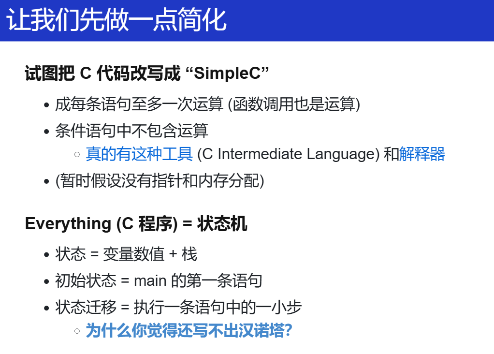
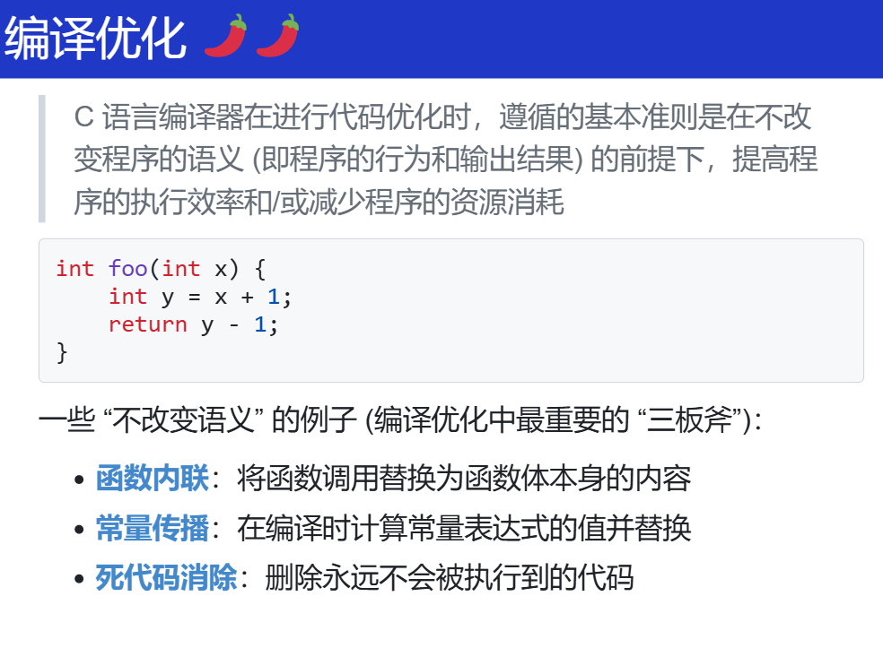
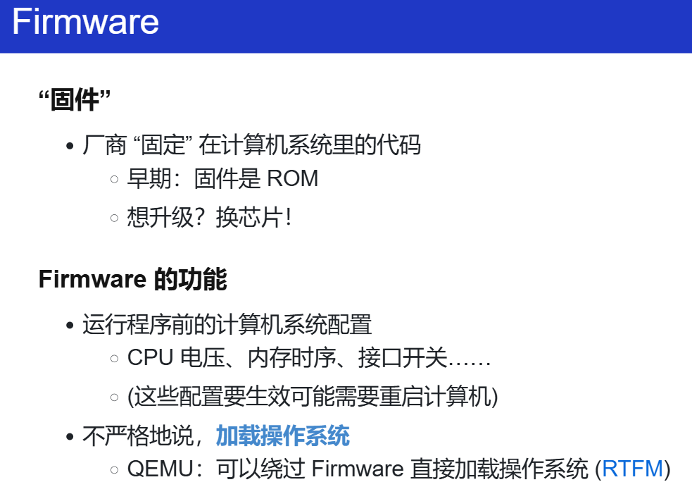

**2024 Nanjing University, Operating System: Design and Implementation**

Mini Labs & OS Labs

The individual learning implementation version, without Online Judge, only local test

- Course Homepage: https://jyywiki.cn/OS/2024/
- Lesson Video: https://www.bilibili.com/video/BV1Xm411f7CM


## 概述

- (Why): 为什么要学操作系统？
- (What): 到底什么是操作系统？
- (How): 怎么学操作系统？


学习的目的是为了什么？革命？


为了更快更好地服务应用程序？


## 应用视角的操作系统

怎么问出问题？

学习最重要的内容就是 提问

一切都是状态机。

### 构建最小可执行文件 （程序 = 状态机）

> **==DEMO==**
>
> **最小可执行文件**：为了理解操作系统上的程序，我们的目标是构造一个能直接被操作系统加载且打印 Hello World 的指令序列。如果你能想到写一段汇编代码实现一个功能，那么大语言模型就能帮你做到：
>
> > 如何仅用 x86-64 汇编调用 Linux 系统调用，输出 Hello World 并退出？
>
> AI 不仅能给出代码，而且还能帮助你解决遇到的疑惑和困难。在你熟悉这些概念之后，syscall(2) 和 syscalls(2) 就成为了非常棒 (而且真正 friendly) 的参考。

> 能不能快速地写出这个promot？确实是很重要。指明环境 `x86-64` 汇编 Linux 系统调用？

程序自己是无法退出的，必须借助操作系统。（系统调用）


```assembly
#include <sys/syscall.h>

// The x86-64 system call Application Binary Interface (ABI):
//     System call number: RAX
//     Arguments: RDI, RSI, RDX, RCX, R8, R9
//     Return value: RAX
// See also: syscall(2) syscalls(2)

#define syscall3(id, a1, a2, a3) \
    movq $SYS_##id, %rax; \
    movq $a1, %rdi; \
    movq $a2, %rsi; \
    movq $a3, %rdx; \
    syscall

#define syscall2(id, a1, a2)  syscall3(id, a1, a2, 0)
#define syscall1(id, a1)  syscall2(id, a1, 0)

.globl _start
_start:
    syscall3(write, 1, addr1, addr2 - addr1)
    syscall1(exit, 99)

addr1:
    .ascii "\033[01;31mHello, OS World\033[0m\n"
addr2:

//minimal.S
```


### 操作系统上的应用程序(toybox-0.1.0 / strace)

`vscode`、浏览器、编译器...

> ==**DEMO**==
>
> **toybox-0.1.0**：这是早前版本的 toybox，包含一些 “最小” 系统所需的工具。现在，Android 内置了 toybox。当你打开手机的 “开发者模式” 后，通过 adb shell 连接到手机，其中的命令行工具就是 toybox。


所以我能像改 `minimal.S` 编译出的二进制文件一样去改它们的二进制文件，所以方向 --> 逆向工程。

关键在于有一个良好的工具：`hexedit`、`trace`...


> 打开程序的执行：Trace (追踪)
>
> > In general, trace refers to the process of following *anything* from the beginning to the end. For example, the `traceroute` command follows each of the network hops as your computer connects to another computer.
>
> **==DEMO==**
>
> **strace** (system call trace) 是《操作系统》课程中一个非常重要的命令行工具，帮助我们 “观测” 应用程序和操作系统的边界。
>
> 实际上，**任何程序的执行就是状态机在计算机上的运行**，因此 “用合适的方式观测状态机执行” 就是我们理解程序的根本方法。调试器、trace、profiler 提供了不同侧面的理解手段，这三个工具将会在课程中反复出现。
>
> 如果你感到 strace 的结果不那么友善，用适当的工具处理它就非常重要了。课堂上我们展示了用命令行工具进行处理的 “传统方法”：
>
> ```text
> $ strace ls |& grep -e read -e write
> ```
>
> **对新手来说，感到困惑是非常正常的——但我们总是可以把不熟悉的东西用熟悉的东西类比 (正是 AI 擅长的)。今天你只要学会提问，就几乎总是能得到满意的答案。**


`eg.`

1. 所有的窗口把自己想要画什么（数据），发送给一个窗口管理器的进程（NWM）。

2. 窗口管理器作为操作系统的一部分，直接管理屏幕设备。

    > 像 PA 中的 `fb_write` 功能（`framebuffer`）。
    >
    > 然后进一步使用硬件资源（VGA），最终画出图案，这就让我们体会到了软件和硬件，还有操作系统中是怎么相互配合来实现想要的功能。


### C 语言与汇编

#### C 解释器

C 语言也是一个状态机。

像 GDB 一样，调汇编一样。

c source code ------> C 语言单步解释

理解高级语言程序

> - 成每条语句至多一次运算 (函数调用也是运算)
> - 条件语句中不包含运算
>     - [真的有这种工具](https://cil-project.github.io/cil/) (C Intermediate Language) 和[解释器](https://gitlab.com/zsaleeba/picoc)
> - (暂时假设没有指针和内存分配)

Simple C 项目确实可以试试。



这里，我通过汇编理解状态机。在汇编层面，状态机的当前状态看作是程序的当前状态或环境，状态迁移则对应于执行一条指令，导致状态（即程序的当前状态：寄存器、memory）发生变化。

而一条指令基本能做到的功能（这里暂时不讨论更加复杂的那些atom、SIMD等东西）：

1. **数据传输**：在寄存器之间或寄存器和内存之间移动数据。
2. **算术运算**：对数值进行加、减、乘、除等操作。
3. **逻辑运算**：执行逻辑AND、OR、NOT、XOR等操作。
4. **比较**：比较两个值，并根据比较结果设置处理器的状态标志（如零标志、进位标志等）。
5. **跳转**：根据条件跳转到程序的不同部分执行，这在状态机中相当于根据事件切换到不同的状态。
6. **调用和返回**：执行函数调用和从函数返回，这在状态机中可以看作是进入一个子状态机和从子状态机返回。
7. **输入/输出**：与外部设备进行交互。

但是漏了 PC ？！他也是寄存器！还是没理解。


#### 递归和非递归(Hanoi)

不知道啥是汉诺塔，GPT：

> 汉诺塔问题是一个经典的递归问题。问题描述如下：
>
> 有三根柱子（通常称为“起始柱子”、“目标柱子”和“辅助柱子”）和一组不同大小的盘子，这些盘子最初都叠放在起始柱子上，并且盘子是按照大小顺序叠放的，即最大的盘子在最下面，最小的盘子在最上面。目标是将所有的盘子移动到目标柱子上，同时在移动过程中遵守以下规则：
>
> 1. 每次只能移动一个盘子。
> 2. 盘子只能从顶部移动到另一根柱子的顶部。
> 3. 在三根柱子中的任意时刻，任何盘子下面都不能有比它小的盘子。
>
> 汉诺塔问题的解决方案是递归的。递归的基本思想是：
>
> 1. 先解决较小的问题：首先，将上面的`n-1`个盘子从起始柱子借助目标柱子移动到辅助柱子。
> 2. 解决当前问题：然后，将最大的盘子直接从起始柱子移动到目标柱子。
> 3. 最后再解决剩余的问题：最后，将那`n-1`个盘子从辅助柱子借助起始柱子移动到目标柱子。

> ==**DEMO**==
>
> **汉诺塔**：汉诺塔是递归和分治的经典问题，而同学们也曾经在理解这个程序的时候遇到困难。遇到困难是正常的：C/C++ 中的 “函数” 和数学的函数很不一样，例如我们可以把 Fibonacci 数列的递归写成：
>
> ```c++
> // 也可以 return f(n - 2) + f(n - 1);
> return f(n - 1) + f(n - 2);
> ```
>
> 或是任意调换函数调用的次序，但汉诺塔不行。
>
> **不行的根本原因在于汉诺塔中的 `printf` 会带来全局的副作用。但 C/C++ 遵循 “顺序执行” 的原则，函数的执行有 “先后” (不像数学的函数，先后是无关的)，按照不同顺序调用会导致程序输出不同的结果。而在具体实现时，每个栈帧中存放的 “当前执行的位置” (PC) 实现了顺序执行。**

> 一些思考的问题：函数调用为什么会导致栈溢出？为什么要叫这个名字？
>
> 每次函数调用都会创建一个新的栈帧，并且每个栈帧都占用一定的栈空间。
>
> 如果是递归调用，并且递归调用的次数太多，那么这些栈帧会累积在栈上，消耗越来越多的空间。
>
> 当递归调用层次深到耗尽了所有可用的栈空间时，如果还想要继续使用栈来存储数据就会造成**栈溢出**。这通常发生在没有足够的空间来创建新的栈帧时。
>
> 所以，这里递归指的是整个系统分配的栈空间不够用，而不是一个栈桢的空间不够用了。

```C
#include <stdio.h>
#include <assert.h>

int hanoi(int n, char from, char to, char via);

int main() {
    int n = 3;
    char from = 'A';
    char to = 'B';
    char via = 'C';

    int step_count = hanoi(n, from, to, via);
    printf("\nHanoi(%d, %c, %c, %c) = %d\n",
        n, from, to, via, step_count);
}
#include <stdio.h>
#include <assert.h>

struct Frame {
    // Each frame has a program counter to keep track its next
    // to-be-executed statement.
    int pc;

    // The internal state of the frame. This state includes
    // both arguments and local variables (if any).
    //
    // Arguments:
    int n;
    char from, to, via;

    // Local variables:
    int c1, c2;
};

typedef struct Frame Frame;

int hanoi(int n, char from, char to, char via) {
    Frame stk[64];

    for (int i = 0; i < 64; i++) {
        printf("stk[%d] addr: %p\n", i, &stk[i]);
    }

    Frame *top = stk - 1; // stk[-1]
    printf("stk[-1]: %p\n", &stk[-1]);
    printf("top point addr: %p\n", top);

    // Function call: push a new frame (PC=0) onto the stack
    #define call(...) ({ *(++top) = (Frame){.pc = 0, __VA_ARGS__}; })
    
    // Function return: pop the top-most frame
    #define ret(val) ({ top--; retval = (val); })


    // The last function-return's value. It is not obvious
    // that we only need one retval.
    int retval = 0;

    // The initial call to the recursive function
    call(n, from, to, via);

    while (1) {
        // Fetch the top-most frame.
        Frame *f = top;
        if (top < stk) {
            // No top-most frame any more; we're done.
            break;
        }

        // Jumps may change this default next pc.
        int next_pc = f->pc + 1;

        // Single step execution.

        // Extract the parameters from the current frame. (It's
        // generally a bad idea to reuse variable names in
        // practice; but we did it here for readability.)
        int n = f->n, from = f->from, to = f->to, via = f->via;

        printf("f->pc:%d  n:%d\n", f->pc, n);
        switch (f->pc) {
            case 0:
                if (n == 1) {
                    printf("%c -> %c\n", from, to);
                    ret(1);
                }
                break;
            case 1: call(n - 1, from, via, to); break;
            case 2: f->c1 = retval; break;
            case 3: call(1, from, to, via); break;
            case 4: call(n - 1, via, to, from); break;
            case 5: f->c2 = retval; break;
            case 6: ret(f->c1 + f->c2 + 1); break;
            default: assert(0);
        }

        f->pc = next_pc;
    }

    return retval;
}

// after gcc -E:
int hanoi(int n, char from, char to, char via) {
    Frame stk[64];
    Frame *top = stk - 1;
# 35 "hanoi-nr.c"
    int retval = 0;


    ({ *(++top) = (Frame){.pc = 0, n, from, to, via}; });

    while (1) {

        Frame *f = top;
        if (top < stk) {

            break;
        }

        int next_pc = f->pc + 1;

        int n = f->n, from = f->from, to = f->to, via = f->via;

        printf("f->pc:%d  n:%d\n", f->pc, n);
        switch (f->pc) {
            case 0:
                if (n == 1) {
                    printf("%c -> %c\n", from, to);
                    ({ top--; retval = (1); });
                }
                break;
            case 1: ({ *(++top) = (Frame){.pc = 0, n - 1, from, via, to}; }); break;
            case 2: f->c1 = retval; break;
            case 3: ({ *(++top) = (Frame){.pc = 0, 1, from, to, via}; }); break;
            case 4: ({ *(++top) = (Frame){.pc = 0, n - 1, via, to, from}; }); break;
            case 5: f->c2 = retval; break;
            case 6: ({ top--; retval = (f->c1 + f->c2 + 1); }); break;
            default: 
# 71 "hanoi-nr.c" 3 4
                    ((void) sizeof ((
# 71 "hanoi-nr.c"
                    0
# 71 "hanoi-nr.c" 3 4
                    ) ? 1 : 0), __extension__ ({ if (
# 71 "hanoi-nr.c"
                    0
# 71 "hanoi-nr.c" 3 4
                    ) ; else __assert_fail (
# 71 "hanoi-nr.c"
                    "0"
# 71 "hanoi-nr.c" 3 4
                    , "hanoi-nr.c", 71, __extension__ __PRETTY_FUNCTION__); }))
# 71 "hanoi-nr.c"
                             ;
        }
        f->pc = next_pc;
    }
    return retval;
}

```

```c
//result:
stk[0] addr: 0x7ffed250a720
stk[1] addr: 0x7ffed250a734
......
stk[62] addr: 0x7ffed250abf8
stk[63] addr: 0x7ffed250ac0c
stk[-1]: 0x7ffed250a70c
top point addr: 0x7ffed250a70c
f->pc:0  n:3
f->pc:1  n:3
f->pc:0  n:2
f->pc:1  n:2
f->pc:0  n:1
A -> B
f->pc:2  n:2
f->pc:3  n:2
f->pc:0  n:1
A -> C
f->pc:4  n:2
f->pc:0  n:1
B -> C
f->pc:5  n:2
f->pc:6  n:2
f->pc:2  n:3
f->pc:3  n:3
f->pc:0  n:1
A -> B
f->pc:4  n:3
f->pc:0  n:2
f->pc:1  n:2
f->pc:0  n:1
C -> A
f->pc:2  n:2
f->pc:3  n:2
f->pc:0  n:1
C -> B
f->pc:4  n:2
f->pc:0  n:1
A -> B
f->pc:5  n:2
f->pc:6  n:2
f->pc:5  n:3
f->pc:6  n:3

Hanoi(3, A, B, C) = 7
```

上述通过栈帧模拟的函数调用（从状态机的视角来理解），每一次函数调用模拟为：创建新栈帧（里面有各种局部变量，但有一个最重要的就是每一个栈帧有一个自己的PC）。

而状态的迁移就是执行每个栈帧里面的 PC 处的语句（行号），

去到要执行下一个函数的地方(注意每次循环都会重新获取top，即本次栈帧，然后获取栈帧中的数据)。

`call` 和 `ret` 跳转到新栈帧、返回到旧栈帧。

这里通过一些变量的地址，可以初步构建出定义的 `Frame stk[64]`、 `top` 在实际的栈中的位置。如下图（借助上面的结果）：

```C
+----------------+ <-- rbp  (high address)
|     c1,c2      |
| n from to via  | stk[63]
| 	    pc       |
+----------------+
|     c1,c2      |
| n from to via  | stk[62]
| 	    pc       |
+----------------+ <-- fun1的栈帧起始地址
|     c1,c2      |
| n from to via  | stk[61]
| 	    pc       |
+----------------+
		...
        ...		   stk[..]
		...
+----------------+ <-- fun3的栈帧起始地址
|     c1,c2      |
| n from to via  | stk[1]
| 	    pc       |
+----------------+
|     c1,c2      |
| n from to via  | stk[0]
| 	    pc       |
+----------------+
|     c1,c2      |
| n from to via  | stk[-1] <-- top pointed to this at the beginning
| 	    pc       |
+----------------+
		...
        ...		   other variables(next_pc, retval...)
		...
+----------------+
| 			     | top variable
+----------------+ <-- rsp  (low address)

```


### 编译器与编译优化

#### 编译器

**将一种状态机（由栈帧组成）变成另一种状态机（由指令、寄存器、内存（栈帧依旧是有的，存在内存上）），编译器的工作就是做这个工作的。**（这真是一个很奇特的视角！！）


也就是我之前的那种理解：将C状态机和汇编状态机连接起来。这个时候，那对于 Simple C 怎么实现：


- 运算

    ```assembly
    x = y + z; -->
    
    rax = load(y)
    rbx = load(z)
    rax += rbx
    store(x, rax)
    ```

    将一条高级语言翻译成汇编指令

- 分支/循环

    跳转指令，很熟悉了，可以再看 PA4 那部分实现 `trap.S` 的汇编代码，跳转指令为真，跳到label 那里，还是继续执行接着跳转指令后面的的部分。

- 函数调用

    关键在于**栈帧的实现**，需要有一个寄存器存放当前栈帧的位置，那就专门留一个寄存器（SP）给栈。

> 这里老师的提醒了：PA 和 Simple C 分别从两个视角学习计算机。
>
> PA：硬件一步步到上层应用。即：计算机系统/硬件
>
> Simple C 编译器： (C -> Simple C) -> assembly。即语言层面：高级语言到汇编语言（可以直接理解为机器能看懂的语言）


#### 编译优化




## 硬件视角的操作系统

### 计算机系统的状态机模型

这里还可以看看 [计算机系统的状态机模型 - 第六期“一生一芯”计划](https://www.bilibili.com/video/BV1oN411Y7FK/?spm_id_from=333.788&vd_source=ecc99d78ae961113010161a48a475a35)


### 固件：接管计算机系统的第一个程序

- 程序员如何控制计算机系统？

    - 仅有 RESET 状态是不够的
    - 答案：计算机系统会和 System Programmers 达成约定

- 还是那个思想：把程序放在memory的合适的位置，CPU 就会执行它

    人与计算机的第一个约定：固定好 reset 后 PC 指向的地址。

    reset 后一小段运行的程序代码，固件。



- 究竟是谁将硬盘上的代码搬到内存上的？又是通过什么指令做到的？

    firmware（看看 CBIOS的源码，怎么搬？）

    `rep insl (%dx)`

    repeat insl/outl，自循环，每次搬两个byte。

    PA 中应该很熟悉了，port io，通过in/out与外界设备进行IO口通信。

- 为什么硬盘会有分区这个东西？

    [Disk partitioning - Wikipedia](https://en.wikipedia.org/wiki/Disk_partitioning)

    一种技术，类似分段、分页。

    > Partitioning allows the use of different filesystems to be installed for different kinds of files. Separating user data from system data can prevent the system partition from becoming full and rendering the system unusable. Partitioning can also make backing up easier. A disadvantage is that it can be difficult to properly size partitions, resulting in having one partition with too much free space and another nearly totally allocated.

    > 更多探索：
    >
    > [挂载（mount）深入理解 - 江召伟 - 博客园 (cnblogs.com)](https://www.cnblogs.com/jiangzhaowei/p/11843026.html)
    >
    > [Linux磁盘管理详解-mount挂载 - “人生苦短” - 博客园 (cnblogs.com)](https://www.cnblogs.com/hester/p/12385990.html)

    


早期固件还有个名字叫 BIOS（legacy BIOS）？

BIOS 甚至于运行之后还能再被调用？（像系统调用？）

> 如果能用汇编重写BIOS的行为，那就能造自己的计算机？虽然驱动得自己写？


为什么现在进化成 [UEFI (Unified Extensible Firmware Interface)](https://www.zhihu.com/question/21672895)

- 就是硬件变多了

    提供更丰富的支持 (例如设备驱动程序)：指纹锁、山寨网卡上的 PXE 网络启动、USB 蓝牙转接器连接的蓝牙键盘……


### 观察和调试 legacy BIOS

自己构建一个启动区（硬盘中的0盘0道1扇区，第一个扇区的 512 字节的末尾两个字节为 0x55AA，BIOS 即认为其就是一个启动区）

```makefile
minimal.img: Makefile
	( echo "eb fe 11 22 33 44" | xxd -r -p; \
	  cat /dev/zero | head -c 504; \
	  echo "55 aa" | xxd -r -p \
	) > minimal.img

```

> `eb fe: jmp `
>
> ```assembly
> (qemu) x $eip
> 0000000000007c00: 0x2211feeb
> (qemu) x/i $eip
> 0x0000000000007c00:  jmp    0x7c00
> ```

**当我们按下开机键的时候，在主板上提前写死的固件程序 BIOS 会将硬件启动区中的 512 byte 的数据，复制到内存中 0x7c00 的位置上，并跳到那个位置上。**


另外，作为一份程序，我们还是能调试的：


> **==DEMO==**
>
> **调试固件**：课程和互联网上的文档都声称是 Firmware 代码将具有 55 aa Magic Number 磁盘的前 512 字节载入内存。经过一些尝试 (例如修改 Magic Number)，我们确认了这一行为；更进一步地，我们能否调试固件的代码，**看看到底是什么指令实现了磁盘到内存的搬运？这就用到了《计算机系统基础》实验中的 Watch Point。**
>
> 在这里，我们还用到了 init.gdb，它可以帮我们省去每次运行时的重复输入命令，也可以设置 hook (钩子)，每当程序暂停时显示一些我们关心的信息——我们**定制和扩展**了 gdb，使它在调试专属于我们的任务时更加强大。
>
> **==调试技巧==**


**回过头来，认识完启动盘后，那这样就 CPU 就要实际执行固件的代码了，这就是我们可以掌控的那 446 byte ：那我们就可以写一个小的 C 程序，来作为boot/loader**


> 之前学习的 NEMU RISC-V 启动 Linux 的内容，再回去看看就应该有不一样的理解


看看实验框架的启动加载器：


> **==DEMO==**
>
> **调试 MBR 中的加载器**：我们使用实验框架在 bare-metal 上运行了 Hello World，这也是 “最小” 操作系统的雏形——你可以在此基础上实现任何操作系统内核。通过适当的 gdb 指令 (这次是更好用的 Python，取代了历史遗留的 gdb scripts)，我们完成配置的同时指定正确的二进制文件，调试硬件上的代码，与调试普通的程序完全没有区别。
>
> 如果希望深入了解编译的全过程，遵循 “一切都是状态机” 的原理，我们可以观察 Makefile (程序)，也可以观察它的执行，而它的执行就是一个个的命令。`make log` 对输出的日志做了一些简化处理，已经足够人类可读，稍加整理就能看到磁盘镜像的编译过程。你也许会感到有些吃惊：世界上所有操作系统的构建过程 (例如 Linux)，都和这个简化版类似，只是多了更多实用的特性：支持分区表、支持压缩/解压缩等。

RTFSC `abstract-machine/am/src/x86/qemu/boot/main.c`

```makefile
include $(AM_HOME)/Makefile

debug:
	qemu-system-i386 -s -S -machine accel=tcg -smp "1,sockets=1" \
		-drive format=raw,file=build/hello-x86-qemu &
	gdb -x debug.py

log:
	make -nB \
	     | grep -ve '^\(\#\|echo\|mkdir\|make\)' \
	     | sed "s#$(AM_HOME)#\AM#g" \
	     | sed "s#$(PWD)#.#g" \
	     > compile.log

```

学习 Python 的 import gdb，就不用那个gdb script脚本了。

```python
import gdb
import os

# Register the quit hook
def on_quit():
    gdb.execute('kill')

gdb.events.exited.connect(on_quit)

# Connect to the remote target
gdb.execute('target remote localhost:1234')

# Load the debug symbols
am_home = os.environ['AM_HOME']
path = f'{am_home}/am/src/x86/qemu/boot/boot.o'
gdb.execute(f'file {path}')

# This is the 0x7c00
gdb.Breakpoint('_start')

# This is where 32-bit code starts
gdb.Breakpoint('start32')

# Continue execution
gdb.execute('continue')

```

直接获取环境变量 $(AM_HOME) 的内容，gdb直接在这里装载要调试的文件，这操作确实什么nb。


### Makefile 方法

Makefile 看起来确实是很复杂，但是当它本质上在一行行地执行命令，进一步也就是程序，程序执行起来，它就变成了 trace。怎么处理trace ?

想想自己在 `The Missing Semester of Your CS Education` 学会的数据处理。

```makefile
log:
	make -nB \
	     | grep -ve '^\(\#\|echo\|mkdir\|make\)' \
	     | sed "s#$(AM_HOME)#\AM#g" \
	     | sed "s#$(PWD)#.#g" \
	     > compile.log
```

"在你感到劝退，想要放弃的那一刻，先不要着急。任何时候你感到劝退的时候，这是一个绝佳的机会，如果有一个好的工具解决问题了，那你就解决问题了；如果世界上没有一个好的工具解决这个问题，那你就能创造一个好的工具"

“感到困难的时候，做减法，simplify”

先分解出一个个小的简单的问题，慢慢组合起来。


#### Example

怎么创建一个可启动的x86系统镜像文件？试试？


啰嗦的解释...

```makefile
.PHONY: build-arg

LDFLAGS    += -N -Ttext-segment=0x00100000
QEMU_FLAGS += -serial mon:stdio \
              -machine accel=tcg \
              -smp "$(smp)" \
              -drive format=raw,file=$(IMAGE)

build-arg: image
	@( echo -n $(mainargs); ) | dd if=/dev/stdin of=$(IMAGE) \
	bs=512 count=2 seek=1 conv=notrunc status=none

BOOT_HOME := $(AM_HOME)/am/src/x86/qemu/boot

image: $(IMAGE).elf
	@$(MAKE) -s -C $(BOOT_HOME)
	@echo + CREATE "->" $(IMAGE_REL)
	@( cat $(BOOT_HOME)/bootblock.o; \
		head -c 1024 /dev/zero; \
		cat $(IMAGE).elf \
	) > $(IMAGE)
	
// abstract-machine/scripts/platform/qemu.mk
```

```makefile
### Compilation targets (a binary image or archive)
IMAGE_REL = build/$(NAME)-$(ARCH)
IMAGE     = $(abspath $(IMAGE_REL))
```

> qemu 相关配置
>
> 这段Makefile代码是用于构建和运行QEMU虚拟机的操作系统镜像。它定义了编译参数、QEMU运行参数以及构建镜像的步骤。下面是对这些部分的详细解释：
>
> - 变量定义
>
>     1. `LDFLAGS`：链接器标志，用于指定链接时的选项。
>
>         - `-N`：告诉链接器不要自动生成符号表。
>         - `-Ttext-segment=0x00100000`：设置文本段的起始地址为0x00100000。这是操作系统内核加载的地址。
>
>     2. `QEMU_FLAGS`：QEMU模拟器运行时的参数。
>
>         - `_serial mon:stdio`：
>
>             将QEMU的串行输出重定向到标准输入输出，方便在控制台查看。
>
>         - `-machine accel=tcg`：
>
>             使用TCG（Tiny Code Generator）作为QEMU的加速器，提高模拟速度。
>
>         - `-smp "$(smp)"`：
>
>             设置虚拟CPU的核心数，`$(smp)`是一个变量，表示要模拟的CPU核心数。
>
>         - `-drive format=raw,file=$(IMAGE)`：
>
>             定义一个虚拟硬盘驱动器，使用原始格式，文件名为`$(IMAGE)`。
>
> - 构建目标
>
>     1. `build-arg`：这是一个伪目标，用于将启动参数写入镜像文件。
>
>         - `@( echo -n $(mainargs); ) | dd if=/dev/stdin of=$(IMAGE) bs=512 count=2 seek=1 conv=notrunc status=none`：
>
>             这条命令使用`dd`工具将启动参数`$(mainargs)`写入到`$(IMAGE)`文件的第二个扇区（因为`seek=1`，所以从第二个扇区开始写入）。`bs=512`指定块大小为512字节，`count=2`表示写入2个块。
>
>     2. `image`：这是另一个伪目标，用于创建操作系统镜像。
>
>         - `@$(MAKE) -s -C $(BOOT_HOME)`：
>
>             在`$(BOOT_HOME)`目录下执行`make`命令，编译启动代码。`-s`表示静默模式，不显示命令本身，`-C`指定目录。
>
>         - `@echo + CREATE "->" $(IMAGE_REL)`：打印创建镜像的信息。
>
>         - `@( cat $(BOOT_HOME)/bootblock.o; \ head -c 1024 /dev/zero; \ cat $(IMAGE).elf ) > $(IMAGE)`：
>
>             这条命令将启动块对象文件 `bootblock.o`、1024字节的零填充 和 ELF格式的内核文件`$(IMAGE).elf`合并成一个单一的镜像文件`$(IMAGE)`。
>
> 这段Makefile代码定义了如何构建一个QEMU虚拟机的操作系统镜像，包括设置链接器参数、QEMU运行参数，以及如何将启动代码、内核代码和启动参数合并成一个可启动的镜像文件。这些步骤对于在QEMU上模拟运行操作系统至关重要。

```makefile
SRCS := start.S main.c
bootblock.o: $(SRCS) Makefile
	@echo + CC $(SRCS)
	@$(CROSS_COMPILE)gcc -static -m32 -fno-pic \
    -Os -nostdlib -Ttext 0x7c00 \
    -I$(AM_HOME)/am/src -o bootblock.o $(SRCS)
	@python3 genboot.py bootblock.o

clean:
	rm -rf *.o

// abstract-machine/am/src/x86/qemu/boot/Makefile
```

> - `-static`：生成一个静态链接的可执行文件，不依赖共享库。
> - `-m32`：生成32位代码，即使在64位系统上编译。
> - `-fno-pic`：禁止生成位置无关代码（Position Independent Code），这对于某些嵌入式系统或特定启动代码是必要的。
> - `-Os`：优化大小，尝试减小生成的代码大小。
> - `-nostdlib`：不使用标准库，这对于启动代码通常是必要的，因为它们在操作系统加载标准库之前运行。
> - `-Ttext 0x7c00`：设置代码段的起始地址为0x7c00，这是BIOS启动扇区的标准位置。
> - `-I$(AM_HOME)/am/src`：添加一个头文件搜索路径，`$(AM_HOME)`是一个变量，指向存放源代码的目录。
> - `-o bootblock.o`：指定输出文件名为`bootblock.o`。
> - `$(SRCS)`：源文件列表，用于编译。

```makefile
export CROSS_COMPILE := x86_64-linux-gnu-
CFLAGS  += -m32 -fno-pic -fno-omit-frame-pointer -march=i386
CFLAGS  += -fcf-protection=none # remove endbr32 in Ubuntu 20.04 with a CPU newer than Comet Lake
ASFLAGS += -m32 -fno-pic
LDFLAGS += -melf_i386

// abstract-machine/scripts/isa/x86.mk
```

> 1. `CFLAGS`：这是编译器标志的集合，用于指定编译时的选项。
>     - `-m32`：生成32位代码，即使在64位系统上编译。
>     - `-fno-pic`：禁止生成位置无关代码（Position Independent Code），这对于某些嵌入式系统或特定启动代码是必要的。
>     - `-fno-omit-frame-pointer`：禁止省略帧指针，这有助于调试和某些优化。
>     - `-march=i386`：指定编译器生成的代码应该兼容`i386`架构，即使编译器是在更新的CPU上运行。
>     - `-fcf-protection=none`：禁用控制流保护（Control Flow Protection），这是GCC的一个安全特性，用于防止某些类型的缓冲区溢出攻击。在这里禁用它是为了兼容旧的CPU架构，如在Ubuntu 20.04上使用较新的CPU时。
> 2. `ASFLAGS`：这是汇编器标志的集合，用于指定汇编时的选项。
>     - `-m32`：生成32位代码。
>     - `-fno-pic`：禁止生成位置无关代码。
> 3. `LDFLAGS`：这是链接器标志的集合，用于指定链接时的选项。
>     - `-melf_i386`：指定生成的可执行文件格式为ELF格式，且目标架构为`i386`。

那调用 `run` 目标呢？

```makefile
include $(AM_HOME)/scripts/isa/x86.mk
include $(AM_HOME)/scripts/platform/qemu.mk

AM_SRCS := x86/qemu/start32.S \
           x86/qemu/trap32.S \
           x86/qemu/trm.c \
           x86/qemu/cte.c \
           x86/qemu/ioe.c \
           x86/qemu/vme.c \
           x86/qemu/mpe.c

run: build-arg
	@qemu-system-i386 $(QEMU_FLAGS)

// abstract-machine/scripts/x86-qemu.mk
```

而最开始的 `$AM_HOME/Makefile` 的一句：

```makefile
### Paste in arch-specific configurations (e.g., from `scripts/x86_64-qemu.mk`)
-include $(AM_HOME)/scripts/$(ARCH).mk
```

一切都合理了。

1. boot
2. ISA、platform(qemu、硬件...)、isa-platform

各一个 `Makefile`，然后通过 `-include` 技巧组合起来。又有种回到之前做 PA 的感觉了。


一些问题：

- 两个链接地址？ `-Ttext 0x7c00`、`-Ttext-segment=0x00100000`

    最开始的是固件 `-Ttext 0x7c00`，也就是 `$BOOT_HOME` 里的 `main.c`。加载完固件后，才到操作系统的内核 `-Ttext-segment=0x00100000`。

    > 1. **固件（bootloader）**：这部分代码通常在系统启动时最先运行。它的任务是初始化硬件，设置必要的系统状态，并加载操作系统内核到内存中。固件的代码段起始地址通常被设置为`0x7c00`，这是因为在BIOS引导阶段，系统会从硬盘读取启动扇区（通常为512字节）到这个地址。你的固件代码（`bootblock.o`）就是在这个地址开始执行的，这也是为什么在编译固件时使用`-Ttext 0x7c00`选项的原因。
    > 2. **操作系统内核**：一旦固件完成了它的任务(硬件自检, load kernel...)，它会将控制权交给操作系统内核。内核是操作系统的主要部分，负责管理系统资源、调度进程等。内核的代码段起始地址通常在更高的地址，例如`0x00100000`，这是因为固件已经加载了内核到这个地址。在链接内核时使用`-Ttext-segment=0x00100000`选项，确保内核代码在这个地址开始。

    要验证的话，具体`objdump` 看看 MBR 中的加载器。

    1. boot：`abstract-machine/am/src/x86/qemu/boot`

        该目录用于构建启动镜像。

        该目录下的 `start.S` -> `load_kernel` （固件最开始的PC：`0x7c00`）

        生成 `bootblock.o`

    2. kernel：`abstract-machine/am/src/x86/qemu/ (除boot)` 

        用于构建 `bare-metal` 向上第一层抽象 `am-x86-qemu.a`（`trm + ioe + cte + vme + mpe`）

        ```bash
        x86_64-linux-gnu-ar rcs AM/am/build/am-x86-qemu.a \
        	AM/am/build/x86-qemu/src/x86/qemu/start32.o \
        	AM/am/build/x86-qemu/src/x86/qemu/trap32.o \
        	AM/am/build/x86-qemu/src/x86/qemu/trm.o \
        	AM/am/build/x86-qemu/src/x86/qemu/cte.o \
        	AM/am/build/x86-qemu/src/x86/qemu/ioe.o \
        	AM/am/build/x86-qemu/src/x86/qemu/vme.o \
        	AM/am/build/x86-qemu/src/x86/qemu/mpe.o
        ```

        再构建 `klib`：`am-x86-qemu.a `

        ```BASH
        x86_64-linux-gnu-ar rcs AM/klib/build/klib-x86-qemu.a \
        	AM/klib/build/x86-qemu/src/int64.o \
        	AM/klib/build/x86-qemu/src/stdlib.o \
        	AM/klib/build/x86-qemu/src/cpp.o \
        	AM/	klib/build/x86-qemu/src/string.o \
        	AM/klib/build/x86-qemu/src/stdio.o
        ```

        再 `bare-metal` 应用：`debug-bootloader/hello.c`

        然后链接器：

        ```bash
        x86_64-linux-gnu-ld -z noexecstack -melf_i386 -N \
        	-Ttext-segment=0x00100000 -o ./build/hello-x86-qemu.elf \
        	--start-group \
        		./build/x86-qemu/hello.o AM/am/build/am-x86-qemu.a AM/klib/build/klib-x86-qemu.a \
        	--end-group
        ```

        最终生成 .elf 文件。

        最后：

        ```makefile
        ( cat AM/am/src/x86/qemu/boot/bootblock.o; \
        	head -c 1024 /dev/zero; \
        	cat ./build/hello-x86-qemu.elf \
        ) > ./build/hello-x86-qemu
        ```

        

    3. 自己敲一遍

        ```bash
        qemu-system-i386 -serial mon:stdio -drive format=raw,file=./build/hello-x86-qemu
        Hello, OS World
        Hello, OS World
        Hello, OS World
        Hello, OS World
        Hello, OS World
        Hello, OS World
        Hello, OS World
        Hello, OS World
        Hello, OS World
        Hello, OS World
        CPU #0 Halt (00).
        
        ```

        

行了。

最后再看看 QEMU 的基本操作、再看看 QEMU 的论文，ppt里的链接。


## 数学视角的操作系统

### 程序的本质


### 30 行建模操作系统


### 枚举法理解操作系统


