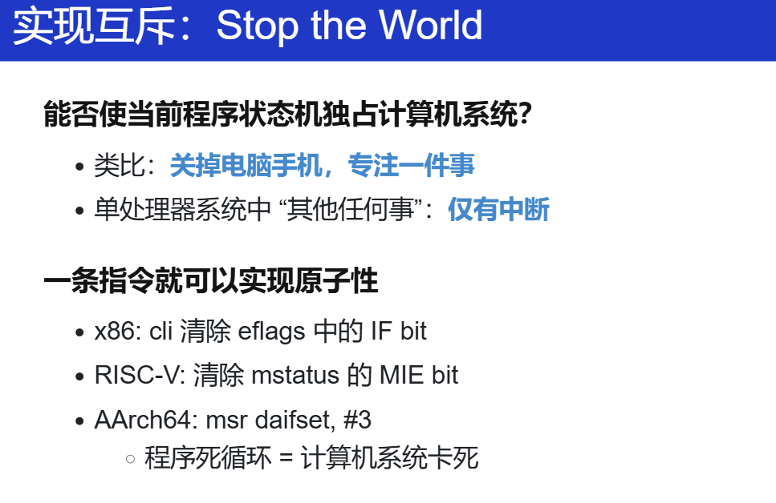
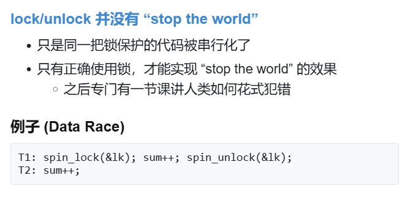

只记录部分。


## 多处理器编程


- 证明共享内存

    > **==DEMO==**
    >
    > **并发线程模型**：**并发线程能够读写共享的 heap 堆区**。除此之外，每个线程持有局部变量的副本。Mosaic 不会自动在每条语句之后进行线程调度：我们需要手工插入 `sys_sched`。


## 并发控制：互斥（1）


怎么应对？


### 阻止并发（并行）的发生

什么叫互斥？什么叫并发？

> **Concurrent** means happening at the same time

”要求整个世界有小段时间只属于自己，任何人都不能打断“

”人想象成线程，多线程想象成物理世界“

- **互斥** (互相排斥)：阻止并发


**那如何实现互斥？**

单核实现互斥：关中断



> ###### **==DEMO==**
>
> **Stop-the-world 实现互斥**：对于操作系统上的应用程序，关闭中断是不能容忍的：这会使微小的 bug 或是恶意的程序破坏计算机的运行。操作系统正是因为统治了中断，才实现了对应用程序的管理。**在操作系统内核的实现中，关闭中断是一个常见的操作。**
>
> ```C
> // Clear FL_IF in the CPU.
> // Interrupt disabled.
> asm volatile("cli");
>                                                                                                                         
> // Set FL_IF in the CPU.
> // Interrupt enabled.
> asm volatile("sti");
> 
> ```

> 例外：不可屏蔽中断 NMI (Non-Maskable Interrupts) [Non Maskable Interrupt - OSDev Wiki](https://wiki.osdev.org/Non_Maskable_Interrupt)
>
> - 可以利用 NMI 实现错误监控
>     - 设置硬件定时触发
>     - 操作系统定时复位定时器
>     - 触发 timeout，执行 NMI 处理程序
>         - 例如，重启计算机
>
> 为什么会有这个不可屏蔽中断？
>
> 其实刚开始我对这个概念是很迷糊的，并没有具体大印象和概念，因为自己并不是对电脑特别的熟悉，毕竟是说从上大学才开始接触，学习完成PA，对软件和硬件有了一定对了解之后，其实计算机中的任何东西都是人造出来的，受到各种各样的因素软件和硬件都会有错误（当然现在的计算机软硬件可能相对完善），很多的错误情况在硬件和软件上都会通过各种方式来告知我们它坏了，而这种方式就是前人遇到了类似的问题，他们想出来了一种方案，最终实施到计算机上。
>
> NMI 或许就是这么一种方式（我只是这么方便理解，只是猜的）。所以我对 NMI 及中断处理程序 的理解其实也就是处理一些不可恢复和极其重要的硬件故障错误，以及让我们修复它，不然计算机就没法工作啦。比如芯片内部某处出现故障；内存条损坏，操作系统怎么能发现？ECC、奇偶校验？
> 这也就是为什么很多老式的机器上会有复位按键。
>
> 可能上面还是很迷糊，再举个例子，在嵌入式中挺有用的：在处理器因静电放电而陷入循环时。当常规中断关闭时，系统无法恢复错误状态，而NMI因其不可屏蔽性，可以通过来自看门狗定时器、协处理器或人工按钮的信号使处理器恢复工作状态。
>
> 再如：NMI处理程序可以处理如热事件或电源故障等情况，以防止损坏或确保在断电前将数据备份到非易失性存储。


那多处理器呢？


### 使用 load/store 实现互斥（）

软件怎么做？想出了 **Peterson 算法**。直接看看讲义和视频讲解吧。


### 在多处理器上实现互斥


需要意识到：**因为人类是“sequential creatures”，导致过去的很多设计是没有考虑并发的（多处理器、共享内存），而我们在共享内存上实现互斥的失败和成功尝试后，我们意识到软件需要和硬件协同工作，并在硬件原子指令基础上实现了基础版本的自旋锁。**

关键在于硬件实现，在 OS 课上可不用深究，不属于本门课的范围。

> 更多内容：
>
> [x86 - How are atomic operations implemented at a hardware level? - Stack Overflow](https://stackoverflow.com/questions/14758088/how-are-atomic-operations-implemented-at-a-hardware-level)
>
> [computer architecture - How does an atomic operation guarantee consistency from a hardware perspective? - Super User](https://superuser.com/questions/400786/how-does-an-atomic-operation-guarantee-consistency-from-a-hardware-perspective)
>
> [计算机原子（atomic）操作的实现原理解析 - 知乎](https://zhuanlan.zhihu.com/p/649646816)
>
> 这里可以总结为：
>
> Extra transistors in the chip to implement **special cache** and memory coherency and **bus synchronization procotols**. The long answer is way too long.
>
> 再进一步举例相关实现手段：
>
> 总线锁定、缓存锁定、相关缓存一致性协议、LL/SC（LR/SC（armv8的独占加载、独占存储））
>
> 具体怎么实现？我觉得这应该属于体系结构、多核处理器设计上的相关内容了，看看怎么对总线操作？
>
> [内存一致性(Memory Consistency) - 知乎](https://zhuanlan.zhihu.com/p/422848235)
>
> 可以再好好总结。。**==TODO==**


实现。

> 为 add/inc 等指令增加 lock 的前缀，处理器硬件会实现将这条指令实现为原子指令。


进一步，借助硬件 `lock` 实现了互斥功能，我们就能实现 1 + 1 ：

```C
asm volatile(
    "lock addq $1, %0" : "+m"(sum)
);
```


再进一步，我们要实现互斥，有一个重要的点就是独占，那怎么借助硬件提供的 `lock` 实现呢？

这里提出这个自旋锁还是挺自然的，顺着之前上厕所的例子，厕所有人（线程1），我（线程2）就一直在门口等着呗？我就堵在这呗，什么时候线程1好了，我再进去上厕所呗。

> 看到这里总是会想着优化，这个线程堵了，OS 让 CPU 执行别的 线程，别浪费呀。有没有能不堵的方法？肯定有！互斥锁吗？在 `FreeRTOS` 里用过一点，但是是单核 MCU 的。


具体分析伪代码：

好的，我们来详细分析`atomic_xchg`这条指令为什么能实现互斥。

1. **`atomic_xchg(&status, ❌)` 这条指令主要做了什么？****
    1. **读取旧值**：它首先读取`status`变量的当前值。这个读取操作是原子性的，也就是说，在读取过程中，其他处理器不能对`status`进行写操作。这保证了读取到的`status`值是最新的、未被其他处理器修改过的值。
    2. **写入新值**：在读取到`status`的旧值之后，立即将`status`的值设置为`❌`。这个写操作也是原子性的，不会被其他处理器的操作打断。也就是说，从读取旧值到写入新值的整个过程，是一个不可分割的操作。
2. **互斥的实现原理**
    1. **资源锁定阶段（`lock`函数）**
        - 当一个处理器执行`lock`函数时，它会调用`atomic_xchg(&status, ❌)`。假设此时`status`的值为`✅`，表示资源是空闲的。
        - `atomic_xchg`指令首先读取到`status`的旧值`✅`，然后将`status`设置为`❌`。这个过程是原子性的，其他处理器在这个过程中无法对`status`进行修改。
        - 由于`got`变量得到了`✅`，表示当前处理器成功获取了资源锁。此时，`status`的值为`❌`，其他处理器在执行`atomic_xchg(&status, ❌)`时，读取到的`status`值将是`❌`，因此它们的`got`变量会得到`❌`，进入`retry`循环，等待资源释放。
    2. **资源释放阶段（`unlock`函数）**
        - 当持有资源的处理器完成任务后，它会调用`unlock`函数，执行`atomic_xchg(&status, ✅)`。
        - 这条指令将`status`的值从`❌`设置回`✅`。由于这个操作是原子性的，其他处理器在这个过程中无法对`status`进行修改。
        - 一旦`status`被设置为`✅`，其他在`retry`循环中等待的处理器就有机会再次执行`atomic_xchg(&status, ❌)`，并有可能成功获取资源锁。
3. **为什么`atomic_xchg`能实现互斥**
    1. **原子性保证**
        - `atomic_xchg`的原子性确保了在读取和写入`status`的过程中，不会出现竞态条件。也就是说，不会出现一个处理器读取了`status`的旧值，但在写入新值之前，另一个处理器修改了`status`的情况。
        - 这种原子性操作使得`status`的值始终能够准确反映资源的占用状态。当`status`为`✅`时，表示资源空闲；当`status`为`❌`时，表示资源被占用。
    2. **互斥的实现**
        - 通过`atomic_xchg`指令，每个处理器在尝试获取资源时，都能准确地读取到`status`的当前值，并且在设置新值时不会被其他处理器干扰。
        - 当一个处理器成功将`status`设置为`❌`时，其他处理器在读取`status`时会得到`❌`，从而进入等待状态。只有当持有资源的处理器将`status`设置回`✅`后，其他处理器才有机会再次尝试获取资源。
        - 这种机制确保了在同一时间只有一个处理器能够成功获取资源锁，从而实现了互斥。

再接着，具体看看自旋锁的一个实现：

```C
void lock() {
    int expected;
    do {
        // Try compare status with expected.
        // If the comparison succeeded, perform
        // an exchange.
        expected = UNLOCKED;
        asm volatile (
            "lock cmpxchgl %2, %1"
            : "+a" (expected) // Value for comparison.
                              // x86 uses eax/rax.
            : "m" (status),   // Memory location.
              "r" (LOCKED)    // Value to be written if
                              // status == expected
            : "memory", "cc"                                                                                              
        );
    } while (expected != UNLOCKED);
}
void unlock() {
    // To be safer:
    //
    // asm volatile (
    //     "movl %1, %0"
    //     : "=m" (status)
    //     : "r" (UNLOCKED)
    //     : "memory"
    // );

    // But actually we can do this:
    asm volatile("" ::: "memory");
    status = UNLOCKED;
}


```

原子的 load-store 可以帮助我们实现：

1. 取出内存中的数值
2. 写入一个数值，并且指令的执行在多处理器系统上依旧带有 “stop-the-world” 的效果。

因此，无论有多少线程同时执行 `lock()`，仅有一个能获得 `UNLOCKED` 的数值，从而实现互斥。


终于，我们借助**计算机硬件提供的短时原子性**实现了多处理器间的互斥。

> 这种条件写入，我在做 PA 的时候也用到过，在实现上下文切换的时候，用的 RISC-V 的 `csrrw sp, mscratch, sp `，这类指令各家 ISA 都有？经验？还是？
>
> > 哦！我那个时候的上下文切换问题应该要关中断呀！这样会带来并发问题的！如果机缘巧合下中断发生在了这个指令，而我的模拟器又没有真正地实现原子的交换，那样就会出问题？
> >
> > 不对，在进入这个异常处理的程序之前，我就已经关中断了，我还只是单核的处理器。
>
> 有 “带条件写入” 的版本：节约写入内存带宽
>
> Test-And-Set (TAS), Compare-And-Swap (CAS), COMPXCHG (Compare-And-Exchange)


## 并发控制：互斥（2）

### 现实要求但有人不遵守

理想的实现以及效果。


都得遵循这个规则。如果没有？忘记加锁、上的不是同一把锁。




### 操作系统内核中的自旋锁

> 之前课上的例子是在应用程序上的实现互斥，因为应用程序不能关中断。
>
> 但别忘了，操作系统才是第一个并发程序，我们需要解决内核中怎么做到互斥以实现正确的并发，
>
> 只有操作系统为实际计算中的并发打下基础，应用程序才能直到如何管理多个线程和进程。

但我还可以接着之前应用程序的内容来实现内核相关的内容。有了lock，那就能保证互斥？对于内核来说？回想计算机状态机的模型：


**能改变当前计算机的状态的，还有中断。**

> - 操作系统接管了完整的计算机系统
>     - 每个处理器都并行 x++
>     - 每个处理器中断发生时执行 x += 1000000000
>     - (假想 x 是操作系统中的数据结构，例如进程表)
> - 如何正确实现 x 的原子访问？
>     - 仅仅自旋是不够的
>     - **==因为还有中断==**

lock() -> sum++ -> 中断来了 -> (有临界区，中断也想对sum++) -> (但是之前已经lock过，所以就死在这里了！deadlock)

> 中断的发明，由于 IO 比 CPU 慢很多，IO 做完了再告诉 CPU 来处理我相关的，它们是异步的。


那怎么做？之前还没实现原子性的时候，单核怎么做的互斥：关中断，加到这里来。

那也自然带来一个问题：是在lock前关中断还是lock后关中断？

自然是在 lock 前关中断，如果是在lock后，那在那一瞬间还是会来中断，依然会造成deadlock。

> Thread A 在内核态运行且 acquire 锁lock1时，触发中断进入中断处理程序，中断处理程序也在内核态中请求锁lock1，由于锁lock1在 Thread A 手上，且只有 Thread A 执行时才能release 锁lock1，因此中断处理程序必须返回，锁才能被释放。那么此时中断处理程序会永远拿不到锁，陷入无限循环，进入死锁。

> ```
> Thread A: 获取锁  ------------------> 关中断
> 						|
> 				   	  	|-----> ISR: 尝试获取同一个锁 --> 一直自旋 deadlock
> ```

正确的为：`disable irq` -> `lock` -> `sum++` ->`enable irq`

但还有问题，lock前关了中断，但到最后的时候，变成了开中断。但如果在 `disable irq` 之前的 CPU 状态就是 关中断呢？所以，需要保存中断状态！

> 这就是我在 NEMU 移植 Linux 的时候看的 Linux kernel 的 `arch/risc-v` 里看到的 `arch_local_save_flags` ？
>
> ```C
> #ifdef CONFIG_TRACE_IRQFLAGS_SUPPORT
> #define irqs_disabled()                 \
>     ({                      \
>         unsigned long _flags;           \
>         raw_local_save_flags(_flags);       \
>         raw_irqs_disabled_flags(_flags);    \
>     })
> #else /* !CONFIG_TRACE_IRQFLAGS_SUPPORT */
> #define irqs_disabled() raw_irqs_disabled()                                                                               
> #endif /* CONFIG_TRACE_IRQFLAGS_SUPPORT */
> //include/linux/irqflags.h
> 
> #define raw_local_save_flags(flags)         \                                                                             
>     do {                        \
>         typecheck(unsigned long, flags);    \
>         flags = arch_local_save_flags();    \
>     } while (0)
> // include/linux/irqflags.h
> 
> /* read interrupt enabled status */
> static inline unsigned long arch_local_save_flags(void)
> {
>     return csr_read(CSR_STATUS);
> }
> 
> /* unconditionally enable interrupts */
> static inline void arch_local_irq_enable(void)
> {
>     csr_set(CSR_STATUS, SR_IE);
> }
> // arch/riscv/include/asm/irqflags.h
> ```


> 无论实现什么，先认为是对的，先写一个测试用例？
>
> 实现一个自旋锁，相比实现一个自旋锁的test driver 不那么重要。？？

关于 老师的移植实现分析，见：[L1] ==**TODO**==


### 7.2 操作系统内核中的 (半) 无锁互斥：Read-Copy-Update 🌶️

**在真正的操作系统中实现互斥，其实没有那么简单。**

> 要真正在操作系统内核中用起来，还要考虑很多。
>
> Scalability(伸缩性、延展性...): 性能的新维度
>
> - 严谨的统计很难
>     - CPU 动态功耗
>     - 系统中的其他进程
>     - 超线程
>     - NUMA
>     - ……
>
> [Benchmarking crimes](https://gernot-heiser.org/benchmarking-crimes.html) by Gernot Heiser

假如采用上面的那种方案实现互斥：自旋 + 关中断。

首先，自旋锁的缺点，scalability 非常差，每次需要并发控制的时候，内核就卡在那里不动，如果时间很长，极大地浪费了硬件资源。

再者，关中断同样也不能关太长，关 1 秒的中断，就忽略了很多的时钟中断（就假如10ms来一个，100个），在这些时钟中断，操作系统内核会切换到别的线程，那这样很多线程/任务耗费的时间很长，极大影响性能。

综上，在内核中，上面这种方案尤其自旋锁，只能用在很短的临界区（比如并发的数据结构，往一个链表里添加一个元素、按键按下键码放队列），临界几乎不拥堵，要迅速结束。


> - Kernel 里有 ~180K 个并发控制函数调用！
>
>     自旋锁当然不 scale
>
>     [An Analysis of Linux Scalability to Many Cores | USENIX](https://www.usenix.org/conference/osdi10/analysis-linux-scalability-many-cores)

怎么办？

> - 许多操作系统内核对象具有 “**read-mostly**” 特点
>     - 路由表
>         - 每个数据包都要读
>         - 网络拓扑改变时才变更
>     - 用户和组信息
>         - 无时不刻在检查 (Permission Denied)
>         - 但几乎从不修改用户

读写不对称性

写时复制

多版本

读 不上锁，写 上锁


### 应用程序中的互斥

现在考虑在多核的应用程序中，自旋带来的性能问题

- 性能问题 (1)

    除了进入临界区的线程，其他处理器上的线程都在**空转**

    - 争抢锁的处理器越多，利用率越低
    - 如果临界区较长，不如把处理器让给其他线程

- 性能问题 (2)

    应用程序不能关中断……

    - 持有自旋锁的线程被切换
    - 导致 100% 的资源浪费
    - (如果应用程序能 “告诉” 操作系统就好了)

想想，如果在64核的64个线程对一个资源进行抢占，有一个抢到了，那剩下的 63 个怎么做？空转？一直浪费啊！

没法进入临界区进行计算，那最自然的想法是什么？既然一直在这等着不行，那就不等了？去做有意义的计算？

回想计算机状态机模型，如果状态一直卡在这里，怎么办？还是应用程序？只能 `syscall`。（也就是互斥锁）

把这种锁放到 kernel 实现就好啦，因为 kernel 有能力做上下文切换呀，能切换别的线程。


> 这个 OJ 例子还是挺形象的哈哈，又比如等成绩的时候，别等了，本来就啥也干不了，去做别的。

> 想到之前学习 `FreeRTOS` 的互斥锁了，既然等不到，那就用 `mutex_acquire` 放弃这个任务，去做别的线程的任务吧。有点类似。

模型：


我觉得这个图已经形象地描述了。

所以一套配套操作，和自旋锁的都挺类似

```c
mutex_lock()	// acquire
mutex_unlock()	// release
```


#### `pthread Mutex Lock`  

> - 一个足够高性能的实现
>     - 具有相当不错的 scalability
>     - 更多线程争抢时也没有极为显著的性能下降
>
> - 使用方法：与自旋锁完全一致
>
>     ```C
>     pthread_mutex_t lock; 
>     pthread_mutex_init(&lock, NULL); 
>     pthread_mutex_lock(&lock); 
>     pthread_mutex_unlock(&lock); 
>     ```


#### Futex: Fast Userspace muTexes 🌶️

> 一般来说，我们上锁和解锁又会有 `syscall`，而这个不会，这种方法会把尽可能多的运算放到用户空间

- 小孩子才做选择。操作系统当然是全都要啦！

    - **性能优化的最常见技巧：**

        **考虑平均而不是极端情况**

        - **RCU 就用了这个思想！**

- Fast Path: 自旋一次

    - 一条原子指令，成功直接进入临界区

- Slow Path: 自旋失败

    - 请求系统调用 `futex_wait`
    - 请操作系统帮我达到自旋的效果
        - (实际上并不真的自旋)


怎么实现？

> - 比你想象的复杂
>    - 如果没有锁的争抢，Fast Path 不能调用 `futex_wake`
>     - 自旋失败 → 调用 `futex_wait`→ 线程睡眠
>        - 如果刚开始系统调用，自旋锁被立即释放？
>         - 如果任何时候都可能发生中断？
>
>      - 并发：水面下的冰山
>    - [LWN: A futex overview and update](https://lwn.net/Articles/360699/)
>     - [Futexes are tricky](https://cis.temple.edu/~giorgio/cis307/readings/futex.pdf) by Ulrich Drepper

关键在于用系统调用来实现这个？

**==TODO：留坑==**


#### 对比三种互斥手段

学习到了，在 AI 时代，使用良好的 prompt 学会科学地提问，总能大幅提高你的效率，但我认为我应该清楚我正在做什么，我有什么目的，能否清晰地描述出我的需求。


简单总结：

我理解的是互斥是我们实现的终极目的，而锁是一种比较常用的手段。
在单核处理器中。无论是应用程序还是操作系统内核。以关中断为基础，实现自旋锁、互斥锁等锁，即可实现互斥；如果这种单核处理器还支持原子操作，那就可以用原子操作为基础，实现自旋锁、互斥锁等锁，由此来实现互斥。

> 对于嵌入式操作系统来说，应该提出不自旋会更加自然点，比如在单核上的 `FreeRTOS`，遇到数据竞争，某个线程遇到锁，第一反应应该是让这个线程睡眠？这样相对不影响性能？也就是上面那个应用程序的互斥锁。

在多核处理器中。对于应用程序，仅仅靠原子指令即可实现互斥，因为不允许关中断。但如果是操作系统内核，那有原子指令还不够，因为中断也能影响到程序的状态迁移，（回想上面的例子，）因此还需要关中断。


>  这个时候感觉会不会内容稍微多了点？可以将 OS 课分成 OS 内核和 OS 应用两门课？


## 调试理论与实践

> - 并发编程：不能相信自己
>
>     -  并发 bug 的触发需要：
>         - 编译器 + 编译选项 + 特别的机器 + 特别的运气
>     -  内存模型：[专家也做不对](https://github.com/seL4/seL4/pull/199)
>     -  测试全对
>         - Online Judge 被拒绝 
>
> - 初学者：如果可以，只用 “绝对正确” 的实现
>
>     自带一切 barrier 的函数
>
>     - `atomic_xchg`
>     - `pthread_mutex_lock`
>
> 正好的例子，对我们初学者来说，就用业界成熟做好的库。


### 听故事

硬件bug [Original Pentium FDIV flaw e-mail](https://faculty.lynchburg.edu/~nicely/pentbug/bugmail1.html)

软件bug。

> “...attempted to convert large, unexpected 64-bit floating point numbers representing horizontal velocity into 16-bit integers. This resulted in an overflow error, causing the onboard computer to crash.”


### 调试理论

>  听老师好好讲就行这节课。下面都是ppt的内容。


程序/软件是人类需求在信息世界的投影。

- “软件” 的两层含义
    - 人类需求在信息世界的投影
        - 理解错需求 → bug
    - 计算过程的精确 (数学) 描述
        - 实现错误 → bug

- 调试为什么困难？
    - Bug 的触发经历了漫长的过程
    - 可观测的现象未必能直接对应到 root cause 上


==需求 → 设计 → 代码 (**Fault/bug**) → 执行 (**Error**) → 失败 (**Failure**)==

- 我们只能观测到 failure (可观测的结果错)，但是我们犯错的是 fault
- 我们可以检查状态的正确性 (但非常费时)
- 无法预知 bug 在哪里 (每一行 “看起来” 都挺对的)
- 人总是 “默认” (不默认，浪费的时间就太多了)


> **调试理论：如果我们能判定任意程序状态的正确性，那么给定一个 failure，我们可以通过二分查找定位到第一个 error 的状态，此时的代码就是 fault (bug)。**

其实从很久之前就学会用这种思想了。在程序出错之前加一条 log。不断二分，总能找到bug。 


进一步推论

- 为什么我们喜欢 “单步调试”？
    - 从一个假定正确的状态出发
    - 每个语句的行为有限，容易判定是否是 error。我们对每一条语句执行的后果/状态迁移应该都是明白的。
    - single step(step in)、step over(step out)
- 为什么调试理论看起来很没用？
    - “判定状态正确” 非常困难
    - (是否在调试 DP 题/图论算法时陷入时间黑洞？)

>  **观察状态机执行的两个基本工具**
>
>  - `printf` → 自定义 log 的 trace
>     
>     - 灵活可控、能快速定位问题大概位置、适用于大型软件
>     - 无法精确定位、大量的 logs 管理起来比较麻烦
>     
>     让 LLM 帮我们 `printf` 调试
>     
>  - `gdb` → 指令/语句级 trace
>     
>     - 精确、指令级 定位、任意**查看程序内部状态**
>     - 耗费大量时间


- **总结**

    遇到 “任何问题” 时候，先 self-check（遇到问题心里默念/问自己）：

    1. 是怎样的程序 (状态机) 在运行？

        > 能不能将整个状态机打出来看？就像 `make -nB` 那样

    2. 我们遇到了怎样的 failure？

    3. 我们能从状态机的运行中从易到难得到什么信息？（`printf`、`gdb`....）

    4. 如何二分检查这些信息和 error 之间的关联？


### 调试一切

#### example0

**万能方法：假设你遇到的问题是别人也遇到的：StackOverflow、GPT、Google...**

```bash
bash: curl: command not found 
```

```bash
fatal error: 'sys/cdefs.h': No such file or directory #include <sys/cdefs.h> 
```

````bash
/usr/bin/ld: cannot find -lgcc: No such file or directory 
````

```bash
make[2]: *** run: No such file or directory.  Stop. Makefile:31: recipe for target 'run' failed 
```

- 但如果这是一个全新的问题？或者说第一个解决上述问题并分享到网上的人是怎么做的？别人是怎么想的？

    一切都是状态机，将状态机的某一侧面打开，看 `error`。

    如上面：大部分 Error 和 Failure 都比较接近

    - 出错时，使用 `perror` 打印日志，这个 `error message` 已经缩短了 `failure` 和 `error` 的距离，去进一步解决。

    再进一步，还是找不到原因？

    - **出错原因报告不准确**
    - 程序执行的过程看不到
        - 那我们想办法 “看到” 状态机的执行过程就好了！（将状态机拆开）

    > - 理解状态机执行：不是 “调试”，也是 “调试” 
    >     - `ssh`：使用 `-v` 选项检查日志   `verbose`
    >     - `gcc`：使用 `-v` 选项打印各种过程
    >     - `make`：使用 `-nB` 选项查看完整命令历史
    >
    > - 调试：不仅是 “调试器”
    >     - Profiler: `perf` - “采样” 状态机
    >     - Trace: `strace` - 追踪系统调用


#### example1：`sys/cdefs.h: No such file or directory`

- (这看起来是用 `perror()` 打印出来的！)
- 问题分析
    - `#include` = 复制粘贴，自然会经过路径解析
    - 明明 `/usr/include/x86_64-linux-gnu/sys/cdefs.h` 是存在的 (`man 1 locate`) 
- 两种方法
    - 日志 --verbose
    - strace，直接看访问过的文件！

简单尝试下老师课上的操作：万能头文件怎么工作的：

```bash
strace -f g++ a.cc 2>&1 | vim -

vim:
:%!grep \.h
:%!grep -v ENOENT
:%!grep open
```

牛啊，又一次感受到UNIX工具的厉害

> LLM
>
> - **`strace` 命令**：
>     - `strace` 是一个强大的调试工具，可以跟踪进程的系统调用和信号。它可以帮助你理解程序在运行时与操作系统交互的细节。
>     - `-f` 选项用于跟踪所有被 `g++` 创建的子进程的系统调用。这对于编译过程特别有用，因为 `g++` 会创建多个子进程来处理不同的编译步骤。
>
> - `2>&1`
>
>     将标准错误重定向到标准输出，确保所有输出都通过管道传递。
>
> - `| vim -`
>
>     - `|`：管道符号，将前一个命令的输出作为下一个命令的输入。
>     - `vim -`：在 Vim 中打开标准输入的内容。`-` 表示从标准输入读取数据。
>
> - `:%!grep`
>
>     - `:%!grep` 是一个 Vim 命令，用于对当前编辑的文件的所有行（`%` 表示当前文件的所有行）应用 `grep` 命令，并将结果替换当前文件的内容。
>     - 这个命令非常有用，可以快速过滤文件内容，只保留匹配特定模式的行。
>     - `:%` 是一个 Vim 范围指定符，表示当前文件的所有行。
>     - `:%!command` 表示对当前文件的所有行应用 `command`，并将结果替换当前文件的内容。
>     - `:%grep command` 表示在当前文件的所有行中查找匹配 `command` 的行，并将结果保存在临时文件中。
>
>     > - **`!`**：在 Vim 命令中，`!` 用于表示“过滤”或“替换”操作。具体来说，`:%!command` 表示对当前文件的所有行应用 `command`，并将 `command` 的输出结果替换当前文件的内容。
>     > - **没有 `!`**：如果没有 `!`，则表示不进行替换操作，而是将结果保存在快速修复列表中，不修改当前文件的内容。

- 总结
    1. **确认文件存在**：使用 `locate` 或 `find` 确认文件确实存在。
    2. **检查编译器搜索路径**：使用 `gcc -v` 或 `clang -v` 查看编译器的搜索路径。
    3. **使用 `strace`**：跟踪编译器执行时访问的文件，确认是否尝试访问了正确的路径。
    4. **显式指定路径**：如果需要，使用 `-I` 选项显式指定搜索路径。


#### example2：real bug

- 装了 100 台一模一样的机器，但有一台出问题了
    - 名字叫 “pm” 的 Kernel thread 占用 100% CPU
    - LLM 有非常好的解题直觉

> 还是记住这句话：everything is state machine。或者用更好记的一句话，冤有头债有主，遇到 bug肯定有债主，肯定是哪里导致 CPU 出问题的。
>
> 用 `sudo perf top` 
>
> 通过 `perf` 工具采样状态机，每一个采样点，看到底是哪一个函数占用时间，在每一个采样点进行 `backtrace` 打印当前线程调用堆栈。->  发现 `xhci` ：USB subsystem -> 找到了被插烂了的 USB 接口，短路了，导致电源管理出了问题。。 

怎么做到的？

everything is state machine。

会使用相关的工具


#### example3


通过报错信息知道，这是代码打印出来的报错信息，那能不能找到这条报错信息在哪里？因为这是一个 Ubuntu 的安装镜像，所以能不能解开，然后直接搜索或者 `grep`？最后找到了一处地方（shell脚本），通读/调试上下文代码，知道这部分代码是用来扫描系统所有的磁盘，找到一个安装磁盘就安装。肯定有原因为什么没找到磁盘。怎么解决？进一步看手册，强行指定一个设备安装/别的方法


#### summary

上面这些例子先抛开各种各样的前置基础知识不谈，我是一个初学者，我遇到的问题别人肯定也遇到过。但是我们需要一个比较好的或者比较 principal approach（everything is state machine），出错了一定是自己的问题，我们能解决它，它一定是有原因的，一步步地去解决问题，扩充自己的基础知识。

> 实际上我觉得整个调试理论不单单能用在软件，生活中的给方面应该都能用？题外话。

再回到调试程序。我们依旧需要 [RTFM: Top (Debugging with GDB](https://sourceware.org/gdb/current/onlinedocs/gdb.html/) 

> 又一次提醒自己该读读手册了，总能发现一些很好玩的东西。

- 否则我们甚至不知道 `gdb` 有多强大

Cheat Sheet 里没有的功能

- Text UI (我已经默认启动)
- Stack, optimized code, macros, ...
- Reverse execution
- Record and replay
- Scheduler

> 又一个例子：状态机回溯？逆着状态机的执行流。

只要你想这个东西，那这个东西为什么没有，为什么不可以有？那应该有才对？

> 
>
> 当我第一次看到这段话的时候，我其实并没有意识他究竟想告诉我什么，简单地认识了一个结论：AI Copilot 能够帮我把事情做得更好。
>
> 自从高中以来都是习惯接受别人传授的知识，学习技术总是会去看别人的总结/教程，总是想着别人嚼烂了揉碎了告诉我，从来没想过为什么我不能去阅读第一手的资料。（当然，我觉得初学者都是从这个阶段过来的，那之后呢？没有这种能力不一直要等着别人？）
>
> 在做 PA 的时候已经或多或少告诉自己应该接受一手的知识，应该搜集各种资料独立完成，但在昨晚一部分之后，不知是以前的习惯使然还是自己的惰性太强，导致又有点变回之前的状况，总是被迫用肌肉记忆完成各种任务。
>
> 这里老师给了一个提醒，AI Copilot 或许能够充当这么一个观察者，或者说监督者的角色。copilot 或许能够记录我们刚才做过的事情，他能帮我们总结或者给出一些建议来提醒我们是不是能做得更好。或许未来总会有这个发明的出现？或许这就是一个项目？或许可以尝试下，新的发明往往都是由这样的想法铸造而成。
>
> 另外对于自己来说，趁现在还年轻，可以顶着肌肉记忆或者趁着肌肉记忆还没实现的时候，去学习新的内容。
>
> > 这里想起来之前自己的一些看法：不喜欢折腾和学习新的技术，现在看来其实是不矛盾的，学习新的技术可能解决的是同样的问题，但某一天这就能用在别的地方，最终怎么解决/分析问题，是凭着你那个时候的具体情况具体分析的。所以，去学吧！


### 调试理论的应用

**需求 → 设计 → 代码 → Fault → Error → Failure**

从上面这对于我们设计给出三个相对重要的建议：

1. **==需求 → 设计 → 代码 → Fault==** → Error → Failure

    - **写好代码**：不要在写代码的时候忘记需求和设计

        > 这里我的体会是：多花一些时间在自己的设计和需求分析上，想想自己以前写代码都是吭哧吭哧无脑上头写，遇到bug了，一直调，解决不了就问 AI，查资料，凭着自己的直觉一往无前，但自己的直觉又往往没有老师那么好。
>
        > 其实我可以先在纸上或者 markdown 简单写写整个的流程，自己心里应该有个底的，或许代码写的少了，项目做的少。

    - 不言自明 (Self-explanatory)
    
        - 能通过字面知道需求 (流程)
    
    - 不言自证 (Self-evident)
    
        - 能通过字面确认代码和需求一致
    
    **代码首先是给人看到，其次才是机器执行的**
    
    > **一个评判标准**
    >
    > - AI 是否能正确理解/维护你的代码: [toybox](http://git.nju.edu.cn/jyy/toybox)
    >
    > > Programs are meant to be read by humans and only incidentally for computers to execute. (Donald E. Knuth)

2. 需求 → 设计 → 代码 → **==Fault → Error==** → Failure

    - **做好测试**：未测代码永远是错的
        - 残酷的现实：相信自己写不对代码
        - LLM 一样经常犯 “傻” 错

    > Small Scope Hypothesis
    >
    > If a system does not have a counterexample (i.e., an error or a bug) for a certain property within a small scope (a limited size or configuration), then it is unlikely to have a counterexample in a larger scope. (Daniel Jackson)
    >
    > **==TODO==**

    实际上我对这部分的内容，实际上并不是特别地了解，大家一直在说的测试驱动开发（TDD）我也不懂，自己的经历也就只是在做 PA 的时候，自己实现一个函数功能，然后用这个函数，看看有没达成想要的效果？（比如 `strcpy`、`strcmp`等）不过很多时候都是借助 GPT 来帮助我写这个东西。所以这里留坑，准备去看看相关的书籍。 **==TODO==**

    

    

3. 需求 → 设计 → 代码 → Fault → **==Error → Failure==**

    - 多写断言

        ：把代码中的 “隐藏性质” 写出来

        - Error 暴露的越晚，调试越困难
        - 追溯导致 assert failure 的变量值 (slice) 通常可以快速定位到 bug

    > “There are two ways of constructing a software design: One way is to make it so simple that there are obviously no deficiencies, and the other way is to make it so complicated that there are no obvious deficiencies” (Tony Hoare)

    其实说来惭愧，做 PA 的时候一直都知道要多写断言，但是只有在想起来的时候才会做，并没有把这个当作一个习惯，之后养成习惯吧。

    

    > 以往都是先学了某个东西的性质，然后充分应用他的性质来实各种各样的功能，但是现在，我实现得不正确，正确的性质自然也就不满足，自然也就需要上面这些看起来傻里傻气的断言来帮助我找出 bugs。

    有些 “明显” 的断言，写起来会彻底破坏代码的可读性

    ```C
    assert(first(obj) <= ptr && ptr < last(obj)); *ptr = 1; // Assumes ptr is valid. 
    ```

    - 但如果有这样的断言，你就不用担心数组越界了！

        Bad practice: `int elements[MaxN + 100];`

    - 一个神奇的编译选项

        ```C
        -fsanitize=address
        ```

        Address Sanitizer; asan “动态程序分析”

    这种事情编译器应该由编译器做，不然每次都加，真得很麻烦。


## 并发控制：同步（1）

同步是什么？这个东西是干啥的？

回想：并发控制的要求？互斥实现的是什么？

互斥保证了我们的原子性，但是想要调控两份代码执行的顺序关系还是做不到的。


**Synchronization：控制并发：使得 “两个或两个以上随时间变化的量在变化过程中==保持一定的相对关系==”**

还是记住方法：

- 线程 = 我们自己
- 共享内存 = 物理空间


### 线程同步

#### example1：演奏音乐

- 演奏音乐中的同步
    - 每个乐手都是一个 “线程”
    - 节拍 *i*  到达 → 演奏 n~i~

```C
void T_player() {
    while (!end) {
        wait_next_beat(); // 同步，等待指挥发出节拍指令
        play_next_note(); // 演奏对应节拍
    }
}
```


#### example2：约会

两人约定几点几分同时在 xxx 地点见面。

如果某人先到了，那他就得一直等另一个人（当然也可以去玩别的东西，但是到约定时间，必须出现在那里）。


#### example3：更进一步

**在某个瞬间达到 “互相已知” 的状态**

- NPY: 等我洗个头就出门
- NPY: 等我打完这局游戏就来
- 舍友：等我修好这个 bug 就吃饭
- 导师：等我出差回来就讨论这个课题
- join(): 等所有线程结束就继续

- “先到先等”，在条件达成的瞬间再次恢复并行

    同时开始出去玩/吃饭/讨论


#### 状态机视角

挺清晰的图，两个线程都在初始的某个状态上，哪怕之后不断状态迁移，做了很多别的事情，

但并发控制（同步）就要求我们在之后又回到统一的状态上（再次恢复并行），再回看之前的例子应该也挺好理解的。


在某一个时刻：

所有的 players 都完成了第 n 拍（处于相同的状态）

然后指挥下达命令：打 n+1 拍

（可能有人（线程）会走神，会抢拍（经历复杂的调度，多核都做各自的事情，但最终回到同一状态））

所有人第 n+1 拍完成（处于相同的状态，只是拍子数 + 1）


```c
void T_player() {
	while (!end) {
		wait_next_beat();
		play_next_note();
	}
}
void T_conductor() {
	while (!end) {
		wait_next_beat();
		release(); 
	}
} 
// release() 之后，player 都会演奏下一拍
// 伪代码
```

有了具体例子辅助理解，接着就到了怎么实现同步。还是以怎么实现演奏音乐为例：怎么等待下一个拍？

其实刚开始我觉得自旋应该就能解决问题的，就比如加个 if 判断看是否收到了指挥的命令，没收到就一直空转自旋，但这样会不会太慢？

> 其实还真是：我想的 if 判断就是同步条件，也就是同步的关键，但是为什么不用 while？

- 线程有先后，先来先等待

```c
void wait_next_beat() {
retry:
	if (!next_beat_has_come) {
		goto retry;
	}
}
```


### 生产者-消费者问题与条件变量(⭐)

> ”99% 的实际并发问题都可以用生产者-消费者模型来解决“，eg. 将算法并行化
>
> ”条件变量能解决 100% 的并发问题“


- Producer 和 Consumer 共享一个缓冲区
    - Producer (生产数据)：如果**缓冲区**有空位，放入；否则等待
    - Consumer (消费数据)：如果**缓冲区**有数据，取走；否则等待

```c
void produce(Object obj); 
Object consume();
```

**==同步，关键在于实现同步的条件。等到某一个条件成立时才能做某事==**


进一步简化：

```c
void produce() { printf("("); } 
void consume() { printf(")"); } 
```

- 生产 = 打印左括号 (push into buffer)    放入缓冲区

- 消费 = 打印右括号 (pop from buffer)    从缓冲区中取出

- 在 `printf` 前后增加代码，使得打印的括号序列满足

    **缓冲区未满：可以打印左括号**

    **缓冲区有货：可以打印右括号**

    - 一定是某个合法括号序列的前缀
    - 括号嵌套的深度不超过 n
        - n=3：`((())())(((` 合法
        - n=3：`(((())))`, `(()))` 不合法

```C
void produce() {
    wait_until(括号深度 < n) {
        printf("(");
    }
}

void consume() {
    wait_until(括号深度 > 0) {
        printf(")");
    }
}
```


#### version1

```C
int n, depth = 0;
void T_produce() {
    while (1) {
retry:
        mutex_lock(&lk);
        int ready = (depth < n);
        mutex_unlock(&lk);
        if (!ready) goto retry;

        // context switch
        // assert(depth < n);

        mutex_lock(&lk);
        printf("(");
        depth++;
        mutex_unlock(&lk);
    }
}

void T_consume() {
    while (1) {
retry:
        mutex_lock(&lk);
        int ready = (depth > 0);
        mutex_unlock(&lk);
        if (!ready) goto retry;

        // assert(depth > 0);

        mutex_lock(&lk);
        printf(")");
        depth--;
        mutex_unlock(&lk);
    }
}
```

why wrong？

挺好理解的，还是之前的那样，第 8 行的 ready 是一个共享资源来的，没对它加锁，自然就有可能读到的是旧的 ready（刚好第 8 行后上下文切换、来中断，因为还没有更新缓冲区，导致别的线程的第 13 到 第 16 行的代码就会将缓冲区填满，这个时候 11 行的 assert 就有问题）。

只要存在多个消费者，那就会在并发的时候影响到 ready 的值。

也很容易解决，其实就是 5 到 8 行对 ready 锁的时间不够长，将整个 produce 的操作都变成原子的，都锁住。


#### version2

```C
#define CAN_PRODUCE (depth < n)
#define CAN_CONSUME (depth > 0)

void T_produce() {
    while (1) {
retry:
        mutex_lock(&lk);
        if (!CAN_PRODUCE) {
            mutex_unlock(&lk);
            goto retry;
        }

        // The check of sync condition (depth < n) is within
        // the same critical section. As long as we safely
        // protected the shared state, this condition should
        // always hold at this point.
        assert(depth < n);

        printf("(");
        depth++;

        // And at this point, the condition (depth > 0) is
        // satisfied. However, a consumer could proceed with
        // checking depth only if the lock is released.
        mutex_unlock(&lk);
    }
}

void T_consume() {
    while (1) {
retry:
        mutex_lock(&lk);
        if (!CAN_CONSUME) {
            mutex_unlock(&lk);
            goto retry;
        }

        assert(depth > 0);

        printf(")");
        depth--;

        mutex_unlock(&lk);
    }
}

```

由此得出这个万能模型，关键在于怎么换这个同步条件。

进一步，OS 开发者将上面的内容改进变成了用条件变量来实现生产者-消费者模型。


#### conditional variable

对于上面的实现，最大的问题就是线程浪费 `cpu`，依然自旋空转。

> 如果 生产者已经放慢了资源到缓冲区，但是消费者还没有消费完，那生产者就一直自旋在那了。

进一步上面观察上面特征：同步条件 + 自旋。 

回想前几课的内容，既然空转浪费资源，那就你睡去吧，让别人（线程）来做。

另外，同步条件 -> 变量


具体来说，在同步条件不成立的时候（依然解锁锁），不使用 retry，而将线程睡眠，之后等到条件满足，某人将我唤醒，醒来之后再上锁，再次判断是否满足同步条件，如果满足了，就可以去做实际的计算任务。

```C
mutex_lock(&lk);
while (!CAN_PRODUCE) {
    mutex_unlock(&lk);
    wait_for_someone_wake_me_up();
    mutex_lock(&lk);	
}
```

- 把条件用一个变量来替代：`CAN_PRODUCE`  -> `cond_t cv`
- 条件不满足时等待，条件满足时唤醒：`wait_for_someone_wake_me_up` + `mutex_lock`  -> `cond_wait`

```C
mutex_t lk = MUTEX_INIT();
cond_t cv = COND_INIT();

#define CAN_PRODUCE (depth < n)
#define CAN_CONSUME (depth > 0)
void T_produce() {
    while (1) {
        mutex_lock(&lk);
        while (!CAN_PRODUCE) {
            cond_wait(&cv, &lk);
            // We are here if the thread is being waked up, with
            // the mutex being acquired. Then we check once again,
            // and move out of the loop if CAN_PRODUCE holds.
        }

        // We still hold the mutex--and we check again.
        assert(CAN_PRODUCE);

        printf("(");
        depth++;

        cond_broadcast(&cv);
        mutex_unlock(&lk);
    }
}
void T_consume() {
    while (1) {
        mutex_lock(&lk);
        while (!CAN_CONSUME) {
            cond_wait(&cv, &lk);
        }

        printf(")");
        depth--;

        cond_broadcast(&cv);
        mutex_unlock(&lk);
    }
}

```

 ```C
 cond_wait(&cv, &lk)； // 对于这个同步条件cv不成立，进入睡眠模式，进入等待，同时释放锁lk，被唤醒后又重新上锁
 
 //有人在等待我的条件，我将他唤醒
 cond_signal(&cv);  // Wake up a (random) thread
 cond_broadcast(&cv);  // Wake up all threads
 ```


- **条件变量的正确打开方式**

    **使用 while 循环和 broadcast**

    - **总是在唤醒后再次检查同步条件**
    - **总是唤醒所有潜在可能被唤醒的人**

    ```C
    mutex_lock(&mutex);
    while (!COND) {
      wait(&cv, &mutex);
    }
    assert(cond);
    
    ...
    
    mutex_unlock(&mutex);
    
    ```

    只要有我对共享资源做了一些改动，我都叫醒这个世界的所有人（线程）去检查一下自己的同步条件（广播），如果条件满足了，那就可以去执行了。

> 这里还有一个版本：使用的是 `if` 和 `cond_signal` 去实现生产者-消费者模型，但是需要两个条件变量，具体为什么，简单就是：每一个线程都有自己同步条件。每一个线程同步条件不一样。（两类不同的线程：生产者、消费者）
>
> 详细内容看教材：[第 30 章 - Condition Variables](https://pages.cs.wisc.edu/~remzi/OSTEP/threads-cv.pdf)

**==可以记住这种代码模板写法，总能解决并发问题==**


### 同步机制的应用

解决同步问题的核心：弄清楚同步条件。


#### 并行计算：实现计算图

如果用多处理器并行编程完成很大的**计算任务**，首先要做的就是将任务分成若干步：计算任务构成有向无环图

> 配合例子和图（算素数表）：
>
> 

- (u,v)∈E(*u*,*v*)∈*E* 表示 v*v* 要用到前 u*u* 的值

- **只要调度器 (生产者) 分配任务效率够高，算法就能并行**

    > 这是物理内存分配的想法吗？这个调度器怎么实现？很重要。

```C
void T_worker() {
    while (1) {
        consume().run();
    }
}
void T_scheduler() {
    while (!jobs.empty()) {
        for (auto j : jobs.find_ready()) {
            produce(j);
        }
    }
}
```


- **实现**

    - 生产者-消费者模型

        生产者遍历计算图，消费者实际做计算。（以素数表为例，遍历时间几微秒，计算时间几秒，就很好）

        生产者遍历后，将一个个任务放至缓冲区中。每一个消费者 worker 就去缓冲区中取任务计算。

        **==只要能将任务分解成有向无环图的形式，用一个生产者，多个消费者即可实现多任务并行。==**

        ```c++
        // author: kimi
        
        #include <stdio.h>
        #include <stdlib.h>
        #include <pthread.h>
        #include <queue>
        #include <vector>
        #include <mutex>
        #include <condition_variable>
        
        std::queue<int> jobs;
        std::mutex mtx;
        std::condition_variable cv;
        bool done = false;
        
        void produce(int job) {
            std::lock_guard<std::mutex> lock(mtx);
            jobs.push(job);
            cv.notify_one();
        }
        
        int consume() {
            std::unique_lock<std::mutex> lock(mtx);
            cv.wait(lock, [] { return !jobs.empty() || done; });
            if (jobs.empty()) {
                return -1; // 表示没有更多任务
            }
            int job = jobs.front();
            jobs.pop();
            return job;
        }
        
        void T_worker() {
            while (1) {
                int job = consume();
                if (job == -1) {
                    break;
                }
                // 执行任务
                printf("Processing job: %d\n", job);
                // 模拟计算时间
                sleep(1);
            }
        }
        
        void T_scheduler() {
            for (int i = 0; i < 10; ++i) {
                produce(i);
            }
            done = true;
            cv.notify_all();
        }
        
        int main() {
            const int num_workers = 4;
            std::vector<pthread_t> workers(num_workers);
        
            for (int i = 0; i < num_workers; ++i) {
                pthread_create(&workers[i], NULL, (void *(*)(void *))T_worker, NULL);
            }
        
            T_scheduler();
        
            for (int i = 0; i < num_workers; ++i) {
                pthread_join(workers[i], NULL);
            }
        
            return 0;
        }
        ```

        1. **生产者（T_scheduler）**：
            - 生成 10 个任务，并将它们放入任务队列中。
            - 设置 `done` 标志为 `true`，表示没有更多任务。
            - 通知所有等待的消费者线程。
        2. **消费者（T_worker）**：
            - 从任务队列中获取任务。
            - 如果任务队列为空且 `done` 标志为 `true`，则退出循环。
            - 处理任务，模拟计算时间。
        3. 关键点
            - **生产者-消费者模型**：生产者负责生成任务并放入任务队列，消费者从任务队列中获取任务并执行。
            - **条件变量**：用于线程间的同步，确保消费者线程在任务队列为空时等待，生产者线程在生成任务后通知消费者线程。
            - **互斥锁**：保护共享资源（任务队列）的访问，确保线程安全。

    

    > more example：线程池
    >
    > 每一个 worker 就是一个工作的线程，把一个个小的任务放到线程池，然后线程池有个调度器，调度器再将这些任务再分给 worker。

    

    **当然还能用条件变量实现同步**

    - 条件变量

        为每一个计算节点都设置一个条件变量

        ```C++
        // kimi 
        // 主要看逻辑
        
        #include <iostream>
        #include <vector>
        #include <queue>
        #include <mutex>
        #include <condition_variable>
        #include <thread>
        #include <functional>
        #include <unordered_map>
        #include <list>
        
        // 任务节点
        struct Task {
            int id;
            std::function<void()> func;
            std::vector<int> dependencies;
            int ready_count = 0;
        };
        
        // 计算图
        class ComputeGraph {
        public:
            void addTask(int id, std::function<void()> func, const std::vector<int>& dependencies) {
                tasks[id] = {id, func, dependencies, 0};
                for (int dep : dependencies) {
                    task_dependencies[dep].push_back(id);
                }
            }
        
            void run() {
                // 初始化就绪任务队列
                for (auto& [id, task] : tasks) {
                    if (task.dependencies.empty()) {
                        ready_tasks.push(id);
                    }
                }
        
                // 启动调度线程
                scheduler_thread = std::thread(&ComputeGraph::scheduler, this);
        
                // 启动工作线程
                for (int i = 0; i < num_workers; ++i) {
                    workers.push_back(std::thread(&ComputeGraph::worker, this));
                }
        
                // 等待调度线程结束
                scheduler_thread.join();
        
                // 等待工作线程结束
                for (auto& worker : workers) {
                    worker.join();
                }
            }
        
        private:
            std::unordered_map<int, Task> tasks;
            std::unordered_map<int, std::list<int>> task_dependencies;
            std::queue<int> ready_tasks;
            std::mutex mtx;
            std::condition_variable cv;
            bool done = false;
            std::vector<std::thread> workers;
            std::thread scheduler_thread;
            int num_workers = 4;
        
            void scheduler() {
                while (!ready_tasks.empty()) {
                    int task_id = ready_tasks.front();
                    ready_tasks.pop();
        
                    // 通知工作线程
                    cv.notify_one();
                }
        
                // 设置 done 标志，通知所有工作线程
                done = true;
                cv.notify_all();
            }
        
            void worker() {
                while (1) {
                    std::unique_lock<std::mutex> lock(mtx);
                    cv.wait(lock, [this] { return !ready_tasks.empty() || done; });
        
                    if (done && ready_tasks.empty()) {
                        break;
                    }
        
                    int task_id = ready_tasks.front();
                    ready_tasks.pop();
                    lock.unlock();
        
                    // 执行任务
                    tasks[task_id].func();
        
                    // 更新依赖关系
                    for (int dependent_id : task_dependencies[task_id]) {
                        std::lock_guard<std::mutex> lock(mtx);
                        tasks[dependent_id].ready_count++;
                        if (tasks[dependent_id].ready_count == tasks[dependent_id].dependencies.size()) {
                            ready_tasks.push(dependent_id);
                        }
                    }
                }
            }
        };
        
        void task1() {
            std::cout << "Task 1" << std::endl;
        }
        
        void task2() {
            std::cout << "Task 2" << std::endl;
        }
        
        void task3() {
            std::cout << "Task 3" << std::endl;
        }
        
        void task4() {
            std::cout << "Task 4" << std::endl;
        }
        
        int main() {
            ComputeGraph graph;
        
            // 添加任务
            graph.addTask(1, task1, {});
            graph.addTask(2, task2, {1});
            graph.addTask(3, task3, {1});
            graph.addTask(4, task4, {2, 3});
        
            // 运行计算图
            graph.run();
        
            return 0;
        }
        ```

        

    - example


#### 场景：动态规划 

> 还有哪些场景并行加速？
>


如果一个算法的后一步完全依赖于前一步，那这个算法就不好并行的。所以要将这个有向无环图做得很宽很宽的，要足够宽。

> 这就有个问题，怎么看这个并行之后的性能和没并行的性能差异？通过什么工具？什么指标？


一个面试问题：多处理器很普及的情况下，怎么将一个问题并行加速？

第一反应 应该是 了解计算图是什么，它的结构是什么，它的切分方法。

> 来自 AI：
>
> 1. **计算图的概念**
>    
>    - 计算图是一种用于表示计算过程的有向图。在图中，节点（顶点）通常表示操作（如加法、乘法等）或者变量（输入、中间结果、输出等），边表示数据的流向。例如，在深度学习中，一个简单的神经网络的前向传播过程可以表示为计算图。假设有一个两层的神经网络，输入层有一个节点 \( x \)，隐藏层有一个节点 \( h \)，输出层有一个节点 \( y \)。其中隐藏层节点 \( h \) 的计算是 \( h = W_1x + b_1 \)，输出层节点 \( y \) 的计算是 \( y = W_2h + b_2 \)。这里 \( W_1, W_2, b_1, b_2 \) 是权重和偏置参数。那么计算图中会有节点 \( x, h, y \) 以及对应的权重和偏置节点，边表示数据从输入层流向隐藏层，再从隐藏层流向输出层。
>    - 计算图在数据流编程模型中非常重要。它能够清晰地描述数据是如何在各个操作之间流动的，以及各个操作之间的依赖关系。这种图结构使得并行计算和自动微分等操作变得方便。例如，在自动微分中，通过计算图可以很容易地应用链式法则来计算梯度，因为图的结构已经明确了操作的顺序和依赖关系。
>    
> 2. **切分计算图**
>
>    - 任务划分：根据计算图的结构，将计算任务划分到不同的处理器上。可以采用几种常见的切分方法：
>        - **按节点划分**：将计算图中的节点（操作）分配给不同的处理器。例如，在深度学习的神经网络前向传播计算图中，可以将不同层的操作分配到不同的处理器。如果是一个有 10 层的神经网络，可以将前 5 层的操作分配给处理器 1，后 5 层的操作分配给处理器 2。但是这种方法需要考虑数据传输的开销，因为不同层之间可能需要传输数据。
>        - **按边划分**：如果计算图中的边代表数据传输，可以考虑按照数据传输的路径来划分任务。例如，在一个数据流图中，数据从节点 A 流向节点 B，再流向节点 C。可以将 A 到 B 的数据处理和传输分配给一个处理器，B 到 C 的处理和传输分配给另一个处理器。这种方法适用于数据传输和处理紧密相关的场景。
>        - **区域划分**：对于一些具有空间局部性的计算图，如图像处理中的像素操作计算图，可以按照图像的区域来划分任务。将图像分成多个区域，每个处理器负责一个区域内的像素操作。这种方法可以减少数据传输，因为相邻像素之间的操作往往有数据局部性。
>    - **负载均衡**：在切分计算图时，要尽量保证各个处理器的负载均衡。如果一个处理器分配到的任务量过大，而其他处理器任务量过小，会导致处理器之间等待，降低整体效率。可以通过估算每个操作的计算复杂度来分配任务。例如，在一个计算图中，有些操作是简单的加法，有些操作是复杂的矩阵求逆。可以将计算复杂度高的操作适当分散到不同的处理器上，使每个处理器的计算时间大致相当。
>
> 3. **处理数据传输和同步**
>
>    - 数据传输优化
>
>        ：在多处理器并行计算中，数据传输是一个关键问题。当计算图被切分到不同的处理器后，处理器之间可能需要传输数据。可以采用以下方法优化数据传输：
>
>        - **减少传输量**：只传输必要的数据。例如，在矩阵乘法并行计算中，如果将矩阵 A*A* 的不同行分配给不同的处理器，那么每个处理器只需要传输它所负责行相关的数据，而不是整个矩阵 A*A*。
>        - **使用高效传输协议**：在分布式计算环境中，可以使用 MPI（Message Passing Interface）等高效的通信协议来传输数据。MPI 提供了丰富的通信操作，如点对点通信、集体通信（如广播、归约等），可以针对不同的数据传输需求选择合适的通信操作。
>
>    - **同步机制**：为了保证计算的正确性，需要在处理器之间进行同步。可以使用互斥锁、信号量、屏障（Barrier）等同步原语。例如，在计算图中，如果一个操作依赖于多个其他操作的结果，可以在这些操作执行完毕后，通过屏障同步，确保所有依赖的操作都完成后，再执行当前操作。在多线程环境下，可以使用互斥锁来控制对共享资源（如计算图中的中间结果存储区）的访问，防止数据竞争。
>
> 2. **计算图所属的知识领域**
>    
>    - **数据结构与算法**：计算图本身是一种数据结构，它用图的形式来组织数据和操作。在数据结构中，图是一种基本的数据结构，包括有向图和无向图等类型。计算图是图的一种应用形式。从算法角度来看，对计算图的操作，如遍历（用于前向传播计算结果或者后向传播计算梯度）、拓扑排序（确定操作的执行顺序，特别是在有依赖关系的操作中）等都涉及到算法知识。例如，拓扑排序算法可以用于确定在计算图中各个节点（操作）的执行顺序，确保在执行一个操作之前，其依赖的所有操作都已经完成。
>    - **计算机体系结构和操作系统**：当涉及到多线程计算图时，就像题目中提到的使用互斥锁来实现计算图的计算，这就和操作系统中的线程同步机制相关。互斥锁是操作系统提供的一种同步原语，用于保证在多线程环境下对共享资源的互斥访问。在计算图的多线程实现中，通过在不同的线程中对互斥锁进行 acquire（获取）和 release（释放）操作，来控制计算图中各个节点（操作）的执行顺序，确保数据的一致性和操作的正确性。这体现了操作系统在多线程编程和资源管理方面的知识。
>    - **并行计算和分布式计算**：在大规模的计算任务中，如深度学习训练，计算图可以分布在多个处理器或者多台机器上进行并行计算。这就涉及到并行计算中的任务划分、数据传输、负载均衡等知识。例如，在分布式训练中，计算图的不同部分可能在不同的机器上执行，需要通过网络通信来传输数据，并且要合理地划分计算图的任务到各个机器上，以提高计算效率。
>    
> 2. **利用多处理器架构特性**
>    
>    - **多核处理器优化**：对于多核处理器，可以利用线程库（如 POSIX 线程库 pthreads）来创建多个线程，并将计算图的任务分配给不同的线程。每个线程可以在一个核心上执行，从而实现并行加速。同时，要考虑到缓存一致性问题。在多核处理器中，每个核心有自己的缓存，当多个线程访问共享数据时，可能会导致缓存不一致。可以通过合理的数据分配和访问模式来减少缓存不一致的影响。例如，尽量让线程访问本地缓存中的数据，减少跨核心的缓存访问。
>    - **分布式系统优化**：在分布式系统中，可以利用多台机器的处理器资源。可以使用分布式计算框架（如 Apache Hadoop、Apache Spark 等）来管理计算任务。这些框架提供了任务调度、数据存储和管理等功能。例如，在 Spark 中，可以将计算图的任务定义为 RDD（Resilient Distributed Dataset）操作，Spark 会自动将这些操作分配到不同的节点上执行，并且处理节点之间的数据传输和任务调度。同时，要考虑到网络带宽和延迟对分布式计算的影响，合理地设计数据存储和传输策略。
>    
> 3. **总结**
>    
>    - 计算图是一种强大的工具，用于表示和管理复杂的计算过程。它跨越了数据结构与算法、计算机体系结构和操作系统、并行计算和分布式计算等多个知识领域。通过合理地构建和操作计算图，可以实现高效的计算，特别是在深度学习等需要大量计算的领域。在多线程环境下，利用互斥锁等同步机制来控制计算图的执行，是确保计算正确性的重要手段。

> 来自 AI：
>
> 1. 任务分解
>
>     将大任务分解为多个小任务是并行化的第一步。这些小任务可以是独立的，也可以存在依赖关系。任务分解的目标是确保每个任务的计算量大致相等，以实现负载均衡。
>
>     - 示例：矩阵乘法
>
>         假设你需要计算两个矩阵的乘积 \( C = A \times B \)。可以将矩阵 \( A \) 和 \( B \) 分解为多个子矩阵，每个子矩阵的乘积可以并行计算。
>
>         ```c
>         void matrix_multiply_parallel(float *A, float *B, float *C, int N) {
>             #pragma omp parallel for
>             for (int i = 0; i < N; i++) {
>                 for (int j = 0; j < N; j++) {
>                     C[i * N + j] = 0;
>                     for (int k = 0; k < N; k++) {
>                         C[i * N + j] += A[i * N + k] * B[k * N + j];
>                     }
>                 }
>             }
>         }
>         ```
>
> 2. 使用并行编程模型
>
>     选择合适的并行编程模型可以大大简化并行化的复杂性。常见的并行编程模型包括：
>
>     - **OpenMP**：用于多线程并行编程，支持 C、C++ 和 Fortran。
>
>     - **MPI**：用于分布式内存并行编程，适用于高性能计算集群。
>
>     - **CUDA**：用于 NVIDIA GPU 的并行编程，适用于高性能计算和机器学习。
>
>     - **Intel TBB**：用于多核 CPU 的并行编程，提供高级并行算法和数据结构。
>
>     - 示例：OpenMP
>
>         使用 OpenMP 可以轻松地将循环并行化：
>
>         ```c
>         #include <omp.h>
>                                                                                         
>         void compute() {
>             #pragma omp parallel for
>             for (int i = 0; i < N; i++) {
>                 // 计算任务
>             }
>         }
>         ```
>
>
> 3. 负载均衡
>
>     确保每个处理器的负载大致相等，以避免某些处理器过载而其他处理器闲置。负载均衡可以通过静态或动态调度实现。
>
>     - **静态调度**：在任务开始前，将任务均匀分配给每个处理器。
>     - **动态调度**：在运行时根据处理器的负载情况动态分配任务。
>
>     - 示例：动态调度
>
>         使用 OpenMP 的动态调度：
>
>         ```c
>         #include <omp.h>
>                                                                                         
>         void compute() {
>             #pragma omp parallel for schedule(dynamic)
>             for (int i = 0; i < N; i++) {
>                 // 计算任务
>             }
>         }
>         ```
>
>
> 4. 减少通信开销
>
>     在并行计算中，通信开销是一个主要的性能瓶颈。尽量减少处理器之间的通信，或者使用高效的通信算法和库。
>
>     - **局部性优化**：确保每个处理器访问的数据尽可能局部化，减少内存访问延迟。
>     - **批量通信**：将多个小的通信操作合并为一个大的通信操作，减少通信开销。
>
>     - 示例：批量通信
>
>         使用 MPI 进行批量通信：
>
>         ```c
>         #include <mpi.h>
>                                                                                         
>         void communicate() {
>             MPI_Request requests[10];
>             MPI_Status statuses[10];
>                                                                                         
>             for (int i = 0; i < 10; i++) {
>                 MPI_Isend(data[i], count, MPI_INT, dest, tag, MPI_COMM_WORLD, &requests[i]);
>             }
>                                                                                         
>             MPI_Waitall(10, requests, statuses);
>         }
>         ```
>
>
> 5. 使用并行算法
>
>     选择适合并行化的算法可以显著提高性能。例如，分治算法、归并排序、快速排序等都可以并行化。
>
>     - 示例：并行归并排序
>
>         使用 OpenMP 实现并行归并排序：
>
>         ```c
>         #include <omp.h>
>                                                                                         
>         void merge_sort_parallel(int *array, int left, int right) {
>             if (left < right) {
>                 int mid = (left + right) / 2;
>                 #pragma omp parallel sections
>                 {
>                     #pragma omp section
>                     {
>                         merge_sort_parallel(array, left, mid);
>                     }
>                     #pragma omp section
>                     {
>                         merge_sort_parallel(array, mid + 1, right);
>                     }
>                 }
>                 merge(array, left, mid, right);
>             }
>         }
>         ```
>
>
> 6. 利用硬件特性
>
>     充分利用多处理器硬件的特性，如多核 CPU、GPU、FPGA 等，可以进一步提高并行计算的效率。
>
>     - **多核 CPU**：使用 OpenMP 或 Intel TBB 进行多线程并行编程。
>     - **GPU**：使用 CUDA 或 OpenCL 进行并行计算。
>     - **FPGA**：使用硬件描述语言（HDL）进行定制化并行计算。
>
>     - 示例：CUDA
>
>         使用 CUDA 进行并行计算：
>
>          ```c
>         __global__ void vector_add(int *a, int *b, int *c, int n) {
>             int index = threadIdx.x + blockIdx.x * blockDim.x;
>             if (index < n) {
>                 c[index] = a[index] + b[index];
>             }
>         }
>         int main() {
>             int n = 1024;
>             int *a, *b, *c;
>             int *d_a, *d_b, *d_c;
>                                                                                             
>             // 分配主机内存
>             a = (int *)malloc(n * sizeof(int));
>             b = (int *)malloc(n * sizeof(int));
>             c = (int *)malloc(n * sizeof(int));
>                                                                                             
>             // 分配设备内存
>             cudaMalloc((void **)&d_a, n * sizeof(int));
>             cudaMalloc((void **)&d_b, n * sizeof(int));
>             cudaMalloc((void **)&d_c, n * sizeof(int));
>                                                                                             
>             // 初始化数据
>             for (int i = 0; i < n; i++) {
>                 a[i] = i;
>                 b[i] = i;
>             }
>                                                                                             
>             // 从主机复制数据到设备
>             cudaMemcpy(d_a, a, n * sizeof(int), cudaMemcpyHostToDevice);
>             cudaMemcpy(d_b, b, n * sizeof(int), cudaMemcpyHostToDevice);
>                                                                                         
>             // 启动内核
>             int threadsPerBlock = 256;
>             int blocksPerGrid = (n + threadsPerBlock - 1) / threadsPerBlock;
>             vector_add<<<blocksPerGrid, threadsPerBlock>>>(d_a, d_b, d_c, n);
>                                                                                             
>             // 从设备复制数据到主机
>             cudaMemcpy(c, d_c, n * sizeof(int), cudaMemcpyDeviceToHost);
>                                                                                             
>             // 释放设备内存
>             cudaFree(d_a);
>             cudaFree(d_b);
>             cudaFree(d_c);
>                                                                                             
>             // 释放主机内存
>             free(a);
>             free(b);
>             free(c);
>             return 0;
>         }
>          ```


#### 习题/面试题

对于这种上面的方法不好解决的方法，去想同步条件是什么。


> **奇怪的同步问题**：我们可以构造出 “奇怪” 的同步条件，例如有三种线程，分别死循环打印 `<`、`>`、`_`。如何同步这些线程，使得屏幕上看到的总是 `<><_` 和 `><>_` 的组合？而只要我们能列出同步条件，就可以直接使用条件变量解决。

观察，看看各个字符出现的位置，都知道要想着找同步条件是什么：每种字符出现的位置的要求。

什么时候能打印 `<`？在开头/ `_`、`>` 后面。

什么时候能打印 `>`？在开头/ `_`、`<` 后面。

什么时候能打印 `_`？出现在最后一个字符。

老师给出的进一步总结：需要知道一个打印的 history。

由当前的状态（历史）来看未来什么可以做什么不可以做？状态机！


### Summary

再次回顾，什么叫同步？记住那个演奏音乐的例子。简单理解就是大家回到同一起跑线，一起等拍。

每一个人都有自己继续的条件。


## 并发控制：同步（2）

### 信号量

#### 使用互斥锁实现同步

- 创建锁时，立即 “获得” 它 (总是成功)
- 其他人想要获得时就会等待
    - 此时 release 就实现了同步
- 一个线程上锁，在另一个线程解锁

> - 先把厕所门都锁上
> - 线程到达以后等待
> - 管理员把所有门都打开


#### **使用互斥锁实现计算图**

> Acquire-Release 实现计算图

- 为每一条边 e=(u,v) 分配一个互斥锁 
- 初始时，全部处于锁定状态
- 对于一个节点，它需要获得所有入边的锁才能继续
    - 可以直接计算的节点立即开始计算
- 计算完成后，释放所有出边对应的锁

```c
1 -> 2
2 -> 3
2 -> 4
2 -> 5
4 -> 6
5 -> 6
4 -> 7
```


#### 实现信号量

- Release-Acquire 实现了 **happens-before**
    - Acquire = 等待 token
    - Release = 发出 token 

- Token 可以理解为现实生活中的 “资源”

    - 停车场：停车位

    - 游泳馆：

        获得手环 (token) 的人可以进入更衣室

        > mutex 实现 token 似乎有什么问题？ `token = 1` 只有一个资源 -> 一个停车位/游泳馆一个人

进一步改进：

- 一个能 “计数” 的 mutex:
    - 发 n 个手环！
    - 手环 = synchronization token
    - mutex 是 n=1 的特殊情况

- Acquire

    获得手环的同学进入游泳池 (手环不够，等待)

- Release

    归还一个手环 (一个等待的同学就能得到手环了)


> 停车场有 n 个车位
>
> - Acquire: 在有车位时进入停车场
> - Release: 出停车场；车位 + 1


**用这个例子理解信号量即可**

袋子里有 n 个球

- Acquire: 从袋子里取一个球
    - 如果没有球，需要等待，睡眠
- Release: 向袋子里放一个球
    - 如果有人在等待，直接把球交给他
- 注意我们可以有多个口袋！

以取球的例子，同步条件就是盒子里有球，就能取（P），没有就等待，等到放球进来（V），由此实现同步。

```C
void P(sem_t *sem) {
    // P - prolaag
    //     try + decrease/down/wait/acquire
    atomic {
        wait_until(sem->count > 0) {
            sem->count--;
        }
    }
}

void V(sem_t *sem) {
    // V - verhoog
    //     increase/up/post/signal/release
    atomic {
        sem->count++;
    }
}
```

信号量内部有着这个 计数器，因此我们可以连续的 release、加球进去。


### 使用信号量实现同步

#### 大部分应用场景

1. 实现一次临时的 happens-before: A→B
    - A→V(s)→P(s)→B
        - 这就是刚才的 “互斥锁实现同步”

2. 管理计数型资源
    - 游泳池里的人不能超过 n 个
    - 停车场里的车不能超过 n 个
    - 但可以有多个 “停车场”、“游泳池”
    - 我们也可以创造出车位


#### 例子（1）：信号量实现线程 join

两种方法：

- 用一个信号量实现一次临时的 happens-before
- 用一个计数型信号量等待数量正确的线程结束。

1. 形成 happens-before

    - worker: V(done~t~)
    - main: P(done~1~)→P(done~2~)…→P(done~T~)
    - 描述了一个 “计算图”

2. **使用计数型资源**

    - worker: V(done)
    - main: P(done)×T

    能用一个计数器（一个整数）来表示同步条件的时候，即可用信号量实现相关任务。


#### 例子（2）：信号量实现生产者-消费者

设计思路

- 考虑 “球”/“手环” (每一单位的 “**资源**”) 是什么
- 生产者/消费者 = 把球从一个袋子里放到另一个袋子里

```C
void produce() {
    P(&empty);
    printf("(");
    V(&fill);
}

void consume() {
    P(&fill);
    printf(")");
    V(&empty);
}
```

> 最初的提出就是为了实现生产者-消费者

生产者把球从 empty 口袋取走，push 之后把球放入 filled 口袋；

消费者则恰好相反。整个系统满足 empty + filled + 正在打印的线程 = 缓冲区大小的全局约束。


### 信号量、条件变量、同步


lock ordering


总结

信号量的使用场景：

条件变量的使用场景：


## 真实世界的并发编程

### 我们身边的并发编程

#### Web 2.0 时代的并发编程

- 那个时候的Challenges
    - 线程 (在 1990s) 开销很大
    - 线程同步很难写对

    既然很难，那怎么在 `JavaScript` 中写并发程序，那就不让它并发（就像互斥锁那样，为了让我们理解，不让多线程并行）
    
    在 `JavaScript` 里，每个线程代码在执行的时候，相当于 stop the world 了，也就不会出现并发里面的一些 bugs，直到每个线程代码执行完（函数返回）。
    
    但又因为异步操作和回调函数的功能，即可实现多线程的程序。即：
    
    对于每一个事件任务准备一个回调函数，等到数据（返回）再执行它，而对于本线程/事件，那就直接返回了执行别的事件了。
    
    > 异步操作：区别于同步，不用一起等，可以先自己做自己的事情，等到某个标志或者事件发生后再回来做某事。而异步操作都会跟一段代码（就是前面回来做到事），这段代码就叫回调函数（回调，运行完了再回来调用，真的很形象的解释啊！）
    
    比如，在进行网页服务请求的时候，正在等待网络返回的时候，别的线程的事件又可以开始执行了（线程切换）。而直到刚开始的那个线程的事件，网页返回结果，自然想到的就是继续执行代码，那这部分也就是回调函数了。
    
    同理，对于多个线程都是这样。但是又没有并发，这是事件驱动的。
    
    也就是下面的总结。
    
    > 欸，那协程能不能替代上面的 callback？
    
    
    
- **Solution: Event-based concurrency (动态计算图)、**
  
    - 允许随时创建计算节点
        - 例如网络请求、定时器
        
    - 禁止计算节点并行
        - 网络访问占大部分时间；浏览器内计算只是小部分
        
    - 以事件为单位调度
        - **事件可以在浏览器里看到！**
        
        > 所以，有个浏览器就能做前端开发哈哈


> 已经听了很多次别人说这个事件驱动，先借助 AI 了解看看，再迁移到自己的项目中玩玩。
>
> > 1. 事件驱动编程是什么
> >
> >     事件驱动编程（Event-Driven Programming, EDP）是一种编程范式，其中程序的执行流程由事件的触发和处理驱动。在这种模型中，程序会等待特定事件的发生，然后根据该事件执行相应的代码块。这些事件可以是用户输入、网络数据包到达、文件系统变化、计时器到期等。事件驱动编程的核心在于事件循环，事件循环是一个不断运行的过程，负责监听事件、分发事件和处理事件。
> >
> > 2. 在C语言中如何实现事件驱动编程
> >
> >     在C语言中，事件驱动编程可以通过以下几种方式实现：
> >
> >     1. 回调函数（Callback Functions）
> >
> >         回调函数是实现事件驱动编程的基础。通过将函数指针作为参数传递，可以在事件发生时调用相应的处理函数。
> >
> >         **定义和使用回调函数：**
> >
> >         ```c
> >         typedef void (*EventCallback)(void *);
> >         
> >         void onEvent(void *data) {
> >             // 处理事件
> >             printf("Event occurred with data: %sn", (char *)data);
> >         }
> >         
> >         void triggerEvent(EventCallback callback, void *data) {
> >             if (callback) {
> >                 callback(data);
> >             }
> >         }
> >         
> >         int main() {
> >             char eventData[] = "Sample Event Data";
> >             triggerEvent(onEvent, eventData);
> >             return 0;
> >         }
> >         ```
> >
> >     2. 事件循环（Event Loop）
> >
> >         事件循环是事件驱动编程的核心部分。它负责不断地检查事件源，并调用相应的回调函数处理事件。
> >
> >         **基本结构：**
> >
> >         ```c
> >         while (1) {
> >             Event event = get_event();
> >             if (event != NULL) {
> >                 event_handler(event);
> >             }
> >         }
> >         
> >         ```
> >
> >     3. 事件驱动框架（Event-driven Framework）
> >
> >         C语言中有一些开源的事件驱动框架，例如libevent和libuv。这些框架提供了一些高级的API和工具，使得事件驱动编程更加方便和高效。**使用libevent库：**
> >
> >         ```c
> >         #include <event2/event.h>
> >         #include <stdio.h>
> >         #include <stdlib.h>
> >                     
> >         void onEvent(evutil_socket_t fd, short what, void *arg) {
> >             printf("Event occurredn");
> >         }
> >                     
> >         int main() {
> >             struct event_base *base = event_base_new();
> >             struct event *ev = event_new(base, -1, EV_TIMEOUT|EV_PERSIST, onEvent, NULL);
> >             struct timeval tv = {1, 0};
> >             event_add(ev, &tv);
> >             event_base_dispatch(base);
> >             event_free(ev);
> >             event_base_free(base);
> >             return 0;
> >         }
> >         ```
> >
> > 3. 事件驱动编程在C语言中的应用
> >
> >     事件驱动编程在C语言中有广泛的应用，以下是一些常见的应用场景：
> >
> >     1. GUI编程
> >
> >         在GUI编程中，按钮点击、鼠标移动等事件都可以通过回调函数来处理。
> >
> >     2. 网络编程
> >
> >         在网络编程中，数据接收、连接建立等事件也可通过回调函数处理。
> >
> >     3. 硬件驱动程序
> >
> >         在硬件驱动程序中，设备中断、数据读取等事件可以通过事件驱动编程来处理。
> >
> >     4. 定时器事件
> >
> >         可以使用POSIX定时器实现定时事件，并在定时器触发时调用回调函数处理事件。
> >
> > 4. 总结
> >
> >     事件驱动编程是一种灵活且高效的编程范式，特别适用于需要处理多个异步事件的应用程序。在C语言中，可以通过回调函数、事件循环和事件驱动框架来实现事件驱动编程。这些技术可以构建灵活、高效的事件驱动系统，适用于各种应用场景。
>
> **在 PA 中应该也见到过类似事件驱动/回调的内容：基于信号和定时器的事件驱动，用于周期性的出发回调函数。**
>
> > 可能不是传统的异步编程模型（如基于线程或协程的异步操作），但从某种意义上来说，它也可以被视为一种“异步操作”：
> >
> > 1. **异步触发：**
> >     - 定时器的触发是异步的，它不会阻塞主线程的执行。主线程在设置好定时器后可以继续执行其他任务。
> >     - 信号处理器`alarm_sig_handler`会在定时器到期时被内核自动调用，而不需要主线程主动轮询。
> > 2. **回调机制：**
> >     - 通过回调函数的方式，用户可以定义在定时器到期时需要执行的操作。这种基于回调的机制是异步编程的典型特征。
> > 3. **与主线程解耦：**
> >     - 定时器的触发和回调函数的执行与主线程的执行逻辑解耦。主线程不需要等待定时器到期，而是可以继续执行其他任务。
> >
> > ```C
> > #define MAX_HANDLER 8
> > 
> > static alarm_handler_t handler[MAX_HANDLER] = {};
> > static int idx = 0;
> > 
> > void add_alarm_handle(alarm_handler_t h) {
> >   assert(idx < MAX_HANDLER);
> >   handler[idx ++] = h;
> > }
> > 
> > static void alarm_sig_handler(int signum) {
> >   int i;
> >   for (i = 0; i < idx; i ++) {
> >     handler[i]();
> >   }
> > }
> > 
> > void init_alarm() {
> >   struct sigaction s;
> >   memset(&s, 0, sizeof(s));
> >   s.sa_handler = alarm_sig_handler;
> >   int ret = sigaction(SIGVTALRM, &s, NULL);
> >   Assert(ret == 0, "Can not set signal handler");
> > 
> >   struct itimerval it = {};
> >   it.it_value.tv_sec = 0;
> >   it.it_value.tv_usec = 1000000 / TIMER_HZ;
> >   it.it_interval = it.it_value;
> >   ret = setitimer(ITIMER_VIRTUAL, &it, NULL);
> >   Assert(ret == 0, "Can not set timer");
> > }     
> > ```
>
> 我觉得这种通过信号和定时器实现异步任务，无需创建线程，还是比较轻量级的，比较适合简单的周期性任务，适合资源受限的嵌入式系统。
>
> > 与传统异步编程相比：
> >
> > | 特性           | 线程/协程异步      | 信号/定时器异步          | 显式事件循环       |
> > | :------------- | :----------------- | :----------------------- | :----------------- |
> > | **实现方式**   | 使用线程或协程     | 使用信号和定时器         | 使用循环和回调     |
> > | **并发能力**   | 高（多线程/协程）  | 低（单线程）             | 低（单线程）       |
> > | **资源消耗**   | 高（线程切换开销） | 低（无线程切换）         | 低（单线程）       |
> > | **适用场景**   | 并行任务处理       | 周期性任务、资源受限系统 | 简单事件驱动程序   |
> > | **代码复杂度** | 高（线程同步问题） | 低（简单信号处理）       | 中（事件循环逻辑） |
>
> 
>
> 另外，我记得嵌入式领域有个常见的 QP/C 框架，就是基于事件驱动的。
>
> > QP/C框架是一个轻量级、开源的实时嵌入式框架，基于事件驱动和主动对象（Active Objects）模型，适用于构建异步、事件驱动的嵌入式系统。它通过事件对象在活动对象之间进行异步通信，避免了传统并发模型中的阻塞和共享状态问题。
>
> 更多内容，还有中断也是异步的呀
>
> > 更多的内容：
> >
> > 1. GUI编程中的事件驱动
> >
> >     在GUI编程中，事件驱动编程是核心机制之一。当用户进行操作（如点击按钮、移动鼠标）时，系统会生成事件，并通过回调函数处理这些事件。以下是一个简单的基于GTK库（一个流行的C语言GUI库）的示例。示例代码：
> >
> >     ```c
> >     #include <gtk/gtk.h>
> >     
> >     // 回调函数：处理按钮点击事件
> >     void on_button_clicked(GtkWidget *widget, gpointer data) {
> >         g_print("Button clicked! Data: %sn", (char*)data);
> >     }
> >     
> >     int main(int argc, char *argv[]) {
> >         GtkWidget *window;
> >         GtkWidget *button;
> >     
> >         // 初始化GTK
> >         gtk_init(&argc, &argv);
> >     
> >         // 创建窗口
> >         window = gtk_window_new(GTK_WINDOW_TOPLEVEL);
> >         gtk_window_set_title(GTK_WINDOW(window), "Event-Driven GUI Example");
> >         gtk_window_set_default_size(GTK_WINDOW(window), 200, 100);
> >         g_signal_connect(window, "destroy", G_CALLBACK(gtk_main_quit), NULL);
> >     
> >         // 创建按钮
> >         button = gtk_button_new_with_label("Click Me!");
> >         g_signal_connect(button, "clicked", G_CALLBACK(on_button_clicked), "Hello from GTK!");
> >     
> >         // 将按钮添加到窗口
> >         gtk_container_add(GTK_CONTAINER(window), button);
> >     
> >         // 显示所有窗口组件
> >         gtk_widget_show_all(window);
> >     
> >         // 进入主事件循环
> >         gtk_main();
> >     
> >         return 0;
> >     }
> >     ```
> >
> >     1. **事件循环**：`gtk_main()`是一个事件循环，负责监听和分发事件。
> >     2. **回调函数**：通过`g_signal_connect`将事件（如按钮点击）绑定到回调函数。
> >     3. **适用场景**：适用于需要与用户交互的图形界面程序。
> >
> > 2. 网络编程中的事件驱动
> >
> >     在网络编程中，事件驱动编程常用于处理网络事件，如连接请求、数据接收等。以下是一个基于`libevent`库的简单TCP服务器示例，用于处理客户端连接和数据接收。示例代码：
> >
> >     ```c
> >     #include <event2/listener.h>
> >     #include <event2/bufferevent.h>
> >     #include <event2/event.h>
> >     #include <arpa/inet.h>
> >     #include <stdio.h>
> >     #include <stdlib.h>
> >     #include <string.h>
> >     
> >     // 回调函数：处理客户端连接
> >     void accept_conn_cb(struct evconnlistener *listener, evutil_socket_t fd, 
> >                         struct sockaddr *address, int socklen, void *ctx) {
> >         struct event_base *base = evconnlistener_get_base(listener);
> >         struct bufferevent *bev = bufferevent_socket_new(base, fd, BEV_OPT_CLOSE_ON_FREE);
> >         bufferevent_setcb(bev, NULL, NULL, NULL, NULL);
> >         bufferevent_enable(bev, EV_READ | EV_WRITE);
> >     
> >         printf("Client connectedn");
> >     }
> >     
> >     // 回调函数：处理数据接收
> >     void read_cb(struct bufferevent *bev, void *ctx) {
> >         char buffer[1024];
> >         int n = bufferevent_read(bev, buffer, sizeof(buffer) - 1);
> >         buffer[n] = '\0';
> >         printf("Received: %sn", buffer);
> >     
> >         // 回复客户端
> >         bufferevent_write(bev, "Echo: ", 6);
> >         bufferevent_write(bev, buffer, n);
> >     }
> >     
> >     int main() {
> >         struct event_base *base = event_base_new();
> >         struct sockaddr_in sin = {0};
> >         sin.sin_family = AF_INET;
> >         sin.sin_port = htons(9999);
> >     
> >         struct evconnlistener *listener = evconnlistener_new_bind(base, accept_conn_cb, NULL,
> >                                                                   LEV_OPT_CLOSE_ON_FREE | LEV_OPT_REUSEABLE, -1,
> >                                                                   (struct sockaddr*)&sin, sizeof(sin));
> >     
> >         event_base_dispatch(base);
> >         return 0;
> >     }
> >     ```
> >
> >     1. **事件循环**：`event_base_dispatch`负责监听网络事件。
> >     2. **回调函数**：通过`evconnlistener_new_bind`和`bufferevent_setcb`绑定事件回调函数。
> >     3. **适用场景**：适用于高性能网络服务器，如Web服务器或聊天服务器。
> >
> > 3. 硬件驱动程序中的事件驱动
> >
> >     在硬件驱动程序中，事件驱动编程常用于处理设备中断或数据读取。以下是一个简单的Linux字符设备驱动程序示例，使用中断处理程序来响应硬件事件。示例代码（Linux字符设备驱动）：
> >
> >     ```c
> >     #include <linux/module.h>
> >     #include <linux/kernel.h>
> >     #include <linux/interrupt.h>
> >     #include <linux/fs.h>
> >     #include <linux/cdev.h>
> >     #include <linux/slab.h>
> >     #include <linux/types.h>
> >     #include <linux/sched.h>
> >     #include <linux/wait.h>
> >                 
> >     #define DEVICE_NAME "my_device"
> >     #define IRQ_NUMBER 1 // 假设使用中断号1
> >                 
> >     static int my_open(struct inode *inode, struct file *file) {
> >         printk(KERN_INFO "Device openedn");
> >         return 0;
> >     }
> >                 
> >     static int my_release(struct inode *inode, struct file *file) {
> >         printk(KERN_INFO "Device closedn");
> >         return 0;
> >     }
> >                 
> >     // 中断处理函数
> >     static irqreturn_t my_interrupt_handler(int irq, void *dev_id) {
> >         printk(KERN_INFO "Interrupt receivedn");
> >         return IRQ_HANDLED;
> >     }
> >                 
> >     static int __init my_init(void) {
> >         int result;
> >         result = request_irq(IRQ_NUMBER, my_interrupt_handler, IRQF_SHARED, DEVICE_NAME, NULL);
> >         if (result) {
> >             printk(KERN_INFO "Failed to request IRQn");
> >             return result;
> >         }
> >         printk(KERN_INFO "Driver loadedn");
> >         return 0;
> >     }
> >                 
> >     static void __exit my_exit(void) {
> >         free_irq(IRQ_NUMBER, NULL);
> >         printk(KERN_INFO "Driver unloadedn");
> >     }
> >                 
> >     module_init(my_init);
> >     module_exit(my_exit);
> >                 
> >     MODULE_LICENSE("GPL");
> >     MODULE_AUTHOR("Your Name");
> >     MODULE_DESCRIPTION("A simple event-driven device driver");
> >     MODULE_VERSION("0.1");
> >     ```
> >
> >     1. **中断处理**：通过`request_irq`注册中断处理函数。
> >     2. **事件驱动**：硬件中断触发时，内核会调用中断处理函数。
> >     3. **适用场景**：适用于需要响应硬件事件的设备驱动程序。


但是有个问题：Callback hell (回调地狱)”

```javascript
$.ajax({
    url: '/api/user',
    success: function(user) {
        $.ajax({
            url: `/api/user/${user.id}/friends`,
            success: function(friends) {
                $.ajax({
                    url: `/api/friend/${friends[0].id}`,
                    ...
                });
            },
            error: function(err) { ... }
        });
    }, ...
});
```

那怎么办？社区总会有人注意到的呀，能够反思解决。带来的各种框架作品：

- ECMAScript 2015 (ES6)
    - 一统第三方库 “军阀混战” 的局面
    - 开源生态开始起飞

- 现代前端的代表作品
    - Angular, React, Vue
    - Express.js, Next.js
    - Bootstrap, Tailwindcss
    - Electron ([Why Visual Studio Code?](https://code.visualstudio.com/Docs/editor/whyvscode#:~:text=Using Electron%2C VS Code combines web technologies such,editor%2C Internet Explorer's F12 Tools%2C and other projects.))
        - 2016 年，还用先烈 [Github Atom](https://github.blog/2022-06-08-sunsetting-atom/) 做过实验


理解事件驱动型并发 -> 动态计算图，脑海中有想象。

实现事件驱动，实现各个计算机结点。（一个个fetch，按顺序，一个节点接着一个节点。人看图和结点还是比较有印象的，但对应到代码为什么上就不太一样了））


那就带来一个问题，为什么我们在编程语言里去写计算图呢？

老师的例子，更像计算图，代码质量更高。

```js
useEffect(() => {
    fetch(`/api/localhost/?action=demo&path=${path}`)
        .then(response => response.json())
        .then(fetchedData => setData(fetchedData))
}, []);

Promise.all([
    fetch(...).then(...),
    fetch(...).then(...),
    fetch(...).then(...),
]).then(
    // succeeded
).catch(
    // error handling (catches exceptions in the fetch)
)
```

AI 解释。


#### 技术思考

- PC → Web → Web 2.0 (UGC) → AI (AGI)

    - “框架” 是驱动技术发展的原动力

    - 我们需要**好的抽象**来表达人类世界中的需求

        - **简单可靠**，聚集大量行业开发者
    - **灵活通用**，构造各种应用程序
    
- 单机 → 互联网 → 移动计算 → ???
    - 机遇和不确定
    - 风险和回报

前端让越来越多的人接触到了计算机的领域，有好也有坏吧，任何人都可以来写几行代码，不再像之前只有geek才能写，你写不好代码还会被人喷，前端的社区就会有好的多。

真的可以学学前端，借助 AI，更快上手。

再了解下它的历史：[前端技术的十八年风雨（2006-2024）](https://www.bilibili.com/video/BV1eC411p73m?spm_id_from=333.788.recommend_more_video.1&vd_source=ecc99d78ae961113010161a48a475a35)


### 高性能计算中的并行编程

#### example

> “A technology that harnesses the power of supercomputers or computer clusters to solve complex problems requiring massive computation.” (IBM)

源自数值密集型科学计算任务，就是有这么一个真实的需求：

- 物理系统模拟
    - 天气预报、航天、制造、能源、制药、……
    - 大到宇宙小到量子，有模型就能模拟
- 矿厂
- AI: 新时代的高性能计算 (之后专门讲解)
- [HPC-China 100](http://www.hpc100.cn/top100/22/)


#### OpenMP

通常计算图容易**静态切分** (机器-线程两级任务分解)

- 生产者-消费者解决一切
    - [MPI](https://hpc-tutorials.llnl.gov/mpi/) - “message passing libraries”
    - [OpenMP](https://www.openmp.org/) - “multi-platform shared-memory parallel programming (C/C++ and Fortran)”
    
    ```C
    // #pragma omp parallel num_threads(nthread)
    // #pragma omp for schedule(static)
    #pragma omp parallel num_threads(128)
    for (int i = 0; i < 1024; i++) {
    }
    ```
    
    既然我写不出高质量的代码，那直接让编译器做呀！
    
    > 具体看看示例 **Mandelbrot** 的代码！

- Challenges

    网络通信、功耗管理、稳定性和容错、软件和工具链 (都不是这门课讨论的内容)

    每一个领域都可以尝试看看，看看自己的兴趣。


### 数据中心中的并发编程


### 人工智能时代的并发编程

**推荐学习资料：[Understanding Deep Learning](https://udlbook.github.io/udlbook/)**

#### example


各个方面都并行


#### SIMD

**Single Instruction, Multiple Data**


#### SIMT

**Single Instruction, Multiple Threads**


## 并发bugs

实际中的并发 bugs 

### 死锁


一些例子：

- AA-Deadlock

    ```C
    lock(&lk);
    // xchg(&lk->locked, LOCKED) == ✅
    ...
    
        // Possibly in interrupt handler
        lock(&lk);
        // xchg(&lk->locked, LOCKED) == ❌
    
    ```

    - 真实系统的复杂性等着你
        - 多层函数调用
        - 隐藏的控制流
    - xv6: 防御性编程

    写内核的时候，像 xv6 一样写代码，遇到解开同一把锁就panic

- ABBA-Deadlock

    哲学家吃饭问题

    ```c
    void T_philosopher() {
        P(&avail[lhs]);
        P(&avail[rhs]);
        // ...
        V(&avail[lhs]);
        V(&avail[rhs]);
    }
    ```

    - T1: P(0) - 成功, P(1) - 等待
    - T2: P(1) - 成功, P(2) - 等待
    - T3: P(2) - 成功, P(3) - 等待
    - T4: P(3) - 成功, P(4) - 等待
    - T5: P(4) - 成功, P(0) - 等待

这里说的是类似自旋锁的，在内核中，是这么做的。


#### 死锁产生的必要条件

- [System deadlocks (1971)](https://dl.acm.org/doi/10.1145/356586.356588): 把锁看成袋子里的球
    1. Mutual-exclusion（互斥） - 一个口袋一个球，得到球才能继续
    2. Wait-for（请求与等待） - 得到球的人想要更多的球 （除非一把大锁，但性能太差，因此必须把锁拆小）
    3. No-preemption（不可剥夺） - 不能抢别人的持有的球
    4. Circular-chain（循环等待）- 形成循环等待球的关系（哲学家问题的同时拿起左手的叉子，都在等对方）

“必要条件”？

- 打破任何一个条件，就不会发生死锁了

第四个最容易打破？

第二个应该也可以：利用编程语言的 `atomic` 、`intel` 的 TSX-memory（硬件短临界区）。


#### 实际系统中避免死锁？

- **Lock ordering**

    - 任意时刻系统中的锁都是有限的
    - **给所有锁编号 (Lock Ordering)**
        - **严格按照从小到大的顺序获得锁**

    > 哲学家吃饭的问题，加了一个莫名其妙的顺序。

    > 为什么这样子可以？
    >
    > 首先，锁顺序通过规定所有线程以相同的顺序获取锁。例如，如果所有线程都先获取锁A再获取锁B，那么就不会出现线程1持有锁A等待锁B，而线程2持有锁B等待锁A的情况。
    >
    > 也就不会出现上面定义说的你等我，我等你。
    >
    > 具体例子：
    >
    > ```C
    > #include <pthread.h>
    > #include <stdio.h>
    > #include <unistd.h>
    > 
    > // 定义两个锁
    > pthread_mutex_t lock1 = PTHREAD_MUTEX_INITIALIZER;
    > pthread_mutex_t lock2 = PTHREAD_MUTEX_INITIALIZER;
    > 
    > // 定义全局锁顺序
    > #define LOCK_ORDER(lock_a, lock_b) \
    >     do { \
    >         pthread_mutex_lock(&lock_a); \
    >         pthread_mutex_lock(&lock_b); \
    >     } while (0)
    > 
    > #define UNLOCK_ORDER(lock_a, lock_b) \
    >     do { \
    >         pthread_mutex_unlock(&lock_b); \
    >         pthread_mutex_unlock(&lock_a); \
    >     } while (0)
    > 
    > // 线程1的函数
    > void* thread1(void* arg) {
    >     printf("Thread 1: Trying to acquire locks\n");
    >     LOCK_ORDER(lock1, lock2); // 按照lock1 -> lock2的顺序获取锁
    >     printf("Thread 1: Acquired locks\n");
    >     sleep(1); // 模拟工作
    >     printf("Thread 1: Releasing locks\n");
    >     UNLOCK_ORDER(lock1, lock2); // 按照lock2 -> lock1的顺序释放锁
    >     return NULL;
    > }
    > 
    > // 线程2的函数
    > void* thread2(void* arg) {
    >     printf("Thread 2: Trying to acquire locks\n");
    >     LOCK_ORDER(lock1, lock2); // 按照lock1 -> lock2的顺序获取锁
    >     printf("Thread 2: Acquired locks\n");
    >     sleep(1); // 模拟工作
    >     printf("Thread 2: Releasing locks\n");
    >     UNLOCK_ORDER(lock1, lock2); // 按照lock2 -> lock1的顺序释放锁
    >     return NULL;
    > }
    > 
    > int main() {
    >     pthread_t t1, t2;
    > 
    >     // 创建两个线程
    >     pthread_create(&t1, NULL, thread1, NULL);
    >     pthread_create(&t2, NULL, thread2, NULL);
    > 
    >     // 等待线程结束
    >     pthread_join(t1, NULL);
    >     pthread_join(t2, NULL);
    > 
    >     printf("Main thread: Exiting\n");
    >     return 0;
    > }
    > ```
    >


- **Proof (sketch)**
    - 任意时刻，总有一个线程获得 “编号最大” 的锁
    - 这个线程总是可以继续运行


### 数据竞争/data race/race condition （重要）

**(所以不上锁不就没有死锁了吗？带来了另一个问题：数据竞争，这个还是最常见的)**

#### 定义

**不同的线程**同时访问**同一内存**，且**至少有一个是写**。

- 两个内存访问在 “赛跑”，“跑赢” 的操作先执行，导致非预期结果（跑赢的那个被覆盖）
- 例子：共享内存上实现的 Peterson 算法


> [Memory model - cppreference.com](https://en.cppreference.com/w/c/language/memory_model)
>
> 原来这里还有这些内容呀！真没好好看！
>
> - Threads and data races
>
>     A thread of execution is a flow of control within a program that begins with the invocation of a top-level function by [thrd_create](https://en.cppreference.com/w/c/thread/thrd_create) or other means.
>
>     Any thread can potentially access any object in the program (objects with automatic and thread-local [storage duration](https://en.cppreference.com/w/c/language/storage_duration) may still be accessed by another thread through a pointer).
>
>     Different threads of execution are always allowed to access (read and modify) different *memory locations* concurrently, with no interference and no synchronization requirements. (note that it is not safe to concurrently update two non-atomic bit-fields in the same structure if all members declared between them are also (non-zero-length) bit-fields, no matter what the sizes of those intervening bit-fields happen to be)
>
>     **When an [evaluation](https://en.cppreference.com/w/c/language/eval_order) of an expression writes to a memory location and another evaluation reads or modifies the same memory location, the expressions are said to *conflict*. A program that has two conflicting evaluations has a *data race* unless either（除非两个矛盾操作时原子的或者有操作发生的先后关系（happens-before））**
>
>     - both conflicting evaluations are [atomic operations](https://en.cppreference.com/w/c/language/atomic)
>     - one of the conflicting evaluations *happens-before* another (see [memory_order](https://en.cppreference.com/w/c/atomic/memory_order))
>
>     **If a data race occurs, the behavior of the program is undefined.**
>
>     (in particular, [mtx_unlock](https://en.cppreference.com/w/c/thread/mtx_unlock) is *synchronized-with*, and therefore, *happens-before* [mtx_lock](https://en.cppreference.com/w/c/thread/mtx_lock) of the same mutex by another thread, which makes it possible to use mutex locks to guard against data races)
>
> - Memory order
>
>     When a thread reads a value from a memory location, it may see the initial value, the value written in the same thread, or the value written in another thread. See [memory_order](https://en.cppreference.com/w/c/atomic/memory_order) for details on the order in which writes made from threads become visible to other threads.
>
> 这里我又有一个问题，到底什么是内存模型？之前听绪论没有听明白？


#### 例子

- Case 1: 上错了锁

    ```C
    void T_1() { spin_lock(&A); sum++; spin_unlock(&A); }
    void T_2() { spin_lock(&B); sum++; spin_unlock(&B); }
    ```

    应该上同一把锁呀！

- Case 2: 忘记上锁

    ```C
    void T_1() { spin_lock(&A); sum++; spin_unlock(&A); }
    void T_2() { sum++; }
    ```

- **不同的线程**同时访问**同一内存**，且**至少有一个是写**

    ```C
    void wait_next_beat(int expect) {
        // This is a spin-wait loop.
    retry:
        mutex_lock(&lk);
        // This read is protected by a mutex.
        int got = n;
        mutex_unlock(&lk);
    
        // Case 2: 忘记上锁
        if (n != expect) goto retry;
    }
    ```

    - 实际不是忘记上锁，是用错了变量
    - 更致命的：bug (error state) 很难触发 “Heisenbugs”

    > 又一次感觉到 C 的缺陷，为什么不会提醒我？为什么这样子不能解决？要记得做压力测试！足够压力！

**==记住！！！==**


#### 预告 more bug/complex

>  实际系统面临更复杂的情况

- “内存” 可以是地址空间中的任何内存
    - 可以是全部变量
    - 可以是堆区分配的变量
    - 可以是栈
- “访问” 可以是任何代码
    - 可能发生在你的代码里
    - 可以发生在框架代码里
    - 可能是一行你没有读到过的汇编代码
    - 可能是一条 ret 指令

> 剧透 L2 的bug：
>
> 中断返回，借助栈。如果在这个时候，一个线程切换到另一个CPU上？这个当前线程借用当前的栈进行中断返回，但是另一个 CPU 上这个线程开始运行，这样就data race了？
>
> 另外一个CPU会借用它(线程)的栈。不同线程，同一变量。


### 原子性/顺序违反

- 人类是 sequential creature

    我们只能用 sequential 的方式来理解并发

    - 程序分成若干 “块”，每一块看起来都没被打断 (原子)
        - 例子：produce → (happens-before) → consume


- **并发控制的机制完全是 “后果自负” 的**

    - 互斥锁 (lock/unlock) 实现原子性
        - 忘记上锁——原子性违反 (Atomicity Violation, AV)
    - 条件变量/信号量 (wait/signal) 实现先后顺序同步
        - 忘记同步——顺序违反 (Order Violation, OV)

    就是并发控制里重要的两点：互斥、同步

    - [Threads cannot be implemented as a library](https://dl.acm.org/doi/10.1145/1065010.1065042)


#### 原子性违反(Atomicity Violation)


不单单是应用程序中并发，操作系统中还有更多的共享状态


- [TOCTTOU vulnerabilities in UNIX-style file systems: An anatomical study](https://www.usenix.org/legacy/events/fast05/tech/full_papers/wei/wei.pdf) (FAST'05); 我们可以建模这个行为


#### 顺序违反 (Order Violation)


- 软件：（内核）concurrent use-after-free
- 硬件也有bug：[GhostRace](https://www.vusec.net/projects/ghostrace/) (USENIX Sec'24)
- meltdown 漏洞：[解读 Meltdown & Spectre CPU 漏洞 ](https://zhuanlan.zhihu.com/p/32757727)


## 应对并发bugs

### 软件危机

- Specification Crisis

    - 软件的规约联系了人类世界
    - 我们**无法**用编程语言写出全部规约
    - 即便能写出的规约，也很难**证明**

    回想一下，程序是物理世界过程在信息世界中的**有损**投影，有软件能实现这种 spec 吗？

    都是人定下的规定呀。

- Search-space Curse
    - 特性的交互组合是指数增长的
    - 即便知道 specification，你也很难证明复杂的状态机满足它
    - 猜想：“Complex systems are chaotic.”

有解决的办法吗？


### 应对死锁

教科书推荐到做法：以正确的 lock ordering 来避免死锁，确实有用：

- Linux Kernel: [mm/rmap.c](https://elixir.bootlin.com/linux/latest/source/mm/rmap.c)

    ```C
    /*
     * Lock ordering in mm:
     *
     * inode->i_rwsem	(while writing or truncating, not reading or faulting)
     *   mm->mmap_lock
     *     mapping->invalidate_lock (in filemap_fault)
     *       folio_lock
     *         hugetlbfs_i_mmap_rwsem_key (in huge_pmd_share, see hugetlbfs below)
     *           vma_start_write
     *             mapping->i_mmap_rwsem
     *               anon_vma->rwsem
     *                 mm->page_table_lock or pte_lock
     *                   swap_lock (in swap_duplicate, swap_info_get)
     *                     mmlist_lock (in mmput, drain_mmlist and others)
     *                     mapping->private_lock (in block_dirty_folio)
     *                       folio_lock_memcg move_lock (in block_dirty_folio)
     *                         i_pages lock (widely used)
     *                           lruvec->lru_lock (in folio_lruvec_lock_irq)
     *                     inode->i_lock (in set_page_dirty's __mark_inode_dirty)
     *                     bdi.wb->list_lock (in set_page_dirty's __mark_inode_dirty)
     *                       sb_lock (within inode_lock in fs/fs-writeback.c)
     *                       i_pages lock (widely used, in set_page_dirty,
     *                                 in arch-dependent flush_dcache_mmap_lock,
     *                                 within bdi.wb->list_lock in __sync_single_inode)
     *
     * anon_vma->rwsem,mapping->i_mmap_rwsem   (memory_failure, collect_procs_anon)
     *   ->tasklist_lock
     *     pte map lock
     *
     * hugetlbfs PageHuge() take locks in this order:
     *   hugetlb_fault_mutex (hugetlbfs specific page fault mutex)
     *     vma_lock (hugetlb specific lock for pmd_sharing)
     *       mapping->i_mmap_rwsem (also used for hugetlb pmd sharing)
     *         folio_lock
     */
    ```

尽管教科书上建议始终以相同顺序锁定以避免死锁，但这种方法在实际应用中并不奏效。因为创建新锁（添加新的代码）时往往无法了解整个项目的锁的层级结构（不知道别人在哪里添加了多少锁）。

> [Unreliable Guide to Locking](https://www.kernel.org/doc/html/latest/kernel-hacking/locking.html): Textbooks will tell you that if you always lock in the same order, you will never get this kind of deadlock. **Practice will tell you that this approach doesn't scale**: when I create a new lock, I don't understand enough of the kernel to figure out where in the 5000 lock hierarchy it will fit.
>
> The best locks are encapsulated: they **never get exposed in headers**, and are **never held around calls to non-trivial functions outside the same file**. You can read through this code and see that it will never deadlock, because it never tries to grab another lock while it has that one. People using your code don't even need to know you are using a lock.

锁的末端？

> 额外看到了一篇：[Lock ordering (Linus Torvalds)](https://yarchive.net/comp/linux/lock_ordering.html)
>
> - **加锁顺序很重要**：为了避免死锁，加锁顺序必须一致。
> - **解锁顺序不重要**：解锁顺序可以与加锁顺序相同，也可以不同，只要逻辑正确即可。
>
> 不太理解？


死锁进一步导致死局，怎么办？人类总有办法应对：动态程序分析


### 应对死局：绝处逢生

> 运行时检查，有点像会不会是看门狗？
>
> > 运行时检查（动态程序分析）和看门狗虽然在某种程度上都与“监控”有关，但它们的目标和机制有很大不同：
> >
> > - **看门狗（Watchdog）**：
> >     - 主要用于防止系统或程序因长时间无响应而陷入死锁或卡顿。
> >     - 通常是硬件或操作系统层面的机制，通过定时器检测程序是否在规定时间内完成某些操作。
> >     - 如果程序没有响应，看门狗可能会重启系统或程序。
> > - **运行时检查（动态程序分析）**：
> >     - 目的是检测程序运行时的错误，如死锁、数据竞争、整数溢出等。
> >     - 是一种软件层面的分析工具，通常通过插入额外的代码或使用专门的工具来监控程序的执行过程。
> >     - 不是为了重启系统，而是为了发现并修复潜在的错误。

#### 动态程序分析

- Tips：**我们可以在运行时检查一切明确的 Specification！**
    - AA/ABBA 型死锁
    - 数据竞争
    - 带符号整数溢出 (undefined behavior)
    - Use after free

有这么一个应对死局的自救方法：**动态程序分析**：状态机执行历史的一个函数 f(τ)

- 付出程序执行变慢的代价
- 找到更多 bugs

> 什么叫动态分析？
>
> 就是整个状态机状态执行历史的函数 f(τ)。
>
> （编程问题 -> 数学算法问题！！所有，这就是那些离散数学和数据结构与算法的用处了？）

比如：

- AA/ABBA 型死锁：可以看这个动态分析里出现的 lock 和 unlock 状态是否配对。

- 数据竞争：看这个状态机的内存访问（回想定义） -> 看所有的 load/store + 哪个线程

>  这里再回想看看，自己在 PA 中的做的各个 trace，是不是就是这样！！
>
> 理解起来就是要找到各个spec，明确出来，找出各类型 bug 的根本原因？会不会有点像什么第一性原理？


####  Lockdep：运行时 lock ordering 检查

例子：形成了环（ABBA）


怎么想到这么一个解决方案？

> 回想 PA 中各个 trace 都是为了解决什么问题有什么需求，才写出来的？
>
> - `ftrace`：找到函数/状态的执行流程
>- `strace(syscall strace`：查看各个 应用程序的代码怎么借助操作系统提供的资源的
> - `mtrace`：访存也是必不可少的

为了进一步满足 lock ordering（不出现你等我，我等你的情况），那自然也会想到能不能在 lock 和 unlock 之间打印日志，告诉我们这是上的哪一把锁、哪一个线程、锁的状态...这样就能找出代码中不满足 lock ordering 的地方进行修改。

> - 为每一个 acquire/release 记录 tid 和 lock name
>
> - Assert:
>
>     G(V,E) 无成环
>
>     - V: 所有的 lock names
>     - E: 每当观测到持有 u 时获取 v 就把 (u,v) 加入 E
>
> ```bash
> T1 ACQ a
> T1 ACQ b
> T1 REL b
> T2 ACQ b
> T2 REL b
> ...
> ```
>

有个问题，真实应用系统中，也是这样做的？像几万行代码的项目，产生超级大的 log？这样拖慢系统运行速度和开发速度能接受吗？

像上面那种 trace 一个合格的计算机系学生应该都能想到，工程上更加复杂，好像这些锁还是会动态创建的！那上面锁的图的边一直增加/删除。为每一个锁都追踪上锁的顺序会带来相当的开销。（这里老师还真讲了这个问题）

实际解决什么问题？**解决锁的 “命名” 问题**：

- 可以是锁的地址

- 也可以是锁的初始化位置 (更严格；开销更小)

    - [The kernel lock validator](https://lwn.net/Articles/185666/)
    - Since Linux Kernel 2.6.17, also in [OpenHarmony](https://gitee.com/openharmony) v1

    那个时候的 Linux 从单核变成多核之前，用的是一把大锁保平安（big kernel lock），但是多核之后，为了性能的提升，锁不断地拆小，而拆小的代价就会带来死锁，具体也就有了上面的文章。


> 老师的山寨版实现：
>
> 更经济的方式是把所有在同一行代码中初始化的锁都看成是 “同一个锁”，这样锁的数量就大幅减少了。
>
> 当然这也会损失一些检测精度，例如哲学家吃饭问题中，如果所有的锁都在同一行代码中初始化，我们就不能区分它们的上锁顺序了。

- 怎么实现的？

    **==TODO==**

    究竟怎么检测到环的？

    工程师认为：在同一行的代码分配的，都是同一把锁，用名字/行数，C里的 `#` 操作符

    具体看看代码实现。老师代码的坑。

    ```C
    typedef struct {
        mutex_t mutex;
        const char *name;
    } lock_t;
    
    #define STRINGIFY(s) #s
    #define TOSTRING(s) STRINGIFY(s)
    #define LOCK_INIT() \
        ((lock_t) { \
            .mutex = MUTEX_INIT(), \
            .name = __FILE__ ":" TOSTRING(__LINE__), \
        })
    // "a.c" ":" " 3"
    // "a.c: 3"
    
    ```

    > 真的是有必要去学这个离散数学和数据结构与算法啊！淦

    

    静态地创建好了锁的图，这样就能尽可能地降低动态开销？再看看上面的文章里的。

    

- 使用

    实际系统中比较常见的做法，而不是直接用 `LOCK_INIT`：将锁绑定到对象（对象初始化的时候就初始化这把锁），因为在真实的系统中绝大数内容都是动态分配的。

    ```C
    lock_t lk1 = LOCK_INIT();
    lock_t lk2 = LOCK_INIT();
    lock_t lk3 = LOCK_INIT();
    
    struct some_object {
        lock_t lock;
        int data;
    };
    
    void object_init(struct some_object *obj) {
        obj->lock = LOCK_INIT();
        obj->data = 100;
    }
    
    void create_object() {
        struct some_object *obj = malloc(sizeof(struct some_object));
        assert(obj);
        object_init(obj);
    
        lock(&obj->lock);
        unlock(&obj->lock);
    
        free(obj);
    }
    
    ```


#### ThreadSanitizer：运行时的数据竞争检查

除了死锁，我们还有一个数据竞争的问题，那前人怎么想的？

回到数据竞争的定义，对同一变量，至少有一个写，那就是对内存的访问！那就有点像 `mtrace` 了！但是操作多线程的

> 同时发生在不同线程、同一变量、至少一个是写操作：
>
> `T1: load(x); `
>
> `T1: t = t + 1;`
>
> `T2: store(x);`

那怎么进行spec的检查，检查什么？对于发生在不同线程且至少有一个是写的 x,y 检查，具体反映到代码上，怎么实现？

我们是通过加锁来解决共享变量 data race 的，那，进一步体现到就是这个共享变量存在 “Happens-before race”，那也就是说，怎么观测这个 Happens-before 关系，观测到这个就知道自己的锁上的对不对，具体来说就是强行让他存在时间先后关系？怎么在代码上实现？

- “Happens-before race”
- 实现：Lamport's Vector Clock: [Time, clocks, and the ordering of events in a distributed system](https://dl.acm.org/doi/10.1145/359545.359563)

先不管实现了，先用：直接加：`CFLAGS += -fsanitize=thread`


#### Summary：Sanitizer

**==现代复杂软件系统必备的支撑工具：sanitizer==**

**核心思想就是运行时检查 spec**，每个人都能做个自己领域的sanitizer！

- AddressSanitizer (asan); (paper): 非法内存访问
    - Buffer (heap/stack/global) overflow, use-after-free, use-after-return, double-free, ...
    - 没有 [KASAN](https://www.kernel.org/doc/html/latest/dev-tools/kasan.html), Linux Kernel 的质量/安全性直接崩盘
- ThreadSanitizer (tsan): 数据竞争
    - KCSAN: [Concurrency bugs should fear the big bad data-race detector](https://lwn.net/Articles/816850/)
- [MemorySanitizer](https://clang.llvm.org/docs/MemorySanitizer.html) (msan), [UBSanitizer](https://clang.llvm.org/docs/UndefinedBehaviorSanitizer.html) (ubsan), ...
- SpecSanitizer: 基于 AI/LLM 的 “specification 检查”
    - 就等你来开发了

> 在 “有 specification” 的情况下，开发者一定会想到合适的方法检查它们，以提高软件的质量。
>
> 很显然，C 语言只提供 “底层机制” 的设计，在管理大型复杂项目时捉襟见肘。Linux Kernel 如果没有 ASAN 和 TSAN 机制，将会变得千疮百孔。

需要更多的实践来试验这些内容，还有，在嵌入式领域好像并没有这么多的工具？应该是我知道的太少了，可以将这些内容迁移过去看看？


###  应对死线 (Deadline)：防御性编程

对于 OS 课实验，做上面这么一个工具有点不太想，毕竟有deadline，但实现个丐版的，应该可以把？！


相信自己，既然做不了比较完备的（也不太可能），那就实现不完整的检查呀，一步步查。

把上面那些 sanitizer（编译器帮我们做），在基础比较关键的地方，我们手动地插入几条 assertion。

**==用很少的代码实现打折但70%的效果==**


#### Canary：Stack Guard

栈溢出

```C
#define MAGIC 0x55555555
#define BOTTOM (STK_SZ / sizeof(u32) - 1)
struct stack { char data[STK_SZ]; };

void canary_init(struct stack *s) {
    u32 *ptr = (u32 *)s;
    for (int i = 0; i < CANARY_SZ; i++)
        ptr[BOTTOM - i] = ptr[i] = MAGIC;
}

void canary_check(struct stack *s) {
    u32 *ptr = (u32 *)s;
    for (int i = 0; i < CANARY_SZ; i++) {
        panic_on(ptr[BOTTOM - i] != MAGIC, "underflow");
        panic_on(ptr[i] != MAGIC, "overflow");
    }
}
```

给协程/线程/进程分配栈的时候，牺牲一些栈顶/栈底的空间，来写一个MAGIC_NUMBER，每次在上下文切换的时候都看看那些位置的值还是不是MAGIC_NUMBER，由此来判断是否发生溢出（overflow、underflow）


#### 防御性编程：低配版 Lockdep

高配版 lockdep 太复杂？

- 统计当前的 `spin count`
- 如果超过某个明显不正常的数值 (100,000,000) 就报告
    - 你感觉到 “hang” 了

```C
int spin_cnt = 0;
while (xchg(&lk, ❌) == ❌) {
    if (spin_cnt++ > SPIN_LIMIT) {
        panic("Spin limit exceeded @ %s:%d\n",
            __FILE__, __LINE__);
    }
}
```

- 配合调试器和线程 backtrace 一秒诊断死锁


#### 防御性编程：低配版 AddressSanitizer

使用canary

受到 初始化内存值的启发：


分配了哪部分内存，那就在这片区域写一些刷成黄色，回收就把这片区域刷成白色，如果内存分配器返回回来的不是白色的，那就发生了 double-allocation。另外，在解引用任何内存地址的时候，都要求这片区域是黄色的，否则就是 use-after-free。

反应到代码上，不就是写一些特殊值吗？进一步就是 L1 内存分配器的 specification：

- 已分配内存 S=[ℓ0,r0)∪[ℓ1,r1)∪…
- kalloc(s*s*) 返回的 [ℓ,r)[ℓ,*r*) 必须满足 [ℓ,r)∩S=∅

```c
// allocation
for (int i = 0; (i + 1) * sizeof(u32) <= size; i++) {
    panic_on(((u32 *)ptr)[i] == MAGIC, "double-allocation");
    arr[i] = MAGIC;
}

// free
for (int i = 0; (i + 1) * sizeof(u32) <= alloc_size(ptr); i++) {
    panic_on(((u32 *)ptr)[i] == 0, "double-free");
    arr[i] = 0;
}
```

> 写代码时，多考虑 spec 是什么？


#### 防御性编程：低配版 ThreadSanitizer

数据竞争的表现：

- 跑赢跑输的结果会影响状态
- 我们**观测**状态影响就可以了！

让一个线程跑的特别快，一个跑的特别慢，总能出结果。

在那个跑得快的线程里，一直对观测结果进行assertion，因为每一次的load结果都应该是相同的呀！如果被改了，就是有数据竞争！

```c
// Suppose x is lock-protected

...
int observe1 = x;
delay();
int observe2 = x;

assert(observe1 == observe2);
...
```

- [Effective data-race detection for the Kernel](https://www.usenix.org/legacy/events/osdi10/tech/full_papers/Erickson.pdf) (OSDI'10)


#### 防御性编程：SemanticSanitizer

- 检查整数是否在某个范围

```C
#define CHECK_INT(x, cond) \
    ({ panic_on(!((x) cond), \
       "int check fail: " \
       #x " " #cond); \
    })
```

- 检查指针是否位于堆区

```c
#define CHECK_HEAP(ptr) \
    ({ panic_on(!IN_RANGE((ptr), heap)); })

```

用于：

- 检查内部数据一致性
    - `CHECK_INT(waitlist->count, >= 0);`
    - `CHECK_INT(pid, < MAX_PROCS);`
    - `CHECK_HEAP(ctx->rip); CHECK_HEAP(ctx->cr3);`

- 代入 “变量语义”

    - `CHECK_INT(count, >= 0);`

    - `CHECK_INT(count, <= 10000);`

    - 预防多种错误，甚至

        部分承担了 AddressSanitizer 的功能

        - Overflow, use-after-free 都可能导致 memory corruption


#### Summary：这才是真正的 “编程”

- 短短几行代码，我们实现了

    - Stack guard
    - Lockdep (simple)
    - AddressSanitizer (simple)
    - ThreadSanitizer (simple)
    - SemanticSanitizer

    > 似乎还有一个叫 `SystemTap` 的工具，也可以了解看看，同样也是动态跟踪的工具，不过好像是关注于性能和功能的。[SystemTap tutorial](https://sourceware.org/systemtap/tutorial.pdf)

- 它们是一个种子
    - 指向 “engineering” 里无限的空间
    - 也指引我们反思编程语言的机制设计


很多运用到实际内核中的工具都是从这么一点点小的想法发展出来的。

而这一点点小的想法又是建立在我们能够清楚地追溯到问题产生的本源（数据竞争、死锁），再将想法付诸实现，这就是一个解决问题的好方法。

> 山寨的 sanitizers 在暗中帮助你实现 fail-fast 的程序，从而减轻你调试问题的负担。希望这节课能启发、帮助你重新思考 “编程” 这件事。


## Summary

由此，多核处理器了解一点了，对于一些并发的内容：互斥、同步、原子性等内容也有比以前更加深入的了解了。

进一步，需要实践来看看。

还有尽可以branch一些自己的问题。


## 一些问题

### barrier、sequence

- 关于编译器指令重排和内存屏障和 CPU 的乱序执行这些排序区别和关系作用？都是为了解决什么而提出的？感觉混在一起了
- 内存模型又是怎么提出来的？

这些需要补充一些并发基础知识。

[memory_order - cppreference.com](https://en.cppreference.com/w/c/atomic/memory_order)


### paper

- PPT 中的很多论文呀，都想看看大家是怎么解决这些问题的。
- 离散数学、数据结构与算法很重要，为了解决上面的一些问题，真的是需要用到的呀！


### **==TODO==**

- [System Deadlocks](https://dl.acm.org/doi/pdf/10.1145/356586.356588)
- [Threads Cannot be  Implemented as a  Library](https://www.hboehm.info/misc_slides/pldi05_threads.pdf)


