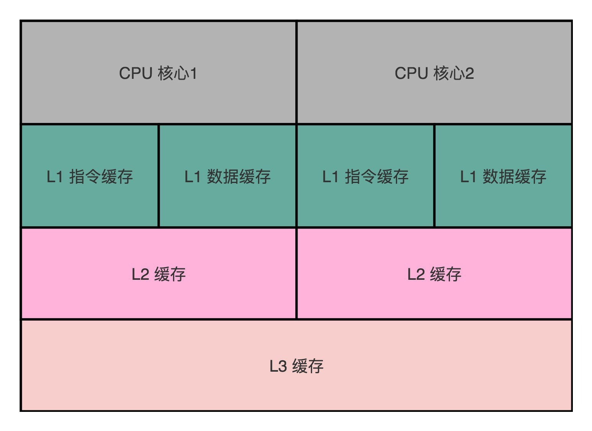
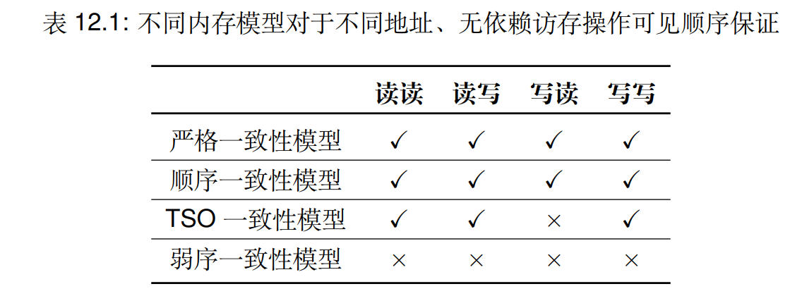

## Summary and Expand

在听完并发部分之后再回过头来做一些总结。

过去人们在软件上实现互斥做了很多努力（Peterson 算法），但由于硬件存在天然的并发性，以及各种硬件因素（流水线、多发生、中断...）导致实现原子性的困难，最终还是回到硬件上解决这个问题，同时也引出了各种软件上的挺多让人困惑的实现。

### 互斥：atomic 之下

从原子操作的假设开始总结：

- 包含一个原子指令

    - 指令的执行不能被打断

- 包含一个 compiler barrier

    - 无论何种优化都不可越过此函数

    > 这一点很重要——例如我们今天的编译器支持 Link-time Optimization (LTO)，如果缺少 compiler barrier，编译优化可以穿过 volatile 标记的汇编指令。

- 包含一个 memory fence

    保证操作执行前指令的写入，能对其他处理器之后的 load 可见；

    - 保证处理器在 stop-the-world 前所有对内存的 store 都 “生效”
    - 即对 resume-the-world 之后的 load 可见

> ```C
> int xchg(int volatile *ptr, int newval) {
>   int result;
>   asm volatile(
>     // 指令自带 memory barrier
>     "lock xchgl %0, %1"
>     : "+m"(*ptr), "=a"(result)
>     : "1"(newval)
>     // Compiler barrier
>     : "memory"
>   );
>   return result;
> }
> ```


通过看这三个点，一下就知道了原子操作、compiler barrier、memory barrier 是实现现代多处理器系统上的互斥的重点，但对于想探究到底的人来说就感觉心中堵塞（就这么塞了三个概念？），由此再简单了解一点硬件因素，就能知道其中的缘由。

- **原子操作**

    我自己理解为原子操作是不能被各种各样的事件所分割。

    之前认为的观点：一条汇编指令是原子的，是不可分割的最小执行单位。

    但是粗略学习过计算机组成原理（并不深入）和 PA 和上完并发之后，了解到流水线、微操作、超标量、缓存等等概念。发现从 CPU 的视角来说机器指令还真不是最小的执行单位。具体从 CPU 的微架构历史学起（**可能很多内容是无关的，只是用于自己理清逻辑的**），同时借助 AI 总结：

    1. **早期阶段（1960s-1980s）：低效但简单正确**

        - **技术特点**：

            - **单周期执行**：指令在一个时钟周期内完成（无流水线）。

            - **流水线**：单条指令的执行拆分为多个阶段（如取指、译码、执行、访存、写回），每个阶段由独立硬件单元处理，提升吞吐量。

                带来**并行性**：不同指令的不同阶段可同时执行（如指令A在执行阶段时，指令B在译码阶段）。

            - **微操作（Micro-Ops）分解**

                复杂指令（如 x86 架构的 `ADD [MEM], REG`）在 CPU 内部会被解码为多个**微操作**（μOps），每个微操作对应一个简单的硬件操作（如内存读取、ALU 计算、结果写回）。

                - **CISC 与 RISC 对比**：
                    - **CISC**（如 x86）指令复杂，通常需要拆解为多个 μOps。
                    - **RISC**（如 ARM）指令简单，可能 1:1 对应 μOps，但仍需流水线处理。
                - **原子性缺失**：单条机器指令被转化为多个 μOps，每个 μOps 才是 CPU 调度的最小执行单位。

        - **原子性**

            - **对外原子性**：流水线设计：**对外隐藏内部阶段分割**，使指令的最终结果表现为原子性（即程序员视角的“不可分割”）。

                但**内部关键**：**提交阶段（Retirement）**

                - **结果提交**：
                    指令的写回操作（更新寄存器或内存）仅在流水线的最终阶段（提交阶段）生效。
                - **原子性假象**：
                    即使指令在流水线中被分解为多个阶段，硬件确保所有副作用（如寄存器修改、内存写入）一次性对外可见，从而维持原子性。

            - **保证原子性**

                那个时代实现原子性比较简单，因为主要的原子性威胁来自**中断**。由此软件上**关中断**，就能确保指令执行的顺序。但这并不能保证硬件的并行影响 sequence呀？intel是这么做的：

                - **总线锁**：通过硬件信号（如 `LOCK#`）直接锁住内存总线，阻止其他设备干扰。）

                    `LOCK XCHG [x], AX ; 原子交换`

                年代有点久远，不太能够找到提出这个设计的原由了，但初次看到这个概念想着是为了**避免频繁开关中断的性能开销**吧？后来，看到intel 1982年推出的 intel 8237 DMA 设备，突然就明白：在单核处理器系统中，除了CPU，还有其他总线主设备（如DMA控制器、I/O控制器）也会**访问内存**。如果没有总线锁，CPU和DMA控制器可能会同时访问共享资源，导致数据竞争！

                由此在硬件上实现原子性：总线锁可以确保在CPU执行关键操作时，其他总线主设备无法访问共享资源。

            - **澄清**

                从计算机体系结构的角度来看，流水线技术本身并不会直接破坏指令的原子性，但需要硬件设计层面的特殊机制来维护原子性。

                - **冒险（Hazard）的影响**：
                    数据冒险、控制冒险会导致流水线停顿或清空，但这是为了维护**执行正确性**，而非原子性。
                - **原子性保障**：
                    即使流水线中存在冒险，硬件通过提交阶段的原子提交机制，确保指令结果对外表现为原子。

    2. **性能优化阶段（1980s-2000s）：并行、加速技术**

        - **技术革新**：
            - **多核处理器**：天然并行性
            - **超标量**（1990s）：每个周期发射多条指令（如 Intel Pentium 双发射）。
            - **Cache**：时间局部性原理，加速。
            - **乱序执行**（1990s）：动态调度指令执行顺序，掩盖延迟。
        - **原子性破坏**：
            - **多发射**：多发射使得多核心同时执行多条指令，导致对共享资源的并发访问。如果这些指令涉及对同一内存位置的读写操作，就会破坏原子性。
            - **乱序执行**：乱序执行允许CPU根据资源可用性和依赖关系重新排列指令的执行顺序。虽然乱序执行本身不会破坏单个线程内的指令顺序，但在多线程环境中，可能会导致指令的执行顺序与程序逻辑不一致。
            - **Cache**：虽说通过多核、缓存加快了数据访问速度，但同时提高了系统的复杂性，同步各核心，缓存和内存中的数据也成了一个问题，如果双方的数据都不一致，那保证原子性也是没意义的。

        但总的来说，总线锁在简单环境下依然奏效，但是粗粒度，性能差，有没有更好的？（有的有的🤣🤣🤣）

        现在的目的就是为了同步各核心的各缓存中的数据，而实际上这部分就是常常听到 缓存一致性（Cache Coherence）。

        > 由于成本和性能（空间和时间）的trade-off，现代的多处理器系统使用多级
        > 高速缓存（Multilevel Cache）来缓存高频访问的数据，各个核心有自己的多级缓存：
        >
        > 
        >
        > 由于不同核心均拥有私有的高速缓存（如一级缓存），某一地址上的数据可能同时存在于多个核心的一级缓存中。    
        >
        > 当这些核心同时使用写回策略修改该地址的数据时，会导致不同核心上一级缓存中该地址数据不一致，违反了共享内存的抽象。
        >
        > 为了保证私有缓存之间也能就某一地址的值达成共识，多核硬件提供了**缓存一致性协议（Cache Coherence Protocol）**  

        其中比较出名的就是 MESI（Modified/Exclusive/Shared/Invalid 状态）同步缓存行，具体内容不展开，简单概述后面再说。

----

但先停停，实际上到这里，我自己又进一步对原子指令分成了两种，借助 AI 总结：

1. **指令执行的原子性**

    - **定义**：一条指令在 CPU 内部是否不可分割（即执行过程中不会被中断或与其他指令交织）。

        **示例**：x86 的 `ADD REG, [MEM]` 可能被拆解为 `LOAD→ALU→STORE`，但硬件保证其对外表现为原子（锁总线）。

2. **（共享）内存操作的原子性（重点）**

    - **定义**：对内存的读写操作是否对其他观察者（其他 CPU 核、DMA 设备等）表现为瞬间完成，且中间状态不可见。
    - **关键矛盾**：
        - **缓存层级**：CPU 通过缓存（L1/L2/L3）访问内存，修改缓存后需通过一致性协议（如 MESI）同步到其他核。
        - **总线延迟**：即使单条指令内部是原子的，其内存操作结果可能延迟传播到其他观察者。

    > 之后主要关注内存操作的原子性。（原因？）

    实际上，当我自己想出这部分内容的时候，再询问 DeepSeek 后，发现其实就是 memory consistency 的内容，也就是老师后面说的 memory barrier 的底层内容。由此继续继续展开

----

- Memory barrier

    > 保证操作执行前指令的写入，能对其他处理器之后的 load 可见

    初看这句话可能会感觉到迷惑，但它覆盖到了重点，还是从之前的理解入手。

    关于内存，无非就是读写（当然，讨论的是不同地址，如果是同一个地址或者存在依赖的，处理器内部会做好的（hazard））。

    > 但需要注意，这是共享内存，有多个设备共同使用（多核、cache、DMA、各种控制器...），那就会引出一个谁先谁后的顺序问题，如果多个设备都认为是自己先，那读写数据都只会取自己的那一份。例子，（像逛漫展排队领编号贴纸一样，来一个人加就1，如果规定了好顺序，每个人领到的贴纸是一样的，如果多个人一起来，那有些人就会领到相同的号码）

    具体来说就是读/写操作的组合：读读、读写、写读、写写。其实不管怎么样，只要硬件或者软件清楚这个顺序，有一方能做出合理的决策就可以！

    同时，还有一点，对共享内存的操作要对各个设备（多核、DMA...）都可见。如果不可见，相当于有核心神不知鬼不觉地改了这个地址的数据，那别的核心也都是错的。

    > 同样也是排队领编号贴纸，编号贴纸就这些，有人来了但是不领，或者领了但是没写编号，这也是不行的。

    用现代理论总结的就是两个重要的点：操作顺序和可见性。

    > DeepSeek：
    >
    > 1. **操作顺序的类型**
    >     - **程序顺序（Program Order）**：代码中编写的操作顺序（开发者预期）。
    >     - **执行顺序（Execution Order）**：实际硬件/编译器优化后可能的顺序（可能重排）。
    >
    > 2. **可见性（Visibility）**
    >     - **定义**：一个线程对共享变量的修改何时对其他线程可见。
    >     - **问题**：若线程A写入变量`x`，线程B可能无法立即看到新值（因缓存未同步、写缓冲区延迟等）。
    >
    > 3. **核心矛盾**
    >     - **性能优化**：硬件（如乱序执行）和编译器（如指令重排）会调整操作顺序以提高性能。
    >     - **正确性需求**：多线程程序需按开发者预期的顺序和可见性执行，否则逻辑可能错误。

    这个时候再看处理器的乱序执行，不就会有上面的问题了吗？

    再回去看各个教材资料说到的 Consistency  model 就相对容易理解点。

    > 《操作系统系统原理与实现》第十二章 多核与多核处理器——陈海波、夏虞斌

    > 当然，如果再细致一点学习一下理论，会发现还有一个词叫 Linearizability，具体可 Wikipedia，放最后了，这里不展开。

    > 具体还是以具体例子：x86的 TSO 一致性 模型来理解，我觉得这部分我不太能写出来，自己还是有一些没有弄懂的地方，直接看教材，留坑 **==未来补充==**。
    >
    > 

    以 x86 的 TSO一致性模型来说，其保证对不同地址且无依赖的读读、读写、写写操作之间的全局可见顺序，只有写读的全局可见顺序不能得到保证，那就是说在遇到这种情况的时候，加上 `mfence` 就能保证顺序的正确。

    > 简单总结一些 consistency 的层级关系，我个人学习理解用：
    >
    > 1. **缓存一致性**是硬件层的机制，解决多核缓存数据同步问题。
    > 2. **一致性模型**是硬件/软件接口的规则，定义内存操作的可见性与顺序性。
    > 3. **编程语言内存模型**是高层抽象，屏蔽硬件差异，提供跨平台的多线程语义。（这里没讲）
    >
    > - 层级关系（LLM 总结）
    >     - **内存模型（Memory Models）**：位于上层，主要面向程序员和编译器，定义了多线程程序中内存操作的语义和规则。内存模型决定了编译器如何对内存操作进行优化和重排序，以生成高效的机器代码。
    >     - **一致性模型（Consistency Model）**：位于中间层，是内存模型和缓存一致性协议的桥梁。它定义了硬件层面如何实现内存模型的规则，包括缓存一致性协议如何与处理器的内存操作协同工作，以保证整个系统的内存一致性。
    >     - **缓存一致性（Cache Coherence）**：位于下层，主要面向硬件实现，确保多个处理器核心的缓存中共享数据的一致性。缓存一致性协议是实现一致性模型的基础，通过定义缓存行的状态和状态转换规则，来维护缓存数据的一致性。

- Complier barrier

    那这个 Compiler barrier 又是什么？别忘了，处理器会进行指令重排，编译器也会进行代码优化重排代码呀！但是二者区别？又是什么？我不清楚，让 AI 给我生成：

    | **特性**     | **编译器屏障**                             | **内存屏障**                                  |
    | :----------- | :----------------------------------------- | :-------------------------------------------- |
    | **作用对象** | **编译器优化（阻止编译器重排代码）**       | **硬件执行（阻止 CPU 或内存控制器重排指令）** |
    | **影响范围** | **代码生成的顺序（静态）**                 | **内存操作的执行顺序（动态）**                |
    | **典型实现** | `asm volatile("" ::: "memory")`（GCC语法） | `mfence`（x86）、`dmb`（ARM）                 |
    | **目标问题** | 防止编译器优化破坏代码顺序（如 LTO 优化）  | 防止硬件重排导致内存操作顺序不符合预期        |

    哦！还是回到之前总结的，前面关注的就是在对于内存的操作，无论是原子性还是memory barrier，是硬件上的限制，而这里更多关注的是软件代码上的限制！

    回到老师上课给出的例子：

    > 操作自带一个 compiler barrier，防止优化跨过函数调用。这一点很重要——例如我们今天的编译器支持 Link-time Optimization (LTO)，如果缺少 compiler barrier，编译优化可以穿过 volatile 标记的汇编指令；

    - **编译器优化破坏顺序（如 LTO）**

        - **场景**：
            使用 `volatile` 汇编指令时，编译器可能将相邻的非 `volatile` 代码重排到汇编指令之外。

        - **示例**：

            ```c
            extern void device_write(int val);
            
            void write_to_device() {
                //.... compute... -> result = 42
                int data = result;
                asm volatile("movl %0, (DEVICE_ADDR)" : : "r"(data)); // 设备写入
                status_flag = 1; // 可能被编译器重排到汇编指令前
            }
            ```

        - **解决方案**：插入编译器屏障

            ```c
            void write_to_device() {
                //.... compute... -> result = 42
                int data = 42;
                asm volatile("movl %0, (DEVICE_ADDR)" : : "r"(data));
                asm volatile("" ::: "memory"); // 阻止编译器重排
                status_flag = 1;
            }
            ```

        

    - **硬件重排破坏内存顺序（如 x86 TSO）**

        - **场景**：
            x86 的 TSO 模型允许 **Store→Load 重排**，导致后续读操作看到旧值。

        - **示例**：

            ```c
            int x = 0, y = 0;
            
            void thread1() {
                x = 1;          // Store
                int r = y;      // Load（可能先于x=1执行）
            }
            
            void thread2() {
                y = 1;
                while (x == 0) {} // 可能死循环
            }
            ```

        - **解决方案**：插入内存屏障

            ```c
            void thread1() {
                x = 1;
                asm volatile("mfence" ::: "memory"); // 内存屏障
                int r = y; // 确保x=1对其他核可见后再读y
            }
            ```

    

    当然，我觉得对于开发者来说，memory barrier、compiler barrier 一起用不是更好？（我没有太多的经验，再学习）

    所以我再总结：

    - **memory barrier 与 compiler barrier 协同**

        也就是提供**完整屏障**：实际代码中通常同时使用编译器屏障和内存屏障，例如：

        ```c
        // x86的mfence隐含编译器屏障
        #define barrier() asm volatile("mfence" ::: "memory")
        ```

        - `mfence` 既是内存屏障（阻止硬件重排），`:::"memory"`也是编译器屏障（阻止编译器重排）。

    - **自己理解的误区**

        - **误区1**：**`volatile` 变量隐含内存屏障。**

            - **事实**：`volatile` 仅阻止编译器优化，不生成内存屏障指令。
            - **修正**：需显式使用屏障（如 `mfence`）。

            > 回顾 volatile ，实际上要求每一次操作都去内存、防止编译器优化

        - **误区2**：编译器屏障能解决硬件重排。

            - **事实**：编译器屏障仅控制代码生成顺序，不限制硬件重排。
            - **修正**：需结合内存屏障。


由上三个假设的基础，原子操作就成为了我们简化程序执行的基础机制。

- 通过自旋 (spin)，可以很直观地实现 “轮询” 式的互斥。
- 为了节约共享内存线程在自旋上浪费的处理器，我们也可以通过系统调用请求操作系统来帮助现成完成互斥。


> 参考资料
>
> - 操作系统系统原理与实现》——陈海波、夏虞斌
> - [Linearizability - Wikipedia](https://en.wikipedia.org/wiki/Linearizability)
> - [Consistency model - Wikipedia](https://en.wikipedia.org/wiki/Consistency_model#Consistency_and_replication)
> - [Cache coherence - Wikipedia](https://en.wikipedia.org/wiki/Cache_coherence)
> - [Atomic vs. Non-Atomic Operations](https://preshing.com/20130618/atomic-vs-non-atomic-operations/)


之后的同步、并发bugs 都建立于此基础上，产生各种问题，那些有空再总结（或者 AI 生产一版？）