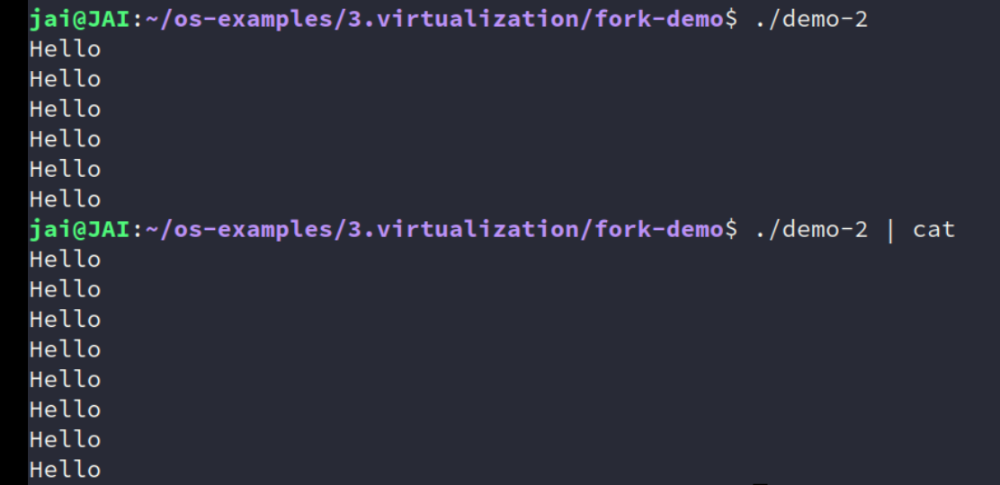
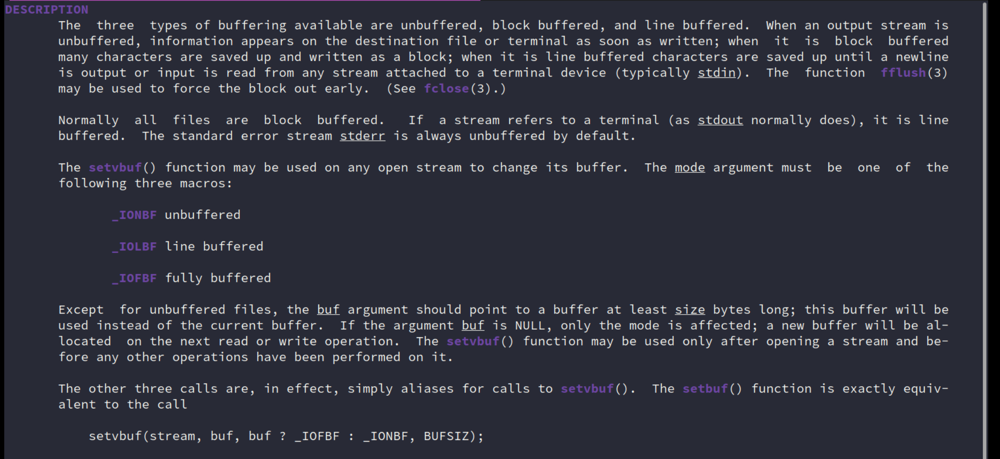
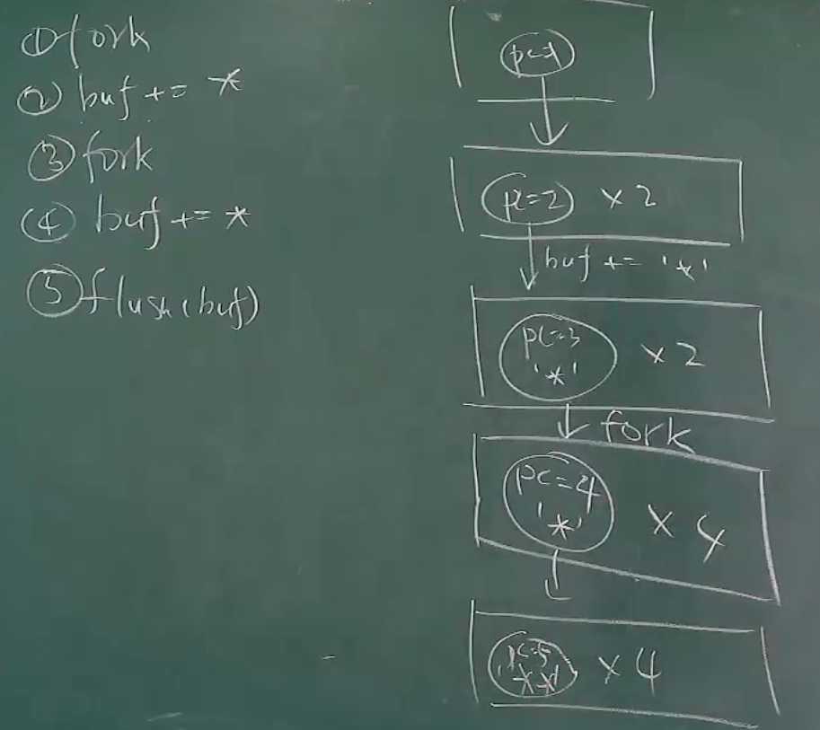
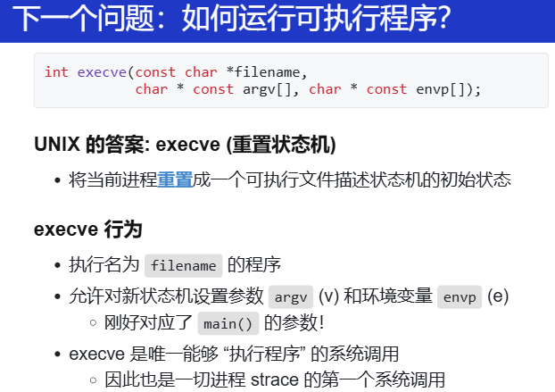
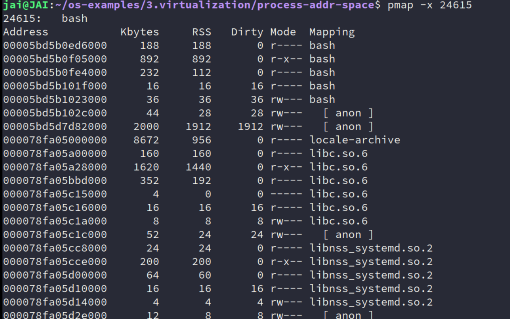
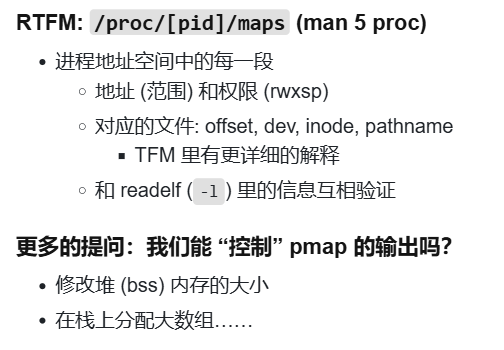
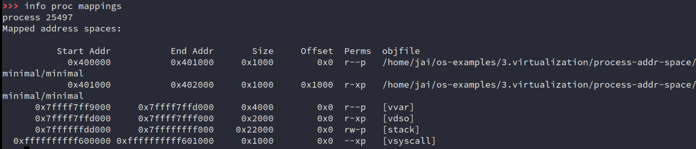
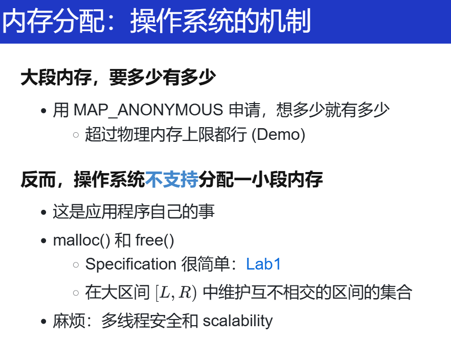
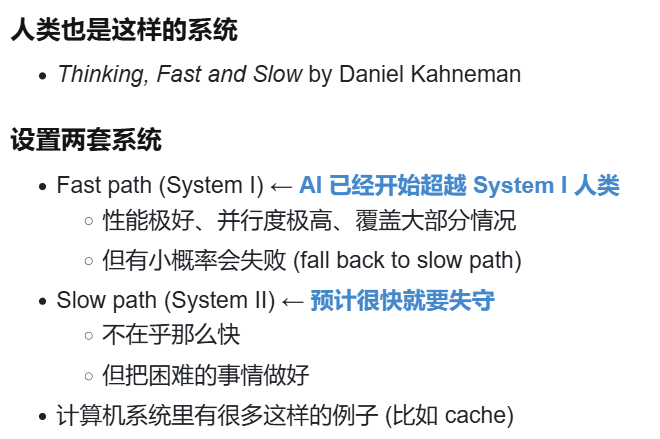

## 来自 DeepSeek

---

### **一、虚拟化技术演进路线 & 对应实验**
以下是按技术演进顺序整理的核心问题链，每个阶段对应一个实验方向：

---

#### **1. 进程抽象与隔离**
**问题**：早期计算机只能运行单个程序，如何实现多程序并发执行？  
**技术演进**：  
- **进程概念**（1960s Multics）：引入进程作为资源隔离单位（CPU、内存、I/O）  
- **进程控制块（PCB）**：保存进程状态（寄存器、内存映射表等）  
- **系统调用**：用户态与内核态隔离（如 `fork`, `exec`, `wait`）  

**实验建议**：  
- **实现一个简易进程调度器**（xv6实验框架）  
  - 用链表管理PCB，实现 `fork` 创建进程（仅复制PCB，暂不处理内存）  
  - 实现时间片轮转调度（触发时钟中断切换进程）  
- **关键挑战**：上下文切换的寄存器保存与恢复  

---

#### **2. 物理内存管理的局限**
**问题**：多进程直接操作物理内存会导致冲突，如何隔离？  
**技术演进**：  
- **分段机制**（1960s）：基址寄存器 + 界限寄存器实现逻辑地址到物理地址的映射  
- **问题**：外部碎片化，内存利用率低  

**实验建议**：  
- **实现基于分段的物理内存分配器**  
  - 维护空闲内存块链表（首次适应、最佳适应算法）  
  - 模拟进程申请/释放内存时的碎片问题  

---

#### **3. 虚拟内存与分页**
**问题**：分段导致外部碎片，如何更细粒度管理内存？  
**技术演进**：  
- **分页机制**（1970s）：固定大小的页（如4KB），页表映射逻辑地址到物理地址  
- **问题**：页表过大（如32位地址需4MB页表），访问速度慢  

**实验建议**：  
- **实现多级页表**（如xv6的两级页表）  
  - 设计页表项（PTE）结构（Present位、RW位等）  
  - 处理缺页中断（Page Fault）  

---

#### **4. 地址空间与共享内存**
**问题**：进程间如何安全共享内存（如动态库）？  
**技术演进**：  
- **写时复制（Copy-on-Write）**：`fork` 时不复制物理页，共享只读，写时触发缺页中断再复制  
- **内存映射文件（mmap）**：将文件映射到进程地址空间  

**实验建议**：  
- **在进程调度器中实现COW**  
  - 修改 `fork` 逻辑，标记共享页为只读  
  - 处理写保护缺页中断，复制物理页  

---

#### **5. 高级调度策略**
**问题**：时间片轮转的公平性问题，如何优化CPU利用率？  
**技术演进**：  
- **多级反馈队列（MLFQ）**：动态调整进程优先级（交互式进程优先）  
- **完全公平调度（CFS）**：基于虚拟运行时间分配CPU（Linux默认调度器）  

**实验建议**：  
- **在调度器中实现MLFQ**  
  - 设计多优先级队列，动态调整进程优先级  
  - 统计进程的CPU使用时间和等待时间  

---

#### **6. 中断与并发控制**
**问题**：中断处理与进程调度如何避免竞态条件？  
**技术演进**：  
- **关中断**：简单但破坏实时性  
- **自旋锁（Spinlock）**：忙等待，适用于短临界区  
- **信号量（Semaphore）**：阻塞等待，适用于长临界区  

**实验建议**：  
- **实现自旋锁和信号量**  
  - 使用原子指令（如x86的 `xchg`）实现锁  
  - 用等待队列管理阻塞进程  

---

### **二、推荐实验项目**
以下项目按难度递增排序，建议结合演进路线选择阶段实验：

1. **xv6 Labs**（MIT 6.1810）  
   - 官网：https://pdos.csail.mit.edu/6.828/2023/xv6.html  
   - 特点：代码简洁（约1万行），适合理解核心机制（进程、内存、文件系统）  
   - 推荐实验：`syscall`, `pgtbl`, `cow`, `thread`, `lock`

2. **PintOS**（Stanford CS140）  
   - 官网：https://web.stanford.edu/class/cs140/projects/pintos/  
   - 特点：更贴近现代OS设计（支持多线程、用户态），难度中等  
   - 推荐实验：`Threads`, `User Programs`, `Virtual Memory`

3. **JOS**（MIT 6.828）  
   - 官网：https://pdos.csail.mit.edu/6.828/  
   - 特点：从零构建一个Unix-like内核，涵盖虚拟内存、进程隔离、文件系统  

---

### **三、学习资源推荐**
#### **书籍与文档**  
1. **《Operating Systems: Three Easy Pieces》**（OSTEP）  
   - 虚拟化部分：https://pages.cs.wisc.edu/~remzi/OSTEP/  
   - 重点章节：5-10章（进程）、13-21章（内存）、25-33章（并发）  

2. **《Linux内核设计与实现》**（Robert Love）  
   - 实践导向，讲解Linux调度、内存管理、中断处理的核心实现  

3. **蒋炎岩老师的课程资料**  
   - B站公开课：https://www.bilibili.com/video/BV1Cm4y1d7Ur  
   - 配套实验：https://nju-projectn.github.io/ics-pa-gitbook/  

#### **技术文章与论文**  
1. **《The Evolution of the Unix Time-sharing System》**（Dennis Ritchie）  
   - 理解Unix设计哲学：https://www.bell-labs.com/usr/dmr/www/hist.pdf  

2. **《Melting the Snowflake in Your Laptop》**（Linux内存管理）  
   - 图解Slab/Slub：https://events.static.linuxfound.org/sites/events/files/slides/slaballocators.pdf  

---

### **四、学习建议**
1. **从简到繁**：先通过xv6理解基础机制，再挑战PintOS/JOS的复杂设计  
2. **代码精读**：重点阅读Linux内核的 `mm/`（内存管理）和 `kernel/sched/`（调度）目录  
3. **调试工具**：熟练使用QEMU+GDB调试内核，理解硬件与软件的交互细节  

如果有具体技术点需要深入讨论（如页表实现细节或锁的优化），欢迎随时交流！


## 操作系统上的进程


### 第一个进程

- 操作系统的启动
    - Firmware 阶段
        - CPU Reset 后，Firmware 代码开始执行
        - 加载操作系统
    - 操作系统初始化阶段
        - 操作系统扫描系统中的硬件、初始化数据结构……
        - 加载第一个进程 (状态机)
    - 操作系统执行阶段
        - 状态机在 CPU 上执行
        - 允许执行 syscall 进入操作系统代码


### 创建新进程

`fork` 做了什么？立即复制状态机

- **包括==所有信息==的完整拷贝**
    - 每一个字节的内存
    - 打开的文件 (共享)
    - ……
    - 复制失败返回 -1
        - errno 会返回错误原因 (man fork)


> 如何区分两个状态机？
>
> - 新创建进程返回 0
> - 执行 fork 的进程返回子进程的进程号

总结：fork() 会完整复制状态机；新创建的状态机返回值为 0，执行 fork() 的进程会返回子进程的进程号。同时，操作系统中的进程是并行执行的。程序的精确行为并不显然——model checker 可以帮助我们理解它。


#### fork 配合 printf

- example1

    ```
    pid_t x = fork(); 
    pid_t y = fork(); 
    printf("%d %d\n", x, y); 
    ```

    - 到底创建了几个状态机？
    - pid 分别是多少？
        - “状态机视角” 帮助我们严格理解

    这里不解释，这里之前在简单学习Linux系统编程的时候，画过图，原来那时候已经懵懂地使用了状态机的思想。

    但由上面的例子，也能看出 操作系统内核就是最早的并发程序，


- example2

    ```C
    for (int i = 0; i < 2; i++) {
        fork();
        printf("Hello\n");
    }
    
    // 展开
    // 第一次循环
    fork
    printf
    
    // 第二次循环
    fork
    printf
    ```

    状态机视角帮助我们严格理解程序行为

    - `./a.out`

    - `./a.out | cat`

        

        两种结果不对？不应该都是6次？

        说明哪里有问题

        - 计算机系统里没有魔法
        - (无情执行指令的) 机器永远是对的

    既然循环展开没问题，`fork` 讲的也没问题，那问题是什么？管道？ `printf` ？。。。。究竟还有什么复制了？

    记得，计算机的任何内容，到计算机底层，最终都会变成非常非常小的行为，因为最终执行的是指令！还是那句话，冤有头债有主！这样会有理有据根据底层知识地“猜”

    还记得之前学习过的输出输入流的缓冲吗？

    

    为了性能，都是fully buffered，而终端是默认 line buffered。

    > 实际上也和libc的实现也是有关的，如果是自己实现的klib，那最终也是6次。

    具体状态迁移图。

    其中有一个重点就是，buffer是在每一个进程中的，记得了吗？fork复制完整的状态机，所有的信息！这你就知道了！

    所以理解就是，`printf` 的时候，是往这个buffer里去写，fork复制的时候，这个buffer也会被复制。

    

fully buffered 就是8个了喔！管道导致标准输出变为全缓冲模式，`printf` 的 `Hello\n` 不会立即刷新，而是暂存在缓冲区。

真正搞明白，记住了，fork 是复制整个进程地址空间的内容，all！所以你知道的不知道的。

所以，当遇到某个和你认为中不符的现象，肯定是哪个状态不对或者自己脑海中理解的模型不对。

> 突发奇想，DeepSeek-R1能做对吗？还真可以！可能这题太简单了，只是我们不知道这个机制
>
> **答案分析：**
>
> ---
>
> 1. **情况1：直接运行 `./a.out`**
>
>     **执行流程与输出分析**
>
>     1. **初始进程 `P0`**：
>         - `i=0`：调用 `fork()` 生成子进程 `P1`。
>         - `P0` 和 `P1` 均执行 `printf("Hello\n")`。
>         - **输出**：`Hello`（来自 `P0` 和 `P1`，共 2 次）。
>
>     2. **进入 `i=1` 循环**：
>         - `P0` 和 `P1` 各自再次调用 `fork()`，生成子进程 `P2`、`P3`、`P4`、`P5`（实际为 4 个进程）。
>         - 所有进程（`P0`、`P1`、`P2`、`P3`）执行 `printf("Hello\n")`。
>         - **输出**：`Hello`（来自 4 个进程，共 4 次）。
>
>     3. **总输出次数**：
>         - 2（第一次循环） + 4（第二次循环） = **6 次**。
>
>     **关键机制**
>
>     - **行缓冲模式**：当标准输出直接连接到终端时，`printf` 默认使用行缓冲（`\n` 会触发立即刷新）。
>     - **无缓冲区残留**：每次 `printf` 后换行符强制刷新缓冲区，`fork()` 不会复制未刷新的数据。
> ---
>
> 2. **情况2：通过管道运行 `./a.out | cat`**
>
>     **执行流程与输出分析**
>
>     1. **缓冲模式变化**：
>         - 管道导致标准输出变为全缓冲模式，`printf` 的 `Hello\n` 不会立即刷新，而是暂存在缓冲区。
>
>     2. **进程复制与缓冲区继承**：
>         - 每次 `fork()` 会复制父进程的未刷新缓冲区。
>         - 具体流程：
>             - **第一次循环 `i=0`**：
>                 - `P0` 调用 `fork()` 生成 `P1`。
>                 - `P0` 和 `P1` 的缓冲区均暂存 `Hello\n`（未输出）。
>             - **第二次循环 `i=1`**：
>                 - `P0` 和 `P1` 再次调用 `fork()`，生成 `P2`、`P3`、`P4`、`P5`。
>                 - 所有进程的缓冲区继承父进程内容，此时每个进程的缓冲区包含 `Hello\n`（第一次循环）。
>                 - 每个进程执行第二次 `printf("Hello\n")`，缓冲区追加第二个 `Hello\n`。
>             - **进程退出时**：全缓冲区的数据被强制刷新，每个进程输出 `Hello\nHello\n`。
>
>     3. **总输出次数**：
>         - 每个进程输出 2 次，4 个进程 × 2 = **8 次**。
>
>     **关键机制**
>
>     - **全缓冲模式**：管道导致 `printf` 使用全缓冲，数据暂存不立即输出。
>     - **缓冲区继承**：`fork()` 复制父进程的未刷新缓冲区，子进程拥有相同内容。
>     - **叠加输出**：每个进程的缓冲区在退出前累积两次 `Hello\n`，最终输出双倍。
>
> ---
>
>  **状态机对比**
> | 操作             | `./a.out`（行缓冲）  | `./a.out | cat`（全缓冲） |
> | ---------------- | -------------------- | ------------------------- |
> | **第一次循环后** | 缓冲区已刷新，无残留 | 缓冲区残留 `Hello\n`      |
> | **第二次循环后** | 缓冲区已刷新，无残留 | 缓冲区残留两个 `Hello\n`  |
> | **进程退出时**   | 无操作               | 强制刷新缓冲区，输出两次  |
>
> ---
>
>  **总结**
> - **直接运行**：行缓冲确保每次 `printf` 后立即输出，总次数为 6。
> - **管道运行**：全缓冲导致 `fork()` 复制未刷新缓冲区，最终输出翻倍至 8。


### 运行可执行文件

接着 fork 创建状态机，那状态机总得跑起来！



关键：**重置**。重置到初始状态。


那为什么不统一成一个？真有点奇怪。。不懂那时候的设计。

Spawn = fork() + execve()。那写代码变成这样：

```C
int pid = fork();
if (pid == -1) {
    perror("fork"); goto fail;
} else if (pid == 0) {
    // Child
    execve(...);
    perror("execve"); goto fail;
} else {
    // Parent
    ...
}
```


- 环境变量

    

    > `export`: 告诉 shell 在创建子进程时设置环境变量
    >
    > 这个做实验的时候就在用！但是实际上是这么个原理！

    这个设计，还真的是无处不在。究竟怎么理解？之前做 PA 的感觉：要运行某个程序，然后输入这个的所在目录的全称然后找到它，为了方便，就把这个目录添加到一个地方，然后每次OS运行程序的时候，都会区这些目录寻找这些程序。应用程序执行的环境，这名字确实挺好。
    
    - 例子：`PATH` 环境变量
    
        
    
    从上面状态机的理解：`execve` 重置，那就是要准备一些初始状态：`argc, argv, envp`
    
    
    
    再问问 DeepSeek
    
    **说实话，现在已将养成习惯，遇到一些不懂不会的内容，先用自己的理解说一遍，然后再用 LLM，配合找一些资料，让他总结，我发现LLM做一些事实性的东西真的是不太会出错的。**
    
    **另一种想法：在做代码实验、开发的时候，我想明白这些设计，明白用哪些接口写，然后再用 LLM 帮我写，这样的效率我觉得很高！**
    
    > 环境变量是操作系统中一个非常关键的设计概念，它的本质是 **动态配置数据的全局存储机制**，用于在程序运行时传递参数或控制程序行为。它的设计核心可以用一句话概括：**将配置与代码分离，通过外部环境动态控制程序行为**。
    >
    > ---
    >
    > 1. **从「运行程序」的场景理解环境变量**
    >     以 `PATH` 环境变量为例，它的设计解决了以下问题：
    >       1. **路径依赖问题**  
    >          如果每次运行程序都要输入完整路径（如 `/usr/bin/ls`），用户体验极差。
    >       2. **集中管理路径**  
    >          将常用路径统一存储在 `PATH` 中，操作系统自动搜索这些路径，避免重复输入。
    >       3. **动态配置**  
    >          用户可以根据需要随时修改 `PATH`，无需重新编译程序或修改系统代码。
    >
    > **设计实现的关键点**：
    > - **存储结构**：环境变量通常以键值对（`KEY=value`）形式存储，例如 `PATH=/usr/bin:/usr/local/bin`。
    > - **作用范围**：环境变量是进程级别的，每个进程继承自父进程的环境变量副本。
    > - **查找规则**：当执行命令时，操作系统按 `PATH` 中定义的目录顺序搜索可执行文件。
    >
    > ---
    >
    > 2. *环境变量的底层设计原理**
    >
    >     1. **操作系统如何存储环境变量？**
    >
    >         - **进程内存模型**：  
    >             在 Unix/Linux 系统中，每个进程启动时，环境变量以字符串数组形式存储在进程内存的 **环境段（Environment Segment）** 中。例如：
    >
    >             ```c
    >             char *envp[] = {"PATH=/usr/bin", "USER=alice", NULL};
    >             ```
    >
    >         - **继承机制**：  
    >             通过 `fork()` 创建子进程时，子进程会复制父进程的环境变量；通过 `exec()` 执行新程序时，可以选择保留或重置环境变量。
    >
    >     1. **环境变量的操作接口**
    >
    >         - **读取环境变量**：  
    >             通过 C 标准库函数 `getenv("PATH")` 获取值。
    >         - **设置环境变量**：  
    >             使用 `setenv("PATH", "/new/path", 1)`（覆盖）或 `putenv("PATH=/new/path")`。
    >         - **命令行操作**：  
    >             在 Shell 中通过 `export PATH=/new/path`（Linux）或 `set PATH=C:\new\path`（Windows）临时修改。
    >
    >     1. **环境变量的设计哲学**
    >
    >         - **解耦配置与代码**：  
    >             程序行为不再硬编码在代码中，而是通过外部环境动态调整。例如：
    >             - `LANG=zh_CN.UTF-8` 控制程序语言环境。
    >             - `http_proxy=http://proxy:8080` 控制网络代理。
    >         - **分层作用域**：  
    >             - **系统级环境变量**：影响所有用户（如 `/etc/environment`）。
    >             - **用户级环境变量**：仅影响当前用户（如 `~/.bashrc`）。
    >             - **进程级环境变量**：仅在当前进程生效（通过代码设置）。
    >
    > ---
    >
    > 3. **环境变量的实际应用场景**
    >
    >     1. **程序路径搜索（PATH）**
    >
    >         - **问题**：如何让系统找到用户安装的非标准路径程序？
    >
    >         - **解决方案**：将自定义路径加入 `PATH`：
    >
    >             ```bash
    >             export PATH="$PATH:/my/custom/bin"
    >             ```
    >
    >             此后，直接输入 `my_program` 即可运行 `/my/custom/bin/my_program`。
    >
    >     1. **开发环境配置**
    >
    >         - **场景**：同一台机器上需要多个版本的 Python（Python 2.7 和 Python 3.9）。
    >
    >         - **解决方案**：通过环境变量切换版本：
    >
    >             ```bash
    >             export PATH="/opt/python3.9/bin:$PATH"  # 优先使用 Python 3.9
    >             ```
    >
    >     1. **调试与日志控制**
    >
    >         - **场景**：控制程序输出调试信息。
    >
    >         - **解决方案**：通过环境变量开关：
    >
    >             ```bash
    >             DEBUG=1 ./my_app  # 程序内部检查 DEBUG 变量决定是否打印日志
    >             ```
    >
    >     1. **容器化与云原生**
    >
    >         - **场景**：在 Docker/Kubernetes 中传递数据库密码、API 密钥等敏感信息。
    >
    >         - **解决方案**：通过环境变量注入配置：
    >
    >             ```
    >             # Kubernetes Pod 配置
    >             env:
    >               - name: DB_PASSWORD
    >                 valueFrom:
    >                   secretKeyRef:
    >                     name: db-secret
    >                     key: password
    >             ```
    >
    > ---
    >
    > 4. **环境变量与安全**
    >
    >     1. **敏感信息泄露风险**
    >
    >         - **问题**：环境变量对所有子进程可见，可能导致密码泄露。
    >         - **解决方案**：避免通过环境变量传递敏感信息，改用加密文件或密钥管理服务（如 Vault）。
    >
    >     2. **路径劫持攻击**
    >
    >         - **问题**：恶意用户篡改 `PATH`，将 `ls` 指向恶意程序。
    >
    >         - **解决方案**：确保 `PATH` 不包含当前目录（`.`），并限制权限：
    >
    >             ```bash
    >             export PATH="/usr/bin:/bin"  # 不包含当前目录
    >             ```
    >
    > ---
    >
    > 5. **从设计模式看环境变量**
    >     环境变量的设计体现了以下模式：
    >       5. **全局上下文（Global Context）**：  
    >          提供一个统一的配置入口，避免参数层层传递。
    >       6. **依赖注入（Dependency Injection）**：  
    >          将外部依赖（如文件路径、服务地址）动态注入程序。
    >       7. **松耦合（Loose Coupling）**：  
    >          程序行为不再硬编码，而是依赖外部环境。
    >
    > ---
    >
    > 6. **总结**
    >
    >     6.  环境变量的设计是操作系统对 **动态配置管理** 的优雅解决方案。它通过键值对存储、进程继承机制和全局访问接口，实现了以下目标：
    >     7.  **灵活性**：允许外部动态修改程序行为。
    >     8.  **解耦**：分离代码逻辑与运行时配置。
    >     9.  **标准化**：提供统一的配置管理方式，适用于所有程序。
    >
    >     理解环境变量后，可以更高效地管理系统配置、调试程序，并设计出更灵活的软件架构。
    >
    


### 退出程序

**fork + exec = 自由执行任何程序**

- 还差一个销毁状态机的函数就完整了
- UNIX 的答案: `_exit`
    - 立即摧毁状态机，允许有一个返回值
- 子进程终止会通知父进程 (后续课程解释)

- 但问题来了：多线程程序怎么办？

    退出是推出一个进程中所有的线程，还是就退出那一个线程？


#### exit 的几种写法 (它们是不同)

- exit(0)

    - 会调用 atexit

- _exit(0)

    - 执行 “exit_group” 系统调用终止整个进程 (所有线程)

        - 细心的同学已经在 strace 中发现了

    - 会调用 atexit 吗？

        atexit 是一个libc 函数，那就是依赖于系统调用咯？

        那如果直接用系统调用，不用libc的库，那libc就不管啦！

        ```asm
        asm volatile("mov ..., %rax; syscall");
        ```

- syscall(SYS_exit, 0)

    - 执行 “exit” 系统调用终止当前线程
    - 会调用 atexit 吗？


更进一步：

```C
if (strcmp(argv[1], "_exit") == 0) {
    // This is an immediate operating system exit.
    // This _exit() is provided by libc.
    _exit(0);
}

if (strcmp(argv[1], "__exit") == 0) {
    // This is an even more "operating system" exit.
    syscall(SYS_exit, 0);                                                                                               
}
```

这两种exit的区别？在状态机上有什么区别？

第一想法应该使用 `strace` 去分析整个程序的内容！（对于一个 OS 上的程序）


但这是为什么呢？一个退整个进程，一个退一个线程？DeepSeek！


### Summary

 `fork/execve/exit`

凭着这三个系统调用，OS就能做很多事情。

`fork`：复制状态机

`execve`：重置状态机

`exit`： 销毁状态机

我就能构建很多个状态机！很多个进程！构建了进程树！pstree的缘由！

那由此回答什么是 OS：很多个状态机的管理者！但同时它也是一个状态，他也有部分状态，而 OS 要做的内容就是凭借着自己的部分状态，把各个进程树在 OS 中建立起来！pstree（M1）/实际中内核的 `struct proc`，建立起来之后，凭着自己掌控的大量内存，借助内存管理算法（L1），每当进程需要内存的时候，那就从内存分配器拿一部分给进程！

所以！OS 理解就是一个大的树结构。

老师举了一个例子：人：进程，物理世界就是 OS ，OS 做的就是把我们大家都剪碎打乱了，放到一个放库（内存，当OS 要一个进程需要的时候，再把这个人拼起来！因为存在系统调用，进程请求某些内容，然后执行权交给 OS，OS 把进程丢回仓库，最终 OS 执行完相关代码后，再把人拼起来（当然得知道从哪里拼）！


## (入侵) 进程的地址空间 

(mmap; 实现金山游侠、按键精灵、变速齿轮)


### 地址空间


什么时候读取的p是合法？Linux进程的地址分布？那些读取不会segmentation fault？

进一步，进程地址空间是什么？0到2^64^ -1 的平坦序列。

进一步，就是Linux的进程地址空间内容，怎么查看？`DeepSeek`

- `/proc/[pid]/maps`

    回想一下第一个 M1 的内容，这里面的内容不经意间就看到了。

- `pmap` 命令

    工具更常用。

    

    也能看出一些内容，比如第二行的那个 `r-x`的bash，这实际就是我们的bash的源码；

    那些

    > 但是怎么实现的？
    >
    > `cat /proc/[pid]/maps | xxx(解析这个文件)`

- `gdb`

    `info proc mappings` 基本和 `pmap` 一样。

    看看自己写的程序

> 接着？把maps文件的内容都玩个遍？！验证老师说的是不是对的！交给 AI 总结吧！

加大一个10M的数组，看看大小



再来看个简单的：minimal的地址空间的内容。



> 探索一下 `vvar`、`vdso`。。。
>
> 那就是拓展。
>
> 
>
> **vdso**: 进程的地址空间中有一些 “神秘” 的映射——当然，如果你阅读文档或询问 AI，它们的秘密也会被解开：“只读” 的系统调用可以通过与操作系统共享页面实现。vdso 就是实现这一点的机制。


#### mmap

继续主线的探索，进程的地址空间：连续的内存，梅一段内存都有读写执行...

但是从 系统调用 `execve` 重置得到的初始进程状态：寄存器、大段内存...

有一个问题？这些初始状态能不能改？怎么改？


肯定有一条指令改变这个进程地址空间，应该有一个系统调用，帮助我们增删改地址空间。`mmap`

理解：**在状态机状态上增加/删除/修改一段可访问的内存**

- `MAP_ANONYMOUS`: 匿名 (申请) 内存
- **`fd`: 把文件 “搬到” 进程地址空间中 (例子：加载器)**
- 更多的行为请参考手册 (复杂性暴增)

```C
// 映射
void *mmap(void *addr, size_t length, int prot, int flags,
           int fd, off_t offset);
int munmap(void *addr, size_t length);

// 修改映射权限
int mprotect(void *addr, size_t length, int prot);
```

再次交给 DeepSeek 看看？

>  1. **匿名映射（`MAP_ANONYMOUS`）**
>
>     - **用途**：动态分配堆内存（替代 `malloc` 的大块分配）。
>
>     - **特点**：
>
>          - 无文件关联，内存内容初始化为零。
>          - 物理内存按需分配，通过 `munmap` 释放后立即归还系统
>
>     - **示例**：
>
>          ```C
>        // 分配 1GiB 匿名内存（仅虚拟地址，物理内存按需分配）
>          void *mem = mmap(NULL, 1 << 30, PROT_READ | PROT_WRITE, 
>                         MAP_PRIVATE | MAP_ANONYMOUS, -1, 0);
>        ```
>
>  2. **文件映射（指定 `fd`）**（感觉这个是常用的？）
>
>      - 将文件内容映射到内存，实现高效文件 I/O。
>      - 动态链接库加载（如 `.so` 文件）。
>      
>      **特点**：
>      
>        - 文件内容按需加载（访问时触发缺页中断，从磁盘读取）。
>          - 修改可同步回文件（`MAP_SHARED` 模式）。
>      
>      示例：
>      
>      ```python
>        # Python 示例：映射磁盘文件并读取前 512 字节
>        with open('/dev/sda', 'rb') as fp:
>          mm = mmap.mmap(fp.fileno(), length=128<<30, prot=mmap.PROT_READ)
>           print(hexdump(mm[:512]))  # 仅实际读取 512 字节到物理内存
>      ```

> 以下是使用 `mmap` 将文件映射到进程地址空间的详细示例和解析。我们通过一个具体的 C 代码示例，展示如何将文件内容映射到内存中，并直接通过指针操作文件内容。
>
> ---
> **C 代码示例：文件映射与内存操作**
>
> ```c
> #include <stdio.h>
> #include <sys/mman.h>
> #include <sys/stat.h>
> #include <fcntl.h>
> #include <unistd.h>
> #include <string.h>
> 
> int main() {
> 	const char *file_path = "example.txt";
> 	const size_t file_size = 4096; // 映射 4KB 文件内容
> 	
> 	// 1. 打开文件（若不存在则创建，权限为可读写）
> 	int fd = open(file_path, O_RDWR | O_CREAT, 0666);
> 	if (fd == -1) {
> 	  perror("open");
> 	  return 1;
> 	}
> 	
> 	// 2. 调整文件大小（确保文件足够大）
> 	if (ftruncate(fd, file_size) == -1) {
> 	  perror("ftruncate");
> 	  close(fd);
> 	  return 1;
> 	}
> 	
> 	// 3. 将文件映射到内存（PROT_READ | PROT_WRITE 可读写，MAP_SHARED 修改同步到文件）
> 	void *addr = mmap(
> 	  NULL,           // 由内核选择映射地址
> 	  file_size,      // 映射长度
> 	  PROT_READ | PROT_WRITE, // 内存可读可写
> 	  MAP_SHARED,     // 修改会同步到文件
> 	  fd,             // 文件描述符
> 	  0               // 文件偏移量（从文件头部开始映射）
> 	);
> 	if (addr == MAP_FAILED) {
> 	  perror("mmap");
> 	  close(fd);
> 	  return 1;
> 	}
> 	
> 	// 4. 通过内存指针直接操作文件内容
> 	printf("文件已映射到内存地址: %p\n", addr);
> 	
> 	// 写入数据到内存（自动同步到文件）
> 	const char *message = "Hello, mmap!";
> 	strncpy((char *)addr, message, strlen(message));
> 	
> 	// 读取并打印内存中的数据
> 	printf("文件内容: %s\n", (char *)addr);
> 	
> 	// 5. 解除映射并关闭文件
> 	if (munmap(addr, file_size) == -1) {
> 	  perror("munmap");
> 	}
> 	close(fd);
> 	
> 	return 0;
> }
> ```
>
> 1. **打开文件**
>
>     ```c
>     int fd = open("example.txt", O_RDWR | O_CREAT, 0666);
>     ```
>
>     - **作用**：以读写模式打开文件（若文件不存在则创建）。
>     - **权限**：`0666` 表示文件对所有用户可读写。
>
> 2. **调整文件大小**
>
>     ```c
>     ftruncate(fd, 4096); // 将文件大小设为 4KB
>     ```
>
>     - **必要性**：`mmap` 要求文件大小至少等于映射长度。若文件较小，需先扩展。
>
> 3. **映射文件到内存**
>
>     ```C
>     void *addr = mmap(NULL, 4096, PROT_READ | PROT_WRITE, MAP_SHARED, fd, 0);
>     ```
>
>     **参数解析**：
>
>     - `NULL`：由内核自动选择映射的起始地址。
>     - `4096`：映射长度（必须 ≤ 文件大小）。
>     - `PROT_READ | PROT_WRITE`：内存可读可写。
>     - `MAP_SHARED`：修改会同步到文件（若需私有副本，使用 `MAP_PRIVATE`）。
>     - `fd`：已打开的文件描述符。
>     - `0`：从文件头部开始映射。
>
> 4. **通过指针操作文件内容**
>
>     ```C
>     strncpy((char *)addr, "Hello, mmap!", strlen("Hello, mmap!"));
>     printf("文件内容: %s\n", (char *)addr);
>     ```
>
>     - **直接访问**：通过指针 `addr` 读写内存，等同于操作文件内容。
>     - **同步机制**：使用 `MAP_SHARED` 时，修改会由内核自动同步到文件（无需手动调用 `write`）。
>
> 5. **解除映射**
>
>     ```C
>     munmap(addr, 4096); // 释放映射
>     close(fd);          // 关闭文件
>     ```
>
>     **必要性**：`munmap` 释放虚拟内存资源，`close` 关闭文件描述符。
>
> ---
>
> **文件映射的核心机制**
>
> 1. **虚拟内存与物理内存的分离**
>     - **虚拟地址空间**：进程通过 `addr` 访问的是一段连续的虚拟内存。
>     - **物理内存按需加载**：首次访问某内存页时，内核触发缺页中断，将文件对应部分加载到物理内存。
>
> 2. **文件同步**
>
>     **写回策略**：
>
>     - `MAP_SHARED`：修改会通过内核的页缓存（Page Cache）同步到文件。
>     - `MAP_PRIVATE`：修改仅影响进程内的私有副本，不改变原文件。
>
> 3. **性能优势**
>     - **零拷贝**：文件内容直接映射到用户空间，避免 `read`/`write` 的多次数据拷贝。
>     - **高效随机访问**：无需 `lseek`，直接通过指针跳转到任意位置。
> ---
>
> **实际应用场景**
>
> - **高效处理大文件**
>
>     ```c
>     // 映射 1GB 文件（仅需虚拟地址空间，物理内存按需加载）
>     void *addr = mmap(NULL, 1<<30, PROT_READ, MAP_PRIVATE, fd, 0);
>     ```
>
>     - **优势**：即使物理内存不足，程序仍可正常运行（依赖交换空间）。
>
> - **动态链接库加载**
>
>     - **加载器行为**：当运行 `./a.out` 时，Linux 动态链接器（ld.so）通过 `mmap` 将 `.so` 文件的代码段映射到进程地址空间。
>     - **权限控制**：代码段映射为 `r-xp`（可读、可执行、私有），数据段为 `rw-p`（可读写、私有）。
>
> - **进程间共享内存**
>
>     ```C
>     // 共享内存示例（不同进程映射同一文件）
>     void *addr = mmap(NULL, size, PROT_READ | PROT_WRITE, MAP_SHARED, fd, 0);
>     ```
>
>     **用途**：多个进程通过映射同一文件实现数据共享。
>
> ---
> **对比传统文件 I/O**
>
> | 操作         | `mmap` 文件映射        | `read`/`write`               |
> | ------------ | ---------------------- | ---------------------------- |
> | **数据拷贝** | 零拷贝（直接访问内存） | 需从内核缓冲区拷贝到用户空间 |
> | **随机访问** | 直接指针跳转           | 需 `lseek` 调整文件指针      |
> | **适用场景** | 大文件、频繁随机访问   | 小文件、顺序读写             |
> | **同步控制** | 自动同步（MAP_SHARED） | 需手动调用 `fsync`           |
>
> ---
>
> **总结**：通过 `mmap` 将文件映射到进程地址空间，本质是 **将文件内容与虚拟内存建立映射关系**。这一机制的核心优势在于：
>
> 1. **性能高效**：减少数据拷贝和系统调用次数。
> 2. **编程简化**：直接通过指针操作文件内容。
> 3. **内存管理灵活**：支持按需加载和透明换页。
>
> 理解 `mmap` 后，可以更高效地处理文件 I/O、实现共享内存，甚至优化程序启动速度（如动态库加载）。

有一篇学习：[如何判定一段内存地址是不可访问的？ - 知乎](https://zhuanlan.zhihu.com/p/147988056#:~:text=mmap 非常强大，可以实现很多功能。我们这里只关注其分配虚拟地址空间的特性。mmap)


### 入侵地址空间

怎么知道哪个是”金钱“？

一切都是状态机，改变一下游戏里钱的数目，相当于改变状态了，再去地址空间找找？？谁变了？自己想出来的！！

其实有点像并发里面的动态分析工具。

老师怎么做的？遍历虚拟机的进程地址空间（怎么遍历？）

实际上实现了一个调试器，gdb也能做到！


实现：


### 给进程发送 GUI 事件

这个好像那种 AI 识别做什么，然后弄一些比较好玩的东西。配合嵌入式？


好像微软最近就推出开源了这个？

[microsoft/OmniParser: A simple screen parsing tool towards pure vision based GUI agent](https://github.com/microsoft/OmniParser)

智能 agent 或许挺好玩？


### 改变进程对时间的感知

既然某些游戏很恶心，什么要花10s到下一关，速度不匹配。

那给游戏变速？

速度怎么来的？

又是时间的概念，进程是不能感知时间的？

还是要靠 syscall

有哪些？

`gettimeofday`、`sleep`、


由此给出 hook：钩子（钩子函数，或者理解为钩住函数，比如的 `gettimeofday` 的实现换成自己的）


不单单是游戏，还能做很多别的：软件动态更新。

我们可以通过 patch 函数的头部为一个跳转实现对一个函数的 “[运行时热更新](https://zhuanlan.zhihu.com/p/425845057)”。

具体怎么做的，看看源码。

> 比如一个服务器不想停机，但是这个程序有安全楼等，更新又很重要，那怎么做？patch，软件动态更新，Linux kernel 也有 [kpatch - live kernel patching](https://github.com/dynup/kpatch)


## 系统调用和 UNIX Shell 

(pipe; xv6 shell) 


### 更多的操作系统 API 

管道的实验，多画个图就能理解。


### Shell


## C 标准库设计与实现 

(_start; offsetof; printf; environ; malloc/free) 


### libc 


> 构建 musl-gcc 的调试环境：问问 AI 一目了然！
>
> Musl 是一个轻量级的 C 标准库，用于替代传统的 glibc。它通常用于嵌入式系统和需要较小依赖的环境。
>
> 1. 下载源代码 [musl libc](https://musl.libc.org/)
>
>     ```bash
>     tar -xzvf musl-1.2.5.tar.gz
>     ```
> 
> 2. 编译和安装 musl
>
>     ```bash
>     #配置安装路径
>     ./configure --prefix=/usr/local/musl
>     
>     # 编译 musl
>     make -j4
>     
>     # 安装 musl
>     sudo make install
>     ```
> 
>3. 环境变量
> 
>     ```bash
>    export PATH=$PATH:/usr/local/musl/bin
>    ```
> 
> 4. 安装验证
> 
>     ```bash
>     musl-gcc --version
>     ```
> 
> 接着，运行老师的相关示例，就好啦！

> 一些小疑问：像这种 `./configure --prefix=xxxxx`、`make -j4` 等等，这种构建内容好像经常看见？
>
> 这些编译安装过程的本质是**自动化构建系统**，用于将源代码转换为可执行程序并安装到指定位置。其核心目的是解决跨平台兼容性、依赖管理、编译配置等问题。以下是详细总结：
>
> ---
>
> 1. **本质与原理**
>     1. **配置阶段 (`./configure`)**  
>         - 检查系统环境（如编译器版本、依赖库是否存在）。
>         - 生成定制化的 `Makefile`，包含编译选项、安装路径等。
>         - `--prefix` 参数指定安装根目录（如 `/usr/local/musl`），所有文件会按子目录（`bin`, `lib`, `include`）归类。
>
>     2. **编译阶段 (`make`)**  
>         - 根据 `Makefile` 中的规则调用编译器（如 `gcc`）。
>         - 处理源代码的依赖关系，按需编译文件，支持并行编译（`-j4` 表示4线程）。
>
>     3. **安装阶段 (`make install`)**  
>         - 将编译好的文件（可执行程序、库、头文件）复制到 `--prefix` 指定的目录。
>         - 可能需要权限（`sudo`）写入系统路径。
>
> ---
>
> 2. **主要用途**
>     1. **跨平台兼容**  
>         通过动态检测环境差异（如操作系统、CPU架构），适配不同系统。
>     2. **依赖管理**  
>         确保所需的库和工具已安装，避免运行时缺失依赖。
>     3. **定制化安装**  
>         允许用户指定安装路径、启用/禁用功能（如 `--enable-feature`）。
>     4. **自动化流程**  
>         替代手动执行大量 `gcc` 命令，简化复杂项目的构建。
>
> ---
>
> 3. **三、常见工具与示例**
> 除了经典的 `Autotools`（生成 `configure` 脚本），还有以下工具：
>
> | 工具          | 特点                                   | 示例命令                                                     |
> | ------------- | -------------------------------------- | ------------------------------------------------------------ |
> | **CMake**     | 跨平台，生成多种构建文件               | `cmake -B build -DCMAKE_INSTALL_PREFIX=/path`<br>`cmake --build build -j4` |
> | **Meson**     | 更快的配置，依赖 Ninja                 | `meson setup builddir --prefix=/path`<br>`ninja -C builddir` |
> | **Bazel**     | Google 出品，强调可重复构建            | `bazel build //target:app`                                   |
> | **Autotools** | 传统 Unix 风格（configure + Makefile） | `./configure && make`                                        |
> | **Cargo**     | Rust 专用，集成依赖管理                | `cargo build --release`                                      |
>
> ---
> 4. **延伸知识点**
>
>     1. **静态库 vs 动态库**  
>
>         - 静态库（`.a`）会编译进可执行文件，动态库（`.so`）运行时加载。
>         - 通过 `--enable-static` 或 `--enable-shared` 配置。
>
>     2. **环境变量**  
>
>         如 `CFLAGS`（编译选项）、`LDFLAGS`（链接选项）可覆盖默认配置：
>
>         ```bash
>         ./configure CFLAGS="-O2 -Wall" LDFLAGS="-L/usr/local/lib"
>         ```
>
>     3. **卸载软件** 
>         通过 `make uninstall` 删除安装的文件（需保留构建目录的 `Makefile`）。
>
> ---
> 5. **为什么需要这类工具？**
>     - **复杂性管理**：大型项目可能有成百上千个源文件，手动编译不现实。
>     - **一致性**：确保开发者与用户的环境配置一致。
>     - **可移植性**：同一份代码在 Linux/macOS/Windows 等系统均可构建。
>
> ---
> 6.  **总结**
> 这些工具是软件开发的“粘合剂”，解决了源码到二进制文件的最后一公里问题。现代工具（如 CMake、Meson）更强调简洁性和性能，而传统工具（如 Autotools）因历史原因仍在广泛使用。理解它们有助于排查安装失败、优化编译选项或为项目设计构建系统。


### 基础编程机制的抽象


### 系统调用与环境的抽象


### 动态内存管理

关键在于 `mmap`（还有一个 `sbrk`）

回想自己做的 L1



关键在于后面：

- **==脱离 workload 做优化就是耍流氓==**

    在开始考虑性能之前：理解你需要考虑什么样的性能。

    你要为什么样的实际系统提供什么样的性能。

    先看清自己的 workload。
    
    > 然后，去哪里找 workload?
    >
    > - 当然是 paper 了 (顺便白得一个方案)
    >     - [Mimalloc: free list sharding in action](https://www.microsoft.com/en-us/research/uploads/prod/2019/06/mimalloc-tr-v1.pdf) (APLAS'19)
    >     - [卷到今天](https://dl.acm.org/doi/10.1145/3620666.3651350)大家做的事情也没变：看 workload 调性能

重点：**在实际系统中，我们通常不考虑 adversarial worst case**

- 现实中的应用是 “正常” 的，不是 “恶意” 的

    > 但这给了很多 Denial of Service 的机会：[Cross container attack](https://dl.acm.org/doi/abs/10.5555/3620237.3620571)


回想自己的内存分配是什么：malloc() 的观察

- 大对象分配后应，读写数量应当远大于它的大小

    > 要是申请了一个很大的容器，hash table，一下就free掉了？不现实，但有小部分会有

    - 否则就是 performance bug
    - 申请 16MB 内存，扫了一遍就释放了
        - 这不是 bug，难道还是 feature 吗？

- 推论：**越小的对象创建/分配越频繁**


> 因此，我的 L1 应该关注小对象。。。（自己只实现了一个buddy system，应该考虑 slab/slub？）


#### `malloc`, Fast and Slow



对于这部分内容，我觉得配合一下源码看看，或者借助一些书籍和 AI 总结？

> 刚好身边有一本：《计算机系统开发与优化实战》第三章。


- **malloc：Fast Path 设计**

    - 浪费一点空间，但**使所有 CPU 都能并行地申请内存**

        - 线程都事先瓜分一些 “领地” (thread-local allocation buffer)

        - 默认从自己的领地里分配

            除了在另一个 CPU 释放，acquire lock 几乎总是成功

        - 如果自己的领地不足，就从全局的池子里借一点

    - System 人的智慧：不要在乎浪费

        这就是为什么要对齐到 2^k^ 字节。

        **先浪费，做好之后再回过头来看着 workload 去调整优化！**


> 额外粗略扫一眼：Linux 内核中的(分区)页帧分配器，先不管什么 node、zone等概念，就只看最简单的分配页面（**当然页帧分配器的核心还是伙伴算法：`rmqueue`**），就是对于页分配器的 Fast Path 和 Slow Path。
>
> - `get_page_from_freelist` 正常分配（或称 Fast Path）：从空闲页面链表中尝试分配内存。
>
>     [get_page_from_freelist](https://elixir.bootlin.com/linux/v6.6-rc7/source/mm/page_alloc.c#L3048)
>
> - `__alloc_pages_slowpath` 慢速（允许等待和页面回收）分配
>
>     [__alloc_pages_slowpath](https://elixir.bootlin.com/linux/v6.6-rc7/source/mm/page_alloc.c#L3899)
>
> 看个大概，留有印象。
>
> 推荐一些书籍：
>
> - 《奔跑吧Linux内核 入门篇》
> - 《计算机系统开发与优化实战》第三章（这个看起来有点费力，只是一些总结的内容，需要有基础知识背景（比如zone、node、水位等），有了基础后，正好可以看这部分的总结。）


#### slab

实验应该关注的。因为小内存分配非常频繁。具体是什么网上有很多资料

同样，slab分配器和页帧分配器一样，也应该有 Fast Path 和 Slow Path

- fast path → 立即在线程本地分配完成
- slow path → pgalloc()


## Linux操作系统


 	
