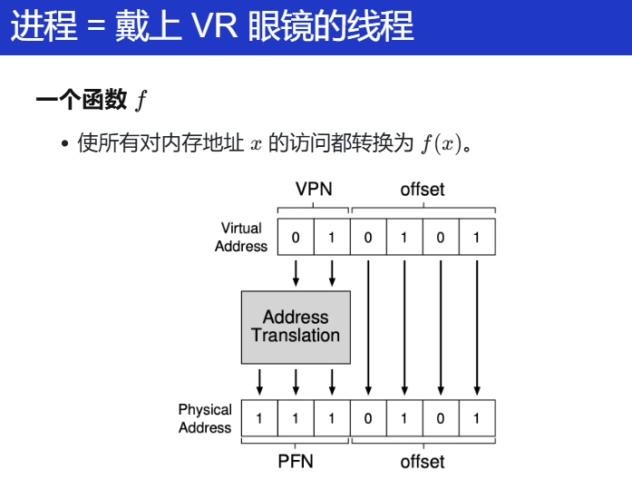

## 系统调用、中断和上下文切换

### `syscall`


将人类的一些状态（`rip`：下一条要执行的指令，`rflags`：控制的状态...）保存下来，然后拿起神光棒，改变自身的状态（`set SS = kernel`），变身奥特曼，获得超强的能力（`jmp IA32_LSTAR`）！

这就是 `syscall` 的具体行为！

然后，状态变成了什么？此时 RIP = IA32_LSTAR, CPL = 0


这个时候我获得了整个程序的控制权，就能做很多事情了。

- 操作系统可以配置 IA32_LSTAR
    - **setjmp() → 在另一个栈中执行 → longjmp() → sysret**
    - **执行时可以直接访问** I/O 设备和内核数据结构
    - **操作系统 = C 程序**


更多的细节：进程的虚拟地址。

> **现在还是 “VR 眼镜模式”：**
>
> - 进程的内存被 “拆散”，并且被 Page Table 重组了
>
>     ```C
>     inst = fetch(); 
>     ```
>
> - 从 M[LSTAR] 的**虚拟地址**处取指令
>
> **操作系统内核：配置内存映射**:
>
> - 低配版 (0): 只使用分段 (Linux 1.x; like Minix)
>
> - 低配版 (1): 物理内存 → 0xc0000000 (Linux 2.x)
>
> - 今天：[Complete kernel virtual memory map](https://www.kernel.org/doc/html/v6.3/x86/x86_64/mm.html) !@#&)*!@**^&)@#
>
>     其实现在应该就是有一定的能力能够看到看懂这些文档的部分内容了！不懂再配合AI解释即可！

> 通过 VR 眼镜来理解虚拟内存和物理内存，确实是很形象！
>
> 页表基地址寄存器：VR 眼镜

页表基地址（`CR3、satp`）在 syscall 执行前后，并没有变化哦！

这就有一个问题，同一个 VR眼镜还戴在进程上。

所以OS还要保证一件事情，要配置正确的VR眼镜，使得 PC 在合适的地方可以开始执行！

欸！说了这么多，能不能自己验证来看看？用一个最小的例子？

> Everything is a state machine
>
> - QEMU 本身就是一个状态机模拟器
>     - 在一条 syscall 上打一个断点
>     - **观察寄存器/内存的变化**
>
> - 这其实也是个挑战
>
>     我们怎么 “在一个 syscall 指令上打断点”？

GDB的缺陷：永远是打在 用户程序上的。看不到 `syscall` 之后内核的具体行为是什么，那怎么办？QEMU！`-s -S`

> 我不会？怎么办？新的时代已经来临，有一定的基础知识后，能问出相关的问题，告诉 AI！


确实是观察到了！和手册描述的行为一致！

> 不过还是要补一些python基础？


### 中断机制和上下文切换

#### 中断

写出一个死循环不会导致计算机真正死循环：还有中断！

中断行为：如果处理器中断打开

- x86 Family (CISC 的历史遗迹；处理器实现的噩梦)
    - 询问中断控制器获得中断号 n*n*
    - 保存 CS, EIP, EFLAGS, SS, ESP 到堆栈
    - 跳转到 `IDT[n]` 中的 “Gate”
        - 一个描述带权限切换长跳转的数据结构
- RISC-V (M-Mode, Direct Exception Mode)
    - 检查 mie 是否屏蔽此次中断
    - 跳转 `PC = (mtvec & ~0xf)`
    - 更新 `mcause.Interrupt = 1`

**在 RISC这种中，中断和 syscall的行为几乎一样？**

**==强制 “插入” 的 syscall==**

- **中断**
    - 保存 `mepc = PC`
    - 跳转 `PC = (mtvec & ~0xf)`
    - 更新 `mcause.Interrupt = 1`
- **系统调用 (ecall)**
    - 保存 `mepc = PC`
    - 跳转 `PC = (mtvec & ~0xf)`
    - 更新 `mcause.Ecall = 1`
- “**无论你现在在做什么，都去执行一下操作系统内核的代码吧**

回想起 PA 的内容了吗！！！`isa_raise_intr`

 

再考虑更深入的内容：

如果来了中断，OS 代码应该做什么？

- `mov (kernel_rsp), %rsp`

    - 这将是**致命**的
    - 进程 (状态机) 的状态就永远丢失了

- 首先：封存状态机 (寄存器)

    RISC-V 的 `mscratch` 

    - 内存由数据结构控制

- 然后：执行操作系统代码

    - C 代码可以任意使用寄存器
    - **操作系统代码选择一个返回的状态机：schedule！**
    - 恢复寄存器状态，执行 sysret (iret)


> 又想起了 PA4 的那个问题：在带有虚拟地址的进程情况下，状态机应该放在哪里？VR眼镜（satp/cr3）应该保存在哪里？
>
> 好像有问题，在 PA 实现的简易的 OS 上，我的内核栈和用户栈好像用的是同一个 satp/CR3寄存器？这样子我的上下文切换是不是存在问题？等等，可以看完下一节再来。
>
> > 仔细想想自己的实现真的是简单的不能再简单了（没有考虑并发等），但是！这也是一个好处！能够尽可能快速地做出一些东西，而不用考虑过多的复杂原因！

中断来了，保存当前的上下文到栈中？保存到内核栈还是用户栈？

听说还有一个叫中断栈的东西？


## 进程的实现

### 进程与虚拟地址空间

现在我们应该把之前的内容

**Thread-OS → Process-OS**


OS 看到的内存和进程看到的内存并不一样


OS 可以直接通过一个指针去访问整个物理内存（thread-os 例子）

但是进程并不行，进程带上了 VR 眼镜，实际上 VR 眼镜是一个函数 *f*



每一次的访存都要经过这么一个函数

对于物理地址分成了很多页的（`PPN：physical page number/PFN：page frame number`）


### UNIX 和 xv6


## 处理器调度


## 操作系统世界


