## 来自 DeepSeek

你的学习思路非常清晰，结合历史演进和实践驱动的学习方式能深入理解技术本质。以下是针对操作系统持久化部分的学习建议、实践项目推荐和资料清单：

---

### **一、学习路径建议（按技术演进顺序）**
#### **1. 存储介质与基础I/O（1940s-1960s）**
- **核心问题**：如何将数据可靠地存储在物理设备上？如何高效读写？
- **技术演进**：
  - 纸带/磁鼓 → 硬盘（机械磁盘） → SSD（现代）
  - **直接访问存储**（通过端口指令读写）→ **中断驱动I/O**（CPU解放）→ **DMA**（直接内存访问，进一步解放CPU）
- **关键实验**：模拟一个虚拟磁盘设备，通过端口指令读写数据块（类似xv6的`virtio`驱动）。
- **遗留问题**：直接操作硬件复杂、易出错，需要抽象接口。

#### **2. 设备驱动与文件抽象（1970s）**
- **核心问题**：如何统一管理不同硬件设备？如何抽象存储空间？
- **技术演进**：
  - **设备驱动程序**（隔离硬件差异）→ **文件抽象**（UNIX的“一切皆文件”）
  - **字符设备**（如键盘） vs **块设备**（如磁盘）
- **关键实验**：实现一个字符设备驱动（如虚拟终端），或块设备驱动的简单调度算法（如电梯算法）。

#### **3. 文件系统（1980s-1990s）**
- **核心问题**：如何组织磁盘上的数据？如何高效管理文件？
- **技术演进**：
  - **FAT文件系统**（链表式分配，简单但易碎片化） → **ext2**（索引节点+块组，减少碎片） → **日志文件系统**（ext3, NTFS，保证一致性）
- **关键实验**：实现一个简化版FAT或ext2文件系统，支持创建/删除文件、目录遍历。

#### **4. 可靠性保障（1990s-2000s）**
- **核心问题**：如何防止数据丢失？如何应对硬件故障？
- **技术演进**：
  - **RAID**（冗余磁盘阵列）→ **日志（Journaling）** → **写时复制（COW）**（如ZFS）
- **关键实验**：模拟RAID 0/1/5的数据分布和恢复逻辑，或实现一个日志追加（append-only journal）机制。

#### **5. 现代扩展（2000s-至今）**
- **核心问题**：如何应对海量数据？如何优化性能？
- **技术演进**：
  - **闪存友好文件系统**（F2FS）→ **分布式文件系统**（HDFS）→ **新型存储硬件**（NVMe, 持久内存）
- **关键实验**：分析SSD的磨损均衡策略，或实现一个简单的LSM-Tree（Log-Structured Merge Tree）。

---

### **二、实践项目推荐**
#### **1. 入门级（适合理解基础原理）**
- **xv6文件系统实验**（MIT 6.S081课程）  
  - 实现文件系统的核心功能：inode管理、目录结构、文件读写。
  - 代码量小（约500行），适合入门。  
  - 资源：[MIT 6.S081 Labs](https://pdos.csail.mit.edu/6.828/2022/labs.html)

- **FUSE（用户态文件系统）**  
  - 用FUSE库实现一个内存文件系统（如[simplefs](https://github.com/psankar/simplefs)）。
  - 学习文件系统API（`open`, `read`, `write`）和VFS抽象。

#### **2. 进阶级（贴近现代系统）**
- **实现日志文件系统**  
  - 在ext2基础上添加日志功能（参考[ext3设计](https://ext4.wiki.kernel.org/index.php/Ext3_Design)）。
  - 关键点：事务提交、日志回放（replay）、崩溃恢复。

- **RAID模拟器**  
  - 用Python/C模拟RAID 5的条带化（striping）和奇偶校验恢复。
  - 示例项目：[SoftRAID Simulator](https://github.com/angrave/raid-simulator)

- **持久化键值存储**  
  - 基于LSM-Tree或B-Tree实现一个简单的数据库引擎（参考[Bitcask](https://riak.com/assets/bitcask-intro.pdf)）。
  - 结合文件系统与并发控制（如WAL日志）。

#### **3. 挑战级（综合项目）**
- **迷你版ZFS**  
  - 实现写时复制（Copy-on-Write）、动态块大小、快照功能。
  - 参考：[ZFS Internals](https://www.youtube.com/watch?v=uR-2Ti4iQkg)

- **用户态NVMe驱动**  
  - 通过SPDK（Storage Performance Development Kit）直接操作NVMe设备。
  - 学习轮询模式（Polling）与中断的取舍。

---

### **三、学习资料推荐**
#### **书籍**
- **《Operating Systems: Three Easy Pieces》**（OSTEP）  
  - [持久化章节免费在线版](https://pages.cs.wisc.edu/~remzi/OSTEP/file-intro.pdf)
- **《Modern Operating Systems》**（Tanenbaum）  
  - 第5章“Input/Output”和第6章“File Systems”
- **《文件系统设计》**（File System Design, 作者Marshall Kirk McKusick）

#### **在线资源**
- **蒋炎岩课程资料**  
  - [南京大学操作系统课程主页](https://jyywiki.cn/OS/2023/)
- **Linux内核文档**  
  - [Block Layer Documentation](https://docs.kernel.org/block/index.html)
- **技术博客与论文**  
  - [ext4文件系统设计](https://ext4.wiki.kernel.org/index.php/Ext4_Disk_Layout)
  - [ZFS On-Disk Specification](https://docs.oracle.com/cd/E19253-01/819-5461/zfsondisk-1/)
  - [FAST会议论文集](https://www.usenix.org/conferences/byname/109)（存储领域顶级会议）

---

### **四、学习工具链**
- **调试工具**：`strace`（跟踪系统调用）、`blktrace`（分析块设备I/O）
- **模拟环境**：QEMU（虚拟化磁盘设备）、FUSE（用户态文件系统）
- **性能分析**：`iostat`、`fio`（存储基准测试）

---

### **五、学习建议**
1. **从简单到复杂**：先实现一个只有“创建/读写”功能的文件系统，再逐步添加日志、并发支持。
2. **结合代码与论文**：例如实现ext2时，参考[ext2论文](https://e2fsprogs.sourceforge.net/ext2intro.html)。
3. **参与开源项目**：如Linux内核的`drivers/block`或`fs/ext4`模块（需有一定基础）。

通过以上路径，你不仅能理解技术演进的内在逻辑，还能通过动手实现掌握现代系统的核心机制。


## 存储设备原理

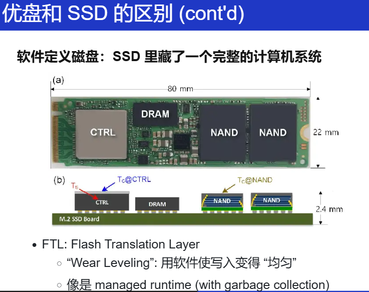

其实和内存管理就是一样的，就是 VR 眼镜！

存储介质的抽象，最终都是一个 字节数组！

- Logical block address (LBA) → Physical block address (PBA)

- Read/write amplification (读/写不必要多的内容)
- Copy on write
- “VR 眼镜” 本身也需要更新


[Coding for SSDs](https://codecapsule.com/2014/02/12/coding-for-ssds-part-1-introduction-and-table-of-contents/)

**推荐阅读**


block（擦除的最小单位）

page（读写的最小单位）

都是编好号的。

第一次写，写到第100个块，但下一次就写到第101个块里 → 均匀分布地写


## 输入输出设备原理

### I/O 设备

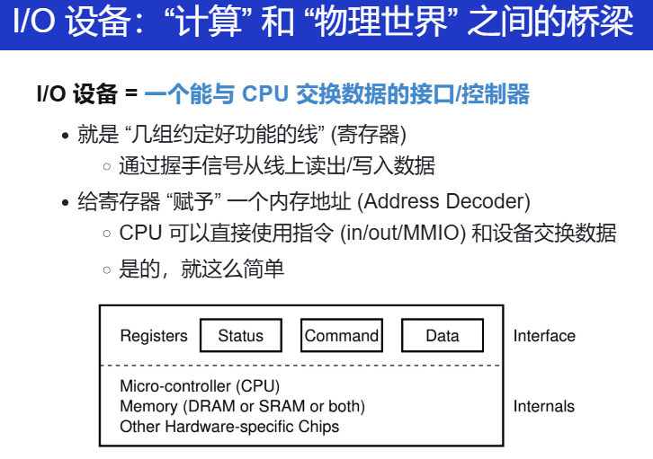

原则上只有一根线，就可以实现计算机和物理世界的交互。

那什么是 `I/O` 设备

理论基本模型就是 register（status、command、data...）

> 键盘按下，想想嵌入式里做的。

把每一个设备的寄存器都想办法连到 地址空间里，那只要为每一个寄存器发呢皮地址。


#### Example1：UART

"COM1"(communication 1)。（想起自己在 PA 中的实现了吗？！）

```C
#define COM1 0x3f8

static int uart_init() {
  outb(COM1 + 2, 0);   // 控制器相关细节
  outb(COM1 + 3, 0x80);
  outb(COM1 + 0, 115200 / 9600);
  ...
}

static void uart_tx(AM_UART_TX_T *send) {
  outb(COM1, send->data);
}
// 理解为 指针指向某个地址0x3f8，然后往这里写
//读也是类似，读取缓冲区
static void uart_rx(AM_UART_RX_T *recv) {
  recv->data = (inb(COM1 + 5) & 0x1) ? inb(COM1) : -1;
}
```

理论上。

将寄存器和CPU连起来，那我们的终端，能做很多了！

在接口上连接一个屏幕、键盘，那就能用电路实现一个`teletypewriter/tty`。

明白为什么会有escape？

字符流，在不概念

> 移植 nommu-Linux的时候的内容：
>
> > 进一步，关于 bootconsole、console 的区别？
> >
> > 再进一步 TTY、 /dev/tty、/dev/ttyS0、/dev/console、uart等差异？
> >
> > 韦东山老师的视频区别！！！讲的真的很好！！
> >
> > [Linux Serial Console — The Linux Kernel documentation](https://www.kernel.org/doc/html/v5.6/admin-guide/serial-console.html)
> >
> > [解密 TTY 设备](https://taoshu.in/tty.html)
> >
> > 再补充：[深入解析Linux内核Console框架及虚拟UART控制台的实现-CSDN博客](https://blog.csdn.net/caiji0169/article/details/144226525)
> >
> > 还有一个回答也挺好的：
> >
> > [c - Difference between a serial driver and a tty driver - Stack Overflow](https://stackoverflow.com/questions/67672191/difference-between-a-serial-driver-and-a-tty-driver)


#### Example2：键盘控制器

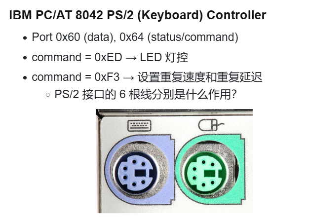

还是寄存器！比如从 status 中读出缓冲区中是否有按键，如果有，那就去读data，读出扫描码！在PA中的内容！

按下速度？什么速度往缓冲区里写？都可以探索！


3### Example3：磁盘控制器

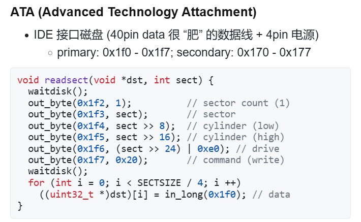

怎么将磁盘接入到 CPU ？

还是要靠寄存器。

看 status 寄存器的状态，看看磁盘是否准备好了。再从data寄存器读。

今天的内容，但无论如何，**设备都是用处理器能理解的接口**！

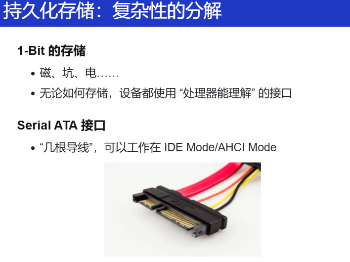


#### Example4：打印机

想想，这个玩意怎么实现？

> 激光、墨水的打印机原理？
>
> 写作业机？

那个时候的？有一个笔，控制笔左/右、上下移动的机器，给定坐标，那就能画出很多东西！

但是怎么将它和 CPU 连起来？（之前用的寄存器可以吗？可以！）

一个打印机的解释器：

```C
move(x, y);
down；
move(....);
```

还有，为什么不把一个小的 CPU 放到打印机里？

再搞一个独属于打印机编程语言，将这个语言送到 打印机里，打印机自动“编译”成上面的“低级机器”指令。

> 自己在上金工实习的时候，遇到数控车床！！

老师的例子：`postscript` 借助 `ps2pdf`

字体、字号、位置......

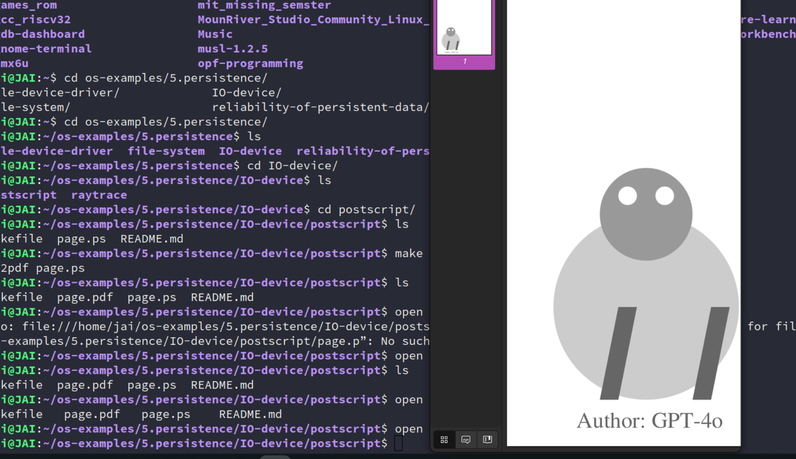

再进一步，是不是还能做排版！！

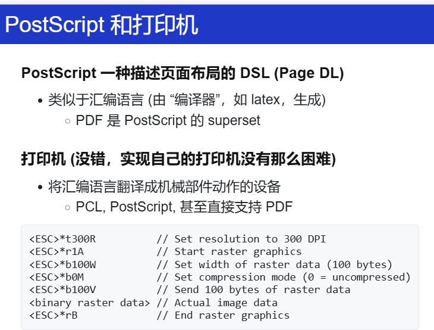

将汇编语言翻译成机械部件动作的设备


再接着：

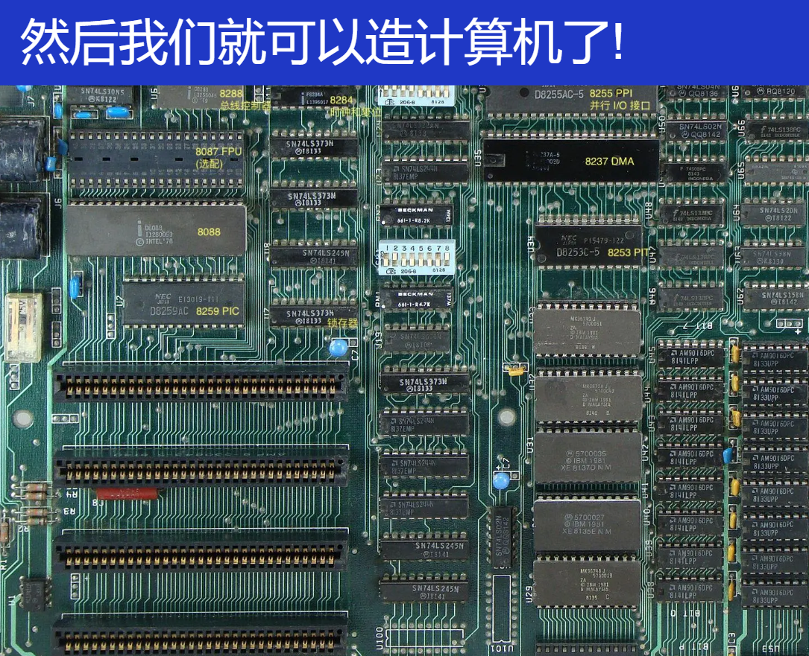

今天的主板，也没有多大的区别！


就像上面那样的设备，我们在 PA 中做的就差不多是这样，但这是为了我们方便理解原理，能 quick and dirty 地做起来，

但是，仅仅有上面的内容，离今天的高性能设备还是有点远的！但别急，继续一步步来。

接着往下看！

### 总线、中断控制器和 DMA 

#### 总线

最为重要的是 **总线**。

你总不想每个计算机系统只有固定的设备吧？我想接入更多 (甚至**未知**) 的 I/O 设备，要是有一天出了新型产品硬件，那只要有这个，就能极大地减少成本呀！复用率高！

所以，这么一个特殊的 I/O 设备：总线bus

每当有一个请求给总线，总线会根据这个请求（属于 DDR，属于键盘，属于别的设备），转发给别的设备！

但总线也有设备，CPU 通过和总线的寄存器交互，从而知道总线挂了哪些设备，设备中有几个寄存器，产商是谁......


所有外部设备都直接或间接地连接到 PCIe 总线上，插上之后，总线给它分配地址。

> 就像，你装计算机的时候，把显卡插入主板的时候。

另外，PCIe 总线会连一个桥到 USB 总线。设备一层层一级级的，连接虚拟化各层设备。不过，看着简单，但实际很复杂！没做好就容易翻车！（win98的名场面）

> 举个例子，关于 Plug and Play（热插拔）：
>
> 总线不仅是物理连接通道，更是资源协调者。以**PCIe总线热插拔USB设备**为例：
>
> - **枚举与发现**：插入USB设备后，PCIe总线通过电气信号变化检测设备存在，触发枚举过程。总线控制器读取设备的**Vendor ID**和**Device ID**，确定其类型（如存储设备、网卡）。
> - **地址分配**：总线动态分配**内存映射I/O（MMIO）地址**和**I/O端口**，确保不与现有设备冲突。例如，USB控制器可能被分配到`0xFE200000`的MMIO区域。
> - **层级扩展**：若设备连接在USB 3.0集线器下，需通过PCIe→USB主控桥→USB Hub的多级拓扑传递请求，每一级总线（PCIe、USB）需遵循不同协议，地址转换和时序控制复杂度剧增。
>
> **复杂点**：
>
> - **即插即用（PnP）**要求总线实时管理拓扑变化，而不同总线（如PCIe、USB、SATA）的协议差异导致资源分配算法需高度适配。
> - **电气兼容性**：例如，USB 3.0的SuperSpeed模式需差分信号对，插入劣质线缆可能导致信号衰减，总线需降速至USB 2.0模式，涉及物理层与协议层的动态协商。
>
> 当然，还会有后面内容的影响，待会补充

当然，重要的是，在我们装机的时候，能够想到总线这个概念就好啦！


#### 中断

有了总线，I/O 的问题就解决了，但 I/O 也有问题。

因为 CPU 也不知道 I/O 是否准备好！

比如说，键盘键入，键码会放到 data register 中，但 CPU不知道，这个时候就会有中断的内容：中断线

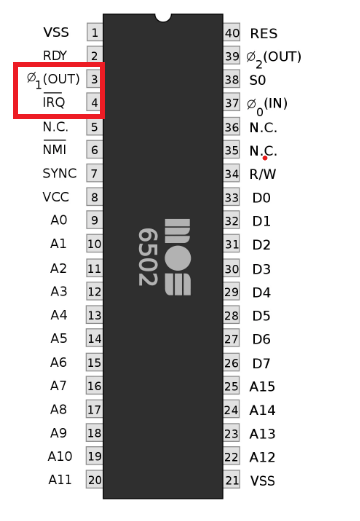

> 来了中断，OS 跳转到特定的位置去执行，然后扫描哪个设备有中断，对于不同的设备，应该要怎么处理。

但是，还有问题，要是存在并发的设别中断呢？上面这一根线处理的是一个中断，怎么办？用一个控制/仲裁器吧！

**收集各个设备中断，并选择一个发送给 CPU，并且完成对设备的应答**

**例子：**

- Intel 8259 PIC

    - programmable interrupt controller
    - 可以设置中断屏蔽、中断触发等……

- APIC (Advanced PIC)

    - local APIC: 中断向量表, IPI, 时钟, ……

        每个 CPU 都有本地的 APIC。

        > 有意思的是这个 IPI ，处理器间的中断，用于启动多核 CPU。L1 的笔记内容喔！
        >
        > 其中一个作为活动的，该 CPU 执行启动的流程，扫描系统里其他的 CPU，做好所有的初始化和准备工作，加载好其他 CPU 要运行的代码，然后给其他的 CPU 发一个 IPI，那多处理器就这么启来了。
        >
        > 还有一个有意思的：IPI 还用于解决 TLB 的 `shoot down` ：
        >
        > 换页、共享内存的 `unmap` 。
        >
        > 更多 Wikipedia。

    - I/O APIC: 其他 I/O 设备

    > 看看框架代码！


#### DMA

一个例子：操作系统：写入 1 GB 的数据到磁盘

- 即便磁盘已经准备好，依然需要非常浪费时间的循环
- out 指令写入的是设备缓冲区，需要去总线上绕一圈
    - cache disable; store 其实很慢的

```c
for (int i = 0; i < 1 GB / 4; i++) {
    outl(PORT, ((u32 *)buf)[i]);
}
```

如果是多处理器系统？那就把 write_disk 线程扔到另一个 CPU 吧？

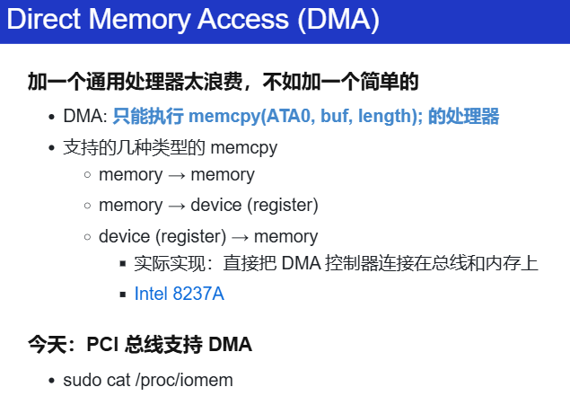


这个时候，我们已经造出了一个非常了不起的 计算机 了！


### GPU 和 加速

> 构建了一个计算机系统，但是距离现代的 高性能 CPU 还是有距离。


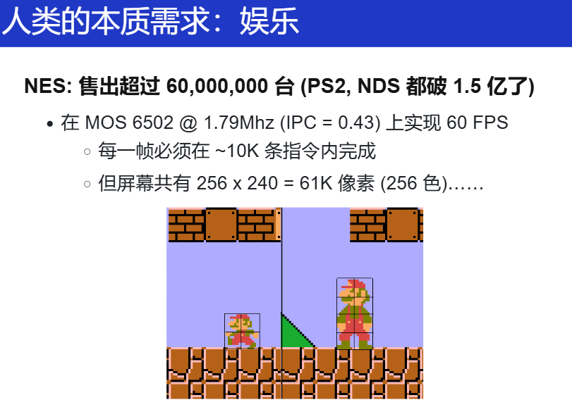

CPU 在你要的场景中做得不够好，那就加一个 "CPU"，或者说另类的 CPU，只做一件简单的你要做的事情！比如：

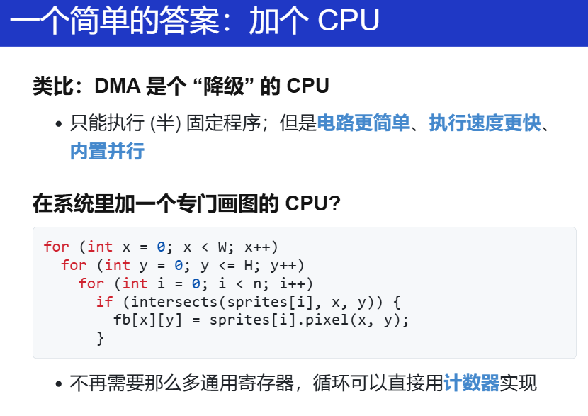

VRAM 中存了好多个我要画的小贴块，直接算，这样就不用那么多通用寄存器。

而且，加一个处理器，就不用那么多的指令啦

“极限的素材复用”：

蘑菇的左右移动（左右腿的长度不一样！）

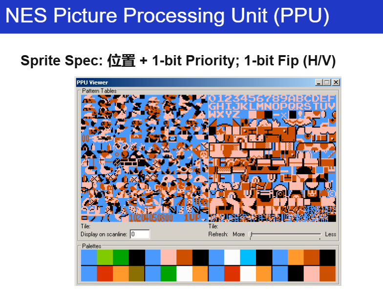


有了这些内容，凭着兴趣和想象，有能力敢去做！


另外，观察一下：

DMA：一重循环

PPU：多重循环

那 `gpt.c` 也是这样的呀！

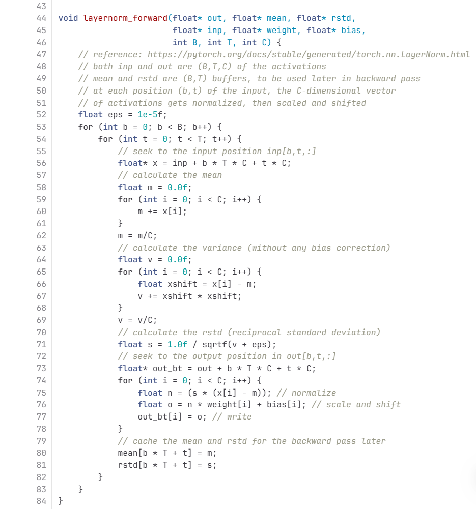

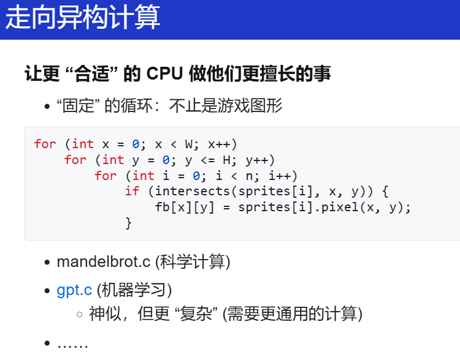

那现代的 GPU？

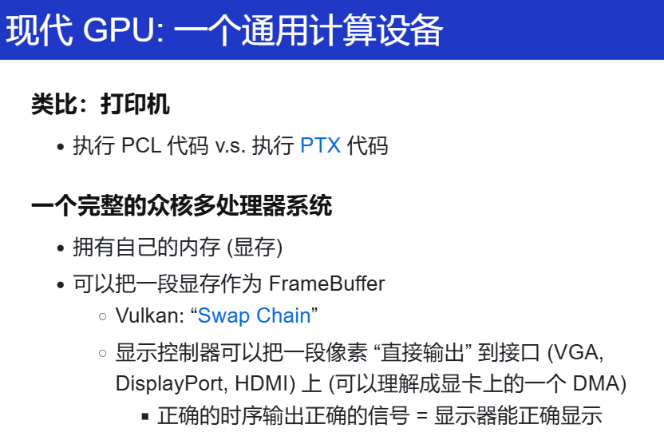


## 文件与设备驱动程序


### 文件

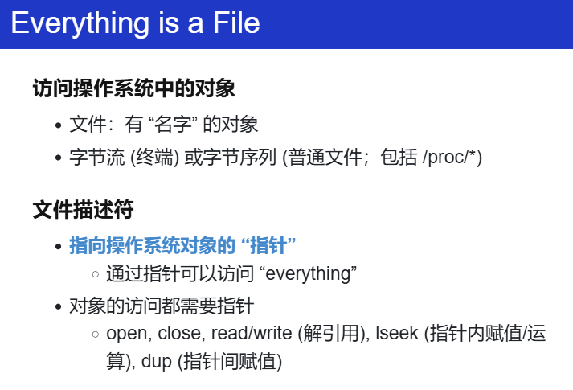

**核心思想：操作系统中都是文件，而文件都是有名字的对象，要访问这个对象，那就需要指向这个（OS）对象的指针，那就是文件描述符（`file descriptor`）。**

但是， OS 中的文件也不全都是字节序列：

`/dev/null`、终端好像也不是一个文件？

但都是要通过文件描述符来访问这个对象，用对象来理解文件描述符更好。

当然，`fd` 也有别名：`handle` 把柄，有了这个把柄，我就能控制（访问）你了！

想想，C里面的 各种的 `fopen` 等等，是不是都要用到这个 `fd`？用来指定某一个对象（流、文件夹的那个文件......）


OS 课上几乎算是最重要的工具：`strace`

用来看用户程序究竟是不是通过 `fd` 来访问的：`strace readelf -h /bin/ls`

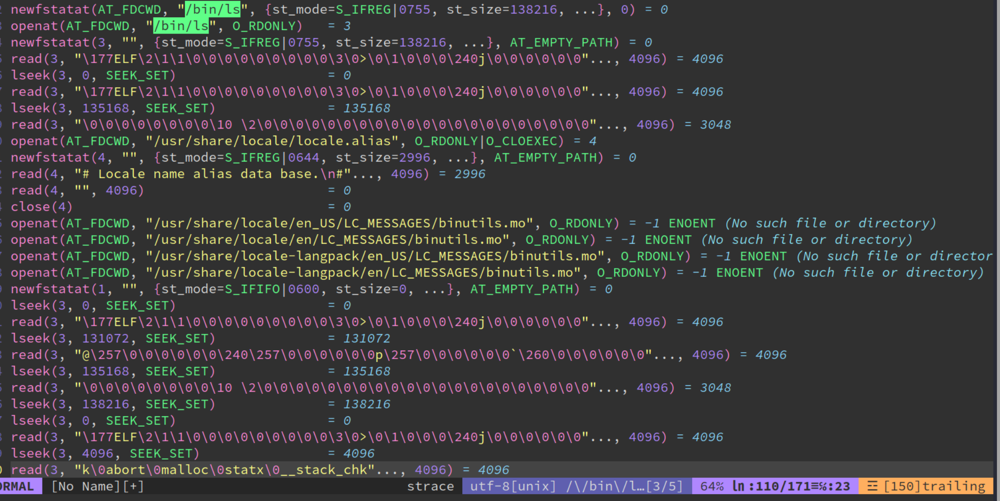

返回 3：预期之中。`0：stdin、1：stdout、2：stderr` 

`fstat`、`lseek`、更多内容。

还开了一些别的文件：

```c
openat(AT_FDCWD, "/usr/share/locale/locale.alias", O_RDONLY|O_CLOEXEC) = 4
```

OS 怎么知道我们是处于中文还是英文环境？就是 open 等各种文件，不断地找找找，找不到，那就用默认的咯。

想验证怎么办？`LC_ALL=zh_CN.UTF-8`

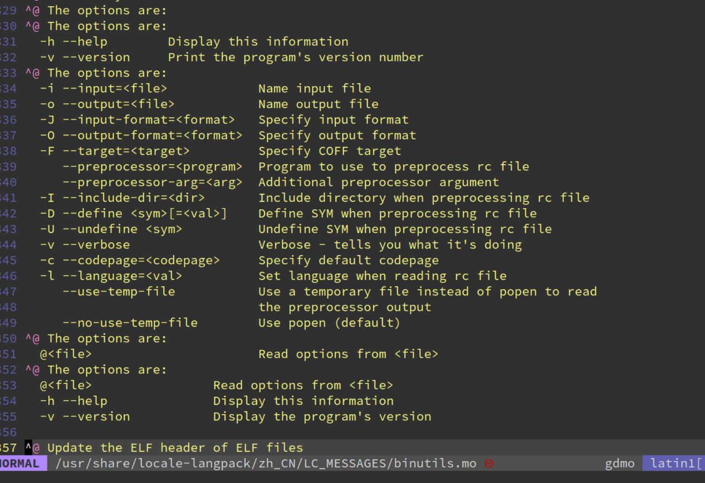

> ELF文件里竟然还有这个！

我们都知道有open，用文件描述符，通过 open，我们就访问文件了，这东西都知道。

但是在看了一些 `strace` 分析后的内容，多花点时间关于我们的应用程序是怎么使用文件的，底层怎么做到的，那应该有更深刻的理解。

比如改语言，更改一个 选项，不是要去设置里去点，才能有用，但是它的底层做的，就是这样：`export LC_ALL=zh_CN.UTF-8`

真的就是 计算机世界里没有魔法。

> 上面这个玩意，甚至还能当成面试题，Linux系统里语言看到的是英文，有时候看到的是中文的，想想看怎么做的？
>
> 再次理解 `everything is file`！
>
> 就算我不知道上面的答案，但有了一定了解之后，通过一些办法总能找到！


#### 更多细节（1）

> 这些细节，我觉得真的是没必要记住！就算我不知道，但我有办法验证！

文件是 “虚拟磁盘”

- 把磁盘的一部分映射到地址空间，再自然不过了

```
mmap(addr, length, prot, flags, fd, offset); 
```

一些细节问题

- **映射的长度超过文件大小会发生什么？**
    - ATFAI? GPT-4o 答错了，但给了一个正确的示例代码 
        - 启发：langchain (self-validation) 是趋势
    - RTFM 看来还是有用的 (“Errors”): SIGBUS
        - `ftruncate` 可以改变文件大小

> 其实，我们的一开始反应就是不知道，但是对于


#### 更多细节（2）

- 文件访问的 offset

    文件的读写自带 “游标”

    - 省去了进程保存文件读/写的位置

- Offset 管理
    - read/write: 会自动维护 offset
    - lseek: 修改 offset 位置
        - 对比：mmap file，实现 append 是个噩梦


#### 更多细节（3）

- `mmap, lseek, ftruncate` 互相交互的情况

    假设初始时文件大小为 2MB

    - `lseek` to 3 MiB (SEEK_SET)
        - **这时候能写入吗？**
    - `ftruncate` to 1 MiB
        - **这时候 offset 在哪里？**

> 问问 LLM？
>
> 


**水面下的冰山：当多个机制互相作用时，系统就变得复杂**

工作的时候，真的就会需要探索这些细节。


#### 更多细节（4）

- **文件描述符在 fork 时会被子进程继承**
    - 父子进程共用 offset？
    - 父子进程拥有独立 offset？

- 请你做一次操作系统的设计者
    - 哪一种方案更合理？

父子进程同时写一个log，出现覆写，需要机制同步`offset`，那多个进程之间完成同步，人肯定是做不好的。

里面的细节：


再探索下：

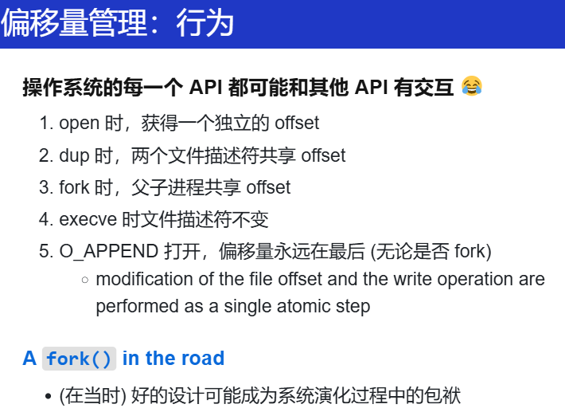

对于 offset，不同的 API 选择了不同的方式。

另外：[A fork() in the road | Proceedings of the Workshop on Hot Topics in Operating Systems](https://dl.acm.org/doi/10.1145/3317550.3321435)


### 文件的实现

**文件描述符可以访问 “一切”**

- 操作系统内核是如何实现的？
- 如你所料：一个 switch-case

```C
if(f->type == FD_PIPE){
  r = piperead(f->pipe, addr, n);
} else if(f->type == FD_DEVICE){
  if(f->major < 0 || f->major >= NDEV || !devsw[f->major].read)
    return -1;
  r = devsw[f->major].read(1, addr, n);
} else if(f->type == FD_INODE){
  ilock(f->ip);
  if((r = readi(f->ip, 1, addr, f->off, n)) > 0)
    f->off += r;
  iunlock(f->ip);
} else {
  panic("fileread");
}
```

面向对象的设备驱动程序。


只要能够支持以下操作（的部分），那就是文件（有些不能不能读，不能写）。

```C
struct file_operations {
 struct module *owner;
 loff_t (*llseek) (struct file *, loff_t, int);
 ssize_t (*read) (struct file *, char __user *, size_t, loff_t *);
 ssize_t (*write) (struct file *, const char __user *, size_t, loff_t *);
 ssize_t (*read_iter) (struct kiocb *, struct iov_iter *);
 ssize_t (*write_iter) (struct kiocb *, struct iov_iter *);
 int (*iopoll)(struct kiocb *kiocb, struct io_comp_batch *, uint flags);
 int (*iterate_shared) (struct file *, struct dir_context *);
 __poll_t (*poll) (struct file *, struct poll_table_struct *);
 long (*unlocked_ioctl) (struct file *, uint, ul);
 long (*compat_ioctl) (struct file *, uint, ul);
 int (*mmap) (struct file *, struct vm_area_struct *);
 ul mmap_supported_flags;
 int (*open) (struct inode *, struct file *);
 int (*flush) (struct file *, fl_owner_t id);
 int (*release) (struct inode *, struct file *);
 int (*fsync) (struct file *, loff_t, loff_t, int datasync);
 int (*fasync) (int, struct file *, int);
 int (*lock) (struct file *, int, struct file_lock *);
 ul (*get_unmapped_area)(struct file *, ul, ul, ul, ul);
 int (*check_flags)(int);
 int (*flock) (struct file *, int, struct file_lock *);
 ssize_t (*splice_write)(struct pipe_inode_info *, struct file *, loff_t *, size_t, uint);
 ssize_t (*splice_read)(struct file *, loff_t *, struct pipe_inode_info *, size_t, uint);
 void (*splice_eof)(struct file *file);
 int (*setlease)(struct file *, int, struct file_lease **, void **);
 long (*fallocate)(struct file *file, int mode, loff_t offset, loff_t len);
 void (*show_fdinfo)(struct seq_file *m, struct file *f);
 ssize_t (*copy_file_range)(struct file *, loff_t, struct file *, loff_t, size_t, uint);
 loff_t (*remap_file_range)(struct file *file_in, loff_t pos_in, struct file *file_out,
   loff_t pos_out, loff_t len, uint remap_flags);
 int (*fadvise)(struct file *, loff_t, loff_t, int);
 int (*uring_cmd)(struct io_uring_cmd *ioucmd, uint issue_flags);
 int (*uring_cmd_iopoll)(struct io_uring_cmd *, struct io_comp_batch *,
    uint poll_flags);
} __randomize_layout;
```

写驱动就是在写这些是吗？


### 设备驱动程序

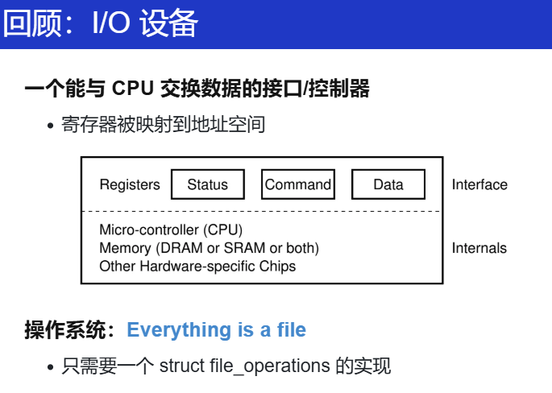

上面这个作为核心的模型，脑子里要有这么个简单的图。

核心：`ioctl`


## 文件系统 API 与实现

直观印象就是这么个树？

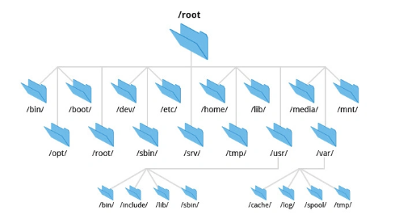

### 文件系统

任何实现了 struct file_operations 的操作系统对象可以都是 “文件”：有驱动程序的设备；`procfs` 中的虚拟文件、管道……（文件 = struct file_operations）

- 数据文件：`hello.c`, `a.out`, ...
    - 虚拟的磁盘
    - `vector<char>`
- 设备驱动
    - null, nuke0, ...
- 虚拟文件
    - 进程的地址空间, ...

everything is file，但是，新需求：怎么**管理**系统中众多的文件？

- find_file_by_name?

    实际上，操作系统将这些文件组织起来的方式：文件系统。

> 实际上这是很合理很自然的需求，就像图书馆，还记得学校上的信息检索课吗？图书馆里的分类方法，什么中图法，有什么分类编号。


文件那么多，怎么找到想要的？文件系统思路：

- **信息的局部性**：将虚拟磁盘 (文件) 组织成层次结构

很自然，将类似的东西放在一起，比如设备：`/dev`，设备里面继续分：`net`、`tty`，就像在图书馆里一样。

但是上面这些内容都是逻辑相关的数据，我们确实会把它放在相近的目录。


但是麻烦的是 “非数据” 的文件，看看现在的设计

- UNIX/Linux: Everything is a File

    一切都在 “/” 中 (例子：中文语言包, fstab)

- Windows 的设计

    一个驱动器一棵树：A:, B:, C:, ...

    这其实也很自然。

- 其他命名空间：[Windows Driver Model](https://learn.microsoft.com/en-us/windows-hardware/drivers/kernel/introduction-to-wdm), [Registry](https://learn.microsoft.com/en-us/windows/win32/sysinfo/registry)

    - (也可以 “everything is a file”)


#### mount

> **这里直接看我写的一篇总结！[mount](https://github.com/JAILuo/notes/blob/main/docs/article/mount/mount.md)**

**UNIX 的设计：目录树的拼接**

```c
mount(source, target, filesystemtype, mountflags, data); 
```

```bash
mount -t <文件系统类型> <设备路径> <挂载点> [选项]
```

- **再看 “最小 Linux”**

    - 初始时只有 `/dev/console` 和几个文件

    - `/proc`, `/sys`, 甚至 `/tmp` 都没有

        **实际上这些就是 普通的 `mkdir` 创建出来的，只不过多了一步：`mount` 系统调用！**

    ```shell
    mkdir -p /proc && mount -t proc  none /proc
    mkdir -p /sys  && mount -t sysfs none /sys
    mkdir -p /tmp  && mount -t tmpfs none /tmp
    ```

- UNIX 一贯的设计哲学：灵活
    - Linux 安装时的 “mount point”
        - `/`, `/home`, `/var` 可以是独立的磁盘设备
        
            变成不同的盘，一个速度快点的，一个存储量大但是稍微慢点。


#### 如何挂载一个 `filesystem.img`?

> - 一个微妙的循环
>     - 文件 = 磁盘上的虚拟磁盘
>     - 挂载文件 = 在虚拟磁盘上虚拟出的虚拟磁盘 
> - 试试[镜像](https://box.nju.edu.cn/f/0764665b70a34599813c/?dl=1)

欸，先想想，做这个的东西的意义何在？场景何在？

正常我们说挂载，那就是要内核支持，能够以文件系统接口呈现的，才能挂载，那现在先不想那么多，提前知道内核支持了，但是做这个东西的场景在哪？意义在哪？


- **关键组件**：

    ```mermaid
    graph LR
      A[filesystem.img] -->|losetup| B(/dev/loopX)
      B -->|mount -t ext4| C(/mnt/img)
    ```


> **创建一个 loopback (回环) 设备**
>
> - 设备驱动把设备的 read/write 翻译成文件的 read/write
> - [drivers/block/loop.c](https://elixir.bootlin.com/linux/v6.9.3/source/drivers/block/loop.c)
>     - **实现了 loop_mq_ops (不是 file_operations)**
>
> **观察挂载文件的 `strace`**
>
> - `lsblk` 查看系统中的 block devices (`strace`)
> - `strace` 观察挂载的流程
>     - `ioctl(3, LOOP_CTL_GET_FREE)`
>     - `ioctl(4, LOOP_SET_FD, 3)`

`loop` 设备驱动将文件模拟为块设备，实现镜像内容的透明访问。


直接 mount 一个文件


OS 管理整个对象的时候，我的 loop 设备还挂在别的地方的时候，不能够直接`umonut` 这个文件系统？


#### 文件系统 API: 目录管理

- `mkdir`

    创建目录

- `rmdir`

    - 删除一个空目录

    - 没有 “递归删除” 的系统调用

        - rm -rf 会遍历目录，逐个删除 (试试 `strace`)

            用的实际就是 `rmdir`

- `getdents`

    - 返回 count 个目录项 (ls, find, tree 都使用这个)
        - 更友好的方式：`globbing`

    好像我的 第一个 lab 没有用到这两个？是不是我的实现有些问题？

    **==TODO==**


#### 链接

- 硬 (hard) 链接

    **需求：系统中可能有同一个运行库的多个版本**

    - `libc-2.27.so`, `libc-2.26.so`, ...
    - 还需要一个 “当前版本的 libc”
        - 程序需要链接 “`libc.so.6`”，能否避免文件的一份拷贝？

    理解：(硬) 链接：允许一个文件被多个目录引用

    - 文件系统实现的特性 (ls -i 查看)
        - 不能链接目录、不能跨文件系统
        - 所以！删除文件的系统调用称为 “`unlink`” (`refcount--`)！

    理解为 指向同一个地方的多个指针！

    但是有个问题，这个东西是文件系统支持的（系统调用），所以不能链接目录、不能跨文件系统。怎么办？软链接。


- 软链接：在文件里存储一个 “跳转提示”

    - 软链接也是一个文件
        - 当引用这个文件时，去找另一个文件
        - 另一个文件的绝对/相对路径以文本形式存储在文件里
        - **可以跨文件系统、可以链接目录、……**

    - 几乎没有任何限制
        - 类似 “快捷方式”
            - 链接指向的位置不存在也没关系
            - (也许下次就存在了)


牛啊！你想要过关，就得创建多少多少层的目录/符号理解，有点像目录树。


### 文件系统：实现

#### 引入

直接想：

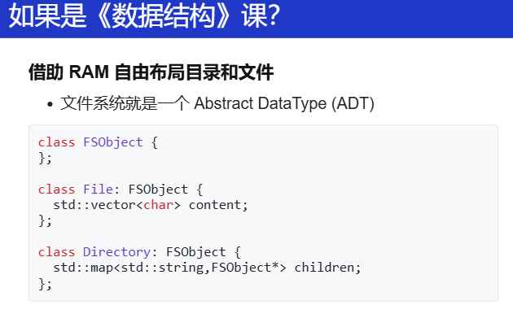

要支持随机写？一次读写4KB。用树？b-tree？

- 我们只有 **block device**
- 两个 API
    - `bread(int bid, struct block *b);`
    - `bwrite(int bid, struct block *b);`

实现：

- read, write, ftruncate, ...

- mkdir, rmdir, readdir, link, unlink, ...

    - 用 bread/bwrite 模拟 RAM → 严重的读/写放大

        记得在刚开始看过的 那篇文章吗 [Coding for SSDs](https://codecapsule.com/2014/02/12/coding-for-ssds-part-1-introduction-and-table-of-contents/)

    - 我们需要更适合磁盘的数据结构


#### FAT 和 UNIX 文件系统

RTFM！


UNIX 文件系统：

`inode` 一个 `inode` 代表一个文件或者一个目录（怎么感觉有点像 写的 buddy system？元数据的思想？）

fast path、slow path 又是这个？

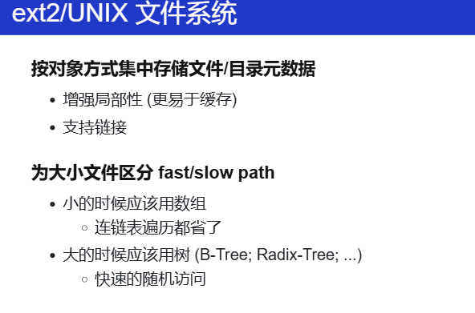

还是根据自己的 workload！（为嵌入式系统做一个文件系统？）


把文件系统理解成一个 struct fs_object


## 持久数据的可靠性


