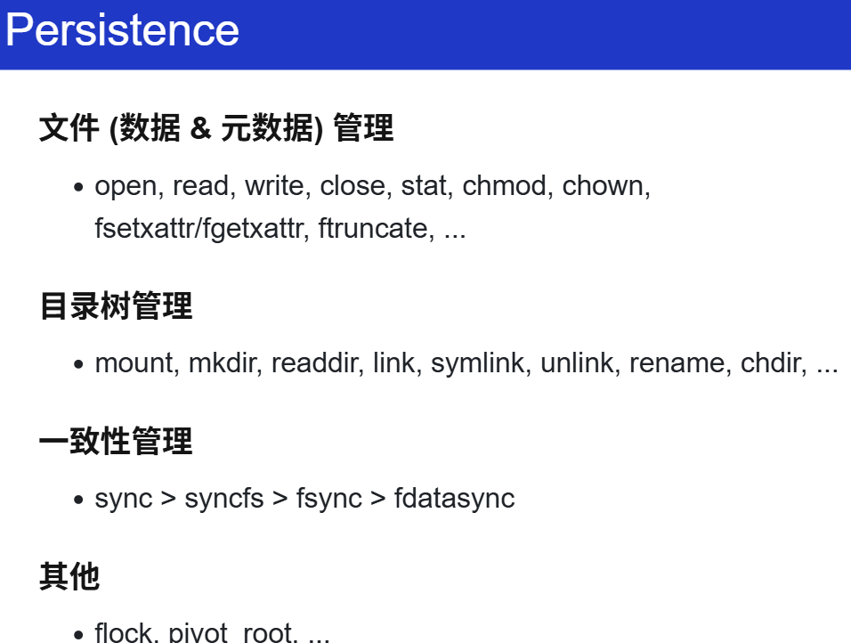
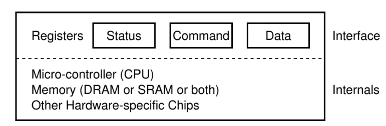
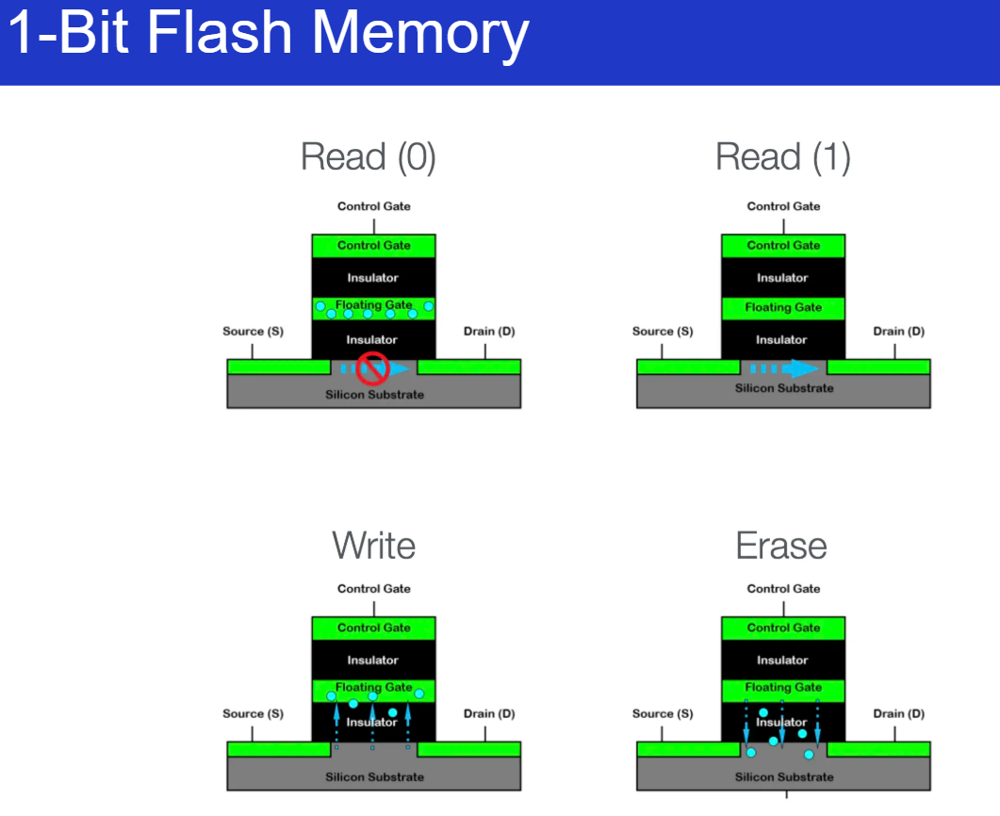
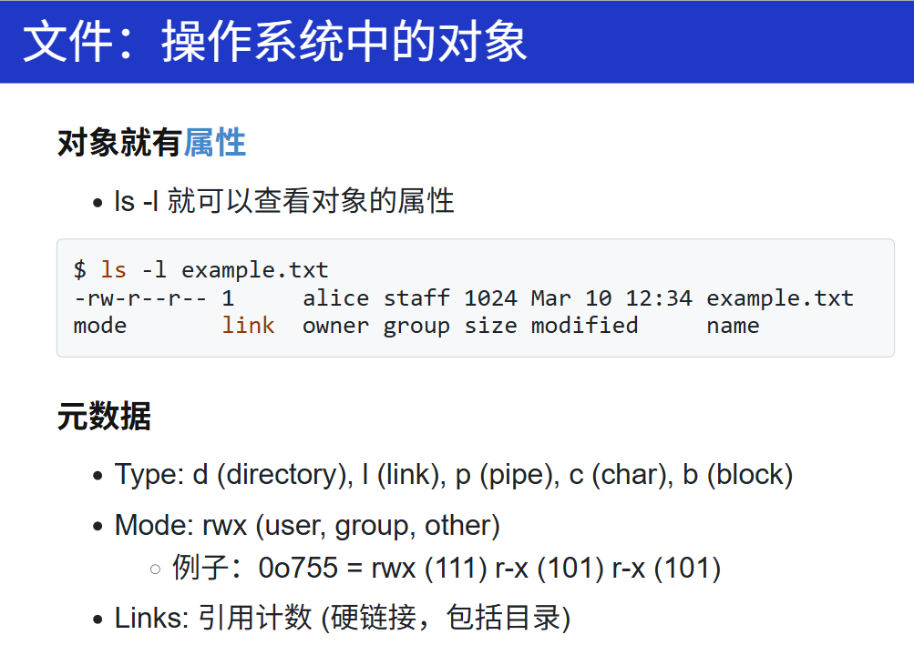
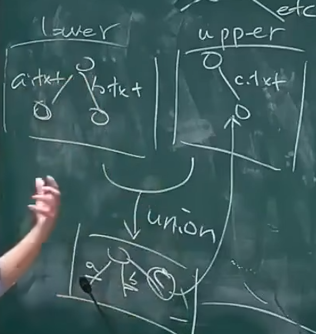

## Summary




## Device

插个优盘试试发生什么……

- 优盘的文件系统会自动 “出现”
- 但你是专业人士
    - 看看 /dev/ 是不是发生了一些什么变化？（怎么做到的）

- 水面下的冰山：

- /dev/ 下的对象不会凭空创建
    - [udev](https://www.freedesktop.org/software/systemd/man/latest/systemd-udevd.html) - /lib/udev/rules.d 
    - udisks2 - 这才是真正执行 mount 的程序

看到这些内容，就会想想，实际公司会怎么做的？


什么是 IO设备？

- I/O 设备 = **一个能与 CPU 交换数据的接口/控制**

    - 就是 “几组约定好功能的线” (寄存器)
        - 通过握手信号从线上读出/写入数据
    - 给寄存器 “赋予” 一个内存地址 (Address Decoder)
        - CPU 可以直接使用指令 (in/out/MMIO) 和设备交换数据
        - 是的，就这么简单

    


学 PCIe 总线之前，来回一下总线是个啥。

为了接更多的 I/O 设备，所以有了一个非常特殊的设备：总线。

进一步作用：总线：提供设备的 “虚拟化”：**注册**和**转发**

- 把收到的地址 (总线地址) 和数据转发到相应的设备上
- 例子: port I/O 的端口就是总线上的地址
    - IBM PC 的 CPU 其实只看到这一个 I/O 设备


总线这一个 I/O 设备预留了很多 I/O 设备（寄存器），等待设备插入。

设备和和总线之间是有协议的，设备插入之后，就会告诉总线（控制器），它的厂商、设备号等等信息。当所有设备初始化完毕后，CPU就能看到这些设备。（现在的USB天生支持热插拔）


> 今天获得 “CPU 直连” 的标准设备：总线
>
> - 接口
>     - 75W 供电
>         - 所以我们需要 6-pin, 8-pin 的额外供电
> - 数据传输
>     - PCIe 6.0 x16 带宽达到 128GB/s
>         - 于是我们有了 800Gbps 的网卡
>     - 总线自带 DMA (专门执行 memcpy 的处理器)
> - 中断管理
>     - 将设备中断转发到操作系统MSI (Message-signaled Interrupts)

> PCIe 总线：支撑了现代 I/O 设备的体系
>
> - 高速设备都是直插 PCIe 的
>     - FPGA
>     - 显卡
>     - 网卡
>     - ……
> - USB Bridge


> **Prompt: NVMe 是如何接入 PCIe 总线的？**
>
> NVMe（Non-Volatile Memory Express）是一种为高速存储器（如SSD）设计的主机控制器接口协议。它直接通过PCIe（Peripheral Component Interconnect Express）总线与主板相连，绕过传统的SATA或SAS通道，大幅提升数据传输速率和并发处理能力。
>
> 详细描述如下：
>
> 1. **物理层面**：NVMe设备通常为M.2、U.2或PCIe扩展卡形态，插入主板相应的PCIe插槽。这样，存储器与CPU之间建立起物理连接，使用PCIe通道（如x2、x4、x8）。
> 2. **链路层与传输层**：NVMe利用PCIe的高速点对点通道，支持多条并行通路，实现大带宽、低延迟的数据传输。NVMe协议使SSD能充分利用PCIe 3.0、4.0或更高版本的带宽。
> 3. **协议层面**：主机操作系统通过NVMe驱动，与SSD上的NVMe控制器通信。PCIe作为物理和数据链路的载体, NVMe作为协议负责命令、队列管理和数据传输。
> 4. **并发处理**：NVMe支持多队列（主机和控制器可各自支持多至64K队列，每队列64K命令），显著提升并发和效率，这是基于PCIe总线的多通道特性实现的。
>
> 总结：NVMe设备直接插接在PCIe总线上，利用PCIe的高速通道和NVMe协议实现高效的数据交互，显著提升SSD的性能。


## storage

### 1-Bit 到 1TB

知道了这个1 bit的 NAND flash：



> 1-Bit NAND Flash是一种非易失性存储器，每个存储单元只能存储1位二进制数据（0或1），属于SLC（Single-Level Cell）存储。其核心结构为浮栅晶体管（Floating Gate Transistor），存储单元通过是否存有电子来表示数据状态。
>
> 其工作原理如下：
>
> 1. 存储结构：NAND Flash由许多浮栅晶体管串联组成“字线”和“位线”；每个晶体管对应一个存储单元，仅存储1 bit。
> 2. 编程（写入）：通过在控制门和源漏极施加一定电压，实现电子通过隧穿效应注入浮栅。当浮栅内有电子时，单元状态为“0”；无电子为“1”。
> 3. 擦除：通过反向电压，使浮栅电子释放。擦除操作以“块”为单位进行。
> 4. 读取：给控制门施加适当电压，根据浮栅是否有电子，当前存储单元的导通情况（阈值电压高为“0”，低为“1”）即可判断数据。
> 5. 特点：SLC NAND Flash速度快、寿命长、可靠性高，适用高端存储领域。
>
> 总结，1-Bit NAND Flash通过控制浮栅晶体管中电子的有无，实现数据的写入、读取与擦除。

但是为什么会有这个块设备？成本！

思想：资源紧凑的解决方案，把数据紧凑地压缩在一起，用节约的电路！

>  从 1-Bit 到 1TB
>
> - 实现 “寻址能力” 的代价
>
>     - 磁盘：位置划分 + 扇区头
>
>     - 电路：行 (字线) 和列 (位线) 选通信号
>
>         这些都会消耗额外的资源 (面积)
>
> - 解决方法：**按块访问**
>
>     “一块” 可以共享 metadata
>
>     - 物理分割、Erase 信号、纠错码……
>         - 磁盘是 `struct block disk[NUM_BLOCKS]`
>         - Block 是读/写的最小单位
>         - “Block devices” (ls -l /dev/sd*)


### Block Devices

首先，block devices 也可以是普通的文件：

- “字节序列” 抽象
- 可以直接 mmap 到进程的地址空间

但有了上面的硬件经验，这应该不是一个好的抽象，但这也是直白/透明抽象的代价：

- **不经意间的读/写放大 (read/write amplifications)**

    读写数据时，在更底层的系统上，产生的数据量会超过上层的。

- 存储设备在实际执行读写操作时，处理的数据量超过用户实际请求的数据量

    - 随机读/写一个 byte，都会导致大量数据传输
    - 文件系统的实现应该能够**感知** “块” 的概念


### Linux Bio

**Request/response 接口**

- 上层 (进程、文件系统……) 可以任意提交请求
- 下层 (Bio + Driver) 负责调度
    - “[Multi-queue block I/O queuing](https://www.kernel.org/doc/html/latest/block/blk-mq.html)”
    - 核心数据结构
        - I/O 请求：[struct request](https://elixir.bootlin.com/linux/v6.14.5/source/include/linux/blk-mq.h#L102)
        - [struct bio](https://elixir.bootlin.com/linux/v6.14.5/source/include/linux/blk_types.h#L214)
        - struct bvec_iter
            - 真正起作用的：真正的 I/O vector: sector_t 的 “扇区号”
            - 每次请求一个 request，不单单能读一个块，实际可以一个vector，很多块
- (现在 vibe coding 真的好简单)


依旧阅读： [Coding for SSDs](https://codecapsule.com/2014/02/12/coding-for-ssds-part-1-introduction-and-table-of-contents/)


## 文件系统 API

### 目录树


比如要删掉一个目录，但是 os 究竟做了什么，提供了什么机制？

```bash
mkdir hello
strace rm hello 2>&1 | vim -
```

```c
execve("/usr/bin/rm", ["rm", "hello"], 0x7ffec21c2708 /* 67 vars */) = 0
brk(NULL)                               = 0x5d4d64d55000
arch_prctl(0x3001 /* ARCH_??? */, 0x7fff90f58a90) = -1 EINVAL (Invalid argument)
mmap(NULL, 8192, PROT_READ|PROT_WRITE, MAP_PRIVATE|MAP_ANONYMOUS, -1, 0) = 0x7b15993fc000
access("/etc/ld.so.preload", R_OK)      = -1 ENOENT (No such file or directory)
openat(AT_FDCWD, "/etc/ld.so.cache", O_RDONLY|O_CLOEXEC) = 3
newfstatat(3, "", {st_mode=S_IFREG|0644, st_size=73171, ...}, AT_EMPTY_PATH) = 0
mmap(NULL, 73171, PROT_READ, MAP_PRIVATE, 3, 0) = 0x7b15993ea000
close(3)                                = 0
openat(AT_FDCWD, "/lib/x86_64-linux-gnu/libc.so.6", O_RDONLY|O_CLOEXEC) = 3
read(3, "\177ELF\2\1\1\3\0\0\0\0\0\0\0\0\3\0>\0\1\0\0\0P\237\2\0\0\0\0\0"..., 832) = 832
pread64(3, "\6\0\0\0\4\0\0\0@\0\0\0\0\0\0\0@\0\0\0\0\0\0\0@\0\0\0\0\0\0\0"..., 784, 64) = 784
pread64(3, "\4\0\0\0 \0\0\0\5\0\0\0GNU\0\2\0\0\300\4\0\0\0\3\0\0\0\0\0\0\0"..., 48, 848) = 48
pread64(3, "\4\0\0\0\24\0\0\0\3\0\0\0GNU\0\315A\vq\17\17\tLh2\355\331Y1\0m"..., 68, 896) = 68
newfstatat(3, "", {st_mode=S_IFREG|0755, st_size=2220400, ...}, AT_EMPTY_PATH) = 0
pread64(3, "\6\0\0\0\4\0\0\0@\0\0\0\0\0\0\0@\0\0\0\0\0\0\0@\0\0\0\0\0\0\0"..., 784, 64) = 784
mmap(NULL, 2264656, PROT_READ, MAP_PRIVATE|MAP_DENYWRITE, 3, 0) = 0x7b1599000000
mprotect(0x7b1599028000, 2023424, PROT_NONE) = 0
mmap(0x7b1599028000, 1658880, PROT_READ|PROT_EXEC, MAP_PRIVATE|MAP_FIXED|MAP_DENYWRITE, 3, 0x28000) = 0x7b1599028000
mmap(0x7b15991bd000, 360448, PROT_READ, MAP_PRIVATE|MAP_FIXED|MAP_DENYWRITE, 3, 0x1bd000) = 0x7b15991bd000
mmap(0x7b1599216000, 24576, PROT_READ|PROT_WRITE, MAP_PRIVATE|MAP_FIXED|MAP_DENYWRITE, 3, 0x215000) = 0x7b1599216000
mmap(0x7b159921c000, 52816, PROT_READ|PROT_WRITE, MAP_PRIVATE|MAP_FIXED|MAP_ANONYMOUS, -1, 0) = 0x7b159921c000
close(3)                                = 0
mmap(NULL, 12288, PROT_READ|PROT_WRITE, MAP_PRIVATE|MAP_ANONYMOUS, -1, 0) = 0x7b15993e7000
arch_prctl(ARCH_SET_FS, 0x7b15993e7740) = 0
set_tid_address(0x7b15993e7a10)         = 3145
set_robust_list(0x7b15993e7a20, 24)     = 0
rseq(0x7b15993e80e0, 0x20, 0, 0x53053053) = 0
mprotect(0x7b1599216000, 16384, PROT_READ) = 0
mprotect(0x5d4d3b630000, 4096, PROT_READ) = 0
mprotect(0x7b1599436000, 8192, PROT_READ) = 0
prlimit64(0, RLIMIT_STACK, NULL, {rlim_cur=8192*1024, rlim_max=RLIM64_INFINITY}) = 0
munmap(0x7b15993ea000, 73171)           = 0
getrandom("\x03\xe2\x17\x8b\x1f\x3f\x00\x5c", 8, GRND_NONBLOCK) = 8
brk(NULL)                               = 0x5d4d64d55000
brk(0x5d4d64d76000)                     = 0x5d4d64d76000
openat(AT_FDCWD, "/usr/lib/locale/locale-archive", O_RDONLY|O_CLOEXEC) = 3
newfstatat(3, "", {st_mode=S_IFREG|0644, st_size=8876560, ...}, AT_EMPTY_PATH) = 0
mmap(NULL, 8876560, PROT_READ, MAP_PRIVATE, 3, 0) = 0x7b1598600000
close(3)                                = 0
ioctl(0, TCGETS, {B38400 opost isig icanon echo ...}) = 0
newfstatat(AT_FDCWD, "hello", {st_mode=S_IFDIR|0775, st_size=4096, ...}, AT_SYMLINK_NOFOLLOW) = 0
openat(AT_FDCWD, "/usr/share/locale/locale.alias", O_RDONLY|O_CLOEXEC) = 3
newfstatat(3, "", {st_mode=S_IFREG|0644, st_size=2996, ...}, AT_EMPTY_PATH) = 0
read(3, "# Locale name alias data base.\n#"..., 4096) = 2996
read(3, "", 4096)                       = 0
close(3)                                = 0
openat(AT_FDCWD, "/usr/share/locale/en_US/LC_MESSAGES/coreutils.mo", O_RDONLY) = -1 ENOENT (No such file or directory)
openat(AT_FDCWD, "/usr/share/locale/en/LC_MESSAGES/coreutils.mo", O_RDONLY) = -1 ENOENT (No such file or directory)
openat(AT_FDCWD, "/usr/share/locale-langpack/en_US/LC_MESSAGES/coreutils.mo", O_RDONLY) = -1 ENOENT (No such file or directory)
openat(AT_FDCWD, "/usr/share/locale-langpack/en/LC_MESSAGES/coreutils.mo", O_RDONLY) = 3
newfstatat(3, "", {st_mode=S_IFREG|0644, st_size=613, ...}, AT_EMPTY_PATH) = 0
mmap(NULL, 613, PROT_READ, MAP_PRIVATE, 3, 0) = 0x7b1599435000
close(3)                                = 0
write(2, "rm: ", 4rm: )                     = 4
write(2, "cannot remove 'hello'", 21cannot remove 'hello')   = 21
openat(AT_FDCWD, "/usr/share/locale/en_US/LC_MESSAGES/libc.mo", O_RDONLY) = -1 ENOENT (No such file or directory)
openat(AT_FDCWD, "/usr/share/locale/en/LC_MESSAGES/libc.mo", O_RDONLY) = -1 ENOENT (No such file or directory)
openat(AT_FDCWD, "/usr/share/locale-langpack/en_US/LC_MESSAGES/libc.mo", O_RDONLY) = -1 ENOENT (No such file or directory)
openat(AT_FDCWD, "/usr/share/locale-langpack/en/LC_MESSAGES/libc.mo", O_RDONLY) = -1 ENOENT (No such file or directory)
write(2, ": Is a directory", 16: Is a directory)        = 16
write(2, "\n", 1
)                       = 1
lseek(0, 0, SEEK_CUR)                   = -1 ESPIPE (Illegal seek)
close(0)                                = 0
close(1)                                = 0
close(2)                                = 0
exit_group(1)                           = ?
+++ exited with 1 +++

```

`rm` 命令不单单是一个系统调用的文件，而会做更多的事情：

检查要删除的每一个文件，是不是有权限（`fstat`）等等。

最后我们都知道是删不掉的，要打印出一句话：

`rm: cannot remove 'hello/': Is a directory`

但输出之前还做了很多事情：

错误信息的本地化（找到系统设置的语言：`LC`）等等，都可以问问 LLM。


实际上 API 本身很简单，但系统提供了很多机制，比如：`globbing pattern` [glob (programming) - Wikipedia](https://en.wikipedia.org/wiki/Glob_(programming))

```bash
bash -c 'echo /etc/**/*'
```

用 `strace` 看看。

但是这玩意是怎么实现的？回想起 `pstree` 中实现的遍历的这么些个目录。

所以，globbing 实际上也就是自己在 `pstree` 中做的那样，打开目录，`getdents64`...

```c
openat(AT_FDCWD, "/etc/", O_RDONLY|O_NONBLOCK|O_CLOEXEC|O_DIRECTORY) = 3
newfstatat(3, "", {st_mode=S_IFDIR|0755, st_size=12288, ...}, AT_EMPTY_PATH) = 0
getdents64(3, 0x6074b7cbf270 /* 235 entries */, 32768) = 7552
getdents64(3, 0x6074b7cbf270 /* 0 entries */, 32768) = 0
close(3)                                = 0
openat(AT_FDCWD, "/etc/udev", O_RDONLY|O_NONBLOCK|O_CLOEXEC|O_DIRECTORY) = 3
newfstatat(3, "", {st_mode=S_IFDIR|0755, st_size=4096, ...}, AT_EMPTY_PATH) = 0
brk(0x6074b7cf1000)                     = 0x6074b7cf1000
getdents64(3, 0x6074b7cc8fa0 /* 5 entries */, 32768) = 144
getdents64(3, 0x6074b7cc8fa0 /* 0 entries */, 32768) = 0                                                          
brk(0x6074b7ce9000)                     = 0x6074b7ce9000
close(3)                                = 0
```


### 目录树的索引是个妥协


手机的 `photo search`？按内容搜索？

就像你 `grep xxx` 那样


### [Nix](https://nixos.org/)：软连接：还可以用来 “伪造” 文件系统

- **把所有软件包的所有版本都集中存储**
- /nix/store/b6gvzjyb2pg0kjfwrjmg1vfhh54ad73z-firefox-33.1
    - 然后用符号链接构建一个完全虚拟的环境
        - 完全的 deterministic: 由软件包的 hash 决定
- 可以随时随地构建 “任意” 环境
    - nix-shell -p python3 nodejs


### 文件的元数据

#### 基础



link的数量，每创建一个目录，当前目录下的link就会加1（每个目录都会有一个对上一级目录的引用）！挺有意思的，之前都发现过！


#### ⭐更多元数据

- Extended Attributes (xattr)

    [setxattr(2) - Linux manual page](https://www.man7.org/linux/man-pages/man2/fsetxattr.2.html)

    [getxattr(2) - Linux manual page](https://www.man7.org/linux/man-pages/man2/getxattr.2.html)
    
    ```C
    ssize_t fgetxattr(int fd, const char *name,
                      void value[.size], size_t size);
    int fsetxattr(int fd, const char *name,
                  const void value[.size], size_t size,
                  int flags);
    ```

- 每个文件可以维护一个任意的 key-value dictionary
    - 例子：macOS 的 com.apple.metadata 会保存每个互联网下载文件的 url
    
    所以在拷贝文件的时候

> 有意思，可以等实现完一个fs，做了元数据相关的内容后，再仔细分析这个 attributes


同时还能做：

- 文件系统的向量索引：[VectorVFS: Your Filesystem as a Vector Database](https://vectorvfs.readthedocs.io/en/latest/)
    - `vfs search cat ~/Photos/ | ag --summary`
    - 这不比 iPhone 的 Photo Search 好用多了？

> 缺陷：
>
> - 这是后加的特性
>     - 不是所有的文件系统都支持
> - 兼容性奇差
>     - cp 文件时，xattrs 就会丢失，需要 cp --preserve=xattr
>     - 期待革命时刻

很有意思，未来应该肯定会有的，这种每个文件带一个vector的，直接通过搜就能找到文件，甚至不需要名字，内容！

颠覆图书馆的事情？就上面这个？挺有意思的！为什么不能呢？用在嵌入式、手机上？一共已经用上了？


### loop设备

从无到有的目录树 -> mount

> 把一个**块设备**上的目录树 “放到” 已有的目录中
>
> - `mount -o [iso9660](https://wiki.osdev.org/ISO_9660) /dev/cdrom /mnt/cdrom`
> - 实际的 / 是 pivot_root 时的 mount point

但是，我要是想挂载一个 `filesystem.img` 呢？

- 一个微妙的循环
    - 文件 = 磁盘上的虚拟磁盘
    - 挂载文件 = 在虚拟磁盘上虚拟出的虚拟磁盘
- 试试[镜像](https://box.nju.edu.cn/f/0764665b70a34599813c/?dl=1)

**Linux 的做法：创建一个 loopback (回环) 设备**

- 设备驱动把设备的 read/write 翻译成文件的 read/write
- [drivers/block/loop.c](https://elixir.bootlin.com/linux/v6.14.6/source/drivers/block/loop.c)
    - 实现了 loop_mq_ops (不是 file_operations)

想要看看怎么做的，观察挂载文件的 strace

- `lsblk` 查看系统中的 block devices (strace)
- `strace` 观察挂载的流程
    - `ioctl(3, LOOP_CTL_GET_FREE)`
    - `ioctl(4, LOOP_SET_FD, 3)`


### OverlayFS (“UnionFS”, 联合挂载)

> 一种联合文件系统，允许将多个目录 “层叠” 在一起，形成单一的虚拟目录。OverlayFS 是容器 (如 docker) 的重要底层机制。它也可以用于实现文件系统的快照、原子的系统更新等。

既然我们可以虚拟化磁盘，那为什么不能虚拟化OS上构建出来的内容，变成俄罗斯套娃？比如，目录？还真可以？思想可行，那就看看有没有价值做这个？或者说闲不闲，做个这个玩玩？

- 你看到的每个目录，都可能是**假的**

- OverlayFS

    - **Lowerdir（底层目录）**：只读的基础文件系统层，修改被丢弃，通常是系统原始文件或驱动模块的存储位置。
    - **Upperdir（上层目录）**：可写层，用于记录对 Lowerdir 的修改（增/删/改操作）。
    - **Workdir（工作目录）**：OverlayFS 内部用于原子化文件操作的临时目录（必须与 Upperdir 同一文件系统）。
    - **Merged（合并视图）**：最终呈现给用户的统一文件系统视图，透明整合 Lowerdir 和 Upperdir 的内容。

    还有写时复制（Copy-on-Write, CoW）：

    - **读取**：优先从 Upperdir 查找文件，若不存在则从 Lowerdir 读取。
    - **写入**：修改 Lowerdir 文件时，先复制到 Upperdir 再进行写入（保持 Lowerdir 只读性）。
    - **删除**：在 Upperdir 创建 `whiteout` 文件标记删除，隐藏 Lowerdir 中的对应文件。

> 优秀的虚拟化方式？感觉做起来应该是挺难的，如果让我现在想，我只能想到那种直白的在原有的文件系统上再创造一个文件系统，就盖房子复制一层，我想不到这种思想。
>
> 最开始这个叫 `UnionFS`？




#### example1

从一个Ubuntu22.04开始，只需要把该版本的 os 放到一个镜像里，直接overlay空目录，那是不是就实现了一个虚拟机？再 overlay 到 lower，再把一个空的挂到 upper 上，所有的修改都会反映到upper上，但lower完全不变？

所以可以创建好多个目录：1、2、3...分别都挂载为overlayfs，都是Ubuntu22.04+n(n =1,2,3,4...)，这就是docker的原理？（另外还有ACL的cgroup、Linux namespace）

```bash
# Mount the overlay filesystem
mount -t overlay overlay \
    -o lowerdir=lower,upperdir=upper,workdir=work \
    overlay/
```

这样子怎么造自己的机器都好啦！


#### Example From DeepSeek

在驱动开发中：

-  **动态驱动调试**

    - **场景**：调试内核模块时，频繁修改和加载驱动。

    - **优势**：通过 OverlayFS 将调试版本的驱动（Upperdir）叠加到系统默认驱动（Lowerdir）上，无需直接修改系统目录，避免污染原始环境。

    - **操作示例：**

        ```bash
        mount -t overlay overlay \
        	-o lowerdir=/lib/modules/$(uname -r)/kernel,upperdir=/my_debug_drivers,workdir=/workdir \
        	/merged_drivers
        ```


- **固件热更新**
    - **场景**：更新设备固件或驱动配置文件。
    - **优势**：将新固件置于 Upperdir，通过 Merged 视图提供新版本，回滚时只需卸载 OverlayFS 或删除 Upperdir 内容。

- **安全沙箱**
    - **场景**：测试未经验证的第三方驱动。
    - **优势**：所有修改被隔离在 Upperdir 中，测试结束后清除 Upperdir 即可恢复纯净环境。
    
- **实战示例：构建驱动开发沙箱**

    ```bash
    # 创建目录结构
    mkdir -p /overlay/{lower,upper,work,merged}
    
    # 挂载 OverlayFS
    mount -t overlay overlay \
      -o lowerdir=/overlay/lower,upperdir=/overlay/upper,workdir=/overlay/work \
      /overlay/merged
    
    # 插入测试驱动
    insmod /overlay/merged/my_driver.ko
    
    # 卸载时自动清理 Upperdir 修改
    umount /overlay/merged
    rm -rf /overlay/upper/*
    ```

    


#### Usage from DeepSeek

> [Overlay Filesystem — The Linux Kernel documentation](https://docs.kernel.org/filesystems/overlayfs.html)
>
> [Overlay 文件系统 — Linux 内核文档 - Linux 内核](https://linuxkernel.org.cn/doc/html/latest/filesystems/overlayfs.html)

1. **内核配置**

    确保内核启用 OverlayFS：

    ```bash
    CONFIG_OVERLAY_FS=y
    ```

    通过 `grep OVERLAY /boot/config-$(uname -r)` 验证配置状态。

2. **挂载 OverlayFS**

    编程式挂载（适用于驱动模块）：

    ```c
    #include <sys/mount.h>
    
    char *options = "lowerdir=/lower,upperdir=/upper,workdir=/work";
    mount("overlay", "/merged", "overlay", MS_MGC_VAL, options);
    ```
    
3. **性能优化要点**

    - **避免频繁元数据操作**：OverlayFS 的 inode 合并可能引入开销，对高频小文件操作场景需谨慎。
    - **选择合适的下层文件系统**：Lowerdir 建议使用 XFS/ext4 等高性能文件系统，避免使用 FUSE 等用户态文件系统。
    
    > 1. **文件系统兼容性**：OverlayFS 对某些特殊文件系统（如 NFS）的 Lowerdir 支持有限。
    > 2. **原子性风险**：Workdir 必须与 Upperdir 同属一个文件系统，否则可能导致数据损坏。
    > 3. **内核版本差异**：早期内核（<4.0）对 OverlayFS 的特性支持不完整，需确认目标内核版本。


#### **Other**

 1. **查看层间差异**

    ```BASH
    diff -r /lower /upper
    ```

 2. **追踪文件访问**

    使用 `inotifywait` 监控 Merged 目录事件：

    ```bash
    inotifywait -m /merged -r
    ```


>  1. `-t` 后的第一个 `overlay`：文件系统类型
>      - **作用**：指定挂载的文件系统类型为 `overlay`（联合文件系统）。
>      - **是否可替换**：**不可替换**，必须是 `overlay`。这是内核识别的固定名称。
>      - 示例：`-t overlay` 表示使用 OverlayFS 文件系统。
>
>  2. `-t` 后的第二个 `overlay`：伪设备名
>
>      - **作用**：传统 `mount` 命令要求指定一个“设备名”，但 OverlayFS 无需真实设备。此处仅为占位符，**无实际意义**。
>      - **是否可替换**：**可替换为任意字符串**（如 `dummy`、`anyname`），但习惯用 `overlay`。
>      - 示例：
>
>       ```bash
>      mount -t overlay dummy ...  # 有效
>      mount -t overlay anyname ...  # 有效
>       ```
>
>  3. 最后的 `overlay/`：挂载点目录
>
>      - **作用**：指定文件系统的**挂载目标目录**（必须已存在）。
>      - **是否可替换**：**可替换为任何有效目录路径**。
>      - 示例：
>
>       ```bash
>      mount -t overlay overlay ... /mnt/my_mount  # 挂载到 /mnt/my_mount
>      mount -t overlay overlay ... /path/to/target  # 挂载到自定义目录
>       ```
>
>
>  
>
>  示例 1：标准用法
>
>  ```bash
>  # 挂载到目录 ./merged/
>  mount -t overlay overlay \
>   -o lowerdir=layer1:layer2,upperdir=upper,workdir=work \
>   merged/
>  ```
>  - **伪设备名**：`overlay`（可替换）。
>  - **挂载点**：`merged/`（需提前创建）。
>
>  示例 2：自定义伪设备名和挂载点
>  ```bash
>  # 使用伪设备名 "myoverlay"，挂载到 /mnt/custom
>  mount -t overlay myoverlay \
>   -o lowerdir=/data/base,upperdir=/data/upper,workdir=/data/work \
>   /mnt/custom
>  ```
>  - **伪设备名**：`myoverlay`（任意字符串）。
>  - **挂载点**：`/mnt/custom`（需提前创建）。
>
>  ---
>
>  注意事项
>  1. **目录必须存在**：
>
>    - `lowerdir`、`upperdir`、`workdir` 指向的目录需提前创建。
>    - 挂载点目录（如 `overlay/` 或 `/mnt/custom`）需提前创建。
>  2. **`workdir` 要求**：
>    - 必须与 `upperdir` 位于同一文件系统。
>    - 必须为空目录。
>  3. **伪设备名作用**：
>    - 仅在 `/proc/mounts` 中显示，不影响功能。替换为其他名称后，查看挂载信息时会显示自定义名称：
>      ```bash
>      cat /proc/mounts | grep myoverlay
>      # 输出示例：myoverlay /mnt/custom overlay ... 
>      ```
>  ----
>
>  | 参数位置                  | 含义               | 是否必需 | 是否可替换             |
>  | ------------------------- | ------------------ | -------- | ---------------------- |
>  | `-t` 后的第一个 `overlay` | 文件系统类型       | 是       | 否（必须是 `overlay`） |
>  | `-t` 后的第二个 `overlay` | 伪设备名（占位符） | 是       | 是（任意字符串）       |
>  | 命令末尾的 `overlay/`     | 挂载点目录         | 是       | 是（任意有效路径）     |


### 更多的 “文件系统级” API

- 基于 Copy-on-Write 的文件系统级快照？（还真不懂）

    - LVM (lvcreate --snapshot) 或文件系统支持 (btrfs, zfs)

        > 所有数据结构都是用b-tree来写的btrfs，性能应该很好。所有的操作都是 `append only`

        LVM？有意思？现代发行版应该都是这个？

    - 实现系统备份与回滚、测试隔离、快速恢复

        原子更新：apt 更新时突然断电？先做一个快照？


> 太多内容了，感觉记不下来？但实际上，要记住的是思想方法？
>
> 比如：文件系统是个图？边是名字、也可以是符号链接、可以解析，随便创建各种结构，可以集中把所有文件放到另一个地方，然后用符号链接动态地构建当前文件系统的快照？
>
> 具体怎么做，问AI，符号链接怎么做的，他会告诉我的。
>
> 只要知道基本概念、什么能做、什么不能做。
>
> 又比如 `xattr`，能够添加任何东西进去。。
>
> 我只要有实际的需求，要做很多别的内容，想到各种基础知识、能够做什么，但做起来有困难？没关系AI辅助你！只要有需求！只要有想法！只要有基础知识
>
> 需要有人去教授他们正确的思想和方法。
>
> 尽管AI辅助的代码质量可能并不高，但总能够做一些好玩的？


