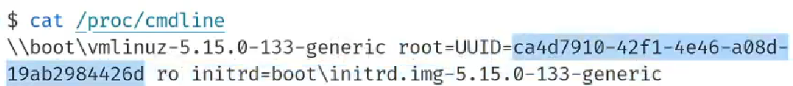

## 开始

从这里开始，不会记录所有讲过的内容，仅会记录自己有兴趣或者自认觉得有价值的部分。


​	

改进建议：

- 每一处地方都添加错误处理，别省着？


## toybox-0.1.0 实现

每当我想起有这么个需求，再回来看看。


## C语言解释器


## 绘制程序状态转移图


## 重点

一个重塑全人类的 prompt

> 我在做 [X]。如果你是一位专业人士，有更好的方法和建议吗？尽可能全面。


## Firmware

想知道是哪一条指令写了这个0x7c00，这个固件究竟是怎么被装到这个地址的。

向 LLM 问出合理的问题。


调试 OpenSBI


## 学会 vim 和智能 agent

- 在 vim 中 使用外部的命令！

    以前都没学会这个，只是懵懵懂懂的知道有这个，但是没体会到这个功能的强大性！

    这就是 智能 agent 吗！！

    再想想，在命令行/vim 中打开各种内容，借助vim和agent


第12课：


## `initramfs` 和启动

> **notice：如果要实践老师的例子，记得开 KVM**

`initramfs` 给应用生态建设者提供了这么一个机制，

可以做一个目录，在目录里放你想要的任何文件（一个目录树），启动的时候就会出现这些内容，这就是 Linux 的初始状态！这个初始状态是由你构建的！

在这个基础上，就能构建一切！


最开始的状态/内容就这么点：


甚至连 `/proc`、`/dev` 都没有？`ps` 都不行。

但是在这个基础上，就能构造出一个像今天一样的Linux的世界（通过很多的 `syscalls`、初始状态 `initramfs`再添加一些多一些内容），各种各样的工具、图形（可能稍微困难点）。。。

具体怎么进一步？`exit`就好了，接着执行下面的！


有意思的是那个 `busybox` 的符号链接，比如：`busybox ln -s /bin/busybox /bin/vi`


创建出了文件系统的结构。现在 `ps` / `ls /proc[pid]/xxx` 就可以了！

再测试一些基本工具，都是OK的！


但是，还有一个问题，我们还没有文件系统，这个怎么来？

从磁盘上来！`/dev/sda`。借助一个系统调用：`mknod`

```bash
mknod /dev/sda     b 8 0
```

> 根据设备号，创建一个文件系统中的文件。（`mkfifo` 底层应该是这个）


但之后呢？磁盘上的内容，怎么进一步加到上面构建出来的文件系统的结构里去？

怎么将磁盘的内容叠加到那个初始状态里去？`mount`

Linux 刚启动的时候，并不是把所有内容都加载到文件系统里去的，我们只有一个 `initramfs`（刚开始的 root 就是这个），连 `vim`、`gcc` 都没有。怎么做？

启动的最后步骤：`pivot_root` / `switch_root`。我们需要把 root 换成 `/dev/sda` 上的 文件系统的 root，**也就是将原来构建的内容摧毁掉，重新构建！**


但既然这样的话，那为什么前面还要 `initramfs` 这么做？这么漫长的过程？


原因就是，在 `initramfs` 这个最早启动的过程中，需要把计算机系统必要的硬件都初始化好！

举个例子， `initramfs` 要做的内容 ：

- 真正的 `/` 是在网络上的，所以需要网卡驱动；

    还有个 网络根文件系统（NFS/iSCSI），此时根文件系统位于远程服务器，需先配置网络和认证，所以 `initramfs` 初始化网卡、启动 DHCP、加载 NFS 客户端模块。

- 如果 `/` 是 `NVMe` 的，那就需要 `NVMe` 的控制器的驱动，也是类似的。

    > 或许会有些奇怪，Linux 内核不是初始化了驱动吗？为什么这里还要初始化呢？
    >
    > 实际上，`initramfs` 本质上是一个为内核定制的“最小化临时系统”，其设计哲学是：**将硬件探测和模块加载推迟到用户空间**（通过 `initramfs`），仅加载**启动必需的最小驱动集**（例如 BIOS/UEFI 接口、初始磁盘控制器驱动），而非固化在内核中。
    >
    > 联想到一些别的问题：[(uboot启动过程既然已经初始化了部分硬件，为什么Linux内核中还是有这些硬件的驱动程序？](https://www.zhihu.com/question/534378582/answers/updated)

    > 来自 DeepSeek的举的例子：
    >
    > - **驱动加载**：若根文件系统在 NVMe 磁盘上，需先加载 `nvme` 驱动：
    >
    >     ```bash
    >     # initramfs 中的操作（示例）
    >     modprobe nvme nvme_core
    >     modprobe nvme-pci
    >     ```
    >
    > - **复杂存储配置**：
    >
    >     - **加密磁盘**：需在 initramfs 中调用 `cryptsetup` 解密
    >     - **LVM/RAID**：需激活逻辑卷或 RAID 阵列
    >
    >     ```bash
    >     vgchange -ay  # 激活 LVM 卷组
    >     mdadm --assemble /dev/md0 /dev/sda1 /dev/sdb1  # 组装 RAID
    >     ```
    >
    > - **网络根文件系统**（NFS/iSCSI）：
    >
    >     ```bash
    >     ip=dhcp  # 从 cmdline 获取网络配置
    >     mount.nfs 192.168.1.100:/nfs_root /new_root
    >     ```

- 再比如，磁盘有损坏，但是磁盘中的 `initramfs` 是好的，那这个系统还是可以起来的，这时就可以对这个磁盘的文件系统进行修复，修复后，再加载到内存上。

    `e2fsck`、`xfs_repair`


但功能实际上还不止这些，`initramfs` 还需要进一步！

之后，就到了挂载真正 root 文件系统的时候，即：将 `/dev/sda` 或者网络上真正的 root 挂载起来！也就是上面说的：`pivot_root` / `switch_root`！

> **`switch_root` 命令背后的系统调用**
>
> ```C
> int pivot_root(const char *new_root, const char *put_old); 
> ```
>
> - `pivot_root()` changes the root mount in the mount namespace of the calling process. More precisely, it moves the root mount to the directory `put_old` and makes `new_root` the new root mount. The calling process must have the `CAP_SYS_ADMIN` capability in the user namespace that owns the caller's mount namespace.
> - syscalls(2)

但先别急，计算机怎么知道 `rootfs` 究竟在哪个地方？对于这种早期初始化级别的内容，肯定需要我们给出位置呀？还真是！也就是常看到的这个 `/proc/cmdline` ！

`/proc/cmdline` 显示各种信息：初始磁盘镜像位置、`rootfs`是哪个分区



具体来说，内核通过 `root=` 参数确定根文件系统位置，支持多种标识方式：

- **设备路径**：`root=/dev/sda1`（传统方式，易受设备顺序影响）
- **UUID**：`root=UUID=1234-5678-9ABC`（推荐，唯一标识文件系统）
- **PARTUUID**：`root=PARTUUID=abcd1234`（GPT 分区表的唯一分区标识）
- **标签**：`root=LABEL=MyRootFS`（需文件系统有标签）

到这里，根文件系统挂载完成，简单总结流程：


但是，这距离现代使用的Linux发行版好像还差点什么？`/home` 用户数据、`/boot`（内核和引导文件，更新）、`/var`（日志）、交换分区（`swap`）等都没有。那具体怎么做？

有这么一个配置文件：`/etc/fstab`（File System Table）：**用于定义除了 `/` 分区要挂载外，还有什么要挂载的，即文件系统挂载规则的核心配置文件。**还是举例子：

- 日志服务（如 `journald`）需要 `/var/log` 可用。
- 用户登录需要访问 `/home` 目录。
- 系统休眠依赖交换分区。

具体挑一个例子来看：

```bash
# /etc/fstab
UUID=1234-5678-9ABC  /         ext4  defaults        0 1
UUID=ABCD-EF01       /boot     vfat  defaults        0 2
UUID=5678-1234-9ABC  /home     ext4  defaults        0 2
UUID=9ABC-5678-1234  none      swap  sw              0 0
tmpfs                /tmp      tmpfs defaults,noatime 0 0
```

| 列序 | 名称          | 示例值                    | 作用                                                         |
| :--- | :------------ | :------------------------ | :----------------------------------------------------------- |
| 1    | **设备标识**  | `UUID=...` 或 `/dev/sda1` | 指定要挂载的设备或文件系统                                   |
| 2    | **挂载点**    | `/`, `/boot`, `/home`     | 文件系统挂载到的目录                                         |
| 3    | **文件系统**  | `ext4`, `vfat`, `swap`    | 文件系统类型                                                 |
| 4    | **挂载选项**  | `defaults`, `noatime`     | 控制读写权限、性能优化等（逗号分隔多个选项）                 |
| 5    | **dump 备份** | `0` 或 `1`                | 是否允许 `dump` 工具备份（现代系统通常设为 `0`）             |
| 6    | **fsck 顺序** | `0`, `1`, `2`             | 启动时 `fsck` 检查顺序：`1`=根分区优先，`2`=其他，`0`=不检查 |

那具体来说是谁来解析这个 `/etc/fstab` 呢？`DeepSeek` 回答：**由 `systemd` 或 `mount` 命令在真实根文件系统初始化阶段解析。**

不管是谁来做，但知道有这么个过程！还是画个图：


> 借助 `DeepSeek` 总结：
>
> | **场景**         | **有 `/etc/fstab`**               | **无 `/etc/fstab`**            |
> | :--------------- | :-------------------------------- | :----------------------------- |
> | **启动自动化**   | 自动挂载所有分区，服务正常启动    | 需手动挂载，易遗漏导致服务失败 |
> | **持久化配置**   | 配置永久生效                      | 每次重启需重新挂载             |
> | **依赖管理**     | systemd 确保挂载顺序              | 依赖关系混乱，启动顺序不可控   |
> | **错误恢复**     | 自动检查文件系统错误              | 无法自动修复磁盘问题           |
> | **复杂存储支持** | 支持加密、LVM、网络存储等高级配置 | 手动操作复杂且容易出错         |

最后，再将根文件系统和控制权移交给另一个程序，例如 `systemd`，做更多的事情！而进一步，这个`systemd` 又会再进一步做相关的内容，加载必要的驱动（网卡配置IP、TTY）。就是我们今天看到的应用程序的世界了！


[NOILinux 2.0](https://zhuanlan.zhihu.com/p/619237809)

再补充一些现代常看到的：

> `/sbin/init` 是 Linux 系统中 **用户空间的第一个进程（PID 1）**，负责初始化系统服务和进程管理。举一些例子
>
> 1. **传统 SysV init 系统**
>
>     - **路径**：`/sbin/init` 是 SysV init（传统初始化系统）的可执行文件。
>
>     - **作用**：按顺序执行 `/etc/inittab` 中的脚本，启动运行级别（Runlevel）对应的服务。
>
>     - **示例**：
>
>         ```bash
>         # 查看传统 init 系统的运行级别
>         cat /etc/inittab
>         # 输出示例：id:3:initdefault:（运行级别3）
>         ```
>
> 2. **现代 systemd 系统**
>
>     - **路径**：在 systemd 系统中，`/sbin/init` **通常是符号链接**，指向 `/usr/lib/systemd/systemd`。
>
>         ```bash
>         # 检查符号链接
>          ls -l /sbin/init
>         # 输出示例：lrwxrwxrwx ... /sbin/init -> /usr/lib/systemd/systemd
>         ```
>
>     - **作用**：`systemd` 作为 PID 1，管理服务并行启动、依赖关系、日志等。
>
> 3. **其他初始化系统**
>
>     - **Upstart**（Ubuntu 早期版本）：`/sbin/init` 是 Upstart 的可执行文件。
>     - **OpenRC**（Gentoo 等）：`/sbin/init` 链接到 OpenRC 的实现。

> **`systemd` 的核心功能**
>
> 即使 `/sbin/init` 指向 `systemd`，其功能远超传统 `init`：
>
> 1. **服务管理**：
>
>     ```bash
>     systemctl start nginx    # 启动服务
>     systemctl enable nginx   # 设置开机自启
>     ```
>
> 2. **日志管理**（journald）：
>
>     ```bash
>     journalctl -u nginx      # 查看服务日志
>     ```
>
> 3. **设备热插拔**（udev）：
>
>     ```bash
>     udevadm monitor          # 监控设备事件
>     ```
>
> 4. **系统状态快照**：
>
>     ```bash
>     systemd-analyze blame    # 分析启动耗时
>     ```


### 实践


