## Basic

- 程序：源代码、指令
- 进程：运行着的程序
- 线程：线程从属于进程，一个进程可以有多个线程，线程之间共享进程的资源
- 任务：具体要做的的事情（可以是一个进程/线程做的）

> 关于线程概念的提出，可以理解为是为了解决进程切换的开销过大


## 进程

> 包括进程创建、销毁、调度、通信和同步。fork（）、exec（）、wait（）...


#### fork()

```bash
man getpid
# 另外查手册
```

- **version1**

    ```c
    #include <sys/types.h>
    #include <unistd.h>
    #include <stdio.h>
    
    int main(void)
    {
    	pid_t pid;
    	
    	pid = fork();
        
        printf("pid = %d\n", pid);
    	printf("hello world.\n");
    
    	return 0;
    }
    
    //打印两次hello world
    //还有两个进程号
    pid = 5867
    hello world.
    pid = 0
    hello world.
    
    ```

    **分析：**

    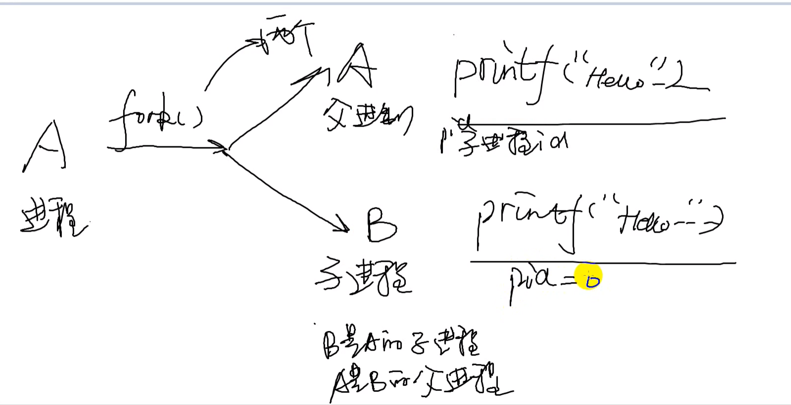

    > From manual: 
    >
    > **RETURN VALUE**
    >        **On success, the PID of the child process is returned in the parent, and 0 is returned in the child.  On failure, -1 is returned in the parent, no child process is created, and errno is set appropriately.**
    >
    > 父进程返回子进程的ID号，子进程返回0。

    

    


- **version2**

    ```c
    #include <sys/types.h>
    #include <unistd.h>
    #include <stdio.h>
    
    int main(void)
    {
    	pid_t pid1, pid2;
    	
    	pid1 = fork();
    	pid2 = fork();
    
    	printf("pid1 = %d, pid2 = %d\n", pid1, pid2);
    	return 0;
    }
    
    ```

     **分析：**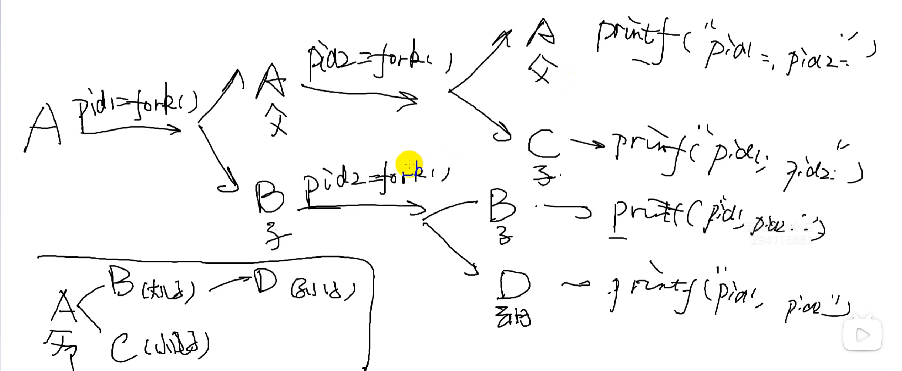

    

    第一行，两次 ID 号都大于 0，说明两次都当父进程，为进程A打印。

    第二行，第一次当子进程，第二次当了父进程，为B进程打印。

    第三行，第一次当父进程，第二次当子进程，不存在，实际上为C进程打印（稍后解析）

    第四行，两次 ID 号都小于 0，说明两次都为子进程，为进程D打印。

    > 关于进程C：
    >
    > 为什么C进程打印会有pid1的值呢？他都没有执行`pid1 = fork()`。
    >
    > **==注意：在fork创建进程的时候，子进程要复制拷贝父进程的所有资源。==**，故pid1的值实际上来自进程A
    >
    > （同理 第四行的 pid1 为 0，也是这么来的）
    >
    > > **(选看)**（这里可以结合计组成笔记来进一步思考，子进程复制之后，是直接开辟一段内存空间来用吗？内存是很宝贵的喔？）
    > >
    > > 想想 **写时复制** COW (Copy-on-write) 和请求调页，只有在写入内存的时候才会分配新的内存。
    > >
    > > >更进一步:
    > > >
    > > >fork 把进程 A 的重要数据结构复制了一份，就生成了进程 C。
    > > >
    > > >有一点很重要，那就是进程 A 与进程 B 的页表指向了相同的物理内存页，**并对其页表都设置为只读属性。**
    > > >
    > > >类似内存共享但有区别，但共享内存是从读取数据的角度来看的，还有数据写入。
    > > >
    > > >- 向内存中写入数据
    > > >
    > > >    写入数据时，这时无论是进程 A 还是进程 C 去写入数据，这里我们假定进程 B 向它的栈区、数据区、指令区等虚拟内存空间写入数据，结果一定是产生 MMU 转换地址失败。
    > > >
    > > >    这是因为对应的页表是只读的，即不允许写入。
    > > >
    > > >    此时 MMU 就会继续通知 CPU 产生缺页异常中断，进而引起 Linux 内核缺页处理程序运行起来。然后，缺页处理程序执行完相应的检查，发现问题出在 COW 机制上，这时候才会把一页物理内存也分配给相关应用，解除页表的只读属性，并且把进程 A 对应的物理内存页的数据，复制到新分配的物理内存页中。
    > >
    > > 综上，在fork进程建立时，通常会使用写时复制来延迟内存分配。
	> > 
    
    更进一步，打印的进程号都是哪几个进程
    
    > 6068 是进程 B 的。
    >
    > 6069 是进程 C 的。
    >
    > 6070 是进程 D 的。
    >
    > A 不知道喔，通过别的方式来看看
    
    
    
    

- **version3.1**：

    进一步改善，都打印ID号，没啥意义。想让父子进程执行各自的内容。--> 利用分支语句

    ```c
    #include <sys/types.h>
    #include <unistd.h>
    #include <stdio.h>
    
    int main(void)
    {
    	pid_t pid;
    	
    	pid = fork();
    
    	if(pid > 0)	//parent process
    	{
    		while(1)
    		{
    			printf("hello world.\n");
    			sleep(1);
    		}
    	}else if(pid == 0)	//child process
    	{
    		while(1)
    		{
    			printf("Good moring.\n");
    			sleep(1);
    		}
    	}else 
    	{
    		perror("fork");
    	}
    
    
    	return 0;
    }
    
    ```

    > Q1: 关于运行时间？谁先运行？
    >
    > 宏观上：并发同时执行（还有`printf()`的影响，不能通过`printf()`的顺序来判断谁先运行），但非要分高低，由Linux 2.6 内核以后给出的解释：**默认父进程先调度（注意·）**，因为父进程在`fork()`的时候，它的缓存、内存都准备好了，自然是要比子进程快的，但这是钻牛角尖的角度，理解成并发同时执行就行了。
    >
    > 有一点，这是来自官方说明，不能单单靠`printf()`顺序。
    >
    > 还有这个顺序带来的性能影响对于绝大多的应用都微乎其微，但我就是要一个明确的顺序，这部分内容就是后面 任务/进程/线程 同步技术。


- version4

    ```c
    #include <sys/types.h>
    #include <unistd.h>
    #include <stdio.h>
    
    int count = 0;
    
    int main(void)
    {
    	pid_t pid;
    	int i = 0;
    	pid = fork();
    
    	if(pid > 0)	//parent process
    	{
    		for(i = 0; i < 10; i++)
    		{
    			printf("Hello world: %d\n ", count++);
    		}
    	}else if(pid == 0)	//child process
    	{
    		while(1)
    		{
    			printf("Good moring: %d.\n", count++);
    			sleep(2);
    		}
    	}else 
    	{
    		perror("fork");
    	}
    
    
    	return 0;
    }
    
    ```

    父进程和子进程都是由独立的内存空间，互不干扰、和不互相依赖。

    变量`count`在父进程和子进程中都有一份副本，但这两份副本是独立的，每个进程修改`count`时只会影响自己进程内部的副本，不会影响另一个进程的副本。因此，可以理解为父子进程中的`count`是两个不同的变量，只是名字相同而已。

    > 如果想要互相干扰，还得是 IPC 的内容


#### wait()

```bash
man wait
# 另外查手册
```

> `pid_t wait(int *wstatus);` 
>
> 开发的时候，对于许多需要创建子进程的应用来说，父进程能够监测子进程的终止时间和过程是很有必要的。
>
> 系统调用 wait()等待调用进程的任一子进程终止，同时在参数 status 所指向的缓冲区中返回该子进程的终止状态。
>
> - 如果没有一个子进程没有终止的话，那wait一直阻塞；如果有，那就返回这个子进程的ID号，且从阻塞变为非阻塞。
>
> - 当所有子进程都已经运行结束，那wait函数返回 -1 ，即wait函数等待子进程都结束了。
> - 如果 status 非空，那么关于子进程如何终止的信息则会通过 status 指向的整型变量返回。
> - 内核将会为父进程下所有子进程的运行总量追加进程 CPU 时间以及资源使用数据。  

- version1：

    创建3个子进程，5s 、10s、15s后分别结束，父进程一直等待子进程运行结束，直到所有的子进程结束，父进程再结束

    ```c
    #include <sys/types.h>
    #include <sys/wait.h>
    #include <stdio.h>
    #include <unistd.h>
    #include <stdlib.h>
    
    // run model: ./a.out 10 5 15
    // Create three child process and run. After 10, 5, 15 seconds, they will exit 
    int main(int argc, char *argv[])
    {
    	pid_t child_pid;
    	int numDead;
    	int i;
    
    	for(i = 1; i < argc; i++)
    	{
    		switch(fork())
    		{
    			case -1:
    				perror("fork()");
    				exit(0);
    		
    			case 0:		//child process
    				printf("Child %d start with PID = %d, sleeping %s \n", i, getpid(), argv[i]);
    				sleep(atoi(argv[i]));
    				exit(0);
    
    			default:	//parent process
    				break;
    
    		}
    	}
    	numDead = 0;
    
    	while (1)
    	{
    		child_pid = wait(NULL);
    
    		if(-1 == child_pid)
    		{
    			printf("No more children, byebye!\n");
    			exit(0);
    		}
    
    		numDead++;
    		printf("wait() returned child PID: %d(numDead = %d)\n", child_pid, numDead);
    	}
    	return 0;
    }
    
    ```

    


## 线程


#### pthread_create()

```c
  int pthread_create(pthread_t *thread, const pthread_attr_t *attr,
                      void *(*start_routine) (void *), void *arg);

1. 线程ID号：thread

2. 线程结构体指针：attr
       The attr argument points to a pthread_attr_t structure whose contents are used at thread creation time to determine attributes for the new thread; this structure is initialized using pthread_attr_init(3) and related functions.  If attr is NULL, then the thread is created with default attributes.
           
3. 函数指针：start_routine（地址）
 
4. 给函数指针的参数
           可以控制函数指针的一些行为，下面的代码的执行顺序？
```


- version1

    ````c
    #include <pthread.h>
    #include <stdio.h>
    #include <stdlib.h>
    #include <unistd.h>
    
    void *thread_function(void *arg);
    
    int main(int argc, char *argv[])
    {
        pthread_t pthread;
        int ret;
    
        ret = pthread_create(&pthread, NULL, thread_function, NULL);
        if(ret != 0)
        {
            perror("pthread_create()");
            exit(1);
        }
    
        return 0;
    }
    
    void *thread_function(void *arg)
    {
        int i = 0;
        
        printf("Thread begins running.\n");
    
        while(1)
        {
            printf("Hello world.\n");
            sleep(1);
        }
    
        return NULL;
    }
    // 上面有问题，直接return0后，进程直接挂了，线程依赖于进程，那线程也就挂了
    // 改进，直接在return 0前面加个while(1) 或者别的方法，
    
    ````

    --> 引入`pthread_join()` 

    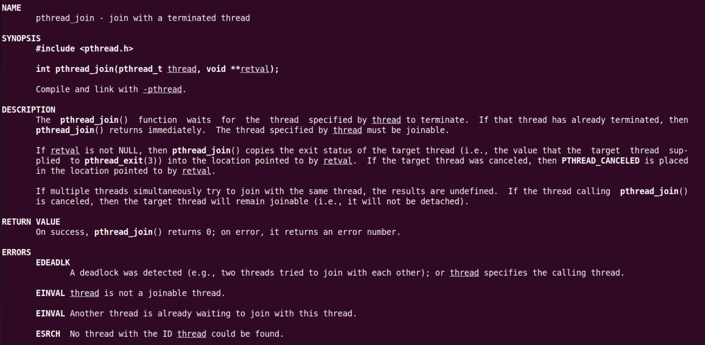运用一下`arg`参数：

    ```c
    #include <pthread.h>
    #include <stdio.h>
    #include <stdlib.h>
    #include <unistd.h>
    
    void *thread_function(void *arg);
    
    int main(int argc, char *argv[])
    {
        pthread_t pthread;
        int ret;
        int count = 4;
    
        ret = pthread_create(&pthread, NULL, thread_function, &count);
        if(ret != 0)
        {
            perror("pthread_create()");
            exit(1);
        }
    
        pthread_join(pthread, NULL);
        printf("The thread is over, the process is over too\n");
    
    
        return 0;
    }
    
    void *thread_function(void *arg)
    {
        int i = 0;
        
        printf("Thread begins running.\n");
    
        for(i = 0; i < *(int *)arg; i++)
        {
            printf("Hello world.\n");
            sleep(1);
        }
    
        return NULL;
    }
    
    ```

    

- version2.1

    ```c
    #include <pthread.h>
    #include <stdio.h>
    #include <stdlib.h>
    #include <unistd.h>
    
    void *thread_function1(void *arg);
    void *thread_function2(void *arg);
    
    int main(int argc, char *argv[])
    {
        pthread_t pthread1, pthread2;
        int ret;
    //    int count = 4;
    
        ret = pthread_create(&pthread1, NULL, thread_function1, NULL);
        if(ret != 0)
        {
            perror("pthread_create()");
            exit(1);
        }
    
       ret =  pthread_create(&pthread2, NULL, thread_function2, NULL);
        if(ret != 0)
        {
            perror("pthread_create()");
            exit(1);
        }
    
        pthread_join(pthread1, NULL);
        pthread_join(pthread2, NULL);
        printf("The thread is over, the process is over too\n");
    
    
        return 0;
    }
    
    void *thread_function1(void *arg)
    {
        printf("Thread1 begins running.\n");
    
        while(1)
        {
            printf("Hello world.\n");
            sleep(1);
        }
    
        return NULL;
    }
    
    void *thread_function2(void *arg)
    {
        printf("Thread2 begins running.\n");
    
        while(1)
        {
            printf("Good morning.\n");
            sleep(1);
        }
    
        return NULL;
    }
    
    ```


- version2.2

    ```c
    #include <pthread.h>
    #include <stdio.h>
    #include <stdlib.h>
    #include <unistd.h>
    
    void *thread_function1(void *arg);
    void *thread_function2(void *arg);
    
    int count = 0;
    
    int main(int argc, char *argv[])
    {
        pthread_t pthread1, pthread2;
        int ret;
    //    int count = 4;
    
        ret = pthread_create(&pthread1, NULL, thread_function1, NULL);
        if(ret != 0)
        {
            perror("pthread_create()");
            exit(1);
        }
    
       ret =  pthread_create(&pthread2, NULL, thread_function2, NULL);
        if(ret != 0)
        {
            perror("pthread_create()");
            exit(1);
        }
    
        pthread_join(pthread1, NULL);
        pthread_join(pthread2, NULL);
        printf("The thread is over, the process is over too\n");
    
    
        return 0;
    }
    
    void *thread_function1(void *arg)
    {
        printf("Thread1 begins running.\n");
    
        while(1)
        {
            printf("Hello world. Thread1 count = %d\n", count++);
            sleep(1);
        }
    
        return NULL;
    }
    
    void *thread_function2(void *arg)
    {
        printf("Thread2 begins running.\n");
    
        while(1)
        {
            printf("Good morning. Thread2 count = %d\n", count++);
            sleep(1);
        }
    
        return NULL;
    }
    
    ```

    和进程不一样喔！也符合理论，也就是共享进程资源，那个全局变量。进程之间可以看到互相的count。

    也就是说线程之间传递数据更加方便，不像进程那么复杂。

    进程通信要比线程通信要难得多。


## 进程间通信 （IPC）

> 

- 任务间的通信：
    - 管道：有名~、 无名~
    - 共享内存
    - 消息队列

- 任务间同步：
    - 信号量：无名~、 有名~


### 无名管道（unnamed pipe）

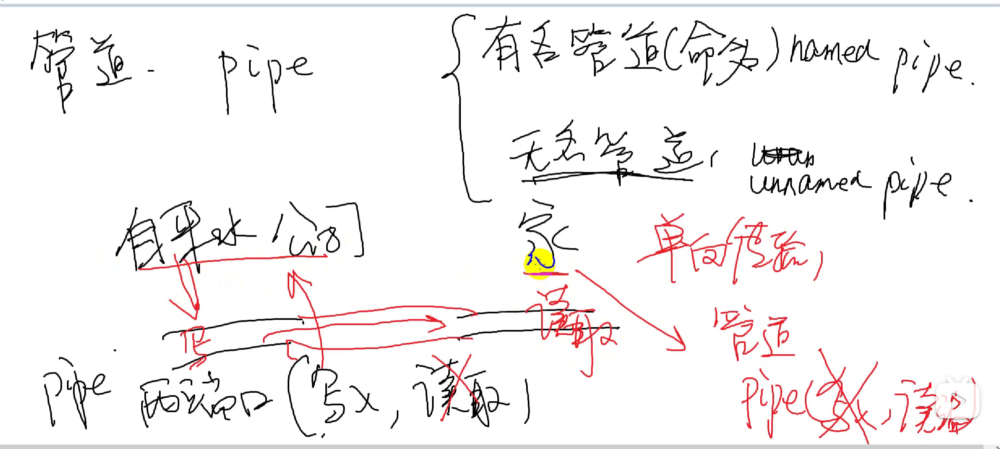

> 管道双向的


#### pipe()

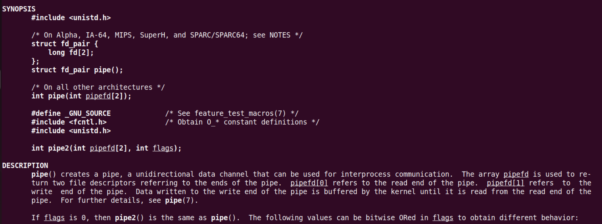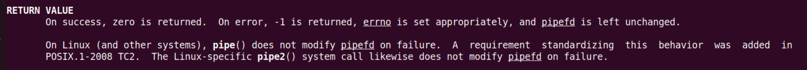

有一端读，有一端写

（实现父子进程通信：父进程，子进程各有一段开读写，父进程开写端，子进程开读端）

用哪边，开哪边（参数数组的两个值）

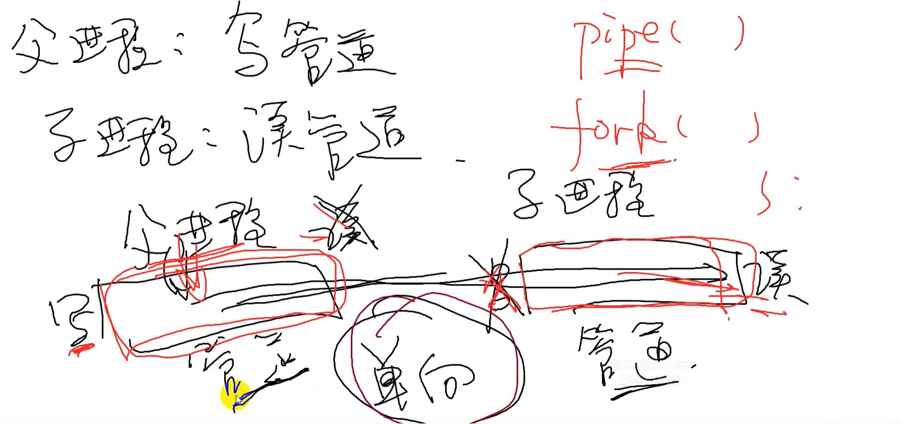

- version1

    ```c
    #include <unistd.h>
    #include <stdio.h>
    #include <sys/types.h>
    
    /*
     *
     * parent process: write pipe  < == > like operate with file
     * child process: read pipe
     *
     * */
    int main(void)
    {
        int fd[2];
        pid_t pid;
    
        if(pipe(fd) == -1)
        {
            perror("pipe");
        }
    
        pid = fork();
        if(pid > 0)     //parent
        {
            close(fd[0]);
            sleep(5);
            write(fd[1], "ab", 2);
        }else if(pid == 0)
        {
            char ch[2];
    
            printf("child process is waitint for the data from parent process: \n");
            close(fd[1]);
            /* if no data buffer.... */
            read(fd[0], ch, 2);
            printf("Read from pipe: %s\n", ch);
        }
    
    
        return 0;;
    }
    
    ```
    
    那管道的大小呢


- version2

    > 管道容量究竟有多大 65536个字节64KB

    ```c
    #include <unistd.h>
    #include <stdio.h>
    #include <sys/types.h>
    #include <sys/wait.h>
    
    
    int main(void)
    {
        int fd[2];
        pid_t pid;
    
        if(pipe(fd) == -1)
        {
            perror("pipe");
        }
    
        pid = fork();
        if(pid > 0)     //parent process: wait until child process is over.
        {
            waitpid(pid, NULL, 0);
    
        }else if(pid == 0)      //child process: write to the pipe.
        {
            char ch = '*';
            int n = 0;
            close(fd[0]);
    
            while(1)
            {
                write(fd[1], &ch, 1);
                printf("write count: %d\n", n++);
            }
        }
    
        return 0;;
    }
    
    ```


- version3

    ```c
    #include <unistd.h>
    #include <stdio.h>
    #include <sys/types.h>
    #include <sys/wait.h>
    
    int main(void)
    {
        int fd[2];
        pid_t pid;
    
        if(pipe(fd) == -1)
        {
            perror("pipe");
        }
    
        pid = fork();
        if(pid > 0)     //parent process: read from child process
        {
            char temp[100];
            close(fd[1]);
    
            while(1)
            {
                printf("Parent is waiting from the child.\n");
                read(fd[0], temp, sizeof(temp));  
                printf("Read from pipe: %s\n\n", temp);
            }
    
        }else if(pid == 0)      //child process: write to the pipe.
        {
            char tmp[100];
    
            close(fd[0]);
    
            while(1)
            {
                scanf("%s", tmp);
                write(fd[1], tmp, sizeof(tmp));
    
            }
        }
    
    
        return 0;;
    }
    
    ```

    


### 有名管道（named pipe）

有名管道（Named pipe，也称为FIFO）和无名管道（Anonymous pipe）是两种不同类型的管道，它们在使用方式和特性上有一些区别。

1. **有名管道**：
   - 有名管道是通过文件系统中的路径名来命名的，它在文件系统中有对应的文件节点。
   - 有名管道可以在不相关的进程之间进行通信，只要它们知道有名管道的路径名。
   - 有名管道可以持久存在，即使创建它的进程结束，有名管道仍然存在，直到显式删除。
   - 有名管道可以通过`mkfifo`函数来创建。

2. **无名管道**：
   - 无名管道是一种匿名的管道，没有对应的文件系统路径名。
   - 无名管道通常用于相关进程之间的通信，如父子进程之间。
   - 无名管道是临时的，只在创建它们的进程及其子进程之间有效，进程结束时管道也会被销毁。
   - 无名管道通常通过`pipe`函数来创建。

总的来说，**有名管道适用于不相关的进程之间的通信，并且可以持久存在；而无名管道适用于相关进程之间的通信，是临时的。**根据具体的通信需求和生存周期，可以选择使用有名管道或无名管道。


#### mkfifo()

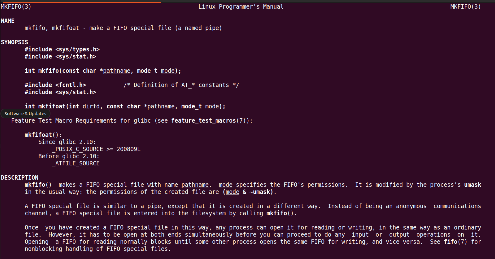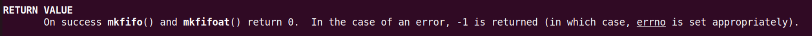

```c
// read.c 
// gcc read.c -o read
// usage: ./read

#include <sys/types.h>
#include <sys/stat.h>
#include <stdio.h>
#include <unistd.h>
#include <string.h>
#include <fcntl.h>

int main(void)
{
    int ret;
    int fd;
    char buf[100];

    ret = mkfifo("my_fifo", 0666); 
    if(ret != 0)
    {
        perror("mkfifo");
    }
    
    printf("Prepare reading from named pipe:\n");

    fd = open("my_fifo", O_RDWR);

    if(fd == -1)
    {
        perror("open");
    }

    while(1)
    {
        memset(buf, '\0', sizeof(buf));
        read(fd, buf, sizeof(buf));
        printf("Read from named pipe: %s\n", buf);
        sleep(1);
    }
    

    return 0;
}

```

```c
// write.c 
// gcc write.c -o write
// usage: ./write hello
// maybe need root

#include <sys/types.h>
#include <sys/stat.h>
#include <stdio.h>
#include <stdlib.h>
#include <unistd.h>
#include <string.h>
#include <fcntl.h>

int main(int argc, char *argv[])
{
    int fd;
    char buf[100];

    fd = open("my_fifo", O_WRONLY);
    if(fd == -1)
    {
        perror("open");
    }

    if(argc == 1)
    {
        printf("please send something to the named pipe: \n");
        exit(EXIT_FAILURE);
    }

    strcpy(buf, argv[1]);
    write(fd, buf, sizeof(buf));
    printf("Write to the pipe: %s\n", buf);


    return 0;
}
```

> 这里在测试的时候，因为这一句`printf("Read from named pipe: %s\n", buf);`引发了一些问题。
>
> 在我加了`\n`之前，一直读取不到来自管道另一端的数据，一直卡死；加了之后才能读取到。
>
> 实际上这和 `printf` 实现有关：
>
> `printf` 是一个行缓冲函数，先写到缓冲区，满足条件后(原则上缓冲区满了才写出成为标准输出流)，才将缓冲区刷到对应文件中。
>
> 即：**`printf` 的内容放在缓冲区里面还没有刷出来**，原则上是缓冲区满了以后才输出。
>
> > 冲刷缓冲区的条件：
> >
> > 1. 缓冲区填满
> > 2. 写入的字符中有"\n" "\r"
> > 3. 调用 `fflush` 手动刷新缓冲区 `fflush(stdout)`
> > 4. 调用 `scanf` 要从缓冲区中读取数据时，也会将缓冲区内的数据刷新
>
> 执行 `printf` 的进程或线程结束后，会自动调用 `fflush` 刷新缓冲区。
> **缓冲区大小1024字节。**


### 共享内存

> 这里还分 System V IPC 和 POSIX IPC
>
> 可以了解一下这二者
>
> 下面主要是 System V IPC 

#### 简述

- 早期的共享内存，着重于强调把同一片内存，**map**到多个进程的虚拟地址空间（在相应进程找到一个VMA区域），以便于CPU可以在各个进程访问到这片内存。不同进程对映射到本进程的内存进行写读操作，相当于各个进程对于同一片地址空间进行操作

- 现阶段广泛应用于多媒体、Graphics领域的共享内存方式，某种意义上不再强调映射到进程虚拟地址空间的概念（那无非是为了让CPU访问），而更强调以某种“句柄”的形式，**让大家知道某一片视频、图形图像数据的存在并可以借助此 ==“句柄”== 来跨进程引用这片内存**，让视频 encoder、decoder、GPU 等可以跨进程访问内存。

    所以不同进程用的加速硬件其实是不同的，他们更在乎的是可以通过一个 handle 拿到这片内存，而不再特别在乎 CPU 访问它的虚拟地址（当然仍然可以映射到进程的虚拟地址空间供 CPU 访问）。


使用过程：创建映射，建立映射，解除映射，删除映射

[进程间的通信方式（一）：共享内存 - 知乎 (zhihu.com)](https://zhuanlan.zhihu.com/p/37808566)

进阶：[宋宝华：世上最好的共享内存(Linux共享内存最透彻的一篇)-腾讯云开发者社区-腾讯云 (tencent.com)](https://cloud.tencent.com/developer/article/1551288)


> **关于文件标识符和 key 值**
>
> 应用层中：用共享内存表示符（相当于一个标志）identifier
>
> 而内核层中，实际用键值来标识共享内存。


#### 创建/绑定映射: `shmget()`

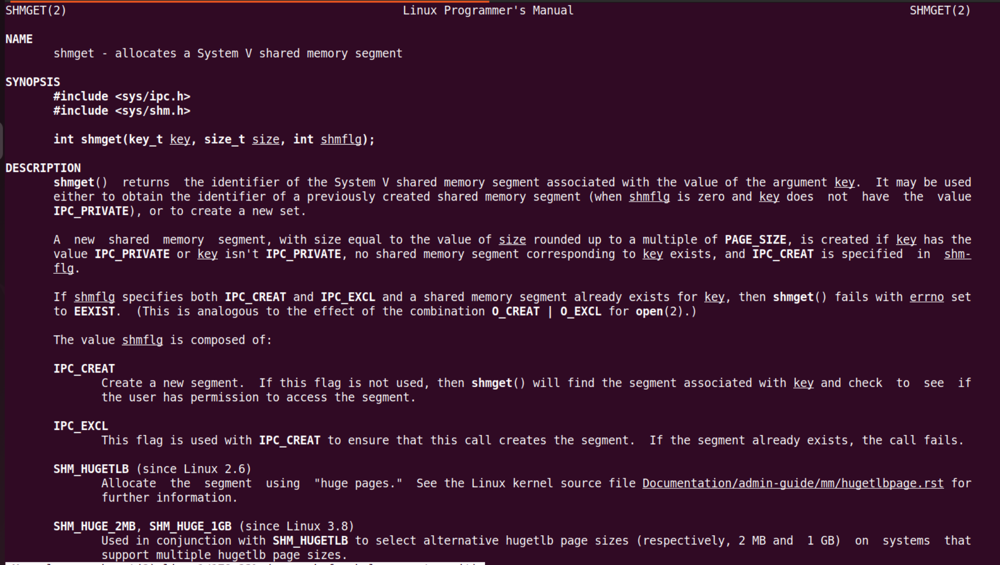


#### 建立映射: `shmat()`

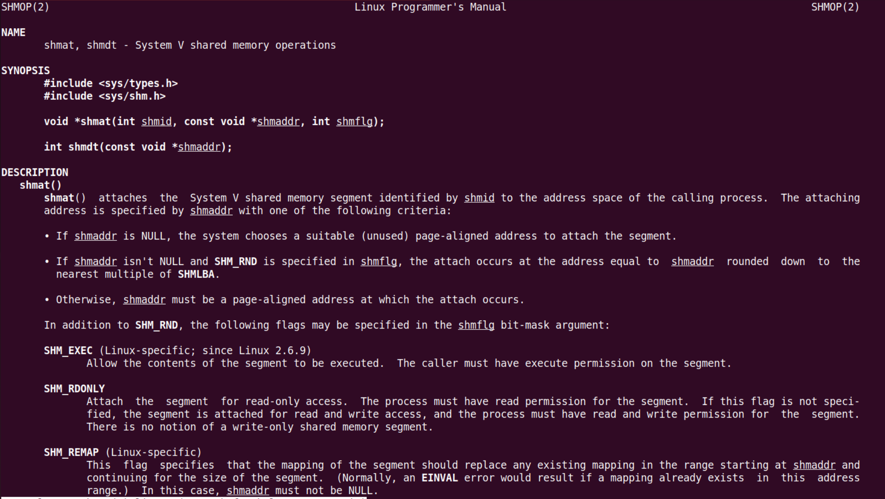


#### 解除映射: `shmdt()`

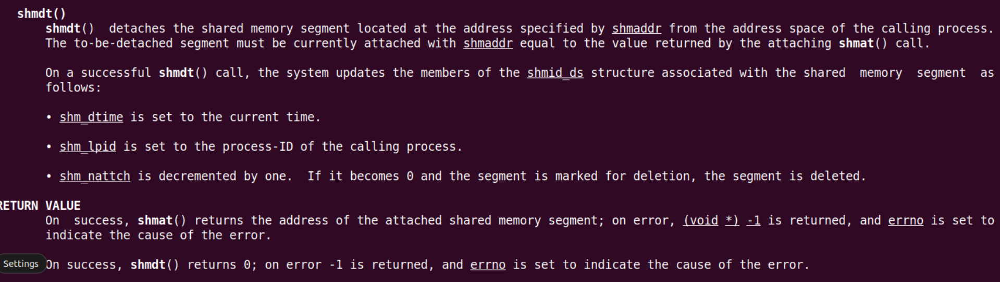


#### 删除映射: `shmctl()`

> 并没有特别实现某个映射，通过这个控制函数来删除。自行研究

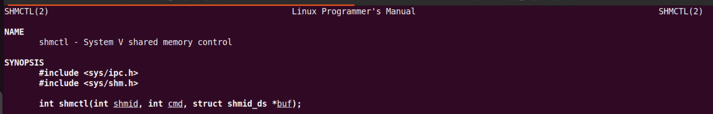


- version1：父子进程共享内存

    ```c
    #include <stdio.h>
    #include <stdlib.h>
    #include <sys/ipc.h>
    #include <sys/shm.h>
    #include <sys/wait.h>
    #include <sys/types.h>
    #include <unistd.h>
    #include <string.h>
    
    char msg[] = "hello world!";
    
    int main(void)
    {
        int shmid;
        pid_t pid;
    
        // Allocte the shared memory.
        shmid = shmget(IPC_PRIVATE, 1024, IPC_CREAT);
    
        pid = fork();
    
        if(pid > 0)
        {
            char *p_addr;
    
            // map the shared memory to the parent process p_addr
            p_addr = shmat(shmid, NULL, 0);
            
            memset(p_addr, '\0', sizeof(msg));
            memcpy(p_addr, msg, sizeof(msg));
    
            shmdt(p_addr);
    
            waitpid(pid, NULL, 0);
        }else if(pid == 0)
        {
            char *c_addr;
    
            // map the shared memory to the Child process p_addr
            c_addr = shmat(shmid, NULL, 0);
    
            printf("Child process is waiting.\n");
            sleep(3);
    
            printf("Child process reads from shared memory: %s\n", c_addr);
    
            shmdt(c_addr);
        }else
        {
            perror("fork");
        }
        
    
        return 0;
    }
    
    ```

    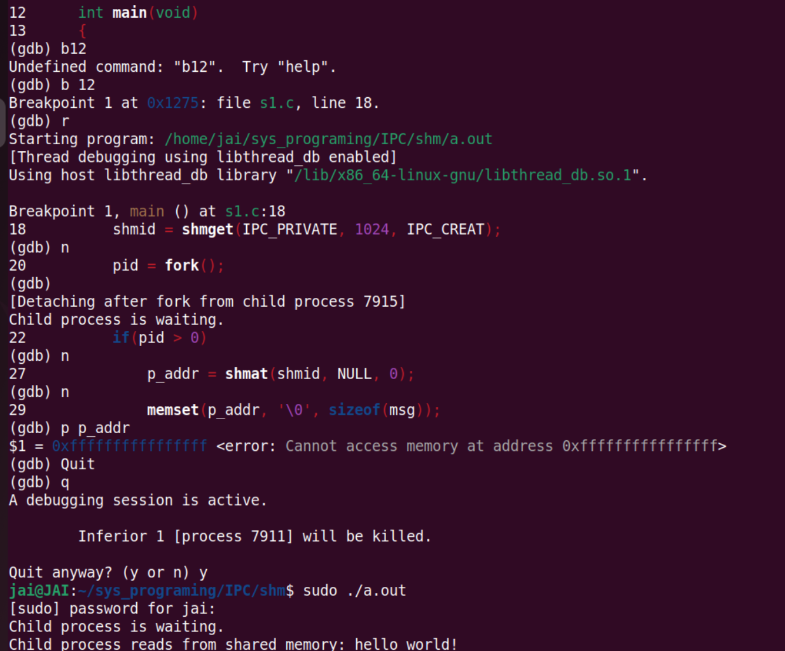

    > **注意对共享内存的读写操作需要root权限**


- version2：非亲缘关系进程共享内存

    关键在于使用了相同的key，能访问到相同的值

    > - 宏定义同一个key值
    > - `ftok()`

    ```c
    // read.c
    #include <stdio.h>
    #include <stdlib.h>
    #include <sys/ipc.h>
    #include <sys/shm.h>
    #include <sys/wait.h>
    #include <sys/types.h>
    #include <unistd.h>
    #include <string.h>
    
    #define MY_KEY 9527
    
    int main(void)
    {
        char *c_addr;
        int shmid;
    
        // Allocte the shared memory.
        shmid = shmget(MY_KEY, 1024, IPC_CREAT);
        if(-1 == shmid)
        {
            perror("shmget");
            exit(EXIT_FAILURE);
        }
        
        c_addr = (char *)shmat(shmid, NULL, 0);
    
        printf("Read from shared memory: %s\n",c_addr);
        shmdt(c_addr);
    
        return 0;
    }
    ```
    
    ```c
    // write.c
    #include <stdio.h>
    #include <stdlib.h>
    #include <sys/ipc.h>
    #include <sys/shm.h>
    #include <sys/wait.h>
    #include <sys/types.h>
    #include <unistd.h>
    #include <string.h>
    
    char msg[] = "hello world!";
    
    /* 
     * Ensure the same key in different process.
     * If we use the IPC_PRIVATE, we will create new segement by kernel.
     *
     * Any other methods?
     * cmsg --> Socket
     */
    #define MY_KEY 9527
    
    int main(void)
    {
        char *p_addr;
        int shmid;
         
        // Allocte the shared memory.
        shmid = shmget(MY_KEY, 1024, IPC_CREAT);
        if(-1 == shmid)
        {
            perror("shmget");
            exit(EXIT_FAILURE);
        }
        
        p_addr = (char *)shmat(shmid, NULL, 0);
        
        memset(p_addr, '\0', sizeof(msg));
        memcpy(p_addr, msg, sizeof(msg));
    
        shmdt(p_addr);
    
        // delete the shared memmory,
    //    shmctl(shmid, IPC_RMID, NULL);
    
        return 0;
    }
    
    ```
    

> `ftok()` 函数是一个用于生成 System V IPC（Inter-Process Communication，进程间通信）键的函数。在 System V IPC 中，消息队列、共享内存和信号量都需要一个唯一的标识符（键）来进行操作。`ftok()` 函数可以根据给定的路径名和项目 ID 生成一个唯一的键。
>
> - `ftok()` 函数的原型
>
>     ```c
>     key_t ftok(const char *pathname, int proj_id);
>     ```
>
>     
>
> - 参数说明
>
>     - `pathname`：一个存在的文件路径名，用于生成唯一键的基础。
>     - `proj_id`：一个非负整数，用于生成唯一键的进程 ID。
>     - 返回值
>     - 如果成功，`ftok()` 函数返回一个由 `pathname` 和 `proj_id` 生成的唯一键。
>     - 如果失败，返回 -1，并设置 `errno` 错误码来指示错误原因。
>
> - 使用示例
>
>     ```c
>     #include <sys/types.h>
>     #include <sys/ipc.h>
>                     
>     key_t key = ftok("/tmp/myfile", 'A');
>     if (key == -1) {
>         perror("ftok");
>         exit(EXIT_FAILURE);
>     }
>     ```
>
>     在示例中，`ftok()` 函数根据文件路径 `"/tmp/myfile"` 和项目 ID 'A' 生成一个唯一的键，用于创建或访问 System V IPC 对象。
>
>     需要注意的是，`ftok()` 函数的生成键的方式可能不够安全，因为它依赖于文件路径和项目 ID。如果多个进程使用相同的路径和项目 ID 来调用 `ftok()`，可能会导致键冲突。因此，在实际使用中，建议使用其他更安全的方式来生成唯一键，比如使用 `IPC_PRIVATE` 或其他方法来避免键冲突。
>
> 


### 消息队列

> 类似于管道，只是将数据放到消息队列中，也就是放到数据容器中，本质就是结构体。注意这里队列和数据结构那里的队列不一样
>
> 仍然讲System V


#### 简述

Linux 下的消息队列是一种进程间通信（IPC）机制，允许不同进程之间通过在消息队列中发送和接收消息来进行通信。消息队列通常用于实现进程之间的异步通信，发送方将消息发送到队列中，接收方从队列中接收消息。

- 内部工作原理

    消息队列的内部工作原理如下：
    1. **创建消息队列**：首先，一个进程通过调用 `msgget()` 系统调用来创建一个消息队列，该系统调用返回一个唯一的消息队列标识符。
    2. **发送消息**：发送方进程使用 `msgsnd()` 系统调用将消息发送到消息队列中。消息包含一个消息类型和实际数据。
    3. **接收消息**：接收方进程使用 `msgrcv()` 系统调用从消息队列中接收消息。接收方可以选择接收特定类型的消息，也可以接收队列中的第一个消息。
    4. **删除消息队列**：当不再需要消息队列时，进程可以调用 `msgctl()` 系统调用来删除消息队列。

- 实现细节

    消息队列的实现依赖于内核中的数据结构来管理消息队列的内容。在 Linux 中，消息队列的内部数据结构主要包括以下几个部分：
    - **消息队列描述符（Message Queue Descriptor）**：每个消息队列都有一个唯一的描述符，用于标识该消息队列。
    - **消息队列数据结构**：内核中维护一个数据结构来存储消息队列的信息，包括消息的数量、大小、消息类型等。
    - **消息缓冲区**：实际存储消息的地方，消息队列中的消息都存储在这些缓冲区中。
    - **消息队列控制块（Message Queue Control Block）**：用于管理消息队列的数据结构，包括指向消息队列的指针、消息队列的状态等信息。

在 Linux 内核中，消息队列是通过 System V IPC 机制实现的，相关的系统调用包括 `msgget()`、`msgsnd()`、`msgrcv()` 和 `msgctl()`。这些系统调用通过操作内核中的数据结构来实现消息队列的创建、发送、接收和删除。

总的来说，消息队列是一种方便的进程间通信机制，通过内核维护的数据结构和相关系统调用来实现消息的发送和接收。


#### `msgget()`

> 和共享内存的 `shmget()` 差不多

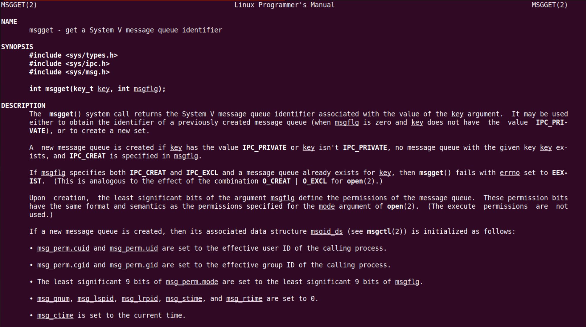


> `msgflag` 这种标志，不知道写什么，直接写默认的


#### `msgsnd() msgrcv()`

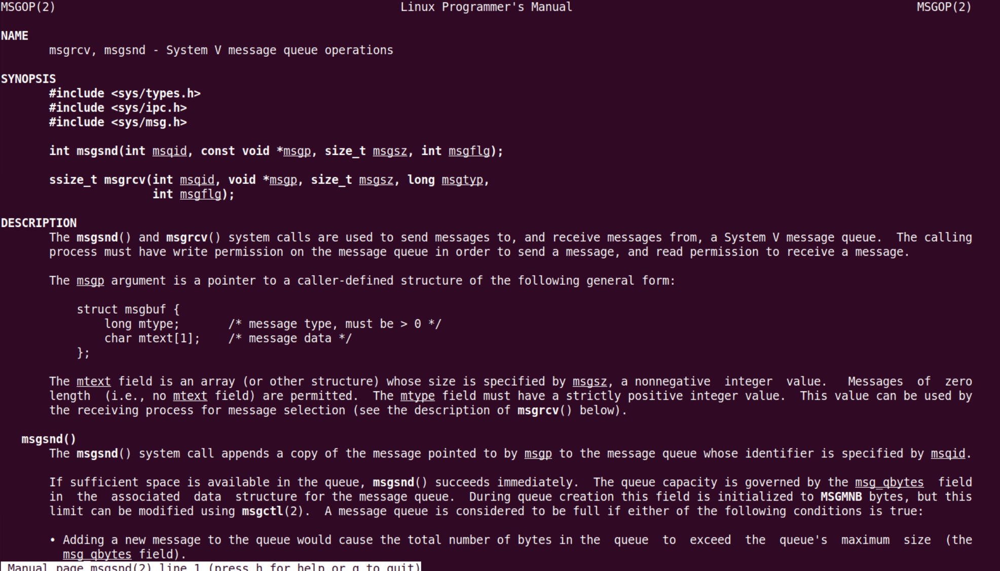


> 可以发送任意类型数据，因为他是一个结构体，里面套什么都行，再套个结构体都可以


#### `msgctl()`

> 用于删除


#### 练习

- version1

    ```c
    #include <stdio.h>
    #include <stdlib.h>
    #include <sys/ipc.h>
    #include <sys/shm.h>
    #include <sys/wait.h>
    #include <sys/msg.h>
    #include <sys/types.h>
    #include <unistd.h>
    #include <string.h>
    
    struct msgbuf
    {
        long mtype;         /* message type. must be >0 */
        char mtext[100];      /* message data */
        int number;
    };
    
    #define MY_TYPE 9527
    
    int main(void)
    {
        pid_t pid;
        int msgid;
        struct msgbuf buf;
    
        msgid = msgget(IPC_PRIVATE, IPC_CREAT);
    
        pid = fork();
        if(pid > 0)
        {
            sleep(3);
    
            buf.mtype = MY_TYPE;
            printf("Please enter a string you want to send: \n");
            fgets(buf.mtext, sizeof(buf.mtext), stdin);
    //        gets(buf.mtext);
            printf("Please enter a number you want to senf: \n");
            scanf("%d", &buf.number);
    
            msgsnd(msgid, &buf, sizeof(buf) - sizeof(buf.mtype), 0);
    
            waitpid(pid, NULL, 0);
        }else if(pid == 0)
        {
            printf("Child process is waiting for msg: \n");
            // memset(buf, '\0', )
            /* The type of msg in child process must be matched with parent. */
            msgrcv(msgid, &buf, sizeof(buf) - sizeof(buf.mtype), MY_TYPE, 0);
            printf("Child process read from msg: %s, %d\n", buf.mtext, buf.number);
    
            msgctl(msgid, IPC_RMID, NULL);
    
        }else
        {
            perror("fork");
        }
        
    
        return 0;
    }
    
    ```


- version2

    ```c
    //write.c
    #include <stdio.h>
    #include <stdlib.h>
    #include <sys/ipc.h>
    #include <sys/shm.h>
    #include <sys/msg.h>
    #include <sys/types.h>
    #include <unistd.h>
    #include <string.h>
    
    struct msgbuf
    {
        long mtype;         /* message type. must be >0 */
        char mtext[100];      /* message data */
        int number;
    };
    
    #define MY_TYPE 9527
    #define MY_KEY 6666
    
    int main(void)
    {
        int msgid;
        struct msgbuf buf;
    
        msgid = msgget(MY_KEY, IPC_CREAT);
    
        sleep(3);
    
        buf.mtype = MY_TYPE;
        printf("Please enter a string you want to send: \n");
        fgets(buf.mtext, sizeof(buf.mtext), stdin);
        printf("Please enter a number you want to senf: \n");
        scanf("%d", &buf.number);
    
        msgsnd(msgid, &buf, sizeof(buf) - sizeof(buf.mtype), 0);
    
    
        return 0;
    }
    ```

    ```c
    // read.c
    #include <stdio.h>
    #include <stdlib.h>
    #include <sys/ipc.h>
    #include <sys/shm.h>
    #include <sys/wait.h>
    #include <sys/msg.h>
    #include <sys/types.h>
    #include <unistd.h>
    #include <string.h>
    
    struct msgbuf
    {
        long mtype;         /* message type. must be >0 */
        char mtext[100];      /* message data */
        int number;
    };
    
    #define MY_TYPE 9527
    #define MY_KEY 6666
    
    
    int main(void)
    {
        int msgid;
        struct msgbuf buf;
    
        msgid = msgget(MY_KEY, IPC_CREAT);
    
        printf("Child process is waiting for msg: \n");
        /* The type of msg in child process must be matched with parent. */
        msgrcv(msgid, &buf, sizeof(buf) - sizeof(buf.mtype), MY_TYPE, 0);
        printf("Child process read from msg: %s, %d\n", buf.mtext, buf.number);
    
        msgctl(msgid, IPC_RMID, NULL);
        
    
        return 0;
    }
    
    ```

    >  用 `ftok()`


### 信号量

> 前面的管道、共享内存、消息队列，都是一种任务间通信、数据传输的机制
>
> 下面的信号量，则是一种任务之间同步的操作。
>
> > 同步，每一刻，一种资源只能由一个任务占有。比如有一个玩具，很多小朋友都想玩？
> >
> > ---> 任务在共享资源的时候，谁先访问，不允许访问？
> >
> > > 在计算机科学中，同步指的是协调不同进程或线程之间的操作，使它们按照一定的顺序或时间进行执行，以确保数据的一致性和正确性。同步操作可以确保在必要时，一个进程会等待另一个进程完成某个操作后才继续执行。
> > >
> > > 举个实际例子来说明同步的概念：
> > > 假设有两个线程A和B同时访问一个共享变量`count`，线程A想要增加`count`的值，而线程B想要减少`count`的值。如果没有同步机制，可能会出现以下情况：
> > >
> > > 1. 线程A读取`count`的值为5。
> > > 2. 线程B读取`count`的值也为5。
> > > 3. 线程A增加`count`的值为6。
> > > 4. 线程B减少`count`的值为4。
> > >
> > > 在这种情况下，最终的`count`值并不符合预期，因为两个线程对共享变量的操作没有按照正确的顺序进行。这时就需要同步操作来确保线程A和线程B之间的操作顺序正确。
> > >
> > > 为什么叫做“同步”呢？“同步”这个词源于希腊语“syn-”（共同）和“ `khronos`”（时间），意思是“共同的时间”。在计算机领域，同步指的是协调不同操作在时间上的一致性，确保它们按照一定的顺序或时间进行执行，以达到数据一致性和正确性的目的。
> > >
> > > 因此，同步操作在计算机领域中被称为“同步”，是为了强调不同操作之间的协调和一致性，确保它们在“共同的时间”内正确执行。


> 信号量本质上是一个**由内核维护的非负整数 >= 0。** semaphore
>
> 通过加加减减。
>
> 访问共享资源的权限 

#### 简述

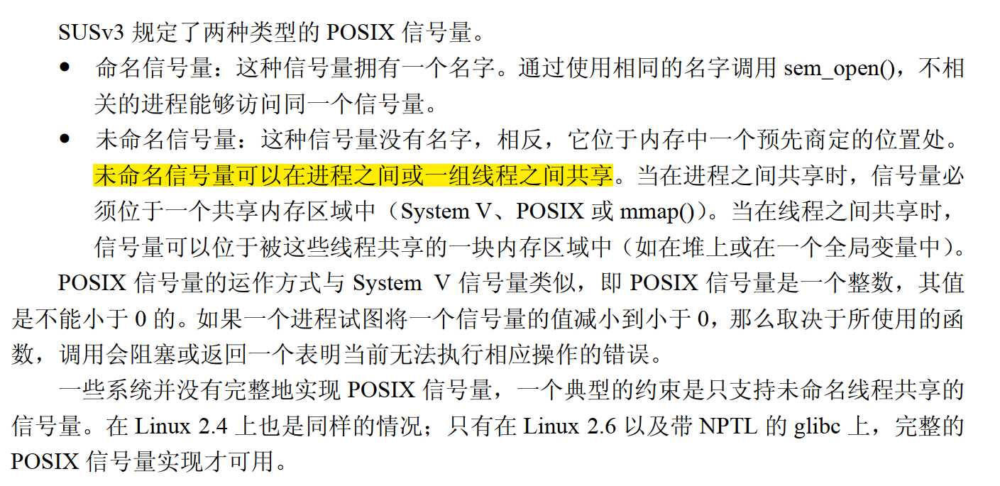

在 Linux 下，信号量是一种用于实现进程间同步和互斥的 System V IPC 机制。信号量的内部工作原理涉及内核中的数据结构和相关系统调用来实现对信号量的操作。

- **内部工作原理**
  
    - System V：
        1. **数据结构**：在 Linux 内核中，信号量的数据结构主要包括信号量集（Semaphore Set）、信号量（Semaphore）、信号量队列等。
        2. **初始化**：进程可以通过 `semget()` 系统调用创建一个信号量集，指定信号量的数量和权限等。每个信号量都有一个唯一的标识符。
        3. **操作**：进程可以使用 `semop()` 系统调用对信号量进行操作，包括增加、减少信号量的值，以及等待信号量达到某个特定值。
        4. **控制**：进程可以使用 `semctl()` 系统调用来控制信号量，比如获取信号量的值、设置信号量的值，以及删除信号量等操作。
    - POSIX：
        1. **数据结构**：在 POSIX 中，信号量的数据结构主要包括信号量（semaphore）以及与信号量相关的属性结构体（semun）。
        2. **初始化**：进程可以通过 `sem_init()` 函数初始化一个信号量，指定信号量的初始值和共享标志等。每个信号量都有一个唯一的标识符。
        3. **操作**：进程可以使用 `sem_wait()` 和 `sem_post()` 函数对信号量进行操作。
            1. `sem_wait()` 用于减少信号量的值，如果信号量的值为0，则会阻塞当前进程；
            2. `sem_post()` 用于增加信号量的值，唤醒可能在等待信号量的进程。
        4. **控制**：进程可以使用 `sem_getvalue()` 函数获取信号量的值，`sem_destroy()` 函数销毁信号量。
    
- **内部数据结构**

    在 Linux 内核中，信号量的内部数据结构包括以下几个部分：

    - **信号量集描述符（Semaphore Set Descriptor）**：每个信号量集都有一个描述符，用于标识该信号量集。
    - **信号量数据结构**：内核中维护一个数据结构来存储每个信号量的信息，包括当前值、等待队列等。
    - **信号量队列**：用于存储等待信号量的进程或线程，当信号量的值无法满足操作时，进程会被放入等待队列中。
    - **信号量控制块（Semaphore Control Block）**：用于管理信号量的数据结构，包括指向信号量集的指针、信号量的状态等信息。

- **实现方式**

    在 Linux 内核中，信号量是通过 System V IPC 机制实现的，相关的系统调用包括 `semget()`、`semop()`、`semctl()` 等。这些系统调用通过操作内核中的数据结构来实现信号量的创建、操作和控制。

    总的来说，信号量是一种重要的进程间同步和互斥机制，通过内核维护的数据结构和相关系统调用来实现对信号量的操作。通过适当的使用信号量，可以确保**进程之间的协作和资源的安全共享。**


- **命名信号量**

    ```C
    #include <stdio.h>
    #include <semaphore.h>
    #include <sys/types.h>
    #include <unistd.h>
    #include <stdlib.h>
    #include <sys/mman.h>
    
    // 写完这个，可以总结一下开发linux系统编程的常见流程方法
    // 比如说是开发的API接口，用哪些参数...  ---> man man
    
    int main(void)
    {
    //    sem_t sem_id; //第一次使用的
        pid_t pid;
        sem_t *sem_id = NULL; // 第一次segementianl fault --> 改用mmap(). 需要使用共享内存
    
    
        sem_id = mmap(NULL, sizeof(sem_t), PROT_READ | PROT_WRITE, 
                      MAP_SHARED | MAP_ANONYMOUS, -1, 0);
        if(sem_id == MAP_FAILED)
        {
            exit(EXIT_FAILURE);
        }
    
        sem_init(sem_id, 1, 0); 
    
        pid = fork();
        if(pid > 0)
        {
            while(1)
            {
                // 父子进程所使用的sem_id 不是同一个. 每一个进程有自己的空间
                // so, must use the shared memory --> mmap() or shmget()  
                sem_wait(sem_id); 
                printf("This is parent process.\n");
                sleep(1);
            }
        }else if(pid == 0)
        {
            while(1)
            {
                printf("This is child process.\n");
                sleep(5);
                sem_post(sem_id);
            }
        }
    
    ```


- 命名信号量

    ```C
    // 获取信号量的
    #include <stdio.h>
    #include <semaphore.h>
    #include <sys/stat.h>
    #include <fcntl.h>
    #include <sys/types.h>
    #include <unistd.h>
    #include <stdlib.h>
    #include <sys/mman.h>
    
    
    int main(void)
    {
        sem_t *sem_fd;
        int i = 0;
    
        sem_fd = sem_open("NAMED_SEM", O_CREAT, 666, 0);
        if(sem_fd == SEM_FAILED)
        {
            exit(EXIT_FAILURE);
        }
    
        while(1) 
        {
            sem_wait(sem_fd);
            sleep(1);
            printf("Process 1 i = %d\n", i++);
        }
    
        sem_close(sem_fd);
        // sem_unlink(sem_fd);
    
        return 0;
    }
    
    ```

    ```C
    // 增加信号量
    #include <stdio.h>
    #include <semaphore.h>
    #include <sys/stat.h>
    #include <fcntl.h>
    #include <sys/types.h>
    #include <unistd.h>
    #include <stdlib.h>
    #include <sys/mman.h>
    
    
    int main(void)
    {
        sem_t *sem_fd;
        int i = 0;
    
        sem_fd = sem_open("NAMED_SEM", O_CREAT, 666, 0);
        if(sem_fd == SEM_FAILED)
        {
            exit(EXIT_FAILURE);
        }
    
        while(1)
        {
            printf("Process2 i = %d\n", i++);
            sleep(1);
            sem_post(sem_fd);
        }
        sem_close(sem_fd);
    
        return 0;
    
    }
    
    ```

    


#### 手册

  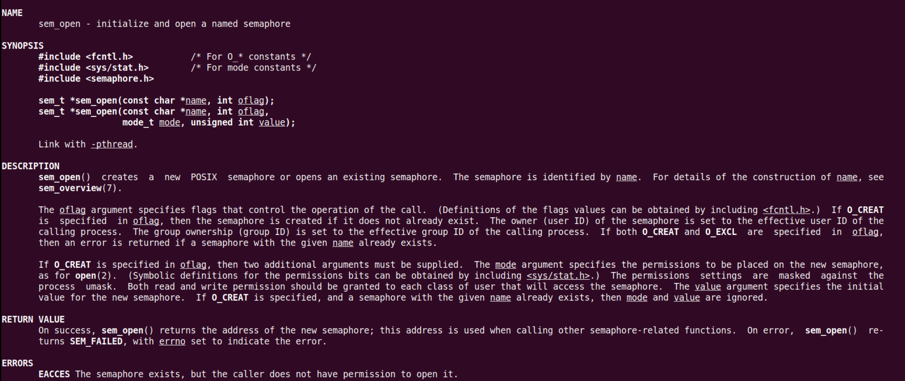


#### 简单使用


## 线程同步


## 信号处理


## 多进程/多线程编程模型


