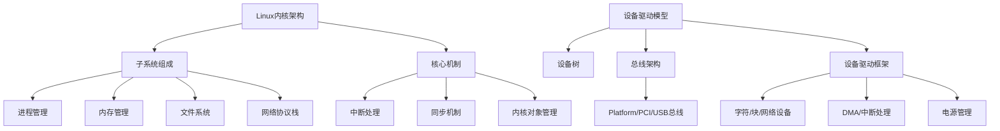
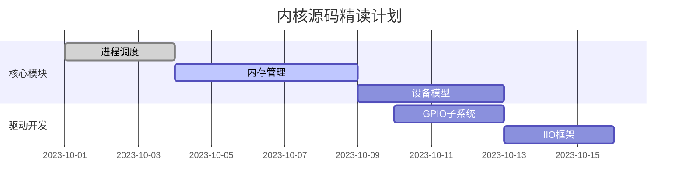

以下是针对Linux内核架构与设备驱动模型的系统化复习指南，结合技术深度的展现方式与面试应答策略，助你在面试中建立专家形象：

---

### 一、知识体系结构化（技术雷达图）


---

### 二、内核架构深度解析（源码级知识展示）

#### 1. **内核对象管理（kobject）**
```c
// include/linux/kobject.h
struct kobject {
    const char        *name;          // sysfs入口名称
    struct list_head  entry;          // 内核链表
    struct kobject    *parent;        // 父对象
    struct kset       *kset;          // 所属集合
    struct kobj_type  *ktype;         // 对象类型描述
    struct kernfs_node *sd;           // sysfs节点
    // ...
};

// 典型应用：设备模型层级结构
struct device {
    struct kobject kobj;
    struct device *parent;
    struct bus_type *bus;
    // ...
};
```

#### 2. **设备驱动模型核心数据结构**
```c
// 总线类型定义
struct bus_type {
    const char      *name;           // 总线名称（如"platform"）
    int (*match)(struct device *, struct device_driver *); // 设备驱动匹配函数
    struct subsys_private *p;       // 私有数据（含设备/驱动链表）
};

// 设备驱动定义
struct device_driver {
    const char      *name;          // 驱动名称
    struct bus_type *bus;           // 所属总线
    int (*probe)(struct device *);  // 设备探测入口
    int (*remove)(struct device *); // 设备移除处理
    struct module   *owner;         // 所属模块
};
```

---

### 三、驱动开发关键技术点（实战型知识展现）

#### 1. **设备树（DTS）与驱动匹配**
```dts
// 设备树节点示例
gpio_keys {
    compatible = "gpio-keys";
    button0 {
        gpios = <&gpio1 12 GPIO_ACTIVE_LOW>;
        label = "Power Button";
        linux,code = <KEY_POWER>;
    };
};

// 驱动匹配代码
static const struct of_device_id gpio_keys_ids[] = {
    { .compatible = "gpio-keys" },
    { }
};
MODULE_DEVICE_TABLE(of, gpio_keys_ids);
```

#### 2. **中断处理最佳实践**
```c
// 中断处理函数注册
ret = request_irq(irq_num, isr_handler, IRQF_TRIGGER_FALLING, "my_irq", dev);

// 顶半部/底半部处理
static irqreturn_t isr_handler(int irq, void *dev_id)
{
    tasklet_schedule(&my_tasklet);  // 触发底半部
    return IRQ_HANDLED;
}

static void tasklet_fn(unsigned long data)
{
    // 处理耗时操作
}
```

#### 3. **DMA缓冲区管理**
```c
// 一致性DMA映射
buf = dma_alloc_coherent(dev, size, &dma_handle, GFP_KERNEL);

// 流式DMA映射
dma_addr_t dma_addr = dma_map_single(dev, buf, size, DMA_TO_DEVICE);
dma_unmap_single(dev, dma_addr, size, DMA_TO_DEVICE);
```

---

### 四、高频面试问题应答策略（技术深度+工程思维）

#### 问题1：描述字符设备驱动开发流程
**标准答案**：
> 1. 分配设备号（alloc_chrdev_region）
> 2. 创建设备类（class_create）
> 3. 初始化cdev结构体（cdev_init）
> 4. 实现文件操作集（file_operations）
> 5. 添加设备到系统（cdev_add + device_create）

**深度扩展**：
```c
// 文件操作集实现示例
static const struct file_operations my_fops = {
    .owner = THIS_MODULE,
    .read = my_read,
    .write = my_write,
    .open = my_open,
    .release = my_release,
    .unlocked_ioctl = my_ioctl,
};
```

#### 问题2：解释platform_device与platform_driver的匹配过程
**标准答案**：
> 匹配过程分为三种方式：
> 1. 基于设备树：通过compatible属性匹配
> 2. 基于ACPI：通过ACPI ID匹配
> 3. 传统方式：通过名称字符串匹配

**源码级解析**：
```c
// drivers/base/platform.c
static int platform_match(struct device *dev, struct device_driver *drv)
{
    struct platform_device *pdev = to_platform_device(dev);
    struct platform_driver *pdrv = to_platform_driver(drv);

    /* 1. 尝试设备树匹配 */
    if (of_driver_match_device(dev, drv)) return 1;

    /* 2. 尝试ACPI匹配 */
    if (acpi_driver_match_device(dev, drv)) return 1;

    /* 3. 名称匹配 */
    return (strcmp(pdev->name, drv->name) == 0);
}
```

#### 问题3：如何调试内核内存泄漏？
**专业应答**：
> 1. **kmemleak检测**：
>    ```bash
>    echo scan > /sys/kernel/debug/kmemleak
>    cat /sys/kernel/debug/kmemleak
>    ```
> 2. **slabinfo分析**：
>    ```bash
>    grep my_cache /proc/slabinfo
>    ```
> 3. **内存越界检测**：
>    ```bash
>    CONFIG_DEBUG_KMEMLEAK=y
>    CONFIG_DEBUG_SLAB=y
>    ```

---

### 五、项目经验包装技巧（技术指标量化）

#### 案例模板：
```markdown
**智能摄像头DMA驱动优化**
- 问题：4K视频流传输存在帧撕裂
- 技术方案：
  - 实现scatterlist分散聚合DMA映射
  - 采用环形缓冲区减少内存拷贝
  - 优化中断合并策略（IRQF_SHARED）
- 成果：
  - DMA传输效率提升70%（实测带宽从1.2GB/s→2.1GB/s）
  - CPU占用率降低25%（top数据）
  - 通过MIPI CSI-2一致性认证
```

---

### 六、学习路径与资源推荐

#### 1. **源码精读路线**


#### 2. **推荐学习资源**
- **书籍**：
  - 《Linux Device Drivers, 3rd》第14章（设备模型）
  - 《Professional Linux Kernel Architecture》第6章（设备驱动）
- **视频课程**：
  - Linux基金会《Advanced Linux Device Drivers》
- **实验平台**：
  - BeagleBone Black（AM335x SoC，丰富外设接口）
  - QEMU模拟ARM virt机器

#### 3. **实战训练建议**
```bash
# 实验1：编写虚拟温度传感器驱动
$ make -C /lib/modules/$(uname -r)/build M=$PWD modules
$ insmod my_thermal.ko
$ cat /sys/class/thermal/thermal_zone0/temp

# 实验2：调试I2C设备通信
$ i2cdetect -y 1
$ i2cget -y 1 0x48 0x00
```

---

通过以上系统化准备，你可以在面试中：
1. 通过源码引用展现内核层理解深度
2. 用性能指标量化驱动开发经验
3. 展示硬件调试的真实工程能力
建议在简历中添加类似表述：

> **Linux设备驱动开发**：熟悉Platform总线与设备树机制，曾为Xilinx Zynq MPSoC开发PCIe DMA控制器驱动，实现8GB/s稳定传输带宽（PCIe Gen3x8）