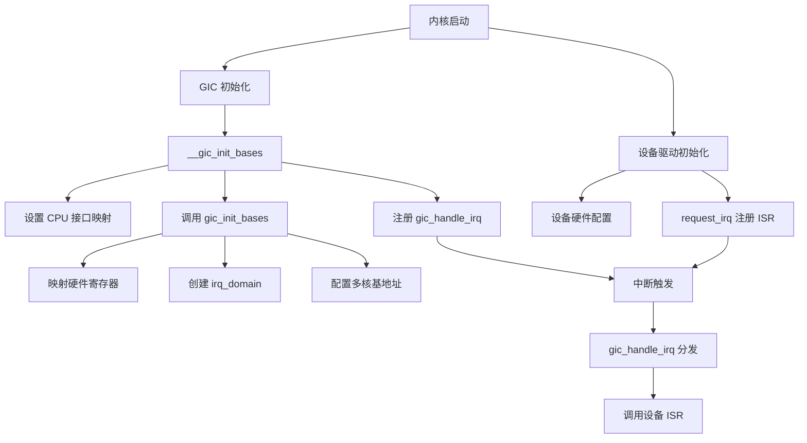
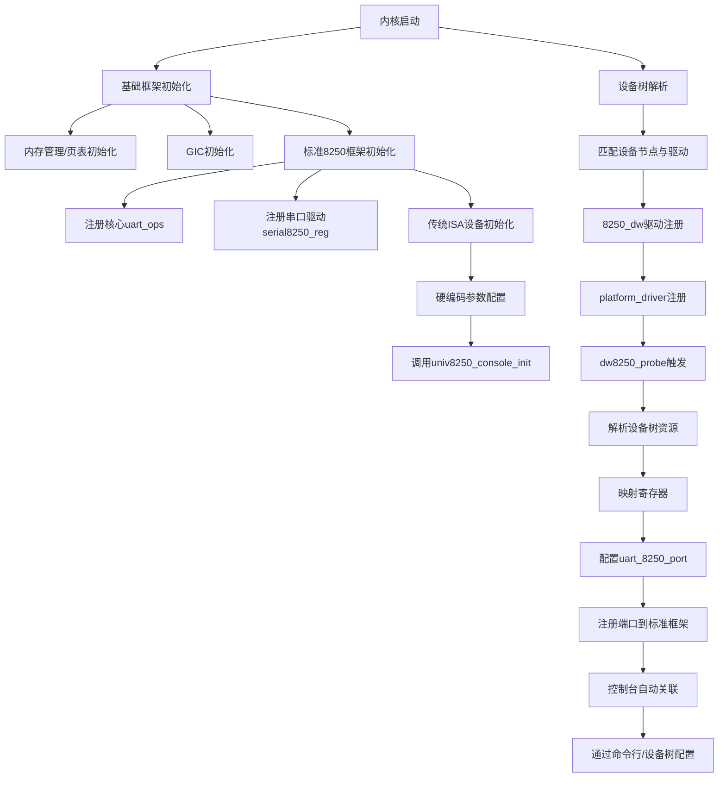
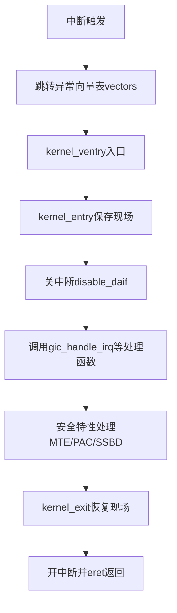
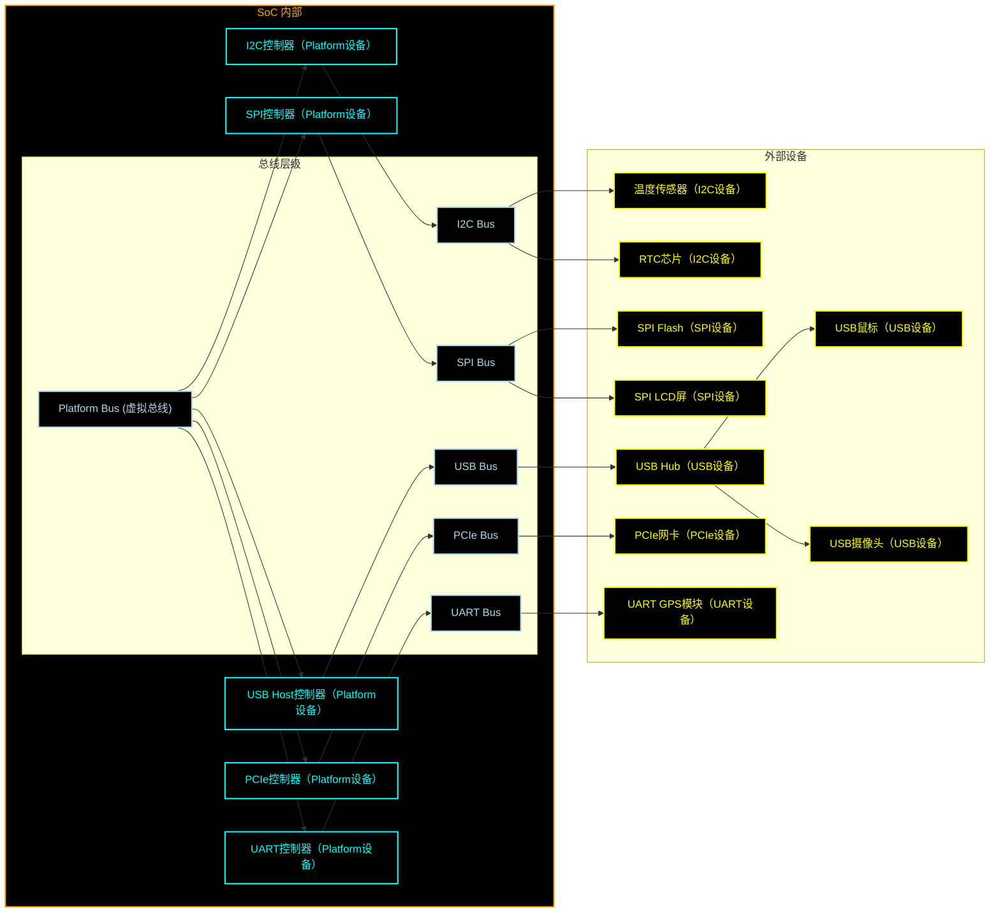
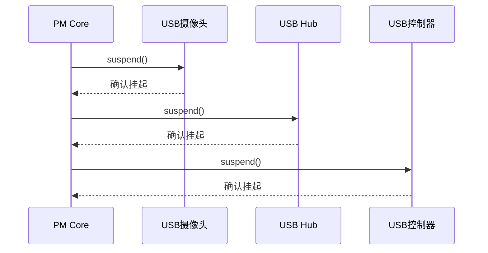

## 第一课

### 学习方法

设计、API、实践


`gpio` --> 内存 --> 网络


### (重)开发环境

#### 获取代码1

现成组件、还是自己开发组件。如果用现成组件，用哪个版本？


- 正式发布的软件包

    - 优势
        - 已经处理了部分或全部依赖关系，使用方便
        - 编译流程已经实际验证郭，不需要手工微调
    - 劣势：
        - 没有版本管理，开发不便

    

- SCM 仓库

    - 优势
        - 完整的版本历史，便于定位和分析工具
        - 便于同时维护多个分支工具
    - 劣势
        - 需要单独处理依赖关系

比如提前预研的例子、具体例子。


#### 获取代码2

因为 git 是分布式的管理的，一个比较常用的就是多个 remote！回想自己 做 ysyx 的内容。


- 怎么样算学习到位？

    对官方文档是否清晰熟悉，能否通过搜索找到自己想要的内容。


#### 文档

- 官方文档

    先看看原理清不清楚，再去看文档。

    

- **搜索**

    上位词与下位词

    同义词和近义词

    比如说拿到一块 Soc：H616（是 Cortex-A53的），ARMv8 就是其上位词。

    搜 A53的cache，可能过于广泛，那就直接搜 ARMv8 的 cache

    再有个例子（用近义词）：

    

    

    按照不同的分类来搜索试试。

    

    用一个详细例子：H616 DMA 怎么分连续的 2MiB 内存？

    那就去看 armv8/ARM64怎么做。

    

    但是还是不够，需要去看看 Linux kernel 是怎么做的。（arm64 和 kernel 平级词，分开搜看看，当然现在有 AI，怎么找）

    比如 各种分区、具体怎么分配，DMA有哪几类，各种


### 裸机如何访问 GPIO：阅读硬件文档

> fH616 手册

#### 阅读文档 / 硬件原理


I2C 的上拉和下拉，需要能够做什么？

驱动能力是否足够，从低电平到高电平的反转时间，上升沿的测？

是否需要中断：节省？中断硬连线的，有些 GPIO 不支持中断、唤醒的。


PH5、PH6


看手册，知道这个地址是某一个GPIO的外设寄存器映射。


知道即可。不要过于陷入细节。


还有一个例子，关于供电：


每一个GPIO的供电是不一样的，对应到硬件设计不同（LDO、DCDC：带负载能力和电流大小）

比如那个 PG口，选的是 `bldo1`，对应到设备树是 1.8 V

对应代码：`~/linux-6.8.1/arch/arm64/boot/dts/allwinner/sun50i-h616-orangepi-zero2.dts`，不同版本 kernel 可能不同。


###  Linux 访问 GPIO

`devmem` 控制寄存器，一般在产品中是不开启的。

实际用的是 VFIO、UIO

相当于之前在单片机，直接用库写寄存器。

比如我要直接调一个二进制的release 包，用 `ltrace/strace` 看看。

> 实际上这都是 OS 课上非常常用的工具！


比如现场挂了，只能 open 一次，直接 `strace` 看看哪里有问题。


充分利用文档


无聊就看看，学原理：比如 `driver-api/driver.rst` 。多看内核文档！


核心：关键是理解 Linux 如何管理硬件。


上面这些才是真正关键的，写代码甚至排在了后面。

> 具体例子：
>
> 多个运算核，访问内存呢能力是不一样的，要说清这个资源？
>
> 理论上硬件差别和实际不一样？（有些内存，两个口接，不一样？给谁分配都一样？leader的工作，学学）
>
> 再比如各个模块的交互：gpio 模拟 i2c，怎么控制 i2c 的设备
>
> 关键在于 你怎么理清楚各个模块的流程。
>
> 搞清这个，再开始编码。


但是，这距离硬件还有一定距离，对我们来说，一定要了解硬件架构是怎么样的，关键在于总线。

**==核心==**：脑子里要有这个图，再去看各种手册。


> ARM/RISC-V 内部基本就是这个图了。别的架构另说。


脑子里有了框图之后，我们就是要回答一个问题；OS 怎么抽象 DMA 和 寄存器？这两个内容与 arch 没关系的，都是核心的。


> 大量寄存器也可以用 DMA 访问？USB、PCIe等模块也常用
>
> 关于模块的配置，可以用寄存器来访问，但这又有用问题：深度有限，没法放很多个，这对于软件来说不好？
>
> 一种方式就是通过 DMA，批量的寄存器访问放到内存里？
>
> 所以 PCIe、USB等硬件模块里也有一个 DMA，负责把内存区域里的内容读取回来？具体要深入学学看看。


#### 驱动接口 以及 字符设备驱动

- 驱动接口的目的：

    - 满足硬件需要

    - 符合 Linux 系统设计思想

- 写 `file_operation`：

    `open`、`read`、`write`、`ioctl`、`mmap`


> 一个简单的字符设备驱动。jyy老师的例子。
>
> 关于字符设备，实际上比较少的，只有没法被归类的，比较老的才回到 字符设备（现在都是在 `misc` 类的）。


#### 内核模块的编译和加载过程：`gpio-mockup`


Linux 如何实现同一份代码可以编译进内核也可以编译为模块？


解析 module ：和 elf 文件类似 `kernel/module/main.c`

解析完成之后，找到 elf 里的指针，这个指针实际做 `module_init`

可以看看文档：`kernel/Documentation/admin-guide/gpio/gpio-mockup.rst`


具体例子：8个 `gpio` 的，16个 `gpio` 的

`modprobe gpio-mockup gpio_mockup_ranges=-1,8,-1,16`

怎么找到这模块？根据 `uname -a` 名字。还有一些 `module` 依赖


更多例子：e1000网卡驱动


> 当然这是自己电脑的。

假如说我遇到了全志网卡的一个问题，不知道怎么做，一方面网上能直接查找到资料是最好的，如果不行，那就看看别的厂商是怎么做得：高通、龙芯的，去看看别的手册是怎么样的。


具体 `gpio` 模块怎么做？一些工具：`gpio-event-mon -n gpiochip2 -o 0`


#### 实践：使用寄存器访问 GPIO


### 键盘输入时发生了什么

多级理解：

- 硬件到用户空间

    就是一个终端发送一个1或者0到数据寄存器那里，用相关工具就能感知到，这很好理解，在做 PA 的时候实际就弄过这方面的内容。

- 现代的呢？具体业务的呢？

    我想知道键盘输入时，我的Ubuntu系统发生了什么？搜索、AI。

    搜到了：X server、Wayland。。。

    怎么和键盘连上了？

    还是用工具 `strace`、`ltrace`

    `xinput` 通过一个socket 连。（能搜到，AI能回答）

    那 x server 怎么和硬件沟通的？搜

    

    > strace支持用pid看进程的系统系统调用的。

    


### 从广度了解 Linux 驱动

和 `GPIO` 类似的驱动：`UART`、`I2C`、`SPI`

同样类似的，学习看文档：

`find Documentation/ -name "*serial*" | grep -v device | vim -`

`find Documentation/ -name "*i2c*" | grep -v device | vim -`


#### 如何画架构图

`/Documentation/i2c/summary.rst`

```
-------------
| 	API		|
-------------
	 |
-------------
| algorithm |
-------------
	 |
-------------
| 	master	|
-------------
	 |----------------|  --------------....
-------------    -------------
| 	slave	|	 |   slave	 |
-------------    -------------
```


框架框架迁移到 stm32 。


#### 基于 GPIO 的 驱动 bitbang

软件模拟I2C

- `Documentation/driver-api/gpio/drivers-on-gpio-rst`
- I2C 驱动（`gpio bitbang`）


### 深度扩展

#### 深入流程：Linux 下访问 GPIO 访问实际做了什么？

`gpio-mockup` 里面使用了 irq sim，实际的 ARM Soc 普遍用 GIC，例如 GICv3的irq domain是树状借口的。

由于只用模拟这个中断，又不用真正触发这个中断


irq sim 模拟irq domain，触发中断，还是进到了中断处理函数，但不会真触发一个硬件中断。

irq domain 为什么有，这个有和谁相关


#### 抽象能力：device tree 和 ACPI 


## 第二课：驱动程序的寄存器访问和内存分配：DMA

### 寄存器和内存访问的基础

还是从 上节课那个重要的图开始，CPU  <---> 总线 <--> 硬件模块（dma、pcie...）

有了这个图后，再去了解 xilinx 的 cache coherence 的文档

[Zynq UltraScale+ MPSoC Cache Coherency - Xilinx Wiki - Confluence](https://xilinx-wiki.atlassian.net/wiki/spaces/A/pages/18842098/Zynq+UltraScale+MPSoC+Cache+Coherency)

> 一些英语：
>
> PS：逻辑固定的芯片被部分、PL：可编程的芯片部分（FPGA）
>
> - `baremetal`：
>
>     裸机：一般用在芯片验证或 OS 底层移植的上下文
>
>     裸金属：指不通过虚拟化管理组件（hypervisor）的虚拟化方式
>
> - 总线：`bus`、`fabric`、`interconect`
>
>     `bus` 是总称；`fabric` 一般用于说具体的实现；`interconect` 一般翻译为互联，往往和同步、一致性可扩展性有关。
>
> - `snoop`
>
> - `shareability`
>
>     ARMv7a开始引入。ARMv8a里，所有 CPU 都在同一个 inner shareability 

> 能够主动发起访问、发起控制，能够当 master；只能被动接受的，当 slave。
>
> 注意，比如 DMA 既能当 master，又能当 slave。
>
> 比如，CPU 配置 DMA的时候，DMA这时候就当 slave了。

> `DeepSeek` 总结

知道 cache coherence 是怎么走的。


### 裸机和 Linux 的寄存器访问

#### 寄存器访问的特点

- 重复可能有副作用
- 可能不支持多次读写。例如读清
- 配置有顺序要求
- device memory
    - gether
    - reorder
    - early acknowledge


#### 裸机寄存器访问 和 Linux 寄存器访问

三个大区别：

- 是否开启 MMU 

    - 裸机：没开MMU，`va=pa` （当然裸机也有开的，这里不考虑）
    - OS：开启 MMU 

- 使用 `volatile` 避免CPU从寄存器获取数据，确保CPU把数据写到地址而不仅仅写寄存器

    比如要配某个 `gpio` 模块，通过 `mmio`，如果没有这个 `volatile`，可能导致配的数据还在CPU内部的寄存器，而没有真正写到 `gpio` 映射到内存中的地址

    > 具体例子

- `data cache`，memory map （`mmio`）的寄存器需要建立映射吗

    - 裸机

        没开数据cache，不需要为 `mmio` 的寄存器建立特别的映射

    - OS

        有MMU后，来一个 data cache，需要为 `mmio` 的寄存器建立专门映射

        > 所以也就有了kernel中看到的 device memory 和 normal memory？

        > `ioremap_xxx,memory type:device memory `


#### 内部原理：ARM架构：memory type：`device memory`

当然，上面的内容是在 **内核空间** 下讨论的，那对于用户空间呢？

逻辑上也是要用 `ioremap`，但用户不能直接访问物理地址，所以用 API ！

> 具体例子：
>
> `devmem` 用的就是 `mmap` ： 
>
> `open` 的时候用的是 `O_SYNC`，而 `O_SYNC` 影响 `mmap` 的行为，所以，对于这部分 `mmio` 的寄存器，（因为是驱动的嘛，）OS 就让这个不会进 cache。 
>
> 如果不加 `O_SYNC` ，硬件现象是不一样的，有时能立刻反应，有时又不会；再接着，如果配了多个硬件寄存器，有时候工作有时不工作。
>
> 所以脑子要知道 cache coherence这个东西，配置要在具体预期之内，知道其行为。

相关映射 API：`ioremap_xxx,memory type:device memory `


#### 疑惑1：MMU 和 `dcache` 为什么会联系起来？

**核心：MMU与DCache协同工作机制及MMIO与内存地址空间区分**

- **一、MMU与DCache绑定的核心原因**

    ##### **1. 缓存策略的动态管理**

    - **功能协同**：
        MMU负责虚拟地址到物理地址的转换，并在转换过程中通过页表项（Page Table Entry, PTE）指定内存区域的**缓存属性**（如是否可缓存、写回策略）。
        DCache则根据这些属性决定是否缓存该区域的数据。  
    - **外设寄存器（MMIO）的特殊性**：
        MMIO区域的值由硬件外设动态更新，若被缓存，可能导致CPU读取过时数据（缓存与硬件状态不一致）。
        **解决方案**： 
        通过MMU页表项将MMIO区域标记为**Non-cacheable**，绕过DCache，确保每次访问直接读写硬件寄存器。

    ##### **2. 访问速度差异的优化**

    - **普通内存**：
        启用缓存（Cacheable）后，DCache可大幅提升访问速度（纳秒级延迟）。  
    - **MMIO区域**：
        直接访问外设寄存器，通常无缓存（Non-cacheable），访问速度较慢（微秒级），但确保实时性与数据一致性。


- **二、地址空间划分与页表项配置**

    ##### **1. MMIO与普通内存的地址空间隔离**

    - **物理地址布局**：  
        - **普通内存区域**：通常位于低地址段（如0x00000000~0x3FFFFFFF）。  
        - **MMIO区域**：位于高地址段（如0x40000000~0xFFFFFFFF），由SoC厂商预定义。  
    - **虚拟地址映射**：  
        MMU通过页表将虚拟地址映射到不同的物理区域，并根据属性位区分访问策略。

    ##### **2. 页表项属性位详解**

    在ARM架构中，页表项包含以下关键属性位：  

    | **属性位**             | **功能**                                                     |
    | ---------------------- | ------------------------------------------------------------ |
    | **C (Cacheable)**      | 1=允许缓存，0=禁止缓存（用于MMIO）                           |
    | **B (Bufferable)**     | 1=允许写缓冲，0=禁止写缓冲（MMIO通常设为0，确保写操作直达硬件） |
    | **TEX[2:0]**           | 内存类型扩展（如Normal Memory、Device Memory）               |
    | **XN (Execute Never)** | 1=禁止执行指令（MMIO区域通常设为1）                          |

    - **MMIO页表示例**：  

        ```c
        // ARMv8页表项设置（Device-nGnRnE内存类型）
        pte |= (0x0 << 53) | (0x0 << 54);  // TEX=0, C=0, B=0
        pte |= (0x1 << 53);                 // 内存类型：Device-nGnRnE（严格顺序，无缓存）
        ```

    ##### **3. 操作系统中的实现**

    以Linux内核为例，MMIO区域通过`ioremap`函数映射为非缓存：  

    ```c
    void __iomem *regs = ioremap(MMIO_PHYS_ADDR, SIZE);
    // 对应的页表项自动标记为Non-cacheable
    ```


- **三、不同架构的缓存与MMIO管理**

    ##### **1. ARM架构**

    - **内存类型与属性**：  

        - **Normal Memory**：可缓存，支持乱序访问（如普通DRAM）。  
        - **Device Memory**：不可缓存，访问顺序严格（如MMIO）。  
            - `Device-nGnRnE`：最强限制（无重排序，无合并，无写缓冲）。  
            - `Device-nGnRE`：允许写缓冲。  

    - **配置示例**：  

        ```c
        // 设置MMIO区域为Device-nGnRnE
        set_memory_attributes(addr, size, MT_DEVICE_nGnRnE);
        ```

    ##### **2. x86架构**

    - **MTRR（Memory Type Range Registers）**：
        定义物理地址范围的内存类型（如UC（Uncacheable）、WC（Write-Combining））。
    - **PAT（Page Attribute Table）**：
        通过页表项扩展内存类型（如`PAT=1`时，页表项低3位定义缓存策略）。  


- **四、性能优化与问题规避**

    ##### **1. 缓存一致性问题**

    - **场景**： 
        DMA控制器直接写入物理内存，若该区域被CPU缓存，可能导致缓存数据与内存不一致。  
    - **解决方案**：  
        - **软件维护**：在DMA传输前后调用`dma_sync_single_for_device/cpu()`同步缓存。  
        - **硬件支持**：启用硬件一致性（如ARM的CCI-400），自动维护缓存与内存一致性。

    ##### **2. MMIO访问优化**

    - **Write-Combining（WC）**：  
        将多个MMIO写操作合并为一次总线传输，提升吞吐量（如x86的`MOVNTI`指令）。  

    - **示例**：  

        ```c
        // x86中设置MMIO区域为Write-Combining
        mtrr_add(MMIO_PHYS_ADDR, SIZE, MTRR_TYPE_WRCOMB, 0);
        ```


- **五、实战示例：ARMv8页表配置**

    ##### **1. 配置MMIO为非缓存**

    ```c
    // 定义页表项属性
    #define MT_DEVICE_nGnRnE 0x0   // Device-nGnRnE类型
    #define MT_NORMAL         0x4   // Normal Memory类型
    
    // 设置页表项
    void set_pte_attrs(uint64_t *pte, uint64_t pa, uint64_t attrs) {
        *pte = (pa & PAGE_MASK) | (attrs << 2) | PTE_VALID;
    }
    
    // 映射MMIO区域（Non-cacheable）
    set_pte_attrs(pte, MMIO_PHYS_ADDR, MT_DEVICE_nGnRnE);
    ```

    ##### **2. 验证缓存策略**

    - **读取页表项**：
        通过调试器（如JTAG）检查页表项的`C/B/TEX`位是否符合预期。  
    - **性能测试**：
        对比启用/禁用缓存时的访问延迟（如使用`rdtsc`指令测量时间戳）。


- **六、总结与最佳实践**
    1. **严格区分内存类型**：
        - 普通内存标记为`Cacheable`，外设寄存器标记为`Non-cacheable`。  
    2. **利用硬件特性**：
        - 使用CCI-400或类似互连维护多主设备一致性。  
    3. **遵循架构规范**：
        - ARM的Device Memory类型、x86的MTRR/PAT配置需严格匹配硬件需求。  
    4. **调试与验证**：
        - 通过性能分析工具（如`perf`）和硬件调试接口确保配置正确性。  


#### 疑惑2：为什么 OS porting 要考虑 cache 一致性

比如说 一些实际的ARM9 到 cortex-A9，一个带 cache，一个不带。

从上面的学习，知道的一个重点就是 memory 的类别：device memory、normal memory。所以，在移植的时候，需要详细考虑 cache 对 MMU 的影响（原因前面）：

- **页表配置**：通过MMU将外设地址空间（MMIO）标记为 Device Memory（不可缓存），避免因缓存导致读写错误。

- **内存类型设置**：在页表项（PTE）中明确区分普通内存（Cacheable）与外设区域（Non-cacheable）。

但还有什么？为什么结合到 cache？这里再借 `DeepSeek` 总结


### 大量数据访问

#### DMA 入门

**1. DMA是什么？**
DMA（Direct Memory Access）是一种硬件模块，允许外设（如UART、SPI、网卡等）**直接与内存交换数据**，无需CPU参与。其核心价值是**解放CPU资源**，减少中断开销，提升数据传输效率。


**理解 DMA 为一个只能执行 `memcpy`（给出address、buf、length等）的处理器！** 

**2. DMA的核心流程**

- **初始化**：配置DMA控制器，指定源地址（数据来源）、目标地址（数据去向）、传输方向（内存→外设或外设→内存）和数据长度。
- **触发传输**：外设或软件触发DMA请求，DMA控制器接管总线，按配置搬运数据。
- **传输完成**：DMA控制器通过中断通知CPU，释放总线控制权。

**3. DMA传输模式**

- **单次传输**：传输指定长度的数据后停止，需重新配置才能再次传输。
- **循环传输**：自动重复传输，适用于持续数据流（如音频播放）。

**4. 关键概念**

- **内存一致性**：DMA操作的内存需是物理连续的，可通过`dma_alloc_coherent()`分配。
- **中断协同**：DMA传输完成后触发中断，CPU需处理数据或启动下一轮传输。

快速入门：

```C
// 1. 定义DMA控制器和UART寄存器（简化版）
#define DMA_CHANNEL        0
#define UART_TX_REGISTER   0xFFFF0000  // UART发送寄存器地址
#define DATA_SIZE          128         // 传输数据长度

// 2. 分配DMA缓冲区（物理连续）
void *dma_buffer = dma_alloc_coherent(DATA_SIZE);

// 3. 填充待发送数据（例如字符串）
memcpy(dma_buffer, "Hello DMA!", 11);

// 4. 配置DMA控制器
void configure_dma() {
    set_dma_channel(DMA_CHANNEL);              // 选择DMA通道
    set_dma_source(dma_buffer);                // 源地址：内存缓冲区
    set_dma_destination(UART_TX_REGISTER);     // 目标地址：UART发送寄存器
    set_dma_direction(MEM_TO_DEV);             // 传输方向：内存→外设
    set_dma_length(DATA_SIZE);                 // 传输数据长度
    enable_dma_interrupt(DMA_CHANNEL);         // 使能传输完成中断
}

// 5. 启动DMA传输
void start_dma() {
    start_dma_transfer(DMA_CHANNEL);
}

// 6. DMA传输完成中断处理函数
void dma_complete_isr() {
    print("DMA传输完成！");
    dma_free_coherent(dma_buffer);            // 释放DMA缓冲区
}
```

1. **内存分配**：使用 `dma_alloc_coherent()` 确保缓冲区物理连续，DMA可直接访问。
2. **配置DMA**：明确数据来源、去向、方向和长度，绑定到指定通道。
3. **启动传输**：DMA控制器接管总线，自动搬运数据到UART。
4. **中断处理**：传输完成后释放资源，或启动下一轮传输。

> - **DMA的本质**：通过硬件加速数据传输，减少CPU负载。
> - **核心步骤**：分配内存 → 配置DMA → 启动传输 → 处理中断。
> - **适用场景**：高频、大数据量传输（如UART连续通信、图形渲染）


#### cache 一致性--> 不同的API 选择


具体例子？

所以说 cache 对软件是透明的？说一致性，在设计上的保证？迷迷糊糊。

比如 CPU 和视频编解码模块，有一部分数据还在 CPU 内部的 cache，而这个编解码模块又没有能力去查询 CPU cache里的话，当从给定地址去读取数据的话，只能走 DDR 那条路，还记得 总线、CPU、DDR、master 那个图吗？

只能从视频编解码模块的 master 到 AHB 的 master，再走到 AXI，再走到 DDRC，再走到 memory，最后读取数据，这个时候，就会存在 cache 一致性的问题。（当然如果这个模块有能力查询  CPU cache，另说）这是就会影响后续 DMA API 的选择！！！所以再回到上面那个图的最下面，如何保证一致性，都是根据之前硬件模块的设计的。（哦！这个时候就能解释为什么有些地方会莫名其妙加一些 cache maintenance 指令（ARM、RISCV的）来维护一致性）

（再看如果是有系统总线来维护一致性的话，CPU 直接给地址即可！！！）

> 前面的，寄存器为什么要分用户态和内核态访问，这也是类似的？还是上面的视频编解码的例子，怎么尽可能地方便将视频生成的数据给用户？

这里再通过 AI 总结一些例子，就能比较好地理解。

> ---
>
> ### **缓存一致性与硬件/软件协作机制**
>
> #### **1. 缓存一致性的核心问题**
>
> - **硬件自动维护**：在**一致性总线架构**（如带Snooping的Cache Coherent Interconnect, CCI）中，CPU与外设（如GPU、DMA控制器）共享缓存一致性协议（如MESI）。  
>     - **示例**：CPU和GPU均能通过总线监听（Snoop）彼此的缓存，确保数据一致性。此时，外设可直接访问CPU缓存，无需软件干预。  
>     - **典型场景**：SoC内集成的高性能计算单元（如NPU）与CPU协作时，硬件自动维护一致性。
>
> - **软件手动维护**：若外设**不支持缓存一致性协议**（如某些传统DMA控制器），则需软件通过**缓存维护指令**（如ARM的`DMB`/`DSB`、RISC-V的`FENCE`）或**内存屏障**显式刷新缓存。  
>     - **示例**：视频编解码模块直接访问DDR时，若CPU缓存中存在未写回的数据，外设读取的将是旧数据，需驱动在DMA传输前调用`dma_sync_single_for_device()`刷新缓存。
>
> ---
>
> #### **2. DMA API的选择与缓存一致性**
>
> Linux内核提供两类DMA API，其选择取决于硬件是否支持一致性：  
>
> 1. **一致性DMA（Coherent DMA）**  
>     - 硬件支持缓存一致性（如带SMMU/IOMMU的DMA控制器），通过共享页表映射**一致性内存区域**。  
>     - **API**：`dma_alloc_coherent()`、`dma_free_coherent()`
>     - **企业案例**：  
>         - 某智能摄像头项目中，视频编码器与CPU共享一致性内存，驱动使用`dma_alloc_coherent()`分配内存，硬件自动维护一致性，无需手动刷新。
> 2. **流式DMA（Streaming DMA）**  
>     - 硬件不支持缓存一致性，需驱动在传输前后显式同步缓存。  
>     - **API**：`dma_map_single()`/`dma_unmap_single()`  
>     - **企业案例**：  
>         - 某工业控制系统中，旧版DMA控制器无法感知CPU缓存，驱动在数据传输前调用`dma_sync_single_for_cpu()`确保数据可见性。
>
> ---
>
> #### **3. 实际项目中的缓存维护操作**
>
> 以**视频编解码模块**为例，若其DMA控制器无法查询CPU缓存：  
>
> 1. **驱动实现步骤**：  
>
>     - 分配内存：使用`kzalloc()`或`vmalloc()`申请缓冲区。  
>     - 映射DMA地址：调用`dma_map_single()`将虚拟地址映射为物理地址供外设使用。  
>     - 启动传输前：调用`dma_sync_single_for_device()`，内部执行`__clean_dcache_area_poc()`（ARM）刷新CPU缓存到DDR。  
>     - 传输完成后：调用`dma_sync_single_for_cpu()`，使CPU缓存失效并从DDR重新加载数据。  
>
> 2. **代码片段**：  
>
>     ```c
>     // 分配缓冲区
>     void *buf = kmalloc(BUF_SIZE, GFP_KERNEL);
>     // 映射DMA地址
>     dma_addr_t dma_handle = dma_map_single(dev, buf, BUF_SIZE, DMA_TO_DEVICE);
>     // 启动DMA传输前刷新缓存
>     dma_sync_single_for_device(dev, dma_handle, BUF_SIZE, DMA_TO_DEVICE);
>     // 传输完成后使CPU缓存失效
>     dma_sync_single_for_cpu(dev, dma_handle, BUF_SIZE, DMA_FROM_DEVICE);
>     ```
>
> ---
>
> #### **4. 用户态与内核态访问寄存器的区别**
>
> - **权限隔离**：内核态可直接访问物理寄存器和内存映射寄存器（如MMIO），而用户态需通过`mmap()`或系统调用（如`ioctl()`）间接操作，目的是**防止用户程序破坏硬件状态**。  
> - **与缓存一致性无关**：寄存器访问的权限分离是安全设计，而缓存一致性是硬件/软件对内存数据的同步机制，二者属于不同维度的问题。
>
> ---
>
> ### **总结与建议**
>
> 1. **硬件设计决定软件策略**：  
>     - 若外设支持一致性总线（如SMMU），优先使用`dma_alloc_coherent()`，减少软件开销。  
>     - 若外设无一致性支持，需严格遵循DMA API的缓存同步流程。
>
> 2. **企业级最佳实践**：  
>     - **案例1**：某自动驾驶视觉处理模块中，使用带SMMU的DMA控制器，驱动通过一致性API实现CPU与FPGA的高效数据交换。  
>     - **案例2**：某5G基站基带处理中，旧版DMA控制器需驱动手动调用`cache flush`，结合`dma_map_single()`确保数据正确性。
>
> 3. **调试技巧**：  
>     - 通过`ftrace`监控DMA缓存同步函数的调用频率，优化性能瓶颈。  
>     - 使用`CONFIG_DMA_API_DEBUG`跟踪DMA内存泄漏问题。

再有文章：[聊聊Linux的DMA机制 - 知乎](https://zhuanlan.zhihu.com/p/7943091314)


#### CPU 访问内存

- **内核内存访问：有权限，有多少你用多少**

    > 三个关键
    >
    > - 当驱动需要分配内存
    > - 内核内存分配 API
    > - `dev_xxx` 接口的意义

    具体例子：

    - **内存分配场景**：
        当驱动需要分配内存时（如为设备缓冲区申请空间），内核提供以下核心API：
        - **`kmalloc`**：分配**物理连续**的内存块，适用于DMA或硬件寄存器访问。
        - **`vmalloc`**：分配**虚拟连续但物理可能不连续**的内存，适用于大块内存（如驱动程序日志缓冲区）。
        - **`devm_kzalloc`**：设备资源管理接口，自动释放内存，防止内存泄漏（例如：`devm_kzalloc(&pdev->dev, size, GFP_KERNEL)`）。
    - **`dev_xxx`接口的意义**：
        - **资源生命周期管理**：`devm_*`系列函数（如`devm_kzalloc`、`devm_ioremap`）与设备绑定，设备卸载时自动释放资源，简化驱动代码。
        - **示例**：在摄像头驱动中，使用`devm_kzalloc`为图像缓冲区分配内存，无需手动在 `probe` 和 `remove` 函数中处理释放逻辑。


- **用户空间访问：权限受限，可以申请，但能否实际分配内存实际由内核决定**

    > 三个关键：
    >
    > - 用户空间内存 API
    > - 用户空间内存分配和系统调用的关系
    > - 用户空间内存能不能直接给硬件用？

    - **用户空间内存分配机制**：
        - **`malloc`/`free`**：通过 `brk` 或 `mmap` 系统调用向内核申请虚拟内存，但实际物理内存分配是**按需延迟**的（Page Fault触发）。
        - **`mmap`**：直接将用户空间缓冲区映射到内核或硬件设备（如DMA），需结合`O_SYNC` 或 `O_DIRECT` 标志绕过页缓存。
    - **用户空间内存能否直接给硬件使用？**
        - **直接使用限制**：用户空间内存的物理地址是动态分配的，且可能被换出，硬件（如DMA控制器）通常需要**固定物理地址**。
        - **解决方案**：
            1. **内核中转**：用户程序通过`ioctl`将数据传递给内核，由内核调用`dma_map_single`映射到设备。
            2. **`mmap`到设备**：通过`remap_pfn_range`将设备内存映射到用户空间（需硬件支持，如显卡显存）。
    - **视频编解码模块的实践**：
        - 若模块支持一致性（如带SMMU）：用户空间缓冲区可通过`dma_buf`框架导出为DMA内存，直接供硬件使用。
        - 若不支持一致性：需内核驱动调用`get_user_pages`锁定用户内存页，再通过`dma_map_page`映射到设备。


#### 使用 DMA 搬移数据

- **一种 memory 批量访问方法**

- **DMA 快还是 CPU 快？**

    一般来说，数据量小的时候：寄存器快，反之。

    具体界限：几百K、及K，那 寄存器快；几 M 往上，DMA快。但具体还要看硬件模块的设计如何。

    所以，不能简单地认为DMA就是搬移快，DMA主要优势是搬移量大，对大数据比较好。

    主要关注几 K 到几百 K 的数据。

    > 具体做业务的时候，使用的这款芯片的 DMA 在空载/满载的时候，搬运速度是多快，具体到数量级。
    >
    > 如果有 200K 的数据，如果用 寄存器的话会占用 CPU 时间。
    >
    > 再看 DMA 能不能优化，如果单次搬移不能的话，再看看多笔能不能优化，比如一次给 4 个 200 K 的数据。
    >
    > 增加 DMA 通道的数据就能做好？


- **CPU 和 DMA 访问的利弊**

    带宽（bandwidth）

    时延（latency）

    CPU 占用情况


- **Linux DMA 的两种类型**

    - **一致性DMA（Coherent DMA）**

        - **特点**：内存区域在**生命周期内保持缓存一致性**，硬件与CPU共享缓存协议（如SMMU/IOMMU）。

        - **API**：`dma_alloc_coherent()`

        - **适用场景**：频繁小数据交换（如网络控制器收发描述符环）。

        - **代码示例**：

            ```c
            dma_addr_t dma_handle;  
            void *cpu_addr = dma_alloc_coherent(dev, size, &dma_handle, GFP_KERNEL);  
            ```

    - **流式DMA（Streaming DMA）**

        - **特点**：需显式调用`dma_sync_*`维护缓存一致性，适用于单次大数据传输（如视频帧传输）。

        - **API**：`dma_map_single()`/`dma_unmap_single()`

        - **适用场景**：外设不支持缓存一致性（如传统DMA控制器）。

        - **代码示例**：

            ```c
            dma_addr_t dma_handle = dma_map_single(dev, buf, size, direction);  
            // 启动DMA传输  
            dma_unmap_single(dev, dma_handle, size, direction);  
            ```


- **DMA 子系统**
    - **抽象硬件差异**：通过统一API（如`dmaengine`）屏蔽不同DMA控制器的底层细节。
    - **内存与设备映射**：管理物理地址与设备地址的转换（尤其在IOMMU存在时）。
    - **企业级案例**：
        - **案例1：视频直播设备**：
            - 使用流式DMA传输视频帧，驱动在每帧传输前后调用`dma_sync_single_for_device`和`dma_sync_single_for_cpu`，确保编解码器读取最新数据。
        - **案例2：高速数据采集卡**：
            - 采用一致性DMA，通过`dma_alloc_coherent`分配内存，硬件自动维护缓存一致性，减少CPU干预。


- **最佳实践**
    1. **内核与用户空间协作**：
        - 用户空间数据若需硬件访问，优先通过`mmap`或`dma_buf`共享内存，而非直接传递指针。
        - 驱动中始终使用`devm_*`接口管理资源，避免内存泄漏。
    2. **DMA API选择原则**：
        - 硬件支持一致性 → 一致性DMA（高效，低延迟）。
        - 硬件不支持 → 流式DMA + 显式缓存维护（兼容性强）。
    3. **调试与优化**：
        - 通过`dma-debug`工具监控DMA映射错误。
        - 使用`perf`分析DMA传输延迟，优化缓存刷新频率。

- **项目示例**
    - **智能网卡驱动优化**：某云计算厂商在DPDK中采用一致性DMA，通过`dma_alloc_coherent`分配报文缓冲区，减少缓存同步开销，提升网络吞吐量20%。
    - **工业相机驱动**：在无IOMMU的ARM平台上，使用`dma_map_single`映射用户空间内存，结合`get_user_pages`锁定物理页，确保实时图像传输零拷贝。


- **DMA访问的 四个方向**


设备那边会有一个 FIFO？

设备到设备：pipeline？


- **DMA 地址组织形式1：链表**


DMA 链表起始 key 放在寄存器访问。

为什么要这么设计？具体场景


- **DMA 地址组织形式2：IOMMU**


- **DMA  API：**


- `dma_alloc_coherent`

- `dma_pool_xxx`

    上面两个是一类。比如摄像头这么用？

- `dma_map_single`

    网络，发出去就用一次？

都是用在什么情况下的？


#### 内存分配

`man top`


用户态内存分配就上面四种情况：

匿名的、非匿名的：是否和具体文件关联。具体例子？

private/ shared：数据修改完之后，将来是否会同步到文件里（比如3象限里的，该数据是该进程私有的，将来是不打算同步回去的）

> 所有能看内存的工具，只需要区分四种情况的哪一种，实际要搜的就是这四种。

**小内存：`brk`；大内存：直接通过 `mmap` 申请大内存？具体的细节。**

这部分直接重新去看 jyy 老师那部分的课。


测试工具 `memtester `

又听到了这个问题：`pagefault`、申请和分配两个概念。

- **Page Fault 的触发机制**
    1. **硬件触发** 
        Page Fault **由硬件直接触发**，具体由 CPU 的内存管理单元（MMU）负责。当进程访问一个虚拟内存地址时，MMU 会检查页表：
        - 若目标页表项（PTE）标记为无效（如物理页未分配、权限不足等），MMU 会生成一个 **Page Fault 异常**，通知 CPU。
        - CPU 随后通过中断机制将控制权交给操作系统的 Page Fault 处理程序。
    2. **操作系统处理** 
        操作系统通过 Page Fault 处理程序完成后续工作：
        - 检查访问是否合法（如地址是否在进程的虚拟地址空间内、权限是否匹配）。
        - 若合法，分配物理页并更新页表；若非法，终止进程。


- **内存申请与分配的区别**

    1. **申请（Reservation）**  
        - 进程通过系统调用（如 `malloc`、`mmap`）申请内存时，操作系统仅修改进程的 **虚拟地址空间**，标记一段虚拟内存区域为“可访问”。
        - 此时并未分配物理内存，仅建立虚拟地址到物理地址的映射框架（如 VMA 结构）。
    2. **分配（Allocation）**  
        - 物理内存的分配是 **按需延迟** 的。当进程首次访问已申请但未映射的虚拟地址时，触发 Page Fault。
        - 操作系统在 Page Fault 处理中分配物理页，并更新页表完成映射。

    **申请 vs 分配**：申请是虚拟地址空间的预留，分配是物理内存的按需映射。


- **案例解析：申请 1GB 内存，实际使用 512MiB**
    1. **初始状态**  
        - 进程申请 1GB 虚拟内存（如 `malloc(1GB)`），操作系统在进程的虚拟地址空间中预留 1GB 的虚拟区域，但 **不分配物理内存**。
    2. **首次访问 512MiB**  
        - 进程首次读写前 512MiB 时，MMU 发现对应页表项无效，触发 Page Fault。
        - 操作系统分配物理页，建立虚拟地址到物理页的映射，进程正常使用。
    3. **剩余 512MiB 的处理**  
        - 剩余的 512MiB 虚拟内存未被访问时，操作系统不会为其分配物理页。
        - 当进程访问剩余地址时，再次触发 Page Fault，操作系统动态分配物理页。


> - **内存利用率**：避免提前分配未使用的物理内存，减少资源浪费。
> - **灵活性**：支持稀疏内存访问（如稀疏数组、动态数据结构）。
> - **透明性**：进程无需感知物理内存分配细节，由操作系统自动管理。


再用 `perf` 工具

`sudo perf record -e syscalls:sys_enter_mmap -e syscalls:sys_enter_brk -ag memtester 1M 1`

`sudo perf report`、`sudo perf script`


能够直接看出这个`memtester` 的 `mmap` 系统调用用了 70us？？这么nb


### 竞争和同步

- 原子操作
- 自旋锁
- 非中断上下文的同步：`mutex`、`rw_semephore`


### 工作方法


## 第三课：中断和电源管理

引导问题：为什么系统休眠后不能唤醒？

为什么屏幕关了，就能省电？

比如手机熄屏，听音乐带着耳机，拔掉耳机后，手机是一个什么状态。


### 中断

> interrupt
>
> exception
>
> poll/polling：轮询、查询

#### 架构图

异步获得硬件的事件；

中断是否属于异常，因架构而异。ARM架构下中断是一种异常

[GIC Implementation and Architecture Specification - ArnoldLu - 博客园](https://www.cnblogs.com/arnoldlu/p/17381705.html)


通过上面这个图，能否对应到之前几节课画的那个总的架构图？那现在再**结合当前使用的芯片重新构建这个图**！比如是结合 H616的，它的中断管理借助于 GIC-400

> 实际上这个才是最重要的内容，有了对现代的 Soc 内部架构有了总体上的了解后，再结合具体 Soc 使用的模块，脑海中或者手动画出来这么一个架构图！


#### 设备树

```yaml
gic: interrupt-controller@3021000 {
    compatible = "arm,gic-400";
    reg = <0x03021000 0x1000>,
          <0x03022000 0x2000>,
          <0x03024000 0x2000>,
          <0x03026000 0x2000>;
    interrupts = <GIC_PPI 9 (GIC_CPU_MASK_SIMPLE(4) | IRQ_TYPE_LEVEL_HIGH)>;
    interrupt-controller;
    #interrupt-cells = <3>;                                                                                        
};
...
uart0: serial@5000000 {
    compatible = "snps,dw-apb-uart";
    reg = <0x05000000 0x400>;
    interrupts = <GIC_SPI 0 IRQ_TYPE_LEVEL_HIGH>;
    reg-shift = <2>;
    reg-io-width = <4>;
    clocks = <&ccu CLK_BUS_UART0>;
    resets = <&ccu RST_BUS_UART0>;
    status = "disabled";
};
arch/arm64/boot/dts/allwinner/sun50i-h616.dtsi
```

根据 H616 这款 Soc 写出其使用的 **中断控制器** 的配置，同时，这个配置就是上面那个图GIC-400的具体定义，传递给软件要使用的。

这个时候会有问题，为什么这款控制器配置要写这些内容？即这个中断控制器为什么要写这些配置项？换句话说，这个设备树的配置文件是怎么写出来的？

具体看 binding 手册：`Documentation/devicetree/bindings` 下的内容：


如果我们要写一个 `uart` 的设备树内容的话，那就直接去看 `serial` 目录下的内容，配合已经厂商自己设计时使用的uart硬件模块。


由此查看相关配置项：

```yaml
# SPDX-License-Identifier: GPL-2.0
%YAML 1.2
---
$id: http://devicetree.org/schemas/serial/snps-dw-apb-uart.yaml#
$schema: http://devicetree.org/meta-schemas/core.yaml#

title: Synopsys DesignWare ABP UART

maintainers:
  - Rob Herring <robh@kernel.org>

allOf:
  - $ref: serial.yaml#
  - $ref: rs485.yaml#

properties:
  compatible:
    oneOf:
      - items:
          - enum:
              - renesas,r9a06g032-uart
              - renesas,r9a06g033-uart
          - const: renesas,rzn1-uart
      - items:
          - enum:
              - rockchip,rv1126-uart
              ...
          - const: snps,dw-apb-uart
      - items:
          - enum:
              - brcm,bcm11351-dw-apb-uart
              - brcm,bcm21664-dw-apb-uart
          - const: snps,dw-apb-uart
      - items:
          - enum:
              - starfive,jh7100-hsuart
              - starfive,jh7100-uart
          - const: snps,dw-apb-uart
      - const: snps,dw-apb-uart

  reg:
    maxItems: 1

  interrupts:
    maxItems: 1

  clock-frequency: true

  clocks:
    minItems: 1
    maxItems: 2

  clock-names:
    items:
      - const: baudclk
      - const: apb_pclk

  dmas:
    maxItems: 2

  dma-names:
    items:
      - const: tx
      - const: rx

  snps,uart-16550-compatible:
    description: reflects the value of UART_16550_COMPATIBLE configuration
      parameter. Define this if your UART does not implement the busy functionality.
    type: boolean

  resets:
    maxItems: 1

  reg-shift: true

  reg-io-width: true

  dcd-override:
    description: Override the DCD modem status signal. This signal will
      always be reported as active instead of being obtained from the modem
      status register. Define this if your serial port does not use this
      pin.
    type: boolean

  dsr-override:
    description: Override the DTS modem status signal. This signal will
      always be reported as active instead of being obtained from the modem
      status register. Define this if your serial port does not use this
      pin.
    type: boolean

  cts-override:
    description: Override the CTS modem status signal. This signal will
      always be reported as active instead of being obtained from the modem
      status register. Define this if your serial port does not use this
      pin.
    type: boolean

  ri-override:
    description: Override the RI modem status signal. This signal will always
      be reported as inactive instead of being obtained from the modem status
      register. Define this if your serial port does not use this pin.
    type: boolean

required:
  - compatible
  - reg

unevaluatedProperties: false

examples:
  - |
    serial@80230000 {
      compatible = "snps,dw-apb-uart";
      reg = <0x80230000 0x100>;
      clock-frequency = <3686400>;
      interrupts = <10>;
      reg-shift = <2>;
      reg-io-width = <4>;
      dcd-override;
      dsr-override;
      cts-override;
      ri-override;
    };

  - |
    // Example with one clock:
    serial@80230000 {
      compatible = "snps,dw-apb-uart";
      reg = <0x80230000 0x100>;
      clocks = <&baudclk>;
      interrupts = <10>;
      reg-shift = <2>;
      reg-io-width = <4>;
    };

  - |
    // Example with two clocks:
    serial@80230000 {
      compatible = "snps,dw-apb-uart";
      reg = <0x80230000 0x100>;
      clocks = <&baudclk>, <&apb_pclk>;
      clock-names = "baudclk", "apb_pclk";
      interrupts = <10>;
      reg-shift = <2>;
      reg-io-width = <4>;
    };
...

```

由此可知，写设备树节点的时候，直接写 `properties` 各个子项就可以了，其中 `required` 属于必填选项，其他内容按需填写。不过注意，出了一些通用的设备树节点语法，各个硬件模块应该都会有相关独特的设备树节点语法，具体要查看相关硬件模块的 binding 文件，当然，直接有例子可以参考！

**==TODO==**：总结便携设备树（节点）的流程。


#### GIC-400 配置

回到中断相关设备树的配置：

```yaml
gic: interrupt-controller@3021000 {
    compatible = "arm,gic-400";
    reg = <0x03021000 0x1000>,
          <0x03022000 0x2000>,
          <0x03024000 0x2000>,
          <0x03026000 0x2000>;
    interrupts = <GIC_PPI 9 (GIC_CPU_MASK_SIMPLE(4) | IRQ_TYPE_LEVEL_HIGH)>;
    interrupt-controller;
    #interrupt-cells = <3>;                                                                                        
};
...
uart0: serial@5000000 {
    compatible = "snps,dw-apb-uart";
    reg = <0x05000000 0x400>;
    interrupts = <GIC_SPI 0 IRQ_TYPE_LEVEL_HIGH>;
    reg-shift = <2>;
    reg-io-width = <4>;
    clocks = <&ccu CLK_BUS_UART0>;
    resets = <&ccu RST_BUS_UART0>;
    status = "disabled";
};
arch/arm64/boot/dts/allwinner/sun50i-h616.dtsi
```

为什么 UART 中断这里配的是 `GIC_SPI 0 IRQ_TYPE_LEVEL_HIGH` 呢？看手册只知道中断号是32呀？为什么？


再想想，既然这个这是 H616 的中断控制器，通过学校课开的上位词/下位词/平级词来去想想，去找找资料，这个中断控制器是GIC-v2的，那不如看看 GIC-v2 的 spec？《ARM® Generic Interrupt Controller Architecture version 2.0 Architecture Specification》

还真找到了！


对于 GIC-v2 的中断分发是有特定编号的，所以32是 SPIs 的开始，那自然也就是 `GIC_SPI` 的 第 0 个中断了。

由此，设备树里获得了中断编号后，就能去内核里进行注册。


> **==补充知识==**
>
> GIC 划分的中断类型。


#### 中断全流程


这里只关注中断部分的内容，还是以 GIC-400 为例。硬件模块中断连线连到 GIC，GIC 乃至之后的内容怎么初始化？


这么一个总图。


#### 1. GIC-400 初始化

- **代码路径**：`drivers/irqchip/irq-gic.c`

- **函数调用链**：

    ```c
    start_kernel()  
      → init_IRQ()  
        → irqchip_init()  
          → of_irq_init()  // 解析设备树中的中断控制器节点
            → gic_of_init()  // 初始化GIC
    ```


**(1) `__gic_init_bases` 函数**

- **功能**：初始化 GIC 控制器的基础设施，包括 CPU 接口映射和全局中断处理函数注册。

- **代码逻辑**：

    ```c
    static int __init __gic_init_bases(struct gic_chip_data *gic, struct fwnode_handle *handle) {
        // 初始化 CPU 接口映射表，标记所有 CPU 接口为未初始化状态（0xff）
        for (i = 0; i < NR_GIC_CPU_IF; i++)
            gic_cpu_map[i] = 0xff;
        
        // 注册全局中断处理函数，所有中断最终由 gic_handle_irq 分发
        set_handle_irq(gic_handle_irq);
    
        // 调用底层初始化函数
        ret = gic_init_bases(gic, handle);
        
        // 多核相关初始化（如 IPI 中断配置）
        if (gic == &gic_data[0])
            gic_smp_init();
    }
    ```
    
- **关键操作**：

    - **CPU 接口映射**：初始化 CPU 核心与 GIC 接口的映射关系，后续由每个 CPU 核心探测其 ID。
    - **全局中断处理函数**：`gic_handle_irq` 是 GIC 的中断入口，负责读取中断号并调用设备注册的 ISR。

> 因为 GIC 也是一个设备啊，所以他也会有一般设备该有的东西呀，比如说 GIC 的中断！别搞混了！


**(2) `gic_init_bases` 函数**

- **功能**：配置 GIC 的 `Distributor` 和 `CPU Interface` 寄存器，初始化中断域（`irq_domain`）。

- **代码逻辑**

    ```C
    static int gic_init_bases(struct gic_chip_data *gic, struct fwnode_handle *handle) {
        // 映射 GIC Distributor 和 CPU Interface 的物理地址到虚拟地址
        gic->raw_dist_base = ioremap(res.start, resource_size(&res));
        gic->raw_cpu_base  = ioremap(res2.start, resource_size(&res2));
    
        // 为每个 CPU 核心设置独立的 Distributor 和 CPU 接口基地址（支持多核）
        for_each_possible_cpu(cpu) {
            u32 mpidr = cpu_logical_map(cpu);
            u32 core_id = MPIDR_AFFINITY_LEVEL(mpidr, 0);
            *per_cpu_ptr(gic->dist_base.percpu_base, cpu) = gic->raw_dist_base + offset;
            *per_cpu_ptr(gic->cpu_base.percpu_base, cpu)  = gic->raw_cpu_base + offset;
        }
    
        // 创建 irq_domain，管理物理中断号到 Linux IRQ 号的映射
        gic->domain = irq_domain_create_linear(handle, gic_irqs, &gic_irq_domain_ops, gic);
    }
    ```

- **关键操作**：

    - **地址映射**：将 GIC 的硬件寄存器映射到内核虚拟地址空间。
    - **多核支持**：为每个 CPU 核心分配独立的基地址，支持 SMP 系统中的并行中断处理。
    - **中断域（irq_domain）**：创建线性映射表，将硬件中断号（HW IRQ）转换为 Linux 逻辑中断号（Virq）。


**(3) `irq_domain` 的设计**

注册完 GIC 实际上还是不够的，因为 Soc 上的中断是很多的！**可能连续可能不连续？可能还有依赖树状关系！**

因此 Linux 内核为了抽象不同的中断组织形式（连续编号的、不连续的、还是一级/多级的中断控制器），内核增加了一个 `irq_domain` 的概念（还有一个 `irq_domain_latency` 不考虑）。`irq_domain` 是 Linux 内核为统一管理不同中断控制器拓扑结构引入的抽象层，具体两个场景：

| **场景**            | **解决方案**               | **适用控制器**                 |
| :------------------ | :------------------------- | :----------------------------- |
| **连续中断号**      | `irq_domain_create_linear` | GICv2（固定连续中断号）        |
| **稀疏/树状中断号** | `irq_domain_create_tree`   | GICv3/v4（支持多级中断控制器） |

- **核心功能**：
    - **映射管理**：维护硬件中断号（HW IRQ）到 Linux 逻辑中断号（Virq）的映射关系。
    - **中断控制器抽象**：支持不同中断控制器的拓扑结构（单级、多级、树形）。

> - **分层抽象**：
>     GIC 提供硬件中断管理基础设施，`irq_domain` 抽象中断号映射，设备驱动仅关注业务逻辑。
> - **性能优化**：
>     - **多核分离**：每个 CPU 核心独立的寄存器基地址，避免锁竞争。
>     - **快速路径**：`gic_handle_irq` 仅处理中断号转换，不涉及具体设备逻辑。
> - **扩展性**：
>     `irq_domain` 支持多种中断控制器拓扑，适应不同 SoC 设计（如级联 GIC 或树形结构）。


**不管是哪个 中断控制器，具体都要做的事情：1. 注册中断处理函数。2. 建立物理实际中断编号和内核中断编号的映射/基础设施。**

由此之后再做设备初始化。这里配一个图，下面再看设备初始化。




#### 2. 设备初始化：`univ8250_console_init`

这里还在学习 8250 和 dw8250 层次关系。先看一部分，有点问题。**==TODO==**




```C
static const struct of_device_id dw8250_of_match[] = {
    { .compatible = "snps,dw-apb-uart", .data = &dw8250_dw_apb },
    { .compatible = "cavium,octeon-3860-uart", .data = &dw8250_octeon_3860_data },
    { .compatible = "marvell,armada-38x-uart", .data = &dw8250_armada_38x_data },
    { .compatible = "renesas,rzn1-uart", .data = &dw8250_renesas_rzn1_data },
    { .compatible = "starfive,jh7100-uart", .data = &dw8250_starfive_jh7100_data },
    { /* Sentinel */ }
};

// drivers/tty/serial/8250/8250_dw.c
```


1. `univ8250_console_init`

    首先注册号这个设备的相关操作，发送数据、接收数据、各个状态：operations。

2. h616 串口 probe

    然后就可以注册我这个 Soc 上的串口了。probe再说。`requset_irq`

    具体从设备树中获得中断物理号，上面那个 `GIC_SPI 0`，结合这个 Soc 的物理中断号就是 32。

> 正常来说，如果不是 uart 的话，这里还会做一个事情，将物理中断号和逻辑中断号对应起来，然后用这个逻辑中断号去注册中断函数。
>
> 但由于串口比较特殊，因为串口的上一层是 `tty`，由于 `tty` 比较老，现在已经没有这种设备，**所以 `tty` 下的设备具体是能够按照 `tty` 的形式操作的设备，比如 `console`、`pts`。**
>
> 为了将 `tty` 和 串口 两个驱动区分开，在 串口初始化的时候，中断实际还没有注册的，真正 `tty` 要使用才注册。


注册信息


> 还有一个问题，那究竟什么时候注册中断呢？
>
> 在用户空间第一次打开这个 `tty` 设备，具体中断函数：`serial8250_interrupt` 


#### 3. 响应中断

接着，再看看内核什么时候该响应中断？即中断响应流程 `arch/arm64/kernel/entry.S` 。

实际上这部分内容还是比较重要的，比如几个例子

- 调中断时候，还不知道该中断是否正常工作，那就要知道这个中断是由谁触发的怎么处理，在调试时才知道要看哪些函数、寄存器。

- 在中断注册的时候，连枚举都没有获得设备树的编号，那肯定要看设备树的配置有没有问题。

- 如果设备树配置正确，但还是没有注册中断，那就去看 request_irq.

- 注册之后，中断还是没有相应，这个时候就需要知道内核什么时候会响应这个中断：是所有中断都没响应，还是只是这一中断没响应。

    不过所有中断都没有响应，这种情况应该比较少，应该会出现在小系统移植的时候，做Linux 的移植，这个时候内核刚启动完，没有timer也能启动内核，串口是第一个响应中断的用户，那这个时候去看中断有没有响应，去看在什么层次做调试。

    **无论到是哪一种 ISA，它关于异常/中断响应流程都是类似的（比如什么保存现场、返回内核空间还是用户空间）。**




这个查找：`:cs find g el0t_64_irq_handler` 是什么？

对应该串口的中断处理函数：`serial8250_interrupt`（`drivers/tty/serial/8250/8250_core.c`）

具体注册：`dw8250_handle_irq`（`drivers/tty/serial/8250/8250_dw.c`）、`serial8250_handle_irq`（`drivers/tty/serial/8250/8250_port.c`）具体涉及到 `uart` 更多细节，使用 DMA？

之后就是中断返回了，恢复现场等等。

中断之后上下文怎么恢复？`APCS`、`CPSR/PSTATE`（处理器的状态！有点像 NEMU 中的特权级切换，都是一样的）


**上面的内容除了让自己造轮子以外，更大的作用就是更好的调试。**


对于具体工作/真正做起来说，知道中断编号、设备树怎么写，再把 `request_irq` 捋一下，差不多就清楚。


#### 其他问题

- 中断和查询的性能对比

    - 什么情况中断(异常也是类似的，ARM/RISC-V下中断是异常的一种)
    - 什么情况查询

    还是那个问题，占用CPU、latency。所以要看 `latency of interrupt handling`。

    **参考值：5000 CPU cycle：e.g.CPU 1GHz → 5us。（具体可能是几千，不细说，但未来可以看看具体算出来的？）**

    具体来说，如果一秒钟中断的处理次数要远远大于 `1000 * 1000 / 5 = 200,000`，那使用中断应该是能节省 CPU 的占用时间，

    但如果小于呢？？我有点迷惑上面这个结论是否正确了？

    如果中断来得特别多的话，那就暂时用 `thread irq`线程的方式来处理中断。（在网卡里会这么用）这种情况适合中断比较少，但是中断来得比较快。处理完之后再转成默认的中断。


但实际上中断只占了异步通知的一小部分，内核社区在做的事情更多在于怎么更好更方便地去内核和用户空间做异步通知，有时候会叫成用户态中断。

- **用户态的异步通知**

    - 信号

    - `signalfd`

    - `userfaultfd`

        虚拟化做缺页处理的

    - `UIO` 的中断

    - `virtio` 的中断


- **定时器的使用和精度**
    - C++ 的timer
    - select 的精度


- **性能视角的总结**
    - `latency` vs `bandwidth`
    - 单次的 `latency` vs 批量的 `latency`


补充：`kernel command-line`

文档：`Documentation/admin-guide/kernel-parameters.*`

具体来说，对于 8250 这个设备，我是要去配一个参数的。


就像在 NEMU 上移植 `nommu-Linux` 的时候，在设备树里写的：

```yaml
chosen {
    bootargs = "earlycon=uart8250,mmio,0xa00003f8,1000000 console=ttyS0";
};
```

搞清楚自己要配什么？


### 设备模型

#### Linux 对设备抽象的演进

这个就是为了解决电源管理的问题。。。休眠唤醒。

- 总线驱动 + 设备驱动
- 虚拟设备驱动（platform bus）
- 面向对象：设备模型
- class 和 multi-function-device（mfd）
- 面向对象：资源和申请和回收
- 更好的抽象嵌入式 ARM 设备：device tree
- 服务器的设备抽象：ACPI


> 查 bug，通过知道 APCS，知道传递函数参数，是用 x0-x7的。
>
> 根据调用函数 xxx+0x30 这种，也能算出实际调用的问题在哪里。
>
> 对照 `objdump` 就能找到问题。


#### 为什么需要总线设备？

`DeepSeek`：

1. **统一电源管理**
    需要系统级休眠唤醒时，内核必须知道：

    - 所有设备的依赖关系（如USB设备依赖USB控制器）
    - 设备的电源状态切换顺序（先唤醒父设备再操作子设备）

2. **解决硬件拓扑描述**
    现代计算机有复杂的硬件层级：

    ```mermaid
    graph LR
        CPU--> PCIe_Root
        PCIe_Root --> PCI_Bridge
        PCI_Bridge --> USB_Controller
        USB_Controller --> USB_Mouse
    ```

    需要树形结构描述设备关系

3. **解耦驱动与设备**
    传统驱动代码中硬编码设备信息（如寄存器地址、中断号），设备模型通过抽象层实现驱动与硬件的解耦。


我觉得最重要的原因就是：**抽象不同总线**

- 不同的资源组织形势
- 不同的枚举方式
- 不同的总线专有特性
- 不同的拓扑关系了。例如 IOMMU 和 PCI 的关系。SMMU 和 platform device 的关系。


#### 设备模型核心概念

- **四大核心结构体（面向对象思想的体现）**

    | 结构体                 | 作用                                   | 类比面向对象 |
    | :--------------------- | :------------------------------------- | :----------- |
    | `struct bus_type`      | 总线类型（如PCI、USB、虚拟的platform） | 抽象基类     |
    | `struct device`        | 代表一个物理/逻辑设备                  | 对象实例     |
    | `struct device_driver` | 设备的驱动程序                         | 操作方法集合 |
    | `struct class`         | 设备分类（如input、block）             | 接口抽象     |

- **关键机制**

    - **sysfs 文件系统**：`/sys` 目录下展示设备树结构
    - **热插拔事件处理**：通过uevent机制通知用户空间（如udev）
    - **电源管理**：实现`->suspend()`和`->resume()`回调


#### platform bus

这里需要搞清晰 platform bus 和其他的总线的内容。看文档就讲得很好：`Documentation/driver-api/driver-model/platform.rst`


- **总线**

    这里简单回忆一些jyy上课讲过的内容：

    > 你总不想每个计算机系统只有固定的设备吧？我想接入更多 (甚至**未知**) 的 I/O 设备，要是有一天出了新型产品硬件，那只要有这个，就能极大地减少成本呀！复用率高！
    >
    > 所以，这么一个特殊的 I/O 设备：总线bus
    >
    > 每当有一个请求给总线，总线会根据这个请求（属于 DDR，属于键盘，属于别的设备），转发给别的设备！
    >
    > 但总线也有设备，CPU 通过和总线的寄存器交互，从而知道总线挂了哪些设备，设备中有几个寄存器，产商是谁......
    >
    > 
    >
    > 所有外部设备都直接或间接地连接到 PCIe 总线上，插上之后，总线给它分配地址。

    而 Linux 内核通过分层总线模型管理硬件设备，其核心设计目标是 **统一设备管理** 与 **硬件差异抽象**。我现在把总线架构可分为两类：

    | **总线类型**     | **物理总线**                       | **虚拟总线**                             |
    | :--------------- | :--------------------------------- | :--------------------------------------- |
    | **硬件特性**     | 真实电气连接（PCIe/USB/I2C/SPI）   | 软件抽象用于管理无总线机制（无物理信号） |
    | **设备发现方式** | 硬件自动枚举（Presence Detection） | 静态配置（设备树/ACPI）                  |
    | **地址分配**     | 动态分配（BAR空间/端点地址）       | 固定地址（芯片手册定义）                 |
    | **典型示例**     | PCIe网卡、USB摄像头                | SoC内部控制器（GPIO/UART）               |

    ```mermaid
    graph TD
        Root[系统总线] --> Physical[物理总线]
        Root --> Virtual[虚拟总线]
        Physical --> PCIe
        Physical --> USB
        Physical --> I2C
        Virtual --> Platform
    ```

这个其实光看其实没什么理解，还是需结合具体外设的例子：比如说 I2C、SPI、PCI 来学。

再补充一些概念：

- **`xxx controller` 和 `xxx device`**

    - **controller：**SoC 内部的 I2C 控制器 IP 核
    - **device：**外接的传感器、EEPROM 等

    [platform device/driver vs i2c device/driver - Stack Overflow](https://stackoverflow.com/questions/27743652/platform-device-driver-vs-i2c-device-driver)
    
    ```mermaid
    graph TD
        subgraph SoC["SoC 芯片"]
        	CPUcore["CPU core"]
        	BUS["bus"]
            GPIO["GPIO controller"]
            UART["UART controller"]
            I2C_Ctrl["I2C controller"]
            SPI_Ctrl["I2C controller"]
        end
    	I2C_Ctrl --> camera
    	I2C_Ctrl --> other_senor
    	SPI_Ctrl --> LCD
    ```

- **`Discoverable` 和 `not discoverable`**

    **Discoverable**：

    - **硬件级发现**：总线控制器能通过电气信号或协议自动检测设备存在（如 PCIe 的 Presence Detect 引脚、USB 的端口状态检测）
    - **动态枚举**：系统在运行时（无需预先配置）识别设备并分配资源（地址、中断等）

    **not discoverable**：

    - **本质**：总线连接的设备无法通过硬件机制自动检测
    - **根源**：设备物理位置和资源配置在硬件设计阶段已固定（如 SoC 内部外设）
    - **结果**：依赖软件静态描述（设备树/ACPI）或硬编码信息


这个时候再来看 `platform bus` 和 `platform device` 和 `platform driver` 的内容，就好理解了，直接看kernel 文档的定义：

> See <linux/platform_device.h> for the driver model interface to theplatform bus:  platform_device, and platform_driver.
>
> **This pseudo-bus is used to connect devices on busses with minimal infrastructure, like those used to integrate peripherals on many system-on-chip processors, or some "legacy" PC interconnects; as opposed to large formally specified ones like PCI or USB.** 
>
> Platform devices are devices that typically appear as autonomousentities in the system. This includes legacy port-based devices and host bridges to peripheral buses, and most controllers integrated into system-on-chip platforms.  What they usually have in common is direct addressing from a CPU bus.  Rarely, a platform_device will be connected through a segment of some other kind of bus; but its registers will still be directly addressable.

- `platform bus`：一款伪总线，用于连接基础设施最少的总线上的设备。

- `platform device`：**无法通过硬件机制自动发现** 的嵌入式设备，需通过静态配置描述其存在。

    **包括传统的基于端口的设备、连接外设总线的主桥，以及大多数集成在 SoC 平台中的控制器。它们的共同特点是能够通过 CPU 总线直接寻址。**

    典型特征：

    - **资源固定性**：寄存器地址、中断号等由 SoC 设计固化
    - **关键路径依赖**：多为系统启动早期必需的底层控制器
    - **非热插拔**：物理连接固定（焊接或 SoC 集成）

- `platform driver`：自然就是管理 Platform device 的程序。

    - **硬件初始化**：配置时钟、电源、寄存器等底层资源
    - **资源抽象**：向上层总线（如 I2C/SPI 核心）提供标准接口
    - **电源管理**：实现休眠/唤醒等低功耗状态切换

具体来看个图，再结合例子就能看懂。



还是以 I2C 子系统为例，这个时候再回去看具体例子和 API 解释：

> **Every SOC(Silicon on Chip) or microcontroller will have a I2C controller, which provides a way to connect and communicate to I2C devices like camera sensors, PMIC, temperature sensor etc. The driver used for configuring and using this I2C controller is called platform driver. This I2C controller is called platform device. Mostly platform devices will be part of the SOC. The registers of the I2C controller are programmed using platform driver. These registers are in say ARM memory mapped and will be available on TRM of the SOC.**
>
> **Now all the I2C devices that can be connected to the SOC or microcontroller via I2C controller like Camera sensors, PMIC, temperature sensor etc need a driver to control them. This driver is called device driver. The registers of these devices are not part of memory map of SOC. Need the datasheet of the I2C device like OV5640 Camera Sensor to program the registers. I2C data are sent out to program the registers and access data.**

已经总结得很好了，额外注意一个 MMIO 的例子，MMIO映射的是 controller 相关的寄存器！！以前的想法有点不准确！

> #### MMIO 映射的寄存器属于控制器而非外设设备
> MMIO（Memory-Mapped I/O）是 CPU 访问硬件设备寄存器的关键机制，它将设备的控制寄存器映射到内存地址空间。以下两类场景需要 MMIO：
>
> | **场景**       | **示例**             | **映射目标**              |
> | -------------- | -------------------- | ------------------------- |
> | **总线控制器** | I2C控制器、SPI控制器 | 控制器的寄存器            |
> | **独立外设**   | PCI设备、GPU显存     | 外设自身的寄存器/内存区域 |
>
> ---
>
> #### 二、I2C/SPI 总线架构的硬件层级
> ```mermaid
> graph TD
>     SOC["SoC"] --> I2C_CTRL["I2C控制器 (MMIO映射)"]
>     SOC --> SPI_CTRL["SPI控制器 (MMIO映射)"]
>     
>     I2C_CTRL --> I2C_DEV1["I2C温度传感器 (从机地址 0x48)"]
>     I2C_CTRL --> I2C_DEV2["I2C RTC芯片 (从机地址 0x68)"]
>     
>     SPI_CTRL --> SPI_DEV1["SPI Flash (片选 0)"]
>     SPI_CTRL --> SPI_DEV2["SPI LCD屏 (片选 1)"]
> ```
>
> ##### 1. **控制器寄存器（MMIO 映射）**
>    - **物理位置**：集成在 SoC 内部
>    - **访问方式**：CPU 直接读写内存地址（如 `0x10000000`）
>    - **操作内容**：
>      - 配置总线时钟频率
>      - 控制数据传输（启动/停止条件、DMA 配置）
>      - 状态寄存器查询（传输完成、错误标志）
>
> ##### 2. **外设寄存器（非 MMIO 映射）**
>    - **物理位置**：位于外部芯片（如传感器、Flash）
>    - **访问方式**：通过总线协议（I2C/SPI）间接访问
>    - **操作内容**：
>      - 发送读/写命令（如 `i2c_smbus_read_byte_data`）
>      - 传输数据缓冲区（如 `spi_write`）
>
> ---
>
> #### 三、代码示例对比
>
> ##### 1. **I2C 控制器驱动（MMIO 操作）**
> ```c
> // 设备树定义
> i2c0: i2c@10000000 {
>     compatible = "vendor,i2c-controller";
>     reg = <0x10000000 0x1000>; // MMIO 区域
>     interrupts = <0 32 IRQ_TYPE_LEVEL_HIGH>;
> };
> 
> // 驱动代码
> static int i2c_controller_probe(struct platform_device *pdev)
> {
>     struct resource *res = platform_get_resource(pdev, IORESOURCE_MEM, 0);
>     void __iomem *base = devm_ioremap_resource(&pdev->dev, res);
>     
>     // 配置控制器寄存器
>     writel(0x200, base + I2C_CLK_DIV); // 设置时钟分频
>     writel(0x1, base + I2C_CTRL);      // 使能控制器
>     return 0;
> }
> ```
>
> ##### 2. **I2C 外设驱动（总线协议访问）**
> ```c
> // 设备树定义
> temp_sensor: sensor@48 {
>     compatible = "ti,tmp75";
>     reg = <0x48>; // 从机地址，非MMIO地址！
> };
> 
> // 驱动代码
> static int tmp75_probe(struct i2c_client *client)
> {
>     // 通过I2C协议读取温度
>     u8 reg = 0x00; // 温度寄存器地址
>     int temp = i2c_smbus_read_byte_data(client, reg);
>     return 0;
> }
> ```
>
> ---
>
> #### 四、关键差异总结
>
> | **特性**           | 总线控制器 (MMIO)          | 外设设备 (非MMIO)                |
> | ------------------ | -------------------------- | -------------------------------- |
> | **寄存器物理位置** | SoC 内部                   | 外部芯片内部                     |
> | **CPU访问方式**    | 直接读写内存地址           | 通过总线协议（I2C/SPI）          |
> | **驱动代码操作**   | `ioremap` + `writel/readl` | `i2c_transfer`/`spi_sync`        |
> | **设备树属性**     | `reg` 表示物理地址范围     | `reg` 表示总线地址（如从机地址） |
> | **典型操作**       | 配置总线参数、DMA控制      | 发送数据包、读取传感器值         |
>
> ---
>
> **常见误解澄清**
>
> ##### 1. **为什么外设寄存器不直接 MMIO 映射？**
>    - **电气隔离**：I2C/SPI 外设与 SoC 之间通过总线连接，无法直接访问其内部寄存器
>    - **协议封装**：外设操作需遵循总线协议（如 I2C 的 START/STOP 条件）
>    - **地址冲突**：总线上的外设可能有相同物理地址（如多个 I2C 0x48 设备），需通过总线拓扑区分
>
> ##### 2. **例外情况：MMIO 外设**
>    某些复杂外设（如 PCIe 网卡、USB3 控制器）**自身拥有 MMIO 空间**，但这些场景中：
>    - 外设通过 PCIe/USB 总线连接到 SoC
>    - 其 MMIO 空间由总线控制器（如 PCIe Root Complex）动态分配
>    - 与 I2C/SPI 外设有本质区别
>
> ----
>
> **调试技巧**
>
> ##### 1. **查看 MMIO 映射**
> ```bash
> # 查看已注册的 I/O 内存区域
> cat /proc/iomem
> 
> # 输出示例
> 10000000-10000fff : i2c0  # I2C控制器的MMIO区域
> 20000000-20000fff : spi0  # SPI控制器的MMIO区域
> ```
>
> ##### 2. **跟踪总线操作**
> ```bash
> # 启用I2C调试
> echo 1 > /sys/module/i2c_core/parameters/debug
> 
> # 查看内核日志
> dmesg | grep "i2c i2c-0"  # 观察I2C总线传输过程
> ```
>
> ##### 3. **直接读写 MMIO（仅调试用！）**
> ```c
> // 内核模块中临时操作寄存器
> void __iomem *base = ioremap(0x10000000, 0x1000);
> u32 reg_val = readl(base + 0x04);
> writel(0x55aa, base + 0x08);
> iounmap(base);
> ```
>
> ----
>
> MMIO 映射的寄存器**属于总线控制器（I2C/SPI控制器）**，而非挂载在总线上的外设设备。理解这一区别是掌握以下内容的关键：
> 1. 如何编写总线控制器驱动（涉及 MMIO 操作）
> 2. 如何编写外设驱动（通过总线 API 通信）
> 3. 正确解析设备树中的 `reg` 属性含义


#### platform device 和 platform driver 和设备树

再深入一点，如果一个设备没有通过设备树来描述，那就需要在代码里面手动的创建 `platform device` 已经对应的 `platform driver`，如果设备树已经描述过，那 `platform device` 那就不用在这里创建了，内核自己有办法（什么办法？自动创建？），最终也是会自动调用 `platform driver` 的。借助 AI 总结。


- **步骤1：编写 Platform Driver**

    ```C
    // my_platform_driver.c
    #include <linux/module.h>
    #include <linux/platform_device.h>
    
    static int my_probe(struct platform_device *pdev)
    {
        pr_info("Platform Driver Probe: Device found!\n");
        return 0;
    }
    
    static int my_remove(struct platform_device *pdev)
    {
        pr_info("Platform Driver Remove: Device removed.\n");
        return 0;
    }
    
    static struct platform_driver my_driver = {
        .probe = my_probe,
        .remove = my_remove,
        .driver = {
            .name = "my_manual_device",
            .owner = THIS_MODULE,
        },
    };
    
    module_platform_driver(my_driver);
    
    MODULE_LICENSE("GPL");
    MODULE_AUTHOR("Your Name");
    MODULE_DESCRIPTION("Manual Platform Driver Example");
    ```

- **步骤2：手动注册 Platform Device**

    ```C
    // my_platform_device.c
    #include <linux/module.h>
    #include <linux/platform_device.h>
    
    static struct platform_device *my_device;
    
    static int __init my_device_init(void)
    {
        my_device = platform_device_alloc("my_manual_device", -1);
        if (!my_device) {
            pr_err("Failed to allocate platform device\n");
            return -ENOMEM;
        }
    
        int ret = platform_device_add(my_device);
        if (ret) {
            pr_err("Failed to add platform device\n");
            platform_device_put(my_device);
            return ret;
        }
    
        pr_info("Manual Platform Device registered\n");
        return 0;
    }
    
    static void __exit my_device_exit(void)
    {
        platform_device_unregister(my_device);
        pr_info("Manual Platform Device unregistered\n");
    }
    
    module_init(my_device_init);
    module_exit(my_device_exit);
    
    MODULE_LICENSE("GPL");
    MODULE_AUTHOR("Your Name");
    MODULE_DESCRIPTION("Manual Platform Device Example");
    ```

- **步骤3：编译并加载模块**

    1. **编译模块**：

        ```bash
        make -C /lib/modules/$(uname -r)/build M=$PWD modules
        ```

    2. **加载 Platform Device 模块**：

        ```bash
        sudo insmod my_platform_device.ko
        ```

    3. **加载 Platform Driver 模块**：

        ```bash
        sudo insmod my_platform_driver.ko
        ```

    4. **验证绑定**：

        ```bash
        dmesg | grep "Platform Driver"
        # 应输出 "Platform Driver Probe: Device found!"
        ```

    5. **卸载模块**：

        ```bash
        sudo rmmod my_platform_driver my_platform_device
        ```


- **设备树自动注册 Platform Device 的流程**

    - **步骤1：修改设备树**

        在设备树文件（如 `my_board.dts`）中添加节点：

        ```dts
        / {
            my_auto_device {
                compatible = "my_auto_device";
                status = "okay";
            };
        };
        ```

    - #### **步骤2：编写匹配设备树的 Platform Driver**

        ```C
        // my_dt_driver.c
        #include <linux/module.h>
        #include <linux/platform_device.h>
        #include <linux/of.h>
        
        static int dt_probe(struct platform_device *pdev)
        {
            pr_info("DT Driver Probe: Device found via Device Tree!\n");
            return 0;
        }
        
        static int dt_remove(struct platform_device *pdev)
        {
            pr_info("DT Driver Remove: Device removed.\n");
            return 0;
        }
        
        static const struct of_device_id dt_match[] = {
            { .compatible = "my_auto_device" },
            {}
        };
        MODULE_DEVICE_TABLE(of, dt_match);
        
        static struct platform_driver dt_driver = {
            .probe = dt_probe,
            .remove = dt_remove,
            .driver = {
                .name = "my_auto_device",
                .of_match_table = dt_match,
                .owner = THIS_MODULE,
            },
        };
        
        module_platform_driver(dt_driver);
        
        MODULE_LICENSE("GPL");
        MODULE_AUTHOR("Your Name");
        MODULE_DESCRIPTION("Device Tree Platform Driver Example");
        ```

    - **步骤3：更新设备树并加载驱动**

    1. **编译设备树**：

        ```bash
        dtc -I dts -O dtb -o my_board.dtb my_board.dts
        ```

    2. **加载新设备树**（通过Bootloader或动态加载）：

        ```bash
        sudo cp my_board.dtb /boot/
        # 重启系统
        ```

    3. **加载 Platform Driver 模块**：

        ```bash
        sudo insmod my_dt_driver.ko
        ```

    4. **验证自动绑定**：

        ```bash
        dmesg | grep "DT Driver"
        # 应输出 "DT Driver Probe: Device found via Device Tree!"
        ```

    5. **查看设备信息**：

        ```bash
        ls /sys/bus/platform/devices/my_auto_device
        ```


- **关键区别总结**

| **特性**         | **手动注册**                     | **设备树自动注册**                   |
| ---------------- | -------------------------------- | ------------------------------------ |
| **设备描述来源** | 硬编码在模块中                   | 设备树文件（动态配置）               |
| **灵活性**       | 低（需重新编译模块修改设备信息） | 高（修改设备树无需重新编译内核模块） |
| **资源管理**     | 需手动分配内存、中断等资源       | 通过设备树自动解析资源               |
| **适用场景**     | 临时测试、无设备树支持的旧硬件   | 现代嵌入式系统，支持设备树的平台     |
| **维护性**       | 设备信息分散在代码中，维护成本高 | 设备信息集中管理，易于维护           |

- **手动注册**适用于快速测试或旧系统，但缺乏灵活性。
- **设备树自动注册**是标准做法，通过解耦硬件描述和驱动代码，提升可维护性和可移植性。
- 内核通过解析设备树生成 `platform_device`，并自动匹配 `platform_driver` 的 `of_match_table` 完成绑定。


#### 设备访问全流程：I2C camera 为例

1. **硬件架构连接**

    ```mermaid
    graph LR
        SOC["ARM SoC"] --> I2C_Ctrl["I2C控制器（Platform设备）"]
        I2C_Ctrl -->|SCL/SDA| Camera["OV5640 Camera（I2C设备）"]
        I2C_Ctrl -->|MMIO| Registers["I2C控制器寄存器"]
        Camera -->|MIPI/Parallel| Image_Sensor["图像传感器"]
    ```

    **硬件特性**：

    - **I2C控制器**：SoC内部模块，地址`0x400A0000`（内存映射）
    - **OV5640 Camera**：从设备地址`0x3C`，通过I2C配置寄存器
    - **数据接口**：图像数据通过MIPI/Parallel接口传输（与I2C控制总线分离）

2. **设备树配置**

    ```yaml
    // SoC级定义：I2C控制器作为Platform设备
    i2c1: i2c@400a0000 {
        compatible = "vendor,soc-i2c";
        reg = <0x400a0000 0x1000>;    // MMIO地址范围
        interrupts = <0 32 IRQ_TYPE_LEVEL_HIGH>;
        clocks = <&i2c_clk>;
        #address-cells = <1>;
        #size-cells = <0>;
    
        // Camera设备节点
        ov5640: camera@3c {
            compatible = "ovti,ov5640";
            reg = <0x3c>;             // I2C从地址
            vdda-supply = <&vdd_cam>; // 电源管理
            clocks = <&cam_clk>;      // 输入时钟
            port {
                // MIPI CSI接口绑定
                ov5640_to_csi: endpoint {
                    remote-endpoint = <&csi_to_ov5640>;
                };
            };
        };
    };
    ```

    **关键点**：

    - I2C控制器通过`reg`属性声明MMIO地址
    - Camera设备通过`reg`指定I2C从地址
    - 电源/时钟资源通过 `vdda-supply `和 `clocks` 关联

    > 这里需要注意，由于 controller 的 not discoverabl，所以要使用设备树来传递配置。

3. **内核驱动流程（代码级实现）**

    - **I2C控制器驱动（Platform驱动）**

        ```C
        // 注册Platform驱动
        static struct platform_driver soc_i2c_driver = {
            .probe = soc_i2c_probe,
            .driver = {
                .name = "soc-i2c",
                .of_match_table = soc_i2c_of_match,
            },
        };
        module_platform_driver(soc_i2c_driver);
        
        // Probe函数初始化硬件
        static int soc_i2c_probe(struct platform_device *pdev) {
            // 解析设备树资源
            struct resource *res = platform_get_resource(pdev, IORESOURCE_MEM, 0);
            void __iomem *base = devm_ioremap_resource(&pdev->dev, res);
            
            writel(CTRL_ENABLE, base + CTRL_REG); // 使能控制器
            // 配置I2C时钟分频
           
            writel(CLK_DIV_400K, base + I2C_CLK_REG);
            
            // 注册I2C适配器
            struct i2c_adapter *adap = i2c_alloc_adapter();
            adap->algo = &soc_i2c_algo;  // 实现i2c_algorithm
            i2c_add_adapter(adap);       // 生成/sys/class/i2c-dev/i2c-1
        }
        ```

        

    - **Camera驱动（I2C设备驱动）**

        ```C
        // 定义I2C设备ID表
        static const struct i2c_device_id ov5640_id[] = {
            { "ov5640", 0 },
            {}
        };
        MODULE_DEVICE_TABLE(i2c, ov5640_id);
        
        // 定义设备树匹配表
        static const struct of_device_id ov5640_of_match[] = {
            { .compatible = "ovti,ov5640" },
            {}
        };
        
        // 注册I2C驱动
        static struct i2c_driver ov5640_i2c_driver = {
            .probe = ov5640_probe,
            .remove = ov5640_remove,
            .id_table = ov5640_id,
            .driver = {
                .name = "ov5640",
                .of_match_table = ov5640_of_match,
            },
        };
        module_i2c_driver(ov5640_i2c_driver);
        
        static int ov5640_probe(struct i2c_client *client) {
            // 1. 获取设备树配置
            struct device_node *np = client->dev.of_node;
            u32 addr = client->addr;          // I2C地址（0x30）
            u32 speed = of_property_read_u32(np, "clock-frequency", &speed);
        
            // 2. 初始化摄像头硬件
            camera_sensor_power_on(&client->dev);
            i2c_smbus_write_byte_data(client, REG_CONFIG, 0x01); // 配置寄存器
        
            // 3. 注册字符设备或V4L2接口
            v4l2_device_register(&client->dev, &camera_v4l2_dev);
        }
        ```

        

    - **I2C数据传输核心（i2c_algorithm实现）**

        ```C
        // 实现I2C算法（控制器级）
        static struct i2c_algorithm soc_i2c_algo = {
            .master_xfer = soc_i2c_xfer,
            .functionality = soc_i2c_func,
        };
        
        // 实际传输函数
        static int soc_i2c_xfer(struct i2c_adapter *adap, 
                               struct i2c_msg *msgs, int num) {
            void __iomem *base = adap->algo_data;
            
            // 遍历每个消息
            for (int i = 0; i < num; i++) {
                // 设置从地址和方向
                writel(msgs[i].addr << 1 | (msgs[i].flags & I2C_M_RD), 
                       base + I2C_ADDR_REG);
                
                // 写入数据（写操作）
                if (!(msgs[i].flags & I2C_M_RD)) {
                    for (int j = 0; j < msgs[i].len; j++)
                        writeb(msgs[i].buf[j], base + I2C_DATA_REG);
                }
                
                // 触发传输
                writel(CTRL_START, base + I2C_CTRL_REG);
                wait_for_completion(&i2c_complete); // 等待中断
            }
            return num;
        }
        ```
        
        ```C
        // 单次写入寄存器
        i2c_smbus_write_byte_data(client, reg, value);
        
        // 单次读取寄存器
        value = i2c_smbus_read_byte_data(client, reg);
        
        // 复杂传输（多个消息）
        struct i2c_msg msg[] = {
            { .addr = client->addr, .flags = 0, .len = 2, .buf = write_buf }, // 写操作
            { .addr = client->addr, .flags = I2C_M_RD, .len = 4, .buf = read_buf }, // 读操作
        };
        ret = soc_i2c_xfer(client->adapter, msg, 2);
        ```
        
        

4. **用户空间访问流程**

    -  **通过sysfs直接操作（调试用）**

        ```bash
        # 列出所有I2C总线
        ls /sys/class/i2c-dev/
        # 直接读写Camera寄存器
        i2cset -y 1 0x3c 0x3008 0x80  # 复位传感器
        i2cget -y 1 0x3c 0x300A       # 读取芯片版本
        ```

    - ##### **通过V4L2框架访问（标准方式）**

        ```c
        // 用户空间代码示例
        struct v4l2_format fmt = {
            .type = V4L2_BUF_TYPE_VIDEO_CAPTURE,
            .fmt.pix = { .width = 1920, .height = 1080, .pixelformat = V4L2_PIX_FMT_YUYV }
        };
        ioctl(fd, VIDIOC_S_FMT, &fmt);
        
        // 启动视频流
        struct v4l2_buffer buf;
        ioctl(fd, VIDIOC_REQBUFS, &req);
        ioctl(fd, VIDIOC_QBUF, &buf);
        ioctl(fd, VIDIOC_STREAMON, &type);
        ```

5. **关键内核API与数据结构**

    | **步骤**             | **代码路径**                                 | **核心函数/结构体**                           |
    | :------------------- | :------------------------------------------- | :-------------------------------------------- |
    | **设备树解析**       | `drivers/of/platform.c`                      | `of_platform_populate`                        |
    | **Platform驱动注册** | `drivers/i2c/busses/i2c-vendor-controller.c` | `platform_driver_register`, `i2c_add_adapter` |
    | **I2C驱动注册**      | `drivers/media/i2c/camera-sensor-driver.c`   | `i2c_register_driver`, `i2c_smbus_*`          |
    | **数据传输**         | `drivers/i2c/i2c-core.c`                     | `i2c_transfer`, `i2c_smbus_xfer`              |

    | **组件**         | **API/数据结构**     | **作用**                    |
    | :--------------- | :------------------- | :-------------------------- |
    | **Platform驱动** | `platform_driver`    | I2C控制器驱动注册           |
    | **I2C适配器**    | `i2c_add_adapter()`  | 创建I2C总线（如i2c-1）      |
    | **I2C设备驱动**  | `i2c_driver.probe()` | Camera设备初始化            |
    | **数据传输**     | `i2c_transfer()`     | 底层I2C消息传输             |
    | **V4L2集成**     | `v4l2_subdev_ops`    | 摄像头控制接口（曝光/对焦） |
    | **电源管理**     | `dev_pm_ops`         | 低功耗状态切换              |

6. **调试**

    1. **查看设备树绑定状态**：

        ```bash
        dtc -I fs /sys/firmware/devicetree/base | grep -A 10 "i2c@400a0000"
        ```

    2. **跟踪I2C通信**：

        ```bash
        echo 1 > /sys/module/i2c_core/parameters/debug
        dmesg -w | grep "i2c i2c-1"
        ```

    3. **分析V4L2拓扑**：

        ```bash
        media-ctl -p -d /dev/media0
        ```

    4. **性能分析**：

        ```bash
        perf trace -e i2c:i2c_read -e i2c:i2c_write
        ```

7. **总结全流程**

    1. **设备树配置**：
        - 描述I2C控制器和设备的硬件参数（地址、中断、时钟等）。
        - 通过`compatible`字符串匹配驱动。
    2. **Platform总线与I2C控制器驱动**：
        - I2C控制器作为Platform设备，通过`platform_driver`注册。
        - 在`probe`函数中初始化硬件并注册I2C适配器（`i2c_add_adapter`）。
    3. **I2C设备驱动**：
        - 摄像头驱动通过`i2c_driver`注册，`probe`函数初始化设备并注册V4L2接口。
        - 使用I2C核心层API（如`i2c_transfer`）进行数据传输。
    4. **数据传输流程**：
        - 应用层调用V4L2接口 → 驱动层调用`i2c_smbus_write_byte_data` → I2C核心层 → I2C控制器驱动（`vendor_i2c_xfer`） → 硬件操作。
    
    ```mermaid
    flowchart TD
        A[硬件连接] --> B[设备树描述]
        B --> B1[I2C控制器节点]
        B --> B2[I2C摄像头节点]
    
        B1 --> C[Platform驱动注册]
        C --> C1[vendor_i2c_probe]
        C1 --> C2[注册I2C适配器i2c_add_adapter]
    
        B2 --> D[I2C驱动注册]
        D --> D1[camera_sensor_probe]
        D1 --> D2[硬件初始化和V4L2注册]
    
        C2 --> E[I2C核心层]
        D2 --> E
        E --> F[数据传输API调用]
        F --> F1[i2c_transfer/i2c_smbus_*]
    ```
    
    


#### 拓展 UART：从零开发 UART驱动全流程

> ### 从零开发UART驱动的完整流程
>
> ---
>
> #### **一、硬件架构与设备树配置**
>
> ##### **1. 硬件连接**
> - **SoC内部UART控制器**：集成在芯片内部，负责串行通信。
> - **外部引脚**：通过TX（发送）和RX（接收）引脚连接外部设备（如传感器、调试器）。
> - **时钟源**：UART控制器需要时钟信号（通常由SoC内部时钟模块提供）。
>
> ```mermaid
> graph LR
>     SoC["SoC"] --> UART_Ctrl["UART控制器"]
>     UART_Ctrl --> TX_Pin["TX引脚"]
>     UART_Ctrl --> RX_Pin["RX引脚"]
>     UART_Ctrl --> IRQ_Line["中断线"]
> ```
>
> ##### **2. 设备树配置**
> UART控制器作为**Platform设备**，需在设备树中声明其资源（寄存器地址、中断号、时钟等）。
>
> ```dts
> // 设备树节点示例（ARM SoC）
> uart0: serial@a00003f8 {
>     compatible = "vendor,my-uart"; // 匹配驱动
>     reg = <0xa00003f8 0x1000>;     // 寄存器地址范围
>     interrupts = <0 32 IRQ_TYPE_LEVEL_HIGH>; // 中断号及触发类型
>     clocks = <&uart_clk>;          // 时钟源
>     clock-frequency = <115200>;    // 波特率
>     status = "okay";               // 启用设备
> };
> ```
>
> ---
>
> #### **二、驱动层次结构**
>
> ##### **1. Linux TTY子系统架构**
> UART驱动基于TTY子系统，核心组件包括：
> - **tty_driver**：管理TTY设备（如`/dev/ttyS0`）。
> - **uart_driver**：封装UART硬件操作。
> - **uart_port**：描述具体的UART端口（寄存器、中断等）。
> - **uart_ops**：定义硬件操作函数（发送、接收、配置等）。
>
> ```mermaid
> graph TD
>     UserSpace[用户空间] --> TTY_Core[TTY核心层]
>     TTY_Core --> UART_Driver[UART驱动层]
>     UART_Driver --> UART_Port[UART硬件端口]
>     UART_Port --> UART_HW[UART控制器]
> ```
>
> ##### **2. 关键数据结构**
> ```c
> // UART驱动结构
> struct uart_driver {
>     struct module *owner;          // 模块所有者
>     const char *driver_name;       // 驱动名称
>     dev_t major;                   // 主设备号
>     int minor;                     // 起始次设备号
>     struct console *cons;          // 控制台支持
> };
> 
> // UART端口结构
> struct uart_port {
>     resource_size_t mapbase;       // 物理地址
>     void __iomem *membase;         // 映射后的虚拟地址
>     unsigned int irq;              // 中断号
>     struct device *dev;            // 关联的设备
>     struct uart_ops *ops;          // 硬件操作函数集
> };
> 
> // 硬件操作函数集
> struct uart_ops {
>     void (*start_tx)(struct uart_port *);
>     void (*stop_tx)(struct uart_port *);
>     // ...其他操作函数
> };
> ```
>
> ---
>
> #### **三、驱动实现步骤**
>
> ##### **1. 初始化UART驱动**
> ```c
> // 定义UART驱动
> static struct uart_driver my_uart_driver = {
>     .owner = THIS_MODULE,
>     .driver_name = "my_uart",
>     .major = 0,                    // 动态分配主设备号
>     .minor = 64,                    // 起始次设备号
>     .cons = &my_uart_console,       // 控制台支持（可选）
> };
> 
> // 模块初始化
> static int __init my_uart_init(void) {
>     int ret = uart_register_driver(&my_uart_driver);
>     if (ret) {
>         pr_err("Failed to register UART driver\n");
>         return ret;
>     }
>     return 0;
> }
> ```
>
> ##### **2. 实现硬件操作函数**
> ```c
> static const struct uart_ops my_uart_ops = {
>     .start_tx = my_uart_start_tx,
>     .stop_tx = my_uart_stop_tx,
>     .startup = my_uart_startup,
>     .shutdown = my_uart_shutdown,
>     .set_termios = my_uart_set_termios,
> };
> 
> // 发送数据函数
> static void my_uart_start_tx(struct uart_port *port) {
>     struct circ_buf *xmit = &port->state->xmit;
>     while (!uart_circ_empty(xmit)) {
>         writeb(xmit->buf[xmit->tail], port->membase + UART_TX);
>         xmit->tail = (xmit->tail + 1) & (UART_XMIT_SIZE - 1);
>     }
> }
> 
> // 接收中断处理
> static irqreturn_t my_uart_irq(int irq, void *dev_id) {
>     struct uart_port *port = dev_id;
>     char ch = readb(port->membase + UART_RX);
>     tty_insert_flip_char(&port->state->port, ch, TTY_NORMAL);
>     tty_flip_buffer_push(&port->state->port);
>     return IRQ_HANDLED;
> }
> ```
>
> ##### **3. 注册Platform驱动**
> ```c
> static const struct of_device_id my_uart_of_match[] = {
>     { .compatible = "vendor,my-uart" },
>     {}
> };
> 
> static struct platform_driver my_uart_platform_driver = {
>     .probe = my_uart_probe,
>     .remove = my_uart_remove,
>     .driver = {
>         .name = "my_uart",
>         .of_match_table = my_uart_of_match,
>     },
> };
> 
> // Probe函数（设备树匹配时调用）
> static int my_uart_probe(struct platform_device *pdev) {
>     struct uart_port *port;
>     port = devm_kzalloc(&pdev->dev, sizeof(*port), GFP_KERNEL);
>     port->ops = &my_uart_ops;
>     port->membase = ioremap(res->start, resource_size(res));
>     port->irq = platform_get_irq(pdev, 0);
>     uart_add_one_port(&my_uart_driver, port);
>     return 0;
> }
> ```
>
> ---
>
> #### **四、数据传输流程优化**
>
> ##### **1. 使用环形缓冲区**
> - **发送缓冲区**：`state->xmit`环形缓冲区存储待发送数据。
> - **接收缓冲区**：通过`tty_insert_flip_char`写入TTY接收队列。
>
> ##### **2. 中断优化**
> ```c
> // 改进的中断处理函数
> static irqreturn_t my_uart_irq(int irq, void *dev_id) {
>     struct uart_port *port = dev_id;
>     unsigned char iir = readb(port->membase + UART_IIR);
>     
>     // 处理接收中断
>     if (iir & UART_IIR_RX_TIMEOUT) {
>         while (readb(port->membase + UART_LSR) & UART_LSR_DR) {
>             char ch = readb(port->membase + UART_RX);
>             tty_insert_flip_char(&port->state->port, ch, TTY_NORMAL);
>         }
>         tty_flip_buffer_push(&port->state->port);
>     }
>     
>     // 处理发送中断（FIFO空）
>     if (iir & UART_IIR_THRI) {
>         my_uart_start_tx(port);
>     }
>     return IRQ_HANDLED;
> }
> ```
>
> ##### **3. 集成DMA（示例）**
> ```c
> // DMA发送函数
> static void my_uart_start_tx_dma(struct uart_port *port) {
>     struct circ_buf *xmit = &port->state->xmit;
>     dma_addr_t dma_addr = dma_map_single(port->dev, xmit->buf + xmit->tail,
>                                          count, DMA_TO_DEVICE);
>     struct dma_async_tx_descriptor *desc = dmaengine_prep_slave_single(
>         port->tx_chan, dma_addr, count, DMA_MEM_TO_DEV, DMA_PREP_INTERRUPT);
>     desc->callback = my_uart_dma_tx_complete;
>     dmaengine_submit(desc);
>     dma_async_issue_pending(port->tx_chan);
> }
> 
> // DMA完成回调
> static void my_uart_dma_tx_complete(void *param) {
>     struct uart_port *port = param;
>     dma_unmap_single(port->dev, port->tx_dma_addr, port->tx_dma_size, DMA_TO_DEVICE);
>     uart_write_wakeup(port);
> }
> ```
>
> ---
>
> #### **五、调试与验证**
>
> ##### **1. 用户空间测试**
> ```bash
> # 查看注册的串口设备
> ls /dev/ttyS*	
> 
> # 使用stty配置波特率
> stty -F /dev/ttyS0 115200
> 
> # 发送数据
> echo "Hello UART" > /dev/ttyS0
> 
> # 接收数据
> cat /dev/ttyS0
> ```
>
> ##### **2. 调试技巧**
> - **查看内核日志**：`dmesg | grep my_uart`
> - **检查中断状态**：`cat /proc/interrupts | grep uart`
> - **调试DMA传输**：`perf trace -e dma:*`
>
> ---
>
> #### **六、总结**
> - **UART控制器作为Platform设备**：需在设备树中静态配置寄存器地址和中断。
> - **与TTY子系统的集成**：通过`uart_driver`和`tty_port`实现用户空间接口。
> - **性能关键点**：使用环形缓冲区和DMA提升吞吐量，优化中断处理逻辑。
> - **可靠性保障**：实现硬件流控（RTS/CTS）和错误检测（溢出、帧错误）。
>
> 通过上述流程，可以完整实现一个支持设备树配置、中断驱动和DMA优化的UART驱动，满足嵌入式系统的实时性和可靠性需求。


> ### **UART驱动层与应用层数据传输流程详解**
>
> #### **1. 数据传输流程**
> **发送数据（应用层 → 硬件）：**
> 1. **用户空间调用`write()`**：应用程序通过系统调用将数据写入字符设备（如`/dev/ttyS0`）。
> 2. **VFS转发到驱动**：内核的虚拟文件系统（VFS）将请求路由到UART驱动的`tty_operations.write`函数。
> 3. **驱动缓存管理**：驱动将数据存入发送环形缓冲区（避免直接操作硬件寄存器）。
> 4. **启动硬件传输**：
>    - 配置UART控制器的发送寄存器（如数据寄存器`UART_THR`）。
>    - 若启用DMA，设置DMA描述符并触发传输。
> 5. **中断处理**：每个字节发送完成后触发中断，驱动检查状态寄存器（`UART_LSR`）并继续发送下一个字节，直至缓冲区清空。
>
> **接收数据（硬件 → 应用层）：**
>
> 1. **硬件触发接收中断**：UART控制器检测到数据到达，触发接收中断（`UART_IIR_RX_TIMEOUT`或`UART_IIR_RX`）。
> 2. **中断处理程序读取数据**：驱动从接收寄存器（`UART_RHR`）读取数据并存入接收环形缓冲区。
> 3. **唤醒用户进程**：若应用层正在阻塞读取（`read()`），驱动通过`wake_up_interruptible()`唤醒进程。
> 4. **用户空间读取数据**：应用程序通过`read()`系统调用从接收缓冲区获取数据。
>
> #### **2. 避免数据丢失的关键方法**
> - **双缓冲机制**：
>   - **发送端**：维护环形缓冲区，确保应用层写入时不会覆盖未发送的数据。
>   - **接收端**：使用足够大的接收缓冲区（如4096字节），防止数据溢出。
> - **流量控制**：
>   - **硬件流控（RTS/CTS）**：通过控制信号暂停发送方。
>   - **软件流控（XON/XOFF）**：发送特殊字符控制数据流。
> - **中断优化**：
>   - **合并中断**：使用高水位标记（High Water Mark）减少中断频率。
>   - **NAPI（New API）**：类似网络驱动的轮询机制，减少中断开销。
> - **DMA传输**：通过DMA批量传输数据，减少CPU中断处理次数。
>
> ---
>
> ### **DMA在驱动开发中的核心作用与实现**
>
> #### **1. DMA的核心优势**
> - **降低CPU负载**：数据传输由DMA控制器完成，CPU仅需初始化和监控。
> - **提升吞吐量**：支持大块数据传输，减少硬件寄存器操作的次数。
> - **减少延迟**：避免CPU频繁响应中断，提高实时性。
>
> #### **2. DMA在UART驱动中的实现步骤**
> **步骤1：分配DMA缓冲区**
> ```c
> // 分配一致性DMA内存（CPU和DMA控制器共享）
> dma_addr_t dma_tx_handle, dma_rx_handle;
> void *dma_tx_buf = dma_alloc_coherent(dev, BUF_SIZE, &dma_tx_handle, GFP_KERNEL);
> void *dma_rx_buf = dma_alloc_coherent(dev, BUF_SIZE, &dma_rx_handle, GFP_KERNEL);
> ```
>
> **步骤2：配置DMA通道**
> ```c
> // 请求DMA通道（以TI UART为例）
> struct dma_chan *tx_chan = dma_request_chan(dev, "tx");
> struct dma_chan *rx_chan = dma_request_chan(dev, "rx");
> 
> // 配置发送描述符
> struct dma_async_tx_descriptor *tx_desc = dmaengine_prep_slave_single(
>     tx_chan, dma_tx_handle, BUF_SIZE, DMA_MEM_TO_DEV, DMA_PREP_INTERRUPT);
> 
> // 配置接收描述符
> struct dma_async_tx_descriptor *rx_desc = dmaengine_prep_slave_single(
>     rx_chan, dma_rx_handle, BUF_SIZE, DMA_DEV_TO_MEM, DMA_PREP_INTERRUPT);
> ```
>
> **步骤3：启动DMA传输**
> ```c
> // 启动发送DMA
> dmaengine_submit(tx_desc);
> dma_async_issue_pending(tx_chan);
> 
> // 启动接收DMA（循环模式）
> dmaengine_submit(rx_desc);
> dma_async_issue_pending(rx_chan);
> ```
>
> **步骤4：处理DMA中断**
> ```c
> // 注册DMA完成中断
> tx_desc->callback = dma_tx_complete_callback;
> rx_desc->callback = dma_rx_complete_callback;
> 
> // 中断处理函数
> static void dma_tx_complete_callback(void *data) {
>     pr_info("DMA发送完成！");
>     // 通知应用层可继续写入
> }
> 
> static void dma_rx_complete_callback(void *data) {
>     pr_info("DMA接收完成！");
>     // 将数据从DMA缓冲区复制到内核接收缓冲区
>     memcpy(rx_kernel_buf, dma_rx_buf, BUF_SIZE);
>     wake_up_interruptible(&read_queue);
> }
> ```
>
> #### **3. DMA开发中的关键注意事项**
> - **缓存一致性**：
>   - 使用`dma_sync_single_for_device()`和`dma_sync_single_for_cpu()`同步缓存。
> - **内存对齐**：
>   - DMA缓冲区需按硬件要求对齐（如32字节边界）。
> - **错误处理**：
>   - 检查DMA状态寄存器（如`DMA_SR`），处理传输错误和超时。
> - **性能调优**：
>   - 调整DMA块大小（Burst Size）和传输宽度（Transfer Width）以匹配硬件能力。
>
> ---
>
> ### **代码示例：UART驱动中的DMA发送**
> ```c
> static int uart_start_tx_dma(struct uart_port *port, const char *buf, int count) {
>     // 映射用户空间数据到DMA地址
>     dma_addr_t dma_addr = dma_map_single(port->dev, (void *)buf, count, DMA_TO_DEVICE);
>     
>     // 配置DMA描述符
>     struct dma_async_tx_descriptor *desc = dmaengine_prep_slave_single(
>         port->tx_chan, dma_addr, count, DMA_MEM_TO_DEV, DMA_PREP_INTERRUPT);
>     
>     // 设置完成回调
>     desc->callback = uart_dma_tx_complete;
>     desc->callback_param = port;
>     
>     // 提交并启动DMA
>     dmaengine_submit(desc);
>     dma_async_issue_pending(port->tx_chan);
>     
>     return 0;
> }
> 
> static void uart_dma_tx_complete(void *param) {
>     struct uart_port *port = param;
>     // 解除DMA映射
>     dma_unmap_single(port->dev, port->tx_dma_addr, port->tx_dma_size, DMA_TO_DEVICE);
>     // 通知上层传输完成
>     uart_write_wakeup(port);
> }
> ```
>
> ---
>
> ### **总结**
> - **UART数据传输流程**：通过内核缓冲区和中断机制实现应用层与硬件的交互，关键点在于流量控制和缓冲区管理。
> - **DMA的核心价值**：减少CPU负载，提升吞吐量，适用于高带宽或低延迟场景。
> - **实现要点**：合理分配DMA缓冲区，配置传输参数，处理中断与错误，确保缓存一致性。


ysyx-port-Linux 别人写的Linux UART 驱动

> ### **UART驱动实现详解**
>
> #### **1. 驱动架构与核心逻辑**
> 该UART驱动基于Linux内核的串口核心框架（`serial_core`）实现，主要包含以下组件：
>
> - **`uart_driver`**：定义驱动名称、设备号、控制台支持等。
> - **`uart_port`**：描述UART硬件端口（内存地址、中断号、时钟等）。
> - **`uart_ops`**：实现UART操作函数（发送、接收、中断处理等）。
> - **平台驱动集成**：通过`platform_driver`和`of_device_id`支持设备树匹配。
>
> #### **2. 数据传输流程**
> **发送数据（应用层 → 硬件）：**
> 1. **用户空间调用`write()`**：数据通过tty子系统传递到驱动。
> 2. **驱动写入环形缓冲区**：数据暂存于`state->xmit`环形缓冲区。
> 3. **触发发送**：调用`nemu_uart_start_tx`，逐个字符写入UART数据寄存器（`nemu_uart_putchar`）。
> 4. **中断通知**：发送完成后通过`uart_write_wakeup`唤醒等待进程。
>
> **接收数据（硬件 → 应用层）：**
> 1. **接收中断触发**：硬件检测到数据到达，触发中断。
> 2. **读取数据**：从UART数据寄存器读取字符（`readb(port->membase)`）。
> 3. **推送至tty层**：通过`tty_insert_flip_char`和`tty_flip_buffer_push`将数据传递到用户空间。
>
> #### **3. 关键代码分析**
> ##### **3.1 中断处理**
> ```c
> static irqreturn_t nemu_uart_irq(int irq, void *dev_id) {
>     struct uart_port *port = dev_id;
>     char ch = readb(port->membase); // 读取接收数据
>     tty_insert_flip_char(&port->state->port, ch, TTY_NORMAL);
>     tty_flip_buffer_push(&port->state->port); // 推送数据到tty层
>     return IRQ_HANDLED;
> }
> ```
> - **问题**：未检查中断状态寄存器（如`UART_IIR`），无法区分接收中断、发送中断或错误中断。
> - **改进建议**：根据中断类型处理不同事件（见下文优化示例）。
>
> ##### **3.2 发送函数**
> ```c
> static void nemu_uart_start_tx(struct uart_port *port) {
>     struct circ_buf *xmit = &port->state->xmit;
>     while (!uart_circ_empty(xmit)) {
>         char ch = xmit->buf[xmit->tail];
>         nemu_uart_putchar(port, ch); // 逐个字符写入硬件
>         xmit->tail = (xmit->tail + 1) & (UART_XMIT_SIZE - 1);
>         port->icount.tx++;
>     }
>     uart_write_wakeup(port); // 唤醒等待进程
> }
> ```
> - **问题**：逐个字符传输效率低，未利用FIFO或DMA。
> - **改进建议**：使用DMA批量传输数据（见下文优化示例）。
>
> #### **4. 与标准UART流程的对比**
> | **特性**     | **当前实现**                            | **标准实现**                       |
> | ------------ | --------------------------------------- | ---------------------------------- |
> | **中断处理** | 仅处理接收中断，未区分中断类型          | 检查中断状态寄存器，处理多种中断源 |
> | **流量控制** | 无硬件（RTS/CTS）或软件（XON/XOFF）流控 | 支持流控，防止数据丢失             |
> | **数据传输** | 逐个字符写入，无DMA支持                 | 使用DMA或FIFO批量传输              |
> | **错误处理** | 未检测溢出、帧错误等                    | 处理线路状态错误                   |
>
> #### **5. 优化建议与示例**
> ##### **5.1 完善中断处理**
> ```c
> static irqreturn_t nemu_uart_irq(int irq, void *dev_id) {
>     struct uart_port *port = dev_id;
>     unsigned char iir = readb(port->membase + UART_IIR);
> 
>     if (iir & UART_IIR_NO_INT)
>         return IRQ_NONE;
> 
>     switch (iir & UART_IIR_ID_MASK) {
>     case UART_IIR_RX_TIMEOUT: // 接收中断
>         do {
>             char ch = readb(port->membase + UART_RX);
>             tty_insert_flip_char(&port->state->port, ch, TTY_NORMAL);
>         } while (readb(port->membase + UART_LSR) & UART_LSR_DR);
>         tty_flip_buffer_push(&port->state->port);
>         break;
> 
>     case UART_IIR_THRI: // 发送中断
>         nemu_uart_start_tx(port);
>         break;
> 
>     case UART_IIR_MSI: // Modem状态变化
>         // 更新CTS/RTS状态
>         break;
> 
>     case UART_IIR_RLSI: // 线路状态错误
>         // 处理溢出、帧错误等
>         break;
>     }
>     return IRQ_HANDLED;
> }
> ```
>
> ##### **5.2 引入DMA发送**
> ```c
> static void nemu_uart_start_tx_dma(struct uart_port *port) {
>     struct circ_buf *xmit = &port->state->xmit;
>     int count = CIRC_CNT_TO_END(xmit->head, xmit->tail, UART_XMIT_SIZE);
> 
>     if (count == 0)
>         return;
> 
>     // 映射DMA缓冲区
>     dma_addr_t dma_addr = dma_map_single(port->dev, xmit->buf + xmit->tail,
>                                          count, DMA_TO_DEVICE);
> 
>     // 配置DMA描述符
>     struct dma_async_tx_descriptor *desc = dmaengine_prep_slave_single(
>         port->tx_chan, dma_addr, count, DMA_MEM_TO_DEV, DMA_PREP_INTERRUPT);
> 
>     desc->callback = nemu_uart_dma_tx_complete;
>     desc->callback_param = port;
> 
>     // 提交并启动DMA
>     dmaengine_submit(desc);
>     dma_async_issue_pending(port->tx_chan);
> 
>     xmit->tail = (xmit->tail + count) & (UART_XMIT_SIZE - 1);
>     port->icount.tx += count;
> }
> 
> static void nemu_uart_dma_tx_complete(void *param) {
>     struct uart_port *port = param;
>     dma_unmap_single(port->dev, port->tx_dma_addr, port->tx_dma_size, DMA_TO_DEVICE);
>     uart_write_wakeup(port);
> }
> ```
>
> #### **6. 性能与可靠性优化**
> - **流量控制**：在`nemu_uart_start_tx`中添加CTS检查：
>   ```c
>   if (!(readb(port->membase + UART_MSR) & UART_MSR_CTS))
>       return; // CTS无效，暂停发送
>   ```
> - **错误处理**：在中断中检测线路状态错误：
>   
>   ```c
>   if (lsr & UART_LSR_OE) // 溢出错误
>       port->icount.overrun++;
>   ```
>
> #### **7. 总结**
> 该UART驱动实现了基本的串口通信功能，但存在以下改进空间：
> 1. **中断处理**：需支持多种中断类型和错误检测。
> 2. **性能优化**：引入DMA和FIFO批量传输。
> 3. **可靠性增强**：添加硬件流控和缓冲区管理。
>
> 通过上述优化，可显著提升驱动性能，避免数据丢失，并更好地适应高负载场景。


### 电源管理

核心看文档：[Device Power Management Basics — The Linux Kernel documentation](https://docs.kernel.org/driver-api/pm/devices.html)



电源管理，给计算机系统找一个合适的系统状态？避免温度过高直接烧坏。

下面主要讨论和 ARM 的资料，


#### 电源管理的硬件架构

由于 全志 H616 没有开放相关架构，用了一个比较老的图，但这和全志的区别不大，原理一样的。


AP：Soc里，没画总线。PMIC。


掌握几个核心概念：

- 一直不会掉电

    `PMU domain`、`always domain`

- 会掉电，可关闭

    `PSO domain`、`shutdown domain`


静态功耗越来越高。

关键省电在于待机状态时，要关掉哪些模块？（比如听音乐）

比如手机：在什么都没用的时候，那就直接关到只有 CPU 是通电的，按需关模块省电。

> 一个量级：如果 `PSO domain` 全开和全关，功耗大概在 10 倍数：`10mA` → `100/200 mA`

所以，补充一些电源管理的基础知识：

- 功耗 = 动态功耗 + 静态功耗

    动态功耗：0、1切换之间的功耗。

    静态功耗：

- 电源域

    由于上面的场景，不得不划分为每个模块供电划分区域，这个区域就叫**电源域：独立地控制电源的开关、独立调整电压的区域。**

- 电压域

    电压可以独立调节，但是不能关闭。

- 时钟域

    clock gating

    这个模块时钟是否可以单独控制的。

    比如之前的架构图，那个网卡 master 和 MAC 和 slave 可以用3个时钟域来管理。

- 动态调频调压（DVFS）

    每一个模块的电压供电有范围的，可以动态调整。


具体看外部供电模块就是DC/DC、LDO。

具体例子，当我不需要 3D 模块的时候，直接把 3D 关掉，具体关：上图左上角连到3D 的那个 DC/DC（EN脚），具体对应到Linux 内核中是一个 regulator（LDO、DC/DC都是）。

但是仅仅开关3D是不够的，如果说把 ARM 关掉？需要软硬件协同。

PMIC 作为一个上电一直运行的模块，实际上叫做 `Multi-funcition-device`，具体是多个device 耦合在一起的设备，PMIC 就是。


- Cortex-A53 power domain

    **==TODO==**

    看手册，还要结合 计组/体系结构的一些内容。

    《ARM®Cortex®-A53 MPCore Processor——2.4 power management》

    


正常情况下，要关闭别的模块以省电都是通过 ARM CPU 核心执行，通过 I2C 总线传递控制，给 PMIC，以关闭各个模块。

但关闭CPU core 的时候，就有个问题，要把 CPU 断电，那就要 cache 的数据、驱动等等内容都刷到内存保存下来，那怎么执行再把电源关掉？因为执行的时候不可避免地要把使用 cache。

这个时候需要用到 PMU：长上电区。

当ARM 做好断电前的一系列准备的时候，就会告诉 PMU 准备做好断电，这个时候 PMU 就会自己去控制 I2C bus，然后在 PMIC 里关掉 ARM CPU core 的供电的 DC/DC，之后再把其他的内容都断电。

大体就是这么个流程。再具体一点，ARM是怎么通知PMU的呢？`WFI` 指令。


**`WFI` 之后具体发生了什么？（都是什么）**

- CPU standby/retention
- CPU 下电
- cluster 下电
- 系统关机


实际看看实际的 Soc的设备有哪几个电源和设备树怎么写的：

`arch/arm64/boot/dts/allwinner/sun50i-h616-orangepi-zero2.dts`


每一个GPIO的供电是不一样的，对应到硬件设计不同（LDO、DCDC：带负载能力和电流大小）

比如那个 PG口，选的是 `bldo1`，对应到设备树是 1.8 V

对应代码：`arch/arm64/boot/dts/allwinner/sun50i-h616-orangepi-zero2.dts`，不同版本 kernel 可能不同。


由于上面的regulator比较混乱，既有 ldo、DC/DC、I2C、RTC、按键等等模块，具有多个功能，所以，内核用一个叫 MFD 的东西来管理。

那具体 pmic 怎么和 MFD 对应？`struct mfd_cell`、`drivers/mfd/axp20x.c`

```C
static const struct mfd_cell axp806_self_working_cells[] = {
    {
        .name       = "axp221-pek",
        .num_resources  = ARRAY_SIZE(axp806_pek_resources),
        .resources  = axp806_pek_resources,
    },
    {   .name       = "axp20x-regulator" },
};

static const struct mfd_cell axp806_cells[] = {
    {
        .id     = 2,
        .name       = "axp20x-regulator",
    },
};
```

`drivers/regulator/axp20x-regulator.c`

```C
 static int axp20x_regulator_probe(struct platform_device *pdev)
 {
     struct regulator_dev *rdev;
     struct axp20x_dev *axp20x = dev_get_drvdata(pdev->dev.parent);
     const struct regulator_desc *regulators;
     struct regulator_config config = {
         .dev = pdev->dev.parent,
         .regmap = axp20x->regmap,
         .driver_data = axp20x,
     };
     int ret, i, nregulators;
     u32 workmode;
     const char *dcdc1_name = axp22x_regulators[AXP22X_DCDC1].name;
     const char *dcdc5_name = axp22x_regulators[AXP22X_DCDC5].name;
     const char *aldo1_name = axp15060_regulators[AXP15060_ALDO1].name;
     bool drivevbus = false;
 
     switch (axp20x->variant) {
     case AXP202_ID:
     case AXP209_ID:
         regulators = axp20x_regulators;
         nregulators = AXP20X_REG_ID_MAX;
         break;
     case AXP221_ID:
     case AXP223_ID:
         regulators = axp22x_regulators;
         nregulators = AXP22X_REG_ID_MAX;
         drivevbus = of_property_read_bool(pdev->dev.parent->of_node,
                           "x-powers,drive-vbus-en");
         break;         
      ....
     }
     ....
 }

static struct platform_driver axp20x_regulator_driver = {
    .probe  = axp20x_regulator_probe,                                                                                    
    .driver = {
        .name       = "axp20x-regulator",
        .probe_type = PROBE_PREFER_ASYNCHRONOUS,
    },
};

```

具体使用：以 mmc 驱动为例 `drivers/mmc/core/regulator.c` 和设备树 `arch/arm64/boot/dts/allwinner/sun50i-h616-orangepi-zero2.dts` （由于目前手上还没有板子，只能看这个） 


比如mmc0 的供电是用的DC/DCe来供电的，而mmc1用的是 wifi 的供电。

**根据这个声明，在内核中就能得到 power supply，由此来控制电源的开关。**

```C
/**
 * mmc_regulator_get_supply - try to get VMMC and VQMMC regulators for a host
 * @mmc: the host to regulate
 *
 * Returns 0 or errno. errno should be handled, it is either a critical error
 * or -EPROBE_DEFER. 0 means no critical error but it does not mean all
 * regulators have been found because they all are optional. If you require
 * certain regulators, you need to check separately in your driver if they got
 * populated after calling this function.
 */
int mmc_regulator_get_supply(struct mmc_host *mmc)
{
    struct device *dev = mmc_dev(mmc);
    int ret;

    mmc->supply.vmmc = devm_regulator get_optional(dev, "vmmc");
    mmc->supply.vqmmc = devm_regulator_get_optional(dev, "vqmmc");

    if (IS_ERR(mmc->supply.vmmc)) {                                                                                                                                                
        if (PTR_ERR(mmc->supply.vmmc) == -EPROBE_DEFER)
            return -EPROBE_DEFER;
        dev_dbg(dev, "No vmmc regulator found\n");
    } else {  
        ret = mmc_regulator_get_ocrmask(mmc->supply.vmmc);
        if (ret > 0)
            mmc->ocr_avail = ret;
        else
            dev_warn(dev, "Failed getting OCR mask: %d\n", ret);
    }

    if (IS_ERR(mmc->supply.vqmmc)) {
        if (PTR_ERR(mmc->supply.vqmmc) == -EPROBE_DEFER)
            return -EPROBE_DEFER;
        dev_dbg(dev, "No vqmmc regulator found\n");
    }

    return 0;
}
EXPORT_SYMBOL_GPL(mmc_regulator_get_supply);     
```

这个pm的行为就是这样的。

具体再看看文档：`Documentation/power/regulator/overview.rst`。


#### Linux 的 电源管理框架

还是之前那个总线那个图。

上面的内容还是比较偏硬件的，这里再看看软件层面的。基本分成这个几个，从上到下越来越省电，同时唤醒时间也越长，除了运行时电源管理，剩余的四个都是比较影响系统运行的。

- runtime pm

    系统运行时，当设备不用的话就直接关掉。比如听音乐、音频模块、视频编解码模块

- suspend-to-Idle

    还是纯软件的内容，比较通用。 

    这个模块就是让所有模块都是休眠状态。

- standby

    和上面的那个比较类似，只是standby能够借助硬件关闭一些额外的电源和时钟，依赖于硬件注册的回调函数。

- suspend-to-RAM

    这个就是手机里通常最常用的低功耗模式。比如怎么做到待机两周？2000mA的电池就能维持很久，大概功耗就是几到十几 mA。

    具体和上面的区别。就是保存 `PSO domain` 的内容，保存到 DDR 里（比如cache的数据、CPU 的 register 状态等等）。

    这里有个 有意思的地方，就是DDR需要不断地刷新，那系统正常运行的时候，这个DDR是由 DDRC刷新的（这样子功耗比较大），而在这个级别下，需要让 DDR 进入一个自刷新的状态。（为什么平时这么做不好？刷新相当于是读写，又把数据重新写一遍也是有性能开销的，而DDRC是会和这个错开，写过就不会再写了。）

    

    具体唤醒就比较久，不会瞬间醒来，具体硬件具体分析，大概几个到几十毫秒。

- hibernation

    还有一个更省电的，保存到硬盘。

    之前的状态都是保存到内存，唤醒再从内存，这个是保存到硬盘里？

    要唤醒的话，需要把数据从硬盘中读回到内存中，这样时间更久。


#### Linux 的休眠唤醒


#### Linux 的唤醒源


#### Linux 唤醒演示实验

配合板子

```bash
find /sys/devices -wholename '*power/wakeup'
echo enable > /sys/devices/platform/soc/5000000.serial/tty/ttyS0/power/wakeup
cat /sys/power/mem_sleep

echo s2idle > /sys/power/meme_sleep
echo mem > /sys/power/state
```


#### 具体流程

1. **硬件架构核心概念化**

    1. **PMIC与SoC的协作关系**：

        - PMIC是独立芯片（如AXP系列），通过I2C/SPI与SoC通信

        - 典型工作流程：

            复制

            ```
            CPU执行WFI指令 → PMU接管 → PMIC关闭CPU电源 → 维持Always-on域供电
            ```

    2. **电源域实战分析**：

        - Allwinner H616设备树示例：

            ```dts
            &reg_dcdc1 {
                regulator-name = "vdd-sys";
                regulator-min-microvolt = <810000>;
                regulator-max-microvolt = <1100000>;
            };
            ```

        - 电源域划分原则：

            - Always-on域：RTC、PMIC、关键IO
            - Shutdown域：CPU核心、外设模块

    3. **动态调压案例**：

        ```c
        // 调整CPU电压
        int set_cpu_voltage(struct regulator *reg, int uv) {
            return regulator_set_voltage(reg, uv, uv);
        }
        ```

2. **Linux电源管理框架深度解析**

    1. **Regulator子系统四层架构**：

        ```bash
        # 查看regulator状态
        ls /sys/class/regulator/
        # 调节GPIO供电电压
        echo 1800000 > /sys/class/regulator/regulator.2/microvolts
        ```

    2. **Runtime PM实现机制**：

        ```c
        // 设备驱动示例
        static int mydev_runtime_suspend(struct device *dev) {
            struct mydev *data = dev_get_drvdata(dev);
            regulator_disable(data->vcc);
            clk_disable(data->clk);
            return 0;
        }
        
        static const struct dev_pm_ops mydev_pm_ops = {
            SET_RUNTIME_PM_OPS(mydev_runtime_suspend,
                               mydev_runtime_resume, NULL)
        };
        ```

    3. **休眠唤醒流程**：

        

        ```mermaid
        sequenceDiagram
            User Space->>Kernel: echo mem > /sys/power/state
            Kernel->>Drivers: suspend_noirq()
            Drivers->>PMIC: 保存寄存器状态
            PMIC->>DDR: 进入自刷新模式
            Kernel->>CPU: 执行WFI
            CPU->>PMU: 移交控制权
            PMU->>PMIC: 关闭非必要电源
        ```

3. **Platform Device电源管理实战**

    1. **设备树配置**：

        ```dts
        gpio_pwr: regulator-gpio {
            compatible = "regulator-fixed";
            regulator-name = "gpio-pwr";
            gpio = <&pio 1 5 GPIO_ACTIVE_HIGH>;
            enable-active-high;
        };
        
        my_gpio_device {
            compatible = "my,gpio-dev";
            vcc-supply = <&gpio_pwr>;
        };
        ```

    2. **驱动实现关键代码**：

        ```c
        struct my_gpio_dev {
            struct regulator *vcc;
            struct gpio_chip chip;
        };
        
        static int my_gpio_probe(struct platform_device *pdev) {
            struct my_gpio_dev *data;
            
            data->vcc = devm_regulator_get(&pdev->dev, "vcc");
            regulator_set_voltage(data->vcc, 1800000, 1800000);
            regulator_enable(data->vcc);
            
            pm_runtime_set_active(&pdev->dev);
            pm_runtime_enable(&pdev->dev);
        }
        
        static int my_gpio_runtime_suspend(struct device *dev) {
            struct my_gpio_dev *data = dev_get_drvdata(dev);
            regulator_disable(data->vcc);
            return 0;
        }
        ```

    3. **电源状态转换验证**：

        ```bash
        # 查看设备电源状态
        cat /sys/devices/platform/my_gpio_device/power/runtime_status
        # 手动触发挂起
        echo auto > /sys/devices/platform/my_gpio_device/power/control
        ```

4. **深度调试技巧**

    1. **Regulator状态跟踪**：

        ```bash
        # 监控所有regulator状态变化
        ftrace -p 'regulator_enable regulator_disable'
        
        # 查看详细电源域信息
        debugfs=/sys/kernel/debug/regulator/
        cat $debugfs/regulator_summary
        ```

    2. **唤醒源分析**：

        ```bash
        # 查看当前唤醒源配置
        cat /sys/devices/platform/pmic/power/wakeup/wakeup_sources
        
        # 测试GPIO唤醒功能
        echo enabled > /sys/class/gpio/gpioXX/power/wakeup
        ```

5. **进阶学习建议**

    1. **ARM PMU机制研究**：

        - 阅读ARMv8 Architecture Reference Manual中Power State章节
        - 分析`drivers/cpuidle/`实现

    2. **PMIC协议逆向**：

        - 使用逻辑分析仪捕获I2C通信
        - 解析AXP20x系列数据手册

    3. **相关书籍**

        - 《Soc 底层软件低功耗系统设计与实现》——李晓杰
        - 

    4. **低功耗设计实践**：

        ```c
        // 优化中断唤醒策略
        device_init_wakeup(dev, true);
        enable_irq_wake(irq);
        ```

    建议结合Allwinner H616 SDK中的`axp22x_driver.c`和`sunxi_pmu.c`进行代码级分析，理解从CPU指令到PMIC控制的全链路实现。


- 搜到的一些资料

    [[分享\][讨论]说说低功耗的那些事儿 2011-12-16 updated (amobbs.com 阿莫电子技术论坛)](https://www.amobbs.com/thread-4932393-1-1.html)

    


> 结合你的笔记和文档内容，我们从硬件到软件为你梳理电源管理知识体系，并通过一个GPIO设备案例说明如何实现电源管理：
>
> ---
> ### 一、硬件架构核心概念深化
> 1. **PMIC与SoC的协作关系**：
>    - PMIC是独立芯片（如AXP系列），通过I2C/SPI与SoC通信
>    - 典型工作流程：
>      ```
>      CPU执行WFI指令 → PMU接管 → PMIC关闭CPU电源 → 维持Always-on域供电
>      ```
>
> 2. **电源域实战分析**：
>    
>    - Allwinner H616设备树示例：
>      ```dts
>      &reg_dcdc1 {
>          regulator-name = "vdd-sys";
>          regulator-min-microvolt = <810000>;
>          regulator-max-microvolt = <1100000>;
>      };
>      ```
>    - 电源域划分原则：
>      * Always-on域：RTC、PMIC、关键IO
>      * Shutdown域：CPU核心、外设模块
>    
> 3. **动态调压案例**：
>    ```c
>    // 调整CPU电压
>    int set_cpu_voltage(struct regulator *reg, int uv) {
>        return regulator_set_voltage(reg, uv, uv);
>    }
>    ```
>
> ---
> ### 二、Linux电源管理框架深度解析
> 1. **Regulator子系统四层架构**：
>    ```bash
>    # 查看regulator状态
>    ls /sys/class/regulator/
>    # 调节GPIO供电电压
>    echo 1800000 > /sys/class/regulator/regulator.2/microvolts
>    ```
>
> 2. **Runtime PM实现机制**：
>    ```c
>    // 设备驱动示例
>    static int mydev_runtime_suspend(struct device *dev) {
>        struct mydev *data = dev_get_drvdata(dev);
>        regulator_disable(data->vcc);
>        clk_disable(data->clk);
>        return 0;
>    }
>       
>    static const struct dev_pm_ops mydev_pm_ops = {
>        SET_RUNTIME_PM_OPS(mydev_runtime_suspend,
>                           mydev_runtime_resume, NULL)
>    };
>    ```
>
> 3. **休眠唤醒流程**：
>    ```mermaid
>    sequenceDiagram
>        User Space->>Kernel: echo mem > /sys/power/state
>        Kernel->>Drivers: suspend_noirq()
>        Drivers->>PMIC: 保存寄存器状态
>        PMIC->>DDR: 进入自刷新模式
>        Kernel->>CPU: 执行WFI
>        CPU->>PMU: 移交控制权
>        PMU->>PMIC: 关闭非必要电源
>    ```
>
> ---
> ### 三、Platform Device电源管理实战
> 以GPIO控制器为例说明完整实现：
>
> 1. **设备树配置**：
>    ```dts
>    gpio_pwr: regulator-gpio {
>        compatible = "regulator-fixed";
>        regulator-name = "gpio-pwr";
>        gpio = <&pio 1 5 GPIO_ACTIVE_HIGH>;
>        enable-active-high;
>    };
>       
>    my_gpio_device {
>        compatible = "my,gpio-dev";
>        vcc-supply = <&gpio_pwr>;
>    };
>    ```
>
> 2. **驱动实现关键代码**：
>    ```c
>    struct my_gpio_dev {
>        struct regulator *vcc;
>        struct gpio_chip chip;
>    };
>       
>    static int my_gpio_probe(struct platform_device *pdev) {
>        struct my_gpio_dev *data;
>           
>        data->vcc = devm_regulator_get(&pdev->dev, "vcc");
>        regulator_set_voltage(data->vcc, 1800000, 1800000);
>        regulator_enable(data->vcc);
>           
>        pm_runtime_set_active(&pdev->dev);
>        pm_runtime_enable(&pdev->dev);
>    }
>       
>    static int my_gpio_runtime_suspend(struct device *dev) {
>        struct my_gpio_dev *data = dev_get_drvdata(dev);
>        regulator_disable(data->vcc);
>        return 0;
>    }
>    ```
>
> 3. **电源状态转换验证**：
>    ```bash
>    # 查看设备电源状态
>    cat /sys/devices/platform/my_gpio_device/power/runtime_status
>    # 手动触发挂起
>    echo auto > /sys/devices/platform/my_gpio_device/power/control
>    ```
>
> ---
> ### 四、深度调试技巧
> 1. **Regulator状态跟踪**：
>    ```bash
>    # 监控所有regulator状态变化
>    ftrace -p 'regulator_enable regulator_disable'
>       
>    # 查看详细电源域信息
>    debugfs=/sys/kernel/debug/regulator/
>    cat $debugfs/regulator_summary
>    ```
>
> 2. **唤醒源分析**：
>    ```bash
>    # 查看当前唤醒源配置
>    cat /sys/devices/platform/pmic/power/wakeup/wakeup_sources
>       
>    # 测试GPIO唤醒功能
>    echo enabled > /sys/class/gpio/gpioXX/power/wakeup
>    ```
>
> ---
> ### 五、进阶学习建议
> 1. **ARM PMU机制研究**：
>    - 阅读ARMv8 Architecture Reference Manual中Power State章节
>    - 分析`drivers/cpuidle/`实现
>
> 2. **PMIC协议逆向**：
>    - 使用逻辑分析仪捕获I2C通信
>    - 解析AXP20x系列数据手册
>
> 3. **低功耗设计实践**：
>    ```c
>    // 优化中断唤醒策略
>    device_init_wakeup(dev, true);
>    enable_irq_wake(irq);
>    ```
>
> 建议结合Allwinner H616 SDK中的`axp22x_driver.c`和`sunxi_pmu.c`进行代码级分析，理解从CPU指令到PMIC控制的全链路实现。


## 第四课：网络驱动

引导问题：网络不通如何定位。（很广泛的问题）

从三个角度来看：

- 协议角度看网络不通
- 从硬件连接角度看网络不通
- 从驱动角度看网络不通


### 网络协议栈


### u-boot 下的网络驱动


### Linux 网络协议栈


#### Linux 网络驱动


## 第五课：调测

引导问题：调测对系统的影响。


### 调测方法简述


### 适合驱动的调测方法


### Linux 5.0 以来重要的更新


