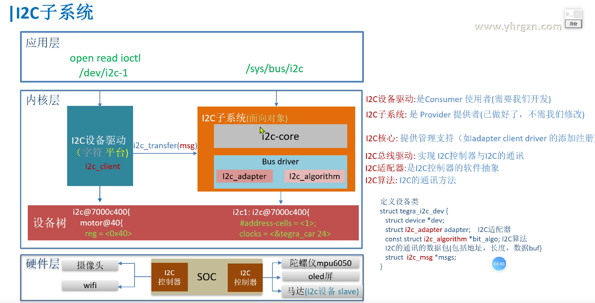

## 框架和例子



> 协议具体对应到I2C algorithm 那一层。将controller 和 device 看成一个整体，就是设备类。
>

刚开始最重要的就是熟悉框架！配合之前的例子。

### 设备访问全流程：I2C camera 为例

1. **硬件架构连接**

    ```mermaid
    graph LR
        SOC["ARM SoC"] --> I2C_Ctrl["I2C控制器（Platform设备）"]
        I2C_Ctrl -->|SCL/SDA| Camera["OV5640 Camera（I2C设备）"]
        I2C_Ctrl -->|MMIO| Registers["I2C控制器寄存器"]
        Camera -->|MIPI/Parallel| Image_Sensor["图像传感器"]
    ```

    **硬件特性**：

    - **I2C控制器**：SoC内部模块，地址`0x400A0000`（内存映射）
    - **OV5640 Camera**：从设备地址`0x3C`，通过I2C配置寄存器
    - **数据接口**：图像数据通过MIPI/Parallel接口传输（与I2C控制总线分离）

2. **设备树配置**

    ```yaml
    // SoC级定义：I2C控制器作为Platform设备
    i2c1: i2c@400a0000 {
        compatible = "vendor,soc-i2c";
        reg = <0x400a0000 0x1000>;    // MMIO地址范围
        interrupts = <0 32 IRQ_TYPE_LEVEL_HIGH>;
        clocks = <&i2c_clk>;
        #address-cells = <1>;
        #size-cells = <0>;
    
        // Camera设备节点
        ov5640: camera@3c {
            compatible = "ovti,ov5640";
            reg = <0x3c>;             // I2C从地址
            vdda-supply = <&vdd_cam>; // 电源管理
            clocks = <&cam_clk>;      // 输入时钟
            port {
                // MIPI CSI接口绑定
                ov5640_to_csi: endpoint {
                    remote-endpoint = <&csi_to_ov5640>;
                };
            };
        };
    };
    ```

    **关键点**：

    - I2C控制器通过`reg`属性声明MMIO地址
    - Camera设备通过`reg`指定I2C从地址
    - 电源/时钟资源通过 `vdda-supply `和 `clocks` 关联

    > 这里需要注意，由于 controller 的 not discoverabl，所以要使用设备树来传递配置。

3. **内核驱动流程（代码级实现）**

    - **I2C控制器驱动（Platform驱动）**

        ```C
        // 注册Platform驱动
        static struct platform_driver soc_i2c_driver = {
            .probe = soc_i2c_probe,
            .driver = {
                .name = "soc-i2c",
                .of_match_table = soc_i2c_of_match,
            },
        };
        module_platform_driver(soc_i2c_driver);
        
        // Probe函数初始化硬件
        static int soc_i2c_probe(struct platform_device *pdev) {
            // 解析设备树资源
            struct resource *res = platform_get_resource(pdev, IORESOURCE_MEM, 0);
            void __iomem *base = devm_ioremap_resource(&pdev->dev, res);
            
            writel(CTRL_ENABLE, base + CTRL_REG); // 使能控制器
            // 配置I2C时钟分频
           
            writel(CLK_DIV_400K, base + I2C_CLK_REG);
            
            // 注册I2C适配器
            struct i2c_adapter *adap = i2c_alloc_adapter();
            adap->algo = &soc_i2c_algo;  // 实现i2c_algorithm
            i2c_add_adapter(adap);       // 生成/sys/class/i2c-dev/i2c-1
        }
        ```

        

    - **Camera驱动（I2C设备驱动）**

        ```C
        // 定义I2C设备ID表
        static const struct i2c_device_id ov5640_id[] = {
            { "ov5640", 0 },
            {}
        };
        MODULE_DEVICE_TABLE(i2c, ov5640_id);
        
        // 定义设备树匹配表
        static const struct of_device_id ov5640_of_match[] = {
            { .compatible = "ovti,ov5640" },
            {}
        };
        
        // 注册I2C驱动
        static struct i2c_driver ov5640_i2c_driver = {
            .probe = ov5640_probe,
            .remove = ov5640_remove,
            .id_table = ov5640_id,
            .driver = {
                .name = "ov5640",
                .of_match_table = ov5640_of_match,
            },
        };
        module_i2c_driver(ov5640_i2c_driver);
        
        static int ov5640_probe(struct i2c_client *client) {
            // 1. 获取设备树配置
            struct device_node *np = client->dev.of_node;
            u32 addr = client->addr;          // I2C地址（0x30）
            u32 speed = of_property_read_u32(np, "clock-frequency", &speed);
        
            // 2. 初始化摄像头硬件
            camera_sensor_power_on(&client->dev);
            i2c_smbus_write_byte_data(client, REG_CONFIG, 0x01); // 配置寄存器
        
            // 3. 注册字符设备或V4L2接口
            v4l2_device_register(&client->dev, &camera_v4l2_dev);
        }
        ```

        

    - **I2C数据传输核心（i2c_algorithm实现）**

        ```C
        // 实现I2C算法（控制器级）
        static struct i2c_algorithm soc_i2c_algo = {
            .master_xfer = soc_i2c_xfer,
            .functionality = soc_i2c_func,
        };
        
        // 实际传输函数
        static int soc_i2c_xfer(struct i2c_adapter *adap, 
                               struct i2c_msg *msgs, int num) {
            void __iomem *base = adap->algo_data;
            
            // 遍历每个消息
            for (int i = 0; i < num; i++) {
                // 设置从地址和方向
                writel(msgs[i].addr << 1 | (msgs[i].flags & I2C_M_RD), 
                       base + I2C_ADDR_REG);
                
                // 写入数据（写操作）
                if (!(msgs[i].flags & I2C_M_RD)) {
                    for (int j = 0; j < msgs[i].len; j++)
                        writeb(msgs[i].buf[j], base + I2C_DATA_REG);
                }
                
                // 触发传输
                writel(CTRL_START, base + I2C_CTRL_REG);
                wait_for_completion(&i2c_complete); // 等待中断
            }
            return num;
        }
        ```

        ```C
        // 单次写入寄存器
        i2c_smbus_write_byte_data(client, reg, value);
        
        // 单次读取寄存器
        value = i2c_smbus_read_byte_data(client, reg);
        
        // 复杂传输（多个消息）
        struct i2c_msg msg[] = {
            { .addr = client->addr, .flags = 0, .len = 2, .buf = write_buf }, // 写操作
            { .addr = client->addr, .flags = I2C_M_RD, .len = 4, .buf = read_buf }, // 读操作
        };
        ret = soc_i2c_xfer(client->adapter, msg, 2);
        ```

        

4. **用户空间访问流程**

    - **通过sysfs直接操作（调试用）**

        ```bash
        # 列出所有I2C总线
        ls /sys/class/i2c-dev/
        # 直接读写Camera寄存器
        i2cset -y 1 0x3c 0x3008 0x80  # 复位传感器
        i2cget -y 1 0x3c 0x300A       # 读取芯片版本
        ```

    - ##### **通过V4L2框架访问（标准方式）**

        ```c
        // 用户空间代码示例
        struct v4l2_format fmt = {
            .type = V4L2_BUF_TYPE_VIDEO_CAPTURE,
            .fmt.pix = { .width = 1920, .height = 1080, .pixelformat = V4L2_PIX_FMT_YUYV }
        };
        ioctl(fd, VIDIOC_S_FMT, &fmt);
        
        // 启动视频流
        struct v4l2_buffer buf;
        ioctl(fd, VIDIOC_REQBUFS, &req);
        ioctl(fd, VIDIOC_QBUF, &buf);
        ioctl(fd, VIDIOC_STREAMON, &type);
        ```

5. **关键内核API与数据结构**

    | **步骤**             | **代码路径**                                 | **核心函数/结构体**                           |
    | :------------------- | :------------------------------------------- | :-------------------------------------------- |
    | **设备树解析**       | `drivers/of/platform.c`                      | `of_platform_populate`                        |
    | **Platform驱动注册** | `drivers/i2c/busses/i2c-vendor-controller.c` | `platform_driver_register`, `i2c_add_adapter` |
    | **I2C驱动注册**      | `drivers/media/i2c/camera-sensor-driver.c`   | `i2c_register_driver`, `i2c_smbus_*`          |
    | **数据传输**         | `drivers/i2c/i2c-core.c`                     | `i2c_transfer`, `i2c_smbus_xfer`              |

    | **组件**         | **API/数据结构**     | **作用**                    |
    | :--------------- | :------------------- | :-------------------------- |
    | **Platform驱动** | `platform_driver`    | I2C控制器驱动注册           |
    | **I2C适配器**    | `i2c_add_adapter()`  | 创建I2C总线（如i2c-1）      |
    | **I2C设备驱动**  | `i2c_driver.probe()` | Camera设备初始化            |
    | **数据传输**     | `i2c_transfer()`     | 底层I2C消息传输             |
    | **V4L2集成**     | `v4l2_subdev_ops`    | 摄像头控制接口（曝光/对焦） |
    | **电源管理**     | `dev_pm_ops`         | 低功耗状态切换              |

6. **调试**

    1. **查看设备树绑定状态**：

        ```bash
        dtc -I fs /sys/firmware/devicetree/base | grep -A 10 "i2c@400a0000"
        ```

    2. **跟踪I2C通信**：

        ```bash
        echo 1 > /sys/module/i2c_core/parameters/debug
        dmesg -w | grep "i2c i2c-1"
        ```

    3. **分析V4L2拓扑**：

        ```bash
        media-ctl -p -d /dev/media0
        ```

    4. **性能分析**：

        ```bash
        perf trace -e i2c:i2c_read -e i2c:i2c_write
        ```

7. **总结全流程**

    1. **设备树配置**：
        - 描述I2C控制器和设备的硬件参数（地址、中断、时钟等）。
        - 通过`compatible`字符串匹配驱动。
    2. **Platform总线与I2C控制器驱动**：
        - I2C控制器作为Platform设备，通过`platform_driver`注册。
        - 在`probe`函数中初始化硬件并注册I2C适配器（`i2c_add_adapter`）。
    3. **I2C设备驱动**：
        - 摄像头驱动通过`i2c_driver`注册，`probe`函数初始化设备并注册V4L2接口。
        - 使用I2C核心层API（如`i2c_transfer`）进行数据传输。
    4. **数据传输流程**：
        - 应用层调用V4L2接口 → 驱动层调用`i2c_smbus_write_byte_data` → I2C核心层 → I2C控制器驱动（`vendor_i2c_xfer`） → 硬件操作。

    ```mermaid
    flowchart TD
        A[硬件连接] --> B[设备树描述]
        B --> B1[I2C控制器节点]
        B --> B2[I2C摄像头节点]
    
        B1 --> C[Platform驱动注册]
        C --> C1[vendor_i2c_probe]
        C1 --> C2[注册I2C适配器i2c_add_adapter]
    
        B2 --> D[I2C驱动注册]
        D --> D1[camera_sensor_probe]
        D1 --> D2[硬件初始化和V4L2注册]
    
        C2 --> E[I2C核心层]
        D2 --> E
        E --> F[数据传输API调用]
        F --> F1[i2c_transfer/i2c_smbus_*]
    ```


### 代码配合框架

#### **1. 应用层 ↔ 用户空间访问流程**

 **对应组件**：  

   - `/sys/bus/i2c`、`/dev/i2c-1`：通过sysfs直接操作I2C设备（如`i2cset`/`i2cget`）。
   - **V4L2框架**：用户通过`ioctl`调用配置摄像头参数（分辨率、格式）和获取视频流。

 **示例流程**：  

   ```c
   // 用户空间V4L2操作
   ioctl(fd, VIDIOC_S_FMT, &fmt);    // 设置视频格式
   ioctl(fd, VIDIOC_STREAMON, &type); // 启动视频流
   ```


#### **2. 内核层 ↔ 内核驱动流程**

1. **I2C设备驱动（字符设备/V4L2）**

    - **对应组件**：  

        - `i2c_driver`：摄像头驱动（如`ov5640_i2c_driver`）。
        - `i2c_client`：表示具体的摄像头设备（从设备地址`0x3C`）。

    - **代码实现**：  

        ```c
        static struct i2c_driver ov5640_i2c_driver = {
            .probe = ov5640_probe,  // 初始化摄像头硬件
            .id_table = ov5640_id,  // 匹配设备
        };
        ```

2. **I2C总线驱动（Platform驱动）**

    - **对应组件**：  

        - `platform_driver`：I2C控制器驱动（如`soc_i2c_driver`）。
        - `i2c_adapter`：I2C控制器的软件抽象（如`adap`）。
        - `i2c_algorithm`：I2C通信方法（如`soc_i2c_algo`）。

    - **代码实现**：  

        ```c
        static struct platform_driver soc_i2c_driver = {
            .probe = soc_i2c_probe,  // 注册适配器
            .driver = { .name = "soc-i2c" },
        };
        ```

3. **I2C核心层**

    - **对应功能**：  
        - 管理适配器（`i2c_add_adapter`）、匹配设备与驱动（`i2c_register_driver`）。
        - 提供传输API（`i2c_transfer`、`i2c_smbus_*`）。

4. **设备树 ↔ 硬件描述与配置**

    - **对应组件**：  
    
        - **I2C控制器节点**：描述控制器MMIO地址、中断、时钟（`i2c@400a0000`）。
        - **Camera设备节点**：指定I2C从地址（`reg = <0x3c>`）、电源/时钟依赖。
    
    - **设备树代码**：  
    
        ```yaml
        i2c1: i2c@400a0000 {
            reg = <0x400a0000 0x1000>;      // 控制器地址
            ov5640: camera@3c {
                compatible = "ovti,ov5640"; // 驱动匹配
                reg = <0x3c>;              // 从地址
            };
        };
        ```

5. **硬件层 ↔ 物理设备连接**

    - **对应组件**：  

        - **I2C控制器**：SoC内部模块（地址`0x400A0000`）。
        - **OV5640 Camera**：通过SCL/SDA总线连接的I2C从设备。
        - **图像传感器**：通过MIPI/Parallel接口传输图像数据。

    - **硬件架构图**：  

        ```mermaid
        graph LR
            SOC --> I2C_Ctrl --> Camera --> Image_Sensor
        ```
    
6. **全流程对应关系图**

    ```mermaid
    flowchart TD
        A[应用层] -->|V4L2 API/Sysfs| B[内核层]
        B -->|i2c_transfer| C[I2C核心层]
        C -->|i2c_algorithm| D[I2C总线驱动]
        D -->|MMIO/中断| E[硬件层-I2C控制器]
        E -->|SCL/SDA| F[硬件层-摄像头]
        G[设备树] -->|DTB解析| B
       G -->|硬件描述| D
    ```

7. **关键映射总结**

    | **层级**   | **对应内容**                                                 |
    | ---------- | ------------------------------------------------------------ |
    | **应用层** | V4L2用户接口、`i2c-tools`命令                                |
    | **内核层** | `i2c_driver`（摄像头驱动）、`platform_driver`（控制器驱动）、`i2c_adapter` |
    | **设备树** | I2C控制器节点、Camera设备节点（地址/时钟/电源）              |
    | **硬件层** | SoC的I2C控制器、OV5640摄像头模块、物理总线（SCL/SDA）        |


## 溯源

```bash
//开发场景
 各种传感器 指纹模块、蓝牙模块、WIFI模块，都用到，
 如温度传感器，陀螺仪（重力加速度传感器），OLED屏幕
 图像传感器问题 //如我在调试IMX258 传感器，想实现动态调试16bit寄存器，但是i2cget，i2cset，i2cdump都不能用。
               //https://forums.developer.nvidia.com/t/i2c-tool-reads-sensor-error/69412
 摄像头模块i2c 问题 //如 https://forums.developer.nvidia.com/t/csi-ov2710-camera-module-driver/44262/12
 摄像头输入帧问题   //https://forums.developer.nvidia.com/t/jetson-sensor-frame-row-mismatch/158150

# i2cdetect -l /* 查看i2c总线使用情况
i2c-3   i2c             7000c700.i2c                            I2C adapter
i2c-1   i2c             7000c400.i2c                            I2C adapter
i2c-8   i2c             i2c-6-mux (chan_id 1)                   I2C adapter
i2c-6   i2c             Tegra I2C adapter                       I2C adapter
i2c-4   i2c             7000d000.i2c                            I2C adapter
i2c-2   i2c             7000c500.i2c                            I2C adapter
i2c-0   i2c             7000c000.i2c                            I2C adapter
i2c-7   i2c             i2c-6-mux (chan_id 0)                   I2C adapter
i2c-5   i2c             7000d100.i2c                            I2C adapter	
*/
```


## 框架源码

### 设备树帮助文档

```yaml
//i2c总线（见芯片手册 CHAPTER 35: I2C CONTROLLER）
//Documentation/devicetree/bindings/i2c/nvidia,tegra20-i2c.txt
VIDIA Tegra20/Tegra30/Tegra114 I2C controller driver.

Required properties:
- compatible : must be 
  "nvidia,tegra20-i2c".  For Tegra30, must be "nvidia,tegra30-i2c".
  or tegra210.
  
  nvidia,tegra20-i2c: Tegra20 has 4 generic I2C controller. This can support
    master and slave mode of I2C communication. The i2c-tegra driver only
    support master mode of I2C communication. Driver of I2C controller is
    only compatible with "nvidia,tegra20-i2c".
  with "nvidia,tegra114-i2c".
- reg: Should contain I2C controller registers physical address and length.
- interrupts: Should contain I2C controller interrupts.
- address-cells: Address cells for I2C device address.
- size-cells: Size of the I2C device address.
- clocks: Must contain an entry for each entry in clock-names.
  See ../clocks/clock-bindings.txt for details.
- clock-names: Must include the following entries:
  Tegra20/Tegra30:
  - div-clk
  - fast-clk
  Tegra114:
  - div-clk
- resets: Must contain an entry for each entry in reset-names.
  See ../reset/reset.txt for details.
- reset-names: Must include the following entries:
  - i2c
- dmas: Must contain an entry for each entry in clock-names.
  See ../dma/dma.txt for details.
- dma-names: Must include the following entries:
  - rx
  - tx
- print-rate-limit: Limit the error print rate

Example:

    i2c@7000c000 {
        compatible = "nvidia,tegra20-i2c";
        reg = <0x7000c000 0x100>;
        interrupts = <0 38 0x04>;
        #address-cells = <1>;
        #size-cells = <0>;
        clocks = <&tegra_car 12>, <&tegra_car 124>;
        clock-names = "div-clk", "fast-clk";
        resets = <&tegra_car 12>;
        reset-names = "i2c";
        dmas = <&apbdma 16>, <&apbdma 16>;
        dma-names = "rx", "tx";
        status = "disabled";
        print-rate-limit = <120 1>;
    };
```


### 设备树

```yaml
//tegra210-soc-base.dtsi		设备树
i2c1: i2c@7000c000 {
	#address-cells = <1>;
	#size-cells = <0>;
	compatible = "nvidia,tegra210-i2c";
	reg = <0x0 0x7000c000 0x0 0x100>;
	interrupts = <0 38 0x04>;
	iommus = <&smmu TEGRA_SWGROUP_PPCS>;
	status = "disabled";
	clock-frequency = <400000>;
	dmas = <&apbdma 21>, <&apbdma 21>;
	dma-names = "rx", "tx";
	clocks = <&tegra_car TEGRA210_CLK_I2C1>, <&tegra_car TEGRA210_CLK_PLL_P>;
	clock-names = "div-clk", "parent";
	resets = <&tegra_car 12>;
	reset-names = "i2c";
};

i2c2: i2c@7000c400 {
	#address-cells = <1>;
	#size-cells = <0>;
	compatible = "nvidia,tegra210-i2c";
	reg = <0x0 0x7000c400 0x0 0x100>;
	interrupts = <0 84 0x04>;
	iommus = <&smmu TEGRA_SWGROUP_PPCS>;
	status = "disabled";
	clock-frequency = <100000>;
	dmas = <&apbdma 22>, <&apbdma 22>;
	dma-names = "rx", "tx";
  clocks = <&tegra_car TEGRA210_CLK_I2C2>, <&tegra_car TEGRA210_CLK_PLL_P>;
	clock-names = "div-clk", "parent";
  resets = <&tegra_car 54>;
  reset-names = "i2c";
};
```


### I2C 总线驱动

```C
//drivers/i2c/busses/i2c-tegra.c  i2c总线驱动
	
//定义设备类	
struct tegra_i2c_dev {
	struct device *dev;
	struct i2c_adapter adapter; //I2C适配器: 是I2C控制器的软件抽象
	const struct i2c_algorithm *bit_algo; //I2C算法: I2C的通讯方法
	struct i2c_msg *msgs;	//I2C的通讯的数据包(包括地址，长度，数据buf)
}	
static const struct of_device_id tegra_i2c_of_match[] = {
	{ .compatible = "nvidia,tegra210-i2c", .data = &tegra210_i2c_hw, },
};	
	
static struct platform_driver tegra_i2c_driver = {
	.probe   = tegra_i2c_probe,
	.driver  = {
		.name  = "tegra-i2c",
		.of_match_table = tegra_i2c_of_match,
	},
};
	
static int __init tegra_i2c_init_driver(void)
{
	return platform_driver_register(&tegra_i2c_driver);
}
subsys_initcall(tegra_i2c_init_driver);

```


## 陀螺仪 MPU6050


## OLED


## 小车马达


