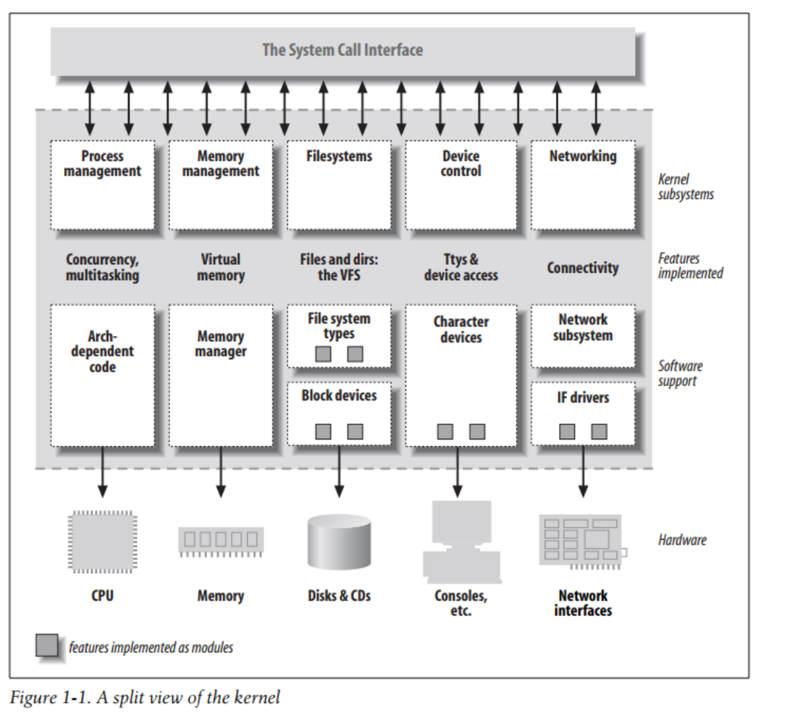
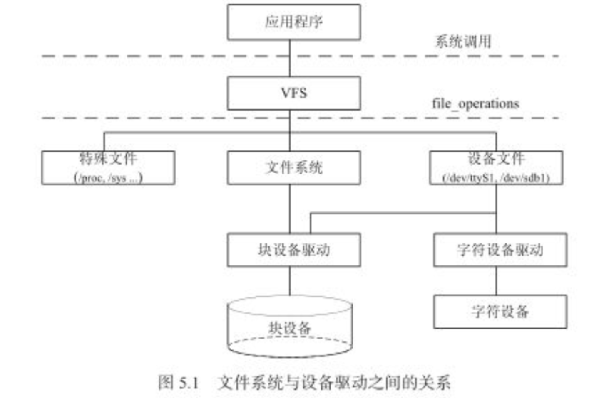
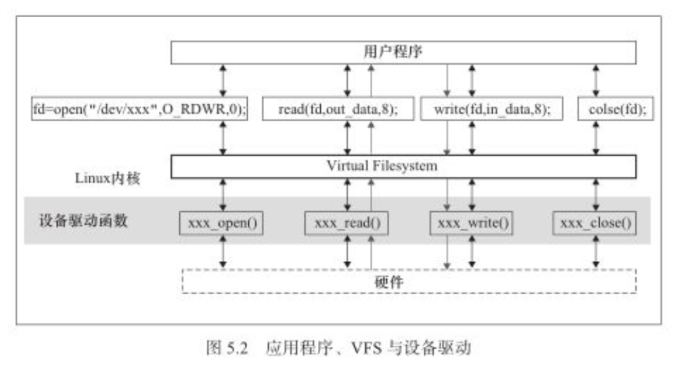
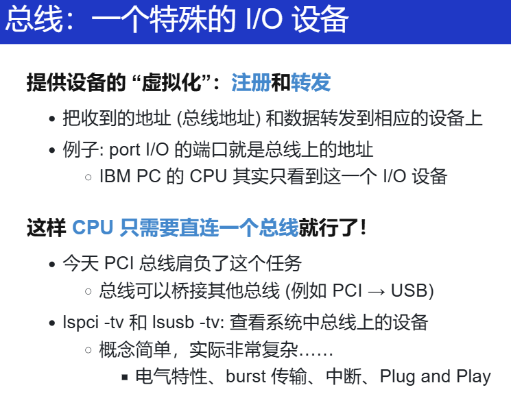
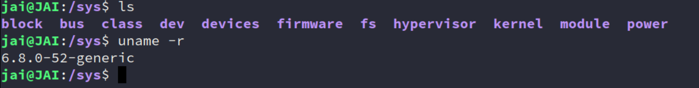
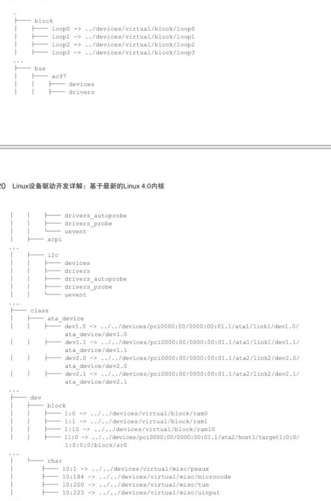
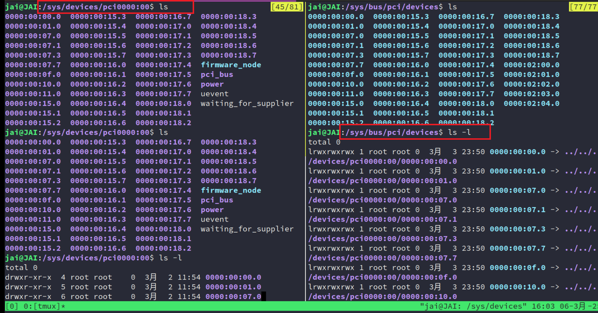
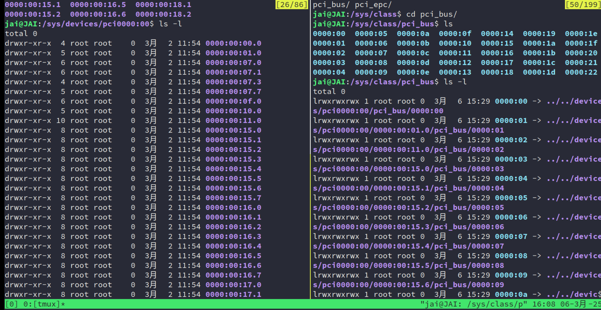
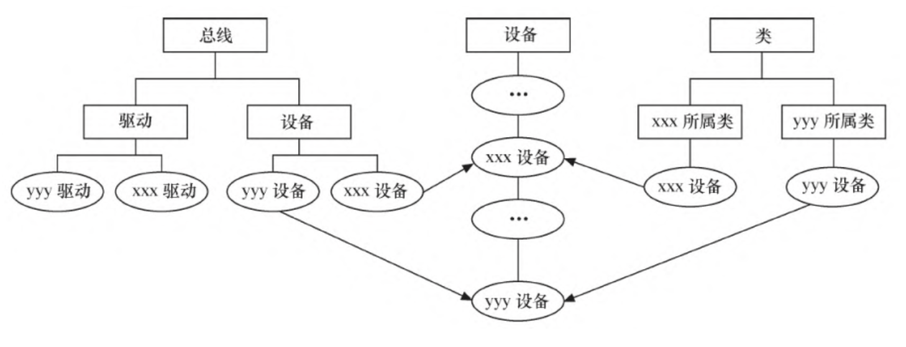

## 层次结构

### Linux内核架构

有了 OS 课的基础后再看这个图其实是很清晰的。

### Linux文件系统与设备驱动

回想一下 PA 中的设计，其实已经这么做了！概述：

字符设备的上层没有类似于磁盘的 `ext2` 等文件系统，过，字符设备的 `file_operation` 成员函数直接由设备驱动提供，即 `file_operation` 是字符设备驱动的核心。

块设备有两种访问方法：

- 一种不通过文件系统直接访问裸设备，Linux 内核实现了统一的 `deg_blk_fops` 这一 `file_operation`，比如：

    `dd if=/dev/sdb1 of=sdb1.img` 的命令把整个 `/dev/sdb1` 裸分区复制到 `sdb1.img` 的时候，内核用的这种方法。

- 另一种，通过文件系统来访问块设备

    `file_operations` 的实现则位于文件系统内，文件系统会把针对文件的读写转换为针对块设备原始扇区的读写。`ext2、fat、Btrfs` 等文件系统中会实现针对VFS的 `file_operations` 成员函数，设备驱动层将看不到`file_operations` 的存在。  

### 设备驱动模型2.6

> 主要来自《Linux设备驱动开发详解：基于最新的Linux4.0内核 》(宋宝华 著) 的第五章

**核心在于总线、类、驱动。**

> OS 课上的笔记：
>
> 你总不想每个计算机系统只有固定的设备吧？我想接入更多 (甚至**未知**) 的 I/O 设备，要是有一天出了新型产品硬件，那只要有这个，就能极大地减少成本呀！复用率高！
>
> 所以，这么一个特殊的 I/O 设备：总线bus
>
> 每当有一个请求给总线，总线会根据这个请求（属于 DDR，属于键盘，属于别的设备），转发给别的设备！
>
> 但总线也有设备，CPU 通过和总线的寄存器交互，从而知道总线挂了哪些设备，设备中有几个寄存器，产商是谁......
>
> 
>
> 所有外部设备都直接或间接地连接到 PCIe 总线上，插上之后，总线给它分配地址。
>
> > 就像，你装计算机的时候，把 显卡插入主板的时候。

主要借助 `sysfs`：

Linux 2.6 以后的内核引入了 `sysfs` 文件系统，`sysfs` 被看成是与 `proc`、`devfs` 和 `devpty` 同类别的文件系统，该文件系统是一个虚拟的文件系统，它可以产生一个包括所有系统硬件的层级视图，与提供进程和状态信息的 `proc` 文件系统十分类似。（类比自己写的`pstree`，然后想象这个结构）

**`sysfs` 把连接在系统上的设备和总线组织成为一个分级的文件，它们可以由用户空间存取，向用户空间导出内核数据结构以及它们的属性。**

`sysfs` 的一个目的就是展示设备驱动模型中各组件的层次关系，其顶级目录包括 block、bus、dev、devices、class、fs、kernel、power 和 firmware 等。（我的系统如下）

- block 目录：所有的块设备
- devices 目录：系统所有的设备，并根据设备挂接的总线类型组织成层次结构；
- bus 目录：系统中所有的总线类型；
- class 目录：系统中的设备类型（如网卡设备、声卡设备、输入设备等）。

在 `/sys` 目录下运行 tree 会得到一个相当长的树形目录，下面摘取一部分  

在 `/sys/bus` 的 `pci` 等子目录下，又会再分出 `drivers` 和 `devices` 目录，而 `devices` 目录中的文件是对 `/sys/devices` 目录中文件的符号链接：

同样地，`/sys/class` 目录下也包含许多对 `/sys/devices` 下文件的链接：

如下图所示，Linux 设备模型与设备、驱动、总线和类的现实状况是直接对应的：

核心总结：Linux 2.6 以后的内核通过一系列数据结构定义了设备模型，设备模型与 `sysfs` 文件系统中的目录和文件存在一种对应关系。设备和驱动分离，并通过总线进行匹配。`udev` 可以利用内核通过 `netlink` 发出的 `uevent` 信息动态创建设备文件节点。  

**大多数情况下，Linux 2.6 以后的内核中的设备驱动核心层代码作为“幕后大佬”可处理好这些关系，内核中的总线和其他内核子系统**
**会完成与设备模型的交互，这使得驱动工程师在编写底层驱动的时候几乎不需要关心设备模型，只需要按照每个框架的要求，“填鸭**
**式”地填充 xxx_driver 里面的各种回调函数**。

xxx 是总线的名字  在 Linux 内核中，分别使用 bus_type、device_driver 和 device 来描述总线、驱动和设备。这3个结构体定义于 include/linux/device.h 头文件中，其定义如代码清单5.7所示。  

### 设备驱动模型--文档

配合`DeepSeek` 学习总结。

