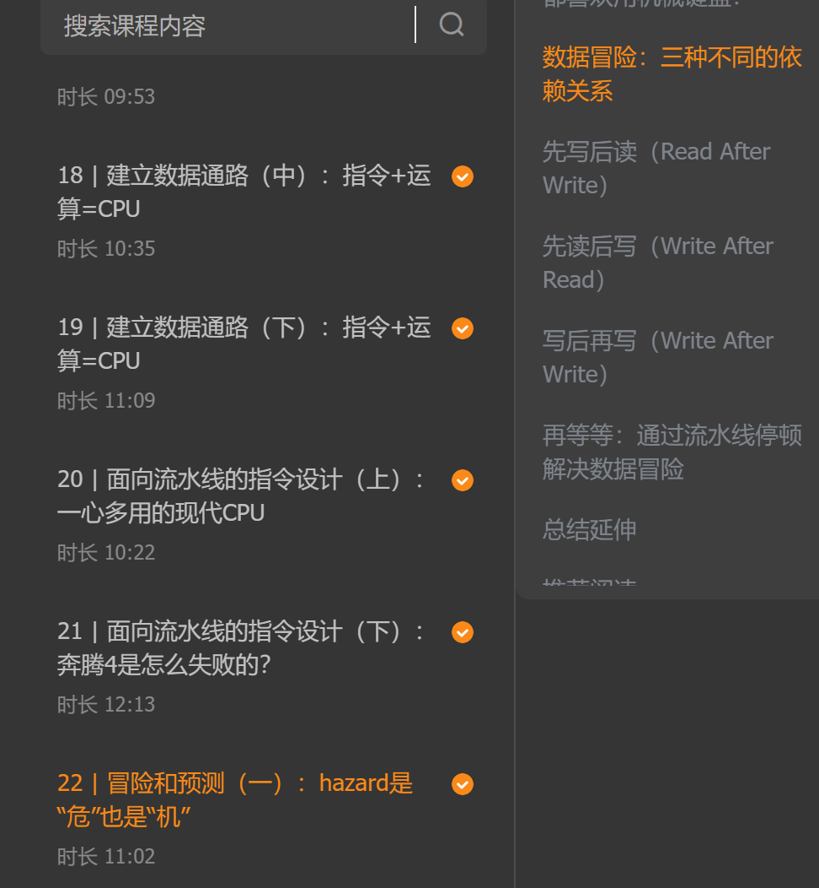
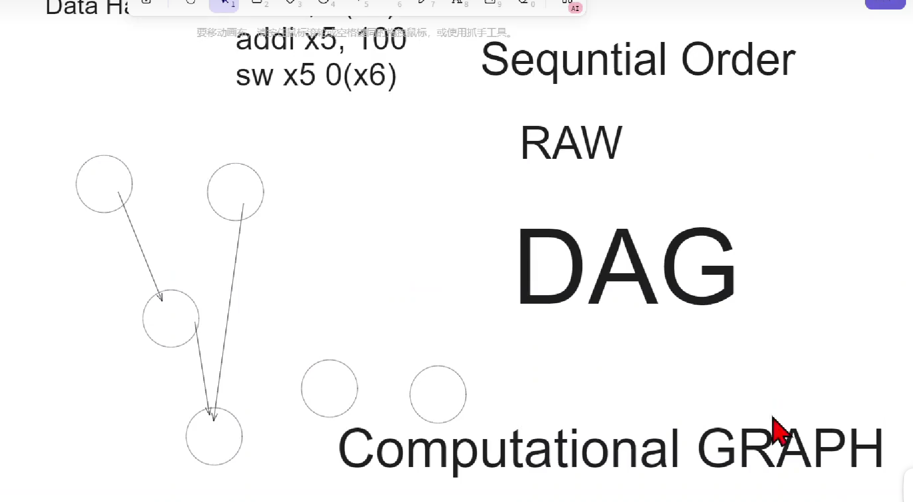

[[实录\] linux training 02.01/02 - hardware_哔哩哔哩_bilibili](https://www.bilibili.com/video/BV1qi421R7pP/?spm_id_from=pageDriver&vd_source=ecc99d78ae961113010161a48a475a35)

软硬件接口：

对于硬件来说，上面的东西都是一个状态机，他都不知道上面是OS还是什么，（反正都是程序）。

有点像图灵机的模型

statement：陈述。

instruction：指挥机器。ISA，

有了ISA这种API接口，或者说叫规范（软件和硬件的接口）。硬件随便干，软件也随便干自己的，各自发挥性能。解耦了！

底层硬件不一样，各个厂家都有自己的设计，想什么i5 i7等等

这就是微架构 `micro-architecture`

微架构是ISA的实现，

编码？解析？decode

流水线的出现解决什么问题？提升数据吞吐量，有并行的效果？数字电路中出现解决什么？

> 计算机里面，任何一个技术为了解决什么问题的？这是一种学习思想？

时间并行，空间并行

计算机中的流水线和实际生活中的有什么区别？（除了硬件）

要往回去做？----> 跳转？

工厂中的流水线一般情况是不会跳转的，除非这个器件坏了，要倒回去修，当让是你自己管理的。

所以计算机里面，最复杂的东西，是不是控制逻辑呢？

现在的教育，都是很浅的东西，单点的东西。

我们需要通过宏观的视角了解整个系统的运作，之后就能一步步了解到其中每一个器件起到的作用，也能明白为什么有的器件为什么这么关键。

比如说 `Multiplexer`，没有他，输入1和0就会乱串，缺少这个控制器件，相当于交通中，没有红绿灯这个概念，车直接乱开，社会不就乱套了？同理，CPU内部不就乱套了。

> Multiplexer  --> C语言的if？

所以，在学习到每一个基础的东西的时候，把他们当作积木来用，都要从复杂系统的角度来了解他的作用。

数电和计组里面CPU流水线重要的两个问题：

1. 跳转 `branch`
2. 依赖 `depend`

基于什么样的条件，依赖，我需要产生 `nop`，

前一条write的结果，会被后面的指令read。

这就是经典的 `data hazard`

也就是read after write （RAW）

`program order` 我写的程序顺序

`execution order` 程序实际执行的顺序

`Sequential order` 我们人理解的程序执行顺序

也就是带来的并行效果

---> 图的关系

依赖图、有向无环图、计算图：

通过这一讲的部分，大概对硬件有一个比较深入的了解了。

> 我需要探索的精神！多问问为什么，积极主动一点。

> 对自己教育的反思，为什么小时候的我/孩子那么主动积极，长大之后就不会了？
>
> 大家社会就是对的吗？
>
> 对计算机世界的探索，就是需要这种好奇
>
> 

