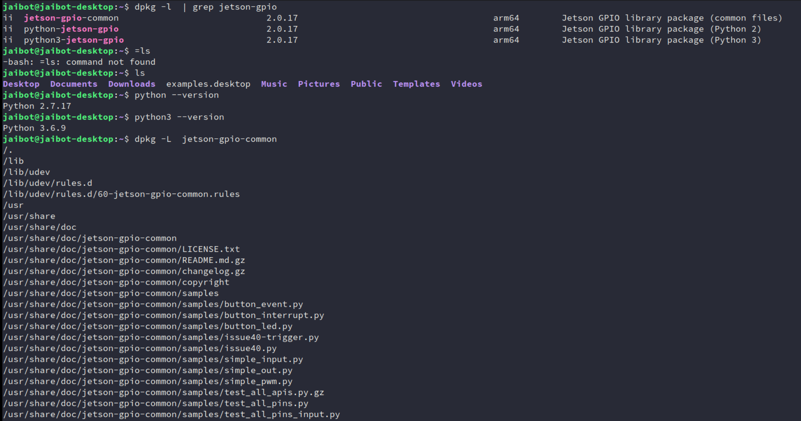
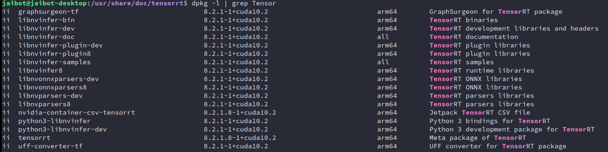
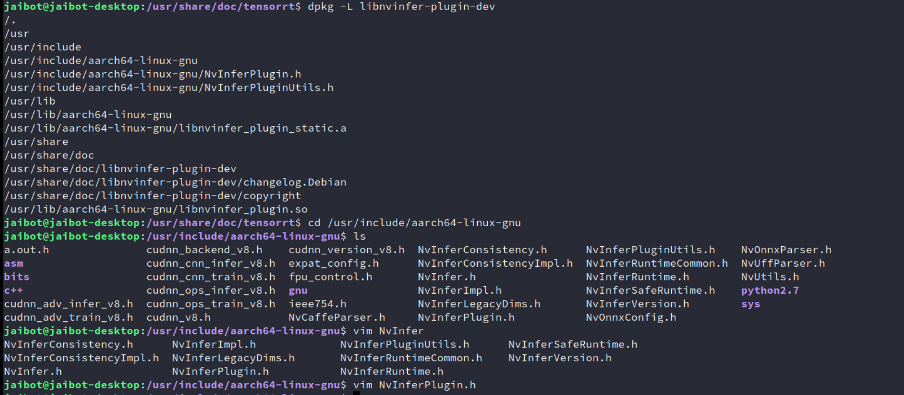
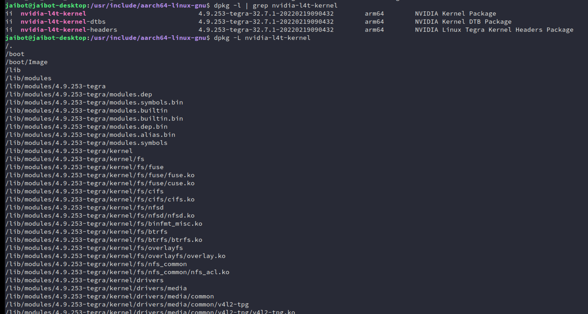
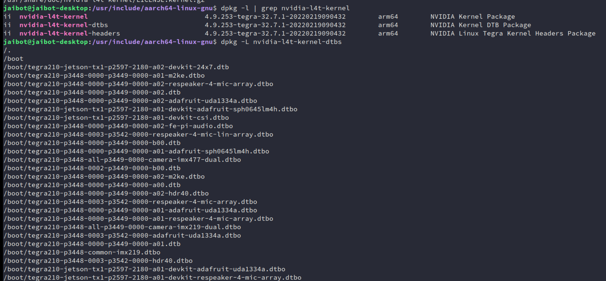
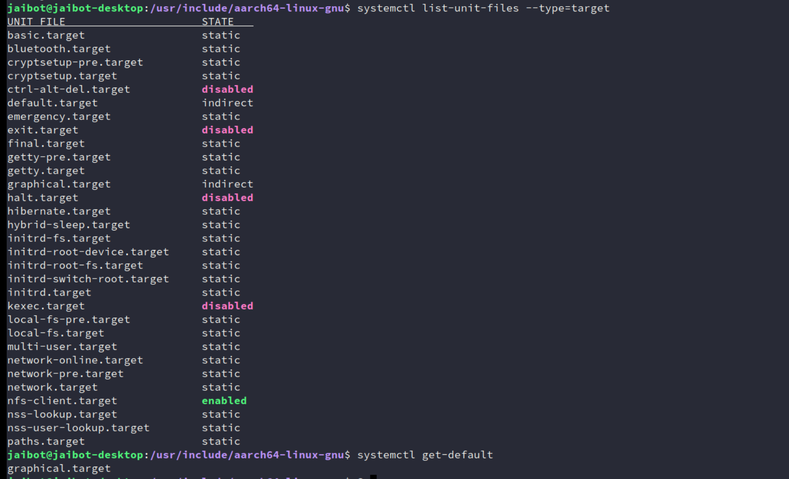
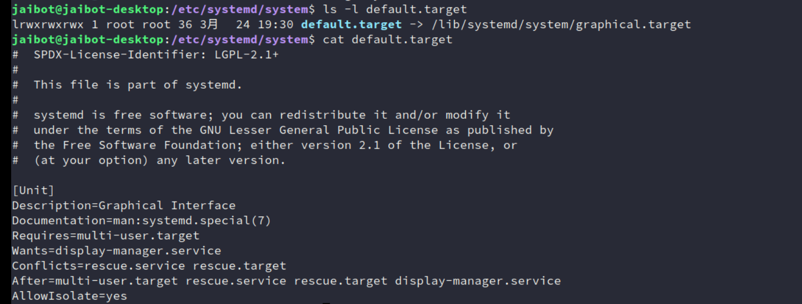
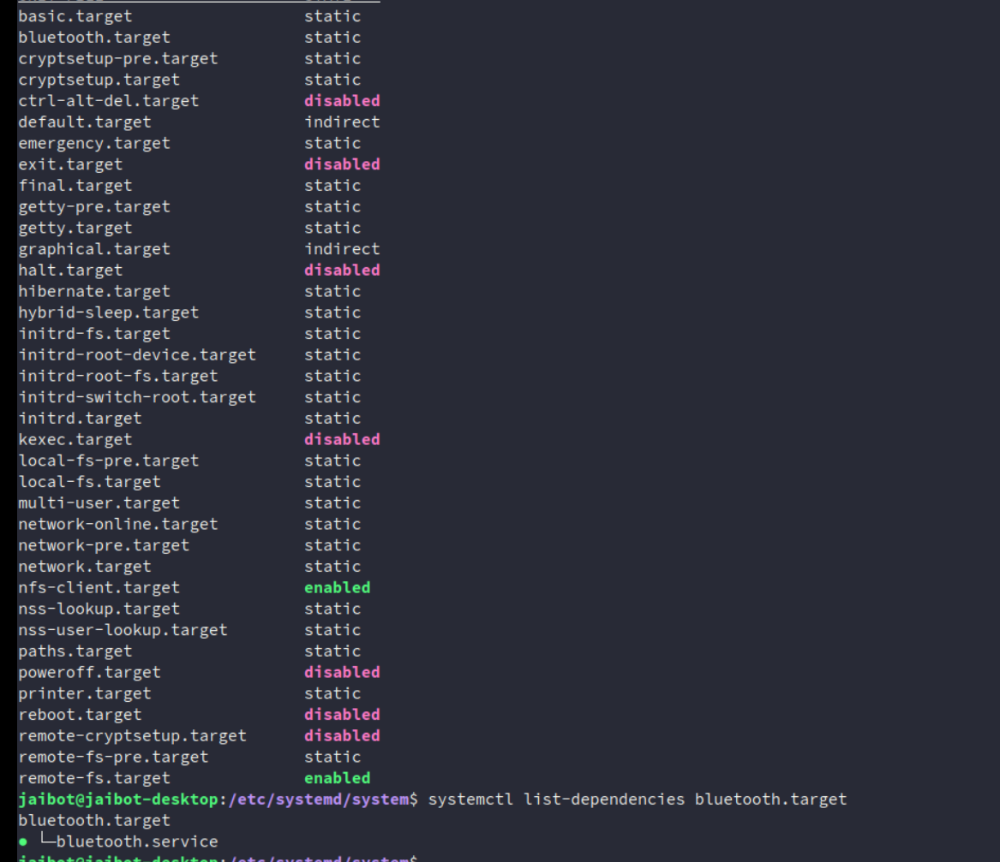

## 环境搭建

### 搭建

官方入门   https://developer.nvidia.com/embedded/learn/getting-started-jetson#documentation

智能车项目 https://github.com/NVIDIA-AI-IOT/jetbot

商家资料(微雪智能车)  https://www.waveshare.net/wiki/JetBot_AI_Kit 

 https://www.waveshare.net/wiki/Jetson_Nano_Developer_Kit

资料： 见云盘 2.官方jetbot环境搭建


```
https://developer.nvidia.com/ Chrome翻译-> 解决方案 -> 嵌入式和边缘AI -> Jetson开发工具包 -> 入门
	 
Hello AI World教程  //官方提供的学习示例
Jetson项目  //可查看用jetson做的 各种酷炫项目
           
NVIDIA Jetson 论坛 //可看到 问题的交流信息和最新动向
NVIDIA 开发人员计划 //邮箱加入后，可看最前沿的动态
Jetson AI Fundamentals Series //课程和认证(需翻墙)

Jetson Nano 开发套件 -> 入门指南 //开发板 如何开始开发   
     
JetBot 自主机器人套件 -> 开始 //是NVIDIA(英伟达)基于JetsoN Nano开发套件而设计的一款开源智能车项目    
Jetson Linux 开发人员指南 //嵌入式底层开发
```


###  镜像烧写

https://github.com/NVIDIA-AI-IOT/jetbot/wiki/Software-Setup

```
但需翻墙用迅雷下载如jetbot_image_v0p4p0.zip(7G左右 基于jetpack 4.3的微雪用的是这个版本)
```

https://jetbot.org/master/software_setup/sd_card.html 

```
注：jetbot发布的最新的是分2G版和4G版  jetbot-043_nano-4gb-jp45.zip(13G左右 基于jetpack 4.5的)
 如果要用最新的4.6的，需从零自己做
```


> 烧写工具
>
> https://developer.nvidia.com/embedded/learn/get-started-jetson-nano-devkit#write	 		 下载 SD Card Formatter 5.0.1 Setup.exe 和 balenaEtcher-Setup-1.5.122.exe	


> 用usb读卡器把sd卡插入电脑 // 注意要用高速sd卡(如闪迪tf卡Extreme)，否则烧写很慢 打开SD Card Formatter  -> Select card 选SD卡  //注意：千万别选错了，把别的盘格式了 -> 选Quick format -> 让Volume label空白 -> 点Format


### 测试

```
a.插入鼠标 键盘，和hdm线接显示器
b.插入usb线供电，pwer绿灯亮 //要用5v 2A usb电源供电(用笔记本USB接口供电，电流可能不够，最好接插线板)
                          //插入圆孔电源线方式供电(直流 5V 4A) 
                          //注意圆孔旁的跳线帽要连接两边(默认只接一边)
                          //不亮可能是电源线没插好，插帽没接触好
                          //电源绿灯闪烁，表示电源不稳,需把usb供电切换为 5V 4A 圆孔电源供电
C. 启动后登录输入 
  login:  //输入jetbot 
  Password //输入jetbot  
  $ startx  //启动图形界面
  成功则可看到显示器的ubuntu的界面 //第一次需要一些设置 
d.测试wifi联网  
  点右上角 无线wifi图标 -> 选择热点连接 -> 输入密钥 -> 显示连接成功 -> 打开浏览器 能上网表示成功
e.测试摄像头
  $ ls /dev/video0    //默认video0是排线摄像头  video1是usb摄像头
  $ nvgstcapture-1.0 --cus-prev-res=1280x720  //看到显示视频,表示启动csi 排线摄像头成功
```


### 控制小车

```
去掉键盘鼠标线和hdmi线，
拔掉电源线，插入小车电池的usb线供电线。
上电后oled上会显示ip地址 如192.168.10.237 //会自动链接前面设置好的wifi
电脑上网页访问 http://192.168.10.237:8888  并输入密码jetbot
打开Jupyter Notebook  //网页式交互式笔记本，支持实时代码编程
进入Notebooks/basic_motion/  //点播放按钮，可单步执行(发现能控制小车动了，表示环境成功)
                             //也可点击某步，可选择执行
```


### 不用显示器

- 串口设置

    ```
    插上micro usb线 ，接到pc机 重启板子  
    重启后，串口终端上会显示一个串口， //通过micro usb线，模拟生成一个串口(不用另外接串口转usb的线）
    
    
    打开putty， //也可以用别的串口终端
    
    波特率 115200   8 databit  1stopbit  no parity
    ```

- 初始设置

    ```
    只刷机后，第一次运行时，需设置
    
    注意 视频里 说的 sudo ./flash.sh jetson-nano-qspi-sd mmcblk0p1 刷机命令
      跳过不用管， （因这个视频是后面课程录的，挪到前面的，有些不用管）
    ```

    刷整机后初始设置

- 远程登录

    ```
    //wifi设置（注意 ChinaNet-xqqe_EXT2.4G 是SSID  lzvjryud是无线密码根据你的情况调整）
    $ sudo nmcli device wifi connect 'ChinaNet-xqqe_EXT2.4G' password 'lzvjryud'
    
    $ ifconfig后可看到ip地址如下
    wlan0: flags=4163<UP,BROADCAST,RUNNING,MULTICAST>  mtu 1500
            inet 192.168.10.237 
    ```

    改成自己的WiFi密码


## 从零搭建镜像

### 下载 BSP 镜像

```
https://developer.nvidia.com/embedded/downloads 
        //-> 下载SD卡官方原始镜像jetback	(用翻墙加迅雷下载快)
JetPack //是bsp板级支持包(即让板子能运行的完整最小系统)
        //包括L4T(bootloader 内核，rootf) 和多媒体库(如cuda opengl等)
        // 和自研AI库(如TensorRT)
        //注：但不包括tensroflow pytorch jetbot等。


//版本匹配问题(2021.10.9查)
https://developer.nvidia.com/zh-cn/embedded/jetpack  //最新发布版本 
https://repo.download.nvidia.com/jetson/  //jetpack详细的支持功能包列表
https://developer.nvidia.com/embedded/linux-tegra-archive //不同版本差异

NVIDIA JetPack SDK //是构建 AI 应用的全面解决方案。支持所有 Jetson 模块和开发者套件
     //最新的是JetPack 4.6, 最新正式版 JetPack 4.4  
    //4.6 板支持 运行中IO配置  https://docs.nvidia.com/jetson/jetpack/release-notes/ -> Jetson -IO 工具
```


### 烧镜像同上


### 板子初始设置

板子的第一次ubuntu启动界面，

会要你进行一些初始设置，如语言，选中文简体

你所在地点，wifi设置，和用户名密码。是否需密码登录等。

其它不确定的，用它的默认设置即可

进入ubuntu主页面后，打开浏览器测试一下能否上网，不能则重新设置一下wifi 

```
$ ifconfig   //可查看本机ip地址 如 192.168.10.237
```


- 系统信息

    ```bash
    $ head -n 1 /etc/nv_tegra_release  //查看jetpack版本
                                       //L4t Verion is 32.6.1 对应 jetpack 4.6
      # R32 (release), REVISION: 6.1, GCID: 27863751, BOARD: t210ref, EABI: aarch64, DATE: Mon Jul 26 19:20:30 UTC 2021
    
    $ lsb_release -a //查看ubuntu 版本，如输出 Ubuntu 18.04.5 LTS  
    
    $ df -h   //查看磁盘空间
      Filesystem      Size  Used Avail Use% Mounted on
      /dev/mmcblk0p1  118G   12G  101G  11% /
    ```

    

- 换源

    ```bash
    //如更新慢或更新不了，可更改/etc/source.list 添加国内源加速，这里用清华的镜像	
    https://mirror.tuna.tsinghua.edu.cn/help/ubuntu/
     -> 选对应ubuntu版本 //如18.04LST
     -> 选架构 //我们是ARM64 ,选	ubuntu-ports 镜像    
    $ sudo cp /etc/apt/sources.list /etc/apt/sources.list.bak  //备份原来的
    //注意：替换源时，是在原sources.list内容里把http://ports.ubuntu.com/
    // 替换为 http://mirrors.tuna.tsinghua.edu.cn  
    //这里不能用https,否则报错  Certificate verification failed: The certificate is NOT trusted.
    $ sudo vim 	/etc/apt/sources.list //替换为国内加速源
    
    deb http://mirrors.tuna.tsinghua.edu.cn/ubuntu-ports/ bionic main restricted
    deb http://mirrors.tuna.tsinghua.edu.cn/ubuntu-ports/ bionic-updates main restricted
    deb http://mirrors.tuna.tsinghua.edu.cn/ubuntu-ports/ bionic universe
    deb http://mirrors.tuna.tsinghua.edu.cn/ubuntu-ports/ bionic-updates universe
    deb http://mirrors.tuna.tsinghua.edu.cn/ubuntu-ports/ bionic multiverse
    deb http://mirrors.tuna.tsinghua.edu.cn/ubuntu-ports/ bionic-updates multiverse
    deb http://mirrors.tuna.tsinghua.edu.cn/ubuntu-ports/ bionic-backports main restricted universe multiverse
    deb http://mirrors.tuna.tsinghua.edu.cn/ubuntu-ports/ bionic-security main restricted
    deb http://mirrors.tuna.tsinghua.edu.cn/ubuntu-ports/ bionic-security universe
    deb http://mirrors.tuna.tsinghua.edu.cn/ubuntu-ports/ bionic-security multiverse
     $ sudo apt-get update  //更新源
    
    //注意时间问题： ubuntu的时间要同步到当前的时间，否则安装升级不了
    ```

    

- 永久设置国内源

    ```bash
    $ mkdir ~/.pip
    $ vim  ~/.pip/pip.conf	//填入下面内容
    
    [global]
    timeout = 300
    index-url = https://pypi.tuna.tsinghua.edu.cn/simple
    [install]
    trusted-host = tsinghua.edu.cn
    
    ```


### 远程登陆

```bash
$ ssh yhbd@192.168.10.237  //远程登录板子(注意用户名，和ip地址，要和板子的一致)
                           //选yes,输入密码后登录
                          //如果之前做过免密登录，登录新板子时，
                          //需把.ssh目录的文件都备份后，删除掉
                          //注意：密钥登录，比较卡最好改为免密登录
$ mkdir .ssh  //板子上运行创建 .ssh目录， 否则后面免密登录传输公钥文件时会报错 

//免密登录  
新开一终端：	  
$ ssh-keygen -t rsa  //生成Key私钥和公钥
$ ls ~/.ssh //发现有生成文件 私钥id_rsa 和 公钥id_rsa.pub 
$ cd ~/.ssh
$ scp id_rsa.pub yhbd@192.168.10.237:/home/yhbd/.ssh/authorized_keys //上传公钥到板子
	           //注意用户名 和ip要改为你的
	    
//以后ssh登录都不用再输密码了。	关键是，不卡了(因密钥登录检测比较多，会比较卡)
```

```bash
vscode ssh登录不了，可以先在win下，通过ssh登录看看
如 $ ssh 192.168.3.10  //如果没有问你输密码就失败了，可以把当前用户目录下.ssh改个名字再试就可以了   
  
//ssh登录识别， 报错中有 .vscode-server 找不到 
 则到你的当前用户下，下创建 .vscode-server即可 （如我的目录是 创建 C:\Users\ivan）

//ssh登录提示 The authenticity of host ‘192.168.3.10 (192.168.xxx.xxx)‘ can‘t be established.
 修改/etc/ssh/ssh_config文件的配置，以后则不会再出现此问题

最后面添加：
StrictHostKeyChecking no
UserKnownHostsFile /dev/null 

然后重启服务
$ sudo /etc/init.d/ssh restart //（或 service sshd restart ）
```


### 安装应用

#### `pytorch`：AI 软件平台

源头:

进论坛 https://forums.developer.nvidia.com/  里搜 pytorch 

第三方整理网站 https://elinux.org/Jetson_Nano -> PyTorch 安装程序

```
发现 Jetson 的 PyTorch - 1.9.0 版现已推出
找支持JetPack 4.6 的最新版本下载  
  Python 3.6 - torch-1.9.0-cp36-cp36m-linux_aarch64.whl 
和安装描述    	   
版本匹配问题： https://github.com/pytorch/vision 
    PyTorch - 1.9.0  需配对 0.10.0 torchvision
```


- 传输到板子上

    ```bash
    //ubuntu共享方式
      虚拟机 -> 设置 -> 选项 -> 共享文件夹 -> 总是启动 -> 选择共享文件夹
    $ vmware-hgfsclient //启动共享服务
    $ mkdir win_share   //自己创建共享文件夹(不用/mnt/hgfs)，如果已存在文件夹把它删掉，重新建
    $ vmhgfs-fuse .host:/  win_share  //挂载共享目录
    $ ls win_share //看到共享的内容，表示成功
    把下载好文件，放到ubuntu的共享文件夹下
    $ scp torch-1.9.0-cp36-cp36m-linux_aarch64.whl yhbd@192.168.10.237:/home/yhbd/env 
      //env目录是自己在板子上创建的
    //注：也可用wget 直接再板子上下载，但好像有问题
    ```

- 安装pytorch(1.9.0)

    ```bash
    $ cd ~/env
    $ sudo apt-get install python3-pip libopenblas-base libopenmpi-dev
    $ pip3 install Cython --timeout=3600 //如果还是非常慢 ，需更改Ubuntu源，用国内镜像代理网站加速
               //换源后还慢，可设置超时3600秒，避免超时退出
    $ pip3 install numpy torch-1.9.0-cp36-cp36m-linux_aarch64.whl  --timeout=3600  
      //安装要20分钟左右
    ```

    ```
     如不加--timeout=3600  会红色错误：
          urllib3.exceptions.ReadTimeoutError: HTTPSConnectionPool(host='files.pythonhosted.org', port=443): Read timed out.
     加了后，成功安装的输出信息是
        Collecting numpy
      Downloading https://files.pythonhosted.org/packages/51/60/3f0fe5b7675a461d96b9d6729beecd3532565743278a9c3fe6dd09697fa7/numpy-1.19.5.zip (7.3MB)
        100% |████████████████████████████████| 7.3MB 12kB/s 
    	Processing ./torch-1.9.0-cp36-cp36m-linux_aarch64.whl
    	Collecting typing-extensions (from torch==1.9.0)
    	  Downloading https://files.pythonhosted.org/packages/74/60/18783336cc7fcdd95dae91d73477830aa53f5d3181ae4fe20491d7fc3199/typing_extensions-3.10.0.2-py3-none-any.whl
    	Collecting dataclasses; python_version < "3.7" (from torch==1.9.0)
    	  Downloading https://files.pythonhosted.org/packages/fe/ca/75fac5856ab5cfa51bbbcefa250182e50441074fdc3f803f6e76451fab43/dataclasses-0.8-py3-none-any.whl
    	Building wheels for collected packages: numpy
    	  Running setup.py bdist_wheel for numpy ... |^[[B^[[done
    	  Stored in directory: /home/yhbd/.cache/pip/wheels/ee/cd/78/686734467766f26e3d2b42605dce9fdb7d24c1c1d26f2fb8fc
    	Successfully built numpy
    	Installing collected packages: numpy, typing-extensions, dataclasses, torch
    	Successfully installed dataclasses-0.8 numpy-1.19.5 torch-1.9.0 typing-extensions-3.10.0.2  
    ```

- 安装torchvision(0.10.0)

    ```bash
    $ sudo apt-get install libjpeg-dev zlib1g-dev libpython3-dev libavcodec-dev libavformat-dev libswscale-dev
    //注：因安装版本较新 不能采用sudo pip3 install torchvision 方式安装
    //$ git clone --branch 0.10 https://github.com/pytorch/vision torchvision 
    // 如果直接下载不了 torchvision，可用已下载好的（通过网页板下载 0.10版的zip）
    // 切换到本地电脑的终端 上传
    //$ scp vision-release-0.10.zip yhbd@192.168.10.237:/home/yhbd/env
    // 再切换到板子终端
    $ unzip vision-release-0.10.zip
    $ cd 	vision-release-0.10
    $ export BUILD_VERSION=0.10.0	
    $ python3 setup.py install --user  //通过源码的脚本 安装torchvision  时间40多分钟
      //中途卡在一个地方比较久，可以Ctrl +C 终止，重新再运行命令，它会接着前面继续往下编译
      //异常：Download  https://pypi.org/simple/pillow/  下载失败
      // 自己去 https://pypi.org/simple/pillow/ 下载Pillow-8.4.0.tar.gz 离线包
      // $ tar -xvf Pillow-8.4.0.tar.gz
      // $ cd Pillow-8.4.0   看里面Readme  -> 找到安装说明
      // $ python3 setup.py install
      // 安装成功后在重新运行 python3 setup.py install --user 就能安装成功了
       
    ```

- 验证

    ```bash
    $ python3
    Python 3.6.9 (default, Jan 26 2021, 15:33:00) 
    [GCC 8.4.0] on linux
    Type "help", "copyright", "credits" or "license" for more information.
    >>> import torch
    >>> print(torch.__version__)
    1.9.0
    >>> print('CUDA available: ' + str(torch.cuda.is_available()))
    CUDA available: True
    >>> print('cuDNN version: ' + str(torch.backends.cudnn.version()))
    cuDNN version: 8201
    >>> a = torch.cuda.FloatTensor(2).zero_()
    >>> print('Tensor a = ' + str(a))
    Tensor a = tensor([0., 0.], device='cuda:0')
    >>> b = torch.randn(2).cuda()
    >>> print('Tensor b = ' + str(b))
    Tensor b = tensor([-0.3519, -2.3321], device='cuda:0')
    >>> c = a + b
    >>> print('Tensor c = ' + str(c))
    Tensor c = tensor([-0.3519, -2.3321], device='cuda:0')
    >>> import torchvision
    /home/yhbd/env/vision-release-0.10/torchvision/__init__.py:26: UserWarning: You are importing torchvision within its own root folder (/home/yhbd/env/vision-release-0.10). This is not expected to work and may give errors. Please exit the torchvision project source and relaunch your python interpreter.
      warnings.warn(message.format(os.getcwd()))
    >>> print(torchvision.__version__)
    0.10.0
    ```


#### jetbot：智能车开源项目

```bash
参考 https://github.com/NVIDIA-AI-IOT/jetbot/wiki/Create-SD-Card-Image-From-Scratch
$ sudo usermod -aG i2c $USER //启用 i2c 权限 -> oled屏显示ip等
$ pip3 install traitlets --timeout=3600 //安装 traitlets：动态监听回调功能
    //按jetbot官方安装方式，报错，故再采用https://github.com/ipython/traitlets上安装方式

输出信息：
Collecting traitlets
  Using cached https://files.pythonhosted.org/packages/ca/ab/872a23e29cec3cf2594af7e857f18b687ad21039c1f9b922fac5b9b142d5/traitlets-4.3.3-py2.py3-none-any.whl
Collecting decorator (from traitlets)
  Using cached https://files.pythonhosted.org/packages/3d/cc/d7b758e54779f7e465179427de7e78c601d3330d6c411ea7ba9ae2f38102/decorator-5.1.0-py3-none-any.whl
Collecting six (from traitlets)
  Using cached https://files.pythonhosted.org/packages/d9/5a/e7c31adbe875f2abbb91bd84cf2dc52d792b5a01506781dbcf25c91daf11/six-1.16.0-py2.py3-none-any.whl
Collecting ipython-genutils (from traitlets)
  Downloading https://files.pythonhosted.org/packages/fa/bc/9bd3b5c2b4774d5f33b2d544f1460be9df7df2fe42f352135381c347c69a/ipython_genutils-0.2.0-py2.py3-none-any.whl
Installing collected packages: decorator, six, ipython-genutils, traitlets
Successfully installed decorator-5.1.0 ipython-genutils-0.2.0 six-1.16.0 traitlets-4.3.3  
```


- **创建交换文件：避免内存耗尽**

    ```bash
    $ sudo fallocate -l 4G /var/swapfile //设置交换文件的大小为4G，当内存不够用时，会把它看成内存的交换文件
    $ sudo chmod 600 /var/swapfile
    $ sudo mkswap /var/swapfile
    $ sudo swapon /var/swapfile
    $ sudo bash -c 'echo "/var/swapfile swap swap defaults 0 0" >> /etc/fstab'
    ```

- 安装 jupyter

    ```bash
    $ sudo apt install nodejs npm	
    $ sudo pip3 install jupyter jupyterlab //安装jupyter
       //问题： 下载太慢，用新的源地址
       //解决： sudo pip3 install jupyter jupyterlab -i https://pypi.tuna.tsinghua.edu.cn/simple
      //报错: Did not find libzmq via pkg-config
      // $ sudo apt-get install libzmq3-dev
      // 报错： _cffi_backend.c:15:10: fatal error: ffi.h: No such file or directory
      // $ sudo apt-get install libffi-dev
      // 问题：安装时间长，超时了，加--timeout=3600 可以重新运行试试	
      // 问题：下载慢，终止，重新运行几次试试，可能某次连接会较快
      // 问题：如果板子死机ssh断开，
      //     如 ssh: connect to host 192.168.10.237 port 22: Connection refused
      //     则重启板子，重联
    $ sudo jupyter labextension install @jupyter-widgets/jupyterlab-manager 
      // 报错：ValueError: Please install nodejs >=12.0.0 before continuing.
      // 解决：安装最新版的node  
      //  https://nodejs.org/en/download/ 下载 ARMv8版  
      // 然后再用scp 命令传输即可
      //  因 jetson 用CPU 是ARM  Cortex-A57  (64位ARMv8-A架构)
      //$ tar -xvf node-v14.18.1-linux-arm64.tar.xz
      //$ sudo ln -s /home/yhbd/env/node-v14.18.1-linux-arm64/bin/npm /usr/local/bin/
      //$ sudo ln -s /home/yhbd/env/node-v14.18.1-linux-arm64/bin/node /usr/local/bin/
    $ sudo jupyter labextension install @jupyterlab/statusbar
    $ jupyter lab --generate-config
    $ jupyter notebook password //输入密码 yhai
    ```

    > - 问题1：
    >
    >     `python3 -m pip install --user --upgrade pip`
    >
    >     解决：`Command "python setup.py egg_info" failed with error code 1 in /tmp/pip-build-bs0nzrvw/pyzmq/`
    >
    >     `pip3 install django-mdeditor==0.1.13`
    >
    > - 问题2：npm、node的版本
    >
    >     > 根据你的描述，当前 `/opt` 目录下确实没有 Node.js 的安装。以下是针对 Jetson Nano (ARM64) 的 **完整修复流程**，包含路径重建和权限修复：
    >     >
    >     > ---
    >     >
    >     > ### **步骤 1：重建 Node.js 安装目录**
    >     > ```bash
    >     > # 创建专用安装目录并赋权
    >     > sudo mkdir -p /opt/node
    >     > sudo chown -R $USER:$USER /opt/node  # 将目录所有权赋予当前用户
    >     > ```
    >     >
    >     > ### **步骤 2：重新安装 Node.js v16.20.2**
    >     > ```bash
    >     > # 下载官方 ARM64 二进制包（确认架构正确）
    >     > wget https://nodejs.org/dist/v16.20.2/node-v16.20.2-linux-arm64.tar.xz
    >     > 
    >     > # 解压到临时目录
    >     > tar -xvf node-v16.20.2-linux-arm64.tar.xz
    >     > 
    >     > # 将内容移动到 /opt/node（保留版本号目录结构）
    >     > mv node-v16.20.2-linux-arm64 /opt/node/v16.20.2
    >     > 
    >     > # 创建主版本软链接（方便未来升级）
    >     > ln -s /opt/node/v16.20.2 /opt/node/current
    >     > ```
    >     >
    >     > ### **步骤 3：配置系统级环境变量**
    >     > ```bash
    >     > # 编辑全局 profile 文件
    >     > echo 'export PATH="/opt/node/current/bin:$PATH"' | sudo tee /etc/profile.d/nodejs.sh
    >     > 
    >     > # 立即生效
    >     > source /etc/profile.d/nodejs.sh
    >     > 
    >     > # 验证路径
    >     > echo $PATH | grep '/opt/node/current/bin'  # 应显示在路径中
    >     > ```
    >     >
    >     > ### **步骤 4：修复 sudo 环境识别**
    >     > ```bash
    >     > # 创建系统级符号链接（让 sudo 能找到命令）
    >     > sudo ln -sf /opt/node/current/bin/node /usr/local/bin/node
    >     > sudo ln -sf /opt/node/current/bin/npm /usr/local/bin/npm
    >     > 
    >     > # 验证符号链接
    >     > ls -l /usr/local/bin/node /usr/local/bin/npm
    >     > # 正确输出应类似：
    >     > # lrwxrwxrwx 1 root root 25 May 20 10:00 /usr/local/bin/node -> /opt/node/current/bin/node
    >     > ```
    >     >
    >     > ### **步骤 5：验证安装**
    >     > ```bash
    >     > # 普通用户验证
    >     > node -v  # 应输出 v16.20.2
    >     > npm -v   # 应输出 8.19.4
    >     > 
    >     > # sudo 环境验证
    >     > sudo node -v  # 应与普通用户一致
    >     > sudo npm -v
    >     > ```
    >     >
    >     > ---
    >     >
    >     > ### **关键目录结构**
    >     > ```
    >     > /opt/node/
    >     > ├── v16.20.2/           # 版本化安装目录
    >     > │   ├── bin/            # 包含 node、npm 等可执行文件
    >     > │   ├── include/
    >     > │   └── lib/
    >     > └── current -> v16.20.2  # 软链接指向当前版本
    >     > ```
    >     >
    >     > ---
    >     >
    >     > ### **故障排查**
    >     > 1. **若出现 `GLIBC_2.28` 错误**  
    >     >    确认 Jetson Nano 的 Ubuntu 版本：
    >     >    ```bash
    >     >    lsb_release -a
    >     >    # Ubuntu 18.04 对应 GLIBC 2.27，必须使用 Node.js v16.x
    >     >    ```
    >     >
    >     > 2. **权限问题修复**  
    >     >    ```bash
    >     >    # 递归修改 /opt/node 所有权
    >     >    sudo chown -R $USER:$USER /opt/node
    >     >    
    >     >    # 确保可执行权限
    >     >    sudo chmod -R 755 /opt/node/current/bin/*
    >     >    ```
    >     >
    >     > 3. **环境变量未生效**  
    >     >    手动指定路径执行：
    >     >    ```bash
    >     >    /opt/node/current/bin/node -v
    >     >    /opt/node/current/bin/npm -v
    >     >    ```
    >     >
    >     > ---
    >     >
    >     > ### **长期维护建议**
    >     > 1. **版本升级路径**  
    >     >    未来升级 Node.js 时：
    >     >    ```bash
    >     >    # 下载新版本到 /opt/node/vX.X.X
    >     >    # 修改 current 软链接
    >     >    ln -sfn /opt/node/vX.X.X /opt/node/current
    >     >    ```
    >     >
    >     > 2. **使用 NPM 全局包专用目录**  
    >     >    ```bash
    >     >    # 配置 npm 全局包存储位置
    >     >    npm config set prefix '/opt/node/current/.npm-global'
    >     >    
    >     >    # 添加路径到环境变量
    >     >    echo 'export PATH="/opt/node/current/.npm-global/bin:$PATH"' | sudo tee -a /etc/profile.d/nodejs.sh
    >     >    source /etc/profile.d/nodejs.sh
    >     >    ```
    >     >
    >     > ---
    >     >
    >     > 完成上述步骤后，你的 Node.js 环境将完全修复且与系统深度集成。此方案专为 ARM64 设备（如 Jetson Nano）设计，避免了 GLIBC 版本冲突和权限问题。
    >
    > 
    >
    > 

- 源码安装jetbot

    ```bash
    $ sudo apt install python3-smbus
    $ git clone https://github.com/NVIDIA-AI-IOT/jetbot  //下载jetbot源码
    $ cd jetbot
    $ sudo apt-get install cmake
    $ sudo python3 setup.py install 
       //报错：ssd_tensorrt/FlattenConcat.cpp:277:58: error: invalid new-expression of abstract class type ‘FlattenConcat’
      // build.make:62: recipe for target    'jetbot/ssd_tensorrt/CMakeFiles/ssd_tensorrt.dir/FlattenConcat.cpp.o' failed
       //setuptools>=42 is required for pyproject.toml configuration support
       //ERROR: setuptools==39.0.1 is used in combination with setuptools_scm>=6.x
    
       //Your build configuration is incomplete and previously worked by accident!
    注： 没精力查，可暂时跳过，但需记录，可能埋下雷，
    ```

- 安装 jetbot 服务

    ```bash
    $ cd jetbot/utils
    $ python3 create_stats_service.py
    $ sudo mv jetbot_stats.service /etc/systemd/system/jetbot_stats.service
    $ sudo systemctl enable jetbot_stats //启动 jetbot_stats 服务
                  //systemctl:管理Linux的系统服务的命令(替代service: 串行启动 慢）
    $ sudo systemctl start jetbot_stats
    $ python3 create_jupyter_service.py
    $ sudo mv jetbot_jupyter.service /etc/systemd/system/jetbot_jupyter.service
    $ sudo systemctl enable jetbot_jupyter
    $ sudo systemctl start jetbot_jupyter	
    $ cd ..
    $ cp -rf notebooks/ ~/  //拷贝jetbot的测试示例程序 到主目录，方便使用
    ```

- 验证

    ```bash
    网页登录 http://192.168.10.237:8888/ 输入密码yhai
    打开 notebooks/basic_motion/basic_motion.ipynb //逐步运行，发现能控制小车，表示基本成功
                           //注意小车电源开关要打开哦
    ```

    

### tensorflow

**TODO**


### 远程登陆编辑

```bash
点田字形状(左侧边栏里) -> 搜Remote Development 安装
                                  搜Remote SSH安装
点电脑形状(左侧边栏里) ->	远程资源管理器里 选SSH Targets 
      -> 点设置(齿轮形)  -> 选ss配置文件(如/home/yhai/.ssh/config)  
      -> 更改hostname为要登录电脑的ip (如192.168.10.237)
      -> 把user 改为要远程登录的用户名(如jetbot) 
	
点田字形状 -> 点Remote SSH 下脚的小齿轮 -> 扩展设置 -> 在settings.json中编辑 
     ->  在里面添加一行  "remote.SSH.useLocalServer": true,   
     //解决链接报错    “remote.SSH.useLocalServer”: false

点电脑形状(左侧边栏里) -> 选SSH Targets 
  -> 点alias电脑图标 ->右键选 connect to host in new window 
  -> 成功看到 已连接远程 -> 点打开文件 ，选则远程服务器上 代码 映射到本地来编辑
               //会自动提示装插件，如当你看到dts文件时提示按照Device Tree的 插件  如
                                       
下面终端可运行程序  //如果看不到终端，可能隐藏了，用鼠标在下边框往上拉一下
                   //或点上面的终端，新建终端
 jetbot@nano-4gb-jp45:~$  
```


### 远程代码提示

```bash
选SSH Targets -> 点alias电脑图标  //确保安装插件位置是再运程板子上 （不是本地）	
                                 //要在“SSH: alias”上启用 扩展	
点田字形状 -> 搜Python -> 点“在SSH: alias中安装” 
              搜Python for VSCode 安装
              搜Python Extension Pack 安装
              搜kite 安装   //AI 智能提示
//验证代码提示功能 
 打开 a.py  ->  输入下面代码
   import time
   time.sl    //能提示 sleep
   import  cv2
   cv2.imr    //能提示 cv2.imread  
   
//第三方源码库提示(如jetbot)
 文件 -> 首选项 -> 设置 -> 点用户 -> 搜python ->点击"在settings.json中编辑"
    在里面添加第三方源码的路径 //如/home/jetbot/jetbot
          "python.autoComplete.addBrackets": true,
          "python.autoComplete.extraPaths": ["/home/jetbot/jetbot"],  
 重启 VSCODE,再尝试
  from jetbot import Robot
	robot = Robot()
  robot.le   //就能自动补全left了
```


### 浏览器远程控制

```
Jupyter //在浏览器上，可远程编程运行，写笔记，界面控制。
        //适用场合： 教学，简单演示，不适合用来开发软件
        //优点: 实现远程浏览器控制，很方便（需界面显示时，无需接hdmi显示屏）
        // 1. 基于Web的shell，随时随地可以运行、调试代码；
        // 2. 支持markdown，文本式编程，特别适合做电子教材 
        // 3. 基于ipython，浏览器可编写交互界面如ipywidgets  
        //缺点：容易卡死，不能看到程序运行的过程信息。编辑功能比不上vscode等。
```


## 镜像备份和还原

### 镜像备份

```bash
sd卡插入电脑 -> 虚拟机 -> 可移动设备 -> 选 Super Top	-> 连接 //让SD卡连接到虚拟机中

$ df -h  //可看到 有 /dev/sdb1 挂载
  /dev/sdb1   118G   21G   92G   19% /media/yhai/b1c100cd-cc74-4e7f-acb8	
//压缩备份SD卡镜像(3个小时以上)
$ sudo dd if=/dev/sdb conv=sync,noerror bs=4M | gzip -c > ~/backup_image.img.gz 
             
$ sudo pkill -USR1 -n -x dd //需在新窗口中执行，激活进度信息，再回到原窗口，就能看到进度信息了
//每次查看都要执行一次，128G卡要，把128G全部读完才成功，成功后可ls -lh 查看大小，我的是11G左右

```


### 镜像还原

```bash
//格式化
用usb读卡器把待还原的sd卡插入电脑 // 注意要用高速sd卡(如闪迪tf卡Extreme)，否则烧写很慢
打开SD Card Formatter  -> Select card 选SD卡  //注意：千万别选错了，把别的盘格式了
-> 选Quick format -> 让Volume label空白 -> 点Format

//还原： 烧写(需确认 /dev/sdb 是新插入的SD卡 )，时间3小时左右
$ sudo gunzip -dc backup_image.img.gz | sudo dd of=/dev/sdb bs=4M 

//查看进度：需在新窗口中执行，激活进度信息，再回到原窗口，就能看到进度信息了
//    每次查看都要执行一次，128G卡要，把128G全部写完才成功，
$ sudo pkill -USR1 -n -x dd 

//验证
烧写成功后，把sd卡插入到小车，看能成功启动否
```


## 源码分析

移植和软件开发的基础 就是源码分析。

核心问题：版本不匹配、安装速度慢、API


### CMake

> 1. 官方文档：https://cmake.org/cmake/help/latest/
> 2. 现代CMake教程：https://modern-cmake-cn.github.io/CMake-tutorial-zh-Hans/
> 3. 进阶书籍：《Professional CMake: A Practical Guide》


#### hello world

```makefile
//环境安装
$ sudo apt install cmake  //安装
  cmake 已经是最新版 (3.10.2-1ubuntu2.18.04.2)//默认jetson nano已安装
$ cmake -version  //查看版本
  cmake version 3.10.2	

//main.c
#include <stdio.h>

int main(void)
{
   printf("Hello World\n");
   return 0;
}	
//CMakeLists.txt
cmake_minimum_required (VERSION 2.8) #// cmake的最低版本要求是2.8，我们安装的是3.10.2
project (demo) #//工程名
add_executable(main main.c)	 #//由源文件main.c 生成执行文件main

//编译运行
$ cmake . //在当前目录，自动构建本平台编译需要的文件
          //自动生成文件有 CMakeCache.txt  CMakeFiles  cmake_install.cmake Makefile
$ make    //编译文件(用已自动生成的Makefile文件)
$ ./main  //运行执行程序
$ make clean //清楚编译中的生成文件(如 main.o main)
```


#### 多文件

```
//main.c
#include <stdio.h>
#include "fun.h"
int main(void)
{ 
  show(10);
  return 0;
}	
//fun.h
#ifndef _FUN_H_
#define _FUN_H_
void show(int data);
#endif	

//fun.c
#include <stdio.h>
#include "fun.h"
void show(int data)
{
   printf("data is %d\n", data);
}	

//CMakeLists.txt 版本1 -> 直接指定源文件
cmake_minimum_required (VERSION 2.8) #// cmake的最低版本要求是2.8，我们安装的是3.10.2
project (demo) #//工程名
add_executable(main main.c fun.c) #//根据源文件main.c fun.c 生成执行文件main

//CMakeLists.txt 版本2 -> 用变量 存放编译需要的源文件
cmake_minimum_required (VERSION 2.8) #// cmake的最低版本要求是2.8，我们安装的是3.10.2
project (demo) #//工程名
set( SRC_LIST  #//用变量，存放的文件列表
	 ./main.c
	 ./fun.c
   )
add_executable(main ${SRC_LIST}) #//根据SRC_LIST中的源文件 生成执行文件main

//CMakeLists.txt 版本3 -> 源文件很多时，不用逐个写
cmake_minimum_required (VERSION 2.8) #// cmake的最低版本要求是2.8，我们安装的是3.10.2
project (demo) #//工程名
aux_source_directory(. SRC_LIST) #//把当前目录下的源文件列表，存放到变量SRC_LIST里
add_executable(main ${SRC_LIST}) #//根据SRC_LIST中的源文件 生成执行文件main
```


#### 多目录

```C
//fun.h
#ifndef _FUN_H_
#define _FUN_H_
void show(int data);
#endif

//fun.c
#include <stdio.h>
#include "fun.h"

void show(int data)
{
   printf("data is %d\n", data);
}	

```

```C
//look.h
#ifndef _LOOK_H_
#define _LOOK_H_

void look();

#endif	

//look.c
#include <stdio.h>
#include "look.h"

void look(void)
{
   printf("look go\n");
}	
```

```
//CMakeLists.txt 
cmake_minimum_required (VERSION 2.8) #// cmake的最低版本要求是2.8，我们安装的是3.10.2
project (demo) #//工程名

include_directories (fun look)  #//指定头文件的搜索路径（先fun目录，再look目录)

aux_source_directory (fun SRC_LIST_FUN)   #//把fun目录下的源文件列表，存放到变量SRC_LIST_FUN里
aux_source_directory (look SRC_LIST_LOOK) #//把look目录下的源文件列表，存放到变量SRC_LIST_LOOK里
add_executable (main main.c ${SRC_LIST_FUN} ${SRC_LIST_LOOK})
```


#### 库生成

```C
//build   构建时的中间文件
//lib     生成的库
//CMakeLists.txt
cmake_minimum_required (VERSION 2.8)
project (demo)
add_subdirectory (lib_src) 

//lib_src/fun.h
#ifndef _FUN_H_
#define _FUN_H_
void show(int data);
#endif
//lib_src/fun.c
#include <stdio.h>
#include "fun.h"
void show(int data)
{
  printf("data is %d\n", data);
}

//lib_src/CMakeLists.txt
aux_source_directory (. SRC_LIST)
add_library (fun_shared SHARED ${SRC_LIST}) #//根据SRC_LIST的源文件，生成动态库fun_shared，
add_library (fun_static STATIC ${SRC_LIST}) #//根据SRC_LIST的源文件，生成静态库fun_static，
set_target_properties (fun_shared PROPERTIES OUTPUT_NAME "fun") #//设置库的属性（如输出库名 版本号等)
set_target_properties (fun_static PROPERTIES OUTPUT_NAME "fun")
#//指定生成的库文件，存放在工程根目录下的lib目录
set (LIBRARY_OUTPUT_PATH ${PROJECT_SOURCE_DIR}/lib)

$ cd build
$ cmake ..   //进到build 目录后再cmake构建，避免生成中间文件，污染了工程
$ make
$ ls ../lib  //生成的库文件，在lib目录下	
   libfun.a  libfun.so	
```


#### 库使用

```C
//bin
//build
//lib  待使用的库  
 libfun.a  libfun.so   

//CMakeLists.txt
cmake_minimum_required (VERSION 2.8)
project (demo)
add_subdirectory (src)	

//include/fun.h  库的头文件
#ifndef _FUN_H_
#define _FUN_H_
void show(int data);
#endif	

//src/main.c
#include <stdio.h>
#include "fun.h"
int main(void)
{
   show(10);
   return 0;
}	

//src/CMakeLists.txt
aux_source_directory (. SRC_LIST)
include_directories (../include)
link_directories (${PROJECT_SOURCE_DIR}/lib) #//添加非标准的共享库搜索路径
add_executable (main ${SRC_LIST})
target_link_libraries (main fun)  #//连接库(默认链接动态库，无则链接静态库,也可指明链接fun.a)
set (EXECUTABLE_OUTPUT_PATH ${PROJECT_SOURCE_DIR}/bin)
```


#### 标准结构

```C
//bin 输出的执行文件
//build 存放构建中的中间文件
//lib  库
   libfun.a  libfun.so

//CMakeLists.txt   cmake的总配置文件
cmake_minimum_required (VERSION 2.8) #// cmake的最低版本要求是2.8，我们安装的是3.10.2
project (demo) #//工程名
add_subdirectory (src) #//添加子目录(自动构建时，会进入src中找 子CMakeLists.txt)

//include/fun.h
#ifndef _FUN_H_
#define _FUN_H_
void show(int data);
#endif
//include/look.h
#ifndef _LOOK_H_
#define _LOOK_H_
void look();
#endif

//src/main.c
#include <stdio.h>
#include "fun.h"
#include "look.h"
int main(void)
{
  show(10);
  look();
  return 0;
}	

//src/look.c
#include <stdio.h>
#include "look.h"
void look(void)
{
  printf("look go\n");
}	

//src/CMakeLists.txt  cmake的子配置文件
aux_source_directory (. SRC_LIST) #//把当前目录下的源文件列表，存放到变量SRC_LIST里
include_directories (../include)  #//指定 上级目录下的include 为头文件的搜索路径
link_directories (${PROJECT_SOURCE_DIR}/lib) #//添加库搜索路径
add_executable (main ${SRC_LIST}) #//根据SRC_LIST中的源文件 生成执行文件main
target_link_libraries (main fun)  #//连接库(默认链接动态库，无则链接静态库,也可指明链接fun.a)
#//设定 执行文件的输出位置 为工程根目录下的bin目录
set (EXECUTABLE_OUTPUT_PATH ${PROJECT_SOURCE_DIR}/bin)	

//构建运行
$ cd build
$ cmake ..   //进到build 目录后再cmake构建，避免生成中间文件，污染了工程
$ make
$ cd ../bin  //执行文件是输出到 bin下  
$ ./main    
```


> 你遇到的问题是由于CMake缓存文件（CMakeCache.txt）中记录的原始构建路径与当前实际路径不一致导致的。这种情况通常发生在移动项目目录或错误地重复使用旧的构建目录时。以下是从问题分析到高级实践的完整解决方案：
>
> ---
>
> ### 一、问题根本原因分析
> 1. **路径不一致错误**：CMakeCache.txt文件记录了项目最初的构建路径（`/home/jai/test/standard/build`），但你现在尝试在`/home/jai/misc/test/CMake-test/standard/build`路径构建。
> 2. **缓存污染**：CMake严格要求构建目录与缓存记录的路径一致，否则会引发二进制文件生成位置混乱。
>
> ---
>
> ### 二、立即解决方案
> ```bash
> # 进入构建目录
> cd /home/jai/misc/test/CMake-test/standard/build
> 
> # 彻底清理旧缓存（关键步骤！）
> rm -rf *
> 
> # 重新生成构建系统（注意末尾的..表示CMakeLists.txt在上层目录）
> cmake ..
> ```
>
> ---
>
> ### 三、CMake高级专业实践指南
>
> #### 1. 构建目录管理（核心原则）
> - **源外构建（Out-of-Source Build）**：始终在独立目录中构建，与源码分离
>   ```bash
>   project_root/
>   ├── CMakeLists.txt
>   ├── src/
>   ├── include/
>   └── build/  # 专门创建的空目录用于构建
>   ```
> - **构建目录生命周期管理**：
>   ```bash
>   # 每次代码更新后
>   cd build && cmake --build .  # 增量编译
>   # 重大变更时
>   rm -rf build && mkdir build && cd build && cmake ..
>   ```
>
> #### 2. 现代CMake项目结构（以你的目录为例）
> ```txt
> project_root/
> ├── CMakeLists.txt           # 根配置文件
> ├── build/                   # 构建目录（建议.gitignore排除）
> ├── include/                 # 公共头文件
> │   └── mylib/
> │       └── header.h
> ├── src/                     # 源代码
> │   ├── app/
> │   │   └── main.cpp        # 可执行文件入口
> │   └── mylib/
> │       └── impl.cpp        # 库实现
> ├── lib/                     # 生成库文件位置（通过CMAKE_LIBRARY_OUTPUT_DIRECTORY设置）
> └── bin/                     # 生成可执行文件位置（通过CMAKE_RUNTIME_OUTPUT_DIRECTORY设置）
> ```
>
> #### 3. 现代CMake写法示例（CMakeLists.txt）
> ```cmake
> cmake_minimum_required(VERSION 3.15)
> project(MyProject VERSION 1.0.0 LANGUAGES CXX)
> 
> # 设置输出目录（与你的结构匹配）
> set(CMAKE_ARCHIVE_OUTPUT_DIRECTORY ${PROJECT_SOURCE_DIR}/lib)
> set(CMAKE_LIBRARY_OUTPUT_DIRECTORY ${PROJECT_SOURCE_DIR}/lib)
> set(CMAKE_RUNTIME_OUTPUT_DIRECTORY ${PROJECT_SOURCE_DIR}/bin)
> 
> # 添加子目录（模块化构建）
> add_subdirectory(src/mylib)  # 先构建库
> add_subdirectory(src/app)    # 再构建可执行文件
> ```
>
> #### 4. 目标（Target）为中心的现代模式
> `src/mylib/CMakeLists.txt`:
> ```cmake
> add_library(mylib STATIC impl.cpp)
> target_include_directories(mylib PUBLIC 
>     $<BUILD_INTERFACE:${PROJECT_SOURCE_DIR}/include>
>     $<INSTALL_INTERFACE:include>
> )
> ```
>
> `src/app/CMakeLists.txt`:
> ```cmake
> add_executable(myapp main.cpp)
> target_link_libraries(myapp PRIVATE mylib)  # 清晰声明依赖
> ```
>
> #### 5. 高级特性运用
> - **生成器表达式（Generator Expressions）**：
>   ```cmake
>   target_compile_options(mylib PRIVATE 
>       $<$<CXX_COMPILER_ID:MSVC>:/W3>
>       $<$<CXX_COMPILER_ID:GNU,Clang>:-Wall -Wextra>
>   )
>   ```
> - **包管理集成**：
>   ```cmake
>   find_package(Boost 1.70 REQUIRED COMPONENTS filesystem)
>   target_link_libraries(myapp PRIVATE Boost::filesystem)
>   ```
>
> #### 6. 跨平台最佳实践
> ```cmake
> # 始终指定C++标准
> set(CMAKE_CXX_STANDARD 17)
> set(CMAKE_CXX_STANDARD_REQUIRED ON)
> 
> # 处理Windows特定逻辑
> if(WIN32)
>     add_definitions(-D_WIN32_WINNT=0x0A00)
>     target_sources(myapp PRIVATE platform/windows_compat.cpp)
> endif()
> ```
>
> ---
>
> ### 四、专业开发者工作流
> 1. **版本控制集成**：
>    - 在`.gitignore`中添加：
>      ```
>      build/
>      bin/
>      lib/
>      *.user
>      ```
> 2. **CLI高级用法**：
>    ```bash
>    # 生成Release版本
>    cmake -DCMAKE_BUILD_TYPE=Release -S . -B build/release
>    cmake --build build/release --parallel 8
>    
>    # 生成Debug版本
>    cmake -DCMAKE_BUILD_TYPE=Debug -S . -B build/debug
>    ```
>
> ---
>
> ### 五、学习路径推荐
> 1. 官方文档：https://cmake.org/cmake/help/latest/
> 2. 现代CMake教程：https://modern-cmake-cn.github.io/CMake-tutorial-zh-Hans/
> 3. 进阶书籍：《Professional CMake: A Practical Guide》
>
> 通过遵循这些实践，你将建立清晰的CMake项目结构，避免路径污染问题，并掌握企业级项目的构建系统管理能力。保持构建目录的纯净性和使用目标为中心的现代写法是成为CMake专家的关键。


### 系统包安装路径

做项目之前，先对整个项目进行源码的整体了解，知道哪里能查。

```bash
$ head -n 1 /etc/nv_tegra_release  //查看jetpack版本（L4t Verion is 32.6.1 对应 jetpack 4.6）
# R32 (release), REVISION: 6.1, GCID: 27863751, BOARD: t210ref, EABI: aarch64, DATE: Mon Jul 26 19:20:30 UTC 2021
```

由BOARD: t210ref //查 https://repo.download.nvidia.com/jetson/  jetpack详细的支持功能包列表

看看这个包支持什么功能？

```
jetson-gpio-common_2.0.17_arm64.deb
nvidia-container_4.6.1-b110_arm64.deb
nvidia-container_4.6.2-b5_arm64.deb
nvidia-container_4.6.3-b17_arm64.deb
nvidia-container_4.6.4-b39_arm64.deb
nvidia-container_4.6.5-b29_arm64.deb
nvidia-container_4.6.6-b24_arm64.deb
nvidia-cuda_4.6.1-b110_arm64.deb
nvidia-cuda_4.6.2-b5_arm64.deb
nvidia-cuda_4.6.3-b17_arm64.deb
nvidia-cuda_4.6.4-b39_arm64.deb
nvidia-cuda_4.6.5-b29_arm64.deb
nvidia-cuda_4.6.6-b24_arm64.deb
nvidia-cudnn8_4.6.1-b110_arm64.deb
nvidia-cudnn8_4.6.2-b5_arm64.deb
nvidia-cudnn8_4.6.3-b17_arm64.deb
nvidia-cudnn8_4.6.4-b39_arm64.deb
nvidia-cudnn8_4.6.5-b29_arm64.deb
nvidia-cudnn8_4.6.6-b24_arm64.deb
nvidia-jetpack_4.6.1-b110_arm64.deb
nvidia-jetpack_4.6.2-b5_arm64.deb
nvidia-jetpack_4.6.3-b17_arm64.deb
nvidia-jetpack_4.6.4-b39_arm64.deb
nvidia-jetpack_4.6.5-b29_arm64.deb
nvidia-jetpack_4.6.6-b24_arm64.deb
nvidia-l4t-3d-core_32.7.1-20220219090432_arm64.deb
nvidia-l4t-3d-core_32.7.2-20220420143418_arm64.deb
nvidia-l4t-3d-core_32.7.3-20221122092935_arm64.deb
nvidia-l4t-3d-core_32.7.4-20230608212426_arm64.deb
nvidia-l4t-3d-core_32.7.5-20240611161210_arm64.deb
nvidia-l4t-3d-core_32.7.6-20241104234540_arm64.deb
nvidia-l4t-apt-source_32.7.1-20220219090432_arm64.deb
nvidia-l4t-apt-source_32.7.2-20220420143418_arm64.deb
nvidia-l4t-apt-source_32.7.3-20221122092935_arm64.deb
nvidia-l4t-apt-source_32.7.4-20230608212426_arm64.deb
nvidia-l4t-apt-source_32.7.5-20240611161210_arm64.deb
nvidia-l4t-apt-source_32.7.6-20241104234540_arm64.deb
nvidia-l4t-bootloader_32.7.1-20220219090432_arm64.deb
nvidia-l4t-bootloader_32.7.2-20220420143418_arm64.deb
nvidia-l4t-bootloader_32.7.3-20221122092935_arm64.deb
nvidia-l4t-bootloader_32.7.4-20230608212426_arm64.deb
nvidia-l4t-bootloader_32.7.5-20240611161210_arm64.deb
nvidia-l4t-bootloader_32.7.6-20241104234540_arm64.deb
nvidia-l4t-camera_32.7.1-20220219090432_arm64.deb
nvidia-l4t-camera_32.7.2-20220420143418_arm64.deb
nvidia-l4t-camera_32.7.3-20221122092935_arm64.deb
nvidia-l4t-camera_32.7.4-20230608212426_arm64.deb
nvidia-l4t-camera_32.7.5-20240611161210_arm64.deb
nvidia-l4t-camera_32.7.6-20241104234540_arm64.deb
nvidia-l4t-configs_32.7.1-20220219090432_arm64.deb
nvidia-l4t-configs_32.7.2-20220420143418_arm64.deb
nvidia-l4t-configs_32.7.3-20221122092935_arm64.deb
nvidia-l4t-configs_32.7.4-20230608212426_arm64.deb
nvidia-l4t-configs_32.7.5-20240611161210_arm64.deb
nvidia-l4t-configs_32.7.6-20241104234540_arm64.deb
nvidia-l4t-core_32.7.1-20220219090432_arm64.deb
nvidia-l4t-core_32.7.2-20220420143418_arm64.deb
nvidia-l4t-core_32.7.3-20221122092935_arm64.deb
nvidia-l4t-core_32.7.4-20230608212426_arm64.deb
nvidia-l4t-core_32.7.5-20240611161210_arm64.deb
nvidia-l4t-core_32.7.6-20241104234540_arm64.deb
nvidia-l4t-cuda_32.7.1-20220219090432_arm64.deb
nvidia-l4t-cuda_32.7.2-20220420143418_arm64.deb
nvidia-l4t-cuda_32.7.3-20221122092935_arm64.deb
nvidia-l4t-cuda_32.7.4-20230608212426_arm64.deb
nvidia-l4t-cuda_32.7.5-20240611161210_arm64.deb
nvidia-l4t-cuda_32.7.6-20241104234540_arm64.deb
nvidia-l4t-firmware_32.7.1-20220219090432_arm64.deb
nvidia-l4t-firmware_32.7.2-20220420143418_arm64.deb
nvidia-l4t-firmware_32.7.3-20221122092935_arm64.deb
nvidia-l4t-firmware_32.7.4-20230608212426_arm64.deb
nvidia-l4t-firmware_32.7.5-20240611161210_arm64.deb
nvidia-l4t-firmware_32.7.6-20241104234540_arm64.deb
nvidia-l4t-gputools_32.7.1-20220219090432_arm64.deb
nvidia-l4t-gputools_32.7.2-20220420143418_arm64.deb
nvidia-l4t-gputools_32.7.3-20221122092935_arm64.deb
nvidia-l4t-gputools_32.7.4-20230608212426_arm64.deb
nvidia-l4t-gputools_32.7.5-20240611161210_arm64.deb
nvidia-l4t-gputools_32.7.6-20241104234540_arm64.deb
nvidia-l4t-graphics-demos_32.7.1-20220219090432_arm64.deb
nvidia-l4t-graphics-demos_32.7.2-20220420143418_arm64.deb
nvidia-l4t-graphics-demos_32.7.3-20221122092935_arm64.deb
nvidia-l4t-graphics-demos_32.7.4-20230608212426_arm64.deb
nvidia-l4t-graphics-demos_32.7.5-20240611161210_arm64.deb
nvidia-l4t-graphics-demos_32.7.6-20241104234540_arm64.deb
nvidia-l4t-gstreamer_32.7.1-20220219090432_arm64.deb
nvidia-l4t-gstreamer_32.7.2-20220420143418_arm64.deb
nvidia-l4t-gstreamer_32.7.3-20221122092935_arm64.deb
nvidia-l4t-gstreamer_32.7.4-20230608212426_arm64.deb
nvidia-l4t-gstreamer_32.7.5-20240611161210_arm64.deb
nvidia-l4t-gstreamer_32.7.6-20241104234540_arm64.deb
nvidia-l4t-init_32.7.1-20220219090432_arm64.deb
nvidia-l4t-init_32.7.2-20220420143418_arm64.deb
nvidia-l4t-init_32.7.3-20221122092935_arm64.deb
nvidia-l4t-init_32.7.4-20230608212426_arm64.deb
nvidia-l4t-init_32.7.5-20240611161210_arm64.deb
nvidia-l4t-init_32.7.6-20241104234540_arm64.deb
nvidia-l4t-initrd_32.7.1-20220219090432_arm64.deb
nvidia-l4t-initrd_32.7.2-20220420143418_arm64.deb
nvidia-l4t-initrd_32.7.3-20221122092935_arm64.deb
nvidia-l4t-initrd_32.7.4-20230608212426_arm64.deb
nvidia-l4t-initrd_32.7.5-20240611161210_arm64.deb
nvidia-l4t-initrd_32.7.6-20241104234540_arm64.deb
nvidia-l4t-jetson-io_32.7.1-20220219090432_arm64.deb
nvidia-l4t-jetson-io_32.7.2-20220420143418_arm64.deb
nvidia-l4t-jetson-io_32.7.3-20221122092935_arm64.deb
nvidia-l4t-jetson-io_32.7.4-20230608212426_arm64.deb
nvidia-l4t-jetson-io_32.7.5-20240611161210_arm64.deb
nvidia-l4t-jetson-io_32.7.6-20241104234540_arm64.deb
nvidia-l4t-jetson-multimedia-api_32.7.1-20220219090432_arm64.deb
nvidia-l4t-jetson-multimedia-api_32.7.2-20220420143418_arm64.deb
nvidia-l4t-jetson-multimedia-api_32.7.3-20221122092935_arm64.deb
nvidia-l4t-jetson-multimedia-api_32.7.4-20230608212426_arm64.deb
nvidia-l4t-jetson-multimedia-api_32.7.5-20240611161210_arm64.deb
nvidia-l4t-jetson-multimedia-api_32.7.6-20241104234540_arm64.deb
nvidia-l4t-kernel-dtbs_4.9.253-tegra-32.7.1-20220219090432_arm64.deb
nvidia-l4t-kernel-dtbs_4.9.253-tegra-32.7.2-20220420143418_arm64.deb
nvidia-l4t-kernel-dtbs_4.9.299-tegra-32.7.3-20221122092935_arm64.deb
nvidia-l4t-kernel-dtbs_4.9.337-tegra-32.7.4-20230608212426_arm64.deb
nvidia-l4t-kernel-dtbs_4.9.337-tegra-32.7.5-20240611161210_arm64.deb
nvidia-l4t-kernel-dtbs_4.9.337-tegra-32.7.6-20241104234540_arm64.deb
nvidia-l4t-kernel-headers_4.9.253-tegra-32.7.1-20220219090432_arm64.deb
nvidia-l4t-kernel-headers_4.9.253-tegra-32.7.2-20220420143418_arm64.deb
nvidia-l4t-kernel-headers_4.9.299-tegra-32.7.3-20221122092935_arm64.deb
nvidia-l4t-kernel-headers_4.9.337-tegra-32.7.4-20230608212426_arm64.deb
nvidia-l4t-kernel-headers_4.9.337-tegra-32.7.5-20240611161210_arm64.deb
nvidia-l4t-kernel-headers_4.9.337-tegra-32.7.6-20241104234540_arm64.deb
nvidia-l4t-kernel_4.9.253-tegra-32.7.1-20220219090432_arm64.deb
nvidia-l4t-kernel_4.9.253-tegra-32.7.2-20220420143418_arm64.deb
nvidia-l4t-kernel_4.9.299-tegra-32.7.3-20221122092935_arm64.deb
nvidia-l4t-kernel_4.9.337-tegra-32.7.4-20230608212426_arm64.deb
nvidia-l4t-kernel_4.9.337-tegra-32.7.5-20240611161210_arm64.deb
nvidia-l4t-kernel_4.9.337-tegra-32.7.6-20241104234540_arm64.deb
nvidia-l4t-libvulkan_32.7.1-20220219090432_arm64.deb
nvidia-l4t-libvulkan_32.7.2-20220420143418_arm64.deb
nvidia-l4t-libvulkan_32.7.3-20221122092935_arm64.deb
nvidia-l4t-libvulkan_32.7.4-20230608212426_arm64.deb
nvidia-l4t-libvulkan_32.7.5-20240611161210_arm64.deb
nvidia-l4t-libvulkan_32.7.6-20241104234540_arm64.deb
nvidia-l4t-multimedia-utils_32.7.1-20220219090432_arm64.deb
nvidia-l4t-multimedia-utils_32.7.2-20220420143418_arm64.deb
nvidia-l4t-multimedia-utils_32.7.3-20221122092935_arm64.deb
nvidia-l4t-multimedia-utils_32.7.4-20230608212426_arm64.deb
nvidia-l4t-multimedia-utils_32.7.5-20240611161210_arm64.deb
nvidia-l4t-multimedia-utils_32.7.6-20241104234540_arm64.deb
nvidia-l4t-multimedia_32.7.1-20220219090432_arm64.deb
nvidia-l4t-multimedia_32.7.2-20220420143418_arm64.deb
nvidia-l4t-multimedia_32.7.3-20221122092935_arm64.deb
nvidia-l4t-multimedia_32.7.4-20230608212426_arm64.deb
nvidia-l4t-multimedia_32.7.5-20240611161210_arm64.deb
nvidia-l4t-multimedia_32.7.6-20241104234540_arm64.deb
nvidia-l4t-oem-config_32.7.1-20220219090432_arm64.deb
nvidia-l4t-oem-config_32.7.2-20220420143418_arm64.deb
nvidia-l4t-oem-config_32.7.3-20221122092935_arm64.deb
nvidia-l4t-oem-config_32.7.4-20230608212426_arm64.deb
nvidia-l4t-oem-config_32.7.5-20240611161210_arm64.deb
nvidia-l4t-oem-config_32.7.6-20241104234540_arm64.deb
nvidia-l4t-tools_32.7.1-20220219090432_arm64.deb
nvidia-l4t-tools_32.7.2-20220420143418_arm64.deb
nvidia-l4t-tools_32.7.3-20221122092935_arm64.deb
nvidia-l4t-tools_32.7.4-20230608212426_arm64.deb
nvidia-l4t-tools_32.7.5-20240611161210_arm64.deb
nvidia-l4t-tools_32.7.6-20241104234540_arm64.deb
nvidia-l4t-wayland_32.7.1-20220219090432_arm64.deb
nvidia-l4t-wayland_32.7.2-20220420143418_arm64.deb
nvidia-l4t-wayland_32.7.3-20221122092935_arm64.deb
nvidia-l4t-wayland_32.7.4-20230608212426_arm64.deb
nvidia-l4t-wayland_32.7.5-20240611161210_arm64.deb
nvidia-l4t-wayland_32.7.6-20241104234540_arm64.deb
nvidia-l4t-weston_32.7.1-20220219090432_arm64.deb
nvidia-l4t-weston_32.7.2-20220420143418_arm64.deb
nvidia-l4t-weston_32.7.3-20221122092935_arm64.deb
nvidia-l4t-weston_32.7.4-20230608212426_arm64.deb
nvidia-l4t-weston_32.7.5-20240611161210_arm64.deb
nvidia-l4t-weston_32.7.6-20241104234540_arm64.deb
nvidia-l4t-x11_32.7.1-20220219090432_arm64.deb
nvidia-l4t-x11_32.7.2-20220420143418_arm64.deb
nvidia-l4t-x11_32.7.3-20221122092935_arm64.deb
nvidia-l4t-x11_32.7.4-20230608212426_arm64.deb
nvidia-l4t-x11_32.7.5-20240611161210_arm64.deb
nvidia-l4t-x11_32.7.6-20241104234540_arm64.deb
nvidia-l4t-xusb-firmware_32.7.1-20220219090432_arm64.deb
nvidia-l4t-xusb-firmware_32.7.2-20220420143418_arm64.deb
nvidia-l4t-xusb-firmware_32.7.3-20221122092935_arm64.deb
nvidia-l4t-xusb-firmware_32.7.4-20230608212426_arm64.deb
nvidia-l4t-xusb-firmware_32.7.5-20240611161210_arm64.deb
nvidia-l4t-xusb-firmware_32.7.6-20241104234540_arm64.deb
nvidia-nsight-sys_4.6.3-b17_arm64.deb
nvidia-nsight-sys_4.6.4-b39_arm64.deb
nvidia-nsight-sys_4.6.5-b29_arm64.deb
nvidia-nsight-sys_4.6.6-b24_arm64.deb
nvidia-opencv_4.6.1-b110_arm64.deb
nvidia-opencv_4.6.2-b5_arm64.deb
nvidia-opencv_4.6.3-b17_arm64.deb
nvidia-opencv_4.6.4-b39_arm64.deb
nvidia-opencv_4.6.5-b29_arm64.deb
nvidia-opencv_4.6.6-b24_arm64.deb
nvidia-tensorrt_4.6.1-b110_arm64.deb
nvidia-tensorrt_4.6.2-b5_arm64.deb
nvidia-tensorrt_4.6.3-b17_arm64.deb
nvidia-tensorrt_4.6.4-b39_arm64.deb
nvidia-tensorrt_4.6.5-b29_arm64.deb
nvidia-tensorrt_4.6.6-b24_arm64.deb
nvidia-visionworks_4.6.1-b110_arm64.deb
nvidia-visionworks_4.6.2-b5_arm64.deb
nvidia-visionworks_4.6.3-b17_arm64.deb
nvidia-visionworks_4.6.4-b39_arm64.deb
nvidia-visionworks_4.6.5-b29_arm64.deb
nvidia-visionworks_4.6.6-b24_arm64.deb
nvidia-vpi_4.6.1-b110_arm64.deb
nvidia-vpi_4.6.2-b5_arm64.deb
nvidia-vpi_4.6.3-b17_arm64.deb
nvidia-vpi_4.6.4-b39_arm64.deb
nvidia-vpi_4.6.5-b29_arm64.deb
nvidia-vpi_4.6.6-b24_arm64.deb
python-jetson-gpio_2.0.17_arm64.deb
python3-jetson-gpio_2.0.17_arm64.deb
```

知道有了包，安装在哪里？

`dpkg -l | grep jetson-gpio`

具体路径：`dpkg -L jetson-gpio-common`（将刚刚上面获得的名字输入）



然后再去里面看看参考代码和文档

具体例子，编译某一个开源软件，编译移植过程中报错，可以深入到这里去看看，发现jetpack和某一个开源软件的API不匹配，比如少一个参数/多一个参数等等内容。


再来看看 `tensorRT`：

之前安装jetbot错误：

```
$ sudo python3 setup.py install 
   //报错：ssd_tensorrt/FlattenConcat.cpp:277:58: error: invalid new-expression of abstract class type ‘FlattenConcat’
  // build.make:62: recipe for target    'jetbot/ssd_tensorrt/CMakeFiles/ssd_tensorrt.dir/FlattenConcat.cpp.o' failed
   //setuptools>=42 is required for pyproject.toml configuration support
   //ERROR: setuptools==39.0.1 is used in combination with setuptools_scm>=6.x

   //Your build configuration is incomplete and previously worked by accident!
注： 没精力查，可暂时跳过，但需记录，可能埋下雷，
```

怎么查？

就按上面的方式找到：





可能就是某个API改了，导致和开源软件使用的接口不一。

或者直接跳转？vscode帮忙做。

**但是上面这是通用的！如果有一些文件没找到，要么就是查找的内容不太对，要么就是真没有这个包！BSP还没做这个！**


再举个例子：内核：



很多相关的驱动：网络、USB、PCIe。。。都是整个板子的驱动。。

再比如相关的设备树位置：



有一个问题，相关的设备树文件，实际上没给的！！


确实很有用！！！


核心总结：**==在大脑中建立这一款板子的架构图==**


### `systemctl`: 管理Linux的服务的命令(替代`service`命令）

动因：启动计算机需要启动很多服务，而传统service命令，runleve是串行启动 慢

而 `systemd` 采用target （unit组）方式，启动你一个target，里面的服务（unit）都会启动，而且可以并行启动。


> 入门


#### 例子

```bash
$ systemctl list-unit-files --type=target //查看当前系统的所有Target
$ systemctl get-default  //查看默认上电启动的Tar(如 graphical.target)
$ systemctl list-dependencies multi-user.target //查看target中包含的服务(unit)  
              //也可直接查看 /etc/systemd/system/multi-user.target.wants 文件夹          
$ cd 	/etc/systemd/system/  
$ ls -l default.target  //开机时默认启动的服务
   //default.target -> /lib/systemd/system/graphical.target  软链接到 图形界面
   //通常符号链接到graphical.target(图形界面)或者multi-user.target(多用户命令行) 
   //可通过更改软连接方式，指定默认启动的服务
   //比如：ln -s default.target multi-user.target   (graphical.target) 再查看systemctl get-default
   //或通过命令 $ sudo systemctl set-default multi-user.target
```






比如要查看 `multi-user` 的服务：


再比如，如果你的蓝牙/声卡包括哪些服务，你的蓝牙/声卡驱动有什么问题：

列出所有的服务：`systemctl list-unit-files --type=target `，然后找到蓝牙



声卡类似。


#### 默认启动

接着，如果要添加进默认启动的。`default.target`

还有一个 `multi-user.target`，就是终端命令行的。

> 计算机世界就是没有魔法的！！！


再来深入看看默认启动的内容：

```C
//default.target   
[Unit]
Description=Graphical Interface
Documentation=man:systemd.special(7)
Requires=multi-user.target  #//强依赖(如果multi-user.target失败，本服务也失败退出)
Wants=display-manager.service #//弱依赖(即display-manager.service失败，不影响本服务)
Conflicts=rescue.service rescue.target

#//在multi-user.target ... 等服务之后，启动本服务
After=multi-user.target rescue.service rescue.target display-manager.service
AllowIsolate=yes
```

这里有一个 `requires` 依赖 ，强依赖(如果 `multi-user.target` 失败，本服务也失败退出)，还有一个弱依赖。

还有一个启动服务需要一些前置条件，那些也是服务！也就是启动该服务需要一些前提，必须要启动那些前提！

`After=multi-user.target rescue.service rescue.target display-manager.service`


还有，比如安装某一个开源软件的时候，没有启动某一个服务？？

比如：安装某一个开源软件的服务

```bash
$ systemctl list-unit-files --type=target //查看当前系统的所有Target
$ systemctl get-default  //查看默认上电启动的Tar(如 graphical.target)
$ systemctl list-dependencies multi-user.target //查看target中包含的服务(unit)  

$ cd jetbot/utils
$ python3 create_stats_service.py
$ sudo mv jetbot_stats.service /etc/systemd/system/jetbot_stats.service
$ sudo systemctl enable jetbot_stats //启动 jetbot_stats 服务
              //systemctl:管理Linux的系统服务的命令(替代service: 串行启动 慢）
$ sudo systemctl start jetbot_stats
$ python3 create_jupyter_service.py
$ sudo mv jetbot_jupyter.service /etc/systemd/system/jetbot_jupyter.service
$ sudo systemctl enable jetbot_jupyter
$ sudo systemctl start jetbot_jupyter	
$ cd ..
$ cp -rf notebooks/ ~/  //拷贝jetbot的测试示例程序 到主目录，方便使用
```


#### 常用命令

```bash
$ systemctl daemon-reload  //重载系统服务
$ systemctl enable *.service  //设置开机启动某服务
$ systemctl disable *.service //不开机启动某服务
$ systemctl start *.service   //立即启动服务
$ systemctl stop *.service    //停止服务
$ systemctl restart *.service //重启服务

$ systemctl is-enabled nginx.service //查看服务是否开机启动
$ systemctl list-unit-files|grep enabled //查看已启动的服务列表：
$ systemctl --failed	 //查看启动失败的服务列表
```


### `jetbot` 源码分析


- **1. 构建安装**

    - 源码安装

        ```bash
        $ sudo apt install python3-smbus
        $ git clone https://github.com/NVIDIA-AI-IOT/jetbot  //下载jetbot源码
        $ cd jetbot
        $ sudo apt-get install cmake
        $ sudo python3 setup.py install   ->  源码分析入口 setup.py
               //报错：ssd_tensorrt/FlattenConcat.cpp:277:58: error: invalid new-expression 
        ```

    - 安装 jetbot 服务 //添加自定义的系统服务

        ```bash
        $ cd jetbot/utils
        $ python3 create_stats_service.py #//生成 jetbot_stats.service 系统服务文件
        $ sudo mv jetbot_stats.service /etc/systemd/system/jetbot_stats.service
        $ sudo systemctl enable jetbot_stats //开机自动激活 
                                           //jetbot_stats 服务(如oled屏显示状态如ip地址)
        $ sudo systemctl start jetbot_stats //马上启动 jetbot_stats 服务
        $ python3 create_jupyter_service.py
        $ sudo mv jetbot_jupyter.service /etc/systemd/system/jetbot_jupyter.service
        //开机自动激活 jetbot_jupyter 服务(如浏览器jupter能访问)
        $ sudo systemctl enable jetbot_jupyter
        $ sudo systemctl start jetbot_jupyter	
        $ cd ..
        $ cp -rf notebook
        ```

    - 安装脚本

        ```python
        import glob  #//文件搜索库
        import subprocess #//可创建子进程并与之通讯，如运行系统命令 (替换老的os.system())
                       #//相比os.system它不运行shell,更安全灵活速度快
        from setuptools import setup, find_packages, Extension #//setuptools 是创建和分发Python包的工具
        
        def build_libs():
            subprocess.call(['cmake', '.']) #//类似 os.sysem("cmake .") -> 触发CMakeLists.txt执行
            subprocess.call(['make'])
            
        build_libs()
        setup(
            name='jetbot', #//包名: 生成 python(蟒蛇)扩展包egg(蛋)的名字
            version='0.4.3',#//包版本号
            description='An open-source robot based on NVIDIA Jetson Nano',
            packages=find_packages(),
            install_requires=[ #//安装该扩展包，需要的第三方包
                'Adafruit_MotorHat', #//树莓派电机驱动模块(控制小车马达) 
                'Adafruit-SSD1306', #//树莓派针对SSD1306这款OLED屏幕的显示图形库
            ],
            package_data={'jetbot': ['ssd_tensorrt/*.so']}, #//把*.so等文件打包进包里
        )	
        ```

        

    - 构建配置文件

        CMakeLists.txt

        ```
        cmake_minimum_required(VERSION 3.1)  #// cmake的最低版本要求是3.1，我们安装的是3.10.2
        project(ssd_tensorrt) #//工程名
        find_package(CUDA REQUIRED) #//查找外部库
                                    #//查找路径  /usr/share/cmake-3.10/Modules/FindCUDA.cmake
        include_directories(${CUDA_INCLUDE_DIRS}) #//指定搜索cuda头文件的路径
                              #//CUDA_INCLUDE_DIRS的定义 见/usr/share/cmake-3.10/Modules/FindCUDA.cmake里
                              #//的set (CUDA_INCLUDE_DIRS ${CUDA_TOOLKIT_INCLUDE}) 
        message("${CUDA_INCLUDE_DIRS}")  #//添加调试信息，查看 环境变量内容：                     
        link_directories(${CUDA_TOOLKIT_ROOT_DIR}/lib64)
        add_subdirectory(jetbot)  #//进入jetbot目录，解析子 CMakeLists.txt
        ```

        jetbot/CMakeLists.txt

        ```
        add_subdirectory(ssd_tensorrt)	#//进入ssd_tensorrt目录，解析子 CMakeLists.txt
        ```

        ssd_tensorrt/

        ```
        add_library(ssd_tensorrt SHARED FlattenConcat.cpp) #//生成共享库 ssd_tensorrt
        target_link_libraries(ssd_tensorrt nvinfer cublas) #//把nvinfer cublas 链接到ssd_tensorrt中
        ```

    - 生成系统服务文件

        jetbot/utils/create_stats_service.py  

        ```python
        import argparse
        import getpass
        import os
        #Linux 服务的配置
        STATS_SERVICE_TEMPLATE = """  
        [Unit]
        Description=JetBot stats display service   #当前服务的描述
        
        [Service]
        Type=simple
        User=%s
        ExecStart=/bin/sh -c "python3 -m jetbot.apps.stats" #//启动服务时执行的指令(OLED屏显示)
        WorkingDirectory=%s
        Restart=always
        
        [Install]   
        WantedBy=multi-user.target  #//安装本服务(unit)到 multi-user.target 中
                               #//当multi-user.target启动时，该服务也就启动了
                               #//默认启动的target见 /etc/systemd/system/default.target 
                     
        """
        STATS_SERVICE_NAME = 'jetbot_stats'  #当前服务的名字
        def get_stats_service():
            return STATS_SERVICE_TEMPLATE % (getpass.getuser(), os.environ['HOME'])
        
        #在当前目录下生成 jetbot_stats.service 文件
        if __name__ == '__main__':
            parser = argparse.ArgumentParser()
            parser.add_argument('--output', default='jetbot_stats.service')
            args = parser.parse_args()
            with open(args.output, 'w') as f:
                f.write(get_stats_service())	
        ```

    


- **2. 应用访问**

    动因：Python是如何访问内核驱动的 从而控制硬件的(如马达，oled屏等)

    ```bash
    $ cd /usr/local/lib/python3.6/dist-packages/   //python包的安装位置
    //未解压的egg包，vscode不能源码跳转，故手动解压，解压重启vscode 即可跳转跟踪
    $ sudo unzip 	Adafruit_GPIO-1.0.3-py3.6.egg  
    $ sudo unzip 	Adafruit_PureIO-1.1.9-py3.6.egg
    $ sudo unzip  Adafruit_SSD1306-1.6.2-py3.6.egg
    ```

    - 小车电机控制

        notebooks/basic_motion/basic_motion.ipynb

        ```python
        from jetbot import Robot  
        robot = Robot()	
        robot.left(speed=0.3)   // -> 见jetbot/robot.py 
        robot.stop()
        ```

        jetbot/robot.py  用vscode跟踪

        ```python
        class Robot(SingletonConfigurable):   
            left_motor = traitlets.Instance(Motor)
            def __init__(self, *args, **kwargs):
                super(Robot, self).__init__(*args, **kwargs)
                #//-> Adafruit_MotorHAT/Adafruit_MotorHAT_Motors.py        
                self.motor_driver = Adafruit_MotorHAT(i2c_bus=self.i2c_bus) 
                self.left_motor = Motor(self.motor_driver, channel=self.left_motor_channel, alpha=self.left_motor_alpha) #//-> jetbot/motor.py
        
            def left(self, speed=1.0):
                self.left_motor.value = -speed  #//-> jetbot/motor.py的_write_value
        ```

        jetbot/motor.py

        ```python
        class Motor(Configurable):
            value = traitlets.Float()
            def __init__(self, driver, channel, *args, **kwargs):
                super(Motor, self).__init__(*args, **kwargs)  # initializes traitlets      
            @traitlets.observe('value')
            def _observe_value(self, change):
                self._write_value(change['new'])
        
            def _write_value(self, value):
                """Sets motor value between [-1, 1]"""
                mapped_value = int(255.0 * (self.alpha * value + self.beta))
                speed = min(max(abs(mapped_value), 0), 255)
                self._motor.setSpeed(speed)  
        ```

    - 树莓派 python 库

        Adafruit_MotorHAT/Adafruit_MotorHAT_Motors.py

        ```python
        class Adafruit_MotorHAT:
            def __init__(self, addr = 0x60, freq = 1600, i2c=None, i2c_bus=None):
                self._frequency = freq
                #//通过pwm脉冲宽度调制，控制电机速度
                self._pwm = PWM(addr, debug=False, i2c=i2c, i2c_bus=i2c_bus) 
                #//->Adafruit_MotorHAT/Adafruit_PWM_Servo_Driver.py
                self._pwm.setPWMFreq(self._frequency) 
        ```

        Adafruit_MotorHAT/Adafruit_PWM_Servo_Driver.py

        ```python
        class PWM(object):
            def __init__(self, address=0x40, debug=False, i2c=None, i2c_bus=None):
                self.i2c = get_i2c_device(address, i2c, i2c_bus)   
            def setPWMFreq(self, freq):
                "Sets the PWM frequency"
                prescaleval = 25000000.0    # 25MHz
                prescaleval /= float(freq)
                #//-> Adafruit_GPIO/I2C.py
                self.i2c.write8(self.__PRESCALE, int(math.floor(prescale)))  
        ```

        Adafruit_GPIO/I2C.py

        ```python
        class Device(object):
            def __init__(self, address, busnum, i2c_interface=None):
                self._address = address
                if i2c_interface is None:
                    import Adafruit_PureIO.smbus
                    self._bus = Adafruit_PureIO.smbus.SMBus(busnum)
        
            def write8(self, register, value):
                """Write an 8-bit value to the specified register."""
                value = value & 0xFF
                #// -> Adafruit_PureIO/smbus.py
                self._bus.write_byte_data(self._address, register, value) 
        ```

        Adafruit_PureIO/smbus.py

        ```python
        class SMBus:
            def __init__(self, bus=None):
                self._device = None
                if bus is not None:
                    self.open(bus)
            def open(self, bus):
                //-> 对应内核驱动 的设备文件的操作
                self._device = open("/dev/i2c-{0}".format(bus), "r+b", buffering=0)  
                
            def write_byte_data(self, addr, cmd, val):
                data[0] = cmd & 0xFF
                data[1] = val & 0xFF
                # Send the data to the device.
                self._select_device(addr)
                self._device.write(data)      // 对应内核驱动的设备文件的写 
        ```

    - OLED 控制

        ```bash
        $ sudo systemctl enable jetbot_stats //前面构建时已自启动该服务	
        $ cat jetbot_stats.service
         //服务启动时运行 jetbot目录下apps目录下stats 模型(即stats.py脚本)
         ExecStart=/bin/sh -c "python3 -m jetbot.apps.stats"
        ```

        jetbot/jetbot/apps/stats.py

        ```python
        import Adafruit_SSD1306
        from jetbot.utils.utils import get_ip_address
        import subprocess
        
        #//树莓派SSD1306 oled屏的图形库驱动(基于I2C)
        disp = Adafruit_SSD1306.SSD1306_128_32(rst=None, i2c_bus=1, gpio=1) 
        
        while True:
            draw.rectangle((0,0,width,height), outline=0, fill=0)
            cmd = "top -bn1 | grep load | awk '{printf \"CPU Load: %.2f\", $(NF-2)}'"
            CPU = subprocess.check_output(cmd, shell = True ) #//cpu使用情况
            cmd = "free -m | awk 'NR==2{printf \"Mem: %s/%sMB %.2f%%\", $3,$2,$3*100/$2 }'"
            MemUsage = subprocess.check_output(cmd, shell = True ) #//内存使用情况
            cmd = "df -h | awk '$NF==\"/\"{printf \"Disk: %d/%dGB %s\", $3,$2,$5}'"
            Disk = subprocess.check_output(cmd, shell = True )  #//硬盘使用情况
            #//显示ip地址，内存和硬盘使用情况
            draw.text((x, top),       "eth0: " + str(get_ip_address('eth0')),  font=font, fill=255)
            draw.text((x, top+8),     "wlan0: " + str(get_ip_address('wlan0')), font=font, fill=255)
            draw.text((x, top+16),    str(MemUsage.decode('utf-8')),  font=font, fill=255)
            draw.text((x, top+25),    str(Disk.decode('utf-8')),  font=font, fill=255)
            disp.image(image)
            disp.display()
            time.sleep(1)	
        ```

    - OLED 屏测试

        ```python
        import time
        
        import Adafruit_SSD1306
        
        from PIL import Image
        from PIL import ImageDraw
        from PIL import ImageFont
        
        # 128x32 display with hardware I2C:
        disp = Adafruit_SSD1306.SSD1306_128_32(rst=None, i2c_bus=1, gpio=1) # setting gpio to 1 is hack to avoid platform detection
        
        while True:
         
         try:
         # Try to connect to the OLED display module via I2C.
         disp.begin()
         except OSError as err:
         print("OS error: {0}".format(err))
         time.sleep(10)
         else:
         break
        
        # Clear display.
        disp.clear()
        disp.display()
        
        # Create blank image for drawing.
        # Make sure to create image with mode '1' for 1-bit color.
        width = disp.width
        height = disp.height
        image = Image.new('1', (width, height))
        
        # Get drawing object to draw on image.
        draw = ImageDraw.Draw(image)
        
        # Draw a black filled box to clear the image.
        draw.rectangle((0,0,width,height), outline=0, fill=0)
        
        # Draw some shapes.
        # First define some constants to allow easy resizing of shapes.
        padding = -2
        top = padding
        bottom = height-padding
        # Move left to right keeping track of the current x position for drawing shapes.
        x = 0
        
        # Load default font.
        font = ImageFont.load_default()
        
        
        while True:
        
         # Draw a black filled box to clear the image.
         draw.rectangle((0,0,width,height), outline=0, fill=0)
        
         draw.text((x, top),       "hello oled " ,  font=font, fill=255)
        
         # Display image.
         disp.image(image)
         disp.display()
         time.sleep(1)
        ```

        


- **3. 内核驱动**


- **4. 硬件**

