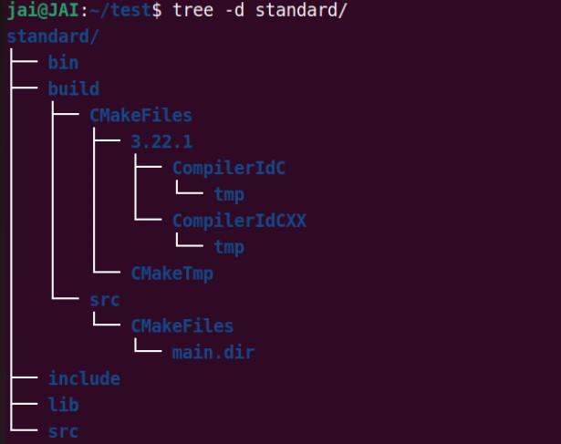
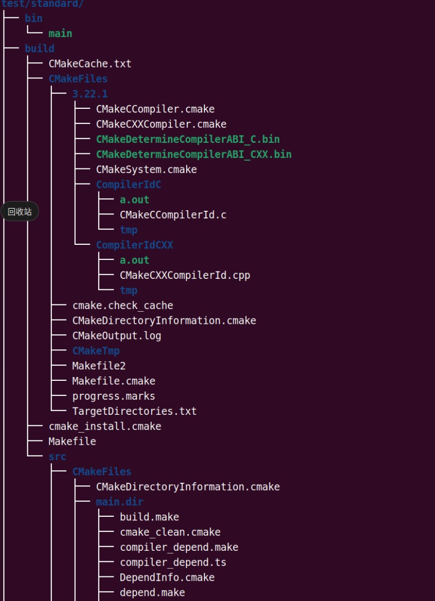
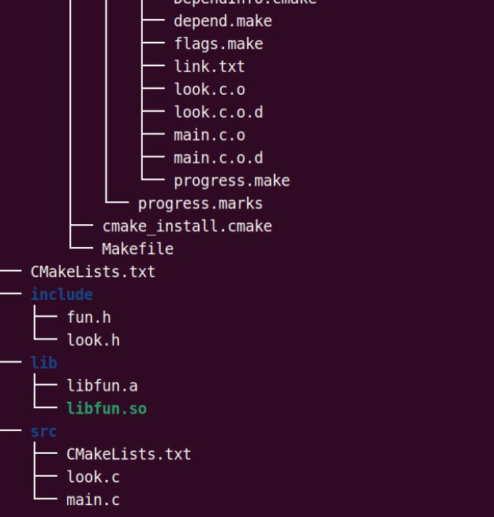

## Cmake

#### 基本操作

- 单文件 **(文件: hello)**

```C
//环境安装
$ sudo apt install cmake  //安装
  cmake 已经是最新版 (3.10.2-1ubuntu2.18.04.2)//默认jetson nano已安装
$ cmake -version  //查看版本
  cmake version 3.10.2	

//main.c
#include <stdio.h>

int main(void)
{
   printf("Hello World\n");
   return 0;
}	
//CMakeLists.txt
cmake_minimum_required (VERSION 2.8) #// cmake的最低版本要求是2.8，我们安装的是3.10.2
project (demo) #//工程名
add_executable(main main.c)	 #//由源文件main.c 生成执行文件main

//编译运行
$ cmake . //在当前目录，自动构建本平台编译需要的文件
          //自动生成文件有 CMakeCache.txt  CMakeFiles  cmake_install.cmake Makefile
$ make    //编译文件(用已自动生成的Makefile文件)
$ ./main  //运行执行程序
$ make clean //清楚编译中的生成文件(如 main.o main)
```

- 多个文件  **(文件: files)**

```C
//main.c
#include <stdio.h>
#include "fun.h"
int main(void)
{ 
  show(10);
  return 0;
}	
//fun.h
#ifndef _FUN_H_
#define _FUN_H_
void show(int data);
#endif	

//fun.c
#include <stdio.h>
#include "fun.h"
void show(int data)
{
   printf("data is %d\n", data);
}	

//CMakeLists.txt 版本1 -> 直接指定源文件
cmake_minimum_required (VERSION 2.8) #// cmake的最低版本要求是2.8，我们安装的是3.10.2
project (demo) #//工程名
add_executable(main main.c fun.c) #//根据源文件main.c fun.c 生成执行文件main

//CMakeLists.txt 版本2 -> 用变量 存放编译需要的源文件
cmake_minimum_required (VERSION 2.8) #// cmake的最低版本要求是2.8，我们安装的是3.10.2
project (demo) #//工程名
set( SRC_LIST  #//设置变量，存放的文件列表: 存放哪些源文件
	 ./main.c
	 ./fun.c
   )
add_executable(main ${SRC_LIST}) 
#// 变量使用用${}
#// 根据SRC_LIST中的源文件 生成执行文件main


# //CMakeLists.txt 版本3 -> 源文件很多时，不用逐个写
cmake_minimum_required (VERSION 2.8) #// cmake的最低版本要求是2.8，我们安装的是3.10.2
project (demo) #//工程名
aux_source_directory(. SRC_LIST) #//把当前目录下的源文件列表，存放到变量SRC_LIST里
add_executable(main ${SRC_LIST}) #//根据SRC_LIST中的源文件 生成执行文件main
```


#### 多目录  

- (**文件: dirs**)

```C
//CMakeLists.txt 
cmake_minimum_required (VERSION 2.8) #// cmake的最低版本要求是2.8，我们安装的是3.10.2
project (demo) #//工程名

include_directories (fun look)  #//指定头文件的搜索路径（先fun目录，再look目录)  一定要有,不然不知道源文件在哪里找

aux_source_directory (fun SRC_LIST_FUN)   #//把fun目录下的源文件列表，存放到变量SRC_LIST_FUN里
aux_source_directory (look SRC_LIST_LOOK) #//把look目录下的源文件列表，存放到变量SRC_LIST_LOOK里
add_executable (main main.c ${SRC_LIST_FUN} ${SRC_LIST_LOOK})


//look.h
#ifndef _LOOK_H_
#define _LOOK_H_

void look();
#endif	

//look.c
#include <stdio.h>
#include "look.h"

void look(void)
{
   printf("look go\n");
}	


//fun.h
#ifndef _FUN_H_
#define _FUN_H_
void show(int data);
#endif

//fun.c
#include <stdio.h>
#include "fun.h"

void show(int data)
{
   printf("data is %d\n", data);
}	

//main.c
#include <stdio.h>
#include "fun.h"
#include "look.h"
int main(void)
{
  show(10);
  look();
  return 0;
}	
```


#### 库生成

> 项目中, 怎么将库提供给别人用

- **(文件: create_lib)**

```c
//build   构建时的中间文件 (最后cmake文件时进入该文件 (cmake.. make) 避免生成的中间文件污染工程)
//lib     生成的库      //这个库就是厂商(写代码的人提供给别人的库文件)
//CMakeLists.txt
cmake_minimum_required (VERSION 2.8)
project (demo)
add_subdirectory (lib_src) 

//lib_src/fun.h
#ifndef _FUN_H_
#define _FUN_H_
void show(int data);
#endif
//lib_src/fun.c
#include <stdio.h>
#include "fun.h"
void show(int data)
{
  printf("data is %d\n", data);
}

//保密源码的功能：只提供了头文件别人，具体.c实现文件保密

//lib_src/CMakeLists.txt
aux_source_directory (. SRC_LIST)
add_library (fun_shared SHARED ${SRC_LIST}) #//根据SRC_LIST的源文件，生成动态库fun_shared，
add_library (fun_static STATIC ${SRC_LIST}) #//根据SRC_LIST的源文件，生成静态库fun_static，
set_target_properties (fun_shared PROPERTIES OUTPUT_NAME "fun") #//设置库的属性（如输出库名 版本号等)
set_target_properties (fun_static PROPERTIES OUTPUT_NAME "fun")
#//指定生成的库文件，存放在工程根目录下的lib目录
set (LIBRARY_OUTPUT_PATH ${PROJECT_SOURCE_DIR}/lib)

$ cd build
$ cmake ..   //进到build 目录后再cmake构建，避免生成中间文件，污染了工程
$ make
$ ls ../lib  //生成的库文件，在lib目录下	
   libfun.a  libfun.so	 
```


#### 库使用

- (文件: use_lib)

```C
//bin  最终输出的文件放在这里
//build   产生的中间文件放在这里，用cmake .. 访问上一级目录(..)的编写好的CMakeLists.txt
//lib  待使用的库   别人写好的库
 libfun.a  libfun.so   

     
//使用的命令:
     cp -r ../create_lib/lib_src/fun.h include/
     cp -r ../create_lib/lib lib //从之前写好的库文件copy到要用的工程里来
     

// 先设置顶层的CMakeLists.txt
cmake_minimum_required (VERSION 2.8)
project (demo)
add_subdirectory (src)	

//include/fun.h  库的头文件
#ifndef _FUN_H_
#define _FUN_H_
void show(int data);
#endif	

//src/main.c
#include <stdio.h>
#include "fun.h"
int main(void)
{
   show(10);
   return 0;
}	

//子目录的src/CMakeLists.txt
//注意每一行都是有顺序要求的，不能调换
aux_source_directory (. SRC_LIST) //指定源码路径  
include_directories (../include) //包含的头文件去哪里找   ..上一级文件
link_directories (${PROJECT_SOURCE_DIR}/lib) #// 关键 添加非标准的共享库搜索路径 库放在哪里
add_executable (main ${SRC_LIST})   //输出执行文件的名字
target_link_libraries (main fun)  #//链接库(默认链接动态库，无则链接静态:qQq库,也可指明链接fun.a)
set (EXECUTABLE_OUTPUT_PATH ${PROJECT_SOURCE_DIR}/bin)  //输出执行文件放在哪里 不然就放在当前目录了

```


#### 标准结构

> 在各种开源项目中, 工程文件的标准结构

- **(文件: standard)**

```C
//bin 输出的执行文件
//build 存放构建中的中间文件
//lib  库
   libfun.a  libfun.so

//CMakeLists.txt   cmake的总配置文件
cmake_minimum_required (VERSION 2.8) #// cmake的最低版本要求是2.8，我们安装的是3.10.2
project (demo) #//工程名
add_subdirectory (src) #//添加子目录(自动构建时，会进入src中找 子CMakeLists.txt)

//include/fun.h
#ifndef _FUN_H_
#define _FUN_H_
void show(int data);
#endif
//include/look.h
#ifndef _LOOK_H_
#define _LOOK_H_
void look();
#endif

//src/main.c
#include <stdio.h>
#include "fun.h"
#include "look.h"
int main(void)
{
  show(10);
  look();
  return 0;
}	

//src/look.c
#include <stdio.h>
#include "look.h"
void look(void)
{
  printf("look go\n");
}	

//src/CMakeLists.txt  cmake的子配置文件
aux_source_directory (. SRC_LIST) #//把当前目录下的源文件列表，存放到变量SRC_LIST里
include_directories (../include)  #//指定 上级目录下的include 为头文件的搜索路径
link_directories (${PROJECT_SOURCE_DIR}/lib) #//添加库搜索路径
add_executable (main ${SRC_LIST}) #//根据SRC_LIST中的源文件 生成执行文件main
target_link_libraries (main fun)  #//连接库(默认链接动态库，无则链接静态库,也可指明链接fun.a)
#//设定 执行文件的输出位置 为工程根目录下的bin目录
set (EXECUTABLE_OUTPUT_PATH ${PROJECT_SOURCE_DIR}/bin)	

//构建运行
$ cd build
$ cmake ..   //进到build 目录后再cmake构建，避免生成中间文件，污染了工程
$ make
$ cd ../bin  //执行文件是输出到 bin下  
$ ./main    
```







