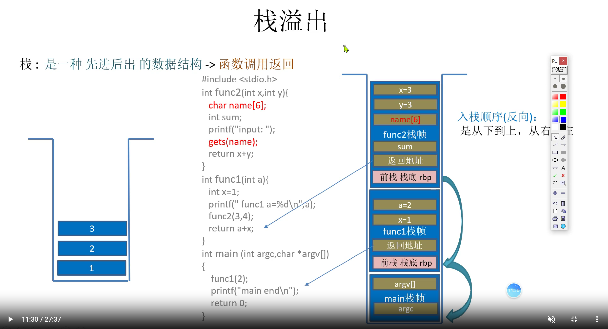
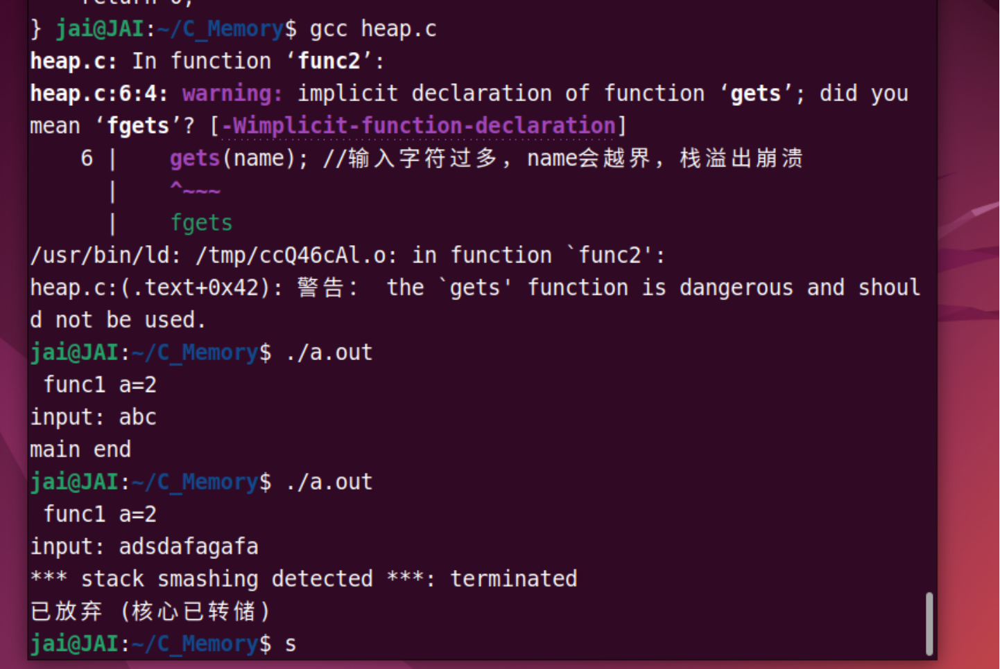
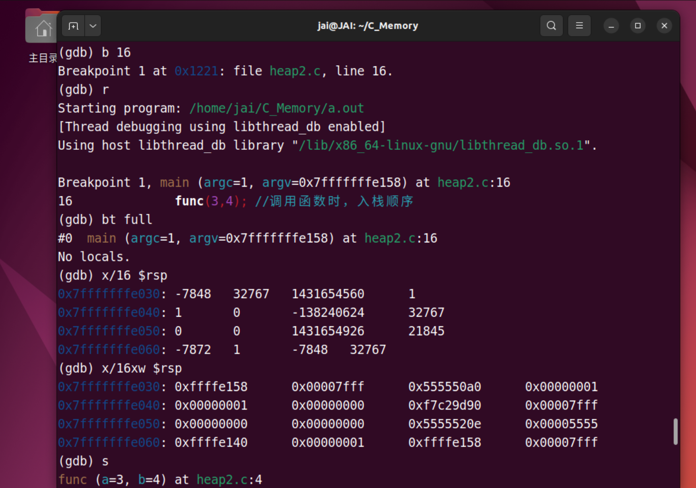
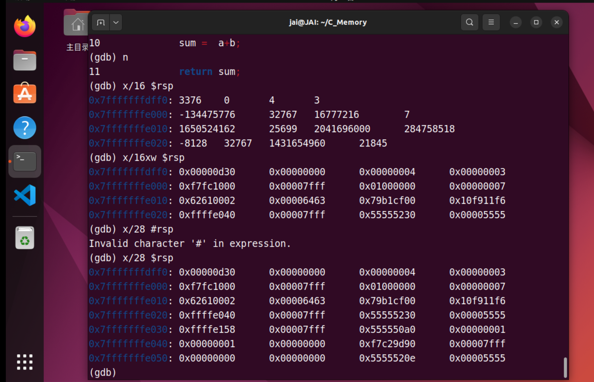
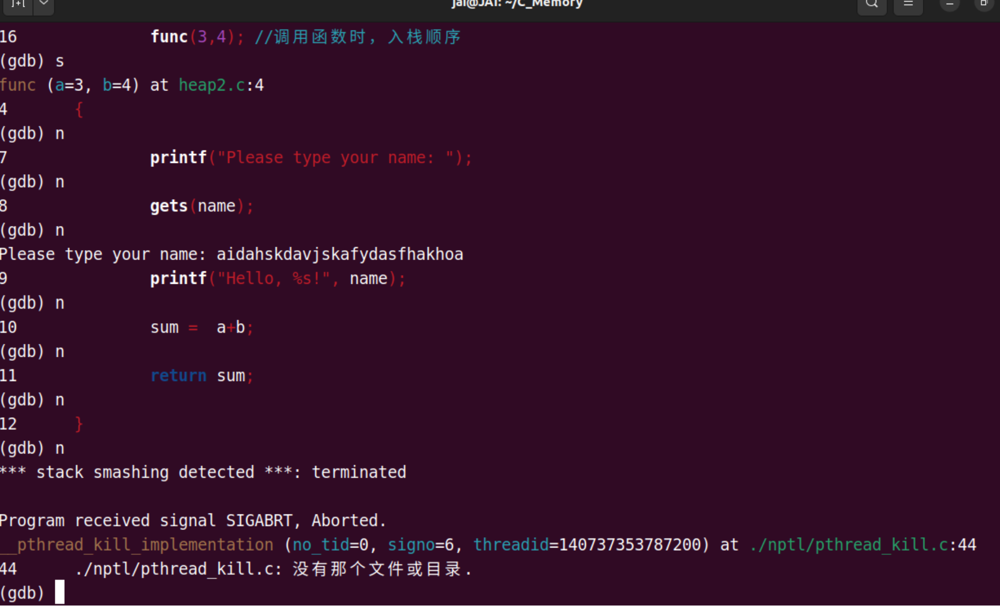
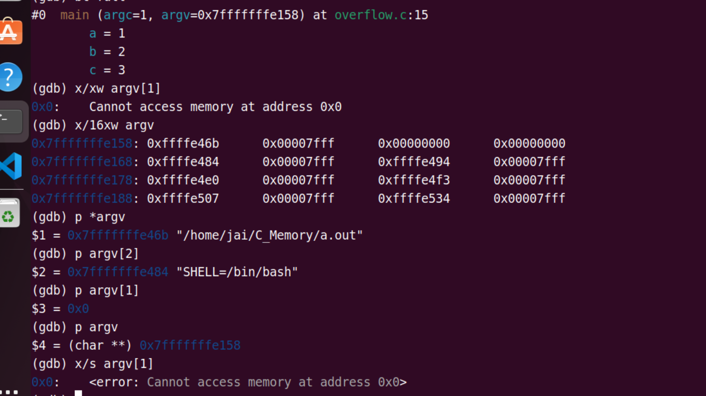

## Basic document

- [Quick Guide to gdb](https://www-users.cse.umn.edu/~kauffman/tutorials/gdb)
- [GDB Documentation](https://sourceware.org/gdb/documentation/)

现在有 AI 了，首先借助一个例子学会基本使用，再配合 AI 进阶使用，还需要去啃那些乏味枯燥的文档吗？值得思考，但我觉得仍需要，但配合AI能极大地提高效率！


## 基本操作--以栈溢出为例子

> 栈越界，覆盖别的数据  --> 提升调试能力

```C
//栈: 是一种 先进后出 的数据结构 -> 函数调用返回 
---    ---
  |    |
  | 3  | <-- rsp/esp 栈顶指针(进出栈时它会变化)
  | 2  | 
  | 1  | 
 -----  <-- rbp/ebp 栈底指针
```


#### 函数调用返回



> 入栈顺序: 一般是从函数的下面到上面, 参数从左到右 ( 由栈的特点FILO可知 )
>
> ==**(上面这个图有问题，返回地址和前栈栈底反过来了 )**==

```c
#include <stdio.h>
int func2(int x,int y){
   char name[6];
   int sum; 
   printf("input: "); 
   gets(name); //输入字符过多，name会越界，栈溢出崩溃
   return x+y;
}

int func1(int a){
   int x=1;
   printf(" func1 a=%d\n",a);
   func2(3,4);
   return a+x;
}

int main (int argc,char *argv[]) {
    func1(2);
    printf("main end\n");
    return 0;
} 
```




#### GDB调试

##### GDB基本操作

常用的GDB调试命令

```text
run 或 r：启动程序的执行。
break 或 b：设置断点。通过指定行号或函数名来设置断点，如 break main 或 break 10。
continue 或 c：继续执行程序，直到下一个断点或程序结束。
next 或 n：执行下一行代码，不进入函数调用。
step 或 s：执行下一行代码，并进入函数调用。
finish：运行到函数末尾。
print 或 p：打印变量或者寄存器的值。例如 print x。
examine 或者 x : 扫描内存信息 显示某地址的内存值 
info 或者 i: 显示内存信息
list 或者 l: 显示源码 
backtrace 或 bt：打印函数调用栈的信息。可以查看当前的调用栈，显示函数的调用关系
info locals：打印当前函数的局部变量。
info breakpoints：显示当前设置的所有断点。
delete：删除指定的断点。例如 delete 1。
watch：设置观察点/监视d，当变量的值发生改变时，程序会停下来。
quit 或 q：退出GDB调试。
```


> 这部分以后用来可以复习GDB的操作,顺便复习栈的存储, 在大脑中建立一张内存的地图	

```C
//测试函数
#include <stdio.h> 
//入栈顺序：是从下到上，从右至左，反向进栈
int func (int a,int b )   //4.b    5.a  (从右至左) 这里编译器优化了好像
{ 
	char name[6]; //3. name[]
	int sum;      //2.sum     从下到上
	printf("Please type your name: "); 
	gets(name); 
	printf("Hello, %s!", name);
	sum =  a+b;
	return sum; 
} 

int main (int argc,char *argv[]) 
{ 
	func(3,4); //调用函数时，入栈顺序
	           //1. 返回地址入栈( 如return 0; ) 
	return 0; 
}      
```

##### 1.  开始调试

```C
$ gcc -g -fno-stack-protector -z execstack  main.c	//编译时 关闭栈保护
$ gdb ./a.out
(gdb) l 1,25   //查看1到25行代码
(gdb) b 15     //断点设在第15行(char name[6]处)
(gdb) r        //全速运行

```



```C
// 看main的栈帧地址 argc = 1, argv = 0x7fffffffe158 对应地址 0x7ffffffe030
```

> 对于函数的参数，一般都是从右到左（argv[] ->argc）入栈的,  也就是右边的先入栈到栈底（也就是高地址）， 但是gdb调试出来的结果又不是这样？argc先入了栈？
>
> 可能是编译器优化的缘故

##### 2. 执行到哪里

```assembly
(gdb) i reg   //查看寄存器
              //rsp : 栈顶指针(进出栈时它会变化 ),有些cpu里叫esp
              //rbp : 栈底指针
              //rip : 指令指针(下一条 等待执行的 指令地址)
(gdb) x $rip  //查看rip寄存器内容 (知道程序执行到那了)
              // x/16x $rip   查看16个将要执行代码的机器码   
       
(gdb) disassembale main //反汇编main函数
Dump of assembler code for function main:
   0x000055555555520e <+0>:	endbr64 
   0x0000555555555212 <+4>:	push   %rbp
   0x0000555555555213 <+5>:	mov    %rsp,%rbp
   0x0000555555555216 <+8>:	sub    $0x10,%rsp
   0x000055555555521a <+12>:	mov    %edi,-0x4(%rbp)
   0x000055555555521d <+15>:	mov    %rsi,-0x10(%rbp)
       //func(3,4); 代码的内存位置和反汇编代码
   0x0000555555555221 <+19>:	mov    $0x4,%esi   //func 传参 4
   0x0000555555555226 <+24>:	mov    $0x3,%edi   //func 传参 3
   0x000055555555522b <+29>:	call   0x555555555189 <func>
       											   //跳到函数 func中 
   0x0000555555555230 <+34>:	mov    $0x0,%eax   //调用func后的返回地址
   0x0000555555555235 <+39>:	leave  
   0x0000555555555236 <+40>:	ret    
End of assembler dump.

```


##### 3. 栈查看

```c
//进入func函数后

(gdb) bt full  //查看全部的 函数调用栈信息
 #0  main (argc=1, argv=0x7fffffffe158) 
           //argc=1: 参数个数 1    对应 ./a.out
 	   //argv=0x7fffffffe158 参数指针数组起始位置  如 ./a.out  hello  word 时
 	   //argv[0] 对应 ./a.out字符串起始地址  argv[1] 对应 hello 字符串起始地址
	                            
(gdb) x $rbp    //查看栈底
  0x7fffffffdf90:	0x00000000 //main函数的栈低
(gdb) x/28 $rsp //查看栈顶 (进出栈时它会变化 ) 
      //28：查看从栈顶地址开始 连续28个int 内存单元
       eg.(gdb) x/20xw $rsp  (x:16进制，w:word) 这里的word 4z
      //入栈:   argv =0x7fffffffe158           字节对齐补0       argc=1
0x7fffffffdff0:	0x00000d30	0x00000000	0x00000004	0x00000003//这一行注意
0x7fffffffe000:	0xf7fc1000	0x00007fff	0x01000000	0x00000101
0x7fffffffe010:	0x00000002	0x00000000	0x078bfbff	0x00000000
0x7fffffffe020:	0xffffe040	0x00007fff	0x55555230	0x00005555//这一行注意
0x7fffffffe030:	0xffffe158	0x00007fff	0x555550a0	0x00000001//这一行注意
0x7fffffffe040:	0x00000001	0x00000000	0xf7c29d90	0x00007fff
0x7fffffffe050:	0x00000000	0x00000000	0x5555520e	0x00005555

```

进入到func函数之后,已经将func返回地址和main函数的栈帧入栈了

先记住一点, 程序不断向下运行, 栈顶指针(rsp)不断递减

所以, 从e030地址到e020地址. e020到e030地址的低地址部分里面存着main函数栈帧(e040).

高地址部分存着返回地址(0x555555555230), 这个地址可以参考2. 中的main函数的反汇编,查看call下面的那条mov指令的地址刚好就是0x555555555230


##### 4.  进一步调试

> 查看覆盖内存
>
> 输入name[6] 

- 未覆盖(输入了abc) 



地址: 0x7fffffffe010存的内容:abcd

- 覆盖



直接无法返回


##### 5. 大脑中建立内存图


> **上图的返回地址和前栈栈底反过来了**

```C
--------4G---------0xFFFFFFFF  高地址
|      -----      | 0xffffffffff601000  
|       内核      |   
|      -----      | 0xffffffffff600000  //内核系统调用 起始地址
|                 |   
========3G=========0xC0000000
|                 |
|-----------------| 0x7ffffffde050  //系统栈的起始地址: 栈是向下生长
|    栈(stack)    |    
|    --------     | 0x7fffffffe040  //main函数的栈底
|   0x00000001    | //argc=1   调用main函数时入栈 
|   0x00000000    | //字节对齐  
|   0x00007fff    | //argv=0x7fffffffe158 指针数组首地址(64位机 8字节 小端)
|   0xffffe158    | 0x7fffffffe030
|    -------      | //当main函数栈进完后，会rbp存入下一地址中，把下一地址存入rbp中，作为新栈的栈底        
|   0x55555230    | //返回地址： 调用func后，返回到main的地址
|   0x00005555    |  
|   0xffffe040    | //func函数的栈底：存储的上一栈的栈底(main函数的栈底 8字节)  
|   0x00007fff    | 0x7fffffffe020
|   0x10f911f6    |
|   0x79b1cf00    | //sum 局部变量(未初始化)入栈  -> 从下到上，从右至左进栈
|   0x00006463    |
|   0x62610002    | 0x7fffffffe010 //name[6]
|   0x00007fff    |
|   0xf7facfc8    | 0x7fffffffe000  //补全
|   0x00000003    |  //实参拷贝到形参 b=4 a=3; 
|   0x00000004	  |                
|-----------------| 0x7ffffffff000 
|                 |
|      .....      |          
|                 |
|-----------------|
|    堆(heap)     |   
-------------------
|    DATA数据段   | 
-------------------
|                 |
|      -----      | 0x555555558000 
|   代码区(只读)   | 
|      -----      | 0x555555554000  //a.out 程序的 起始地址
|                 | 
-------------------0x00000000 低地址	
```


#### GDB 实际运用1

```C
/*
当运行  ./a.out abcd 正常
当运行  ./a.out abcdefghijkomk 时 溢出崩溃
尝试用gdb调试分析 栈溢出 的过程
*/
#include <stdio.h>
#include <string.h>

void function2(){
    printf("Execution flow changed\n");
}
void function1(char *str){
    char buffer[5];
    strcpy(buffer,str);
}
void main(int argc,char *argv[]){
   int a=1;
   int b=2;
   int c=3;
    function1(argv[1]);
    printf("%s\n","Executed normally");
}	
```

##### 前置知识

在C语言中，`main`函数是程序的入口点，也是程序开始执行的地方。它接受两个参数：`argc`和`argv`。

- `argc`（argument count）是一个整数，表示命令行参数的数量。它包括程序名称本身作为第一个参数。例如，如果在命令行中运行程序时输入了3个参数，那么`argc`的值将为4。
- `argv`（argument vector）是一个指向字符串数组的指针，其中每个字符串都是一个命令行参数。数组中的第一个元素（`argv[0]`）是程序的名称，后续元素（`argv[1]`、`argv[2]`等）是传递给程序的实际参数。

在Ubuntu下运行程序时，可以通过命令行输入参数。例如，假设你的程序名为`myprogram`，你可以在终端中输入以下命令来运行程序并传递参数：

```
./myprogram arg1 arg2 arg3
```

在这个例子中，`argc`的值将为4，`argv`的值将是一个指向包含`"./myprogram"、"arg1"、"arg2"、"arg3"`的字符串数组的指针。

在代码中，`main`函数的参数`argc`和`argv`被用来接收命令行参数。`argc`用于检查传递给程序的参数数量是否足够，`argv[1]`用于传递给`function1`函数的参数。


##### 分析

> 当运行  ./a.out abcd 正常
> 当运行  ./a.out abcdefghijkomk 时 溢出崩溃
>
> 可以看出, 就是命令行参数的问题.
>
> 数组只有5个空间,但是命令行参数太多了,导致溢出





##### 改进

| 问题               | 描述                                          | 修复方法                                   |
| ------------------ | --------------------------------------------- | ------------------------------------------ |
| 缓冲区溢出         | `function1`中的`strcpy`函数可能导致缓冲区溢出 | 使用`strncpy`函数，并指定目标数组的大小    |
| 缺少命令行参数检查 | `main`函数中没有检查命令行参数的数量          | 添加对`argc`的检查，确保有足够的命令行参数 |

```C
void function1(char *str){
    char buffer[5];
    strncpy(buffer, str, sizeof(buffer)-1);
    buffer[sizeof(buffer)-1] = '\0';
}
//main 函数中:
    if (argc < 2){
        printf("Insufficient command line arguments\n");
        return 1;
    }
```


#### GDB 实际运用2

**挑战：用栈溢出漏洞，不知道密码情况下，如何验证通过**

```c
#include <stdio.h>
#include <string.h>
#define PASS_WORD "1234567" 

int verify_password(char * password)
{
    int authentitated;
    char buffer[8];
    authentitated = strcmp(password,PASS_WORD);
    strcpy(buffer,password);
    return authentitated;
}

int main()
{
    int valid_flag = 0;
    char password[1024] = {0};
    while (1)
    {
        printf("please input password:");
        scanf("%s",password);
        valid_f lag = verify_password(password);
        if(valid_flag)
        {
            printf("incorrect password!\r\n");
        }
        else
        {
            printf("Congratulation ! you have passed the verification !\r\n");
        }
    }
    return 0;
}
```

**目前卡住**


## 美化

按照自己的需求定制才是最重要的，

gdb-dashboard

[神仙GDB调试工具 gdb-dashboard - 知乎](https://zhuanlan.zhihu.com/p/435918702)

[GDB命令行调试指南 - 操作系统2024秋 | 哈工大（深圳）](https://os-labs.pages.dev/gdb/#32-dashboard)


## 进阶使用

关键的 **prompt**：

**我在做 [X]。如果你是一位专业人士，有更好的方法和建议吗？尽可能全面。**

在命令行中使用 GDB 调试时，以下是一些专业建议：

1. **使用 TUI 模式**：
    `gdb -tui` 或 `Ctrl+X+A` 启用文本用户界面，同时查看源代码和调试信息。
2. **设置断点**：
    - `break <function>` 在函数入口设置断点。
    - `break <file>:<line>` 在指定文件的某行设置断点。
3. **条件断点**：
    `break <location> if <condition>` 设置条件断点，仅在满足条件时中断。
4. **查看变量**：
    - `print <variable>` 查看变量值。
    - `display <variable>` 每次停止时自动显示变量值。
5. **多线程调试**：
    - `info threads` 查看所有线程。
    - `thread <id>` 切换到指定线程。
6. **回溯调用栈**：
    `bt` 查看当前调用栈，`frame <number>` 切换到指定栈帧。
7. **反汇编**：
    `disassemble` 查看当前函数的汇编代码。
8. **使用 GDB 脚本**：
    将常用命令写入 `.gdbinit` 文件，自动加载配置。
9. **调试核心转储**：
    `gdb <executable> <corefile>` 分析程序崩溃时的核心转储文件。
10. **优化调试体验**：
    - `set pagination off` 禁用分页。
    - `set logging on` 记录调试输出到文件。

这些方法可以显著提高调试效率，帮助你更快定位问题。

有些技巧真的是很有用！找机会具体用起来！


