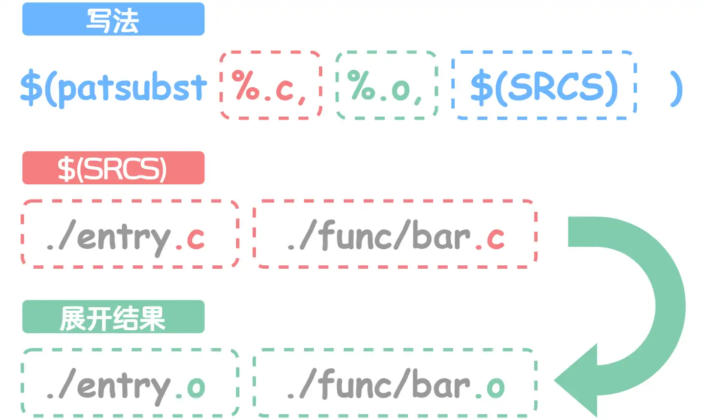

## Makefile

#### 入门

[写给初学者的Makefile入门指南 - 知乎 (zhihu.com)](https://zhuanlan.zhihu.com/p/618350718)

[深入浅出Makefile：从基础到高级应用](https://mp.weixin.qq.com/s/jndf5HMEqT-OAa82LytkYw)

经常记不住：

- `wildcard` 函数

    我们需要匹配有共同模式的源文件的时候，可以用这个。如下：

    仔细观察源文件的命名 `main.c` 、 `bar.c`，我们会发现它们有着共同的模式（或称为规律）：都以 `.c` 结尾，

    则在 Makefile 中我们可以使用 wildcard 函数（wildcard function）来达到这一目的。

    Makefile 中变量定义的形式与C语言类似：`var := value`，调用则和函数调用类似：`$(var)`，所以 `Makefile` 可以进一步修改为：

    ```text
    # Makefile
    SRCS := $(wildcard *.c)
    
    main : $(SRCS)
            gcc $(SRCS) -o main
    ```

    > 只能匹配在当前目录下的文件（不包括子目录，如果还有子目录，要手动添加）


- `foreach` 函数

    接下来我们将请出另一个功能强大的函数 foreach 来帮助我们完成一项复杂的功能。

    ```text
    $(foreach var,list,text)
    ```

    foreach(for each)函数的功能与 Python 和C语言中的 for 循环类似，但会更接近 Python 的 for 循环。它的功能描述起来就是：从 `list` 中逐个取出元素，赋值给 `var`，然后再展开 `text`。下面是一个使用示例：

    ```text
    SUBDIR := .
    SUBDIR += ./func
    
    EXPANDED := $(foreach dir,$(SUBDIR),$(dir)/*.c)
    # 等效于EXPANDED := ./*.c ./func/*.c
    ```

    

    

    有了 foreach 函数，我们就能配合 wildcard 函数，通过指定路径来获取源文件，并指定头文件所在路径：

    ```text
    # Makefile
    SUBDIR := .
    SUBDIR += ./func
    
    INCS := $(foreach dir,$(SUBDIR),-I$(dir))
    SRCS := $(foreach dir,$(SUBDIR),$(wildcard $(dir)/*.c))
    
    main : $(SRCS)
            gcc $(INCS) $(SRCS) -o main
    ```

    在终端里试试效果（可以使用 `rm ./main` 移除可执行文件，来确保 `make` 会执行编译命令）：

    ```text
    gee@JiPing_Desktop:~/workspace/example$ vim ./Makefile
    gee@JiPing_Desktop:~/workspace/example$ rm ./main
    gee@JiPing_Desktop:~/workspace/example$ make
    gcc -I. -I./func ./entry.c ./func/bar.c -o main
    ```

    它可以正常工作，且效果与之前是一致的。现在来看，指定路径的做法较之前并没有太大的优势，我们要做的仍是手动指定目录，只是将获取源文件的任务交给了 foreach 函数来完成。在后面，我们会继续深入了解 Makefile，到时指定路径的优势会逐渐显现。


- `patsubst` 函数

    我们关注链接步骤，它需要指定 `*.o` 文件：

    ```text
    main : ./entry.o ./func/bar.o
            gcc ./entry.o ./func/bar.o -o main
    ```

    这看起来十分眼熟，我们最初解决多文件编译问题时也是采用类似的写法，只有文件后缀不一样：

    ```text
    main : ./entry.c ./func/bar.c
            gcc ./entry.c ./func/bar.c -o main
    ```

    这给了我们一点提示，是不是能够通过 wildcard 函数来实现通用的写法？可惜的是，在最开始我们是无法匹配到 `*.o` 文件的，因为起初我们只有 `*.c` 文件， `*.o` 文件是后来生成的。但转换一下思路，我们在获取所有源文件后，直接将 `.c` 后缀替换为 `.o`，不就能得到所有的 `.o` 文件了吗？**正巧 patsubst 函数可以用于模式文本替换。**

    ```text
    $(patsubst pattern,replacement,text)
    ```

    patsubst 函数的作用是匹配 `text` 文本中与 `pattern` 模式相同的部分，并将匹配内容替换为 `replacement`。于是链接步骤可以改写为：

    ```text
    SRCS := $(foreach dir,$(SUBDIR),$(wildcard $(dir)/*.c))
    OBJS := $(patsubst %.c,%.o,$(SRCS))
    
    main : $(OBJS)
            gcc $(OBJS) -o main
    ```

    

    

    Makefile中的patsubst函数

    

    这里我们先用 wildcard 函数获取所有的 `.c` 文件，并将结果保存在 `SRCS` 中，接着利用 patsubst 函数替换 `SRCS` 的内容，最后将所有的 `.c` 替换为 `.o` 以获得执行编译所得到的目标文件。

    于是我们的 `Makefile` 就可以改写为：

    ```text
    SUBDIR := .
    SUBDIR += ./func
    
    INCS := $(foreach dir,$(SUBDIR),-I$(dir))
    SRCS := $(foreach dir,$(SUBDIR),$(wildcard $(dir)/*.c))
    OBJS := $(patsubst %.c,%.o,$(SRCS))
    
    main : $(OBJS)
            gcc $(OBJS) -o main
    
    %.o : %.c
            gcc -c $(INCS) $< -o $@
    ```


- 变量赋值和修改：

    上面的赋值符号 `:=` ，该符号与C语言中的赋值符号 `=` 作用效果相同。以下是几个常用符号的简介：

    - `=` ：递归赋值[(Recursively Expanded Variable Assignment)](https://link.zhihu.com/?target=https%3A//www.gnu.org/software/make/manual/html_node/Recursive-Assignment.html)，使用变量进行赋值时，会优先展开引用的变量，示例如下：

    ```text
    foo = $(bar)
    bar = $(ugh)
    ugh = Huh?
    
    all:;echo $(foo)
    # 打印的结果为 Huh?，$(foo)展开得到$(bar)，$(bar)展开得到$(ugh)，$(ugh)展开得到Huh?最终$(foo)展开得到Huh?
    ```

    - `:=` ：简单赋值[(Simply Expanded Variable Assignment)](https://link.zhihu.com/?target=https%3A//www.gnu.org/software/make/manual/html_node/Simple-Assignment.html)，最常用的赋值符号：

    ```text
    x := foo
    y := $(x) bar
    x := later
    # 等效于：
    # y := foo bar
    # x := later
    ```

    - `+=` ：文本增添[(Appending)](https://link.zhihu.com/?target=https%3A//www.gnu.org/software/make/manual/html_node/Appending.html)，用于向已经定义的变量添加文本：

    ```text
    objects = main.o foo.o bar.o utils.o
    objects += another.o
    # objects最终为main.o foo.o bar.o utils.o another.o
    ```

    - `?=` ：条件赋值[(Conditional Variable Assignment)](https://link.zhihu.com/?target=https%3A//www.gnu.org/software/make/manual/html_node/Conditional-Assignment.html)，仅在变量没有定义时创建变量：

    ```text
    FOO ?= bar
    # FOO最终为bar
    foo := ugh
    foo ?= Huh?
    # foo最终为ugh
    ```


- **自动化变量**

    Makefile提供了一系列自动化变量，它们在规则的命令中非常有用：

    - **$@ 表示规则中的目标文件名；**

    - **$^ 表示所有的依赖文件列表；**

    - **$< 表示第一个依赖文件；**

    - **$? 表示所有比目标新的依赖文件列表。**

        ```makefile
        # 理解：
        main.c - 主程序文件
        utils.c - 工具函数文件
        utils.h - 工具函数头文件
        Makefile - 包含自	动化变量的Makefile文件
        接下来，让我们来看看如何使用这些自动化变量在Makefile中实现编译。
        
        # Makefile示例
        
        # 定义编译器和编译选项
        CC = gcc
        CFLAGS = -Wall
        
        # 定义目标文件
        TARGET = myapp
        
        # 默认规则
        all: $(TARGET)
        
        # 生成目标文件
        $(TARGET): main.o utils.o
        	$(CC) $(CFLAGS) $^ -o $@
        
        # 生成main.o
        main.o: main.c utils.h
        	$(CC) $(CFLAGS) -c $< -o $@
        
        # 生成utils.o
        utils.o: utils.c utils.h
        	$(CC) $(CFLAGS) -c $< -o $@
        
        # 清理规则
        clean:
        	rm -f $(TARGET) *.o
        在这个示例的Makefile中，我们使用了自动化变量来简化规则的命令。具体来说：
        
        $@ 在这里表示目标文件名，即myapp；
        $^ 表示所有的依赖文件列表，即main.o utils.o；
        $< 表示第一个依赖文件，例如在生成main.o时表示main.c；
        $? 表示所有比目标新的依赖文件列表，这在某些情况下可能会用到。
        ```

        


#### 实操分析

- 树形图

    ```makefile
    .
    ├── bin
    ├── build
    │   ├── libex29.a
    │   └── libex29.so
    ├── LICENSE
    ├── Makefile
    ├── README.md
    ├── src
    │   ├── dbg.h
    │   ├── libex29.c
    │   └── libex29.o
    └── tests
        ├── ex29_tests
        ├── ex29_tests.c
        ├── runtests.sh
        └── tests.log
    
    ```

    Makefile：

    ```makefile
    CFLAGS=-g -O2 -Wall -Wextra -Isrc -rdynamic -DNDEBUG $(OPTFLAGS)
    LIBS=-ldl $(OPTLIBS)
    PREFIX?=/usr/local
    
    SOURCES=$(wildcard src/**/*.c src/*.c)
    OBJECTS=$(patsubst %.c,%.o,$(SOURCES))
    
    TEST_SRC=$(wildcard tests/*_tests.c)
    TESTS=$(patsubst %.c,%,$(TEST_SRC))
    
    TARGET=build/libex29.a
    SO_TARGET=$(patsubst %.a,%.so,$(TARGET))
    
    
    # The above makefile is mainly to define some variables, rules, and initialize some goals
    # The Target Build
    all: $(TARGET) $(SO_TARGET) tests
    
    dev: CFLAGS=-g -Wall -Isrc -Wall -Wextra $(OPTFLAGS)
    dev: all
    
    $(TARGET): CFLAGS += -fPIC
    $(TARGET): build $(OBJECTS)
    	ar rcs $@ $(OBJECTS)
    	ranlib $@
    
    $(SO_TARGET): $(TARGET) $(OBJECTS)
    	$(CC) -shared -o $@ $(OBJECTS)
    
    build:
    	@mkdir -p build
    	@mkdir -p bin
    
    # The Unit Tests
    .PHONY: tests
    tests: CFLAGS += -Isrc
    tests: $(TESTS)
    	sh ./tests/runtests.sh
    
    valgrind:
    	VALGRIND="valgrind --log-file=/tmp/valgrind-%p.log" $(MAKE)
    
    # The Cleaner
    clean:
    	rm -rf build $(OBJECTS) $(TESTS)
    	rm -f tests/tests.log
    	find . -name "*.gc*" -exec rm {} \;
    	rm -rf `find . -name "*.dSYM" -print`
    
    # The Install
    install: all
    	install -d $(DESTDIR)/$(PREFIX)/lib/
    	install $(TARGET) $(DESTDIR)/$(PREFIX)/lib/
    
    # The Checker
    BADFUNCS='[^_.>a-zA-Z0-9](str(n?cpy|n?cat|xfrm|n?dup|str|pbrk|tok|_)|stpn?cpy|a?sn?printf|byte_)'
    check:
    	@echo Files with potentially dangerous functions.
    	@egrep $(BADFUNCS) $(SOURCES) || true
    
    ```

[实际工作开发中C语言工程的目录结构分析_c项目目录结构-CSDN博客](https://blog.csdn.net/weixin_42031299/article/details/126187145)

- 目录结构

    ```bash
    	Trunk英文意思就是躯干、主体的意思，在SVN中申请代码仓库一般都是Trunk名字的文件夹。
    	./Trunk/
    	├── bin	
    	├── build
    	│   ├── Makefile
    	├── lib
    	├── docs
    	├── include
    	│   ├── inner
    	│   ├── xxx1
    	│   └── xxx2
    	├── patch
    	├── src
    	├── test
    	└── tool
    ```

|    目录    |                           存放内容                           |
| :--------: | :----------------------------------------------------------: |
|    bin     |     存放产物的目录，产物可能是静态库、动态库、可执行程序     |
|   build    | 存放Makefile，Makefile大致分为编译动态库、静态库，和编译可执行程序，参考博客：《静态库和动态库介绍以及Makefile》 |
|    lib     |                编译过程中依赖的动态库、静态库                |
|    docs    |   存放工程的设计文档、资料等，便于后续维护人员理解整个工程   |
|  include   |                       存放头文件的目录                       |
|   inner    |                  一般是工程内部使用的头文件                  |
| xxx1和xxx2 | 代表存放需要和其他工程交互的头文件目录，一般是采用映射的方式保持同步 |
|   patch    |                         存放补丁文件                         |
|    src     |                          存放源文件                          |
|    test    |                      存放工程的测试代码                      |
|    tool    |                      编译工程依赖的工具                      |


#### 进阶

```makefile
#***************************************************************************************
# Copyright (c) 2014-2022 Zihao Yu, Nanjing University
#
# NEMU is licensed under Mulan PSL v2.
# You can use this software according to the terms and conditions of the Mulan PSL v2.
# You may obtain a copy of Mulan PSL v2 at:
#          http://license.coscl.org.cn/MulanPSL2
#
# THIS SOFTWARE IS PROVIDED ON AN "AS IS" BASIS, WITHOUT WARRANTIES OF ANY KIND,
# EITHER EXPRESS OR IMPLIED, INCLUDING BUT NOT LIMITED TO NON-INFRINGEMENT,
# MERCHANTABILITY OR FIT FOR A PARTICULAR PURPOSE.
#
# See the Mulan PSL v2 for more details.
#**************************************************************************************/

# Sanity check
ifeq ($(wildcard $(NEMU_HOME)/src/nemu-main.c),)
  $(error NEMU_HOME=$(NEMU_HOME) is not a NEMU repo)
endif

# Include variables and rules generated by menuconfig
-include $(NEMU_HOME)/include/config/auto.conf
-include $(NEMU_HOME)/include/config/auto.conf.cmd

remove_quote = $(patsubst "%",%,$(1))

# Extract variabls from menuconfig
GUEST_ISA ?= $(call remove_quote,$(CONFIG_ISA))
ENGINE ?= $(call remove_quote,$(CONFIG_ENGINE))
NAME    = $(GUEST_ISA)-nemu-$(ENGINE)

# Include all filelist.mk to merge file lists
FILELIST_MK = $(shell find -L ./src -name "filelist.mk")
include $(FILELIST_MK)

# Filter out directories and files in blacklist to obtain the final set of source files
DIRS-BLACKLIST-y += $(DIRS-BLACKLIST)
SRCS-BLACKLIST-y += $(SRCS-BLACKLIST) $(shell find -L $(DIRS-BLACKLIST-y) -name "*.c")
SRCS-y += $(shell find -L $(DIRS-y) -name "*.c")
SRCS = $(filter-out $(SRCS-BLACKLIST-y),$(SRCS-y))

# Extract compiler and options from menuconfig
CC = $(call remove_quote,$(CONFIG_CC))
CFLAGS_BUILD += $(call remove_quote,$(CONFIG_CC_OPT))
CFLAGS_BUILD += $(if $(CONFIG_CC_LTO),-flto,)
CFLAGS_BUILD += $(if $(CONFIG_CC_DEBUG),-Og -ggdb3,)
CFLAGS_BUILD += $(if $(CONFIG_CC_ASAN),-fsanitize=address,)
CFLAGS_TRACE += -DITRACE_COND=$(if $(CONFIG_ITRACE_COND),$(call remove_quote,$(CONFIG_ITRACE_COND)),true)
CFLAGS  += $(CFLAGS_BUILD) $(CFLAGS_TRACE) -D__GUEST_ISA__=$(GUEST_ISA)
LDFLAGS += $(CFLAGS_BUILD)

# Include rules for menuconfig
include $(NEMU_HOME)/scripts/config.mk

ifdef CONFIG_TARGET_AM
include $(AM_HOME)/Makefile
LINKAGE += $(ARCHIVES)
else
# Include rules to build NEMU
include $(NEMU_HOME)/scripts/native.mk
endif

```

```makefile
jai@JAI:~/ysyx-workbench/nemu$ cat scripts/build.mk 
.DEFAULT_GOAL = app

# Add necessary options if the target is a shared library
ifeq ($(SHARE),1)
SO = -so
CFLAGS  += -fPIC -fvisibility=hidden
LDFLAGS += -shared -fPIC
endif

WORK_DIR  = $(shell pwd)
BUILD_DIR = $(WORK_DIR)/build

INC_PATH := $(WORK_DIR)/include $(INC_PATH)
OBJ_DIR  = $(BUILD_DIR)/obj-$(NAME)$(SO)
BINARY   = $(BUILD_DIR)/$(NAME)$(SO)

# Compilation flags
ifeq ($(CC),clang)
CXX := clang++
else
CXX := g++
endif
LD := $(CXX)
INCLUDES = $(addprefix -I, $(INC_PATH))
CFLAGS  := -O2 -MMD -Wall -Werror $(INCLUDES) $(CFLAGS)
LDFLAGS := -O2 $(LDFLAGS)

OBJS = $(SRCS:%.c=$(OBJ_DIR)/%.o) $(CXXSRC:%.cc=$(OBJ_DIR)/%.o)

# Compilation patterns
$(OBJ_DIR)/%.o: %.c
	@echo + CC $<
	@mkdir -p $(dir $@)
	@$(CC) $(CFLAGS) -c -o $@ $<
	$(call call_fixdep, $(@:.o=.d), $@)

$(OBJ_DIR)/%.o: %.cc
	@echo + CXX $<
	@mkdir -p $(dir $@)
	@$(CXX) $(CFLAGS) $(CXXFLAGS) -c -o $@ $<
	$(call call_fixdep, $(@:.o=.d), $@)

# Depencies
-include $(OBJS:.o=.d)

# Some convenient rules

.PHONY: app clean

app: $(BINARY)

$(BINARY):: $(OBJS) $(ARCHIVES)
	@echo + LD $@
	@$(LD) -o $@ $(OBJS) $(LDFLAGS) $(ARCHIVES) $(LIBS)

clean:
	-rm -rf $(BUILD_DIR)

```

> 综合之前的分析：
>
> 当然可以。首先，Makefile是一个构建自动化工具，它定义了一系列的规则来指定哪些文件需要先编译，哪些文件依赖于哪些文件，以及如何编译它们。
>
> 1. **条件判断（条件语句）**:
>
>     - 在第一个Makefile片段中，使用了`ifeq`条件判断语句来检查`NEMU_HOME`变量是否指向了一个有效的NEMU代码库。如果条件不满足，使用`$(error ...)`函数来报错。
>     - 这种条件判断在Makefile中非常常见，用于根据不同的编译环境或配置选项来调整编译过程。
>
> 2. **包含配置文件**:
>
>     - 使用`-include`指令来包含由`menuconfig`系统生成的配置文件。`menuconfig`是一个交互式配置工具，用于简化复杂的配置选项。
>     - 这种包含外部文件的做法使得Makefile更加模块化，易于管理和维护。
>
> 3. **变量处理函数**:
>
>     - 定义了一个名为`remove_quote`的函数，用于去除变量值中的引号。这是Makefile的一个高级特性，称为函数（或称为简化函数）。
>     - 函数可以在Makefile中定义，用于简化复杂的文本处理操作。
>
> 4. **文件搜索和过滤**:
>
>     - 使用`find`命令来搜索所有的`filelist.mk`文件，并将它们包含进来。这是一种自动化地处理文件列表的方法。
>     - 通过`filter-out`函数过滤掉黑名单中的目录和文件，得到最终需要编译的源文件列表。
>
> 5. **编译器和编译选项**:
>
>     - 从`menuconfig`中提取编译器(`CC`)和编译选项(`CFLAGS_BUILD`)，并根据其他配置项调整编译选项。
>     - 这种动态设置编译选项的方法使得编译过程可以根据不同的需求进行调整。
>
> 6. **目标架构和构建规则**:
>
>     - 根据是否配置了目标架构(`CONFIG_TARGET_AM`)，选择包含不同的构建规则文件。这允许Makefile支持多种目标架构。
>
> 7. **多目标构建**:
>
>     - 在第二个Makefile片段中，定义了多个目标，如`all`、`dev`、`tests`等，每个目标都可以独立执行。
>     - 这种多目标构建使得用户可以根据需要执行不同的构建任务，例如只编译库文件、只运行测试或者安装到系统中。
>
> 8. **静态库和动态库的构建**:
>
>     - 定义了构建静态库(`$(TARGET)`)和动态库(`$(SO_TARGET)`)的规则。这是 `Makefile` 中常见的用法，用于生成不同类型的库文件。
>
> 9. **单元测试**:
>
>     - 定义了`tests`目标，用于编译并运行单元测试。这是确保代码质量的重要步骤。
>
> 10. **清理和安装**:
>
>     - 提供了`clean`目标来清理所有生成的文件，以及`install`目标来将编译好的文件安装到系统中。
>
> 11. **安全性检查**:
>
>     - 通过`check`目标使用`egrep`命令来检查源代码中可能存在安全风险的函数调用。这是一种提高代码安全性的做法。
>
> 12. 自定义函数
>
>     - `$(call call_fixdep, $(@:.o=.d), $@)`：这是一个自定义函数调用的语法，用来动态地调用名为`call_fixdep`的函数。该函数的参数是`$(@:.o=.d)`和`$@`。
>
>         > `call_fixdep`的调用用于生成更合理的依赖关系, 目前我们主要关注编译的命令, 因此可以先忽略`call_fixdep`

> 我一开始好像不了解不太明白这种构建，实际上，这只是最顶层的一个 `Makefile`，在不同的子文件夹里面还有更多 `Makefile`，那些 `Makefile` 就是之前学 `lcthw` 那些样子的 `Makefile` 了。


#### 模板1（简单项目）

```makefile
CFLAGS=-g -O2 -Wextra -Isrc -rdynamic -DNDEBUG $(OPTFLAGS)
LIBS=-ldl $(OPTLIBS)
PREFIX?=/usr/local

SOURCES=$(wildcard src/**/*.c src/*.c)
OBJECTS=$(patsubst %.c,%.o,$(SOURCES))

TEST_SRC=$(wildcard tests/*_tests.c)
TESTS=$(patsubst %.c,%,$(TEST_SRC))
# 这次的问题应该是头文件的问题，要加上特定的目录？
TARGET=build/liblcthw.a
SO_TARGET=$(patsubst %.a,%.so,$(TARGET))


# The Target Build
all: $(TARGET) $(SO_TARGET) tests 

dev: CFLAGS=-g -Wall -Isrc -Wall -Wextra $(OPTFLAGS)
dev: all


#
$(TARGET): CFLAGS += -fPIC
$(TARGET): build $(OBJECTS)
	ar rcs $@ $(OBJECTS)
	ranlib $@
#	$(CC) $(CFLAGS) $(TEST_SRC) $(TARGET) -o tests/list_algos_tests


$(SO_TARGET): $(TARGET) $(OBJECTS)
	$(CC) -shared -o $@ $(OBJECTS)

build:
	@mkdir -p build
	@mkdir -p bin

# The Unit Tests
.PHONY: tests
tests: CFLAGS += -Isrc
tests: $(TESTS)
$(TESTS): $(TARGET) $(TEST_SRC) 
	$(CC) $(CFLAGS) $@.c  -o $@  $(TARGET)
	sh ./tests/runtests.sh

#这样子编译顺序就没有问题了 详细见笔记

sh_TEST:
	sh ./tests/runtests.sh

valgrind:
	VALGRIND="valgrind --log-file=/tmp/valgrind-%p.log" $(MAKE)

# The Cleaner
clean:
	rm -rf build $(OBJECTS) $(TESTS)
	rm -f tests/tests.log
	find . -name "*.gc*" -exec rm {} \;
	rm -rf `find . -name "*.dSYM" -print`

# The Install
install: all
	install -d $(DESTDIR)/$(PREFIX)/lib/
	install $(TARGET) $(DESTDIR)/$(PREFIX)/lib/

# The Checker
BADFUNCS='[^_.>a-zA-Z0-9](str(n?cpy|n?cat|xfrm|n?dup|str|pbrk|tok|_)|stpn?cpy|a?sn?printf|byte_)'
check:
	@echo Files with potentially dangerous functions.
	@egrep $(BADFUNCS) $(SOURCES) || true

```


#### Some question

[makefile - What do @, - and + do as prefixes to recipe lines in Make? - Stack Overflow](https://stackoverflow.com/questions/3477292/what-do-and-do-as-prefixes-to-recipe-lines-in-make)


