封面：


# 1. introduction

写这篇的经历主要是有一位师弟在面试拓竹（Bambu Lab）的时候被问到了这个问题：

**“没有初始化的全局变量，会不会增加固件大小”**

我的第一反应是这部分的变量会放进 `.bss` 段存储，而不会增加固件的大小，但是最终还是会增加 RAM 的占用。

但是他说的面试官提示说要看编译器具体怎么做，有些编译器会给变量直接设 0，一开始下意思想反驳难道编译器不是都是会给 0？但仔细一想好像确实是这么个道理，因此我想验证一下这个差异。

另外，一和别人沟通下来，我发现身边人的印象是“既然定义了变量，肯定要占空间啊”（因为都是学电子的，可能对计算机基础了解不多）。所以我觉得有必要补充一点东西，也相当于自己玩玩。


# 2. `.bss` 和 `.data`

先都是在 OS 的环境下做讨论，之后再到 `bare-metal` 的。

## 2.1 编译流程

先不谈这两个概念，先补充一点计算机基础。

首先众所周知，对于 C 写出来的代码，其最终是要变成可执行文件才能够被 `cpu core` 执行，`cpu core` 也只认识可执行文件中包含的一条条的计算机指令（`mov` 指令等，或者说二进制，但是就还是认为汇编是最后一层了）。也就是这个经典的流程，自己搜一下都能懂哈或者问AI：

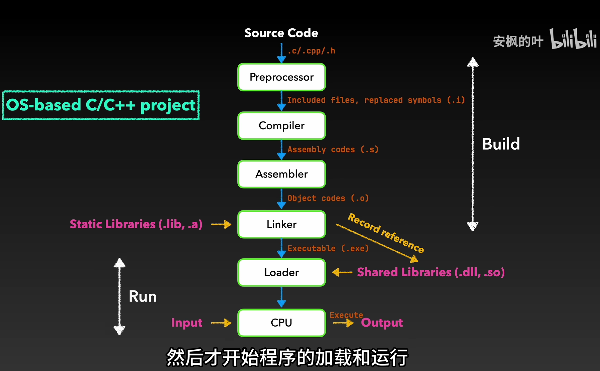

图来源：B站-安枫的叶


## 2.2 链接视角

而想要理解这个最开始那个问题，全局变量到底占不占固件（如 `.bin`、`.hex` 或 `.elf` 文件）的空间，无非就是要去看编译器最终生成的产物格式标准，而目前现代 OS 和大多数嵌入式高级工具链中，这个标准通常是 ELF (Executable and Linkable Format)。 

首先，当编译器把我们的 `.c` 代码转换成目标文件（`.o`）时，它并不是把代码和数据随便地堆在一起的。

实际上 ELF 文件内部是按照了一定的结构来划分的，它通过一个 ELF 头部（Header）作为“路线图”，将程序的各种信息分门别类地存放在不同的模块里的，这里就会涉及到 `section` 和 `segment` 的内容了，也可以认为这是导致上面那个问题混乱的原因。

ELF 标准为了既方便程序的链接，又方便程序的执行，ELF 文件格式提供了一个设计：两种平行的视图（Parallel Views）（这里以及下文参考的都是 System V ABI Edition 4.1，因为这里也没有用到关于 processor-specific 的内容）：


由于这两种视图，就有了底层开发中让人比较易混淆的两个概念——`Section` 与 `Segment`。在中文里它们常被混为一谈，但它们有着本质的区别：（Gemini生成）

1. 链接视图（Linking View）——由 `Section` 组成： 这是给链接器（Linker）看的。编译器在生成 `.o` 目标文件时，会把功能相同的代码或数据分门别类地放在不同的 `Section` 中（比如我们常说的 `.text`、`.data`、`.bss`）。每一个 `Section` 都有一个统一的 Section Header 来描述它 。  
2. 执行视图（Execution View）——由 `Segment` 组成： 这是给系统加载器（Loader）或操作系统看的 。当程序真正要跑起来时，系统并不关心那么多细碎的 `Section`。它只关心哪些内存是可读的、可写的、可执行的。因此，一个 `Segment` 通常会包含一个或多个属性相似的 `Section` 。  

> 这里实际上对于 `Section` 和 `Segment` 都会有一个 `header table` 来描述他们的信息的，程序也不能动态知道这个程序要多大，执行需要占用多少 RAM的，这里就不展开讲了，网上资料也挺多的，总之知道这 `table` 存在就好了，你真正需要分析的时候再去看看别人的讲解或者规范。

在搞清了这个背景后，再回到面试题，我们定义的全局变量的位置，取决于在“链接视图”下，它被链接器扔进了哪个特殊的 `Section` 里，此时再回去看 ELF 规范的 Special Sections：

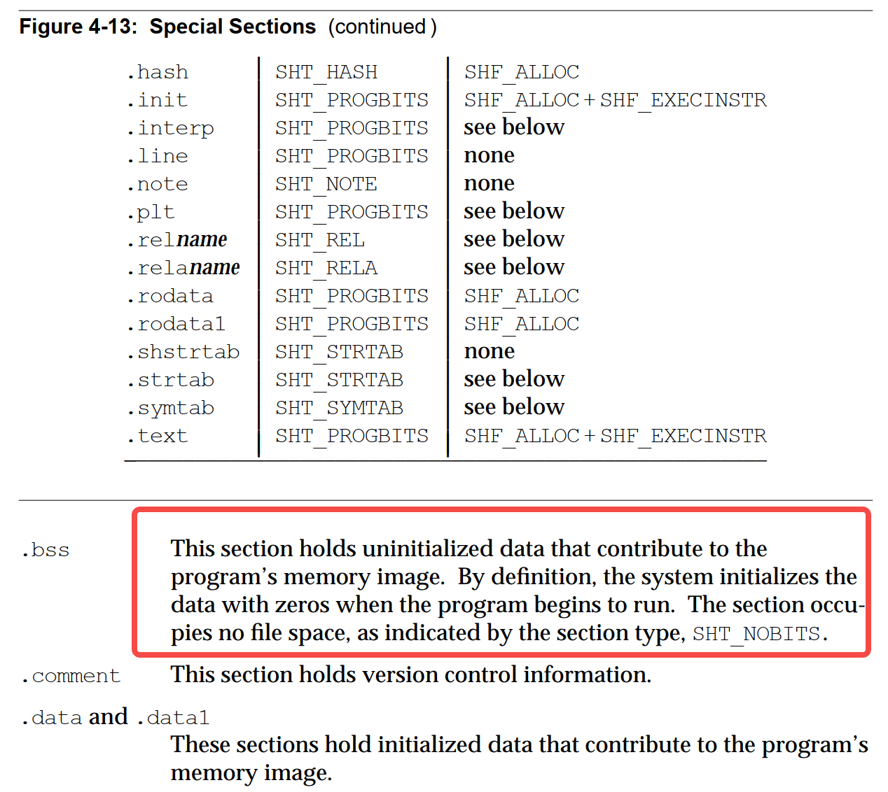

> 按照规范描述，根据该 `section` 的 `SHT_NOBITS` 类型，`.bss` 是不占用空间的，程序运行时这部分的变量会被初始化为 0。
>
> 但是为啥又说了这 `.bss` 会对 `program's memory image` 有 `contribution` 呢？下一节解答。

下面由 Gemini 总结下（有时候觉得这些名字起的还挺有趣的，拿 LLM 来起名字还挺好哈哈）：

- `.data` 段：实打实的“空间吞噬者” 

    规范指出，`.data` 段用于保存有助于程序内存映像的已初始化数据 。 因为你赋予了全局变量具体的非零初始值（例如 `int global_var = 123;`），所以 `123` 这个确切的数值必须真实地“刻”在物理固件文件中（其规范中的段类型为 `SHT_PROGBITS`，意味着它由程序定义并占用空间 ）。

    系统上电时，底层的启动代码会将这段数据从 Flash 搬运到 RAM 中。 

    > 具体怎么哪部分代码我也不记得，行为是不是真的是这样去看看代码问问 LLM。

    结论： `.data` 段是“双向吃货”，它既增加固件的物理体积，又消耗运行时的 RAM 空间。  

- `.bss` 段：聪明的“空间魔术师”

    对于未初始化的全局变量（例如 `int uninit_var;`），ELF 规范给出了截然不同的待遇：

    1. 首先，它规定“系统在程序开始运行时，会将这些数据初始化为零” 。  
    2. 其次，也是最核心的一点，它的段类型被定义为 `SHT_NOBITS` 。规范明确声明，这种类型的段“不占用文件空间（occupies no file space）” 。  


**但上面还只是整个故事的一半。**


## 2.3 执行视角

> Given an object file, the system must load it into memory for the program to run.

所以故事的下一半是：链接器读取了这些上面划分得到的 Sections，然后将它们合并成成更粗粒度的 Segments，之后这个程序就会被装载到 memory 中使用（具体由 loader 做这个事情，这里不深入了）。

但是具体都有什么 Segments？

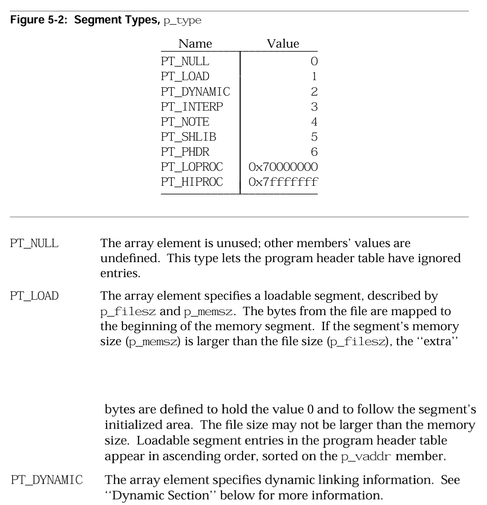

似乎挺多，但是我们并不需要关心这么多，就关注这个 `PT_LOAD`。

规范里说的是，`PT_LOAD` 是 Program Header Table（程序头表） 中一个条目的类型值，用来告诉操作系统：

> “这个 Segment 需要被加载到内存里，成为进程地址空间的一部分。”

所以我们知道每个 `PT_LOAD` 段都代表程序运行时的一块连续内存区域，比如后后面说的 `Text Sement`、`Data Segment` 等。程序能跑起来，所依赖的所有内存映射，几乎都来自 `PT_LOAD` 段。

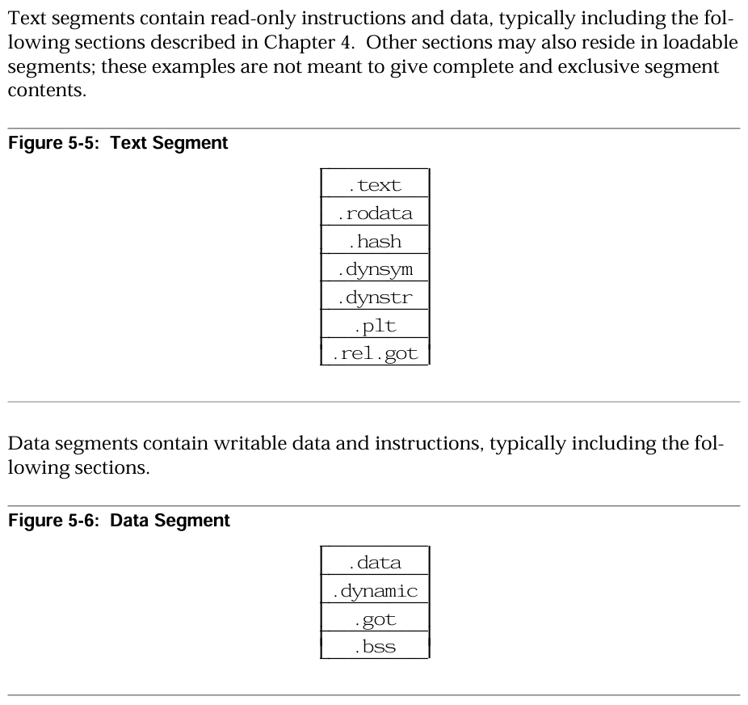

那就好说了，程序怎么运行，`cpu core` 怎么读取 `Text Segment` 运行起来，我们不管，回到之前“链接视角”遗留的问题：“为啥 `.bss` 会对 `program's memory image` 有 `contribution` ？”

既然各个 `.bss` 和 `.data` 变成 `segment`，打包合并在一起了，那为什么说 `The section occu pies no file space`？程序最终用到 `.bss` 里的变量的时候肯定得占空间吧？有点奇怪了喔？

还是看规范：

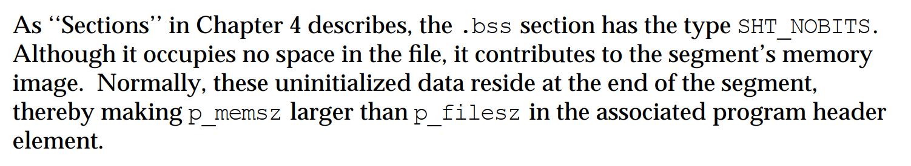

最后一句话这里就是问题所在了（`p_memsz ≥ p_filesz`），关键在于描述 `Segment` 的 `header table` 中的这两个变量：

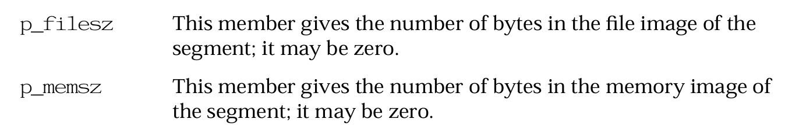

甚至描述都长得挺像的，区别就在于描述的是 `memory` 还是 `file`，也即分别表示：

- `p_filesz`：表示这个 Segment 在 ELF 文件中实际占用的字节数。
- `p_memsz `：表示这个 Segment 加载到内存中时需要占用的字节数。

那其实就明白了，链接器在最开始就记录了这两个部分的数值，在生成的固件里，`.bss` 仅仅保留了极小的“元数据”。直到程序真正准备运行前，底层的启动代码才会根据描述符，在 RAM 中圈出一块地并全部清零。

**结论：** `.bss` 段**几乎不占用固件的物理存储空间，仅仅在程序运行时动态消耗 RAM**。

再来看看由 Gemini 画的这个图：

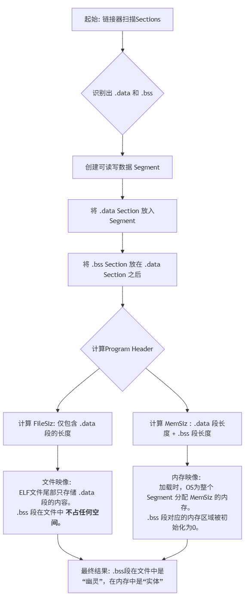


# 3. 动手实操

上面可能是理论分析，还是想看看实际环境是怎么样的，但是本人这里只有虚拟机，没有实际的环境，这里暂时配合交叉工具链的 `binutils` 来看。

环境版本：

- Ubuntu 22.04 + apt 下载的工具链：`sudo apt install gcc-aarch64-linux-gnu qemu-user`

版本如下：

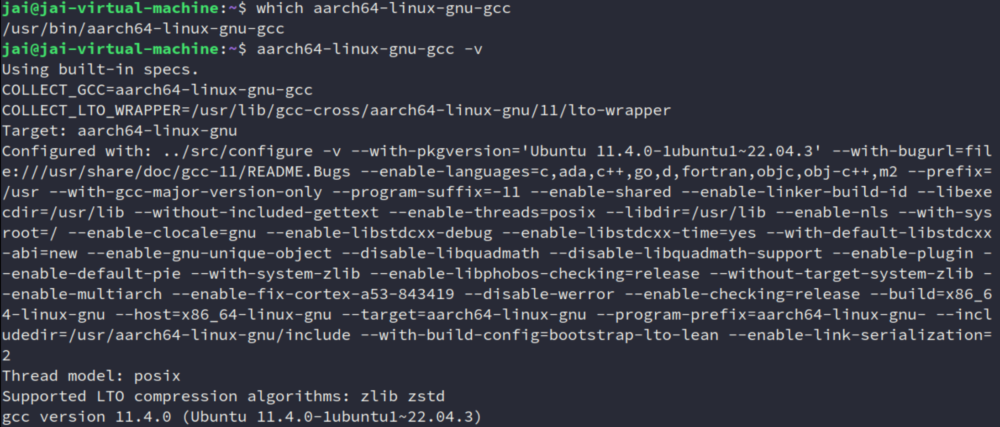


## 3.1 测试-1：直接交叉编译程序对比-带OS环境

两个程序对比

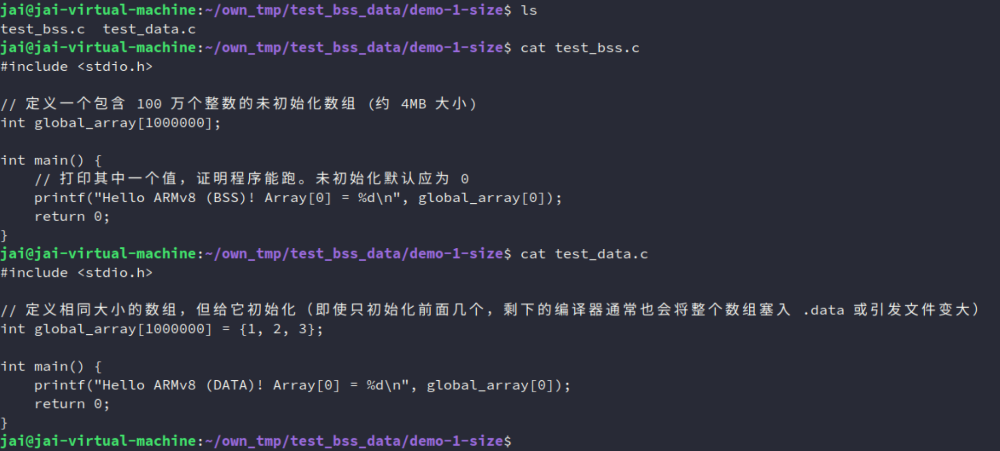

直接编译过后就能看到结果：

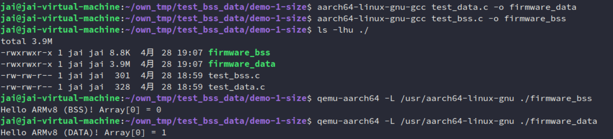

单纯文件大小体积就差了挺多的，再具体一点，直接看它的符号和地址：

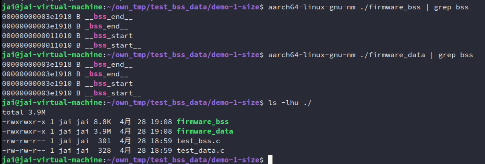

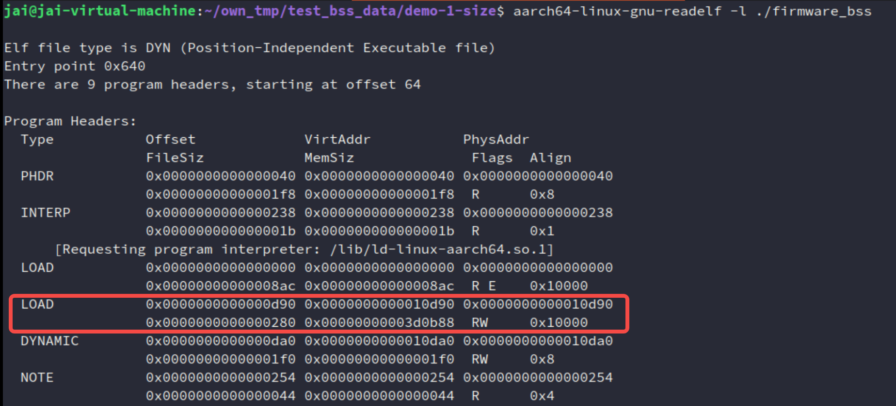


## 3.2 测试-2：`bare-metal` 测试清零 `.bss`

由于问这个问题的是做嵌入式的，MCU的，所以看看在 `bare-metal` 的环境下测试，看看是哪部分做了这些工作。

这部分的内容主要就依靠两位：链接器（Linker） 和 启动代码（Startup Code）。

Gemini 解析：

1. 角色一：链接器与链接脚本（Linker Script）

    当编译器把 `.c` 文件编译成 `.o` 目标文件后，链接器负责把它们拼装成最终的固件。在这个过程中，你可以通过链接脚本（`.ld` 文件）告诉链接器：“请把所有未初始化的变量放在一起，并告诉我这块区域的开头和结尾在哪里”。 链接器会在最终的 ELF 固件里生成两个特殊的符号（也就是你说的“极小的元数据”）：

    - `__bss_start`：记录 `.bss` 段在 RAM 中的起始物理地址。
    - `__bss_end`：记录 `.bss` 段在 RAM 中的结束物理地址。

2. 角色二：启动汇编代码（Startup Code

    这是芯片上电复位后执行的第一段代码（在进入 `main()` 函数之前）。它一般用汇编语言编写。它的其中一个核心任务就是：读取 `__bss_start` 和 `__bss_end` 的地址，写一个循环，把这块内存区域填满 0。

所以实践要做的就是：

1. 编写链接脚本 `link.ld`
2. 编写 ARMv8 启动汇编 `boot.S`
3. 编写业务代码 `main.c`

也就是这些：

```asm
/* link.ld */
ENTRY(_start)

SECTIONS {
    /* 假设我们的 RAM 从地址 0x40000000 开始 */
    . = 0x40000000;

    .text : { *(.text) }   /* 代码段 */
    .data : { *(.data) }   /* 已初始化数据段 */

    /* BSS 段处理 */
    .bss : {
        . = ALIGN(8);      /* ARMv8 要求 8 字节对齐 */
        __bss_start = .;   /* 记录此时的当前地址，作为起始地址 */
        
        *(.bss) *(.bss.*)  /* 存放所有的 bss 数据 */
        
        . = ALIGN(8);
        __bss_end = .;     /* 记录存放完之后的地址，作为结束地址 */
    }
}
```

```asm
/* boot.S */
.global _start
.section .text

_start:
    /* 1. 加载链接脚本中定义的元数据（起止地址）到寄存器 */
    ldr x0, =__bss_start  /* x0 = BSS 起始地址 */
    ldr x1, =__bss_end    /* x1 = BSS 结束地址 */
    mov x2, #0            /* x2 = 准备写入的 0 值 */

    /* 2. 核心逻辑：循环清零 RAM */
clear_bss:
    cmp x0, x1            /* 检查：当前地址 >= 结束地址了吗？ */
    b.ge run_main         /* 如果是，说明清完了，跳出循环 */
    
    str x2, [x0], #8      /* 不是，则将 x2(0) 存入 x0 指向的内存，然后 x0 往后移 8 字节 */
    b clear_bss           /* 跳转回去继续循环 */

run_main:
    /* （实际这里还需要设置栈指针 SP，为了演示简洁省去） */
    bl main               /* 跳转到 C 语言的 main 函数 */

hang:
    b hang                /* 兜底：如果 main 函数返回了，就在这里死循环 */
```

```C
/* main.c */
// 定义一个 400 字节的未初始化全局数组
int uninit_array[100]; 

int main() {
    // 此时 uninit_array 已经被前面的 boot.S 填充为 0 了
    uninit_array[0] = 42; 
    return 0;
}
```

编译：`aarch64-linux-gnu-gcc -nostdlib -T link.ld -g boot.S main.c -o baremetal.elf`

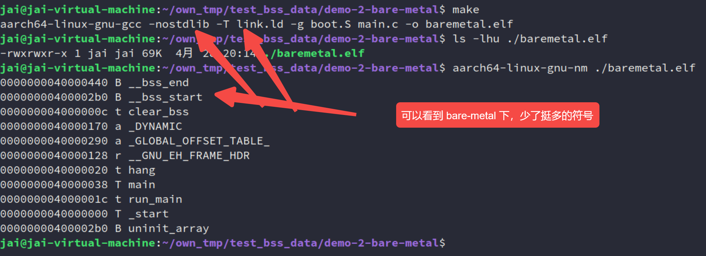

再来看看实际的 `qemu` 运行：

```bash
# -M virt: 模拟通用的 ARMv8 虚拟开发板（RAM 默认从 0x40000000 开始，刚好匹配我们的 link.ld）
# -kernel: 加载我们的裸机固件
# -S: CPU 上电后暂停运行
# -s: 开启本地 1234 端口，等待 GDB 连接
qemu-system-aarch64 -M virt -cpu cortex-a53 -nographic -kernel baremetal.elf -S -s
```

`gdb` 调试运行结果：

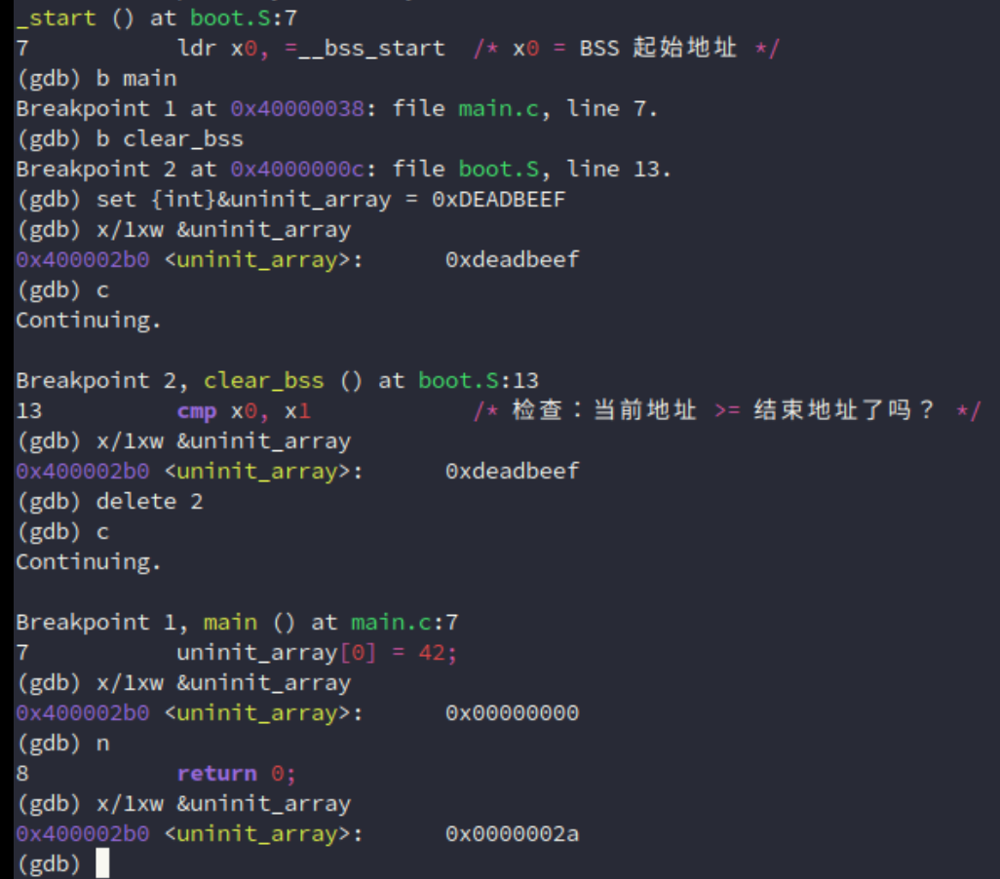

可以看到，对 `main` 和 `clear_bss`打了两个断点，然后在清零 `.bss` 之前，在 GDB 里手动往 `uninit_array` 写入一些垃圾数据 `deadbeaf`，之后进一步让程序执行到 `main`，发现确实被清零了。


当然最后也再补一个对比的测试吧：

```C
/* main.c */
// 两者对比
// int uninit_array[10000] = {1, 2, 3, 4};
int uninit_array[10000];

int main() {
    // 此时 uninit_array 已经被前面的 boot.S 填充为 0 了
    uninit_array[0] = 42;
    return 0;
}

```

未初始化的：

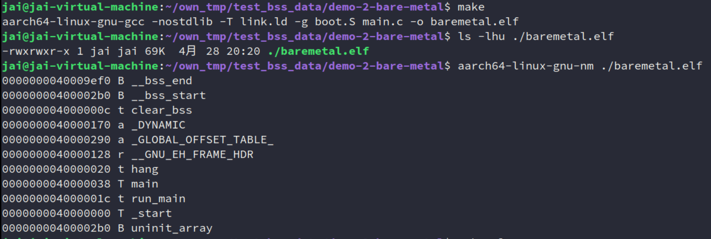

初始化的：

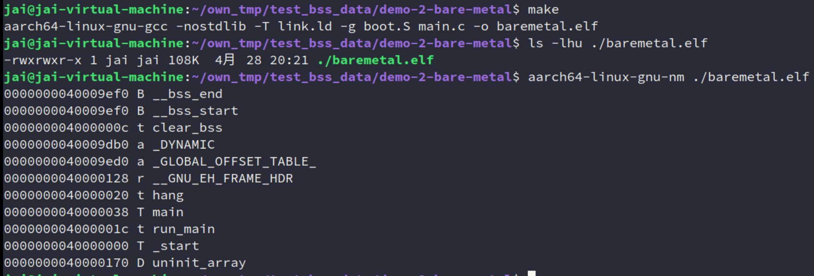


## 3.3 测试-3：使用KEIL-MDK测试下

学习的时候，身边人最常用的就是这个 IDE /编译器了，测试版本：

```bash
*** Using Compiler 'V5.06 update 7 (build 960)',
```

测试程序 `main.c` + HAL 库 + -O0 优化：

```C
// ---------------- 新增测试	宏与变量 ----------------
#define TEST_ARRAY_SIZE 25000 // 100KB 大小 (25000 * 4 Bytes)

// 测试场景 1：未初始化数组 (对应 .bss / ZI-data)
int test_array[TEST_ARRAY_SIZE]; 

// 测试场景 2：已初始化数组 (对应 .data / RW-data)
// int test_array[TEST_ARRAY_SIZE] = {1, 2, 3}; // 只要首元素非0，整个数组就会被强行塞入 RW-data
// --------------------------------------------------

int main(void)
{
	SCB_EnableICache();		// 使能ICache
	SCB_EnableDCache();		// 使能DCache
	HAL_Init();					// 初始化HAL库
	SystemClock_Config();	// 配置系统时钟，主频480MHz
	LED_Init();					// 初始化LED引脚
	
	while (1)
	{
		LED1_Toggle;
		HAL_Delay(100);

        // 防止数组被编译器优化掉的伪操作
		test_array[0]++;
	}
}
```

1. 正常环境无测试

    ```bash
    Program Size: Code=5902 RO-data=714 RW-data=20 ZI-data=1028  
    ```

    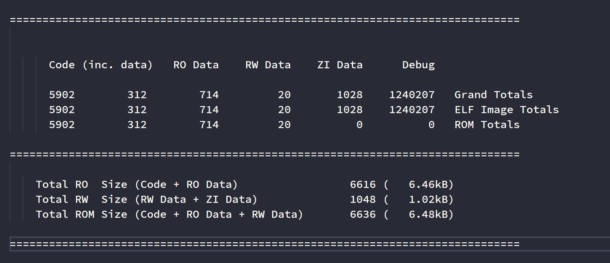

2. 未初始化

    ```bash
    Program Size: Code=5910 RO-data=714 RW-data=20 ZI-data=101028  
    ```

    map 文件输出：

    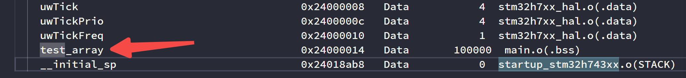

    ​    Execution Region RW_IRAM2 (Exec base: 0x24000000, Load base: 0x08000d10, Size: 0x00018ab8, Max: 0x00080000, ABSOLUTE)：

    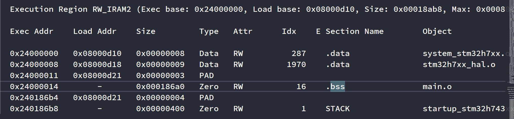

    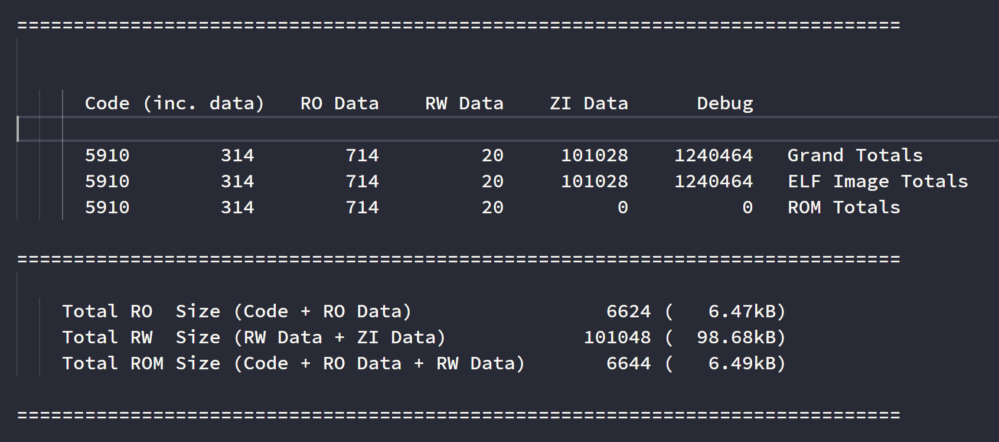

    

3. 初始化

    ```bash
    Program Size: Code=5998 RO-data=714 RW-data=100020 ZI-data=1028  
    ```

    map 文件输出：

    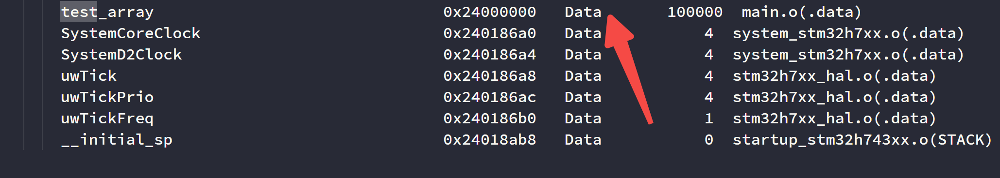

    ​    Execution Region RW_IRAM2 (Exec base: 0x24000000, Load base: 0x08000d10, Size: 0x00018ab8, Max: 0x00080000, ABSOLUTE, COMPRESSED[0x00000324])

    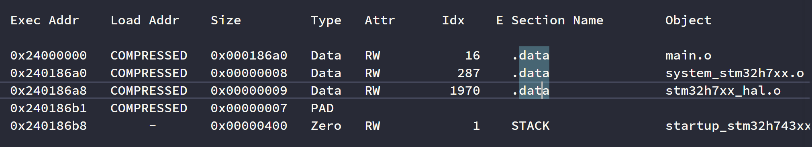

    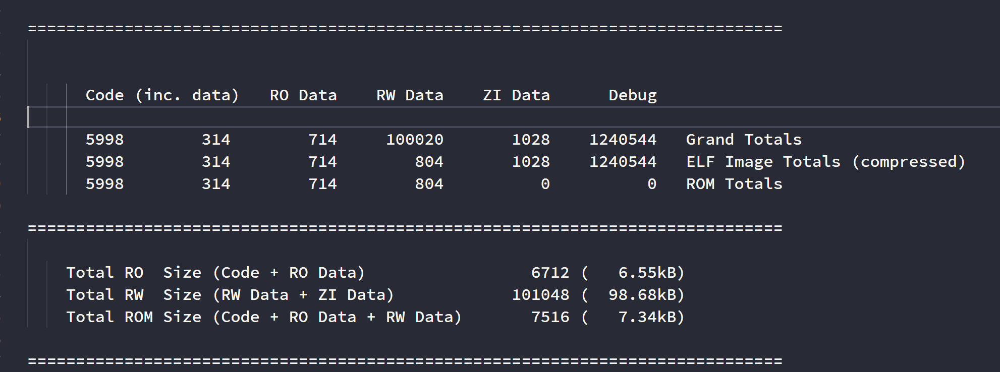

这本来是一个很简单的测试，但如果你仔细观察，初始化了的 ROM Size，就会发现一个有意思的现象：为什么他这里明明算上了 RW Data，这个 ROM 占用竟然这么小？和 RW Size 似乎不一样喔？问问 Gemini吧，

1. 诡异的 `COMPRESSED` 标记

    看`Memory Map of the image`（内存映射）部分，仔细看 `RW_IRAM2` 这一行：

    Execution Region RW_IRAM2 (Exec base: 0x24000000, Load base: 0x08000d10, Size: 0x00018ab8, Max: 0x00080000, ABSOLUTE, COMPRESSED[0x00000324])

    注意到了吗？它后面跟着一个 `COMPRESSED[0x00000324]`。 `0x324` 转换成十进制是多少？804 字节！ 也就是说，原本大小为 `0x186A0`（100,000 字节）的 `test_array` 数据，被硬生生压缩成了 804 字节放在了 Flash 里。

2. 神秘的解压函数

    再往上看 `Image Symbol Table`（符号表），你会发现链接器偷偷往你的固件里塞进了几个你根本没写过的函数：

    - `__decompress1     0x08100049   Thumb Code    86  __dczerorl2.o(.text)`
    - `__scatterload     0x080002b1   Thumb Code    28  init.o(.text)`

    特别是 `__dczerorl2.o`，它的全拼是 Decompress Zero Run-Length version 2（零值游程解压器 V2）。

3. 两组统计数据的碰撞 在你给出的最后一部分汇总表中：

    - `Grand Totals                        5998  314   714  100020  1028  1240544`
    - `ELF Image Totals (compressed)       5998  314   714     804  1028  1240544`

    注意看 `ZI Data` 的对比，原始计算是 `100020`，但在生成镜像时（compressed 这一行），它变成了 `804`。

4. 商业链接器的“极限压榨” (RW Data Compression)

    其实，根据 C 语言和 ELF 规范，当你写下 `int test_array[25000] = {1, 2, 3};` 时，它**确实**变成了一个已初始化的强符号，理应被放入 `.data`（RW-data）段，并且必须在 Flash 中占用 100KB 的体积。

    但是，Keil MDK 背后的 `armlink`（ARM 链接器）太聪明了。作为极其昂贵的商业工具链，它的首要任务就是帮资本家省 Flash 成本。

    `armlink` 在打包生成固件前的最后一刻，会扫描所有的 `.data` 段数据。它发现了一个惊人的事实：在这 100,000 个字节中，**除了开头那 12 个字节（1, 2, 3），后面整整 99,988 个字节全都是 0！**

    于是，链接器启动了 **RW 压缩机制（RW Data Compression）**：

    1. 它用一种类似“游程编码”（Run-Length Encoding）的算法，把这几万个 0 压缩成了一句描述：“这里有 99,988 个零”。这句描述连同 `1,2,3` 一起，被压缩打包存入了 Flash（也就是那 804 字节）。
    2. 它自动在你的启动代码中插入了 `__dczerorl2.o` 解压库。
    3. 当 STM32 上电运行，在执行到 `__main` 里的 `__scatterload`（分散加载）阶段时，CPU 会执行解压算法，把 Flash 里的这 804 字节“爆开”，在 RAM 中还原成 100,000 字节的真实数组。

    这就是为什么你的 `.map` 文件显示 Flash（ROM Size）依然很小的终极真相！


## 3.4 测试-4：聪明的编译器

因为面试官说“不同编译器处理不同”，但我想详细看看究竟是哪里不同。

个人认为的是否在变量显式初始化：

```C
int a[1000000]; （完全未初始化）
int b[1000000] = {0}; （显式初始化为 0）
```

首先对于第一种，毫无争议，所有正经的编译器都会把它归入 `.bss`（或 `COMMON` 然后由链接器放入 `.bss`），不增加固件大小。

所以问题应该在这第二种：它到底是算作 `.bss` 还是 `.data`？

按照我的认知：

- 老旧编译器 / “笨”编译器： 只要看到有 `=` 赋值，就傻傻地地认为它被初始化了，必须放到 `.data` 段。这会导致编译器也是傻傻地往固件的 Flash 里塞入 `00 00 00 00`，严重增加固件大小。
- 现代编译器 / “聪明”编译器（如较新的 GCC、Clang、Keil MDK/ARM Compiler 6）： 具有零初始化优化（ZI-data 优化）。它理应会聪明地发现：“虽然你初始化了，但你初始化的全是 0 啊！这和未初始化的效果不是一模一样吗？” 于是它会强行把 `b` 优化进 `.bss` 段，不增加固件大小。
- 还有一个编译标志：`-fno-zero-initialized-in-bss` ，比较新的编译器初始化变量为0时都是会放到 `.bss` 的，而这个标志可以显式地关闭零初始化优化。

这里我直接在我的虚拟机里做好了，因为刚好有两个版本的编译工具链：

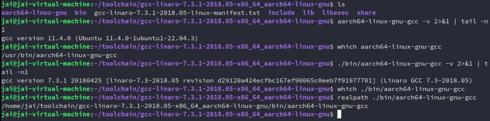

由于要测试的东西比较多了（不同编译器、`-fno-zero-initialized-in-bss`），所以我这里直接写了个脚本来测，结果如下：

```BASH
~/own_tmp/test_bss_data/demo-3-explicit-implicit ./compare_bss.sh 
==================================================
 开始编译 4 组测试文件...
==================================================
编译完成！生成文件如下：
new_dumb.elf
new_smart.elf
old_dumb.elf
old_smart.elf

==================================================
 1. 固件物理大小对比 (ls -lh)
    -> 观察哪个文件被实打实地塞入了 4MB 数据
==================================================
-rwxrwxr-x 1 jai jai 3.9M  4月 28 22:22 new_dumb.elf
-rwxrwxr-x 1 jai jai 8.8K  4月 28 22:22 new_smart.elf
-rwxrwxr-x 1 jai jai 3.9M  4月 28 22:22 old_dumb.elf
-rwxrwxr-x 1 jai jai  15K  4月 28 22:22 old_smart.elf

==================================================
 2. RAM 内存分配对比 (size)
    -> 观察 4MB (约 4000000) 落在 data 还是 bss
==================================================
   text	   data	    bss	    dec	    hex	filename
   1626	4000640	      8	4002274	 3d11e2	new_dumb.elf
   1626	    640	4000008	4002274	 3d11e2	new_smart.elf
   1088	4000568	      8	4001664	 3d0f80	old_dumb.elf
   1088	    568	4000008	4001664	 3d0f80	old_smart.elf

==================================================
 3. 符号表归属深度分析 (nm)
    -> 观察 zero_array 前面的字母是 'B'(BSS) 还是 'D'(Data)
==================================================
>>> 解析文件: new_smart.elf <<<
00000000003e1918 B __bss_end__
00000000003e1918 B _bss_end__
0000000000011010 B __bss_start
0000000000011010 B __bss_start__
0000000000011018 B zero_array
--------------------------------------------------
>>> 解析文件: new_dumb.elf <<<
00000000003e1918 B __bss_end__
00000000003e1918 B _bss_end__
00000000003e1910 B __bss_start
00000000003e1910 B __bss_start__
0000000000011010 D zero_array
--------------------------------------------------
>>> 解析文件: old_smart.elf <<<
00000000007e1938 B __bss_end__
00000000007e1938 B _bss_end__
0000000000411030 B __bss_start
0000000000411030 B __bss_start__
0000000000411038 B zero_array
--------------------------------------------------
>>> 解析文件: old_dumb.elf <<<
00000000007e1938 B __bss_end__
00000000007e1938 B _bss_end__
00000000007e1930 B __bss_start
00000000007e1930 B __bss_start__
0000000000411030 D zero_array
--------------------------------------------------
对比测试结束！

```

我也懒了，直接 Gemini 生成解析报告：

1. 固件体积的视觉暴击（`ls -lh` 的真相） 无论是在老牌的 Linaro GCC 7.3 还是在新版编译器中，默认情况下（`v11.4`）它们都极其聪明地触发了零初始化优化，将 4MB 的数组化于无形，固件仅有 10KB 左右。而一旦我们使用 `-fno-zero-initialized-in-bss` 参数强行关闭该优化（`dumb`），两个固件的物理体积瞬间暴增到 3.9MB。多出来的近 4MB 空间，全是被强行塞入物理文件的“0”。

2. 内存消耗的“守恒定律”（`size` 的洞察） 仔细观察 `size` 命令输出的 `dec`（总内存需求）这一列。你会发现一个极其优美的现象：无论物理固件是 10KB 还是 3.9MB，它们在运行时需要的总内存完全一致（约 4MB）。 这完美印证了“不占 Flash 绝对不代表不占 RAM”。底层的唯一区别仅仅在于：这 4MB 的开销是被记在了 `bss` 的账上，还是被记在了 `data` 的账上。

3. 符号表的终极审判（`nm` 的实锤） 如果说前面的大小只是表象，那么 `nm` 的输出就是底层的“基因检测”。
    - 不显式加 `-fno-zero-initialized-in-bss`，`zero_array` 前面的属性是 `B`，代表它被成功归入 `.bss` 段，享受着启动代码的动态清零服务。
    - 优化关闭后，`zero_array` 前面的属性变成了 `D`，代表它被强行降级为 `.data` 段，成为了固件文件中的沉重负担。

核心启发： 在现代嵌入式底层开发中，编译器远比我们想象的要聪明，但也极其死板。多写一个 `{0}`、漏掉一个编译参数，都有可能导致几十上百 KB 的 Flash 空间被白白浪费。


# 参考

[1]. [gabi41.pdf](https://refspecs.linuxfoundation.org/elf/gabi41.pdf)


# 更多资料

- [refspecs.linuxfoundation.org/elf/index.html](https://refspecs.linuxfoundation.org/elf/index.html)
- [Github-abi-aa仓库 sysvabi64](https://github.com/ARM-software/abi-aa/blob/main/sysvabi64/sysvabi64.rst)
- 《程序员的自我修养——链接、装载与库》
- 《深入理解计算机系统》 (CS:APP - Computer Systems: A Programmer's Perspective)
- 《Linkers and Loaders》
- 你所使用的编译器指南


