> **注意：以下的内容均为个人观点。**
>
> **如果你看完后有不同的观点也没关系！请指出，我很乐意去学尝试积极的东西。**

封面：
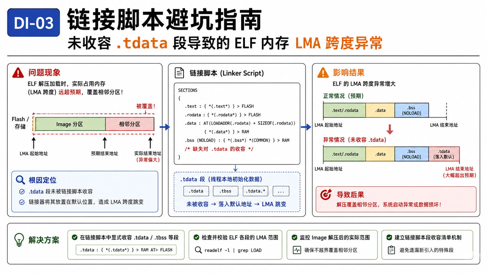

# 1. introduction

写这篇的原因是有朋友遇到了一个问题，这里大致描述背景：

> 一个 RTOS 的系统，原本运行稳定。
>
> 近期引入了一个第三方协议库，编译通过后，首次烧录启动正常。
>
> 执行 `reboot`，系统再次拉起时，在解压某个 `image` 的时候，解压的结果覆盖了某一块分区的内容，导致分区数据错误，而这一块分区是被别的资源数据所依赖的（异常发生点）。

这里他们已经解决了（`Claude Code` 协助），但这里人肉恢复一下解 `bug` 的过程呗，因为之前也遇到了类似的问题，只是不是解压，但也一样在启动/解压这种早期阶段的，也是这么查出来的。

这种 `bug` 其实还相对好解，因为能复现，只是肯定是有你不知道的内容在的。


# 2. 分析

## 2.1 正常流程

看到这个问题的第一想法，脑子里还是有个正常的启动-解压过程是怎么走的：

1. 系统于某个地址开始执行（`bare-metal` 程序），从 `bootROM` 或者固定启动代码加载 `loader`，跳转到 `loader` 的执行。

2. `loader` 开始解压下一级的 `image` 到一个具体的地址 `image_addr` ，其中 `image_addr ~ image_addr + image_size` 都是在提前规划好的分区中的，大小提前规划好了，比如说：`0x80000000 ~ 0x81000000`。（当然，这个 `loader` 或者后续的程序也会解压更多的数据/程序，可能有多级的 `loader`）

    > 一般 `bootloader` 会用到 `LZ4` 压缩算法^[1]^：
    >
    > 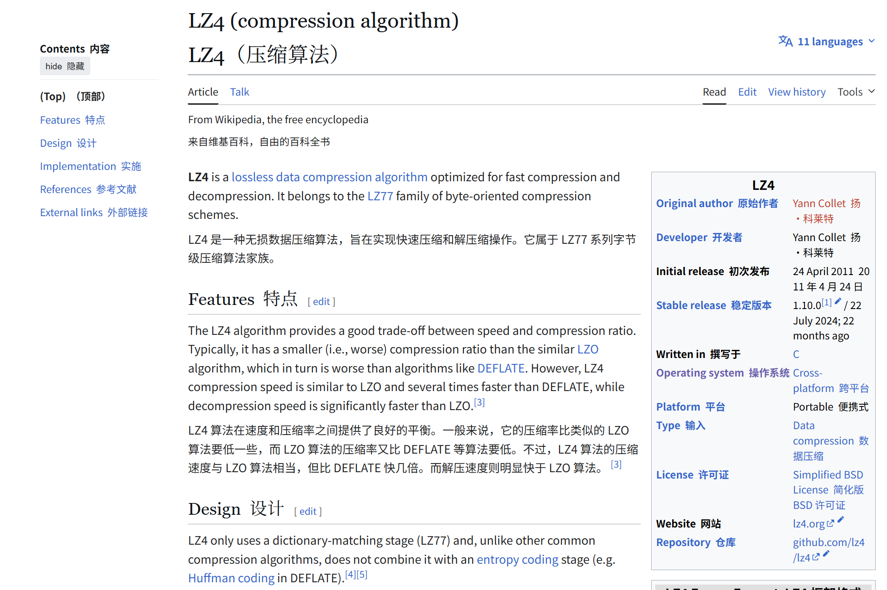

3. 跳转到  `image` 执行。


## 2.2 异常解压

既然问题/异常出现在解压 `image` 过程中，之后去排查的点自然就比较通畅了，就是看解压动作到底哪里超出了预期。

一般来说，`loader` 解压覆盖了相邻物理内存区，无非就两种可能：

1. 目标地址漂移了：解压的起始地址错了，整体往后移，冲进了别人的地盘。
2. 解压体积暴涨了：起始地址没错，但吐出来的数据量实在太大，超出了原本规划的 `image_size`，直接溢出到了后方区域。

**可以直接排除第一点，`loader` 里的硬编码目标地址并没有任何改动。那么问题只能出在体积上。**

再结合当前正在做的工作：引入某个第三方协议库。

那自然也能猜测是引入三方库带来的固件体积大小的变化。此时直接去看构建产物的大小（`size`、`ls -lhu` 等命令）：

- 压缩后体积（LZ4 payload）：几乎没变（仅增加几十 KB）。
- 解压后体积（Decompressed payload）：**增加了25MB左右**

但之后要去看什么呢？ELF。


## 2.3 ELF & VMA & LMA

### 2.3.1 ELF 

在这一篇：[[SCR-01\] 未初始化的全局变量占不占固件空间？](https://mp.weixin.qq.com/s/DAPoV3Zk-xmB1rek8yHbsw)中我提到过：

“目前现代 OS 和大多数嵌入式高级工具链中，最终得到的编译产物通常是 ELF (Executable and Linkable Format)。”

这里我们遇到的问题也是一样的，固件就是一个 ELF 或者 bin 文件，首先看 ELF 文件，在 [2] 中我也提到，ELF 的基本结构如下^[3]^：

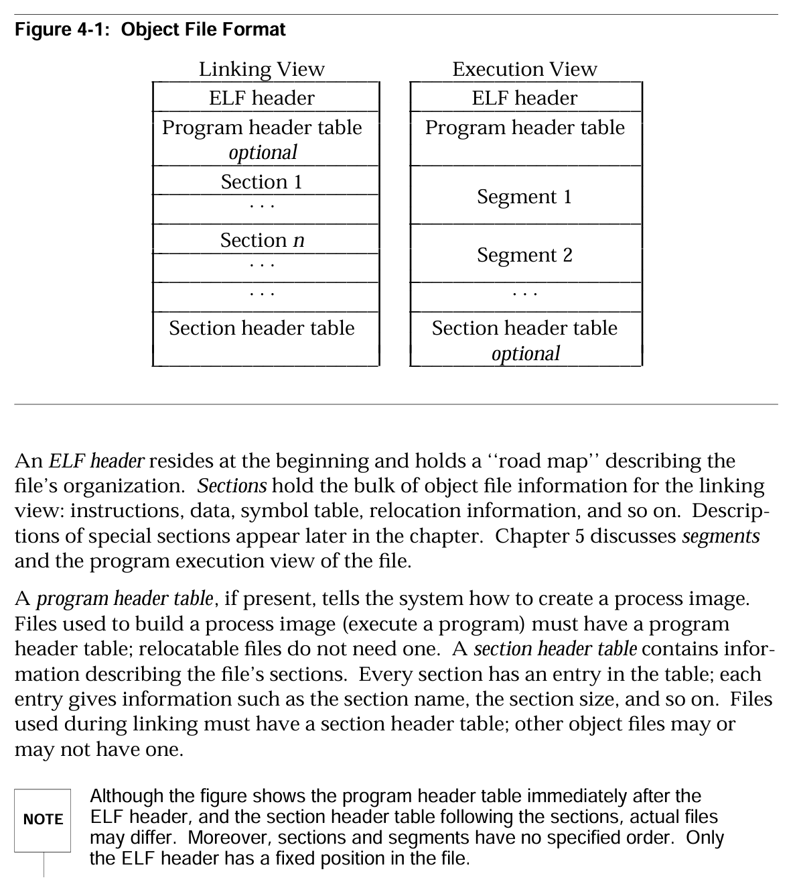

不管是链接视角还是执行视角，ELF 的文件都是结构化的，有组织的。

所以我们可以把 ELF 理解为：**”元数据+实际的section“**，也就是通过各种头信息（`program header table`、`section header table`）告诉系统对于这个可执行文件，这一 `section` 放在哪里 ，那一 `section` 放在哪里。

所以在看到体积大小相关的问题，可以直接去看各个 `section` 在**链接脚本**中被放到了哪个地址，各个有体积大小的 `section` 拼成整一个固件（其实也就毙掉了2.2中的可能一）。

再举个别的项目的例子：

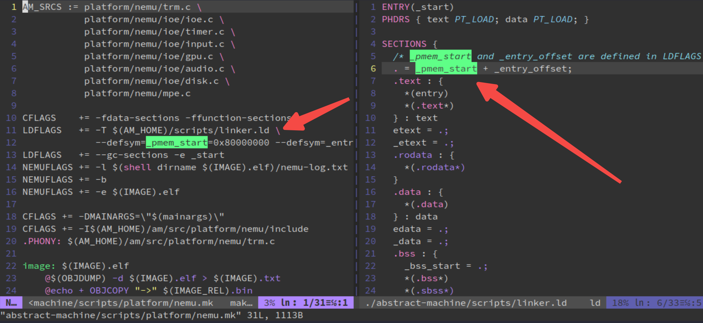

可以看到，在链接脚本中，初始的程序位置在整个地址空间中被分配到了 `0x80000000` 这个位置，这也就是意味着，之后通过 `binutils` 工具看到的整个大的程序镜像中的其他 `section` 的地址位置就是从这里开始了。

但还有个问题，往往大家通过 `binutils` 工具在看到的 `VMA/LMA`、`VirtAddr/PhysAddr` 才更加重要？

**其实也没有错，链接脚本可以是说整个系统中的蓝图。链接脚本中的各种赋值操作，就是在告诉链接器，经过编译器计算后的各个 `section` 的大小（从 `0x80000000` 开始都放在什么位置），然后链接器也就会把这些值填入到所谓的 `VMA/LMA` 里去。**

再进一步，了解 `ELF` 文件的各个成员，你就会知道上面的 `VMA/LMA` 就是 ELF 在装载执行的时候，各个 `segment` 的中成员之一^[3]^：

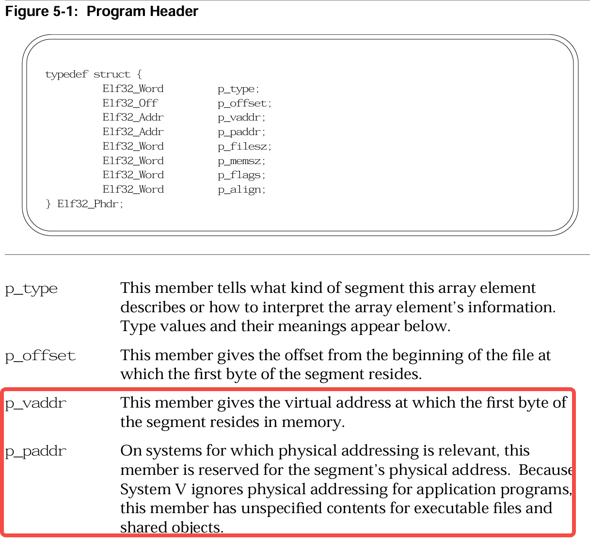

这里直接让 Gemini 分类：

- 现代 OS 上的应用程序（比如说是 Linux 上的一个可执行文件或者动态库）

    - `p_vaddr` (虚拟地址)：这是真正起作用的字段。当加载器（如 `ld-linux.so`）读取ELF文件时，会把这段数据（`p_offset` 处的内容）加载到进程虚拟内存的 `p_vaddr` 位置，并赋予 `p_flags` 规定的读写执行权限。**程序运行时的指令、全局变量等都是通过这个虚拟地址访问的。**

    - `p_paddr` (物理地址)：这个字段通常被忽略或设置为0。

        正如上面文档：“System V ignores physical addressing for application programs”。

        因为现代操作系统使用虚拟内存管理，应用程序根本不知道自己会被加载到哪块物理内存中（这个映射由内核和MMU管理）。保留这个字段主要是为了兼容某些特定场景。

- 嵌入式系统或内核代码（这才是我们的重点）

    在没有虚拟内存、直接操作物理地址的环境下（例如 `Bootloader`、通过链接脚本直接控制整个内存布局、RTOS），`p_paddr` 才有实际意义。

    这个时候 `p_paddr` 就指向了该 `segment` 应该被放置的**确切物理内存地址**（例如某个外设寄存器地址或特定 `RAM` 地址）。

    当然大多时候 `p_addr == p_vaddr` 的。

所以直接可以给出结论：

- `p_vaddr` → `VMA`（虚拟内存地址 / 运行地址）
- `p_paddr` → `LMA`（加载内存地址 / 物理地址）


### 2.3.2 链接脚本 & VMA & LMA

虽然上面说 `LMA` 是指定确切的物理内存位置，但哪怕一般在 `bare-metal` 的场景，**`VMA` 和 `LMA` 绝大多数时候相等的**，因为一般都是在 `RAM` 中操作各种内容。

当你说要从 `Flash` 中拷贝数据到 `RAM` 中，这个时候，这个数据地址的存放地址（`LMA`）和程序运行地址（`VMA`）才会不同。

而规定上面这种用法的，还是回到链接脚本！再来看看 Gemini 是怎么总结链接脚本中是怎么影响 `VMA` 和 `LMA` 的，同时结合一个链接脚本的例子：

```ld
MEMORY {
  FLASH (rx) : ORIGIN = 0x08000000, LENGTH = 1M
  RAM   (rw) : ORIGIN = 0x20000000, LENGTH = 128K
}

SECTIONS {
  .text : { *(.text) } > FLASH
  .data : {
    *(.data)
  } > RAM AT> FLASH   /* VMA 在 RAM，LMA 跟在 FLASH 中 .text 之后 */
}
```

- VMA（运行地址）：程序执行时，该段期望被放置的内存地址。链接脚本中直接写在节名后面的地址，就是 VMA。例如：

    ```ld
    .text : 0x10000 { *(.text) }   # 这里的 0x10000 就是 VMA
    ```

    

- LMA（加载地址）：程序被烧录/加载时，该段原始数据在存储介质（如 `Flash`、文件）中的位置。在 `bare-metal` 中，如果数据需要从 `Flash` 搬到 `RAM`，就需要分别指定 `LMA` 和 `VMA`。

    ```ld
    # VMA 由 >RAM 决定（假设 RAM 起始 0x20000000），LMA 强制为 0x8000
    .data : AT(0x8000) { *(.data) } > RAM
    
    # 更常见的写法：
    .data : {
        *(.data)
    } > RAM AT> FLASH
    ```

    

- `AT>` 指令解析

    - `AT` 用于分离 `LMA` 和 `VMA`，常见于：
        - 数据段放在 `Flash`，但需要在 `RAM` 中运行（需启动代码复制）。
        - 代码的运行时地址与加载时不同（如位置无关代码的搬运）。
    - 如果系统直接在物理地址运行（如 bootloader、内核入口），VMA 就是 CPU 要访存的地址，而且程序不会被从别处搬运，那么 LMA 自然等于 VMA，不需要写 `AT`。

    当需要将数据段从 Flash 搬到 RAM 时，这样写（或者使用 `AT> FLASH` 简化）：

    ```LD
    .data : AT(ADDR(.text) + SIZEOF(.text)) { ... } > RAM
    ```

    > 这里可能看这个语法比较混乱，简单解释：
    >
    > 1. `.data`：定义一个名为 `.data` 的 `section`，将从各个输入 `.o` 文件中收集所有 `.data` `section`（或者 `{ *(.data) }` 中的规则）合并进来
    >
    > 2. `> RAM`：**指定该 `section` 的 VMA（运行地址），这个是我觉得比较容易搞混的。**
    >
    >     如果你写过一些链接脚本，你就会知道这个`RAM` 必须是在 `MEMORY` 命令中预先定义的内存区域，比如说：
    >
    >     ```ld
    >     MEMORY { RAM (rw) : ORIGIN = 0x20000000, LENGTH = 64K }
    >     ```
    >
    > 3. `AT(ADDR(.text) + SIZEOF(.text))`
    >
    >     **指定该 `section` 的 LMA 加载地址**


这里可能稍微写 ELF 的部分有点多了，但是知道 `VMA/LMA` 这些概念还是很重要的。回到主题。

知道要看固件体积，那就是要看 ELF 的体积了，而 ELF 基本又是靠 `section` 组成的，所以最终结论：

ELF 文件的体积 ≈ 各个 `section` 的体积之和。

所以也可以变相地说明，既然固件体积异常，可以说某一个 `section` 的体积/位置不太对。

此时我们再用合适的工具（`.map`、`objdump/readelf/nm/...`）去看 ELF，发现（不方便展示内部数据）：

**`.text` 和 `.data` 加起来只增加了区区不到 1MB。**

所以可以说是 `bin` 出了问题了？因为一步步排下来：

`*.c/*.S` → `*.o/*.so` → `*.elf` → `*.bin` → `compressed.bin` .

前面三阶段都按照我们的思路走了，那就是最后的 `bin` 文件了嘛。

而且前面 2.2 展示的固件解压前后体积却差了 20 多MB，基本也能知道解压前没问题，解压后出问题了，而解压算法用了这么久都没问题，那问题只能是被压缩的 `bin` 上了嘛。


## 2.4 bin 文件

`bin` 文件更好理解，就是一个 `raw binary`，就是一扁平化的，也就是它没有任何头部信息，就是一段纯粹的内存 `image`。

> 有点类似图像相关的 `raw` 文件直出，没有什么 `JPG`、`PNG`、`JPEG` 压缩，但还是有区别。

我们主要是使用的 `objcopy` 这一工具来把 ELF 文件转换成 `bin` 文件的。

> `objcopy` 主要工作是复制和转换目标文件，就是一个二进制文件格式转换器+“手术刀”
>
> - 格式转换：在不同格式间相互转换，例如 ELF 转 Binary (用于固件烧录)、ELF 转 HEX/S19 等。
> - 内容精简：移除调试信息、符号表等运行时不需要的内容，从而显著减小文件体积。
> - 内容提取：从目标文件中提取特定的段（Sections）到一个新文件。
> - 内容编辑：更高级的用法，包括添加/删除段、修改段地址等。

回到问题背景，他们的项目中用法大致类似如下：

```bash
aarch64-linux-gnu-objcopy -O binary --remove-section=.my_resource firmware_bug.elf payload_bug.bin
```

比较高级，把 `firmware_bug.elf` 转成 ` payload_bug.bin` 过程中，还把其中的一个 `my_resource` `section` 给剔除掉了。

这就有一个问题，因为 `objcopy` 的默认行为是：

**生成Bin 文件的体积 ≈ 最大 LMA（加载地址） - 最小 LMA**

> `objcopy` 代码见：https://sourceware.org/git/binutils-gdb.git 的 `binutils/objcopy.c`、`bfd/binary.c`，重点在于 `copy_object` 函数（`3277` 行、`3297` 行）。
>
> 行为：
>
> 1. **输入解析**：读取 ELF 文件，解析出所有 `SHF_ALLOC` 段的**加载内存地址(LMA)** 及其内容。
> 2. **排序**：将所有需要拷贝的段，根据其 **LMA** 从小到大进行排序。
> 3. **计算空隙**：计算相邻两个段的地址差值 `gap = LMA_Next - (LMA_Current + Size_Current)`。这个 `gap` 就是要填充的洞的大小。
> 4. **填充与写入**：
>     - 从最小 LMA 开始，将所有段的数据依次写入输出文件。
>     - 在写入每个段的数据后，检查它与下一个段之间的 `gap`。如果 `gap > 0`，则在输出文件中写入 `gap` 字节的填充值（默认为 `0x00`，或由 `--gap-fill` 指定）。
> 5. **尾部填充**：如果使用了 `--pad-to` 参数，且最后一个段的结束地址小于指定地址，则在文件末尾继续填充到指定大小。

那其实很好说了，我们之前看到 `size` 命令输出的实际数据没变大，说明我们**没有引入 20 多 MB 的真实代码**，但生成的解压后的 `.bin` 文件（解压后的 payload）暴涨了 20 多MB。

根据 `objcopy` 的 代码规则，既然不是真实数据变大了，**那一定是地址跨度（最大 LMA - 最小 LMA）被拉长了 20 多MB。**

所以，既然地址跨度被拉长了，就一定有一个“不知好歹”的 `section`，被链接器分配到了遥远的高地址（排在了那 20 多MB 空洞的后面），从而把整个 `.bin` 文件的边界给撑大了。


# 3. 问题总结

经过他们内部对比正常和异常两个版本固件（直接 `objdump -h` 两个版本，再 `diff` ）：

- Before 版本：最后一个分配了 LMA 的段是  `.eh_frame`，最大地址截止在 `0x80C00000`。
- After 版本：突然多出一个 `.tdata`，它的 LMA 赫然写着 `0x82800000`，成为了新的最大地址，而且刚好和原先的末尾（`.eh_frame`）拉开了 20多MB 的距离（因为那个资源段被打包走了）。

而他们在引入第三方库中发现，这个第三方又用到了 `TLS(Thread Local Stoage)`，而这个 `TLS` 又用到了 `tdata` `section`，恰恰好这个 `section` 没有被链接脚本所管理，那自然就出现问题了。画一个图看就明白了：

```
【正常版本：安全的边界】
0x80000000                 0x80C00000  0x81000000            0x82800000
[ .text | .data | .bss ]   (空洞)      [ .resource (不打包进 OS) ]
↑最小LMA                   ↑最大LMA
Raw binary 体积 = 0x80C00000 - 0x80000000，完美。

【问题版本：被拉扯的边界】
0x80000000                 0x80C00000  0x81000000            0x82800000   0x82B00010
[ .text | .data | .bss ]   (强制填零)  [   强制填 0x00 (20多MB)         ]   [.tdata 16B]
↑最小LMA                                                                  ↑新的最大LMA
Raw binary 体积被强制撑大 27MB！
```

这里展示一个自己复现的 `elf` ：

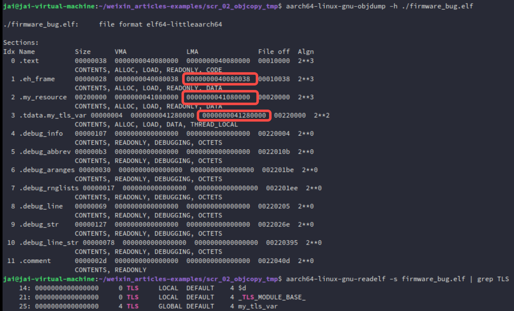

`0x41280000 - 0x40080038 = 17MB`

很合理。之后的他们的改进措施，就是显示地收容这个 `tdata` `section` 了。

这里也有一个名字：没有显示被链接脚本收容的 `section` 就会成为一个 `orphan section`。


# 4. 实践

完整代码见：https://github.com/JAILuo/wechat-demos#


## 4.1 不解压，直接验证

这里直接构建两个版本固件：链接脚本是否管理 `tdata` `section`

```ld
/* bug.ld - 不处理 .tdata，使其成为孤儿section */
OUTPUT_FORMAT("elf64-littleaarch64")
ENTRY(_start)

SECTIONS
{
    /* 代码段放在 0x40000000 */
	. = 0x40080000;
    .text : {
        *(.text.boot)
        *(.text*)
    }
    .rodata : { *(.rodata*) }
    .data : { *(.data*) }
    .bss : { *(.bss*) }

    /* 资源段放在 0x41080000，地址洞 */
    . = 0x41080000;
    .my_resource : { *(.my_resource) }

    /* 这里故意不写 .tdata / .tbss，它们会成为孤儿section，
       被 ld 自动放到所有已知段之后（即 .my_resource 之后） */
}

```

```ld
/* fix.ld - 显式收容 .tdata / .tbss 并放在资源段之前 */
OUTPUT_FORMAT("elf64-littleaarch64")
ENTRY(_start)

SECTIONS
{
	. = 0x40080000;
    .text : {
        *(.text.boot)
        *(.text*)
    }
    .rodata : { *(.rodata*) }
    .data : { *(.data*) }
    .bss : { *(.bss*) }

    /* 显式放置 TLS 段，在资源段之前 */
    . = ALIGN(32);
    .tdata : { *(.tdata .tdata.*) }
    .tbss (NOLOAD) : { *(.tbss .tbss.*) }

    /* 资源段仍放在 0x41000000，但 raw binary 最大 LMA 已经是 .tdata 末尾，
       所以地址洞不会被包含 */
    . = 0x41000000;
    .my_resource : { *(.my_resource) }
}

```

测试 `main.c`：

```C
#include <stdint.h>

// 制造 orphan section 的元凶
__thread int my_tls_var = 0xDEADBEEF;

// 模拟资源段
#define RESOURCE_SIZE (2 * 1024 * 1024)
const uint32_t resource_data[RESOURCE_SIZE / 4] __attribute__((section(".my_resource"))) = {
    [0] = 0xAABBCCDD,
    [1] = 0xEEFF1122,
    [2] = 0x33445566,
    [3] = 0x778899AA,
};

void main_c(void) {
    // 案发现场：我们直接在 GDB 里看这个地址
    volatile uint32_t *magic = (uint32_t *)0x41080000;
    
    // 把值读进寄存器/局部变量，方便 GDB 观察
    volatile uint32_t current_val = *magic;

    // 死循环，让 GDB 有时间介入
    while (1) __asm__ volatile ("wfi");
}
// ...
```

可以直接看 `./build.sh` 的结果：

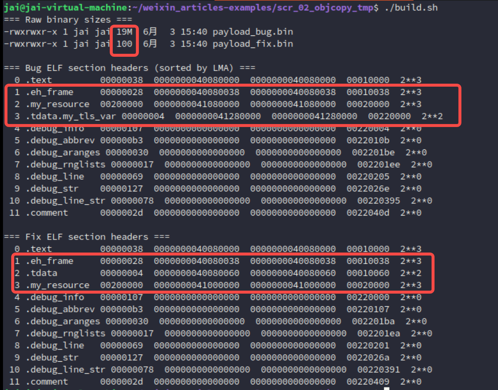

`0x41280000 - 0x40080038 = 17MB` 出现空洞。

此时直接运行：

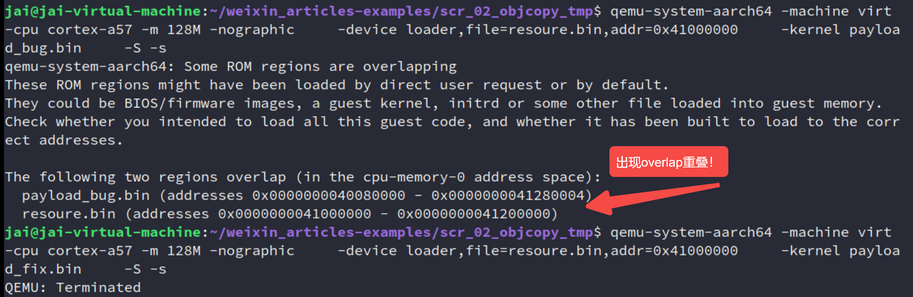

你会发现 `qemu` 直接都不让那个有 `orphan section` 的运行！

因为上面这个模拟复现场景并没有做对 `image` 做压缩，所以 `payload_fix.bin` 镜像就是实际项目中被解压过后的，很大的那个，在这里直接都被拦截下来了。

所以这为你图本质上就是一个 `load-time error`，只是说，压缩与解压缩过后，把他变成了 `runtime crash`！

> 其实我猜应该一些带 OTA 升级、压缩镜像的 `bootloader`，都或多或少遇到这个问题！

那这个时候再看看那个修复过后的现象，就是 `0x41000000` 这个 `resource` 的区域是否被覆写！启动 `gdb`：

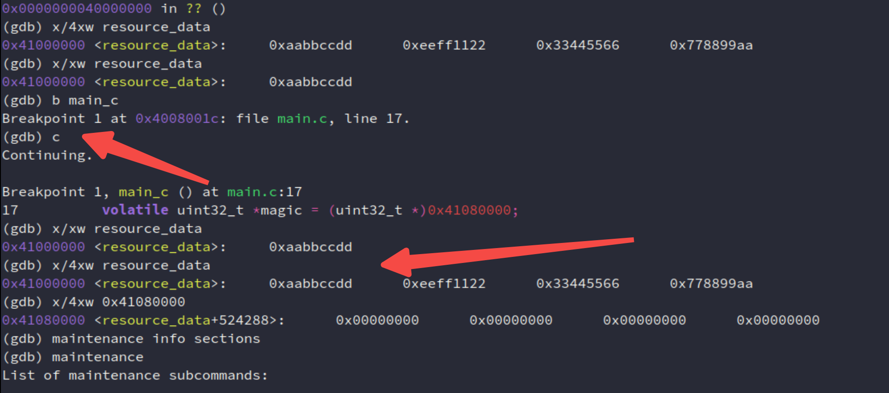

完全没毛病！


## 4.2 加入解压功能再验证

既然上面的问题不太贴合实际项目的开发，那这里直接借助 AI 的力量 `vibe coding` 快速复现！

直接用几十行 Python 和 C 代码手搓一个“Z-RLE (Zero-Run-Length-Encoding)”微型压缩引擎（有点像 `jyy` 老师上课的想法，学到一个新玩意，借助AI快速实践）（实话说，这就花了1min...）。

具体展示代码：

1. 首先新建一个文件夹 `ota_bug_demo`，我们在里面创建所有文件。

    首先是我们的“上位机打包工具”，它将模拟 `lz4` 命令行工具，把巨大的带有地址空洞的 `bin` 文件压缩成极其迷你的格式。

    **新建 `compress.py`：**

    ```python
    #!/usr/bin/env python3
    # compress.py - 模拟 LZ4 对全零数据极高压缩率的微型算法
    import sys
    
    def compress(in_file, out_file):
        data = open(in_file, "rb").read()
        out = bytearray()
        i = 0
        while i < len(data):
            if data[i] == 0:
                # 遇到 0，统计连续 0 的个数 (最多 255)
                count = 0
                while i < len(data) and data[i] == 0 and count < 255:
                    count += 1
                    i += 1
                out.extend([0x00, count]) # 0x00 表示后面是零的个数
            else:
                # 遇到非 0，统计连续非 0 个数 (最多 255)
                count = 0
                start = i
                while i < len(data) and data[i] != 0 and count < 255:
                    count += 1
                    i += 1
                out.extend([count])       # 非 0 数字表示后面跟着几个有效字节
                out.extend(data[start:i])
                
        open(out_file, "wb").write(out)
        print(f"[Host] Compressed {len(data)} bytes to {len(out)} bytes!")
    
    if __name__ == "__main__":
        compress(sys.argv[1], sys.argv[2])
    ```

2. 编写 Stage 2 (业务代码：带着孤儿段的元凶)

    这是我们要解压运行的实际固件。我们将它的链接基址设在 `0x40800000`（给 Stage 1 Bootloader 留出空间）。

    **新建 `stage2.c`：**

    ```c
    #include <stdint.h>
    
    // 万恶之源：孤儿段
    __thread int my_tls_var = 0xDEADBEEF;
    
    // 模拟资源段（编译后会被 objcopy 抽离，由 QEMU 单独加载）
    const uint32_t resource_data[4] __attribute__((section(".my_resource"))) = {
        0xAABBCCDD, 0xEEFF1122, 0x33445566, 0x778899AA
    };
    
    void stage2_main(void) {
        // 案发现场：资源段被映射在这个地址
        volatile uint32_t *magic = (uint32_t *)0x41000000;
        
        volatile uint32_t current_val = *magic;
        
        while (1) __asm__ volatile ("wfi");
    }
    ```

    **新建 `stage2.ld`：**

    ```ld
    OUTPUT_FORMAT("elf64-littleaarch64")
    ENTRY(stage2_main)
    SECTIONS
    {
        /* Stage 2 解压后的运行地址 */
        . = 0x40800000;
        .text : { *(.text*) }
        .data : { *(.data*) }
        .bss : { *(.bss*) }
    
        /* 地址空洞跨越到 0x41000000 */
        . = 0x41000000;
        .my_resource : { *(.my_resource) }
        
        /* 故意不写 .tdata，它会成为孤儿段被排在 .my_resource 之后 (大概 0x4100xxxx 的高位) */
    }
    ```

3. 编写 Stage 1 (Bootloader：套娃与解压)

     

    这是 QEMU 最先启动的代码。它包含了微型解压引擎，并且会将压缩后的 Stage 2 固件“内嵌”到自己的只读数据段中。

    **新建 `boot.S` (Bootloader 入口及汇编套娃)：**

    ```assembly
        .section .text.boot
        .global _start
    _start:
        // 设置 Bootloader 栈顶在 0x40070000 (安全区)
        ldr x0, =0x40070000
        mov sp, x0
        b boot_main
    
        // 【核心科技】：像俄罗斯套娃一样把压缩包塞进代码里
        .section .rodata.payload
        .global payload_comp_start
        .global payload_comp_end
    payload_comp_start:
        .incbin "stage2_compressed.bin"  // 汇编级内嵌！
    payload_comp_end:
    ```

    **新建 `bootloader.c` (微型 OTA 解压引擎)：**

    ```c
    #include <stdint.h>
    
    extern uint8_t payload_comp_start[];
    extern uint8_t payload_comp_end[];
    
    void boot_main(void) {
        uint8_t *src = payload_comp_start;
        // Stage 2 约定的运行基址
        uint8_t *dst = (uint8_t *)0x40800000; 
    
        // 微型解压引擎 (等效模拟 LZ4)
        while (src < payload_comp_end) {
            uint8_t ctrl = *src++;
            if (ctrl == 0x00) {
                // 收到指令：填零。这正是覆盖内存的“推土机”！
                uint8_t count = *src++;
                for (int i = 0; i < count; i++) {
                    *dst++ = 0x00;
                }
            } else {
                // 收到指令：拷贝有效数据
                for (int i = 0; i < ctrl; i++) {
                    *dst++ = *src++;
                }
            }
        }
    
        // 解压完成，跳转到 Stage 2 执行！
        void (*jump_to_stage2)(void) = (void *)0x40800000;
        jump_to_stage2();
    }
    ```

    **新建 `boot.ld`：**

    ```ld
    OUTPUT_FORMAT("elf64-littleaarch64")
    ENTRY(_start)
    SECTIONS
    {
        /* QEMU 启动 Bootloader 的地址 */
        . = 0x40080000;
        .text : {
            *(.text.boot)
            *(.text*)
        }
        .rodata : {
            *(.rodata*)
            *(.rodata.payload) /* 内嵌的压缩包在这里 */
        }
        .data : { *(.data*) }
        .bss : { *(.bss*) }
    }
    ```

4. 一键构建脚本 (见证奇迹的时刻)

    把上述所有逻辑串联起来，完成编译、抽离资源、制造地址洞、压缩、套娃编译全流程。

    **新建 `build.sh` 并赋予执行权限 (`chmod +x build.sh`)：**

    ```bash
    #!/bin/bash
    set -e
    
    echo ">>> 1. 编译 Stage 2 (业务代码) ..."
    aarch64-linux-gnu-gcc -c -g -nostdlib -mcpu=cortex-a57 stage2.c -o stage2.o
    aarch64-linux-gnu-ld -T stage2.ld stage2.o -o stage2.elf
    
    echo ">>> 2. 抽离 Resource 给 QEMU 用，并生成带有幽灵空洞的 Bin ..."
    aarch64-linux-gnu-objcopy -O binary --only-section=.my_resource stage2.elf resource.bin
    aarch64-linux-gnu-objcopy -O binary --remove-section=.my_resource stage2.elf stage2.bin
    
    ls -lh stage2.bin # 你会在这里看到一个 8MB+ 的巨型文件！
    
    echo ">>> 3. 压缩 Stage 2 (模拟 LZ4 极限压缩 0x00) ..."
    python3 compress.py stage2.bin stage2_compressed.bin
    ls -lh stage2_compressed.bin # 奇迹出现：8MB 变成了几百个字节！
    
    echo ">>> 4. 编译 Stage 1 (Bootloader，内嵌压缩包) ..."
    aarch64-linux-gnu-gcc -c -g -nostdlib -mcpu=cortex-a57 boot.S -o boot.o
    aarch64-linux-gnu-gcc -c -g -nostdlib -mcpu=cortex-a57 bootloader.c -o bootloader.o
    aarch64-linux-gnu-ld -T boot.ld boot.o bootloader.o -o bootloader.elf
    
    echo ">>> 构建完成！准备启动 QEMU..."
    ```


有了基础准备后，看结果！

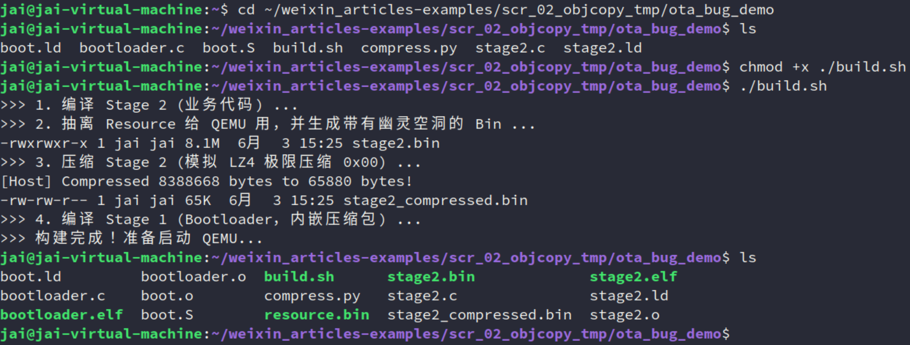

确实从 8MB 压缩到了这么多！

然后调试！

```bash
qemu-system-aarch64 -machine virt -cpu cortex-a57 -m 128M -nographic \
    -device loader,file=resource.bin,addr=0x41000000 \
    -kernel bootloader.elf \
    -S -s
```

注意了，现在就不会报 `overlap` 了！因为 kernel 现在是微小的 `bootloader.elf`，它乖乖地待在 `0x40080000`，绝对不会和 `0x41000000` 冲突加载期一片岁月静好。)

开启 `gdb`：

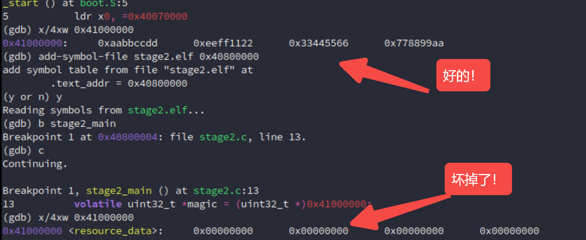

完美！

画个图看看：

1. `qemu` 加载器（解压前）

    ```TXT
    物理内存地址 (LMA)               内存内容 (What's in RAM?)
        +------------------+ <--- 0x41200000 (安全区)
        |                  |
        |  [ QEMU 加载 ]   | ---> 0x41000000 : 0xAABBCCDD... (Resource Data，完好无损)
        |  resoure.bin     |
        +------------------+ <--- 0x41000000
        |                  |
        |                  |
        |                  | ---> 绝对的安全空地 (这里本来是给解压留的空间)
        |                  |
        |                  |
        +------------------+ <--- 0x40800000 (Stage 2 预定解压目标地址)
        |                  |
        |                  |
        |  [ QEMU 加载 ]   | ---> bootloader.c & boot.S
        |  bootloader.elf  | ---> 内嵌的 stage2_compressed.bin (仅 65KB!)
        +------------------+ <--- 0x40080000
        |   Boot 栈空间    | ---> 0x40070000 (sp)
        +------------------+
    ```

2. 解压运行期

    ```TXT
    物理内存地址 (LMA)               内存内容 (What's in RAM?)
        +------------------+ <--- 0x41200xxx (实际解压终点 = .tdata 孤儿段所在处)
        |  孤儿段 .tdata   | ---> 解压出来的 0xDEADBEEF (在这里！)
        +------------------+ 
        | 💀 灾难发生区 💀 | ---> 0x41000000 : 0x00000000... (被零淹没，Resource 阵亡)
        |                  |
        | ^^^^^^^^^^^^^^^^ | ---> 解压推土机一路向高地址推进
        | |||||||||||||||| |
        |  (约 8MB 的 0x00)  | ---> 这里本该是空地，但 objcopy 把 VMA-LMA 偏移当成了有效数据
        | |||||||||||||||| |
        |                  |
        +------------------+ <--- 0x40800000 (Stage 2 的 .text 正常解压)
        |                  |
        |  Bootloader (存活)|
        +------------------+ <--- 0x40080000
    ```

OK！

当然，如果还想折腾，用另一种调试，`watchpoint` 玩玩：

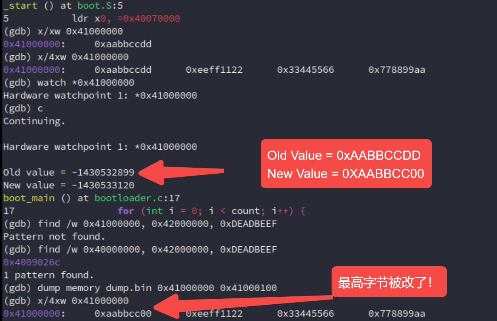

一样！而且更早出现问题，这个地址被改就出现问题！还直接通过 `find` 命令告诉那个孤儿段的值被解压到了哪里 `0x4009026c`！

当然，`gdb` 还能 `dump` 出来，通过上面的 `dump.bin`，小端序：高位高地址，就是那个 `DD` 被改了喔！

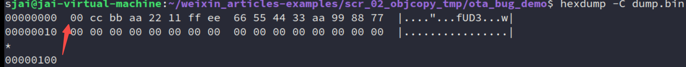

至此，这个问题也算瞎玩了一遍。

其实最后，可以类比到 Linux 那边，这肯定也有遇到类似的问题的！也有解决方案：

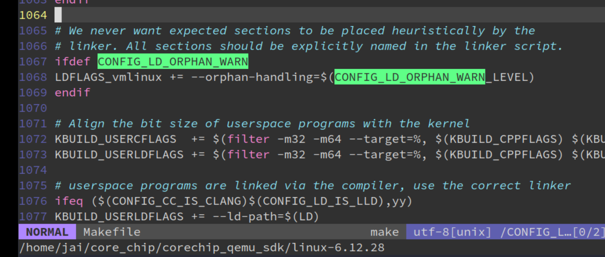

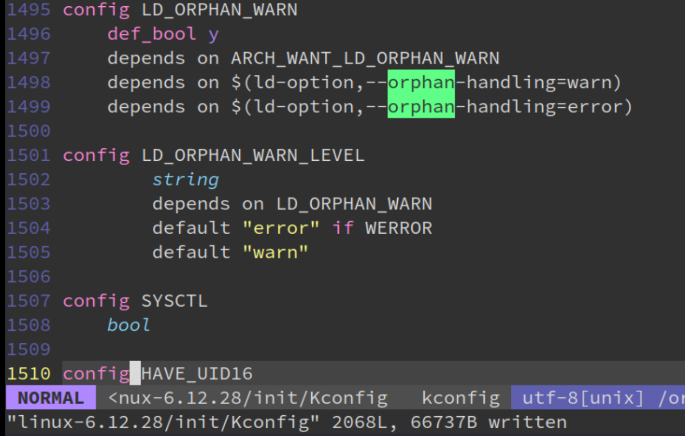

就可以用到本篇的问题，加入了这个后，有孤儿段链接就会报错：

`aarch64-linux-gnu-ld -T bug.ld --no-gc-sections --orphan-handling=error main.o -o firmware_bug.elf`：

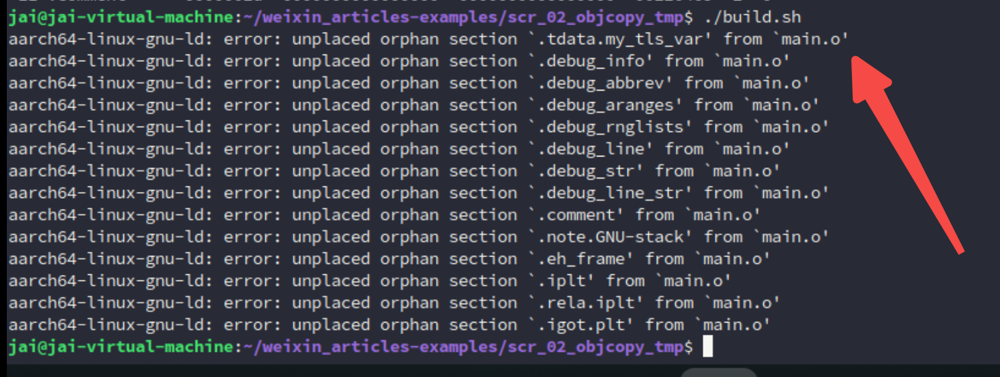


# 5. 拓展

实际上，上面的复现过程中涉及到的内容都是挺有意思的！

链接器、链接脚本、`orphan section`、`objcopy`、`QEMU` 加载器、`GDB` 符号表、压缩/解压缩......

推荐去看各种优秀、官方的文档，借助 AI，实践的飞快！

这里我还问了 KIMI，帮我总结各种文档：

> Click the link to view conversation with Kimi AI Assistant https://www.kimi.com/share/19e8c94c-bf32-8b55-8000-00007780dd19


真能学到很多东西！比如：

- 嵌入式系统中，`.tdata` 和 `.tbss` **必须按固定顺序放置**，通常是 `.tbss` 在前（NOLOAD），`.tdata` 在后（有初始值）。
- SEGGER 给出的链接脚本模板和你的修复方案完全一致：显式收容 `.tdata` 和 `.tbss`，放在 `.data/.bss` 之后、资源段之前。
- **"TLS sections are not adjacent"** 是另一个常见错误，说明链接器对 TLS 段的相邻性有要求。


# 参考资料

[1] LZ4 (compression algorithm) - Wikipedia：https://en.wikipedia.org/wiki/LZ4_(compression_algorithm)

[2] 未初始化的全局变量占不占固件空间：https://mp.weixin.qq.com/s/DAPoV3Zk-xmB1rek8yHbsw

[3] SYSTEM V APPLICATION BINARY INTERFACE：https://refspecs.linuxfoundation.org/elf/gabi41.pdf


