> **注意：以下的内容均为个人观点+在学习/实践中得出。**
>
> **如果你看完后有不同的观点也没关系！请指出，我很乐意去尝试积极的东西。**

封面：

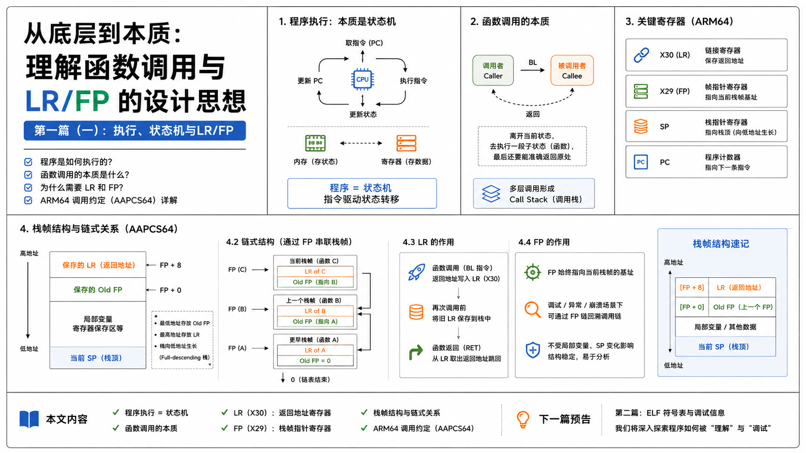

# 1. introduction

在日常 `gdb` 调试、解 `coredump` 的时候，我们基本都会使用到这个命令：`bt/backtrace`，会被告诉说这个命令使用来看栈回溯的，看调用链就行，但是结合我的之前的实习经验来看，如果出现了以下这种情况^[1]^：

```bash
(gdb) bt 
#0  0xb38e32c4 in pthread_getname_np () from /home/enrique/buildroot/output5/staging/lib/libpthread.so.0
#1  0xb38e103c in __lll_timedlock_wait () from /home/enrique/buildroot/output5/staging/lib/libpthread.so.0 
Backtrace stopped: previous frame identical to this frame (corrupt stack?)
```

如果不明白内部以及一些 `ELF` 的基础知识，往往会抓瞎，甚至得出错误的 `debug` 结论。

比如我实习的时候就遇到了和上面一样的 `corrupt stack`，甚至在周会汇报上（还没和 `mentor` 交流...），脑子一热（其实自己当时也不确定，有侥幸心理的）直接就说出了 `stack` 坏了的结论，直接就被大佬怼了。

而会后了解相关的背景知识后，才发现自己真的是 `too young too simple`，这也是准备写这几篇文章的缘由。

> 那个时候也可以说是第一次明白新手和真正的工程师的差距，在没有是实习之前，我想的一直都是说，反正平时我自己也写了一些东西了，`bug` 也调一堆，实习进去总不会这么菜吧。
>
> 确实。进去之后发现和一般的实习生/同事相比其实水平都差不多，甚至犹有过之，但是和真正优秀的工程师差距其实还是肉眼可见的。
>
> 其中最让我明白差距的就是：**大家不会轻易对一个问题下结论，因为整个系统过于复杂，没有人能搞明白所有的东西，大家都是根据观察到的现象进一步去推导可能的事实，然后再证明或证伪。**
>
> 扯远了，只是有所感悟罢了。

回到这里 `gdb` 的 `backtrace` 的问题，鉴于上面的经历，所以我打算写一个小的系列笔记，写自己觉得需要补充的：`ELF` 符号表、调试信息、`gdb` 内部的实现 `backtrace`、`arm64` 的调用内容等等内容，大概就三、四篇。

**本文主要讲的是自己理解的程序执行/函数调用的本质、以及部分的 Procedure Call Standard for Arm Architecture (AAPCS)，最后会给出一个小 `demo` 关于 `dump` 的。**


# 2. 状态机

## 2.1 程序执行

按照 `first principle`，先忘记 `gdb`，站在 `CPU` 侧，理解函数调用的本质。

`CPU` 只会执行我们安排好给它的指令，不管是在写什么语言的应用程序，还是像 Android、`os` 等比较 `low-level` 的代码，本质就是二进制的东西：`01010111000....`

而且，如果把现代计算机的结构剥离到只剩最核心的部件，基本就只剩下这几样：

- 存储器 (Memory)：装指令和数据的地方（存状态）
- 寄存器 (Registers)：CPU 内部极快、极小的暂存空间（不断和存储器做数据交换太耗时）  
- 程序计数器 (PC)：永远指向下一条要执行的指令

> 注意：从计算理论来看，寄存器并不是必须的：因为只要有办法保存当前的状态，那理论程序上就能够无限运行下去。
>
> 上面概念的本质就是我们熟悉的 `Turing Machine`（它的“状态”是通过读写无限长的纸带并改变内部状态来管理的）^[2]^。

计算机唯一会做的就是这个死循环：

```C
while (1) {
	从 PC 指示的内存地址取出指令;
	执行指令 (顺便算算加减法、挪挪寄存器里的值);
	更新 PC;
}
```

如果学过一些数字逻辑电路，那你就能明白一个非常重要点：计算机是一个状态机^[3]^：

> 既然计算机是一个数组逻辑电路, 那么我们可以把计算机划分成两部分, 一部分由所有时序逻辑部件(存储器, 计数器, 寄存器)构成, 另一部分则是剩余的组合逻辑部件(如加法器等). 
>
> 这样以后, 我们就可以从状态机模型的视角来理解计算机的工作过程了: 在每个时钟周期到来的时候, 计算机根据当前时序逻辑部件的状态, 在组合逻辑部件的作用下, 计算出并转移到下一时钟周期的新状态.
>
> 计算机的这个视角有什么用呢? 好像除了让你明白计算机硬件不再那么神秘之外, 也没什么特别的用处. 毕竟ICS课不要求大家用硬件描述语言来实现计算机硬件, 大家只要相信这件事能做成就可以了.
>
> 不过对于程序来说, 这个视角的作用会超乎你的想象.

有兴趣的可以去做 NJU 的计算机系统基础实验^[3]^，就这么说吧，**只要你能认真地独立完成这个实验，你就会有勇气面对所有的 `bug`**。但这不是我们的重点。

既然计算机是一个状态机，那么运行在计算机上面的程序又是什么呢？可以想当然的回答，程序也是状态机。

但如果程序是状态机，那他的初始状态是什么？

很直白的，前文就说了，存储器/寄存器中存储着程序当前的状态，那状态如何迁移？

那状态迁移又是怎么做的？就是经过某种操作改变了状态，改变了存储器中的状态，仔细想想想，计算机指令似乎干的就是这事！指令就是输入，每执行一条指令，`CPU` 的寄存器和内存状态就发生一次确定的转移！合理

看看下图^[2]^：

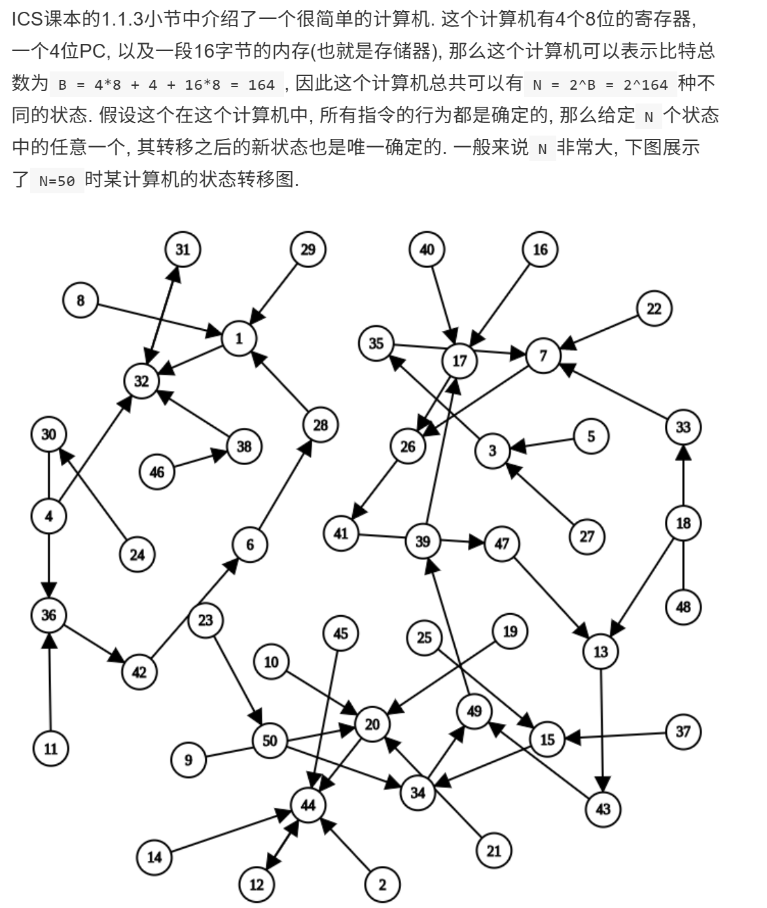

可以得出推论，**程序也可以看成一个状态机**，非常推荐去看 [2] 中关于程序是状态机的部分，写的很好！


## 2.2. 函数调用

既然程序是一个随着指令流不断变化的状态机，那我们写的代码的函数调用是个啥？

如果代码只是一条直线，PC 无脑 +1 往下跑不就行了，显然不对，进入到别的函数后，你还得回来，所以进一步理解，函数调用的本质：

“离开当前状态，去执行一段子状态（机），最后还要能准确无误地回到离开时的位置”

很自然，怎么记住离开地址/返回地址？直接存起来就行，存储器嘛。（自然就会带来相比寄存器，内存太慢了的问题）

接着就到了很多文档资料都能搜到的内容了，挺无聊的，AI 总结：

> 函数调用有一个天然的特性：**后进先出（LIFO）**。
>
> A 调 B，B 调 C，最后一定是 C 先返回，再 B 返回。这完美契合了栈（Stack）这种数据结构。
>
> 于是，栈指针（Stack Pointer, 简称 SP）诞生了。 在早期的 x86 等架构中，栈和 SP 几乎包揽了所有脏活累活：
>
> - 调用函数？把返回地址 `push` 进栈（SP 减小）。
> - 传参数？把参数 `push` 进栈。
> - 存局部变量？把 SP 往下挪，腾出空间。

而上面这种多层函数调用（也就是嵌套），也会被叫为 `call stack` 了。

进一步，每个函数调用在 `stack` 上占据一块区域，称为各自的 `stack frame` 。

> 而且，为了区分不同的帧（避免搞混，比如同一个函数被递归调用多次），GDB 给每个帧一个帧 ID（具体怎么分，会在第三篇的时候写）

但上面的内容和现代的 `CPU` 还有点差距，最大的原因：内存相比寄存器太慢了点，快快快，还要在快。

也就进一步实现：`LR(link register)` 和 `FP(frame pointer)`。


### 2.2.1 LR 寄存器

LR 寄存器没什么好说的，直接看文档^[4]^：

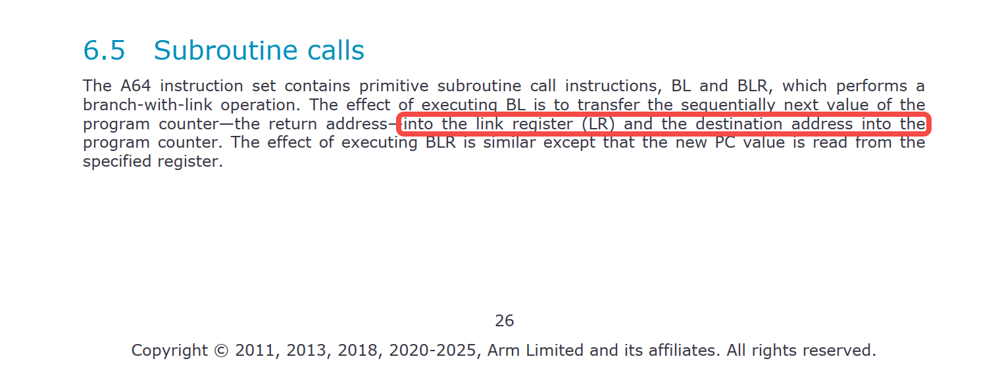

当发生函数跳转（执行 `bl` 指令）时，不再主动去压栈，而是直接把返回地址塞进一个专属的高速寄存器中——链接寄存器（Link Register, 简称 LR，也就是 x30）。

我们直接把返回地址放到 LR 中后，访问速度确实快了，但是还有一个问题，想象这么一串函数调用：`A() → B() → C()`

能很简单地就想到新的调用 `B()/C()` 的 `bl` 指令会无情地覆盖掉 `x30` 里 `A()/B()` 的返回地址，所以设计者们还使用到了栈：`B()` 在准备调用 `C()` 之前，把旧的 `x30` 保存到内存（栈）里。


### 2.2.2 FP寄存器

但是 `fp(frame pointer)` 很有意思。

历史上解决这个问题的背景是这样的：

> 在一个函数内部，只要你申请一个局部变量，或者动态分配一点内存，SP 就会上下乱窜。
>
> 如果在调试或者发生 Coredump 时，想通过 SP 往回推导调用链，你会发现根本找不到规律——因为你不知道上一个函数的返回地址到底被埋在了 SP 偏移多少的位置。

所以为了解决前面提到的“SP 上下乱窜找不到北”的问题，AAPCS64 引入了 FP 的设计——**栈帧指针（Frame Pointer, 简称 FP，也就是 x29）**。

无论 SP 在函数执行时怎么跳动，FP 一直都指向当前执行函数的 `stack frame` 的起始位置（栈底），或或者按照手册^[4]^：比较不那么直白的定义：

> The frame record for the innermost frame (belonging to the most recent routine invocation) shall be pointed to by the frame pointer register (FP).
>
> 最里面的帧（属于最近的函数调用）的帧记录应由帧指针寄存器（FP）指向。

再来看看官方文档^[4]^：

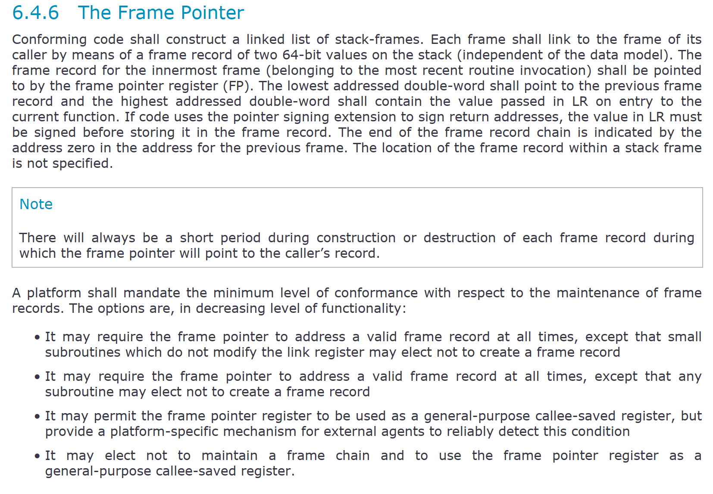

文档要求对于 `arm64` 的函数调用，需要构建一个 `linked list of stack-frames`。

意思就是构建一个由 `stack frame` 作为节点的物理链条/表，其中每一个 `frame` 节点由两个双字，也就是两个 `64-bits` 组成（就是FP 寄存器 + LR 寄存器啦）。

但是具体怎么串起来的？这个链表的 `next/prev` 节点是啥？

别忘了，FP 存的就是上一个 `stack frame` 的其实位置呀。自然就能串起来了。

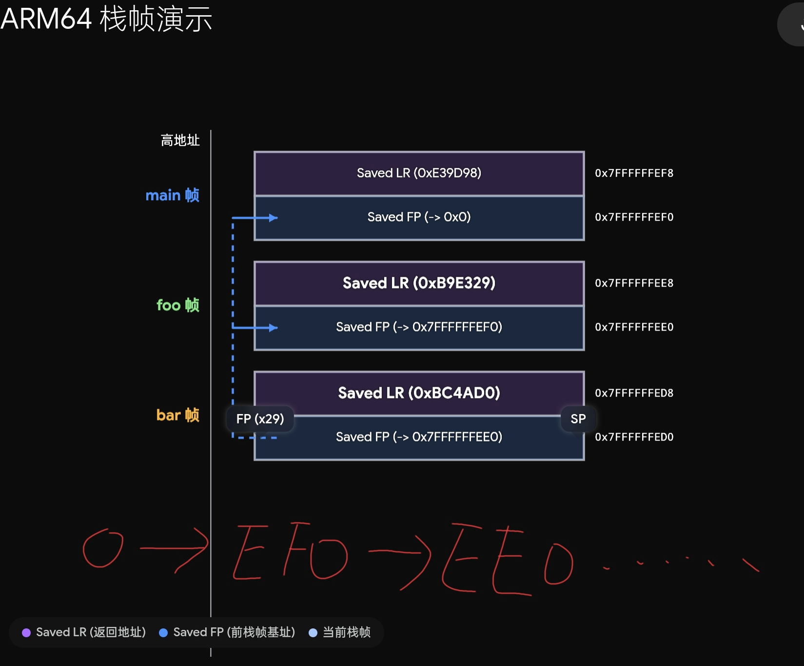

注意起始 FP 是0：

> The end of the frame record chain is indicated by the address zero in the address for the previous frame.

还有一点，关于 LR 和 FP 的位置，手册明确指明：

> The lowest addressed double-word shall point to the previous frame record and the highest addressed double-word shall contain the value passed in LR on entry to the current function.

也就是 LR 寄存器存放在地址空间的高位，FP则放在地址空间的地位。

再结合手册的 `full-descending` 栈（向低地址方向生长，同时 SP 指向最后一个压入 `stack` 的数据，不是下一个空闲位置）：`[limit, base)`

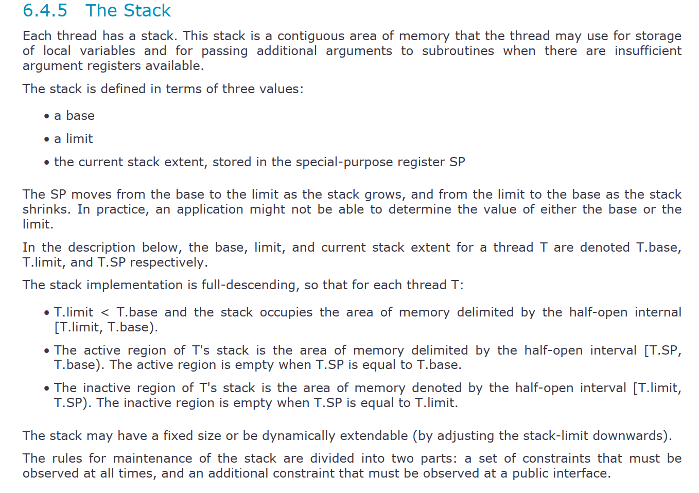

也就是我上一张图片画的那样的位置了，或者如下文字图：

```
高地址 (High Address)
                | ... 上个栈帧的局部变量 ...|
                +---------------------------+ 
Old FP 指向 ->  | ... 上个栈帧的基址 ...       |
                +===========================+  <--- 当前栈帧的 FP (x29) 指向这里 (栈帧底 / 高地址)
                | 保存的 LR (x30, 返回地址)   | 
                +---------------------------+  <--- FP + 8
                | 保存的 Old FP (上一个x29)   | 
                +---------------------------+
                | 当前函数的局部变量           |
                | 寄存器保护区等              |
                | ...                       |
                +===========================+  <--- 当前的 SP 指向这里 (栈顶 / 低地址)
       低地址 (Low Address)
```

这也可以看出，如果要做 `stack backtrace`（调试分析 `coredump` 或 `Oops` 信息）时，调试器只需要拿到当前的 `FP`：

1. 读 `*FP` 就能跳回上一层函数的栈底。

2. 读 `*(FP + 8)` 就能知道上一层函数是在哪里调用的。

    如此循环，就能完整地把整个函数调用链（Call Stack）从低地址（深层调用）向高地址（浅层调用）串联并还原出来。

其实在写到这里，大致有点没眉头了，在我实习之前了解到的程序也就到这里为止了。

> 如果看过一些 `arm64` 的函数调用的开头代码：
>
> ```ASM
> stp x29, x30, [sp, #-16]!   // 把旧的 FP 和 LR 压入栈中，同时 SP 下移 16 字节
> mov x29, sp                 // 让当前的 FP 指向新的栈顶
> ```
>
> 这两步做的基本就是构建当前函数 `stack frame` 了。

总结一下：

理解了前面说的，看明白了基于 `fp` 构建的 `linked list of stack frame`，大概就也能才到一点 `arm64` 的 `backtrace` 的实现了！

回想一下，这是不是就是 2.1 说到的，程序是个状态机的实际体现？`stack frame` 中存储好了状态，每次一次函数调用是不是就切换状态，甚至说是切换到子状态机！

而 `backtrace` 是不是就是根据 `memory` 和 寄存器（`stack frame` 和 FP 寄存器）去”猜“出当初那个状态机是怎么走过来的？

再回到第一章说的：

```BASH
(gdb) bt 
#0  0xb38e32c4 in pthread_getname_np () from /home/enrique/buildroot/output5/staging/lib/libpthread.so.0
#1  0xb38e103c in __lll_timedlock_wait () from /home/enrique/buildroot/output5/staging/lib/libpthread.so.0 
Backtrace stopped: previous frame identical to this frame (corrupt stack?)
```

是不是只要一旦内存状态不符合 GDB 的预设规则，`backtrace` 就罢工了，丢给你一句 `corrupt stack?` 啦？好像什么都串起来了？


# 3. 拓展

在这一篇：[你的技术想象力，受限于你的信息边界](https://mp.weixin.qq.com/s/0iWsRplRTopvvkK5dpPx4A) 中，写道：

“（我觉得）在这个时代的下，你们最需要的就是有一个清晰的概念什么事情是能办到的，因为人没有办法做自己想象不到的东西，而扩展你的想象力的方式就是去看别人想到了什么。“

所以，在今后的文章中，考虑篇幅合适的情况下，我都会用以上类似的 `prompt` + 本文前面几章的总结 + ARM 官方手册，去和 AI 聊，让 AI 帮我看看有什么冷门但重要的东西值得去看看的！

下面写我觉得有意思的


## 3.1 指针签名（Pointer Signing）—— 防 ROP 攻击

在 AAPCS64 手册里有这么一句话：`pointer signing extension`

> *If code uses the pointer signing extension to sign return addresses, the value in LR must be signed before storing it in the frame record.*
>
> *如果代码使用指针签名扩展对返回地址进行签名，则必须先对LR中的值进行签名，然后再将其存储到帧记录中*

按照之前的理解，FP 指向上一帧，`[FP]` 存上一帧的 FP，`[FP+8]` 存返回地址 LR。

也就是：`LR = Return Address`

但是现在的工程现实变成了：`LR = Return Address + Signature`

原因在于 ARMv8.3-A 引入了指针认证（`PAuth`），返回地址被加密签名。保存在栈帧里的 LR 必须是**已签名**的版本，返回时再验证。

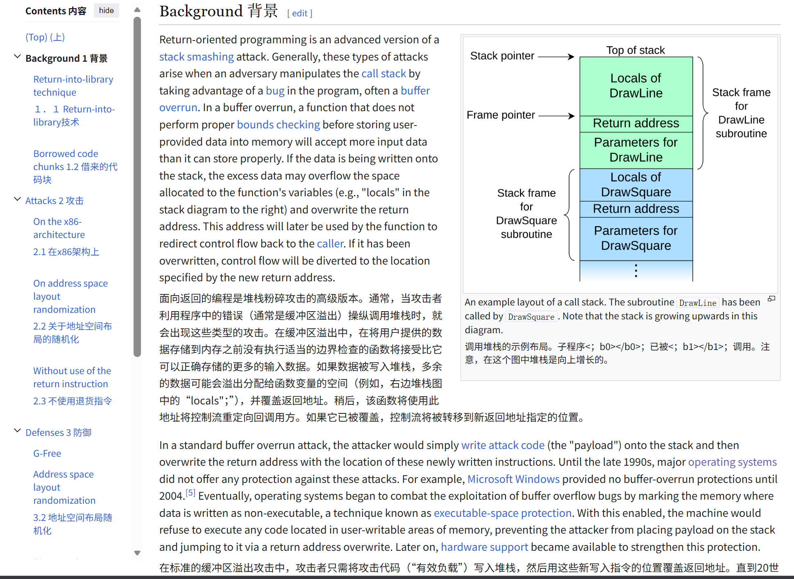

没理解这一点的话，理解就会停留在“裸地址”。

这部分我直接展示实践例子结果，完整代码参考：https://github.com/JAILuo/wechat-demos

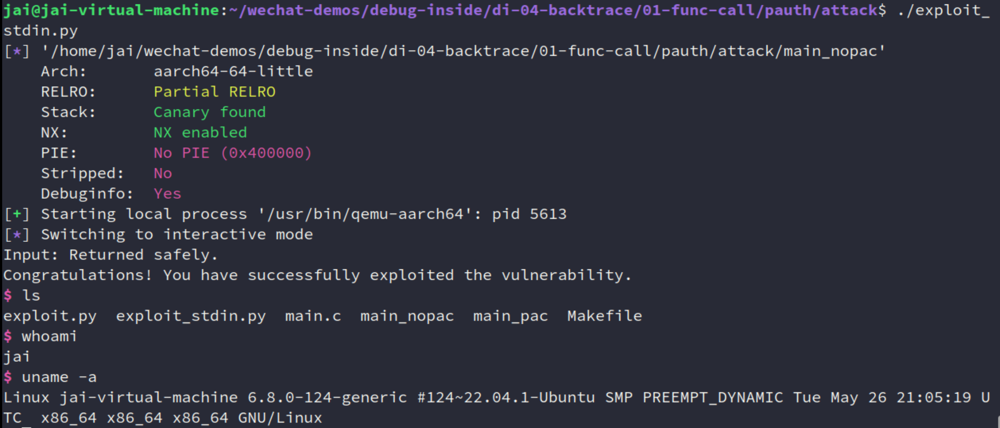

可以看到如果是执行 `main_nopac`，我们确实直接劫持了控制流，执行了我们代码中特定插入的 `system(/bin/sh)`，

如果是执行 `main_pac`，直接崩溃：

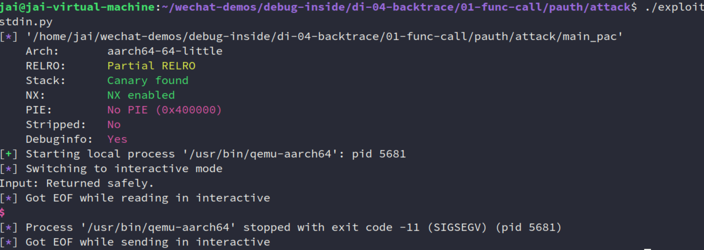

尽管上述内容获得的运行权限只是一个普通用户（如果是内核态搞出了这个，那就可以执行任意内核代码了），但有学习意义的，对于我们做 BSP 的人来说，可以参考知道有这个问题。

而且，回到我这系列的主题 `backtrace`，如果你直接在 `gdb` 中输入 `bt`，因为是比较老的调试器，所以非常有可能找不到符号，或者 `bt` 挂掉：

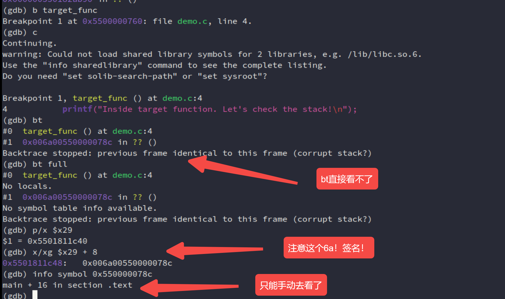

当然这个时候，还是有一些解决办法的：

- 手动看这个地址，人肉去除签名，像上面一样
- 升级 GDB 工具？我没试过（因为我这里已经是 GDB 12.1了，但仍有问题）
- python脚本辅助自动化吧，写一个  Frame Filter 或 Unwinder 脚本，GDB 读 `[FP + 8]` 的时候，拦截这个动作，做：`new_pc = raw_pc & 0x0000FFFFFFFFFFFF`

考虑到篇幅就不再说了。

如果对安全感兴趣的，推荐阅读以下文档：

- Code reuse attacks: the compiler story：https://developer.arm.com/community/arm-community-blogs/b/tools-software-ides-blog/posts/code-reuse-attacks-the-compiler-story
- Pointer Authentication on Arm | Arm Learning Paths：https://learn.arm.com/learning-paths/servers-and-cloud-computing/pac/pac/
- Ret2win - arm64 - HackTricks：https://hacktricks.alquymia.com.br/binary-exploitation/stack-overflow/ret2win/ret2win-arm64.html#finding-the-offset

实际上，AI 还给了另外一点东西：

> 如果想更深入、更确信 ROP 的防御原理，可以借 **Linux Kernel LKDTM**（Linux Kernel Dynamic Memory Testing Module，内核动态内存测试模块）这个现成的基础设施来展示破坏 PAC 的后果。
>
> LKDTM 是内核专门用于测试安全特性的模块。它包含一个叫 `CORRUPT_PAC` 的测试点，在内核启用了 `CONFIG_ARM64_PTR_AUTH`（指针认证内核配置）的情况下，**主动将当前函数返回地址的 PAC 签名擦除**（直接把 LR 高位清 0，破坏完整性），然后让它返回，触发内核 abort。这是 **验证 PAC 有效性的最直接方法**。

想深入就再问问 AI 吧！


## 3.2 其他

其他的内容我觉得也挺有意思，但是我不展开写了，不是重点。

- LR 本质是返回地址 Cache（容量只有8byte的，专门针对返回地址的）

    比如A → B → C：

    如果状态B不再调用其他函数，这个Cache就“命中”了。函数执行完直接`RET`（把LR的值塞回PC），全程零内存交互，极大地加速了状态恢复。

    如果状态B还要调用状态C，新的返回地址会覆盖LR。这时就发生了“Cache驱逐（Eviction）”——旧的LR值必须被压入栈（内存）中保存。

- Tail Call 会让调用栈消失

- 不是所有平台都展开FP

    > A platform shall mandate the minimum level of conformance … It may permit the frame pointer register to be used as a general-purpose callee-saved register … It may elect not to maintain a frame chain …

    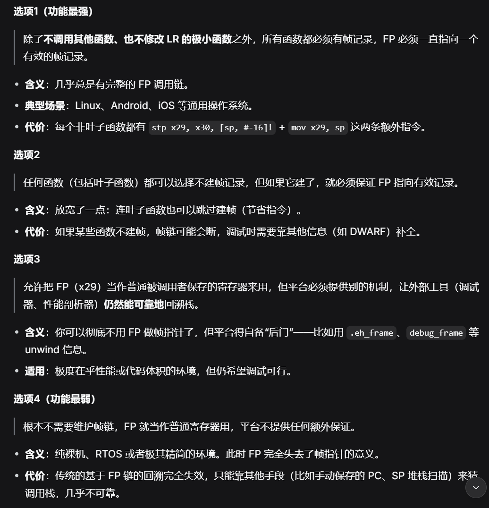

- 引入 动态链接、PLT、GOT的

    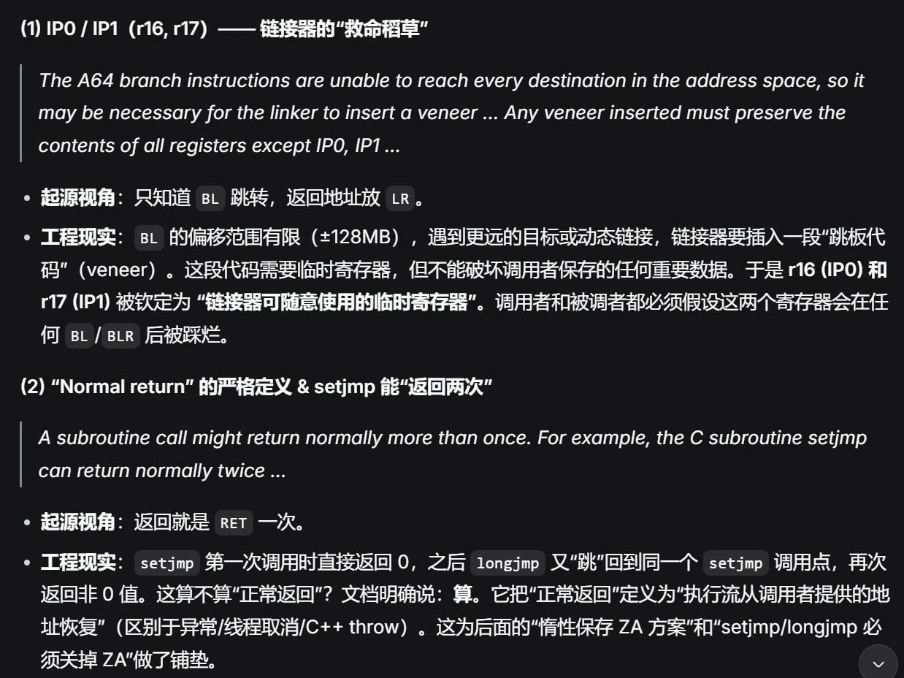

......

很多。


# 4. 深入理解

最后这里讲讲”程序是个状态机“这一推论自己的理解。

1. 既然每一个程序都是状态机，都是从某个初始状态经过各种状态迁移变成了如今程序的样子，那在我调试的时候一样可以用这个理论！

    **所谓 bug，那就是原本程序有一个正常/正确的执行流（状态机），而因为某种不知名的原因，导致程序做了一步偏离我本意的状态迁移，从而导致 bug 的产生。**

    这个理论，也是我一直以来调试程序的总结出来的自己的方法，尽管是一个理论上/比较抽象的总结，但我也因此解决了很多问题！

    我在这篇文章中也写了：[自用的问题调试排查](https://mp.weixin.qq.com/s/PNqGyIRGHcyj1wFxYdz2Sg)

2. 第二个则是和本系列的 `backtrace` 或许更加相关

    **只要有 memory 和 regs，就能完整地保存一个程序在某个时刻的状态！各种 dump（`coredump`、`ramdump`...）就是给这个状态机拍照！**

重点是第二个观点。

> 可能有人好奇为什么叫 `dump`：

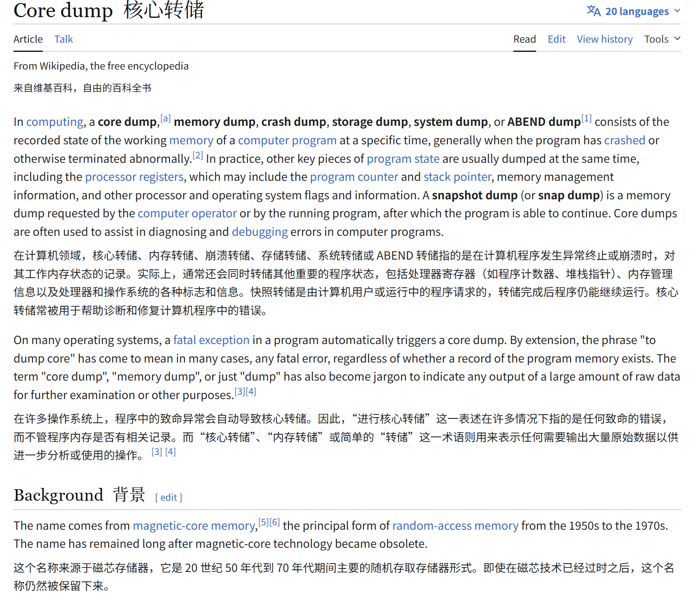

> 计算机发展的早期（1960-70年代），主流存储器是磁芯存储器（Magnetic Core Memory）。它由无数个微小的磁性圆环（磁芯）组成，每个磁芯能存储一个比特（0/1）。
>
> 所以，当时的程序员和工程师就直接用 `Core` 来指代计算机的**内存**。
>
> 因此，当程序崩溃时把内存内容保存下来，就自然叫做 `Core Dump`。

> `Dump` 原意是“倾倒”、“倒垃圾”。在计算机领域，
>
> - 粗暴、不加区分：Dump 就是把内存里的所有原始数据（二进制 0 和 1）一股脑地倾倒出来，就像一个卡车把整车垃圾直接卸在地上。它不关心哪些数据有用、哪些没用，也不会重新整理或翻译。
> - 原始、未经处理：这个文件是内存的“快照”，是纯粹的原始副本，不是格式化的报告。


我让 AI 做了以下的内容：

用一个很小的、可运行的 **Python 项目**，手工实现一个“微型状态机 + dump/restore”的 demo，来印证这个理论：

- 一个运行中的程序 = 内存数据 + 寄存器 + 程序计数器 (PC)

- 只要把这些值完整保存下来，就能在之后 **完全恢复** 并继续执行。

- 模拟一个极简的 CPU（只有 3 个寄存器、256 字节内存），执行几条指令。

    然后在某个时刻 **dump 到 JSON 文件**，之后 **load 回来继续跑**，状态完全一致。

直接看结果（代码依然在：https://github.com/JAILuo/wechat-demos）：

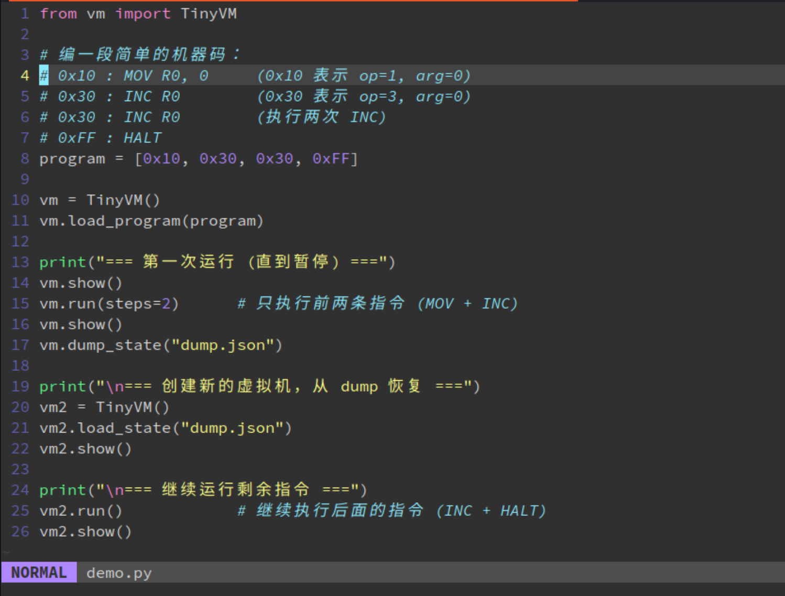

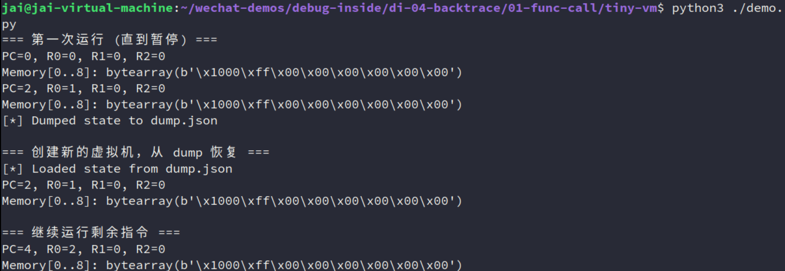

可以想象，基于这个想法，memory + regs，再加上各 ISA 的通用寄存器，特殊状态寄存器：`mcause`、`cr3`、`CPSR`、`PSTATE(抽象概念)`、`SPSR_ELx`、`ELR_ELx`等等，程序的行为是不是就能被复原出来！`coredump` 的基础不就是这样吗？！

所以，本文写了一些很基础的东西，但是很多的工具、基础设施都是建立在这之上的呀！


至此，本文已完成，下一篇讲述符号表、调试信息等 `ELF` 相关的东西。


# 参考

[1] Figuring out corrupt stacktraces on ARM：https://eocanha.org/blog/2020/10/16/figuring-out-corrupt-stacktraces-on-arm/

[2] Universal Turing machine - Wikipedia：https://en.wikipedia.org/wiki/Universal_Turing_machine#cite_note-FOOTNOTEDavis2000193_quoting_''Time''_magazine_of_29_March_1999-5

[3] NJU ICS PA：https://nju-projectn.github.io/ics-pa-gitbook/ics2025/1.2.html

[4] AAPCS64 文档

