> **注意：以下的内容均为个人观点+在学习/实践中得出。**
>
> **如果你看完后有不同的观点也没关系！请指出，我很乐意去尝试积极的东西。**

封面：


# 1. introduction

第一篇[backtrace系列（一）：从底层到本质：理解函数调用与 LR/FP 的设计与思想](https://mp.weixin.qq.com/s/ULNN7Pz7TmwUwRRB9U1HGg)中，我们按照以下的逻辑走了一遍：

> "程序是状态机" → "函数调用" → "`stack frame`" → "`backtrace`" → "`corrupt stack"`。

第一篇最重要的观点是：“程序是什么”。

而本文想要讲的是：”调试器究竟是怎么知道函数/变量在哪里？运行起来呢？“。

本篇讲的也正是我第一篇遇到这个问题时下错误结论的原因：

> 来源：[1]
>
> ```bash
> (gdb) bt 
> #0  0xb38e32c4 in pthread_getname_np () from /home/enrique/buildroot/output5/staging/lib/libpthread.so.0
> #1  0xb38e103c in __lll_timedlock_wait () from /home/enrique/buildroot/output5/staging/lib/libpthread.so.0 
> Backtrace stopped: previous frame identical to this frame (corrupt stack?)
> ```
>
> " `stack` 坏了" ❌

内部原因或许对于有经验的人来说很简单，就是 ELF 符号表和调试信息的理解问题。

但我想从我遇到的问题和行为出发，或许会写的更明白点：**“为什么生产环境上的 stripped 二进制，GDB 什么都看不出来？”**

或许大家觉得有点蠢，但这种梳理方式更适合我。


# 2. Symbol Table（符号表）

## 2.1 CPU 不认识函数名

第一篇就讲过，`CPU` 只会执行我们安排好给它的指令，不管是在写什么语言的应用程序，还是像 Android、`os` 等比较 `low-level` 的代码，本质就是二进制的东西：`01010111000....`

也就是说，我们想要看到的函数名也只是一堆的存放在某个地址的二进制罢了，比如：

```C
void foo(void) {
	...
}
```

编译后：

```ASM
0000000000400790 <foo>:
```

`CPU` 执行：`PC = 0x400790` 处的指令，指令也是二进制：https://docs.riscv.org/reference/isa/unpriv/unpriv-index.html

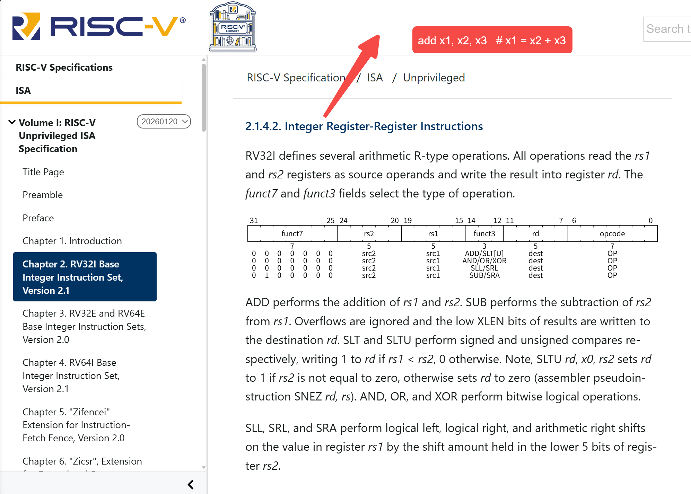

所以，站在 `CPU` 侧，根本没有 `foo` 这个概念。

那很自然就会问：那 `GDB` 是怎么把 `0x400790` 翻译成 `foo()` 的？往下看。


## 2.2 符号表

很自然的就能想到只要构建一张表/字典，一张把**地址**和对应的**字符串名**串联起来的表/字典，就像这样的 C 代码：

````c
typedef struct symbol_entry {
    uintptr_t addr;
    const char *name;
} symbol_entry_t;


symbol_entry_t sym_table[] = {
    {0x400790, "foo"},
    {0x400814, "bar"},
    {0x400920, "main"}
};

#define SYM_TABLE_SIZE (sizeof(sym_table) / sizeof(sym_table[0]))

// 根据地址查找字符串名
const char* lookup_symbol(uintptr_t addr) {
    for (size_t i = 0; i < SYM_TABLE_SIZE; i++) {
        if (sym_table[i].addr == addr) {
            return sym_table[i].name;
        }
    }
    return "(unknown)";
}
````

非常简单的逻辑。

> 可以看看这两篇：
>
> - [未初始化的全局变量占不占固件空间？](https://mp.weixin.qq.com/s/HGsBtrbA59mFM8IVQJ0Pzw)
> - [链接脚本避坑指南：未收容 .tdata 段导致的 ELF 内存 LMA 跨度异常](https://mp.weixin.qq.com/s/TRvcSzppV__P8IWdajKDcg)
>
> 了解该问题的同时，也简单了解下 `ELF`，你当然可以让 AI 帮你快速入门 `ELF`，比我讲的还好！

或许大家之前了解过 `ELF` 相关，知道 `ELF` 中有各种 `section`，就是 `symbol table` 符号表在做这件事情，什么函数、全局变量等统统被称为符号（对于 `linker` 来说）。

而这个**符号表本质就是一个字典，核心逻辑做的就和上面没什么两样。**

当然，如果去看 `ELF` 的 `spec`，上面的理解可能还得再拆分一下。

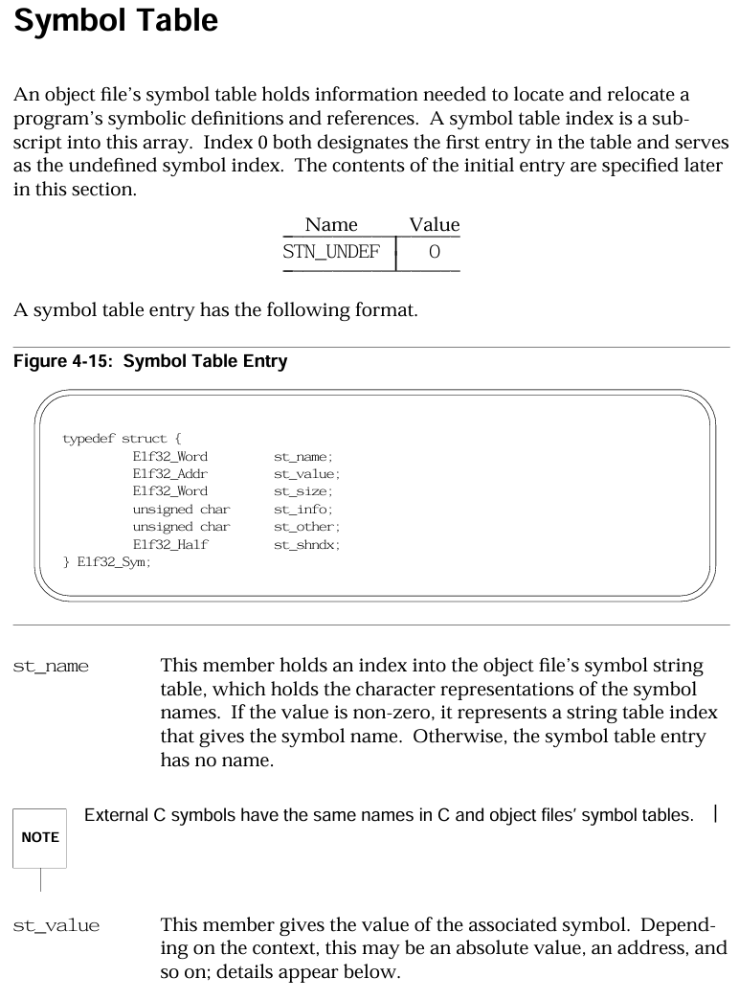

由于符号名长短不一（`main`、`pthread_getname_np`....），如果直接存名字，内存对齐和查找效率都会很差。所以，`ELF` `spec` 把这个查找过程拆成了两部分：

1. 符号表（`.symtab`）：存的是一个个规整的结构体。里面记录了地址（`st_value`），但不存真正的名字，只存一个名字的“号码牌”（`st_name` 偏移量）。
2. 字符串表（`.strtab`）：这是一个巨大的字符仓库，所有的函数名紧凑地挨在一起，用 `\0` 隔开。

所以，`GDB` 拿着一个地址 `0x400790`，在底层的查找实际上是一个“二级跳”，但这并不是本文的重点。

> 如果想深入了解符号，推荐以下内容：
>
> - 《Computer Systems: A Programmer's Perspective (CSAPP)》Chapter 7: Linking
> - 《程序员的自我修养:链接、装载与库》


## 2.3 stripped 

这也是我当时错误判断的基础之一。

既然上面的字典/符号表这么好用，为什么不带着，也很简单，存储空间是要钱的，如果我自己写个什么小demo，就在我的本机上跑，测试下，带个几百 KB 的字典没啥所谓。

但在真实的工程环境里（比如手机、路由器、嵌入式设备），老板是要赚钱的，`flash` 寸土寸金，你怎么在更少的存储中塞进更多的功能，为老板节省成本？那自然是去掉和你的产品运行功能无关的东西了。

显然，符号表这个东西，对功能运行有帮助吗？从 `first principle` 看，`CPU` 就是一个只认识二进制的东西，他并不关心什么 `foo()` 是个啥，所以这玩意自然也就想着会被剔除掉。

同样地思考在深入一点，符号表这样的东西，是不是我 `ELF` 的元数据的？显然是，那同理类比，去除掉那些运行时无用的元数据是不是也一样？是的。

所以自然就会有一个工具，来做去除元数据的任务。`strip`：

> **removes the symbol table and relocation bits ordinarily attached to the output of the assembler and loader...This is useful to save space after a program has been debugged"**（移除了通常附加在汇编器和链接器输出中的符号表和重定位位。这在程序调试完成后对节省空间很有用）^[2]^。

> 它就像一个安检员，把程序里所有对 `CPU` 运行没有用的“字典”（`.symtab` 和 `.strtab`）全部撕掉，只保留最核心的机器码（`.text` 和 `.data` 等）。


## 2.4 案例学习

下面我完全 `vibe coding` 了一个例子，模拟一个稍微复杂一点的场景来学习：

> 设计一个 SoC 内部音频 DSP 与主核之间的 IPC（进程间通信）和 DMA Scatter-Gather (SG) 链表处理机制。包含多文件结构、结构体指针、宏定义，并且设计了一个在真实驱动开发中常见的经典 `Bug`：DMA 描述符链表断裂导致的空指针/越界访问。

其中完整代码见：https://github.com/JAILuo/wechat-demos

代码目录结构：

```txt
project/
├── build.sh
├── include/
│   └── soc_ipc.h
└── src/
    ├── main.c
    ├── ipc_driver.c
    └── audio_dsp.c
```

直接运行 `make run` 即可得到对应产物。

这里展示 `make debug` 和 `make debug-strippped` 的运行对比：

首先是 `make debug-stripped`：

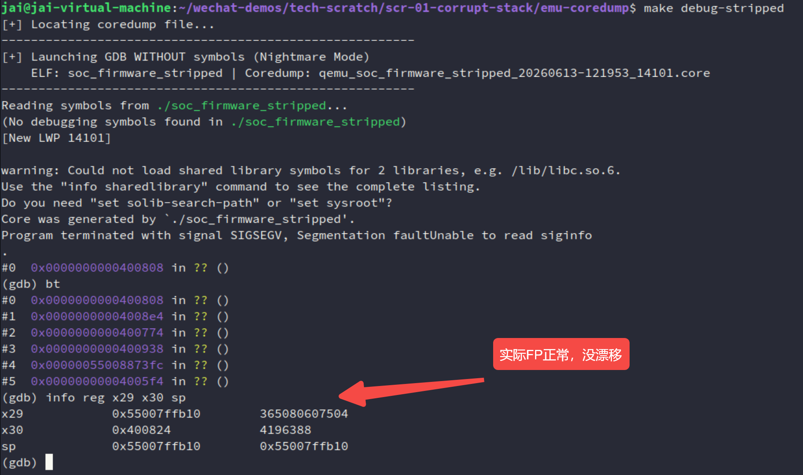

然后：`make debug`：

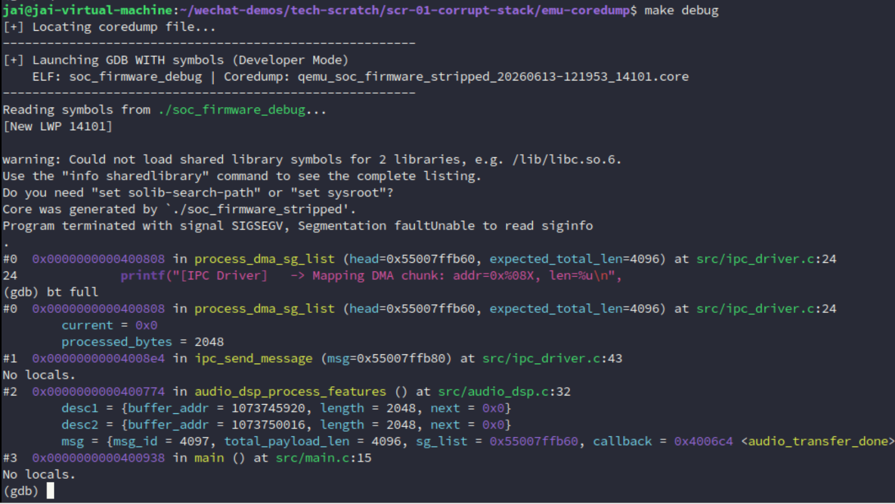

`bt` 正常跑，一些参数都能够打印出来。

其实到这里，就已经解决了我当时实习遇到的问题的 `coredump` `bt` 输出 `??` 的问题^[1]^：

```bash
(gdb) bt 
#0  0xb38e32c4 in pthread_getname_np () from /home/enrique/buildroot/output5/staging/lib/libpthread.so.0
#1  0xb38e103c in __lll_timedlock_wait () from /home/enrique/buildroot/output5/staging/lib/libpthread.so.0 
Backtrace stopped: previous frame identical to this frame (corrupt stack?)
```

" `stack` 坏了？" ❌❌

因为我就是用了一个 `stripped` 过的 `ELF`，配合生成的 `coredump` 去解析的。

**当时我对 `ELF` 懂得并不是对 ，我只是知道看网络上的文档说，对于 `GDB` 调试，欸，需要提供一个对应崩溃代码的 `ELF`（当时那是一个微内核，是一个组件），然后再加上其对应生成在某个位置的 `coredump`，这样就好了，几乎可以说不知道每一个部分的作用是啥。**

结果就出现了之前乱下结论的搞笑场面了。

> 问题那时解决了（尽管这个符号解决了，但当时那个`coredump` 结了半天+复现都复现不出来，只能去干别的了...）

但本文还在继续，关于 `backtrace`、乃至 `ELF` 调试都没那么简单。


# 3. Debug Info（调试信息）

如果你去看稍微全面一点点的教程/文档资料，他会和你说，在你编译的时候，加上 `-g` 选项，你就能获得 `debug info`，这样的你的 `GDB` 就能调试了。

还有，既然符号表已经能把地址翻译成 `foo()` 了，为什么 `GDB` 还需要庞大的 `debug info`？

渐渐地，如果不深入理解一点 `debug info`，每次你突然想起这个话题，去问问 AI，他会给你这样的回答：

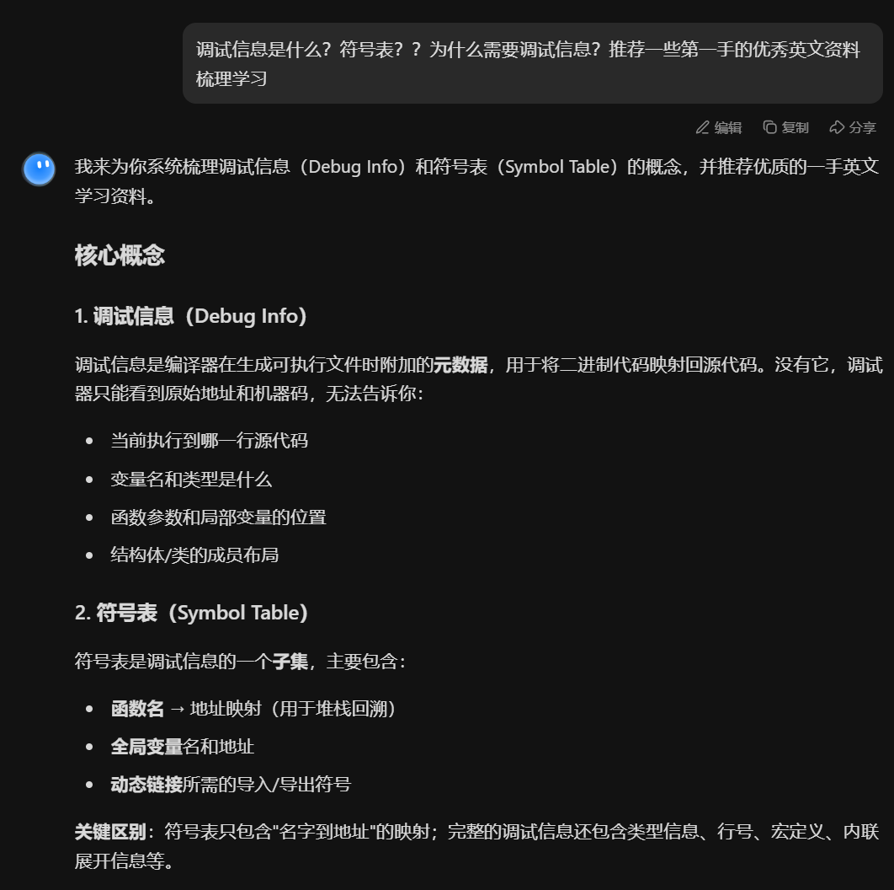

讲的似乎也没问题，好像什么都说了，什么都没说。

实际上，如果你就这么稀里糊涂的记住了，那下次遇到别的 `GDB` 问题、`bt` 没结果，要你设计产品固件方案，保留符号表还是符号表和调试信息都保留？

还是那句话，“你的技术想象力，受限于你的信息边界”。

你如何做出决策？我当时（以及身边的很多人）就是这样的，看过文档知道有调试信息了。了解了。渐渐地，就会把符号表和调试信息混为一谈了。

所以我回到第一篇：[backtrace系列（一）：从底层到本质：理解函数调用与 LR/FP 的设计与思想](https://mp.weixin.qq.com/s/ULNN7Pz7TmwUwRRB9U1HGg)，按照 `first principle` 的角度去梳理。


## 3.1 真的需要 debug info吗？

程序是个状态机，程序的状态由 `memory + regs` 组成（或者再严谨点，补个 `PC` ），这样已经足够描述程序状态了。继续推导：

```C
void foo() {
    int a = 123;
}
```

变量 `a` 是什么？`CPU` 不认识，本质是二进制。

`CPU` 只知道在 `SP + 0x10` 处，这里有四个字节，内容是 `0x7b`，也就是 `123`。

所以，理论上就不需要 `debug info`？

只要 `Memory + Registers` 完整保留下来，我就能知道 `a = 123`（不优化的情况下）。

但是，但是？问题在哪？

这个 `a` 是一个高级语言的变量/符号，有符号表知道这是 `a`，但是运行起来呢？

如果我直接写汇编，代码里的指令和 `CPU` 执行的机器码一一对应，那是不是就不用？没错。

高级语言目前是主流，可以说你写汇编才是异端，耗时耗力。

所以，关键就在于**我们不知道哪个地址对应 `a`。**

比如说：`SP = 0x1000`，栈内容：

```ASM
0x1000 : 0x7b
0x1004 : 0x02
0x1008 : 0x15
0x100c : 0x99
```

我看到的是一堆数字。：

```
123
2
21
153
```

请问：哪个是 `a` ？哪个是 `b`？哪个是临时变量？哪个是编译器 `spill` 出来的寄存器 ?

完全不知道啊。所以抽象一点，问题变成了什么呢？

**程序的状态有了，但是对于我们人来说，程序的语义丢了。**

**或者对于C语言，二进制和 C 代码脱节了。**

> 想起之前学文件系统时候的一个类比：
>
> 假设给你一块几十 GB 的硬盘：
>
> ```
> 0101010101010...
> ```
>
> 请问里面哪个是：微信聊天记录？哪个是照片？......
>
> 我们之前讲的符号表就像是硬盘最外层的一个根目录索引，它只能告诉你：“A区是微信，B区是照片”。
>
> 但如果我进入“微信”内部，想要还原某一条具体的聊天记录时，光有根目录索引就不够了。
>
> 此时 OS 上学到的文件元数据：`inode`、`superblock`、`dentry`，不就是用来确保每一个 `block` 表示的是啥？

> `debug info` 就是程序的超级元数据。`memory` 和 `Registers` 保存的是客观事实（0x7b），而 `debug info` 提供的是主观解释（这里存的是 `int a`，它对应 `main.c` 的第 15 行）。

由此，我们就需要一些元数据来解释这一块的二进制的表示的意思是什么，可以不那么准确地理解：对于一些 `xxx` 变量，我想要解释他，就去查 `debug info`，在这里告诉我了，`xxx` 变量是放在了 `memory` 的哪里，或者说哪一个 `regs` 中，我直接去打印，打印出来信息是什么就是什么。

**也就是说，`debug info` 实际并不存储变量的值，他只是告诉我们该去哪里读而已，就像一张地图。**

自己有一个观点：**Machine State 保存事实，Debug Info 保存语义恢复规则。**

（但是合不合理，我觉得我还得经过更多的实践！所以有问题，请指出！）

此时再回去看各个文档/资料/ AI 说的内容就清晰了，就会不把符号表和调试信息混在一起了（尽管他们有时部分重叠）:

以下为 `kimi` 总结：

|              | **符号表 (Symbol Table)**                           | **调试信息 (Debug Info)**             |
| ------------ | --------------------------------------------------- | ------------------------------------- |
| **根本目的** | 让**链接器**和**运行时**能找到名字                  | 让**人类**能把二进制映射回源代码      |
| **谁消费它** | 链接器 (`ld`)、动态加载器 (`ld.so`)、内核模块加载器 | 调试器 (`gdb`)、人类开发者            |
| **是否必须** | **是** — 没有它程序无法链接/加载                    | **否** — 没有它程序运行完全正常       |
| **存在于**   | 所有 ELF 文件（包括 `strip` 后的）                  | 只在带 `-g` 编译的文件中              |
| **标准格式** | ELF 规范原生定义 (`.symtab`, `.dynsym`, `.strtab`)  | 常用 DWARF 标准 (`.debug_*` sections) |

| 信息类型                            | 符号表有吗？ | 调试信息有吗？ |
| ----------------------------------- | ------------ | -------------- |
| 函数名和地址                        | ✅            | ✅              |
| 全局变量名                          | ✅            | ✅              |
| **局部变量名和位置**                | ❌            | ✅              |
| **变量类型 (int, struct, pointer)** | ❌            | ✅              |
| **源代码行号 ↔ 地址映射**           | ❌            | ✅              |
| **宏定义展开**                      | ❌            | ✅ (gcc -g3)    |
| **内联函数的原始位置**              | ❌            | ✅              |
| **结构体/类的成员布局**             | ❌            | ✅              |


## 3.2 看看文档

`GCC` 文档明确将 `-g` 描述为生成 `debugging information`（调试信息），而不是 `symbol table`（符号表）^[3]^。

符号表（`.symtab`）是编译器始终生成的 ELF 标准组件，不需要 `-g`。

```text
-g
--debug
	Produce debugging information in the operating system’s native format
	(stabs, COFF, XCOFF, or DWARF). 
	GDB can work with this debugging information.
```

`GDB` 文档在 `Symbols` 章节中明确区分：

> The commands described in this chapter allow you to inquire about the symbols (names of variables, functions and types) defined in your program. This information is inherent in the text of your program and does not change as your program executes. GDB finds it in your program’s symbol table,....^[4]^
>
> 本章中描述的命令允许您查询程序中定义的符号（变量、函数和类型的名称）。**这些信息是程序文本中固有的，不会随着程序的执行而改变。GDB在程序的符号表中找到它**...

甚至在 `Separate Debug Files` 章节中说的是：

> GDB allows you to put a program’s debugging information in a file separate from the executable itself, in a way that allows GDB to find and load the debugging information automatically. Since debugging information can be very large—sometimes larger than the executable code itself—some systems distribute debugging information for their executables in separate files, which users can install only when they need to debug a problem.^[5]^

> **GDB允许您将程序的调试信息放在一个与可执行文件本身分开的文件中，这样GDB就可以自动查找和加载调试信息**。由于调试信息可能非常大，有时甚至大于可执行代码本身，因此一些系统将可执行文件的调试信息分发到单独的文件中，用户只有在需要调试问题时才能安装这些文件

所以，编译器会在把 C 代码翻译成机器码的同时，额外输出一份“翻译说明书”（可拆卸的说明书）。

这份说明书，就是把我们日常写的程序具体和二进制联系起来。


## 3.3 DWARF

紧接着，你会在各种网络资料上看到：`DWARF` 是目前最主流的 `debug info` 的标准格式。

这里直接配合例子来看：

```c
void foo() {
    int a = 123;
    while(1);
}
```

基于之前的问题：

```BASH
(gdb) p a
```

为什么能打印出 `a` 的值？其实哪怕就是这一个简单的操作，其中涉及的内容都挺多的。

之前说过一种重点：**`debug info` 并不存储变量的值，`Debug Info` 保存的是：变量在哪里**

那怎么指导我们怎么去查 `a` 的值？

基于什么？**基于早就在 `memory + regs` 中存下的事实数据。**

`GDB` 做的事情可以大致总结如下：

1. 查 DWARF → `a` 的位置是 `FP - 16` （第一章讲到 `FP`）
2. 读寄存器 → 当前 `FP = 0x7fff5fbff2a0`
3. 算地址 → `0x7fff5fbff2a0 - 16 = 0x7fff5fbff290`
4. 读内存 → 拿到 `0x7b`，即 123

真正读到 123 的，永远是 Memory。DWARF 只是那张"地图"。

> 当然，真的要验证的话，真的得去看 `GDB` 的源码：https://sourceware.org/git/?p=binutils-gdb.git;a=tree;f=gdb;hb=HEAD
>
> 但由于内部比较复杂，本文系列就不展开了（后面的 `backtrace` 也是），但可以让 AI 画一个总结图。

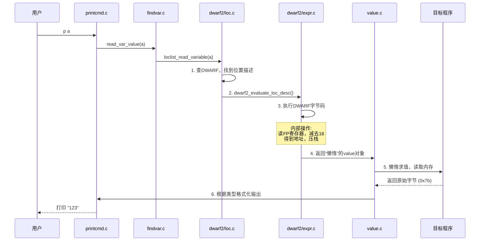
```mermaid
sequenceDiagram
    participant User as 用户
    participant Print as printcmd.c
    participant ReadVar as findvar.c
    participant LocList as dwarf2/loc.c
    participant DwarfExpr as dwarf2/expr.c
    participant Value as value.c
    participant Target as 目标程序

    User->>Print: p a
    Print->>ReadVar: read_var_value(a)
    ReadVar->>LocList: loclist_read_variable(a)
    LocList->>LocList: 1. 查DWARF，找到位置描述
    LocList->>DwarfExpr: 2. dwarf2_evaluate_loc_desc()
    DwarfExpr->>DwarfExpr: 3. 执行DWARF字节码
    Note over DwarfExpr: 内部操作: <br/>读FP寄存器，减去16<br/>得到地址，压栈
    DwarfExpr->>Value: 4. 返回“懒惰”的value对象
    Value->>Target: 5. 懒惰求值，读取内存
    Target-->>Value: 返回原始字节 (0x7b)
    Value->>Print: 6. 根据类型格式化输出
    Print-->>User: 打印 "123"
```

但是但是，我们还是需要具体去看看一个实际的 `DWARF` 格式的 `debug info` 长什么样才行，还是以 2.4 中我的一个案例代码来学：

具体看的代码：

```C
void audio_dsp_process_features(void) {
    // 构造两个 DMA 描述符，准备传给 DSP
    dma_desc_t desc1 = { .buffer_addr = 0x40001000, .length = 2048, .next = NULL };
    dma_desc_t desc2 = { .buffer_addr = 0x40002000, .length = 2048, .next = NULL };

    // 【Bug】开发人员忘了写这行代码：
    // desc1.next = &desc2; 

    // 构造 IPC 消息
    ipc_msg_t msg = {
        .msg_id = 0x1001,
        .total_payload_len = 4096, // 期望传 4KB
        .sg_list = &desc1,         // 实际只挂载了 2KB！
        .callback = audio_transfer_done
    };

    ipc_send_message(&msg); // 发送到底层，准备触发 Coredump...
}
```

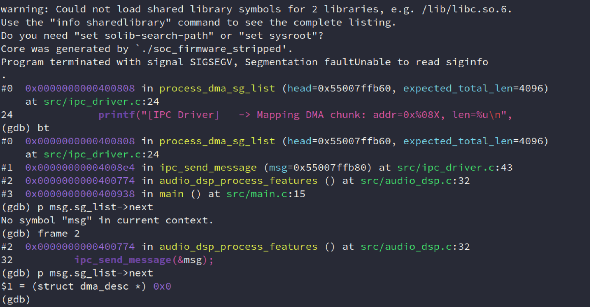

我们去看具体把调试信息剥离出来了，去看看 `GDB` 怎么知道 `desc1` 存放在哪里的，又是如何准确地打印出这个关键的 `0x0` 的：

``aarch64-linux-gnu-readelf -wi soc_firmware.debug | vi -``

输出非常多，我们就关注 `audio_dsp_process_features`：

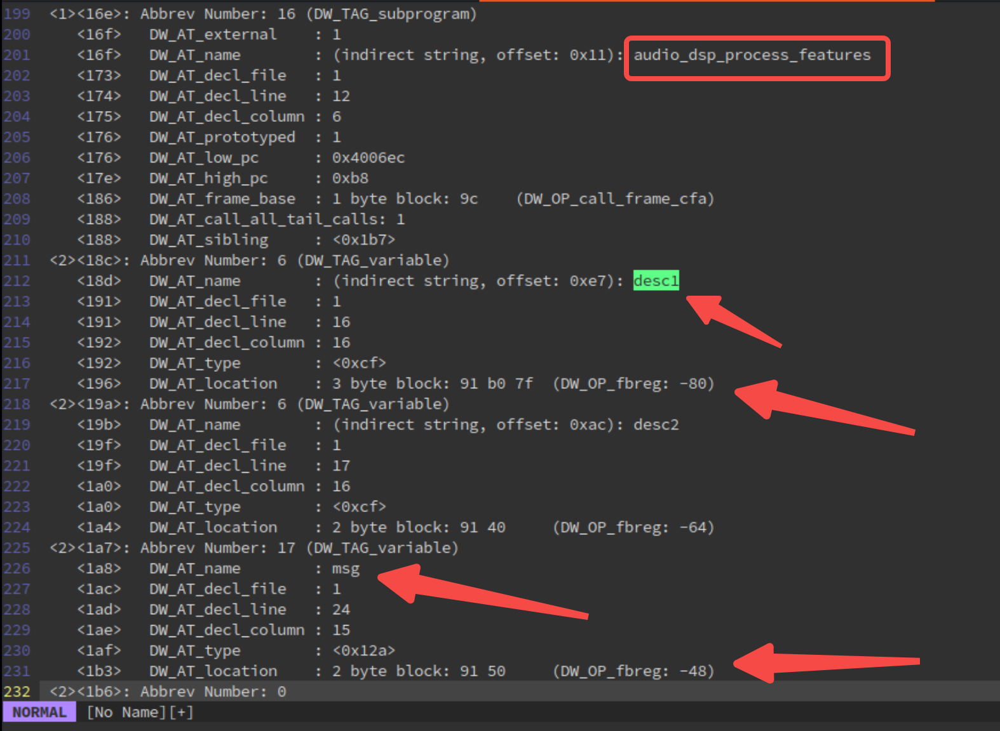

**没有任何玄学，全都是冰冷的事实。**

`GDB` 看到了 `DW_AT_name : desc1`，紧接着关键： `DW_AT_location : DW_OP_fbreg: -80`

翻译成机器动作就是： **“去读取当前函数的 FP 寄存器（栈底），然后减去 80 个字节。那个位置，就是 `desc1` 的老巢。”**

对于 `msg`，指令则是：`FP - 48`。

`DWARF` 其实还有很多重要的细节：`.debug_frame`、`.debug_line`、`.debug_str` ......

但目前不是我们的重点，但我们知道了有这些内容的存在，将来只要用到，结合 AI，相信就能很快上手！


# 4. 企业工程实践

明白上了上面讲的一堆什么符号表和调试信息，但对于在公司开发，其实很简单，

如果你是一颗螺丝钉，那么你很大可能上就会使用公司做好的 `CI/CD` 基础设施，每次点击 `build` 按钮，或触发编译命令，你最终拿到的程序镜像，就是 `stripped` 过的（为了减小体积嘛）。

> 我们实际的手机或车机系统开发中，系统分区的存储空间（如 `system` 或 `vendor` 分区）都是很重要的，不可能也没必要把带有上百兆 `DWARF` 调试信息的原始 `ELF` 塞进去。（安全、要是被逆向了呢......）

做的专业一点，在公司上的服务器，比如说使用的是 `JFrog` 作为制品库^[6]^：


就会存好你的 `debug` 镜像，甚至说只存你的 `debug info`。

如此：**运行机器：只放 `stripped` 二进制；调试服务器：保存 `debug info`**

完美！运行包很小！调试能力保留！

看样子啥都有的了！

当然当然，上面的部分都是公司别的CICD部分帮你做好了。

那如果你是小公司，或者个人开发者，咋搞？其实哪怕是在大公司，最终这活也还是层层推到执行的那个人，也就几个人在做。所以上面的操作我们个人肯定也是能做的！如下我们的例子：

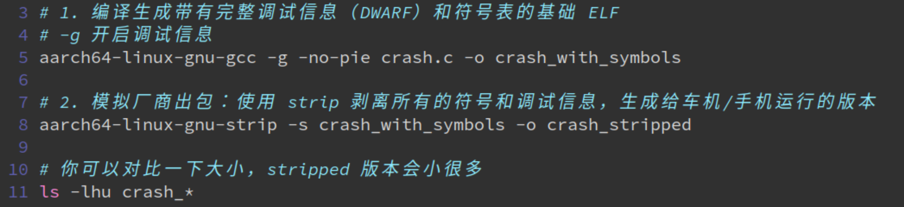

你当然可以直接 `stripped` 编译出来的完整 `ELF` 文件。

但是实际上你还可以有更多操作，直接看手册：[5]

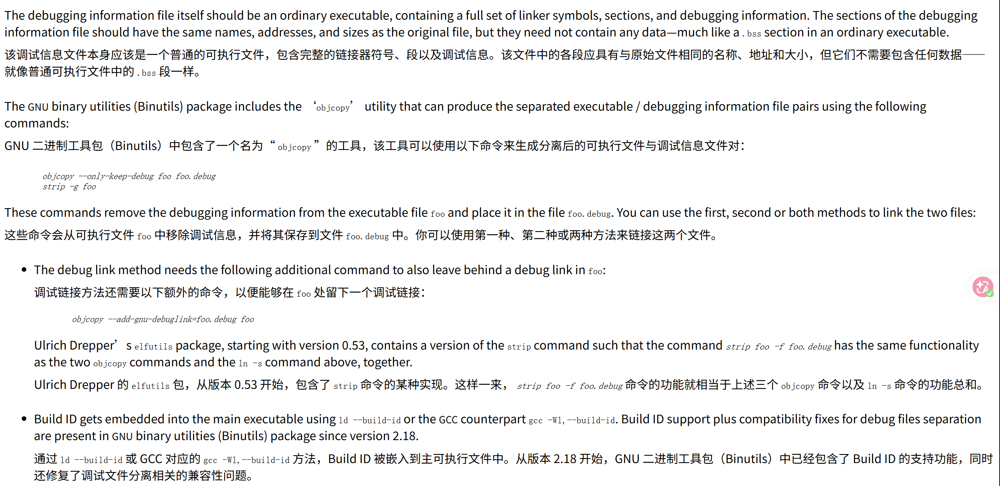

简单来说：就是单纯/提取分离调试信息。Android BSP 和底软构建系统（如 `Yocto` 或 Android 源码树的 Soong/Make）内部做的也是一样：

1. 用 `objcopy --only-keep-debug` 把完整的调试信息抽离成一个单独的 `.debug` 文件。

2. 用 `strip` 把原文件的对程序装载和执行没有强制要求的符号剥离，生成体积极小的量产运行版。

    里面其实有很多选项，按需来用

    ```txt
    NAME
           strip - discard symbols and other data from object files
    
           -s
           --strip-all
               Remove all symbols.
    		(不是全部，只是移除所有对程序装载和执行没有强制要求的符号：.symtab, .debug_*)
    		
           -g
           -S
           -d
           --strip-debug
               Remove debugging symbols only.
    		....
    ```

3. 用 `objcopy --add-gnu-debuglink` 在量产版里打上一个**标记（包含校验和）**，告诉 GDB：“如果遇到崩溃，去同目录下找那个 `.debug` 文件要符号”（或者别的目录...）。

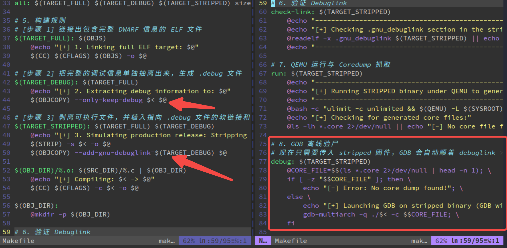

当然了，实际公司会有自己的做法了。比如：

```txt
源码 → 一次编译 → -O2 -g → 完整 ELF
```

然后进行 `objcopy --only-keep-debug`，得到：`foo.debug`。

再进行 `strip`，得到运行在环境上的 `foo`。

可以再想象一个真实场景，比如是手机开发的：

```c
DSP FW
Audio HAL
Kernel Driver
Modem
TrustZone
```

全部编译 `-O2 -g`：CI产生 `xxx.elf`、`xxx.debug`

然后手机只放 `stripped ELF`。

如果出现了 `crash`，此时我们使用各种工具：`addr2line`、`eu-stack/eu-addr2line`、`gdb` 去完全相同 `Build-ID` 的 `debug` 文件。

> `build-id` 的内容可以看[5]：
>
> 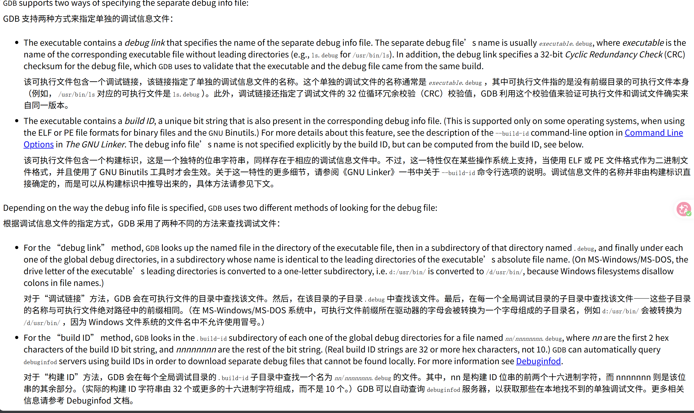

此时即可开始调试啦。

考虑到篇幅，本文到此为止，更多内容，请看本篇的下集，而下集更多是拓展，但是工程实践更多的内容！包括 `build-id`、调试优化代码、`DWARF` 是一个虚拟机等内容！


# 参考

[1] Figuring out corrupt stacktraces on ARM：https://eocanha.org/blog/2020/10/16/figuring-out-corrupt-stacktraces-on-arm/

[2] tuhs.org/cgi-bin/utree.pl?file=V6/usr/man/man1/strip.1：https://www.tuhs.org/cgi-bin/utree.pl?file=V6/usr/man/man1/strip.1

[3] Debugging Options：https://gcc.gnu.org/onlinedocs/gcc/Debugging-Options.html

[4] Symbols (Debugging with GDB)：https://sourceware.org/gdb/current/onlinedocs/gdb.html/Symbols.html

[5] Separate Debug Files (Debugging with GDB：https://sourceware.org/gdb/current/onlinedocs/gdb.html/Separate-Debug-Files.html

[6] Artifactory | Universal Artifact Repository Manager | JFrog：https://jfrog.com/artifactory/


----

> **注意：以下的内容均为个人观点+在学习/实践中得出。**
>
> **如果你看完后有不同的观点也没关系！请指出，我很乐意去学尝试积极的东西。**

封面：


本文是这篇的下集：[backtrace（二）：事实与语义：深度解构 ELF 符号表与 DWARF 调试信息（上）](https://mp.weixin.qq.com/s/08Ps9NT4yVIc59yNxHe0Ww)的拓展篇，讲的是各种额外实践和特性，更多基础引入请见上集。


# 1. introduction

> 在这一篇：[你的技术想象力，受限于你的信息边界](https://mp.weixin.qq.com/s/0iWsRplRTopvvkK5dpPx4A) 中：
>
> “（我觉得）在这个时代的下，你们最需要的就是有一个清晰的概念什么事情是能办到的，因为人没有办法做自己想象不到的东西，而扩展你的想象力的方式就是去看别人想到了什么。“
>
> 所以，在今后的文章中，考虑篇幅合适的情况下，我都会用以上类似的 `prompt` + 本文前面几章的总结 + `xxx` 官方手册，去和 AI 聊，让 AI 帮我看看有什么冷门但重要的东西值得去看看的！
>
> 下面写我觉得有意思的。


# 2. 拓展：调试工程实践

对目前我觉得可以的实践做一个总结吧！还是从 `strip` 讲起，刚好可以问自己理解了符号表和调试信息！一些很基础的问题，从而引申到具体的实践。

> 出厂之后的发布版镜像/线上固件，`strip` 过后，是不是连符号表都没有了？我调试需要这个符号表嘛？对，需要通过地址找到符号。
>
> 所以有时候符号才是问题吧？比如公司发布的镜像肯定是有信息安全考虑的，
>
> 像之前说的 `Separate Debug File` 单纯把调试信息剥离了，但符号表又如何处理？
>
> 符号表也会影响调试。但安全如何取舍？只能在拿到崩溃文件后，自己去下载那个完整的elf镜像（带符号表+调试信息的）然后去 `debug`？现代企业是这种做法吗？
>
> 当然，如果给符号表，是不是也会有被逆向的风险？

其实本质上，我们可以再问大一点：**线上系统到底要保留多少「程序语义」？**

`symbol`、`DWARF`、`MiniDebugInfo`、`Separate Debug File`，本质上都是这个问题的不同答案。

我们从 `first principle` 开始：

`CPU` 只知道 `memory`、`regs`、`instructions`。

实际上线上崩溃时拿到的也是：`Core Dump = Memory + Registers`。仅此而已。

但是我们是想知道：**是谁崩了？在哪个函数？哪一行？哪个变量？**

于是需要不断恢复语义：`地址 → 函数名 → 源码位置 → 变量`

而这几个层级对应的信息量完全不同。


## 2.1 符号表

例如：`0x400810`，变成 `foo()`，那我只需要：`.symtab` / `.dynsym`

此时我就能得到：

```c
Backtrace

foo
bar
baz
```

但是但是，我仍然不知道这些信息：

```c
foo.c:123

a=5
b=6
```

因为这些属于 DWARF。

仔细回想上一篇的内容：[backtrace（二）：事实与语义：深度解构 ELF 符号表与 DWARF 调试信息（上）](https://mp.weixin.qq.com/s/08Ps9NT4yVIc59yNxHe0Ww)：

- `symbol` = 函数名

- DWARF = 程序语义

这是两个层次。


## 2.2 那我们一般用的 `strip` 的究竟删了个啥？

多个 `level`。

1. `level-1`：使用：`strip --strip-debug`，删除 `.debug_*`，保留 `.symtab` 。

    那这会变成什么结果？

    函数名应该还在，`bt` 什么的操作都还有。

    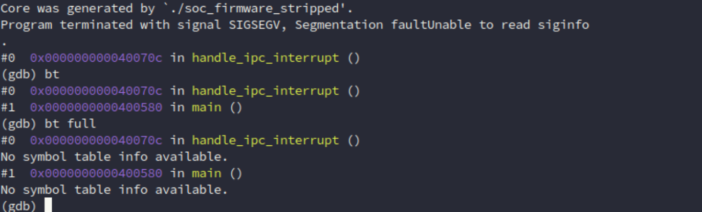

    但是像 `p a` 这种操作就不行了。

2. `level-2`：使用 `strip --strip-unneeded`，进一步删除

    ```TXT
           --strip-unneeded
               Remove all symbols that are not needed for relocation processing in addition to debugging
               symbols and sections stripped by --strip-debug.
    ```

    也就是：

    1. 先执行 `--strip-debug`：移除所有调试符号和调试段（debug sections）
    2. 再移除重定位无关的符号：保留链接器/动态链接器在重定位处理时必需的符号（`.dynsym`），其余全部删除。

    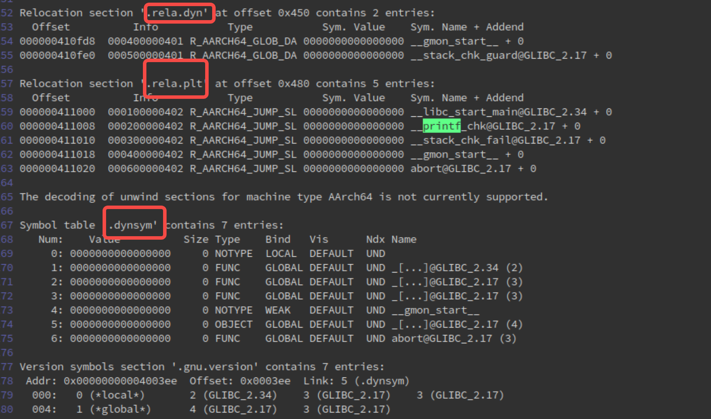

3. `level-3`：`strip --strip-all` 默认操作

    `.symtab`、`.debug` 都没了。

由此可见，符号表其实非常重要，甚至有时候：`Symbol > DWARF`

比如说，你线上崩溃，如果只能二选一获取做一个妥协：

```
A：完整DWARF
B：完整Symbol
```

几乎都会选B，因为：`foo() → bar() → mutex_lock()`，已经能定位大部分问题了。

至于运行时的某个变量 `a = 123, b = 456`  没有那么重要了。

**实际上，这也是 `GDB` 手册中 `MiniDebugInfo` 出现的原因^[1]^。别小看它！其实很有用的！**

它的核心思想是：完整的 `.symtab` 太大且暴露太多细节，那我就把里面没用的东西（比如局部变量的符号等）剔除，只保留最基础的**函数名到地址的映射**，然后用 LZMA 算法高强度压缩，塞进 ELF 的 `.gnu_debugdata` 段里。

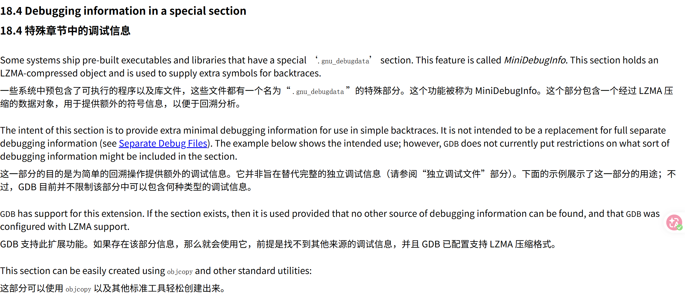

```bash
# Extract the dynamic symbols from the main binary, there is no need
# to also have these in the normal symbol table.
nm -D binary --format=posix --defined-only \
  | awk '{ print $1 }' | sort > dynsyms

# Extract all the text (i.e. function) symbols from the debuginfo.
# (Note that we actually also accept "D" symbols, for the benefit
# of platforms like PowerPC64 that use function descriptors.)
nm binary --format=posix --defined-only \
  | awk '{ if ($2 == "T" || $2 == "t" || $2 == "D") print $1 }' \
  | sort > funcsyms

# Keep all the function symbols not already in the dynamic symbol
# table.
comm -13 dynsyms funcsyms > keep_symbols

# Separate full debug info into debug binary.
objcopy --only-keep-debug binary debug

# Copy the full debuginfo, keeping only a minimal set of symbols and
# removing some unnecessary sections.
objcopy -S --remove-section .gdb_index --remove-section .comment \
  --keep-symbols=keep_symbols debug mini_debuginfo

# Drop the full debug info from the original binary.
strip --strip-all -R .comment binary

# Inject the compressed data into the .gnu_debugdata section of the
# original binary.
xz mini_debuginfo
objcopy --add-section .gnu_debugdata=mini_debuginfo.xz binary
```

1. **提取动态符号**（`nm -D`）和 **函数符号**（`nm`），找出仅在静态符号表中存在、对调试有用但动态链接不需要的函数名
2. **分离完整调试信息**（`objcopy --only-keep-debug`）到一个独立文件
3. **精简调试信息**：只保留关键函数符号，删除 `.gdb_index`、`.comment` 等冗余段
4. **剥离原始二进制**（`strip --strip-all`），使其体积最小化
5. **压缩并注入**（`xz` + `objcopy --add-section`），将微型调试数据嵌入 `.gnu_debugdata` 段

最终效果：发布二进制体积大幅缩小，但崩溃时仍可通过内嵌的压缩符号表还原函数名堆栈（无需单独分发 debug 文件）。


## 2.3 安全

或许有人会说，哪怕是上面的这种 `MiniDebugInfo` 对于被逆向的风险还是很高啊？

当然了大家或许会说，不是有各种安全加密的手段吗？比如：

`secure boot` 的防篡改能护住吗？`ACL` 或者 `SELinux` 能防住吗？加密算法能防住吗？大家可以问问 AI。如果能理解 CIA 三要素+安全工程领域的内容就知道了：

**任何部署在用户手中、且能被用户物理接触的设备，其内部的纯软件防护最终都会被攻破（所谓的“白盒密码学”难题）。**

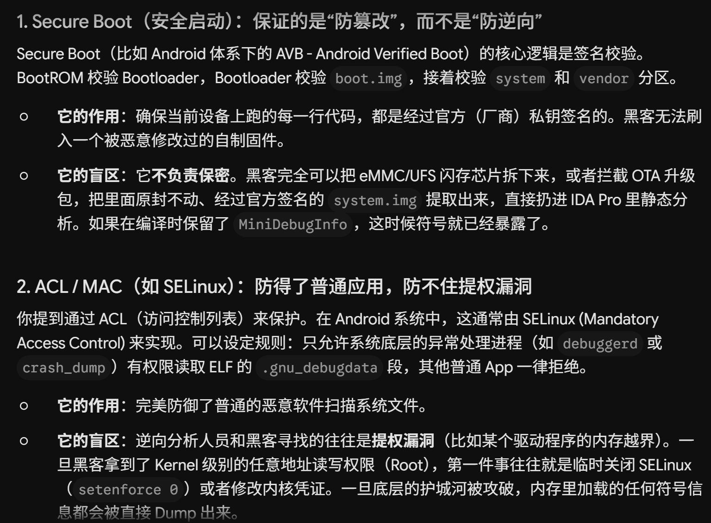

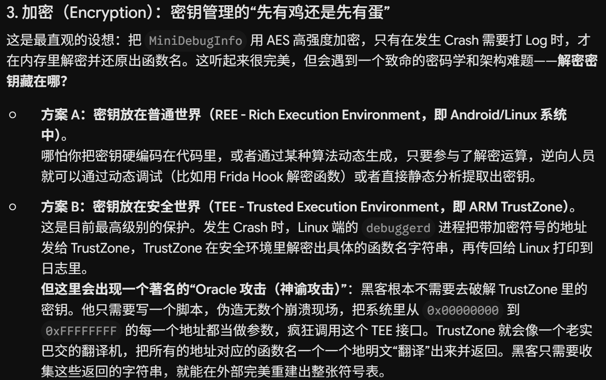

如果真的发布了这种没有 `stripped` 固件，能够在本地自主把地址翻译成函数名（字典），就算再怎么加密都没用，

对于装备了逻辑分析仪、内核调试器甚至硬件故障注入设备的顶尖逆向工程师来说，公婆他们真的只是时间问题，

而且而且，最简单的，不用上面这些乱七八糟的，用 `IDA Pro` 或 `Ghidra` 等反编译工具打开，直接就能看到函数名：

```c
secure_boot_verify() 
decrypt_customer_key()
factory_test_backdoor()
internal_crypto_engine()
```

有了这些名字，我光看符号名不就都知道整个软件架构了？对于做逆向工程的人不是完美？简直就像拿着一份带详细注释的地图，甚至直接能猜测出这块代码的业务逻辑和漏洞？

所以 `strip-all` 似乎才是商业公司会选择的。


## 2.4 最终实践

核心目标：

- 减小包体积
- 保证信息安全(防逆向) 
- 能够完美调试

一个比较好的处理流程（其实也就是第一篇中，[backtrace（二）：事实与语义：深度解构 ELF 符号表与 DWARF 调试信息（上）](https://mp.weixin.qq.com/s/08Ps9NT4yVIc59yNxHe0Ww)中第四章说的），使用 `build-id` ^[2]^：


> `Symbol` 是函数的身份证，而 `Build ID` 是整个二进制的身份证。

1. **Step 1: 带调试信息编译 (Build)** 在构建机上，正常加上 `-g` 编译，生成巨大的、包含完整 `.symtab` 和 `debug info` 的 ELF。关键是，链接器会为其生成一个独一无二的 **Build ID**（通常是一串哈希值，存在 ELF 的 notes 段里）。

2. **Step 2: 提取并分离 (Separate)** 使用你提到的 `objcopy --only-keep-debug`，把所有调试信息和符号表抽出来，存成一个独立的 `.debug` 文件。

3. **Step 3: 彻底剥离 (Strip)** 对准备发版的 ELF 执行严格的 `strip --strip-all`，得到一个极其干净、体积最小、毫无符号和语义的二进制裸文件。

4. **Step 4: 分发与存档 (Release & Archive) —— 核心所在** 将那个干净的 `stripped` 文件打包发给用户。 把包含了所有心血的 `.debug` 文件（字典），上传到公司内部严格保密的 **符号服务器 (Symbol Server)**，并且以 **Build ID** 作为索引存放。

5. **Step 5: 崩溃回溯 (Crash Analysis)** 用户设备发生 Crash 时，只收集当时的 `Memory + Registers` 以及那个 `Build ID`，打包成一个体积很小的 `Coredump` 或 `Minidump` 传回公司。

    当需要调试时，本地的 GDB（或公司的监控平台如 Bugly、Sentry）会读取 `Coredump` 中的 Build ID，**自动去内部的符号服务器上把对应的 `.debug` 字典拉下来**。GDB 拿着现场收集到的“客观事实”（`Coredump`里的地址），去对照公司内网里的“语义规则”（.debug），一验证结合，`backtrace` 不就能用？

当然当然，各家公司肯定是有各自的方案，会对上面的内容做一些取舍的！

但经此流程，你不会对公司里的这个流程困惑。


# 3. 拓展：`-O2` 优化让 `GDB` 抓瞎？

大家都知道，`-g` 生成调试信息，但是：`-O2 -g` 呢？

优化死代码、函数内联、代码重排、循环展开......

举个例子：

```C
void foo() {
    int a = 123;
    printf("hello\n");
}
```

`GDB` 输入 `p a`：

```TXT
optimized out
```

哦吼，不是有 DWARF 吗？

还记得之前的内容嘛？

> - DWARF 不保存变量值。
> - DWARF 只保存变量在哪里

但 `-O2` 后，变量根本不存在呀，编译器直接把 `a = 123` 折叠掉了。

所以，可以这么说：`Debuggable Program ≠ Executable Program`

程序为了跑得快所以做了优化，但程序为了容易调试，又保留语义，这两者绝对冲突。

所以，我觉得我应该重新思考：变量是什么？变量 = 内存？不太对了现在。

- 对于编译器：变量 = 语义
- 对于 `CPU`：变量不存在，只有 `Memory`、`regs`、指令

那我的调试应该怎么办？我这里还是写了一个小 `demo` 来看看**优化后的程序我该怎么调**：

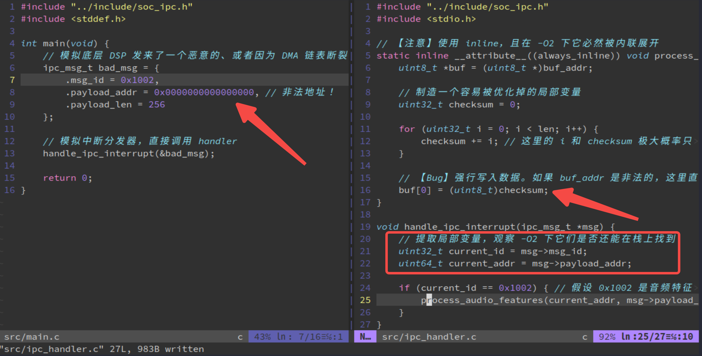

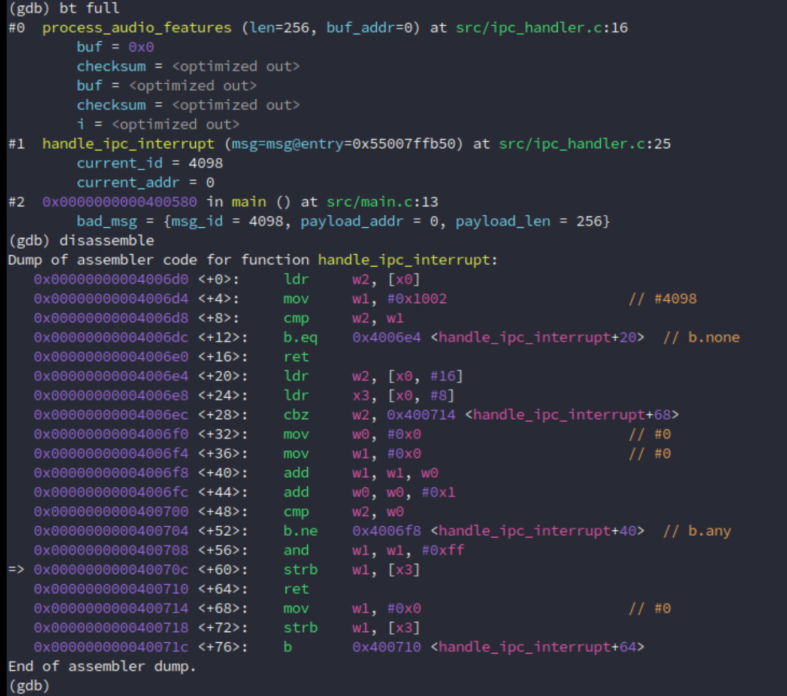

我们可以看到：`process_audio_features` 被内联了，没有 `bl` 指令跳，尽管被内联，但是有！

> **应对①： 函数内联：消失的栈帧**
>
> - **DWARF 的魔法：** DWARF 中有一个专门的标签叫 `DW_TAG_inlined_subroutine`。它记录了这段被嵌入的机器码在逻辑上属于哪个被内联的函数。
> - **GDB 的表现：** 当你打出 `bt` 时，GDB 会伪造（Virtualize）一个调用栈。你依然能看到 `process_audio_features()` 出现在 bt 中。

另外，对于优化变量：

```txt
(gdb) p checksum
$2 = <optimized out>
```

```ASM
   0x00000000004006f0 <+32>:    mov     w0, #0x0                // w0 = 0 (这就是我们的变量 i)
   0x00000000004006f4 <+36>:    mov     w1, #0x0                // w1 = 0 (这就是我们的变量 checksum)
   0x00000000004006f8 <+40>:    add     w1, w1, w0              // checksum += i
   0x00000000004006fc <+44>:    add     w0, w0, #0x1            // i++
   0x0000000000400700 <+48>:    cmp     w2, w0                  // 比较 i 和 len (w2存着256)
   0x0000000000400704 <+52>:    b.ne    0x4006f8 <handle_ipc_interrupt+40>  // 循环
   0x0000000000400708 <+56>:    and     w1, w1, #0xff           // cast to (uint8_t)
=> 0x000000000040070c <+60>:    strb    w1, [x3]                // 崩溃！试图把 w1 写入 x3 指向的内存 (buf[0] = checksum)
```

进一步，在发生 Segmentation fault 的那一瞬，`<optimized out>` 的 `checksum` 变量（经历了 `uint8_t` 截断后），就实实在在地躺在 CPU 的 **`w1` (也就是 `x1` 的低 32 位)** 寄存器里！

> **应对①： `<optimized out>`：被抹除的变量——破解之道：硬读汇编与 ABI**
>
> - 不要过度依赖 `print index`。
> - 使用 `layout regs` 和 `layout asm` 开启双屏模式。
> - 结合 ARMv8 的 AAPCS64 函数调用约定：如果是刚进入函数不久发生异常，变量极大可能还躺在 `x0` - `x7` 寄存器里；如果是中间过程，去查 `disassemble` 的反汇编，看看出事的那条汇编指令到底在操作哪个寄存器（比如 `ldr x1, [x2]`），然后直接打印寄存器的值 `i r x1 x2`。

这里再补充一点 `AAPCS64` 的，在上一篇没讲的：

> **`X0 ~ X7` (传参与返回值 - The Frontline)**
>
> - **参数传递：** 函数的前 8 个参数（如果是 32 位如 `int`，就看对应的 `W0 ~ W7`）。如果参数超过 8 个，多出来的会压入栈（Stack）中。
> - **返回值：** 函数的返回值默认放在 `X0`（如果是 128 位大数，会用到 `X1`）。

> **`X9 ~ X15` (调用者保存 / 临时刮刮卡 - The Scratchpad)**
>
> - 这些是“用完即弃”的寄存器（Caller-saved）。函数内部可以随便拿它们当临时变量来运算。
> - **实战意义：** 当你看到被 `<optimized out>` 的循环变量、临时计算结果（比如我们算出来的 `checksum` 躺在 `W1` 里，因为 `W0~W7` 在参数用完后也可以做临时运算，而 `X9~X15` 更是纯粹的临时工），大概率就散落在这些寄存器里。
>
> **`X19 ~ X28` (被调用者保存 / 长期保险柜 - The Safe)**
>
> - 这些寄存器（Callee-saved）里的值必须被保护。如果一个函数想用它们，必须在函数入口把它们压栈（Push），在函数返回前恢复（Pop）。
> - **实战意义：** 如果你在深层栈帧里找一个外层函数的关键变量，如果这个变量寿命很长，编译器大概率会把它分配在这里。

现在就是去看 `X3` 的内容，为什么访问 `x3` 的内存挂了，

```ASM
   0x00000000004006e0 <+16>:    ret
   0x00000000004006e4 <+20>:    ldr     w2, [x0, #16]
   0x00000000004006e8 <+24>:    ldr     x3, [x0, #8]  <-- 找到了！这是 X3 的诞生地
   0x00000000004006ec <+28>:    cbz     w2, 0x400714 <handle_ipc_interrupt+68>
```

在 `<+24>` 这一行，指令是 `ldr x3, [x0, #8]`。

它的物理语义是：**去读 $X0$ 寄存器加上 8 个字节偏移量的内存地址，把读出来的 64 bit 数据放到 $X3$ 里。**

到这里，问题的焦点转移了。问题不再是“为什么 $X3$ 是 0”，而是变成了：**“$X0$ 是什么？为什么 $[X0 + 8]$ 这块内存里存的是 0？**

而如果一个寄存器在函数内部没有被初始化就被使用了，说明**它是外部世界（调用者）传进来的状态**。

结合 AAPCS（ARM64 函数调用约定），$X0$ 是函数的第一个参数！ 回忆一下我们的 C 代码： `void handle_ipc_interrupt(ipc_msg_t *msg)` 所以，$X0$ 就是 `msg` 指针！

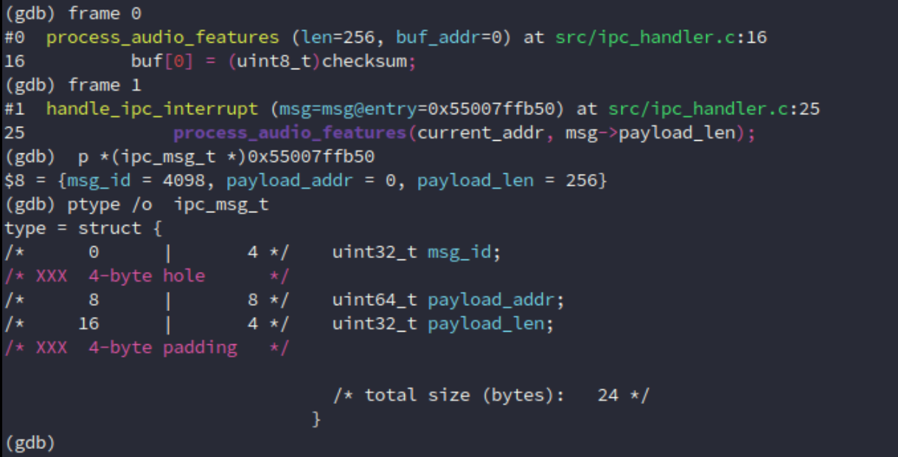

所以产生的问题就是传进来了一个NULL指针解引用问题。

总而言之，还是之前的方法，只是现在加上了更加麻烦的优化，优化一下理论：

```c
Machine State = Registers + Memory + PC
```

DWARF：

```c
Machine State → Source Level State
```


# 4. 拓展：DWARF 是一个虚拟机

这里 AI 给了我一个指导，但由于我自己对这块并不熟悉，所以更多只能是让 AI 来讲！让我知道有这些！

> 你文章里写：Debug Info 是地图。这个说法很好，但还可以更进一步：
>
> DWARF其实是在保存：**高级语言语义** 和 **机器状态** 之间的映射关系。例如：
>
> ```c
> int index;
> ```
>
> DWARF可能写：
>
> ```c
> PC ∈ [0x1000,0x1020]
> index = r19
> 
> PC ∈ [0x1020,0x1040]
> index = FP-32
> 
> PC ∈ [0x1040,0x1050]
> index = r3+r4
> ```
>
> 注意，这里已经不再是**变量在哪里**的问题了，而是**变量如何计算的问题**。
>
> 所以DWARF里会出现：
>
> ```txt
> DW_OP_reg
> DW_OP_breg
> DW_OP_fbreg
> DW_OP_plus
> DW_OP_deref
> ...
> ```
>
> 实际上就是个小虚拟机。

其实转念一想，按照上面的理论，把 DWARF 视为一个 **虚拟机（Virtual Machine）** 或者说是 **栈式计算机（Stack-Machine）**，似乎真的挺合理？

其实已经让我想起了 Java 的 字节码？或者单纯就是字节码？^[3]^

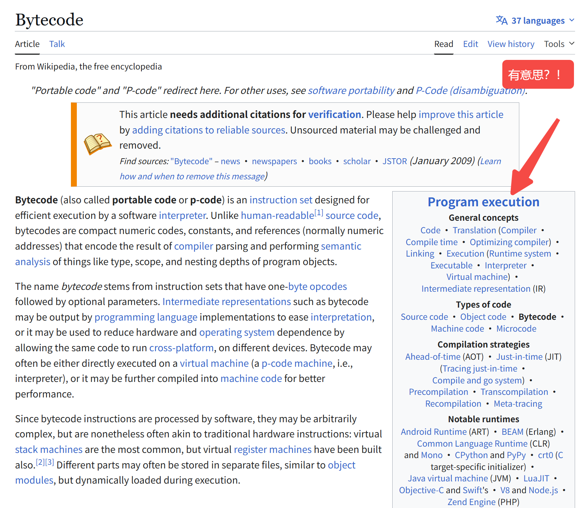

> 字节码（也被称为可移植代码或 P 码）是一种专为软件解释器的高效执行而设计的指令集。与人类可读的源代码不同，字节码是由各种数字代码、常量以及引用构成的紧凑格式。这些引用通常指的是程序对象的数值地址。字节码实际上记录了编译器在处理程序结构时所做的工作，包括对程序对象的类型、作用域和嵌套层次等的分析结果。

> “字节码”这一名称源于这样的指令集：其中的操作码由一个字节组成，其后则跟着可选的参数。像字节码这样的中间表示形式，可以被编程语言的实现机制所生成，从而便于代码的解释和执行。此外，字节码还可以减少对硬件和操作系统的依赖性，因为同样的代码可以在不同的设备上运行。通常，字节码可以直接在虚拟机上执行（即通过解释器来执行），或者被进一步编译成机器码，以提高执行效率。

> 由于字节码指令是由软件来处理的，因此它们的复杂程度可以是任意的。不过，它们通常仍类似于传统的硬件指令。其中，虚拟堆栈机最为常见，不过也有一些系统采用了虚拟寄存器机。不同的代码部分通常存储在独立的文件中，这与对象模块类似，但这些文件会在程序执行时被动态加载进来。

`GDB` 的代码内部真的有一台用 C/C++ 写成的“迷你虚拟机”在解释执行这些字节码？！

举个例子：
```C
// demo.c
#include <stdio.h>

struct Node {
    int id;
    int value; // 我们想看看 GDB 是怎么找到 value 的
};

void process_data(struct Node *ptr) {
    // 假设在这里打断点，我们想打印 ptr->value
    int result = ptr->value; 
    printf("Result: %d\n", result);
}

int main() {
    struct Node my_node = { .id = 1, .value = 999 };
    process_data(&my_node);
    return 0;
}
```

```bash
gcc -g demo.c -o demo
readelf -w demo > dwarf_info.txt
```

针对 `Node` 结构体中的 `value` 成员，DWARF 的描述是：

```txt
 <2><5a>: Abbrev Number: 3 (DW_TAG_member)
    <5b>   DW_AT_name        : (indirect string, offset: 0x12): value
    <5f>   DW_AT_type        : <0x34>
    <63>   DW_AT_data_member_location: 4   // 固定偏移量 4
```

针对 `process_data` 函数中的局部变量 `ptr`，DWARF 的描述是：

```TXT
<2><8a>: Abbrev Number: 4 (DW_TAG_formal_parameter)
    <8b>   DW_AT_name        : (indirect string, offset: 0x3a): ptr
    <8f>   DW_AT_type        : <0x48>
    <93>   DW_AT_location    : 2 byte block: 91 68   (DW_OP_fbreg: -24)
```

在 GDB 中输入 `(gdb) p ptr->value` 时，GDB 并不认识 `ptr->value` 是什么，它只是一台冷酷的执行引擎。它会将这个请求拆解为一系列的 **DWARF 字节码指令 (OpCodes)** 并送入虚拟机执行！

为了计算出 `ptr->value` 的物理内存地址，GDB 内部的 DWARF 引擎会动态生成并执行以下逻辑组合。

这台虚拟机是一个典型的**栈式机器 (Stack Machine)**，它有一个自己的运算栈。

假设当前程序的运行状态（客观事实）如下：

- **FP 寄存器 (Frame Pointer)** = `0x7fffffffe000`
- 栈内存 `0x7fffffffdfe8` (即 FP - 24) 处存放着指针 `ptr` 的值，指向堆/栈上的地址 `0x60001000`。
- 内存 `0x60001000` 开始存放着 `my_node`。

**以下是 GDB 虚拟机的微观执行过程：**

| **步骤**   | **执行的 DWARF OpCode** | **动作解释**                                                 | **DWARF 引擎的内部 Stack 状态** |
| ---------- | ----------------------- | ------------------------------------------------------------ | ------------------------------- |
| **初始**   | -                       | 虚拟机启动，栈为空                                           | `[ ]`                           |
| **Step 1** | `DW_OP_fbreg -24`       | 引擎读取当前 CPU 的 FP 寄存器 (`0x7fffffffe000`)，加上负数偏移量 `-24`，得到 `0x7fffffffdfe8`，并把这个地址压入栈。 | `[ 0x7fffffffdfe8 ]`            |
| **Step 2** | `DW_OP_deref`           | 引擎从栈顶弹出地址，去真实的物理内存中读取该地址里存放的 8 字节数据（即指针的指向：`0x60001000`），然后把读到的值重新压入栈。 | `[ 0x60001000 ]`                |
| **Step 3** | `DW_OP_plus_uconst 4`   | 引擎从栈顶弹出 `0x60001000`，加上常数 `4`（因为查表得知 `value` 偏移量是 4），得到最终地址，压入栈。 | `[ 0x60001004 ]`                |

当 DWARF 表达式执行完毕，虚拟机停机，栈顶剩下的唯一一个值（`0x60001004`），就是 `ptr->value` 在此刻的**真实内存地址**！

最后，GDB 拿着 `0x60001004` 去真实的内存里读取 4 个字节，发现是 `0x000003E7` (十进制的 999)，于是你的屏幕上打印出了：

```
$1 = 999
```


**总结：数据映射 vs 程序解释**

如果 DWARF 只是一张静态映射表，它只能告诉你 `ptr` 在 `FP - 24`，它绝不可能表达出“**先去 FP-24 找，把里面的值当成地址读出来，然后再加 4**” 这么复杂的语义动作。

正是因为 DWARF 实际上提供了一套完整的 **指令集 (OpCode)** + **执行环境 (Execution Engine)**，GDB 才能像剥洋葱一样，处理多级指针、复杂的结构体嵌套、甚至是被编译器优化到多个寄存器中来回移动的碎片化变量。

你在第一篇提到“程序是状态机”，而在调试时，其实是 **GDB 内部的一个状态机（DWARF 虚拟机）在分析目标程序的另一个状态机（Memory + Registers）**。


# 5 其他

还有很多其他的观点！

比如说：`Debuginfod`，一个比较现代的东西！

依旧是老场景：客户发来core → 你没有对应ELF。

传统：你就只能到处找：哪个版本？哪个commit？哪个包？

现在有这个 `Debuginfod`：`Build ID` → 自动下载调试信息。

`GDB` 输入 `gdb  ./xx.core`，服务器自动拉取 `DWARF`

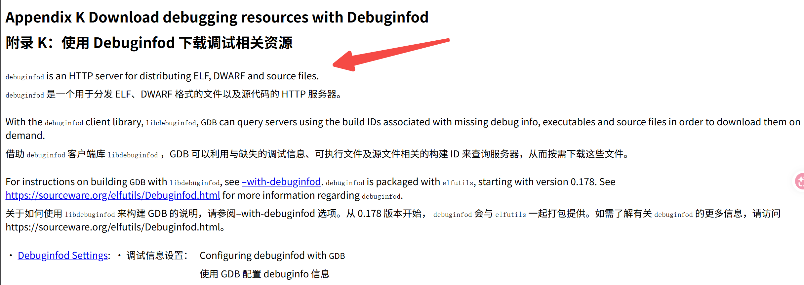


最后的最后，最近一段时间写了十几篇了，所以我想自己写：

> **对我自己来说，我是一个很想把问题搞明白、深究的人。**
>
> **有人曾经指导我：“这是我的一个挺大的缺点，对你学习、工作其实没特别大的好处，你要做的是把问题解决，专注一点”。**
>
> **我深以为然！但尽管如此，我依旧乐在其中。**


# 参考

[1] MiniDebugInfo (Debugging with GDB)：https://sourceware.org/gdb/current/onlinedocs/gdb.html/MiniDebugInfo.html#MiniDebugInfo

[2] Separate Debug Files (Debugging with GDB：https://sourceware.org/gdb/current/onlinedocs/gdb.html/Separate-Debug-Files.html

[3] Bytecode - Wikipedia：https://en.wikipedia.org/wiki/Bytecode

[4] Debuginfod (Debugging with GDB)]：https://sourceware.org/gdb/current/onlinedocs/gdb.html/Debuginfod.html#Debuginfod
