> **注意：以下的内容均为个人观点+在学习/实践中得出。**
>
> **如果你看完后有不同的观点也没关系！请指出，我很乐意去学尝试积极的东西。**

封面：

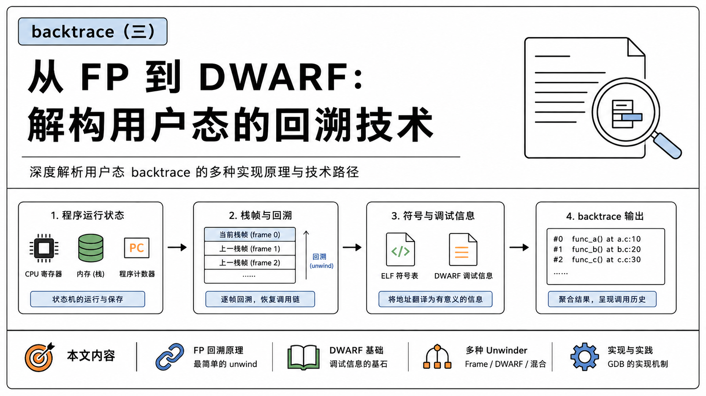

# 1. introduction

在完成了前面两篇后：

- [backtrace系列（一）：从底层到本质：理解函数调用与 LR/FP 的设计与思想](https://mp.weixin.qq.com/s/ULNN7Pz7TmwUwRRB9U1HGg)
- [backtrace（二）：事实与语义：深度解构 ELF 符号表与 DWARF 调试信息（上）](https://mp.weixin.qq.com/s/08Ps9NT4yVIc59yNxHe0Ww)

其实我在实习时遇到的问题就已经差不多解决了。那本文还能写什么呢？

回顾前两篇：

第一篇：程序运行，如何保存状态？`memory + regs + PC`

第二篇：程序如何保存名字？

仔细回想一下，我的逻辑链：

> 程序运行 → 状态被保存在 `memory + regs + PC` 中 → 函数调用形成层级关系 → 试图恢复调用历史

所以，`GDB` 这种调试器就是在根据保存下来的事实，去恢复以下的内容：

1. 当前执行位置
2. 局部变量
3. 调用关系

而我们的 `backtrace` 不就是调用关系嘛（当然信息更多）。

**所以本文讲述 `backtrace` 的相关内容，几种 `GDB` 目前的 `backtrace` 的实现方法。也算是对的起这个系列的 `backtrace` 标题了。**

**另外，我觉得前面第二篇引入 DWARF 的时候写的并不好，导致可能看了还是懵逼的，所以本文还是会补充 DWARF 的内容。**

注意，本文可能会有点啰嗦！！


## 1.1 `stack frame` 和 `unwind` 和 `backtrace`

讲之前，先补充一些词：`stack frame` 和 `unwind` 和 `backtrace`。

在涉及到一些新词时，我一般会去看一些比较权威的手册对于这里的理解，所以下面看看 `GDB` 手册对这几个词的解释^[1-3]^。

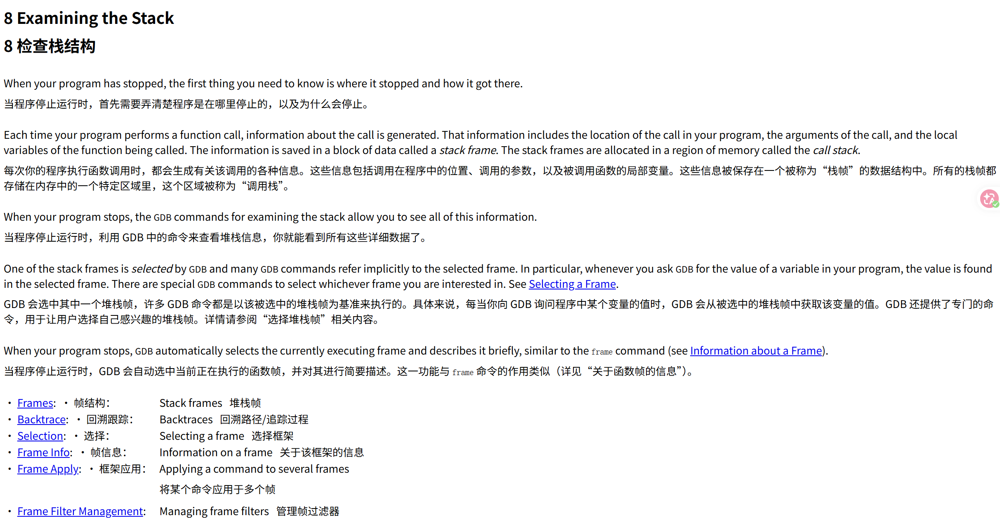

> 所谓 `stack frame`，就是：
>
> 函数调用时生成的一块数据，保存了该次调用的**现场信息**：调用位置、参数、局部变量。多个 `stack frame` 按调用顺序堆叠在 `call stack` 上。

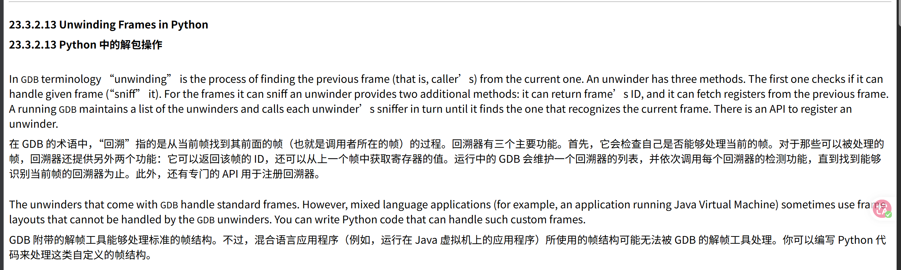

> `Unwinding is the process of finding the previous stack frame.`
>
> 所以本质是**单步操作**：是 `current frame` → `previous frame`。是 `backtrace` 的底层机制。
>
> 当前 `stack frame` 解析出 `caller frame` 的位置和寄存器状态。`GDB` 能逐个调用 `unwinder` 的 `sniffer` 来找到能处理当前帧的解析器，完成一步"向上回溯"。

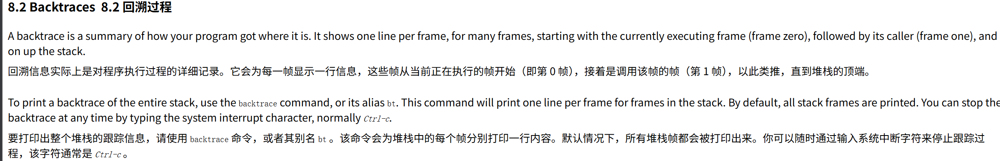

> **聚合结果**：从当前帧（`frame 0`）开始，**重复执行 unwind** 直到栈顶，输出每一帧的摘要信息（函数名、地址、参数等）。

一句话总结：

**`backtrace` = 连续 `unwind` 的聚合输出（`repeated unwind`）；`unwind` 操作的对象是 `stack frame`。**

但我还是要提醒一句，不要过于纠结这些定义：

> "......the implementation provides functionality, not meaning. The meaning comes from the thoughts of developers and is coherent or disjoint in the same measure that those developers are of one mind, or not."（代码实现只提供功能，不提供绝对的物理意义。功能的“意义”源自开发人员的想法。当开发人员意见一致时，功能的“意义”也就连贯；反之，则显得杂乱无章）^[4]^。

尽管这句话是 Neil Brown 对于 Linux 设备驱动模型说的，但放在这里反过来理解，我依然觉得很有道理。


# 2. 最简单的 unwind —— frame pointer

## 2.1 基本原理

其实在第一篇：[backtrace（一）：从底层到本质：理解函数调用与 LR/FP 的设计与思想](https://mp.weixin.qq.com/s/ULNN7Pz7TmwUwRRB9U1HGg)已经讲到了：

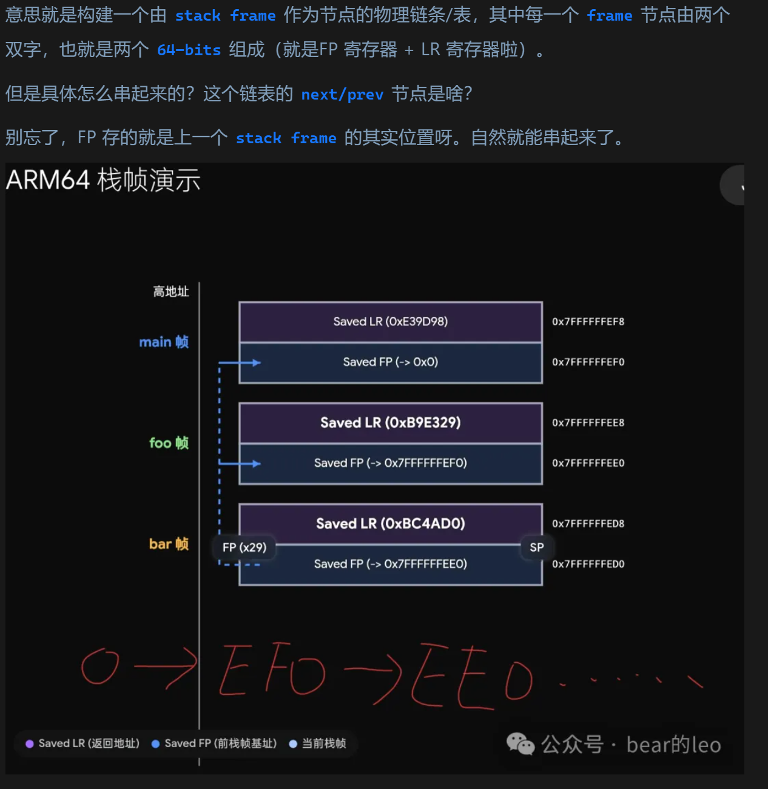

因此这里，不多说了，记住关键也是 `AAPCS64` 手册上说的：**FP 本质上构成了一条单向链表。**


## 2.2 自己实现一个

那这一章还讲什么？直接实践看看，自己做一个 `backtrace`。

代码在：https://github.com/JAILuo/wechat-demos

核心原理很简单：

```C
struct frame {
    frame *prev;
    void *lr;
};

void unwind(Frame *fp) {
    while(fp) {
        printf("%p\n", fp->lr);
        fp = fp->prev;
    }
}
```

直接看代码：

```C
#define _GNU_SOURCE
#include <stdio.h>
#include <stdint.h>
#include <stdlib.h>
#include <dlfcn.h> // 提供 dladdr 函数进行符号解析

// 严格遵循 AArch64 (AAPCS64) 规范的 Frame Record 结构
// [FP, #0] 是上一层的 FP
// [FP, #8] 是上一层的 LR (返回地址)
struct frame_record {
    struct frame_record *prev_fp;
    void *lr;
};

// Unwind 引擎
void unwinder() {
    // 获取当前状态机的起点 (FP)
    struct frame_record *fp = (struct frame_record *)__builtin_frame_address(0);
    int depth = 0;
    const int MAX_DEPTH = 15;

    printf("\n[System Exception] Initiating Hierarchical State Machine Unwind...\n");
    printf("==================================================================\n");

    while (fp != NULL && depth < MAX_DEPTH) {
        Dl_info info;
        const char *func_name = "<unknown_symbol>";
        void *offset = 0;

        // 核心：利用底层 API，把内存地址翻译成人类可读的函数名
        if (fp->lr != NULL && dladdr(fp->lr, &info) && info.dli_sname != NULL) {
            func_name = info.dli_sname;
            // 计算指令在函数内部的偏移量 (当前 PC - 函数起始地址)
            offset = (void *)((uintptr_t)fp->lr - (uintptr_t)info.dli_saddr);
        }

        // 渲染树状层次结构
        for (int i = 0; i < depth; i++) printf("  │  ");
        printf("\n");
        for (int i = 0; i < depth; i++) printf("  │  ");
        
        // 打印当前帧信息
        printf("  ├─> [Level %d] %s + %p\n", depth, func_name, offset);
        
        for (int i = 0; i < depth; i++) printf("  │  ");
        printf("  │   (FP: %p | LR: %p)\n", fp, fp->lr);

        // 状态机校验与回退
        struct frame_record *next_fp = fp->prev_fp;
        if (next_fp != NULL && (uintptr_t)next_fp <= (uintptr_t)fp) {
            for (int i = 0; i < depth + 1; i++) printf("  │  ");
            printf("\n");
            for (int i = 0; i < depth + 1; i++) printf("  │  ");
            printf("  [!] Stack Corruption Detected at %p. Halting.\n", fp);
            break;
        }

        // 进入上一层状态机
        fp = next_fp;
        depth++;
    }
    printf("==================================================================\n\n");
}

// 模拟深层嵌套调用链
__attribute__((noinline)) void driver_write_reg() {
    unwinder();
}
__attribute__((noinline)) void ipc_send_message() {
    driver_write_reg();
}
__attribute__((noinline)) void dsp_process_audio() {
    ipc_send_message();
}

int main() {
    dsp_process_audio();
    return 0;
}
```

编译命令：`aarch64-linux-gnu-gcc -rdynamic -fno-omit-frame-pointer main.c  -ldl`

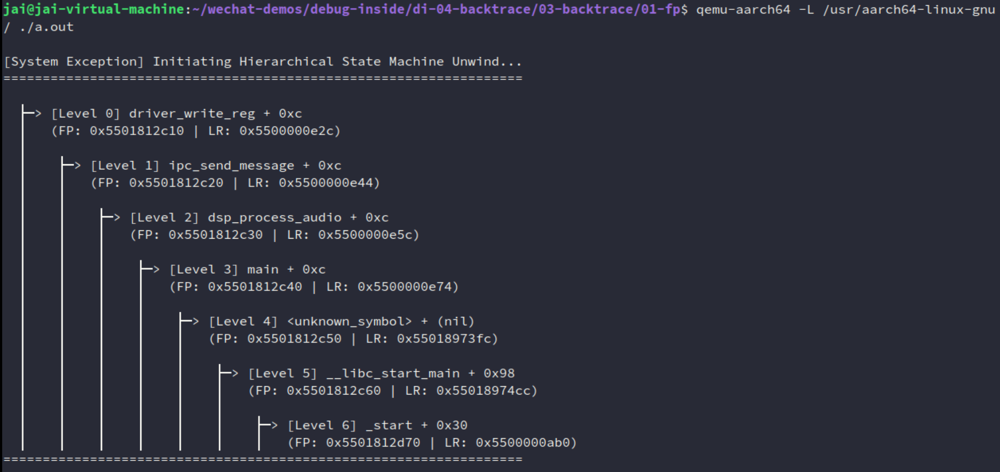

程序的逻辑比较简单：

1. 获取当前 `stack frame` 的 `FP`（这个 `FP` 指向父函数（调用者）的地址） 
2. 动态符号解析，获取函数名，
3. 打印当前 `frame` 的信息：[调用栈深度] 函数名 + offset
4. 状态机校验与回退，结束 `backtrace`

这里需要注意一下的是第三步的这个 `offset`。

它的含义是：**当前执行的指令，距离这个函数起始位置的字节偏移量**。

具体看这行代码：`offset = fp->lr - info.dli_saddr`：

- `fp->lr` (返回地址)： 它是状态机当前的绝对坐标（PC 指针），记录子函数执行完毕后，应该回到父函数里的哪一个具体的内存地址继续执行。
- `info.dli_saddr` (函数基址)： 这是通过 `dladdr` API 查到的。它代表这个函数（比如 `dsp_process_audio`）在内存中被加载的起始绝对坐标。

而我们这个地址又是返回到父函数时的地址，所以，这里的意思就是**执行完子函数后，程序将返回到父函数起点+offset 的地址去执行下一条指令。**

而且，特别的，对于 `armv8` 这种 RISC 架构来说，每条指令固定占 4 个字节。

**所以也就是返回到父函数内部的第 `(offset / 4) + 1` 条指令。**

综上，可以看到，这个基于 `FP` 的 `unwind` 比较简单，关键还是第一篇讲到的**程序是个状态机、FP/LR**的内容。

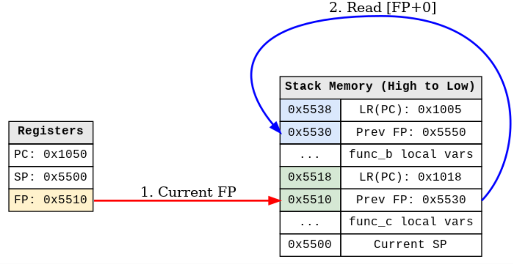


## 2.3 `FP` 失效

但是但是，这种方法非常脆弱。只要遇到内存越界踩坏了栈上的 `next_fp`，或者为了极限压榨空间而在编译期移除了 `FP` 寄存器的使用，这条单向链表就断了。比如这么编译：

`aarch64-linux-gnu-gcc -rdynamic -fomit-frame-pointer main.c  -ldl`：

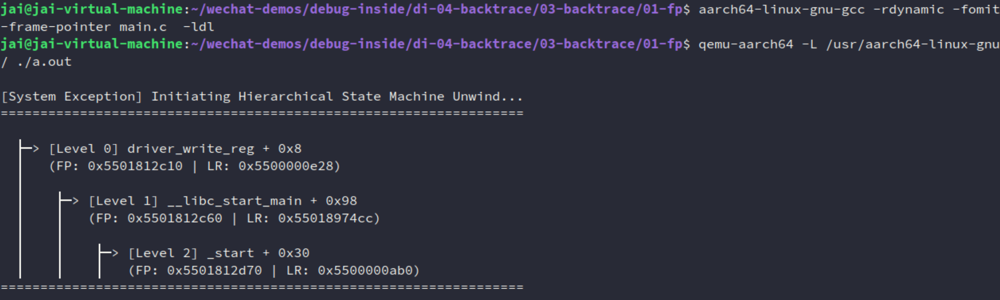

甚至看不什么，如果是在主机上，那就更离谱了：

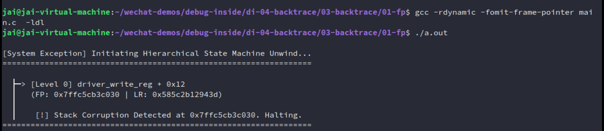

而且，这个 `-fomit-frame-pointer` 用不用，社区/不 同领域似乎还并不相同呢？下面是 `kimi` 搜索的结果（不保证下面内容的准确性）

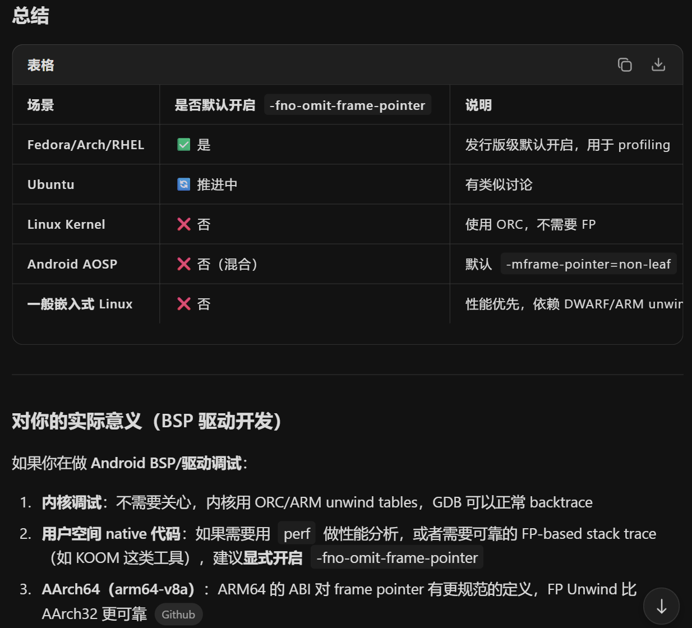

不过如果让我做决策，我应该会开 `FP` 的，真的需要省下那一个寄存器来提升性能嘛？现代CPU的应该还是挺强大的（乱序、寄存器重命名什么的），不过我也没了解过。

像 Android 的 `perfotto` 或者工具是怎么决策的，还得再仔细看看。

那回到 `backtrace` 的主题，没了 `FP` 怎么搞？

其实上面也已经给了一些答案了，下面讲 `DWARF unwind`。


# 3. DWARF Unwind

> ⚠️⚠️⚠️ **注意！！！**
>
> **下面是我自己当时的思想实验，会非常啰嗦！！但是我还是自己想到了这个方法！！看不下去的直接看 `CFA`之后的东西吧！**


## 3.1（可跳过/很啰嗦）思想实验

### 3.1.1 思考方法

我们可以这么想，假设现在内存出现了越界，刚好没有 FP 寄存器来表征程序事实了，你会怎么想？还是从 `first principle` 想想看目标：**恢复函数调用历史**。

程序状态是用 `memory + regs + PC` 表示的，而目前的 `memory` + `regs` 提供的事实不够用了。怎么办怎么办？......

拓宽思路，追随源头想想：程序是个状态机，我们是在用 `GDB` 复原被毁掉了的程序状态机。

之前的整个解析回溯过程是什么？`GDB` 是通过检查 `memory + regs` 上的事实 + 自实现 `FP` 回溯算法来复原整个状态机的。

事实是什么？是 `FP` 链表：

```asm
FP → frame3 → frame2 → frame1
```

但是他坏了。也就是说，目前的问题是事实丢了，而不是 `GDB` 失去了能力？对！

> **`GDB` 不是失去了能力。**
>
> **`GDB` 是失去了事实。**

到这里，我其实想到的是，现在坏掉的事实是没法改变的，那能不能再**增加额外的事实**，让 `GDB` 现有的能力（或者在添加一点），依然能够做呢？

也就是：**在崩溃前或者程序运行之前，我提前多存一点关于程序运行的信息可不可以？一些看着冗余的信息？我能不能在我的 `ELF` 里再重新插入一个 `section` 来表示程序的运行？**

**或者，我能不能提前预知到会有这种 `FP` 崩溃的情况？我提前把一种程序恢复的方法存在我这个运行的 `ELF` 里？就是一个 `section`？假设这种方法存在？**

举个例子，原来的函数长这样：

```asm
foo:
    sub sp, sp, #32
    str x30, [sp,#24]
```

作为人，肯定是知道 `LR/x30` 这个 `foo` 的返回地址是被放到了 `SP + 24` 的，等等......这是编译器告诉我的。

那也就是说，我能够改进编译器代码，让他额外存一份 `section`，这个 `section` 就是用来回到某一天被问到：“`foo` 的返回地址在哪里” 的问题！（同理，`FP` 就在 `SP + 16` 处）

呃，似乎上面的这种想法是可以的？

因为我没有把这种方法和 `memory + regs` 这些程序运行状态保留在一起，那就意味着，哪怕有一点，`FP` 坏了，自己其实是有办法再去**把整个函数返回地址+栈帧地址捞回来的。**

所以，我上面做的是什么？我实在**保存恢复事实的方法**！这算不算一种 **元数据** 呢？

> 极端一点的例子：
>
> - `FP`：答案写在卷子上
> - 我这种方法，直接存好解题步骤

> 实际上，上面的这部分已经出现 DWARF 的思想了。但真的就是这么想出来的（尽管我提前知道了 DWARF，但我对 DWARF 的理解就是一种跨平台指令集+虚拟机，我其实并不够了解字节码，但是文档说 DWARF 是一种规范格式）。


### 3.1.2 `SP` 会不断改变

那目前的问题就是，我要把这个 `SP` 存下来？呃呃等等，这个 `SP` 是会变的吧

在 `stack frame` 里，总是会有这种代码：`sub sp, sp, #128`，导致 `SP` 改变。

但是仔细一想，我需要的实际上并不是 `SP`，我需要的是不变的东西，能反应出 **「返回地址相对于某个参考坐标的位置」**，注意，这里是讨论的是上一个 `stack frame` ！

所以就变成：假如这个不会变的坐标是 `X`，那我就能够知道 `foo` 的返回地址是在 `X + 24`：

`return_addr = *(X + 24)` 。

此时 `GDB` 就能够通过这个公式找到 `foo` 的 `caller` 啦.

但是这个 `X` 是什么？我其实第一想到又是 `FP`，因为 `FP` 不就是为了解决 `SP` 上蹿下跳而发明的嘛。但是之前就说了：`-fomit-frame-pointer`、`FP` 被破坏......

死胡同。再想想。


### 3.1.3 找到不变量

此时在进一步啊，`foo` 的返回地址是什么？是调用 `foo` 的 `stack frame` 中的某一个位置：

``` 
高地址 (High Address)
                | ... 上个栈帧的局部变量 ...|
                +---------------------------+ 
Old FP 指向 ->  | ... 上个栈帧的基址 ...       |
                +===========================+  <--- 当前栈帧的 FP (x29) 指向这里 (栈帧底 / 高地址)
                | 保存的 LR (x30, 返回地址)   |  <--- 就是 foo 的返回地址了
                +---------------------------+  <--- FP + 8
                | 保存的 Old FP (上一个x29)   | 
                +---------------------------+
                | 当前函数的局部变量           |
                | 寄存器保护区等              |
                | ...                       |
                +===========================+  <--- 当前的 SP 指向这里 (栈顶 / 低地址)
       低地址 (Low Address)			
```

```C
caller
 |
 +---- call foo()
           |
           v
          foo
```

举个例子，假设调用发生的时候，此时的 `SP = 0x1000`。

那么进入到 `foo` 后，执行 `sub sp,sp,#32`，`SP = 0x0fe0`

接着又一次函数：`sub sp,sp,#128`，`SP = 0x0f60`

我已经发现了，对于当前的 `stack frame` 来说，`SP` 一直变，但是 `foo` 这个 `stack frame` 的顶部边界是不变的！也就是 `caller` 调用 `foo` 时的 `SP` 不变。

嗯嗯非常好，找到关键了，既然我找到了 `current frame` 的固定基地了，我依旧设为 `X`。


### 3.1.4 `GDB` 怎么知道 `X`？

**此时的问题就变成了怎么让 `GDB` 知道这个 `X` 是多少。这个问题似乎才比较关键。**

因为本质上我们是要去看 `SP` 的值，`SP` 的值只是在某一刻或者某一段时间内，才不变。

那也很简单，直接构一张表，在某个时间段内，记录一次这个 `SP` 值？

那这个时间是什么？就是 `PC` 啊！！举个例子：

```ASM
<foo>:
  // PC: 0x1000  (函数刚入口，SP还没来得及动)
  // [编译器内心 OS：此时 GPS 还在原点，X = SP + 0]
  0x1000:   sub     sp, sp, #32      // 分配32字节栈空间

  // PC: 0x1004
  // [编译器内心 OS：完蛋，SP 往下掉 32 了！赶紧更新公式：X = SP + 32]
  0x1004:   stp     x29, x30, [sp, #16]
  0x1008:   mov     x29, sp
  
  // 假设中间有一些局部变量分配，又需要压栈
  // PC: 0x1010
  0x1010:   sub     sp, sp, #128     // 又分配了 128 字节

  // PC: 0x1014
  // [编译器内心 OS：SP 又往下掉了 128！继续更新公式：X = SP + 160]
  0x1014:   mov     x0, #1
  0x1018:   bl      <bar>            // 去调用其他函数
  0x101C:   nop
```

于是我构建这么一张表：

| **起始 PC** | **结束 PC** | **适用的 CFA 计算公式** | **说明**                               |
| ----------- | ----------- | ----------------------- | -------------------------------------- |
| `0x1000`    | `0x1003`    | `CFA = SP + 0`          | 刚进函数，第一条 `sub sp` 还没执行完。 |
| `0x1004`    | `0x100F`    | `CFA = SP + 32`         | 执行完第一次减 SP 后。                 |
| `0x1014`    | ...         | `CFA = SP + 160`        | 执行完第二次减 SP 后。                 |

非常完美！此时切换到 `GDB` 的视角，如果我再调试一个 `Coredump`，看 `memory + regs` 快照：

- 当前 `PC = 0x1018`（刚好崩在调用 `bar` 的时候或者刚回来的时候）。
- 当前 `SP = 0x7F60`。

这个时候，还是根本不知道这个程序之前经历了什么，你只知道它死在了 `0x1018`。但是呢，我有上面这个方法：

1. 查表找规则： 拿 `PC = 0x1018` 跑去查编译器留下的那张表。
2. 命中范围： 发现 `0x1018` 落在了 `0x1014 ~ ...` 这个 PC 范围内。
3. 获取公式： 这个范围对应的规则是 `X = SP + 160`。
4. 计算原点： `X = 0x7F60 + 160 = 0x8000`。

哦吼，这不就计算出 `X` 了？这就是进入 `foo` 之前没有动过的 `SP`！

那之后回溯的事情不是更简单，再次查表 + 根据 `AAPCS64`，`FP` 和 `LR` 的位置我们都知道：

`LR = X - 8`，`FP = X - 16`

完美解决！


## 3.2 DWARF 的 CFA 和 CFI

### 3.2.1 CFA

实际上，上面的 `X` 就是 `DWARF` 的 `CFA(Canonical Frame Address，规范帧地址)`：

(G)DWARF 官方手册的定义：

> **"The call frame is identified by an address on the stack. We refer to this address as the Canonical Frame Address or CFA. Typically, the CFA is defined to be the value of the stack pointer at the call site in the previous frame (which may be different from its value on entry to the current frame)."^[5]^**
>
> **“调用帧是通过栈上的某个地址来标识的。我们将这个地址称为“标准帧地址”或 CFA。通常，CFA 指的是在上一帧的调用点处，栈指针所指向的值（该值可能与当前帧开始时的栈指针值不同）。”**

Arm 64-bit Architecture 的 `ELF` 的定义：

> **”The term Canonical Frame Address (CFA) is defined in GDWARF, §6.4, Call Frame Information.**
>
> **This ABI adopts the typical definition of CFA given there:**
>
> **The CFA is the value of the stack pointer (sp) at the call site in the previous frame“^[6]^**  


### 3.2.2 CFI

那上面那张表呢？其实这张表已经和 DWARF 中的思想已经非常接近了。

DWARF 并没有规定某个特定的回溯算法，它定义的是：

> **一套描述「如何恢复上一层状态机」的规则格式。**

抽象一点看，DWARF 希望描述这样一张巨大的表：

```C
PC        CFA规则         LR规则         FP规则
------------------------------------------------
0x1000    SP+0           CFA-8         CFA-16
0x1004    SP+32          CFA-8         CFA-16
0x1014    SP+160         CFA-8         CFA-16
...
```

也就是对于任意一个PC，`GDB` 都能按照以下的流程做一次 `unwind`：

`PC → 查表 → 计算CFA → 恢复寄存器 → 得到 caller`

那问题来了，这张表到底叫什么？DWARF 把这些用于恢复栈帧的信息统称为：

`CFI(Call Frame Information)`

名字也很直白，就是 `Call Frame + Information`，关于栈帧恢复的信息。

看看手册：

> **"DWARF supports virtual unwinding by defining an architecture independent basis for recording how subprograms save and restore registers during their lifetimes."**
>
> **记录函数生命周期中寄存器的保存/恢复规则，使得调试器可以"虚拟地"回溯栈帧。**
>
> **”Abstractly, this mechanism describes a very large table...“^[5]^**

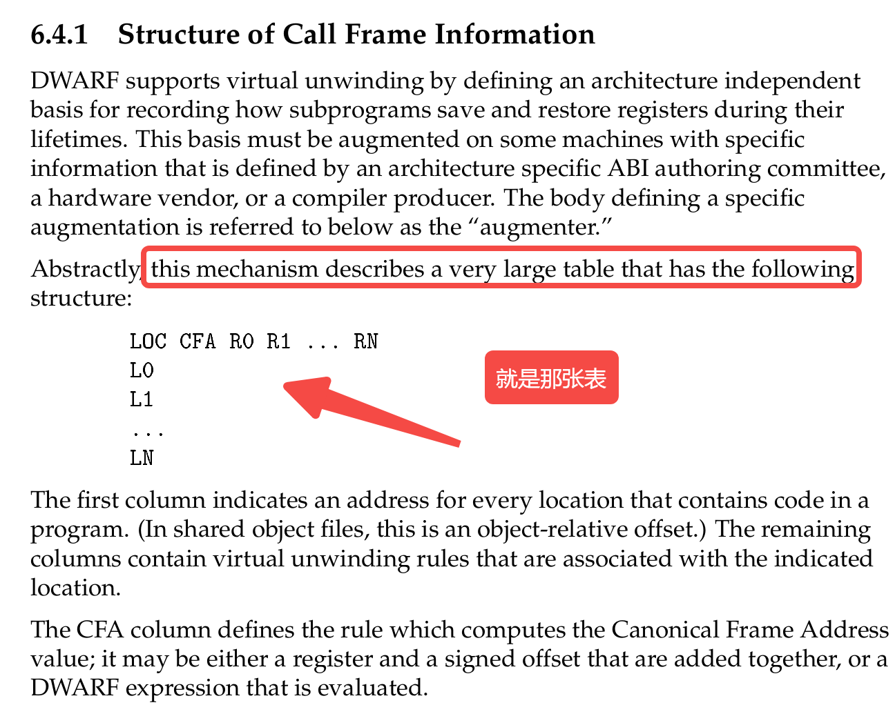

由此我们可以总结：

- `CFI`：恢复规则
- `CFA`：恢复规则里的坐标原点


## 3.3（可跳过）`.eh_frame` 和 `.debug_frame`

知道结论：目前用户态基本用的就是 `.eh_frame`。但我自己写的东西，自己想探索。

### 3.3.1 二者对比

还有一个问题，那上面这张表存在哪里呢？我们看文档^[5]^：

> **"The virtual unwind information is encoded in a self-contained section called `.debug_frame`. Entries in a `.debug_frame` section are aligned on a multiple of the address size relative to the start of the section and come in two forms: a Common Information Entry (CIE) and a Frame Description Entry (FDE)."**

也就是说，`CFI` 数据被编码在 `.debug_frame` 这个 `section` 中。

> 更加细节重要的 `CIE` 和 `FDE` 总结（本文不展开讲）：
>
> `CIE` 是 `unwind` 规则的公共模板，定义了所有函数共享的初始状态（如对齐因子、默认寄存器规则）；`FDE` 则是针对单个函数的实例条目，引用某个 `CIE` 并记录该函数代码范围内的增量规则变化。两者配合使得编译器只需存储差异而非完整表格，大幅压缩了 `unwind` 信息的体积。

可以是如果你去看实际工具链编译出来的 `section`，似乎没看到 `debug_frame`：

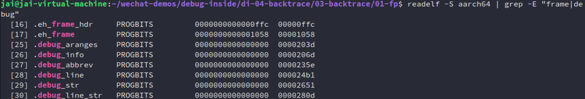

```C
.debug_aranges   ← 地址范围查找表
.debug_info      ← DIE（调试信息条目）
.debug_abbrev    ← DIE 的缩写表
.debug_line      ← 行号信息
.debug_str       ← 字符串表
.debug_line_str  ← 行号字符串表
```

类似的也只是一个 `.eh_frame`（我只知道 C++ 异常处理相关的内容似乎会用这个内容）

这部分我不太懂，直接问了 `kimi` 搜索了一些资料（原因是我觉得 `kimi` 在搜资料方面的能力更强点），找到了 `Linux Standard Base Core Specification` 其中的 `Generic Part` ^[7]^：

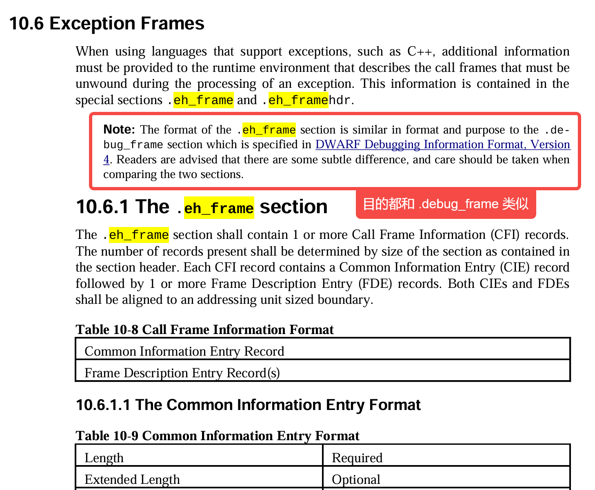

按照上面的理解，`.eh_frame` 是用于给一些支持异常处理的语言（比如 C++）提供基础能力的，**能够描述在处理异常期间必须展开的调用帧。**

而且：`.eh_frame` 和 `.debug_frame` 目的都类似，只是很多细节不一样，如果问题不大用来替代好像也行。

问问 AI：`.eh_frame` 和 `.dbeug_frame` 给谁看？（不想看就直接跳吧）

- **视角一：线下分析与调试（.debug_frame）**

    GDB 是在程序崩溃（Coredump）或者被打断时介入的。它运行在外部进程，有着上帝视角。对于 GDB 来说，哪怕这份说明书再厚，采用 64 位绝对地址（DWARF64）记录，也完全不是负担，因为它**不需要被加载到目标系统的运行时内存中**。`.debug_frame` 就是这样一个纯粹用于线下辅助调试的只读 Section。

- **视角二：运行时的自我救赎（.eh_frame）**

    当程序执行 `throw` 抛出异常时，它不能指望 GDB 来救场，它必须在**运行阶段**自己顺着栈帧往回找对应的 `catch` 块。这就要求栈回溯的说明书必须**常驻于进程的虚拟内存中**。这就是 `.eh_frame`（Exception Handling Frame）的由来。

#### 核心差异对比

既然 `.eh_frame` 必须伴随程序一同加载到内存，它的设计就必须满足两个严苛的要求：**体积小**且**位置无关（Position Independent）**。基于你提供的参考资料，我们可以总结出以下核心差异：

| **核心特性**     | **.debug_frame (DWARF 原生标准)**                            | **.eh_frame (LSB)**                                          |
| ---------------- | ------------------------------------------------------------ | ------------------------------------------------------------ |
| **存在形态**     | 仅存在于磁盘，**无** `SHF_ALLOC` 标志。                      | 伴随进程加载到内存，**有** `SHF_ALLOC` 标志。                |
| **主要使用者**   | 外部调试器 (如 GDB)。                                        | C++ 运行时 (如 libgcc_s 的 `_Unwind_Backtrace`)。            |
| **寻址方式**     | 绝对偏移 (Absolute Offset)。                                 | 相对偏移 (Relative Offset, 如 `DW_EH_PE_pcrel`)。            |
| **CIE 增强字段** | 标准化，仅用于调试回溯。                                     | 引入 `Augmentation String` (如 'z','R','P')，用于定位 LSDA 等异常处理数据。 |
| **存储效率**     | 较差。文件增大时需升级 DWARF64，AArch64 的 `initial_location` 需占用 8 字节。 | 极高。相对寻址突破了 32 位限制，AArch64 的指令地址通常只需 4 字节。 |

#### `.eh_frame `的架构改良：相对寻址的艺术

深入 CIE (Common Information Entry) 和 FDE (Frame Description Entry) 的内部，你会发现 `.eh_frame` 做了一个非常优雅的架构级优化。

在原始的 `.debug_frame` 中，每一个 FDE 想要找到它从属的 CIE，靠的是一个**绝对位置的 Section 偏移量**。这带来了一个致命问题：如果文件超过 4GB，就不得不切换到臃肿的 DWARF64 格式。

而在 `.eh_frame` 中，`CIE_pointer` 被改成了一个**相对偏移量**（也就是从当前位置往回倒退的字节数）。这种改进就像在分析 ARMv8 内存布局时，利用 PC-relative（如 `ADRP`）寻址能完美避开绝对地址的重定位开销一样。它不仅永远不需要担心 32 位溢出的问题（如果距离太远，编译器大不了再生成一个新的 CIE 即可），还完美契合了现代操作系统的 ASLR（地址空间布局随机化）和 PIE（位置无关可执行文件）机制。

#### Augmentation：超越栈回溯

既然 `.eh_frame` 服务于异常处理，那它不仅要回答“上一层栈帧在哪里”，还要回答“异常发生时，我该怎么处理？”。

因此，`.eh_frame` 的 CIE 引入了 **Augmentation String（增强字符串）**，它像一个协议头一样，指示了后续的解析规则：

- 如果包含 `'R'`，则指定了 FDE 中的地址编码方式（如 `DW_EH_PE_pcrel | DW_EH_PE_sdata4`）。
- 如果包含 `'P'`，则后面跟着一个指向 **Personality Routine** 的指针（告诉运行时用什么语言的规则去处理这个异常）。
- 如果包含 `'L'`，则指示了 **LSDA (Language Specific Data Area)** 的位置，LSDA 里面才真正记录了 `try-catch` 块的匹配信息。

正是由于这些为运行时量身定制的优化，`.eh_frame` 的体积不仅通常比 `.debug_frame` 要小，而且成为了现代编译器（如 GCC/Clang）即使在禁用 C++ 异常（`-fno-exceptions`）时，也常常默认生成的首选 Unwind 结构。


> 除此之外，我最的懵逼的是为什么会在 `LSB` 的文档里？在 `DWARF` 和 `C++` 标准里似乎都没有这方面的定义，所以我又问了 AI，发现了很多有意思的东西！


### 3.3（可跳过）`eh_frame` 的来由

直接结论：

>  **`.debug_frame` 是一份写给 GDB 看的调试图纸，归 DWARF 标准管；而 `.eh_frame` 是一份写给 Linux 操作系统和 C++ 运行时库看的二进制法律合同，它是系统 ABI（Application Binary Interface）不可分割的一部分，因此它是由 Linux 标准基准（LSB）来定义的。**

要理解 LSB 的作用，首先要明白在“异常处理”这件事上，谁不管事：

- **DWARF 规范不管“运行时”：** DWARF 的初衷和定位非常纯粹——我只负责指导外部调试器（如 GDB）怎么解析静态文件。至于你的程序在运行阶段怎么把这些数据加载进内存？怎么处理段错误？怎么跑 C++ 的 `throw/catch`？对不起，那不是调试标准的职责范围。
- **C++ 语言标准不管“二进制实现”：** C++ 标准（ISO C++）只规定了语言语义：“当抛出异常时，应当沿调用栈向上寻找匹配的 `catch` 块，并调用沿途局部变量的析构函数”。至于这套机制在底层是用 `setjmp/longjmp` 实现，还是用栈回溯实现？表结构长什么样？C++ 标准一概不管。

哦所以！这就出现了一个真空地带：**GCC/Clang 应该也想到了要决定用类似 DWARF 的表结构来实现 C++ 异常，但这套表在运行时怎么被操作系统和动态链接器识别？** 

没人给出一个权威的跨平台/跨发行版的二进制契约。那 `LSB` 来做也很合理！`LSB` 就用来**保证二进制兼容性**，确保在 Ubuntu 上用 GCC 编译出的 `ELF`，直接拷到 CentOS 或 Fedora 上也能跑。

但实际做起来没这么简单，有很多问题：

1. **内存加载问题：** `.eh_frame` 必须被 OS 的加载器（Loader）加载到内存中。为了让运行时库（如 `libgcc_s` 的 Unwinder）能极其快速地找到这块表，ELF 文件中专门引入了一个名为 `PT_GNU_EH_FRAME` 的 Program Header 标志。**ELF 格式的扩展和规范，正是 LSB 的管辖范围。**(具有 `SHF_ALLOC` 标志，作为 `image` 的一部分)
2. **跨动态库抛出异常：** 假设你在主程序里 `throw` 了一个异常，但 `catch` 却在一个由别人编译的 `.so` 动态链接库里。如果大家对 `.eh_frame` 的表结构、相对寻址公式（比如那个 `DW_EH_PE_pcrel`）理解不一致，程序当场就会崩溃。
3. **异构工具链的协同：** 必须保证 Clang 编译的代码抛出的异常，GCC 编译的代码能接住。大家必须遵守同一套底层数据结构。

因此，LSB 必须把 `.eh_frame` 纳入其核心规范（Core Specification）。**在 LSB 眼里，`.eh_frame` 根本不是什么“调试信息”，而是 Linux 平台上标准的应用程序二进制接口（ABI）的一部分。**

再深入一点，还有一点历史渊源：Itanium C++ ABI：

如果你再往深处挖一点，会发现 LSB 其实也是个“搬运工”。

当年 Intel 和 HP 联合搞 Itanium（安腾）架构时，顺手牵头制定了一套极其优秀的 **Itanium C++ ABI**。这套 ABI 首次详细定义了“零成本异常处理（Zero-cost Exception Handling）”该怎么做，其中就魔改了 DWARF 标准，创造出了带有 `Augmentation String`、`LSDA`、`Personality Routine` 并且使用相对寻址的 `.eh_frame`。

因为这套设计太优秀了，后来的 x86_64、ARM64 甚至所有的 Unix-like 系统（包括 Linux、macOS、FreeBSD）全部抄了这套作业，把它变成了行业事实上的标准。LSB 只是以官方的身份，把这个“事实标准”白纸黑字地写进了 Linux 的规范里。


### 3.3.2 编译标志

来点实际用的 GCC/Clang 编译标志，一位（清华的）大佬的博客总结的生成 `.eh_frame` 的^[8]^：

```plain
Compiler options                                  Produced section
-fasynchronous-unwind-tables -fexceptions        .eh_frame
-fno-asynchronous-unwind-tables -fexceptions     .eh_frame
-fasynchronous-unwind-tables -fno-exceptions     .eh_frame
-fno-asynchronous-unwind-tables -fno-exceptions  none (-g0) or .debug_frame (-g1 and above)
```

而我的编译器是默认开启的 `-fasynchronous-unwind-tables`：

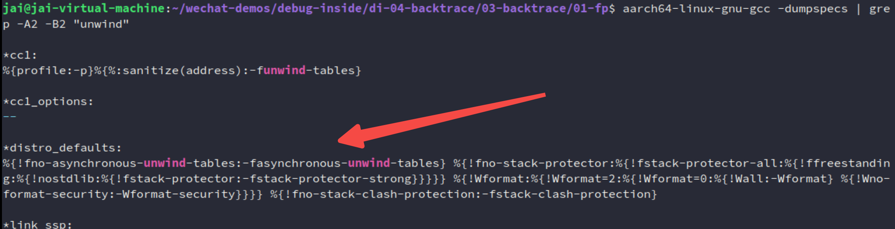

不过比较奇怪的是，在我的环境上单纯用 `-fno-asynchronous-unwind-tables -fno-exceptions` 似乎还是会生成 `.eh_frame`，要加上 `-fno-unwind-tables` 才不会生成：

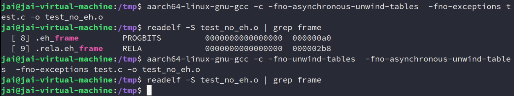


## 3.4 自己实现

上面扯了这么多，不如自己用 C 语言**硬编码实现一个迷你版 CFI 规则表查询器**。

在这个 `Demo` 中，我编译开启 `-fomit-frame-pointer`，函数内部没有任何 FP 链表，纯靠这张规则表在栈被破坏、没有 FP 的情况下实现逆向流转。

代码在：https://github.com/JAILuo/wechat-demos

```C
#include <stdio.h>
#include <stdint.h>
#include <stdbool.h>

// 1. 模拟处理器的寄存器结构体（状态机快照）
typedef struct {
    uintptr_t pc;
    uintptr_t sp;
    uintptr_t fp; // 虽然没有物理 FP 链，但寄存器本身依然存在
} registers_t;

// 2. 定义一条 CFI 规则（对应真实 DWARF 表中的一行）
// 描述在某个 PC 范围内，如何恢复上一个状态
typedef struct {
    uintptr_t pc_start;
    uintptr_t pc_end;
    
    // CFA 计算规则：CFA = 基准寄存器 + 偏移量
    // 0 代表基于 SP，1 代表基于 FP
    int cfa_base_reg; 
    int cfa_offset;
    
    // 寄存器恢复规则（相对于 CFA 的偏移量）
    int ra_offset_from_cfa; // 上一层 PC (Return Address) 的存放位置
    int fp_offset_from_cfa; // 上一层 FP 的存放位置
} cfi_row_t;

// 3. 模拟编译器为各个函数生成的 CFI 规则表
// 现实中这些数据存放在 ELF 的 .eh_frame 段
static const cfi_row_t mock_cfi_table[] = {
    // 模拟 func_c 的 PC 范围内的恢复规则（假设函数内部压栈消耗了 32 字节）
    { .pc_start = 0x1030, .pc_end = 0x10cf, .cfa_base_reg = 0, .cfa_offset = 32, .ra_offset_from_cfa = -8, .fp_offset_from_cfa = -16 },
    // 模拟 func_b 的 PC 范围内的恢复规则（假设函数内部压栈消耗了 16 字节）
    { .pc_start = 0x1010, .pc_end = 0x102f, .cfa_base_reg = 0, .cfa_offset = 16, .ra_offset_from_cfa = -8, .fp_offset_from_cfa = -16 },
    // 模拟 func_a 的 PC 范围
    { .pc_start = 0x1000, .pc_end = 0x100f, .cfa_base_reg = 0, .cfa_offset = 16, .ra_offset_from_cfa = -8, .fp_offset_from_cfa = -16 },
};
#define CFI_TABLE_SIZE (sizeof(mock_cfi_table) / sizeof(mock_cfi_table[0]))

// 4. 根据当前 PC 检索对应的 CFI 规则
const cfi_row_t* find_cfi_rule(uintptr_t pc) {
    for (size_t i = 0; i < CFI_TABLE_SIZE; i++) {
        if (pc >= mock_cfi_table[i].pc_start && pc <= mock_cfi_table[i].pc_end) {
            return &mock_cfi_table[i];
        }
    }
    return NULL;
}

// 5. 基于 DWARF CFI 规则的虚拟 Unwind 引擎
void do_dwarf_unwind(registers_t *regs) {
    printf("\n--- Starting DWARF (CFI) Unwind ---\n");
    
    int depth = 0;
    while (depth < 5) {
        printf("[Frame %d] Current PC: 0x%lx | SP: 0x%lx | FP: 0x%lx\n", 
               depth, regs->pc, regs->sp, regs->fp);
               
        // 步骤 A：拿着当前状态机的 PC 去查规则手册
        const cfi_row_t *rule = find_cfi_rule(regs->pc);
        if (!rule) {
            printf("No CFI rule found for PC 0x%lx. Stopping unwind.\n", regs->pc);
            break;
        }
        
        // 步骤 B：根据规则，计算当前帧的绝对锚点 CFA
        uintptr_t cfa = 0;
        if (rule->cfa_base_reg == 0) { // 基于 SP
            cfa = regs->sp + rule->cfa_offset;
        } else { // 基于 FP
            cfa = regs->fp + rule->cfa_offset;
        }
        printf("  -> Calculated CFA: 0x%lx\n", cfa);
        
        // 步骤 C：依据 CFA 和规则定义的相对偏移，从内存中读取并“恢复”上一个状态机的核心寄存器
        uintptr_t next_pc = *(uintptr_t*)(cfa + rule->ra_offset_from_cfa);
        uintptr_t next_fp = *(uintptr_t*)(cfa + rule->fp_offset_from_cfa);
        
        // 依据 CFA 的定义，上一层的 SP 就是当前的 CFA 
        uintptr_t next_sp = cfa; 
        
        // 步骤 D：状态机回退更新
        regs->pc = next_pc;
        regs->sp = next_sp;
        regs->fp = next_fp;
        
        // 如果回溯到了主函数或起点（模拟动作为 0），则结束
        if (regs->pc == 0) {
            printf("[Frame %d] Reached start of execution (PC == 0).\n", depth + 1);
            break;
        }
        
        depth++;
    }
    printf("--- Unwind Complete ---\n\n");
}

// ================= 测试场景构造 =================
// 虚构一个由于崩溃捕获到的、已经抛弃了物理 FP 链的内存栈数据
uint8_t fake_stack[256];

void setup_fake_environment(registers_t *regs) {
    // 模拟栈底在 fake_stack + 128 的位置
    uintptr_t stack_bottom = (uintptr_t)&fake_stack[128];
    
    // 1. 模拟 func_a 运行时的物理栈帧布局 (CFA = stack_bottom)
    *(uintptr_t*)(stack_bottom - 8)  = 0x0;       // func_a 的返回地址是 0 (起点)
    *(uintptr_t*)(stack_bottom - 16) = 0x9999;  // 原始的老 FP
    
    // func_a 调用 func_b，分配了 16 字节，下一层 CFA = stack_bottom - 16
    uintptr_t cfa_b = stack_bottom - 16;
    *(uintptr_t*)(cfa_b - 8)  = 0x1005; // func_b 的返回地址落在 func_a 的范围内 (0x1000~0x100f)
    *(uintptr_t*)(cfa_b - 16) = 0x8888;
    
    // func_b 调用 func_c，分配了 16 字节，下一层 CFA = cfa_b - 16
    uintptr_t cfa_c = cfa_b - 16;
    *(uintptr_t*)(cfa_c - 8)  = 0x1018; // func_c 的返回地址落在 func_b 的范围内 (0x1010~0x102f)
    *(uintptr_t*)(cfa_c - 16) = 0x7777;
    
    // 2. 当前崩溃发生在 func_c 内部的 0x1050 处
    // 此时 func_c 内部再次消耗了 16 字节空间用于局部变量，所以当前 SP 还要减去 16
    regs->pc = 0x1050; 
    regs->sp = cfa_c - 16; 
    regs->fp = 0xDEADBEEF; // 故意写入垃圾值，证明整个恢复过程完全不依赖物理 FP 指针
}

int main() {
    registers_t crashed_regs;
    setup_fake_environment(&crashed_regs);
    
    // 启动 DWARF 规则展开
    do_dwarf_unwind(&crashed_regs);
    return 0;
}
```

编译：`aarch64-linux-gnu-gcc  -fomit-frame-pointer  main.c -o main`

运行：`qemu-aarch64 -L /usr/aarch64-linux-gnu/ ./main`

```
高地址
  ┌─────────────────────┐
  │      (未使用)        │  ← stack_bottom
  ├─────────────────────┤
  │  RA_a = 0x0000      │  ← stack_bottom - 8   (func_a 返回地址)
  ├─────────────────────┤
  │  FP_a = 0x9999      │  ← stack_bottom - 16  (func_a 帧指针)
  ├─────────────────────┤
  │  RA_b = 0x1008      │  ← stack_bottom - 24  (func_b 返回地址 → func_a)
  ├─────────────────────┤
  │  FP_b = 0x8888      │  ← stack_bottom - 32  (func_b 帧指针)
  ├─────────────────────┤
  │  RA_c = 0x101c      │  ← stack_bottom - 40  (func_c 返回地址 → func_b)
  ├─────────────────────┤
  │  FP_c = 0x7777      │  ← stack_bottom - 48  = 初始 SP 指向此处
  └─────────────────────┘
低地址
```

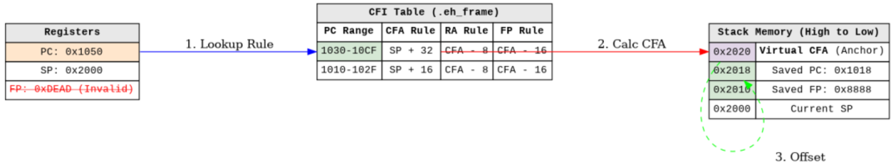

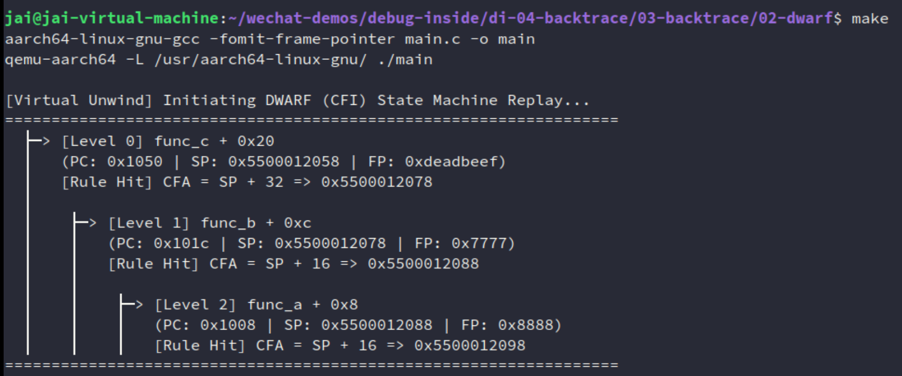

可以看到：即使物理寄存器 `FP` 被填入了垃圾值（`0xDEADBEEF`），整个系统依然能通过 `[Rule Hit]` 算出下一层的基址 CFA，一层层拨开整个调用栈。

对于实际 `GDB` 的处理也差不多（第二篇也讲过，但是没有这些什么CFA、CIE、FDE）：

1. 根据当前帧的 `PC` 寻找编译期塞入的 `FDE (Frame Description Entry)`。
2. 通过计算虚拟的 `CFA`，将由于编译器优化（如寄存器重用、栈空间复用）导致的混乱内存重新整理出确定性的空间秩序。
3. 这就对应了 GDB 手册中关于 **"Virtual Frame Pointer"** 的描述：它是一个在调试期根据规则动态计算出来的影子指针，而非真实存在于运行时硬件中的寄存器。

而且，如果真的想要探究细节，得去了解 `CIE`、`FDE` 的内容，这里推荐两篇文章：

- 也就是参考[8]，`MaksyRay` 大佬的：Stack unwinding | MaskRay：https://maskray.me/blog/2020-11-08-stack-unwinding
- .eh_frame – Airs – Ian Lance Taylor：https://www.airs.com/blog/archives/460

如果你对  `V8` 和 `x86_64` 比较熟悉，也可以看看这篇：

- Teaching gdb to Unwind V8 JIT Frames on x64 | Joyee Cheung's Blog：https://joyeecheung.github.io/blog/2026/03/24/teaching-gdb-to-unwind-v8-jit-frames-on-x64/

或者更加直接的，直接问问 AI 不就好啦！

下面是AI的指导：

```plain
文章逻辑                       GDB 代码对应
─────────────────────────────────────────────────────────────
PC → 查表                      dwarf2_frame_find_fde() [bsearch]
获取 CFA 计算公式              execute_cfa_program() 解析 CIE/FDE
计算 CFA (X)                   cache->cfa = reg + offset / execute_stack_op()
恢复上一层寄存器               dwarf2_frame_prev_register()
  - LR (返回地址)              cache->reg[retaddr_column]
  - FP (帧指针)                cache->reg[FP_regnum]
  - SP                         隐含：上一层的 SP = 当前 CFA
```


到此，本篇结束，考虑到文章篇幅以及现在人基本不愿意看长文的（**而且都是自己的思考过程，对多大多数人应该是没用的**），是下一篇会补充 Linux 的ORC unwinder、`backtrace` 拓展等内容。


# 参考

[1] Stack (Debugging with GDB)：https://sourceware.org/gdb/current/onlinedocs/gdb.html/Stack.html#Stack

[2] Unwinding Frames in Python (Debugging with GDB)：https://sourceware.org/gdb/current/onlinedocs/gdb.html/Unwinding-Frames-in-Python.html

[3] Backtrace (Debugging with GDB)]：https://sourceware.org/gdb/current/onlinedocs/gdb.html/Backtrace.html#Backtrace

[4] Neil Brown. (2015). A fresh look at the kernel's device model. https://lwn.net/Articles/645810/

[5] DWARF Debugging Information Format Version 5：https://dwarfstd.org/doc/DWARF5.pdf

[6] DWARF for the Arm 64-bit Architecture：https://github.com/ARM-software/abi-aa/releases/tag/2025Q4

[7] Linux Standard Base Core Specification：https://refspecs.linuxfoundation.org/lsb.shtml

[8] Stack unwinding | MaskRay：https://maskray.me/blog/2020-11-08-stack-unwinding


---


> **注意：以下的内容均为个人观点+在学习/实践中得出。**
>
> **如果你看完后有不同的观点也没关系！请指出，我很乐意去学尝试积极的东西。**

封面：

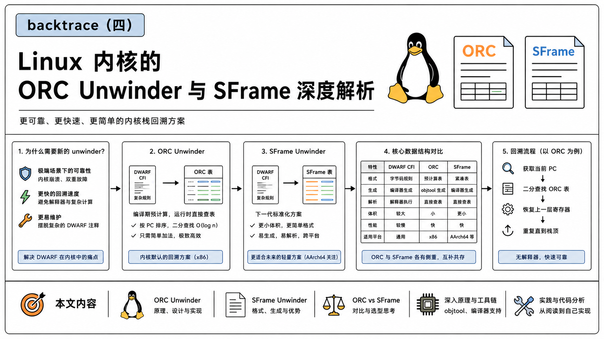

# 1. introduction

在前面一篇：[backtrace（三）：从 FP 到 DWARF ：解析用户态回溯技术](https://mp.weixin.qq.com/s/PlL2WnSima8e2b0JFZj2aQ) 讲了 `FP` 和 DWARF  的 `CFI` 实现 `unwind` 方法，但是如果再多搜索一下，你还会看到 Linux 内核里一个叫 `ORC Unwinder` 的东西^[1]^：

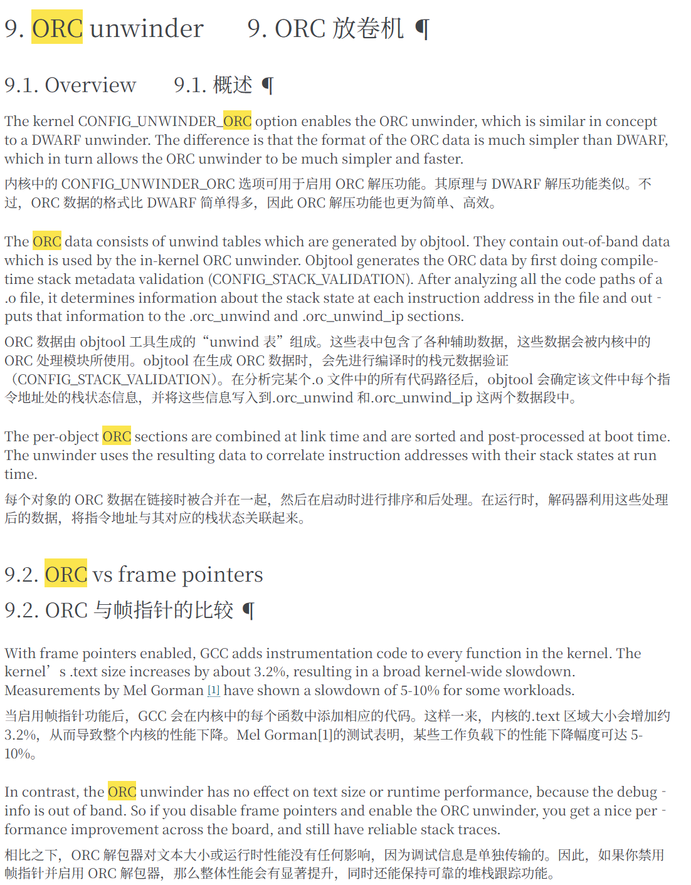

所以本文讲述 `ORC Unwinder`、`SFrame` 等内容。


# 2. Linux 的 ORC Unwinder

## 2.1 引入

如果单纯看 DWARF 里的 CFI，感觉已经万事大吉了，它和 `FP` 都是在解决如何恢复 `previous state` 的问题，区别只是 **恢复规则存在哪里** 和 **恢复规则怎么执行**。

那既然功能正确了，问题自然也解决了。了吗？

上面的工具似乎都是在调试用户空间的程序。

内核开发者往往想得更加深入（或许这才是工程上的真正考虑的问题）：

**功能正确 + 什么时候正确 + 在什么状态下正确 + 代价是多少**

前面的 DWARF 做 `unwind` 的过程：基本就是查表，计算 `CFA`，恢复寄存器。

> 而这里有一个前提就是我的程序能够正确地解析规则，本质就是解释器解析各种字节码（`DW_CFA_xxx`），有点像 `python` 脚本。
>
> 这也很好理解，因为我们是在调出问题的用户程序，而 DWARF 生成的是外部调试信息（**out-of-band（带外数据）**），是给 `GDB` 用的，那出问题的用户程序自然不会影响到我们的 `unwind`。

但对于内核来说，`kernel` 都挂了（`memory`、`stack`可能坏了），还要在这个挂了的环境上跑个解释器？跑着跑着解释器挂了不是更离谱？而且最重要的是 DWARF 生成的信息似乎并不由内核所掌控（`GCC` 生成）。

**所以我理解的 `ORC Unwinder`  更加重要的是应该是可靠性，而不是文档中所说的性能（`simpler and faster`），性能只是副产品。**

> **这里插一句，以前我总是会怕表达自己对某个技术/文档的观点，总是会去想自己可能没想得到什么部分。但现在我觉得应该做的是：想确实没错，但更应该说出来让别人批判，要敢于犯错。**

比如开发会遇到的各种问题：

```c
Kernel Panic
Memory Corruption
Double Fault
Interrupt Nesting
...
```

所以在这样的极端环境下，我要的就是这个 `Call Trace` **快速、可靠地工作**，而不是像 DWARF 的 `CFI` 那样整个信息的表达有多全面（配个虚拟机啥的）。下图来源：[2]

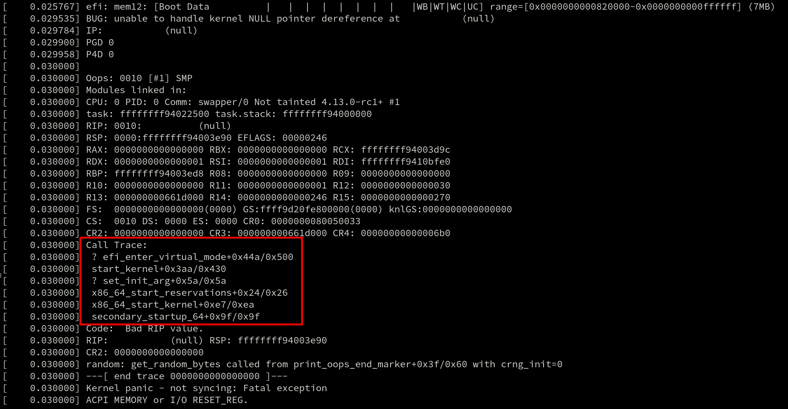

> 此时这里可以回去想一个内容，那对于用户程序来说，`FP` 那种方法肯定是 `not reliable`（在中断和异常处理的情况下）；DWARF 的 `CFI` 由于是在外部存调用信息，可以说是 `reliable` 的^[2]^？

Linus 也确实对上面的一些现象发表过评价：

> Linus was clear that no DWARF unwinder would be allowed in the kernel: “Because from the last time we had fancy unwindoers [sic], and all the problems it caused for oops handling with absolutely zero_ upsides ever, I do not ever again want to see fancy unwinders with complex state machine handling used by the oopsing code.”

> Linus 明确表示，绝不允许任何复杂的异常处理机制被引入内核中：“因为上一次我们使用了那些复杂的异常处理机制后，不仅给错误处理带来了诸多问题，而且没有任何好处。我再也不想看到那种需要复杂状态机来处理的异常处理机制被用于错误处理代码中了。”

而且有一点在内核很重要的是：汇编。

DWARF 依赖编译器生成 `.eh_frame`，但内核中有大量的手写汇编代码（估计也有几万行了）。编译器无法为汇编生成 CFI 信息，必须手动标注 `.cfi_*` 伪指令——这在历史上被证明是**不可维护的**。

> "asm annotations were tried in the past and were found to be unmaintainable. They were often incorrect/incomplete and mde the code harder to read and keep updated."^[1]^


## 2.2 如何解决/设计

AI 总结的 DWARF 的问题：

- 太复杂（相当于跑虚拟机）： DWARF 的 `CFI` 规则本质上是一种字节码。解析它需要在内核里跑一个微型的状态机引擎。在 Panic 的废墟上跑虚拟机，极易引发二次崩溃（Double Fault），导致连崩溃日志都打印不出来。
- 太慢： DWARF 的规则是增量式的（每一行只记录相对于上一行的变化），为了知道当前 PC 的恢复规则，解析器往往需要从函数开头的规则一路模拟计算过来，耗时极长。
- 不可靠的代码补丁： 内核经常使用汇编手写底层逻辑（如异常向量表、上下文切换），而手写汇编很难完美维护复杂的 DWARF 注释。

> 针对上面的种种问题，对于 `x86-64` 平台，Josh Poimboeuf 在社区讨论开发过程中提出了一种新的 `unwinder` 和调试信息格式，就是 ORC Unwinder。
>
> 该方案利用 `objtool` 工具以及现有的堆栈验证机制，创建了一种全新的自定义调试信息格式。与 DWARF 格式相比，ORC 格式的体积更小、结构更简单。因此，在解析调试信息时，无需使用复杂的状态机来处理数据。

**但是，我觉得上面还漏了一个点：少了 OS 内核非常重要的中断/异常处理，这在用户态都没有嘛，而且绝大多数崩溃也是在中断异常处理的时候呀。**

我们知道，Linux 中每一个进程都会有各自的用户栈和内核栈，对于那些通过系统调用/中断/异常等方式进入到内核态的时候，就需要保存对应到上下文（也就是那个巨大的  `pt_regs`），所以这部分也是需要处理的。

### 2.2.1 自己理解

按照我常用的“程序是个状态机”的理论，来理解上面的 `ORC Unwinder`。

从 `first principle` 来看，DWARF CFI 是怎么做的？

1. 由编译器编译器对应源文件，生成 `.eh_frame` 存储对应恢复 `call stack` 的规则（就是那个 `CFI`）
2. `GDB` 运行时去执行规则（`.eh_frame`），获取当前PC，获取 CFA 计算公式，计算 CFA，恢复上一层寄存器（`LR/FP/SP`）。

我们可以看到，这里本质上 GDB 还是在做**运行时计算**的，那熟悉 C++/性能优化的人，自然也能想到去用**编译时计算**来做。

所以 ORC 的核心思想，我理解的是，干脆在编译内核的时候，就让 GCC 直接把结果算好，然后结果全部摊平，构成一张查找表，之后用到就直接去查标记可。

这样子，我就不需要 DWARF 那种复杂的字节码（`DW_CFA_xxx`），但还是和我在第三篇的思想类似：仍然按照 `PC` 去查找 `CFA`。

>当然，还有一些别的细节，比如编译构造这张表的时候就已经按 `PC` 排好序，任何给定的 `PC`，通过一次简单的二分查找，就能直接得到 `CFA` 和上一层栈帧的具体偏移。

所以你看，本质上 ORC 只是把 DWARF CFI 从 DWARF 中搬出来了，不需要这么 DWARF 里重型的”解释器/虚拟机“。

> 当然此时我觉得理解为状态机更好点，因为突然也意识到 DWARF 描述的是**每条指令执行时的寄存器状态**。

所以思想还是：[backtrace（三）：从 FP 到 DWARF ：解析用户态回溯技术](https://mp.weixin.qq.com/s/PlL2WnSima8e2b0JFZj2aQ) 中写到的很罗嗦的那一部分。

>**当然 ORC unwinder还有很多细节（其中我觉得最有意思的是怎么 `objtool` 对于逆向 GCC 代码生成流程 + `UNWIND_HINT_REGS` 的内容），还是推荐阅读：**
>
>- **内核文档：[1]：ORC unwinder：https://www.kernel.org/doc/html/latest/arch/x86/orc-unwinder.html** 
>
>- **依旧是 MaskRay 大佬的文章：Stack unwinding：https://maskray.me/blog/2020-11-08-stack-unwinding**
>
>    **去看看深入的细节**

哦对还有一个有意思的，来自内核文档的对于ORC的词源^[1]^：

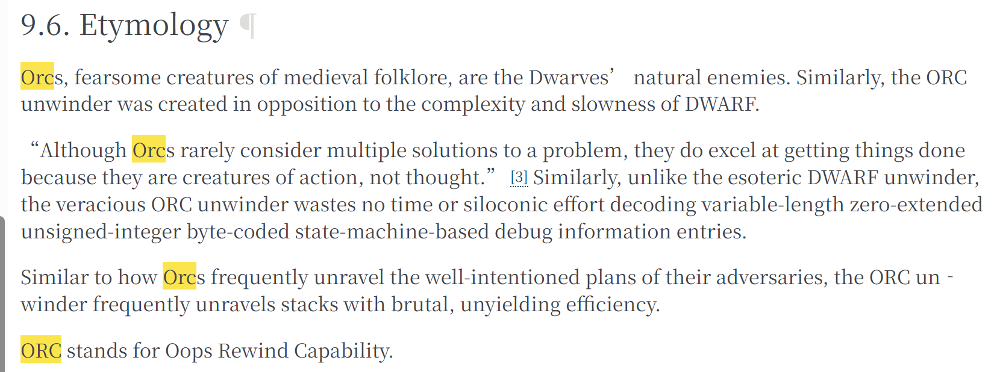

> **9.6. 词源**

兽人（Orcs），中世纪民间传说中的可怕生物，是矮人（Dwarves）的天敌。同样，ORC unwinder 的诞生正是为了对抗 DWARF 的复杂与缓慢。

“尽管兽人很少考虑问题的多种解决方案，但他们确实擅长把事情做成，因为他们是行动的生物，而非思考的生物。”类似地，与深奥的 DWARF unwinder 不同，求真务实的 ORC unwinder 不会浪费任何时间或硅基精力去解码那些基于状态机的、变长零扩展无符号整数字节编码的调试信息条目。

就像兽人经常挫败对手精心策划的计划一样，ORC unwinder 也经常以残酷、不屈不挠的效率展开栈回溯。

ORC 代表 Oops Rewind Capability（Oops 回退能力）。


## 2.4 自己实现

按照我的风格，肯定要自己弄一个ORC玩玩看啦。

代码在：https://github.com/JAILuo/wechat-demos/tree/main/debug-inside/di-04-backtrace/03-backtrace/03-orc

```C
#include <stdio.h>
#include <stdint.h>
#include <stdbool.h>

// 1. 模拟处理器上下文
// 注意：相比 DWARF 需要维护数十个寄存器，ORC 只关心 3 个核心寄存器
typedef struct {
    uintptr_t pc;
    uintptr_t sp;
} regs_t;

// 2. ORC 表结构 (极致压缩：摒弃了 DWARF 虚拟机)
// 内核只需要知道 "SP/FP/RA 在哪里"，不需要通用表达式求值
typedef struct {
    uintptr_t pc;           // 指令地址（实际存储为 PC-relative 压缩值）
    int16_t sp_offset;      // SP 恢复：直接加法，无字节码解析
    int16_t bp_offset;      // FP 恢复：直接加法
    uint8_t sp_reg:4;       // 基址寄存器：SP/FP/PREV_SP/UNDEFINED
    uint8_t type:2;         // 0=CALL, 1=REGS（中断上下文 pt_regs）
} orc_entry_t;

// 按 PC 严格排序的 ORC 表 (编译期生成，运行时只读)
// 相比 DWARF 的 CIE/FDE 嵌套结构，这是纯扁平数组，极致缓存友好
static const orc_entry_t mock_orc_table[] = {
    // sys_read: 普通函数调用，SP 偏移 16，FP 在 CFA-16
    { .pc = 0x1000, .sp_offset = 16,  .bp_offset = -16, .sp_reg = 0, .type = 0 },
    // do_IRQ: 中断帧！type=1 表示栈上保存了 256 字节的 pt_regs
    // 这是 ORC 相比 DWARF 的关键优化：直接识别中断上下文
    // 注意是：256(pt_regs)/中断 + 32(局部栈帧) = 288
    { .pc = 0x2000, .sp_offset = 288, .bp_offset = -16, .sp_reg = 0, .type = 1 },
    // driver_bug: 底层驱动函数
    { .pc = 0x3000, .sp_offset = 32,  .bp_offset = -16, .sp_reg = 0, .type = 0 },
};
#define ORC_TABLE_SIZE (sizeof(mock_orc_table) / sizeof(mock_orc_table[0]))

// ================= 内核符号表模拟 =================
typedef struct {
    uintptr_t addr_start;
    uintptr_t addr_end;
    const char *func_name;
} symbol_t;

static const symbol_t mock_symtab[] = {
    { 0x1000, 0x1050, "sys_read" },
    { 0x2000, 0x2050, "do_IRQ" },
    { 0x3000, 0x3050, "driver_bug" }
};

const char* resolve_symbol(uintptr_t pc, uintptr_t *offset) {
    for (size_t i = 0; i < sizeof(mock_symtab)/sizeof(mock_symtab[0]); i++) {
        if (pc >= mock_symtab[i].addr_start && pc <= mock_symtab[i].addr_end) {
            *offset = pc - mock_symtab[i].addr_start;
            return mock_symtab[i].func_name;
        }
    }
    *offset = 0;
    return "<unknown_symbol>";
}
// ===================================================

// O(log N) 极速二分查找：在不触发任何虚拟机指令的情况下定位规则
// 对比 DWARF：需要解析 CIE/FDE 头，执行 CFA 程序字节码
const orc_entry_t* orc_find_entry(uintptr_t pc) {
    int left = 0, right = ORC_TABLE_SIZE - 1;
    const orc_entry_t *found = NULL;

    while (left <= right) {
        int mid = left + (right - left) / 2;
        // ORC 的查找逻辑：纯整数比较，无变长编码解析
        if (mock_orc_table[mid].pc <= pc) {
            found = &mock_orc_table[mid]; // 命中最后一个小于等于当前 PC 的规则
            left = mid + 1;
        } else {
            right = mid - 1;
        }
    }
    return found;
}

// 带有 ASCII 树状渲染的内核 ORC Unwinder
void do_orc_unwind(regs_t *regs) {
    printf("\n[Kernel Panic] Initiating ORC Extreme-Speed Unwinder...\n");
    printf("==================================================================\n");
    
    int depth = 0;
    while (depth < 5 && regs->pc != 0) {
        uintptr_t offset = 0;
        const char *func_name = resolve_symbol(regs->pc, &offset);
        const orc_entry_t *entry = orc_find_entry(regs->pc);

        // 渲染树状缩进
        for (int i = 0; i < depth; i++) printf("  │  ");
        if (depth > 0) printf("\n");
        for (int i = 0; i < depth; i++) printf("  │  ");
        
        // 【核心视觉高亮】：检测到中断帧！
        // ORC 的 type 字段直接区分中断上下文，无需像 DWARF 那样解析复杂的状态
        if (entry && entry->type == 1) {
            printf("  ├─> [Level %d] %s + 0x%lx  <-- [⚠️ INTERRUPT: pt_regs Detected!]\n", depth, func_name, offset);
        } else {
            printf("  ├─> [Level %d] %s + 0x%lx\n", depth, func_name, offset);
        }
        
        for (int i = 0; i < depth; i++) printf("  │  ");
        printf("  │   (PC: 0x%lx | SP: 0x%lx)\n", regs->pc, regs->sp);

        if (!entry) {
            for (int i = 0; i < depth + 1; i++) printf("  │  ");
            printf("\n");
            for (int i = 0; i < depth + 1; i++) printf("  │  ");
            printf("  [!] ORC Table miss at PC 0x%lx. System Halted.\n", regs->pc);
            break;
        }

        // ORC 极简查表算法：只有加法，没有解析器
        // 对比 DWARF 的 execute_cfa_program()：无字节码循环，无状态机维护
        uintptr_t cfa = regs->sp + entry->sp_offset;

        for (int i = 0; i < depth; i++) printf("  │  ");
        printf("  │   [ORC Hit] CFA = SP + %d => 0x%lx\n", entry->sp_offset, cfa);

        uintptr_t next_pc;
        // 【核心修复】：如果是中断帧，必须去 pt_regs 的深处把 PC 挖出来！
        if (entry->type == 1) {
            // 中断发生前，SP 位于 CFA。随后压入了 256 字节的 pt_regs。
            // 按照我们的 setup 模拟，被打断的 PC 存在 pt_regs 的底部，即 (cfa - 256 - 8)
            next_pc = *(uintptr_t*)(cfa - 256 - 8);
            for (int i = 0; i < depth; i++) printf("  │  ");
            printf("  │   [Hardware Magic] Decoding PC from pt_regs...\n");
        } else {
            // 普通函数，PC 存在 CFA - 8
            next_pc = *(uintptr_t*)(cfa - 8);
        }

        uintptr_t next_sp = cfa;
        
        // 状态机极速回退
        regs->pc = next_pc;
        regs->sp = next_sp;
        depth++;
    }
    printf("==================================================================\n\n");
}

// 模拟极其复杂的内核崩溃现场（带有硬件中断介入）
uint8_t fake_kernel_stack[1024];

void setup_kernel_environment(regs_t *regs) {
    uintptr_t stack_bottom = (uintptr_t)&fake_kernel_stack[1024];
    
    // 1. 用户态发起系统调用，进入内核态的 sys_read
    // 栈布局：RA | FP | 局部变量...
    uintptr_t cfa_sys_read = stack_bottom;
    *(uintptr_t*)(cfa_sys_read - 8) = 0x0; 

    // 2. 硬件中断突然打断了 sys_read！
    // 内核将整个 CPU 上下文 (pt_regs) 压入栈中，消耗了 256 字节。进入 do_IRQ。
    // 这是 ORC type=1（REGS）的场景：不是普通函数调用，而是中断保存
    uintptr_t cfa_irq = cfa_sys_read - 256; 
    *(uintptr_t*)(cfa_irq - 8) = 0x1024; // 被打断的地址：落在 sys_read 范围内

    // 3. do_IRQ 处理时，调用到了有 Bug 的底层驱动
    uintptr_t cfa_bug = cfa_irq - 32;
    *(uintptr_t*)(cfa_bug - 8) = 0x2018; // 返回地址：落在 do_IRQ 范围内

    // 4. 当前崩溃定格在 driver_bug 内部的 0x3010
    regs->pc = 0x3010; 
    regs->sp = cfa_bug - 32; // driver_bug 自身消耗了 32 字节
}

int main() {
    regs_t crashed_regs;
    setup_kernel_environment(&crashed_regs);
    do_orc_unwind(&crashed_regs);
    return 0;
}

```

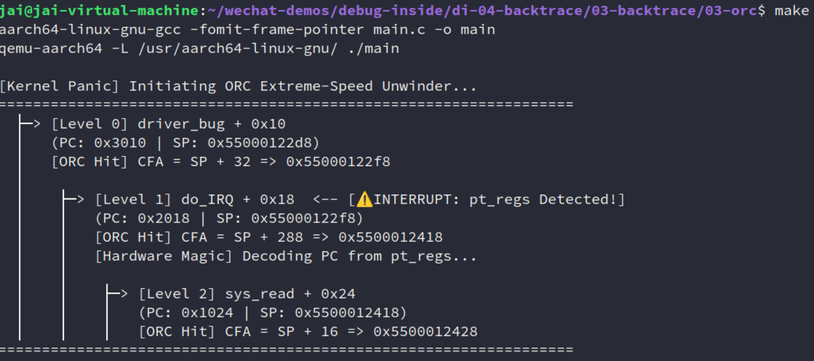

上面只是模拟的触发中断处理之后回溯的内容，具体 `objtool` 怎么生成这张表（特别是怎么处理中断上下文的回溯的）得具体看看。

AI 总结：

**ORC 表由 `objtool` 反汇编分析生成；中断上下文通过 `type=1` 直接标记为 `pt_regs` 帧，运行时跳过普通 RA 寻址，从 `pt_regs` 结构里取回被打断的 PC——这是把 DWARF 的复杂状态机拍扁成一张只读数组的关键设计。**

| 场景                 | 普通函数调用 (`type=0`)        | 中断/异常 (`type=1`)                                         |
| :------------------- | :----------------------------- | :----------------------------------------------------------- |
| **栈上保存了什么**   | 返回地址 (RA) + 可能有的 FP    | 完整的 `pt_regs`（整个 CPU 上下文，x86-64 上 168~256 字节）  |
| **RA 位置**          | `CFA - 8`（固定）              | 埋在 `pt_regs` 结构深处，需按架构偏移量去取                  |
| **objtool 怎么识别** | 分析 `call` 指令后的正常栈调整 | 识别 `ENTRY()`/`ENDPROC()` 标注的入口代码，或 `UNWIND_HINT_REGS` 等手工 hint |

1. 内核入口代码（如 `do_IRQ`、`entry_SYSCALL_64`）在 asm 里用 `UNWIND_HINT_REGS` 宏（或等效标注）告诉 `objtool`："这里不是普通函数调用，硬件会自动压入 pt_regs" 。
2. `objtool` 分析到这些标注后，生成 `type = ORC_TYPE_REGS` 的条目，`sp_offset` 覆盖 `pt_regs` 大小 + 函数自身栈帧。
3. 运行时 unwinder 看到 `type == 1`，就知道**不能按普通 `CFA-8` 去取返回地址**，而要去 `pt_regs` 结构里按固定偏移把被打断的 PC 挖出来。

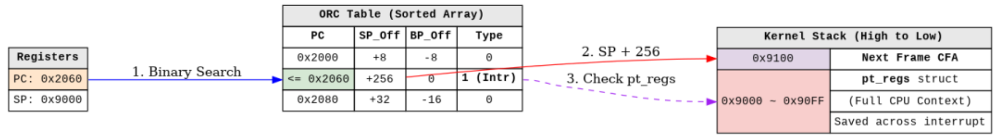


## 2.5 `reliable stacktrace`

如果你前面仔细阅读了 ORC 的内容 ，你会发现，**`ORC Unwinder` 的核心，是前面的 `objtool`。**`objtool` 是 Linux 内核源码树中的一个编译时工具（位于 `tools/objtool/`）。

主要做的就是静态分析所有代码，然后生成 `unwind metadata`（ `.orc_unwind` 和 `.orc_unwind_ip`），然后在链接时合并所有 ORC section → 启动时排序/后处理，最后给到内核 `unwinder` 使用。

为什么内核社区要费这么大劲搞这套庞大且复杂的静态分析机制？如果在内核社区的讨论中再上升一个抽象层次，我理解这么搞的目标其实是：**`Reliable Stacktrace`（绝对可靠的栈回溯）**。

> 是不是想到了我们前面是不是说的中断/异常处理对 `unwind` 的影响？

> 下面的内容，由 AI 总结，他总结得挺好的，因为我总感觉自己好像没有特别懂文档这里的内容^[3]^。

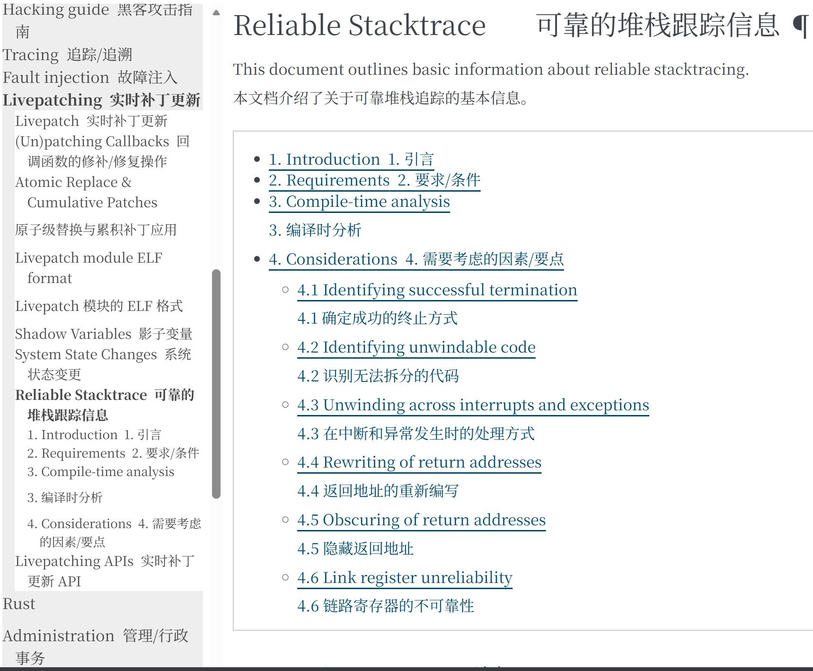

按照内核文档的定义，普通的栈回溯往往是“尽力而为（best-effort）”的，这用来辅助调试打印 Oops 没问题。但在诸如 **`Livepatching`（内核热补丁）** 这样的场景下，系统必须 100% 确信当前没有任何任务停留在即将被替换的函数中。

这就要求 `Stacktrace` 必须做到：**要么完美无缺地回溯出所有调用栈，要么明确报错说“我遇到了无法解析的脏状态（返回非 0）”，绝不能给出错误的猜测。**

要做到这种可靠，文档指出了几个极其棘手的挑战（也是普通 `unwinder` 容易翻车的地方）：

1. **跨越中断与异常（Interrupts and Exceptions）**

    当函数正在执行 Prologue（压栈）或 Epilogue（弹栈）时，如果突然来了一个中断，此时的栈指针和帧指针是处于“中间不一致状态”的。普通的 unwinder 在这里极其容易迷失，而 Reliable Stacktrace 必须能精准识别出这种边界状态并决定是继续回溯还是安全拒绝（文档 4.3 节）。

2. **返回地址被篡改（Rewriting of return addresses）** 

    内核里有很多黑魔法，比如 `ftrace`（函数追踪）或 `kprobes`（动态探测）。它们会用“蹦床（Trampoline）”技术把原本存在栈上的返回地址临时替换掉，等执行完探测代码再跳回去。这就导致 unwinder 在栈上找不到真实的返回地址（文档 4.4 节）。

3. **架构特有的寄存器二义性（Link Register Unreliability）** 

    在 x86 上，`call` 指令会自动把返回地址压栈；

    但在 ARM64 等 RISC 架构上，`BL`（函数调用）指令是把返回地址放到 **LR (Link Register, X30)** 寄存器中，而不是马上压栈。在函数执行的过程中，返回地址可能仅存在于 LR 中，也可能刚被压入栈中，甚至可能因为某些汇编优化被覆盖。

    如果仅仅依赖运行时去猜，很容易出现同一个函数在 Call Trace 中出现两次，或者层级颠倒的错误（文档 4.6 节）。

**这就解释了为什么 x86 的 ORC 能成功：** 面对上面这些变态的场景，x86 依靠 `objtool` 这个苦力，在编译时就把所有这些黑魔法、中断上下文和栈变化情况全部分析得一清二楚，做成一张绝对可靠的表。运行时查表，自然就实现了 `Reliable Stacktrace`。


# 3. `SFram`

## 3.1 introduction

你会发现，`ORC` 似乎还只是给 `x86-64` 用的，2026年了，`arm64` 似乎都没有 `ORC`？

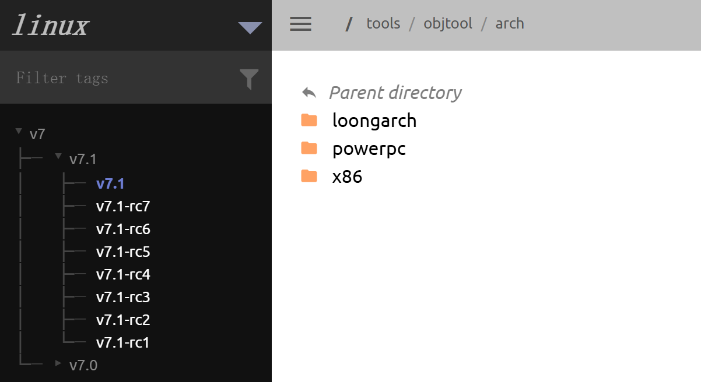

尽管 Linux 社区这几年也一直有在做 `objtool → arm64`^[4]^（虽然看上去就只有 `objtool` 的作者 Josh Poimboeu 自己在弄），`patch` 也有，但 `ORC metadata format` 还就是没正式进入 `arm64` 主线。

为啥呢？`arm64` 社区在关心另一个方向：`SFrame`。

或许你会说，既然有个这么好用的 `ORC Unwinder`，`reliable stacktrace` 不也做的OK嘛？

为啥不用呢？开发者也不是没想到，他们的起初的做法^[5]^：

> - Proposed a “dynamic” form of frame pointer validation
>     - The frame pointer on the stack is validated against the frame pointer offset pulled from the ORC table
>     - If the calculated FP does not match the expected one, the unwind is considered unreliable
> - Involved substantial reorganization of the objtool/ORC code to separate the architecture-generic vs architecture-specific components

- 提出了一种“动态”形式的帧指针验
    - 堆栈上的帧指针根据从ORC表中提取的帧指针偏移进行验证
    - 如果计算出的FP与预期不符，则认为解卷不可靠
- 涉及对objtool/ORC代码进行实质性重组，以将架构通用组件与架构特定组件分开

但是社区给的回复，ORC 强依赖 `objtool`，非常脆弱^[5]^：

1. **逆向控制流的问题**：`objtool` 的本质是去逆向工程（Reverse-engineer）编译器生成的二进制控制流。一旦遇到复杂的边界情况（例如跳转表 Jump tables），这种事后推导非常容易失败。（本质就是一种hack）
2. **维护成本**：编译器的代码生成策略是不断演进的。只要编译器一改动，`objtool` 就必须被动地跟进维护去适配新的指令排列，这种打补丁式的方案在长远来看是不可持续的。

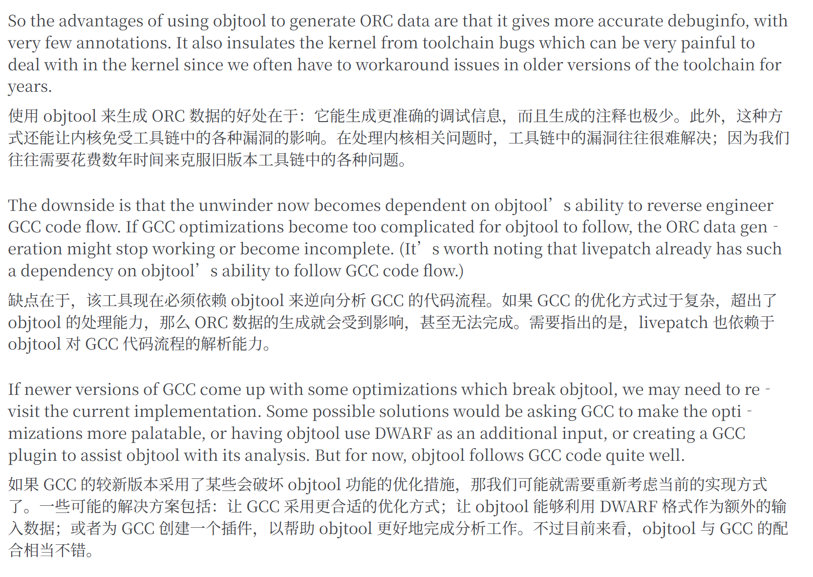

> 例子 A：尾调用优化（Tail Call Optimization） 正常函数结束，汇编是这样的：
>
> 1. 恢复栈底 `pop %rbp`
> 2. 返回上一层 `ret` `objtool` 一看这套连招，就知道：“哦，函数结束了，栈状态安全。”
>
> 但突然有一天，GCC 编译器升级了，变得更聪明了。它发现你的函数在最后一行调用了另一个函数。为了省事，GCC 直接不用 `call` 和 `ret` 了，直接生成一条 `jmp`（无条件跳转）跳到下一个函数。 这下 `objtool` 又傻眼了：“说好的 `ret` 结尾呢？这个 `jmp` 到底是函数内部的代码跳转，还是函数结束的标志？” 于是，内核开发者只能赶紧去改 `objtool` 的 C 代码，给它打个补丁：“如果遇到某某情况的 `jmp`，你要把它当成函数返回来处理。”

> 例子 B：安全漏洞的终极折磨（如 Spectre 漏洞的 Retpoline 补丁） 当年爆出 CPU 幽灵漏洞（Spectre）时，为了防止黑客利用“间接跳转”预测执行，编译器发明了一种极其反人类的黑魔法叫 Retpoline。 它故意用一套 `call`、`pause`、改写栈上返回地址的魔改汇编，把 CPU 的预测器骗得团团转。 连 CPU 都被骗了，负责静态分析汇编的 `objtool` 直接原地爆炸。为了让 `objtool` 能看懂这种为了防漏洞而故意写得乱七八糟的汇编，内核维护者被迫在 `objtool` 里写了成百上千行的“特例判断代码”。

所有：与其用外部工具在事后辛苦地去“猜”控制流，更理想的方案应该是直接使用由编译器（Compiler）原生生成的数据^[5]^。


## 3.2 引入SFrame

可以说：

> **与其让外部工具去猜编译器做了什么，不如直接让编译器把答案留下来。**

这便是 `SFrame` 的核心思想。 

实际上 `SFrame` 做的事情非常直接，也和 ORC 很像，但是它只保留堆栈跟踪所需的最少必要信息^[6]^，`unwind` 的时候直接查表即可（FRE），关键还是下面这些信息：

```TXT
FP 在哪里
RA 在哪里
CFA 怎么算
```

但是，和 `ORC` 最大一点的区别是：

- `ORC` → 编译后计算
- `SFrame` → 编译器直接生成结果

或者引入 `objtool` 说的更准确一点的，就是不用 hack 了：Similar to ORC, but avoids reverse-engineering the binary^[5]^：

- `ORC`

    `Compiler → Binary → objtool → ORC Table`

- `SFrame`

    `Compiler → SFrame`

一个事后分析，一个原生生成看着就不错。

而且，我觉得更为重要的是 SFrame 还能在用户态上跑，因为它从设计之初就是**GNU Binutils 标准格式^[6]^**，而非内核专属（ORC 要用内核的工具 `objtool`），比如以下对比：

| 属性           | SFrame                      | ORC                        |
| :------------- | :-------------------------- | :------------------------- |
| ELF Section    | `.sframe` (标准名)          | `.orc_unwind` (内核硬编码) |
| Program Header | `PT_GNU_SFRAME` (标准类型)  | 无                         |
| Section Type   | `SHT_GNU_SFRAME` (标准类型) | 无                         |
| 维护者         | Sourceware/Binutils         | Linux Kernel               |

- **任何 ELF 可执行文件**都可以携带 `.sframe` 段
- **内核加载器**（`fs/binfmt_elf.c`）通过标准 `PT_GNU_SFRAME` 识别并映射
- **perf/BPF** 可以像访问 `.text` 一样访问 `.sframe`

可以具体看 wiki^[6]^：

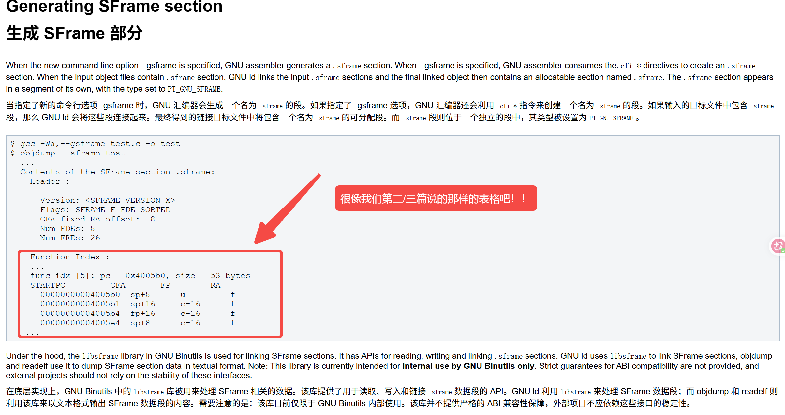

当然了，这个特性还是在比较新的 `binutils` 里支持的：

| GNU Binutils 2.40 | SFrame Version 1 (Obsoleted, Do not use) | ([html](https://sourceware.org/binutils/docs-2.40/sframe-spec.html), [pdf](https://sourceware.org/binutils/docs-2.40/sframe-spec.pdf)) | Support for x86_64, AArch64                                  |
| ----------------- | ---------------------------------------- | ------------------------------------------------------------ | ------------------------------------------------------------ |
| GNU Binutils 2.41 | SFrame Version 2                         | ([html](https://sourceware.org/binutils/docs-2.41/sframe-spec.html), [pdf](https://sourceware.org/binutils/docs-2.41/sframe-spec.pdf)) | Fix for unaligned SFrame FDEs, Fix Rep Block representation  |
| GNU Binutils 2.44 | SFrame Version 2                         | ([html](https://sourceware.org/binutils/docs-2.44/sframe-spec.html), [pdf](https://sourceware.org/binutils/docs-2.44/sframe-spec.pdf)) | Bugfixes                                                     |
| GNU Binutils 2.45 | SFrame Version 2 (Errata 1)              | ([html](https://sourceware.org/binutils/docs-2.45/sframe-spec.html), [pdf](https://sourceware.org/binutils/docs-2.45/sframe-spec.pdf)) | Relocatable links fixed, Support for s390x                   |
| GNU Binutils 2.46 | SFrame Version 3                         | TBD                                                          | Mark outermost frame, Support for text > 2GiB, Support for flexible topmost frames. More details at [SFrame V3](https://sourceware.org/binutils/wiki/sframe/sframev3todo#preview). |

我的 Ubuntu22.04 就不支持：

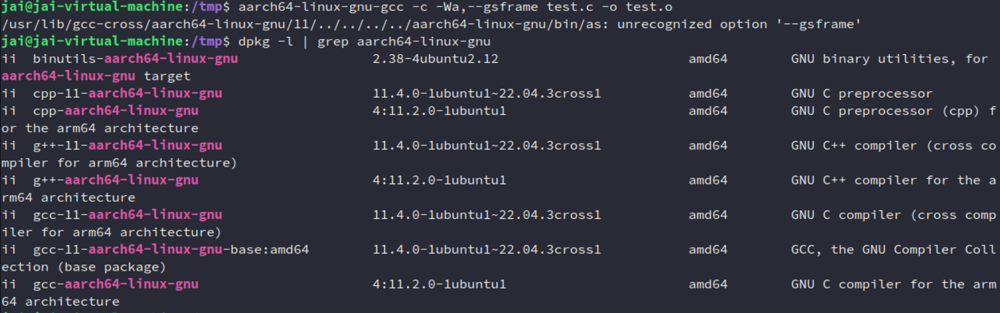


## 3.3 现状

上面说了一堆的优点，但 SFrame 还是有很大争议的：

- **Peter Zijlstra (x86 ORC 开发者)** 认为：x86_64 不会采用 SFrame，ORC 已足够好^[7]^
- **MaskRay (LLVM 开发者)** 质疑：`.sframe` 体积比 `.eh_frame` 大 10%，用户态 adoption 不现实^[7]^
- **但 ARM64 社区** 认为：这是 ARM64 获得 reliable stacktrace 的最可行路径^[8]^

还有就是用户态 SFrame 有一个**致命的安全问题**：

**问题**：perf 采样发生在**中断/NMI 上下文**，此时：

- 用户态页表可能未映射
- `.sframe` 段可能被 swap out
- 直接读取用户态内存会导致 **page fault**

在中断上下文中触发 page fault 是**致命的**——内核无法处理（没有可切换的任务上下文），只能 panic。

**解决方案：Deferred Stacktrace**

```text
传统 perf 采样流程：
  NMI/IRQ ──► 读取 PC/SP ──► 立即 unwind ──► 输出调用链
                              ↑
                              └── 此时读用户态 .sframe 可能 page fault！

Deferred Stacktrace 流程：
  NMI/IRQ ──► 读取 PC/SP ──► 存入 perf ring buffer ──► 返回
                                              ↓
  进程返回用户态时（syscall exit）────────────► 读取 .sframe ──► unwind
                                              ↑
                                              └── 此时用户态内存安全可访问
```

但这带来了新的问题：

- **BPF 无法实时 unwind**：BPF 程序在中断上下文中不能延迟处理
- **可能丢栈**：如果采样发生在 syscall 末尾，进程可能在下一次采样前退出，导致栈丢失

还有一个性能悖论：

SFrame 的目标是**省略 frame pointer** 以节省寄存器，但：

- **FP unwind**：2-3 次内存访问，极快
- **SFrame unwind**：二分查找 + 内存访问 + 计算，更慢

如果 omit-fp 节省的性能被 unwind 开销抵消，得不偿失。


总而言之，该特性仍在发展当中，说不定未来呢？


# 4. 拓展

> 在这一篇：[你的技术想象力，受限于你的信息边界](https://mp.weixin.qq.com/s/0iWsRplRTopvvkK5dpPx4A) 中：
>
> “（我觉得）在这个时代的下，你们最需要的就是有一个清晰的概念什么事情是能办到的，因为人没有办法做自己想象不到的东西，而扩展你的想象力的方式就是去看别人想到了什么。“
>
> 所以，在今后的文章中，考虑篇幅合适的情况下，我都会用以上类似的 `prompt` + 本文前面几章的总结 + `xxx` 官方手册，去和 AI 聊，让 AI 帮我看看有什么冷门但重要的东西值得去看看的！
>
> 下面写我觉得有意思的。


## 4.1 `livepatch` 和 `OTA`

经过前文的理解，我们一般看的普通的 `backtrace`，其实做的是：尽量恢复(Best Effort)。

而 `ORC` 的终极目标不是 `ORC`，而是：`Reliable Stacktrace`（要么完全正确/要么明确失败）

因为普通的 Oops 栈回溯哪怕错了一层，顶多是开发者看日志时骂一句。

但热补丁场景（比如给底层的存储驱动 `sd_mod` 或文件系统打补丁），系统必须 100% 确认：

**当前没有任何一个休眠的线程正停留在准备被替换的旧函数中。**

如果有，热替换一旦执行，线程醒来后执行的控制流就会全部错乱。

对 `livepatch` 感兴趣的还是阅读：参考 [3]

除此之外，如果有人熟悉 `OTA` 的话，可能会混淆（我没做过OTA，我只知道是远程更新，下面有误请指出）。

实际上 `OTA` 应该不需要这个的，OTA 本质是：

```
旧镜像 → 重启 → 新镜像
```

就比如：`slot_a/slot_b` 的 A/B 升级。

所以所以 `OTA` 不关心当前线程在哪里，因为所有线程都死了，直接重启即可。

所以不要弄混了？

但是如果你完全可以继续追问，为什么自己的手机好像是无感的OTA呢？怎么做到的？我不懂，问了AI后给我了一个名词：`RoR(Resume-on-Reboot)`

> 传统 OTA 更新流程中，重启后会遇到一个问题：
>
> > Android 的 **Credential Encrypted（CE）存储** 在每次重启后都会被锁定，必须等用户输入 PIN/密码/图案后才能解锁。
>
> 而 OTA 更新后，系统需要重建 Dalvik 缓存（显示为 "Android is upgrading..."），这个操作需要访问 CE 存储中的 App 数据。如果用户不在场手动解锁，更新流程就会卡在那里，设备无法真正完成启动。

> `RoR` 的思路是：**在 OTA 安装前，安全地临时保存用户的锁屏凭证（PIN/密码/图案）**，重启后自动用这些凭证解锁 CE 存储，让系统可以在无人值守的情况下完成 Dalvik 缓存重建等收尾工作。

所以还是挺有意思的！

| 场景         | 没有 RoR                                 | 有 RoR                                   |
| :----------- | :--------------------------------------- | :--------------------------------------- |
| 夜间自动更新 | 重启后卡在锁屏界面，等用户早上解锁才能用 | 重启后自动完成全部流程，用户早上直接可用 |
| 企业批量部署 | 每台设备都需要人工干预                   | 可完全无人值守                           |
| A/B 无缝更新 | 虽然更新在后台完成，但重启后仍需解锁     | 真正实现"无缝"                           |


## 4.2 性能

**观测者的困境：eBPF 与性能剖析（Profiling）**

观测系统本身的开销，不能改变被观测系统的状态（海森堡测不准原理的软件版）。

**概念速览**：在做底层性能分析时（比如用 eBPF 追踪中断延迟或块设备 I/O），我们需要高频地抓取调用栈。如果像 SFrame 那样存在用户态 Page Fault 的风险，或者像 DWARF 那样耗时太长，观测工具自己就会成为系统的性能瓶颈，甚至引发崩溃。这也是为什么 eBPF 社区对快速的、基于 BPF 内部实现的 unwinder 需求极其旺盛的原因。

这部分我懂得不多，所以不展开讲啦，但是我知道 `profile` 和 `Observability` 对于 `Call Stack` 确实很重要。

`perf`、`eBPF`、`ftrace`

本质都依赖：`Call Stack`，因为普通的 `PC` 只能告诉你现在在哪，而 `Call Stack` 能告诉你为什么在这。


# 参考

[1] 9. ORC unwinder — The Linux Kernel documentation：https://www.kernel.org/doc/html/latest/arch/x86/orc-unwinder.html

[2] The Linux x86 ORC Stack Unwinder：https://www.codeblueprint.co.uk/2017/07/31/the-orc-unwinder.html

[3] Reliable Stacktrace — The Linux Kernel documentation：https://docs.kernel.org/livepatch/reliable-stacktrace.html

[4] objtool/arm64: Port klp-build to arm64：https://lwn.net/Articles/1072616/

[5] Arm64 SFrame for Reliable Stacktrace：https://lpc.events/event/19/contributions/2077/attachments/1874/4018/Arm64%20SFrame%20for%20Reliable%20Stacktrace%20--%20LPC%202025.pdf

[6] sframe - BINUTILS Wiki：https://sourceware.org/binutils/wiki/sframe#What_is_SFrame.3F

[7] LKML: Fangrui Song: Re: Concerns about SFrame viability for userspace stack walking：https://lkml.org/lkml/2025/10/30/1959

[8] [RFC] Adding SFrame support to llvm - Code Generation - LLVM Discussion Forums：https://discourse.llvm.org/t/rfc-adding-sframe-support-to-llvm/86900/6


# 总结

[回溯停止：前一个帧与当前帧完全相同（可能是堆栈损坏？） --- Backtrace stopped: previous frame identical to this frame (corrupt stack?)](https://sourceware.org/pipermail/gdb/2020-January/048335.html)

总结教训。


拓展：

TODO：`thread apply all backtrace`, GDB will display the backtrace for all the threads; this is handy when you debug a core dump of a multi-threaded program.

可以写一个多线程的程序，然后来调试。


你说得对，关键是要从**第一性原理**理清栈回溯的本质，而不是被具体的实现细节（比如 `eh_frame`、帧指针）淹没。我们来一步步构建这个认知。

## 1. 栈回溯的核心问题

当你调用一个函数时，计算机需要记住：
- **从哪里来**（返回地址）
- **用什么环境**（栈指针、寄存器等）

栈回溯（backtrace）就是从当前正在执行的函数，反向找到它的“调用者”，再找调用者的调用者……直到程序入口。

这就像在一条链子上，每个环节只知道下一个环节是谁。回溯就是沿着链子反向走。

## 2. 如何唯一标识一个“帧”？

每个函数调用在栈上占据一块区域，称为**帧**。为了区分不同的帧（避免搞混，比如同一个函数被递归调用多次），GDB 给每个帧一个**帧 ID**。这个 ID 通常是：
- **栈地址**（stack_addr）—— 帧的起始地址，由栈指针 SP 表示
- **程序计数器**（code_addr）—— 帧所对应的函数代码地址（可选）
- 也可能包含一个“特殊地址”

只要两个帧的这些信息完全一样，GDB 就认为它们是 **同一个帧**。

## 3. 如何从当前帧找到上一帧？

这就是 **栈展开（stack unwinding）** 要做的事。GDB 使用一组“展开器（unwinder）”，每个展开器知道一种方法来计算上一帧的寄存器值（尤其是 PC 和 SP）。

常见的展开方法有：
- **DWARF 调试信息**（`.eh_frame` / `.debug_frame`）—— 最精确，编译器生成的指令如何恢复寄存器。
- **帧指针链**（frame pointer）—— 传统的 `ebp/rbp` 链，简单但可能被优化掉。
- **启发式猜测**（heuristic）—— 当没有符号信息时，GDB 根据当前指令模式猜测。

无论哪种方法，最终 GDB 都要为上一帧计算出一个**帧 ID**。

## 4. 为什么会出现 `UNWIND_SAME_ID`？

假设当前帧是 **F**，GDB 尝试解开得到上一帧 **P**。

- 它先计算出 **P** 的帧 ID。
- 然后 GDB 会检查：**这个 ID 是否已经存在于已经见过的帧列表中？**

如果 **P** 的 ID 恰好等于 **F** 的 ID（或者等于链中更早的某个帧的 ID），GDB 就认为出现了**循环** —— 继续展开会永远卡在这里。于是它停止，并报告 `UNWIND_SAME_ID`。

**本质原因**：展开器“误以为”上一帧和当前帧是同一个帧（或者和之前的帧重复）。

## 5. 什么情况下会误以为 ID 相同？

### 情况一：栈真的坏了
- 程序错误导致栈内存被覆盖，比如缓冲区溢出，把返回地址覆盖成当前函数的地址。
- 展开器从坏掉的栈数据中读取到的 SP 和 PC 恰好等于当前帧的值。

### 情况二：展开信息错误或缺失
- 没有调试符号，GDB 使用启发式猜测，猜错了。
- 有 `.eh_frame` 信息，但信息损坏或与当前运行的程序不匹配（比如加载了错误的共享库）。
- 编译器优化（如尾调用优化、帧指针省略）导致标准展开方法失效。

### 情况三：误将“同一个函数的不同调用”当作同一帧
- 例如递归函数，每次调用栈地址不同，但某些展开器可能错误地计算出相同的 SP（极少见）。

## 6. 其他 `UNWIND_*` 原因简析

它们都是 GDB 用来解释“为什么无法继续回溯”的原因，定义在 `unwind_stop_reasons.def` 中。

| 原因                  | 含义                                           | 触发场景                       |
| --------------------- | ---------------------------------------------- | ------------------------------ |
| `UNWIND_NO_REASON`    | 没有错误，正常                                 | 成功展开或尚未尝试             |
| `UNWIND_OUTERMOST`    | 已经到了最外层（如 `_start`）                  | 正常终止                       |
| `UNWIND_UNAVAILABLE`  | 需要的寄存器或内存值不可用                     | 调试远程目标、core文件缺失数据 |
| `UNWIND_INNER_ID`     | 上一帧的栈地址比当前帧还**内**（按理应该更外） | 栈指针方向错误，展开器逻辑错误 |
| **`UNWIND_SAME_ID`**  | 上一帧的 ID 等于当前帧的 ID                    | 上面说的情况                   |
| `UNWIND_NO_SAVED_PC`  | 无法找到返回地址（PC）                         | 展开器找不到保存 PC 的位置     |
| `UNWIND_MEMORY_ERROR` | 读取内存时出错                                 | 无效地址、权限问题             |

## 7. 回到你的问题：`UNWIND_SAME_ID` 怎么引发的？

结合你当初的调试场景：
```
(gdb) bt 
#0  pthread_getname_np ()
#1  __lll_timedlock_wait ()
Backtrace stopped: previous frame identical to this frame (corrupt stack?)
```

**最可能的直接原因**：GDB 在从 `#1` 展开到 `#0` 的“上一帧”时，计算出的帧 ID 与 `#1` 自身的 ID 相同。  
- 为什么？因为 `pthread_getname_np` 是一个库函数，可能没有 `.eh_frame` 信息（或被 strip 了），GDB 使用启发式猜测，猜错了栈布局，错误地认为上一帧的 SP 和 PC 与 `#1` 完全一样。
- 也可能这个库函数用了特殊的栈切换（如信号处理、线程局部存储），导致 GDB 无法正确计算。

## 8. 从第一性原理总结

> **栈回溯的本质是根据当前帧的信息，计算出调用者的帧信息。每个帧必须有唯一的 ID。如果计算出的调用者帧 ID 等于当前帧 ID，说明出现循环，回溯停止，这就是 `UNWIND_SAME_ID`。**  
> 根本原因是 **展开器给出的信息错误**，通常由于缺少调试信息、栈损坏、或异常的控制流（如信号、setjmp）。

你不必纠结于 `eh_frame` 还是帧指针的具体细节，只要记住：**GDB 是“盲人摸象”，它依赖元数据（或猜测）来推断上一帧。一旦推断出矛盾的 ID，它就拒绝继续，并用这个错误告诉你“栈可能坏了或者信息不全”。**

如果你还想了解“GDB 具体如何选择 unwinder”或“如何一步步计算出 ID”，我可以再给你画一张简洁的概念图，但核心原理已经在这里了。


