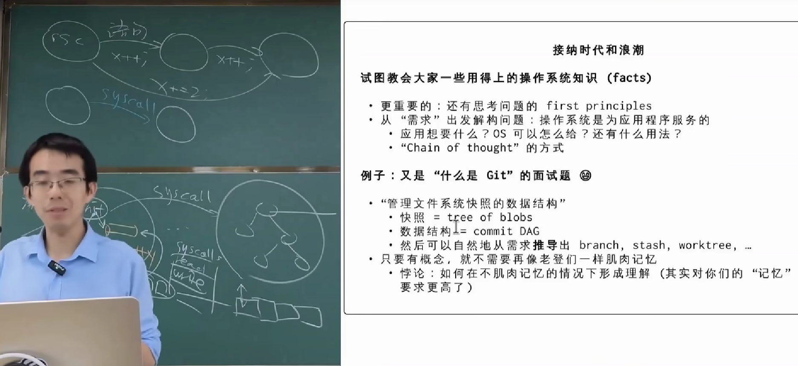
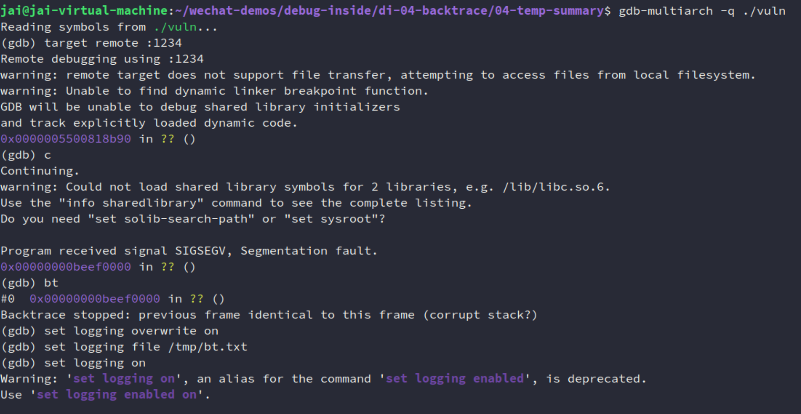
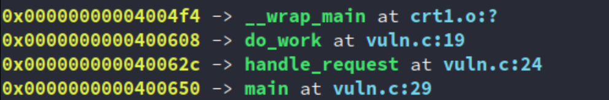

# 1. summary

这篇目前算是我这个 `backtrace` 系列的暂时完结。

从上周五开始到今天刚好一周，写了：

- [backtrace（一）：从底层到本质：理解函数调用与 LR/FP 的设计与思想](https://mp.weixin.qq.com/s/ULNN7Pz7TmwUwRRB9U1HGg)
- [backtrace（二）：事实与语义：深度解构 ELF 符号表与 DWARF 调试信息（上）](https://mp.weixin.qq.com/s/08Ps9NT4yVIc59yNxHe0Ww)
- [backtrace（二）：事实与语义：深度解构 ELF 符号表与 DWARF 调试信息（下）](https://mp.weixin.qq.com/s/qnY6w-Hs99OiM9dVeRW4og)
- [backtrace（三）：从 FP 到 DWARF ：解析用户态回溯技术](https://mp.weixin.qq.com/s/PlL2WnSima8e2b0JFZj2aQ)
- [backtrace（四）：Linux内核的 ORC Unwinder 与 SFrame 解析](https://mp.weixin.qq.com/s/MCrMD0qVtDU5d_Vu1bJzrA)

第一次写公众号，也是第一次写这么长的内容。（写得比较烂但是能看）

确实在学/写的过程中了解了很多东西（`GDB` 和优化、`debug info/symtab` 的取舍方案、ARM64安全相关的PAC......），甚至关注到了一些社区正在开发讨论的东西（`SFrame`），可谓收获颇丰。

而且这么学下来，完全不是是在肌肉记忆一些东西，真的是只要我脑子里又概念，哪怕不用agent，就简单地问个网页版的AI，我都能学到更多东西（尽管我目前还是想要以自己的想法为主，做不到像老师把这么多权限/能力，（上/下）放给agent）。

也算是认识到蒋炎岩老师昨天说的（尽管确实有一些悖论）：



但总而言之，这一周写这玩意确实收获挺多，当然我也并不是完全每天都在写，时不时去打个球给我东哥上一下强度也是很爽的🤣🤣🤣


## 1.1 有始有终

但我觉得我还是有必要有始有终啊，因为这个系列就是因为遇到了类似下面的错误才写的^[2]^：

```BASH
(gdb) bt 
#0  0xb38e32c4 in pthread_getname_np () from /home/enrique/buildroot/output5/staging/lib/libpthread.so.0
#1  0xb38e103c in __lll_timedlock_wait () from /home/enrique/buildroot/output5/staging/lib/libpthread.so.0 
Backtrace stopped: previous frame identical to this frame (corrupt stack?)
```

而且我也没写上 [2] 中描述的手动 `backtrace` 的骚操作，但我觉得最后这里就放一些tips吧：

`Backtrace stopped: previous frame identical to this frame (corrupt stack?)`的本质不是“GDB发现栈损坏了”，而是“GDB无法继续完成 stack unwinding，并且检测到回溯结果进入自循环，因此怀疑栈可能损坏”。

真正原因总结：

1. 栈确实损坏（saved LR / FP 被覆盖）
2. 没有 frame pointer
3. 没有 DWARF unwind 信息
4. 可执行文件被 strip
5. 编译优化（特别是 Tail Call）
6. GDB 对 ARM 某些库函数或异常栈帧展开失败

因此：**`bt 失败 ≠ stack 坏了`**

更准确地说：**`bt 失败 = GDB 无法可靠地完成 stack unwinding`**，这才是我理解这类问题最重要的 `frist principle`。


## 1.2 more

当然并不是说这个系列就结束了，实际上还有很多的细节和别的领域可以写：

- RTOS 的 `unwind`？MCU应该也会有各种 `dump` 的，就像你进 `hardfault`，`backtrace` 咋做，自己实现 `hardfualt handler`，存 `memory + regs` 嘛 ，也有很多文章：
    - How to debug a HardFault on an ARM Cortex-M MCU | Interrupt]：https://interrupt.memfault.com/blog/cortex-m-hardfault-debug#registers-prior-to-exception
    - [一文讲透：STM32进入HardFault如何调试？从寄存器到代码定位](https://mp.weixin.qq.com/s/-aHSiFUmk0oO4NdAsgWbcA)
- Android 的 `tombstone`，高通的 `ramdump` 等等
- ......

只要和 `ELF` 和 `dump` 相关的，感觉都可以写进来这个系列来😅😅


还有点：之后写微信公众号或者不这么长吧（也没人看，不过我本来也不是给人看，按照自己完整来吧）。


最后放上最近看到的这张图^[1]^，感觉好好笑哈哈🫠🫠


# 2. 复现 [1] 中的问题

代码：https://github.com/JAILuo/wechat-demos/tree/main/debug-inside/di-04-backtrace/04-temp-summary

````C
#include <stdio.h>

void fake_lib_crash() {
    printf("[+] 进入底层库，即将发生寄存器损坏...\n");
    
    // 模拟一个极其隐蔽的野指针漏洞或上下文损坏。
    // 我们直接用内联汇编破坏当前的 Frame Pointer (x29) 和 Link Register (x30)。
    // 注意：这不会破坏栈上的"内存"，它只是破坏了当前的"寻址路标"。
    __asm__ volatile (
        "mov x29, #0xdead0000\n"  // 破坏栈帧指针 FP，让 GDB 迷路
        "mov x30, #0xbeef0000\n"  // 破坏返回地址 LR
        "ret\n"                   // 强制跳转到 0xbeef0000 触发段错误
    );
}

void do_work() {
    printf("[+] do_work 执行中...\n");
    fake_lib_crash();
}

void handle_request() {
    printf("[+] handle_request 执行中...\n");
    do_work();
}

int main() {
    printf("=== AArch64 真实栈损坏恢复实验 ===\n");
    handle_request();
    return 0;
}

````

构建：

```makefile
aarch64-linux-gnu-gcc -O0 -g -fno-omit-frame-pointer -no-pie -o vuln vuln.c
qemu-aarch64 -L /usr/aarch64-linux-gnu/ -g 1234 ./vuln &
```

另一终端：

```
gdb-multiarch -q ./vuln
(gdb) target remote :1234
(gdb) c
...
(gdb) bt
#0  0x00000000XXXXXXXX in ?? ()
#1  0x00000000XXXXXXXX in ?? ()
Backtrace stopped: previous frame identical to this frame (corrupt stack?)
```



然后复现操作：

```bash
(gdb) set logging overwrite on
(gdb) set logging file /tmp/bt.txt
(gdb) set logging on
(gdb) x/64gx $sp
(gdb) set logging off
```

把日志存到外部去，然后用脚本命令解析。

> 不过这里需要注意的的是：
>
> 博客作者当时的程序是**开启了 PIE** 或者是**在分析动态链接库（.so）里的地址，所以他必须借助 `/proc/pid/maps` 来计算真实的相对偏移量（`offset = address - page start + base offset`）。 **
>
> **而我们在上一步编译时使用了 `-no-pie`，代码加载地址是固定的绝对地址（如 `0x400608`）。这意味着我们不需要计算偏移**，可以直接把栈里扫出来的地址喂给 `addr2line`。这让我们的自动化脚本比博客里的更加优雅。

脚本如下：
```bash
cat /tmp/bt.txt | grep -o '0x[0-9a-fA-F]\+' | sort -u | grep -v '0x0000000000000000' | while read ADDR; do
    # 调用 addr2line 解析地址
    LINE=$(aarch64-linux-gnu-addr2line -e ./vuln -f -C $ADDR)
    # 如果解析结果里没有包含 '??'，说明这是一个有效的代码地址
    if ! echo "$LINE" | grep -q '??'; then
        # 模仿原博客的输出格式：地址 -> 函数名和行号
        # 将换行符替换为 " at " 让输出更好看
        FORMATTED_LINE=$(echo "$LINE" | tr '\n' ' ' | sed 's/ $//')
        echo "$ADDR -> $FORMATTED_LINE"
    fi
done
```

或者这个：

```BASH
cat /tmp/bt.txt | grep -o '0x[0-9a-fA-F]\+' | sort -u | grep -v '0x0000000000000000' | while read ADDR; do
    LINE=$(aarch64-linux-gnu-addr2line -e ./vuln -f -C $ADDR)
    
    if ! echo "$LINE" | grep -q '??'; then
        # 高效拆分（使用内置 read 避免多次管道）
        FUNC=$(echo "$LINE" | head -1)
        LOC=$(echo "$LINE" | tail -1)
        FILE=$(basename "$LOC")
        
        # 检查终端是否支持颜色（可选）
        if [ -t 1 ]; then
            # 终端环境 -> 带颜色
            echo -e "\033[1;33m$ADDR\033[0m -> \033[1;32m$FUNC\033[0m at \033[1;36m$FILE\033[0m"
        else
            # 重定向到文件或管道 -> 纯文本
            echo "$ADDR -> $FUNC (at $FILE)"
        fi
    fi
done
```




如果你拿到了我的仓库的代码，直接执行：`./run.sh` 即可。


# 参考

[1] 30 - Agentic AI 和我们的未来；课程总结 [2026 南京大学操作系统原理]：https://www.bilibili.com/video/BV1q2jh6FEhX

[2] Figuring out corrupt stacktraces on ARM：https://eocanha.org/blog/2020/10/16/figuring-out-corrupt-stacktraces-on-arm/


