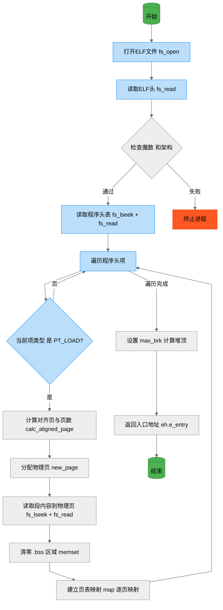

最近一次卓驭（大疆车载）面试，简单记录一下面试内容，挑一部分展开说。


## Introduction ELF

由于简历项目上写了 ELF 的 loader，直接问了 ELF 格式的内容。这里简单复习一下。

直接看文档描述即可，看概述已经很清楚地知道ELF包含了什么。`man 5 elf`、`ELF` manual：`Executable and Linkable Format (ELF)  `

> An executable file using the ELF file format consists of an ELF header, followed by a program header table or a section header table, or both.
> **The ELF header is always at offset zero of the file. The program header table and the section header table's offset in the file are defined in the ELF header.**
>
> The two tables describe the rest of the particularities of the file.

由 DeepSeek 总结：

>  ELF（Executable and Linkable Format）文件的装载是一个涉及操作系统、编译器和链接器的精密过程。作为UNIX/Linux系统的核心二进制格式，其设计实现了可执行文件、共享库和目标文件的统一管理。


但这里还是简单介绍。

首先，什么究竟什么是可执行文件？啥是 Executable and Linkable Format (ELF)  

大家以前的思想：那个 “**双击可以弹出窗口的东西**”。


但是如果稍微深入一点理解，可执行文件可以是这样：

- 一个操作系统中的对象 (文件)
- 一个字节序列 (我们可以把它当字符串编辑)
- 一个描述了状态机初始状态的**数据结构** (打扰了)


这里可以类比一个例子：想象一本书需要正确阅读，需要：

- **正文内容**（故事/知识）
- **目录/索引**（章节页码、标题）
- **出版信息**（作者、出版社、排版格式）


那让计算机能够看懂你想说的，让它执行你想让它执行的，同理可得：

- **代码正文**：CPU执行的二进制指令
- **数据部分**：全局变量、字符串常量等
- **元数据**：告诉操作系统如何正确加载这些内容


或许大家对这个元数据有些困惑，但请记住这个概念！元数据在 OS 等领域非常有用。

举个例子，要想让一个只有短期记忆的人记住他自己是谁，最好的办法当然是把他自己的信息写下来，让他本人知道原来这个描述的就是自己！

计算机也是同理的：

怎么让计算机知道他要执行的这个可执行文件的内容是是什么？在哪里？我要执行这个程序，我对入口在哪里？我在程序中生成的各种数据放在哪里？那自然就发明出了一个结构：ELF header：

- **定位器**：提供文件结构的"地图"
- **校验器**：确保文件合法性和兼容性
- **导航仪**：引导操作系统找到关键数据


但还有个问题，怎么让计算机执行这个程序？

要想让计算机执行代码正文，执行这个二进制指令，大家的第一想法肯定是直接从头执行！

```C
假设文件开头是：48 89 E5（x86指令 push rbp）或者是一条加法指令
但如果是纯数据段：00 00 00 01（可能代表int数值1）
    
int main() {
    int data[] = {0x48, 0x89, 0xE5}; // 数据段中的x86指令
    void (*func)() = (void (*)())data;
    func(); // 尝试执行数据段内容 → 触发段错误（Segmentation Fault）
}
```

怎么区分执行的内容究竟是代码还是数据？没法区分！不区分就会导致计算机崩溃或错误执行！聪明的人类会有办法的：

**ELF的解决方案：元数据指导分离**

根据之前引入的元数据，让这个元数据来指导整个可执行文件的内容分隔（或许这叫 **设计哲学**？）：

- **声明式编程**：文件明确声明出不同的节（section）： 哪些是代码（`.text`），哪些是数据（`.data`, `.bss`）
- **权限标记**：通过程序头表（Program Header）为内存区域设置读写执行权限

> 可以先简单看看下面，看不懂也没关系，说到这个东西的时候，能够想起来一些类似的名词就好啦！
>
> **关键结构**：
>
> 1. **节（Section）** —— 链接视角的代码/数据划分（通过`readelf -S`查看）
>
>     - `.text`：代码段（存放机器指令）
>     - `.rodata`：只读数据（字符串常量等）
>     - `.data`：已初始化的全局变量
>     - `.bss`：未初始化的全局变量（Block Started by Symbol）
>
> 2. **段（Segment）** —— 执行视角的内存映射单元
>
>     - **PT_LOAD段**：将多个 `section` 合并为具有相同权限的内存区域 `segment`
>
>         > 注意，是可以多个 `text/data section` 的喔（`.text`, `.init`, `.fini`等等）
>
>         这个时候或许能猜到段错误的内容吧？访问这个段的权限不够！


由此简单介绍完成，这个时候计算机总能够认得应该他要执行什么了吧！（以简单为主，具体里面更多复杂的细节自己看哈）

下面就有 DeepSeek 再解析ELF文件格式及其装载机制。由于我只和面试官说了 loader 的部分，所以我只关注执行的视角，也就是 program header table 的内容，动态链接那些先不管，后面再给出学习的相关更多 ELF 的资料。


<div style="page-break-after:always"></div>


## ELF format (load version)

### 一、ELF文件结构分层
ELF文件采用 **双重视角结构**，同时支持链接视角（Section-based）和执行视角（Segment-based）：
- **链接视角**：由节（Section）构成，通过节头表（Section Header Table）索引**，用于编译/链接阶段（如`.text`, `.data`, `.symtab`）**
- **执行视角**：由段（Segment）构成，通过程序头表（Program Header Table）索引，**用于装载阶段（如`LOAD`, `DYNAMIC`）**


### 二、ELF头（ELF Header）深度解析
当然，无论怎么样，

ELF头位于文件起始位置（偏移0），通过`readelf -h <file>`可查看，其结构定义如下（以64位为例）：

```c
typedef struct {
    unsigned char e_ident[16];    // 魔数和元信息
    Elf64_Half    e_type;         // 文件类型（ET_EXEC/ET_DYN等）
    Elf64_Half    e_machine;      // 目标架构（EM_X86_64/EM_AARCH64等）
    Elf64_Word    e_version;      // ELF版本（EV_CURRENT）
    Elf64_Addr    e_entry;        // 程序入口点虚拟地址
    Elf64_Off     e_phoff;        // 程序头表偏移
    Elf64_Off     e_shoff;        // 节头表偏移
    Elf64_Word    e_flags;        // 处理器特定标志
    Elf64_Half    e_ehsize;       // ELF头大小（64字节）
    Elf64_Half    e_phentsize;    // 程序头表项大小（56字节）
    Elf64_Half    e_phnum;        // 程序头表项数量
    Elf64_Half    e_shentsize;    // 节头表项大小（64字节）
    Elf64_Half    e_shnum;        // 节头表项数量
    Elf64_Half    e_shstrndx;     // 节名称字符串表索引
} Elf64_Ehdr;
```

**关键字段详解**：
1. **e_ident[16]**：
   - `0-3`: 魔数 `7F 45 4C 46`（0x7F 'E' 'L' 'F'）
   - `EI_CLASS`: 文件类别（1=32位，2=64位）
   - `EI_DATA`: 字节序（1=小端，2=大端）
   - `EI_VERSION`: ELF版本
   - `EI_OSABI`: 操作系统ABI（0=System V，3=Linux）
   - `EI_ABIVERSION`: ABI版本

2. **e_type**：
   - `ET_REL` (1): 可重定位文件（.o）
   - `ET_EXEC` (2): 可执行文件
   - `ET_DYN` (3): 共享对象（.so）或PIE可执行文件

3. **e_phoff/e_phnum**：
   程序头表的位置和项数，决定了操作系统如何映射段到内存


### 三、程序头表（Program Header Table）与装载
程序头表项结构（Elf64_Phdr）定义装载所需的元数据：

```c
typedef struct {
    Elf64_Word  p_type;    // 段类型（PT_LOAD等）
    Elf64_Word  p_flags;   // 权限标志（PF_R/W/X）
    Elf64_Off   p_offset;  // 段在文件中的偏移
    Elf64_Addr  p_vaddr;   // 段的虚拟地址
    Elf64_Addr  p_paddr;   // 物理地址（通常忽略）
    Elf64_Xword p_filesz;  // 文件映像大小
    Elf64_Xword p_memsz;   // 内存映像大小
    Elf64_Xword p_align;   // 对齐要求（页对齐为0x1000）
} Elf64_Phdr;
```

**关键段类型**：
- **PT_LOAD** (1): 可装载段（代码/数据），每个LOAD段对应一个内存页映射
- **PT_DYNAMIC** (2): 动态链接信息（.dynamic节）
- **PT_INTERP** (3): 动态链接器路径（如`/lib64/ld-linux-x86-64.so.2`）
- **PT_GNU_STACK**：控制栈执行权限（现代系统的NX位实现）


### 四、简易ELF装载流程

```C
static uintptr_t loader(PCB *pcb, const char *filename) {
    int fd = fs_open(filename, 0, 0);

    Elf_Ehdr eh;
    fs_read(fd, &eh, sizeof(Elf_Ehdr));

    // check magic number
    for (int i = 0; i < 16; i++) assert(magic[i] == eh.e_ident[i]);

    // check machine  
    assert(eh.e_machine == ELF_MACHINE_TYPE);

    Elf_Phdr ph[eh.e_phnum]; 
    fs_lseek(fd, eh.e_phoff, SEEK_SET);
    fs_read(fd, ph, sizeof(Elf_Phdr) * eh.e_phnum);

    uintptr_t max_end = 0;
    for (size_t i = 0; i < eh.e_phnum; i++) {
        if (ph[i].p_type == PT_LOAD) {

            if (ph[i].p_vaddr + ph[i].p_memsz > max_end) max_end = ph[i].p_vaddr + ph[i].p_memsz;
            
            size_t nr_page = 0;
            const uintptr_t start_addr = calc_aligned_page(ph[i].p_vaddr, ph[i].p_memsz, &nr_page);
            void *p_page = new_page(nr_page);
            void *const pages_start = p_page + (ph[i].p_vaddr - start_addr);
            assert(nr_page * PGSIZE >= ph[i].p_memsz);

            fs_lseek(fd, ph[i].p_offset, SEEK_SET);
            fs_read(fd, pages_start, ph[i].p_filesz);
            memset(pages_start + ph[i].p_filesz, 0, ph[i].p_memsz - ph[i].p_filesz);
            
            ...

        }
    }
    fs_close(fd);

    pcb->max_brk = (max_end % PGSIZE == 0) ?
                    max_end : (max_end / PGSIZE + 1) * PGSIZE;
    return (uintptr_t)eh.e_entry;
}

```

下面配合这么一个非常小的 loader 来学习，关键步骤分解：

1. **文件打开与ELF头验证**

    ```c
    int fd = fs_open(filename, 0, 0);       // 打开ELF文件
    fs_read(fd, &eh, sizeof(Elf_Ehdr));     // 读取ELF头
    assert(magic检查 && e_machine检查);      // 验证魔数及架构
    ```

    - **理论对应**：验证ELF魔数（`e_ident`）、文件类型（`e_type`）、目标架构（`e_machine`）的合法性。
    - **代码实现**：通过`assert`确保ELF头关键字段正确，防止加载错误格式文件。

2. **程序头表加载**

    ```c
    Elf_Phdr ph[eh.e_phnum];                // 根据ELF头声明程序头数组
    fs_lseek(fd, eh.e_phoff, SEEK_SET);     // 定位到程序头表
    fs_read(fd, ph, sizeof(Elf_Phdr)*eh.e_phnum); // 读取所有程序头项
    ```

    - **理论对应**：解析ELF头的`e_phoff`和`e_phnum`字段，获取程序头表位置及条目数。
    - **代码实现**：直接读取整个程序头表到内存数组，为后续遍历做准备。

3. **PT_LOAD段处理**

    ```c
    for (遍历所有程序头项) {
        if (ph[i].p_type == PT_LOAD) {      // 仅处理可装载段
            // 计算虚拟地址对齐与所需页数
            const uintptr_t start_addr = calc_aligned_page(...);
            size_t nr_page = ...;
            void *p_page = new_page(nr_page); // 分配物理页  简单理解就是分配物理内存好啦
            
            // 将段内容读入内存
            fs_lseek(fd, ph[i].p_offset, SEEK_SET);
            fs_read(fd, pages_start, ph[i].p_filesz);
            memset(pages_start + p_filesz, 0, p_memsz - p_filesz); // 清零.bss
            
            // 建立页表映射
            for (每页) {
                map(虚拟地址, 物理页, 权限);
            }
        }
    }
    ```

    - **理论对应**：对每个PT_LOAD段执行内存映射，包括文件内容加载和.bss段初始化。
    - **代码实现**：
        - **地址对齐**：通过`calc_aligned_page`计算段起始地址的页对齐（如`ph[i].p_vaddr & ~(PAGE_SIZE-1)`），确保虚拟地址按页对齐。
        - **物理内存分配**：`new_page(nr_page)`分配连续的物理页帧。
        - **文件内容加载**：精确读取段在文件中的内容（`p_offset`到`p_filesz`）到虚拟地址对应的物理页。
        - **.bss处理**：`memset`填充内存中超出文件大小的部分（`p_memsz - p_filesz`）为零。

4. **入口地址与堆初始化**

    ```c
    return (uintptr_t)eh.e_entry;  // 返回程序入口点
    ```

    - **理论对应**：返回ELF头中的入口地址`e_entry`供CPU跳转执行。

具体画个图：



### 五、想实践？

具体写一个小的简单程序，配合工具看看！**示例程序**（`demo.c`）：

```c
const char *msg = "Hello World"; // → .rodata
int global_data = 42;            // → .data
int global_bss;                  // → .bss

int main() {                     // → .text
    static int local_bss;        // → .bss
    static int local_data = 7;   // → .data
    return 0;
}
```

**编译后分析**（`gcc -o demo demo.c`）：

1. **查看节信息**（`readelf -S demo`）：

    ```markdown
    Section Headers:
      [Nr] Name   Type      Address          Offset    Size
      [13] .text  PROGBITS  0000000000401040 00001040 00000165
      [15] .rodata PROGBITS 0000000000402000 00002000 0000000d
      [23] .data  PROGBITS  0000000000404040 00003040 0000000c
      [24] .bss   NOBITS    0000000000404050 0000304c 0000000c
    ```

    - `.text`：代码段（地址`0x401040`，大小`0x165`字节）
    - `.rodata`：只读数据（地址`0x402000`，包含`"Hello World"`）
    - `.data`：已初始化的全局/静态变量（地址`0x404040`）
    - `.bss`：未初始化数据（地址`0x404050`，不占用文件空间）

2. **查看程序头表**（`readelf -l demo`）：

    ```markdown
    Program Headers:
      Type   Offset   VirtAddr           PhysAddr           FileSiz  MemSiz   Flg Align
      LOAD   0x000000 0x0000000000400000 0x0000000000400000 0x0002e0 0x0002e0 R E 0x1000
      LOAD   0x002000 0x0000000000402000 0x0000000000402000 0x0001f8 0x0001f8 R   0x1000
      LOAD   0x003000 0x0000000000403000 0x0000000000403000 0x00004c 0x000058 RW  0x1000
    ```

    - **第一个LOAD段**：合并`.text`和部分只读数据 → **R-X权限**（可读可执行）
    - **第二个LOAD段**：合并`.rodata` → **R--权限**（只读）
    - **第三个LOAD段**：合并`.data`和`.bss` → **RW-权限**（可读写）


### 六、想学习点 ELF 的知识？

推荐资料：

- Executable and Linkable Format (ELF)  manual

- jyy 老师：[可执行文件](https://jyywiki.cn/OS/2025/lect10.md)、[动态链接和加载](https://jyywiki.cn/OS/2025/lect11.md)

    视频：[10 - 可执行文件；静态链接和加载](https://www.bilibili.com/video/BV1V3XKYLE7d)

- 《程序员的自我修养——链接、装载与库》愈甲子、石凡、潘爱民

- 《Linkers & Loaders》John R. Levine  


### 六、想再深入？


问问 DeepSeek，我想做得更专业、更高质量该怎么做？

1. **地址空间布局随机化（ASLR）**：
    - PIE（Position-Independent Executable）文件通过ET_DYN类型实现，所有PT_LOAD段使用相对地址
2. **延迟加载（Lazy Binding）**：
    - 通过PLT（Procedure Linkage Table）和GOT（Global Offset Table）实现函数符号的按需解析
3. **Segment Padding优化**：
    - 现代链接器（如Gold, LLD）通过合并相同权限的节（如.rodata和.text）减少PT_LOAD段数量，优化TLB效率

再配合之前说的手册，螺旋上升地学。


<div style="page-break-after:always"></div>


## 指针、双重指针

其实面试问的主要是上面那部分，但实际上那个内容也只是写在项目中的几个字而已，没想到问得还挺深入的。

之后就是一些比较常规的，问了一些指针怎么理解，指针的指针，然后简单出了个题，边改边出（大概长这样）：

```c
#include <stdio.h>
#include <stdlib.h>

int func1(int *p) {
    p = malloc(8);
    if (NULL == p) {
        perror("malloc allocation error");
        return - 1;
    }
    return 0;
}

int main() {
    int *p = NULL;
    int ret = func1(p);
    if (-1 == ret) {
        return -1;
    }
    
    p[7] = 1;
    printf("%d\n", p[7]);
    return 0;
}

```

问怎么改，具体原理？这里不做解释了，如果真正对指针比较熟悉的，真正在项目中用过的话，还是挺好懂的。

之后又根据经历问使用这个二重指针的经验，在构建进程地址空间的时候，传递 `argc`、`argv`、`envp` 的时候，分享怎么解决的。


还是问问 DeepSeek：从内存模型、指针操作、类型系统三个维度彻底剖析双重指针和内存分配的核心机制。

---

### 一、双重指针的底层解析（从硬件到语言）

#### 1. 内存地址的本质
- **物理层面**：每个内存单元有唯一的物理地址（如0x7ffeeb39a520），对应DRAM芯片上的行列坐标
- **虚拟内存**：程序看到的是虚拟地址，由MMU（Memory Management Unit）转换为物理地址
- **指针变量**：本质是存储虚拟地址的变量，`int* p`表示p变量中存放着一个地址，该地址处存储的是int类型数据

#### 2. 双重指针的二进制表示
```c
int **pp;  // pp变量本身占用内存（假设64位系统）
```
- `pp`变量存储的值是另一个指针的地址（即`int*`类型的地址）
- 内存布局示例：
  ```
  | pp变量地址 | 存储的值（假设为0x7ffd1234） | → 指向某个int*变量
  | 0x7ffd1234 | 存储的值（假设为0x1000）     | → 指向int数据
  | 0x1000     | 实际的int数据              |
  ```

#### 3. 函数参数传递的机械级实现
当调用`func1(int **pp)`时：
1. 编译器将`&p`（main函数中指针变量的地址）压入栈/寄存器
2. `func1`的栈帧中，参数`pp`获得该地址的副本
3. 对`*pp`的操作相当于通过地址直接修改main函数中的指针变量

关键汇编指令演示（x86-64）：
```asm
; main函数传递&p
lea    rdi, [rbp-0x8]   ; 获取p变量的地址存入rdi（第一个参数寄存器）

; func1内部操作
mov    rax, qword [rdi] ; 获取pp指向的值（即main中的p变量）
mov    qword [rax], 0x1000 ; 将malloc返回的地址写入p变量
```

---

### 二、malloc内存分配的专业实践

#### 1. malloc的字节级精确控制
```c
int *p = malloc(8 * sizeof(int)); 
```
- **数学本质**：`sizeof(int)`在编译时求值，返回类型占用的字节数
- **硬件关联**：
  - x86-64架构下通常为4字节（ILP32LL模型）
  - 内存对齐要求：malloc返回的地址保证对齐到`alignof(max_align_t)`
- **指针运算的二进制真相**：
  - `p[7]`会被编译器转换为：`*(p + 7)`
  - 地址计算：`p_addr + 7 * sizeof(int)`
  - 对于4字节int，实际地址偏移是`28字节（7*4）`

#### 2. 类型安全的防御性编程技巧
```c
// 推荐写法：类型与变量绑定
int *p = malloc(N * sizeof(*p)); 

// 错误示例：类型与变量分离
int *p = malloc(N * sizeof(int)); // 若修改类型时易出错
```
- **编译器视角**：`sizeof(*p)`在编译时解析为`sizeof(int)`
- **维护优势**：当变量类型改变时（如改为`long *p`），自动保持正确

#### 3. 内存布局可视化（假设32位系统）
```
malloc(8 * sizeof(int)) → 分配32字节连续内存
地址布局：
0x1000: [int0]  // p[0]
0x1004: [int1]  // p[1]
...
0x101c: [int7]  // p[7] → 合法访问
0x1020: [未分配内存] → 越界访问将触发UB
```

---

### 三、指针运算的深度解析

#### 1. 指针加减的指令级实现
```c
int *p = ...;
p += 3; 
```
- **编译结果**：
  ```asm
  ; 假设p在rax寄存器
  add rax, 12  ; 3 * sizeof(int) = 3*4=12
  ```
- **类型系统强制约束**：编译器根据指针类型自动计算步长

#### 2. 数组访问的本质
```c
p[7] = 1;
```
编译器将其转换为：
```asm
; 假设p在rax，计算目标地址
mov edx, 1
mov [rax + 7*4], edx  ; 4=sizeof(int)
```

#### 3. 越界访问的硬件级后果
- **缓存行污染**：跨缓存行写入可能破坏相邻数据
- **内存保护错误**：访问未映射页面触发页错误（Page Fault）
- **安全漏洞**：缓冲区溢出可能被利用进行代码注入

---

### 四、专业开发实践准则

1. **类型-内存绑定原则**：
   ```c
   // 正确做法：变量与类型关联
   T *p = malloc(n * sizeof(*p));
   
   // 错误做法：分离类型与变量
   T *p = malloc(n * sizeof(T));
   ```

2. **防御性长度校验**：
   ```c
   size_t byte_size = n * sizeof(*p);
   if (byte_size / sizeof(*p) != n) { // 检测乘法溢出
       // 处理错误
   }
   ```

3. **指针操作铁律**：
   ```c
   // 任何指针运算前必须验证：
   assert(p != NULL);
   assert((uintptr_t)p % alignof(*p) == 0); // 对齐检查
   ```

4. **内存诊断模式**：
   ```c
   #ifdef DEBUG
   #define malloc(size) debug_malloc(size, __FILE__, __LINE__)
   // 记录每次内存分配，检测越界访问
   #endif
   ```

---

### 五、终极理解测试

假设系统为64位，`sizeof(int)=4`，分析以下代码：
```c
int ***ppp = malloc(3 * sizeof(*ppp));
ppp[2] = malloc(5 * sizeof(**ppp)); 
ppp[2][3] = malloc(7 * sizeof(***ppp));
```
1. 画出完整的内存结构图
2. 计算每个malloc分配的具体字节数
3. 分析`ppp[2][3][5]`的地址计算过程

（答案见下方折叠区）

<details>
<summary>【点击查看解析】</summary>

1. **内存结构**：
   ```
   ppp → [ptr0, ptr1, ptr2]（每个ptr占8字节）
   ptr2 → [ptr20, ptr21, ptr22, ptr23, ptr24]（每个ptr占8字节）
   ptr23 → [int0, int1, ..., int6]（每个int占4字节）
   ```

2. **字节计算**：
   - `malloc(3 * sizeof(*ppp))` → 3*8=24字节
   - `malloc(5 * sizeof(**ppp))` → 5*8=40字节
   - `malloc(7 * sizeof(***ppp))` → 7*4=28字节

3. **地址计算**：
   ```
   ppp[2][3][5] = *(*(*(ppp + 2) + 3) + 5)
   地址 = 
     ppp_addr + 2*8 → 获取ptr2地址
     ptr2_addr + 3*8 → 获取ptr23地址 
     ptr23_addr + 5*4 → 最终int数据地址
   ```
   </details>

掌握这些底层细节，你将在内存管理和指针操作领域达到专家水平。务必通过实践验证每个结论！


<div style="page-break-after:always"></div>


## 第一条指令

因为自己构建 OS，所以，他问到main之前的第一条指令都做了什么，这个问题非常庞大，所以我一直在说，不断地添加细节。

具体就是之前之前做的上下文处理流程的，我这里直接复制之前的笔记了，主要不想写。

> 理解的核心思想：来中断/异常的时候，我需要保存上下文的状态/寄存器现场，那就需要开辟空间来保存一些内容： OS 或者 am 框架 把一段内存空间初始化成程序（线程/进程）能够运行的上下文，并在中断/异常返回时切换到事先准备的上下文。这就赋予了我们实现 “切换” 的根本机制。下面讨论更多一些细节。	
>
> 首先，最简单从一个程序到多道程序的发展，就是直接将不同的程序放到编好的地址的各个部分，比如：`0x100~0x100` 第一个程序。、、以此类推。
>
> ----
>
> 在之后，比较简单的的是，最简单的，在只有内核空间的的时候，或者说刚开始写的时候，只有内核线程，很自然的，只保存了通用寄存器和一些用到的的系统特殊寄存器。 
>
> 到这里，实际上就是有点类似于 `thread-os`，就是以 thread 为单位，进行任务处理，保存的这些内容是每一个线程自己的状态（register、PC、shared memory）。当然，这个时候的理解是 程序都是运行在内核态的。历史上的这个阶段，其实是没有进程这一概念的。
>
> 到这里就有点像一个嵌入式操作系统了？还是说要有用户线程（任务）的才是？
>
> ----
>
> 然后，添加扩展实现：
>
> - 处理器：添加内核态和用户态
>
> - OS
>
>     - 添加 特权级区分，当然，只是简单做个标志，并没有限制各种指令执行的特权级；
>
>     - 然后添加用户线程的概念，这个时候也只是简单的通过地址来划分内核线程和用户线程（比如 `0x80000000` 以上为内核线程，`0x40000000~0x80000000` 为用户线程的。）
>
> 有一些具体的细节和改变：
>
> 保存上下文的的时候，那内核应该也和用户线程一样有自己的栈？而不是和用户共用一个栈，因为切换到内核的时候还是会需要保存
>
> 所以，我加入了关于内核栈和用户栈的切换（总结内核栈和用户栈切换的逻辑），也只是用简单的寄存器表示处于哪一个特权级，**实现方式**：
>
> - **特权指令**：仅在内核态可执行（如修改页表、I/O操作）。
> - **中断/异常处理**：用户态程序触发异常时切换到内核态。
>
> > 这个时候还没有引入MMU与分页机制。
> >
> > 而这个时候用的表述还是 线程，没有用进程，因为没有通过虚拟内存的机制来保证程序的隔离，只用了 特权级来保护。
>
> ----
>
> 但之后进一步深入，我还引入了 MMU 和页表机制，支持虚拟地址和物理地址的转换。这个时候又带来了很多问题：
>
> - 要为用户进程实现地址空间的内容
> - 内核栈和用户栈的进一步区分，尤其是在上下文切换的时候对于内核栈、用户栈切换。
> - 在开启 MMU 的情况下，每个用户进程有自己的页表基地址，内核访问的都是同一片代码，但也需要有页表，这就带来了问题，是在每一次上下
>
> 
>
> 去看了实际系统的实现：
>
> ```C
> // arch/riscv/include/asm/pgalloc.h
> static inline void sync_kernel_mappings(pgd_t *pgd)
> {
>     memcpy(pgd + USER_PTRS_PER_PGD,
>            init_mm.pgd + USER_PTRS_PER_PGD,
>            (PTRS_PER_PGD - USER_PTRS_PER_PGD) * sizeof(pgd_t));
> }
> 
> static inline pgd_t *pgd_alloc(struct mm_struct *mm)
> {
>     pgd_t *pgd;
> 
>     pgd = (pgd_t *)__get_free_page(GFP_KERNEL);
>     if (likely(pgd != NULL)) {
>         memset(pgd, 0, USER_PTRS_PER_PGD * sizeof(pgd_t));
>         /* Copy kernel mappings */
>         sync_kernel_mappings(pgd);                                                                                        
>     }
>     return pgd;
> }
> 
> 
> // arch/riscv/include/asm/pgtable.h
> 
> /* Number of entries in the page global directory */
> #define PTRS_PER_PGD    (PAGE_SIZE / sizeof(pgd_t))
> /* Number of entries in the page table */
> #define PTRS_PER_PTE    (PAGE_SIZE / sizeof(pte_t))
> 
> /* Number of PGD entries that a user-mode program can use */
> #define USER_PTRS_PER_PGD   (TASK_SIZE / PGDIR_SIZE)  
> 
> 
> // arch/riscv/include/asm/pgtable-32.h
> /* Size of region mapped by a page global directory */
> #define PGDIR_SHIFT     22
> #define PGDIR_SIZE      (_AC(1, UL) << PGDIR_SHIFT)                                                                       
> #define PGDIR_MASK      (~(PGDIR_SIZE - 1))
> 
> // arch/riscv/include/asm/pgtable-64.h
> #define PGDIR_SHIFT_L3  30
> #define PGDIR_SHIFT_L4  39
> #define PGDIR_SHIFT_L5  48
> #define PGDIR_SIZE_L3   (_AC(1, UL) << PGDIR_SHIFT_L3)
> 
> #define PGDIR_SHIFT     (pgtable_l5_enabled ? PGDIR_SHIFT_L5 : \
>         (pgtable_l4_enabled ? PGDIR_SHIFT_L4 : PGDIR_SHIFT_L3))
> /* Size of region mapped by a page global directory */
> #define PGDIR_SIZE      (_AC(1, UL) << PGDIR_SHIFT)                                                                       
> #define PGDIR_MASK      (~(PGDIR_SIZE - 1))
> 
> ```
>
> 页目录一级一共有多少个页表项。管理整个系统虚拟内存，按当前的页表大小，需要多少个页目录项。
>
> > **步骤解析**：
> >
> > 1. **虚拟地址划分**：
> >
> >     - RISC-V Sv39 使用 39 位虚拟地址，分为三级页表索引：
> >         - **VPN2**（9 位）：索引页全局目录（PGD）。
> >         - **VPN1**（9 位）：索引页中间目录（PMD）。
> >         - **VPN0**（9 位）：索引页表项（PTE）。
> >     - 剩余 12 位为页内偏移。
> >
> > 2. **内核空间地址范围**：
> >
> >     - 内核虚拟地址通常从 `0x80000000` 开始，例如 `0x80000000~0xFFFFFFFFFFFFFFFF`。
> >
> >     - 对于地址 `0x80000000`，其 VPN2 值为：
> >
> >         复制
> >
> >         ```
> >         VPN2 = (0x80000000 >> 30) & 0x1FF = 256
> >         ```
> >
> >         因此，内核空间的 PGD 条目索引范围为 **256~511**。
> >
> > 3. **内核页表初始化**：
> >
> >     - 内核启动时，通过 `paging_init()` 初始化内核页表（`swapper_pg_dir`），将内核代码、设备内存等映射到高半部分虚拟地址。
> >     - 用户进程创建时，复制内核 PGD 的高半部分条目到用户页表，确保内核映射共享。
>
> 具体可以看看 kernel memory layout 的文档：[Virtual Memory Layout on RISC-V Linux — The Linux Kernel documentation](https://www.kernel.org/doc/html/latest/arch/riscv/vm-layout.html)
>
> >了解到的一些相对前沿资料：
> >
> >[memory - How are the kernel page tables shared among all processes? - Unix & Linux Stack Exchange](https://unix.stackexchange.com/questions/598171/how-are-the-kernel-page-tables-shared-among-all-processes)
>
> 
>
> 综上：
>
> 根据之前的多次回答，我现在总结出我自己实现的RISC-V 的OS的关于页表的目前的机制。我理解的如下：
>
> 首先，在只有一个页表寄存器的时候（不像ARM的双页表），在系统刚刚启动的时候，做的是 `vme_init` 的工作，为描述内核页表的结构分配使用空间：`kas.ptr = pgalloc_f(PGSIZE);` 所以这个 `ptr` 指的是内核空间下的页表基地址，是所有程序共享的！
>
> 然后，接着为程序内存划分好的的每一部分内存区（zone、或者理解为池？）进行MMU映射；最后将内核的页表基址放到 `satp` 寄存器中：`set_satp(kas.ptr);`。
>
> 接着，就是用户进程的内容，既然现在有了MMU的支持，那就要创建、规划进程地址空间了。
>
> - 首先做的就是建立用户进程地址空间 `protect(&pcb->as);`
>
>     这个时候做的就是，为该进程分配描述用户页表的结构的空间： `PTE *updir = (PTE*)(pgalloc_usr(PGSIZE));  as->ptr = updir;`
>
> - 另外，告诉用户进程可以用的范围：`#define USER_SPACE RANGE(0x40000000, 0x80000000)`、然后目前 OS 配置的页表大小：4KB。
>
> - **然后最重要的是，进行内核页表的拷贝！`memcpy(updir, kas.ptr, PGSIZE);`**
>
>     > 这里为什么是这么映射，还真有点意思！！！
>     >
>     > 还留了一些疑惑！
>
> - 然后就到了实际 load一个程序：计算这个 `elf` 程序要占用多少的 `page`，然后分配，然后就是为这个 `elf` 程序建立 `mmu` 映射：
>
>     ```C
>     for (size_t j = 0; j < nr_page; j++) {
>         map(&pcb->as,
>             (void *)start_addr + PGSIZE * j,
>             p_page + PGSIZE * j,
>             PTE_R | PTE_W | PTE_X);
>     }
>     ```
>
>     > 这里比较有意思的是这个映射：
>     >
>     > 具体来说就是在该进程的地址空间，然后为elf程序的地址建立映射？（这里为什么是这两个地址建立映射？我这里做的都是恒等映射）。
>
>
> 之后就是要为这个用户进程创建用户栈！
>
> ```C
> ucontext(&pcb->as, kstack, (void(*)())entry);
> 
> Context *ucontext(AddrSpace *as, Area kstack, void *entry) {
>     void *stack_end = kstack.end;
>     Context *base = (Context *) ((uint8_t *)stack_end - sizeof(Context));
>     // just pass the difftest
>     //base->mstatus = 0x1800; // MPP bit[12:11] 0b11 = 3
>     const mstatus_t mstatus_tmp = {
>         .mpie = 1,
>         .mie = 0,
>         .sum = 1, // read note and manual
>         .mxr = 1, // about S-mode, OS will do this, design processor core don't care?
>         .mpp = PRIV_MODE_U,
>     };
>     base->mstatus = mstatus_tmp.value;
>     base->pdir = as->ptr;
>     base->np = PRIV_MODE_U;
>     base->gpr[2] = (uintptr_t)kstack.end;
>     base->mepc = (uintptr_t)entry;
>     return base;
> }                
> ```
>
> 这里主要到是`pdir`（page directory），这是用户进程地址空间的页表基地址赋值！（这和前面 `protect(&pcb->as);` 那里联系起来了！
>
> > 一开始的困惑：`memcpy kernel map space`，将 `kas.ptr` 拷贝给 `updir`，那不是覆盖 `pdir`？是不是内核和用户共用一部分？
>
> 
>
> 接着，主要是指定函数参数，这里用栈存好了 `argc`、`argv`、`envp` 的内容，之后传递给 `crt` 调用 `main` 函数的地方，再解析，这里可以不用过于关注。
>
> ```C
> #define GPRx gpr[10] // a0
> pcb->cp->GPRx = (uintptr_t)base_2_app;
> ```
>
> 然后：指定该用户进程的栈指针（`sp/gpr[2]`），为每一个进程不同的用户栈的物理映射到同一物理地址。
>
> ```C
> pcb->cp->gpr[2] = (uintptr_t)(pcb->as.area.end - (new_user_stack_bottom - space_count));
> 
> void *ustack_top_vaddr = pcb->as.area.end - 8 * PGSIZE;
> for (int i = 0; i < 8; i++) {
>     map(&pcb->as,
>         ustack_top_vaddr + (PGSIZE * i),
>         new_user_stack_top + (PGSIZE * i), 
>         PTE_R | PTE_W);
> }
> ```
>
> 这个end是用户地址空间结尾：0x80000000，然后减去本进程的用户地址空间栈底（高地址）和已经占用了一部分栈的内容（space_count）。
>
> > 这里也有一个有意思的地方，也是那个时候有困惑的：映射到同一地址？
> >
> > > 用户栈映射到 `as.area.end - 8 * PGSIZE` 这里。我的问题不是他映射到哪里的问题，而是好像每创建一个进程的用户栈空间都指向这里？？？这很明显不对呀！ `new_user_stack_top` 这个是有 `page_alloc` 实际分配了8页的起始地址的，但是按照上面的说法，那不是所有的用户进程的用户栈的实际物理地址都映射到这里？
> > >
> > > 不对！是给每个进程一种错觉，感觉这一块地方都是它的！但这是虚拟地址，实际访问的物理地址（就是那个new_user_stack_top，分配的8个PAGE）是不一样的！！我这理解对不对？因为这是在我自己写的 OS 的，那我想在 Linux中验证，怎么做？有什么test程序吗？
> >
> > ```c
> > // test.c
> > #include <stdio.h>
> > #include <unistd.h>
> > 
> > int main() {
> >     int stack_var = 42;
> >     printf("PID=%d, &stack_var=%p, stack_var=%d\n", getpid(), &stack_var, stack_var);
> >     sleep(10);
> >     return 0;
> > }
> > ```
> >
> > ```bash
> > $ gcc test.c -o test
> > $ ./test & ./test
> > PID=100, &stack_var=0x7ffeeb6d9a5c, stack_var=42
> > PID=101, &stack_var=0x7ffeeb6d9a5c, stack_var=42
> > ```
> >
> > 理论猜测是这样：虚拟地址相同，但两个进程的`stack_var`位于不同的物理页，验证了映射隔离性。
> >
> > 但是实际上由于前几年 meltdown 漏洞，现代的 Linux 会有 ASLR，为了安全！
>
> 


## UART

这里问的并不多，本来我以为问 UART 协议的，但是看到我写的模拟器自己模拟了 UART，还移植了 Linux，所以问了问具体怎么移植的，MMIO、FIFO、中断那些。


<div style="page-break-after:always"></div>


## simple debugger

问了这个东西具体实现，怎么实现断点、监视点的；之后还拓展问了 GDB `beark` 的实现、插桩的内容。

### 之前的笔记

**1. 单步执行（si 命令）**

- **核心机制**：

    - **步数控制**：用户输入 `si N` 后，通过 `cmd_si` 函数解析步数 `N`，调用 `cpu_exec(N)` 执行 `N` 条指令。
    - **逐指令执行**：在 `cpu_exec` 函数中，通过循环调用 `exec_once` 逐条执行指令。每条指令执行后更新程序计数器 `cpu.pc`，并触发跟踪和状态检查（如监视点、差分测试）。
    - **调试信息输出**：若步数 `N` 小于 `MAX_INST_TO_PRINT`（默认为 10），开启 `g_print_step` 标志，输出每条指令的汇编信息（通过 `trace_and_difftest` 中的 `ITRACE` 逻辑）。

- **代码关键点**：

    ```c
    static int cmd_si(char *args) {
        int step = 1;
        if (args) sscanf(args, "%d", &step);
        cpu_exec((uint64_t)step);  // 执行指定步数
        return 0;
    }
    
    void cpu_exec(uint64_t n) {
        g_print_step = (n < MAX_INST_TO_PRINT);  // 控制调试信息输出
        execute(n);  // 实际执行指令
    }
    ```


**2. 监视点 （watchpoint）**

- **实现原理**：

    - **表达式监控**：用户通过 `w expr` 设置监视点（如 `w *0x80000000`），调试器解析表达式并记录其当前值。
    - **动态检查**：在每条指令执行后（`cpu_exec` 循环末尾），调用 `diff_wp()` 检查所有监视点的值。若值发生变化，触发暂停并提示用户。
    - **数据结构**：通过 `init_wp_pool` 初始化监视点池，使用链表或数组管理多个监视点，支持动态添加（`watch_wp`）和删除（`delete_wp`）。

- **代码关键点**：

    ```c
    static int cmd_w(char *args) {
        bool success = true;
        int result = expr(args, &success);  // 解析表达式
        if (success) watch_wp(args, result);  // 添加监视点
        return 0;
    }
    
    void execute(uint64_t n) {
        // ...
        trace_and_difftest(&s, cpu.pc);  // 每次执行后触发检查
        IFDEF(CONFIG_WATCHPOINT, diff_wp());  // 检查监视点
    }
    ```


**3. 断点条件设置**

- **当前支持**：
    - **隐式条件断点**：通过监视点模拟断点。例如，`w pc == 0x80000000` 监视程序计数器（PC）到达目标地址时暂停。
    - **直接条件断点**：**暂不支持**。需扩展解析逻辑以处理形如 `break 0x80000000 if ax==1` 的复杂条件，需在断点触发时额外检查寄存器或内存值。
- **扩展建议**：
    - 添加 `break` 命令，支持地址断点（通过 PC 值匹配）。
    - 结合表达式求值引擎，在断点触发时验证条件表达式（如 `ax == 1`），再决定是否暂停。


**4. 断点原理**

- **硬件断点**：

    - **指令替换**：在目标地址插入特殊指令（如 `ebreak`）。当 CPU 执行到该地址时触发异常，调试器捕获异常并暂停执行。
    - **恢复机制**：断点命中后，替换回原指令，单步执行后再重新插入断点（需维护断点列表）。

- **软件断点（模拟器实现）**：

    - **PC 匹配**：在 `cpu_exec` 循环中检查当前 `pc` 是否命中预设的断点地址列表。若命中，暂停执行。

    - **代码示例（伪逻辑）**：

        ```c
        void cpu_exec() {
            for (;n > 0; n--) {
                if (is_breakpoint(cpu.pc)) {  // 检查断点列表
                    pause_execution();
                    break;
                }
                exec_once(&s, cpu.pc);  // 执行指令
            }
        }
        ```


**功能对比**

| **功能**       | **单步执行（si）** | **监视点（w）**            | **断点（需扩展）**      |
| :------------- | :----------------- | :------------------------- | :---------------------- |
| **触发条件**   | 用户指定步数       | 表达式值变化               | PC 到达指定地址         |
| **实现复杂度** | 低（步数控制）     | 中（表达式求值+动态检查）  | 高（地址管理+条件解析） |
| **性能开销**   | 低                 | 高（每条指令后遍历监视点） | 低（仅检查 PC）         |
| **灵活性**     | 逐指令调试         | 支持任意内存/寄存器监控    | 依赖地址或条件表达式    |


接下来再看看，DeepSeek 的深入！

### GDB断点实现机制深度解析（含插桩原理）

#### 一、断点实现的三大层级架构

1. **硬件断点 (Hardware Breakpoint)**  
   
   - **实现原理**：利用处理器的调试寄存器（如x86的DR0-DR3）
   - **特点**：
     - 支持精确的访问类型监控（执行/读/写）
     - 数量有限（x86只有4个硬件断点）
     - 零性能开销（由硬件直接检测）
   - **典型应用**：`watch`命令监控内存写操作
   
2. **软件断点 (Software Breakpoint)**  
   - **核心机制**：指令替换插桩（Instrumentation）
     ```c
     // 原始指令流
     0x4005f6: 48 89 c7      mov %rax,%rdi 
     
     // 插入断点后
     0x4005f6: cc            int3  // 替换第一个字节为0xcc
     ```
   - **关键流程**：
     
     1. **GDB通过`ptrace`系统调用修改目标进程内存**
     2. 将目标地址的指令首字节替换为`int3`（x86）或`brk`（ARM）
     3. 命中断点时触发`SIGTRAP`信号，被GDB捕获
     4. 恢复原指令并单步执行后重新插入断点
   
3. **条件断点 (Conditional Breakpoint)**  
   - **实现层级**：在软件断点基础上叠加条件判断
   - **执行流程**：
     1. 断点触发后暂停目标进程
     2. 读取寄存器/内存状态（通过`ptrace`）
     3. 执行用户定义的条件表达式（如`i > 100`）
     4. 条件满足则保持暂停，否则透明恢复执行


#### 二、插桩技术深度剖析（Instrumentation in Depth）

1. **动态二进制插桩 (DBI)**  
   - **代表工具**：DynamoRIO、Pin
   - **技术原理**：
     ```asm
     Original Code          Instrumented Code
     mov eax, [ebx]         jmp trampoline
     add ecx, 5             ; 原指令被转移
                            trampoline:
                            push registers
                            call analysis_func  ; 注入分析代码
                            pop registers
                            mov eax, [ebx]     ; 执行原指令
                            jmp back_to_main
     ```

2. **静态重写插桩**  
   - **ELF文件重写**：通过`objcopy`修改二进制段
     ```bash
     # 插入探针函数示例
     objcopy --add-section .instrument=probes.o \
             --set-section-flags .instrument=alloc,load,readonly,code \
             target_binary
     ```

3. **即时编译插桩 (JIT Instrumentation)**  
   - **LLDB实现**：对JIT生成代码插入调试指令
     ```llvm
     define void @foo() {
     entry:
         call void @debug_probe()  ; 插入的调试探针
         %1 = add i32 0, 1
         ret void
     }
     ```


#### 三、GDB断点实现的Linux内核视角

1. **ptrace系统调用交互**  
   - **关键操作**：
     ```c
     // 附加到目标进程
     ptrace(PTRACE_ATTACH, pid, NULL, NULL);
     
     // 读取目标内存
     long data = ptrace(PTRACE_PEEKTEXT, pid, addr, NULL);
     
     // 修改目标内存（插入int3）
     ptrace(PTRACE_POKETEXT, pid, addr, (orig_data & ~0xff) | 0xcc);
     
     // 单步执行并捕获信号
     ptrace(PTRACE_SINGLESTEP, pid, NULL, NULL);
     ```

2. **信号处理机制**  
   - `int3`触发`SIGTRAP`信号
   - GDB通过`waitpid`捕获信号并解析事件：
     ```c
     int status;
     waitpid(pid, &status, WUNTRACED);
     if (WIFSTOPPED(status) && WSTOPSIG(status) == SIGTRAP) {
         // 断点命中处理
     }
     ```

3. **调试寄存器操作**  
   - 通过`PTRACE_SET_DEBUGREG`设置硬件断点：
     ```c
     struct user_hwdebug_state regs;
     regs.dr7 = (1 << 0) | (1 << 16);  // 启用DR0，执行类型
     regs.dr0 = target_address;
     ptrace(PTRACE_SETREGSET, pid, NT_X86_DEBUG, &regs);
     ```


#### 四、进阶学习路线（专家级成长路径）

1. **理论基石**：
   - 《Computer Systems: A Programmer's Perspective》第8章（异常控制流）
   - Intel® 64 and IA-32 Architectures Software Developer’s Manual Vol3（第17章调试功能）
   - ELF文件格式标准（理解调试段结构）

2. **实践突破**：
   - **GDB源码精读**：`gdb/breakpoint.c`和`gdb/infrun.c`
   - **自制调试器**：基于`ptrace`实现断点功能（约300行C代码）
   - **动态插桩实验**：使用DynamoRIO API注入分析代码

3. **高级调试技术**：
   - **热补丁技术**：运行时替换函数（参考Linux kprobes）
   - **逆向调试**：记录执行历史并反向执行（参考Mozilla rr）
   - **多线程非侵入调试**：使用perf事件采样

4. **性能分析工具链**：
   ```bash
   # 使用perf观察断点开销
   perf stat -e instructions,cpu-cycles ./target_program
   
   # 使用eBPF进行动态追踪
   bpftrace -e 'uprobe:/path/to/bin:func { @[ustack] = count(); }'
   ```


#### 五、面试深度问题准备

1. **断点与单步执行的原子性问题**  
   - 问题：如何在单步执行时不丢失断点？
   - 答案：使用临时断点（temporary breakpoint），单步前禁用其他断点

2. **多线程调试的断点同步**  
   - 问题：如何确保所有线程命中同一断点？
   - 答案：通过`PTRACE_INTERRUPT`暂停所有线程后统一设置断点

3. **JIT代码的调试支持**  
   - 问题：如何调试动态生成的代码？
   - 答案：使用`JIT_CODE_UNREGISTER`事件通知调试器（参考GDB JIT接口）


掌握这些内容后，您将在系统级调试领域建立深刻的认知优势。关键是通过代码阅读（推荐GDB的`handle_sigtrap`函数）和动手实践（如用`ptrace`实现断点）深化理解。


<div style="page-break-after:always"></div>


## Summary

大概这些，还有一些题目不太记得了。

面下来感受确实很爽。

面试官随机挑你简历上写的一句话，随机开问，然后以”**树结构**“不断深入地问，只能说如果项目不是自己做的，或者说对项目不是特别熟悉的，八成翻车！


