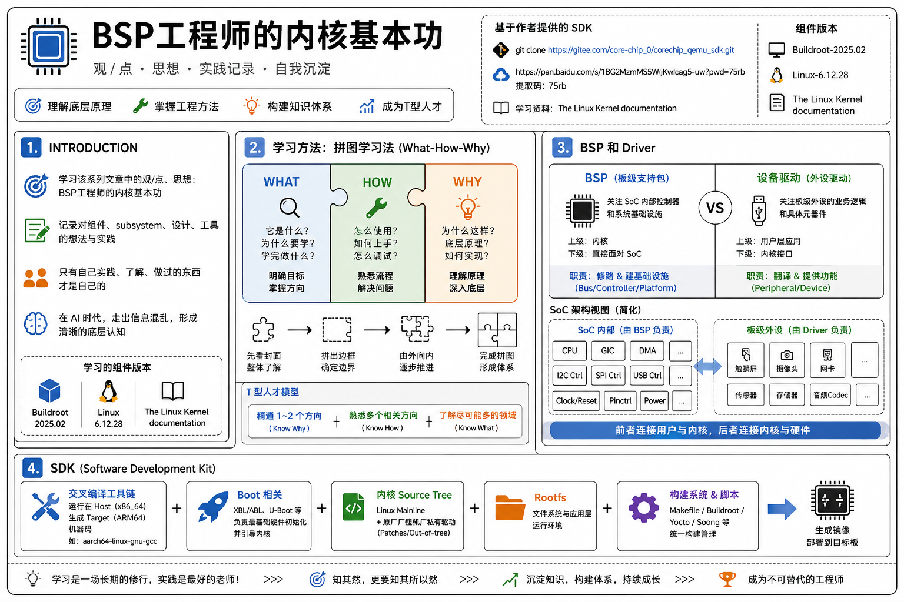
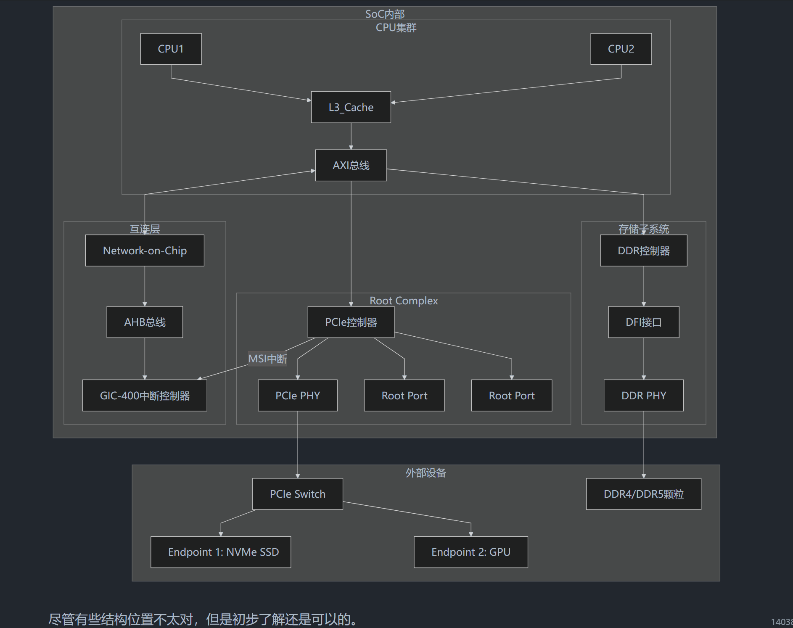

> **注意：以下的内容均为个人观点。**
>
> **如果你看完后有不同的观点也没关系！请指出，我很乐意去学尝试积极的东西。**

封面：

# 1. introduction

主要是学习该系列的文章中的一些观/点、思想：[BSP工程师的内核基本功](https://mp.weixin.qq.com/s/AfvxbactTkCpdqJN-yS9jw)

同时记录一些自己对某些组件、`subsystem`、设计、工具的想法！（本合集的内容大致方向类似）

基于作者提供的SDK：

- `git clone https://gitee.com/core-chip_0/corechip_qemu_sdk.git`
- 链接: https://pan.baidu.com/s/1BG2MzmMS5WVjKwbcag5-uw?pwd=75rb 提取码: 75rb --来自百度网盘超级会员v7的分享

学习的相关组件版本：

- Buildroot-2025.02

- Linux-6.12.28

    [The Linux Kernel documentation — The Linux Kernel documentation](https://www.kernel.org/doc/html/v6.12/)

至于说为什么作者写了一遍自己还要在写，因为个人一直认为只有自己实践了解做过的东西才是自己的，特别是现在这个AI时代，生成的信息过于混乱。

# 2. 学习方法 

下面是博主Core&Chip在 [BSP工程师的内核基本功](https://mp.weixin.qq.com/s?__biz=MzY5OTE1OTEzMA==&mid=2247485362&idx=1&sn=99f34441c4916426e67f96ddf48ae134&chksm=f4420087c3358991ce7fb3a50d414f1e26bece81520744c689b59aab2c80ecd041097a7c3ac5&scene=178&cur_album_id=4441964449075331074&search_click_id=#rd) 的看法：

> 我的系列专题中的讲解思路会使用我日常工作中的学习方法，`What-How-Why`，这个过程非常像拼拼图，所以我称之为拼图学习法。
>
> 这个学习方法是我根据多年学习工作总结的一套非常实用的学习方法，这种方法非常贴近于真实的开发工作思路，十分适合工程师使用。
>
> 1. What: 在学习一个知识点前先明白它是什么，为什么要学，学完之后是用来做什么的，这样可以快速明确学习目标，掌握学习的方向。
> 2. How: 了解了一个知识点的基本概念之后，下一步就是去学会怎么使用它，例如一个I2C模块怎么在Linux中probe起来，i2ctool怎么使用可以来调试I2C外设等。在真实的工作中开发一个模块的流程也是先熟悉然后用起来。
> 3. Why: 在学会了使用它之后接下来就是要深入底层，理解实现原理，这会加深对于这个知识的理解，在遇到各种情况都可以轻松应对。
>
> 这个学习过程就像拼拼图一样，在拿到拼图之后的第一件事应该是先看封面，先了解这个拼图最终的图形是什么样子的，整个图案有什么特点，心中有个大致的方向。然后先将整个拼图的边框拼出来，确定拼图的边缘。最后是由外向内不停地推进，最终完成整幅拼图。
>
> 上面这三点做到第一点，可以作为谈资，但是禁不住问，资深的工程师很容易就知道你没有真正的做过。
>
> 做到第二点就可以承担相关的开发工作了，但是如果仅停留在应用阶段，在遇到问题时可能会难以应对。因为整个流程对于你来说还是一个黑盒，问题无法有效控制。
>
> 最后一点则是普通人和专家的区别，是企业非常看中的一个工程师的自驱力。可以深入理解底层实现原理，不仅可以在发生问题时更容易定位，还可以证明你是一个有钻研精神的工程师。
>
> 这类工程师并不会感到所谓的35岁危机。因为他们的工作经验并不是一些应届生或者工作几年的新人可以替代的。
>
> 但是因为人的精力是有限的，Linux发展至今极其复杂，个人已经无法做到对每个子系统精通。
>
> > **所以我的建议是精通某一两个专项达到`know why`，然后在其他相关方面可以做到`know how`，在尽可能多的领域`know what`。**
>
> 举例作为一个BSP工程师，你可以精通一个高速总线（USB/ETH/UFS/PCIE），要熟悉其协议、驱动框架、调试与验证方法等。
>
> 然后对于多个低速子系统、内存管理、文件系统等有不同程度的理解。
>
> 这也是现在企业比较推崇的所谓`T型人才`。

# 3. BSP 和 Driver

## 3.1 区分 BSP 和设备驱动

主要是看到了作者的这段话：

> 设备驱动：设备驱动长期在Linux内核长期占比超过60%，可以说是Linux内核最重要的部分。设备驱动的主要角色是作为硬件与软件之间的桥梁，让应用开发者无需关系硬件细节，更专注于业务逻辑。Linux内核还提供了一系列机制例如platfrom，设备树等，让设备驱动开发像填空题一般，大大提高了Linux内核的兼容性。

> BSP驱动：我们是BSP的内核系列专题，驱动和BSP肯定是要放在前面的哈哈。大部分文章不会将BSP单独拿出来讲，还会和设备驱动放在一起，我认为是不妥的。Linux内核中有大量的硬件和平台强相关的代码，例如CPU架构，arm64、x86、riscv。还有各类控制器IP的驱动，例如ETH，USB，UFS等，这些都是与IP强相关的硬件。
>
> > **例如有的文章会说U盘属于块设备、USB网卡属于网络设备、键盘鼠标属于字符设备，所以USB既属于字符设备也是块设备也是网络设备**
>

> **这种说法是错误的**。这是将BSP强行套入设备驱动的概念中，将两者混淆在一起是不妥的，也会为将来深入底层，学习BSP驱动造成困扰。
>
> 事实上**I2C、SPI、USB、ETH**这些都是具有物理总线的设备，属于BSP范畴不能使用设备驱动的概念去套用它们，这些概念我们会在BSP专题中详细说明。

> 最后我想再讲一下我为什么要这么强调这个设备分类的概念。很大一部分是嵌入式行业发展的原因，在过去十几年国内的驱动开发是偏向于外设的驱动开发，例如网卡驱动、摄像头驱动等，这些都属于板级的驱动开发。
>
> 真正涉及到SoC级别的驱动开发国内的机会是比较少的，所以目前主流的教程书籍都还是基于早期例如 LDD 这些经典的设备驱动开发书籍衍生出来的。
>
> 但是这会带来有一个问题，当一个驱动工程师将`I2C`和`LCD`按键放在一起的时候说它是字符设备的时候，证明他是没有总线这个概念的。这就会像我们上面说的，导致在开发BSP驱动的时候，例如I2C、SPI这些控制器驱动中的`i2c_i2c_bus`,`spi_bus`这些结构体的时候，他是无法理清其中的关系的。
>
> 我作为面试官的时候也发现这个概念混淆是一个普遍性的，所以这也是我想做BSP工程师的内核必修课这个系列的初衷。
>
> 所以现在就可以回答观众朋友经常问我的一个问题，嵌入式驱动工程师和BSP工程师到底有什么区别？
>
> - 嵌入式驱动工程师，通常是板级驱动工程师，工作重点是片外设备的驱动开发，通过调用内核接口来实现设备功能，他的上级是用户层的应用程序，下级是内核提供的接口
> - BSP工程师一般是SoC级别的，工作重点是片上控制器，通过芯片手册以及硬件协议来开发和调试控制器驱动，他的上级是内核，下级则是直接面对SoC
>
> 前者是将用户和内核连接到一起，后者是将内核与硬件连接到一起。

确实是上面说的这样，两年前在我初次了解这些内容的时候就觉得大家都在混淆这个概念，所以自己去梳理画了图，那个时候还没入门，只是刚刚了解，但至少对 SoC 内部也有点了解了。

前面说的市面上的很多教程往往都会把 BSP（board support package）和外设驱动混在一起，统称为“驱动”，但反过来想其实也情有可原，因为实际上也是最近几年国内才有了更多自研芯片，才更好地理解这个BSP。

但是大厂或者说更加细致的SoC开发和商业落地实践中，将BSP和外设驱动严格拆分开来，往往更加合理，且也有助于划分工程组织架构（但是绝大多数时候并不会分得这么细）。

下面详细拆解一下这段话，理清一下BSP和驱动这两个概念的边界。

传统认知下，“只要是操作硬件的代码就是驱动”。

但在现代 SoC 这种复杂的架构下，我会这么理解，首先硬件是被分为了 SoC 内部的 IP 核心和 SoC 外部挂载的外设（外部主板连接），进而也就是两部分的内容：

- 设备驱动（Device Driver）

    这个关注的是外设本身的业务逻辑，面向的是具体的元器件（比如一颗特定型号的触摸屏芯片、一颗温湿度传感器）。

    它的核心任务是做“翻译”——把操作系统标准的读写命令，翻译成这颗芯片能听懂的指令。

- BSP（Board Support Package）：

    关注的是 SoC 系统本身以及总线/控制器，它面向的是主控芯片（CPU/SoC）以及主板的连线。

    它的核心任务是“修路”和“建基础设施”——把 SoC 点亮，把内存、中断、总线配置好，让设备驱动有路可走。

回到上面的例子：“例如有的文章会说 U 盘属于块设备、USB 网卡属于网络设备、键盘鼠标属于字符设备，所以 USB 既属于字符设备也是块设备也是网络设备”

这样就好理解了，USB 是一种总线（由 BSP 负责提供通信通道），SoC 内部有 USB 控制器的IP,而插在 USB 上的“网卡”才是网络设备（由设备驱动负责解析网络协议）。

那为什么还是会觉得有点混乱，我似乎还是不知道 BSP 究竟包括哪些？要做哪些工作？那问问 Gemini：

> 1. 硬件层 (Hardware Layer)
>
>     所有代码的物理基础，通常分为两部分：
>
>     - SoC 内部 (SoC IPs): CPU核心、GIC（中断控制器）、DMA、I2C/SPI 控制器、NPU、GPU等。
>     - 板级外设 (Board Peripherals): 焊接在主板上的触摸屏芯片、摄像头模组、音频Codec、传感器等。
>
> ----
>
> 2. **BSP 职责范围**：基础设施层 (Infrastructure & Controller)
>
>     | **工作模块**            |                                             **具体负责内容** | **企业实践案例**                                           |
>    | ----------------------- | -----------------------------------------------------------: | ---------------------------------------------------------- |
>     | **CPU & Arch**          | 负责ARM64架构初始化、异常向量表设定、MMU映射、多核启动（SMP）。 | 确保SoC上电后，内核能正确识别出8个核心并进入长模式。       |
>     | **中断与调度 (GIC)**    |   **GICv3/v4 中断控制器驱动**、软中断分配、核间通信（IPI）。 | 配置某个硬件中断只发给小核，以节省功耗。                   |
>     | **核心电源 (CCF/RPMH)** | 时钟树（Clock Tree）配置、电压域（Regulator）控制、PLL锁定。 | 在低功耗模式下，精确关闭不需要的控制器时钟。               |
>     | **总线控制器 (Host)**   | **I2C/SPI/USB Host 控制器驱动**。负责产生物理波形、DMA搬运。 | 编写SoC内部那块I2C控制器的寄存器读写逻辑，确保它能发信号。 |
>     | **引脚复用 (Pinctrl)**  |                    GPIO的复用配置、拉高/拉低、驱动能力调整。 | 在设备树（DTS）中定义哪些引脚用作UART，哪些用作I2C。       |
> 
> ------
>
> 3. 内核框架层 (Kernel Framework / Core)
>
>     这一层通常是Linux内核社区已经写好的标准协议栈，BSP和驱动工程师都要和它打交道：
>
>     - I2C Core / SPI Core: 维护设备列表，匹配驱动和设备，提供标准的API（如 `i2c_transfer`）。
>    - Input Subsystem: 统一各种触摸、按键、传感器的上报接口。
>     - V4L2 / ALSA: 视频和音频的标准框架。
> 
> -----
>4. **设备驱动职责范围**：业务逻辑层 (Peripheral Driver)
> 
>     这是传统意义上的“驱动开发”，更偏向于具体元器件的使用。
>
>     | **工作模块**       | **具体负责内容**                                      | **企业实践案例**                                             |
>    | ------------------ | ----------------------------------------------------- | ------------------------------------------------------------ |
>     | **芯片寄存器逻辑** | 按照外设芯片手册（Datasheet），初始化芯片内部寄存器。 | 比如给某颗加速度计下发指令，设置它的采样率为100Hz。          |
>     | **协议解析**       | 解析外设返回的原始数据（Raw Data）。                  | 将传感器返回的16位二进制数据，转换成人类可读的 $m/s^2$ 加速度值。 |
>     | **策略控制**       | 决定什么时候让外设休眠，什么时候唤醒。                | 当屏幕关闭时，驱动程序通知触摸屏进入低功耗模式。             |
> 
> ------
>
> 5. 应用与系统层 (User Space / HAL)
>
>     - Android HAL (硬件抽象层): 驱动程序将数据传给HAL，HAL再提供给Android Framework。
>    - 用户接口: `/dev/xxx` 节点，或者 `sysfs` 接口，让上层APP能拿到硬件信息。

## 3.2 实际工作划分

在实际的企业/行业开发划分中，工作模式不一定区分成上面那样的。

首先是芯片原厂（高通、联发科等），他们会提供对应 SoC 内部各个 IP 的驱动代码，或者说“Reference Design”，给到下一层来使用的比如说VIVO、OPPO、DJI等公司来使用（OEM，Original Equipment Manufacturer，原始设备制造商，或者叫整机厂）。

但问题是，这套代码一般都只是能跑通的，如果要变成完整的产品，往往还要做些额外的东西，这里详细学习下 OEM 和 ODM，还是以 OPPO 为例。Gemini 分析：

| 维度         | OEM 模式 （自研旗舰机，如 Find X / Reno Pro）                | ODM 模式 （中低端走量机，如部分 A 系列）                     |
| :----------- | :----------------------------------------------------------- | :----------------------------------------------------------- |
| BSP 负责人   | OPPO 自己的底软团队                                          | ODM 厂商的底软团队（如闻泰的 BSP 部门）                      |
| 设备驱动工作 | OPPO 工程师介入移植、调优、HAL 适配。例如：调校屏幕显示效果、解决指纹模块的功耗 bug、适配 VOOC 闪充的私有协议。 | OPPO 工程师主要负责审核、验收和少量的上层适配。底层驱动遇到死机重启问题，ODM 厂作为第一责任人解决。 |
| 差异化技术   | 高。例如 HyperBoost 游戏引擎的底层调度优化必须由 OPPO 自研团队完成。 | 低。基本都是 ODM 厂提供的公版内核配置，OPPO 主要保证能跑通 ColorOS。 |

当然了，如果对应厂商有自己的定制化内容，这些内容就要自己做了。

**不过，非企业内部人士在这里说这些都是扯淡，具体的企业/行业有自己的分工，我这里只是简单梳理下大致的逻辑，用来自己学习 BSP 的。**

## 3.3 组织拆分

另外，在现在公司极其螺丝钉化的岗位分工上，按照个人理解BSP组里应该还是会按照技术栈/子系统来进一步拆分小组，比如说：

1. boot组
2. 功耗和性能组
3. sensor hub + Always-On 组
4. 稳定性
5. 音频
6. 影像

有些部分可能会单独是一个大组（影像），有些可能会和合并在一起（boot，稳定性），我也不懂。

# 4. SDK（Software Development Kit）

## 4.1 SDK 组成

个人理解，对于纯软件开发（如 Java/Python），SDK 可能就只是一堆 API 库和调用文档。但对于底层 BSP 开发，SDK 那就是是一个包含下面内容的完整生态圈，名字也可能叫 BSP 包啥的。

- 交叉编译工具链：运行在 Host 机（一般都是 x86_64 服务器），用于生成 Target 机（如 ARM64 SoC）机器码的交叉编译器。

    例如 `aarch64-linux-gnu-gcc` 或基于 LLVM 的 Clang。

    > 这里有些公司还会使用docker，详细见最下方的 Other 部分。

- boot相关：原厂提供的 XBL/ABL、开源的 U-Boot。负责最基础的硬件初始化，并引导内核。

- 内核 Source Tree：一般会包含了 Linux Mainline 的代码、芯片原厂/整机厂大量一些未开源的私有驱动（Out-of-tree modules）和 Patches。

- `Rootfs`：暂时了解不多。

- Build System 和 Build Scripts：将上面的组件都统一使用起来的。

    简单的 `envsetup.sh` + Makefile、Yocto Project / OpenEmbedded、Android 的 Soong/Blueprint

可以稍微绝对一点说，无论是在哪一家公司（芯片原厂，主机厂等），BSP做的内容几乎都是在SDK上开发，无论是从头构建，还是在上面写补充各种代码，最终要么是公开外部使用、要么内部自己维护。

## 4.2 `corechip_qemu_sdk` 的 `envsetup.sh` 学习

自己对 `shell` 其实说不上熟悉，但是现在有了AI，直接让他写，而我只掌握核心的写法思路（未来可以迁移），同时补充一些语法知识。

首先就是可以把任何的SDK初始化脚本的核心功能归为几个部分：

1. 识别 `Host` 和 `Target` 端

    正如 `corechip_qemu_sdk` 中的 `envsetup.sh` 的那样，脚本中大量检测 `uname -m`，区分出 `HOSTCC`（宿主机编译器）和 `CROSS_COMPILE` / `CC`（目标机编译器）。

    一般来说，`x86_64` 电脑（`Host`）只负责运算，而最终生成的二进制文件要在 `ARM64` 芯片（`Target`）上跑。（当如如果是苹果的 M 系列的芯片那是另说）

    > Gemini 的指导：
    >
    > **💡 跨平台迁移迁移：**
    >
    > - **RTOS / MCU 开发：** 宿主机是 PC，目标机是 Cortex-M 核心。你的编译器就是 `arm-none-eabi-gcc`。
    > - **QNX 开发：** 对应的是 `QNX_HOST` 环境变量（指向你 PC 里的 QNX 工具链）和 `QNX_TARGET` 环境变量（指向你要编译的平台库，比如 ARMv8 库）。

2. 环境变量净化

    `envsetup.sh` 执行的 `unset LIBRARY_PATH`、`unset C_INCLUDE_PATH`、`unset CC`，主要就是因为 Linux 的环境变量是具有污染性的，如果在 `.bashrc` 里为了跑某些应用，全局设置了 `LD_LIBRARY_PATH` 指向了宿主机 `x86_64` 的某个特定库，那么当交叉编译器启动时，它可能会被误导，从而把宿主机的库链接到 `ARM64` 的内核里，导致奇怪的 `ELF class data mismatch` 报错。

    > Gemini 的指导：
    >
    > - **💡 跨平台迁移：** 无论什么 OS 的构建，**“隔离”**都是第一原则。大厂为什么喜欢用 Docker 编译？本质上就是把这种 `unset` 的手动净化过程，变成了物理级别的沙箱隔离，确保每一次编译都在绝对干净的真空中进行。

3. 依赖自检与修复

    `envsetup.sh` 执行的“循环检查 `bison`, `flex`, `libssl-dev` 等工具，如果没有就提示安装”。主要是因为内核构建系统不是孤立的。比如 Linux 内核的配置系统（Kconfig）是由 `bison` 和 `flex` 解析的；内核镜像如果需要做 Secure Boot 签名，`Host` 就必须安装 `libssl-dev` 的密码学库。

    > Gemini 的指导：
    >
    > - **💡 跨平台迁移：** 到了 QNX 或 Android SDK，这个列表只会更长（比如需要特定的 Python 版本、Ninja、CMake）。优秀的 SDK 都会在最开始做环境自检，而不是等编译了一小时后才因为缺一个库而崩溃。

4. 构建系统 API 注入 (Build System API Injection)

    也就是 `envsetup.sh` 最后的 `export ARCH=arm64`、`export CROSS_COMPILE=...` 等。实际上 `envsetup.sh` 本身不编译任何东西，它只是为接下来的 `make` 命令做准备。内核的顶层 `Makefile` 中预留了这些变量的接口。当执行 `make menuconfig` 时，Make 工具会自动读取系统环境变量中的 `ARCH`，从而知道去 `arch/arm64/` 目录下寻找特定架构的代码和配置。

## 4.3 个人编译想法

> 下面再补充一个自己对于配合完整的SDK编译的想法。

对于这个 `envsetup.sh`，我应该每次编译内核或者说编译别的组件，我应该都要跑一遍这个脚本？

但我第一次运行完成后各种工具链、依赖不都完成了吗？我需要的就只是最后的那几个 `ARCH`， `CROSS_COMPILE` 等环境变量的注入，那为什么不直接写在我宿主机的 `~/.bashrc` 或者 `/etc/profile` 里？

这里应该是有一个选择的选择：

1. 对于如果有服务器做编译的情况，一般都是大厂

    首先就是我的编译代码的地方是服务器，应该是不止有我这一个平台的，可能有多款 SoC、甚至于还有 MCU？所以我一写死到配置文件，对后续的编译就会出问题。

2. 直接在个人开发机上做编译，一般个人项目或者小厂

    这个时候还是之前的问题，如果你就一个人开发小项目，且就一个芯片平台，那完全没问题。但是如果人一多或者芯片平台一多，那你就得手动管理好。

无论哪种，都是自己的选择，但是就这么看下来，我其实更加关注的就是不如直接上一个docker来的更加好！完全隔离！一个系列芯片有一个统一的基线基镜像（几十GB：交叉编译工具链、原厂闭源驱动等）！也就是在每一次触发编译的时候，拉起对应芯片的 docker 统一环境，然后进一步选择对应仓库BSP的build.sh进行构建？！

> 想法似乎可以！这部分留到之后再和AI一起讨论！

# NONE mechanism 和 policy

> Most programming problems can indeed be split into two parts: **“what capabilities are to be provided” (the mechanism) and “how those capabilities can be used” (the policy).**  
