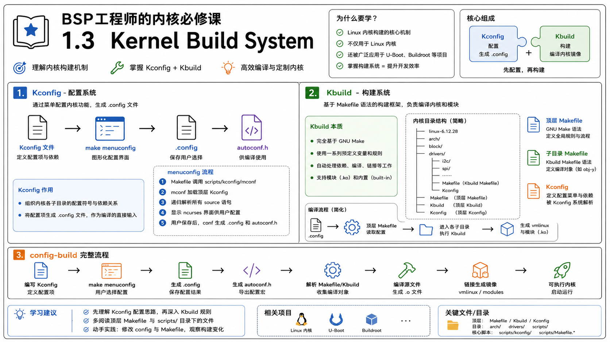
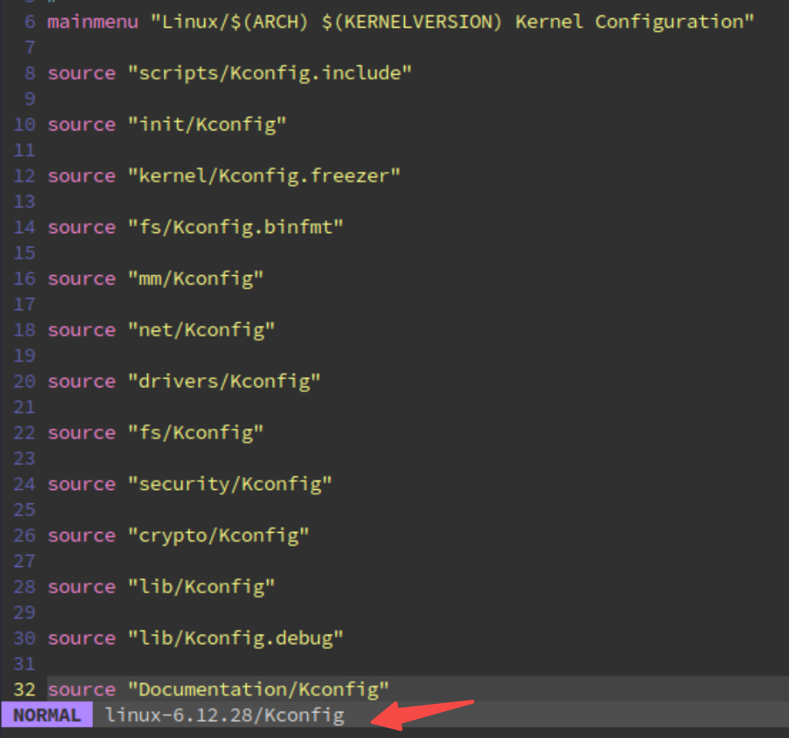
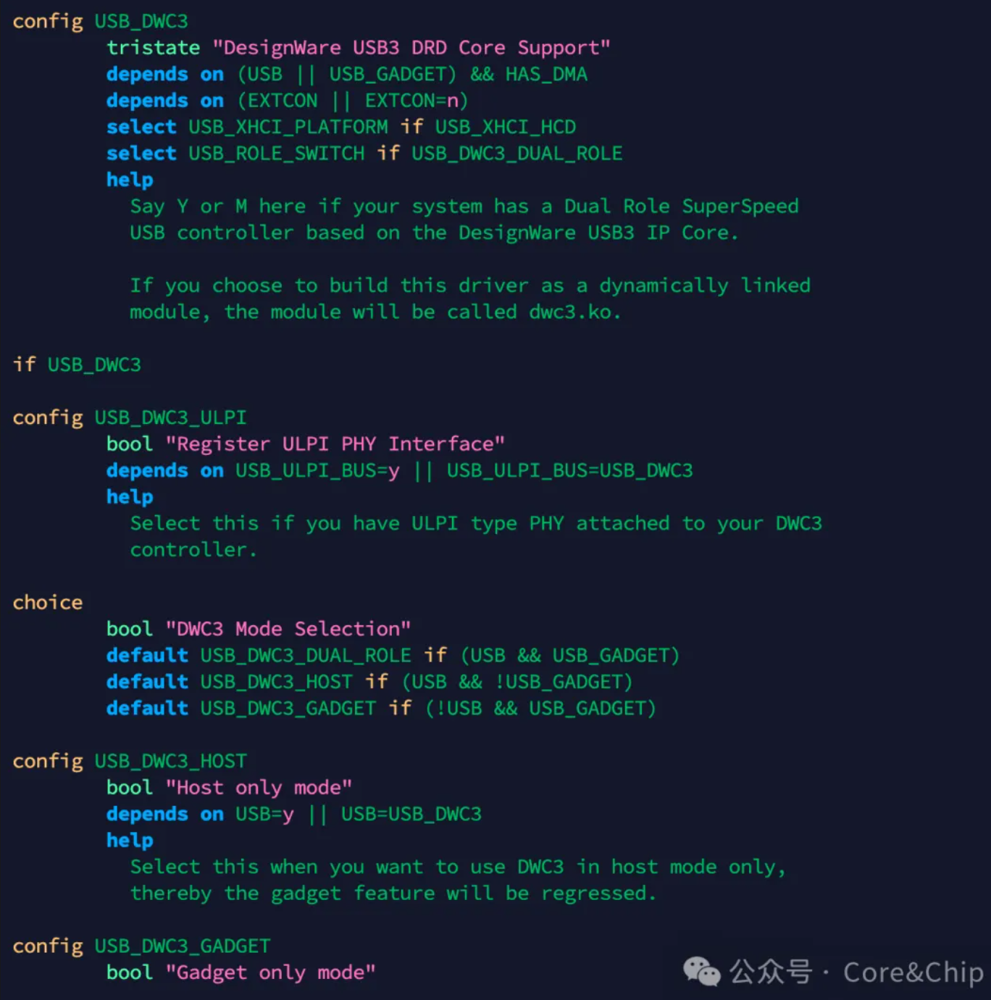

> **注意：以下的内容均为个人观点。**
>
> **如果你看完后有不同的观点也没关系！请指出，我很乐意去学尝试积极的东西。**

封面：



# 1. introduction

[BSP工程师的内核必修课 —— 1.3 Kernel Build System](https://mp.weixin.qq.com/s?__biz=MzY5OTE1OTEzMA==&mid=2247485365&idx=1&sn=dbb5b0e763a50ff5c10301b2770d22ed&chksm=f4420080c33589969e8fb9113a77af2b95a4fd0d50acd626c91275a396dabe7c1c4e070d9ad7&scene=178&cur_album_id=4441964449075331074&search_click_id=#rd)


# 2. Kernel Build System

> 在初期Linux是通过`Makefile`来编译，但是随着系统复杂度的提升，编译体系的复杂度也随着提升。于是在2.6版本，Linux采用了`Kbuild`机制，将编译做成了一个更加科学的系统。
>
> 这套系统现在不仅用在Linux内核编译，许多项目都在使用例如：`uboot`、`buildroot`等。所以了解和学会使用这套编译系统对于日常开发尤其是嵌入式领域是非常有必要的。
>
> Linux编译系统，也有的文章会把它简称为Kbuild子系统，内核文档中将其称为：`Kernel Build System`，我觉得官方的名称更准确一些。因为Kbuild同样也是一个编译机制，并不能代表整个编译系统，放在一起容易混淆。

Kernel Build System 组成：`Kconfig`+ `Kbuild`，各自的作用：

`Kconfig` 将配置以菜单的形式列出来供用户选择，`Kbuild` 则是将用户选择的配置的整理并生成 `.config` 配置文件用于之后的镜像编译。

其中这些文件博客作者已经总结好了，后文再补充理解。

> 下面是简略的内核中编译系统的文件结构，可以看到：
>
> 1. 顶层目录有`Makefile`，`Kbuild`，`Kconfig`三个文件
> 2. 其余子目录都有`Makefile`/`Kbuild`+ `Kconfig`文件
>
> ```BASH
> linux-6.12.28
> |---arch
> |---block
> |---drivers
>   |---i2c
>   |---spi
>   ......
>   |---Makefile
>   |---Kconfig
> .......
> |---Makefile
> |---Kbuild
> |---Kconfig
> ```
>
> 1. 子目录中的`Makefile`其实是`Kbild Makefile`，语法是`Kbuild`的语法，官方建议以`Makefile`命名。
> 2. 顶层目录的`Makefile`就是`makefile`语法，所以顶层`Kbuild`文件还是命名为`Kbuild`，为了和`Makefile`区分。
> 3. 子目录中如果有`Kbuild`文件则会优先使用`Kbuild`文件


## 2.1 `Kconfig`

> The first step in building a kernel is always configuration. 
>
> 推荐阅读：[Exploring the Linux kernel: The secrets of Kconfig/kbuild](https://opensource.com/article/18/10/kbuild-and-kconfig)

`Kconfig` 作为一种构建描述语言，其主要用来定义 `Config symbols` 的文件。它的主要作用有：

1. 组织内核各个子目录配置符号与依赖项
2. 将配置项生成`.config`文件，作为内核编译的直接输入

另外，日常基本使用的都是 `make menuconfig`，所以简单看看文章中的梳理流程：

> `menuconfig`是 Linux 内核构建系统中最常用的配置工具。它是一个基于 `ncurses`库的文本用户界面 (TUI)，解析`Kconfig`允许用户在终端环境下搜索和配置内核。
>
> 当执行`make menuconfig`时： 
>
> 1. `Makefile` 调用 `scripts/kconfig/mconf`
> 2. `mconf` 加载顶层 `Kconfig` 文件
> 3. 递归解析所有 `source "subdir/Kconfig"` 语句
> 4. 显示 `ncurses` 界面
> 5. 用户保存后调用 `conf` 生成 `.config` 和 `autoconf.h`

下面简单过一遍 `Kconfig` 涉及到的内容：

首先是内核代码的顶层的部分：



> 另外，额外插一点：这个 `source` 和 `command` 命令我比较迷糊，这里补一下：
>
> > 移植看着各种文档中都是直接使用的 `source` 和构建脚本的 `command -v` 确认程序命令，好像内部的东西自己似乎一直都没有了解过？问问 Gemini，见文章最后的Other部分

这里的这个 `source` 命令和 `shell` 里的不太一样。Gemini总结：

| 维度   | Shell 脚本中的 source                                 | Kconfig 文件中的 source                                      |
| ------ | ----------------------------------------------------- | ------------------------------------------------------------ |
| 本质   | Bash/Shell 的内建命令。                               | Kconfig 配置语言的关键字。                                   |
| 作用   | 在当前进程空间执行指定的 Shell 脚本文件（保留变量）。 | 包含子目录的 Kconfig 文件，用于构建菜单树（类似 C 的 `#include`）。 |
| 解析者 | 当前终端正在运行的 Bash (或其他 Shell) 程序。         | 位于 `scripts/kconfig/` 目录下的、用 C 语言临时编译出来的 `mconf`/`qconf` 等专用工具。 |

也没什么好说的，同名而已。

接着到了各个子目录中的 `Kconfig`，其实核心就是写 `Kconfig` 菜单，关注语法部分。



比如博主贴出的这部分，通过这些配置，我能够控制开启 DWC3 这个 USB 控制器的一些功能特性，到最后能够编入 Linux 内核中。

其实绝大部分时候工作就是在写这些？不过应该是原厂工程师才会做，主机厂一般不会改吧，除非有自己的特性？


### 2.1.1 `Kconfig` 语法

这部分相对比较重要，但只要自己写几次就好了，该系列的作者也已经总结好过：

[BSP工程师内核必修课：1.4. Linux Kconfig 语法详解上—— 配置条目](https://mp.weixin.qq.com/s?__biz=MzY5OTE1OTEzMA==&mid=2247485367&idx=1&sn=1eccc3417942a737fff73aa4e9081b1e&chksm=f4420082c3358994cc203b4bdd9858a88287f520bb8e88a75ff6ad3342660613ff23f30a1f40&scene=178&cur_album_id=4441964449075331074&search_click_id=#rd)

[BSP工程师内核必修课：1.5 Linux Kconfig语法详解下 —— 菜单结构](https://mp.weixin.qq.com/s?__biz=MzY5OTE1OTEzMA==&mid=2247485368&idx=1&sn=433428cb9b16f69e485b1e3a5cc54061&chksm=f442008dc335899b4eaf9a182682149bf1388a6dc9cca0803664aeb991a5776df87eae8ac419&scene=178&cur_album_id=4441964449075331074&search_click_id=#rd)


## 2.2 `Kbuild`

由于我也接触过一些 `Makefile`，所以这部分的内容比较好懂，主要是理解 `Makefile` 和 `Kbuild` 的关系：

`Makefile` 是底层的规则语法（砖块与水泥），而 `Kbuild` 是利用 `Makefile` 构建出来的、专门为 Linux 内核量身定制的宏大框架（包工头与建筑蓝图）。

也就是说 `Kbuild` 的本质依然是 `Makefile` 和 `GNU Make` 工具，所以它就是完全合法的 `GNU Makefile` 语法，所以我们一般使用的 `obj-y`、`obj-m` 在 `Make` 看来，仅仅是普通的变量赋值，我们做的也只是在这个变量上赋值更新而已。

至于内部如何解析，其实就和以前写普通的 `Makefile` 差异不大，比如说 Gemini 总结的这个：

> **底层是如何解析的？** 首先，`Kbuild` 并没有修改 `make` 这个工具本身，而是通过预先写好的脚本（位于 `scripts/` 目录下）来**包含 (include)** 你写的这些子目录 `Makefile`，然后统一处理这些变量。
>
> **核心功臣：`scripts/Makefile.build`** 当你编译一个子目录时，`Kbuild` 真正执行的命令类似于：`make -f scripts/Makefile.build obj=drivers/i2s`。在这个 `Makefile.build` 文件里，它会：
>
> 1. `include drivers/i2s/Makefile` （把你的 `obj-y += i2s_driver.o` 读进来）。
> 2. 利用 Make 的内置函数，对 `obj-y` 里的所有的 `.o` 文件应用统一的编译规则（比如调用 `$(CC) $(c_flags) -c -o $@ $<`）。 所以，你在子目录里只是在填空（往变量里塞名字），真正干活的规则全部提前写死在 `scripts/Makefile.build` 以及 `scripts/Makefile.lib` 等文件里了。

此时再来看整体 Linux 就能好理解一点，就是一层套一层的逻辑：从最上层的 `Makefile` 开始，加上 `Kbuild` 提前定义好的各种变量和编译规则，一步步向下到子目录的最后一层的 `Makefile`（实际是 `Kbuild Makefile`）最终能完整地构建出内核镜像 `vmlinux`。

其实就是自己以前写 `make -C xxx_dir` 不断地在各个目录之间跳来跳去，只是现在内核社区做成了更好的工具。

> 在一些主机厂，他们提供的 SDK，比如是 QNX 的，那就会自己做一个类似的结构，也是顶层一个 `Makfile`，但是是直接在顶层做了一些编译规则，然后直接 `make -C xxx_dir  ARGS=XXX`，也是能够实现类似的效果的。见 Other 部分 Gemini 输出的内容。

至于从上到下每一层都在做什么，可以看博客作者的分析：

> 内核官方将Kbuild分为五个部分：
>
> - **Makefile** —— 顶层 Makefile。
> - **.config** —— 内核配置文件。
> - **arch/$(SRCARCH)/Makefile** —— 架构对应的 Makefile。
> - **scripts/Makefile.*** —— 适用于所有 kbuild Makefile 的通用规则等。
> - **kbuild Makefiles** —— 存在于每个子目录中。
>
> 顶层`Makefile`没有编译具体的规则，主要用于定义一些环境变量。具体编译规则在`scripts`下的`Makefile.*`，例如编译模块，镜像，clean等。
>
> 顶层 `Makefile`负责构建两大产物：**vmlinux**（驻留内核镜像）和 **模块（modules）**（任意模块文件）。它通过递归进入内核源代码树的子目录来构建这些目标。
>
> 需要遍历的子目录列表由内核配置决定。顶层 `Makefile`以文本方式包含一个名为 `arch/$(SRCARCH)/Makefile`的架构 `Makefile`，该文件为顶层 `Makefile`提供架构相关的特定信息。
>
> 每个子目录都包含一个 `kbuild Makefile`，用于执行从上层传递的命令。`kbuild Makefile`借助 `.config`文件中的信息，构建各类文件列表，供 `Kbuild`用于编译内置目标或模块目标。
>
> `kbuild`文件的推荐名称是 `Makefile`，但也可以使用 `Kbuild`。若同一目录下同时存在 `Makefile` 和 `Kbuild` 文件，则优先使用 `Kbuild`。

想深入就自己研究 kernel 的 `Makefile`。


## 2.3 config-build 流程

`Gemini` 总结的流程，这里也只是有认知即可。而且下面的某些地方细节可能并不对，我这里对AI生成的首先为怀疑态度，但也只有真正使用到，我才再深入具体到每一步，否则了解到这里差不多了。

1. **配置菜单 (`Kconfig` -> .config):** 开发者运行配置工具（如 `menuconfig`），系统读取各级 `Kconfig` 文件生成菜单，开发者勾选硬件支持选项，最终生成顶层 `.config` 配置文件（包含各种 `CONFIG_XXX=y/m`）。

2. **引擎启动 (顶层 `Makefile`):** 开发者敲击 `make`，顶层 `Makefile` 成为总指挥，它会加载 `.config`，确定架构（arch）设置，并拉起 `scripts/` 目录下的底层构建脚本（Kbuild 引擎）。

3. **变量转换 (配置生效):** `Kbuild` 将 `.config` 中的配置转化为全局的 `Makefile` 变量，这就相当于拿到了整个内核构建的“图纸”。

4. **按图索骥 (递归遍历):** `Kbuild` 引擎从顶层开始，读取每一级子目录的 `Makefile` 或者 `Kubild` 文件。遇到 `obj-$(CONFIG_XXX) += subdir/` 时，根据配置变量是 `y` 还是 `m`，决定是跳过、还是继续递归进入该子目录。

    > 这里的是怎么进入到子目录的，具体的脚本代码哪里说了？
    >
    > 见 Other。

5. **收集目标 (读取 obj-\*):** 进入具体驱动或模块目录后，`Kbuild` 读取该目录 `Makefile` 中的 `obj-y`（编入内核）或 `obj-m`（编译为模块），记录下需要编译的源文件名单。

6. **统一施工 (`scripts/Makefile.build`):** `Kbuild` 引擎根据收集到的名单，应用统一的编译规则（如 C 语言的编译参数、包含路径），将 `.c` 文件编译成 `.o` 文件。

7. **最终组装:** 所有标记为 `y` 的对象文件最终被链接成庞大的内核镜像 `vmlinux`；标记为 `m` 的对象文件被额外处理，打包成独立的 `.ko` 内核模块文件。


# 3. Other

主要存放学习过程中遇到的一些想法或者问题，基本都是 AI 的回答。


## 3.1 `source` & `command`

**这二者不是硬盘上的独立可执行文件（比如 `/bin/ls`），而是 Shell（比如 Bash）的“内建命令”（Built-in Commands）。** 

这意味着它们是由 Shell 程序本身直接解释执行的，用来改变 Shell 自身的行为和状态。

------

### 一、 `source` 命令：打破“子进程隔离”

在理解 `source` 之前，我们必须先理解 Linux 终端里执行脚本的默认逻辑：**子 Shell（Subshell）机制**。

#### 1. 常规执行 (`./script.sh` 或 `bash script.sh`)

当你普通地运行一个脚本时，当前的 Shell 会**fork 出一个新的子进程（子 Shell）**来执行这个脚本。

- **结果：** 脚本在这个独立的子房间里运行，它可以定义一堆环境变量，但一旦脚本执行完毕，子 Shell 销毁，**里面所有的变量和环境修改都会随之灰飞烟灭**，完全不会影响你当前的父 Shell。

#### 2. 使用 `source` 执行 (`source script.sh` 或 `. script.sh`)

`source` 的核心作用是：**拒绝创建子进程，强行把脚本里的每一行代码“吸入”到当前的 Shell 环境中逐行执行。**

- **结果：** 脚本里定义的所有环境变量、路径 (`$PATH`)、函数，全都会直接留在你当前的终端里。

#### 🧪 实验对比验证

假设我们有一个脚本 `env_setup.sh`，里面只有一行代码：

```Bash
export MY_CORECHIP_VAR="Hello_QEMU"
```

- **普通执行：**

    ```Bash
    $ ./env_setup.sh
    $ echo $MY_CORECHIP_VAR
    # (输出为空，因为变量随着子进程死掉了)
    ```

- **source 执行：**

    ```Bash
    $ source env_setup.sh
    $ echo $MY_CORECHIP_VAR
    Hello_QEMU  # (变量成功留在了当前终端！)
    ```

**🎯 核心应用场景：**

这就是为什么你在编译代码或使用 SDK（就像你终端里的 `corechip_qemu_sdk`）之前，通常都需要 `source env.sh`。因为 SDK 需要修改你当前终端的 `$PATH`、设定交叉编译器的路径，如果不使用 `source`，环境配置根本无法生效。

*(注：在 Bash 中，有一个点 `.` 是 `source` 的同义词，比如 `. env_setup.sh` 效果完全一样。)*

------

### 二、 `command` 命令：看破伪装的“照妖镜”

`command` 命令的作用看起来有点绕：“执行一个命令并忽略 Shell 函数查找”。要理解它，你需要知道 Bash 执行命令时的**优先级查找顺序**。

当你敲下一个命令（比如 `ls`），Bash 其实是在按以下顺序找它：

1. **Alias（别名）**：比如你设置了 `alias ls='ls --color=auto'`。
2. **Function（Shell 函数）**：你自己定义的同名函数。
3. **Built-in（内建命令）**：比如 `cd`, `echo`, `source`。
4. **$PATH 中的外部命令**：去 `/usr/bin/` 等目录找真正的可执行文件。

#### 1. 痛点：命令被“绑架”了怎么办？

假设为了防止误删，你在 `.bashrc` 里写了一个函数或别名来“劫持” `rm` 命令：

```Bash
rm() {
    echo "危险操作！文件已被移动到回收站"
    mv "$@" /tmp/trash/
}
```

现在你敲 `rm test.c`，它会执行你的函数。但如果某一天，你**真的想调用系统最底层、最原始的那个 `/bin/rm`**，该怎么办？

#### 2. 破局：使用 `command`

`command` 的作用就是**强制跳过上面的第 1 步（别名）和第 2 步（函数）**，直接去执行内建命令或硬盘上的真实命令。

```bash
$ command rm test.c  # 这次不会触发函数，而是真正地调用了系统的 rm 删除了文件！
```

#### 3. 神级选项：`command -v` (比 `which` 更好用)

在写 Shell 脚本时，我们经常需要检查某个工具是否安装。很多人喜欢用 `which`：

```bash
if which gcc > /dev/null; then ...
```

但 `which` 其实是一个外部程序，每次调用都要开销进程，且有些精简版 Linux 没有装 `which`。

**更标准、更优雅的做法是使用 `command -v`：**

```bash
$ command -v gcc
/usr/bin/gcc
```

它不仅快（因为是内建的），还能准确识别出别名和函数，是编写高可靠性 Shell 脚本的必备技巧。比如再写SDK时，常常会这么写：

```BASH
if command -v gcc >/dev/null 2>&1; then
	...
fi
```

- `> /dev/null` 将标准输出（`command -v` 正常找到程序时输出的路径）丢弃。
- `2>&1` 将标准错误（例如 `gcc: command not found` 这类错误信息）**也**重定向到标准输出，而标准输出已经被重定向到 `/dev/null`，因此错误信息同样被丢弃。
- 最终效果：完全静默地检测命令是否存在，不影响屏幕输出。如果 `command -v` 成功（表示 `gcc` 存在），则执行后面的语句。而如果不使用 `2>&1`，当 `gcc` 不存在时，`command -v` 会输出一条错误信息到 stderr，可能会污染脚本的运行输出。

------

### 💎 总结对比

| **特性**     | **source (或 .)**                                | **command**                                       |
| ------------ | ------------------------------------------------ | ------------------------------------------------- |
| **本质定位** | 环境变量与上下文的**注入器**                     | 真实命令的**强制执行器**                          |
| **底层行为** | 在**当前** Shell 进程中读取并执行脚本代码。      | 绕过别名和函数，直接执行底层命令或可执行文件。    |
| **核心目的** | 让脚本中的变量、函数定义在当前终端**持久生效**。 | 避免同名函数/别名冲突，找回命令的**“本来面目”**。 |
| **常见用法** | `source ~/.bashrc` `source ./env_setup.sh`       | `command ls` `command -v python3`                 |


## 3.2 `Kbuild` 怎么进入到子目录的？

这个问题直接切中了 Kbuild 系统的“奇经八脉”！你问到了最核心的机关：**既然大家写的都是 `obj-y += subdir/`，这明明只是一个变量赋值，Make 是怎么把它变成一个“进入目录并执行”的动作的？**

答案藏在内核的 `scripts/` 目录下，主要涉及两个文件：**`scripts/Makefile.lib`**（负责数据处理）和 **`scripts/Makefile.build`**（负责执行动作）。

我们直接扒开源码来看看这个“按图索骥”到底是怎么实现的。

### 第一步：识别“目录”与“文件”的暗号 —— 尾部的斜杠 `/`

在 `Kbuild` 语法中，有一个极其重要但常被忽略的细节：**如果是目录，名字最后必须带斜杠 `/`**。

比如，当你配置了音频 SoC 驱动，`sound/Makefile` 里会有这样的代码：

```Makefile
obj-y += soc/    # 注意这个 '/'，它是触发递归的钥匙
obj-y += sound.o # 这是一个普通文件
```

### 第二步：挑出目录 (代码位置: `scripts/Makefile.lib`)

当 `Kbuild` 引擎处理某个目录时，它会先引入 `scripts/Makefile.lib` 这个核心库文件。这个文件的任务之一，就是把带有 `/` 的目录从 `obj-y` 和 `obj-m` 里面“过滤”出来，单独存放到 `subdir-y` 和 `subdir-m` 变量中。

在 `scripts/Makefile.lib` 的开头部分，你能找到类似下面这样的过滤魔法：

```Makefile
# ---------------------------------------------------------------------------
# 提取 obj-y 和 obj-m 中带有 '/' 的项，这就是需要递归进去的子目录
# $(filter %/, $(obj-y)) 意思是：把所有以 / 结尾的字符串挑出来。
# $(patsubst %/,%, ...) 意思是：把结尾的 / 去掉，还原成干净的目录名。

__subdir-y      := $(patsubst %/,%,$(filter %/, $(obj-y)))
subdir-y        += $(__subdir-y)

__subdir-m      := $(patsubst %/,%,$(filter %/, $(obj-m)))
subdir-m        += $(__subdir-m)

# 把所有目录合并到一个大集合里去重，准备施工
subdir-ym       := $(sort $(subdir-y) $(subdir-m))
```

经过这一步，`Kbuild` 就非常清楚地知道当前目录下有哪些源文件（`.o`）需要就地编译，又有哪些子目录（`subdir-ym`）需要派人进驻。

### 第三步：下达递归指令 (代码位置: `scripts/Makefile.build`)

拿到了子目录的名单 `subdir-ym` 后，怎么进去呢？这就来到了 `Kbuild` 的执行引擎 `scripts/Makefile.build`。

在这个文件里，你会看到真正的、用于进入子目录的 Makefile 目标规则（Target Rule）：

```Makefile
# ---------------------------------------------------------------------------
# 告诉 Make，这些子目录是一个个需要执行的目标 (PHONY 表示伪目标)
PHONY += $(subdir-ym)

# 递归进入子目录的核心规则！
$(subdir-ym):
	$(Q)$(MAKE) $(build)=$@ \
	need-builtin=$(if $(filter $@/built-in.a, $(subdir-builtin)),1) \
	need-modorder=$(if $(filter $@/modules.order, $(subdir-modorder)),1)
```

**深入拆解这段终极代码：**

这里面最神奇的变量是 **`$(build)`**。在整个 `Kbuild` 系统中，`$(build)` 是一个被提前定义好的“宏指令”（通常定义在 `scripts/Kbuild.include` 中）。

它的真面目是这样的：

```Makefile
build := -f $(srctree)/scripts/Makefile.build obj
```

所以，当你看到内核源码里写着：

```
$(MAKE) $(build)=$@
```

假设当前 `$@` 也就是子目录名是 `soc`，把它完全展开，真正执行的命令其实就是：

```Bash
make -f /你的内核源码路径/scripts/Makefile.build obj=soc
```

### 💎 总结：内核的“套娃”艺术

现在把逻辑串起来，你会发现它和你之前总结的、自己在写 SDK 时的感悟完全一致：

1. **收集：** 开发者在 `sound/Makefile` 填入 `obj-$(CONFIG_SND_SOC) += soc/`。如果配置选中，它变成了 `obj-y += soc/`。
2. **过滤：** `scripts/Makefile.lib` 看到尾部的 `/`，把它抓取出来放进待处理的目录名单 `subdir-ym` 中。
3. **深入：** `scripts/Makefile.build` 遍历名单，对 `soc` 这个目录执行 `make -f scripts/Makefile.build obj=soc`。
4. **循环：** 于是，同一个 `Makefile.build` 脚本，只是换了一个工作目标（`obj=soc`），跑到了 `sound/soc/` 目录下，读取那里的 `Makefile`（比如再收集到 `obj-y += i2s/`），开始新一轮的收集、过滤、深入……

一层一层剥到底，**`Kbuild` 并没有发明什么超越 `Makefile` 的黑科技，它只是把无数个 `make -C` 或 `make -f` 极其优美地封装在了一个个函数和变量解析库（`scripts/` 目录）里，实现了一套标准化的“流水线车间”。**


## 3.3 精简版主机厂SDK递归编译架构

> 关于理解 makefile，Kbuild。
> 我自己有一个经历：
> 此时再来看整体 Linux 就能好理解一点，就是一层套一层的逻辑：从最上层的 Makefile 开始，加上 Kbuild 提前定义好的各种变量和编译规则，一步步向下到子目录的最后一层的 Makefile（实际是 Kbuild Makefile）最终能完整地构建出内核镜像 vmlinux。
> 其实就是自己以前写 make -C xxx_dir 不断地在各个目录之间跳来跳去，只是现在内核社区做成了更好的工具。
> 在一些主机厂，他们提供的 SDK，比如是 QNX 的，那就会自己做一个类似的结构，也是顶层一个 Makfile，但是是直接在顶层做了一些编译规则，然后直接 make -C xxx_dir  ARGS=XXX，也是能够实现类似的效果的。
> 请帮我做一个这样的目录架构出来？

不管外表包装得多高大上，不管是 Linux 内核的 `Kbuild`，还是各家芯片原厂/主机厂（比如 QNX、甚至一些基于 RTOS 的私有 SDK）自己搞的构建系统，**剥开那一层层的宏定义和脚本，最底层的核心骨架依然是：顶层定规矩，底层干苦力，中间靠 `make -C` 跑腿穿针引线。**

我为你梳理了一个**“精简版主机厂 SDK 递归构建架构”**。这个架构完全契合你所描述的逻辑：顶层统筹变量，通过 `make -C` 将指令下发到类似 BSP 底软、外设驱动等子目录中。

------

### 一、 目录架构图 (简易 SoC SDK)

这是一个典型的、非 `Kbuild` 系统的自定义 SDK 目录结构：

```
my_soc_sdk/
├── Makefile                # 【总控中心】顶层 Makefile，定义全局变量、编译规则、进入子目录
├── rules.mk                # 【规则库】可选，存放通用的编译规则，被顶层或底层包含
├── include/                # 全局头文件
│   └── hardware.h
├── bsp/                    # 【子系统 1】底层支持包
│   ├── Makefile            # 负责编译 bsp 目录下的源码
│   └── soc_init.c
├── drivers/                # 【子系统 2】外设驱动 (例如音频、传感器)
│   ├── Makefile            # 负责编译 drivers 目录下的源码
│   ├── i2s_audio.c
│   └── sensor_hub.c
└── out/                    # 【输出目录】所有编译生成的 .o, .a 或最终固件统一存放在此
```

------

### 二、 核心代码实现

这里展示这套架构是如何通过 `make -C` 跑通的。

#### 1. 顶层 `Makefile` (`my_soc_sdk/Makefile`)

它的核心任务是：定义编译器（比如交叉编译工具链）、全局编译参数，然后循环进入子目录。

```Makefile
# ==========================================
# 顶层 Makefile：总控与全局规则设定
# ==========================================

# 1. 定义全局变量 (例如交叉编译链，这里用标准 gcc 演示)
CROSS_COMPILE ?= 
CC      := $(CROSS_COMPILE)gcc
AR      := $(CROSS_COMPILE)ar

# 2. 定义全局编译参数 (指定头文件路径、优化等级等)
# 使用 export 导出，这样子目录的 Makefile 就能直接“继承”这些变量
export CC AR
export CFLAGS := -Wall -O2 -I$(PWD)/include

# 3. 指定输出目录，并确保它存在
export OUT_DIR := $(PWD)/out
$(shell mkdir -p $(OUT_DIR))

# 4. 定义需要编译的子目录名单
SUBDIRS := bsp drivers

# ==========================================
# 核心构建逻辑
# ==========================================

.PHONY: all clean $(SUBDIRS)

# 默认目标：依次进入 SUBDIRS 编译
all: $(SUBDIRS)
	@echo "==== 整个 SDK 编译完成！产物在 $(OUT_DIR) ===="

# 核心：这个规则就是你在主机厂 SDK 里看到的灵魂！
# $@ 代表当前目标（即 bsp 或 drivers）
$(SUBDIRS):
	@echo ">>> 正在进入目录: $@ 进行编译..."
	$(MAKE) -C $@ BUILD_TYPE=RELEASE
	# 这里不仅用了 -C，还通过 BUILD_TYPE=RELEASE 向子目录传递了额外参数

clean:
	@for dir in $(SUBDIRS); do \
		$(MAKE) -C $$dir clean; \
	done
	rm -rf $(OUT_DIR)
	@echo "==== 清理完成 ===="
```

#### 2. 子目录 `Makefile` (以 `my_soc_sdk/drivers/Makefile` 为例)

子目录的 `Makefile` 非常纯粹，它不需要知道自己用的是什么编译器，也不需要操心全局规则，**它只负责用顶层传下来的变量（`CC`, `CFLAGS`, `OUT_DIR`, `BUILD_TYPE`）把自己的 `.c` 变成 `.o`。**

```Makefile
# ==========================================
# drivers 子目录 Makefile
# ==========================================

# 当前目录下的源文件
SRCS := i2s_audio.c sensor_hub.c

# 将 .c 替换为要生成的 .o，并打上统一的输出路径标签
OBJS := $(patsubst %.c, $(OUT_DIR)/%.o, $(SRCS))

# 接收顶层通过 make -C 传进来的 ARGS/参数 (例如 BUILD_TYPE)
ifeq ($(BUILD_TYPE),RELEASE)
    CFLAGS += -DNDEBUG
endif

# 默认目标
all: $(OBJS)

# 具体的编译规则：如何把 .c 变成指定目录下的 .o
$(OUT_DIR)/%.o: %.c
	@echo "  [CC]  $<"
	$(CC) $(CFLAGS) -c $< -o $@

clean:
	rm -f $(OBJS)
```

------

### 三、 总结与对比

1. **工作流本质：** 当我们在顶层敲击 `make`，顶层 `Makefile` 会将需要遍历的目录变成目标。执行到 `drivers` 目标时，触发 `make -C drivers`。此时，Make 工具会带着所有通过 `export` 导出的环境变量（`CC`, `CFLAGS`）和命令行追加的参数（`BUILD_TYPE`），**切换工作路径 (Change directory)** 到 `drivers/` 下，读取那里的 Makefile 继续干活。
2. **架构优点：** 极其直观，容易上手和魔改。对于模块相对固定、不需要像 Linux 那样支持成千上万种配置的私有 SDK 来说，这种架构是最高效的。
3. **与 `Kbuild` 的区别：** `Kbuild` 实际上是为了解决这种结构在面对**“极其复杂的依赖关系”**和**“海量可选配置 (.config)”**时可能产生的性能瓶颈（频繁地创建新的 make 子进程很慢）而进化出来的超级完全体。但万变不离其宗，其底层的执行流依然是沿着这套逻辑展开的。


## 3.4 和 CICD 对齐之间的接口

> 除此之外，我还想到一个就是大公司应该是比较好做CICD集成的？比如说我这个SDK的主入口，比如说第一层目录上，提供一个build.sh脚本，里面就能够调用命令make，同时还做一些别的什么，比如库、版本指示之类的，是不是就能够被集成到软件那边，他们就能够做一个前端界面，后端就调这些之类的。这又如何呢？

一般庞大的 SoC 底软团队每天会产生海量的代码提交，极少有人会纯靠本地手动敲 `make` 来交付产物。你所设想的这个 `build.sh` 脚本，在工业界有一个专业的定位：**构建入口（Build Wrapper）**。

它是底层纯技术（Makefile/Kbuild）与高层自动化运维（CI/CD、前端发布平台）之间的**“防波堤”**和**“翻译官”**。前端平台（如 Jenkins、GitLab CI 或者公司自研的发布系统）根本不需要懂你的 `Makefile` 怎么写，它们只需要无脑调用 `./build.sh` 即可。

------

### 📝 进阶笔记：从 `Makefile` 到 CI/CD 的工程化集成

#### 1. 核心思想：解耦（Decoupling）

底层的构建系统（如 `Makefile`、`Kbuild`、`CMake`）负责**“如何正确地把代码编译成二进制”**。 顶层的打包脚本（如 `build.sh`）负责**“如何规范地与外部系统（人和机器）交互”**。

这种分层设计使得底层的 `Makefile` 可以保持纯粹，而 CI/CD 平台也能拥有统一的调用接口。

#### 2. `build.sh` 在大厂 SDK 中的“四大护法”功能

在一个成熟的工程中，`build.sh` 里面通常会做以下几件事（远不止调一下 make 这么简单）：

- **① 环境校验与初始化 (Sanity Check)**
    - 检查交叉编译器路径是否在 `$PATH` 中？
    - 检查当前是 Linux 还是 Mac 环境？依赖的库安装了没有？
    - *（此处就是之前讨论的 `source env.sh` 经常出现的地方）*
- **② 版本号与动态宏注入 (Version Stamping)**
    - 脚本会调用 `git rev-parse --short HEAD` 获取当前代码的 commit hash。
    - 获取当前的系统时间 `date "+%Y%m%d_%H%M"`.
    - 将这些信息转化为 `Makefile` 参数（例如 `make CFLAGS+="-DBUILD_VERSION=\\\"1.0.3-abc1234\\\""`），直接打入最终的 `.ko` 或固件中。QA 测试出 Bug 时，抓取日志一看就知道是哪次提交编译出来的。
- **③ 复杂的入参解析与路由 (Parameter Routing)**
    - 前端发布平台可能只提供几个下拉框（如：选择平台、选择 user/debug 版本）。
    - 前端平台点击构建后，下发命令：`./build.sh --chip=sm8650 --type=userdebug`。
    - `build.sh` 解析这些参数，将其转换为底层的 `make -C drivers BUILD_TYPE=RELEASE CHIP=sm8650`。
- **④ 产物聚合与归档 (Artifact Packaging)**
    - 底层 `make` 跑完后，`.o`、`.ko`、`.img` 可能散落在各个 `out/` 子目录里。
    - `build.sh` 负责把需要的核心文件挑出来，重命名（例如 `soc_boot_v1.2.img`），打成 zip 包，甚至调用 API 上传到公司的产物仓库（Artifact Repository）中。

#### 3. 宏观联动：从网页点击到内核生成的全链路

你设想的“前端界面 -> 后端调用 -> SDK 编译”，其完整的现代 CI/CD 拓扑流如下：

1. **触发 (Trigger):** 开发者合并了一笔 PR，或者 QA 在公司的发布系统网页上点击了“构建每日基线包”。
2. **调度 (Dispatch):** 后端系统（如 Jenkins Master）收到请求，寻找一台空闲的 Linux 编译服务器（Node/Runner）。
3. **拉取 (Pull):** 编译服务器自动执行 `git clone` 获取最新的 SDK 源码。
4. **执行 (Execute):** 编译服务器执行：`bash ./build.sh --target=all`。
    - *此时，你之前梳理的 `make -C` 递归大军正式开始在底层疯狂运转。*
5. **反馈 (Feedback):** `build.sh` 将编译产生的 Warning/Error 日志重定向，前端网页实时滚动显示编译进度。
6. **交付 (Delivery):** 编译成功，`build.sh` 将压缩包推送到服务器，网页端显示一个绿色的“Download”按钮。


## 3.5 集成 docker

> 我还有一个问题就是，我记得一些车载的主机厂，或者别的厂，会使用docker来做这部分的构建？我觉得可以再补充关于这部分笔记？同时梳理学习怎么做的？！

太敏锐了！你提到的这一点，可以说是彻底补齐了现代大厂底层开发架构的最后一块拼图。

在大型 SoC 底软（BSP）团队中，往往有几百号人同时开发。如果只靠 `build.sh` 和 `Makefile`，依然会面临一个编程界的终极难题：**“在我的电脑上明明能编译通过啊，怎么到你的电脑/服务器上就报错了？”**

这通常是因为：小A用的 Ubuntu 18.04，小B用的 Ubuntu 22.04；小A的 GCC 是 7.5，小B的是 9.3；甚至有人不小心乱删了系统的 Python 库。

**Docker 的出现，就是为了把“编译环境”也变成一个标准化、可复制的产物。** 对于嵌入式和内核开发来说，我们**只用 Docker 来编译代码**，而不是用它来运行代码（运行还是在真实的硬件硅片上）。

------

### 📝 终极笔记：引入 Docker 打造绝对一致的编译流水线

#### 1. 核心定位：与代码解耦的“无菌手术室”

- **过去的痛点：** 交叉编译器、依赖库、环境变量都安装在每个开发者的物理机上，容易被污染。
- **Docker 的解法：** 把所有需要的编译器（GCC/Clang）、工具（`Make/CMake/Python`）、依赖库，全部打包成一个只读的 Docker 镜像（Image）。
- **比喻：** Docker 就像一个标准的“无菌手术室”。不论在哪家医院（物理机），推进去的病人（源代码）享受的手术环境（编译器）是绝对一致的。

#### 2. 工作流揭秘：它是怎么配合 `build.sh` 工作的？

在引入 Docker 后，架构会多出一层包裹，核心秘诀在于**“目录映射（Volume Mount）”**。

**步骤 ①：环境定义 (`Dockerfile`)**

团队会维护一个 `Dockerfile`，定义基础编译环境，并推送到公司的镜像仓库。

```Dockerfile
# 这是一个精简的 Dockerfile 示例
FROM ubuntu:20.04
RUN apt-get update && apt-get install -y gcc make git python3
# 将公司统一下发的交叉编译工具链放进去
COPY toolchain /opt/cross_compiler
ENV PATH="/opt/cross_compiler/bin:${PATH}"
```

**步骤 ②：改造前端入口脚本 (`run_in_docker.sh`)**

开发者拿到代码后，不再直接执行 `build.sh`，而是执行一个用来拉起 Docker 的包裹脚本。这个脚本的核心是一行带有 `-v` 参数的命令：

```Bash
#!/bin/bash
# run_in_docker.sh

IMAGE_NAME="registry.company.com/soc_bsp_builder:v1.0"
WORK_DIR=$(pwd) # 当前你的源码在物理机上的位置

echo ">>> 启动统一编译环境容器..."

# 核心魔法在这里：
# -v $WORK_DIR:/workspace：把你物理机的源码目录，映射到容器里的 /workspace 目录
# -w /workspace：让容器启动后，默认进入这个目录
docker run --rm -v $WORK_DIR:/workspace -w /workspace $IMAGE_NAME bash ./build.sh $@
```

**步骤 ③：容器内接管**

当上面这条命令执行时：

1. 容器瞬间启动（读取当前目录的那个 Dockerfile）
2. 容器内部的 `bash` 执行了你之前写的那个 `./build.sh`。
3. `build.sh` 继续调用 `make -C`。
4. **最精妙的地方：** 因为使用了 `-v` 映射，容器内部往 `out/` 目录下写入生成的 `vmlinux` 或 `.ko` 时，**其实就是直接写在了你物理机的硬盘上**。
5. 编译结束，容器瞬间销毁（因为加了 `--rm`），干干净净，没有留下任何垃圾，但你的本地目录里已经多出了编译好的固件！

#### 3. 全局架构视角迭代

加上 Docker 和 CI/CD 之后，整个宏大的流水线就彻底闭环了：

```
【高层：触发与调度】
  GitLab CI / Jenkins
         │
         ▼
【环境层：无菌手术室】
  docker run -v 代码目录 (基于统一下发的镜像)
         │
         ▼
【胶水层：构建包裹器】
  build.sh (解析参数、生成版本号、整理产物)
         │
         ▼
【控制层：构建系统】
  顶层 Makefile / Kbuild (读取 .config，设置全局 CFLAGS，导出变量)
         │
         ▼
【执行层：编译器与源码】
  子目录 Makefile -> gcc/clang (执行真正的汇编与链接，产出 .o/.ko)
```

------

在这种极度标准化的架构下，个人电脑和云端服务器的差异被完全抹平了。对于这种全链路自动化的流程，如果你要在这个环境里引入你之前实施过的真实场景测试，硬件在环（HIL）测试脚本应该挂载在这个架构的哪个层级来自动触发呢？


## 3.6 SDK构建流程代码

### 📂 目录结构预览

假设你的项目名为 `soc_bsp_sdk`，它的物理结构如下：

```bash
soc_bsp_sdk/
├── Dockerfile               # 镜像构建文件
├── run_in_docker.sh         # 开发者敲击的终极入口 (拉起容器)
├── build.sh                 # CI/CD 或容器内部执行的构建总控脚本
├── Makefile                 # 顶层构建规则
├── include/                 # 全局头文件目录
│   └── common.h
├── bsp/                     # 板级支持包目录
│   ├── Makefile
│   └── board_init.c
└── drivers/                 # 外设驱动目录
    ├── Makefile
    └── sensor.c
```

------

### 第一层：环境隔离层 (Docker)

#### 1. `Dockerfile` (定义无菌手术室)

这个文件定义了编译 SoC 固件所需的一切基础环境，比如特定的 ARM 交叉编译器。

```Dockerfile
# 基础镜像使用稳定的 Ubuntu 版本
FROM ubuntu:22.04

# 避免 apt-get 交互式弹窗阻塞构建
ENV DEBIAN_FRONTEND=noninteractive

# 安装基础工具和交叉编译工具链 (以 ARM 平台为例)
RUN apt-get update && apt-get install -y \
    build-essential \
    make \
    git \
    python3 \
    gcc-arm-linux-gnueabihf \
    && rm -rf /var/lib/apt/lists/*

# 创建一个工作目录
WORKDIR /workspace

# 容器启动时的默认命令
CMD ["bash"]
```

#### 2. `run_in_docker.sh` (物理机上的启动器)

开发者在自己的电脑上，只需要执行这个脚本，它会负责拉起容器并将代码挂载进去。

```Bash
#!/bin/bash
# =========================================================
# 脚本名称: run_in_docker.sh
# 功能描述: 拉起统一编译容器，并透明代理执行构建命令
# =========================================================

# 严格模式：遇到错误立即退出，未定义的变量报错
set -euo pipefail

IMAGE_NAME="soc_bsp_builder:v1.0"
WORK_DIR=$(pwd)

# 检查本地是否已经有这个镜像，没有则提示先 build 镜像
if ! docker image inspect "$IMAGE_NAME" > /dev/null 2>&1; then
    echo "[INFO] 本地未找到镜像 $IMAGE_NAME，正在自动构建..."
    docker build -t "$IMAGE_NAME" .
fi

echo "[INFO] 启动 Docker 容器进行编译..."

# 核心魔法：
# --rm: 运行完毕自动销毁容器，不留垃圾
# -v $WORK_DIR:/workspace: 将当前源码目录映射到容器的 /workspace
# -w /workspace: 指定容器启动后的工作目录
# "$@": 将你在命令行跟的参数（比如 ./run_in_docker.sh all）原封不动传给容器内的 build.sh
docker run --rm \
    -v "$WORK_DIR:/workspace" \
    -w /workspace \
    "$IMAGE_NAME" \
    bash ./build.sh "$@"

echo "[INFO] 容器运行结束，产物已输出到当前目录！"
```

------

### 第二层：胶水与调度层 (Build Wrapper)

#### 3. `build.sh` (CI/CD 真正的入口)

这个脚本运行在 Docker 容器内部。它负责解析高级参数、获取版本信息、调用底层的 `Makefile`，并打包产物。

```Bash
#!/bin/bash
# =========================================================
# 脚本名称: build.sh
# 功能描述: 解析参数、注入版本信息、调用 Makefile 并打包产物
# =========================================================
set -e

# --- 1. 参数解析 ---
BUILD_TYPE="DEBUG"
TARGET="all"

# 简单的参数解析逻辑
while [[ "$#" -gt 0 ]]; do
    case $1 in
        --type=*) BUILD_TYPE="${1#*=}"; shift ;;
        --target=*) TARGET="${1#*=}"; shift ;;
        clean) TARGET="clean"; shift ;;
        *) echo "未知参数: $1"; exit 1 ;;
    esac
done

echo "[BUILD] 正在启动构建流程..."
echo "[BUILD] 目标: $TARGET | 类型: $BUILD_TYPE"

# --- 2. 动态注入版本信息 ---
# 获取当前 Git Commit Hash，如果不是 git 仓库则使用 default
if git rev-parse --is-inside-work-tree > /dev/null 2>&1; then
    GIT_HASH=$(git rev-parse --short HEAD)
else
    GIT_HASH="unknown_hash"
fi
BUILD_TIME=$(date "+%Y%m%d_%H%M%S")

# 将版本信息拼装为 C 语言宏定义，准备传给 Makefile
EXTRA_CFLAGS="-D__GIT_HASH__=\\\"$GIT_HASH\\\" -D__BUILD_TIME__=\\\"$BUILD_TIME\\\""

# --- 3. 调用底层构建系统 ---
# 调用顶层 Makefile，并传入参数
make $TARGET BUILD_TYPE="$BUILD_TYPE" EXTRA_CFLAGS="$EXTRA_CFLAGS"

# --- 4. 产物归档 (打包) ---
if [ "$TARGET" != "clean" ]; then
    echo "[BUILD] 正在归档产物..."
    RELEASE_DIR="release_pkg_${BUILD_TYPE}_${BUILD_TIME}"
    mkdir -p "$RELEASE_DIR"
    
    # 假设所有的目标文件都在 out/ 目录下
    if [ -d "out" ]; then
        cp -r out/* "$RELEASE_DIR/"
        tar -czvf "${RELEASE_DIR}.tar.gz" "$RELEASE_DIR" > /dev/null
        rm -rf "$RELEASE_DIR"
        echo "[BUILD] 构建成功！产物包: ${RELEASE_DIR}.tar.gz"
    else
        echo "[WARN] 未找到 out/ 目录，无产物可打包。"
    fi
fi
```

------

### 第三层：构建引擎层 (Makefile)

#### 4. `Makefile` (顶层控制中心)

接收 `build.sh` 传来的环境变量，设定交叉编译链，并递归进入各个子系统目录。

```Makefile
# =========================================================
# 顶层 Makefile
# =========================================================

# 1. 基础配置：支持交叉编译 (如果是本地测试，留空即可编译 x86)
CROSS_COMPILE ?= arm-linux-gnueabihf-
CC := $(CROSS_COMPILE)gcc
AR := $(CROSS_COMPILE)ar

# 2. 全局编译参数
# -Wall: 开启警告; -I: 指定头文件搜索路径
export CFLAGS := -Wall -Werror -I$(PWD)/include

# 接收 build.sh 传进来的额外参数 (如版本号宏)
CFLAGS += $(EXTRA_CFLAGS)

# 区分 DEBUG 和 RELEASE
ifeq ($(BUILD_TYPE),RELEASE)
    CFLAGS += -O2 -DNDEBUG
else
    CFLAGS += -O0 -g -DDEBUG
endif

# 3. 输出目录设定
export OUT_DIR := $(PWD)/out
$(shell mkdir -p $(OUT_DIR))

# 4. 需要编译的子目录模块
SUBDIRS := bsp drivers

# =========================================================
# 核心规则
# =========================================================
.PHONY: all clean $(SUBDIRS)

all: $(SUBDIRS)
	@echo ">> 顶层 Makefile：所有子模块编译完成！"

# 核心递归逻辑：循环进入子目录执行 make
$(SUBDIRS):
	@echo ">> 顶层 Makefile：进入 [$@] 目录编译..."
	$(MAKE) -C $@

clean:
	@for dir in $(SUBDIRS); do \
		$(MAKE) -C $$dir clean; \
	done
	@rm -rf $(OUT_DIR)
	@echo ">> 清理完毕"

# 导出工具链供子目录使用
export CC AR
```

#### 5. `bsp/Makefile` 和 `drivers/Makefile` (干苦力的子目录)

这里以 `drivers/Makefile` 为例，结构极简，只负责把 `.c` 变成 `.o`，并放入统一的 `out/` 目录。

```Makefile
# =========================================================
# 子目录 Makefile (示例: drivers/Makefile)
# =========================================================

# 当前目录需要编译的源文件
SRCS := $(wildcard *.c)

# 计算出对应的目标文件路径 (将 .c 替换为 out/ 目录下的 .o)
OBJS := $(patsubst %.c, $(OUT_DIR)/drivers_%.o, $(SRCS))

# 默认目标
all: $(OBJS)

# 编译规则：生成具体的 .o 文件
# $< 代表第一个依赖项 (.c 文件)
# $@ 代表目标文件 (.o 文件)
$(OUT_DIR)/drivers_%.o: %.c
	@echo "  [CC]    $<"
	@$(CC) $(CFLAGS) -c $< -o $@

clean:
	@rm -f $(OBJS)
```

*(注：你可以为了跑通这个 Demo，在 `bsp/` 和 `drivers/` 目录下随便建几个空的 `.c` 文件，比如 `touch drivers/sensor.c bsp/board_init.c`。)*

------

### 🚀 实战演示流程

当你将这些文件准备好后，你的日常开发流程将变得极其优雅：

1. **一键编译（带调试信息）：**

    在物理机终端直接输入：`./run_in_docker.sh`

    *(Docker 会启动，执行 build.sh，调用顶层 `Makefile` 编译所有的 `.c`，最后打包出 `release_pkg_DEBUG_xxxx.tar.gz`)*

2. **一键编译（发布版本）：**

    在物理机终端输入：`./run_in_docker.sh --type=RELEASE`

3. **一键清理：**

    在物理机终端输入：`./run_in_docker.sh clean`

这套模板麻雀虽小，五脏俱全。它完整地模拟了工业界底层软件从**容器环境搭建 -> CI/CD脚本接入 -> 宏指令透传 -> 多目录并行编译**的全过程！


## 3.7 SDK构建流程-多芯片-docker

上面做的还基本是一个芯片的SDK编译的例子，这里我想的是对应多个芯片呢？同时结合 SDK 的 `envsetup.sh`，这里还是AI生成这么一个流程。

### 一、环境配置的方案思考

在底软与 BSP 开发中，编译环境的管理通常会经历三个阶段的认知演进：

#### 1. 新手期：“一劳永逸”的诱惑 (`~/.bashrc` 陷阱)

- **想法**：每次编译都要 `source envsetup.sh` 太麻烦了，既然各种工具链都已经下载好了，为什么不直接把 `ARCH`、`CROSS_COMPILE` 等环境变量写死在宿主机的 `~/.bashrc` 或 `/etc/profile` 里？
- **致命缺陷（环境污染）**：在真实工程中，一个人往往要维护多个平台。上午在编译基于 Cortex-A 核心的 Linux SoC 驱动，下午可能就要切到 Cortex-M 核心（如 STM32H7/F4）去编译 FreeRTOS 固件。一旦把全局变量写死，交叉编译链就会互相打架，引发无数“玄学”报错。

#### 2. 觉醒期：Docker 的物理级降维打击

- **想法**：既然宿主机容易脏，那就直接上 Docker！为每一个芯片平台、每一个厂家专门写一个 `Dockerfile`。
- **优势**：彻底实现完全隔离，消灭“在我电脑上明明能跑”的经典 Bug；新员工拉取镜像后半小时即可开工；完美适配 CI/CD 自动化流水线。

#### 3. 规模化带来的现实博弈

- **痛点**：如果真的做到“一芯一 Dockerfile”，在团队里将是巨大的灾难。一个包含完整 ARM64 交叉编译链、各大原厂闭源打包工具的镜像，体积动辄 10GB~30GB。如果维护几十个这样的镜像，不仅运维部门存储爆炸，开发者每次切换项目拉取镜像的时间也会极其漫长。

------

### 二、解决方案：基础镜像 + 动态注入

大型终端厂为了兼顾**“绝对隔离”**与**“轻量维护”**，演进出了一套极具智慧的架构方案：**高内聚基础镜像 + 外部目录挂载 + 容器内脚本动态注入。**

#### 核心机制拆解：

1. **极简的 Base Image（基础镜像）**：

    公司只维护 2~3 个核心基础镜像（例如 `soc-linux-base:v1`, `mcu-rtos-base:v1`）。镜像里面**只装最基础的系统级依赖**（如特定的 glibc 版本、Make、bison、特定版本的 Python 环境），**绝对不放代码，也不放几十 GB 的庞大交叉工具链**。

2. **挂载 (Volume) 替换打包**：

    数以百 GB 计的 SoC 源码和极其庞大的原厂 Toolchain 存放在宿主机或专用的网络存储上。启动 Docker 时，通过 `-v` 参数动态映射进容器。

3. **`envsetup.sh` 容器内“借尸还魂”**：

    进入纯净的容器后，不同芯片的差异如何抹平？答案是**在容器内部执行源码目录下的 `envsetup.sh`**。脚本会在容器这个安全的沙箱里，临时注入专属于该芯片的编译器路径、`ARCH` 平台宏等环境变量。容器一销毁，这些变量随之灰飞烟灭。

------

### 三、架构与代码模板

服务器代码目录树与核心骨架：

```
my_workspace/
├── docker/
│   └── Dockerfile.base          # 仅安装系统级编译依赖的基础镜像
├── toolchains/                  # 庞大的各类交叉编译器（放宿主机）
│   ├── arm-none-eabi-gcc/
│   └── aarch64-linux-gnu-gcc/
└── soc_sdk_code/                # SDK 源码（放宿主机）
    ├── envsetup.sh              # 动态注入环境变量的脚本
    ├── build.sh                 # 构建执行入口
    └── Makefile                 # 真正的构建规则
```

#### 1. 启动容器引擎：`run_docker.sh` (在宿主机执行)

这个脚本负责拉起统一环境，并把代码和工具链“挂载”进去。

```bash
#!/bin/bash
# run_docker.sh
# 作用：拉起基础无菌环境，映射资源

IMAGE_NAME="company.registry.com/soc-linux-base:v1"
WORKSPACE_DIR=$(pwd)/soc_sdk_code
TOOLCHAIN_DIR=$(pwd)/toolchains

echo ">>> 拉起统一编译沙箱..."

# 使用 -v 参数挂载源码和工具链，保持镜像极度轻量
docker run -it --rm \
    -v "${WORKSPACE_DIR}:/workspace" \
    -v "${TOOLCHAIN_DIR}:/opt/toolchains" \
    -w /workspace \
    "${IMAGE_NAME}" \
    bash -c "source ./envsetup.sh sm8650 && ./build.sh all"
```

#### 2. 容器内的动态变形：`envsetup.sh` (在容器内执行)

脚本在沙箱内运行，根据传入的芯片型号（如 sm8650，mt6989），精准加载对应的环境。

```bash
#!/bin/bash
# envsetup.sh
# 作用：根据指定的芯片 target，在容器内动态挂载环境变量

TARGET_CHIP=$1

if [ "$TARGET_CHIP" == "sm8650" ]; then
    echo "[ENV] 配置 ARM64 SoC 环境..."
    export ARCH=arm64
    export CROSS_COMPILE=/opt/toolchains/aarch64-linux-gnu-gcc/bin/aarch64-linux-gnu-
    export CHIP_VENDOR="Qualcomm"
elif [ "$TARGET_CHIP" == "stm32_sensor_hub" ]; then
    echo "[ENV] 配置 ARM Cortex-M 环境..."
    export ARCH=arm
    export CROSS_COMPILE=/opt/toolchains/arm-none-eabi-gcc/bin/arm-none-eabi-
    export CHIP_VENDOR="STMicroelectronics"
else
    echo "未知的芯片型号!"
    return 1
fi

# 将工具链路径临时加入系统 PATH
export PATH=$(dirname $CROSS_COMPILE):$PATH
echo "[ENV] 环境配置完成。当前 ARCH=$ARCH"
```

#### 3. 调用对应仓库的build.sh

查看之前的内容即可。


### 个人总结

- **Docker** 负责解决**“系统底座差异（依赖冲突）”**，提供绝对纯净的隔离空间。
- **`envsetup.sh`** 负责解决**“同一套纯净空间内，不同业务线（多款芯片）的动态路由切换”**。
- 两者不是替代关系，都是负责各个阶段做的事情。


### 补充梳理：

从源码到最终可以通过刷机工具（如 QFIL 或 SP Flash Tool）烧录到手机里的镜像包（Firmware/ROM），大概会经历以下 **7 个核心阶段**。

你可以把这个过程想象成**建造一座大楼并打包交付**：

#### 阶段 1：环境装载与“图纸分发” (Environment & Sync)

即使是在服务器上点一下“Build”按钮，流水线的第一步也绝不是直接编译 C 代码，而是准备无菌车间。

1. **拉起沙箱：** CI/CD 系统启动指定的 Docker 容器。
2. **代码同步 (Repo Sync)：** 对于动辄几百 GB 的 Android/SoC 代码库，通常使用 Google 的 `repo` 工具并发拉取几百个 Git 仓库的最新代码。
3. **环境注入：** 机器自动执行 `source envsetup.sh` 和 `lunch`（或对应的配置命令），将交叉编译工具链路径、目标芯片架构（ARCH=arm64）、具体产品型号注入系统全局变量。

#### 阶段 2：铸造地基 (Bootloader Compilation)

CPU 刚上电时是极其“无知”的，必须先编译出能唤醒它的底层代码。

- **编译执行：** 工具链开始编译芯片原厂提供的引导程序代码（如高通的 XBL/ABL 或联发科的 Preloader/LK）。
- **产物：** 生成如 `abl.elf` 等极其精简的底层执行文件。它们负责初始化 DDR 内存，并拉起安全环境（TrustZone）。

#### 阶段 3：封顶系统内核与硬件描述 (Kernel & DTB Build)

这是 BSP 底软团队最核心的战场，由 Kbuild 子系统接管。

1. **配置生成：** 根据传入的 `defconfig` 生成内核配置。
2. **主干编译：** 将 `kernel/` 目录下的核心框架编译链接，生成未经压缩的巨大内核二进制文件 `vmlinux`，随后压缩剥离生成最终的 `Image` 或 `Image.gz`。
3. **独立模块编译 (Out-of-tree Modules)：** 编译各种厂商私有的外设驱动（屏幕、音频编解码器、各种 Sensor），生成一堆 `.ko` 文件。
4. **设备树编译 (DTB)：** 将描述主板物理布线的 `.dts` 源码文件，通过 `dtc` 工具编译成机器能读懂的二进制设备树文件 `.dtb`。

#### 阶段 4：搭建房间与装修 (User-Space & HAL Build)

内核建好了硬件的高速公路，接下来要编译跑在公路上的车厢（文件系统和应用层）。

- 如果是 Android 系统，此时 Soong/Blueprint 构建系统开始疯狂运转。它会编译 C库（Bionic）、各种硬件抽象层（HAL，`.so` 动态库），以及最上层的 Android Framework（`.jar` 和 `.apk`）。

#### 阶段 5：打包成册生成镜像 (Image Generation)

代码变成了无数个散落的二进制文件和库，现在需要将它们按照磁盘分区的格式“塞”进一个个 `.img` 镜像文件里。

- **`boot.img`：** 打包工具将阶段 3 产生的内核 `Image`、设备树 `.dtb` 以及一个极小的初始内存盘（ramdisk）缝合在一起。手机启动内核全靠它。
- **`vendor.img`：** 将芯片原厂和整机厂开发的底层闭源 `.so` 库、配置文件、甚至阶段 3 编译的 `.ko` 驱动包进去。
- **`system.img`：** 包含纯粹的 Android 操作系统。

#### 阶段 6：盖章认证 (Secure Boot Signing)

在把大楼交付之前，为了防止恶意篡改，必须进行数字签名。

- 签名脚本会使用挂载在安全服务器上的私钥，对生成的 `boot.img`、`abl.elf` 等核心镜像进行 Hash 计算并执行 RSA/ECDSA 签名。
- 签名信息会被附加在镜像文件的尾部。只有带正确签名的镜像，才能在手机 BootROM 校验时被放行。

#### 阶段 7：生成终极刷机包 (Packing & OTA Generation)

- **线刷包：** 将所有的 `.img` 文件连同分区表配置文件（如 `rawprogram.xml` 和 `patch0.xml`）打包成一个 `.zip` 压缩包。这就是工厂产线上批量烧录，或者底软工程师用来“救砖”的线刷固件。
- **OTA 升级包：** 如果是用于用户手机的系统升级，构建系统还会比对上一个版本的固件，计算出“增量差异”，生成一个体积更小的 `payload.bin` 用于空中升级（OTA）。

到这里，随着 CI 系统终端打印出一句绿色的 `#### build completed successfully ####`，一个可以直接在物理设备上跑通的 SoC 系统镜像就正式诞生了。


TODO：完整的实践指南。

